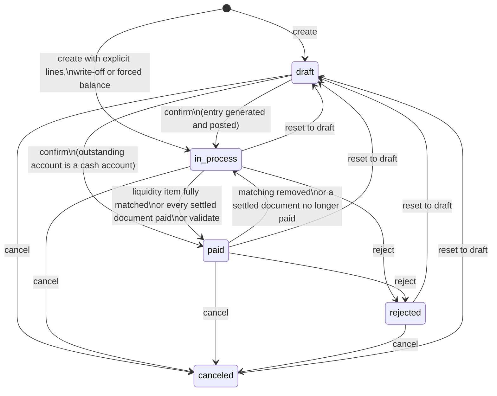
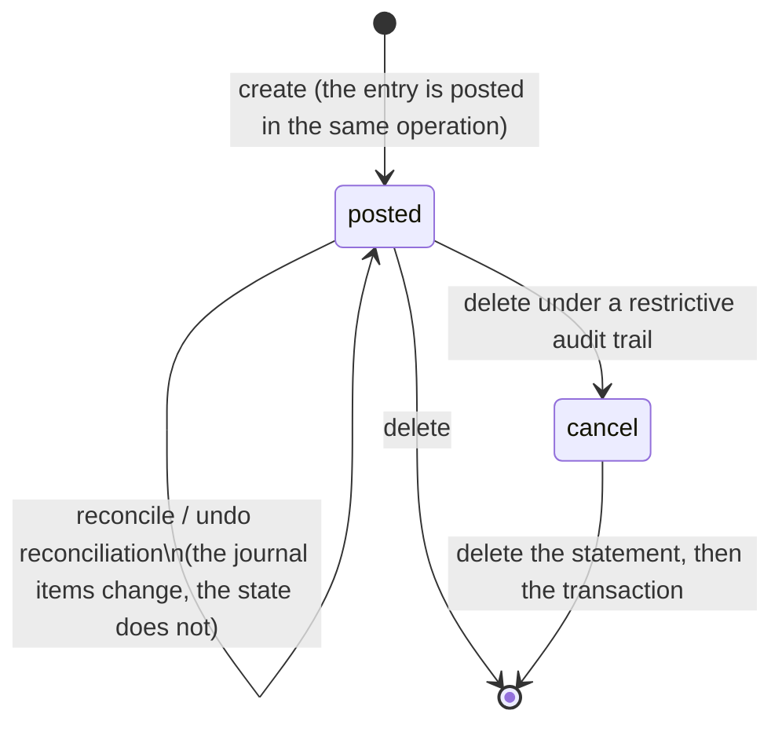
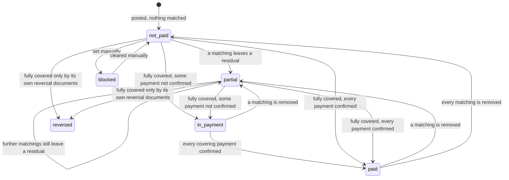
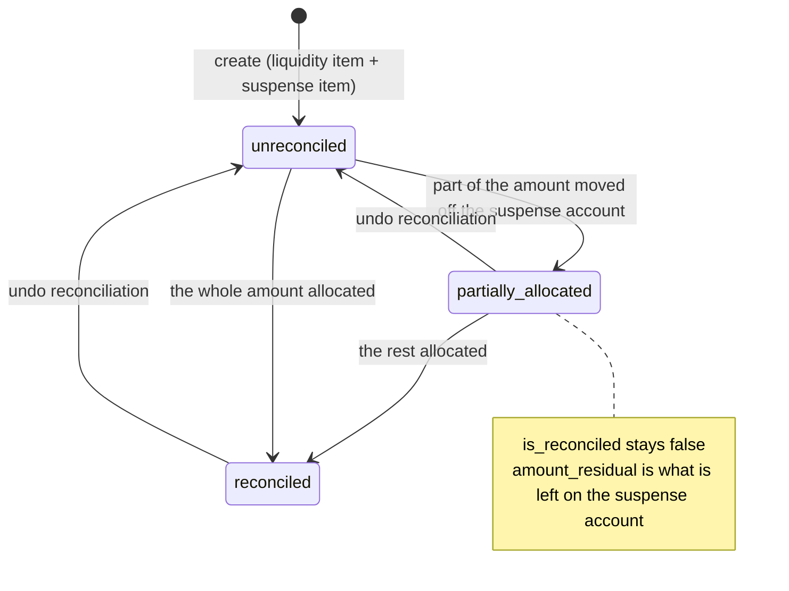

# State machines

This file specifies every state field owned or driven by the payments and bank reconciliation domain: the states with their stored value, their label and their meaning; the transitions with their trigger, their guard and their side effects; and a diagram for each machine.

Four machines are described.

1. The **Payment state** (`state` on `account.payment`) — the business state of a movement of money.
2. The **entry state behind a Bank Transaction** (`state` on the `account.move` delegated by `account.bank.statement.line`) — how a bank transaction is created, cancelled and deleted.
3. The **reconciliation status of a Payment** (`is_reconciled` and `is_matched`) — two derived flags that together tell whether the documents are settled and whether the bank has confirmed the money.
4. The **payment state of a settled document** (`payment_state` on `account.move`) — the state this domain drives on invoices and bills. Its full definition belongs to `../accounts-receivable/`, but the part driven by reconciliation and by Payments is specified here because it is the observable result of everything this domain does.

A fifth, simpler machine — the reconciliation status of a Bank Transaction (`is_reconciled` with its residual) — is specified at the end.

---

## 1. Payment state

Field `state` on Payment (`account.payment`). Required, default `draft`, tracked in the message history, not copied when the record is duplicated. It is a computed field that is also stored and writable: the computation can raise the state, and operations write it directly.

### 1.1 States

| Value | Label | Meaning |
|---|---|---|
| `draft` | Draft | The movement is described but not committed. Normally there is no Journal Entry yet. Nothing has been reconciled. The movement has no number. |
| `in_process` | In Process | The movement is committed. A posted Journal Entry exists (unless the payment method has no outstanding account at all). The money has left or entered the company's books but the bank has not confirmed it: the liquidity journal item still carries a residual on the outstanding account. |
| `paid` | Paid | The money is confirmed. Either the outstanding amount has been matched with a bank transaction, or the liquidity account is not reconcilable so there is nothing to confirm, or every document the Payment settles is itself fully paid. |
| `canceled` | Canceled | The movement was abandoned. Draft entries were deleted; posted entries were cancelled. |
| `rejected` | Rejected | The movement was refused by the outside world (a returned direct debit, a bounced check, a declined card). |

### 1.2 The computation

Whenever the payment state of a reconciled document changes, or the residual of any journal item of the Payment's entry changes, the state is recomputed as follows, in this exact order:

1. If the state is empty, set it to `draft`.
2. If the Payment has a Journal Entry **and** its current state is `paid` or `in_process`: split the entry's journal items into liquidity, counterpart and write-off groups (see step 3 of `accounting-effects.md`, section *Splitting a payment entry*). Then set the state to `paid` when **either** the sum of the residuals of the liquidity items is zero in the company currency, **or** none of the accounts of the liquidity items is reconcilable; otherwise set it to `in_process`.
3. If the state is now `in_process` **and** the Payment has at least one reconciled document (an invoice or a bill), **and** every one of those documents has payment state `paid`, set the state to `paid`.

Consequences worth stating explicitly:

- A Payment in `draft`, `canceled` or `rejected` is never moved by this computation. Only `in_process` and `paid` are recomputed, and they can move in both directions between each other.
- A Payment whose liquidity account is a plain bank account rather than an outstanding account is `paid` as soon as it is confirmed, because a non-reconcilable liquidity account has nothing to match.
- Deleting the partial reconciliations that confirmed a Payment pushes it back from `paid` to `in_process`, because the residual of the liquidity item reappears.

### 1.3 Transition table

| From | To | Trigger operation | Guard conditions | Side effects |
|---|---|---|---|---|
| — | `draft` | create a Payment | — | Journal, company, currency, method line, outstanding account and destination account are computed. No Journal Entry. No number. |
| — | `in_process` | create a Payment with explicit write-off values, an explicit forced balance, or explicit journal item values | An outstanding account must resolve, otherwise the creation fails with the missing-outstanding-account message | The Journal Entry is generated immediately with those values and the Payment is linked to it. Related fields passed at creation that belong to the entry are written onto the entry. |
| `draft` | `in_process` | *Confirm* | If a recipient bank account is required for the method, the direction is outbound and the account is not trusted, the operation is refused (see below) | The outstanding account of a cash-type account short-circuits to `paid` (next row). Otherwise: nothing else happens at this point; the entry is created and posted by the write that carries the state. |
| `draft` | `paid` | *Confirm* | The outstanding account's type is `asset_cash` | Same as above; the Payment is considered settled at once. |
| `draft` or `in_process` | `in_process` | write the state to `in_process` or `paid` without supplying an entry | — | For every Payment that has no entry: generate the Journal Entry; then post every generated entry that is still in draft. |
| `in_process` | `paid` | reconciliation of the liquidity item with a bank transaction, or the last settled document becoming paid | See the computation above | The Payment's number is (re)computed; the settled documents' payment state is recomputed. |
| `paid` | `in_process` | unreconciliation of the liquidity item, or a settled document ceasing to be paid | See the computation above | Same recomputations in reverse. |
| `in_process` | `paid` | *Validate* | — | Writes the state directly. Used by flows where the confirmation of the money does not come from a reconciliation. |
| `in_process` or `paid` | `rejected` | *Reject* | — | Writes the state directly. The Journal Entry is untouched; the caller is expected to reverse or cancel it separately. |
| any except `canceled` | `canceled` | *Cancel* | — | Draft entries of the Payment are deleted; the remaining entries are cancelled. |
| any | `draft` | *Reset to draft* | — | The state is written to `draft` and the Journal Entry is reset to draft by the general ledger's reset operation, with all its own guards (lock dates, hash chain, audit trail). |
| any | (deleted) | delete the Payment | — | Non-draft entries are first reset to draft, then all entries are deleted, then the Payment; the payment state of the previously reconciled documents is forced to recompute. |

### 1.4 Guard on confirmation

Confirming an outbound Payment whose method requires a recipient bank account, when that account is not trusted for outgoing payments, is refused with:

> To record payments with <the method name>, the recipient bank account must be manually validated. You should go on the partner bank account of <the counterparty name> in order to validate it.

### 1.5 Diagram

### 1.6 The number

The Payment's number is not a state but it changes with the state, so it is specified here.

- It is recomputed whenever the Journal Entry's name changes or the state changes.
- It is only assigned when the Payment already exists in the database **and** the state is `in_process` or `paid` **and** either it has no number yet or it has an entry whose number differs from it.
- The value taken is the Journal Entry's number when the entry has one. A Payment without an entry — which happens when the payment method has no outstanding account, so no accounting is produced — instead draws the next value of the dedicated payment sequence in the Payment's company, for the Payment's date.
- A Payment therefore keeps no number at all while it is in `draft`, and its display name is the text "Draft Payment".

---

## 2. Entry state behind a Bank Transaction

A Bank Transaction delegates to a Journal Entry, so the Journal Entry's three-state machine (`draft`, `posted`, `cancel`) applies, but this domain constrains it sharply.

### 2.1 States as used here

| Value | Label | Meaning for a Bank Transaction |
|---|---|---|
| `draft` | Draft | Only ever transient. The creation flow posts the entry in the same operation, so a Bank Transaction is never observed in draft under normal use. A transaction in draft is excluded from the statement date, from the computed balance and from the running balance. |
| `posted` | Posted | The normal state. The transaction counts towards the running balance, the statement's computed balance and the statement's date. |
| `cancel` | Cancelled | The transaction is void. It does not count towards any balance, but it is still used as an anchor for contiguity: a cancelled transaction found inside a range being grouped into a statement is silently added to the selection so the run stays unbroken. |

### 2.2 Transition table

| From | To | Trigger | Guard | Side effects |
|---|---|---|---|---|
| — | `draft` then immediately `posted` | create a Bank Transaction | The journal must have a suspense account, unless an explicit counterpart account is supplied: otherwise "You can't create a new statement line without a suspense account set on the <journal> journal." | The liquidity and suspense journal items are created; the entry is pointed back at the transaction; the entry's numbering is scheduled; the entry is posted. |
| `posted` | `cancel` | delete a Bank Transaction of a company with a restrictive audit trail | The transaction must not belong to a statement that is both valid and complete | The entry is cancelled instead of deleted; the transaction record itself is deleted. |
| `posted` | (deleted) | delete a Bank Transaction of a company without a restrictive audit trail | Same guard | The transaction is deleted first, then the entry is force-deleted. |
| `posted` | `posted` | undo reconciliation | If the transaction is checked and reconciled and the user may not review entries: "Validated entries can only be changed by your accountant." | Every matching on the entry's items is removed; auto-generated Payments are deleted; the entry's journal items are cleared and the default liquidity and suspense pair recreated; the checked flag is set to whether the user may review. |

### 2.3 Diagram

### 2.4 The checked flag

A Journal Entry carries a boolean *checked* flag, which for a Bank Transaction means "an accountant has reviewed this transaction". It behaves like a state for the purposes of this domain:

| Value | Effect |
|---|---|
| not checked | The transaction is counted in the *to check* figure of the liquidity journal dashboard, with its amount. Its residual is taken to be the whole transaction amount (negated), regardless of what the journal items say. |
| checked | The transaction is counted in the *to reconcile* figure when it is not yet reconciled. Its residual is computed from the suspense journal items. |

Undoing a reconciliation sets the flag to whether the current user is able to review the entry: an accountant keeps the transaction checked, a non-accountant leaves it unchecked for review.

---

## 3. Reconciliation status of a Payment

Two stored boolean fields together describe where a Payment stands. Both are recomputed whenever a residual, an account or the state changes.

### 3.1 The two flags

| Flag | Question it answers |
|---|---|
| `is_reconciled` | Have the **documents** been settled? That is: do the counterpart and write-off journal items, on the receivable or payable side, have nothing left to match? |
| `is_matched` | Has the **bank** confirmed the money? That is: does the liquidity journal item, on the outstanding account, have nothing left to match? |

### 3.2 Computation, in order

1. If the Payment has no outstanding account: `is_reconciled` is false, and `is_matched` is true exactly when the state is `paid`.
2. Otherwise, if the Payment has no currency, or no database identifier, or no Journal Entry: both flags are false.
3. Otherwise, if the amount is zero in the payment currency: both flags are true.
4. Otherwise:
   - Choose the residual to look at: the company-currency residual when the payment currency equals the company currency, the foreign-currency residual otherwise.
   - `is_matched`: true when the journal's default account exists and is among the accounts of the liquidity items — this is the case of a user who records payments directly on the bank account and never uses statements — otherwise true when the sum of the chosen residual over the liquidity items is zero in the payment currency.
   - `is_reconciled`: true when the sum of the chosen residual over the counterpart and write-off items **that sit on a reconcilable account** is zero in the payment currency.

### 3.3 The four combinations

| `is_reconciled` | `is_matched` | Situation |
|---|---|---|
| false | false | The Payment is committed but nothing has been matched: the invoice is still open and the bank has not confirmed. |
| true | false | The invoice is settled but the money is still in the outstanding account. This is the classic "in payment" situation. |
| false | true | The bank has confirmed the movement but it has not yet been allocated to a document. This happens when a bank transaction creates a Payment that is not yet attributed. |
| true | true | Fully settled on both sides. |

---

## 4. Payment state of a settled document

Field `payment_state` on Journal Entry (`account.move`). It is a stored, read-only, tracked, non-copied selection. This domain drives it; the field itself belongs to `../accounts-receivable/`. It is specified here because it is the visible result of reconciliation.

### 4.1 States

| Value | Label | Meaning |
|---|---|---|
| `not_paid` | Not Paid | Nothing has been matched against the document's receivable or payable lines, and no Payment claims it. |
| `in_payment` | In Payment | The document is fully covered but at least one of the Payments covering it has not been confirmed by the bank. This state only exists when the full accounting capability is present; otherwise the system reports `paid` instead (see the hook below). |
| `paid` | Paid | The document is fully covered and every Payment covering it is matched. |
| `partial` | Partially Paid | Something has been matched but a residual remains. |
| `reversed` | Reversed | The document was fully covered exclusively by its own reversal documents, not by money. |
| `blocked` | Blocked | Set manually to exclude the document from payment flows. A blocked document cannot be selected for payment registration. |
| `invoicing_legacy` | Invoicing App Legacy | A retained marker for documents outside the accounting scope; never produced by this domain. |

### 4.2 Computation

First, the documents are classified:

1. A document whose current payment state is `invoicing_legacy` keeps it.
2. A document whose current payment state is `blocked` keeps it.
3. A document *qualifies* when it is an invoice-like document (invoice, credit note or receipt, of either direction) **and** either it is posted, or it is a draft whose total is not zero in its currency.
4. Every non-qualifying document is set to `not_paid`.

Then, for each qualifying document, gather the matching facts. For every partial reconciliation touching one of the document's journal items, on either side, collect for the item: the account type, the entry types of the counterpart items' entries, whether every counterpart that comes from a Payment has that Payment matched, whether any counterpart comes from a Payment at all, and whether any counterpart comes from a Bank Transaction. Keep only the facts whose account type is `asset_receivable` or `liability_payable`.

Then decide, in this exact order:

1. Start from `not_paid`.
2. **If the document's residual is zero in its currency:**
   1. If any collected fact says a Payment or a Bank Transaction is involved:
      - if every fact says all its Payments are matched → `paid`;
      - otherwise → the *in-payment state* (see the hook below).
   2. Otherwise (the document was covered only by other documents, never by money):
      - start from `paid`;
      - collect the set of entry types of all counterparts;
      - if the document is an incoming invoice or incoming receipt and the counterpart types are exactly {incoming credit note} or {incoming credit note, plain entry} → `reversed`;
      - if the document is an outgoing invoice or outgoing receipt and the counterpart types are exactly {outgoing credit note} or {outgoing credit note, plain entry} → `reversed`;
      - if the document is a plain entry, an outgoing credit note or an incoming credit note and the counterpart types are exactly {plain entry} → `reversed`.
3. **Else, if the document is posted and at least one Payment claims it through the document's matched-payments relation, has no Journal Entry of its own, and is `in_process`** → the in-payment state.
4. **Else, if any matching fact was collected** → `partial`.
5. **Else, if the document is posted and at least one Payment claims it through the matched-payments relation, has no Journal Entry of its own, and is `paid`** → the in-payment state.

Steps 3 and 5 cover payment methods that produce no accounting at all: there is nothing to reconcile, so the document's state is driven directly by the Payment's own state.

### 4.3 The in-payment hook

The *in-payment state* is produced by a hook that returns either `in_payment` or `paid`. In the base accounting capability it returns `paid`: users who only invoice do not want to see an intermediate state. When the full accounting capability is installed it returns `in_payment`. Two other rules read this hook:

- The list of *valid payment states* used when judging whether a Payment settles something is `['in_process', 'paid']` when the hook returns `paid`, and `['in_process']` otherwise.
- On creating a Payment, when the hook returns `paid` (meaning the full accounting capability is absent) and the Payment has no outstanding account, an outstanding account is forced onto the Payment so that a Journal Entry is produced anyway. Without it there would be no way to reconcile the bank statement with the invoice.

### 4.4 Diagram

---

## 5. Reconciliation status of a Bank Transaction

Field `is_reconciled` on Bank Transaction, with its companion `amount_residual`. Both are stored and recomputed whenever the journal, the currency, the amounts, the checked flag, or any account, foreign amount, residual, currency or matching of the entry's journal items changes.

### 5.1 Computation

**Residual first.** Split the entry's journal items into liquidity, suspense and other (the rule is in `entities.md`). Then:

1. If the transaction is **not checked**: the residual is minus the foreign amount when the transaction has a foreign currency, and minus the plain amount otherwise. The journal items are ignored entirely, because an unchecked transaction may have been altered by an automatic proposal that has not been accepted.
2. Else, if the suspense items sit on a reconcilable account: the residual is the sum of the *foreign-currency residuals* of the suspense items.
3. Else: the residual is the sum of the *foreign-currency amounts* of the suspense items.

**Then the flag:**

1. A transaction that has no database identifier yet is not reconciled — its journal items do not exist.
2. If there is at least one suspense item: the transaction is reconciled exactly when the residual is zero in the currency of the suspense items.
3. Else, if the transaction amount is zero in the journal currency: reconciled.
4. Else: reconciled. Reaching this branch means the entry has no suspense item left at all, which is only possible once every side has been allocated to a real account.

### 5.2 What changes the flag

| Event | Effect |
|---|---|
| A reconciliation model or a manual allocation replaces the suspense item with real counterpart items | The suspense group empties, the residual falls to zero, the flag becomes true. |
| A partial allocation leaves part of the amount on the suspense account | The residual shrinks but stays non-zero, the flag stays false. |
| The suspense account is reconcilable and the suspense item is matched with an open receivable item | The residual is read from the item's own residual and falls to zero when the match is complete. |
| Undo reconciliation | The journal items are rewritten as the default liquidity and suspense pair; the residual returns to the full transaction amount; the flag becomes false. |
| The checked flag is cleared | The residual reverts to the full transaction amount regardless of the journal items. |

### 5.3 Diagram

