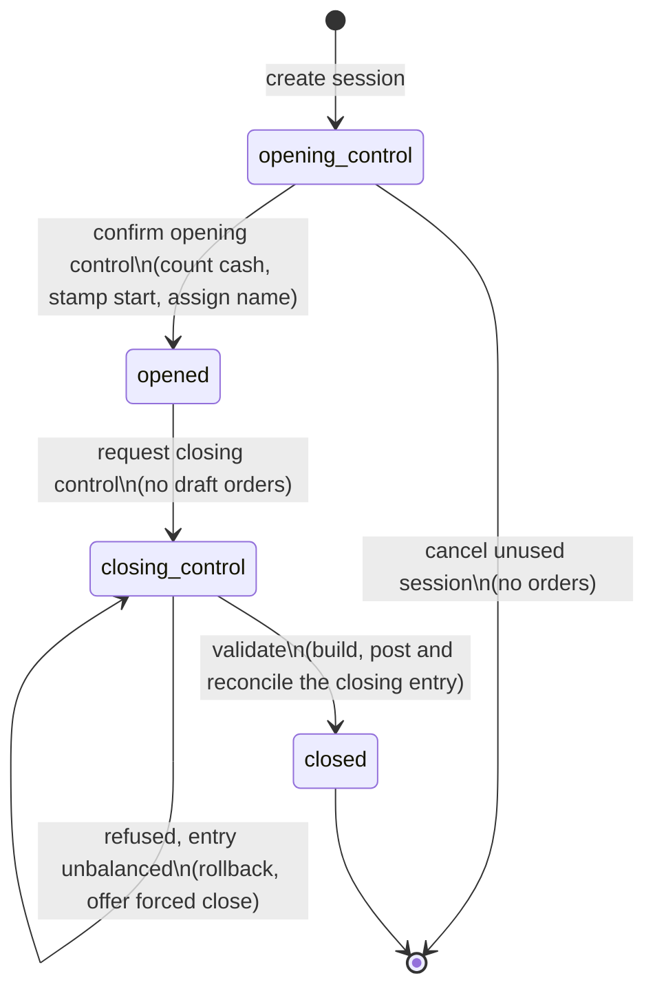
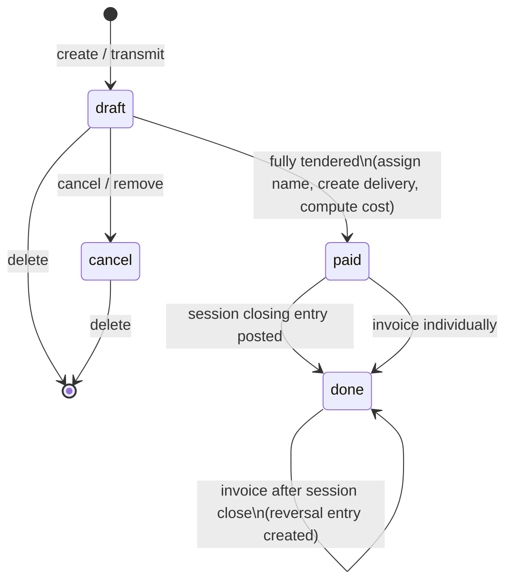
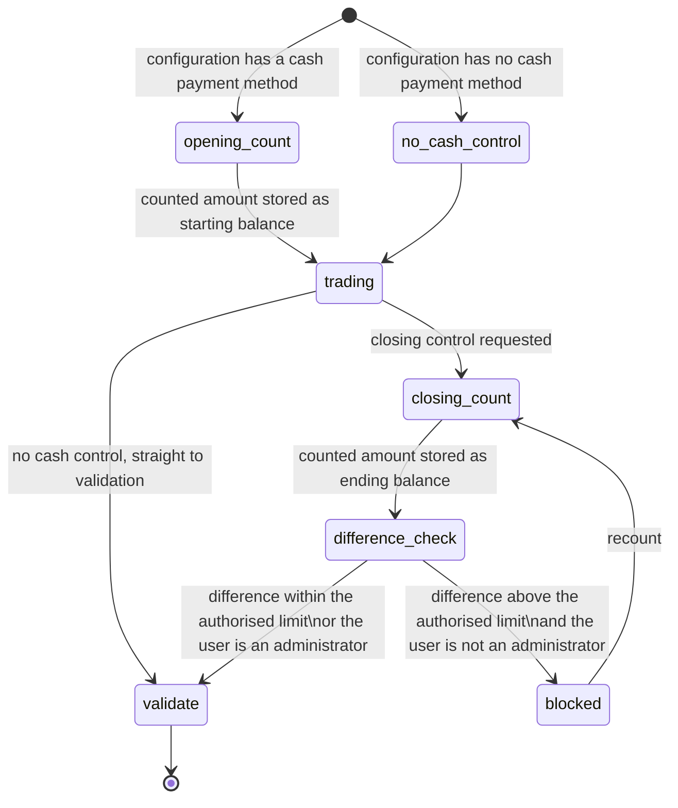
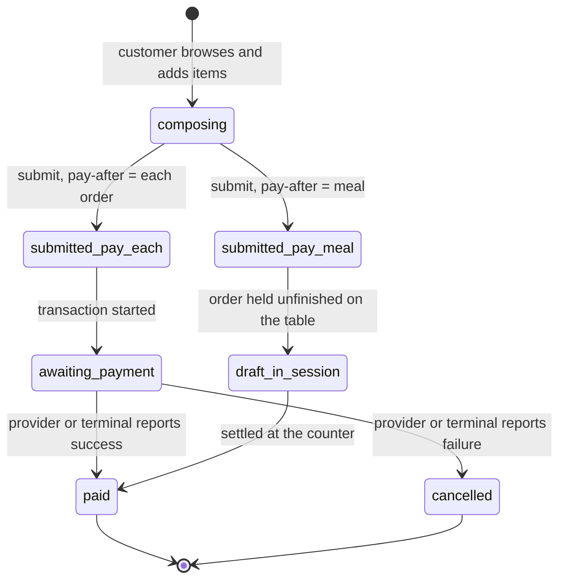

# Point of Sale — State Machines

This file specifies every state field of the domain: the possible values, their meaning,
the transitions between them, the operation that triggers each transition, the guards that
must hold, and the side effects the transition produces.

---

## 1. Point of Sale Session state

**Field** `state` (the session status) on Point of Sale Session (`pos.session`, table
`pos_session`). Required, read-only through the interface, indexed, not copied, default
`opening_control`.

### 1.1 States

| Value | Label | Meaning |
| --- | --- | --- |
| `opening_control` | Opening Control | The session record exists but trading has not begun. The cashier is being asked to count the cash drawer. The session has no name yet (its name is the single character `/`) and no opening instant. |
| `opened` | In Progress | Trading. Orders may be created, paid, refunded and invoiced. The opening instant is stamped and the session carries its final name. |
| `closing_control` | Closing Control | Trading has stopped. The closing instant is stamped. The cashier is being asked to count the cash drawer. No new order may be transmitted against this session; an incoming order is re-homed to another open session of the same configuration. |
| `closed` | Closed & Posted | The closing entry has been created, posted and reconciled. The session is final. |

### 1.2 Transition table

| From | To | Trigger | Guards | Side effects |
| --- | --- | --- | --- | --- |
| — | `opening_control` | Creating a session | A configuration must be supplied, either directly or through the acting context; otherwise *"You should assign a Point of Sale to your session."* Only one non-closed, non-rescue session may exist for the configuration; otherwise *"Another session is already opened for this point of sale."* The starting date must not violate any lock date of the point of sale journal's company; otherwise *"You cannot create a session starting before: <lock date information>"*. | The deferred-stock flag is frozen from the company setting. When the configuration has cash control and the session is not a rescue session, the starting balance is pre-filled with the counted closing balance of the previous session (zero when there is none). A change-feed access token is generated. |
| `opening_control` | `opened` | Confirming the opening control with a counted amount and optional notes | The session must still be in opening control; otherwise the operation returns without doing anything. | The opening instant is stamped. The notes are stored. When the configuration has at least one cash method, the difference between the counted amount and the pre-filled starting balance is posted to the thread as three lines (difference, expected, counted), and the starting balance is overwritten with the counted amount. When there is no cash method but there are notes, the notes alone are posted. Finally the session receives its name from the session sequence. |
| `opening_control` | *(deleted)* | Cancelling an unused session | The session must be in opening control and have no order; otherwise *"You can only cancel a session that is in opening control state and has no orders."* | The session and its cash statement lines are deleted. |
| `opened` | `closing_control` | Requesting the closing control | No order of the session that is due now or earlier may be unfinished; otherwise *"You cannot close the POS while there are still draft orders for the day."* The session must not already be closed; otherwise *"This session is already closed."* | The closing instant is stamped (the existing one is kept when there already is one). If the configuration has no cash control, the session continues immediately to validation. For a rescue session with cash control, the counted ending balance is computed as the starting balance plus the cash payments of the non-draft, non-cancelled orders, and the session continues immediately to validation. |
| `opened` or `closing_control` | `closing_control` | Storing the counted cash | The session must not be closed, no unfinished order may exist, and the session must have a cash journal; otherwise *"There is no cash register in this session."* | The counted ending balance is stored. |
| `closing_control` | `closed` | Validating the session | Every guard of section 1.3 must hold. | Every side effect of section 1.4. |
| `closing_control` | `closing_control` | Validation refused because the closing entry does not balance | — | The whole transaction is rolled back and the forced-close wizard is offered, pre-filled with the unbalanced amount and the balancing account. |

### 1.3 Guards of the validation transition

The validation is attempted only when the session has at least one non-cancelled order due
now or earlier, or at least one cash statement line. Otherwise the only thing that happens
is that the cash difference is posted and the session is marked closed.

1. The session must not already be closed — *"This session is already closed."*
2. No order of the session may be unfinished — *"There are still orders in draft state in
   the session. Pay or cancel the following orders to validate the session: <order
   names>"*.
3. Every invoice of every closed order must be posted — *"You cannot close the POS when
   invoices are not posted.\nInvoices: <invoice number> - <state>"*, one per line.
4. Every tax line of the closing entry must resolve to an account — otherwise *"Unable to
   close and validate the session.\nPlease set corresponding tax account in each
   repartition line of the following taxes: \n<tax names>"*.
5. When a cash difference must be posted, the cash journal must carry a loss account for a
   negative difference — *"Please go on the <journal name> journal and define a Loss
   Account. This account will be used to record cash difference."* — and a profit account
   for a positive one — *"Please go on the <journal name> journal and define a Profit
   Account. This account will be used to record cash difference."*
6. When per-method bank differences are supplied, every journal concerned must carry the
   matching account — *"Need loss account for the following journals to post the lost
   amount: <journal names>"* and *"Need profit account for the following journals to post
   the gained amount: <journal names>"*.
7. The resulting closing entry must balance. When it does not, the transaction is rolled
   back and the forced-close wizard is offered instead of an error.

### 1.4 Side effects of the validation transition

In order:

1. The frozen cash transaction total is set to the sum of the amounts of the session's
   cash statement lines.
2. The cash difference before the closing statement lines is captured.
3. When the session defers stock updates, the deferred delivery documents are created and
   the cost of the not-yet-costed closed orders is computed from their moves.
4. The closing entry is created and populated (see
   [`accounting-effects.md`](accounting-effects.md)).
5. The balance of the closing entry is checked. If it is not zero, everything is rolled
   back and the forced-close wizard is returned.
6. The cash difference statement line is created (loss or profit).
7. If the closing entry has at least one line it is posted, and every order of the session
   still in the paid state becomes posted. If it has no line at all it is deleted.
8. The reconciliation plan is executed.
9. When order-edit tracking is on and at least one order was edited, a message listing the
   edited orders is posted in the session thread.
10. The scheduler is triggered on the moves of the session's transfers so that
    replenishment rules see the consumption.
11. The session state becomes closed; a closing notification is broadcast on the
    configuration's change feed.
12. All pending changes are flushed so that the sales analysis view is up to date.

### 1.5 Diagram



### 1.6 Rescue sessions

A rescue session is an ordinary session whose recovery flag is set. It exists because an
order may reach the server after its session has been closed. Rescue sessions:

- are excluded from the one-open-session-per-till constraint, so a rescue session and a
  normal session may coexist;
- are not counted as the current session of the configuration, but are counted in the
  has-active-session flag and in the rescue session counter;
- do not receive a pre-filled starting balance;
- when they have cash control, compute their counted ending balance automatically instead
  of asking for a count, so that they close without a cash difference;
- cannot be closed from the selling application; they are closed from the administrative
  interface.

---

## 2. Point of Sale Order state

**Field** `state` (the order status) on Point of Sale Order (`pos.order`, table
`pos_order`). Read-only, not copied, indexed, default `draft`.

### 2.1 States

| Value | Label | Meaning |
| --- | --- | --- |
| `draft` | New | Being composed or transmitted but not yet fully tendered. Lines and payments may be changed. The order may be cancelled or deleted. |
| `paid` | Paid | Fully tendered. The order name has been assigned. Lines may no longer be deleted. The order still awaits the session closing, or an individual invoice. |
| `done` | Posted | Either the session closing entry that includes this order has been posted, or the order has been invoiced individually. |
| `cancel` | Cancelled | Abandoned before payment. Excluded from every accounting aggregation. |

### 2.2 Transition table

| From | To | Trigger | Guards | Side effects |
| --- | --- | --- | --- | --- |
| — | `draft` | Creating an order, either in the browser or through transmission | The session must exist. When the session is in closing control or closed, the order is re-homed to the open session of the same configuration, or the creation is refused with *"No open session available. Please open a new session to capture the order."* | The receipt number, the tracking number and the session-unique sequence number are assigned. The pricelist, the fiscal position, the company and, when presets are used, the default preset are defaulted from the configuration. A universally unique identifier and a portal access token are ensured. |
| `draft` | `paid` | Transmitting the order with a non-draft state, or confirming the administrative payment wizard | The order must be fully tendered. Without cash rounding this means the paid amount equals the total exactly at currency precision; with cash rounding it means the difference between total and paid does not exceed the tolerance of section 2.3. Otherwise *"Order <name> is not fully paid."* | The order name is assigned from the receipt number, or as the refunded order's name followed by ` REFUND`. Change, when any, has already been recorded as a negative cash payment. The delivery document is created when the configuration works in real time. The cost of the lines is computed where possible. |
| `paid` | `done` | Posting the session closing entry | The closing entry must have at least one line and must have been posted. | The order is marked posted together with every other paid order of the session. |
| `paid` or `done` | `done` | Invoicing the order | The order must not be locked by a concurrent invoicing attempt; otherwise *"Some orders are already being invoiced. Please try again later."* | The state is set to posted before the invoice is built. The invoice is created and posted, the invoice-payment entries are created, the invoice is reconciled against them, and when the session was already closed a reversal entry is created to take the order back out of the closing entry. |
| `draft` | `cancel` | Cancelling the order, or removing it from the selling application | For a cancellation started from the administrative interface, no selected order may have a scheduled date in the future; otherwise *"The order delivery / pickup date is in the future. You cannot cancel it."* At least one selected order must be unfinished; otherwise *"This order has already been paid. You cannot set it back to draft or edit it."* | The order state becomes cancelled and a synchronisation notification is broadcast on the configuration's change feed so that every connected device drops the order. |
| `cancel` or `draft` | *(deleted)* | Deleting the order | The order must be unfinished or cancelled; otherwise *"In order to delete a sale, it must be new or cancelled."* | An unfinished order is cancelled first so that the notification is sent, then deleted. |

Any attempt to write a state other than paid, posted or invoiced onto an order that is
already in one of those states is refused with *"This order has already been paid. You
cannot set it back to draft or edit it."*

### 2.3 The fully-paid test

Let `total` be the order total and `paid` the sum of the payment amounts.

Without cash rounding, or with cash rounding restricted to cash tenders and no cash tender
present:

```formula
is_paid  ⟺  round_to_currency( total − paid ) = 0
```

With cash rounding in force:

```formula
rounded_total = round( total , step = rounding_step , method = rounding_method )
```

```formula
is_paid  ⟺  round_to_currency( rounded_total − paid ) = 0
```

If that test fails, a tolerance is allowed:

```formula
tolerance = round_to_currency( rounding_step ÷ 2 )      when the rounding method is round-half-up
tolerance = round_to_currency( rounding_step )          otherwise
```

```formula
is_paid  ⟺  | round_to_currency( total − paid ) |  ≤  tolerance
```

**Worked example.** Rounding step 0.05, method round-half-up, total 12.13, paid 12.15.
Rounded total = 12.15, so the first test already succeeds. With paid 12.10 the first test
fails (12.15 − 12.10 = 0.05) but the tolerance is 0.025 and the raw difference is
12.13 − 12.10 = 0.03, which exceeds it, so the order is refused as not fully paid.

### 2.4 Diagram



### 2.5 Interaction between the order state and the session state

- A session cannot leave the opened state while any of its orders due now or earlier is
  unfinished.
- Orders scheduled for a later time are *detached* from the session when the session is
  closed from the selling application: their session link is emptied so that they survive
  into the next session.
- An order transmitted against a session in closing control or closed is re-homed to the
  open session of the same configuration; the event is recorded in the server log together
  with the closed session's name and identifier, the order's universally unique identifier
  and its total.
- When an order is invoiced after its session has closed, the order is already posted; the
  invoice creates its own payment entries and a reversal entry removes the order's
  contribution from the closing entry.

---

## 3. Invoice status of an order

**Field** `invoice_status` on Point of Sale Order. Computed, not stored, derived solely
from whether an invoice exists.

| Value | Label | Condition |
| --- | --- | --- |
| `invoiced` | Fully Invoiced | The invoice link is filled. |
| `to_invoice` | To Invoice | The invoice link is empty. |

There is no partial value: a counter order is either wholly invoiced or not invoiced at
all. The separate to-invoice flag records the *intention* to invoice, captured at the
counter; the invoice status records the *fact*.

---

## 4. Payment status of a tender

**Field** `payment_status` on Point of Sale Payment. A free-text field written by the
terminal integration, not a controlled selection at the platform level. The values used by
the terminal integrations are, by convention:

| Value | Meaning |
| --- | --- |
| `pending` | The terminal has been asked and has not answered yet. |
| `waiting` | The terminal is waiting for the customer to present a card or confirm. |
| `waitingCard` | The terminal is waiting for the card specifically. |
| `waitingCancel` | A cancellation has been requested and is not confirmed yet. |
| `retry` | The attempt failed and may be retried. |
| `done` | The terminal reported success. |
| `reversed` | The tender was reversed on the terminal. |
| `cancelled` | The attempt was abandoned. |
| `force_done` | The cashier declared the tender successful without a terminal answer. |

Rules attached to these values:

- A payment whose status is anything other than `cancelled` may not be added to or changed
  on an order that has already been printed at least once: *"You cannot change the payment
  of a printed order."*
- When the configuration validates terminal payments automatically, reaching `done`
  immediately triggers the order validation.

---

## 5. Cash control sub-state

Cash control is not a stored state; it is a pair of decisions taken at the two ends of the
session.



The authorised limit is only applied when the configuration's maximum-difference flag is
set; the limit itself is the configuration's authorised difference. The check is performed
in the selling application, which is told both the limit and whether the acting user is an
administrator.

---

## 6. Delivery document state as seen from the counter

The transfer state machine belongs to the
[inventory operations domain](../inventory-operations/README.md). The counter drives it as
follows.

| Situation | What the counter does | Resulting transfer state |
| --- | --- | --- |
| Real-time stock update, goods handed over now | Create the transfer, create its moves, mark the moves picked, attempt to complete the transfer immediately. Any refusal (insufficient stock, missing lot) is swallowed. | `done` normally; the transfer is left in an earlier state when completion was refused, and the session then reports a failed transfer. |
| Deferred stock update, goods handed over now | Nothing at sale time. At session closing, one transfer per destination location covering every closed order that does not force real-time creation and has no shipping date. | Same as above. |
| Ship later | Launch the procurement rules for the shipping date instead of creating a transfer directly; confirm the resulting transfers; rebuild the move lines for tracked products without marking them done. | `confirmed`, `waiting` or `assigned` — the goods leave later. |
| Refund of goods that were never delivered, in full | Cancel the original transfer. | `cancel` |
| Refund of goods that were never delivered, in part | Reduce the demanded quantity of the matching moves; delete a move whose remaining quantity reaches zero; re-reserve the reduced moves. | `assigned` again |
| Refund of delivered goods | Create a transfer of the return operation type (falling back to the outgoing type with the source and destination swapped) and complete it. | `done` |

A transfer that could not be completed leaves the session's failed-transfer flag set and
is listed by the session's transfer action.

---

## 7. Accounting payment state for counter tenders

Accounting payments created at session closing follow the payment state machine of the
[payments domain](../payments-and-bank-reconciliation/README.md). The counter always
creates them already posted:

| Step | State |
| --- | --- |
| Created with amount, journal, forced outstanding account, destination account, memo, method, session and direction | `draft` |
| Posted immediately | `posted` |
| Amended for a per-method closing difference | briefly back to `draft`, the outstanding line is rewritten and a counterpart line is added, then `posted` again |

The direction is inbound when the aggregated amount is positive and outbound when it is
negative.

---

## 8. Self-ordering order lifecycle

Self-ordered transactions add a payment timing dimension on top of the ordinary order
state machine.

| Pay-after value | Flow |
| --- | --- |
| `each` "Each Order" | The customer must pay before the order is accepted. The order is created unfinished, an online payment transaction or a kiosk terminal payment is started, and the order only becomes paid when the payment succeeds. A failure leaves the order unfinished and it is cancelled. |
| `meal` "Meal" | The order is accepted unfinished and sent to preparation immediately. Payment happens later at the counter or through a payment link. Only available in mobile mode with table service and the restaurant capability. |



Each state change broadcasts an order-state-changed notification and a synchronisation
notification on the configuration's change feed, so that the counter, the kitchen display
and the other self-ordering devices all refresh.

---

## 9. Preparation (kitchen) change tracking

The order carries the last state that was sent to the preparation printers, as a
structured document with a metadata block holding the server date of that state. The
transition is not a state field but a comparison.

1. When the order is transmitted, the incoming last-preparation-change document is
   compared with the stored one.
2. If the stored document has no metadata block, the incoming one is accepted as is.
3. If the incoming document has no metadata block, the stored one is kept.
4. Otherwise the two server dates are compared. If the stored date is the later one, the
   incoming document is discarded, the stored one is kept, and the event is recorded in
   the server log as an outdated preparation change caused by a synchronisation problem.
5. Otherwise the incoming document is accepted and its server date is replaced by the
   current server time.

The delta actually printed is the difference between the order's current lines and the
accepted document: added quantities, removed quantities, changed notes and newly fired
courses.
