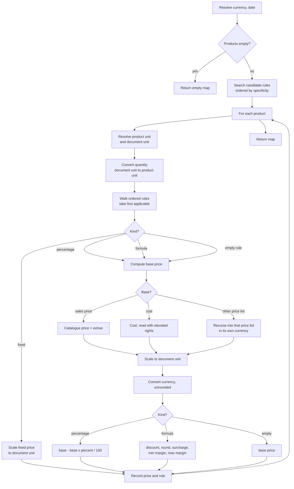

# Pricing and Price Lists — Calculations

This is the specification of the price engine. It is the single most consequential algorithm in
the selling and buying chain: every quotation line, every storefront price tag, every terminal
ticket line and every purchase order line is a call into it.

The file is organised so that a rebuild can be done top to bottom:

- sections 1 to 3 fix the notation, the precisions and the two conversion operations the engine
  borrows from other domains;
- section 4 states the engine's contract — inputs, outputs, invariants;
- sections 5 to 11 are the algorithm itself, in the order it executes: gather rules, order them,
  convert the quantity, test applicability, compute the base, apply the formula, convert units and
  currencies;
- section 12 contains the **mandatory worked examples**, each computed digit by digit;
- sections 13 to 16 cover the derived computations: the displayed price and the discount on a
  sales line, the price list selection chains, the vendor price selection and the purchase line
  price;
- sections 17 to 19 cover the margins in all their variants;
- section 20 covers the price list comparison report;
- section 21 collects the numerical pitfalls a rebuild will otherwise fall into.

Formulas are plain mathematics in fenced blocks. Quantities are named in words. Every formula is
followed by its rounding rule, its evaluation order and at least one worked numeric example.

---

## 1. Notation and named quantities

### 1.1 Symbols

Only these symbols appear in formulas: × (multiply), ÷ (divide), + (add), − (subtract), = (assign
or equal), and the named functions below. Comparison words are written out: "is greater than or
equal to", "is below".

### 1.2 Named functions borrowed from other domains

| Function | Full meaning | Specified in |
|---|---|---|
| `round_to_step( value , step )` | Round a number onto a multiple of a step, half away from zero, with the error-compensation term. | [Units of Measure and Packaging, section 2](../units-of-measure-and-packaging/calculations.md#2-the-rounding-function) |
| `round_to_currency( value , currency )` | `round_to_step( value , rounding_step_of_the_currency )`. The currency's rounding step is its own stored rounding, typically one hundredth. | [Multi-currency](../multi-currency/) |
| `convert_quantity( quantity , source_unit → destination_unit )` | Convert a **quantity**: multiply by the source unit's absolute factor, divide by the destination unit's absolute factor, then round onto the `Product Unit` step **away from zero** unless another method is named. | [Units of Measure and Packaging, section 6](../units-of-measure-and-packaging/calculations.md#6-the-quantity-conversion-algorithm) |
| `convert_price( price , source_unit → destination_unit )` | Convert a **price per unit**: multiply by the *destination* unit's absolute factor, divide by the *source* unit's absolute factor, **never round**. | [Units of Measure and Packaging, section 10](../units-of-measure-and-packaging/calculations.md#10-price-conversion) |
| `convert_currency( amount , source_currency → destination_currency , company , date , rounded )` | Multiply the amount by the rate of the destination currency on that date and divide by the rate of the source currency on that date; round onto the destination currency's step only when *rounded* is yes. | [Multi-currency](../multi-currency/) |

These four are **not restated here**. A rebuild must implement them exactly as their own domains
specify; the price engine's correctness depends on the *direction* of each conversion and on
whether each one rounds, and both are easy to get backwards. The two most important facts:

- **quantity conversion multiplies by the source factor; price conversion multiplies by the
  destination factor.** They pull in opposite directions, because a quantity has the unit in the
  numerator and a price has it in the denominator.
- **price conversion never rounds. Currency conversion inside the price engine never rounds
  either** — the engine always asks for the unrounded conversion. Rounding is the caller's
  business.

### 1.3 Named quantities used throughout

| Name | Meaning |
|---|---|
| product own unit | The unit of measure stored on the product template. Every monetary parameter on a price list rule is expressed per one of this unit. |
| document unit | The unit the caller asks the price in. Called the *target unit* in the algorithm. Defaults to the product own unit when the caller supplies none. |
| requested quantity | The quantity the caller supplies, expressed **in the document unit**. |
| matching quantity | The requested quantity converted into the product own unit. Used only to test a rule's minimum quantity. |
| pricing date | The instant used both for rule validity and for the currency rate. |
| target currency | The currency the result must be expressed in. |
| price list currency | The currency stored on the price list. |
| catalogue price | The product's sales price field, per the product own unit, in the product's currency. |
| cost | The product's cost field, per the product own unit, in the product's cost currency. |
| base price | The number a rule starts from, already expressed in the target currency and per the document unit. |
| suitable rule | The one rule the engine selected, or the empty rule when none applied. |

---

## 2. Precisions

### 2.1 The decimal precision records this domain uses

| Record name | Shipped digits | Governs |
|---|---|---|
| `Product Price` | 2 | The minimum display precision of the fixed price, the surcharge, the rounding step, the two margin bounds, the vendor unit price, the sales line unit price, the sales line cost and the sales line margin. |
| `Discount` | 2 | The sales line discount percentage and the vendor price discount percentage. |
| `Product Unit` | 2 | The price list rule minimum quantity, the vendor price minimum quantity, and the rounding of every quantity conversion. |

### 2.2 What "minimum display precision" means, and what it does not mean

A field declared with a *minimum display precision* of `Product Price` is stored as a full
double-precision number. The precision record only sets how many digits the user interface shows
and how many digits are written when the value is serialised for display. **It does not round the
stored value, and the price engine never rounds to it.**

This distinction matters. The engine can and does return prices with more than two decimals — a
price of one hundred divided by three units is thirty-three and a third, and the engine returns
thirty-three and a third, not thirty-three and thirty-three hundredths. Rounding to the currency
happens later, when the *document line* computes its subtotal, and that is specified in the sales
and purchasing domains, not here.

### 2.3 Where rounding does happen inside the engine

Exactly one place: **the rule's rounding step**, applied to the discounted price, in the formula
computation kind. Nowhere else. In particular:

| Step | Rounded? |
|---|---|
| Reading the catalogue price or the cost | No. |
| Adding the attribute extra price | No. |
| Converting a price between units | No — the price conversion operation never rounds. |
| Converting a price between currencies inside the base-price computation | **No** — the engine explicitly asks for the unrounded conversion. |
| Converting the requested quantity into the product own unit | **Yes** — onto the `Product Unit` step, away from zero. This is quantity conversion's own behaviour and the engine does not override it. |
| Applying the percentage discount | No. |
| Applying the rounding step | **Yes** — half away from zero, onto the configured step. |
| Adding the surcharge | No. |
| Applying the minimum and maximum margins | No. |
| Returning the price | No. |

---

## 3. The two unit conversions the engine performs, and their directions

The engine converts in **two opposite directions in the same call**, which is the single most
common rebuild error.

```formula
matching_quantity = convert_quantity( requested_quantity , document_unit → product_own_unit )
```

```formula
rule_parameter_in_document_unit = convert_price( rule_parameter , product_own_unit → document_unit )
```

The quantity goes **from the document unit to the product unit**, because the rule's minimum
quantity is stored in the product unit. The monetary parameters go **from the product unit to the
document unit**, because the rule stores them per the product unit but the answer must be per the
document unit.

| Concrete pair | Quantity direction | Price direction |
|---|---|---|
| Document in dozens, product in units | one dozen becomes twelve units | five per unit becomes sixty per dozen |
| Document in kilograms, product in tonnes | two thousand kilograms becomes two tonnes | one hundred per tonne becomes a tenth per kilogram |

The quantity conversion is called with **failure tolerated**: if the document unit and the product
unit belong to different unit trees, the conversion returns the requested quantity unchanged
instead of failing. The resulting match is meaningless but the engine does not abort. See section
21.6.

---

## 4. The engine's contract

### 4.1 The four entry points

All four are thin wrappers around one core operation. All four accept **at most one price list**:
the empty price list is legal and produces catalogue prices.

| Entry point | Inputs | Output |
|---|---|---|
| Price of one product | product, quantity, and optionally currency, unit, date | one number |
| Prices of several products | a set of products, quantity, and optionally currency, unit, date | a map from product identifier to number |
| Price and rule of one product | product, quantity, and optionally currency, unit, date | a pair: the number and the rule identifier |
| Rule only of one product | product, quantity, and optionally currency, unit, date | the rule identifier (the price computation is skipped entirely and a placeholder of zero is produced internally) |

A fifth, multi-price-list operation exists: given several price lists (or none, meaning *all* of
them) and one product, it returns a map from product identifier to a map from price list
identifier to a pair of price and rule. It simply loops the core operation once per price list.

### 4.2 Inputs of the core operation

| Input | Required | Default when omitted |
|---|---|---|
| price list | No — an empty price list is allowed | none; the engine then behaves as "no rules at all" |
| products | Yes; may be product templates or product variants, and may be several | — |
| quantity | Yes; expressed in the document unit | — |
| currency | No | the price list's currency; if there is no price list, the acting company's currency |
| unit | No | each product's own unit, decided **per product** |
| date | No | the current instant |
| compute price | No | yes; when no, the price is not computed and zero is returned beside the rule |

### 4.3 Outputs

A map from product identifier to a pair:

```
( price , rule_identifier )
```

where the rule identifier is the identifier of the suitable rule, or the empty value when no rule
applied. The price is expressed **in the target currency, per one of the document unit, excluding
taxes**.

### 4.4 Invariants a rebuild must preserve

1. **The engine is pure.** It reads products, rules and currency rates. It writes nothing, logs
   nothing, and raises no business error. The only way it can fail is a programming error
   (more than one currency supplied, more than one unit supplied).
2. **Exactly one currency.** The supplied currency must be exactly one record; more than one is a
   programming error and must fail loudly.
3. **Exactly one price list.** The price list argument must hold at most one record.
4. **One rule per product.** Each product gets the first applicable rule in the ordering, and only
   that rule. Rules never combine within a price list. Layering is achieved only through the
   "other price list" base.
5. **Empty product set returns an empty map**, before any rule is fetched.
6. **The unit is decided per product.** When several products are priced in one call and no unit
   was supplied, each product is priced in its own unit — the map's values are then not
   comparable with each other, which is correct and intended.
7. **The date is resolved once** for the whole call and is used for rule validity, for the currency
   rate, and for every recursive call into another price list.

---

## 5. Step one — gather the candidate rules

### 5.1 Preconditions

- The price list holds at most one record.
- The target currency is resolved: the supplied currency, else the price list's currency, else the
  acting company's currency. It must be exactly one record.
- If the product set is empty, return the empty map immediately.
- If no date was supplied, the pricing date becomes the current instant.

### 5.2 The search

When the price list is empty, the candidate set is empty and the algorithm proceeds with no rules.

Otherwise the engine performs **one** search over price list rules, for the whole product set at
once, with this filter — all conditions joined by "and":

1. the rule's price list is this price list;
2. **and** the rule has no category, **or** the rule's category is the category of one of the
   products or an ancestor of it;
3. **and** the rule has no product template, **or** the rule's product template is one of the
   templates involved;
4. **and** the rule has no product variant, **or** the rule's product variant is one of the
   variants involved;
5. **and** the rule has no start date, **or** its start date is at or before the pricing date;
6. **and** the rule has no end date, **or** its end date is at or after the pricing date.

"The templates involved" and "the variants involved" depend on what was passed:

| The products are | Condition 3 tests | Condition 4 tests |
|---|---|---|
| product templates | the rule's template is one of the given templates | the rule's variant belongs to one of the given templates |
| product variants | the rule's template is one of the templates of the given variants | the rule's variant is one of the given variants |

### 5.3 Properties of this filter

- **The date test is inclusive at both ends.** A rule valid from the sixth of April at nine in the
  morning applies at exactly nine in the morning. A rule valid to the ninth of April at noon
  applies at exactly noon.
- **The date test compares instants, not days.** A rule whose window is the sixth of April at nine
  in the morning to the ninth of April at noon does not apply on the fifth of April at eight in
  the morning, and does apply on the sixth of April at ten in the morning.
- **The category test uses the ancestor relation**, so a rule on a parent category is a candidate
  for a product in a child category. The applicability test of section 7 repeats the check with
  the materialised path, which is the authoritative version.
- **The minimum quantity is not in this filter.** Quantity is tested per product, after the
  quantity conversion, because the conversion depends on the product's own unit.
- **Archival is not in this filter.** A rule pointing at an archived product is still found and is
  still applied. Only the price list *form* hides it.
- One search serves the whole product set; the per-product work is then pure in-memory filtering.

### 5.4 Failure conditions

None. An empty candidate set is a normal outcome and leads to catalogue pricing.

---

## 6. Step two — order the candidate rules

The search returns the rules **in the entity's stored ordering**, which is the specificity order:

```
applied_on ascending, then min_quantity descending, then categ_id descending, then id descending
```

### 6.1 Why ascending order on the level gives most-specific-first

The stored selection values are deliberately prefixed with a digit:

| Stored value | Level | Sorts |
|---|---|---|
| `0_product_variant` | one variant | first |
| `1_product` | one template | second |
| `2_product_category` | one category and its descendants | third |
| `3_global` | all products | last |

Ascending alphabetic ordering of those four strings is exactly most-specific-first. A rebuild that
stores the level as an enumeration must reproduce this ordering explicitly, not rely on the order
in which the enumeration happens to be declared.

### 6.2 Why descending order on the minimum quantity gives quantity breaks

Within one level, the largest minimum quantity is tried first. Because the engine stops at the
**first** applicable rule, the largest break the quantity satisfies is the one that wins.

Consider three global rules on the same price list:

| Rule | Minimum quantity | Discount |
|---|---|---|
| A | 100 | 20 % |
| B | 10 | 10 % |
| C | 0 | 0 % |

Order: A, B, C. For a quantity of five, A fails, B fails, C applies — no discount. For a quantity
of fifty, A fails, B applies — ten per cent. For a quantity of two hundred, A applies — twenty per
cent. The breaks work without any explicit "find the largest satisfied break" step.

**A rebuild that sorts the minimum quantity ascending will always return the smallest break and
will silently undercharge or overcharge every bulk order.**

### 6.3 The two tie-breaks

- **Category, descending by identifier.** Within one level and one minimum quantity, the rule
  whose category has the larger identifier wins. Because a child category is usually created after
  its parent, this *usually* prefers the deeper category — but the comparison is on the
  identifier, not on the depth. A rebuild must compare identifiers. A category tree built by
  importing children before parents will select differently, and that difference is faithful
  behaviour, not a bug to be fixed.
- **Identifier, descending.** The final tie-break. The most recently created rule wins among
  otherwise indistinguishable rules.

### 6.4 Determinism

The ordering is total (the identifier is unique), so rule selection is fully deterministic for a
given set of rules, product, quantity, unit and date.

---

## 7. Step three — per product: convert the quantity and test applicability

This runs once per product in the call.

### 7.1 Resolve the units

```formula
product_own_unit = the unit stored on the product (for a variant, the unit of its template)
document_unit    = the unit supplied by the caller , or product_own_unit when none was supplied
```

### 7.2 Convert the quantity

```formula
matching_quantity = requested_quantity                                         if document_unit = product_own_unit
matching_quantity = convert_quantity( requested_quantity ,
                                      document_unit → product_own_unit ,
                                      tolerate_failure = yes )                 otherwise
```

The equality short-circuit is explicit in the algorithm and matters: when the two units are the
same record the requested quantity is used **with no rounding at all**, whereas going through the
conversion would round it onto the `Product Unit` step. A requested quantity of two and four
hundred thirty-three thousandths in the product's own unit stays two and four hundred thirty-three
thousandths; the same quantity converted from another unit would become two and forty-three
hundredths.

Failure is tolerated: if the two units share no ancestor, the conversion returns the requested
quantity unchanged.

### 7.3 Test the rules in order

Walk the ordered candidate list and take the **first** rule for which every one of the following
holds. Stop at the first success. If the list is exhausted, the suitable rule is the **empty
rule**.

The test, in the exact order the implementation evaluates it — the order matters because the
branches are mutually exclusive:

1. **Minimum quantity.** If the rule has a non-zero minimum quantity **and** the matching quantity
   is below it, the rule fails. (A minimum quantity of zero is treated as "no condition", not as
   "quantity must be at least zero"; the two differ for a negative quantity, which a credit-note
   flow can produce.)
2. Otherwise, **if the rule's level is category**: the rule fails when the product has no
   category, or when the product's category is neither the rule's category nor a descendant of it.
   Descendancy is tested by asking whether the product category's materialised path **starts
   with** the rule category's materialised path.
3. Otherwise, **if the product being priced is a product template**:
   - level template: the rule fails unless the template is the rule's template;
   - level variant: the rule fails unless the template has **exactly one** variant and that
     variant is the rule's variant. This is the "a single-variant template accepts its own variant
     rule" concession.
4. Otherwise (the product being priced is a variant):
   - level template: the rule fails unless the variant's template is the rule's template;
   - level variant: the rule fails unless the variant is the rule's variant.
5. Level global: nothing further is tested; the rule applies.

### 7.4 Worked applicability cases

| Case | Rule | Product priced | Quantity | Outcome |
|---|---|---|---|---|
| Exact variant | level variant, variant = "Chair, red" | variant "Chair, red" | any | applies |
| Wrong variant | level variant, variant = "Chair, red" | variant "Chair, blue" | any | fails |
| Variant rule, template priced, one variant | level variant, variant = "Desk" (sole variant of template "Desk") | template "Desk" | any | applies |
| Variant rule, template priced, three variants | level variant, variant = "Chair, red" | template "Chair" | any | fails |
| Template rule, variant priced | level template, template = "Chair" | variant "Chair, blue" | any | applies |
| Parent category | level category, category = "Furniture", path `3/` | product in "Furniture / Office", path `3/7/` | any | applies, because `3/7/` starts with `3/` |
| Sibling category | level category, category = "Furniture / Office", path `3/7/` | product in "Furniture / Home", path `3/8/` | any | fails |
| Product with no category | level category, any category | product with no category | any | fails |
| Break not reached | minimum quantity 10 | any | matching quantity 9.99 | fails |
| Break exactly reached | minimum quantity 10 | any | matching quantity 10 | applies |

---

## 8. Step four — compute the base price

The base price is needed by the percentage kind and by the formula kind. The fixed kind never
computes it.

### 8.1 Choose the base

```formula
effective_base = the rule's base , or "sales price" when the rule is empty or its base is unset
```

### 8.2 Base "sales price" — the catalogue price

```formula
raw = catalogue_price_of_the_product + attribute_extra_price
raw = convert_price( raw , product_own_unit → document_unit )
source_currency = the product's currency
```

Details:

- For a **product template**, the catalogue price is the template's own sales price field, and the
  attribute extra price is the sum of the extra prices supplied through the calling context under
  the key naming the current attribute extras. Without such a context the extra is zero.
- For a **product variant**, the catalogue price is its template's sales price field, and the
  attribute extra price is the variant's own stored extra (the sum of the extra prices of its
  attribute values) **plus** any extra supplied through the calling context for attributes that do
  not create variants.
- The attribute extra is added **before** the unit conversion. A variant with an extra of two, on a
  product whose own unit is units and priced in dozens, therefore contributes twenty-four, not two.
- The product's currency is its company's currency, or the main company's currency when the
  product has no company.

### 8.3 Base "cost"

```formula
raw = cost_of_the_product
raw = convert_price( raw , product_own_unit → document_unit )
source_currency = the product's cost currency
```

Details:

- The cost is read **with elevated rights**, because ordinary portal and public users may not read
  it, yet a storefront price derived from the cost must still work.
- For a **product template** whose own cost field is zero and which has variants, the cost of the
  **first** variant is used instead.
- The cost is a per-company value: the acting company decides which value is read.
- The cost currency is the product's company's currency, or **the acting company's currency** when
  the product has no company. Note the asymmetry with the sales-price currency, which falls back
  to the *main* company's currency instead. In a multi-company database with differing currencies
  this makes the sales price and the cost of a company-less product live in different currencies,
  and both are converted to the target currency separately.
- No attribute extra is added to the cost.

### 8.4 Base "other price list" — the recursion

```formula
raw = price_of_the_base_price_list( product , requested_quantity ,
                                    currency = base_price_list_currency ,
                                    unit     = document_unit ,
                                    date     = pricing_date )
source_currency = the base price list's currency
```

Properties:

- The recursion asks the base price list for the price **in the base price list's own currency**,
  not in the target currency. The conversion to the target currency then happens once, in section
  8.5, at the level of the calling rule. A chain of five price lists in five currencies therefore
  performs four conversions, one per hop, each unrounded.
- The **same quantity and the same document unit** are passed down. The base price list therefore
  selects its own rule with its own quantity breaks, evaluated against the same physical quantity.
- The **same date** is passed down, so every hop uses one consistent date for validity and for
  rates.
- Only the **price** comes back; the base price list's rule identifier is discarded. The rule
  identifier returned to the caller is always the top-level rule. (The identifier of a deeper rule
  is recovered separately, and only for the discount display, by the walk of section 13.4.)
- If the rule's base is "other price list" but no base price list is set, the branch is not taken
  and the computation falls through to the catalogue-price branch. The constraint of
  [`business-rules.md`](business-rules.md) normally prevents that state from being stored.

### 8.5 Convert to the target currency

```formula
base_price = raw                                                              if source_currency = target_currency
base_price = convert_currency( raw , source_currency → target_currency ,
                               company = the acting company ,
                               date    = pricing_date ,
                               rounded = no )                                  otherwise
```

- The company used for the rate lookup is **the acting company**, not the product's company and
  not the price list's company.
- The date used is the pricing date — the same instant used for rule validity.
- The conversion is **unrounded**. A rebuild that rounds here will diverge on every
  cross-currency price by up to half a cent per unit, which compounds over quantities.

### 8.6 Cycle protection

A rule whose base is another price list can, in principle, lead back to itself. The platform
forbids that **at write time**, not at computation time, so the engine performs no cycle check at
all and would recurse forever on a cyclic configuration.

The write-time guard runs whenever a rule's base, base price list or own price list changes. It is
a depth-first walk over the graph whose nodes are price lists and whose edges are "price list X
has a rule based on price list Y":

1. Start from the edge being written: from the rule's own price list, to the rule's base price
   list, with the path initialised to the single node "the rule's own price list", and an empty
   set of already-visited edges.
2. At each step, with an edge from node **F** to node **T**:
   1. If the pair (F, T) has already been visited, return "no cycle found on this branch" —
      another rule of the same price list already explored the same target.
   2. If **T** is already in the current path, return the path with **T** appended: **a cycle is
      found**.
   3. Record (F, T) as visited. Extend the path with **T**.
   4. Group all rules whose price list is **T** and whose base is "other price list" by their base
      price list; for each distinct base price list **U**, recurse on the edge from **T** to
      **U** with the extended path. Return the first cycle any recursion finds.
   5. If no recursion found a cycle, return "no cycle".
3. If a cycle was found, refuse the write with:

```
Recursive pricelist rules detected: <the rule names along the cycle path, joined by " ⇒ ">
```

The rule names in the message are the *computed names* of the rules on the path — "All Products",
"Category: Office Furniture", and so on — not the price list names.

Rules that are not based on another price list, that have no base price list, or that have no
price list are skipped entirely.

**Worked cycle detection.** Four price lists A, B, C, D, with rules A→B, B→C, C→D already stored.

| Attempted new rule | Walk | Outcome |
|---|---|---|
| D→D | path starts [D], edge D→D, target D is already in the path | refused |
| D→A | path [D], edge D→A: A not in path, path [D, A]; A's rules give edge A→B, path [D, A, B]; B's rules give B→C, path [D, A, B, C]; C's rules give C→D, and D **is** in the path | refused |
| C→B | path [C], edge C→B: path [C, B]; B→C, and C is in the path | refused |

Now delete B's rule (so only A→B and C→D remain) and store D→A and C→B. The graph is
C→{B, D→A→B}, which is acyclic. Then:

| Attempted new rule | Outcome |
|---|---|
| A→C | refused: C→D→A→C |
| B→D | refused: B→D→A→B |

---

## 9. Step five — apply the computation kind

Let `base_price` be the result of section 8, already in the target currency and per the document
unit. Define the unit-scaling helper once:

```formula
scaled( amount ) = amount                                                   if document_unit = product_own_unit
scaled( amount ) = convert_price( amount , product_own_unit → document_unit )   otherwise
```

### 9.1 Kind "fixed price"

```formula
price = scaled( fixed_price )
```

That is the whole computation. Three consequences a rebuild must reproduce:

- **The base price is never computed.** A fixed rule ignores its base field entirely, and ignores
  a base price list even if one is stored.
- **No currency conversion happens.** The fixed price is taken to be already expressed in the
  price list's currency. If the caller asked for a different currency, the number is returned
  unconverted. This is deliberate — a fixed price is a policy decision in the price list's own
  money — and it is a frequent source of surprise.
- **Unit scaling does happen.** A fixed price of ninety-nine on a product whose own unit is units,
  asked for in dozens, returns one thousand one hundred eighty-eight.

### 9.2 Kind "discount" (percentage)

```formula
price = base_price − ( base_price × percentage_price ÷ 100 )
```

- The base price **is** computed, so the base field and the base price list matter.
- A negative percentage is a mark-up: a percentage of minus ten on a base of twenty gives
  twenty-two.
- No rounding, no surcharge, no margins, no further unit scaling — the base price is already per
  the document unit.
- If the expression evaluates to a falsy zero it is normalised to positive zero.

### 9.3 Kind "formula"

The complete formula, in the exact order of evaluation:

```formula
price_limit = base_price

discount    = price_discount              if the base is not "cost"
discount    = − price_markup              if the base is "cost"

price = base_price − ( base_price × discount ÷ 100 )

price = round_to_step( price , price_round )          only if price_round is set and non-zero

price = price + scaled( price_surcharge )             only if price_surcharge is set and non-zero

price = the larger of ( price , price_limit + scaled( price_min_margin ) )
                                                      only if price_min_margin is set and non-zero

price = the smaller of ( price , price_limit + scaled( price_max_margin ) )
                                                      only if price_max_margin is set and non-zero
```

Seven properties that a rebuild must get exactly right:

1. **The order is discount, then rounding, then surcharge, then minimum margin, then maximum
   margin.** Rounding before the surcharge is what makes the "prices ending in nine and
   ninety-nine hundredths" configuration work: round to ten, then add minus one hundredth.
2. **The margins are measured from the base price, not from the discounted price.** The floor is
   *base price plus minimum margin*; the ceiling is *base price plus maximum margin*. Both bounds
   may be negative, in which case they sit below the base price.
3. **The margins are applied to the price after the surcharge**, so a surcharge can be clamped
   away entirely.
4. **The minimum margin is applied before the maximum margin.** If both are configured and the
   minimum floor exceeds the maximum ceiling, the maximum wins, because it is applied last. The
   stored-value constraint normally makes that impossible, but a rebuild must still apply them in
   this order.
5. **Only the surcharge and the two margins are unit-scaled.** The discount is a percentage and
   needs no scaling. The rounding step is **not scaled** — it is applied to the price already
   expressed in the document unit, so a rounding step of five hundredths rounds to five hundredths
   of a *dozen price*, not of a unit price.
6. **The markup mirror.** When the base is the cost, the discount field is ignored and the negated
   markup is used. Since the markup is stored as the exact negation of the discount, the two
   expressions are numerically identical; the distinction exists so that the user interface can
   present "cost plus twenty per cent" rather than "cost minus minus twenty per cent". A rebuild
   may store one field and derive the other, but must keep them exact negations.
7. **Zero is "not configured".** Each of the rounding step, the surcharge, the minimum margin and
   the maximum margin is skipped when its value is zero. A rounding step of zero does not mean
   "round to whole units"; it means "do not round".

### 9.4 The empty rule

When no rule applied, the suitable rule is the empty rule and the computation is:

```formula
price = base_price , with the base taken to be "sales price"
```

which is the catalogue price, plus the attribute extra, converted to the document unit, converted
to the target currency unrounded.

The target currency in this branch is: the supplied currency, else — since the rule is empty and
therefore has no currency — the acting company's currency. When the engine was called through a
price list, the caller has already resolved the currency to the price list's currency and passes
it in, so the result is in the price list's currency.

### 9.5 Extension point

The same "empty rule" branch is the extension point used by packages that add further computation
kinds: an unknown kind falls through to the base price. A rebuild that adds kinds must keep that
fall-through, or configurations written by an extension will silently price at zero instead of at
the catalogue price.

---

## 10. The complete algorithm, assembled

**Preconditions.** At most one price list; at most one currency; at most one unit; the product set
may be empty.

**Postconditions.** A map from product identifier to a pair of price and rule identifier. No
record is modified.

1. Resolve the target currency: the supplied currency, else the price list's currency, else the
   acting company's currency. Assert it is exactly one record.
2. If the product set is empty, return the empty map. **Stop.**
3. Resolve the pricing date: the supplied date, else the current instant.
4. Gather the candidate rules with the search of section 5, already ordered by section 6.
5. For each product in the set:
   1. Resolve the product's own unit and the document unit (section 7.1).
   2. Compute the matching quantity (section 7.2).
   3. Walk the ordered candidates and take the first applicable one (section 7.3); if none
      applies, the suitable rule is the empty rule.
   4. If the caller asked only for the rule, record the pair (zero, the rule's identifier) and
      continue with the next product.
   5. Otherwise compute the price:
      1. If the kind is fixed: `price = scaled( fixed_price )`. Skip to step 5.6.
      2. Otherwise compute the base price (section 8), which may recurse into another price list.
      3. If the kind is a percentage: apply section 9.2.
      4. If the kind is a formula: apply section 9.3.
      5. If the rule is empty or its kind is unknown: the price is the base price.
   6. Record the pair (price, the rule's identifier, or the empty value for the empty rule).
6. Return the map.

**Failure conditions.** Only programming errors: more than one price list, more than one currency,
more than one unit, or a product set holding a record that is neither a template nor a variant.
There is no business error and no user-facing message; a mis-configured price list produces a
number, never an exception. The one exception to that statement is an infinite recursion on a
cyclic price list graph, which the write-time guard of section 8.6 is there to prevent.

### 10.1 Flow diagram



---

## 11. Pricing without a price list

The engine's entry points accept an **empty** price list. Everything still works:

1. The target currency is the supplied currency, else the acting company's currency.
2. The candidate rule set is empty; no search is performed at all.
3. The suitable rule is the empty rule for every product.
4. The price is the base price with base "sales price".

**Worked examples**, with a product whose catalogue price is one thousand in the company currency,
and a second currency worth ten of the company currency to one:

| Call | Result | Why |
|---|---|---|
| price of the product, quantity one | 1000 | Catalogue price, no conversion. |
| price of the product, quantity one, currency = the second currency | 10000 | Catalogue price converted at a rate of ten, unrounded. |
| price of a product stored in tonnes at one hundred per tonne, quantity one, unit = kilograms | 0.1 | `convert_price( 100 , Tonnes → Kilograms ) = 100 × 1 ÷ 1000`. |
| the same, currency = the second currency | 1 | Unit conversion first, then currency conversion: one tenth times ten. |

Note the last row: **the unit conversion is applied before the currency conversion**, and both are
unrounded, so their order does not change the result in exact arithmetic — but it does change the
last binary digit in floating point, and the implementation's order is unit first.

---

## 12. The mandatory worked examples

Each example is computed step by step. All intermediate values are shown to the precision that
actually results from the arithmetic.

### 12.1 A ten per cent discount, a surcharge of one half, a rounding of five hundredths, and a minimum margin

**Configuration.**

| Element | Value |
|---|---|
| Product | "Desk lamp", own unit `Units`, catalogue price 23.45, no attribute extras |
| Price list | "Retail", currency = the company currency (so no currency conversion) |
| Rule | level global, kind formula, base sales price, discount 10, rounding step 0.05, surcharge 0.50, minimum margin −1.50, maximum margin not set |
| Call | quantity 1, unit `Units`, date today |

**Step 1 — candidate rules.** The rule has no dates and no targets, so it is a candidate.

**Step 2 — ordering.** One candidate.

**Step 3 — matching quantity.** Document unit equals the product unit, so the matching quantity is
the requested quantity, one, with no conversion and no rounding. The rule's minimum quantity is
zero, so there is no quantity condition. The rule applies.

**Step 4 — base price.**

```formula
raw             = 23.45 + 0 = 23.45
raw             = convert_price( 23.45 , Units → Units ) = 23.45      (identity short-circuit)
source_currency = target_currency , so no conversion
base_price      = 23.45
price_limit     = 23.45
```

**Step 5 — the formula, in order.**

```formula
discount = 10                                   (the base is not the cost)

price = 23.45 − ( 23.45 × 10 ÷ 100 )
      = 23.45 − 2.345
      = 21.105

price = round_to_step( 21.105 , 0.05 )
```

The rounding step is below one, so the implementation inverts it to twenty and swaps the
normalise and denormalise roles: the value is **multiplied** by twenty, rounded to a whole number
half away from zero with the error-compensation term, then **divided** by twenty.

```formula
        21.105 × 20 = 422.0999999999999...
        + epsilon, round half away from zero → 422
        422 ÷ 20 = 21.1
price = 21.1

price = 21.1 + scaled( 0.50 )
      = 21.1 + 0.50                             (identity scaling)
      = 21.6

minimum floor = price_limit + scaled( −1.50 ) = 23.45 − 1.50 = 21.95
price = the larger of ( 21.6 , 21.95 ) = 21.95

no maximum margin
```

**Result: 21.95 per unit.** The minimum margin bound **bites**: it raises the price above what the
discount, the rounding and the surcharge produced.

**Variant a — a looser minimum margin.** Change the minimum margin to −3.00.

```formula
minimum floor = 23.45 − 3.00 = 20.45
price = the larger of ( 21.6 , 20.45 ) = 21.6
```

**Result: 21.60 per unit.** The bound does not bite and the formula's own result survives.

**Variant b — the same rule asked for in dozens.** The call becomes quantity 1, unit `Dozens`.

```formula
matching_quantity = convert_quantity( 1 , Dozens → Units , away from zero ) = 12
base_price        = convert_price( 23.45 , Units → Dozens ) = 23.45 × 12 ÷ 1 = 281.4
price_limit       = 281.4

price = 281.4 − ( 281.4 × 10 ÷ 100 ) = 281.4 − 28.14 = 253.26
price = round_to_step( 253.26 , 0.05 ) = 253.25
```

(253.26 × 20 = 5065.2, which rounds to 5065, and 5065 ÷ 20 = 253.25.)

```formula
price = 253.25 + scaled( 0.50 ) = 253.25 + ( 0.50 × 12 ÷ 1 ) = 253.25 + 6 = 259.25

minimum floor = 281.4 + ( −1.50 × 12 ÷ 1 ) = 281.4 − 18 = 263.4
price = the larger of ( 259.25 , 263.4 ) = 263.4
```

**Result: 263.40 per dozen**, which is 21.95 per unit — the same unit price as the base case. The
scaling of the surcharge and of the margin bound is what preserves that equivalence. Note the
rounding step is **not** scaled, which is why the intermediate 253.25 is not exactly twelve times
21.10; the difference is absorbed by the margin bound in this example but would survive in
variant a. This is faithful behaviour: **the rounding step is a property of the price as
displayed, in whatever unit the document uses.**

### 12.2 A rule based on another price list in a different currency

**Configuration.**

| Element | Value |
|---|---|
| Company currency | the dollar |
| Product | "Office chair", own unit `Units`, catalogue price 100.00, product currency = the dollar |
| Currency rates on the pricing date | dollar 1.0 ; euro 0.8 |
| Price list "Wholesale dollars" | currency the dollar; one global rule: kind percentage, base sales price, percentage 10 |
| Price list "Wholesale euros" | currency the euro; one global rule: kind formula, base **other price list** = "Wholesale dollars", discount 5, surcharge 2.00, no rounding step, no margins |
| Call | price of "Office chair" from "Wholesale euros", quantity 1, unit `Units`, no explicit currency, date the pricing date |

**Step 1 — target currency.** No currency was supplied, so the target currency is the price list's
currency: the euro.

**Step 2 — rule selection in "Wholesale euros".** The single global rule applies.

**Step 3 — base price, the recursive hop.** The rule's base is another price list, so the engine
calls "Wholesale dollars" asking for the price **in the dollar** — the base price list's own
currency, not the euro — with the same quantity, the same unit and the same date.

Inside "Wholesale dollars":

```formula
target currency = the dollar (passed explicitly)
rule            = the global percentage rule
base_price      = 100.00 , product currency = target currency , no conversion
price           = 100.00 − ( 100.00 × 10 ÷ 100 ) = 90.00
```

The hop returns **90.00 dollars**, and the source currency of the outer rule's base is recorded as
the dollar.

**Step 4 — currency conversion, at the outer rule.**

```formula
source_currency = the dollar , target_currency = the euro , so a conversion is needed
base_price = convert_currency( 90.00 , dollar → euro , acting company , pricing date , rounded = no )
           = 90.00 × 0.8 ÷ 1.0
           = 72.00
price_limit = 72.00
```

**Step 5 — the outer formula.**

```formula
discount = 5
price = 72.00 − ( 72.00 × 5 ÷ 100 ) = 72.00 − 3.60 = 68.40
no rounding step
price = 68.40 + scaled( 2.00 ) = 68.40 + 2.00 = 70.40
no margins
```

**Result: 70.40 euros per unit.** The returned rule identifier is the **outer** rule's, in
"Wholesale euros". The inner rule's identifier is discarded.

**What a rebuild must not do.** It must not convert the product's catalogue price to euros first
and then apply both percentages, which would give
`100 × 0.8 = 80`, `80 × 0.9 = 72`, `72 × 0.95 = 68.4`, `+2 = 70.40` — the same number here only
because both operations are multiplicative and the conversion is unrounded. Insert a rounding
step, a fixed price or a margin bound anywhere in the chain and the two orders diverge. The
specified order is: **each hop computes in its own price list's currency, and each hop converts
once, unrounded, on the way out.**

**Variant — the surcharge is in the price list's currency, not the product's.** Suppose instead
that "Wholesale euros" has a single global **formula** rule with base sales price and a surcharge
of one hundred, and that the euro rate is 10 rather than 0.8, with a catalogue price of 1000:

```formula
base_price = convert_currency( 1000 , dollar → euro , … , rounded = no ) = 1000 × 10 = 10000
price      = 10000 − 0 = 10000
price      = 10000 + 100 = 10100
```

**Result: 10100.** The surcharge of one hundred was **not** multiplied by ten. Surcharges, margin
bounds and fixed prices are always read as amounts in the price list's own currency.

**Variant — the same configuration with margin bounds instead of a surcharge.** Minimum margin 10,
maximum margin 100:

```formula
base_price  = 10000
price_limit = 10000
price       = 10000
minimum floor  = 10000 + 10  = 10010 ; price = the larger of ( 10000 , 10010 ) = 10010
maximum ceiling = 10000 + 100 = 10100 ; price = the smaller of ( 10010 , 10100 ) = 10010
```

**Result: 10010.**

**Variant — surcharge clamped by a maximum margin.** Surcharge 100, maximum margin 90:

```formula
base_price  = 10000
price       = 10000 + 100 = 10100
maximum ceiling = 10000 + 90 = 10090 ; price = the smaller of ( 10100 , 10090 ) = 10090
```

**Result: 10090.** The ceiling removed ten of the surcharge.

### 12.3 A quantity break at ten units when the line is expressed in dozens

**Configuration.**

| Element | Value |
|---|---|
| Product | "Steel bracket", own unit `Units`, catalogue price 5.00 |
| Price list | "Trade", currency = the company currency |
| Rule A | level global, **minimum quantity 10**, kind percentage, base sales price, percentage 15 |
| Rule B | level global, minimum quantity 0, kind percentage, base sales price, percentage 0 |
| Call | unit `Dozens`, various quantities |

**Ordering.** Both rules are global. Descending minimum quantity puts **A before B**.

**Case 1 — one dozen.**

```formula
matching_quantity = convert_quantity( 1 , Dozens → Units , away from zero ) = 1 × 12 ÷ 1 = 12
12 is greater than or equal to 10 , so rule A applies

base_price = convert_price( 5.00 , Units → Dozens ) = 5.00 × 12 ÷ 1 = 60.00
price      = 60.00 − ( 60.00 × 15 ÷ 100 ) = 60.00 − 9.00 = 51.00
```

**Result: 51.00 per dozen**, which is 4.25 per unit. A line of one dozen totals 51.00.

**Case 2 — three quarters of a dozen.**

```formula
matching_quantity = convert_quantity( 0.75 , Dozens → Units , away from zero ) = 0.75 × 12 = 9.00
9.00 is below 10 , so rule A fails
rule B : minimum quantity 0 , no condition , applies

base_price = convert_price( 5.00 , Units → Dozens ) = 60.00
price      = 60.00 − 0 = 60.00
```

**Result: 60.00 per dozen**, which is 5.00 per unit — the undiscounted catalogue price. A line of
three quarters of a dozen totals 45.00.

**Case 3 — eight tenths of a dozen (nine and six tenths units).**

```formula
matching_quantity = convert_quantity( 0.8 , Dozens → Units , away from zero ) = 9.6
9.6 is below 10 , so rule A fails ; rule B applies
```

**Result: 60.00 per dozen.** The break is measured on the **converted** quantity, so a fractional
dozen that does not reach ten units does not earn the break.

**Case 4 — eighty-four hundredths of a dozen (ten and eight hundredths units).**

```formula
matching_quantity = convert_quantity( 0.84 , Dozens → Units , away from zero ) = 10.08
10.08 is greater than or equal to 10 , so rule A applies
```

**Result: 51.00 per dozen.**

**Case 5 — the same physical quantity expressed in units.** A line of twelve `Units`:

```formula
matching_quantity = 12                                     (identity short-circuit, no conversion)
rule A applies
base_price = convert_price( 5.00 , Units → Units ) = 5.00  (identity short-circuit)
price      = 5.00 − 0.75 = 4.25
```

**Result: 4.25 per unit.** Twelve units at 4.25 is 51.00 — the same line total as one dozen at
51.00. **The engine gives the same money for the same physical quantity whichever unit the
document uses**, and preserving that property is the single best regression test of a rebuild.

**Case 6 — a break expressed in the product unit, a document in a coarser unit that rounds.**
Suppose the product's own unit is `Units` and the document unit is `Box of 12 Dozens` (absolute
factor one hundred forty-four), quantity 0.07 boxes.

```formula
matching_quantity = convert_quantity( 0.07 , Box of 12 Dozens → Units , away from zero )
                  = 0.07 × 144 ÷ 1 = 10.08 , rounded away from zero onto the hundredth = 10.08
10.08 is greater than or equal to 10 , rule A applies
base_price = convert_price( 5.00 , Units → Box of 12 Dozens ) = 5.00 × 144 ÷ 1 = 720.00
price      = 720.00 − 108.00 = 612.00
```

**Result: 612.00 per box.**

### 12.4 A vendor price valid from a date, with a minimum quantity

**Configuration.** Product "Steel bracket", own unit `Units`, cost 4.80, cost currency the dollar.
Vendor "Northwind Metals". Company currency the dollar.

| Offer | Vendor | Unit | Minimum quantity | Unit price | Discount | Start date | End date | Sequence | Lead time |
|---|---|---|---|---|---|---|---|---|---|
| 1 | Northwind Metals | `Dozens` | 0 | 60.00 | 0 % | — | — | 1 | 7 |
| 2 | Northwind Metals | `Dozens` | 5 | 54.00 | 10 % | 15 March | — | 1 | 5 |

Both offers are in the dollar, both have no company (so they serve every company), and neither
names a variant.

**Derived value on each offer — the discounted price**, which is what the selection sorts on:

```formula
Offer 1 : convert_price( 60.00 , Dozens → Units ) × ( 1 − 0 ÷ 100 )   = 5.00 × 1.00 = 5.00
Offer 2 : convert_price( 54.00 , Dozens → Units ) × ( 1 − 10 ÷ 100 )  = 4.50 × 0.90 = 4.05
```

**Case 1 — a purchase line for 72 `Units`, order date the twentieth of March, vendor Northwind
Metals.**

*Filtering.* For each offer, the requested quantity is converted into **that offer's unit**:

```formula
Offer 1 : convert_quantity( 72 , Units → Dozens ) = 72 × 1 ÷ 12 = 6.00
Offer 2 : convert_quantity( 72 , Units → Dozens ) = 6.00
```

| Test | Offer 1 | Offer 2 |
|---|---|---|
| Company matches (no company or exactly the acting company) | pass | pass |
| Vendor is active | pass | pass |
| Offer has no variant, or the variant is this one | pass | pass |
| Start date is not after the order date | no start date → pass | 15 March is not after 20 March → pass |
| End date is not before the order date | no end date → pass | no end date → pass |
| The purchase line forces the unit: the offer's unit is the line's unit or the product's own unit | `Dozens` is neither `Units` nor... — see the note below | same |
| Quantity is not below the minimum, compared at the `Product Unit` precision | 6.00 vs 0 → pass | 6.00 vs 5 → pass |

*The forced-unit test.* The purchase line always passes the "force unit" option. With that option,
an offer is rejected when its unit is **neither the line's unit nor the product's own unit**. Here
the line's unit is `Units` and the product's own unit is `Units`, while both offers quote in
`Dozens`, so **both offers would be rejected** and the line would fall back to the product cost.
For the example to exercise the vendor path, set the purchase line's unit to `Dozens` — which is
legal, because the line's allowed units include the units of every offer. Do that, and the line
holds **6 `Dozens`**:

```formula
Offer 1 : convert_quantity( 6 , Dozens → Dozens ) = 6 (identity) ; 6 is not below 0 → pass
Offer 2 : convert_quantity( 6 , Dozens → Dozens ) = 6           ; 6 is not below 5 → pass
```

*Grouping.* Both surviving offers belong to the same vendor, so both are kept. (When offers from
several vendors survive, only those of the **first** vendor encountered in the stored ordering are
kept; see section 15.3.)

*Sorting.* The sort key is: the discounted price converted into the **company** currency at the
order date, then the sequence, then the identifier — all ascending.

```formula
Offer 1 : 5.00 dollars ; sequence 1
Offer 2 : 4.05 dollars ; sequence 1
```

Offer 2 sorts first. **Offer 2 is selected.**

*The line's unit price and discount.*

```formula
price = 54.00                                          (the offer's unit price, before discount)
price = fix_tax_inclusion( price , the vendor taxes of the product , the line taxes , the company )
price = convert_currency( price , dollar → dollar , … ) = 54.00
price = convert_price( 54.00 , Dozens → Dozens ) = 54.00     (offer unit = line unit, identity)
discount = 10 %
```

**Result: unit price 54.00 per dozen with a discount of ten per cent**, so 48.60 per dozen net,
which is 4.05 per unit — exactly the discounted price the sort used. The line's planned date
becomes the order date plus the **selected offer's** lead time of five days.

**Case 2 — the same line on the tenth of March.**

```formula
Offer 2 : start date 15 March is after 10 March → rejected
Offer 1 : survives
```

**Offer 1 is selected.** Unit price 60.00 per dozen, discount zero, planned date the order date
plus seven days.

**Case 3 — the same line on the twentieth of March, but only 2 `Dozens`.**

```formula
Offer 2 : 2 is below the minimum of 5 → rejected
Offer 1 : 2 is not below 0 → survives
```

**Offer 1 is selected.** Unit price 60.00 per dozen, discount zero.

**Case 4 — no offer survives.** Change the line's unit back to `Units`; both offers are rejected by
the forced-unit test. The line falls back to the product cost:

```formula
price = convert_price( 4.80 , Units → Units ) = 4.80
price = fix_tax_inclusion( 4.80 , the vendor taxes , the line taxes , the company )
price = convert_currency( price , cost currency → order currency , company , order date , rounded = no )
      = 4.80
discount = 0
```

**Result: unit price 4.80 per unit, discount zero.** The planned date falls back to the order date
plus zero days, because there is no selected offer.

**Case 5 — the same, but the buyer already typed a price.** If the line already carries a unit
price, the line's unit has not changed, and **no** offer exists for this vendor at all, the
automatic computation leaves the typed price alone. If an offer for this vendor exists but was
filtered out (wrong date, too small a quantity, wrong unit), the typed price is **overwritten** by
the cost fallback. That asymmetry is deliberate: an existing-but-inapplicable vendor price means
the price should follow the vendor policy, whereas no vendor price at all means the buyer knows
best.

### 12.5 A margin with a cost of sixty and a price of one hundred

**Configuration.** Product "Office chair", own unit `Units`, cost 60.00 in the company currency
(which is also the order currency). A sales order line: quantity 1, unit `Units`, unit price
100.00, discount 0, no taxes.

**Step 1 — the line cost.**

```formula
product_cost_in_line_unit = convert_price( 60.00 , Units → Units ) = 60.00
purchase_price            = convert_to_order_currency( 60.00 , the product's cost currency )
                          = 60.00
```

**Step 2 — the line subtotal.** With no taxes and no discount:

```formula
price_subtotal = round_to_currency( 1 × 100.00 × ( 1 − 0 ÷ 100 ) ) = 100.00
```

**Step 3 — the margin.**

```formula
margin         = price_subtotal − ( purchase_price × quantity )
               = 100.00 − ( 60.00 × 1 )
               = 40.00

margin_percent = margin ÷ price_subtotal
               = 40.00 ÷ 100.00
               = 0.4
```

**Result: a margin of 40.00 and a margin percentage of four tenths**, displayed as forty per cent.
Note that the percentage is stored as a **fraction**, not as a number out of one hundred; the user
interface multiplies by one hundred for display. A rebuild that stores forty will show four
thousand per cent.

**Variant a — a quantity of ten and a five per cent discount.**

```formula
price_subtotal = round_to_currency( 10 × 100.00 × ( 1 − 5 ÷ 100 ) ) = 950.00
margin         = 950.00 − ( 60.00 × 10 ) = 950.00 − 600.00 = 350.00
margin_percent = 350.00 ÷ 950.00 = 0.368421052631578...
```

**Result: a margin of 350.00, a margin percentage of about thirty-six point eight per cent.**

**Variant b — the product's cost is in another currency.** Cost 60.00 in the dollar; order in the
euro; rate on the order date: one dollar is 0.8 euro.

```formula
purchase_price = convert_currency( 60.00 , dollar → euro , the line's company , the order date , rounded = no )
               = 48.00
margin         = 100.00 − ( 48.00 × 1 ) = 52.00
margin_percent = 52.00 ÷ 100.00 = 0.52
```

**Variant c — the product's cost is per a different unit.** Cost 60.00 per `Units`; the line is in
`Dozens`, quantity 1, unit price 1200.00.

```formula
product_cost_in_line_unit = convert_price( 60.00 , Units → Dozens ) = 60.00 × 12 ÷ 1 = 720.00
purchase_price            = 720.00
price_subtotal            = 1200.00
margin                    = 1200.00 − ( 720.00 × 1 ) = 480.00
margin_percent            = 480.00 ÷ 1200.00 = 0.4
```

Four tenths again, as it must be: twelve units at 100.00 each against twelve units costing 60.00
each.

**Variant d — a line that exists only because of a delivery.** Quantity ordered zero, quantity
delivered 3, unit price 100.00, cost 60.00. The margin then uses a **different** subtotal:

```formula
calculated_subtotal = price_unit × quantity_delivered = 100.00 × 3 = 300.00
margin              = 300.00 − ( 60.00 × 3 ) = 120.00
margin_percent      = 120.00 ÷ 300.00 = 0.4
```

Note this branch uses the **unit price**, not the stored subtotal, and therefore **ignores the
discount and the taxes**. It applies only when the delivered quantity is non-zero *and* the ordered
quantity is zero.

**Variant e — a zero subtotal.** If the subtotal is zero, the percentage is set to zero rather
than producing a division by zero. A margin of minus sixty with a subtotal of zero therefore shows
a percentage of zero, not minus infinity.

### 12.6 Two further examples that the tests pin down

**A price list based on another, both in the company currency, with the discount shown.**

| Element | Value |
|---|---|
| Product | catalogue price 100.00 |
| Price list "First" | one global rule: kind percentage, base sales price, percentage 10 |
| Price list "Second" | one global rule: kind percentage, base **other price list** = "First", percentage 10 |
| Sales order | price list "Second", one line, quantity 1, discount display enabled |

```formula
price from "First"  = 100.00 − 10.00 = 90.00
price from "Second" = 90.00 − 9.00   = 81.00
```

The line's **displayed price before discount** is found by the walk of section 13.4: the selected
rule's base is another price list, so the engine looks up the rule "First" would select; that rule
is also a percentage rule, so the walk moves to it; its base is the catalogue price, so the walk
stops, and the base price of **that** rule is computed: 100.00.

```formula
displayed unit price = the larger of ( 100.00 , 81.00 ) = 100.00
discount             = ( 100.00 − 81.00 ) ÷ 100.00 × 100 = 19 %
subtotal             = 100.00 × ( 1 − 19 ÷ 100 ) = 81.00
```

**Result: a unit price of 100.00 with a discount of nineteen per cent, and a subtotal of 81.00.**
The two ten-per-cent steps compound to nineteen, not twenty, and the compounded figure is what the
customer sees.

**A surcharge expressed as a negative percentage.** Product catalogue price 20.00; one global
percentage rule with a percentage of **minus ten**.

```formula
price = 20.00 − ( 20.00 × ( −10 ) ÷ 100 ) = 20.00 + 2.00 = 22.00
```

The rule is a percentage rule, so the discount machinery runs:

```formula
base price before discount = 20.00
displayed unit price       = the larger of ( 20.00 , 22.00 ) = 22.00
discount                   = ( 20.00 − 22.00 ) ÷ 20.00 × 100 = −10
```

but the discount is **negative while the base is positive**, so it is **not shown**: the line's
discount stays zero and the unit price is 22.00. Surcharges are absorbed into the price; only
genuine reductions appear as a discount. See section 13.5.

---

## 13. From the engine's answer to a sales line

The engine returns one number. A sales line has **two** numbers: a unit price and a discount
percentage. Turning one into two is the discount policy.

### 13.1 The cached rule

The line stores, as a computed non-stored value, the rule the price list selected. It is
recomputed whenever the product, the unit or the quantity changes, and it is asked for with the
**rule-only** entry point, which skips the price computation entirely.

```formula
cached_rule = empty                                        if there is no product,
                                                              or the line is a display-only line,
                                                              or the order has no price list
cached_rule = rule_only( order_price_list , product , quantity , unit , order date , order currency )
                                                            otherwise
```

The arguments passed are always:

| Argument | Value |
|---|---|
| quantity | the line's ordered quantity, or **one** when that is zero or empty |
| unit | the line's unit |
| date | the order's order date |
| currency | the line's currency |

The substitution of one for a zero quantity is important: a line being composed in a form starts
at zero and must still price at the single-unit price rather than falling through to whatever rule
a quantity of zero selects.

### 13.2 The price list price

```formula
pricelist_price = compute_price( cached_rule ,
                                 product with the attribute-extra context ,
                                 quantity , unit , date , currency )
```

The "attribute-extra context" carries the extra prices of the line's chosen attribute values that
do **not** create variants, so that a configured product prices correctly even though no variant
record exists for the configuration.

Note that this calls the rule's price computation **directly**, using the rule cached in section
13.1, rather than re-running the whole selection. The two are equivalent by construction.

### 13.3 The discount policy gate

Whether the line splits the price into a price and a discount is decided by one test on the
selected rule:

```formula
show_discount = the discount feature is enabled for the acting user
                AND the selected rule exists
                AND the selected rule's computation kind is "percentage"
```

- The **discount feature** is the "discount per sales order line" capability. When it is off, no
  line ever shows a discount from a price list.
- **Only the percentage kind reveals a discount.** A formula rule with a ten per cent discount
  produces a lower unit price and a discount of zero. A fixed rule likewise. This is the
  deliberate distinction between "a discount the customer should see" and "a price the customer is
  simply charged".

### 13.4 The price before discount, and its walk

When the gate opens, the line needs the price the customer would have paid **without** the
discount. That is not simply the catalogue price, because the rule may sit on top of a chain of
price lists each of which also discounts.

The walk:

1. Start at the selected rule.
2. While the current rule's base is "other price list":
   1. Ask the base price list which rule **it** would select, for the same product, quantity,
      unit, date and currency (the rule-only entry point).
   2. If that rule exists **and** its computation kind is "percentage", make it the current rule
      and loop.
   3. Otherwise stop.
3. Compute the **base price** (section 8) of whatever rule the walk ended on, with the same
   product, quantity, unit, date and currency.

In words: *descend through the chain as long as every level is a visible percentage discount, and
take the base of the deepest such level.* The moment a level is a fixed price or a formula, the
descent stops there and that level's base is used, because a fixed price or a formula is not a
discount the customer should see through.

### 13.5 The displayed unit price

```formula
displayed_price = pricelist_price                                  if not show_discount
displayed_price = the larger of ( base_price_before_discount , pricelist_price )    otherwise
```

Taking the larger of the two is what hides surcharges: when a negative percentage produced a price
*above* the base, the higher number becomes the displayed price and the discount computation below
refuses to show a negative discount.

The displayed price is then passed through the tax-inclusion correction (owned by the
[taxes](../taxes/) domain), which adjusts it when the product's own taxes are price-included but
the line's taxes — after fiscal position mapping — are not, or the reverse. The corrected number
becomes the line's unit price, and is also copied into the shadow field that detects manual
overrides.

### 13.6 The line discount

```formula
discount = 0                                                      if not show_discount
                                                                  or the base price before discount is zero
discount = ( base_price_before_discount − pricelist_price ) ÷ base_price_before_discount × 100
```

and the computed value is **kept only when its sign agrees with the base**:

```formula
keep the discount   if ( discount is greater than zero and the base is greater than zero )
                    or ( discount is below zero    and the base is below zero )
otherwise the discount stays zero
```

A positive base with a negative discount is a surcharge and is not shown. A negative base — which
happens on refund-shaped lines — with a negative discount is a genuine reduction in magnitude and
is shown.

The discount is stored with the `Discount` precision, two digits as shipped.

### 13.7 When the automatic computation is skipped

The unit price is **not** recomputed when any of the following holds:

| Condition | Reason |
|---|---|
| The line has no order | It is not yet part of a document. |
| The line is a down payment | Its price is set by the down-payment flow. |
| The line carries a global discount marker | Its price is set by the global discount wizard. |
| The shadow price differs from the unit price, compared at the line currency's precision, and the caller did not force a recomputation | The user typed a price by hand. |
| The line already has an invoiced quantity above zero | Changing the price would desynchronise the invoices. |
| The product's expense policy is "at cost" and the line came from an expense | The price is the recorded expense. |
| There is no unit or no product | The unit price and the shadow price are both set to zero. |

The "forced recomputation" flag is what the *Update Prices* button on the order sets, so that a
deliberate re-pricing overrides manual edits.

### 13.8 Combo products

A product of the combo kind and its item lines price specially, and the price list still drives
the whole group.

- The **combo line itself** always displays a price of zero.
- Each **combo item line** takes a prorated share of the combo product's price:

```formula
combo_product_price       = the display price of the combo line , computed as if it were an ordinary line

combo_base_price( combo ) = convert_currency( the combo's base price ,
                                              the combo's currency → the line currency ,
                                              the line's company , the order date )
                            , evaluated once for every combo of the combo product

total_base                = the sum of combo_base_price over all combos of the combo product

combo_price( combo )      = round_to_currency( combo_base_price( combo ) × combo_product_price ÷ total_base )
                            , when total_base is not zero
combo_price( combo )      = round_to_currency( combo_product_price ÷ the number of combos )
                            , when total_base is zero

delta                     = combo_product_price − the sum of combo_price over all combos
combo_price( last combo ) = combo_price( last combo ) + delta
                            , applied only when delta is not zero

item line display price   = combo_price( this line's combo )
                          + convert_currency( this line's combo item extra price
                                              + the extra prices of its non-variant attributes ,
                                              the combo item's currency → the line currency ,
                                              the line's company , the order date )
```

- The proration **rounds each share to the line currency** and then pushes the whole rounding
  residue onto the **last** combo, so the shares always add up exactly to the combo product's
  price.
- When every combo has a zero base price, the price is split **evenly** rather than landing
  entirely on one combo.
- The **discount** of a combo item line is copied verbatim from the combo line's discount, not
  recomputed.

**Worked example.** A combo product "Meal Menu" at a catalogue price of 10.00, with two combos
"Burger" and "Side", both with a base price of zero, priced under a price list with a ten per cent
percentage rule on the combo product.

```formula
combo_product_price = 10.00 − 1.00 = 9.00 , shown on the combo line as a display price of 0
total_base          = 0 , so the even split applies
combo_price( Burger ) = round_to_currency( 9.00 ÷ 2 ) = 4.50
combo_price( Side )   = round_to_currency( 9.00 ÷ 2 ) = 4.50
delta = 9.00 − 9.00 = 0
```

With the discount feature on, the combo line's discount is ten per cent and the two item lines
inherit ten per cent, so each item line shows a unit price of 5.00 with a ten per cent discount,
totalling 9.00 for the order.

### 13.9 The order's undiscounted amount

The sales domain also exposes the amount before the price list discount. It is the sum over lines
of quantity times unit price, with the discount **not** applied, and is specified in
[`../sales/calculations.md`](../sales/calculations.md). It is mentioned here only because the
discount this domain derives is what makes it differ from the taxed subtotal.

---

## 14. Price list selection

The engine needs a price list. Choosing it is a separate algorithm with two variants: one for a
known contact, one for an anonymous storefront visitor.

### 14.1 The contact's price list — the fallback chain

The effective price list of a contact is computed, never stored, and depends on the acting company
and on an optional country-code override supplied through the calling context.

**Short circuit.** If the basic price list capability is **not** enabled, every contact's
effective price list is empty and the engine is called with no price list — which prices at the
catalogue price. No search is performed.

Otherwise, for a set of contacts at once:

1. For each contact, read its **specific assignment** (a per-company stored value) and keep it if
   it is **active**. Contacts with such an assignment are resolved and removed from the working
   set.
2. Group the remaining contacts by their **country**.
3. Resolve one price list per distinct country, with the country chain of section 14.2.
4. Assign each remaining contact the price list resolved for its country.

### 14.2 The country chain

Given a set of country identifiers, and a base filter of "active, and belonging to the acting
company or to no company":

1. If the calling context carries a **country code override** and a country with that code exists,
   add that country to the set and remember it as the *context country*. Otherwise there is no
   context country.
2. Compute the **fallback** price list, in this order, taking the first that yields a record:
   1. the first price list matching the base filter **and having no country group**, in the
      standard ordering (sequence, then identifier, then name);
   2. the price list whose identifier is stored in the configuration parameter named
      `res.partner.property_product_pricelist_` followed by the acting company's identifier;
   3. the price list whose identifier is stored in the configuration parameter named
      `res.partner.property_product_pricelist`;
   4. the first price list matching the base filter, whatever its country groups.
3. For each country in the set, take the first price list matching the base filter **and having a
   country group that contains that country**, in the standard ordering. If there is none, use the
   fallback.
4. The entry for "no country" is the context country's price list when there is a context country,
   and the fallback otherwise.

Notes:

- Each of the two configuration parameter lookups tolerates a missing, empty or non-numeric value
  and yields nothing in that case.
- The storefront overrides the **base filter** to additionally require that the price list be
  publishable on the current website, and overrides the **specific assignment filter** to
  additionally require the same. Everything else is unchanged.

### 14.3 Writing a contact's price list

Assigning a price list to a contact writes the **specific assignment**, but only when the choice
differs from what the country chain would have produced:

1. Resolve the default price list for the contact's country through the country chain.
2. If the contact currently has an effective price list, **or** it has a specific assignment that
   differs from the country default, then:
   - clear the specific assignment when the chosen price list **is** the country default;
   - otherwise store the chosen price list as the specific assignment.

The effect is that choosing exactly the policy default leaves the contact following the policy, so
that a later change of country or of policy moves the contact with it. Choosing anything else pins
the contact.

The specific assignment is part of the **commercial field set**, so assigning a parent company to
a contact copies the parent's specific assignment — per company — down to the child.

### 14.4 Worked selection examples

Assume three price lists: "Default" (sequence 10, no country group), "Europe" (sequence 16,
country group *Europe*), and "Wholesale" (sequence 16, no country group), all active and all in
the acting company. The standard ordering is Default, then Europe, then Wholesale (or Wholesale
then Europe, depending on their identifiers — the ordering falls through to the identifier).

| Contact | Specific assignment | Country | Result | Why |
|---|---|---|---|---|
| A | none | Belgium | Europe | Belgium is in the *Europe* group; the first price list with a matching group wins. |
| B | none | Kiribati | Default | No group matches; the fallback is the first price list with **no** country group, which is Default. |
| C | Wholesale | Belgium | Wholesale | A specific assignment beats the country chain. |
| D | none | none | Default | No country; no context country; the fallback. |
| E | none | Belgium, with a context country code of `US` | Europe | The context country is added to the set but the contact's own country still decides its own entry. |

Now archive Default. Contact B falls back to the first price list with no country group, which is
Wholesale. Contact A is unaffected.

Now archive every price list but Europe. Contact B's fallback chain finds no group-less price list
and no configuration parameter, so it takes step 2.4: the first price list matching the base
filter at all, which is Europe.

### 14.5 The storefront visitor's price list

The storefront resolves a price list **per request** and caches it in the visitor's session.

**Publishability.** A price list is publishable on a website when all of:

- its company is empty, or equals the website's company; **and**
- it is active; **and**
  - its website is exactly this website, **or**
  - it has no website **and** (it is selectable **or** it has a promotional code).

A price list with no website, not selectable and without a code is a back-office price list and
never reaches the storefront.

**Availability in a country.** A price list is available in a country when it has no country
groups at all, or the country's code is among the codes of the countries of its country groups. A
missing country code makes every price list available.

**Resolution, in order:**

1. If the basic price list capability is off, the storefront uses no price list at all.
2. If the session already holds a price list identifier, load it. Keep it if it still exists, is
   publishable on this website, and is available in the geolocated country. If so, **stop**.
3. If the visitor has a cart, recompute the cart's price list and take it from the cart.
4. Otherwise take the price list of the visitor's contact (through section 14.1). If the set of
   price lists available to this visitor is non-empty and the contact's price list is not among
   them, take the **first** available one instead.
5. Store the resulting identifier in the session.

**The set available to a visitor**, used in step 4 and by the price list chooser:

1. If the basic price list capability is off, the set is empty.
2. Determine the geolocated country code, if any.
3. Determine the contact's price list identifier — but only for a signed-in visitor; for the
   anonymous public visitor it is deliberately not computed, because it is not used.
4. Determine the website's published price lists.
5. Then, with those four inputs (and a flag saying whether only *selectable* price lists should be
   returned):
   1. If there is a country code, take every price list reachable from a country group containing
      that country, keeping those publishable on this website and passing the selectable filter.
   2. If that produced nothing — or there was no country code — take the website's published price
      lists, keeping those passing the selectable filter **and having no country groups at all**
      when a country code is known.
   3. For a signed-in visitor, add the contact's price list if it is publishable on this website,
      passes the selectable filter, and is available in the country.
   4. Sort the result in the standard price list ordering and return the identifiers.
6. The "selectable filter" passes every price list when the caller wants all of them, and
   otherwise passes a price list only when it is marked selectable or is the one currently in the
   session.

Step 5.2's extra condition is subtle: when a country is known but no country-specific price list
exists, the fallback deliberately excludes price lists that are restricted to *other* countries.

**The promotional code.** Entering a code selects the price list carrying that code even when it
is not selectable, because the "currently in the session" branch of the selectable filter keeps it
visible for the rest of the session.

**Consequences for the currency.** The website's displayed currency is the currency of the
resolved price list, falling back to the website's company currency. Changing the price list
therefore changes every displayed price and the cart's currency.

### 14.6 The contextual price and the contextual discount

Two convenience operations exist for user-interface code that has no document:

```formula
contextual_price( product ) = price( contextual_price_list , product ,
                                     quantity = the context quantity or 1 ,
                                     unit     = the context unit ,
                                     date     = the context date )
```

where the contextual price list is the one named by the calling context — overridden by the
storefront to be the request's resolved price list, and by the sales flow to be the order's.

```formula
contextual_discount( variant ) = 0                                   if there is no contextual price list

list_price_in_pricelist_currency = convert_currency( the variant's catalogue price ,
                                                     the variant's currency → the price list's currency ,
                                                     the acting company , the current instant ,
                                                     rounded = no )

contextual_discount( variant ) = 0                                   if that value is zero
contextual_discount( variant ) = ( list_price_in_pricelist_currency − contextual_price( variant ) )
                                 ÷ list_price_in_pricelist_currency
```

Note that this discount is a **fraction**, is computed against the catalogue price rather than
against the rule's base, and uses the **current instant** for the currency rate rather than the
context's date. It is a display convenience, not the authoritative discount of section 13.6.

### 14.7 The storefront's own discount-display rule

The storefront shows struck-through prices in more cases than an order line does. Its test is:

```formula
show_discount_on_shop = the rule exists
                        AND ( the rule's kind is "percentage"
                              OR ( the rule's kind is "formula"
                                   AND its discount is non-zero
                                   AND its base is "sales price" or "other price list" ) )
```

So a **formula** rule with a discount on the catalogue price or on another price list **does**
show a struck-through price on the product pages, the shop listing and the configurator — but not
in the cart or at checkout, which use the ordinary order-line rule of section 13.3.

---

## 15. Vendor price selection

The mirror of the price list engine, on the buying side. It is simpler: there are no rules, no
formulas and no bases — only offers, filters and an ordering.

### 15.1 Preparation

```
candidates = the offers recorded on the product's template, read with elevated rights,
             filtered by: ( the offer has no company OR the offer's company is exactly the acting company )
                          AND the offer's vendor is active
                          AND ( the offer names no variant OR the offer's variant is this product )
             sorted by: sequence ascending,
                        minimum quantity descending,
                        unit price ascending,
                        identifier ascending
```

The company test here is **equality**, not the ancestor test the record rule uses. A branch company
therefore does not see its parent's company-specific vendor prices through this path.

### 15.2 Filtering

For each candidate, in the prepared order, with the requested quantity, unit and date:

1. **Express the quantity in the offer's unit.**
   ```formula
   quantity_in_offer_unit = requested_quantity
   quantity_in_offer_unit = convert_quantity( requested_quantity , requested_unit → offer_unit )
                            when the requested quantity is non-zero
                                 and a requested unit was supplied
                                 and it differs from the offer's unit
   ```
   Note this conversion **raises on failure**: an offer quoted in kilograms for a product ordered
   in units aborts the computation rather than tolerating it.
2. **Start date.** Reject when the offer has a start date strictly after the pricing date.
3. **End date.** Reject when the offer has an end date strictly before the pricing date. Both tests
   compare **dates**, not instants.
4. **Forced unit.** When the caller passes the forced-unit option — the purchase order line always
   does — reject the offer when its unit is **neither** the requested unit **nor** the product's
   own unit.
5. **Vendor.** When a vendor was supplied, reject the offer unless its vendor is that vendor **or
   that vendor's parent contact**.
6. **Minimum quantity.** Reject when the quantity in the offer's unit is **below** the offer's
   minimum quantity, compared at the `Product Unit` precision. The comparison is a
   precision-aware comparison, not a raw floating-point comparison: at two digits, a quantity of
   two and nine hundred ninety-nine thousandths equals a minimum of three and is **not** rejected.
7. **Variant.** Reject when the offer names a variant other than this product. (Redundant with the
   preparation filter, and kept for callers that bypass it.)

The survivors keep the prepared order.

### 15.3 Grouping by vendor

Walk the survivors in order and keep an offer only when the result set is still empty **or** the
offer's vendor equals the vendor of the offers already kept. In other words: **only the offers of
the first vendor encountered survive.** When a vendor was supplied this changes nothing; when none
was supplied, it means the algorithm silently commits to the vendor that the preparation ordering
put first, and never compares across vendors.

### 15.4 Final ordering and selection

Sort the survivors by a key and take the **first**:

```formula
default key = ( discounted_price_in_company_currency , sequence , identifier )
```

where

```formula
discounted_price_in_company_currency
    = convert_currency( the offer's discounted price ,
                        the offer's currency → the acting company's currency ,
                        the acting company ,
                        the pricing date or today ,
                        rounded = no )
```

and the discounted price is the derived value of `entities.md` section 3.4:
`convert_price( unit price , offer unit → product own unit ) × ( 1 − discount ÷ 100 )`.

A caller may name a different **primary** key; the discounted price then becomes the secondary
key:

```formula
key with an explicit primary field F = ( F , discounted_price_in_company_currency , sequence , identifier )
```

All components sort ascending. The result is at most one offer.

### 15.5 Properties

- **The cheapest offer wins**, measured per the product's own unit and in the company's currency,
  so offers quoted in different units and different currencies are compared fairly.
- **The sequence is only a tie-break** of the final sort — but it is the *primary* key of the
  preparation ordering, and the preparation ordering decides which vendor survives the grouping
  step. So the sequence still determines the vendor when no vendor is supplied.
- The currency conversion in the sort key is **unrounded**, so two offers whose company-currency
  prices differ below the currency's rounding step still order deterministically.
- Raising the `Product Price` precision above the currency's precision changes which offer wins:
  with three digits, offers at twenty-five, twenty-two and twenty thousandths order correctly and
  the twenty-thousandths offer wins, whereas at the currency's two digits all three are equal and
  the identifier decides.

### 15.6 Worked selection with several vendors

Product "Large cabinet", own unit `Units`, no vendor supplied by the caller. Four offers:

| Offer | Vendor | Sequence | Minimum quantity | Unit price | Currency |
|---|---|---|---|---|---|
| 1 | Wood Corner | 1 | 1 | 750 | company currency |
| 2 | Azure Interior | 1 | 1 | 790 | company currency |
| 3 | Azure Interior | 1 | 3 | 785 | company currency |
| 4 | Azure Interior | 1 | 3 | 100 | company currency, but for a **different product** |

Offer 4 is on another product and never enters this product's candidate list.

*Preparation order*: all have sequence one. Descending minimum quantity puts offer 3 first, then
offers 1 and 2 by ascending price: 1 (750) then 2 (790). So: 3, 1, 2.

**Query: vendor = Azure Interior, quantity 1.**

- Offer 3: minimum three, quantity one → rejected.
- Offer 1: vendor is Wood Corner → rejected.
- Offer 2: survives.

Selected: offer 2, price 790.

**Query: vendor = Azure Interior, quantity 3.**

- Offer 3: survives. Offer 1: wrong vendor. Offer 2: survives.
- Grouping: both survivors are Azure Interior, both kept.
- Final sort by discounted price: 785 before 790.

Selected: offer 3, price 785.

**Query: no vendor, quantity 3.**

- Offer 3 (Azure, min 3) survives first; offers 1 and 2 also survive their filters.
- Grouping: the first survivor is offer 3, vendor Azure Interior, so offer 1 (Wood Corner) is
  **dropped** even though it is cheaper at 750.
- Final sort among Azure's offers: 785 wins.

Selected: offer 3, price 785. **The grouping step makes the vendor-less query prefer the vendor
that the preparation ordering reached first, not the globally cheapest offer.** A rebuild that
skips the grouping step will return 750 and diverge.

### 15.7 The purchase order line's unit price

Runs whenever the line's quantity, unit, company or the order's vendor changes.

**Skip conditions** — the computation does nothing when any holds:

- there is no product;
- the line already has invoice lines;
- there is no company;
- the calling context asks to skip unit conversion;
- the shadow price differs from the unit price (the buyer typed a price).

**Steps.**

1. Select the offer with section 15 using: vendor = the order's vendor; quantity = the absolute
   value of the line quantity; date = the order date interpreted in the acting time zone; unit =
   the line's unit; the forced-unit option **on**.
2. **Planned date.** If an offer was selected, or the line has no planned date yet:
   ```formula
   planned_date = the order date + the selected offer's lead time in days     if there is an order date
   planned_date = today + the selected offer's lead time in days              otherwise
   ```
   with a lead time of zero when no offer was selected.
3. **Description.** Recompute the line description from the product as seen through the selected
   offer (so the vendor's own product name and code are used), unless the buyer has customised it.
   The full rule is in [`../purchasing/`](../purchasing/).
4. **No offer selected.**
   1. Look for any offer on this product whose vendor **is** the order's vendor, ignoring all other
      filters. If there is none **and** the line already carries a unit price **and** the line's
      unit has not changed, leave the price alone and stop.
   2. Otherwise set the discount to zero and compute:
      ```formula
      line_unit = the line's unit , or the product's own unit
      price = convert_price( the product's cost , product own unit → line_unit )
      price = fix_tax_inclusion( price , the product's vendor taxes , the line's taxes , the company )
      price = convert_currency( price , the product's cost currency → the line's currency ,
                                the company , the order date or today , rounded = no )
      ```
      and write it to both the unit price and the shadow price.
5. **An offer was selected.**
   ```formula
   price = fix_tax_inclusion( the offer's unit price , the product's vendor taxes ,
                              the line's taxes , the company )
   price = convert_currency( price , the offer's currency → the line's currency ,
                             the company , the order date or today , rounded = no )
   price = convert_price( price , the offer's unit → the line's unit )
   discount = the offer's discount , or zero
   ```
   and the price is written to both the unit price and the shadow price.

   **Note the order in this branch: tax correction, then currency conversion, then unit
   conversion** — the reverse of the no-offer branch, which converts the unit first. Both orders
   produce the same number in exact arithmetic because all three operations are multiplicative,
   but a rebuild should reproduce the stated orders so that last-digit comparisons match.

6. The offer's **discount** becomes the line's discount. There is no "hide the discount" policy on
   the buying side: a vendor discount is always shown.

### 15.8 Derived values on the purchase line

```formula
price_unit_discounted   = price_unit × ( 1 − discount ÷ 100 )

price_unit_product_uom  = convert_price( price_unit , line unit → product own unit )
                          , and zero for display-only lines and down payments

product_uom_qty         = convert_quantity( product_qty , line unit → product own unit )
                          , or product_qty when the two units are the same
```

The gross unit price, used by the amount-to-invoice computation, removes the discount and then
removes any non-deductible taxes:

```formula
gross = price_unit
gross = gross × ( 1 − discount ÷ 100 )                    if there is a discount
gross = ( the "total void" of the line's taxes applied to gross ,
          at the order currency , for a quantity of product_qty or one ,
          rounded globally ) ÷ that same quantity          if there are taxes
```

### 15.9 The allowed units on a purchase line

```formula
allowed_units = the product's own unit
                ∪ the product's packaging units
                ∪ the units of every offer on this product that names no variant or names this variant
```

This is why a buyer may choose the vendor's unit even when the product itself does not list it —
and why the forced-unit filter of section 15.2 can then be satisfied.

### 15.10 Learning a vendor price from a confirmed order

When a purchase order is confirmed, for each of its lines:

1. Determine the vendor to record: the order's vendor if it has no parent contact, otherwise its
   **parent** contact.
2. Skip the line if the product already has an offer from that vendor **or** from the order's own
   vendor.
3. Skip the line if the product already has **more than ten** offers. (The test is "ten or fewer",
   so the eleventh offer can still be added and the twelfth cannot.)
4. Compute the price to record:
   ```formula
   price = the line's unit price
   price = convert_price( price , line unit → product template own unit )    if the two differ
   ```
   Note: **no currency conversion.** The recorded currency is the line's currency.
5. Create the offer with:

| Field | Value |
|---|---|
| Vendor | the vendor determined in step 1 |
| Sequence | the largest sequence among the product's existing offers plus one, or one when there are none |
| Minimum quantity | **1.0**, regardless of the line quantity |
| Unit price | the price of step 4 |
| Currency | the line's currency |
| Discount | the line's discount |
| Lead time | **0** |
| Vendor product name and vendor product code | copied from the offer the **line** had selected, when it had selected one; otherwise left empty |
| Unit | the **line's** unit, when the line had selected an offer; otherwise not written at all, so the field's own default applies — the variant's own unit when the offer names a variant, and the template's own unit otherwise |

6. Write the new offer onto the product template with elevated rights, so that a buyer without
   product-write access can still confirm an order.

### 15.11 The estimated price of a purchase suggestion

The purchase suggestion screen proposes a quantity to buy for each product and shows what buying it
would cost. The quantity itself belongs to
[replenishment and procurement](../replenishment-and-procurement/); the **price** is this domain's,
and it is the one place where the alternative ranking key of section 15.4 is used in a shipped flow.

1. Read the suggested quantity of the product. When it is zero or below, the estimated price is
   zero and no offer is looked for.
2. Run the selection of section 15 with that quantity, with the vendor named in the calling context
   when there is one, and with the purchase order of the calling context passed through to the
   extension narrowings.
3. When step 2 selects nothing, run the selection again with **no quantity at all** — which disables
   the minimum-quantity filter entirely, by PR-148 of
   [`business-rules.md`](business-rules.md#10-vendor-price-selection) — and with the **minimum
   quantity** as the primary ranking key, so that the smallest quantity break wins.
4. The unit price is the selected offer's **discounted price**, taken as it stands: it is expressed
   per the product's own unit and in the **offer's** currency, and it is **not** converted into the
   company's currency here, although the ranking that chose it did convert. A rebuild that displays
   the estimate next to amounts in the company currency must either convert it or say which currency
   it is in.
5. When neither selection finds an offer, the unit price is the product's own cost.

```formula
estimated_unit_price = the discounted price of the offer selected at the suggested quantity
estimated_unit_price = the discounted price of the offer selected with no quantity ,
                       ranked first by minimum quantity ascending
                                        , when the first selection found none
estimated_unit_price = the product's cost
                                        , when neither selection found one

estimated_total      = estimated_unit_price × suggested_quantity
```

**Worked example.** The product "Screw" has two offers from the same vendor, both with sequence one,
both in the company currency, neither carrying a discount and neither carrying validity dates. The
product's own cost is fifteen.

| Offer | Minimum quantity | Unit price | Discounted price |
|---|---|---|---|
| A | 50 | 10.00 | 10.00 |
| B | 0 | 12.00 | 12.00 |

*Suggested quantity sixty.* Both offers pass the minimum-quantity filter; both belong to the same
vendor; the default ranking takes the lowest discounted price, which is offer A.

```formula
estimated_unit_price = 10.00
estimated_total      = 10.00 × 60 = 600.00
```

*Suggested quantity thirty.* Offer A is rejected, because thirty is below fifty. Offer B survives
and is selected.

```formula
estimated_unit_price = 12.00
estimated_total      = 12.00 × 30 = 360.00
```

*Suggested quantity thirty, with the minimum quantities raised to fifty on offer A and forty on
offer B.* The first selection finds nothing. The second runs with no quantity and with the minimum
quantity as the primary key:

```formula
ranking key      = ( minimum quantity , discounted price , sequence , identifier ) , all ascending
offer B          = ( 40 , 12.00 , 1 , the lower identifier )
offer A          = ( 50 , 10.00 , 1 , the higher identifier )
selected         = offer B

estimated_unit_price = 12.00
estimated_total      = 12.00 × 30 = 360.00
```

Offer B wins although it is the dearer of the two, because the smallest quantity break has become
the first criterion. Had both offers carried a minimum quantity of forty, the discounted price would
have decided, offer A would have been selected at ten, and the estimated total would have been three
hundred.

*A product with no offer at all.* Neither selection finds anything, so the product's own cost is
used:

```formula
estimated_unit_price = 15.00
estimated_total      = 15.00 × 30 = 450.00
```

---

## 16. Prices on products, outside any document

### 16.1 The raw price reader

The reader takes a product, a price type — either "sales price" or "cost" — and optionally a unit, a
currency, a company and a date. It answers one number.

1. The company is the supplied company, or the acting company when none is supplied; the date is the
   supplied date, or today in the acting time zone. The product is read **as that company**, and
   with **elevated rights** when the price type is the cost.
2. The starting amounts are taken from the product.
3. The cost of a template with variants falls back to the first variant's cost.
4. The attribute extra price is added for the sales price only.
5. The unit conversion is applied only when a unit was supplied.
6. The currency conversion is applied only when a currency was supplied, and it **rounds**.

```formula
price          = the product's field named by the price type , or zero
price_currency = the product's currency

price          = the first variant's cost           , when the price type is the cost , the product is a
                                                      template , its own cost is zero and it has variants
price_currency = the product's cost currency        , when the price type is the cost

price          = price + the attribute extra price  , when the price type is the sales price

price          = convert_price( price , product own unit → the supplied unit )
                                                    , when a unit was supplied

price          = convert_currency( price , price_currency → the supplied currency ,
                                   company , date , rounded = YES )
                                                    , when a currency was supplied

the answer     = price
```

**The currency conversion here rounds**, unlike the one inside the base-price computation. That is
not a contradiction: the base-price computation calls this reader **without** a currency and does
its own unrounded conversion afterwards. Only callers that pass a currency directly get a rounded
result. A rebuild must keep both behaviours.

### 16.2 The variant's catalogue price field

```formula
catalogue_price_of_variant = convert_price( the template's catalogue price ,
                                            product own unit → the context unit )   if a context unit is given
catalogue_price_of_variant = the template's catalogue price                          otherwise
catalogue_price_of_variant = catalogue_price_of_variant + the variant's attribute extra
```

**The extra is added after the conversion here**, whereas the raw price reader of section 16.1 adds
it **before** the conversion. The two therefore disagree whenever a unit conversion is involved and
the variant has an extra:

| | Raw reader, asked in dozens | Variant catalogue field, context unit dozens |
|---|---|---|
| Template price 5, extra 2 | ( 5 + 2 ) × 12 = 84 | ( 5 × 12 ) + 2 = 62 |

The price engine uses the **raw reader**, so a price list price of a variant with an extra, asked
in a coarser unit, scales the extra with the unit. The variant's own displayed catalogue price does
not. A rebuild must reproduce both, because both are observable.

Writing the variant's catalogue price field converts the written value back into the product's own
unit and then subtracts the extra before writing the template's catalogue price:

```formula
written = convert_price( the value written , the context unit → product own unit )   if a context unit is given
written = the value written                                                           otherwise
the template's catalogue price = written − the variant's attribute extra
```

### 16.3 The attribute extra

```formula
extra_of_a_variant   = the sum of the extra prices of its attribute values
                     + the value supplied in the calling context for non-variant attributes , or zero

extra_of_a_template  = the sum of the values supplied in the calling context
                       for the currently chosen attribute values , or zero
```

The context values are produced by the configurator: for a variant, the extras of chosen attribute
values that do **not** create variants and are therefore not part of the variant's own combination;
for a template, the extras of every chosen attribute value belonging to that template.

---

## 17. Margins on a sales line

### 17.1 The cost field

The base variant, used when no other package supplies a cost:

```formula
purchase_price = 0                                                    if there is no product

product_cost   = convert_price( the product's cost , product own unit → the line's unit )
purchase_price = convert_to_line_currency( product_cost , the product's cost currency )
```

where

```formula
convert_to_line_currency( amount , from_currency ) = amount
        if the from currency is empty , the line currency is empty , or they are equal

convert_to_line_currency( amount , from_currency ) =
        convert_currency( amount , from_currency → the line's currency ,
                          the line's company or the order's company or the acting company ,
                          the order's order date or today in the acting time zone ,
                          rounded = no )
```

The cost is read as the **line's company**, which matters because the cost is a per-company value.

The field is **writable**: a salesperson may override the cost on a line, and the override survives
until the product, company, currency or unit changes, because those are the dependencies that
trigger the recomputation.

### 17.2 The margin and the margin percentage

Two cases. The first applies to a line whose delivered quantity is non-zero **and** whose ordered
quantity is zero; the second to every other line.

```formula
Case one — delivered but never ordered

calculated_subtotal = unit_price × delivered_quantity
margin              = calculated_subtotal − ( purchase_price × delivered_quantity )
margin_percent      = margin ÷ calculated_subtotal        , or 0 when that subtotal is zero

Case two — every other line

margin              = price_subtotal − ( purchase_price × ordered_quantity )
margin_percent      = margin ÷ price_subtotal             , or 0 when that subtotal is zero
```

- The percentage is a **fraction**, displayed multiplied by one hundred.
- Neither value is rounded.
- The ordinary branch uses the line's **subtotal**, which is net of the discount and net of tax.
  The delivery-only branch uses the raw unit price and therefore ignores both.
- Both fields are stored and visible only to internal users.

### 17.3 The order's margin

```formula
order_margin         = the sum of the margins of the order's lines
order_margin_percent = order_margin ÷ the order's untaxed amount    , or 0 when that amount is zero
```

When many orders are recomputed at once and all of them are already stored, the sum is obtained
with one grouped aggregation over the lines rather than by reading each line; the result is
identical. When any record is unsaved, the per-record sum is used, because the aggregation cannot
see unsaved values.

The order's margin percentage aggregates as an **average** in lists, not as a sum.

### 17.4 Variant — cost from stock valuation

Installed with the stock margin capability. It replaces the cost computation for lines whose
product has **valued stock moves**, and only when the product category's cost method is **not**
"standard".

Three cases, tested in this order.

1. A line with **no** valued stock moves falls through to the base computation of section 17.1.
2. A line whose product category cost method is **not** the standard one takes the blend below.
3. A line whose ordered quantity is zero while its delivered quantity is non-zero also falls through
   to the base computation of section 17.1, even though it has valued moves.

```formula
Case two — the quantity-weighted blend

delivered            = the line's delivered quantity
delivered_unit_price = the unit value of the done stock moves of this line , when delivered is above zero
                     = 0                                                   , otherwise

cost_in_product_unit = the product's cost                                  , when delivered is zero or below

remaining            = the larger of ( ordered quantity − delivered , 0 )  , when delivered is above zero
cost_in_product_unit = ( delivered × delivered_unit_price + remaining × the product's cost )
                       ÷ ( delivered + remaining )                         , when delivered is above zero

purchase_price       = convert_to_line_currency(
                           convert_price( cost_in_product_unit , product own unit → the line's unit ) ,
                           the product's cost currency )
```

In words: **a partially delivered line blends the real cost of what has shipped with the standard
cost of what has not**, weighted by quantity.

**Worked example.** Ordered ten, delivered four; the four delivered units cost 62.50 each according
to the valuation layers; the product's cost is 60.00.

```formula
remaining            = 10 − 4 = 6
cost_in_product_unit = ( 4 × 62.50 + 6 × 60.00 ) ÷ ( 4 + 6 )
                     = ( 250.00 + 360.00 ) ÷ 10
                     = 61.00
```

With a unit price of 100.00 and no discount:

```formula
price_subtotal = 1000.00
margin         = 1000.00 − ( 61.00 × 10 ) = 390.00
margin_percent = 390.00 ÷ 1000.00 = 0.39
```

Once the line is fully delivered, the remaining quantity is zero and the cost becomes the pure
delivered cost of 62.50, giving a margin of 375.00.

### 17.5 Variant — manufactured products

The manufacturing margin capability is a pure dependency package: it declares that the stock
margin capability and the manufacturing-sales bridge must both be installed, and adds **no fields
and no formulas of its own**. Its effect is entirely indirect: with the manufacturing bridge in
place, a sales line for a product made from a bill of materials has valued stock moves for the
finished product, so the stock-valuation variant of section 17.4 picks up the **real production
cost** — components plus operations, as the manufacturing domain computes it — instead of the
standard cost.

A rebuild therefore needs no separate manufacturing margin code; it needs the stock margin variant
and correct valuation of manufacturing moves.

### 17.6 Variant — services billed from timesheets

Installed with the timesheet margin capability. It overrides the cost for lines whose delivered
quantity comes from timesheets and whose product has **no** cost.

Two groups are separated first:

- **Service lines that must not be recomputed**: lines that are not expenses, are services, whose
  service policy is one of "ordered, prepaid", "delivered, manual" or "delivered, milestones",
  whose order is confirmed, and whose cost is already non-zero. These are left untouched entirely.
- **Timesheet lines**: lines whose delivered quantity method is "timesheet" **and** whose product
  has a cost of zero.

Everything else falls through to the previous computation.

For the timesheet lines:

```formula
amount_sum            = the sum of the analytic amounts of the line's analytic lines that belong to a project
unit_amount_sum       = the sum of the analytic unit amounts of those same analytic lines

average_cost_per_hour = − amount_sum ÷ unit_amount_sum      , or 0 when unit_amount_sum is zero

cost_in_time_unit     = average_cost_per_hour               , when there was at least one such analytic line
cost_in_time_unit     = the product's cost                  , when there was none

cost_in_time_unit     = convert_QUANTITY( cost_in_time_unit ,
                                          the line's unit → the company's project time unit )
                                                            , applied only when the two units differ

purchase_price        = convert_to_line_currency( cost_in_time_unit , the product's cost currency )
```

Three things to note.

1. The analytic amount of a timesheet is **negative** (it is a cost), so the negation turns it into
   a positive cost per hour.
2. The conversion between the line's unit and the company's project time unit uses **quantity
   conversion, not price conversion** — that is, it multiplies by the source factor and divides by
   the destination factor, and it **rounds** onto the `Product Unit` step. For a cost expressed per
   unit of time this is the wrong direction mathematically, but it is what the platform does and a
   rebuild must reproduce it to match. Converting a cost of 45.00 per `Days` to `Hours` with a
   day of eight hours yields `45 × 8 ÷ 1 = 360`, not `45 ÷ 8 = 5.625`.
3. The conversion runs only when the units differ; the identity case skips it and therefore also
   skips the rounding.

### 17.7 Variant — re-invoiced expenses

Installed with the expense margin capability, which sets the sales line's cost from the recorded
expense rather than from the product, for lines created by re-invoicing an expense. The formulas
belong to the [expenses](../expenses/) domain; this domain only records that the cost field is the
integration point.

### 17.8 The margin in the sales analysis report

The sales analysis report adds a **Margin** measure:

```formula
report_margin = the sum over lines of
                    line_margin
                    ÷ ( the order's currency rate , or one when it is zero )
                    × ( the report's currency conversion rate , or one when it is zero )
```

In words: divide out the order's own currency rate to reach the company currency, then multiply by
the report's conversion rate to reach the currency the report is drawn in. The "or one when it is
zero" guards divide the expression by one rather than by zero for rate-less rows.

---

## 18. Margins on a product — the analysis measures

One operation computes, in a single pass for a set of products, **fourteen numeric measures** and
**three echoes** of its calling context, from **posted (and optionally draft) invoice lines**. None
of the seventeen is ever stored.

### 18.1 Inputs

| Input | Source | Default |
|---|---|---|
| Date from | the calling context | the first of January of the current year |
| Date to | the calling context | the thirty-first of December of the current year |
| Invoice state filter | the calling context | "Open and Paid" |
| Company | the calling context's forced company, else the acting company | — |

### 18.2 The state filter

| Filter value | Document states included | Payment states included |
|---|---|---|
| `paid` | posted | in payment, paid, reversed |
| `open_paid` | posted | not paid, in payment, paid, reversed, partial |
| `draft_open_paid` | posted, draft | not paid, in payment, paid, reversed, partial |

### 18.3 The aggregation, run twice

The same aggregation runs once over customer documents (invoices and credit notes) and once over
vendor documents (bills and refunds). It considers only lines of the product display type, on
documents of the company, whose invoice date lies within the range, and whose document state and
payment state match the filter.

Let the **sign** of a line be plus one when the document is a customer invoice or a vendor bill,
and minus one when it is a credit note or a vendor refund. Let the **document rate** be the
currency rate in effect for the document's currency, company and invoice date, defaulting to one.

```formula
net_quantity  = the sum over lines of ( quantity × sign )

average_price = the sum over lines of ( line_subtotal ÷ document_rate × sign )
                ÷ net_quantity                              , undefined when net_quantity is zero

net_value     = the sum over lines of
                    ( − line_balance )              when the document is a customer invoice
                    ( + line_balance )              when the document is a vendor bill
                    ( − the absolute value of line_balance )   otherwise

expected      = the sum over lines of ( quantity × the product's current catalogue price × sign )
```

Note that the net value uses the **balance** (the company-currency signed amount of the accounting
line) and not the subtotal, so it is already in the company currency and needs no rate.

### 18.4 The measures

From the **customer** pass:

```formula
sale_avg_price    = average_price
sale_num_invoiced = net_quantity
turnover          = net_value
sale_expected     = expected
sales_gap         = sale_expected − turnover
```

From the **vendor** pass:

```formula
purchase_avg_price    = average_price
purchase_num_invoiced = net_quantity
total_cost            = net_value
```

Combined:

```formula
normal_cost          = the product's current cost × purchase_num_invoiced
purchase_gap         = normal_cost − total_cost
total_margin         = turnover − total_cost
expected_margin      = sale_expected − normal_cost
total_margin_rate    = total_margin    × 100 ÷ turnover        , or 0 when turnover is zero
expected_margin_rate = expected_margin × 100 ÷ sale_expected   , or 0 when sale_expected is zero
```

Unlike the sales line margin percentage, these two rates are expressed **out of one hundred**, not
as fractions.

### 18.5 Worked example

A product with a catalogue price of 100.00 and a cost of 60.00, over one year, in one currency:

| Document | Kind | Quantity | Subtotal | Balance |
|---|---|---|---|---|
| Invoice 1 | customer invoice | 10 | 950.00 | −950.00 |
| Credit note 1 | customer credit note | 2 | 190.00 | +190.00 |
| Bill 1 | vendor bill | 12 | 720.00 | +720.00 |

```formula
sale_num_invoiced = 10 × ( +1 ) + 2 × ( −1 ) = 8
sale_avg_price    = ( 950.00 × ( +1 ) + 190.00 × ( −1 ) ) ÷ 8 = 760.00 ÷ 8 = 95.00
turnover          = ( −( −950.00 ) ) + ( −| +190.00 | ) = 950.00 − 190.00 = 760.00
sale_expected     = ( 10 × 100.00 × ( +1 ) ) + ( 2 × 100.00 × ( −1 ) ) = 800.00
sales_gap         = 800.00 − 760.00 = 40.00

purchase_num_invoiced = 12
purchase_avg_price    = 720.00 ÷ 12 = 60.00
total_cost            = +720.00

normal_cost          = 60.00 × 12 = 720.00
purchase_gap         = 720.00 − 720.00 = 0.00
total_margin         = 760.00 − 720.00 = 40.00
expected_margin      = 800.00 − 720.00 = 80.00
total_margin_rate    = 40.00 × 100 ÷ 760.00 = 5.2631578...
expected_margin_rate = 80.00 × 100 ÷ 800.00 = 10.00
```

### 18.6 Grouping

Thirteen of the fourteen measures can be summed in grouped lists even though they are not stored:
the turnover, the average sale unit price, the two invoiced quantities, the two gaps, the total
cost, the expected sale, the normal cost, the two margins and the two margin rates. The fourteenth,
the average **purchase** unit price, carries no such aggregation and cannot be summed. The three
context echoes — the range start, the range end and the invoice-state filter — are not measures and
are never aggregated.

The aggregation is performed by computing the measures for every record of every group and summing
them in memory, rather than by asking the database. A rebuild that refuses to aggregate non-stored
measures will lose the grouped view; a rebuild that tries to push the aggregation into the database
will get different numbers, because the rates are all computed per product.

Two of the summable measures are summed although summing them is not meaningful: adding the average
sale unit prices of two products, or adding two margin **rates**, produces a number with no business
meaning. The behaviour is reproduced because the grouped list shows it; a rebuild that prefers to
show an average or a blank in those two columns changes an observable value and must do so
deliberately. Recorded as a **compatibility finding**.

---

## 19. Precision interactions that change results

### 19.1 The `Product Price` precision and vendor selection

The vendor selection sort key is the discounted price converted to the company currency,
**unrounded**. But the value being converted, the offer's unit price, is stored at whatever
precision the user entered and displayed at the `Product Price` precision. Raising that precision
to three digits lets a user record offers at twenty-five, twenty-two and twenty thousandths, and
the selection then correctly picks the twenty-thousandths offer. At the shipped two digits the
three offers would all round to two hundredths in display but would **still** be compared at their
stored values, so the selection is unchanged — the precision affects what a user can enter, not
how the comparison works.

### 19.2 The `Product Unit` precision and quantity breaks

The minimum-quantity comparison on a vendor price is a **precision-aware** comparison at the
`Product Unit` precision. At two digits, a quantity of two and nine hundred ninety-nine
thousandths compares **equal** to a minimum of three and the offer is kept. Raising the precision
to three digits makes it strictly below and the offer is rejected.

The minimum-quantity comparison on a **price list rule** is a plain numeric comparison, not a
precision-aware one: two and nine hundred ninety-nine thousandths is strictly below three and the
rule is rejected whatever the precision. The two sides of the platform differ here, and a rebuild
must reproduce the difference.

### 19.3 The currency rounding and the rule's rounding step

They are independent. A rule rounding to five hundredths on a currency whose rounding is one
hundredth produces prices on the five-hundredth grid; a rule rounding to one on a currency whose
rounding is five (a currency with no sub-unit and a five-unit smallest coin) produces prices on the
whole-unit grid that the currency will later round onto its own five-unit grid at subtotal time.
Neither operation is aware of the other.

---

## 20. The price list comparison report

A user selects one or more products (templates or variants), chooses a price list and a list of
quantities, and gets a table.

### 20.1 Inputs

| Input | Default |
|---|---|
| quantities | a single quantity of one |
| price list identifier | when absent or unknown, **the first price list in the standard ordering** |
| the entity being reported on | product templates |
| the selected identifiers | none, which yields an empty table |
| whether to print the price list title | no |

### 20.2 Computation

For each selected product:

```formula
row.name = the template's name        when reporting on templates
row.name = the variant's display name when reporting on variants
row.unit = the product's own unit's name
for each requested quantity q :
    row.price[ q ] = price( the chosen price list , the product , quantity = q )
```

with **no unit, no currency and no date supplied**, so each price is expressed in the product's own
unit, in the price list's currency, at the current instant.

When reporting on templates and a template has **more than one variant**, the row gains a nested
list of rows, one per variant, computed the same way.

### 20.3 Outputs

| Output | Shape |
|---|---|
| On-screen table | Rendered from the same values. |
| Printable document | A page per the standard layout; the table with one column per quantity. |
| Comma-separated values export | Header row: `Product`, then `UOM`, then one column per quantity labelled `Quantity (q UoM)` where *q* is that quantity. All four strings are reproduced exactly, shortened forms included, because integrations read them. One data row per product, and per variant when a template has several. |
| Spreadsheet export | The same rows, with column widths sized to the longest cell. |

The export flattens the nesting: a template with variants contributes **only its variant rows**,
not a row for itself.

---

## 21. Numerical and behavioural pitfalls

A rebuild will produce different numbers from the specification unless each of these is
reproduced exactly.

### 21.1 The two conversions pull in opposite directions

Quantity conversion multiplies by the source factor. Price conversion multiplies by the
destination factor. Both appear in one call to the engine. See section 3.

### 21.2 Currency conversion inside the base price is unrounded; inside the raw price reader it is rounded

Section 8.5 asks for the unrounded conversion; section 16.1 asks for the rounded one. The engine
reaches the product through section 16.1 **without** a currency, precisely so that only the
unrounded conversion of section 8.5 applies. A rebuild that passes the currency down to the reader
will round twice and drift.

### 21.3 The fixed price is never currency-converted

Section 9.1. Asking a price list in euros for a dollar price of a fixed rule returns the euro
number unchanged.

### 21.4 The rounding step is not unit-scaled, but the surcharge and the margins are

Section 9.3, property 5, and the worked variant 12.1 b.

### 21.5 The minimum quantity is in the product's unit, the vendor minimum quantity is in the vendor's unit

Two different units for two superficially similar fields. Sections 7.2 and 15.2.

### 21.6 Cross-tree conversions are tolerated on the selling side and fatal on the buying side

The price engine converts the quantity with failure **tolerated**; the vendor selection converts
with failure **raised**. A product in units with a vendor quoting in kilograms aborts a purchase
line computation but merely mis-matches a price list rule.

### 21.7 The attribute extra is added before the unit conversion in the engine and after it on the variant field

Section 16.2. Both behaviours are observable and both must be reproduced.

### 21.8 The margin percentage on a line is a fraction; the margin rates on a product are out of one hundred

Sections 17.2 and 18.4.

### 21.9 The timesheet cost conversion uses quantity conversion, not price conversion

Section 17.6, note 2. It is the arithmetically wrong direction and it rounds; reproduce it anyway.

### 21.10 The vendor grouping step drops cheaper offers from other vendors

Section 15.3 and the worked example 15.6.

### 21.11 The category tie-break compares identifiers, not depths

Section 6.3.

### 21.12 A zero parameter means "not configured"

Not "configured to zero". Applies to the rounding step, the surcharge, both margins, and both
minimum quantities. Section 9.3, property 7.

### 21.13 The engine never raises a business error

A mis-configured price list produces a number. The only protections are write-time: the recursion
guard, the margin ordering constraint, the date range constraint and the target consistency
constraints. See [`business-rules.md`](business-rules.md).

---

## 22. Reconciliation notes

Two independently written descriptions of these computations were merged into this file. Where they
disagreed, the platform's behaviour decided. Each resolution is recorded here.

1. **Where the shared primitives are specified.** One description restated the rounding operations,
   the quantity conversion, the price conversion and the currency conversion in full; the other
   linked to the domains that own them. Both are needed: a reader must be able to check an example
   without leaving the page, and a rebuild must implement each primitive **once**. Section 1 names
   every primitive with the exact rounding it applies and links to its owning domain, and each
   worked example carries the intermediate value the primitive produces, so no arithmetic is hidden
   behind a link. The owning domains remain
   [units of measure and packaging](../units-of-measure-and-packaging/calculations.md) and
   [multi-currency](../multi-currency/).

2. **The order of the three operations on a purchase line.** One description gave tax correction,
   then currency conversion, then unit conversion for the branch with a selected offer, and the
   reverse for the cost fallback; the other gave one order for both. The two orders really do
   differ, and section 15.7 states each of them, with the note that exact arithmetic makes them
   agree and that a rebuild should still follow the stated orders so that last-digit comparisons
   match.

3. **The direction of the timesheet cost conversion.** One description called it a price conversion.
   It is a **quantity** conversion, which is the wrong direction for an amount per unit of time and
   which rounds. Section 17.6 records it as observed and marks it a compatibility finding.

4. **The currency of the vendor ranking.** One description said the ranking compares discounted
   prices; the other said it compares them converted into the company currency. Both are needed and
   they are not the same number: section 15.4 converts, unrounded, for the **ranking**, while
   section 15.11 uses the unconverted discounted price for the **displayed estimate**. The
   difference is observable whenever two vendors quote in different currencies.

5. **The unit recorded by vendor price learning.** One description copied the unit from the offer
   the line had selected; the other from the line. The line's unit is written, and only when the
   line had selected an offer; the vendor's product name and code come from the offer. Section 15.10
   states all three.

6. **How many product margin measures there are, and which can be summed.** Both descriptions said
   "fifteen measures, all summable". There are fourteen numeric measures plus three echoes of the
   calling context, and thirteen of the fourteen can be summed. Sections 18 and 18.6 state the
   corrected counts and name the exception.

7. **The rounding of the currency conversion inside the raw price reader.** One description said
   every conversion in this domain is unrounded. The reader's own conversion **rounds**; the engine
   avoids it by calling the reader without a currency and converting afterwards itself. Sections
   16.1 and 21.2 state both halves, because a rebuild that rounds twice drifts.

8. **The price grid export header.** One description reproduced the shortened column headers as the
   platform emits them; the other expanded them into words. Export headers cross a system boundary
   and are contractual: section 20.3 reproduces them exactly, in code font.
