# Pricing and Price Lists — State Machines

**No entity in this domain has a stored state field.** There is no draft, no confirmed, no
cancelled. A price list, a price list rule and a vendor price are configuration records: they
exist, they are edited, they are archived or deleted.

What the domain has instead is **four derived lifecycles** whose transitions are driven by time,
by quantity, by capability flags and by the activation of neighbouring records rather than by a
user pressing a button. They behave exactly like state machines from the point of view of an
observer — the same record answers a question differently at different moments — and a rebuild
that models them explicitly will be easier to test than one that recomputes them ad hoc.

This file specifies all four, plus the two archival lifecycles and the storefront session
lifecycle.

| Derived lifecycle | Subject | Driven by |
|---|---|---|
| 1. Price list availability | Price List | the active flag, the currency's active flag, the capability flag, the company, the website, the country group |
| 2. Price list rule effectiveness | Price List Rule | the validity window, the requested quantity, the applicability level and the target's own state |
| 3. Vendor price effectiveness | Vendor Price | the validity window, the requested quantity, the vendor's active flag, the company, the unit |
| 4. Sales line price provenance | Sales Order Line | which of the automatic price, the manual price and the frozen price is in force |

---

## 1. Price list availability

### 1.1 States

| State | Stored representation | Meaning |
|---|---|---|
| Available | active flag true, and the basic price list capability on | Appears in selection lists; may be assigned to a contact; may be chosen by the storefront; prices documents. |
| Archived | active flag false | Hidden from every selection list and from the country resolution chain. Documents that already reference it keep it, and the engine still prices with it when explicitly asked. |
| Suppressed | active flag true, but the basic price list capability off | The record exists and is active, but no resolution path reaches it: the contact resolution short-circuits, the storefront resolution short-circuits, and the interface hides price lists altogether. In practice the platform archives every price list when the capability is turned off, so this state is transient. |
| Deleted | the record no longer exists | Only reachable when no rule in another price list bases on it. |

### 1.2 Transitions

| From | To | Trigger | Guard | Side effects |
|---|---|---|---|---|
| *(none)* | Available | A company is created, or the capability is turned on | The capability is on; the company has no rule-less price list in its own currency | A price list named "Default", in the company's currency, with sequence ten, is created. |
| Archived | Available | The capability is turned on, and the price list has no rules and its currency equals its company's currency | — | The existing record is un-archived rather than a duplicate being created. |
| Archived | Available | A user clears the archive | — | Reappears in the country resolution chain, which may silently change the effective price list of many contacts. |
| Available | Archived | A user archives it | — | Contacts whose **specific assignment** is this price list fall back to the country chain, because that assignment is filtered by the active flag. |
| Available | Archived | The price list's currency is archived | — | Cascaded automatically. |
| Available | Archived | The capability is turned off | — | **Every** price list is archived, with elevated rights, after an advisory warning. |
| Available | Suppressed | The capability is turned off, for a record the mass archive did not reach | — | Unreachable by resolution. |
| Available or Archived | Deleted | A user deletes it | No rule in **another** price list bases on it | Its rules are deleted by cascade. |

### 1.3 Diagram

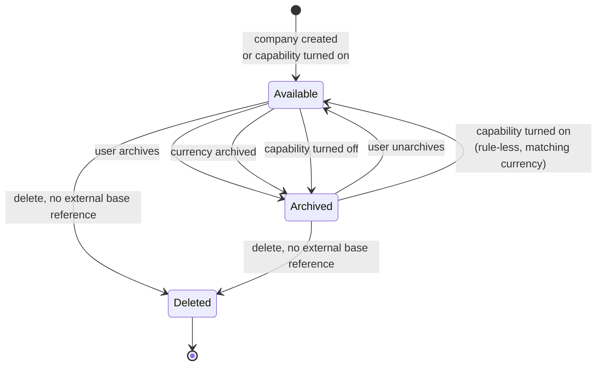

### 1.4 The orthogonal publication state, on the storefront

A price list that is *Available* is further classified, per website, by an orthogonal three-way
publication state. These are not transitions of the lifecycle above; they are a projection of
three stored fields.

| Publication state | Condition | Reachable by a visitor |
|---|---|---|
| Website-specific | the website field names **this** website | Yes, always. |
| Generic selectable | no website, and the selectable flag is set | Yes, and it appears in the price list chooser. |
| Generic promotional | no website, no selectable flag, but a promotional code is set | Only after the visitor enters the code; it then persists in the session. |
| Back office | no website, no selectable flag, no code | No. |
| Foreign | the website field names **another** website | No. |
| Wrong company | the company is set and differs from the website's company | No, whatever the other three fields say. |

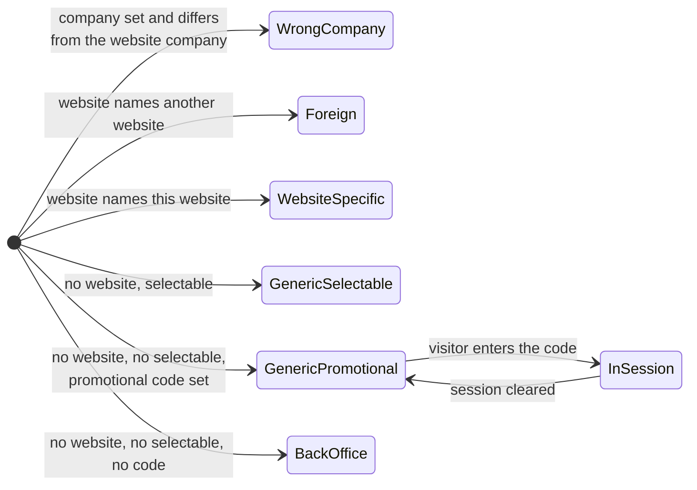

---

## 2. Price list rule effectiveness

A rule is never "active" or "inactive" as a stored fact. Given a **pricing date**, a **requested
quantity** and a **product**, it is in exactly one of five derived states. The engine evaluates
them in the order shown and stops at the first that applies.

### 2.1 States

| State | Meaning | Where it is decided |
|---|---|---|
| Out of window | The pricing date is before the start date or after the end date. | The candidate search |
| Out of scope | The rule's target does not cover the product. | The candidate search (coarsely) and the applicability test (authoritatively) |
| Below the break | The matching quantity is below the rule's minimum quantity. | The applicability test |
| Applicable but not selected | The rule passes every test, but an earlier rule in the specificity order also passed. | The ordered walk |
| Selected | The rule passes every test and is the first to do so. | The ordered walk |

### 2.2 Transitions

The transitions are not user actions; they are changes of the **question** being asked or of the
rule's own configuration.

| From | To | Trigger |
|---|---|---|
| Out of window | Below the break, Applicable but not selected, or Selected | Time passes and the pricing date enters the window; or the window is edited |
| Selected | Out of window | Time passes and the pricing date leaves the window; or the window is edited |
| Below the break | Applicable but not selected, or Selected | The requested quantity rises, or the document unit changes to a coarser unit, or the minimum quantity is lowered |
| Selected | Below the break | The requested quantity falls, or the document unit changes to a finer unit, or the minimum quantity is raised |
| Applicable but not selected | Selected | A more specific rule is deleted, moved out of its window, or pushed below its break |
| Selected | Applicable but not selected | A more specific rule is created, or its window now covers the date, or its break is now reached |
| Out of scope | any other | The rule's level or target is edited; or the product is edited into the rule's category |
| Selected | Out of scope | The rule's target is edited; or the product's category is changed |

### 2.3 Diagram

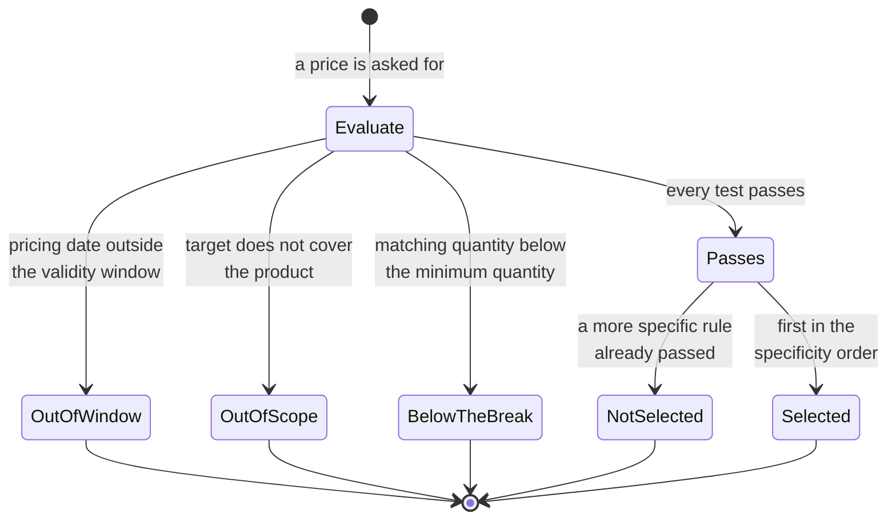

### 2.4 The specificity ladder as a decision order

The ordered walk itself is best modelled as a ladder that the engine descends until something
catches. Every rung is a group of rules sharing a level, sorted inside the rung by minimum
quantity descending, then category identifier descending, then identifier descending.

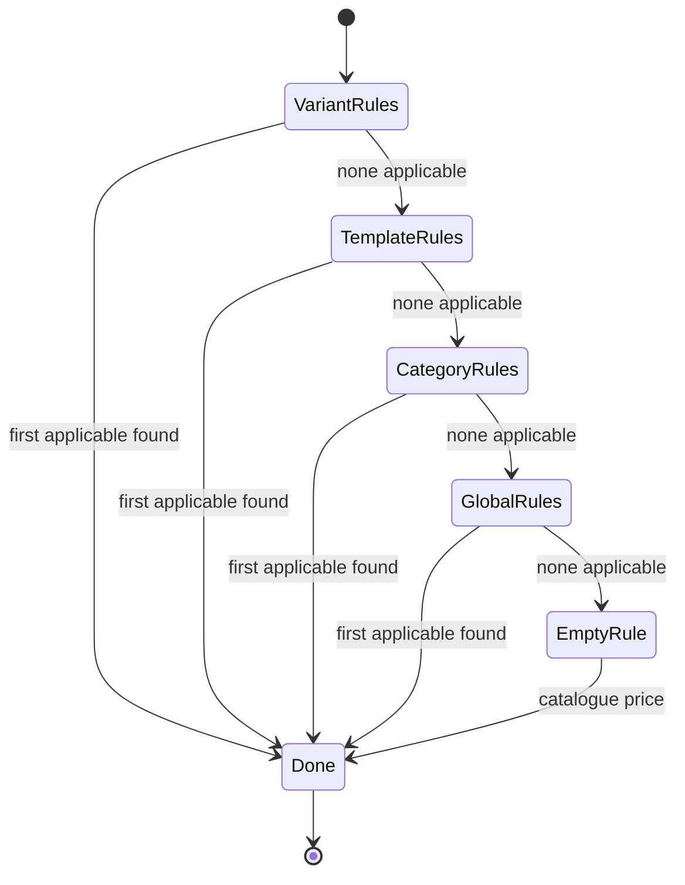

The **empty rule** is the terminal rung. It always catches, and it prices at the catalogue price
converted to the requested unit and currency. A rebuild should implement it as a real (null)
object rather than as a special case, because every downstream consumer — the discount policy, the
storefront display rule, the cached rule on a sales line — asks it questions and expects sensible
answers (its kind is nothing, so no discount is shown; its base is unset, so the base defaults to
the sales price).

### 2.5 Guard conditions in full

| Guard | Exact test |
|---|---|
| In window | ( no start date **or** start date is at or before the pricing date ) **and** ( no end date **or** end date is at or after the pricing date ) |
| Break reached | the minimum quantity is zero **or** the matching quantity is **not below** the minimum quantity |
| Covers, level global | always |
| Covers, level category | the product has a category **and** ( that category is the rule's category **or** the product category's materialised path starts with the rule category's materialised path ) |
| Covers, level template, product is a template | the template is the rule's template |
| Covers, level template, product is a variant | the variant's template is the rule's template |
| Covers, level variant, product is a template | the template has exactly one variant **and** that variant is the rule's variant |
| Covers, level variant, product is a variant | the variant is the rule's variant |

---

## 3. Vendor price effectiveness

The same shape as the price list rule, with different tests and one extra state.

### 3.1 States

| State | Meaning |
|---|---|
| Vendor inactive | The offer's vendor is archived. Excluded before anything else is tested. |
| Wrong company | The offer's company is set and is not exactly the acting company. |
| Wrong variant | The offer names a variant other than the product being priced. |
| Out of window | The pricing **date** is before the start date or after the end date. |
| Wrong unit | The forced-unit option is on and the offer's unit is neither the requested unit nor the product's own unit. |
| Wrong vendor | A vendor was supplied and the offer's vendor is neither that vendor nor its parent contact. |
| Below the break | The requested quantity, expressed in the offer's unit, is below the offer's minimum quantity at the `Product Unit` precision. |
| Dropped by grouping | The offer passed every test but belongs to a vendor other than the first vendor whose offer passed. |
| Candidate | The offer passed every test and survived the grouping, but is not the cheapest. |
| Selected | The offer is first in the final ordering. |

### 3.2 Diagram

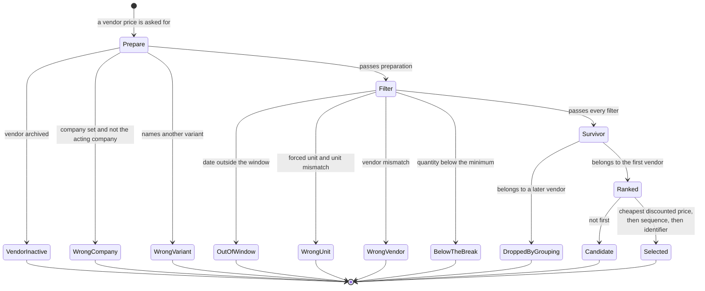

### 3.3 The transition that surprises

**Candidate → Selected** can happen without anything about either offer changing, purely because
a **currency rate** changed: the ranking key is the discounted price converted to the company
currency at the pricing date. Two offers in two currencies can swap places from one day to the
next. A rebuild must recompute the ranking on every call rather than caching a "cheapest offer"
on the product.

---

## 4. Sales line price provenance

A sales order line's unit price is in one of four provenance states. The state is not stored
directly; it is the relationship between three stored values — the unit price, the shadow price
and the invoiced quantity — plus the line's kind.

### 4.1 States

| State | Stored signature | Behaviour on a change of product, unit or quantity |
|---|---|---|
| Automatic | the unit price equals the shadow price, at the line currency's precision; the invoiced quantity is zero | Recomputed from the price list. |
| Manual | the unit price differs from the shadow price, at the line currency's precision; the invoiced quantity is zero | Left alone. |
| Frozen by invoicing | the invoiced quantity is above zero | Left alone, even under a forced recomputation. |
| Externally owned | the line is a down payment, carries a global discount marker, or is an expense line with an at-cost policy | Never touched by this domain. |

### 4.2 Transitions

| From | To | Trigger | Guard | Side effects |
|---|---|---|---|---|
| *(new line)* | Automatic | The line is created with a product | There is an order, a product and a unit | The unit price and the shadow price are both set to the computed display price, after tax-inclusion correction. The discount is computed. |
| *(new line)* | Automatic | The line is created without a product or without a unit | — | The unit price and the shadow price are both set to zero. |
| Automatic | Manual | A user types a unit price | The typed value differs from the shadow price by at least the currency's smallest unit | Only the unit price changes; the shadow price keeps the last computed value. |
| Manual | Automatic | The *Update Prices* operation runs | — | The unit price and the shadow price are both reset to the freshly computed display price; the discount is recomputed. |
| Automatic | Automatic | The product, the unit or the quantity changes | The line is not frozen or externally owned | The price and the discount are recomputed; the shadow price follows. |
| Manual | Manual | The product, the unit or the quantity changes | — | Nothing is recomputed. The typed price survives a change of product. |
| Automatic or Manual | Frozen by invoicing | An invoice is posted for part of the line | — | The price and the discount stop changing. |
| Frozen by invoicing | Automatic | The invoices are all cancelled or deleted, bringing the invoiced quantity back to zero | — | Recomputation resumes on the next dependency change. |

### 4.3 Diagram

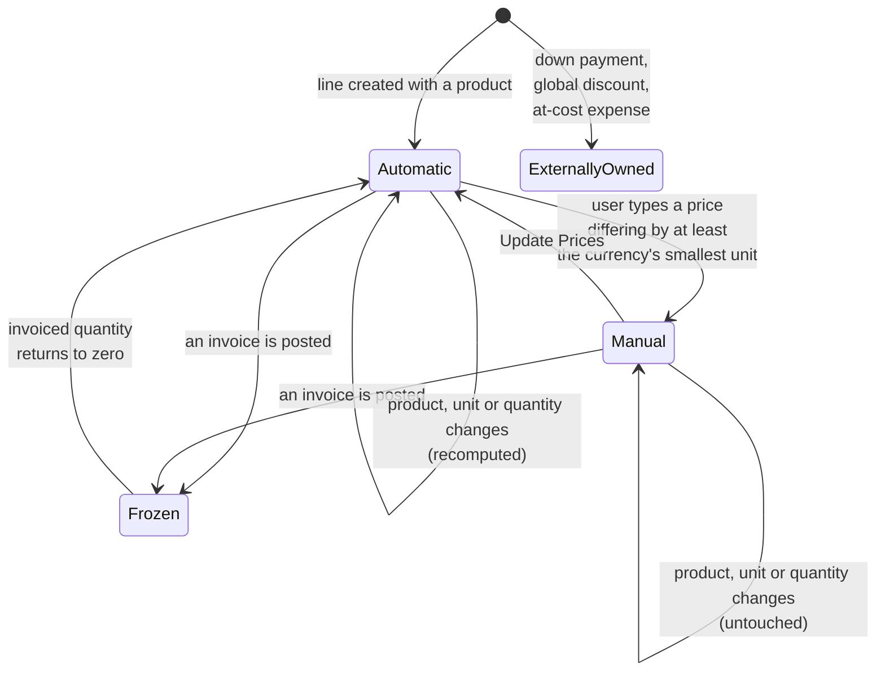

### 4.4 The purchase order line's equivalent

The purchase order line uses the same shadow-price device with a shorter ladder:

| State | Stored signature | Behaviour |
|---|---|---|
| Automatic | the unit price equals the shadow price | Recomputed from the vendor price or the cost. |
| Manual | the unit price differs from the shadow price | Left alone. |
| Frozen by billing | the line has invoice lines | Left alone. |

with one extra subtlety specified in
[`calculations.md`](calculations.md#157-the-purchase-order-lines-unit-price): a **Manual** line is
nevertheless overwritten when no offer applies **but** some offer from the order's vendor exists.
That makes the purchase line's manual state weaker than the sales line's.

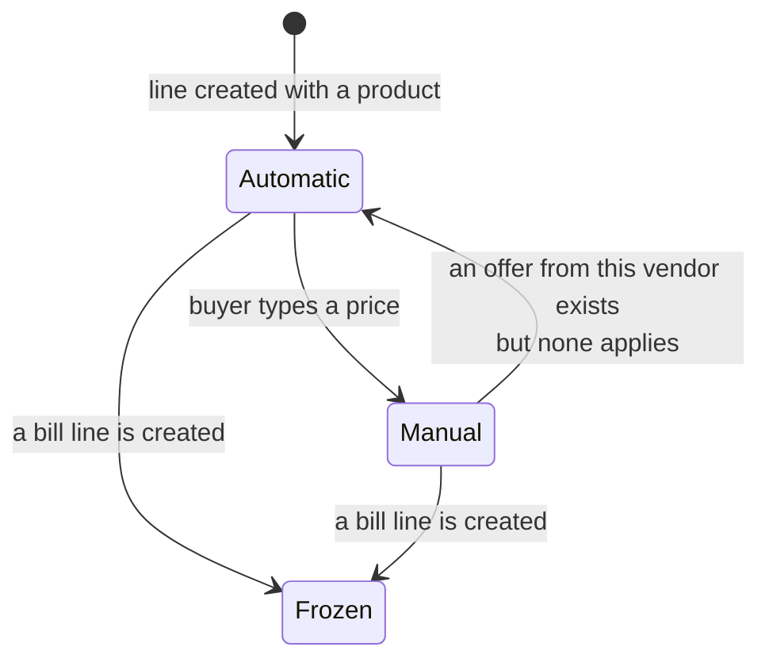

---

## 5. Archival lifecycles of the other two entities

### 5.1 Price List Rule

A rule has **no active flag**. It has only two states: existing and deleted.

| From | To | Trigger | Guard |
|---|---|---|---|
| *(none)* | Existing | Creation | The validations of [`business-rules.md`](business-rules.md) pass |
| Existing | Deleted | Explicit deletion | — |
| Existing | Deleted | Its price list is deleted | Cascade |
| Existing | Deleted | Its product template, product variant or product category is deleted | Cascade |

Its **visibility** on the price list form is a separate, derived question: the rule is hidden when
it points at an archived product template or an archived product variant, but it keeps working.

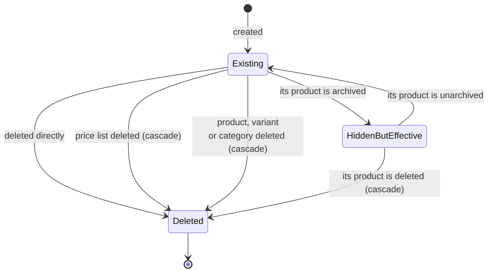

### 5.2 Vendor Price

Also has no active flag, and also only exists or does not. It has, however, a *retirement* idiom:
setting an end date in the past.

| From | To | Trigger | Guard |
|---|---|---|---|
| *(none)* | Existing | Creation by a user, by an import, or by purchase order confirmation | The product has ten or fewer offers, and neither the order's vendor nor its parent already has one — for the automatic path only |
| Existing | Retired | A user sets an end date in the past | — |
| Retired | Existing | The end date is cleared or moved into the future | — |
| Existing or Retired | Deleted | Explicit deletion, or its vendor or product template is deleted | Cascade from the vendor and the template |
| Existing | Existing, widened to all variants | Its product variant is deleted | The variant link sets to nothing rather than cascading |

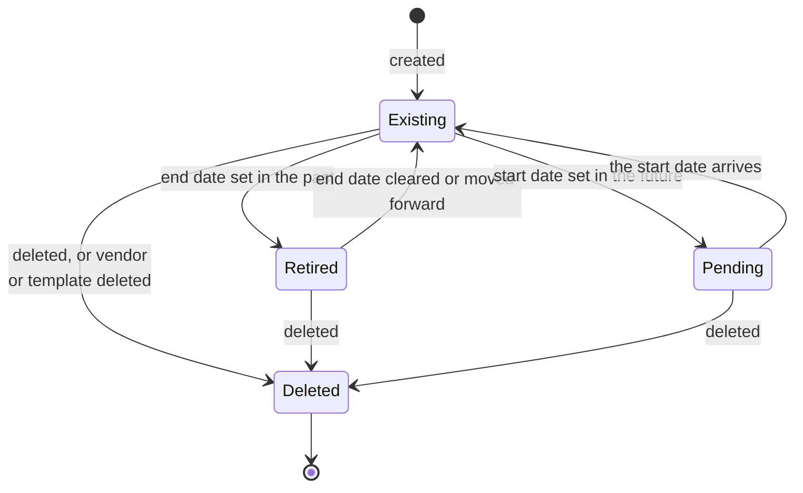

---

## 6. The storefront price list session lifecycle

The visitor's price list is a **session-scoped** value with its own lifecycle, and it is the one
place in this domain where a resolution result is remembered rather than recomputed.

### 6.1 States

| State | Meaning |
|---|---|
| Unresolved | The session holds no price list identifier. |
| Resolved | The session holds an identifier and the record still passes the publication and country checks. |
| Stale | The session holds an identifier but the record has been deleted, has become unpublishable on this website, or is not available in the visitor's geolocated country. |
| Suppressed | The basic price list capability is off; no price list is used at all. |

### 6.2 Transitions

| From | To | Trigger | Guard | Side effects |
|---|---|---|---|---|
| Unresolved | Resolved | Any request that needs a price | The capability is on | Resolution runs: the cart's price list, else the contact's price list, else the first price list available to this visitor. The identifier is stored in the session. |
| Resolved | Resolved | Any later request | The stored record still exists, is publishable here and is available in the country | The stored identifier is reused without any search. |
| Resolved | Stale | The price list is archived, deleted, unpublished, moved to another website or company, or the visitor's country changes | — | The next request re-resolves. |
| Stale | Resolved | The next request | — | Re-resolution as in the first row. |
| Resolved | Resolved (different price list) | The visitor enters a promotional code, or picks a price list from the chooser | The price list is available to this visitor | The session identifier is replaced; the cart's price list is recomputed and its lines re-priced. |
| any | Suppressed | The capability is turned off | — | No price list is used; catalogue prices are shown. |

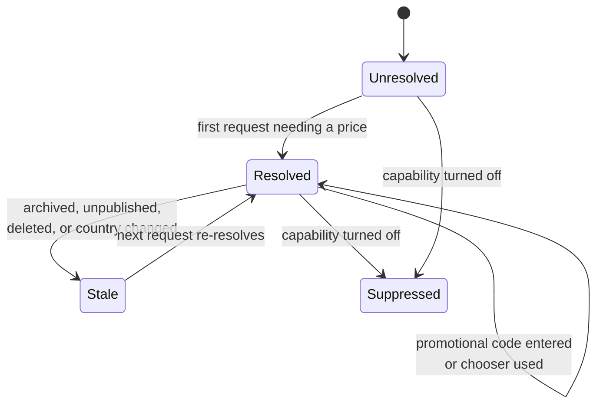

### 6.3 What a change of resolved price list triggers

1. The session identifier is replaced.
2. The cart's price list is recomputed, which recomputes the cart's **currency**.
3. Every cart line's unit price and discount are recomputed, subject to the sales line provenance
   machine of section 4 — so a line whose price the visitor could somehow have fixed manually
   would not move. In the storefront no such path exists, so every line re-prices.
4. Every displayed price on the site changes, including the struck-through prices governed by the
   storefront's wider discount-display rule.

---

## 7. The one stored selection that names document states

The domain owns no state field, but it owns one stored selection whose values **name the states of
documents in another domain**: the invoice-state filter of the Product Margin Wizard
(`product.margin`), carried into the analysis under the context key `invoice_state` (invoice state)
and echoed on the product variant as a read-only field of the same name.

### 7.1 Values

| Stored value | Label | Meaning |
|---|---|---|
| `paid` | "Paid" | Count only documents that are posted **and** settled. |
| `open_paid` | "Open and Paid" | Count every posted document, settled or not. This is the default. |
| `draft_open_paid` | "Draft, Open and Paid" | Count posted **and** draft documents, settled or not. |

### 7.2 What each value selects

The filter is expanded into two sets, which are applied together: a set of document states and a set
of payment states. A document is counted only when **both** of its states are in the corresponding
set.

| Filter | Document states counted | Payment states counted |
|---|---|---|
| `paid` | posted | in payment, paid, reversed |
| `open_paid` | posted | not paid, in payment, paid, reversed, partial |
| `draft_open_paid` | posted, draft | not paid, in payment, paid, reversed, partial |

Three consequences a rebuild must reproduce. A cancelled document is never counted, under any value,
because no value names the cancelled document state. A posted document that is **partially** settled
is counted by "Open and Paid" and by "Draft, Open and Paid" but **not** by "Paid", because the
partial payment state is absent from the first set. A reversed document is counted by every value,
because the reversed payment state is present in all three sets.

### 7.3 Transitions

The field has no lifecycle of its own: it is a filter a user picks in a dialogue and that the
analysis then reads from its calling context. It is set when the wizard is opened, changed while the
wizard is open, and read once when the button opens the analysis. Nothing in this domain writes it
afterwards, and the value is never stored on a product.

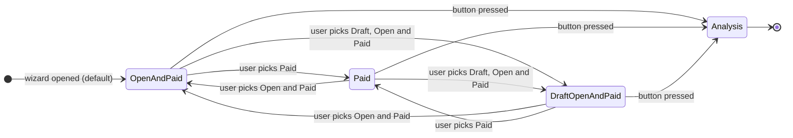

The states the filter names, and the transitions between them, belong to
[accounts receivable](../accounts-receivable/) and [accounts payable](../accounts-payable/); this
domain only reads them. The arithmetic they feed is in
[`calculations.md`](calculations.md#18-margins-on-a-product--the-analysis-measures).

---

## 8. Reconciliation notes

1. **Whether this file should exist at all.** One of the two descriptions this folder was merged from
   carried no state file, on the ground that no entity of the domain has a state field; the other
   carried three lifecycle tables at the end of its workflow file. Both observations are true and
   neither is a reason to omit the file: the domain's behaviour depends on four derived lifecycles, on
   two archival lifecycles and on a session lifecycle, and an observer cannot distinguish those from
   state machines. All seven are specified here, and the three lifecycle tables of the other
   description reappear as sections 1, 5.1 and 5.2, with their transitions completed.

2. **The purchase line's manual state.** One description described the sales line and the purchase
   line as behaving identically. They do not: section 4.4 records that a manually priced purchase line
   is overwritten when an offer from the order's vendor exists but none applies, which never happens
   on the sales side.

3. **The publishability of an archived price list.** Neither description recorded that the storefront
   publication test applies the active-flag check to one branch only. Section 1.4 lists the
   publication states as the test really computes them, and the consequence is recorded as a
   compatibility finding in [`business-rules.md`](business-rules.md#13-storefront).

4. **The invoice-state filter.** Neither description treated the invoice-state filter as a stored
   selection worth specifying, and one of them omitted the analysis entirely. It is the only stored
   selection in the domain whose values name states, so section 7 specifies it in full.
