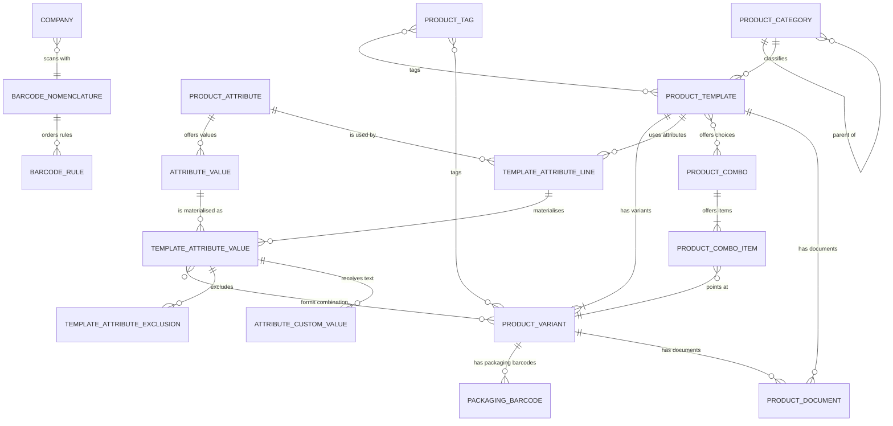

# Products and Catalog — Entities

This file specifies every entity of the domain: its purpose, its lifecycle, its complete field
table, its relations, its uniqueness rules, its defaults, its computed fields and the rule behind
each one, its ordering, its display rule, its archival behaviour and its multi-company behaviour.

Conventions used in the field tables:

- **Field (storage name)** — the human name followed, in code font, by the literal name that
  external contracts use. Reproduced names are exact.
- **Type** — the logical type. `text` is a single-line string, `long text` is multi-line,
  `rich text` is markup, `number` is an integer, `decimal` is a fixed-precision decimal whose
  precision is named, `money` is a decimal interpreted in a named currency, `flag` is a boolean,
  `date` is a calendar date, `moment` is a date with a time of day, `image` is binary picture data,
  `link` is a reference to one record of another entity, `link set` is a reference to several
  records, `child set` is the reverse side of a link held by the children, `choice` is a closed
  selection whose values are listed.
- **Meaning and rules** — required-ness, default, whether the value is computed and from what,
  whether a computed value is stored, whether it can be written over a computed value, whether it is
  copied when the record is duplicated, whether changes are recorded in the record's message
  history, whether it is indexed, what happens to the record when the target of a link disappears,
  and the labels of every choice value.

Where a rule is long enough to deserve its own algorithm, this file states it briefly and links to
[calculations.md](calculations.md).

---

## 1. Product Template

**Transport name** `product.template`. **Storage name** `product_template`.

### 1.1 Purpose

The Product Template is the commercial product as a person thinks of it: one name, one type, one
category, one sales price, one cost basis, one default unit, one set of images, one set of
descriptions. Everything that varies from one purchasable item to another — attribute values,
barcode, internal reference, per-unit cost, weight, volume — lives on the Product Variant. A
template always owns at least one variant unless every one of its attributes is configured to
create variants on demand and no combination has been ordered yet.

The template carries a message thread and an activity list, so notes, e-mails and scheduled
follow-ups can be attached to a product. It carries the five-step image ladder. It participates in
company scoping: a template with no company is shared, a template with a company is visible to that
company and to companies below it in the company tree.

### 1.2 Ordering and display

Records are ordered by the favourite flag descending, then by name ascending. The consequence is
that favourite products float to the top of every list that does not override the order.

The display name is built as follows:

1. If the name is empty, the display name is empty.
2. Otherwise, if the caller has switched off internal-reference display (a context flag named
   `display_default_code`, "display default code", whose absence means "display it") or the template
   has no internal reference, the display name is the name alone.
3. Otherwise, if the caller asked for the two-column formatted variant (a context flag named
   `formatted_display_name`, "formatted display name"), the display name is the name, a tab
   character, then two hyphens, the internal reference and two hyphens.
4. Otherwise the display name is an opening square bracket, the internal reference, a closing square
   bracket, a space, then the name.

### 1.3 Field table

| Field (storage name) | Type | Meaning and rules |
|---|---|---|
| Name (`name`) | text | Required. Translatable. Indexed for three-character substring search. The commercial name of the product. |
| Sequence (`sequence`) | number | Default 1. Gives the display order inside lists that sort by it. Not used by the entity's own ordering. |
| Description (`description`) | rich text | Free internal description. Translatable. |
| Purchase Description (`description_purchase`) | long text | Translatable. Copied onto purchase documents that reference the product. |
| Sales Description (`description_sale`) | long text | Translatable. Copied onto every sales order line, delivery document and customer invoice line that references the product. |
| Product Type (`type`) | choice | Required. Default `consu`. Values: `consu` labelled "Goods" (tangible merchandise), `service` labelled "Service" (a non-material offering), `combo` labelled "Combo" (a bundle whose buyer picks one item per choice group). Changing to `combo` is guarded; see [business-rules.md](business-rules.md). |
| Combo Choices (`combo_ids`) | link set → Product Combo | The choice groups of a combo product. Company-consistency checked against the template's company. Cleared automatically whenever the type is written to anything other than `combo`. |
| Create on Order (`service_tracking`) | choice | Required. Default `no`. In this domain the only value is `no` labelled "Nothing". Computed and stored, writable: whenever the type is not `service` the value is forced back to `no`. Other domains extend the value list (for instance to create a task or a project when a service is sold). |
| Product Category (`categ_id`) | link → Product Category | Tracked in the message history. Groups expand in grouped lists through a helper that, in a grouped context, lists every category. |
| Currency (`currency_id`) | link → Currency | Computed, not stored. The currency of the template's company, or, when the template has no company, the currency of the main company. |
| Cost Currency (`cost_currency_id`) | link → Currency | Computed, not stored, depends on the acting company. The currency of the template's company, or, when the template has no company, the currency of the acting company. |
| Sales Price (`list_price`) | decimal (precision `Product Price`) | Default 1.0. Tracked. The catalogue price of one unit in the template's currency, before attribute extras and before any pricelist rule. |
| Cost (`standard_price`) | decimal (precision `Product Price`) | Computed from the variants, writable, not stored, readable only by internal users. When the template has exactly one variant the value is that variant's cost; when it has none and the search included only active variants, the computation is retried including archived variants; otherwise the value is zero. Writing it writes through to the single variant. Searching it searches the variants' cost. |
| Volume (`volume`) | decimal (precision `Volume`) | Computed from the variants and stored, writable. Same single-variant mirroring rule as cost. |
| Volume unit label (`volume_uom_name`) | text | Computed, not stored. The display name of the unit in which volumes are expressed, chosen by system parameter; see [configuration.md](configuration.md). |
| Weight (`weight`) | decimal (precision `Stock Weight`) | Computed from the variants and stored, writable. Same single-variant mirroring rule as cost. |
| Weight unit label (`weight_uom_name`) | text | Computed, not stored. The display name of the unit in which weights are expressed, chosen by system parameter. |
| Sales (`sale_ok`) | flag | Default true. Whether the product may appear on sales documents. |
| Purchase (`purchase_ok`) | flag | Default true. Computed and stored, writable; the base computation leaves the value untouched, so in practice it behaves as a plain stored flag. Forced to false when the type is changed to `combo`. |
| Unit (`uom_id`) | link → Unit of Measure | Required. Tracked. Default: the shipped unit named "Units". The default unit for every stock, sales and purchase operation on this product. Changing it triggers a warning dialog and a write-through that replaces the unit on existing records rather than converting quantities. |
| Packagings (`uom_ids`) | link set → Unit of Measure | The additional units in which this product may be sold. Restricted to units other than the default unit. |
| Unit Name (`uom_name`) | text | The name of the default unit, read-only. |
| Company (`company_id`) | link → Company | Indexed. Empty means shared across all companies. |
| Vendors (`seller_ids`) | child set → Vendor Pricelist Line | The vendor price lines of this template. Depends on the acting company. Owned by `../pricing-and-pricelists/`. |
| Vendors, unfiltered (`variant_seller_ids`) | child set → Vendor Pricelist Line | The same lines without the company-dependence declaration, used where the raw set is wanted. |
| Active (`active`) | flag | Default true. Archiving a template archives every one of its variants. |
| Colour Index (`color`) | number | A palette index used by card views. |
| Is a product variant (`is_product_variant`) | flag | Computed, not stored. Always false on a template. The mirror field on the variant is always true; together they let a shared view know which side it is rendering. |
| Product Attributes (`attribute_line_ids`) | child set → Template Attribute Line | Copied when the template is duplicated. The attribute configuration from which variants are generated. |
| Valid Product Attribute Lines (`valid_product_template_attribute_line_ids`) | link set → Template Attribute Line | Computed, not stored. The attribute lines that have at least one value. Lines with a single value are valid: they do not appear in the configurator but they do participate in filtering and in variant naming rules. |
| Product Values (`import_attribute_values`) | text | Computed to the empty string, not stored, not copied. Writing it outside an import raises an error. Its only purpose is to let a single import file carry both templates and variants; see [workflows.md](workflows.md). |
| Products (`product_variant_ids`) | child set → Product Variant | Required. Every variant of this template. |
| Product (`product_variant_id`) | link → Product Variant | Computed, not stored. The first variant, kept as a separate field so that reading one variant of many templates is a single fetch. |
| Number of variants (`product_variant_count`) | number | Computed, not stored. The count of variants. |
| Barcode (`barcode`) | text | Computed from the variants, writable, not stored. Same single-variant mirroring rule as cost. Searching it searches the variants' barcodes with archived variants included. |
| Internal Reference (`default_code`) | text | Computed from the variants, writable, stored. Same single-variant mirroring rule as cost. |
| Pricelist Rules (`pricelist_rule_ids`) | child set → Pricelist Rule | Restricted to rules with no pricelist or with an active pricelist. Owned by `../pricing-and-pricelists/`. |
| Documents (`product_document_ids`) | child set → Product Document | The documents whose owner model is the template. |
| Documents Count (`product_document_count`) | number | Computed, not stored. The number of documents attached to this template **or to any of its variants**. |
| Can Image 1024 be zoomed (`can_image_1024_be_zoomed`) | flag | Computed and stored. True when the original image is strictly larger than the one-thousand-and-twenty-four-pixel derivative, that is, when zooming shows more detail. |
| Is a configurable product (`has_configurable_attributes`) | flag | Computed and stored. True when the template has a dynamic attribute, or any attribute line offering at least two values, or a multi-checkbox attribute line, or any attribute line carrying a free-text value. |
| Is Dynamically Created (`is_dynamically_created`) | flag | Computed, not stored. True when any attribute line uses an attribute whose variant-creation mode is `dynamic`. Unlike the configurability flag, this one looks at every attribute line, valid or not. |
| Tooltip (`product_tooltip`) | text | Computed, not stored. For a combo product, the sentence "Combos allow to choose one product amongst a selection of choices per category." For every other type, the empty string. |
| Favourite (`is_favorite`) | flag | Default false. Partially indexed on the true values only. First sort key of the entity. |
| Tags (`product_tag_ids`) | link set → Product Tag | Through the pairing table `product_tag_product_template_rel`. |
| Properties (`product_properties`) | property bag | Copied on duplication. The set of custom fields whose definition lives on the product's category, in the category field `product_properties_definition`. |
| Image, original (`image_1920`) | image | At most one thousand nine hundred and twenty pixels on each side. |
| Image 1024 (`image_1024`) | image | Derived from the original, stored. |
| Image 512 (`image_512`) | image | Derived from the original, stored. |
| Image 256 (`image_256`) | image | Derived from the original, stored. |
| Image 128 (`image_128`) | image | Derived from the original, stored. |

The message-thread and activity fields (follower list, message list, activity list, activity state)
are supplied by `../messaging-and-activities/` and are not repeated here.

### 1.4 Lifecycle

**Creation.** When templates are created:

1. The records are written.
2. Unless the caller has switched off variant creation (a context flag named
   `create_product_product`, "create product variant", whose absence means "create them"), the
   variant generation algorithm runs for the new templates.
3. For each created template, the fields that exist on both the template and the variant and are
   mirrored — barcode, internal reference, cost, volume, weight and properties — are re-written onto
   the template if the caller supplied a value and the template's own value came back empty. This is
   how a value supplied at creation reaches the variant that did not exist when the value was
   assigned.

**Modification.** On write:

1. If the unit is being changed, every variant of every template whose unit differs from the new
   value is put through the unit-replacement hook with conversion suppressed.
2. The write happens.
3. If variant creation is not suppressed and the attribute lines were part of the write, or if the
   template is being reactivated and currently has no variants, the variant generation algorithm
   runs.
4. If the template is being archived, every variant — archived ones included — is archived too.
5. If the original image was part of the write, the five image fields and the zoomability flag are
   invalidated on every variant, because variants fall back to the template image.
6. If the type was part of the write and the new type is not `combo`, the combo choice list is
   emptied.

**Duplication.** The copy gets the name of the original followed by a space and the word "(copy)"
in parentheses, unless the caller supplied a name. Attribute lines are copied. Template Attribute
Values are *not* copied directly — they are regenerated from the copied lines — so the copy walks
the original's lines and values in parallel with the copy's lines and values and re-applies every
non-zero extra price, checking that the attribute and the underlying attribute value match before
doing so.

**Archival.** Archiving cascades to the variants. Unarchiving a variant unarchives its template.

**Deletion.** Deleting a template deletes its variants through the cascading link on the variant's
template reference.

### 1.5 Search behaviour

Searching the display name of a template also searches its variants, unless the caller says
otherwise:

- For a positive comparison, the result is the union of the templates matching directly and the
  templates whose variants match.
- For a negative comparison, the result is the intersection: templates that do not match directly
  **and** whose variants do not match.
- A name search whose filter already constrains template identifiers switches variant searching off,
  because in that case the caller clearly means to restrict to specific templates.

---

## 2. Product Variant

**Transport name** `product.product`. **Storage name** `product_product`.

### 2.1 Purpose

The Product Variant is the record every other domain points at: stock moves, order lines, invoice
lines, bills of materials, valuation layers. It is a *delegating* record: it stores only the fields
that vary between variants and reads every other field through its template. Writing a template
field on a variant writes it on the template, and therefore on all sibling variants.

The set of fields the variant stores itself is small and deliberate: the attribute values that
define it, the cost, the barcode, the internal reference, the weight, the volume, the variant
image, the variant tags, the documents, and the activity flag.

### 2.2 Delegation

The variant delegates to `product.template` through its required template link. In practice:

- Reading any template field on a variant returns the template's value.
- Writing any template field on a variant writes the template's value, which affects every sibling.
- The variant's own fields shadow nothing; where the same concept exists on both sides (cost,
  barcode, internal reference, weight, volume, properties) the template's version is a mirror
  computed from the variants, and the variant's version is the authority.

### 2.3 Ordering and display

Records are ordered by internal reference ascending, then name ascending, then identifier
ascending.

The display name is built as follows, with every step evaluated as the record is read by a
privileged reader so that vendor data is visible even to users who may not read it directly:

1. Compute the *combination name*: the comma-and-space-joined names of the variant's Template
   Attribute Values, after removing values belonging to no-variant attributes and values belonging
   to single-value lines. The single-value filter counts archived values too when any value in the
   set is archived, so that archived variants keep a stable name.
2. The *base name* is the template name; if the combination name is non-empty, it becomes the
   template name, a space, an opening parenthesis, the combination name, a closing parenthesis.
3. If the caller named a specific vendor line in the context, that is the vendor set. Otherwise, if
   the caller named a partner in the context, the vendor set is the vendor lines of this template
   for that partner or for its commercial parent, preferring lines that name this exact variant over
   lines that name none, and, if the caller also named a company, keeping only lines of that company
   or of no company.
4. If the vendor set is non-empty, for each vendor line: the name is the vendor's product name if
   the vendor line has one — with the combination name appended in parentheses when there is one —
   otherwise the base name; the code is the vendor line's product code if it has one, otherwise the
   variant's internal reference. The final display name is the comma-and-space-joined list of the
   distinct per-vendor names.
5. Otherwise the display name is the base name, prefixed by the bracketed internal reference when
   there is one and bracket display is not switched off.

The bracketed form is an opening square bracket, the code, a closing square bracket, a space, then
the name; the two-column formatted form is the name, a tab, two hyphens, the code and two hyphens.

### 2.4 Field table

Only the variant's own fields are listed. Every template field is reachable through delegation.

| Field (storage name) | Type | Meaning and rules |
|---|---|---|
| Product Template (`product_tmpl_id`) | link → Product Template | Required. Indexed. Access checks are bypassed on this link so that a user who may read a variant may read its template. Deleting the template deletes the variant. |
| Attribute Values (`product_template_attribute_value_ids`) | link set → Template Attribute Value | Through the pairing table `product_variant_combination`. Deleting a referenced value is refused while the link exists. This set *is* the variant's combination. |
| Variant Values (`product_template_variant_value_ids`) | link set → Template Attribute Value | The same pairing table, restricted to values whose attribute line offers more than one value. This is the subset a human thinks of as "what makes this variant different". |
| Combination indices (`combination_indices`) | text | Computed and stored, indexed. The comma-joined ascending list of the identifiers of the attribute values in the combination. Empty for a template with no attributes. |
| Variant Price Extra (`price_extra`) | decimal (precision `Product Price`) | Computed, not stored. The sum of the extra prices of the variant's attribute values. |
| Sales Price (`lst_price`) | decimal (precision `Product Price`) | Computed, not stored, writable. The template sales price, converted into the unit named in the context if one is named, plus the variant price extra. Writing it converts the given amount back into the product's own unit if a unit was named, subtracts the price extra, and writes the remainder as the template sales price. |
| Cost (`standard_price`) | decimal (precision `Product Price`) | Company-dependent: each company stores its own value, and reading returns the acting company's value. Readable only by internal users. |
| Internal Reference (`default_code`) | text | Indexed. |
| Reference (`code`) | text | Computed, not stored, depends on the partner named in the context. Starts as the internal reference; if the reader may read vendor lines, each vendor line of this product whose partner is the context partner replaces it with the vendor's product code (falling back to the internal reference), skipping lines that name a different variant and stopping at the first line that names this exact variant. |
| Customer Reference (`partner_ref`) | text | Computed, not stored, depends on the partner named in the context. For the first vendor line whose partner is the context partner: the vendor's product name, or failing that the internal reference, or failing that the name, prefixed by the bracketed reference when there is one. When no vendor line matches, the display name. |
| Barcode (`barcode`) | text | Not copied on duplication. Indexed on non-empty values only. Subject to the uniqueness rules in [business-rules.md](business-rules.md). |
| Unit Barcode (`product_uom_ids`) | child set → Packaging Barcode | Stored. The packaging barcodes of this variant. |
| Volume (`volume`) | decimal (precision `Volume`) | |
| Weight (`weight`) | decimal (precision `Stock Weight`) | |
| Active (`active`) | flag | Default true. |
| Product Values (`import_attribute_values`) | text | Computed, not stored, not copied. The comma-joined, alphabetically sorted list of `attribute name:value name` pairs of the variant's combination. Writing it outside an import raises an error. |
| Is a product variant (`is_product_variant`) | flag | Computed, not stored. Always true. |
| Pricelist Rules (`pricelist_rule_ids`) | child set → Pricelist Rule | Computed from the template's rules, writable. Reading returns the template's rules that target this variant or no variant at all. Writing merges the given set with the template's rules that target a *different* variant, so that editing one variant's rules never silently drops another variant's rules. |
| Documents (`product_document_ids`) | child set → Product Document | The documents whose owner model is the variant. |
| Documents Count (`product_document_count`) | number | Computed, not stored. Counts only the documents owned by this variant. |
| Variant Tags (`additional_product_tag_ids`) | link set → Product Tag | Through the pairing table `product_tag_product_product_rel`. Restricted to tags not already on the template. |
| All Tags (`all_product_tag_ids`) | link set → Product Tag | Computed, not stored, searchable. The union of the template tags and the variant tags, sorted by the tags' sequence. Searching it searches either side; a negative comparison is refused and falls back to the framework default. |
| Variant Image (`image_variant_1920`) | image | At most one thousand nine hundred and twenty pixels on each side. Technical: the interface shows the fallback field instead. |
| Variant Image 1024 / 512 / 256 / 128 (`image_variant_1024`, `image_variant_512`, `image_variant_256`, `image_variant_128`) | image | Derived from the variant image, stored. |
| Can Variant Image 1024 be zoomed (`can_image_variant_1024_be_zoomed`) | flag | Computed and stored. True when the variant image is strictly larger than its one-thousand-and-twenty-four-pixel derivative. |
| Image (`image_1920`) | image | Computed, not stored, writable. The variant image if there is one, otherwise the template image. |
| Image 1024 / 512 / 256 / 128 (`image_1024`, `image_512`, `image_256`, `image_128`) | image | Computed, not stored. The variant derivative if there is a variant image, otherwise the template derivative. |
| Can Image 1024 be zoomed (`can_image_1024_be_zoomed`) | flag | Computed, not stored. The variant's zoomability if the variant has its own image, otherwise the template's. |
| Last write moment (`write_date`) | moment | Computed and stored. The later of the variant's own last-write moment and its template's last-write moment. This makes a browser cache holding a variant image expire when the template image changes. |
| Favourite (`is_favorite`) | flag | The template's favourite flag, writable through, stored on the variant as well so that the variant list can sort by it. Partially indexed on the true values only. |
| In selected order section (`is_in_selected_section_of_order`) | flag | Search-only. Filters variants to those whose line in the order named in the context belongs to the section named in the context. Only the positive membership comparison is supported. |

### 2.5 Image write-through

Writing the fallback image field on a variant does not always store the image on the variant.
The rule, applied per record:

1. If the template has no image **and** the variant has no variant image (the caller is clearing
   something already empty), or
2. if the caller is setting an image and the template has none, or
3. if this template has at most one active variant,

then the variant image is cleared and the image is written on the template instead. Otherwise the
image is written on the variant.

The same rule is used for any other field pair (template field, variant field) that follows this
pattern.

### 2.6 Lifecycle

**Creation.** Variants are created with variant generation suppressed for the templates involved —
otherwise creating one variant would immediately trigger a regeneration that might delete it — and
the cached combination-to-variant lookup is cleared afterwards.

**Modification.** Writing the combination clears the combination-to-variant cache. Writing the
activity flag clears the first-possible-variant cache.

**Archival.** Archiving a variant archives its template if that template is active and has no
remaining active variants. Unarchiving a variant unarchives its template if that template is
archived and now has active variants.

**Deletion.** Deletion is elaborate because a variant may be referenced by history:

1. If the caller suppressed variant creation, the plain deletion runs and nothing else happens.
2. Otherwise, for every variant that still exists:
   - if the variant carries a variant image and its template carries none, the image is moved up to
     the template, so that deleting the last variant does not lose the picture;
   - the template is marked for deletion when this variant is its last remaining variant (counting
     archived ones) **and** the template does not use dynamic attributes — a dynamic template
     legitimately has no variants.
3. The variants are deleted, then the marked templates are deleted (in that order, because deleting
   a template cascades to variants).
4. The combination-to-variant cache is cleared.

**Duplication.** Duplicating a variant duplicates its *template* instead, and returns the first
variant of the copy, creating it if the copy is dynamic and has none. The reason is that a variant
is a product of the attribute configuration; a second variant with the same combination would
violate the uniqueness index.

**Deletion-or-archival.** Several algorithms need to remove a batch of variants without failing on
the ones that are still referenced. The fallback procedure is:

1. Unless access checks are suppressed, verify that the caller may delete and may write; then split
   the batch into the deletable part and the rest, archive the rest, and continue with the
   deletable part as a privileged reader.
2. Attempt to delete the whole batch inside a savepoint with database logging muted.
3. On any failure, if the batch has more than one record, split it in half and recurse into each
   half.
4. On failure of a single record, archive it if it is active. Archiving may itself fail if something
   forbids it — an active reordering rule, for instance — and that failure is not caught.

### 2.7 Uniqueness

A partial uniqueness index over (template, combination indices) restricted to active variants
guarantees that a template never has two active variants with the same combination. Archived
variants are exempt, which is what allows a combination to be archived and later reactivated.

---

## 3. Product Category

**Transport name** `product.category`. **Storage name** `product_category`.

### 3.1 Purpose

A tree of classifications for templates. Beyond classification, the category is the holder of the
per-category property definition: the schema of the custom fields that appear on the products of
that category.

### 3.2 Field table

| Field (storage name) | Type | Meaning and rules |
|---|---|---|
| Name (`name`) | text | Required. Indexed for three-character substring search. |
| Complete Name (`complete_name`) | text | Computed and stored, recursive. The parent's complete name, a space, a slash, a space, then this category's name; or just the name when there is no parent. |
| Parent Category (`parent_id`) | link → Product Category | Indexed. Deleting the parent deletes the children. |
| Parent Path (`parent_path`) | text | Indexed. The materialised ancestry path maintained by the framework, which makes "is a descendant of" a prefix comparison. |
| Child Categories (`child_id`) | child set → Product Category | |
| Number of products (`product_count`) | number | Computed, not stored. The number of templates in this category **and in all its descendants**, despite the help text describing it as excluding children: the computation groups templates by category over the descendant set and then sums the counts over the descendant identifiers. |
| Product Properties (`product_properties_definition`) | property definition | The schema of the custom fields available on templates of this category. |

The category carries a message thread.

### 3.3 Rules

- **Ordering** is by complete name, so the list reads as a depth-first walk of the tree.
- **Display name** is the complete name by default. A caller may ask for the short form with a
  context flag named `hierarchical_naming` ("hierarchical naming") set to false, in which case the
  display name is the plain name.
- **Cycle protection**: creating or moving a category so that it becomes its own ancestor raises
  the message "You cannot create recursive categories."
- **Quick creation from a name** creates the category with that name and returns its identifier and
  display name.
- **Duplication** names the copy after the original followed by " (copy)" unless the caller supplied
  a name.
- The category is **not company-scoped**.

### 3.4 Shipped categories

Three categories are shipped and are protected from update after installation: "Goods", "Expenses"
and "Services". They are flat — none of them is the parent of another.

---

## 4. Product Tag

**Transport name** `product.tag`. **Storage name** `product_tag`.

### 4.1 Purpose

A flat, coloured label. Unlike the category, a product may carry any number of tags, and a tag may
be attached to the template (and so to all its variants) or to individual variants.

### 4.2 Field table

| Field (storage name) | Type | Meaning and rules |
|---|---|---|
| Name (`name`) | text | Required. Translatable. Globally unique; violating it produces "Tag name already exists!". |
| Sequence (`sequence`) | number | Default 10. The sort key of the entity, then identifier. |
| Colour (`color`) | text | Default the string `#3C3C3C`. A markup colour value, not a palette index. |
| Product Templates (`product_template_ids`) | link set → Product Template | Through the pairing table `product_tag_product_template_rel`. Defaults to the template named in the context, if any. |
| Product Variants (`product_product_ids`) | link set → Product Variant | Through the pairing table `product_tag_product_product_rel`. Restricted to variants of templates that have attribute lines and that are not already tagged through the template list. Defaults to the variant named in the context, if any. |
| All Product Variants using this Tag (`product_ids`) | link set → Product Variant | Computed, not stored, searchable. The union of the variants of the tagged templates and the directly tagged variants. Searching it searches either side; a negative comparison is refused. |
| Visible to customers (`visible_to_customers`) | flag | Default true. Whether the tag is shown outside the back office. |
| Image (`image`) | image | At most two hundred pixels on each side. |

Duplicating a tag names the copy after the original followed by " (copy)", which is necessary
because the name is unique.

---

## 5. Product Attribute

**Transport name** `product.attribute`. **Storage name** `product_attribute`.

### 5.1 Purpose

A dimension of variation, shared across templates. The attribute owns the list of its possible
values, decides whether using it creates variants, and decides how the configurator renders it.

### 5.2 Field table

| Field (storage name) | Type | Meaning and rules |
|---|---|---|
| Attribute (`name`) | text | Required. Translatable. |
| Active (`active`) | flag | Default true. |
| Variant Creation (`create_variant`) | choice | Required. Default `always`. Values: `always` labelled "Instantly" — every possible combination becomes a variant as soon as the attribute and its values are put on a template; `dynamic` labelled "Dynamically" — a variant is created only when its combination is first ordered; `no_variant` labelled "Never" — no variant is ever created for this attribute, the chosen value travels on the order line. Cannot be changed once the attribute is used on an active template. |
| Display Type (`display_type`) | choice | Required. Default `radio`. Values: `radio` "Radio", `pills` "Pills", `select` "Select", `color` "Color", `multi` "Multi-checkbox", `image` "Image". |
| Sequence (`sequence`) | number | Default 20. Indexed. First sort key of the entity, then identifier. |
| Values (`value_ids`) | child set → Attribute Value | Copied on duplication. |
| Template Values (`template_value_ids`) | child set → Template Attribute Value | Every materialised per-template value of this attribute, across templates. |
| Lines (`attribute_line_ids`) | child set → Template Attribute Line | Every use of this attribute on a template. |
| Related Products (`product_tmpl_ids`) | link set → Product Template | Computed and stored. Every template that has an attribute line for this attribute, archived templates included. |
| Number of related products (`number_related_products`) | number | Computed, not stored. The number of attribute lines for this attribute on **active** templates. |

### 5.3 Constraint

A database-level check forbids the combination of the multi-checkbox display type with any
variant-creation mode other than `no_variant`, with the message "Multi-checkbox display type is not
compatible with the creation of variants". An interface convenience mirrors it: changing the display
type to multi-checkbox on an attribute with no related products silently sets the variant-creation
mode to `no_variant`.

### 5.4 Guards

- Changing the variant-creation mode while the attribute has related active products raises
  "You cannot change the Variants Creation Mode of the attribute *the attribute name* because it is
  used on the following products: *the comma-separated product names*". The reason is that the
  change would invalidate every existing combination.
- Deleting an attribute with related active products raises "You cannot delete the attribute *the
  attribute name* because it is used on the following products: *the comma-separated product
  names*".
- Archiving an attribute with related active products raises "You cannot archive this attribute as
  there are still products linked to it".
- Writing a new sequence flushes and invalidates every cached collection, because the ordering of
  the attribute lines of every template depends on it.

---

## 6. Attribute Value

**Transport name** `product.attribute.value`. **Storage name** `product_attribute_value`.

### 6.1 Purpose

One possible value of an attribute, shared across every template that uses the attribute. The
per-template surcharge and the per-template exclusions do **not** live here; they live on the
Template Attribute Value.

### 6.2 Field table

| Field (storage name) | Type | Meaning and rules |
|---|---|---|
| Value (`name`) | text | Required. Translatable. |
| Sequence (`sequence`) | number | Indexed. Second sort key, after the attribute, before the identifier. |
| Attribute (`attribute_id`) | link → Product Attribute | Required. Indexed. Deleting the attribute deletes its values. Cannot be changed once the value is used on a product. |
| Lines (`pav_attribute_line_ids`) | link set → Template Attribute Line | Through the pairing table `product_attribute_value_product_template_attribute_line_rel`. Not copied. The template attribute lines that offer this value. |
| Default extra price (`default_extra_price`) | decimal | The surcharge proposed when this value is newly attached to a template. Copied once into the created Template Attribute Value; later changes do not propagate automatically. |
| Free text (`is_custom`) | flag | When true, a buyer may type their own text alongside choosing this value. |
| Colour (`html_color`) | text | A markup colour value used when the attribute's display type is colour. |
| Display Type (`display_type`) | choice | The attribute's display type, read through. |
| Colour Index (`color`) | number | Default: a pseudo-random whole number between one and eleven inclusive. A palette index used by card views. |
| Image (`image`) | image | At most seventy pixels on each side. Used when the attribute's display type is image. |
| Active (`active`) | flag | Default true. |
| Used on Products (`is_used_on_products`) | flag | Computed, not stored. True when at least one of the template attribute lines offering this value belongs to an active template. |
| Default extra price changed (`default_extra_price_changed`) | flag | Computed, not stored. True when the default extra price differs from the stored one, or when any materialised Template Attribute Value of this value, within the acting companies, carries a different extra price. Drives the visibility of the "push this price everywhere" action. |

### 6.3 Ordering and display

Ordered by attribute, then sequence, then identifier — the same order as the attribute list itself,
so values of the same attribute stay grouped.

The display name is the attribute name, a colon, a space, then the value name. A caller that is
already showing the attribute name elsewhere suppresses this with a context flag named
`show_attribute` ("show attribute") set to false, in which case the plain value name is used.

### 6.4 Guards and deletion

- Changing the attribute of a value that is used on products raises "You cannot change the attribute
  of the value *the value display name* because it is used on the following products: *the
  comma-separated product names*".
- Deleting a value used on active products raises "You cannot delete the value *the value display
  name* because it is used on the following products:\n*the newline-separated product names*\n".
- Deleting a value that is used only on **archived** variants archives the value instead of deleting
  it. The test is: gather the variants — archived ones included — linked through the materialised
  Template Attribute Values of this value; if none of them is active but at least one exists, the
  value is archived rather than deleted.
- Writing a new sequence flushes and invalidates cached collections, because the value order inside
  every template attribute line depends on it.

---

## 7. Template Attribute Line

**Transport name** `product.template.attribute.line`. **Storage name**
`product_template_attribute_line`.

### 7.1 Purpose

The use of one attribute on one template, together with the subset of that attribute's values that
this template offers. It is a configuration record: from it the system materialises one Template
Attribute Value per offered value, and from those it generates variants.

### 7.2 Field table

| Field (storage name) | Type | Meaning and rules |
|---|---|---|
| Active (`active`) | flag | Default true. Archiving a line clears its value list. |
| Product Template (`product_tmpl_id`) | link → Product Template | Required. Indexed. Deleting the template deletes the line. Cannot be changed. |
| Sequence (`sequence`) | number | Default 10. First sort key, then attribute, then identifier. |
| Attribute (`attribute_id`) | link → Product Attribute | Required. Indexed. Deleting the attribute is refused while a line references it. Cannot be changed. |
| Values (`value_ids`) | link set → Attribute Value | Through the pairing table `product_attribute_value_product_template_attribute_line_rel`. Restricted to values of the line's attribute. Deleting a referenced value is refused while the link exists. |
| Value Count (`value_count`) | number | Computed and stored. The number of offered values. |
| Product Attribute Values (`product_template_value_ids`) | child set → Template Attribute Value | The materialised values of this line. |

The line's own name for display purposes is the attribute name; searching a line by name searches
the attribute name and the value names.

### 7.3 Creation

Creating a line is not a plain insert, because a line for the same (template, attribute) pair may
exist in archived form and reusing it lets existing variants survive:

1. For each set of values to create, search for an archived line with the same template and the same
   attribute.
2. If one is found, write the remaining values onto it together with the activity flag set to true,
   with the value-materialisation step suppressed so that no partial state is produced while other
   lines are still being created. Record it as an activated line.
3. Otherwise queue the values for plain creation.
4. Create the queued lines.
5. Unless suppressed by the caller, run the value-materialisation step on the whole result.

The search in step 1 is repeated for each element rather than batched, so that a line activated at
one step cannot be activated again at the next.

### 7.4 Modification

- Writing a different template raises "You cannot move the attribute *the attribute display name*
  from the product *the source product display name* to the product *the target product
  identifier*."
- Writing a different attribute raises "On the product *the product display name* you cannot
  transform the attribute *the source attribute display name* into the attribute *the target
  attribute identifier*."
- Writing the activity flag to false also clears the value list, so that a reactivated line starts
  clean.
- After any write that touched the activity flag, the framework caches of the templates' attribute
  line collections are flushed and invalidated.
- Unless suppressed, the value-materialisation step runs after every write.

### 7.5 Deletion

1. Delete the line's active materialised values first. This removes blocking references: for
   single-value lines the value is simply taken off the variants, and for values only used by
   deletable variants the variants go away with them.
2. Remember the templates.
3. Try to delete each line individually inside a savepoint with database logging muted; on failure,
   mark the line for archival.
4. Archive the marked lines. (Archiving runs the write path, which re-runs value materialisation for
   those lines.)
5. Run the variant generation algorithm on the templates whose lines were genuinely deleted.

### 7.6 Validations

- An active line with no values raises "The attribute *the attribute display name* must have at
  least one value for the product *the product display name*."
- A value whose attribute differs from the line's attribute raises "On the product *the product
  display name* you cannot associate the value *the value display name* with the attribute *the
  attribute display name* because they do not match."

### 7.7 Configurability

A line is *configurable* — that is, it must be presented to a buyer — when it offers two or more
values, or its attribute's display type is multi-checkbox, or any of its values is flagged as free
text.

### 7.8 Interface convenience

When the attribute of a new line is chosen and that attribute never creates variants, every value of
that attribute is pre-selected. Otherwise the current value selection is filtered down to the values
that belong to the chosen attribute.

---

## 8. Template Attribute Value

**Transport name** `product.template.attribute.value`. **Storage name**
`product_template_attribute_value`.

### 8.1 Purpose

The materialised pair (template attribute line, attribute value). This is the record that appears in
a combination, on an order line, on a matrix cell and in an exclusion. It carries the per-template
extra price and the exclusion list, and it has its own activity flag, deliberately named differently
from the usual one so that archived values remain visible in the configuration screens.

### 8.2 Field table

| Field (storage name) | Type | Meaning and rules |
|---|---|---|
| Active (`ptav_active`) | flag | Default true. Named `ptav_active` rather than `active` precisely so that the ordinary "hide archived records" behaviour does not apply. |
| Value (`name`) | text | The underlying attribute value's name, read through. |
| Attribute Value (`product_attribute_value_id`) | link → Attribute Value | Required. Indexed. Deleting the attribute value deletes this record. Cannot be changed. |
| Attribute Line (`attribute_line_id`) | link → Template Attribute Line | Required. Indexed. Deleting the line deletes this record. |
| Extra Price (`price_extra`) | decimal (precision `Product Price`) | Default 0.0. The amount this value adds to the template sales price, in the template's currency. Initialised from the attribute value's default extra price at materialisation. |
| Currency (`currency_id`) | link → Currency | The template's currency, read through the line. |
| Exclude for (`exclude_for`) | child set → Template Attribute Exclusion | The exclusion rules owned by this value. |
| Product Template (`product_tmpl_id`) | link → Product Template | The line's template, read through, stored and indexed. Cannot be changed. |
| Attribute (`attribute_id`) | link → Product Attribute | The line's attribute, read through, stored and indexed. |
| Related Variants (`ptav_product_variant_ids`) | link set → Product Variant | Through the pairing table `product_variant_combination`. Read-only from this side. |
| Colour (`html_color`) | text | The attribute value's markup colour, read through. |
| Free text (`is_custom`) | flag | The attribute value's free-text flag, read through. |
| Display Type (`display_type`) | choice | The attribute value's display type, read through. |
| Colour Index (`color`) | number | Default: a pseudo-random whole number between one and eleven inclusive. |
| Image (`image`) | image | The attribute value's image, read through. |

### 8.3 Ordering, display, uniqueness

Ordered by attribute line, then attribute value, then identifier — which means, transitively, by the
line's sequence and the value's sequence.

The display name is the attribute name, a colon, a space, then the value name.

A uniqueness constraint over (attribute line, attribute value) enforces "Each value should be
defined only once per attribute per product."

### 8.4 Guards

- Creating or writing the related-variant set from this side raises "You cannot update related
  variants from the values. Please update related values from the variants." The reason is that the
  combination index is computed from the variant side and must be recomputed when the link changes.
- Writing a different attribute value raises "You cannot change the value of the value *the value
  display name* set on product *the product display name*."
- Writing a different template raises "You cannot change the product of the value *the value display
  name* set on product *the product display name*."
- A value that is active but whose attribute value is not among its line's offered values raises
  "The value *the value display name* is not defined for the attribute *the attribute display name*
  on the product *the product display name*."
- Writing the exclusion list re-runs the variant generation algorithm for the template.

### 8.5 Deletion

1. For every value whose line has exactly one materialised value (counting archived ones), take the
   value off its variants directly — the variant survives with one fewer attribute value.
2. Try to delete or archive every related variant.
3. Try to delete each value individually inside a savepoint with database logging muted; on failure,
   mark it for archival.
4. Archive the marked values by clearing their activity flag.

### 8.6 Value-set helpers

Several algorithms need these operations on a set of Template Attribute Values, and their exact
definitions matter:

- **Only active**: keep the values whose activity flag is true.
- **Without no-variant attributes**: keep the values whose attribute's variant-creation mode is not
  `no_variant`.
- **Identifier string**: the comma-joined list of the identifiers, sorted ascending numerically.
  This is the combination index.
- **Is from a single-value line**: true when the value's line has exactly one materialised value.
  When the caller asks for the active-only reading, archived materialised values are not counted.
- **Filter single-value lines**: remove the values that come from single-value lines. If *every*
  value in the set is active, the single-value test counts active values only; if any value in the
  set is archived, the test counts archived values too. The purpose is that an archived variant keeps
  the name it had when it was created.
- **Combination name**: take the set, remove no-variant values, remove single-value-line values, and
  join the remaining names with a comma and a space.

---

## 9. Template Attribute Exclusion

**Transport name** `product.template.attribute.exclusion`. **Storage name**
`product_template_attribute_exclusion`.

### 9.1 Purpose

A statement that one Template Attribute Value is incompatible with a set of Template Attribute
Values on a given template. Exclusions come in two shapes:

- **Own exclusion** — the owning value and the excluded values belong to the same template. "Black
  is not available in size Extra Large."
- **Parent exclusion** — the owning value belongs to one template and the exclusion names another
  template. When the owning template's product is bought and the named template's product is offered
  as an option or an accessory, the listed values of the named template become unavailable. If the
  value list is empty, the named template is entirely unavailable.

### 9.2 Field table

| Field (storage name) | Type | Meaning and rules |
|---|---|---|
| Attribute Value (`product_template_attribute_value_id`) | link → Template Attribute Value | Indexed. Deleting the value deletes the exclusion. The value that *does* the excluding. May be empty. |
| Product Template (`product_tmpl_id`) | link → Product Template | Required. Indexed. Deleting the template deletes the exclusion. The template whose values are being excluded. |
| Attribute Values (`value_ids`) | link set → Template Attribute Value | Through the pairing table `product_attr_exclusion_value_ids_rel`. Restricted to active values of the named template. The values that *are* excluded. |

### 9.3 Rules

Ordered by template, then identifier.

Creating, writing or deleting an exclusion re-runs the variant generation algorithm for the
templates involved. On a write that changes the template, both the old and the new template are
regenerated.

---

## 10. Attribute Custom Value

**Transport name** `product.attribute.custom.value`. **Storage name**
`product_attribute_custom_value`.

### 10.1 Purpose

The free text a buyer typed for a value flagged as free text. It is created by the consuming domain
(a sales order line, a point-of-sale line) and points at the Template Attribute Value that invited
the text.

### 10.2 Field table

| Field (storage name) | Type | Meaning and rules |
|---|---|---|
| Name (`name`) | text | Computed, not stored. The attribute value's display name, a colon, a space, then the trimmed custom text; or just the trimmed custom text when the attribute value has no display name. |
| Attribute Value (`custom_product_template_attribute_value_id`) | link → Template Attribute Value | Required. Deleting the value is refused while a custom value references it. |
| Custom Value (`custom_value`) | text | The buyer's text. |

Ordered by the referenced attribute value, then identifier.

---

## 11. Product Combo

**Transport name** `product.combo`. **Storage name** `product_combo`.

### 11.1 Purpose

One choice group of a combo product. A combo product ("Menu") references several choice groups
("Main", "Side", "Drink"); each group offers several items; the buyer picks exactly one item per
group. The group's base price is the input to the proration that splits the combo product's price
across the picked items.

### 11.2 Field table

| Field (storage name) | Type | Meaning and rules |
|---|---|---|
| Name (`name`) | text | Required. |
| Sequence (`sequence`) | number | Default 10. Not copied. First sort key, then identifier. |
| Company (`company_id`) | link → Company | Indexed. Empty means shared. |
| Items (`combo_item_ids`) | child set → Product Combo Item | Copied on duplication. |
| Product Count (`combo_item_count`) | number | Computed, not stored. The number of items; zero for an unsaved group. |
| Currency (`currency_id`) | link → Currency | Computed, not stored. The group's company's currency, or the main company's currency when the group has no company. |
| Combo Price (`base_price`) | decimal (precision `Product Price`) | Computed, not stored. The **minimum**, over the group's items, of the item's sales price converted from the item's currency into the group's currency at the current moment for the group's company (or the acting company when the group has none). Zero when the group has no items. |

### 11.3 Constraints

- A group with no items raises "A combo choice must contain at least 1 product."
- Two items of the same group naming the same variant raise "A combo choice can't contain duplicate
  products."
- Company consistency is checked in both directions: the templates that reference this group must be
  compatible with the group's company, and the items' products must be compatible with the group's
  company.

---

## 12. Product Combo Item

**Transport name** `product.combo.item`. **Storage name** `product_combo_item`.

### 12.1 Purpose

One selectable variant inside a choice group, with the surcharge that picking it adds over the
prorated share.

### 12.2 Field table

| Field (storage name) | Type | Meaning and rules |
|---|---|---|
| Company (`company_id`) | link → Company | The group's company, read through, precomputed and stored. |
| Choice (`combo_id`) | link → Product Combo | Required. Indexed. Deleting the group deletes the item. |
| Options (`product_id`) | link → Product Variant | Required. Restricted to variants whose type is not `combo`. Company-consistency checked. Deleting the variant is refused while an item references it. |
| Currency (`currency_id`) | link → Currency | The variant's currency, read through. |
| Original Price (`lst_price`) | decimal (precision `Product Price`) | The variant's sales price including attribute extras, read through. |
| Extra Price (`extra_price`) | decimal (precision `Product Price`) | Default 0.0. The amount added to the prorated share when this item is picked. |

A separate validation raises "A combo choice can't contain products of type \"combo\"." when an item
names a combo product, so that combos cannot nest.

When a variant is removed by the variant generation algorithm, every combo item naming it is deleted
as part of the same pass.

---

## 13. Product Document

**Transport name** `product.document`. **Storage name** `product_document`.

### 13.1 Purpose

A file or a link attached to a template or to a variant: a specification sheet, a manual, a licence
text, a downloadable asset. The document delegates the file itself — its name, its owner model and
identifier, its content or address, its access token, its company — to the generic attachment record
owned by `../automation-and-integration/`.

### 13.2 Field table

| Field (storage name) | Type | Meaning and rules |
|---|---|---|
| Related attachment (`ir_attachment_id`) | link → Attachment | Required. Deleting the attachment deletes the document. |
| Active (`active`) | flag | Default true. |
| Sequence (`sequence`) | number | Default 10. First sort key, then name. |

Every attachment field — including the owner model (`res_model`), the owner identifier (`res_id`),
the kind (`type`, either a stored binary or a web address), the address (`url`), the file name and
the company — is reachable by delegation.

### 13.3 Rules

- Ordered by sequence, then name.
- Writing a web address that does not begin with `https://`, `http://` or `ftp://` raises the
  three-line message given in [business-rules.md](business-rules.md), section 12.1, whose first
  line asks for a valid uniform resource locator, whose second line shows a fixed example address,
  and whose last line repeats the address that was entered.
- Creating a document suppresses the automatic-document-creation hook described below, so that a
  document does not create a second document for its own attachment.
- Duplicating a document duplicates the underlying attachment too, with document-creation and
  attachment-indexing suppressed, and points the copy at the new attachment.
- Deleting a document deletes its attachment.
- **Automatic creation from the message thread**: whenever an attachment is created whose owner
  model is a product template or a product variant and which is not the storage of a specific field,
  a document is created for it as a privileged writer — unless the creation was made with the
  suppression flag. This is how a file dropped into a product's message thread appears in its
  document list.

---

## 14. Packaging Barcode

**Transport name** `product.uom`. **Storage name** `product_uom`.

### 14.1 Purpose

The binding of one barcode to one pair (variant, unit of measure). Scanning a case barcode therefore
yields both which product it is and how many base units the scan represents, because the unit of
measure carries the multiple.

### 14.2 Field table

| Field (storage name) | Type | Meaning and rules |
|---|---|---|
| Unit (`uom_id`) | link → Unit of Measure | Required. Indexed. Deleting the unit deletes the binding. |
| Product (`product_id`) | link → Product Variant | Required. Indexed. Deleting the variant deletes the binding. |
| Barcode (`barcode`) | text | Required. Indexed on non-empty values only. Not copied. |
| Company (`company_id`) | link → Company | Default: the acting company. |

### 14.3 Rules

- The record's name for display purposes is the barcode.
- A uniqueness constraint on the barcode alone enforces "A barcode can only be assigned to one
  packaging."
- A separate validation forbids a packaging barcode that collides with a **product** barcode, with
  the message "A product already uses the barcode". Its mirror on the variant side forbids a product
  barcode that collides with a packaging barcode, with the message "A packaging already uses the
  barcode". Both exist because, under the Global Standards One nomenclature, product barcodes and
  packaging barcodes share the same application identifier and pattern, so a collision would make a
  scan ambiguous.
- A caller may ask for a richer display with a context flag named `show_variant_name` ("show variant
  name"), in which case the display name is the barcode, a space, the word "for", a colon, a space,
  then the variant's display name.

---

## 15. Barcode Nomenclature

**Transport name** `barcode.nomenclature`. **Storage name** `barcode_nomenclature`.

### 15.1 Purpose

An ordered rule set plus a conversion policy, used to turn a scanned string into a typed piece of
information. A company points at exactly one nomenclature; that nomenclature governs every scan made
for that company.

There are two modes. In **classic** mode the rules are matched in order against the whole scanned
string and the first match wins, producing one typed result. In **Global Standards One** mode the
scanned string is a concatenation of application-identifier-and-value pairs and the rules are used
repeatedly to peel pairs off the front, producing an ordered list of typed results.

### 15.2 Field table

| Field (storage name) | Type | Meaning and rules |
|---|---|---|
| Barcode Nomenclature (`name`) | text | Required. |
| Rules (`rule_ids`) | child set → Barcode Rule | Ordered by the rules' own ordering: sequence ascending, then identifier. |
| Universal Product Code and European Article Number Conversion (`upc_ean_conv`) | choice | Required. Default `always`. Values: `none`, labelled `Never`; `ean2upc`, labelled `EAN-13 to UPC-A` (thirteen-digit European Article Number to twelve-digit Universal Product Code); `upc2ean`, labelled `UPC-A to EAN-13` (the reverse); `always`, labelled `Always`. Governs whether a scanned code may be re-encoded to satisfy a rule that demands the other encoding. |
| Is Global Standards One Nomenclature (`is_gs1_nomenclature`) | flag | When true, only rules with the Global Standards One encoding are used, and the parse is the decomposition loop rather than the first-match loop. |
| Function code one separator (`gs1_separator_fnc1`) | text | Default the literal string `(Alt029|#|\x1D)`. Whitespace is significant and is not trimmed. An alternative expression for the field separator. It must not match the beginning or the end of any related rule's pattern, or the decomposition will mis-split. |

### 15.3 Rules

- Deleting the shipped default nomenclature raises "You cannot delete '*the nomenclature display
  name*' because it's the default barcode nomenclature."
- The separator expression must compile as an optional group; if it does not, the validation raises
  the message reproduced in [business-rules.md](business-rules.md), section 13.2, which names the
  function code one separator by its four-character abbreviation and appends the compiler's own
  explanation.

### 15.4 Shipped nomenclatures

| Name | Mode | Rules |
|---|---|---|
| Default Nomenclature | classic | One rule: "Product Barcodes", sequence ninety, any encoding, pattern `.*`, result type `product`. |
| `Default GS1 Nomenclature` (the shipped name; the three characters before the space stand for Global Standards One) | Global Standards One | Twenty-six rules, catalogued in [configuration.md](configuration.md). |

Other domains add rules to the default nomenclature; the inventory domain in particular registers
rules for lots, locations, packages and weights. Those additions are specified in
`../inventory-operations/`.

---

## 16. Barcode Rule

**Transport name** `barcode.rule`. **Storage name** `barcode_rule`.

### 16.1 Field table

| Field (storage name) | Type | Meaning and rules |
|---|---|---|
| Rule Name (`name`) | text | Required. |
| Barcode Nomenclature (`barcode_nomenclature_id`) | link → Barcode Nomenclature | Indexed on non-empty values only. |
| Sequence (`sequence`) | number | The rules of a nomenclature are tried in ascending sequence; ties are broken by identifier. |
| Encoding (`encoding`) | choice | Required. Default `any` (or `gs1-128` when the rule is created in a Global Standards One context). Values: `any`, labelled `Any`; `ean13`, labelled `EAN-13`, the thirteen-digit European Article Number; `ean8`, labelled `EAN-8`, the eight-digit European Article Number; `upca`, labelled `UPC-A`, the twelve-digit Universal Product Code; `gs1-128`, labelled `GS1-128`, the Global Standards One one-hundred-twenty-eight symbology. |
| Type (`type`) | choice | Required. Default `product`. Base values: `alias` "Alias", `product` "Unit Product". The Global Standards One capability adds: `quantity` "Quantity", `location` "Location", `location_dest` "Destination location", `lot` "Lot number", `package` "Package", `use_date` "Best before Date", `expiration_date` "Expiration Date", `package_type` "Package Type", `pack_date` "Pack Date". Other domains add further values. |
| Barcode Pattern (`pattern`) | text | Required. Default `.*`. |
| Alias (`alias`) | text | Required. Default the string `0`. Only meaningful when the type is `alias`: the string the matched barcode is replaced with. |
| Is Global Standards One Nomenclature (`is_gs1_nomenclature`) | flag | The nomenclature's mode, read through. |
| Content Type (`gs1_content_type`) | choice | Values: `date` "Date", `measure` "Measure", `identifier` "Numeric Identifier", `alpha` "Alpha-Numeric Name". Governs how the captured value is interpreted. |
| Decimal (`gs1_decimal_usage`) | flag | When true, the last digit of the matched application identifier says how many digits of the captured value lie after the decimal point. |
| Associated unit (`associated_uom_id`) | link → Unit of Measure | For measure rules: the unit the captured quantity is expressed in. |

### 16.2 Pattern validation

Two different validations apply depending on the encoding.

**Global Standards One rules.** The pattern must compile as a regular expression — failing which the
message is "The rule pattern '*the rule name*' is not a valid Regex: *the compiler's message*" — and
it must contain exactly two parenthesised groups, failing which the message is:

> The rule pattern "*the rule name*" is not valid, it needs two groups:
> - A first one for the Application Identifier (usually 2 to 4 digits);
> - A second one to catch the value.

(The two bullet lines are emitted as tab-indented hyphen lines inside the same message.)

**All other rules.** Let the *reduced pattern* be the pattern with every escaped backslash, escaped
opening brace and escaped closing brace replaced by the letter X, so that escaped braces are not
mistaken for real ones. Then:

1. Count the unescaped braces in the reduced pattern.
2. If there are exactly two:
   - if the reduced pattern does not contain a brace group made of zero or more letters N followed
     by zero or more letters D, raise "There is a syntax error in the barcode pattern *the pattern*:
     braces can only contain N's followed by D's.";
   - if it contains an empty brace pair, raise "There is a syntax error in the barcode pattern *the
     pattern*: empty braces.".
3. If there is any other non-zero number of braces, raise "There is a syntax error in the barcode
   pattern *the pattern*: a rule can only contain one pair of braces."
4. If there are no braces and the reduced pattern is exactly the single character `*`, raise
   " '*' is not a valid Regex Barcode Pattern. Did you mean '.*'?" (the message begins with a
   space).
5. Finally, remove any brace group of the form one-or-more N's followed by zero-or-more D's and
   check that the remainder compiles as a regular expression; failing which raise "The barcode
   pattern *the pattern* does not lead to a valid regular expression.".

---

## 17. Barcode Event Mixin

**Transport name** `barcodes.barcode_events_mixin`. No storage: it is an abstract contract.

A form that wishes to react to a scan declares one non-stored text field, `_barcode_scanned`
("barcode scanned"), holding the value of the last barcode scanned. Whenever that field changes to a
non-empty value, the mixin blanks it again and calls the implementing entity's scan handler with the
scanned string. An entity that includes the mixin but does not implement the handler raises "In
order to use barcodes.barcode_events_mixin, method on_barcode_scanned must be implemented".

---

## 18. Product Catalog Mixin

**Transport name** `product.catalog.mixin`. No storage: it is an abstract contract.

Any order-like document that wants to be filled from the catalog grid includes this contract. It is
specified as a data contract in [interfaces.md](interfaces.md); the summary is that the document must
be able to answer three questions — which products may be shown, which of its own lines correspond
to a given set of products, and what happens when a user types a quantity for a product — and the
mixin builds the catalog action and the per-product payload from those answers.

---

## 19. Label Layout

**Transport name** `product.label.layout`. Transient: the record lives only for the duration of the
dialog.

| Field (storage name) | Type | Meaning and rules |
|---|---|---|
| Format (`print_format`) | choice | Required. Default `2x7xprice`. Values: `dymo` "Dymo", `2x7xprice` "2 x 7 with price", `4x7xprice` "4 x 7 with price", `4x12` "4 x 12", `4x12xprice` "4 x 12 with price". |
| Copies (`custom_quantity`) | number | Required. Default 1. |
| Products (`product_ids`) | link set → Product Variant | |
| Product Templates (`product_tmpl_ids`) | link set → Product Template | |
| Extra Content (`extra_html`) | rich text | Default empty. Markup printed on each label. |
| Rows (`rows`) | number | Computed, not stored. See below. |
| Columns (`columns`) | number | Computed, not stored. See below. |
| Pricelist (`pricelist_id`) | link → Pricelist | The pricelist whose price is printed on the label. |

The grid dimensions are derived from the format string: if the format contains the letter `x`, the
string is split on `x` and the first two pieces are read as the column count and the row count,
each defaulting to one when it is not a run of digits; otherwise both are one. So `4x12xprice` gives
four columns and twelve rows, and `dymo` gives one by one.

The printing behaviour is specified in [workflows.md](workflows.md).

---

## 20. Attribute Value Bulk Update

**Transport name** `update.product.attribute.value`. Transient.

| Field (storage name) | Type | Meaning and rules |
|---|---|---|
| Attribute value (`attribute_value_id`) | link → Attribute Value | Required. |
| Mode (`mode`) | choice | Values: `add` "Add to existing products", `update_extra_price` "Update the extra price on existing products". |
| Message (`message`) | text | Computed, not stored. In add mode: "You are about to add the value \"*the value name*\" to *the product count* products." In price mode: "You are about to update the extra price of *the product count* products." |
| Product count (`product_count`) | number | Computed, not stored. In add mode: the number of templates having an attribute line for the value's attribute. In price mode: the number of templates having an attribute line that offers this exact value. |

---

## 21. Expiry Delivery Confirmation

**Transport name** `expiry.picking.confirmation`. Transient.

| Field (storage name) | Type | Meaning and rules |
|---|---|---|
| Lots (`lot_ids`) | link set → Lot or Serial Number | Required, read-only. The expired lots found on the transfer. |
| Transfers (`picking_ids`) | link set → Transfer | Read-only. |
| Description (`description`) | text | Computed, not stored. See below. |
| Show Lots (`show_lots`) | flag | Computed, not stored. True when more than one lot is listed. |

When more than one lot is listed, the description is:

> You are going to deliver some product expired lots.
> Do you confirm you want to proceed?

When exactly one lot is listed, the description is:

> You are going to deliver the product *the product display name*, *the lot name* which is expired or
> should at least be removed from stock.
> Do you confirm you want to proceed?

with the product name and lot name taken from the lot when available and otherwise from the context
values placed there by the caller. (In each case the two sentences are separated by a newline.)

---

## 22. Catalog extensions of entities owned elsewhere

### 22.1 Product Template, expiry fields

Four whole-number day counts, added by the expiry capability:

| Field (storage name) | Type | Meaning and rules |
|---|---|---|
| Use Expiration Date (`use_expiration_date`) | flag | When true, dates are managed on this product and on its lots. Forced to false whenever the product's tracking mode is written to `none` ("no tracking"). |
| Expiration Date (`expiration_time`) | number | Days after receipt — from a vendor, or into stock after production — at which the goods may become dangerous. |
| Best Before Date (`use_time`) | number | Days **before** the expiration date at which the goods start deteriorating. |
| Removal Date (`removal_time`) | number | Days **before** the expiration date at which the goods should leave stock and stop counting as fresh. |
| Alert Date (`alert_time`) | number | Days **before** the expiration date at which an alert should be raised. |

### 22.2 Product Template, e-mail template field

| Field (storage name) | Type | Meaning and rules |
|---|---|---|
| Product Email Template (`email_template_id`) | link → Message Template | When set, posting a customer invoice that contains a line for this product posts a message rendered from this template on the invoice, which notifies the customer. |

### 22.3 Lot or Serial Number, expiry fields

Owned by `../inventory-operations/`; the fields below belong to this domain.

| Field (storage name) | Type | Meaning and rules |
|---|---|---|
| Use Expiration Date (`use_expiration_date`) | flag | The product's flag, read through. |
| Expiration Date (`expiration_date`) | moment | Computed and stored, writable. See [calculations.md](calculations.md). |
| Best before Date (`use_date`) | moment | Computed and stored, writable. |
| Removal Date (`removal_date`) | moment | Computed and stored, writable. Used by the first-expiry-first-out removal ordering. |
| Alert Date (`alert_date`) | moment | Computed and stored, writable. |
| Expiry alert (`product_expiry_alert`) | flag | Computed, not stored. True when the expiration date exists and is at or before the current moment. |
| Expiry has been reminded (`product_expiry_reminded`) | flag | Set to true once the scheduled reminder has fired for this lot, so that it never fires twice even if the alert date is moved. |

The lot's display name gains an expiry suffix in the two-column formatted context: when the product
uses expiration dates and the lot has an expiration date, the name is the lot name followed by a
tab, two hyphens, the word "Expired" and two hyphens if the expiration date has passed; or by a tab,
two hyphens, the words "Expire on", a space, the expiration date and two hyphens if the alert date
has passed but the expiration date has not. Otherwise the ordinary display name applies.

### 22.4 Stock Quantity, Stock Move, Stock Move Line, Transfer

| Entity | Field (storage name) | Meaning |
|---|---|---|
| Stock Quantity | `expiration_date`, `removal_date` | The lot's dates, read through and stored so that they can be searched and grouped. |
| Stock Quantity | `use_expiration_date` | The product's flag, read through. |
| Stock Move | `use_expiration_date` | The product's flag, read through. |
| Stock Move Line | `expiration_date` | Computed and stored. |
| Stock Move Line | `removal_date` | Computed and stored, writable. |
| Stock Move Line | `is_expired` | The lot's expiry alert flag, read through. |
| Stock Move Line | `use_expiration_date` | The product's flag, read through. |

The computations are given in [calculations.md](calculations.md); the effects on availability,
reservation and validation are given in [workflows.md](workflows.md).

### 22.5 Company

| Field (storage name) | Type | Meaning and rules |
|---|---|---|
| Nomenclature (`nomenclature_id`) | link → Barcode Nomenclature | Default: the shipped default nomenclature. The nomenclature that governs every scan made for this company. |

### 22.6 Unit of Measure

| Field (storage name) | Type | Meaning and rules |
|---|---|---|
| Barcodes (`product_uom_ids`) | child set → Packaging Barcode | The packaging barcodes that use this unit. When the caller names a product or a product list in the context, the set is restricted to those products. |

### 22.7 Configuration Settings

The transient settings record gains the fields listed in [configuration.md](configuration.md),
section 1: the units group toggle, the variants group toggle, the loyalty capability toggle, the
pricelists group toggle, the weight-unit choice, the volume-unit choice and the
expiry-on-delivery-slip group toggle.

### 22.8 Currency

| Behaviour added | Rule |
|---|---|
| Multi-currency activation | Activating multiple currencies also grants the pricelist group to the internal-user group and runs the default-pricelist bootstrap. |
| Archival cascade | Archiving a currency archives every pricelist that uses it. |

### 22.9 Country Group

| Field (storage name) | Type | Meaning |
|---|---|---|
| Pricelists (`pricelist_ids`) | link set → Pricelist | Through the pairing table `res_country_group_pricelist_rel`. The pricelists offered to visitors from the countries of this group. Owned by `../pricing-and-pricelists/`. |

### 22.10 Partner

| Field (storage name) | Type | Meaning |
|---|---|---|
| Pricelist (`property_product_pricelist`) | link → Pricelist | Computed, writable, not company-dependent in storage but behaving as though it were. The pricelist used when selling to this partner. |
| Specific pricelist (`specific_property_product_pricelist`) | link → Pricelist | Company-dependent. The explicit override behind the computed field; when it is empty the computed field falls back to a country-derived or installation-wide default. It is one of the fields kept in step across a commercial hierarchy. |

Both belong to `../pricing-and-pricelists/`; they are named here because the catalog's own company
bootstrap creates the pricelists they point at.

### 22.11 Attachment

| Behaviour added | Rule |
|---|---|
| Automatic document creation | Creating an attachment whose owner model is a product template or a product variant, and which is not the storage behind a specific field, creates a Product Document for it as a privileged writer — unless the creation carries the suppression flag `disable_product_documents_creation` ("disable product documents creation"). |

### 22.12 Removal Strategy

The expiry capability ships one Removal Strategy record whose method is `fefo` (first expiry first
out) and whose ordering is specified in [business-rules.md](business-rules.md), section 16.6. The
Removal Strategy entity itself is owned by `../inventory-operations/`.

### 22.13 Journal Entry and Message Template

| Entity | Behaviour added |
|---|---|
| Journal Entry (`account.move`, table `account_move`) | After a successful posting, for every posted record whose kind is a customer invoice, a message rendered from each line's product message template is posted on the invoice. See [workflows.md](workflows.md), section 13. |
| Message Template (`mail.template`, table `mail_template`) | Nothing is added to the entity itself; it becomes the target of the product's message-template link, and the product form offers a shortcut to open it. |

### 22.14 The image placeholder

Both the Product Template and the Product Variant override the picture shown when no image is
stored. For any of the five image fields, the placeholder is a product-specific thumbnail shipped
with the catalog capability rather than the framework's generic placeholder; a variant delegates
the choice to its template, so a template and all its variants show the same placeholder. Any other
binary field keeps the framework's generic placeholder.

---

## 23. Relationship map

