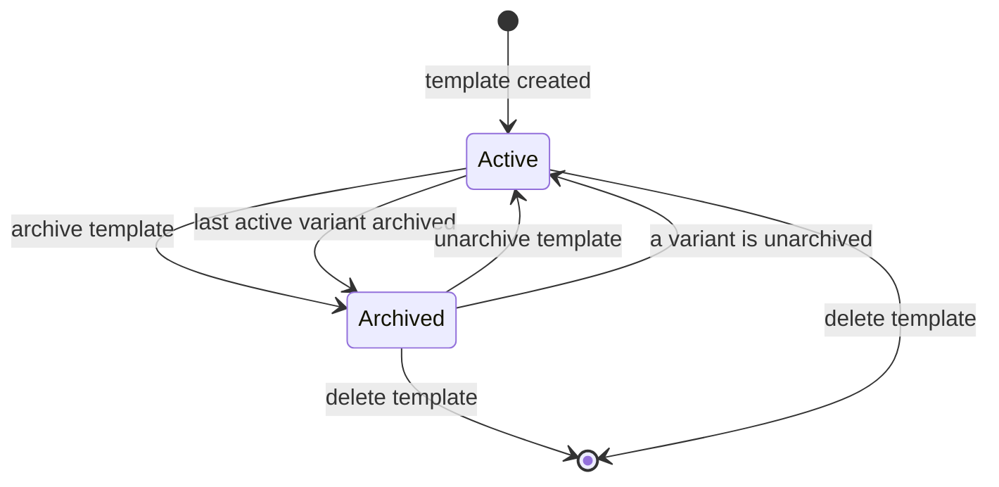
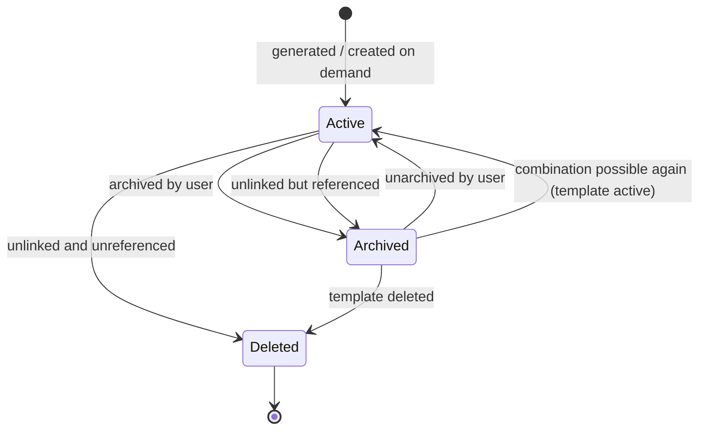
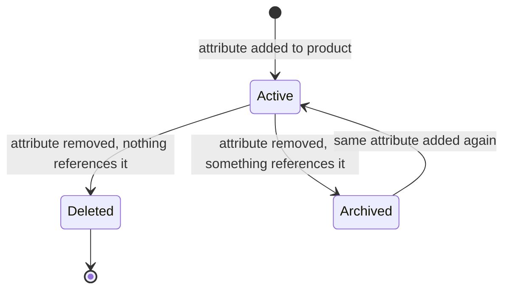
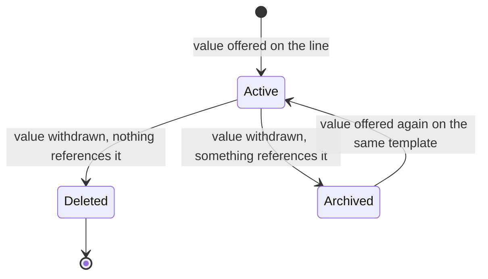
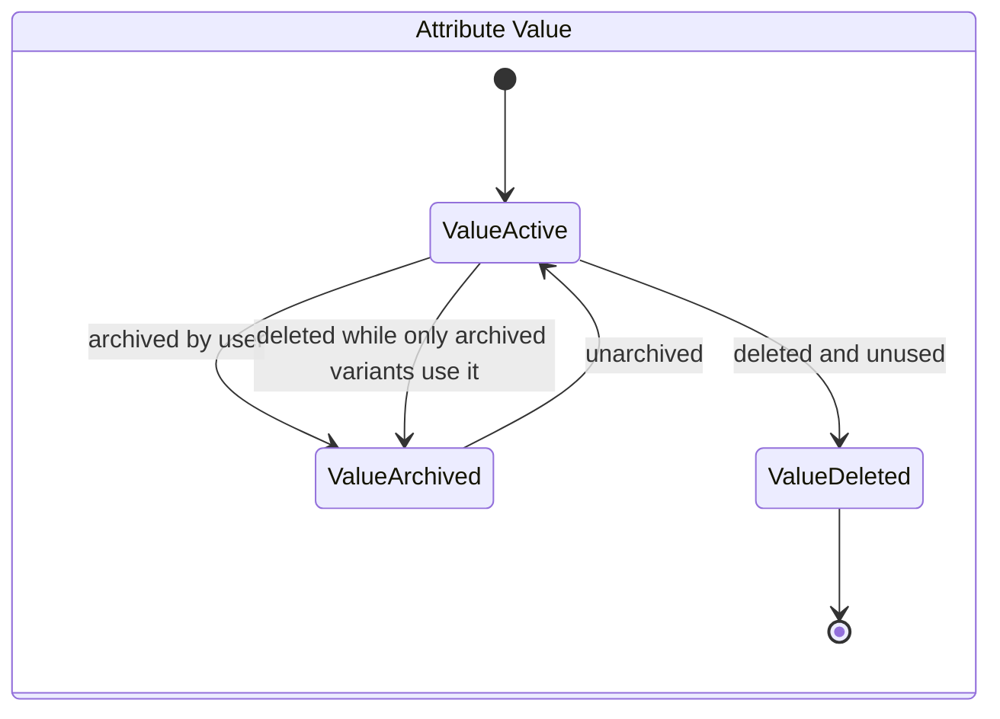
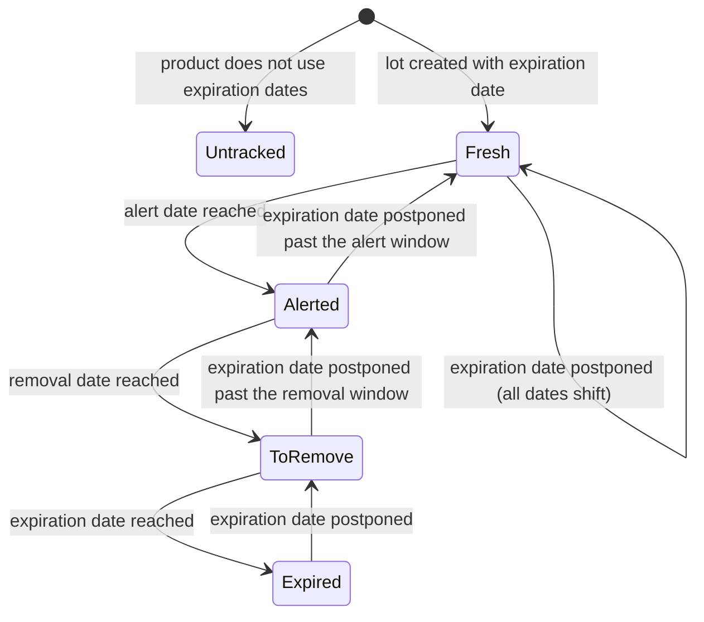
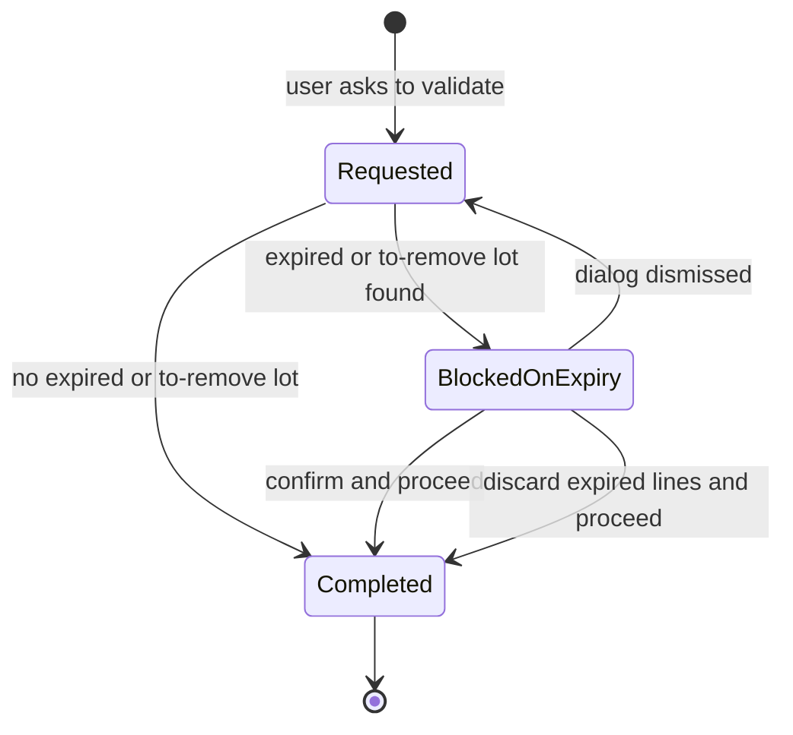

# Products and Catalog — State Machines

This domain holds no document that moves through a draft-confirm-post-cancel sequence. Its
state-like fields are lifecycle flags: activity flags, an "in use" flag, an expiry flag and a
"reminded" flag. They are nonetheless genuine state machines with guards and side effects, and they
interlock across entities — archiving a variant may archive a template, which archives every other
variant. This file specifies each of them completely.

Where a field is a boolean, the two states are named after the value, and the transitions are named
after the operations that cause them.

---

## 1. Product Template activity

**Field** `active` ("active") on `product.template`. **Default** true.

### 1.1 States

| Value | Label | Meaning |
|---|---|---|
| true | Active | The template appears in searches, may be ordered, bought and stocked |
| false | Archived | The template is hidden from ordinary searches; existing documents referencing its variants keep working |

### 1.2 Transitions

| From | To | Trigger | Guards | Side effects |
|---|---|---|---|---|
| Active | Archived | A user archives the template, or a variant is archived leaving no active variant | none | Every variant of the template, archived ones included, is written to archived. No combination of the template is possible while it is archived. |
| Archived | Active | A user unarchives the template, or a variant is unarchived | none | If the template now has no variants at all, variant generation runs. Variants are **not** automatically unarchived: unarchiving a template leaves its variants as they were. |

### 1.3 Diagram

### 1.4 Asymmetry worth noting

Archiving cascades **down** (template to variants); unarchiving does not. A template that was
archived and is then unarchived has all its variants still archived, and because it has no active
variant, archiving it again is a no-op while unarchiving a single variant flips the template back.
To restore a template fully, the variants must be unarchived, which unarchives the template as a
side effect.

---

## 2. Product Variant activity

**Field** `active` ("active") on `product.product`. **Default** true.

### 2.1 States

| Value | Label | Meaning |
|---|---|---|
| true | Active | The variant may be ordered, reserved, moved and invoiced; its combination is possible (subject to the other checks) |
| false | Archived | The variant is hidden; its combination is **not** possible; historical documents referencing it still resolve |

### 2.2 Transitions

| From | To | Trigger | Guards | Side effects |
|---|---|---|---|---|
| — | Active | Variant generation creates the variant | The generation ceiling has not been exceeded | The created variant inherits the template's activity flag |
| — | Active | The create-on-demand procedure creates the variant | The template has a dynamic attribute and the combination is possible | The combination-to-variant cache is cleared |
| Active | Archived | A user archives the variant | none | The template is archived if it is active and now has no active variant. The first-possible-variant cache is cleared. |
| Active | Archived | Variant generation puts the variant in the unlink set and deletion fails | The variant is referenced by a document | Every combo item naming it is deleted |
| Active | (deleted) | Variant generation puts the variant in the unlink set and deletion succeeds | Nothing references the variant | The template is deleted too when this was its last variant and the template has no dynamic attribute. Every combo item naming it is deleted. If it carried a variant image and the template had none, the image moves up to the template. |
| Archived | Active | Variant generation finds the combination possible again and the template is active | The template is active | none |
| Archived | Active | The create-on-demand procedure finds an archived variant | The template has a dynamic attribute **and** the full possibility predicate accepts the combination — which, for a dynamic template with an archived variant, it does **not**. In practice this transition is unreachable through that path. | none |
| Archived | Active | A user unarchives the variant | none | The template is unarchived if it was archived and now has an active variant. The first-possible-variant cache is cleared. |

### 2.3 Diagram

### 2.4 The archive-versus-delete decision

The decision is not a policy setting; it is the outcome of an attempt. The delete-or-archive
procedure tries the batch, halves it on failure, and archives the individual records that still
fail. Practically:

- never referenced → deleted;
- referenced by a document (order line, stock move, valuation layer, reordering rule) → archived;
- referenced by something that also forbids archiving (an active reordering rule, in some
  configurations) → the archive attempt itself fails and the error propagates.

---

## 3. Template Attribute Line activity

**Field** `active` ("active") on `product.template.attribute.line`. **Default** true.

### 3.1 States

| Value | Label | Meaning |
|---|---|---|
| true | Active | The line is part of the template's configuration; its values are materialised and generate variants |
| false | Archived | The line is kept only so that reactivating the same attribute on the same template can reuse it, together with the variants that depend on it |

### 3.2 Transitions

| From | To | Trigger | Guards | Side effects |
|---|---|---|---|---|
| — | Active | A line is created for a (template, attribute) pair with no archived line | none | Value materialisation runs, then variant generation |
| Archived | Active | A line is created for a (template, attribute) pair that has an archived line | The archived line has the same template and the same attribute | The new values are written onto the archived line with materialisation suppressed; materialisation then runs once for the whole batch |
| Active | Archived | Deleting the line fails because something references it | The plain deletion raised | The value list is cleared in the same write, so the "an active line must have a value" validation is not tripped; the template's attribute-line collections are flushed and invalidated; value materialisation runs, which deletes or archives the line's materialised values; variant generation follows |
| Active | (deleted) | Deleting the line succeeds | Nothing references it | The line's active materialised values are deleted first; variant generation then runs on the template |

### 3.3 Diagram

### 3.4 Why archival exists here

A template attribute line cannot simply be deleted when a sales order line, a stock move or a bill
of materials references one of its materialised values. Archiving the line, clearing its values and
letting the materialised values be archived in turn keeps every historical reference resolvable
while removing the line from the configuration. Reactivating the same attribute later restores the
same line, the same materialised values (through the value-materialisation reactivation step) and
therefore the same variants.

---

## 4. Template Attribute Value activity

**Field** `ptav_active` ("template attribute value active") on
`product.template.attribute.value`. **Default** true.

The field is deliberately **not** named `active`, so that the framework's automatic hiding of
archived records does not apply. Archived materialised values must remain visible in configuration
screens and in the names of archived variants.

### 4.1 States

| Value | Label | Meaning |
|---|---|---|
| true | Active | The value is offered by its line; it may enter a combination; it appears in the exclusion pickers |
| false | Archived | The value is no longer offered, but it is still referenced by archived variants and by historical documents |

### 4.2 Transitions

| From | To | Trigger | Guards | Side effects |
|---|---|---|---|---|
| — | Active | Value materialisation finds an offered value with no materialised record | none | The extra price is initialised from the underlying attribute value's default extra price |
| Archived | Active | Value materialisation finds an archived record for an offered value **on the same line** | none | none |
| Archived | Active | Value materialisation finds an archived record for an offered value on the **same template and attribute but a different line** | The record is the first of its group when several exist | The record is re-attached to the current line |
| Active | Archived | Value materialisation no longer finds the value in its line's offered list, and deletion fails | Deletion raised | Variants referencing it were already offered for deletion or archival |
| Active | (deleted) | Value materialisation no longer finds the value, and deletion succeeds | Nothing references it | If the line had exactly one materialised value, the value is first removed from its variants so that they survive; otherwise the related variants are put through the delete-or-archive procedure |
| Active | Archived | The line is archived | — | The line's write clears the value list, so materialisation removes every value |

### 4.3 Diagram

### 4.4 Effect on combinations

An archived materialised value makes every combination containing it impossible, because the
configuration filter requires every member of a combination to be among the line's **active**
materialised values. The exception is the explanation path: when a caller supplies a combination of
interest, the own-exclusion map widens its filter to include that combination's values even when
archived, so that a configurator can say *why* an already-chosen value is now refused.

---

## 5. Attribute activity and Attribute Value activity

**Fields** `active` on `product.attribute` and on `product.attribute.value`. **Default** true in
both cases.

### 5.1 Product Attribute

| From | To | Trigger | Guards |
|---|---|---|---|
| Active | Archived | A user archives the attribute | The attribute's count of related **active** products must be zero, otherwise the operation is refused with "You cannot archive this attribute as there are still products linked to it" |
| Archived | Active | A user unarchives the attribute | none |

### 5.2 Attribute Value

| From | To | Trigger | Guards | Side effects |
|---|---|---|---|---|
| Active | Archived | A user archives the value | none | none |
| Active | Archived | The value is deleted but is referenced only by **archived** variants | At least one variant exists through the materialised values, and none of them is active | The deletion is converted into an archival |
| Active | (deleted) | The value is deleted and is not used on active products | The "used on products" flag is false | The materialised values cascade away |
| Archived | Active | A user unarchives the value | none | none |

### 5.3 Diagram

---

## 6. Product Document activity

**Field** `active` ("active") on `product.document`. **Default** true.

| From | To | Trigger | Side effects |
|---|---|---|---|
| Active | Archived | A user archives the document | The file itself is untouched; the document stops appearing in the product's document list |
| Archived | Active | A user unarchives the document | none |
| Active or Archived | (deleted) | A user deletes the document | The underlying attachment is deleted in the same operation |

---

## 7. Attribute Value "used on products"

**Field** `is_used_on_products` ("is used on products") on `product.attribute.value`. Computed, not
stored.

This is a derived state, not a stored one, but it gates two operations and is therefore listed here.

| Value | Meaning | Gates |
|---|---|---|
| true | At least one template attribute line offering this value belongs to an **active** template | Changing the value's attribute is refused; deleting the value is refused |
| false | No active template offers this value | Both operations are allowed |

A value used only by archived templates therefore reports false and may be deleted — at which point
the archive-instead-of-delete rule of section 5.2 may still convert the deletion into an archival,
if archived *variants* reference it.

---

## 8. Lot expiry state

Two fields on the Lot or Serial Number together describe where a batch sits in its life. Neither is
a selection; the combination of the four dates and the current moment produces five observable
states.

### 8.1 Observable states

Let **now** be the current moment and let the four dates be as computed in
[calculations.md](calculations.md), section 13.

| State | Condition | Consequences |
|---|---|---|
| **Untracked** | The product does not use expiration dates | All four dates are empty; no expiry behaviour applies |
| **Fresh** | now < alert date | Nothing special |
| **Alerted** | alert date ≤ now < removal date | The scheduled reminder creates a to-do activity once, and sets the reminded flag. The two-column display name gains the suffix "Expire on *the expiration date*". |
| **To remove** | removal date ≤ now < expiration date | The available quantity of every stock quantity record of this lot becomes zero. The lot is listed by the "to remove" line of the forecast report. Delivering it opens the expiry confirmation dialog. |
| **Expired** | expiration date ≤ now | The expiry alert flag is true. The two-column display name gains the suffix "Expired". Delivering it opens the expiry confirmation dialog. |

The best-before date has no automatic consequence; it is informational and is printed on the
delivery document when the corresponding group is granted.

### 8.2 Diagram

Every backwards transition happens through the **shift branch** of the derived-date computation:
writing a new expiration date moves all three derived dates by the same signed amount, so a
postponement moves the lot backwards through the states. The one thing that does not come back is
the reminded flag: once the reminder has fired, it never fires again for that lot.

### 8.3 The reminded flag

**Field** `product_expiry_reminded` ("product expiry reminded") on the Lot or Serial Number.
**Default** false.

| From | To | Trigger | Guards |
|---|---|---|---|
| false | true | The scheduled reminder selects the lot | The alert date is at or before today's date. The flag is set even for lots filtered out for having no internal stock. |
| true | false | Never automatically. Only a direct write resets it. |  |

---

## 9. Transfer completion with expired goods

Not a stored state, but a two-step interaction that behaves like one and must be reproduced exactly.

### 9.1 States of the completion attempt

| State | Meaning |
|---|---|
| **Requested** | A user asked to complete the transfer |
| **Blocked on expiry** | The pre-completion check found expired or to-remove lots and opened the confirmation dialog |
| **Confirmed** | The user chose to proceed; the transfer completes with the expiry check suppressed |
| **Cleaned** | The user chose to discard the expired lines; those lines are deleted and the transfer completes |
| **Completed** | The transfer is done |

### 9.2 Transitions

| From | To | Trigger | Guards | Side effects |
|---|---|---|---|---|
| Requested | Blocked on expiry | Pre-completion check | The expiry-suppression flag is absent **and** at least one move line has a lot whose expiry alert flag is true, or a removal date at or before now | The confirmation dialog opens, pre-filled with the transfers, the offending lots, and the first offending line's product name and lot name |
| Requested | Completed | Pre-completion check | No offending line, or the suppression flag is present | none |
| Blocked on expiry | Confirmed → Completed | The user confirms | none | Completion is retried with the expiry-suppression flag set |
| Blocked on expiry | Cleaned → Completed | The user discards expired products | none | Every move line of the listed transfers that uses expiration dates and whose removal date is **strictly before** now is deleted; completion is retried with a cleaned context |
| Blocked on expiry | Requested | The user closes the dialog | none | Nothing happens; the transfer stays in its previous state |

### 9.3 Diagram

---

## 10. Barcode parse outcome

The parse of a scanned string is not a stored state, but its outcome is a closed set of results that
downstream domains branch on, so it is specified here as a state table.

### 10.1 Classic nomenclature

| Outcome | `type` | `encoding` | `code` | `base_code` | `value` |
|---|---|---|---|---|---|
| No rule matched | `error` | empty | the scan (or the last alias reached) | the scan | 0 |
| A product rule matched with no numeric content | the rule's type | the rule's encoding | the possibly re-encoded scan | the sanitised zeroed code | 0 |
| A product rule matched with numeric content | the rule's type | the rule's encoding | the possibly re-encoded scan | the sanitised zeroed code | the decoded number |
| An alias rule matched | not final — the loop continues | — | set to the alias | unchanged | unchanged |

### 10.2 Global Standards One nomenclature

| Outcome | Result |
|---|---|
| Every position of the string consumed | An ordered list of records, one per application identifier |
| Any position not consumable | Nothing at all — no partial list, no error |
| A measure rule with a misconfigured application identifier | A validation error (see [business-rules.md](business-rules.md), section 13.6) |
| A date rule matching a non-date | A validation error (see [business-rules.md](business-rules.md), section 13.7) |

### 10.3 Uniform resource identifier

| Identifier kind | Result |
|---|---|
| `lgtin`, `sgtin`, `sgtin-96`, `sgtin-198` | A two-record list: a product record and a lot record |
| `sscc`, `sscc-96` | A one-record list: a package record |
| Anything else beginning with `urn:` | The string is returned unchanged and is then parsed as an ordinary barcode, which will almost always yield the error outcome |
