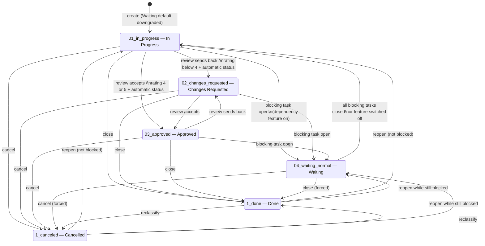
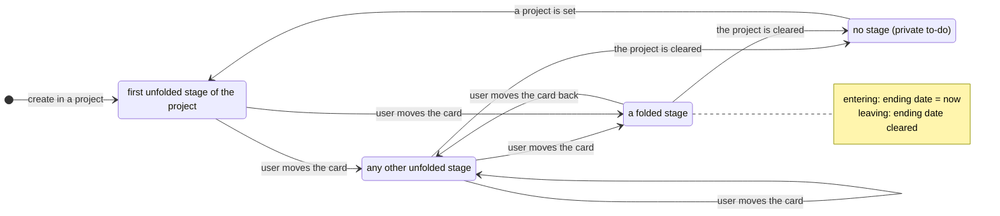
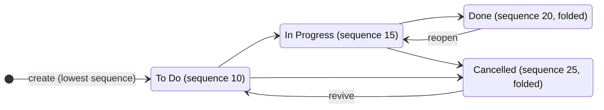
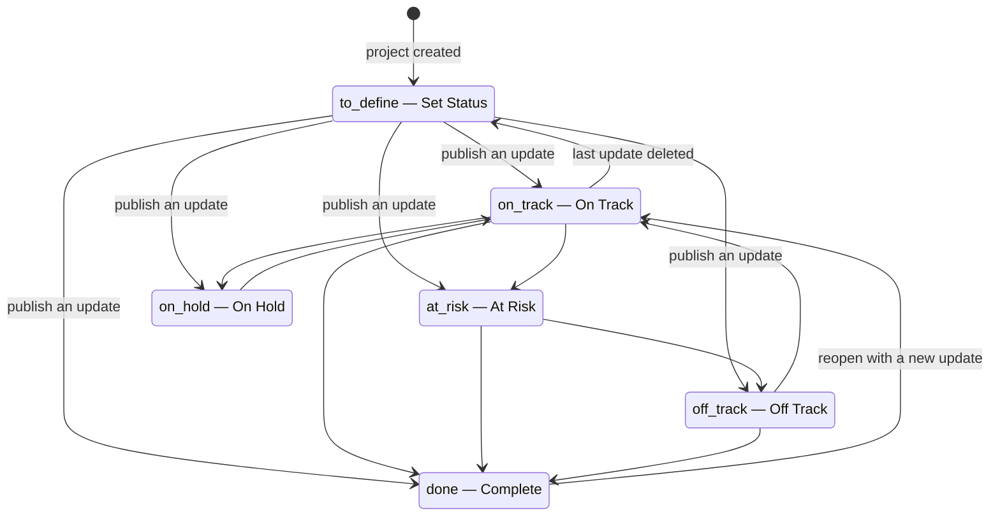
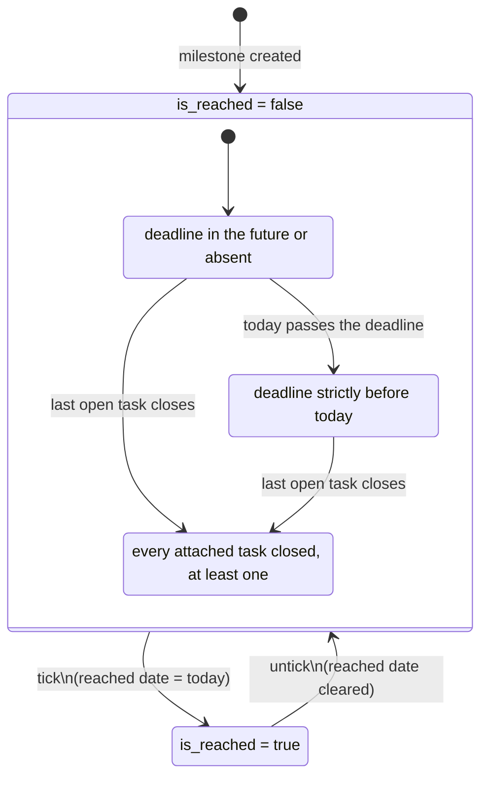
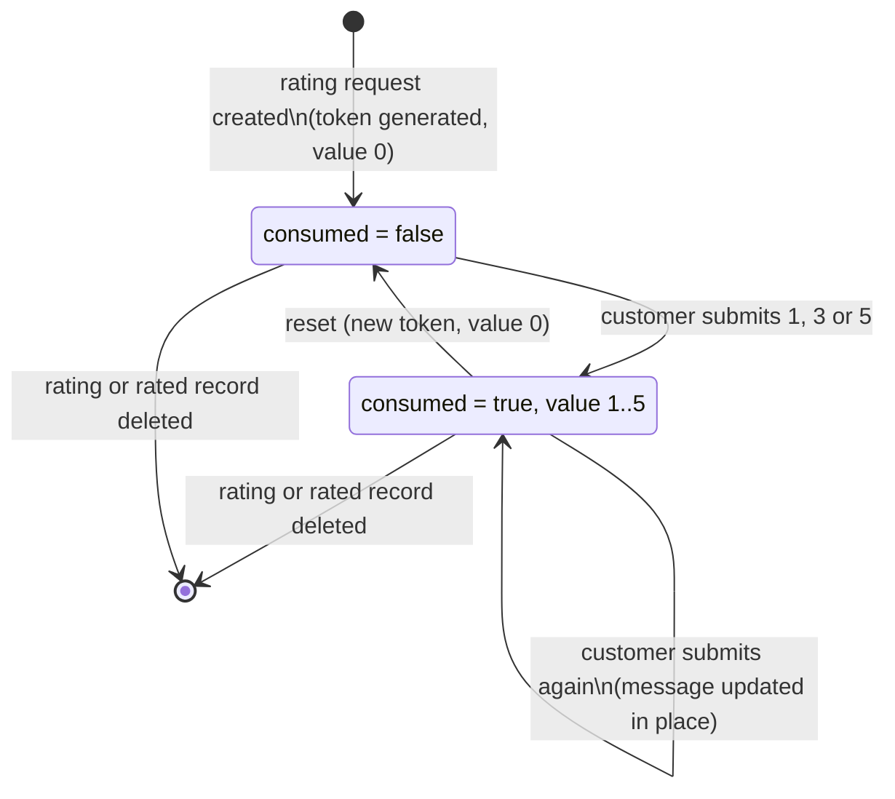
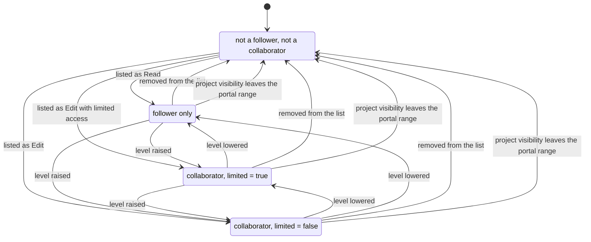

# State machines of the Projects and Tasks domain

This file specifies every field of the domain that behaves as a state: its values, what each value
means, every transition with its trigger, its guard conditions and its side effects, and a
diagram.

The domain has seven such fields:

| # | Entity | Field | Kind |
|---|---|---|---|
| 1 | Task | `state` | A true state machine, partly computed from the dependency graph. |
| 2 | Task | `stage_id` | A free progression through an ordered, project-defined column set. |
| 3 | Task | `active` | An archival flag with cascade. |
| 4 | Project | `stage_id` | A free progression through an ordered, optionally company-scoped column set. |
| 5 | Project | `last_update_status` | A status derived from the latest Project Update. |
| 6 | Milestone | `is_reached` | A two-value lifecycle with a derived date. |
| 7 | Rating | `consumed` | A two-value lifecycle with a token and a reset. |

Two more binary lifecycles are documented here because they behave like states even though they
are plain flags: the Project and Task **template** flag (§8) and the Project Collaborator
**collaboration level** (§9).

---

## 1. The Task state

### 1.1 States

| Value | Label | Meaning | Closed? |
|---|---|---|---|
| `01_in_progress` | In Progress | The task is live and not blocked. This is the neutral, default state. | no |
| `02_changes_requested` | Changes Requested | Work was reviewed and sent back. Reached manually, or automatically from an unsatisfactory customer rating on a stage configured for automatic status. | no |
| `03_approved` | Approved | Work was reviewed and accepted, but the task is not finished. Reached manually, or automatically from a satisfactory customer rating on a stage configured for automatic status. | no |
| `1_done` | Done | The work is finished. | **yes** |
| `1_canceled` | Cancelled | The work will not be done. | **yes** |
| `04_waiting_normal` | Waiting | At least one task that blocks this one is still open. Never chosen directly by a user on a task that is not blocked, and never used at creation. | no |

The set of **closed** states is exactly `{1_done, 1_canceled}`. The set of **open** states is the
complement: `{01_in_progress, 02_changes_requested, 03_approved, 04_waiting_normal}`. Every rule in
the domain that says "closed" or "open" means exactly these two sets.

The stored selection order places Waiting last, after the two closed values. This matters for the
customer-portal sorting by status, which sorts by the selection's declaration order, so a portal
list sorted by status reads: In Progress, Changes Requested, Approved, Done, Cancelled, Waiting.

### 1.2 Where the value comes from

The state is a **stored computed field that remains writable**. Its recomputation depends on the
stage and on the states of the blocking tasks, and it is declared recursive so that a change deep
in a dependency chain propagates.

Recomputation rule, per task:

1. If the task's project has the dependency feature enabled, collect the blocking tasks whose state
   is not closed; otherwise treat that collection as empty.
2. If that collection is non-empty:
   - if the task's own state is not closed, set it to Waiting;
   - if the task's own state **is** closed, leave it alone (a finished task is not dragged back
     into Waiting).
3. If that collection is empty and the task's state is not closed, set it to In Progress.

Consequence: the recomputation **erases** Changes Requested and Approved whenever it runs. Those
two values survive only because the recomputation is triggered by a change of stage or of a
blocking task's state, not by every write.

### 1.3 The write-back routine

Writing the state runs an additional routine whose only purpose is recurrence: it looks at the
recurrence of every task being written, determines for each recurrence the occurrence with the
highest identifier, and asks the recurrence machinery to create the next occurrence for every task
in the write set that is now closed **and** is that highest-identifier occurrence.

### 1.4 Extra corrections applied inside the write routine

After the generic write, for every record:

- **Blocked task forced back to Waiting.** When the project has the dependency feature, the task is
  blocked by at least one open task, and the value just written is neither closed nor Waiting, the
  state is set back to Waiting. This is the "forced done then reopened" case: a user may mark a
  blocked task Done, but if they later set it to In Progress or Approved while it is still
  blocked, it returns to Waiting.
- **Last stage update stamped.** Writing the state sets the last-stage-update timestamp to the
  current moment, exactly as writing the stage does.
- **Project change without a state change.** When the project is written but the state is not,
  every record that is neither Waiting nor closed is forced to In Progress.
- **Reparenting does not reset the state.** When the parent is written, the state is removed from
  the pending recomputation set.

### 1.5 Creation guard

The default-value routine forces a requested default of Waiting to In Progress. A task is
therefore never created in the Waiting state; it can only reach it through the recomputation once
a blocking task exists.

### 1.6 Transition table

| From | To | Trigger | Guard | Side effects |
|---|---|---|---|---|
| — | In Progress | Creation | Always; a requested Waiting default is downgraded to In Progress. | The creation subtype is posted. |
| In Progress | Waiting | A blocking task is added, or a blocking task returns to an open state | The project has the dependency feature. | The "Task Waiting" subtype is posted (unless hidden). Last stage update stamped. |
| Changes Requested / Approved | Waiting | Same | Same | Same. |
| Waiting | In Progress | The last open blocking task closes, or the blocking link is removed, or the project's dependency feature is switched off | — | The "Task In Progress" subtype is posted. |
| any open | Changes Requested | User sets it; or a customer rating below 4 arrives on a stage with automatic status | For the rating path, the stage must have automatic status enabled. | The "Changes Requested" subtype is posted. Last stage update stamped. |
| any open | Approved | User sets it; or a customer rating of at least 4 arrives on a stage with automatic status | Same. | The "Task Approved" subtype is posted. Last stage update stamped. |
| any | Done | User sets it | — | The "Task Done" subtype is posted. Last stage update stamped. If the task is the last occurrence of a recurrence, the next occurrence is created. Every task blocked by it is recomputed and may leave Waiting. |
| any | Cancelled | User sets it | — | The "Task Cancelled" subtype is posted. Last stage update stamped. Recurrence and unblocking behave exactly as for Done. |
| Done / Cancelled | In Progress | User sets it, while the task is **not** blocked | — | The "Task In Progress" subtype is posted. |
| Done / Cancelled | In Progress or Approved | User sets it, while the task **is** blocked | The project has the dependency feature. | The write is corrected to Waiting; the "Task Waiting" subtype is posted. |
| Done / Cancelled | the other closed value | User sets it | — | The corresponding subtype is posted. |

### 1.7 Diagram

### 1.8 Notification subtype per state

| State | Task subtype | Project-level parent subtype |
|---|---|---|
| `01_in_progress` | Task In Progress | Task In Progress |
| `02_changes_requested` | Changes Requested | Changes Requested |
| `03_approved` | Task Approved | Task Approved |
| `1_done` | Task Done | Task Done |
| `1_canceled` | Task Cancelled | Task Canceled |
| `04_waiting_normal` | Task Waiting (hidden by default) | Task Waiting (hidden by default) |

When both the stage and the state change in the same write, the **stage** subtype wins: the
subtype selection checks the stage first.

The "Task Waiting" subtype is removed from the offered subtype list of a single task when the
task's project has the dependency feature off, or, for a task with no project, when the acting user
does not hold the dependency privilege. It is removed from the offered list of a single project
when the project has the feature off.

---

## 2. The Task stage

### 2.1 Nature

The stage is not an enumeration; it is a link to a Task Stage record. The set of reachable values
is the ordered column set of the task's project (plus any stage the task is dragged into, which is
then attached to the project). A private to-do has **no** stage at all.

The stage is a stored computed field that remains writable.

### 2.2 Recomputation

Triggered by a change of project. Per task:

1. Take the task's project, falling back to the parent's project.
2. If a project results and the task's current stage is not attached to that project, replace it by
   the first **unfolded** stage of that project (stage search of
   [entities.md](entities.md) §5.15 with the filter "not folded", ordered by sequence then
   identifier).
3. If no project results, clear the stage.

### 2.3 Default at creation

When the calling context names a default project, the stage defaults to the result of the stage
search ordered by **folded ascending, then sequence, then identifier** — which is the first
unfolded stage, or, when every stage of the project is folded, the first folded one. When there is
no default project the default is empty.

Inside the creation routine the default is computed once per distinct project, so that a batch
creation does not repeat the search.

### 2.4 Side effects of every stage change

| Side effect | Rule |
|---|---|
| Ending date | Entering a folded stage sets the ending date to the current moment; entering an unfolded stage clears it. |
| Last stage update | Set to the current moment. |
| Duration tracking | The tracked-value entry written for the stage change feeds the per-stage seconds map and the burndown series. |
| Staleness | The staleness computation restarts from the new last-stage-update timestamp against the new stage's "days to rot" threshold. |
| Stage subtype | The "Stage Changed" subtype is posted. |
| Stage electronic mail | When the new stage carries an electronic mail template and the task is not a template, that template is sent as an internal note with the light notification layout and without keeping the log. |
| Rating request | When the new stage has the rating switch on and its rating status is `stage`, a rating request is sent immediately to the task's customer. |
| Stage adoption | After creation, any stage used by a new task that is not yet on its project's board is attached to the board. |

### 2.5 Guard

Writing a stage while at least one record in the write set has no project, and the write does not
also set a project, is refused: **"You can only set a personal stage on a private task."**

### 2.6 Diagram

---

## 3. The Task archival flag

| Value | Meaning |
|---|---|
| true | The task is live and appears in every default listing. |
| false | The task is archived: excluded from default listings, still readable when archived rows are explicitly included, still counted by the project counters when the project itself is archived. |

| From | To | Trigger | Side effects |
|---|---|---|---|
| true | false | Archiving the task | Every child that is **not displayed in the project in its own right** is archived recursively. |
| true | false | Archiving the project | Every task of the project, archived ones included, is written with the same flag. |
| true | false | Archiving a task stage | Every task sitting in the stage is archived. |
| true | false | Confirming the Task Stage Deletion Wizard | Every task sitting in the listed stages is archived, then the stages are archived. |
| false | true | Unarchiving the task | No cascade to children. |
| false | true | Unarchiving the project | Every task of the project is reactivated. |
| false | true | Unarchiving a task stage through the wizard | Every archived task sitting in the stage is reactivated. |
| false | true | Duplicating an archived task outside a project copy | The copy is created active. |

---

## 4. The Project stage

### 4.1 Nature

A link to a Project Stage record, available only under the "Use stages on project" privilege. It
is indexed, tracked, not copied, and its default is the project stage with the lowest sequence.

### 4.2 Transitions and side effects

| From | To | Trigger | Guard | Side effects |
|---|---|---|---|---|
| — | lowest-sequence stage | Creating a project | The acting user holds the project-stages privilege. When the calling context names a default stage that belongs to a company, the project also adopts that company. Otherwise the lowest-sequence stage whose company is empty or matches the project's company is used. | — |
| any | any | The user moves the project card | The stage's company, when set, must equal the project's company. | The "Project Stage Changed" subtype is posted. Duration tracking records the seconds spent in the previous stage. When the new stage carries an electronic mail template and the acting user holds the project-stages privilege, that template is sent as an internal note with the light layout and without keeping the log. |
| any | first stage of the new company | Writing the company | The acting user holds the project-stages privilege, the new company differs from the project's current companies, and the project's current stage has a company. | The projects that already had the target company are written separately, without the company key. |
| any | a company-consistent stage | Changing the company in the form | The acting user holds the project-stages privilege and the current stage's company differs from the new company. | The stage is replaced by the first stage in sequence order whose company is the new company or empty. |

### 4.3 Guard

Saving a project whose stage has a company different from the project's company is refused. Two
messages are produced:

- when the project has a company: "This project is associated with *the project's company name*,
  whereas the selected stage belongs to *the stage's company name*. There are a couple of options
  to consider: either remove the company designation from the project or from the stage.
  Alternatively, you can update the company information for these records to align them under the
  same company."
- when the project has no company: "This project is not associated with any company, while the
  stage is associated with *the stage's company name*. There are a couple of options to consider:
  either change the project's company to align with the stage's company or remove the company
  designation from the stage".

### 4.4 Diagram

---

## 5. The Project last update status

### 5.1 Values

| Value | Label | Colour |
|---|---|---|
| `to_define` | Set Status | 0 (grey) |
| `on_track` | On Track | 20 (green) |
| `at_risk` | At Risk | 22 (orange) |
| `off_track` | Off Track | 23 (red) |
| `on_hold` | On Hold | 21 (light blue) |
| `done` | Complete | 24 (purple) |

`to_define` exists only on the Project; a Project Update can never carry it.

### 5.2 Nature

The field is a stored computed field that remains writable, required, defaulting to `to_define`.
Its recomputation reads the project's last update: the status of that update, or `to_define` when
the project has no update.

Writing it with any value other than `to_define` does **not** write the field: it creates a Project
Update instead (see [entities.md](entities.md) §1.7), and the recomputation then pulls the value
back from that update.

### 5.3 Transitions

| From | To | Trigger | Side effects |
|---|---|---|---|
| `to_define` | any non-`to_define` value | The user picks a status on the project, or creates an update explicitly | A Project Update titled `Status Update - <today>` is created with the chosen status, the project's current task counters are captured onto it, and the project's last-update link points at it. |
| any | any other | Same | A new update is created; the previous one remains in the history. |
| any | the previous update's status | Deleting the most recent update | The last-update link falls back to the most recent remaining update by date descending. |
| any | `to_define` | Deleting the last remaining update | The last-update link becomes empty and the status falls back to `to_define`. |

### 5.4 Diagram

---

## 6. The Milestone reached flag

### 6.1 Values

| Value | Meaning |
|---|---|
| false | The delivery point has not been reached. The milestone appears in the project's unreached list, is a candidate for the "next milestone", and is compared against today to detect an exceeded deadline. |
| true | The delivery point has been reached. A reached date is stamped. |

### 6.2 Derived values

| Field | Rule |
|---|---|
| Reached date | Recomputed from the flag: today (in the acting time zone) when the flag is true, empty when false. Toggling the flag off and on again therefore **re-stamps** the date to the new today. |
| Deadline exceeded | True when the flag is false **and** a deadline exists **and** the deadline is strictly before today. |
| Can be marked as reached | For a saved milestone: the flag is false, at least one attached task is closed, and no attached task is open. For an unsaved milestone: the flag is false and every attached task (possibly none) is closed. |

### 6.3 Transitions

| From | To | Trigger | Guard | Side effects |
|---|---|---|---|---|
| false | true | The user ticks the milestone in the project side panel or in the milestone list | none enforced by the system — the "can be marked as reached" flag only drives the interface | Reached date stamped to today. The project's reached count and progress percentage change. The project's "milestone deadline exceeded" and "can mark a milestone as reached" indicators are recomputed. With the sales-linked package, the linked sales order item's delivered quantity is advanced by the milestone's quantity. |
| true | false | The user unticks it | — | Reached date cleared. |

### 6.4 Diagram

---

## 7. The Rating consumption lifecycle

### 7.1 Values

| Value | Meaning |
|---|---|
| `consumed` false | The request exists and carries a token, but no answer has been given. The value is 0 and the text grade is `none`. |
| `consumed` true | The customer answered. The value is between 1 and 5, the text grade is derived from it, the rated-on timestamp is stamped, and a chatter message carries the answer. |

Only **consumed** ratings whose value is at least 1 are counted in any aggregate (task count, task
average, task satisfaction, project count, project average, project satisfaction, analysis
average).

### 7.2 Transitions

| From | To | Trigger | Guard | Side effects |
|---|---|---|---|---|
| — | not consumed | A rating request is prepared for a record and a customer | The acting context must be able to read the record. An **existing** unconsumed rating for the same customer on the same record is reused instead of creating a new one. | A fresh 32-character hexadecimal token is generated. The parent record is resolved and stored. |
| not consumed | consumed | The customer submits the form at the rating address | The submitted value must be one of 1, 3 or 5. A signed-in visitor whose commercial parent differs from the rating's customer's commercial parent is shown an "invalid partner" page instead. | Value, comment and consumption flag are written; the rated-on timestamp is stamped; a chatter message is posted carrying the face image and the comment, authored by the rating's customer, or the existing message is updated in place. When the task's stage has automatic status, the task's state becomes Approved for a value of at least 4 and Changes Requested otherwise. |
| consumed | consumed (new answer) | The customer submits again with the same token | — | The existing message is updated rather than a new one posted. |
| any | not consumed | The reset operation | — | Value 0, no comment, a **new** token, consumption flag false. |
| any | — | Deleting the rating, or deleting the rated record | — | The chatter message carrying the rating is deleted too. |

### 7.3 Delayed sending

A rating may be applied with a two-hour delay: the chatter message is scheduled for the current
moment plus two hours instead of being sent immediately, so that the customer can change their
answer before anyone is notified.

### 7.4 Diagram

---

## 8. The template flag

### 8.1 On a Project

| Value | Meaning |
|---|---|
| false | An ordinary project. It appears in the project lists, may have milestones and updates, and may be selected as a task's project. |
| true | A template. It is excluded from the milestone and update project pickers, from the collaborator project picker and from the customer-portal project pages. Its tasks carry roles. Instantiating it produces an ordinary project. |

| From | To | Trigger | Side effects |
|---|---|---|---|
| false | true | "Create a template from this project" | The project is duplicated with the template flag set, the customer cleared and the source's start and expiration dates kept; the duplicate is put into template mode; a message "Template created from *the source project's name*." is posted on it. If the source project was active, the source is **archived**, and the undo information records that it must be reactivated if the operation is undone. A notification offering "undo" is returned. |
| true | false | "Convert back to a regular project" | A confirmation dialogue is shown. Its message is either the accumulated warnings followed by "Are you sure you want to continue?", or "This project is currently a template. Would you like to convert it back into a regular project?". On confirmation the flag is cleared, the roles are cleared from every task of the project, a message "Template converted back to regular project." is posted, and a success notification with a soft page reload is returned. |
| true | (unchanged) | "Create a project from this template" | A **new** project is created; the template itself is untouched. See [workflows.md](workflows.md). |

With the sales-linked package, converting a template back to a regular project warns "Converting
this template to a regular project will unlink it from its associated products." when at least one
product points at the template, and on confirmation clears that pointer on every such product.

### 8.2 On a Task

| From | To | Trigger | Guard | Side effects |
|---|---|---|---|---|
| false | true | "Convert to template" | The task must have a project; a private to-do is refused with the notification "Private tasks cannot be converted into templates". | The flag is set, the roles are cleared, and the message "Task converted to template" is posted. A notification with an undo offer and a soft reload is returned. |
| true | false | "Convert back" | — | A confirmation dialogue is shown; on confirmation the flag is cleared and "Template converted back to regular task" is posted. |

The derived flag "has a template ancestor" is a stored, recursive computation: true when the task
is a template or its parent has a template ancestor. Searching it is translated into "the task is
a descendant of (or is) one of the template tasks", read with archived rows included and elevated
rights.

---

## 9. The collaboration level

### 9.1 Values

| Level | Stored as | Meaning |
|---|---|---|
| Read | no collaborator row; the person is only a **follower** of the project | The person may open the customer-portal pages of the project and of the tasks they follow. They cannot edit anything. |
| Edit with limited access | a collaborator row with the limited flag **true** | The person may open the embedded project application and edit the tasks **they follow**. They cannot choose which tasks to follow: the follow button is hidden. |
| Edit | a collaborator row with the limited flag **false** | The person may open the embedded project application, see and edit **every** task of the project, and toggle their own followership on any task. |

### 9.2 Transitions

All three transitions are performed by the Project Sharing Wizard.

| From | To | Trigger | Side effects |
|---|---|---|---|
| none | Read | The person is listed at level "Read" | The person is subscribed as a follower of the project, and of every task whose customer is that person or one of that person's children. No collaborator row is created. An invitation is sent through the generic portal-sharing message when the invitation box is ticked. |
| none | Edit | The person is listed at level "Edit" | A collaborator row with the limited flag false is created, but only for people flagged as shareable. Every task of the project subscribes the person as a follower. The person is subscribed to the project. An invitation is sent: existing portal users receive the public link, the others receive a sign-up link. |
| none | Edit with limited access | The person is listed at level "Edit with limited access" | A collaborator row with the limited flag true is created for shareable people. The person is subscribed to the project. Tasks are **not** mass-subscribed — the point of the level is that the person sees only what they are individually made to follow. |
| Edit | Edit with limited access, or the reverse | The level is changed on an existing collaborator | Only the limited flag is updated. |
| Edit / Edit with limited access | Read | The level is lowered to "Read" | The collaborator row is deleted. The person remains a follower. |
| any | none | The person is removed from the list | The collaborator row is deleted and the person is unsubscribed from the project; unsubscribing also deletes any remaining collaborator row of that person on that project. |

### 9.3 The global switch

The very first collaborator row created anywhere in the database activates two dormant security
records — the portal write/create access right on tasks and the portal record rule that scopes it.
Deleting the last collaborator row anywhere deactivates them again. See
[configuration.md](configuration.md).

### 9.4 Diagram

---

## 10. Interaction summary between the state machines

| Event | Task state | Task stage | Milestone | Project status |
|---|---|---|---|---|
| A task is moved into a folded stage | unchanged unless the user also sets it | changes; ending date stamped | if it was the milestone's last open task, the milestone becomes markable as reached | unchanged |
| A task is set to Done | changes | unchanged — **setting the state does not move the card** | as above | unchanged |
| A milestone is ticked | unchanged | unchanged | reached, date stamped | unchanged; the next update will report it |
| A project update is created | unchanged | unchanged | unchanged | changes to the update's status |
| A blocking task is closed | every task it blocked leaves Waiting | unchanged | unchanged | unchanged |
| The dependency feature is switched off on a project | every Waiting task of the project becomes In Progress | unchanged | unchanged | unchanged |
| A customer answers a rating on a stage with automatic status | becomes Approved or Changes Requested | unchanged | unchanged | unchanged |

Note carefully that **the state and the stage are independent**. Moving a card into a stage named
"Done" does not set the state to Done, and setting the state to Done does not move the card. The
only coupling is the ending date, which is driven by the stage's folded flag, and the closed-state
sets, which are driven by the state.
