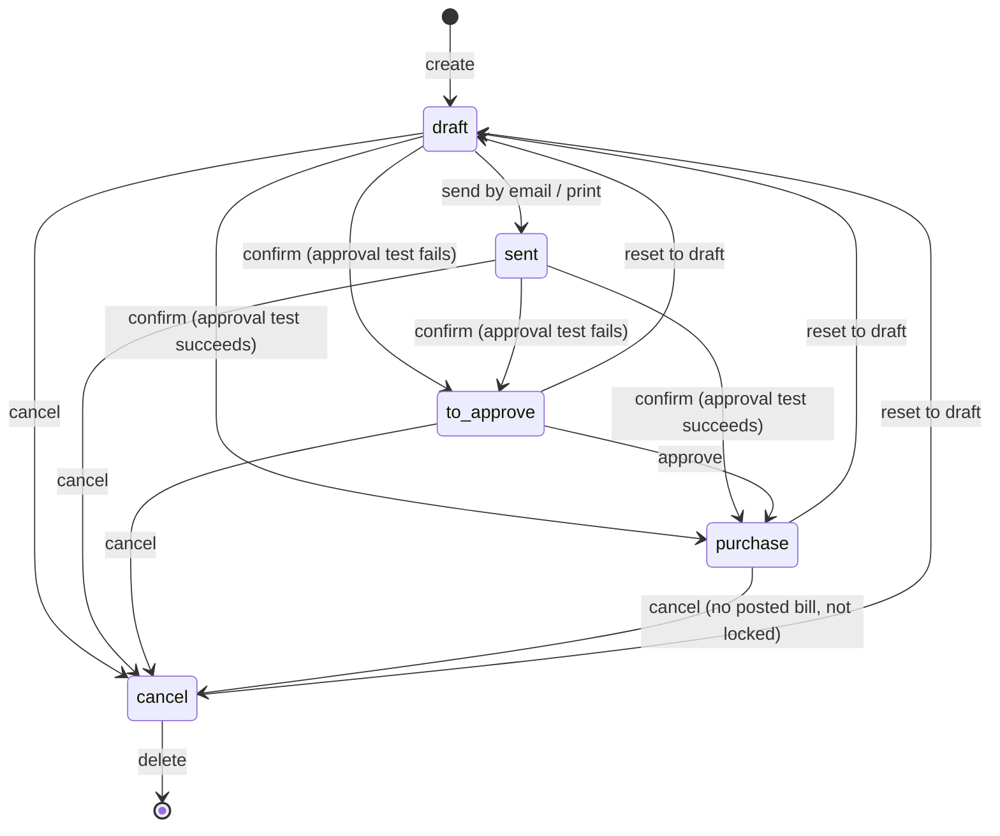
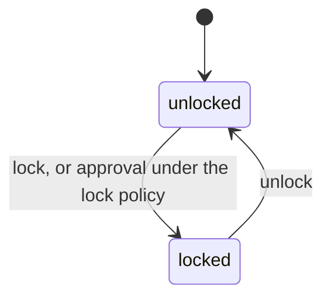
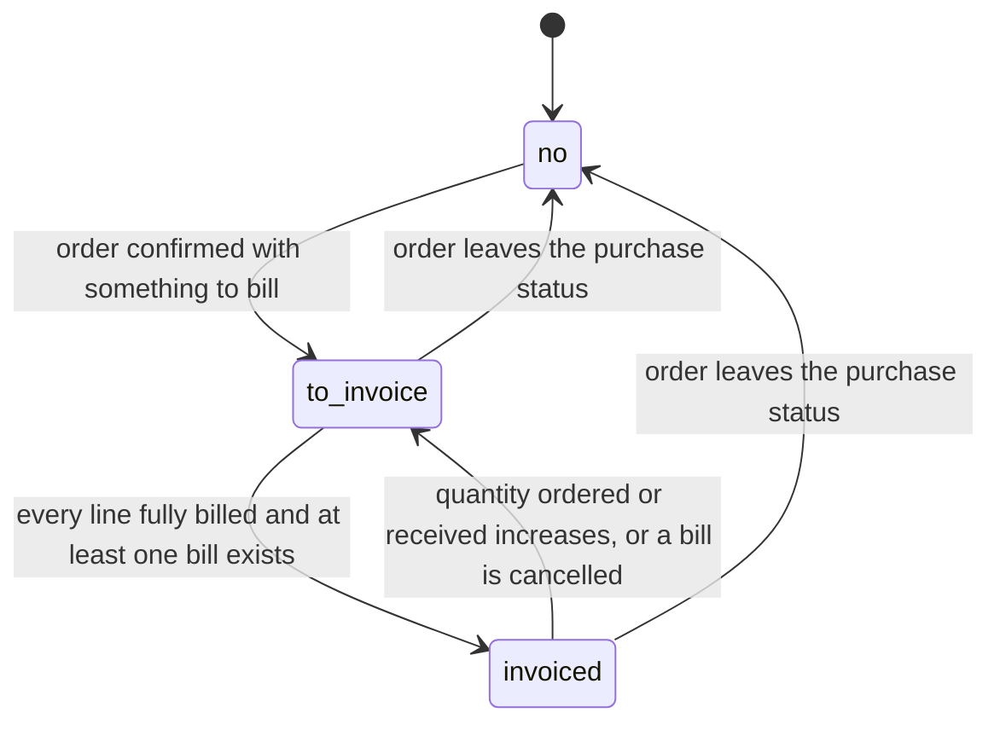
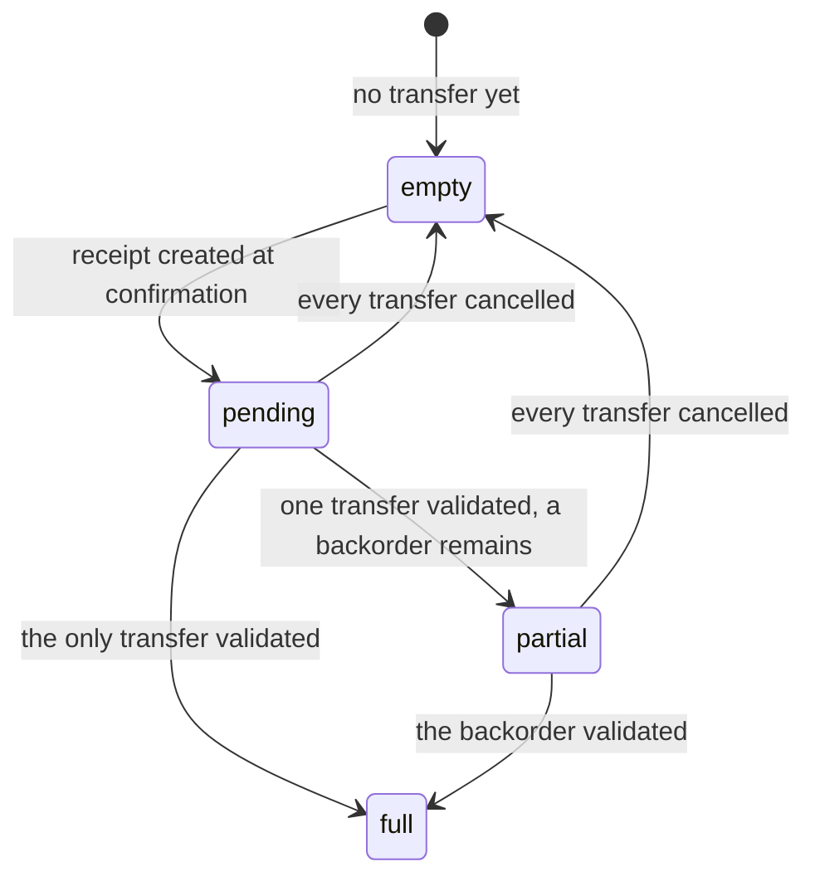

# Purchasing — State Machines

This document specifies every status field of the purchasing domain: the states, their
labels and meanings, the transitions with their triggers, guards and side effects, and a
diagram for each machine. Error messages raised by guards are reproduced exactly; the full
catalogue of messages is in [`business-rules.md`](business-rules.md).

Three kinds of status field appear:

- **Driven statuses** are written by explicit operations. The Purchase Order status
  (`state`) and the Purchase Agreement status (`state`) are of this kind.
- **Derived statuses** are recomputed from other data and can never be written directly. The
  billing status, the receipt status and the line-level received and billed quantities are of
  this kind.
- **Flags** are booleans with their own small lifecycle: locked and acknowledged.

---

## 1. Purchase Order status

**Field** `state` on `purchase.order`. Stored, indexed, tracked in the message thread, not
copied when the record is duplicated, read-only to the user.

### 1.1 States

| Value | Label | Meaning |
|---|---|---|
| `draft` | RFQ | A request for quotation being prepared. Everything is editable. No receipt, no bill, no commitment. This is the state a new record and a duplicate start in. |
| `sent` | RFQ Sent | The same request for quotation, after it has been emailed or printed for the vendor. Behaviourally identical to draft in every guard; the distinction exists so that buyers can see what has left the building and so that the dashboard can count it. |
| `to approve` | To Approve | The buyer has confirmed the request but the amount exceeded the company's double-validation threshold and the buyer is not a purchase administrator. The document waits for a second person. |
| `purchase` | Purchase Order | A committed order. Receipts exist (when inventory is installed), billing is open, vendor prices have been learned, and the confirmation date is set. |
| `cancel` | Cancelled | The order is void. It is the only state from which the record may be deleted. |

### 1.2 Transition table

| From | To | Trigger operation | Guard conditions | Side effects |
|---|---|---|---|---|
| — | `draft` | Create a record | None | The order reference is drawn from the numbering series unless one was supplied. |
| `draft` | `sent` | Send by email (the email composer is opened with the request-for-quotation template, and the message is posted) | The sending context flag must be present | Only records currently in `draft` move; records already further on are untouched. The message thread records the change under the "RFQ Sent" subtype. |
| `draft` | `sent` | Print the quotation document | None | Every selected record in `draft` moves to `sent` before the document is produced. |
| `draft`, `sent` | `to approve` | Confirm | (a) No non-display, non-down-payment line may be missing a product; (b) every line's analytic distribution must satisfy the mandatory-plan rules; (c) the approval test must **fail** (see section 1.3) | Before the status changes: the vendor is registered as a seller of each product that does not have it yet (see [`workflows.md`](workflows.md)). The thread records the change under the "RFQ Confirmed" subtype. |
| `draft`, `sent` | `purchase` | Confirm | (a) and (b) as above; and the approval test must **succeed** | Confirmation proceeds straight through approval; see the next row for the approval side effects. The thread records the change under the "RFQ Confirmed" subtype. |
| `to approve` | `purchase` | Approve | The approval test must succeed for the approving user | The confirmation date is set to now. When the company's order modification policy is "lock", the locked flag is set. When inventory is installed, the receipt is created: transfers, moves, confirmation, reservation and any onward transfers created by push rules. The thread records the change under the "RFQ Approved" subtype. |
| `to approve` | `draft` | Reset to draft | None | No side effect beyond the status change. |
| `purchase` | `draft` | Reset to draft | None. The operation does not itself unwind receipts or bills; see the warning below. | No side effect beyond the status change. |
| `cancel` | `draft` | Reset to draft | None | No side effect beyond the status change. Receipts cancelled earlier are **not** revived. |
| `draft`, `sent`, `to approve`, `purchase` | `cancel` | Cancel | (a) No selected order may be locked; (b) no selected order may have a vendor bill whose status is neither cancelled nor draft | When inventory is installed and before the status changes: every transfer that is neither cancelled nor done is cancelled; every done transfer receives a note saying the order was cancelled; every non-done move of every line is cancelled; downstream moves are cancelled when the line propagates cancellation and otherwise switched to make-to-stock with their status recomputed; downstream moves that were created by more than one purchase line are merely unlinked from this one. |
| `cancel` | (deleted) | Delete | The record must be in `cancel` | Lines are deleted with the order. |

> **Warning on resetting a confirmed order to draft.** The reset operation performs no
> unwinding. It is intended for correcting a premature confirmation. An implementation must
> reproduce this exactly: the status becomes `draft`, and the receipts, moves, learned vendor
> prices and bills that confirmation produced all remain. The derived billing status
> immediately becomes "Nothing to Bill" because that status is forced to `no` outside the
> purchase state, and every line's quantity to bill immediately becomes zero for the same
> reason.

### 1.3 The approval test

The approval test decides whether a confirmation may go straight to `purchase` or must stop
at `to approve`. It is evaluated per order, for the acting user, and succeeds when **any** of
the following holds:

1. The order's company approval policy is one step; or
2. the company policy is two steps **and** the order total, compared in the order currency, is
   strictly below the company's double-validation amount converted from the active company's
   currency into the order currency at the order deadline's date (or today when there is no
   deadline), for the order's company; or
3. the acting user holds the purchase administrator privilege.

The exact conversion and comparison are written out in [`calculations.md`](calculations.md).

When the same operation is applied to several orders at once, the test is applied to each of
them independently: some may reach `purchase` while others stop at `to approve`.

### 1.4 Message-thread subtypes

The change of status posts a tracked message whose subtype depends on where the order came
from and where it goes:

| Previous status | New status | Subtype used |
|---|---|---|
| `to approve` | `purchase` | RFQ Approved |
| anything else | `purchase` | RFQ Confirmed |
| any | `to approve` | RFQ Confirmed |
| any | `sent` | RFQ Sent |
| any | any other | The generic tracking subtype |

All three purchase subtypes are off by default, so following an order does not by itself
produce notifications for them.

### 1.5 Diagram

### 1.6 Interaction with the alternative-order question

When purchase agreements are installed and the order being confirmed belongs to an
alternative group that still holds at least one sibling in `draft`, `sent` or `to approve`,
the confirm operation does **not** change any status. Instead it returns the alternative
warning assistant. Two outcomes are possible:

- *Keep alternatives* — the confirmation proceeds for the selected orders only; the siblings
  stay open.
- *Cancel alternatives* — every sibling that is still in `draft`, `sent` or `to approve` and
  is not itself among the orders being confirmed is cancelled first, then the confirmation
  proceeds.

In both cases the confirmation re-runs with the alternative check suppressed, so the
assistant cannot reappear in a loop.

---

## 2. Purchase Order locked flag

**Field** `locked` on `purchase.order`. Boolean, default false, tracked, not copied.

| Value | Meaning |
|---|---|
| false | The order may be modified and may be cancelled. |
| true | The order is presented as read-only by every screen, and cancellation is refused. |

| From | To | Trigger | Guard | Side effects |
|---|---|---|---|---|
| false | true | Approval, when the company's order modification policy is `lock` | The order must have just reached `purchase` through approval | None beyond the flag. |
| false | true | Lock | None | None. |
| true | false | Unlock | None | None. |

Cancelling a locked order raises: *"Unable to cancel purchase order(s): the order names. You
must first unlock them."*

The lock flag is independent of the status: an order can be locked in the `purchase` status
and can be unlocked again at any time. It is not copied, so a duplicate of a locked order is
unlocked.

---

## 3. Purchase Order acknowledged flag

**Field** `acknowledged` on `purchase.order`. Boolean, default false, tracked, not copied.

| Value | Meaning |
|---|---|
| false | The vendor has not confirmed receipt of the order. The order appears in the "not acknowledged" dashboard counter and remains eligible for the automatic reminder. |
| true | The vendor has confirmed receipt. |

| From | To | Trigger | Guard | Side effects |
|---|---|---|---|---|
| false | true | The buyer presses the acknowledge action on the order | None | None. |
| false | true | The vendor opens the acknowledgement link carried by the order email or by the portal page | The link must carry a valid access token for the order | The flag is set and the portal page re-renders acknowledging the confirmation. |

There is no transition back to false through any operation.

---

## 4. Purchase Order billing status

**Field** `invoice_status` on `purchase.order`. Derived, stored, read-only, not copied,
default `no`. Recomputed whenever the order status changes or any line's quantity to bill
changes.

| Value | Label | Meaning |
|---|---|---|
| `no` | Nothing to Bill | Either the order is not in the `purchase` status, or every line has nothing left to bill and no bill has ever been created for it. |
| `to invoice` | Waiting Bills | At least one non-display line has a non-zero quantity to bill. |
| `invoiced` | Fully Billed | Every non-display line has a zero quantity to bill **and** at least one bill is linked to the order. |

### 4.1 Evaluation algorithm

1. If the order status is not `purchase`, set the value to `no` and stop.
2. Collect the order's lines that have no display type.
3. If any collected line has a quantity to bill that is not zero when compared at the
   product-unit decimal precision, set the value to `to invoice` and stop.
4. Otherwise, if every collected line has a zero quantity to bill and the order has at least
   one linked bill, set the value to `invoiced` and stop.
5. Otherwise set the value to `no`.

Note the asymmetry of step 4: an order in the `purchase` status all of whose lines are
already fully billed but which has no linked bill at all (which happens when every line is a
zero-quantity line, or when the only bills were deleted) falls to `no`, not to `invoiced`.

A quantity to bill may be **negative**, for instance after a return has reduced the received
quantity below the billed quantity under the received-quantity policy. A negative value is
not zero, so the status becomes `to invoice` and the next bill produced will be a vendor
refund.

---

## 5. Purchase Order receipt status

**Field** `receipt_status` on `purchase.order`, present when inventory is installed. Derived,
stored, read-only.

| Value | Label | Meaning |
|---|---|---|
| (empty) | — | The order has no transfer at all, or every transfer is cancelled. |
| `pending` | Not Received | Transfers exist and none of them is done. |
| `partial` | Partially Received | At least one transfer is done and at least one is neither done nor cancelled. |
| `full` | Fully Received | Every transfer is done or cancelled, and at least one is not cancelled. |

### 5.1 Evaluation algorithm

1. If the order has no transfer, or all of its transfers are cancelled, the value is empty.
2. Otherwise, if every transfer is done or cancelled, the value is `full`.
3. Otherwise, if at least one transfer is done, the value is `partial`.
4. Otherwise the value is `pending`.

Order matters: step 2 is tested before step 3, so an order whose only non-cancelled transfer
is done is `full` and not `partial`.

---

## 6. Purchase Agreement status

**Field** `state` on `purchase.requisition`. Stored, required, tracked, not copied,
default `draft`.

### 6.1 States

| Value | Label | Meaning |
|---|---|---|
| `draft` | Draft | The agreement is being prepared. Its type, company, vendor, dates, lines and prices may all change. No vendor pricelist entry has been published. |
| `confirmed` | Confirmed | The agreement is in force. For a blanket order, one vendor pricelist entry exists per line, carrying the negotiated price, and every request for quotation raised against the agreement is priced from those entries. |
| `done` | Closed | The agreement has run its course. The published vendor pricelist entries have been removed, so new requests no longer get the agreed price. |
| `cancel` | Cancelled | The agreement is void. Its published entries have been removed and its draft requests for quotation have been cancelled. |

### 6.2 Transition table

| From | To | Trigger | Guard conditions | Side effects |
|---|---|---|---|---|
| — | `draft` | Create | None | The name is drawn from the numbering series of the chosen type and company. |
| `draft` | `confirmed` | Confirm | (a) The agreement must have at least one line, otherwise: *"You cannot confirm agreement 'the agreement name' because it does not contain any product lines."*; (b) for a blanket order only, every line must have a strictly positive unit price, otherwise: *"You cannot confirm a blanket order with lines missing a price."*; (c) for a blanket order only, every line must have a strictly positive quantity, otherwise: *"You cannot confirm a blanket order with lines missing a quantity."* | For a blanket order, one vendor pricelist entry is created per line, for the agreement's vendor, that product and template, that unit, that price, the agreement's currency, and pointing back at the agreement line. For a purchase template nothing is published. |
| `confirmed` | `done` | Close | No related purchase order may be in `draft`, `sent` or `to approve`, otherwise: *"To close this purchase requisition, cancel related Requests for Quotation.\n\nImagine the mess if someone confirms these duplicates: double the order, double the trouble :)"* | Every vendor pricelist entry published by every line is deleted with elevated rights. |
| `draft`, `confirmed` | `cancel` | Cancel | None | Every vendor pricelist entry published by every line is deleted with elevated rights. Every related purchase order still in `draft` is cancelled and receives the note *"Cancelled by the agreement associated to this quotation."* |
| `confirmed`, `done`, `cancel` | `draft` | Reset to draft | None | No unwinding: entries deleted at closing are not recreated, and cancelled requests are not revived. |

The close operation is only offered for blanket orders; a purchase template has no closing
step because it publishes nothing.

### 6.3 Deletion

Deletion is refused unless every selected agreement is in `draft` or `cancel`:
*"You can only delete draft or cancelled requisitions."* Deleting an agreement first deletes
its lines, which in turn deletes any still-published vendor pricelist entries belonging to a
non-draft, non-cancelled, non-closed agreement.

### 6.4 Diagram

```mermaid
stateDiagram-v2
    [*] --> draft: create
    draft --> confirmed: confirm (lines present; prices and quantities positive for a blanket order)
    confirmed --> done: close (no open request for quotation)
    draft --> cancel: cancel
    confirmed --> cancel: cancel
    confirmed --> draft: reset to draft
    done --> draft: reset to draft
    cancel --> draft: reset to draft
    draft --> [*]: delete
    cancel --> [*]: delete
```

---

## 7. Line-level derived quantities as a state machine

Purchase order lines have no status field of their own — they mirror the order's status. Their
behaviour is nevertheless governed by two derived quantities that behave like a two-axis state
machine, because they decide the order's billing status and what the next bill will contain.

### 7.1 The received quantity

| Method | How the received quantity is produced |
|---|---|
| (empty) | The line has no product. The value stays at zero. |
| `manual` | The value is whatever the manual received quantity holds. Writing the received quantity writes the manual field. |
| `stock_moves` | The value is recomputed from the line's done moves; the manual field is forced to zero. See the algorithm in [`calculations.md`](calculations.md). |

The method itself is derived from the product type: services are always manual; goods are
`stock_moves` when inventory is installed and `manual` otherwise; a line with no product has
no method.

Every change of the received quantity on a line of an order in the `purchase` status posts a
note in the order's message thread, rendered from a dedicated template, unless the change is
being simulated for an accrual computation at a past date.

### 7.2 The quantity to bill

| Order status | Control policy | Quantity to bill |
|---|---|---|
| not `purchase` | any | 0 |
| `purchase` | on ordered quantities | ordered quantity − billed quantity |
| `purchase` | on received quantities | received quantity − billed quantity |

The three possible signs have distinct meanings:

- **positive** — a vendor bill is owed; the order's billing status is "Waiting Bills";
- **zero** — nothing is owed on this line;
- **negative** — the vendor has billed more than is owed, typically after a return; the next
  document the order produces will be converted into a vendor refund automatically, because
  the bill creation routine switches a document whose rounded total is negative to the refund
  type.

---

## 8. Transient assistant lifecycles

Neither assistant has a status field. Their lifecycles are single-shot:

- **Alternative Order Creation Assistant** — created with the originating request; the user
  picks vendors and decides whether to copy products; the single operation creates one
  alternative request per vendor, links them into a group, recomputes their taxes and opens
  them. The assistant record is then abandoned.
- **Alternative Order Warning Assistant** — created by a blocked confirmation; the user picks
  *keep* or *cancel*; the chosen branch runs and the assistant is abandoned.
- **Bill To Purchase Order Assistant** — created from the matching screen; either operation
  runs once and opens the resulting purchase order; the assistant is abandoned.

Transient records are removed by the platform's own housekeeping and have no business
lifecycle of their own.
