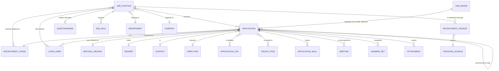

# Recruitment — Entities

This file describes every entity of the recruitment domain in full: its purpose, its
lifecycle, its complete field table, its relations, its uniqueness rules, its defaults, its
computed fields with their rules, its ordering, its display rule, its archival behaviour and
its multi-company behaviour.

Conventions used in every field table:

- **Field (storage name)** — the human name followed, in code font, by the exact storage
  and transport name of the field. Reproduced identifiers are given exactly because
  external contracts depend on them.
- **Type** — the logical type. *Single line text*, *long text*, *rich text*, *whole
  number*, *decimal number*, *true or false*, *date*, *date and time*, *selection*,
  *link to one* (a reference to one record of another entity), *link to many* (a list of
  references stored in an association table), *children* (records of another entity that
  point back at this one), *binary*, *structured document* (a self-describing key-value
  payload), and *custom properties* (a dynamic set of fields whose definition lives on a
  parent record).
- **Meaning and rules** — required/optional, default, computed and from what, stored or
  not, readonly, copy behaviour on duplication, whether changes are tracked in the record's
  message thread, company scoping, indexing, deletion behaviour of the reference, and the
  selection values with their labels.

---

## 1. Entity map

The diagram shows only the structural links. The behavioural links — the target
decrement, the message templates, the interviewer privilege grant — are described in
[workflows.md](workflows.md) and [business-rules.md](business-rules.md).

---

## 2. Application (`hr.applicant`, table `hr_applicant`)

### 2.1 Purpose

An Application is one person presenting themselves for consideration. It is the central
record of the domain. It carries:

- the identity and contact details of the person (name, electronic mail address, telephone
  number, professional network profile address) and an optional link to a Contact record
  holding the same data;
- the position applied for, or nothing at all when the application is spontaneous;
- the evaluation state: the pipeline stage, the readiness colour, the evaluation priority,
  the recruiter and the interviewers;
- the commercial discussion: the salary expected by the person and the salary proposed by
  the organisation, each with a free-text "extra advantages" companion;
- the sourcing attribution: campaign, medium and source;
- the outcome: the hire date and the resulting employee record, or the refusal reason and
  the refusal moment;
- the reusable side: the talent pools the person belongs to and the canonical pool copy of
  the person.

An Application whose pool list is non-empty is called a **talent**. A talent is the
canonical copy of a person kept for future openings; it normally has no Job Position and is
never itself moved through a pipeline.

### 2.2 Identity, ordering and display

| Aspect | Value |
|---|---|
| Transport name | `hr.applicant` |
| Storage name | `hr_applicant` |
| Default ordering | `priority desc, sequence, id desc` — highest evaluation first, then the manual sequence ascending, then most recently created first |
| Display field | `partner_name` (the applicant's name) |
| Display rule | Normally the applicant's name. When the reading context carries the flag `show_partner_name` (used by the attachment list and by some pickers), the display name is forced to the applicant's name even where a different display rule would otherwise apply. An Application with an empty applicant's name displays as an empty string; the form makes the field required, so this only occurs for records created programmatically. |
| Primary electronic mail field | `email_from` — the field the messaging layer treats as the record's own address for reply-address resolution, blacklisting and duplicate-contact resolution |
| Mass-mailing enabled | Yes — the entity may be used as an audience of a mass mailing |
| Stage-duration tracked field | `stage_id` — the messaging layer records, for each pipeline stage, the total number of seconds the record has spent in it |
| Archival | Through the `active` flag. Archiving an Application hides it from every default list; it does not delete it. |
| Multi-company | Through `company_id`, filtered by a global record rule (see [configuration.md](configuration.md#7-record-rules)) |

### 2.3 Complete field table

#### 2.3.1 Identity and contact

| Field (storage name) | Type | Meaning and rules |
|---|---|---|
| Applicant's Name (`partner_name`) | single line text | The person's name. Not required at the storage level but marked required on the form. It is the display field. When an Application is duplicated, the copy's name receives the suffix ` (copy)` unless the duplication is performed by the talent-pool mechanism, which suppresses the suffix through the context flag `no_copy_in_partner_name`. |
| Contact (`partner_id`) | link to one Contact | The Contact record that represents this person in the shared address book. Optional. Not copied on duplication. Indexed (sparse index: only non-empty values are indexed). Deleting the Contact clears the reference. Created on demand by several actions (see [workflows.md](workflows.md#12-contact-record-creation-on-demand)). |
| Email (`email_from`) | single line text, at most 128 characters | The electronic mail address of the person. Stored. Computed from the Contact and writable: setting the Contact copies the Contact's address into this field; writing this field runs the inverse rule of §2.4.2. Copied on duplication. Indexed with a trigram index so that partial-string searches are fast. On creation, leading and trailing whitespace is stripped. |
| Normalized Email (`email_normalized`) | single line text | The canonical lowercase form of the address, produced by the messaging layer from `email_from`. Read-only. Indexed with a trigram index. It is one of the three duplicate-detection keys. |
| Phone (`partner_phone`) | single line text, at most 32 characters | The telephone number. Stored, computed from the Contact and writable, with the same inverse rule as the address. Copied on duplication. Sparse index. |
| Sanitized Phone Number (`partner_phone_sanitized`) | single line text | The telephone number reduced to its international canonical form. Stored, computed, read-only. Sparse index. It is one of the three duplicate-detection keys. Computation is given in §2.4.1. |
| LinkedIn Profile (`linkedin_profile`) | single line text | The address of the person's professional network profile page. Free text; no format validation. Sparse index. It is the third duplicate-detection key. |
| Degree (`type_id`) | link to one Degree | The highest level of education claimed. Optional. Deleting the Degree clears the reference. Its numeric score participates in the skill match score. |
| Availability (`availability`) | date | The date from which the person can start working. Optional. Tracked in the message thread. |
| Applicant Notes (`applicant_notes`) | rich text | Private notes about the person, shown on a dedicated page of the form. Not sent anywhere. |
| Properties (`applicant_properties`) | custom properties | A dynamic set of extra fields whose definition is held by the Job Position in `applicant_properties_definition`. Copied on duplication. When the Job Position changes, properties whose definition disappears are dropped. |

#### 2.3.2 Pipeline and evaluation

| Field (storage name) | Type | Meaning and rules |
|---|---|---|
| Job Position (`job_id`) | link to one Job Position | The opening applied for. Optional: an empty value means a spontaneous application. Restricted by domain to positions of the Application's company when a company is set. Tracked. Indexed. Not copied on duplication. Deleting the Job Position clears the reference. |
| Stage (`stage_id`) | link to one Recruitment Stage | The pipeline column. Stored, computed from the Job Position and writable (see §2.4.5). Deletion of the stage is **restricted**: a stage that still holds applications cannot be deleted. Tracked. Indexed. Not copied on duplication. Restricted by domain to stages that are either unrestricted or attached to the Application's Job Position. The list of stages offered as kanban columns is expanded by the rule of §2.4.12. |
| Last Stage (`last_stage_id`) | link to one Recruitment Stage | The stage the Application was in immediately before the current one. Written automatically on every stage change. Used for lost-case analysis. Deleting the stage clears the reference. |
| Kanban State (`kanban_state`) | selection | The readiness colour inside the current stage. Required. Default `normal`. Not copied on duplication. Values: `normal` — *In Progress*; `done` — *Ready for Next Stage*; `waiting` — *Waiting*; `blocked` — *Blocked*. Writing it also refreshes `date_last_stage_update`. The labels actually displayed come from the stage (see the four legend fields below). |
| Kanban Ongoing (`legend_normal`) | single line text | Read-only mirror of the current stage's grey label. Not stored. Translated. |
| Kanban Valid (`legend_done`) | single line text | Read-only mirror of the current stage's green label. Not stored. Translated. |
| Kanban Waiting (`legend_waiting`) | single line text | Read-only mirror of the current stage's orange label. Not stored. Translated. |
| Kanban Blocked (`legend_blocked`) | single line text | Read-only mirror of the current stage's red label. Not stored. Translated. |
| Evaluation (`priority`) | selection | The recruiter's star rating. Default `0`. Values: `0` — *Normal*; `1` — *Good*; `2` — *Very Good*; `3` — *Excellent*. It is the first sort key, descending, so that the best-rated applications come first. |
| Sequence (`sequence`) | whole number | Manual ordering inside an equal evaluation. Default 10. Indexed. It is the second sort key, ascending. |
| Color Index (`color`) | whole number | A colour slot used by the card view highlight. Default 0. |
| Probability (`probability`) | decimal number | A free numeric estimate of the chance of hiring. Not computed, not used by any rule of this domain; it exists so that automation and reports can carry an estimate. |
| Rotting (`is_rotting`) | true or false | Derived, not stored. True when the Application has stayed in its stage longer than the stage's staleness threshold allows. Full rule in [calculations.md](calculations.md#7-staleness-rotting). |
| Days Rotting (`rotting_days`) | whole number | Derived, not stored. Whole days since the last stage update, or 0 when not stale. |
| Status time (`duration_tracking`) | structured document | Derived, not stored. A map from stage identifier to the number of seconds the Application has spent in that stage, adjusted for refusal (see [calculations.md](calculations.md#6-time-in-stage)). |

#### 2.3.3 Ownership, company and interviewers

| Field (storage name) | Type | Meaning and rules |
|---|---|---|
| Recruiter (`user_id`) | link to one Login User | The person responsible for the application. Stored, computed from the Job Position's recruiter and writable. Tracked. Restricted by domain to non-shared users belonging to the Application's company. Setting it stamps the assignment moment into `date_open`. |
| User Email (`user_email`) | single line text | Read-only mirror of the recruiter's electronic mail address. Not stored. |
| Interviewers (`interviewer_ids`) | link to many Login Users | The people allowed to see and evaluate this individual application even when they are not allowed to see the rest of the pipeline. Association table `hr_applicant_res_users_interviewers_rel`, columns `hr_applicant_id` and `res_users_id`. Indexed. Tracked. Not copied on duplication. Restricted by domain to non-shared users of the Application's company. Adding a user here automatically grants that user the Interviewer privilege; removing the last such attachment revokes it (see [workflows.md](workflows.md#14-granting-and-revoking-the-interviewer-privilege)). Adding a user other than the acting user also sends that user a direct notification. |
| Company (`company_id`) | link to one Company | The company that owns the application. Stored, computed and writable. Tracked. Restricted by domain to the companies the acting user has enabled. Computation in §2.4.3. A global record rule limits visibility to the user's allowed companies plus records with no company. |
| Department (`department_id`) | link to one Department | Stored, computed from the Job Position's department and writable. Tracked. Restricted by domain to departments with no company or with the Application's company. |

#### 2.3.4 Dates and durations

| Field (storage name) | Type | Meaning and rules |
|---|---|---|
| Applied on (`create_date`) | date and time | Creation moment. Read-only. Relabelled from the generic creation stamp; it is the moment the application entered the system, whatever the channel. |
| Assigned (`date_open`) | date and time | The moment a recruiter was first set. Read-only. Written automatically whenever a non-empty recruiter is written, including at creation. |
| Hire Date (`date_closed`) | date and time | The moment the Application entered a stage flagged as the hired stage. Stored, computed and writable. Tracked. Not copied on duplication. Cleared whenever the current stage is not a hired stage. Computation in §2.4.6. |
| Last Stage Update (`date_last_stage_update`) | date and time | The moment of the last stage change or readiness change. Default: creation moment. Indexed. Input to the staleness computation. |
| Refuse Date (`refuse_date`) | date and time | The moment the refusal was applied. Written by the refusal dialog. Used to stop the stage clock at refusal. |
| Days to Open (`day_open`) | decimal number | Derived, not stored, computed with elevated rights. Fractional days between creation and assignment. Formula in [calculations.md](calculations.md#51-days-to-open). |
| Days to Close (`day_close`) | decimal number | Derived, not stored, computed with elevated rights. Fractional days between creation and hire. Formula in [calculations.md](calculations.md#52-days-to-close). |
| Delay to Close (`delay_close`) | decimal number | **Stored**, derived, read-only. Days to Close minus Days to Open. Aggregated as an average in grouped reads. Formula in [calculations.md](calculations.md#53-delay-to-close). |

#### 2.3.5 Salary discussion

All four fields below are readable and writable only by the Officer privilege and above.
They are invisible to the Interviewer privilege: the interviewer form removes the whole
group, and the field-level restriction means an interviewer's read of the record does not
return them at all.

| Field (storage name) | Type | Meaning and rules |
|---|---|---|
| Expected (`salary_expected`) | decimal number | The salary the person asks for. Tracked. Aggregated as an average in grouped reads. Restricted to the Officer privilege. |
| Expected Salary Extra (`salary_expected_extra`) | single line text | Free text describing the extra advantages the person asks for. Tracked. Restricted to the Officer privilege. |
| Proposed (`salary_proposed`) | decimal number | The salary the organisation offers. Tracked. Aggregated as an average. Restricted to the Officer privilege. |
| Proposed Salary Extra (`salary_proposed_extra`) | single line text | Free text describing the extra advantages offered. Tracked. Restricted to the Officer privilege. |

No currency field exists on the Application: the salary numbers are plain decimals, and the
currency in which they are expressed is a convention of the organisation, not data. A
rebuild must reproduce this: **the salary fields are unitless decimals** and are never
converted.

#### 2.3.6 Sourcing attribution

| Field (storage name) | Type | Meaning and rules |
|---|---|---|
| Campaign (`campaign_id`) | link to one Tracking Campaign | The campaign the application is attributed to. Deleting the campaign clears the reference. Indexed. |
| Medium (`medium_id`) | link to one Tracking Medium | How the person reached the organisation, for example by electronic mail, by professional network, or through the website. Deleting the medium clears the reference. Indexed. |
| Source (`source_id`) | link to one Tracking Source | The named origin. Deleting the source clears the reference. Indexed. |

These three fields come from the shared attribution mixin. This domain changes only the
deletion behaviour of the three references, from the mixin's default to *clear the
reference*, so that deleting a campaign or a source never blocks on existing applications.
The domain additionally protects two specific attribution records from deletion; see
[business-rules.md](business-rules.md#12-protection-of-attribution-records).

#### 2.3.7 Outcome

| Field (storage name) | Type | Meaning and rules |
|---|---|---|
| Active (`active`) | true or false | Default true. Indexed. False means archived: the Application disappears from every default list. Refusal sets it to false. |
| Refuse Reason (`refuse_reason_id`) | link to one Refusal Reason | The reason the application was turned down. Tracked. Deleting the reason clears the reference. Setting it is what makes the derived status *refused*. |
| Application Status (`application_status`) | selection | Derived, not stored, searchable. Values: `ongoing` — *Ongoing*; `hired` — *Hired*; `refused` — *Refused*; `archived` — *Archived*. Derivation and search translation in [state-machines.md](state-machines.md#2-application-status-the-derived-lifecycle). |
| Employee (`employee_id`) | link to one Employee | The Employee record created from this Application. Optional. Not copied on duplication. Indexed. Deleting the Employee clears the reference. |
| Employee Active (`emp_is_active`) | true or false | Read-only mirror of the Employee's active flag. Not stored. |
| Employee Name (`employee_name`) | single line text | Mirror of the Employee's name; **writable** (writing it renames the employee). Not stored. Changes are not tracked. |

#### 2.3.8 Duplicates, pools and counters

| Field (storage name) | Type | Meaning and rules |
|---|---|---|
| Application Count (`application_count`) | whole number | Derived, not stored. The number of applications, archived ones included, that are the same person as this one by any of the three duplicate keys or by sharing the canonical pool copy. Counts this Application itself. Excludes talents. Algorithm in [calculations.md](calculations.md#41-application-count). |
| Talent Pools (`talent_pool_ids`) | link to many Talent Pools | The pools this Application belongs to. Association table `hr_applicant_hr_talent_pool_rel`, columns `hr_applicant_id` and `hr_talent_pool_id`. A non-empty value makes this Application a talent. |
| Pool Applicant (`pool_applicant_id`) | link to one Application | The canonical pool copy of the same person. A talent points at itself. A job application that was pooled points at the talent. Indexed. |
| Is Pool Applicant (`is_pool_applicant`) | true or false | Derived, not stored. True when the pool list is non-empty, that is, when this record is itself a talent. |
| Is Applicant In Pool (`is_applicant_in_pool`) | true or false | Derived, not stored, searchable. True when the Application is linked to a pool either directly (it is a talent, or it points at one) or indirectly (it shares one of the three duplicate keys with a directly linked application). Algorithm in [calculations.md](calculations.md#43-pool-membership). |
| Talent Pool Count (`talent_pool_count`) | whole number | Derived, not stored. The number of pools the person is in, resolved through the canonical pool copy, directly or indirectly. Algorithm in [calculations.md](calculations.md#44-talent-pool-count). |
| Tags (`categ_ids`) | link to many Application Tags | Free labels. Association table `hr_applicant_hr_applicant_category_rel`, columns `hr_applicant_id` and `hr_applicant_category_id`. |

#### 2.3.9 Attachments, meetings and messaging

| Field (storage name) | Type | Meaning and rules |
|---|---|---|
| Attachments (`attachment_ids`) | children (Attachments) | The files attached to the Application, resolved as the attachments whose owning model is the Application entity and whose owning identifier is this record. Curriculum vitae, cover letters and any file the person uploaded arrive here. |
| Number of Attachments (`attachment_number`) | whole number | Derived, not stored. A grouped count of the above. |
| Main Attachment (`message_main_attachment_id`) | link to one Attachment | The attachment shown in the side preview panel. Maintained by the messaging layer: the first suitable document attached to the record becomes the main one. |
| Meetings (`meeting_ids`) | children (Meetings) | The calendar meetings whose application reference is this record: the interviews. |
| Meeting Display Text (`meeting_display_text`) | single line text | Derived, not stored, language-dependent. One of *No Meeting*, *1 Meeting*, *Next Meeting*, *Last Meeting*. Rule in §2.4.7. |
| Meeting Display Date (`meeting_display_date`) | date | Derived, not stored. The date shown next to the text above. Rule in §2.4.7. |
| Email cc (`email_cc`) | single line text | Carbon-copy addresses captured from an inbound message; provided by the carbon-copy messaging mixin so that replies keep the original recipients. |
| Bounce (`message_bounce`) | whole number | Counter of undeliverable messages sent to this address; provided by the blacklist mixin. |
| Blacklist (`is_blacklisted`) | true or false | Derived, not stored. True when the normalised address is on the global blacklist. Provided by the blacklist mixin. |
| Phone Blacklisted (`phone_sanitized_blacklisted`) | true or false | Derived, not stored. True when the sanitised number is on the telephone blacklist. Provided by the telephone mixin. |

The Application also carries the full message-thread field set (followers, messages,
unread counters, delivery-error counters, website messages), the full activity field set
(activities, next activity type, deadline, state, summary, responsible user and the
exception decoration) and the rating list. Those come unchanged from
[Messaging and Activities](../messaging-and-activities/README.md); this domain adds
message subtypes and templates on top of them, listed in
[interfaces.md](interfaces.md#8-message-subtypes).

#### 2.3.10 Written interview fields (present when the interview companion is installed)

| Field (storage name) | Type | Meaning and rules |
|---|---|---|
| Survey (`survey_id`) | link to one Questionnaire | Read-only mirror of the Job Position's written interview questionnaire. Not stored. |
| Responses (`response_ids`) | children (Answer Sets) | The answer sets recorded against this Application, one per invitation. |

#### 2.3.11 Skill fields (present when the skills companion is installed)

| Field (storage name) | Type | Meaning and rules |
|---|---|---|
| Skills (`applicant_skill_ids`) | children (Application Skills) | Every skill line ever recorded for this Application, including expired ones. Copied on duplication. |
| Current Applicant Skill (`current_applicant_skill_ids`) | children (Application Skills) | Derived, not stored, writable. The subset of skill lines that are valid today. Rule in [calculations.md](calculations.md#83-current-skills). |
| Skill (`skill_ids`) | link to many Skills | **Stored**, derived, read-only. The distinct skills referenced by the skill lines. Association table `hr_applicant_hr_skill_rel`. It exists so that "applications having any of these skills" can be searched efficiently. |
| Matching Skills (`matching_skill_ids`) | link to many Skills | Derived, not stored. The current skills that the compared Job Position also requires. |
| Missing Skills (`missing_skill_ids`) | link to many Skills | Derived, not stored. The skills the compared Job Position requires and the person does not currently hold. |
| Matching Score (`matching_score`) | whole number | Derived, not stored. The percentage match against the compared Job Position. Formula in [calculations.md](calculations.md#81-applicant-to-position-match-score). The compared position is the one named by the reading context flag `matching_job_id`, or the Application's own position when the flag is absent. |

### 2.4 Computed fields, in detail

#### 2.4.1 Sanitised telephone number

Depends on: `partner_phone`.

For each Application: take the telephone number, hand it to the platform's telephone
formatter (which normalises it to the international form using the country of the record's
company as the default country), and store the result. If the formatter cannot parse the
number, store the raw telephone number unchanged. The field is therefore never empty when
the telephone number is not empty.

#### 2.4.2 Electronic mail address and telephone number, from and to the Contact

Two rules operate on the same pair of fields.

**Forward (Contact → Application).** Depends on: `partner_id`. For each Application that
has a Contact: the electronic mail address is overwritten with the Contact's address
(unconditionally); the telephone number is set from the Contact's number **only when the
Application's telephone number is empty**. Applications with no Contact are left untouched
— this is what allows an Application to carry an address with no Contact behind it.

**Inverse (Application → Contact).** Runs whenever the electronic mail address or the
telephone number is written directly. For each Application:

1. Normalise the written address. If it does not normalise to anything (empty or
   unparseable), do nothing for this Application.
2. If the Application has **no** Contact:
   - If the applicant's name is empty, refuse the write with the message
     `You must define a Contact Name for this applicant.`
   - Otherwise look for an existing Contact with that normalised address; if none exists,
     create one carrying the acting user's language, the applicant's name and the
     Application's telephone number. Attach it to the Application.
3. If the Application **has** a Contact, push the three values down: when the applicant's
   name differs from the Contact's name, rename the Contact; when the normalised address
   differs from the Contact's address, write the Application's address onto the Contact;
   when the Application's telephone number differs from the Contact's number, write it onto
   the Contact.

This makes the Contact the shared, deduplicated identity and the Application the local,
per-position copy. See [business-rules.md](business-rules.md#5-contact-synchronisation)
for the failure modes.

#### 2.4.3 Company

Depends on: `job_id`, `department_id`, `job_id.company_id`.

1. Start with no company.
2. If the Department's company equals the Job Position's company, take that company. (When
   both are empty this comparison succeeds and yields nothing, which is intentional.)
3. If nothing was taken and a Job Position is set, take the Job Position's company.
4. If still nothing, take the acting user's current company.

The field is writable, so a later manual value survives until one of the dependencies
changes again.

#### 2.4.4 Department

Depends on: `job_id`, `job_id.department_id`.

The Department is the Job Position's department. Writable afterwards. When the Job Position
is cleared, the Department is cleared too.

#### 2.4.5 Stage

Depends on: `job_id`.

- When a Job Position is set **and the Application has no stage yet**: choose the first
  stage, in ascending sequence, among the stages that are either unrestricted (attached to
  no position) or attached to this position, and that are **not folded**. If no such stage
  exists, leave the stage empty.
- When the Job Position is cleared: clear the stage.
- When a Job Position is set and a stage is already present: leave it alone. Moving an
  application from one position to another therefore keeps the current stage, which is why
  the stage field's domain also accepts the currently selected stage.

#### 2.4.6 Hire date

Depends on: `stage_id.hired_stage`.

For each Application, in this order:

1. If a stage is set, the stage is flagged as a hired stage, and the hire date is empty →
   set the hire date to the current moment.
2. If the current stage is **not** flagged as a hired stage → clear the hire date.

Note the asymmetry: step 1 never overwrites an existing hire date, so re-entering a hired
stage after leaving it produces a new hire date only because step 2 cleared the old one on
the way out. The field is writable, so a recruiter may correct the recorded hire date by
hand.

#### 2.4.7 Meeting display text and date

Depends on: `meeting_ids`, `meeting_ids.start`, and the display language.

1. Applications with no meeting get the text *No Meeting* and an empty date.
2. For the others, collect the start dates of all meetings. Let the earliest be **first**
   and the latest be **last**.
3. If **first** is today or later, the displayed date is **first**; otherwise it is
   **last**.
4. If there is exactly one meeting, the text is *1 Meeting*. Otherwise, if the displayed
   date is today or later, the text is *Next Meeting*; otherwise it is *Last Meeting*.

#### 2.4.8 Application status

Depends on: `refuse_reason_id`, `date_closed`. Evaluated in this exact order:

1. A refusal reason is set → `refused`.
2. Otherwise the record is archived → `archived`.
3. Otherwise a hire date is set → `hired`.
4. Otherwise → `ongoing`.

The dependency list does not name `active`, so the archived branch is refreshed on the
next read rather than immediately on archiving; the stored facts are nevertheless always
consistent because the value is never stored.

#### 2.4.9 Application count

See [calculations.md](calculations.md#41-application-count) for the full algorithm and a
worked example.

#### 2.4.10 Pool fields

`is_pool_applicant` is simply "the pool list is non-empty".
`is_applicant_in_pool` and `talent_pool_count` resolve direct and indirect links; see
[calculations.md](calculations.md#43-pool-membership) and
[calculations.md](calculations.md#44-talent-pool-count).

#### 2.4.11 Attachment count

A grouped count of attachments whose owning model is the Application entity and whose
owning identifier is in the set being read. Applications with no attachment get 0.

#### 2.4.12 Kanban column expansion

When the pipeline is displayed grouped by stage, the set of columns is not limited to the
stages that currently hold records. The expansion rule is:

1. Start with the condition "the stage is unrestricted" (attached to no position).
2. If the reading context names a default Job Position, add the alternative "the stage is
   attached to that position".
3. If some stages are already in the result set (because they hold records), add the
   alternative "the stage is one of those".
4. Search stages matching the combined condition, with elevated rights, in the stage
   entity's own order (ascending sequence), and return them as the column list.

### 2.5 Creation rules

When one or more Applications are created:

1. For each set of values: if a recruiter is given, stamp the current moment into the
   assignment date. If an electronic mail address is given, strip its leading and trailing
   whitespace.
2. Create the records.
3. Grant the Interviewer privilege to every user named in the interviewers list of any of
   the new records (with elevated rights, because granting a privilege is not something a
   recruiter may normally do).
4. For every new Application that has pools but no canonical pool copy, point the canonical
   pool copy at itself. This is what makes a record created directly with pools a talent.
5. If the union of the interviewers' contacts, minus the acting user's own contact, is not
   empty, then for each new Application send a direct notification to the interviewers of
   that Application other than the acting user, with subject
   `You have been assigned as an interviewer for ` followed by the record's display name,
   and body `You have been assigned as an interviewer for the Applicant ` followed by the
   applicant's name. The notification is sent from the acting user's formatted address, with
   the standard notification layout, describing the model as *Applicant*.

### 2.6 Modification rules

When one or more Applications are written:

1. If a non-empty recruiter is written, stamp the current moment into the assignment date.
2. Remember the interviewers as they are before the write.
3. If the stage is written:
   - stamp the current moment into the last-stage-update date;
   - if the readiness colour is not also being written, reset it to `normal`;
   - **for each record**, record the current stage as the previous stage, and then adjust
     the Job Position's remaining target: if the new stage is a hired stage and the old one
     was not, decrement the remaining target by one **but never below zero**; if the new
     stage is not a hired stage and the old one was, increment the remaining target by one.
     (Because the previous-stage value is written into the shared value set inside the loop,
     writing a stage onto several records at once leaves all of them with the previous stage
     of the last record in the set. A rebuild must reproduce the target arithmetic per
     record; the previous-stage anomaly is noted in
     [business-rules.md](business-rules.md#9-multi-record-stage-writes).)
4. If the readiness colour is written, stamp the current moment into the last-stage-update
   date.
5. Perform the write.
6. For every Application that has a canonical pool copy which is not itself, and which is
   not itself a talent: propagate the electronic mail address, the telephone number, the
   professional network profile address and the degree to the canonical pool copy, but only
   for those of the four that were part of this write.
7. If the interviewers were written: revoke the Interviewer privilege from users who were
   removed and are no longer interviewers anywhere; grant it to the users now present; and
   notify the newly added users, other than the acting user, with the same subject and body
   as at creation.

### 2.7 Duplication rules

- Duplicating a talent is refused with `You cannot duplicate the talent(s).`
- A normal duplication appends ` (copy)` to the applicant's name, unless the context flag
  `no_copy_in_partner_name` is set, which the talent-pool and add-to-job mechanisms do set.
- Fields explicitly not copied: Contact, stage, hire date, Job Position, interviewers,
  readiness colour, Employee. Fields explicitly copied: electronic mail address, telephone
  number, custom properties, and (when the skills companion is installed) the skill lines.

### 2.8 Archival and restoration

- **Archiving** runs with the context flag `just_unarchived` set, which suppresses the
  automatic stage message. The record becomes inactive; its derived status becomes
  *archived* unless a refusal reason is set, in which case it stays *refused*.
- **Restoring** also runs with the flag set, and then re-inserts the Application into the
  pipeline: for every distinct Job Position among the records, find the first non-folded
  stage that is unrestricted or attached to that position, ascending by sequence; write that
  stage onto each Application of that position and clear its refusal reason. An Application
  with no Job Position receives an empty stage. Because the flag suppresses the stage
  message, restoring never sends the stage's template message.

### 2.9 Constraints and indexes

| Rule | Statement |
|---|---|
| Talent must be pooled | An Application whose canonical pool copy is itself must have at least one pool. Violation message: `Talent must belong to at least one Talent Pool.` |
| Pipeline index | A composite index on (Job Position, stage) restricted to active records, named `hr_applicant_job_id_stage_id_idx`, supports the kanban pipeline read. |
| Trigram indexes | On the electronic mail address and on the normalised address, to make partial-string search fast. |
| Sparse indexes | On the Contact, the telephone number, the sanitised telephone number, the professional network profile address, the Employee, the canonical pool copy and the main attachment; only non-empty values are indexed. |
| Attachment content index | A separate trigram index over the extracted text content of attachments belonging to Applications, so that searching "resume's content" is fast. It is created on the attachment table, restricted to rows whose owning model is the Application entity, and uses the accent-insensitive form of the content when the database offers an indexable accent-stripping function. |

---

## 3. Job Position (`hr.job`, table `hr_job`) — the recruitment extension

The Job Position entity itself belongs to
[Human Resources Core](../human-resources-core/README.md). This section documents only what
the recruitment domain adds to it, plus the base fields that recruitment rules read or
write.

### 3.1 Base fields this domain relies on

| Field (storage name) | Type | Meaning for recruitment |
|---|---|---|
| Job Position (`name`) | single line text | Required, translated, trigram-indexed. Used as the alias name fallback and in every message template subject. |
| Target (`no_of_recruitment`) | whole number | **The remaining number of people to hire.** Default 1. Not copied on duplication. A database check constraint forbids negative values, with the message `The expected number of new employees must be positive.` This is the field the hire event decrements. |
| Current Number of Employees (`no_of_employee`) | whole number | Derived, not stored. The number of Employee records pointing at this position. Readable by the Interviewer privilege and by the Human Resources Officer privilege. |
| Total Forecasted Employees (`expected_employees`) | whole number | Derived, not stored. Current employees plus remaining target. Same privilege restriction. |
| Requirements (`requirements`) | long text | Free text. Same privilege restriction. |
| Recruiter (`user_id`) | link to one Login User | Default: the acting user. Tracked. Same privilege restriction. Becomes the default recruiter of every Application of this position. |
| Department (`department_id`) | link to one Department | Tracked, sparse index, company-checked. |
| Company (`company_id`) | link to one Company | Default: the acting user's company. Tracked. |
| Employment Type (`contract_type_id`) | link to one Contract Type | Tracked. Shown on the public page and used as a public filter. |
| Job Description (`description`) | rich text | Shown on the public page. |
| Active (`active`) | true or false | Default true. Archiving a position archives all of its applications (see §3.5). |
| Sequence (`sequence`) | whole number | Default 10. First sort key. |
| Uniqueness | — | The triple (name, company, department) must be unique. Violation message: `The name of the job position must be unique per department in company!` |
| Default ordering | — | `sequence, name asc` (the recruitment extension changes the base ordering from sequence alone to sequence then name). |

### 3.2 Fields added by the recruitment domain

Every field in this table is restricted to the Interviewer privilege or above unless stated
otherwise. "Restricted to the Interviewer privilege" means: users without that privilege do
not receive the field at all when reading the record.

| Field (storage name) | Type | Meaning and rules |
|---|---|---|
| Job Location (`address_id`) | link to one Contact | Where the successful applicant will work. Tracked. Default: the location of the most recently created position among the acting user's companies, or, if there is none, the contact record of the acting user's current company. Restricted by domain to contacts that are children of the companies' contacts and are neither of the *contact* kind nor of the *private* kind, plus the companies' own contacts. Not privilege-restricted. |
| Job Applications (`application_ids`) | children (Applications) | Every Application of this position, archived ones excluded by default. |
| Application Count (`application_count`) | whole number | Derived, not stored. Count of active applications. |
| All Application Count (`all_application_count`) | whole number | Derived, not stored. Count of applications that are active, or inactive **and refused**. Archived-without-reason applications are excluded. |
| Open Application Count (`open_application_count`) | whole number | Derived, not stored. Count of active applications whose stage is not a hired stage. Help text: *Number of applications that are still ongoing (not hired or refused)*. |
| New Application (`new_application_count`) | whole number | Derived, not stored. Count of active applications sitting in the first stage available to this position. Algorithm in [calculations.md](calculations.md#22-new-application-count). |
| Old Application (`old_application_count`) | whole number | Derived, not stored. Application Count minus New Application Count. |
| Applicants Hired (`applicant_hired`) | whole number | Derived, not stored. Count of applications of this position currently sitting in any hired stage. |
| Hired (`no_of_hired_employee`) | whole number | **Stored**, derived. Count of applications of this position that have a hire date, whether active or archived. Not copied on duplication. Recomputed whenever any application's hire date changes. |
| Interviewers (`interviewer_ids`) | link to many Login Users | The people who may see **all** applications of this position. Association table `hr_job_res_users_rel`. Restricted by domain to non-shared users of the position's company. Help text: *The Interviewers set on the job position can see all Applicants in it. They have access to the information, the attachments, the meeting management and they can refuse him. You don't need to have Recruitment rights to be set as an interviewer.* |
| Extended Interviewer (`extended_interviewer_ids`) | link to many Login Users | **Stored**, derived, read-only. The union of the interviewers named on the individual applications of this position. Association table `hr_job_extended_interviewer_res_users`. Computed with full rights because the underlying read is protected. It exists so that "which positions can this interviewer reach?" is answerable without scanning applications. |
| Department Manager (`manager_id`) | link to one Employee | **Stored**, read-only mirror of the department's manager. Tracked. Restricted to the Interviewer privilege or the Human Resources Officer privilege. |
| Documents (`document_ids`) | children (Attachments) | Derived, not stored, read-only. The union of the attachments owned by the position itself and the attachments owned by its applications that have **not** yet produced an employee. |
| Document Count (`documents_count`) | whole number | Derived, not stored. The size of the above. |
| Employee Count (`employee_count`) | whole number | Derived, not stored, **not** privilege-restricted. Count of employees holding this position within the acting user's allowed companies, read with elevated rights. |
| Alias (`alias_id`) | link to one Alias | The inbound electronic mail alias of the position. Required by the alias mixin. Deletion is restricted. Help text: *Email alias for this job position. New emails will automatically create new applicants for this job position.* |
| Email Alias (`alias_email`) | single line text | Derived, not stored, read-only. The full inbound address. |
| Color Index (`color`) | whole number | Card colour. Not privilege-restricted. |
| Is Favorite (`is_favorite`) | true or false | Derived, not stored, writable. True when the acting user is in the favourites list. Writing it adds or removes the acting user. Sorting by it is translated into a subquery over the favourites association table. |
| Favorite User (`favorite_user_ids`) | link to many Login Users | Association table `job_favorite_user_rel`, columns `job_id` and `user_id`. Default at creation: the acting user — but see §3.4, where creation overrides this. |
| Industry (`industry_id`) | link to one Industry | Tracked. Used as a public filter. |
| Expected Degree (`expected_degree`) | link to one Degree | The level of education the position expects. Participates in the skill match score. |
| Activity Count (`activity_count`) | whole number | Derived, not stored, depends on the acting user. The number of the acting user's own open activities on active applications of this position that are not in a hired stage. Algorithm in [calculations.md](calculations.md#24-personal-activity-count). |
| Properties (`job_properties`) | custom properties | Extra fields whose definition lives on the company in `job_properties_definition`. |
| Applicant Properties (`applicant_properties_definition`) | custom properties definition | The definition of the extra fields that every Application of this position carries. |
| Job Source (`job_source_ids`) | children (Recruitment Sources) | The named origins configured for this position. |

### 3.3 Fields added by the companions

| Field (storage name) | Type | Added by | Meaning and rules |
|---|---|---|---|
| Interview Form (`survey_id`) | link to one Questionnaire | Interview questionnaires | The written interview attached to the position. Sparse index. Help text: *Choose an interview form for this job position and you will be able to print/answer this interview from all applicants who apply for this job* |
| Skills (`job_skill_ids`) | children (Job Skills) | Skills | The skills the position requires, each at a level. |
| Current Job Skill (`current_job_skill_ids`) | children (Job Skills) | Skills | Derived, not stored, writable. The required skills valid today. |
| Skill (`skill_ids`) | link to many Skills | Skills | **Stored**, derived, read-only. The distinct required skills, for fast search. |
| Matching Score(%) (`applicant_matching_score`) | decimal number | Skills | Derived, not stored. The match of one named Application against this position, used when browsing positions for a given person. The Application is named by the reading context flag `active_applicant_id`. Restricted to the Interviewer privilege. Formula in [calculations.md](calculations.md#82-position-to-applicant-match-score). |
| Website description (`website_description`) | rich text | Public job pages | The rich content of the public page. Translated as rich text. Defaults to a shipped page skeleton. |
| Process Details (`job_details`) | rich text | Public job pages | Complementary information shown on the application page. Translated. Defaults to a shipped block describing answer time, process and time to offer. |
| Visible on current website (`website_published`) | true or false | Public job pages | Whether the position is offered publicly. Tracked. Setting it also sets the generic publication flag; clearing it clears the generic flag. |
| Published Date (`published_date`) | date | Public job pages | **Stored**, derived, read-only. Today's date while published; empty while unpublished. |
| job URL (`full_url`) | single line text | Public job pages | Derived, not stored. The absolute address of the public page, built by joining the instance's base address with the relative page address, falling back to the job list path. |
| Website URL (`website_url`) | single line text | Public job pages | Derived, not stored. The relative public path `/jobs/` followed by the position's readable identifier. |
| Website (`website_id`) | link to one Website | Public job pages | Restricts the position to one website. Deletion restricted. |
| Can Publish (`can_publish`) | true or false | Public job pages | Derived, not stored. Whether the acting user is allowed to publish. |
| Search-engine metadata | several | Public job pages | Title, description, keywords, social image and the readable identifier name, from the shared metadata mixin. |

### 3.4 Creation and modification rules added by this domain

**Creation.** Before creating, the favourites list of every new position is forced to the
value present in the submitted values or, when absent, to the empty list. This deliberately
cancels the field's own default, so a position created through the interface starts with no
favourite unless one was passed explicitly. After creation, every named interviewer is
granted the Interviewer privilege.

**Modification.** In order:

1. Remember, per position, the current interviewers, the current department manager and the
   current recruiter.
2. If the write deactivates the position, deactivate all of its applications first.
3. Perform the write.
4. If the interviewers changed: revoke the privilege from the removed users who are no
   longer interviewers anywhere, and grant it to the current ones.
5. If the recruiter changed, then for each position: unsubscribe from the position's message
   thread those contacts of the **previous** recruiter that are not related contacts of the
   department manager; do the same on the position's ongoing applications that were assigned
   to the previous recruiter; and reassign those applications to the new recruiter without
   sending assignment notifications.
6. If the department or the recruiter changed, rewrite the alias default values (see §3.6),
   because the alias is created once at position creation and its defaults would otherwise
   go stale.

### 3.5 Archival

Archiving a Job Position archives every Application attached to it. When the public job
pages companion is installed, archiving also unpublishes the position (only positions that
were active are touched, so re-archiving an already archived position does not clear the
flag again).

### 3.6 The inbound alias

Every Job Position owns an inbound electronic mail alias. Its creation values are:

| Alias setting | Value |
|---|---|
| Target model | the Application entity |
| Default values | the existing defaults, with the position, the position's department, the company (the department's company if it has one, else the position's company) and the position's recruiter written in |

An inbound message sent to the alias therefore creates an Application already attached to
the position, the department, the company and the recruiter. The message-to-application
conversion is specified in [workflows.md](workflows.md#4-an-application-arriving-by-electronic-mail).

Applications inherit their reply address from their position: the reply-to address of a
message posted on an Application is the alias of its Job Position when it has one, and the
ordinary catch-all resolution otherwise.

---

## 4. Recruitment Stage (`hr.recruitment.stage`, table `hr_recruitment_stage`)

### 4.1 Purpose

A Recruitment Stage is one column of the hiring pipeline. Stages are global by default and
may be restricted to specific Job Positions. Exactly the stages that are unrestricted or
attached to a position appear in that position's pipeline.

One stage attribute has a business consequence rather than a presentational one: the
**hired stage** flag. Entering a hired stage is the hire event.

### 4.2 Identity and ordering

| Aspect | Value |
|---|---|
| Transport name | `hr.recruitment.stage` |
| Storage name | `hr_recruitment_stage` |
| Default ordering | `sequence` ascending |
| Display field | `name` |
| Archival | None — stages have no active flag |
| Multi-company | None — stages are global |

### 4.3 Field table

| Field (storage name) | Type | Meaning and rules |
|---|---|---|
| Stage Name (`name`) | single line text | Required. Translated. |
| Sequence (`sequence`) | whole number | Default 10. The ordering key; also decides which stage is "first" for a position. |
| Job Specific (`job_ids`) | link to many Job Positions | Association table `hr_job_hr_recruitment_stage_rel`, columns `hr_recruitment_stage_id` and `hr_job_id`. Empty means the stage is available to every position. Non-empty means only those positions use it. Help text: *Specific jobs that use this stage. Other jobs will not use this stage.* |
| Requirements (`requirements`) | long text | What is expected of a candidate to pass this stage. Shown as the column tooltip in the pipeline. |
| Email Template (`template_id`) | link to one Message Template | If set, a message built from this template is posted on the Application when it enters this stage. Deleting the template clears the reference. Help text: *If set, a message is posted on the applicant using the template when the applicant is set to the stage.* |
| Folded in Kanban (`fold`) | true or false | When true, the column is collapsed when it holds no record, and the stage is **excluded from the "first stage" search**. This is why the shipped hired stage is folded: a new application never lands in it. |
| Hired Stage (`hired_stage`) | true or false | When true, entering this stage stamps the hire date and decrements the position's remaining target. Help text: *If checked, this stage is used to determine the hire date of an applicant* |
| Days to rot (`rotting_threshold_days`) | whole number | Default 0. The number of days an application may sit in this stage before it is reported as stale. Zero disables staleness for this stage. Help text: *Day count before applicants in this stage become stale. Set to 0 to disable. Changing this parameter will not affect the rotting status/date of resources last updated before this change.* |
| Red Kanban Label (`legend_blocked`) | single line text | Required, translated. Default *Blocked*. The label shown for the blocked readiness colour while an application is in this stage. |
| Orange Kanban Label (`legend_waiting`) | single line text | Required, translated. Default *Waiting*. |
| Green Kanban Label (`legend_done`) | single line text | Required, translated. Default *Ready for Next Stage*. |
| Grey Kanban Label (`legend_normal`) | single line text | Required, translated. Default *In Progress*. |
| Is Warning Visible (`is_warning_visible`) | true or false | Derived, not stored. True when the stage **was** a hired stage, is being edited to no longer be one, and applications currently sit in it. The form uses it to warn the configurator that hire dates are about to be cleared. |

### 4.4 Default-value rule

When a stage is created from a context that names a default Job Position — for example
from the "add a column" control inside one position's pipeline — the default position is
**removed** from the context before the defaults are computed, unless the context also
carries the flag `hr_recruitment_stage_mono`. The effect is that a stage created from
inside a position's pipeline is global by default, not restricted to that position; the
configurator must restrict it explicitly. The flag exists for the places that do want the
restriction.

### 4.5 Deletion

A stage referenced by any Application cannot be deleted: the Application's stage reference
is declared with restricted deletion. The configurator must first move or delete the
applications.

---

## 5. Refusal Reason (`hr.applicant.refuse.reason`, table `hr_applicant_refuse_reason`)

### 5.1 Purpose

A named reason for turning an application down, optionally carrying the message template
that should be offered when that reason is chosen.

### 5.2 Field table

| Field (storage name) | Type | Meaning and rules |
|---|---|---|
| Description (`name`) | single line text | Required. Translated. This is the display field. |
| Sequence (`sequence`) | whole number | Default 10. Not copied on duplication. The ordering key; also decides which reason the refusal dialog offers first. |
| Email Template (`template_id`) | link to one Message Template | Restricted by domain to templates whose model is the Application entity. Deleting the template clears the reference. |
| Active (`active`) | true or false | Default true. Archiving a reason removes it from the picker without touching the applications already refused for it. |

| Aspect | Value |
|---|---|
| Default ordering | `sequence` ascending |
| Display field | `name` |
| Multi-company | None |

### 5.3 Interaction with the refusal dialog

The refusal dialog defaults to the **first** reason in sequence order. When a reason is
chosen, the dialog adopts that reason's template — but only if the template is itself
active; an archived template yields no template and therefore no message. See
[workflows.md](workflows.md#7-refusing-an-application).

---

## 6. Application Tag (`hr.applicant.category`, table `hr_applicant_category`)

| Field (storage name) | Type | Meaning and rules |
|---|---|---|
| Tag Name (`name`) | single line text | Required. Must be unique across all tags; violation message: `Tag name already exists!` |
| Color Index (`color`) | whole number | Default: a pseudo-random whole number between 1 and 11 inclusive, drawn at creation, so that new tags get visually distinct colours without configuration. |

| Aspect | Value |
|---|---|
| Default ordering | by identifier |
| Display field | `name` |
| Archival | None |
| Multi-company | None |

Tags are attached to Applications and, separately, to Talent Pools. Adding applicants to a
pool through the dialog copies the dialog's tags onto the resulting talents.

---

## 7. Degree (`hr.recruitment.degree`, table `hr_recruitment_degree`)

### 7.1 Purpose

A level of education, with a numeric score used as one component of the skill match score.

### 7.2 Field table

| Field (storage name) | Type | Meaning and rules |
|---|---|---|
| Degree Name (`name`) | single line text | Required. Translated. Must be unique; violation message: `The name of the Degree of Recruitment must be unique!` |
| Score (`score`) | decimal number | Required. Default 0. A fraction between 0 and 1 inclusive, presented to the user as a percentage. A database check constraint enforces the range with the message `Score should be between 0 and 100%`. |
| Sequence (`sequence`) | whole number | Default 1. |

| Aspect | Value |
|---|---|
| Default ordering | by identifier |
| Display field | `name` |
| Archival | None |
| Multi-company | None |

---

## 8. Recruitment Source (`hr.recruitment.source`, table `hr_recruitment_source`)

### 8.1 Purpose

A named origin of applications for one Job Position — a job board, a partner site, a
referral programme. Each source can own its own inbound electronic mail alias (so that
applications arriving through it are attributed automatically) and exposes its own public
tracking address (so that clicks arriving through it are attributed automatically).

### 8.2 Field table

| Field (storage name) | Type | Meaning and rules |
|---|---|---|
| Name (`name`) | single line text | Mirror of the underlying Tracking Source's name; writable through it. Not stored here. |
| Source (`source_id`) | link to one Tracking Source | Required. The shared attribution record. Deletion restricted — and additionally protected by the rule of [business-rules.md](business-rules.md#12-protection-of-attribution-records). |
| Job (`job_id`) | link to one Job Position | The position this source advertises. Indexed. Deleting the position deletes the source. |
| Alias ID (`alias_id`) | link to one Alias | The inbound address dedicated to this source. Optional until created. Deletion restricted. |
| Email (`email`) | single line text | Read-only mirror of the alias's display name, that is, the full inbound address. Not stored. |
| Has Domain (`has_domain`) | single line text | Derived, not stored. Whether an alias domain is available: the alias's own domain when an alias exists, otherwise the domain of the position's company or, failing that, of the acting user's company. The interface uses it to hide the "create an address" control when no domain is configured. |
| Medium (`medium_id`) | link to one Tracking Medium | Default: the shared medium named *website*, fetched or created on demand. |
| Campaign (`campaign_id`) | link to one Tracking Campaign | Optional. |
| Tracker URL (`url`) | single line text | Derived, not stored (present when the public job pages companion is installed). The public page address of the position with the three attribution parameters appended. Formula in [interfaces.md](interfaces.md#63-per-source-tracking-address). |

| Aspect | Value |
|---|---|
| Default ordering | by identifier |
| Display field | the Tracking Source's name |
| Archival | None |
| Multi-company | Through the position |

### 8.3 Creating the dedicated alias

The operation *create the address* builds, for every source of the set that does not yet
have one, an alias with:

| Alias setting | Value |
|---|---|
| Default values | the position, the shipped recruitment campaign, the shared medium named *email* (fetched or created), and this source's Tracking Source |
| Alias domain | the position's company's alias domain, or the acting user's company's alias domain |
| Target model | the Application entity |
| Local part | the position's alias local part if it has one, otherwise the position's name, then a plus sign, then the source's name |
| Parent record | the Job Position |

Before the alias is created, the acting user's permission to **create** a Recruitment Source
is verified explicitly, because the alias itself is then created with elevated rights. This
is the pattern used throughout the platform: check the caller's right on the record they own,
then perform the privileged side effect.

A companion operation *create the address and return it* performs the same and returns the
resulting address as a string, for the interface's copy-to-clipboard control.

### 8.4 Deletion

Deleting a Recruitment Source deletes its alias as well, with elevated rights, so that no
orphan inbound address survives.

---

## 9. Job Board (`hr.job.platform`, table `hr_job_platform`)

### 9.1 Purpose

An external job board that forwards applications by electronic mail from its own address
rather than from the candidate's address. Recognising such a sender changes how an inbound
message is turned into an Application: no Contact is attached, no address is stored on the
Application, and the candidate's name is extracted from the message text with a pattern.

### 9.2 Field table

| Field (storage name) | Type | Meaning and rules |
|---|---|---|
| Name (`name`) | single line text | Required. The display field. |
| Email (`email`) | single line text | Required. Must be unique; violation message: `The Email must be unique, this one already corresponds to another Job Platform.` Normalised to its canonical lowercase form on creation and on every write that provides it; if normalisation fails, the raw value is kept. Help text: *Applications received from this Email won't be linked to a contact. There will be no email address set on the Applicant either.* |
| Regex (`regex`) | single line text | The extraction pattern applied to the message subject and to the message body to recover the candidate's name. Help text: *The regex facilitates to extract information from the subject or body of the received email to autopopulate the Applicant's name field* |

| Aspect | Value |
|---|---|
| Default ordering | by identifier |
| Archival | None |
| Multi-company | None |
| Who may configure | The Administrator privilege only |

### 9.3 Shipped job boards

| Name | Sender address | Extraction pattern | What the pattern captures |
|---|---|---|---|
| Linkedin | `jobs-listings@linkedin.com` | `New application:.*from (.*)` | everything after the word *from* on the line that begins with *New application:* |
| Jobsdb | `cs@jobsdb.com` | `from (.+?) for` | the shortest run of characters between *from* and the next *for* |
| Indeed | `no-reply@indeed.com` | `^([^ ]+ [^ ]+)` | the first two space-separated words of the text |

The pattern language is the platform's standard pattern language: `.` matches any
character, `*` means "zero or more", `+` means "one or more", `+?` means "one or more, as
few as possible", `^` anchors at the start, `[^ ]` means "any character other than a
space", and round brackets mark the part to capture. A rebuild must apply the pattern to
the subject first and to the body second, concatenate all captures in that order, and take
the first one.

---

## 10. Talent Pool (`hr.talent.pool`, table `hr_talent_pool`)

### 10.1 Purpose

A named, managed collection of candidates kept for future openings. Adding an ordinary
Application to a pool does not move it: it creates (or reuses) a **talent**, a positionless
copy of the person that is the canonical record for pooling, and links the original
Application to it.

### 10.2 Field table

| Field (storage name) | Type | Meaning and rules |
|---|---|---|
| Title (`name`) | single line text | Required. Translated. The display field. |
| Active (`active`) | true or false | Default true. |
| Company (`company_id`) | link to one Company | Default: the acting user's current company. Tracked. |
| Pool Manager (`pool_manager`) | link to one Login User | Default: the acting user. Tracked. Restricted by domain to non-shared users of the pool's company. |
| Talent (`talent_ids`) | link to many Applications | The talents in the pool. Association table `hr_applicant_hr_talent_pool_rel` — the same table as the Application's pool list, seen from the other side. Readable by any internal user. |
| # Talents (`no_of_talents`) | whole number | Derived, not stored. A grouped count of applications whose pool list contains this pool. Help text: *The number of talents in this talent pool.* |
| Talent Pool Description (`description`) | rich text | Free description. |
| Color (`color`) | whole number | Default: a pseudo-random whole number between 1 and 11 inclusive. |
| Tags (`categ_ids`) | link to many Application Tags | Labels applied to the pool, and copied onto talents added through the dialog. Association table `hr_applicant_category_hr_talent_pool_rel`. |

| Aspect | Value |
|---|---|
| Default ordering | by identifier |
| Display field | `name` |
| Messaging | The pool carries a message thread and followers |
| Multi-company | Through `company_id`; no record rule restricts it, so pools of other companies remain visible to the Officer privilege |

### 10.3 The operation "create a talent in this pool"

Opens a blank Application form with the pool pre-filled, titled *Create Talent*. Because
the Application creation rule points a pooled Application's canonical pool copy at itself,
the record saved from that form is immediately a talent.

---

## 11. Application Skill (`hr.applicant.skill`, table `hr_applicant_skill`)

Present when the skills companion is installed. It is the Application-side twin of the
Employee Skill entity of [Human Resources Core](../human-resources-core/README.md), built
on the same shared individual-skill definition.

| Field (storage name) | Type | Meaning and rules |
|---|---|---|
| Applicant (`applicant_id`) | link to one Application | Required. Indexed. Deleting the Application deletes the skill line. |
| Skill (`skill_id`) | link to one Skill | Required. Deleting the skill deletes the line. |
| Skill Level (`skill_level_id`) | link to one Skill Level | Required. Deleting the level deletes the line. |
| Skill Type (`skill_type_id`) | link to one Skill Type | Required. Deleting the type deletes the line. |
| Validity Start (`valid_from`) | date | Start of the validity window. |
| Validity Stop (`valid_to`) | date | End of the validity window. A line with an empty or future end date is *current*. |
| Progress (`level_progress`) | whole number | Read-only mirror of the level's progress percentage, from zero knowledge to fully mastered. |
| Certification (`is_certification`) | true or false | Read-only mirror of the skill type's certification flag. |
| Levels Count (`levels_count`) | whole number | Read-only mirror of the number of levels the skill type offers. |
| Color (`color`) | whole number | Read-only mirror of the skill type's colour. |
| Display Warning Message (`display_warning_message`) | true or false | Set by the interface when the chosen combination is inconsistent. |
| Certification Skill Type Count (`certification_skill_type_count`) | whole number | Derived, not stored. Used by the interface to decide whether to offer the certification layout. |

| Aspect | Value |
|---|---|
| Default ordering | `skill_type_id, skill_level_id desc` — grouped by type, strongest level first |
| Display field | the skill |
| Linked-record field name | `applicant_id` — the shared definition uses this to know which record owns the line |

**Current skills.** Grouping all lines by (Application, skill), a line is current when its
end date is empty or not before today. If, for a skill whose type is a certification, no
line is current, then the single line with the latest end date is treated as current
anyway, so that an expired certification still shows. Full rule in
[calculations.md](calculations.md#83-current-skills).

---

## 12. Extensions to entities of other domains

### 12.1 Employee (`hr.employee`)

| Field (storage name) | Type | Meaning and rules |
|---|---|---|
| Applicants (`applicant_ids`) | children (Applications) | The applications that produced this employee. Readable by the Human Resources Officer privilege. |

Two behaviours are added:

- The set of contacts considered related to an employee is extended with the contacts of
  the employee's applications, read with elevated rights. This matters for the
  unsubscribe rule of §3.4 step 5 and for the employee's contact counter.
- **When an Employee is created with a non-empty application list**, a log line is written
  on each of those applications reading `Employee created: ` followed by a link to the new
  employee bearing the employee's name.

### 12.2 Department (`hr.department`)

| Field (storage name) | Type | Meaning and rules |
|---|---|---|
| New Applicant (`new_applicant_count`) | whole number | Derived, not stored, computed with elevated rights. For users holding at least the Interviewer privilege: the number of applications of this department whose stage sequence is at most 1. For everyone else: zero. |
| New Hired Employee (`new_hired_employee`) | whole number | Derived, not stored. The sum of the *Hired* counter over the department's job positions. |
| Expected Employee (`expected_employee`) | whole number | Derived, not stored. The sum of the remaining target over the department's job positions. |

When the public job pages companion is installed, the department's display name is computed
with elevated rights, because public visitors browsing the job list must see department
names without being able to read departments.

### 12.3 Contact (`res.partner`)

| Field (storage name) | Type | Meaning and rules |
|---|---|---|
| Applicants (`applicant_ids`) | children (Applications) | The applications that name this contact. |

### 12.4 Login User (`res.users`)

No field is added. Two operations are added and are used by the Application and Job Position
write rules:

- **Grant the Interviewer privilege.** Given a set of users, drop those who already hold the
  Officer privilege (they do not need the narrower one), and add the Interviewer privilege
  to the rest, with elevated rights.
- **Revoke the Interviewer privilege.** Given a set of users, compute the set of users that
  are still named as interviewer on at least one Job Position or on at least one
  Application, add to it the users holding the Officer privilege, and remove the Interviewer
  privilege from every user of the input set that is in neither, with elevated rights.

### 12.5 Meeting (`calendar.event`)

| Field (storage name) | Type | Meaning and rules |
|---|---|---|
| Applicant (`applicant_id`) | link to one Application | Sparse index. Deleting the Application clears the reference. |

Behaviour added:

- **Defaults.** When the creation context names a default application, the meeting is
  pre-filled with the Application entity as the related model, the Application as the
  related record, the default participants and the default name from the context. Whatever
  the path, if no application is set but the related model resolves to the Application
  entity, the application reference is filled from the related record identifier.
- **Attachment copying.** After meetings are created, if the acting user may read
  applications and the creation context named a default application, every attachment of
  that Application is duplicated onto every created meeting as a binary attachment bearing
  the same name.
- **Highlighting.** When the calendar is opened from an Application, the meetings of that
  Application are highlighted.

### 12.6 Questionnaire (`survey.survey`) and Answer Set (`survey.user_input`)

| Field (storage name) | Type | Meaning and rules |
|---|---|---|
| Survey kind (`survey_type`) | selection | Extended with the value `recruitment` — *Recruitment*. When the referenced questionnaire kind is removed, records fall back to the default kind. |
| Job Position (`hr_job_ids`) | children (Job Positions) | The positions using this questionnaire as their written interview. |
| Applicant (`applicant_id`) | link to one Application | On the Answer Set: which application this set of answers belongs to. Sparse index. |

Behaviour added:

- The recruitment kind is offered to users holding the Interviewer privilege or the
  questionnaire-author privilege.
- A user who is not a questionnaire author, opening a recruitment questionnaire, is shown
  the simplified recruitment form instead of the full editor.
- The operation "show completed answer sets", when run on a recruitment questionnaire,
  restricts the result to recruitment questionnaires.
- When an Answer Set linked to an Application is marked complete, a message is posted on the
  Application reading `The applicant "` followed by the applicant's name and
  `" has finished the survey.`, authored by the platform's system contact.

### 12.7 Periodic Digest (`digest.digest`)

| Field (storage name) | Type | Meaning and rules |
|---|---|---|
| New Employees (`kpi_hr_recruitment_new_colleagues`) | true or false | Whether the digest includes the new-colleagues indicator. Enabled on the shipped default digest. |
| New Employees value (`kpi_hr_recruitment_new_colleagues_value`) | whole number | Derived, not stored. The company-scoped count of employees created in the digest period. Computing it raises an access error, with the text `Do not have access, skip this data for user's digest email`, for any user who does not hold the Officer privilege; the digest sender catches that error and omits the indicator for that recipient. |

The indicator's click-through target is the employee list of the people register.

---

## 13. Transient dialogs

Transient dialogs are not stored records; they exist for the duration of one interaction.
They are listed here because their fields are part of the domain's contract: a rebuild must
offer the same inputs and apply the same rules.

### 13.1 Refusal dialog (`applicant.get.refuse.reason`)

| Field (storage name) | Type | Meaning and rules |
|---|---|---|
| Refuse Reason (`refuse_reason_id`) | link to one Refusal Reason | Required. Default: the first reason in sequence order. |
| Applications (`applicant_ids`) | link to many Applications | The applications being refused. |
| Send Email (`send_mail`) | true or false | Stored in the dialog, computed and writable, precomputed. True when the adopted template exists and is active **and** no selected application lacks an address. |
| Email Template (`template_id`) | link to one Message Template | Computed from the reason and writable, precomputed. Restricted by domain to templates of the Application entity. Empty when the reason has no template or the template is archived. |
| Applicant(s) not having email (`applicant_without_email`) | long text | Derived. Empty when all selected applications have an address; otherwise the sentence `You can't select Send email option.` followed by a new line, `The email will not be sent to the following applicant(s) as they don't have an email address:` and the comma-separated names of those applications. |
| Refuse Duplicate Applications (`duplicates`) | true or false | Whether the duplicates should be refused too. |
| Duplicates Count (`duplicates_count`) | whole number | Derived. How many other ongoing applications match the selection by any duplicate key. |
| Duplicate Applications (`duplicate_applicant_ids`) | link to many Applications | Computed from the flag and writable. Association table `applicant_get_refuse_reason_duplicate_applicants_rel`. When the flag is set it holds every matching application; when it is clear it is empty. |
| Duplicate domain (`duplicate_applicant_ids_domain`) | binary | Derived. The search condition described in [calculations.md](calculations.md#42-refusal-duplicate-set). |
| Attachments (`attachment_ids`) | link to many Attachments | Copied from the template; writable. Search access bypassed so that template attachments remain reachable. |
| Scheduled Date (`scheduled_date`) | single line text | Copied from the template; writable. Help text: *send emails after that date. This date is considered as being in UTC timezone.* |
| Subject / Body | single line text / rich text | From the shared message-composition definition. Copied from the template and, when exactly one application is selected, rendered against it so the user sees the final text. |

### 13.2 Message dialog (`applicant.send.mail`)

| Field (storage name) | Type | Meaning and rules |
|---|---|---|
| Applications (`applicant_ids`) | link to many Applications | Required. Read with archived records included. |
| Author (`author_id`) | link to one Contact | Required. Default: the acting user's contact. |
| Attachments (`attachment_ids`) | link to many Attachments | Search access bypassed. Each attachment is duplicated per recipient application when sending. |
| Subject / Body / Template | from the shared message-composition definition | The rendering model is fixed to the Application entity. |

### 13.3 Add-to-pool dialog (`talent.pool.add.applicants`)

| Field (storage name) | Type | Meaning and rules |
|---|---|---|
| Applicants (`applicant_ids`) | link to many Applications | Required. Restricted by domain to applications that either are talents already or are not linked to any pool, so that the same person cannot be pooled twice through different copies. |
| Talent Pool (`talent_pool_ids`) | link to many Talent Pools | The pools to add to. |
| Tags (`categ_ids`) | link to many Application Tags | Labels to apply to the resulting talents. |

### 13.4 Add-to-job dialog (`job.add.applicants`)

| Field (storage name) | Type | Meaning and rules |
|---|---|---|
| Applications (`applicant_ids`) | link to many Applications | Required. Normally the talents being pushed into a pipeline. |
| Job Positions (`job_ids`) | link to many Job Positions | Required. One new Application is created per (application, position) pair. |

---

## 14. Settings holder

| Field (storage name) | Type | Meaning and rules |
|---|---|---|
| Online Posting (`module_website_hr_recruitment`) | true or false | Whether the public job pages companion is installed. |
| Interview Forms (`module_hr_recruitment_survey`) | true or false | Whether the written interview companion is installed. |
| Send CV to OCR to fill applications (`module_hr_recruitment_extract`) | true or false | Whether the optical character recognition companion, which reads uploaded curricula vitae and fills the application fields, is installed. |

These three live on the platform-wide settings record; toggling one installs or removes the
corresponding companion. They are described further in
[configuration.md](configuration.md#2-settings).

| Field (storage name) | Type | Owner | Meaning |
|---|---|---|---|
| Job Properties (`job_properties_definition`) | custom properties definition | Company | The definition of the extra fields every Job Position of the company carries. |
