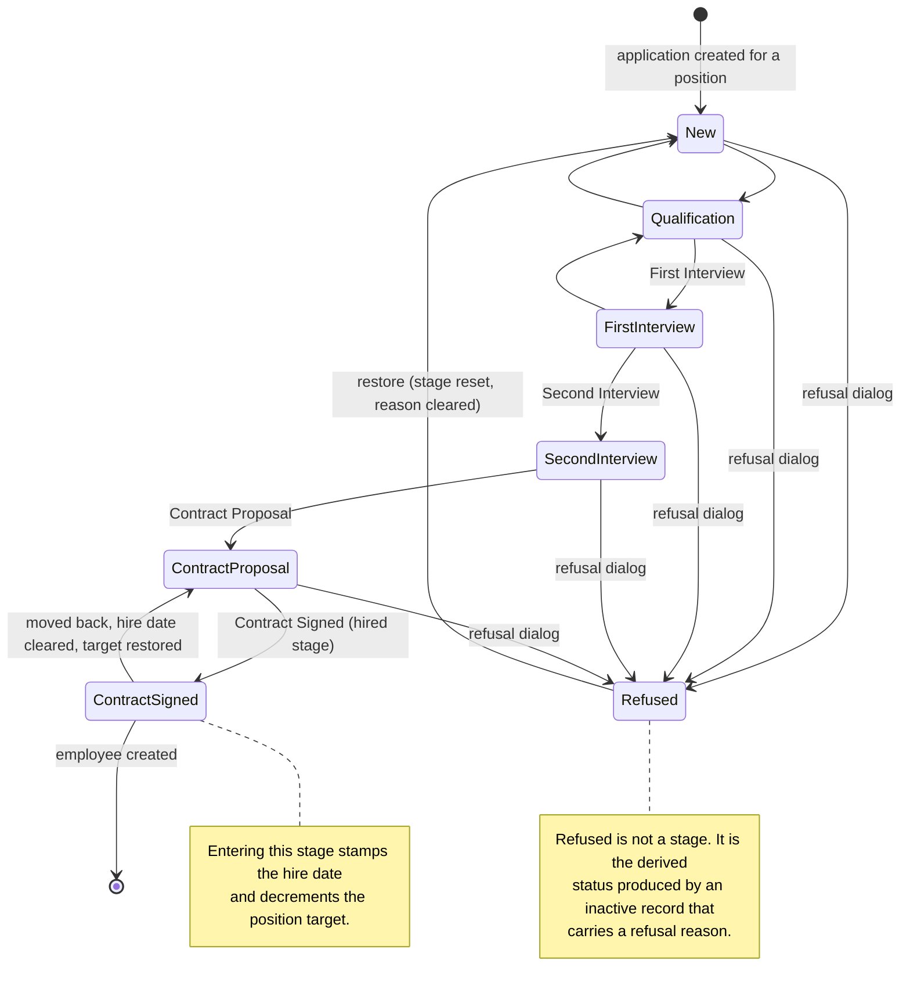
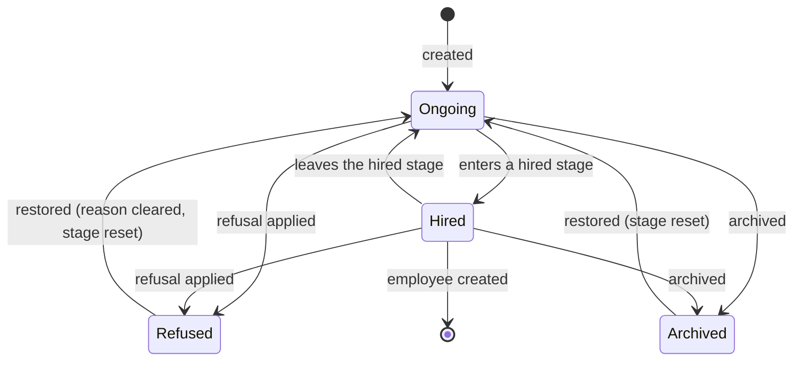
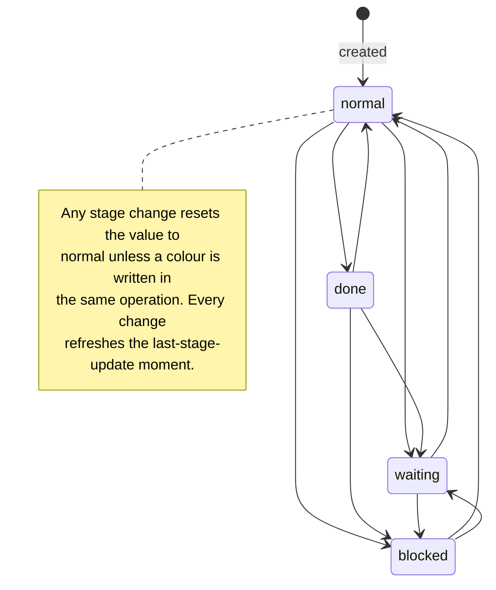
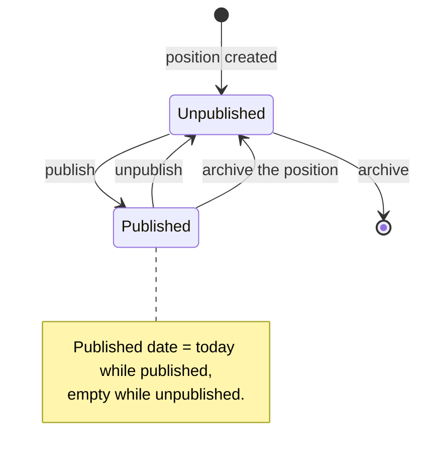
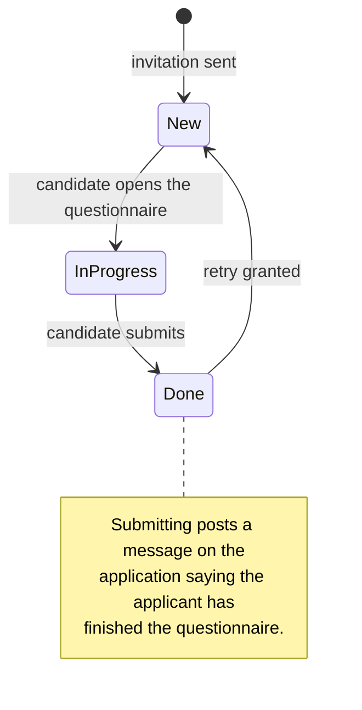

# Recruitment — State Machines

This file specifies every state-bearing field of the domain: its values, the transitions
between them, the guard conditions on each transition, and the side effects each transition
produces.

Five machines exist. Only one of them has a dedicated stored column; the others are
derived, configurable, or carried by a related record.

| Machine | Field | Stored | Values fixed by the platform? |
|---|---|---|---|
| Pipeline stage | `stage_id` on the Application | Yes (a reference) | No — the states are configuration records |
| Application status | `application_status` on the Application | No — derived at read time | Yes — four values |
| Readiness inside a stage | `kanban_state` on the Application | Yes | Yes — four values |
| Publication of a position | `website_published` / `is_published` on the Job Position | Yes | Yes — two values |
| Written interview answer set | `state` on the Answer Set | Yes | Yes — three values, owned by the questionnaire domain |

Archival (`active`) is not treated as a state machine here because it is a flag rather than
a progression; its interaction with the application status is nevertheless specified in
chapter 2, and the archive and restore procedures are in
[workflows.md](workflows.md#9-archiving-and-restoring).

---

## 1. The pipeline stage machine

### 1.1 Nature of the machine

The pipeline is an **ordered list of configuration records**, not an enumeration. Each
Recruitment Stage is a state; the ordering key is the stage's sequence, ascending. A
rebuild must therefore implement the machine as data, not as code: adding a column to the
pipeline is a configuration act, and the only stage attribute with a hard-coded meaning is
the hired flag.

Three stage attributes change the machine's behaviour:

| Attribute | Effect on the machine |
|---|---|
| Sequence | Determines the order of the columns and which stage counts as *the first stage* of a position. |
| Folded in kanban | A folded stage is **excluded** from the search for the first stage. It is therefore never the landing stage of a new application, and never the stage a restored application returns to. |
| Job specific | A stage attached to one or more positions is available only in those positions' pipelines. A stage attached to none is available everywhere. |
| Hired stage | Entering the stage is the hire event. |

### 1.2 The shipped states

The domain ships six stages, all unrestricted (available to every position):

| Sequence | Value (external identifier) | Label | Folded | Hired stage | Message template attached |
|---|---|---|---|---|---|
| 0 | `stage_job0` | New | no | no | *Recruitment: Application Acknowledgement* |
| 1 | `stage_job1` | Qualification | no | no | — |
| 2 | `stage_job2` | First Interview | no | no | — |
| 3 | `stage_job3` | Second Interview | no | no | — |
| 4 | `stage_job4` | Contract Proposal | no | no | — |
| 5 | `stage_job5` | Contract Signed | **yes** | **yes** | — |

Because the hired stage is folded, an application created for a position lands in *New*,
never in *Contract Signed*. Because *New* carries a template, every application that lands
in *New* through a stage change receives the acknowledgement message; applications created
directly in *New* do not, because no stage change occurred (see §1.5).

The staleness threshold of every shipped stage is 0, that is, staleness is disabled until
an administrator configures it.

### 1.3 Choosing the landing stage

Three different code paths need "the first stage", and they do not all apply the same
filter. The differences are behavioural and must be reproduced:

| Situation | Condition applied | Ordering | Folded stages excluded? |
|---|---|---|---|
| An Application gains a position and has no stage yet | unrestricted **or** attached to that position | ascending sequence, first one | **Yes** |
| An Application is restored from the archive | unrestricted **or** attached to that position | ascending sequence, first one | **Yes** |
| An application form is submitted on the public website | unrestricted **or** attached to that position | ascending sequence, first one | **Yes** |
| An inbound electronic mail message creates an Application for a position | unrestricted **or** attached to that position | ascending sequence, first one | **No** — the folded filter is not applied on this path |
| Talents are pushed into positions by the add-to-job dialog | unrestricted **or** attached to that position, and not folded | the minimum sequence among the candidates | **Yes** |

The inbound-message path is the exception: it takes the very first stage in sequence order
whether it is folded or not. With the shipped configuration this makes no difference,
because the folded stage has the highest sequence; it matters only in a configuration where
a folded stage sits at the front.

### 1.4 Transitions

| From | To | Trigger | Guards | Side effects |
|---|---|---|---|---|
| (none) | first stage of the position | Setting a position on an Application that has no stage | A non-folded stage exists for that position | Stage is set. No stage-change side effects run, because the value is computed at creation rather than written afterwards. |
| any stage *S* | any stage *T* | Writing the stage (dragging the card, using the progress bar, a mass edit, a dialog) | *T* must be unrestricted or attached to the Application's position (enforced by the field's domain in the interface, not by a server constraint) | 1. The last-stage-update moment is set to now. 2. Unless the readiness colour is written in the same operation, it is reset to `normal`. 3. The previous stage is recorded. 4. The position's remaining target is adjusted (see §1.6). 5. The hire date is recomputed (see §1.7). 6. A tracked-change entry is written for the stage. 7. The message subtype *Stage Changed* is used for the resulting thread message. 8. If *T* carries a message template, and neither the *just moved* nor the *just unarchived* context flag is set, a message rendered from that template is posted (see §1.5). |
| any stage | first stage of the position | Restoring an archived Application | — | The stage is written (so all the side effects above run, except the template message, which the *just unarchived* flag suppresses) and the refusal reason is cleared. |
| any stage | unchanged | Archiving an Application | — | The stage is not touched. |
| any stage | the shipped *New* stage | Adding a talent to a position from the skills matching list | — | The position and the stage are written together with the *just moved* flag set, so the template message is suppressed. |

There is no guard that prevents moving backwards, no guard that prevents skipping stages,
and no guard tied to the application status: a refused application that is restored goes
back to the first stage, and a hired application may be dragged back out of the hired
stage, which clears its hire date and gives the target back.

### 1.5 The stage message and the two suppression flags

When the stage changes and the destination stage carries a message template, the platform
posts a message on the Application built from that template, with:

- automatic deletion of the sent message record disabled for the log copy, so the message
  stays visible in the thread;
- the subtype *Note*, meaning the message is an internal note rather than a broadcast;
- the light notification layout without background.

Two context flags suppress this message:

| Flag | Set by | Why |
|---|---|---|
| `just_unarchived` | The archive and restore operations | Restoring puts the application back in the first stage automatically; sending the acknowledgement message again would tell the candidate they have just applied. |
| `just_moved` | The "add this talent to that position" operation of the skills companion | The move is an internal reorganisation, not a new application. |

### 1.6 The target adjustment

On every stage write, **per record**:

```formula
if destination_is_hired_stage and not origin_is_hired_stage:
    if position_remaining_target > 0:
        position_remaining_target = position_remaining_target − 1

if not destination_is_hired_stage and origin_is_hired_stage:
    position_remaining_target = position_remaining_target + 1
```

- *position_remaining_target* is the Job Position's `no_of_recruitment` field, labelled
  *Target*.
- The decrement is clamped at zero: hiring a seventh person for a position whose target has
  already reached zero leaves the target at zero. The increment is **not** clamped, so
  moving three people out of the hired stage of a position whose target is zero raises the
  target to three. This asymmetry is deliberate and is exercised by the test suite.
- An Application with no position performs no adjustment.

Worked example — a position with a target of three and two hires:

| Step | Action | Target before | Target after | Hired counter |
|---|---|---|---|---|
| 1 | Position created with target 3 | — | 3 | 0 |
| 2 | First candidate moved into *Contract Signed* | 3 | 2 | 1 |
| 3 | Second candidate moved into *Contract Signed* | 2 | 1 | 2 |
| 4 | Second candidate moved back to *Contract Proposal* | 1 | 2 | 1 |
| 5 | Second candidate moved into *Contract Signed* again | 2 | 1 | 2 |

The *Hired* counter is the separate stored derived field `no_of_hired_employee`, counting
applications that have a hire date; it is not the mirror image of the target, because the
target can also be edited by hand.

### 1.7 The hire date

The hire date is recomputed from the stage on every relevant change:

| Condition | Result |
|---|---|
| Stage set, stage is a hired stage, hire date currently empty | Hire date ← now |
| Stage set, stage is a hired stage, hire date already filled | Hire date unchanged |
| Stage not a hired stage (including no stage at all) | Hire date ← empty |

Because the field is stored and writable, a recruiter may afterwards correct the recorded
date; the correction survives until the stage changes again.

### 1.8 Diagram



---

## 2. Application status: the derived lifecycle

### 2.1 States

| Value | Label | Meaning |
|---|---|---|
| `ongoing` | Ongoing | The application is live: active, not refused, not hired. |
| `hired` | Hired | The application is active and has a hire date. |
| `refused` | Refused | The application carries a refusal reason. |
| `archived` | Archived | The application is inactive and carries no refusal reason. |

### 2.2 Derivation

The value is computed, never stored. The stored facts behind it are three:

| Stored fact | Field |
|---|---|
| Is the record active? | `active` |
| Is a refusal reason set? | `refuse_reason_id` |
| Is a hire date set? | `date_closed` |

The derivation, in strict order:

1. Refusal reason set → `refused`. **This branch wins even when the record is active**, so
   an application that was refused and then merely un-archived without clearing the reason
   still reads as refused.
2. Record inactive → `archived`.
3. Hire date set → `hired`.
4. Otherwise → `ongoing`.

### 2.3 Searching on the derived value

A search on the application status is translated into a disjunction of conditions on the
three stored facts. Only the "is one of" operator is supported; any other operator is
rejected as not implemented.

| Requested value | Translated condition |
|---|---|
| `refused` | inactive **and** a refusal reason is set |
| `hired` | active **and** a hire date is set |
| `archived`, or the empty value | inactive |
| `ongoing` | active **and** no hire date |

Two asymmetries between the derivation and the search must be reproduced exactly, because
reports depend on them:

- The derivation reports `refused` for an **active** record that carries a reason; the
  search for `refused` does **not** find it, because the search requires inactivity.
- The derivation reports `archived` only when no reason is set; the search for `archived`
  returns every inactive record, refused ones included.

### 2.4 Transitions

| From | To | Trigger | Guards | Side effects |
|---|---|---|---|---|
| `ongoing` | `hired` | The application enters a hired stage | The destination stage carries the hired flag | Hire date stamped; position target decremented; *Applicant Hired* subtype available for the thread message |
| `hired` | `ongoing` | The application leaves the hired stage | — | Hire date cleared; position target incremented |
| `ongoing` or `hired` | `refused` | The refusal dialog is applied | The chosen reason is required; if the message option is on, every selected application must have an address and the acting user must have an address | Refusal reason written; record deactivated; refusal moment stamped; optionally one message per application; optionally the duplicates are refused too and each receives a log line naming the original |
| `refused` | `ongoing` | Restore | — | Stage reset to the first non-folded stage of the position; refusal reason cleared; record reactivated; the template message of the landing stage is suppressed |
| `ongoing` or `hired` | `archived` | Archive | — | Record deactivated; nothing else changes; the hire date, if any, survives, so restoring returns the application to `ongoing` only because the restore also resets the stage, which clears the hire date |
| `archived` | `ongoing` | Restore | — | As above |

### 2.5 Diagram



### 2.6 Interaction with staleness

An application is eligible for the staleness report only while its derived status is
`ongoing` **and** its hire date is empty. The staleness condition inherited from the shared
mechanism (the stage's threshold is not zero) is intersected with those two extra
conditions. The fields that can change the staleness outcome are therefore the
last-stage-update moment, the stage's threshold, the application status and the hire date.

---

## 3. Readiness inside a stage

### 3.1 States

| Value | Default label | Meaning | Colour in the progress bar |
|---|---|---|---|
| `normal` | In Progress | Work is ongoing in this stage. | grey (not counted in the bar) |
| `done` | Ready for Next Stage | The candidate has cleared this stage and can move on. | green (success) |
| `waiting` | Waiting | Something outside the recruiter's control is pending. | orange (warning) |
| `blocked` | Blocked | Progress is impossible. | red (danger) |

The labels are not fixed: each stage carries four label fields (grey, green, orange, red)
which are required and translated, and the Application mirrors them read-only. A rebuild
must display the stage's label, not the value's name.

### 3.2 Transitions

| From | To | Trigger | Side effects |
|---|---|---|---|
| any | any | The user picks a readiness colour on the card or the form | The last-stage-update moment is refreshed, which restarts the staleness clock |
| any | `normal` | The stage is written without a readiness colour in the same operation | Automatic reset |
| any | as given | The stage and the readiness colour are written in one operation | The given colour wins; no reset |

The field is required and defaults to `normal`. It is not copied when an Application is
duplicated.

### 3.3 Diagram



---

## 4. Publication of a Job Position

Present when the public job pages companion is installed.

### 4.1 States

| Value | Meaning |
|---|---|
| unpublished (`website_published` false) | The position does not appear on the public job list and its public page is not reachable by a visitor. |
| published (`website_published` true) | The position appears on the public job list of the website it is restricted to, or of every website when it is unrestricted, and its public page is reachable by anyone. |

The generic publication flag `is_published` is kept in step with `website_published`: an
interface change to one sets the other.

### 4.2 Transitions

| From | To | Trigger | Guards | Side effects |
|---|---|---|---|---|
| unpublished | published | The publish control on the position, or the publish switch on the public page | The acting user must be allowed to publish (the derived permission `can_publish`) | The published date becomes today. Public and portal visitors gain read access to the position through the publication record rules. |
| published | unpublished | The unpublish control | Same | The published date is cleared. |
| published | unpublished | Archiving the position | Only positions that were active are touched | Combined with the base archival effect, which also deactivates every application of the position. |

### 4.3 Who can see a published position

| Audience | Condition |
|---|---|
| Public visitor (not signed in) | The position is published. |
| Portal user | The position is published. |
| Internal user without recruitment privileges | Read access to every position, through the base access right; the publication rules do not restrict internal users. |
| Officer | Every position, published or not. |

### 4.4 Diagram



---

## 5. Written interview answer set

The answer set entity belongs to the questionnaire domain; recruitment adds only the link
to the Application and one side effect. The three states are reproduced here because the
recruitment workflows and reports depend on them.

| Value | Meaning in recruitment |
|---|---|
| `new` | The invitation has been created but the candidate has not opened the questionnaire. |
| `in_progress` | The candidate has started answering. |
| `done` | The candidate has submitted the questionnaire. |

### 5.1 Transitions relevant to recruitment

| From | To | Trigger | Side effects added by recruitment |
|---|---|---|---|
| (none) | `new` | The interview invitation is sent for an Application that has no answer set for that questionnaire yet | The answer set is attached to the Application; a message is posted on the Application reading `The survey ` + a link bearing the questionnaire title + ` has been sent to ` + a link bearing the contact name; the body of the invitation message is also copied into the Application's thread and the message is sent immediately rather than queued |
| `new` | `in_progress` | The candidate opens the questionnaire | None added |
| `in_progress` | `done` | The candidate submits | A message is posted on the Application reading `The applicant "` + the applicant's name + `" has finished the survey.`, authored by the platform's system contact |
| `done` | `new` | A retry is granted | The retry carries the Application link forward, so the new answer set stays attached to the same Application |

### 5.2 Which answer set is printed

The operation *print the interview* on an Application resolves, in this order:

1. Take the Application's answer sets whose questionnaire is the position's written
   interview, sorted by creation moment, most recent first.
2. If there are none, print the blank questionnaire.
3. Otherwise, if any of them is `done`, print the most recent `done` one.
4. Otherwise print the most recent one whatever its state.

In every case the printable view opens in a dialog.

### 5.3 Diagram



---

## 6. The talent lifecycle

A talent is not a separate state of the Application; it is a structural condition. It is
documented here because it behaves like a lifecycle in practice.

| Condition | Name | How it arises |
|---|---|---|
| Pool list empty, canonical pool copy empty | ordinary application | Created through any of the four channels. |
| Pool list empty, canonical pool copy points at another Application | pooled application | The add-to-pool dialog created a talent from it. |
| Pool list non-empty, canonical pool copy points at itself | talent | Created by the add-to-pool dialog, or created directly with pools (the creation rule then points the canonical copy at itself). |
| Pool list non-empty, canonical pool copy empty | invalid | Rejected by the constraint `Talent must belong to at least one Talent Pool.` in the mirror case, and never produced by the platform itself. |

Transitions:

| From | To | Trigger | Side effects |
|---|---|---|---|
| ordinary application | pooled application + new talent | Add-to-pool dialog, when the person is not already pooled | A positionless copy is created with no ` (copy)` suffix, carrying the pools and the union of the original's tags and the dialog's tags; the copy points its canonical pool copy at itself; the original points its canonical pool copy at the copy |
| talent | talent with more pools | Add-to-pool dialog, when the selected record already is a talent | The pools and tags are linked onto the existing talent; no copy is made |
| talent | ordinary applications in positions | Add-to-job dialog | One new Application per (talent, position) pair, with the pools cleared, the position set, and the stage set to the lowest-sequence non-folded stage available to that position |
| pooled application | (fields propagated) | Writing the address, telephone number, professional network profile or degree on the pooled application | The same four fields are written onto the talent; when the skills companion is present, skill line changes are translated and applied to the talent as well |

A talent cannot be duplicated (`You cannot duplicate the talent(s).`) and is not shown the
pipeline status bar, the refuse button or the add-to-pool button on its form.
