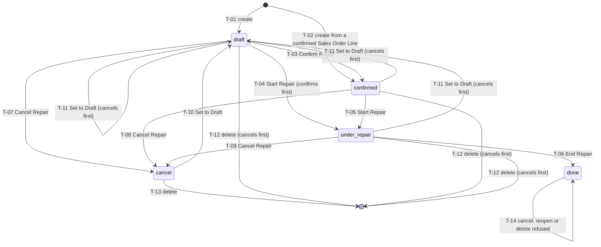
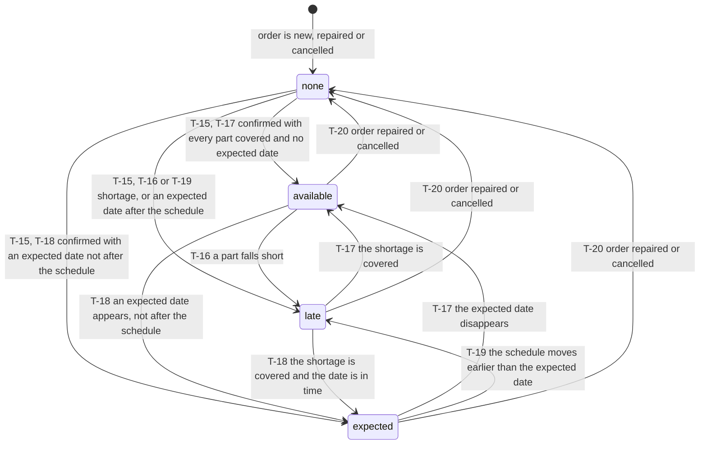
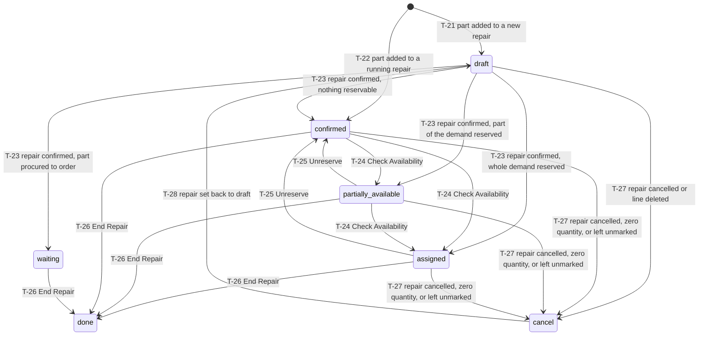
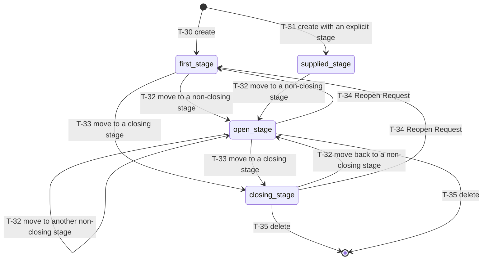
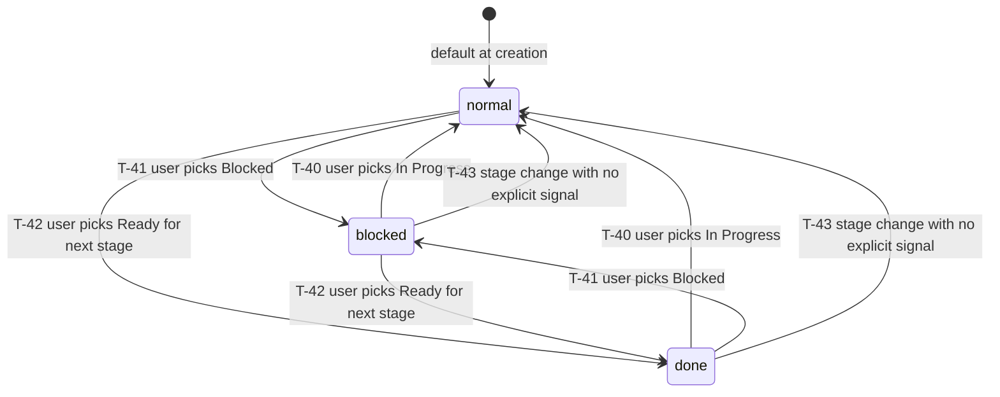
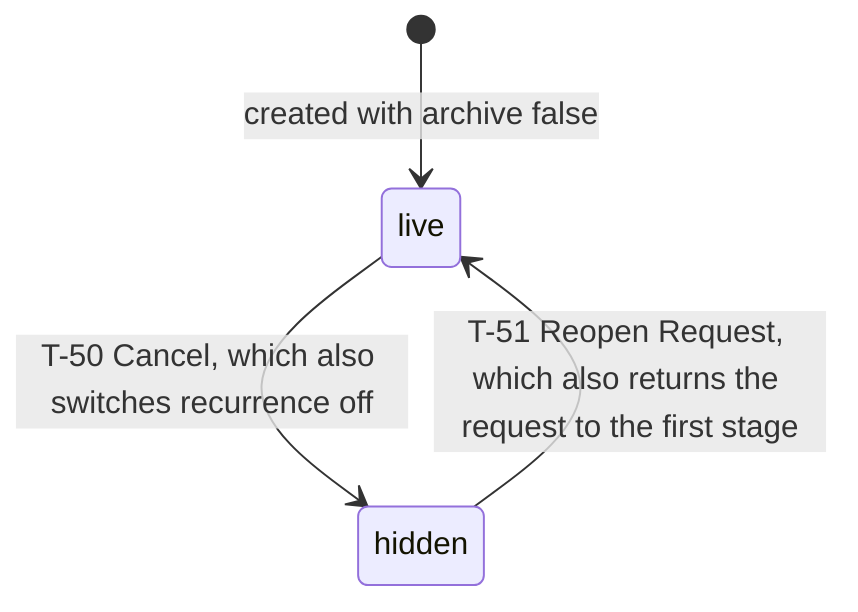

# State machines

This file specifies every state field of the repair and maintenance domain: its states with their stored values, labels and meanings; every transition with its origin, its destination, the operation that triggers it, the guards it must pass in the order in which they are evaluated, the exact message shown when a guard refuses, and the records the transition creates or changes. Each machine ends with a diagram.

Six machines are specified:

| Section | Machine | Entity | Field |
|---|---|---|---|
| 1 | The Repair Order lifecycle | Repair Order | `state` |
| 2 | The readiness of a Repair Order's parts | Repair Order | `parts_availability_state` |
| 3 | The Stock Move states reached inside a repair | Stock Move | `state` |
| 4 | The Maintenance Request pipeline | Maintenance Request | `stage_id` |
| 5 | The within-stage signal of a Maintenance Request | Maintenance Request | `kanban_state` |
| 6 | The hiding flag of a Maintenance Request | Maintenance Request | `archive` |

Transition identifiers are stable within this file and are referenced from [entities.md](entities.md), [workflows.md](workflows.md), [business-rules.md](business-rules.md) and [acceptance-criteria.md](acceptance-criteria.md).

---

## 1. The Repair Order lifecycle

### 1.1 States

| Stored value | Label | Meaning |
|---|---|---|
| `draft` | "New" | The order is being written. Nothing is reserved, no procurement has been raised, no goods have moved. Part lines sit in the `draft` move state. |
| `confirmed` | "Confirmed" | The order is committed. Its part lines have been confirmed, their procurement method has been decided, reservation has been attempted and replenishment has been triggered. The readiness fields are meaningful in this state. |
| `under_repair` | "Under Repair" | The technician is working. Nothing moves in stock because of this state; it separates planned-and-reserved work from work in progress, and it is the only state from which the repair may be ended. Recorded quantities are entered on the part lines here. |
| `done` | "Repaired" | The work is finished. Every part movement and the movement of the repaired product itself are done. The order is final: it can be neither cancelled, nor reopened, nor deleted. |
| `cancel` | "Cancelled" | The order was abandoned. Every part movement is cancelled, reservations are released, the originating Sales Order Line and the backing part lines on the quotation carry a quantity of zero. |

The field is required in practice, defaults to `draft`, is read-only on every screen, is indexed, is not carried into a duplicate, and every change to it is recorded in the discussion thread. The status bar of the form shows New, Confirmed, Under Repair and Repaired as steps; Cancelled is reachable but is not shown as a step.

The order's help text, reproduced verbatim, is: "* The 'New' status is used when a user is encoding a new and unconfirmed repair order.\n* The 'Confirmed' status is used when a user confirms the repair order.\n* The 'Under Repair' status is used when the repair is ongoing.\n* The 'Repaired' status is set when repairing is completed.\n* The 'Cancelled' status is used when user cancel repair order."

### 1.2 Transition table

| Identifier | From | To | Trigger | Guards, in order | Records created or changed |
|---|---|---|---|---|---|
| T-01 | (none) | `draft` | Creating a Repair Order by hand, from a return transfer, from a lot or serial number, or from the product catalog | None | The Repair Order; one Stock Reference named after the repair's reference; the reference drawn from the operation type's numbering sequence; the six locations derived from the operation type; the part lines supplied with the order, each created in the `draft` move state |
| T-02 | (none) | `confirmed` | Confirming a Sales Order that holds a line whose product is a service with service tracking `repair` | The line's product's service tracking is `repair`; the line has no repair-bound move; the line's ordered quantity is strictly greater than zero | The Repair Order with the customer, the Sales Order and the Sales Order Line of the originating line, and the operation type of the order's warehouse; one Stock Reference; the reference drawn from the sequence. The creation runs with elevated rights, so a salesperson without inventory rights can confirm the order |
| T-03 | `draft` | `confirmed` | The Confirm Repair operation | 1. No part line has a negative demanded quantity, else the operation is refused with "You can not enter negative quantities." 2. When the order names a product to repair that is a storable good, that product must be on hand at the product source location in at least the required quantity, in one of the two owner buckets; when it is not, the operation opens the Insufficient Repair Quantity Warning dialogue instead of confirming, and confirming that dialogue re-enters this transition past the check. 3. The company consistency of the order and of its part lines must hold | The state; each part line's procurement method (adjusted against rules whose operation type carries the repair code); each part line's move state (confirmed, then reserved according to the operation type's reservation policy); the reservations on the stock quantity records; whatever documents the procurement rules raise; the readiness fields and the four operation-type counters |
| T-04 | `draft` | `under_repair` | The Start Repair operation on an order that is still new | The guards of T-03, because the confirmation runs first | Everything T-03 changes, then the state |
| T-05 | `confirmed` | `under_repair` | The Start Repair operation | None | The state alone. No movement changes state |
| T-06 | `under_repair` | `done` | The End Repair operation | 1. Every order in the operated set is `under_repair`, else the operation is refused with "Repair must be under repair in order to end reparation." 2. When at least one part line reports a recorded quantity strictly below its demand, the screen asks "For some of the parts, there is a difference between the initial demand and the actual quantity that was used. Are you sure you want to confirm ?" and writes nothing if the user discards. 3. When the order names a product whose tracking is not `none`, a lot or serial number must be chosen, else the operation is refused with "Serial number is required for product to repair : " followed by the product's display name | Part lines whose recorded quantity is zero are cancelled, which zeroes their backing Sales Order Line; the remaining part lines are marked picked when none was already marked; the delivered quantity of the originating service line is set to its ordered quantity; the product move and its single detail line are created, the detail line carrying the lot, the chosen owner and a consumed-lines link to every detail line of every part line; the product move is written onto the order; every move is completed with backorder creation suppressed; the stock quantity records and the valuation layers follow; the state |
| T-07 | `draft` | `cancel` | The Cancel Repair operation, the cancellation of the Sales Order that raised the repair, or the setting of the originating line's quantity to zero | No order in the operated set is `done`, else the operation is refused with "You cannot cancel a Repair Order that's already been completed" | The originating Sales Order Line's ordered quantity is written to zero; every part line is cancelled, which releases its reservations and zeroes its backing Sales Order Line; the state |
| T-08 | `confirmed` | `cancel` | As T-07 | As T-07 | As T-07 |
| T-09 | `under_repair` | `cancel` | As T-07 | As T-07 | As T-07 |
| T-10 | `cancel` | `draft` | The Set to Draft operation, or raising the originating Sales Order Line's quantity from zero or less to a positive value | None | The backing Sales Order Lines that belong to an order which is not itself cancelled and whose quantity is currently zero are refreshed: an *add* part's line is restored to the sum of the demanded quantities of the moves attached to it, a *remove* or *recycle* part's line is re-zeroed; every part line is written back to the `draft` move state; the state |
| T-11 | `draft`, `confirmed`, `under_repair` | `draft` | The Set to Draft operation on an order that is not cancelled | The guard of T-07, because the cancellation runs first over the whole set | Everything T-07 changes, then everything T-10 changes |
| T-12 | `draft`, `confirmed`, `under_repair` | (deleted) | Deleting the order | The guard of T-07, because deletion cancels first | Everything T-07 changes; then the order and its part lines are deleted, the part lines because their reference to the order cascades; the outgoing quantities that draft part lines had claimed are released |
| T-13 | `cancel` | (deleted) | Deleting the order | None | The order and its part lines are deleted |
| T-14 | `done` | `done` | Cancel Repair, Set to Draft, or deletion | Refused | Nothing. The message is "You cannot cancel a Repair Order that's already been completed" |

### 1.3 Transitions that do not exist

There is no operation that leaves `done`. There is no operation from `confirmed` or `under_repair` directly back to `draft`: the Set to Draft operation always passes through a cancellation first (T-11). There is no operation from `under_repair` back to `confirmed`. A repair that is not in `draft` is silently left alone by the confirmation routine, so a batch operation over a mixed selection never regresses a running or completed repair.

### 1.4 Diagram

---

## 2. The readiness of a Repair Order's parts

This machine is derived, not stored: the state is recomputed on every read from the forecast information of the part lines and from the order's own state and scheduled date. Two stored booleans mirror it so that the operation-type dashboard can count without recomputing.

### 2.1 States

| Stored value | Label | Meaning |
|---|---|---|
| *(empty)* | *(no badge)* | The order is neither confirmed nor under repair. Readiness is not evaluated and the component status text is empty as well. |
| `available` | "Available" | Every part line's forecast availability covers its own quantity, and either no part carries a forecast expected date, or one does but the order carries no scheduled date. |
| `expected` | "Expected" | Every part line's forecast availability covers its own quantity, at least one part carries a forecast expected date, and the latest such date is not later than the order's scheduled date. |
| `late` | "Late" | Either at least one part line's forecast availability is strictly below its own quantity, or the latest forecast expected date among the parts is strictly later than the order's scheduled date. |

The accompanying text field carries "Available", "Not Available", or "Exp " followed by the latest forecast expected date formatted in the reader's language and date format.

### 2.2 Transition table

Because the machine is derived, its transitions are re-evaluations rather than operations. The table states what causes a re-evaluation and where each evaluation lands.

| Identifier | From | To | Trigger | Guards, in order | Records changed |
|---|---|---|---|---|---|
| T-15 | *(empty)* | `available`, `expected` or `late` | The order reaches `confirmed` or `under_repair` | The order's state is `confirmed` or `under_repair` | The readiness boolean and the lateness boolean are rewritten; the four operation-type counters follow |
| T-16 | any | `late` | A part line's forecast availability falls below its own quantity, at the rounding of the product's reference unit | Evaluated first, before any date is considered | The text becomes "Not Available"; the lateness boolean becomes true; the readiness boolean becomes false |
| T-17 | any | `available` | No shortage exists and no part line carries a forecast expected date | The shortage test of T-16 must have failed | The text becomes "Available"; the readiness boolean becomes true |
| T-18 | any | `expected` | No shortage exists, at least one part carries a forecast expected date, and the latest of those dates is not later than the order's scheduled date | The shortage test of T-16 must have failed | The text becomes "Exp " followed by the formatted date; both booleans become false |
| T-19 | any | `late` | No shortage exists, at least one part carries a forecast expected date, and the latest of those dates is strictly later than the order's scheduled date | The shortage test of T-16 must have failed | The text becomes "Exp " followed by the formatted date; the lateness boolean becomes true |
| T-20 | any | *(empty)* | The order reaches `done` or `cancel`, or is set back to `draft` | None | Both booleans are recomputed to false |

When no shortage exists, a forecast expected date exists, and the order carries no scheduled date, the state stays `available`. In the shipped configuration that case cannot arise, because the scheduled date is a required field.

Removed and recycled parts never contribute a shortage: their forecast availability is set equal to their own quantity and their forecast expected date is cleared, because they come out of the item being repaired rather than out of stock. The full algorithm and its four worked examples are in [calculations.md](calculations.md), calculation 3.

### 2.3 Diagram

---

## 3. The Stock Move states reached inside a repair

Repair part lines use the ordinary Stock Move state machine, which is specified in full in [../inventory-operations/](../inventory-operations/). This section states which of its states a repair reaches, what puts a part line in each of them, and the two departures from the ordinary machine that the repair capability imposes.

### 3.1 States reached

| Stored value | Label | Reached when |
|---|---|---|
| `draft` | "New" | The part was added to a repair that is still `draft`, or the repair was set back to draft from `cancel`. |
| `waiting` | "Waiting Another Operation" | The part is procured to order and waits for the document that will supply it. |
| `confirmed` | "Waiting Availability" | The repair was confirmed and the part could not be reserved at all. |
| `partially_available` | "Partially Available" | The repair was confirmed and only part of the demand could be reserved. |
| `assigned` | "Available" | The repair was confirmed and the whole demand was reserved. |
| `done` | "Done" | The repair was ended and the part had a non-zero recorded quantity, or the part had already been marked picked by hand. |
| `cancel` | "Cancelled" | The repair was cancelled, the part line was deleted, the part had a zero recorded quantity when the repair was ended, or the part was left unmarked while another part had been marked picked by hand. |

### 3.2 Transitions specific to a repair

| Identifier | From | To | Trigger | Guards | Records changed |
|---|---|---|---|---|---|
| T-21 | (none) | `draft` | A part line is added to a repair that is `draft` | The part kind and the product are required | The move, with the repair's reference as origin and reference, the repair's operation type, the repair's Stock References, and the two locations derived from the part kind |
| T-22 | (none) | `confirmed`, `partially_available`, `assigned` or `waiting` | A part line is added to a repair that is already `confirmed` or `under_repair` | Company consistency | The move is created in `draft`, its company is checked, its procurement method is adjusted against repair rules, it is confirmed, and the replenishment scheduler is triggered for it |
| T-23 | `draft` | `confirmed`, `partially_available`, `assigned` or `waiting` | The repair is confirmed (T-03) | None | The procurement method, the move state, the reservations |
| T-24 | `confirmed`, `partially_available` | `assigned` or `partially_available` | The Check Availability operation on the repair | None | Reservations on the stock quantity records; the move's detail lines |
| T-25 | `assigned`, `partially_available` | `confirmed` | The Unreserve operation on the repair | None | The reservations are released; the readiness fields recompute |
| T-26 | any state except `done` and `cancel` | `done` | The repair is ended (T-06) | The recorded quantity is not zero at the rounding of the move's unit; and either no part line of the repair was marked picked, in which case all are marked, or this line was among those already marked | The move state, its recorded quantity, the stock quantity records, the valuation layer |
| T-27 | any state except `done` | `cancel` | The repair is cancelled (T-07 to T-09), the part line is deleted, the recorded quantity is zero at completion, or the line was left unmarked while another was marked picked by hand | None | The backing Sales Order Line's ordered quantity is set to zero; the reservations are released; the move state |
| T-28 | `cancel` | `draft` | The repair is set back to draft (T-10) | None | The move state; the backing Sales Order Line is refreshed |

### 3.3 The two departures from the ordinary machine

1. **Never assigned automatically.** A move attached to a repair is never picked up by the inventory domain's automatic assignment sweep. Reservation happens only through the repair's own Check Availability operation, through the confirmation, or through the re-reservation that follows an operation-type change.
2. **Never split.** A move attached to a repair is excluded from the splitting procedure, and completion is run with backorder creation suppressed. A part whose recorded quantity differs from its demand — in either direction — therefore remains exactly one move carrying the recorded quantity, and no residual move and no backorder transfer is produced.

### 3.4 Diagram

---

## 4. The Maintenance Request pipeline

The pipeline is data, not a fixed list: the columns are Maintenance Stage records ordered by sequence, and an operator may rename, reorder, add and remove them. The machine is therefore expressed over the closing flag of a stage rather than over named states. The shipped stage set is in [configuration.md](configuration.md) and is repeated here because the transitions refer to it.

### 4.1 The shipped stages

| Stage name | Sequence | Folded | Closing flag | Meaning |
|---|---|---|---|---|
| New Request | 1 | no | no | The request has been raised and nobody has started on it. This is the stage with the lowest sequence, so it is the default stage of a new request, the target of the reopen operation, and the stage in which a recurrent successor is created. |
| In Progress | 2 | no | no | The technician is working on the request. |
| Repaired | 3 | yes | **yes** | The work succeeded. The request is closed. |
| Scrap | 4 | yes | **yes** | The asset could not be saved. The request is closed exactly as "Repaired" closes it; the difference between the two is a reporting distinction only. |

A stage carries no company and is shared by every company. A stage that any request occupies cannot be deleted, because the request's reference to it restricts deletion.

### 4.2 Transition table

| Identifier | From | To | Trigger | Guards, in order | Records created or changed |
|---|---|---|---|---|---|
| T-30 | (none) | the stage with the lowest sequence | Creating a Maintenance Request by hand, from an equipment, from a category, from a team dashboard card, from the calendar or from an incoming message | The team is required, so a deployment with no Maintenance Team cannot create a request | The request; the close date corrected against the target stage's closing flag (cleared when a close date was supplied and the stage does not close, set to today when no close date was supplied and the stage closes); the contacts of the created-by user and of the technician subscribed, and with the people bridge that of the employee; a message posted under the "Request Created" subtype, which reaches the followers of the equipment's category through the category-level counterpart; one maintenance activity when the request carries a scheduled date |
| T-31 | (none) | a stage supplied by the caller | Creating a Maintenance Request with an explicit stage | As T-30 | As T-30, with the close-date correction evaluated against the supplied stage |
| T-32 | any stage | a stage whose closing flag is false | Dragging the card to another column, or picking the stage on the status bar | None | The kanban state is forced to `normal` unless the same write sets one; the close date is cleared; the pending maintenance activity is marked done with feedback; a fresh activity is scheduled or the existing one rescheduled; a message is posted under the "Status Changed" subtype; the equipment's counters and effectiveness measurements recompute |
| T-33 | any stage | a stage whose closing flag is true | Dragging the card to a closing column, or picking a closing stage on the status bar | None | **Before the write:** for each request in the set that is preventive and recurrent, the successor is generated by [calculations.md](calculations.md), calculation 30, unless the repeat kind is `until` and the computed start falls after the end date. **After the write:** the kanban state is forced to `normal` unless the same write sets one; the close date is set to today; the pending maintenance activity is marked done with feedback and no new activity is scheduled; a message is posted under the "Status Changed" subtype; the equipment's counters and effectiveness measurements recompute |
| T-34 | any stage | the stage with the lowest sequence | The Reopen Request operation | The request must currently be archived, since the button is shown only then | The archive flag is written to false and the stage in one write, so the ordinary consequences of T-32 follow: the kanban state resets, the close date is cleared and the activity is recreated |
| T-35 | any stage | (deleted) | Deleting the request | None | The request is deleted; its equipment's counters and effectiveness measurements recompute |

A stage change never happens implicitly. Archiving a request (section 6) leaves it in whatever stage it occupied.

### 4.3 Diagram

---

## 5. The within-stage signal of a Maintenance Request

### 5.1 States

| Stored value | Label | Meaning |
|---|---|---|
| `normal` | "In Progress" | The default. Work inside the current stage is proceeding. |
| `blocked` | "Blocked" | Work inside the current stage cannot continue. The team dashboard counts these separately and the pipeline's progress bar shows them in the alert colour. |
| `done` | "Ready for next stage" | Work inside the current stage is finished and the request is waiting to be moved on. |

The field is required, defaults to `normal`, and every change to it is recorded in the discussion thread.

### 5.2 Transition table

| Identifier | From | To | Trigger | Guards | Records changed |
|---|---|---|---|---|---|
| T-40 | any | `normal` | The user picks In Progress | None | The field; a tracked-change message |
| T-41 | any | `blocked` | The user picks Blocked | None | The field; a tracked-change message; the team dashboard's blocked counter |
| T-42 | any | `done` | The user picks Ready for next stage | None | The field; a tracked-change message |
| T-43 | any | `normal` | Any write that sets a stage | The same write must not itself set a kanban state; when it does, the supplied value wins | The field is added to the write before it is applied |

A request that had been Blocked or Ready for next stage therefore returns to In Progress on every stage change unless the same operation sets another value. Writing the same stage and the same signal onto several requests at once applies both values to all of them.

### 5.3 Diagram

---

## 6. The hiding flag of a Maintenance Request

The request does not use the platform's standard archive flag. It carries its own boolean, `archive`, which the screens present as "Cancelled". Records with it set are hidden by the views' default Active filter but are not hidden by the platform's automatic active-record filtering, because that mechanism keys on a field named `active` which this entity deliberately does not define.

### 6.1 States

| Stored value | Label | Meaning |
|---|---|---|
| false | *(no badge)* | The request is live. It appears under the Active filter, in the team dashboard counters and in its equipment's open-request count. |
| true | "Cancelled" | The request is hidden. It is excluded from the Active filter, from the team dashboard counters and from its equipment's open-request count, but it still counts in the total request count of its equipment and of its category, and it still feeds the effectiveness measurements when it is a closed corrective request. The stage bar is hidden on the form and a badge is shown in its place. |

### 6.2 Transition table

| Identifier | From | To | Trigger | Guards | Records changed |
|---|---|---|---|---|---|
| T-50 | false | true | The Cancel button on the request form | The button is shown only when the flag is currently false | The archive flag is written to true **and** the recurrence flag to false in the same write, so a cancelled recurrent request produces no further occurrence even if it is later dragged into a closing stage. The stage is not changed, so no successor is generated by this operation |
| T-51 | true | false | The Reopen Request button | The button is shown only when the flag is currently true | The archive flag is written to false **and** the stage set to the one with the lowest sequence in the same write, which triggers T-34 and therefore T-32's consequences |

### 6.3 Diagram

---

## 7. States this domain deliberately does not define

- **Equipment** has no lifecycle state. Its only binary condition is the platform archive flag (`active`), whose meaning is the ordinary one: an archived equipment is hidden from default lists, keeps its history, and can be unarchived. The scrap date records that an asset left service but changes no state and blocks nothing.
- **Equipment Category**, **Maintenance Team** and **Maintenance Stage** have no lifecycle state. The team carries the platform archive flag; the category and the stage carry none.
- **Repair Tag** has no state and no archive flag.
- **The Insufficient Repair Quantity Warning** is transient and has no state: it exists for the duration of one dialogue, and its two outcomes are re-entering transition T-03 or writing nothing at all.
