# State machines

Every state field of the Replenishment and Procurement domain is specified here: the states with their stored value, their label and their meaning; the transitions with their origin, their destination, the operation that triggers them, the conditions that must hold in the order in which they are evaluated, the exact refusal message of every condition that can refuse, and the records each transition creates or changes. Each machine ends with a Mermaid state diagram.

The catalogue of numbered rules that these machines cite is `business-rules.md`. The field definitions are in `entities.md`. The procedures that drive the transitions are in `workflows.md`. The arithmetic behind every derived state is in `calculations.md`.

---

## 0. Conventions

### 0.1 What counts as a state field in this domain

The three persistent entities this domain owns — Route, Stock Rule and Reordering Rule — carry **no status selection field** of the kind a sales order or a purchase order carries. A replacement must not invent one. Their observable state is instead carried by four kinds of field, and all four are specified in this document with the same completeness:

| Kind | Description | Examples in this domain |
|---|---|---|
| **Archive flags** | A boolean `active` whose two values are a genuine two-state lifecycle: an archived record is excluded from every default query and can never be selected by any algorithm of this domain. | `active` on Route, on Stock Rule, on Reordering Rule, on Operation Type. |
| **Mode selections and mode flags** | A closed list of stored values, or a stored boolean, that changes what the record *does* rather than how far it has progressed. Every value is a state; every edit of the field is a transition; the guards are the conditions under which each value is admissible. | `action`, `procure_method`, `auto`, `location_destination_from_rule`, `propagate_cancel` and `propagate_carrier` on Stock Rule; the six applicability flags on Route; `trigger` on Reordering Rule; `based_on` on Replenishment Information; `predefined_date` on the Reordering Rule Snooze Wizard; `code` on Operation Type; `group_request_for_quotation` and `grouping_weekday` on Contact. |
| **Derived states** | Values recomputed from other records, which a user can never write directly, but which decide what the screens offer and what the scheduler does. | `quantity_to_order_computed`, `deadline_date`, `unwanted_replenish`, `show_supply_warning`, `show_vendor` and `show_bill_of_materials` on Reordering Rule; `show_vendor_tab` and `show_bill_of_materials_tab` on Replenishment Information; `receipt_status`, `is_shipped` and `effective_date` on Purchase Order; `delay_alert_date` and `is_dropship` on the records this domain extends. |
| **Process states** | States of a unit of work rather than of a record: the procurement request, the scheduler run, a scheduler batch, a replenishment report line. They are never stored, but a replacement must reproduce them because they decide what is created, what is retried and what is reported to the user. | The procurement request; the scheduler run and its batches; the report line. |

### 0.2 Notation

- A stored value is written in code font exactly as it must be stored. A label is written as the text a screen displays. A refusal message is reproduced verbatim between backticks; placeholders are written between angle brackets and described in words.
- "compare *a* with *b* in unit *u*" means: round both values to the rounding step of unit *u* and compare the rounded values. Quantities are never compared by exact equality on stored decimals.
- "elevated rights" means the operation runs under the superuser account, bypassing access rights and record rules.
- **Origin move** and **destination move** name the two ends of a chain link: the origin move supplies the goods, the destination move consumes them. They are the two sides of the same relation, named `move_origins` and `move_destinations` on Stock Move.
- A transition row whose "From" cell reads "not existing" describes record creation; a row whose "To" cell reads "deleted" describes record removal.
- "the report" always means the replenishment report of `workflows.md`, section 15.

### 0.3 Index of the machines specified here

| Section | Machine | Carrier | Kind |
|---|---|---|---|
| 1.1 | Route archive state | `active` on Route | archive flag |
| 1.2 | Route applicability flags | `product_selectable`, `product_category_selectable`, `package_type_selectable`, `sale_selectable`, `shipping_selectable` on Route | mode flags |
| 1.3 | Route warehouse applicability flag | `warehouse_selectable` on Route | mode flag |
| 2.1 | Stock Rule archive state | `active` on Stock Rule | archive flag |
| 2.2 | Stock Rule action | `action` on Stock Rule | mode selection |
| 2.3 | Stock Rule supply method | `procure_method` on Stock Rule | mode selection |
| 2.4 | Stock Rule push mode | `auto` on Stock Rule | mode selection |
| 2.5 | Stock Rule destination-location origin | `location_destination_from_rule` on Stock Rule | mode flag |
| 2.6 | Stock Rule cancellation propagation | `propagate_cancel` on Stock Rule | mode flag |
| 2.7 | Stock Rule shipping-method propagation | `propagate_carrier` on Stock Rule | mode flag |
| 3.1 | Reordering Rule trigger | `trigger` on Reordering Rule | mode selection |
| 3.2 | Reordering Rule snooze state | `snoozed_until` on Reordering Rule | derived from a date |
| 3.3 | Reordering Rule archive state | `active` on Reordering Rule | archive flag |
| 3.4 | Reordering Rule replenishment state | derived from the quantities | derived state |
| 3.5 | Reordering Rule manual override state | `quantity_to_order_manual` | derived from a quantity |
| 3.6 | Reordering Rule supply-column flags | `show_vendor`, `show_bill_of_materials` | derived states |
| 4 | Replenishment report line | none, a report row | process state |
| 5.1 | Rule chain state | `rules` on Reordering Rule | derived state |
| 5.2 | Lead-time state | `lead_days`, `lead_horizon_date` | derived state |
| 5.3 | Quantity-to-order computation state | `quantity_to_order_computed` | derived, stored |
| 5.4 | Deadline computation state | `deadline_date` | derived, stored |
| 6 | Reference between stock documents | the procurement grouping record | link lifecycle |
| 7 | Procurement request | in-memory structure | process state |
| 8.1 | Scheduler run | the scheduled action | process state |
| 8.2 | Scheduler batch | one batch of reordering rules | process state |
| 8.3 | Scheduler per-rule outcome | one reordering rule inside a batch | process state |
| 9 | Stock Move supply method | `procure_method` on Stock Move | mode selection |
| 10 | Stock Move status transitions driven here | `state` on Stock Move | driven status |
| 11 | Stock Move lateness | `delay_alert_date` on Stock Move | derived state |
| 12.1 | Purchase Order receipt status | `receipt_status` | derived, stored |
| 12.2 | Purchase Order shipped flag | `is_shipped` | derived |
| 12.3 | Purchase Order arrival date | `effective_date` | derived, stored |
| 13.1 | Operation type code | `code` on Operation Type | mode selection |
| 13.2 | Drop shipping operation type archive state | `active` on Operation Type | archive flag |
| 13.3 | Global Dropship route archive state | `active` on the shipped Dropship Route | archive flag |
| 13.4 | Subcontracting drop-ship rule archive state | `active` on Stock Rule | archive flag |
| 13.5 | Transfer drop-shipment flag | `is_dropship` on Transfer | derived state |
| 14.1 | Warehouse purchase-resupply flag | `buy_to_resupply` on Warehouse | mode flag |
| 14.2 | Warehouse inter-warehouse resupply set | `resupply_warehouses` on Warehouse | link lifecycle |
| 14.3 | Warehouse subcontractor-resupply flag | `subcontracting_to_resupply` on Warehouse | mode flag |
| 15.1 to 15.3 | Transient wizard lifecycle | the six wizards of this domain | process state |
| 15.4 | Replenishment Information historic period | `based_on` on Replenishment Information | mode selection |
| 15.5 | Replenishment Information tab flags | `show_vendor_tab`, `show_bill_of_materials_tab` | derived states |
| 15.6 | Snooze preset | `predefined_date` on the Reordering Rule Snooze Wizard | mode selection |
| 15.7 | Stock Rules Report variant flag | `product_has_variants` on the Stock Rules Report wizard | mode flag |
| 16.1 | Request-for-quotation grouping mode | `group_request_for_quotation` on Contact | mode selection |
| 16.2 | Grouping weekday | `grouping_weekday` on Contact | mode selection |

---

## 1. Route

A Route carries seven state fields: the archive flag that decides whether the route takes part in rule selection at all, and the six applicability flags that decide where the route may be attached. All seven are stored booleans, all seven are copied when the record is duplicated, none of them is tracked, and exactly one of them — `warehouse_selectable` — has a write side effect of its own.

### 1.1 Archive state

**Field.** `active` on Route. Boolean, stored, default true, copied when the record is duplicated.

#### 1.1.1 States

| Stored value | Label | Meaning |
|---|---|---|
| `true` | Active | The route takes part in rule selection, is offered wherever its selectable flags allow, and its rules are candidates for every need and every arrival. |
| `false` | Archived | The route is excluded from every default query. It is never a candidate route, never offered on a product, a product category, a warehouse, a package type, a sales order line or a shipping method, and the rules it archived with it are equally invisible. The record and its rules survive, so unarchiving restores the exact configuration. |

#### 1.1.2 Transition table

| From | To | Trigger | Guards, in evaluation order | Records created or changed |
|---|---|---|---|---|
| not existing | Active | An inventory administrator creates a route | 1. `name` is present. 2. When `company` is set, every rule supplied with the route carries exactly that company. | The route; the rules supplied inline. |
| not existing | Active | Warehouse creation generates the reception route or the delivery route | The warehouse exists and its step value is known | The route, with `product_category_selectable` true, `warehouse_selectable` true, `product_selectable` false, the warehouse company, sequence 50 for reception and 60 for delivery; one rule per routing entry of the step value; the route is added to the warehouse's `routes`. |
| not existing | Active | A supplying warehouse is added to `resupply_warehouses` of another warehouse and no archived route exists for that pair | 1. A transit location is resolvable between the two warehouses. 2. The supplying warehouse's output location is resolvable. | The route named `<supplied warehouse name>: Supply Product from <supplying warehouse name>`, with `supplied_warehouse`, `supplier_warehouse` and the intersection of the two companies; its two or three pull rules. |
| Active | Archived | A user archives the route | none | Every rule of the route whose `destination_location` is still active is archived with elevated rights, archived rules included in the scan. Rules whose destination location is already archived are left untouched, because archiving that location already archived them. |
| Active | Archived | The warehouse that owns a generated route is archived | none | The same rule archiving. |
| Active | Archived | A supplying warehouse is removed from `resupply_warehouses` | none | The resupply routes that linked the two warehouses are archived, and their rules with them. |
| Active | Archived | The last active pull rule of the global Dropship route is archived | The route has no remaining active rule whose `action` is `pull`, across every company | The route's `active` becomes false. See section 13.3. |
| Archived | Active | A user unarchives the route | none | The rules archived with it, whose destination location is active, are unarchived. |
| Archived | Active | The warehouse that owns a generated route is unarchived, or the supplying warehouse is added back to `resupply_warehouses` | An archived route for that pair exists | The route and its rules are unarchived; no duplicate route is created. |
| Archived | Active | A pull rule of the global Dropship route becomes active again | At least one active pull rule exists in the route | The route's `active` becomes true. |
| Active or Archived | deleted | A user deletes the route | The route is not referenced by a warehouse's `reception_route` or `delivery_route`; those two relations refuse the deletion | Every Stock Rule of the route is deleted, because the rule's `route` relation has deletion behavior `cascade`. |

#### 1.1.3 Guards with their refusal messages

1. **Company consistency.** Evaluated whenever `company` is written on the route and whenever `company` is written on one of its rules. A route with a company whose rule carries a different company is refused with: `Rule <rule name> belongs to <rule company> while the route belongs to <route company>.` The placeholders are the display name of the offending rule, the display name of the rule's company and the display name of the route's company. A route with no company never fails this check, because an empty company means "shared by every company" (`RP-RULE-001`).
2. **Deletion of a route a warehouse depends on.** The `reception_route` and `delivery_route` relations of Warehouse have deletion behavior `restrict`: the platform's shared "record is referenced" refusal is raised and the route stays.
3. No guard refuses archiving or unarchiving. Archiving a route that rule selection is currently relying on is allowed; the consequence is that needs at the affected locations stop finding a rule and fail with the message of `RP-RULE-072`.

#### 1.1.4 Diagram

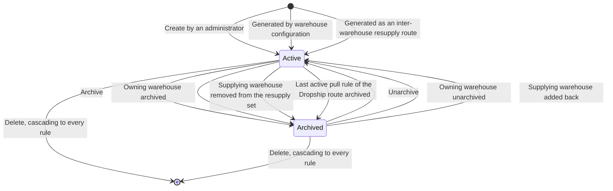
```mermaid
stateDiagram-v2
    [*] --> Active: Create by an administrator
    [*] --> Active: Generated by warehouse configuration
    [*] --> Active: Generated as an inter-warehouse resupply route
    Active --> Archived: Archive
    Active --> Archived: Owning warehouse archived
    Active --> Archived: Supplying warehouse removed from the resupply set
    Active --> Archived: Last active pull rule of the Dropship route archived
    Archived --> Active: Unarchive
    Archived --> Active: Owning warehouse unarchived
    Archived --> Active: Supplying warehouse added back
    Active --> [*]: Delete, cascading to every rule
    Archived --> [*]: Delete, cascading to every rule
```

### 1.2 The five plain applicability flags

**Fields.** Five stored booleans on Route. Each one decides whether the route may be **attached** to one kind of record; none of them changes what the route's rules do once the route is attached. All five are copied when the record is duplicated, none is tracked, and none is derived.

| Identifier | Full name in words | Label on the form | Default | Contributed by |
|---|---|---|---|---|
| `product_selectable` | product selectable | "Applicable on Product" | `true` | the Inventory capability package |
| `product_category_selectable` | product category selectable | "Applicable on Product Category" | `false` | the Inventory capability package |
| `package_type_selectable` | package type selectable | "Applicable on Package Type" | `false` | the Inventory capability package |
| `sale_selectable` | sale selectable | "Selectable on Sales Order Line" | `false` | the Sales Inventory capability package |
| `shipping_selectable` | shipping selectable | "Applicable on Shipping Methods" | `false` | the Delivery Methods capability package |

#### 1.2.1 States

Each of the five carries the same two states.

| Stored value | Label | Meaning |
|---|---|---|
| `true` | Applicable | The route appears in the route selector of the kind of record the flag names, and may be attached there. Once attached, the route's rules become candidates for every need and every arrival that concerns that record. |
| `false` | Not applicable | The route is absent from that selector, so no new attachment can be made. Attachments made while the flag was `true` are **not** removed: an existing link keeps working and keeps making the route a candidate. Only the ability to create a new attachment is withdrawn. |

What each flag opens when it is `true`:

| Flag | The selector it opens | The effect of an attachment made through it |
|---|---|---|
| `product_selectable` | The Routes field on the Inventory tab of a Product Template, and the route selector of the Product Replenish Wizard | The route is a candidate route for every need and every arrival of that product. |
| `product_category_selectable` | The Routes field of a Product Category | The route is a candidate route for every product of that category that does not carry its own route. |
| `package_type_selectable` | The Routes field of a Package Type | The route is a candidate route for goods handled in that package type. |
| `sale_selectable` | The Routes field of a Sales Order Line, and the extra-routes selector of the Stock Rules Report wizard | The route is carried by the need created from that line and is tried ahead of the product's own routes. In the routes-diagram dialog it only widens what is drawn. |
| `shipping_selectable` | The Routes field of a Shipping Method | The route is a candidate route for a delivery carried by that shipping method. |

The flags are read only when the selector is built. Rule selection itself never reads them: it reads the attachment, not the flag that allowed it. This is why unticking a flag never changes the behaviour of a route that is already attached.

The `route` field of a Reordering Rule is a partial exception and must be reproduced as such: it accepts a route whose `product_selectable` is `true`, **or** any route that contains at least one rule whose action is `buy` or `manufacture`, whatever the five flags say (`RP-RULE-050`).

#### 1.2.2 Transition table

| From | To | Trigger | Guards, in evaluation order | Records created or changed |
|---|---|---|---|---|
| not existing | `product_selectable` `true`, the four others `false` | An inventory administrator creates a route without supplying the flags | none | The defaults are applied. |
| not existing | `product_selectable` `false` and `product_category_selectable` `true` | Warehouse configuration generates the reception route, the delivery route or another route slot of a warehouse | The guards of section 1.1.2 for that creation path | The route is created with `product_selectable` explicitly `false`, overriding its default, and `product_category_selectable` `true`. `package_type_selectable`, `sale_selectable` and `shipping_selectable` keep their default `false`. The route is meant to be reached through the warehouse, not chosen on a product. |
| not existing | `product_selectable` `true` and `product_category_selectable` `true` | The inter-warehouse resupply generator creates a resupply route for a pair of warehouses | The two guards of section 14.2 | The route is created with both flags `true`, so a single product may be pointed at one supplying warehouse without changing the whole category. The other three keep their default `false`. |
| `false` | `true` | An inventory administrator ticks the flag | none | Nothing else is written. The route appears in the corresponding selector on the next read of that selector. |
| `true` | `false` | An inventory administrator unticks the flag | none | Nothing else is written. Existing attachments survive; see the finding below. |
| any | the same value | A user duplicates the route | none | All five flags are copied unchanged onto the copy, while `products`, `product_categories`, `warehouses`, `supplied_warehouse` and `supplier_warehouse` are cleared. |

#### 1.2.3 Guards and consequences

1. No guard refuses either value of any of the five flags. Every combination is storable, including all five `false`, which makes the route reachable only through the Routes screen and through the rules that already point at it.
2. **Compatibility finding — unticking a flag leaves stale attachments behind.** Unticking `product_selectable` on a route that thirty products already carry removes the route from the product selector but leaves the route on all thirty products, where it keeps driving rule selection and can no longer be removed from the form, because the field that held it is now hidden. The same holds for the other four. Only `warehouse_selectable` clears its own attachments, and only when it is written through a form (section 1.3). A corrected behaviour applies the `warehouse_selectable` treatment to all six: clearing the corresponding attachment set in the same write that sets the flag to `false`, and doing it on every write rather than only on a form on-change.
3. Archiving the route (section 1.1) makes it invisible whatever these five flags say. The flags and the archive flag are independent: an archived route with every applicability flag `true` is offered nowhere.

#### 1.2.4 Diagram

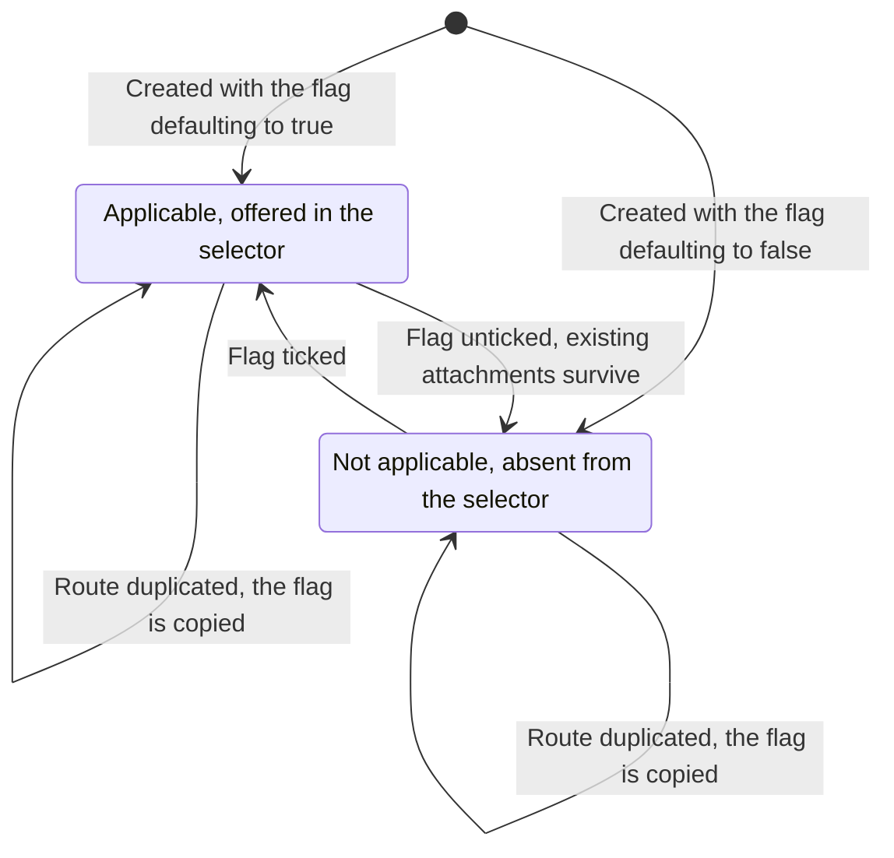
```mermaid
stateDiagram-v2
    [*] --> Applicable: Created with the flag defaulting to true
    [*] --> NotApplicable: Created with the flag defaulting to false
    state "Applicable, offered in the selector" as Applicable
    state "Not applicable, absent from the selector" as NotApplicable
    Applicable --> NotApplicable: Flag unticked, existing attachments survive
    NotApplicable --> Applicable: Flag ticked
    Applicable --> Applicable: Route duplicated, the flag is copied
    NotApplicable --> NotApplicable: Route duplicated, the flag is copied
```

### 1.3 The warehouse applicability flag

**Field.** `warehouse_selectable` on Route, labelled "Applicable on Warehouse". Boolean, stored, default false, copied when the record is duplicated. It is separated from the five flags of section 1.2 because it is the only one of the six that writes another field when it changes.

#### 1.3.1 States

| Stored value | Label | Meaning |
|---|---|---|
| `true` | Applicable on Warehouse | The route may be listed in a warehouse's route set and holds its own `warehouses` set. For every warehouse in that set the route acts as a default route: goods passing through the warehouse are offered the route's rules even when neither the product nor its category carries the route. The `allowed_warehouses` list restricts what may be added — every warehouse of the route's `company`, or every warehouse when `company` is empty. |
| `false` | Not applicable on Warehouse | The route is absent from the warehouse route selector, and `warehouses` is empty whenever the flag was switched off through a form, because the form on-change empties the set in the same edit. |

#### 1.3.2 Transition table

| From | To | Trigger | Guards, in evaluation order | Records created or changed |
|---|---|---|---|---|
| not existing | `false` | An inventory administrator creates a route without supplying the flag | none | The default is applied. |
| not existing | `true` | Warehouse configuration generates the reception route or the delivery route of a warehouse | The warehouse exists and its step value is known | The route is created with `warehouse_selectable` `true` and `product_category_selectable` `true`, and is added to the warehouse's `routes`. |
| not existing | `true` | The inter-warehouse resupply generator creates a resupply route for a pair of warehouses | The two guards of section 14.2 | The route is created with `warehouse_selectable` `true`, `product_selectable` `true` and `product_category_selectable` `true`. |
| `false` | `true` | An inventory administrator ticks the flag on a form | none | The Warehouses field becomes visible and empty. `allowed_warehouses` is computed from `company`. |
| `true` | `false` | An inventory administrator unticks the flag on a form | none | **`warehouses` is emptied in the same on-change.** Every warehouse for which this route was a default route stops having it. The route's rules are untouched and are still reachable through a product, a category or a sales order line when the matching flag of section 1.2 allows it. |
| `true` | `false` | The value `false` is written outside a form — by an import, by a batch write or by a scripted configuration step | none | The on-change does not run, so `warehouses` keeps its members and the route keeps acting as a default route for them while being absent from the selector. See the finding below. |
| `true` | `true` | `company` is written on the route through a form | none | `warehouses` is filtered down to the warehouses of the new company; warehouses of other companies are dropped. `allowed_warehouses` is recomputed. |
| any | the same value | A user duplicates the route | none | The flag is copied; `warehouses`, `supplied_warehouse` and `supplier_warehouse` are cleared on the copy. |

#### 1.3.3 Guards and consequences

1. No guard refuses either value.
2. `warehouses` is restricted to `allowed_warehouses`. A warehouse of another company is refused with the shared "value not allowed" message of the platform.
3. **Compatibility finding — the clearing of `warehouses` is a form behaviour, not a rule.** Emptying `warehouses` happens in the form on-change of `warehouse_selectable` and in the form on-change of `company`, so a write that does not go through a form leaves a route that is not applicable on warehouses still attached to warehouses, and leaves a route whose company changed still attached to warehouses of the old company — which the company-consistency rule of section 1.1.3 does not catch, because it only compares the route company with its rules' companies. A corrected behaviour performs both clearings in the write itself, so that the stored data can never hold a warehouse attachment that the flags forbid.
4. Archiving the route does not clear `warehouses`; unarchiving therefore restores the exact configuration, which is the behaviour section 1.1.1 relies on.

#### 1.3.4 Diagram

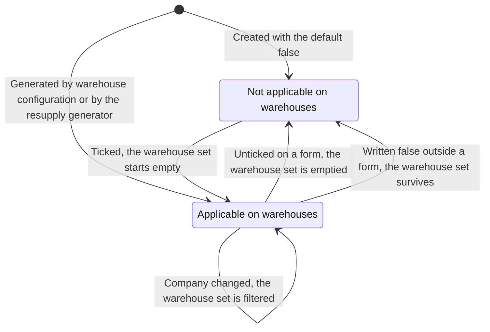
```mermaid
stateDiagram-v2
    [*] --> NotApplicable: Created with the default false
    [*] --> Applicable: Generated by warehouse configuration or by the resupply generator
    state "Applicable on warehouses" as Applicable
    state "Not applicable on warehouses" as NotApplicable
    Applicable --> NotApplicable: Unticked on a form, the warehouse set is emptied
    Applicable --> NotApplicable: Written false outside a form, the warehouse set survives
    NotApplicable --> Applicable: Ticked, the warehouse set starts empty
    Applicable --> Applicable: Company changed, the warehouse set is filtered
```

---

## 2. Stock Rule

A Stock Rule carries seven state fields: its archive flag, its action, its supply method, its push mode, the flag that decides where the created move lands, the flag that propagates cancellation down the chain and the flag that propagates the shipping method. They are independent machines on one record, and a replacement must implement all seven.

### 2.1 Archive state

**Field.** `active` on Stock Rule. Boolean, stored, default true, copied when the record is duplicated.

#### 2.1.1 States

| Stored value | Label | Meaning |
|---|---|---|
| `true` | Active | The rule is a candidate for rule selection, for arrival handling and for the rule-chain walk of a reordering rule. |
| `false` | Archived | The rule is excluded from every default query and is therefore never selected, never walked and never shown. The record survives so that a later configuration change can reuse it instead of creating a duplicate. |

#### 2.1.2 Transition table

| From | To | Trigger | Guards, in evaluation order | Records created or changed |
|---|---|---|---|---|
| not existing | Active | A user adds a rule to a route | 1. `name`, `action`, `destination_location`, `route`, `procure_method`, `operation_type` and `auto` are present (`RP-RULE-020`). 2. When the route has a company, the rule company equals it (`RP-RULE-021`). 3. `destination_location`, `location_source`, `operation_type`, `partner_address` and `warehouse` belong to the rule company or to no company (`RP-RULE-023`). 4. The operation type's code is allowed for the chosen action (`RP-RULE-024`). | The rule. |
| not existing | Active | Warehouse configuration needs a routing for which no archived rule matches | No archived rule exists with the same `operation_type`, `location_source`, `destination_location`, `route` and `action` (`RP-RULE-035`) | The rule, with the generated values of `configuration.md`, section 8, including the forced `propagate_cancel` false on the last rule of a cancel-propagating chain (`RP-RULE-034`). |
| Archived | Active | Warehouse configuration needs a routing for which an archived rule matches | The archived rule matches on `operation_type`, `location_source`, `destination_location`, `route` and `action` | That rule is unarchived; no duplicate is created. |
| Active | Archived | A user archives the rule | none | The rule stops being selectable. Needs that depended on it fail with `RP-RULE-072` from the next run onwards. |
| Active | Archived | The rule's route is archived | The rule's `destination_location` is still active | Archived together with every sibling rule that satisfies the same condition. |
| Active | Archived | A route slot of a warehouse is rebuilt because a field the slot depends on was written | none | Every rule of that route is archived before the rules of the new step value are created or unarchived. |
| Active | Archived | `buy_to_resupply` of the warehouse becomes false | none | The warehouse's `buy_pull` rule has `active` set to false, and the warehouse is removed from the `warehouses` list of the shipped Buy route. |
| Active | Archived | A supplying warehouse moves back to one delivery step | The rule's `destination_location` is the Output location and its operation type is the picking operation type of that warehouse | The extra "stock to Output" rules of every supplied route are archived; new make-to-order rules from the stock location to each transit destination are created with the outgoing operation type. |
| Active | Archived | A supplying warehouse moves to several delivery steps | The rule belongs to the shipped "Replenish on Order" route, its destination is a transit location and its source is that warehouse's stock location | The rule is archived so that it can no longer be selected. |
| Active | Archived | `subcontracting_to_resupply` of the warehouse becomes false, or the warehouse becomes inactive | The rule belongs to the global Dropship route, its `action` is `pull` and its `location_source` is a subcontracting location | The rule is archived. When the warehouse itself is being archived, this step is skipped, because archiving the warehouse already archives its rules. |
| Archived | Active | A user unarchives the rule | The same four guards as creation, re-evaluated on write | The rule becomes selectable again. |
| Archived | Active | The rule's route is unarchived | The rule's `destination_location` is active | Unarchived with its siblings. |
| Archived | Active | `subcontracting_to_resupply` becomes true on an active warehouse | The rule belongs to the global Dropship route, its `action` is `pull` and its source is a subcontracting location | The rule is unarchived. |
| Archived | Active | A supplying warehouse moves to several delivery steps | The rule is one of the extra "stock to output" rules that were archived when it moved to one step | The rule is unarchived; for every supplied route that has none, a new "stock to new output location" rule is created with the picking operation type. |
| Active or Archived | deleted | The rule's route is deleted | none | The rule is deleted by the cascade of the `route` relation. |
| Active or Archived | deleted | The capability package that contributes the `buy` or the `manufacture` action value is removed | The rule's `action` holds the removed value | The rule is deleted, because the selection value declares cascading deletion. |

#### 2.1.3 Guards with their refusal messages

1. **Required fields.** A rule missing `name`, `action`, `destination_location`, `route`, `procure_method`, `operation_type` or `auto` is refused with the platform's shared "required field" message.
2. **Company consistency with the route.** `Rule <rule name> belongs to <rule company> while the route belongs to <route company>.`
3. **Company consistency of the referenced records.** A location, operation type, contact or warehouse of another company is refused with the platform's shared company-consistency message.
4. **Operation type code.** An operation type whose code is not in the list allowed by the current action is refused with the platform's shared "value not allowed" message. The allowed lists are: every code for `pull`, `push` and `pull_push`; `incoming` and, when drop shipping is installed, `dropship`, for `buy`; `manufacturing` for `manufacture`.
5. No guard refuses archiving. A rule that is the only rule of a chain may be archived, and the chain then fails at run time rather than at configuration time.

#### 2.1.4 Diagram

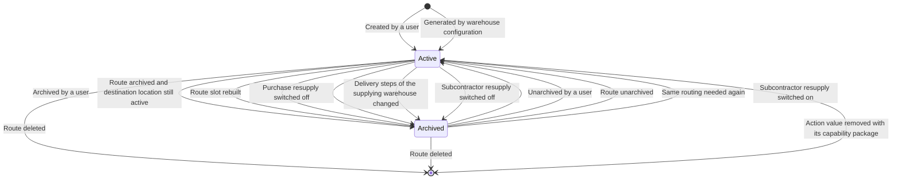
```mermaid
stateDiagram-v2
    [*] --> Active: Created by a user
    [*] --> Active: Generated by warehouse configuration
    Active --> Archived: Archived by a user
    Active --> Archived: Route archived and destination location still active
    Active --> Archived: Route slot rebuilt
    Active --> Archived: Purchase resupply switched off
    Active --> Archived: Delivery steps of the supplying warehouse changed
    Active --> Archived: Subcontractor resupply switched off
    Archived --> Active: Unarchived by a user
    Archived --> Active: Route unarchived
    Archived --> Active: Same routing needed again
    Archived --> Active: Subcontractor resupply switched on
    Active --> [*]: Route deleted
    Archived --> [*]: Route deleted
    Active --> [*]: Action value removed with its capability package
```

### 2.2 Action

**Field.** `action` on Stock Rule. Selection, stored, indexed, required, default `pull`, copied when the record is duplicated. It decides which half of route execution the rule takes part in and which handler resolves a need it wins.

#### 2.2.1 States

| Stored value | Label | Meaning |
|---|---|---|
| `pull` | Pull From | The rule answers needs. When a need appears in `destination_location`, a stock move is created from `location_source`. |
| `push` | Push To | The rule answers arrivals. When goods arrive in `location_source`, a stock move to `destination_location` is created, or the destination of the arriving move is rewritten when the push mode is `transparent`. |
| `pull_push` | Pull & Push | Both behaviors on one record. During need resolution the rule behaves exactly as `pull`; during arrival handling it behaves exactly as `push`. |
| `buy` | Buy | The rule answers needs by creating or extending a draft purchase order line instead of a stock move. Contributed by the Purchase Inventory capability package. |
| `manufacture` | Manufacture | The rule answers needs by creating or extending a manufacturing order. Contributed by the Manufacturing capability package. |

#### 2.2.2 Transition table

| From | To | Trigger | Guards, in evaluation order | Records created or changed |
|---|---|---|---|---|
| not existing | `pull` | Create a rule without supplying an action | none | The default is applied. |
| any value | any other value | An inventory administrator edits the field | 1. The current `operation_type` must have a code allowed for the new value; otherwise the platform's shared "value not allowed" message is raised. 2. Company consistency is unaffected. | `allowed_operation_type_codes` is recomputed. When the new value is `buy`, `location_source` is emptied in the form, because a buy rule has no source location: the source of the eventual receipt is the vendor location of the vendor chosen at run time (`RP-RULE-025`). |
| any value | any other value | Warehouse configuration rebuilds a route slot | The routing entry names the action | The rule is created or unarchived with the routing's action; an existing rule of the slot is updated. |
| `buy` or `manufacture` | deleted | The contributing capability package is removed | none | The rule is deleted, because the selection value declares cascading deletion. |

#### 2.2.3 Guards with their refusal messages

1. **Allowed operation type codes.** The platform's shared "value not allowed" message. The list is empty, meaning every code, for `pull`, `push` and `pull_push`; it is `["incoming", "dropship"]` for `buy` when drop shipping is installed and `["incoming"]` otherwise; it is `["manufacturing"]` for `manufacture`.
2. **A pull rule with no source location, detected at run time.** The field is not mandatory, so a `pull` or `pull_push` rule may be saved without `location_source`. The failure surfaces when the rule is selected for a need and the pull action validates it: `No source location defined on stock rule: <rule name>!`, where the placeholder is the rule's display name. Nothing is created for the whole batch of that action (`RP-RULE-028`).
3. **A `buy` rule with a source location.** The field is not cleared on a rule saved through a data import; only the form clears it. A `buy` rule ignores `location_source` entirely, so no refusal is raised.

#### 2.2.4 Diagram

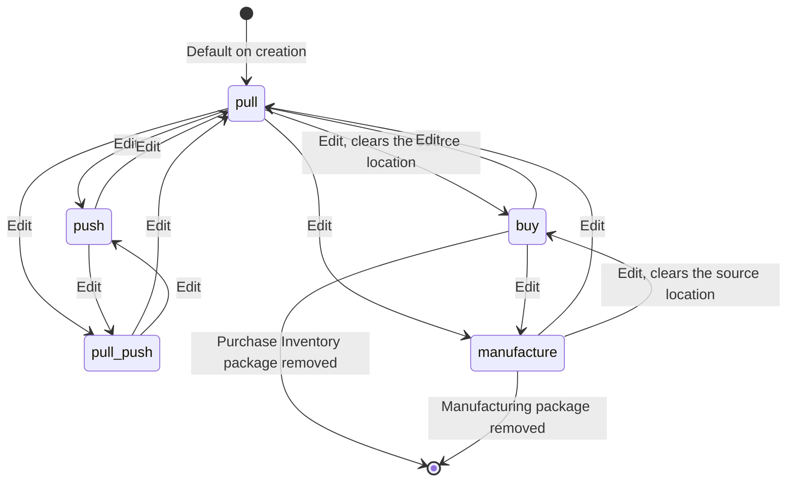
```mermaid
stateDiagram-v2
    [*] --> pull: Default on creation
    pull --> push: Edit
    pull --> pull_push: Edit
    pull --> buy: Edit, clears the source location
    pull --> manufacture: Edit
    push --> pull: Edit
    push --> pull_push: Edit
    pull_push --> pull: Edit
    pull_push --> push: Edit
    buy --> pull: Edit
    buy --> manufacture: Edit
    manufacture --> pull: Edit
    manufacture --> buy: Edit, clears the source location
    buy --> [*]: Purchase Inventory package removed
    manufacture --> [*]: Manufacturing package removed
```

### 2.3 Supply method

**Field.** `procure_method` on Stock Rule, labelled "Supply Method". Selection, stored, required, default `make_to_stock`, copied when the record is duplicated. It decides whether resolving a need with this rule creates a further need at the rule's source location.

#### 2.3.1 States

| Stored value | Label | Meaning |
|---|---|---|
| `make_to_stock` | Take From Stock | The goods are taken from the stock available in `location_source`. Confirming the created move creates no further need. |
| `make_to_order` | Trigger Another Rule | The stock available in `location_source` is ignored. Confirming the created move creates a new need at `location_source` for the full demand quantity, and rule selection runs again for it. |
| `mts_else_mto` | Take From Stock, if unavailable, Trigger Another Rule | The stored value shortens "make to stock, else make to order". The free stock of `location_source` covers as much as it can; only the missing quantity creates a new need there. The created move is written with `make_to_stock`, because the split has already happened. |

#### 2.3.2 Transition table

| From | To | Trigger | Guards | Records created or changed |
|---|---|---|---|---|
| not existing | `make_to_stock` | Create a rule without supplying a supply method | none | The default is applied. |
| any value | any other value | An inventory administrator edits the field | none; every value is always admissible | Existing moves are untouched. The change affects only needs resolved after it. |
| any value | `make_to_stock` | An inter-warehouse resupply rule is generated or rewritten and its `location_source` is the supplying warehouse's stock location | none | The rule is written with `make_to_stock` (`RP-RULE-272`). |
| any value | `make_to_order` | An inter-warehouse resupply rule is generated or rewritten and its `location_source` is not the supplying warehouse's stock location | none | The rule is written with `make_to_order`. |
| `make_to_order` | `make_to_stock` | A supplying warehouse moves back to one delivery step | The rule is not a push rule and its destination is a transit location | The rule's `location_source` is rewritten to the new output location at the same time (`RP-RULE-275`). |
| `make_to_stock` | `make_to_order` | A supplying warehouse moves to several delivery steps | The same condition | The same source rewrite. |
| any value | `make_to_stock` or `make_to_order` | Warehouse configuration rebuilds a route slot | none | The first routing of a generated list is written with `make_to_stock` and every following one with `make_to_order`. When the Purchase Inventory capability package is installed, the reception route's rules are generated with `make_to_order`, because the `buy` rule starts the chain. |

#### 2.3.3 Guards and consequences

No guard refuses a value: all three are always storable. Three consequences are nevertheless part of the machine and a replacement must reproduce them.

1. A rule whose `location_source` equals its `destination_location` and whose supply method is `make_to_order` describes an endless supply loop. Saving it is allowed; the loop is detected when a rule chain is walked, and the walk refuses with `Invalid rule's configuration, the following rule causes an endless loop: <rule display name>`, where the placeholder is the display name of the rule that appeared twice (`RP-RULE-036`, `RP-RULE-160`). **Industry-standard default.** The late detection is deliberate, so that a partially built configuration stays editable; a replacement should apply the same late detection rather than refusing at save time.
2. `mts_else_mto` is never written onto a stock move. The pull action writes `make_to_stock` in its place, because the split between the part taken from stock and the part that triggers another rule happened before the request was built (`RP-RULE-081`).
3. When an existing move is re-evaluated against the rules, a rule whose supply method is `mts_else_mto` gives the move `make_to_stock` (`RP-RULE-153`).

#### 2.3.4 Diagram

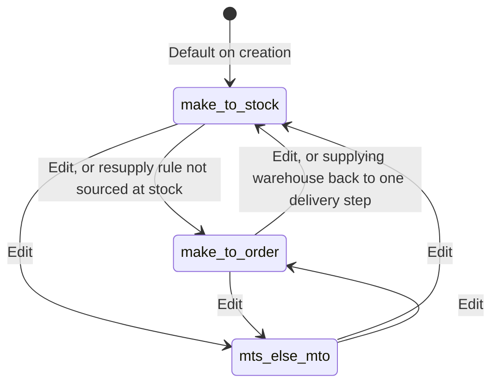
```mermaid
stateDiagram-v2
    [*] --> make_to_stock: Default on creation
    make_to_stock --> make_to_order: Edit, or resupply rule not sourced at stock
    make_to_stock --> mts_else_mto: Edit
    make_to_order --> make_to_stock: Edit, or supplying warehouse back to one delivery step
    make_to_order --> mts_else_mto: Edit
    mts_else_mto --> make_to_stock: Edit
    mts_else_mto --> make_to_order: Edit
```

### 2.4 Push mode

**Field.** `auto` on Stock Rule, labelled "Automatic Move". Selection, stored, required, default `manual`, copied when the record is duplicated. It is read only during arrival handling; a rule whose action is `pull` or `buy` stores a value that is never consulted.

#### 2.4.1 States

| Stored value | Label | Meaning |
|---|---|---|
| `manual` | Manual Operation | Applying the rule creates a new stock move after the arriving one, so the goods make a visible extra step with its own transfer. |
| `transparent` | Automatic No Step Added | Applying the rule rewrites the arriving move instead of creating a new one: its scheduled date gains the rule lead time and its destination location becomes the rule's `destination_location`. No extra transfer appears. |

#### 2.4.2 Transition table

| From | To | Trigger | Guards | Records created or changed |
|---|---|---|---|---|
| not existing | `manual` | Create a rule without supplying a push mode | none | The default is applied. Every rule generated by warehouse configuration is generated with `manual`. |
| `manual` | `transparent` | An inventory administrator edits the field | none | Nothing else changes. Arrivals handled after the change collapse the step. |
| `transparent` | `manual` | An inventory administrator edits the field | none | Nothing else changes. |

#### 2.4.3 Guards and consequences

No guard refuses either value. Two behavioural consequences belong to the machine.

1. A `transparent` rule re-runs arrival handling on the same move, so that a chain of transparent rules collapses in one pass, **but only when the destination location actually changed**. When it did not change, the pass stops. This is the only protection against an endless loop on a rule whose destination equals its source (`RP-RULE-134`).
2. A `manual` rule creates the new move for the quantity actually completed on the arriving move, except that when the arriving move's demand quantity is negative, that demand quantity is used instead (`RP-RULE-135`).

#### 2.4.4 Diagram

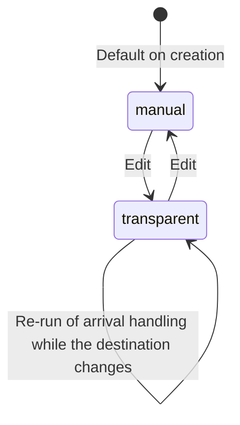
```mermaid
stateDiagram-v2
    [*] --> manual: Default on creation
    manual --> transparent: Edit
    transparent --> manual: Edit
    transparent --> transparent: Re-run of arrival handling while the destination changes
```

### 2.5 The destination-location origin flag

**Field.** `location_destination_from_rule` on Stock Rule, labelled "Destination location origin from rule". Boolean, stored, default false, copied when the record is duplicated. It decides which of two locations the rule stamps on the move it creates, and which of them becomes the move's final location instead.

#### 2.5.1 States

| Stored value | Label | Meaning |
|---|---|---|
| `false` | Destination taken from the operation type | The created move's `destination_location` is the default destination location of the rule's `operation_type`, and the rule's own `destination_location` is written on the move as its `location_final` — the place the goods must eventually reach. The move therefore lands one step short of the rule's destination and a further rule is expected to carry it the rest of the way (`RP-RULE-032`). |
| `true` | Destination taken from the rule | The created move's `destination_location` is the rule's own `destination_location`. The operation type's default destination location is ignored for this move, and no final location is derived from the rule. |

#### 2.5.2 Transition table

| From | To | Trigger | Guards, in evaluation order | Records created or changed |
|---|---|---|---|---|
| not existing | `false` | An inventory administrator creates a rule without supplying the flag | none | The default is applied. Every rule that warehouse configuration generates for a reception route or a delivery route keeps `false`. |
| not existing | `true` | The inter-warehouse resupply generator creates the **first** rule of a resupply route, the one that runs from the supplying warehouse's output location to the transit location | The two guards of section 14.2 | The rule is created with `location_destination_from_rule` `true`, so that the goods stop in the transit location instead of being pushed on to the operation type's default destination. The second and third rules of the same route are created with the default `false`. |
| `false` | `true` | An inventory administrator edits the field | none | Moves already created keep the destination and final location they were given; only needs resolved after the edit change. |
| `true` | `false` | An inventory administrator edits the field | none | The same: no existing move is rewritten. |
| any | the same value | A user duplicates the rule | none | The flag is copied unchanged. |

#### 2.5.3 Guards and consequences

1. No guard refuses either value.
2. The flag is read only by the pull action, and only for a rule whose `action` is `pull` or `pull_push` and whose operation type has a default destination location. A `push`, `buy` or `manufacture` rule stores a value that is never consulted.
3. The flag also changes the sentence the Rules screen shows for the rule: when the action is `pull` or `pull_push`, the operation type has a default destination location that differs from the rule's `destination_location`, and the flag is `false`, the description gains the clause that names the operation type's destination as the place the goods will actually be moved towards. The full text is in `calculations.md`, section "Rule description message".
4. Setting the flag to `true` on a rule whose operation type points elsewhere is the documented way to make a rule land exactly where it says, and it is what makes an inter-warehouse resupply chain stop in transit rather than jump to the supplying warehouse's own default destination.

#### 2.5.4 Diagram

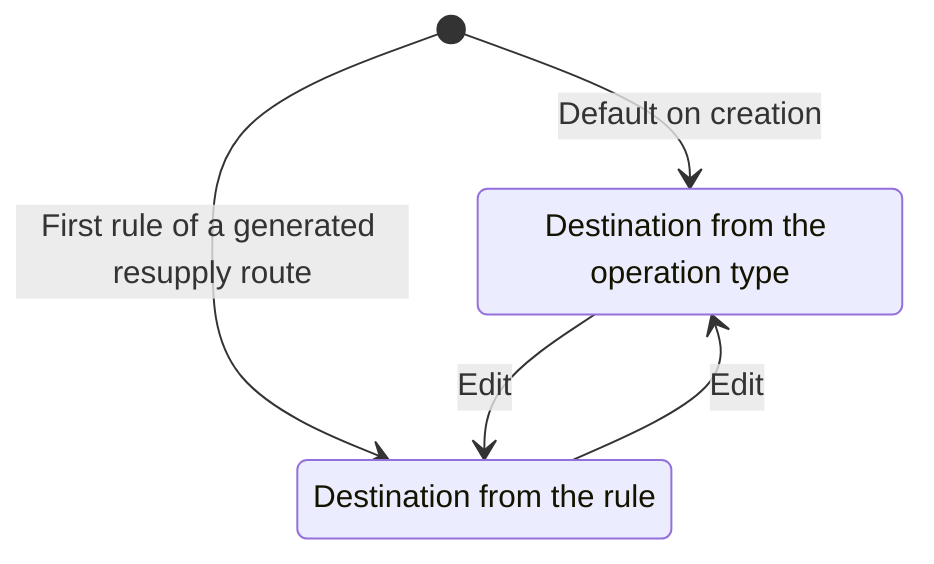
```mermaid
stateDiagram-v2
    [*] --> FromOperationType: Default on creation
    [*] --> FromRule: First rule of a generated resupply route
    state "Destination from the operation type" as FromOperationType
    state "Destination from the rule" as FromRule
    FromOperationType --> FromRule: Edit
    FromRule --> FromOperationType: Edit
```

### 2.6 The cancellation-propagation flag

**Field.** `propagate_cancel` on Stock Rule, labelled "Cancel Next Move". Boolean, stored, default false, copied when the record is duplicated. It is stamped onto every stock move and every purchase order line the rule creates, and it is read at cancellation time from that copy, never from the rule.

#### 2.6.1 States

| Stored value | Label | Meaning |
|---|---|---|
| `false` | Do not cancel the next move | Cancelling a move created by this rule never cancels the moves downstream of it. When every sibling origin move is completed or cancelled, the downstream moves have their supply method set to `make_to_stock` and are unlinked from the cancelled move, so they survive and will be served from stock (`RP-RULE-242`). |
| `true` | Cancel the next move | Cancelling a move created by this rule cancels the downstream moves that are not yet completed and whose source location equals the cancelled move's destination location, provided every sibling origin move is already cancelled. Downstream moves that do not match are set to `make_to_stock` and unlinked (`RP-RULE-241`). When the stored parameter `inventory.cancel_originating_moves` is present, cancelling such a move also cancels its not-yet-completed origin moves (`RP-RULE-243`). |

#### 2.6.2 Transition table

| From | To | Trigger | Guards, in evaluation order | Records created or changed |
|---|---|---|---|---|
| not existing | `false` | An inventory administrator creates a rule without supplying the flag | none | The default is applied. |
| not existing | `true` | Warehouse configuration generates the reception route of a warehouse | The warehouse's reception step value is known | Every rule of the generated list is created with `propagate_cancel` `true`, **then the last rule of the list has it forced back to `false`**, so that cancelling the first step of a receipt chain never cascades past the end of the chain into an unrelated delivery (`RP-RULE-034`). |
| not existing | derived from the reception steps | Warehouse configuration generates the `buy_pull` rule of a warehouse | `buy_to_resupply` is true | The rule is created with `propagate_cancel` equal to "the warehouse's reception step value is not one step". |
| `false` | `true`, or `true` to `false` | The warehouse's reception step value is changed | none | The reception route is rebuilt: the rules are rewritten with `true` and the last one forced back to `false`, and the `buy_pull` rule's `propagate_cancel` is rewritten to "the new step value is not one step". |
| `false` | `true` | An inventory administrator edits the field | none | Moves and purchase order lines already created keep the value they were stamped with; only documents created after the edit change. |
| `true` | `false` | An inventory administrator edits the field | none | The same. |
| any | the same value | A user duplicates the rule | none | The flag is copied unchanged. |

#### 2.6.3 Guards and consequences

1. No guard refuses either value, and no configuration is rejected because of it. The forced `false` on the last rule of a generated chain is a write, not a refusal.
2. The value is copied onto the created stock move at creation and onto the created purchase order line by the buy action. It is part of the purchase order line merge key: two needs may share one line only when their `propagate_cancel` values match (`RP-RULE-106`, `RP-RULE-108`).
3. Cancelling a purchase order or deleting a purchase order line reads the value from the **line**, not from the rule: the remaining downstream moves are cancelled when the line's `propagate_cancel` is true and fall back to `make_to_stock` otherwise (`RP-RULE-245`, `RP-RULE-247`).
4. Because the value travels with the document, editing the rule can never change the fate of a document that already exists. A replacement that reads the rule at cancellation time instead of the stamped copy produces a different, and wrong, cascade.

#### 2.6.4 Diagram

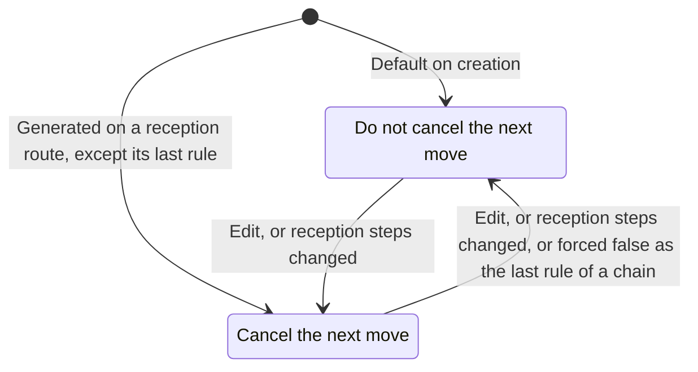
```mermaid
stateDiagram-v2
    [*] --> DoNotCancel: Default on creation
    [*] --> Cancel: Generated on a reception route, except its last rule
    state "Do not cancel the next move" as DoNotCancel
    state "Cancel the next move" as Cancel
    DoNotCancel --> Cancel: Edit, or reception steps changed
    Cancel --> DoNotCancel: Edit, or reception steps changed, or forced false as the last rule of a chain
```

### 2.7 The shipping-method-propagation flag

**Field.** `propagate_carrier` on Stock Rule, labelled "Propagation of carrier". Boolean, stored, default false, copied when the record is duplicated. It is read from the rule at two moments and is never stamped onto a document.

#### 2.7.1 States

| Stored value | Label | Meaning |
|---|---|---|
| `false` | Do not propagate the shipping method | A transfer created for a move of this rule receives no shipping method from the chain. A shipping method may still be set on it by hand or by the delivery step that owns it. |
| `true` | Propagate the shipping method | A transfer created for a move of this rule receives a shipping method and a tracking reference from the chain, and a validated transfer that carries a shipping method passes it on to the next transfers whose moves belong to a rule with this flag. |

#### 2.7.2 Transition table

| From | To | Trigger | Guards, in evaluation order | Records created or changed |
|---|---|---|---|---|
| not existing | `false` | An inventory administrator creates a rule without supplying the flag | none | The default is applied. |
| not existing | `true` | Warehouse configuration generates the delivery route of a warehouse | The warehouse's delivery step value is known | Every rule of the generated delivery list is created with `propagate_carrier` `true`. |
| not existing | `true` | Warehouse configuration generates the warehouse's make-to-order rule inside the shipped "Replenish on Order" route | `delivery_steps` is known | The rule is created with `procure_method` `make_to_order`, `auto` `manual` and `propagate_carrier` `true`. |
| `false` | `true` | An inventory administrator edits the field | none | Transfers already created keep the shipping method they have; only transfers created or validated after the edit change. |
| `true` | `false` | An inventory administrator edits the field | none | The same. |
| any | the same value | A user duplicates the rule | none | The flag is copied unchanged. |

#### 2.7.3 Guards and consequences

Two distinct moments read the flag, and a replacement must reproduce both, because a shipping method may be chosen before the chain starts or half-way through it.

1. **When a transfer is created for a batch of moves.** If no rule among the moves of the new transfer has `propagate_carrier` true, nothing is propagated. Otherwise: the candidate shipping method is the one of the sales orders reached through the moves' stock references, but only when those orders resolve to exactly one shipping method; when the origin moves' transfers resolve to exactly one shipping method, that one is taken instead, because a shipping method chosen on an earlier step is more recent than the one on the order. The tracking reference is taken from the first origin transfer that carries one. Each of the two is written on the new transfer only when it is non-empty.
2. **When a transfer that carries a shipping method is validated.** Every transfer that follows it in the chain, that has no shipping method of its own, and among whose moves at least one rule has `propagate_carrier` true, receives that shipping method and that tracking reference.
3. No guard refuses either value, and the flag is never read for a rule whose action is `buy` or `manufacture`, because those actions create no transfer of their own.

#### 2.7.4 Diagram

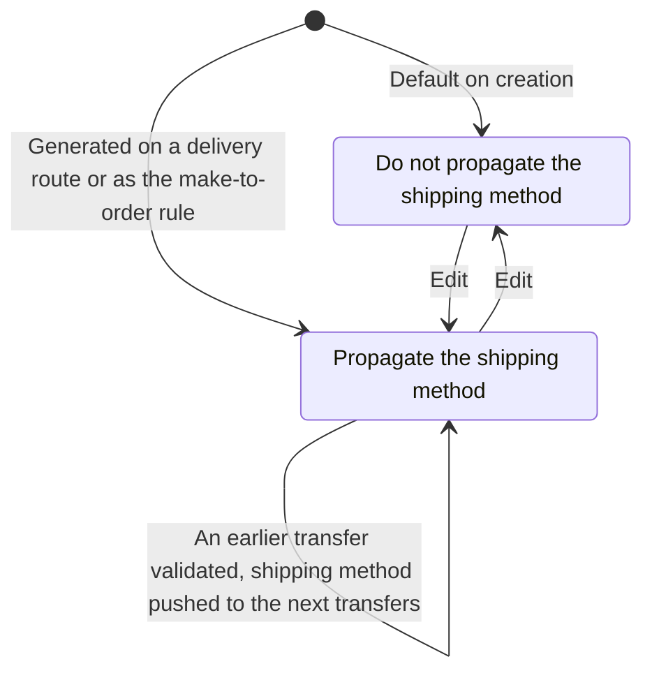
```mermaid
stateDiagram-v2
    [*] --> DoNotPropagate: Default on creation
    [*] --> Propagate: Generated on a delivery route or as the make-to-order rule
    state "Do not propagate the shipping method" as DoNotPropagate
    state "Propagate the shipping method" as Propagate
    DoNotPropagate --> Propagate: Edit
    Propagate --> DoNotPropagate: Edit
    Propagate --> Propagate: Transfer created, shipping method and tracking reference copied from the chain
    Propagate --> Propagate: An earlier transfer validated, shipping method pushed to the next transfers
```

---

## 3. Reordering Rule

A Reordering Rule carries six machines: its trigger, its snooze state, its archive flag, its derived replenishment state, its manual-override state and the pair of derived flags that decide which of the two supply columns the screens show. The first three are stored, the last three are derived from stored values.

### 3.1 Trigger

**Field.** `trigger` on Reordering Rule. Selection, stored, required, default `auto`, copied when the record is duplicated.

#### 3.1.1 States

| Stored value | Label | Meaning |
|---|---|---|
| `auto` | Auto | The scheduler evaluates and executes the rule without a user. The event-driven trigger also runs it when a transfer is confirmed. The rule may never carry a manual quantity override and may never be snoozed. |
| `manual` | Manual | The rule is shown on the replenishment report and waits for a user to press Order. The scheduler never executes it. It may carry a manual quantity override and may be snoozed. |

#### 3.1.2 Transition table

| From | To | Trigger | Guards, in evaluation order | Records created or changed |
|---|---|---|---|---|
| not existing | `auto` | A user creates a rule without choosing a trigger | 1. `snoozed_until` must be empty, because the default trigger is `auto`. 2. The uniqueness of (`product`, `source_location`, `company`) holds, archived rules included. 3. The minimum is not above the maximum. 4. The product has no bill of materials of type "kit". | The rule; one value of the sequence with code `reordering_rule` is consumed for `name`. |
| not existing | `manual` | A user creates a rule and chooses Manual | The same guards 2 to 4; guard 1 is satisfied by the chosen trigger | The rule; a sequence value is consumed. |
| not existing | `manual` | The replenishment report finds a shortage for a product and location that has no rule at all | No rule, active or archived, exists for that pair | The rule, created under the superuser account with `name` `Replenishment Report` — a fixed text, not a sequence value — minimum 0, maximum 0, the warehouse of the location or the first warehouse of the location's company, and the company of the location. |
| `auto` | `manual` | An inventory administrator edits the Trigger column or the form | none | The rule leaves the scheduler's scope at once. It may now be snoozed and may now carry a manual override. |
| `manual` | `auto` | An inventory administrator edits the Trigger column or the form | none | The rule enters the scheduler's scope at once. `snoozed_until` and `quantity_to_order_manual` are **not** cleared; see the two findings below. |
| `manual` | `auto` | A user presses Automate on the replenishment report, that is the operation "Order and set to automatic" | `quantity_to_order` is greater than zero, which is what makes the button visible | `trigger` is written first, then the rule is ordered exactly as by Order: a procurement request is run, the manual override is cleared and `quantity_to_order` is recomputed. |

#### 3.1.3 Guards with their refusal messages

1. **A snoozed rule may not be created as automatic.** Evaluated at creation, on the values supplied, including the case where `trigger` is not supplied at all and therefore defaults to `auto`. Refusal: `You can not create a snoozed orderpoint that is not manually triggered.`
2. **A snooze date may not be written on an automatic rule.** Evaluated on every write that contains `snoozed_until`, and refused as soon as **any** record of the written set has `trigger` equal to `auto`. Refusal: `You can only snooze manual orderpoints. You should rather archive 'auto-trigger' orderpoints if you do not want them to be triggered.`
3. **Uniqueness.** `A replenishment rule already exists for this product on this location.`
4. **Minimum and maximum.** `The minimum quantity must be less than or equal to the maximum quantity.`
5. **Kit products.** `A product with a kit-type bill of materials can not have a reordering rule.` (`RP-RULE-042`). The constraint is enforced from both sides, and a replacement must implement both. The mirror guard sits on Bill of Materials: making a bill of materials a kit, or pointing an existing kit bill at another product, is refused as soon as any of the products concerned has at least one **active** reordering rule, with `You can not create a kit-type bill of materials for products that have at least one reordering rule.` (`RP-RULE-355`). The two together make the invariant "a kit product never has a reordering rule" unbreakable in either order of operations; a replacement that implements only the reordering-rule side lets a user reach the forbidden combination by creating the rule first and the kit bill afterwards.
6. **The company may never change.** `Changing the company of this record is forbidden at this point, you should rather archive it and create a new one.`
7. **No warehouse for the company.** The shared redirect warning of `../inventory-operations/`: `Please create a warehouse for company <company name>.` with the button `Go to Warehouses` for an inventory administrator, or `Please contact your administrator to configure your warehouse.` for anyone else.

#### 3.1.4 Two findings on the transition from manual to automatic

**Compatibility finding — a snooze date survives the switch to automatic and can no longer be removed.** Writing `trigger` equal to `auto` does not clear `snoozed_until`, and every later write of `snoozed_until`, including a write of the empty value, is refused by guard 2. A rule that was snoozed until a future date and is then switched to automatic therefore keeps a snooze date forever, while the scheduler executes it regardless, because the scheduler selects on `trigger` and on the product's archive flag only and never reads `snoozed_until`. A corrected behaviour clears `snoozed_until` in the same write that sets `trigger` to `auto`, which also restores the invariant that an automatic rule is never snoozed.

**Compatibility finding — a manual quantity override survives the switch to automatic.** `quantity_to_order` is the manual override whenever that override is non-zero, whatever the trigger. The reset of the override to zero happens only inside the inverse rule of `quantity_to_order`, that is only when `quantity_to_order` is itself written. Switching the Trigger column from Manual to Auto writes only `trigger`, so a rule that carried an override of, for example, 40 units keeps ordering 40 units on every scheduler run, independently of the forecast. The Automate button does not suffer from this, because it clears the override as part of the Order it performs. A corrected behaviour clears `quantity_to_order_manual` in the same write that sets `trigger` to `auto`.

#### 3.1.5 Diagram

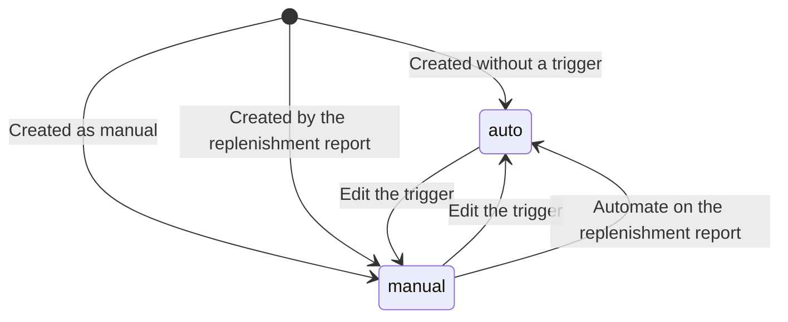
```mermaid
stateDiagram-v2
    [*] --> auto: Created without a trigger
    [*] --> manual: Created as manual
    [*] --> manual: Created by the replenishment report
    auto --> manual: Edit the trigger
    manual --> auto: Edit the trigger
    manual --> auto: Automate on the replenishment report
```

### 3.2 Snooze state

**Field.** `snoozed_until` on Reordering Rule, labelled "Snoozed". Date, stored, empty by default, **not** copied when the record is duplicated. The state is derived from the date by comparison with today.

#### 3.2.1 States

| Condition on `snoozed_until` | Name of the state | Meaning |
|---|---|---|
| empty | Not snoozed | The rule is shown on the replenishment report whenever it has something to order. |
| not later than today | Expired | Behaviourally identical to Not snoozed: the filter that hides snoozed rows keeps every row whose date is empty or not later than today. The date stays on the record as a trace of the last snooze. |
| strictly later than today | Snoozed | The rule is hidden from the replenishment report by the "Not Snoozed" filter until the date is reached. Nothing else changes: the quantities are still recomputed and the rule is still reachable through the Reordering Rules screen. |

#### 3.2.2 Transition table

| From | To | Trigger | Guards, in evaluation order | Records created or changed |
|---|---|---|---|---|
| Not snoozed or Expired | Snoozed | A user selects rows on the replenishment report, opens the snooze dialog and confirms | 1. Every selected rule has `trigger` equal to `manual`; a single automatic rule in the selection refuses the whole write. 2. The date chosen is in the future; a date in the past is stored but leaves the rule in Expired. | `snoozed_until` is written on every selected rule. The dialog itself is a transient record and is discarded. |
| Not snoozed or Expired | Snoozed | The same dialog with a preset: `day` "1 Day" proposes tomorrow, `week` "1 Week" proposes today plus one week, `month` "1 Month" proposes today plus one month, `custom` "Custom" leaves the date for the user to type | The same guards | The same write. The preset only fills the date field of the dialog; the stored value is always a plain date. |
| Snoozed | Snoozed | The user snoozes again with a different date | The same guards | `snoozed_until` is overwritten. Both a later and an earlier date are accepted. |
| Snoozed | Expired | The snooze date is reached | none; no operation runs and no record changes | Nothing is written. The rule reappears on the report because the filter's comparison with today now succeeds. |
| Snoozed or Expired | Not snoozed | A user empties the date | `trigger` is `manual`; on an automatic rule the write is refused even though the new value is empty | `snoozed_until` becomes empty. |
| Snoozed | deleted | The rule is a temporary rule created by the report, and its quantity to order falls to zero or below | The rule was created by the superuser and has `trigger` equal to `manual` | The rule is deleted by the periodic cleanup task or by the next opening of the report. Snoozing does not protect a temporary rule from this deletion. |

#### 3.2.3 Guards with their refusal messages

1. **Only a manual rule may be snoozed, at creation.** `You can not create a snoozed orderpoint that is not manually triggered.`
2. **Only a manual rule may be snoozed, at modification.** `You can only snooze manual orderpoints. You should rather archive 'auto-trigger' orderpoints if you do not want them to be triggered.` This refusal fires on a batch write as soon as one record of the batch is automatic, so a user who selects a mixed set of rows on the report and snoozes them changes none of them.
3. No guard limits how far in the future a snooze may run, and no guard prevents snoozing a rule that has nothing to order.

#### 3.2.4 Effect on the scheduler

The scheduler is never affected by snoozing. Its selection is `trigger` equal to `auto` and the product active; it does not read `snoozed_until`. The invariant that makes this safe is that an automatic rule can never be snoozed — except through the path described in the first finding of section 3.1.4.

#### 3.2.5 Diagram

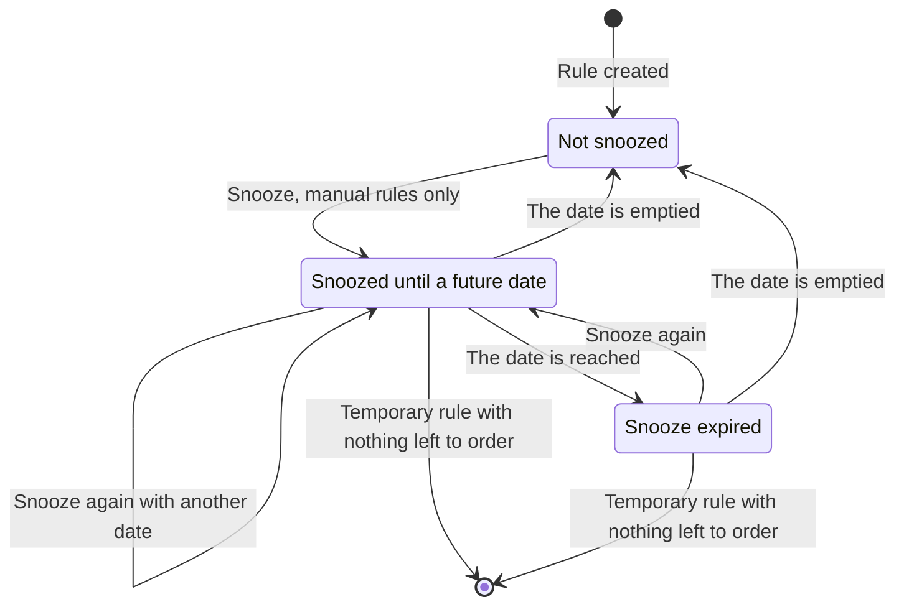
```mermaid
stateDiagram-v2
    [*] --> NotSnoozed: Rule created
    state "Not snoozed" as NotSnoozed
    state "Snoozed until a future date" as Snoozed
    state "Snooze expired" as Expired
    NotSnoozed --> Snoozed: Snooze, manual rules only
    Expired --> Snoozed: Snooze again
    Snoozed --> Snoozed: Snooze again with another date
    Snoozed --> Expired: The date is reached
    Snoozed --> NotSnoozed: The date is emptied
    Expired --> NotSnoozed: The date is emptied
    Snoozed --> [*]: Temporary rule with nothing left to order
    Expired --> [*]: Temporary rule with nothing left to order
```

### 3.3 Archive state

**Field.** `active` on Reordering Rule. Boolean, stored, default true, copied when the record is duplicated.

#### 3.3.1 States

| Stored value | Label | Meaning |
|---|---|---|
| `true` | Active | The rule is evaluated: its quantities are recomputed, it appears on the replenishment report when it has something to order, and the scheduler runs it when its trigger is `auto`. |
| `false` | Archived | The rule is excluded from every default query and is never evaluated, never shown and never executed. It nevertheless continues to occupy its (`product`, `source_location`, `company`) slot in the uniqueness constraint. |

#### 3.3.2 Transition table

| From | To | Trigger | Guards, in evaluation order | Records created or changed |
|---|---|---|---|---|
| not existing | Active | Any of the creation paths of section 3.1.2 | The four creation guards | The rule. |
| Active | Archived | An inventory administrator archives the rule | none | The rule disappears from the report and from the scheduler's scope. No document is cancelled: documents already created by the rule keep their link to it. |
| Active | Archived | The rule's product is archived | none | Every reordering rule of that product is archived, archived rules included in the scan. |
| Archived | Active | An inventory administrator unarchives the rule | none | The quantities are recomputed on the next read. |
| Archived | Active | The rule's product is unarchived | none | Every reordering rule of that product is unarchived. |
| Active or Archived | deleted | The periodic cleanup task runs, or the replenishment report is opened | The rule was created by the superuser, has `trigger` equal to `manual` and has a `quantity_to_order` that is zero or below | The rule is deleted. Archived rules are included in this scan, so an archived temporary rule is deleted too. |
| Active | deleted | A user deletes the rule | The user holds the inventory administrator group | Purchase order lines and stock moves that reference the rule keep existing; their `orderpoint` reference is emptied, because both relations have deletion behavior `set null`. |
| Active or Archived | deleted | The rule's product, source location or warehouse is deleted | none | The rule is deleted by the cascade of those three relations. |

#### 3.3.3 Guards with their refusal messages

1. No guard refuses archiving or unarchiving a reordering rule.
2. **The uniqueness constraint counts archived rules.** Creating a rule for a (`product`, `source_location`, `company`) triple that an archived rule already occupies is refused with `A replenishment rule already exists for this product on this location.` This is why every automatic creation path searches archived records before creating.
3. **Compatibility finding — an archived rule hides a shortage from the report.** Because the constraint counts archived rules, the replenishment report cannot create a temporary line for a product and location that an archived rule occupies, and because the archived rule is itself excluded from the report, the shortage becomes invisible: nothing at all is shown for that pair. A corrected behaviour narrows the uniqueness constraint to active rules, or unarchives the existing rule instead of skipping the pair.

#### 3.3.4 Diagram

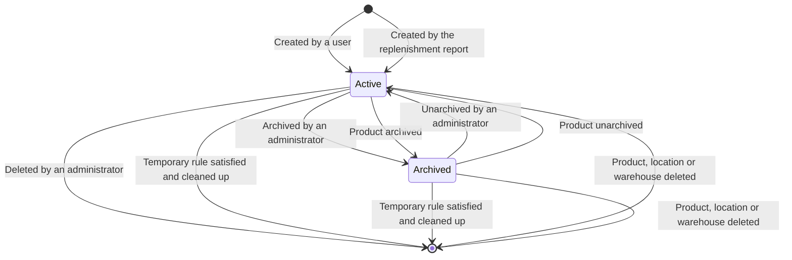
```mermaid
stateDiagram-v2
    [*] --> Active: Created by a user
    [*] --> Active: Created by the replenishment report
    Active --> Archived: Archived by an administrator
    Active --> Archived: Product archived
    Archived --> Active: Unarchived by an administrator
    Archived --> Active: Product unarchived
    Active --> [*]: Deleted by an administrator
    Active --> [*]: Temporary rule satisfied and cleaned up
    Archived --> [*]: Temporary rule satisfied and cleaned up
    Active --> [*]: Product, location or warehouse deleted
    Archived --> [*]: Product, location or warehouse deleted
```

### 3.4 Replenishment state

This machine is not one field. It is the state a user sees on a row of the replenishment report and the state that decides what the scheduler does with the rule. It is derived from `quantity_forecast`, `product_minimum_quantity`, `product_maximum_quantity`, `quantity_to_order`, `unwanted_replenish` and `show_supply_warning`. No value of it is ever written directly.

#### 3.4.1 States

| Name | Exact condition | Meaning and what the screens show |
|---|---|---|
| Not computable | `product` is empty or `source_location` is empty | `quantity_on_hand` and `quantity_forecast` are both empty, `lead_days` is zero and `lead_horizon_date` is empty. The row shows nothing to order. A saved rule can never be in this state, because both fields are mandatory; an unsaved form can. |
| Unsaved | The record has no identifier yet | `quantity_to_order_computed` is forced to empty whatever the quantities are, so a form being typed never proposes an order before it is saved. |
| Covered | `quantity_forecast` compared with `product_minimum_quantity` in the product unit is not lower | `quantity_to_order_computed` is empty. The Order and Automate buttons are hidden. The row is still listed on the Reordering Rules screen, and on the report only when a manual override or a shortage puts something in `quantity_to_order`. |
| To order | `quantity_forecast` is lower than `product_minimum_quantity` in the product unit, and the resulting `quantity_to_order` is greater than zero | The quantity computed by `calculations.md`, section 7, rounded up to the replenishment multiple by section 8. Order and Automate are offered. The scheduler builds a request for the rule. |
| To order, overshooting the maximum | The To order condition holds **and** `unwanted_replenish` is true, that is the forecast plus the quantity to order exceeds `product_maximum_quantity` in the product unit, the maximum is not negative and the quantity to order is not zero | The forecast-report button is shown with a warning icon and the caption `Due to receipts scheduled in the future, you might end up with excessive stock . Check the Forecasted Report  before reordering`. Ordering is still allowed. |
| To order, with no supply method | `show_supply_warning` is true, that is the rule chain is empty, or the chain contains a `buy` rule and the product has no Vendor Price | The replenishment-information button is shown with a warning icon and the caption `Your product is missing a way to be replenished (Route, Vendor, Bill of Materials).` Pressing Order fails; see the transition table. |
| Overdue | `deadline_date` is not empty and is earlier than today | The Deadline column is shown in red. The state is independent of the quantity: a rule may show a deadline while having nothing to order, which happens when an arrival is expected after the moment the minimum is crossed. |
| Ordered | The last Order or Order to Max on the rule succeeded | The manual override has been cleared and the quantities recomputed. The rule falls back to Covered when the created documents lift the forecast above the minimum, and stays in To order when they do not. |

#### 3.4.2 Transition table

| From | To | Trigger | Guards, in evaluation order | Records created or changed |
|---|---|---|---|---|
| Covered | To order | A stock move of the product is written whose `product`, `state`, `date`, `demand_quantity`, `source_location` or `destination_location` changed | Only the rules for that product in the warehouses of the move's source and destination locations are queued for recomputation | `quantity_to_order_computed` and `quantity_forecast` are invalidated and recomputed on the next read. |
| Covered | To order | The company's replenishment horizon, the minimum, the maximum, the multiple, the product, the location or a vendor lead time is written | none | The same recomputation. |
| To order | Covered | The created documents lift the forecast, or the minimum is lowered | none | The same recomputation; `quantity_to_order_computed` becomes empty. |
| To order | Ordered | A user presses Order, or the scheduler builds a request for the rule | 1. `quantity_to_order` is strictly positive in the product unit. 2. Rule selection finds a chain from `source_location`. 3. For a `buy` chain, a Vendor Price is found. | The documents created by the run: stock moves, a draft purchase order line, or a manufacturing order. Then `quantity_to_order_manual` is set to zero and `quantity_to_order` is recomputed. A temporary rule whose quantity is now zero or below is deleted. |
| Covered | Ordered | A user presses Order to Max | none; the operation is offered whatever the forecast | `quantity_to_order` is first forced to the multiple-rounded value of `product_maximum_quantity` minus `quantity_forecast`, which the inverse rule stores as a manual override on a manual rule and discards on an automatic rule; then the Order transition runs. |
| To order | To order, with no supply method | The rule chain becomes empty, or a `buy` chain loses its last Vendor Price | none | `show_supply_warning` becomes true on the next read. |
| To order, with no supply method | refused | A user presses Order | Rule selection finds no rule | Nothing is created. When exactly one rule was selected, the refusal is presented as a redirect warning whose button is labelled `Edit Product` and which opens the product form. The message is `No rule has been found to replenish "<product display name>" in "<location display name>".` followed by a new line and `Verify the routes configuration on the product.` |
| To order, with no supply method | refused | A user presses Order and the chain is a `buy` chain with no Vendor Price | The request carries the reordering-rule marker, which makes a missing vendor a hard failure | Nothing is created. The message is `There is no matching vendor price to generate the purchase order for product <product display name> (no vendor defined, minimum quantity not reached, dates not valid, ...). Go on the product form and complete the list of vendors.` |
| any | Overdue | `quantity_on_hand` falls below `product_minimum_quantity`, or a dated dip inside the horizon is detected | none | `deadline_date` becomes today in the first case and the dip day minus `lead_days` in the second. |
| Overdue | not Overdue | The dip moves outside the horizon, or the horizon is shortened, or stock is received | none | `deadline_date` becomes empty. |

#### 3.4.3 Diagram

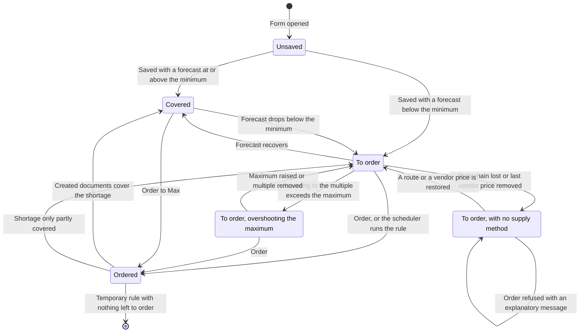
```mermaid
stateDiagram-v2
    [*] --> Unsaved: Form opened
    Unsaved --> Covered: Saved with a forecast at or above the minimum
    Unsaved --> ToOrder: Saved with a forecast below the minimum
    state "To order" as ToOrder
    state "To order, overshooting the maximum" as Overshoot
    state "To order, with no supply method" as NoSupply
    Covered --> ToOrder: Forecast drops below the minimum
    ToOrder --> Covered: Forecast recovers
    ToOrder --> Overshoot: Rounding to the multiple exceeds the maximum
    Overshoot --> ToOrder: Maximum raised or multiple removed
    ToOrder --> NoSupply: Rule chain lost or last vendor price removed
    NoSupply --> ToOrder: A route or a vendor price is restored
    ToOrder --> Ordered: Order, or the scheduler runs the rule
    Overshoot --> Ordered: Order
    Covered --> Ordered: Order to Max
    NoSupply --> NoSupply: Order refused with an explanatory message
    Ordered --> Covered: Created documents cover the shortage
    Ordered --> ToOrder: Shortage only partly covered
    Ordered --> [*]: Temporary rule with nothing left to order
```

### 3.5 Manual override state

**Field.** `quantity_to_order_manual` on Reordering Rule. Decimal at the "Product Unit" precision, stored, default 0, **not** copied when the record is duplicated. It is never edited directly by a user: it is written by the inverse rule of `quantity_to_order`.

#### 3.5.1 States

| Condition | Name of the state | Meaning |
|---|---|---|
| zero or empty | No override | `quantity_to_order` is `quantity_to_order_computed`. The Undo button on the report row is rendered disabled and invisible so that the column keeps its width. |
| non-zero | Override active | `quantity_to_order` is the override, whatever the computation says. The Undo button becomes visible. |

#### 3.5.2 Transition table

| From | To | Trigger | Guards, in evaluation order | Records created or changed |
|---|---|---|---|---|
| No override | Override active | A user types a quantity in the To Order column, or the Replenishment Information dialog writes one | 1. `trigger` is `manual`; on an automatic rule the inverse rule resets the override to zero instead. 2. The typed value differs from `quantity_to_order_computed`; a value equal to the computed one stores no override. | `quantity_to_order_manual` is set to the typed value. |
| No override | Override active | A user presses Order to Max on a manual rule | none | The override is set to the multiple-rounded value of `product_maximum_quantity` minus `quantity_forecast`. |
| No override | No override | A user presses Order to Max on an automatic rule | `trigger` is `auto` | The inverse rule resets the override to zero, so the forced quantity is discarded and the computed quantity is used (`RP-RULE-056`). |
| Override active | No override | A user presses Undo on the report row | none | `quantity_to_order_manual` is set to zero and `quantity_to_order` falls back to the computed value. |
| Override active | No override | An Order or an Order to Max succeeds | none | The override is cleared as part of the post-processing of the operation, then `quantity_to_order` is recomputed. |
| Override active | No override | A user writes an empty `quantity_to_order` while the override is already empty | This is the fall-back branch of the inverse rule | `quantity_to_order` falls back to `quantity_to_order_computed`. |
| Override active | Override active | `trigger` is switched from `manual` to `auto` by editing the field | none | The override is **not** cleared; see the second finding of section 3.1.4. |

#### 3.5.3 Search behaviour

Searching on `quantity_to_order` with any operator matches two disjoint sets, unioned: the rules whose override is non-zero and whose override satisfies the operator, and the rules whose override is zero or empty and whose `quantity_to_order_computed` satisfies the operator. A replacement must reproduce this split, otherwise the "To Reorder" filter of the report misses every manually overridden row.

#### 3.5.4 Diagram

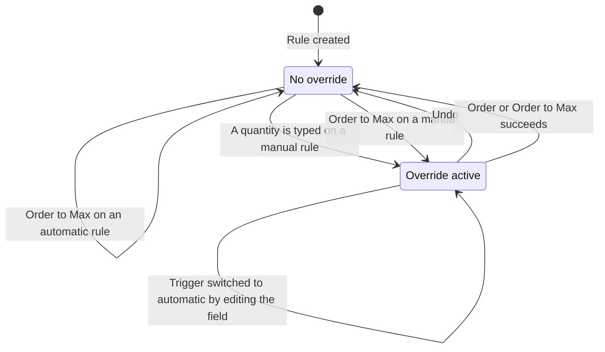
```mermaid
stateDiagram-v2
    [*] --> NoOverride: Rule created
    state "No override" as NoOverride
    state "Override active" as Override
    NoOverride --> Override: A quantity is typed on a manual rule
    NoOverride --> Override: Order to Max on a manual rule
    NoOverride --> NoOverride: Order to Max on an automatic rule
    Override --> NoOverride: Undo
    Override --> NoOverride: Order or Order to Max succeeds
    Override --> Override: Trigger switched to automatic by editing the field
```

### 3.6 The two supply-column flags

**Fields.** `show_vendor` and `show_bill_of_materials` on Reordering Rule. Both are derived booleans, neither is stored, neither is copied, and neither can be written by anyone. They decide whether the Vendor column and the Bill of Materials column are shown on the replenishment report and on the Reordering Rules screen for that row. `show_vendor` is contributed by the Purchase Inventory capability package and `show_bill_of_materials` by the Manufacturing capability package; on a database where the package is absent the field does not exist and its column is never rendered.

Neither field carries a label of its own: they are read only by the column-visibility conditions of the two screens, never rendered. Their two siblings, `unwanted_replenish` and `show_supply_warning`, are specified with the replenishment state in section 3.4; these two are separate because they depend on `effective_route` alone and change with the configuration rather than with the quantities.

#### 3.6.1 States

| Field | Stored value | Label | Meaning |
|---|---|---|---|
| `show_vendor` | `true` | (not rendered; the field drives column visibility) | `effective_route` is one of the routes that contain at least one rule whose action is `buy`. The Vendor column is shown for the row, the vendor cell offers the rule's `vendor_price` with `vendor_price_identifier_placeholder` as its grey placeholder, and the vendor tab of the Replenishment Information dialog is the one the user is expected to use. |
| `show_vendor` | `false` | (not rendered) | `effective_route` is empty, or it is a route that holds no `buy` rule. The Vendor column is hidden for the row. The rule may still be served by purchasing when rule selection reaches a `buy` rule through a route the user did not choose; the flag describes the **chosen** route, not the chain that will actually run. |
| `show_bill_of_materials` | `true` | (not rendered) | `effective_route` is one of the routes that contain at least one rule whose action is `manufacture`. The Bill of Materials column is shown for the row and offers the rule's `bill_of_materials` with `bill_of_materials_identifier_placeholder` as its grey placeholder. |
| `show_bill_of_materials` | `false` | (not rendered) | `effective_route` is empty, or it is a route that holds no `manufacture` rule. The Bill of Materials column is hidden for the row. |

The two are independent: a route that holds both a `buy` rule and a `manufacture` rule shows both columns, and a route that holds neither shows neither. `effective_route` is `route` when the user chose one and the default route computed by `calculations.md`, section "Default route of a reordering rule", otherwise; the flags therefore change when the user picks a route, when the default route changes, and when a rule is added to or removed from a route.

#### 3.6.2 Transition table

| From | To | Trigger | Guards, in evaluation order | Records created or changed |
|---|---|---|---|---|
| `false` | `true` for `show_vendor` | The user sets `route` to a route that contains a `buy` rule, or the computed default route becomes such a route | none | Nothing is written on the rule. The Vendor column appears on the next read. |
| `false` | `true` for `show_vendor` | The user writes a `vendor_price` while `route` is empty | The write itself sets `route` to the route of the first `buy` rule of the rule's company or of no company (`RP-RULE-052`) | `route` is written, `effective_route` changes with it, and the flag follows. |
| `true` | `false` for `show_vendor` | The user clears `route`, or points it at a route with no `buy` rule, or the last `buy` rule of the chosen route is deleted or archived | none | Clearing `route` also clears `vendor_price` (`RP-RULE-051`), so the hidden column can never keep a stale value. |
| `false` | `true` for `show_bill_of_materials` | The user sets `route` to a route that contains a `manufacture` rule, or the computed default route becomes such a route | none | Nothing is written on the rule. |
| `false` | `true` for `show_bill_of_materials` | The user writes a `bill_of_materials` while `route` is empty | The write itself sets `route` to the route of the first `manufacture` rule (`RP-RULE-053`) | `route` is written and the flag follows. |
| `true` | `false` for `show_bill_of_materials` | The user clears `route`, or points it at a route with no `manufacture` rule, or the last `manufacture` rule of the chosen route is deleted or archived | none | `bill_of_materials` is **not** cleared by that write; the value survives, hidden, and is used again if the route is set back. |
| either value | the same value | The rule's quantities, minimum, maximum or forecast change | none | Neither flag depends on a quantity. This is what distinguishes them from `unwanted_replenish` and `show_supply_warning` of section 3.4. |

#### 3.6.3 Guards and consequences

1. No guard refuses either value, because neither can be written.
2. The scan that answers "does this route hold a `buy` rule?" reads **every** rule with that action across the database and keeps the routes they belong to, ignoring the archive flag of the rule's route and ignoring the company. A route of another company that holds a `buy` rule therefore makes the flag true for a rule of this company whose `effective_route` happens to be that route. In practice `effective_route` is already restricted to routes the rule may use, so the case arises only for a route with no company at all, which is exactly the shipped Buy route. This is the behaviour to reproduce.
3. **Compatibility finding — a hidden bill of materials survives while a hidden vendor price does not.** Clearing `route` clears `vendor_price` but leaves `bill_of_materials` set, so a rule can carry a bill of materials that no screen shows and that the manufacture action will nevertheless use if a `manufacture` route is chosen again later. A corrected behaviour clears `bill_of_materials` in the same write that clears `route`, exactly as `RP-RULE-051` already does for `vendor_price`.

#### 3.6.4 Diagram

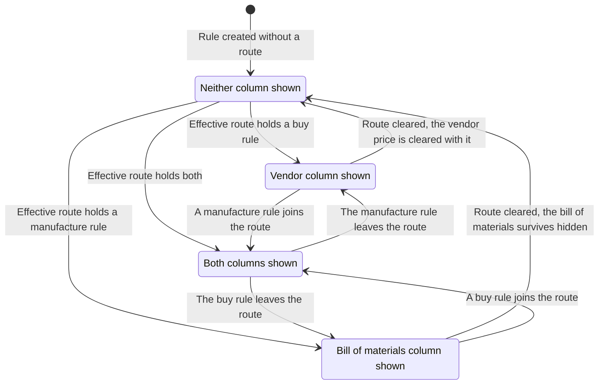
```mermaid
stateDiagram-v2
    [*] --> Neither: Rule created without a route
    state "Neither column shown" as Neither
    state "Vendor column shown" as Vendor
    state "Bill of materials column shown" as Bom
    state "Both columns shown" as Both
    Neither --> Vendor: Effective route holds a buy rule
    Neither --> Bom: Effective route holds a manufacture rule
    Neither --> Both: Effective route holds both
    Vendor --> Neither: Route cleared, the vendor price is cleared with it
    Bom --> Neither: Route cleared, the bill of materials survives hidden
    Both --> Vendor: The manufacture rule leaves the route
    Both --> Bom: The buy rule leaves the route
    Vendor --> Both: A manufacture rule joins the route
    Bom --> Both: A buy rule joins the route
```

---

## 4. The replenishment report line

A line of the replenishment report is not a record of its own: it is a Reordering Rule shown in a particular way, and for a shortage that has no rule it is a Reordering Rule that the report creates on the spot. Its life is a machine because the creation, the top-up and the deletion all happen while the screen is being opened, and a replacement that skips a state produces a report that either forgets shortages or accumulates stale rows.

### 4.1 States

| Name | Meaning | Where it lives |
|---|---|---|
| Not listed | The (product, location) pair has no shortage and no rule. | nothing exists |
| Candidate shortage | Pass one of the shortage detection found `on hand + incoming − outgoing` negative at the product unit's rounding, counting only the records at the replenishment location or a descendant of it. | in memory only |
| Confirmed shortage | Pass two read the forecast of the candidate's product at its location at the end of the day `today + lead days + replenishment horizon` and it is still negative. The shortage is that negative forecast. | in memory only |
| Covered by work in progress | The quantity already in progress that the forecast cannot see — draft, sent and to-approve purchase order lines — plus the `quantity_to_order` of the existing rules for the pair brings the shortage to zero or above at the "Product Unit" precision. | in memory only |
| Temporary line | A Reordering Rule created by the report under the superuser account, with `trigger` `manual`, `name` `Replenishment Report`, minimum 0 and maximum 0. | a persistent record |
| Topped-up line | An existing Reordering Rule whose `quantity_forecast` has been increased by the negative shortage, so that the extra need appears on the rule the user already configured. The increase is a display value computed while the report is being built; it is not stored. | a persistent record, read with an adjusted forecast |
| Suppressed line | An archived rule occupies the pair, so no line can be created and the archived rule is itself hidden. | nothing is shown |
| Snoozed line | A temporary or user-made manual line whose `snoozed_until` is strictly later than today; hidden by the "Not Snoozed" filter. | a persistent record, filtered out |
| Ordered line | The user pressed Order or Automate on the line and the run succeeded. | a persistent record |
| Removed line | A temporary line whose `quantity_to_order` is zero or below, deleted by the periodic cleanup task or by the next opening of the report. | nothing |

### 4.2 Transition table

| From | To | Trigger | Guards, in evaluation order | Records created or changed |
|---|---|---|---|---|
| Removed or Not listed | Not listed | Opening the report, step 2 | Every rule created by the superuser with `trigger` `manual` and `quantity_to_order` zero or below, archived rules included | Those rules are deleted and taken out of the working set before anything else happens. |
| Not listed | Candidate shortage | Opening the report, step 5 | The product is a goods product with at least one stock move, and the location has `replenish_location` true | Nothing is written. The scan reads the stock quantity records inside the replenishment locations, the incoming moves in state `waiting`, `confirmed`, `assigned` or `partially_available` whose destination or final location is inside them, and the outgoing moves in the same states whose source location is inside them. |
| Candidate shortage | Confirmed shortage | Opening the report, steps 6 and 7 | The candidates are grouped by lead days plus replenishment horizon and by location; the forecast of each group is read at the end of `today + <the group's day count>`, and is still negative | Nothing is written. |
| Candidate shortage | Not listed | The same steps | The forecast at the horizon is no longer negative | Nothing is written; the candidate is dropped. |
| Confirmed shortage | Covered by work in progress | Opening the report, step 8 | The quantity in progress plus the `quantity_to_order` of the existing rules for the pair is non-zero, and `shortage + quantity in progress` is no longer negative at the "Product Unit" precision | Nothing is written; the pair is dropped. |
| Confirmed shortage | Temporary line | Opening the report, step 9 | No rule, **active or archived**, exists for the pair | A Reordering Rule is created under the superuser account with the values of `RP-RULE-192`. |
| Confirmed shortage | Topped-up line | Opening the report, step 9 | An **active** rule exists for the pair | That rule's `quantity_forecast` is increased by the negative shortage for the duration of the report. |
| Confirmed shortage | Suppressed line | Opening the report, step 9 | An **archived** rule exists for the pair | Nothing is created and nothing is shown. This is the compatibility finding of section 3.3.3. |
| Temporary line or Topped-up line | Snoozed line | The user snoozes the row | `trigger` is `manual` | `snoozed_until` is written; the row disappears from the filtered report. |
| Snoozed line | Temporary line or Topped-up line | The snooze date is reached, or the user clears the date | For clearing, `trigger` is `manual` | Nothing, or the date is emptied. |
| Temporary line or Topped-up line | Ordered line | The user presses Order | 1. `quantity_to_order` greater than zero. 2. The run succeeds. | The created documents; the manual override is cleared; the quantities are recomputed. |
| Temporary line or Topped-up line | Ordered line | The user presses Automate | The same guards | `trigger` is written to `auto` first, then the Order transition runs. A temporary line therefore becomes a permanent automatic rule, still named `Replenishment Report` and still with minimum 0 and maximum 0. |
| Ordered line | Removed line | The created documents cover the shortage, so `quantity_to_order` becomes zero or below | The rule was created by the superuser and has `trigger` `manual` | The rule is deleted at the end of the Order operation, or by the next opening of the report, or by the periodic cleanup task. |
| Ordered line | Temporary line | The created documents only partly cover the shortage | none | The line stays with the remaining quantity. |
| Temporary line | (a permanent rule) | The user edits the minimum, the maximum, the route, the multiple or the vendor on the row | The user holds the inventory administrator group | The rule keeps its `name` `Replenishment Report` and its creation by the superuser, so it remains eligible for automatic deletion as soon as its quantity to order reaches zero, unless its trigger has been switched to `auto`. A user who wants a permanent manual rule must switch the trigger or create the rule from the Reordering Rules screen. |

### 4.3 Guards with their refusal messages

1. Creating a temporary line for a pair that any rule already occupies is prevented by the search, not by a refusal. Were the search omitted, the database would refuse with `A replenishment rule already exists for this product on this location.`
2. Ordering a line with no supply method fails with the two messages of section 3.4.2, presented as a redirect warning with the button `Edit Product` when exactly one line was selected.
3. Snoozing a line whose trigger is `auto` fails with `You can only snooze manual orderpoints. You should rather archive 'auto-trigger' orderpoints if you do not want them to be triggered.`
4. The report offers no export, deliberately, because part of its rows are temporary records that vanish as soon as the shortage they describe is covered.
5. The empty state of the screen is `You are good, no replenishment to perform!` followed by `You'll find here smart replenishment propositions based on inventory forecasts. Choose the quantity to buy or manufacture and launch orders in a click. To save time in the future, set the rules as "automated".`

### 4.4 Diagram

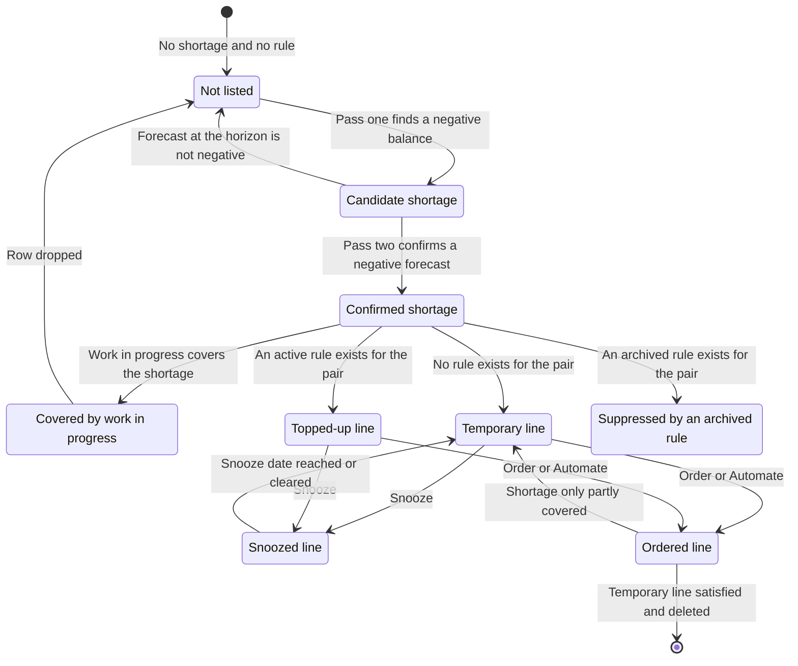
```mermaid
stateDiagram-v2
    [*] --> NotListed: No shortage and no rule
    state "Not listed" as NotListed
    state "Candidate shortage" as Candidate
    state "Confirmed shortage" as Confirmed
    state "Covered by work in progress" as Covered
    state "Temporary line" as Temporary
    state "Topped-up line" as ToppedUp
    state "Suppressed by an archived rule" as Suppressed
    state "Snoozed line" as Snoozed
    state "Ordered line" as Ordered
    NotListed --> Candidate: Pass one finds a negative balance
    Candidate --> Confirmed: Pass two confirms a negative forecast
    Candidate --> NotListed: Forecast at the horizon is not negative
    Confirmed --> Covered: Work in progress covers the shortage
    Covered --> NotListed: Row dropped
    Confirmed --> Temporary: No rule exists for the pair
    Confirmed --> ToppedUp: An active rule exists for the pair
    Confirmed --> Suppressed: An archived rule exists for the pair
    Temporary --> Snoozed: Snooze
    ToppedUp --> Snoozed: Snooze
    Snoozed --> Temporary: Snooze date reached or cleared
    Temporary --> Ordered: Order or Automate
    ToppedUp --> Ordered: Order or Automate
    Ordered --> Temporary: Shortage only partly covered
    Ordered --> [*]: Temporary line satisfied and deleted
```

---

## 5. The lead-time and reordering-rule computation states

Five derived values of a Reordering Rule form a dependency chain: the rule chain feeds the lead time, the lead time feeds the forecast horizon, the forecast feeds the quantity to order, and the minimum together with the dated moves feeds the deadline. Two of the five are stored and therefore have a genuine persisted state that can be stale; three are computed on every read. A replacement must reproduce both the dependency set of each value and the state each value takes when it cannot be computed.

### 5.1 The rule chain

**Field.** `rules` on Reordering Rule, a derived many-to-many to Stock Rule, not stored.

| State | Exact condition | Meaning |
|---|---|---|
| Not applicable | `product` is empty or `source_location` is empty | The chain is empty and no lead time can be derived. |
| Empty | The walk found no rule at the rule's `source_location` nor at any ancestor of it | No supply method exists. `show_supply_warning` becomes true. |
| Resolved | The walk ended on a rule that takes from stock, or on a rule whose action is neither `pull` nor `pull_push` | The chain is the ordered list of rules from the need location back to the source of supply. |
| Looping | The walk met a rule it had already added | The whole computation refuses. |

**Transitions.** The chain is recomputed whenever `route`, `product`, `source_location`, `company`, `warehouse` or the product's own routes change. The walk is: set the current location to `source_location`; select the rule for the product at that location with `routes` equal to the rule's `route` and the rule's warehouse; when no rule is found, stop with Empty; when the found rule takes from stock or its action is neither `pull` nor `pull_push`, add it and stop with Resolved; otherwise add it, set the current location to the found rule's `location_source` and repeat.

**Refusal message of the Looping state.** `Invalid rule's configuration, the following rule causes an endless loop: <rule display name>`, where the placeholder is the display name of the rule that appeared twice.

**Diagram.**

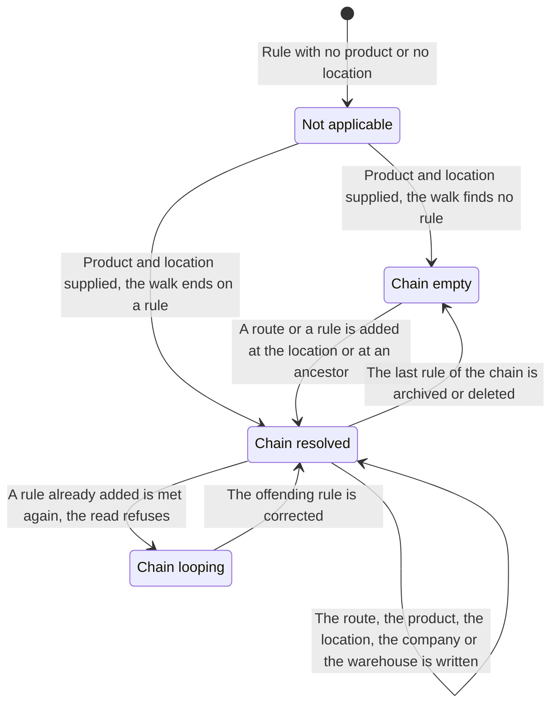
```mermaid
stateDiagram-v2
    [*] --> NotApplicable: Rule with no product or no location
    state "Not applicable" as NotApplicable
    state "Chain empty" as EmptyChain
    state "Chain resolved" as Resolved
    state "Chain looping" as Looping
    NotApplicable --> EmptyChain: Product and location supplied, the walk finds no rule
    NotApplicable --> Resolved: Product and location supplied, the walk ends on a rule
    EmptyChain --> Resolved: A route or a rule is added at the location or at an ancestor
    Resolved --> EmptyChain: The last rule of the chain is archived or deleted
    Resolved --> Resolved: The route, the product, the location, the company or the warehouse is written
    Resolved --> Looping: A rule already added is met again, the read refuses
    Looping --> Resolved: The offending rule is corrected
```

### 5.2 The lead time

**Fields.** `lead_days` and `lead_horizon_date` on Reordering Rule, both derived and not stored.

| State | Exact condition | Values taken |
|---|---|---|
| Not applicable | `product` is empty or `source_location` is empty | `lead_days` is zero and `lead_horizon_date` is empty. |
| Computed | Both are present | `lead_days` is the total delay contributed by the chain — the rule lead times, the vendor lead time, the days to purchase, the manufacturing lead time and the days to supply components — and `lead_horizon_date` is `today + lead_days + the company's replenishment horizon`. |
| Refused | The chain is Looping | The message of section 5.1 aborts the read. |

**Dependencies that invalidate it.** `rules`, the product's Vendor Prices, the lead time of those Vendor Prices, and the company's replenishment horizon. The lead time is computed with the description of each contribution switched off; the same computation with descriptions switched on produces the breakdown shown in the Replenishment Information dialog.

**Diagram.**

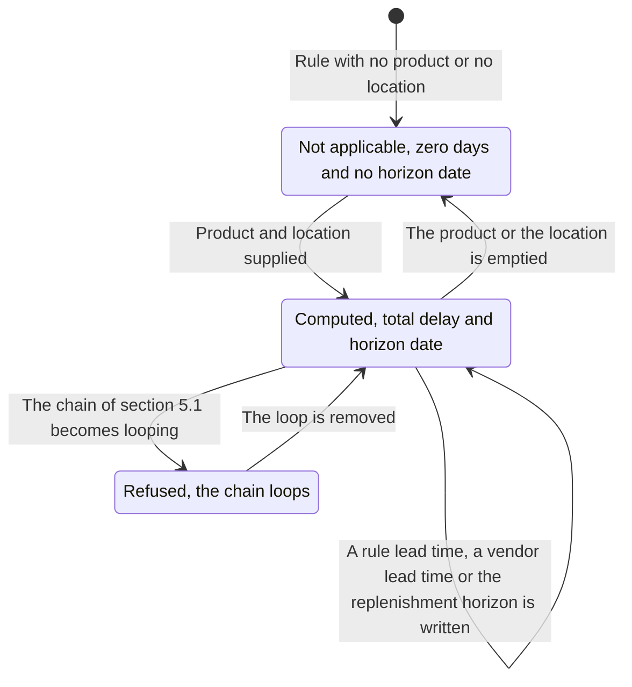
```mermaid
stateDiagram-v2
    [*] --> NotApplicable: Rule with no product or no location
    state "Not applicable, zero days and no horizon date" as NotApplicable
    state "Computed, total delay and horizon date" as Computed
    state "Refused, the chain loops" as Refused
    NotApplicable --> Computed: Product and location supplied
    Computed --> Computed: A rule lead time, a vendor lead time or the replenishment horizon is written
    Computed --> NotApplicable: The product or the location is emptied
    Computed --> Refused: The chain of section 5.1 becomes looping
    Refused --> Computed: The loop is removed
```

### 5.3 The quantity-to-order computation

**Field.** `quantity_to_order_computed` on Reordering Rule. Decimal at the "Product Unit" precision, derived **and stored**, never copied.

| State | Exact condition | Value taken |
|---|---|---|
| Not evaluated | The record has no identifier yet | Empty. A form being typed never proposes a quantity before it is saved. |
| Empty | `quantity_forecast` compared with `product_minimum_quantity` in the product unit is not lower | Empty, which the screens read as zero. |
| Computed | The forecast is strictly lower than the minimum | The formula of `calculations.md`, section 7, rounded up to the replenishment multiple by section 8. |
| Stale | A dependency was written and the recomputation has not run yet | The stored value is the previous one. Every read of the field triggers the recomputation first, so a user never observes the stale value; a direct read of the stored column would. |

**Dependencies that invalidate it.** `replenishment_unit_of_measure`, `product_minimum_quantity`, `product_maximum_quantity`, `product`, `source_location`, the lead time of the product's Vendor Prices, and the company's replenishment horizon. In addition, writing a stock move whose `product`, `state`, `date`, `demand_quantity`, `source_location` or `destination_location` changed invalidates the forecast that feeds it, and only the reordering rules for that product in the warehouses of the move's source and destination locations are queued, never every rule of the product.

**Forced recomputation.** Two operations recompute the stored value explicitly rather than waiting for a read: task 1 of the scheduler recomputes it with elevated rights on every automatic rule before running them, and opening the replenishment report recomputes it when the opening context asks for a forced recomputation.

**Diagram.**

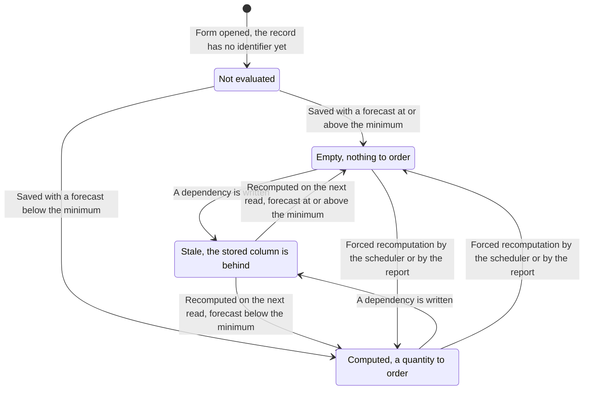
```mermaid
stateDiagram-v2
    [*] --> NotEvaluated: Form opened, the record has no identifier yet
    state "Not evaluated" as NotEvaluated
    state "Empty, nothing to order" as EmptyQty
    state "Computed, a quantity to order" as ComputedQty
    state "Stale, the stored column is behind" as Stale
    NotEvaluated --> EmptyQty: Saved with a forecast at or above the minimum
    NotEvaluated --> ComputedQty: Saved with a forecast below the minimum
    EmptyQty --> Stale: A dependency is written
    ComputedQty --> Stale: A dependency is written
    Stale --> EmptyQty: Recomputed on the next read, forecast at or above the minimum
    Stale --> ComputedQty: Recomputed on the next read, forecast below the minimum
    EmptyQty --> ComputedQty: Forced recomputation by the scheduler or by the report
    ComputedQty --> EmptyQty: Forced recomputation by the scheduler or by the report
```

### 5.4 The deadline computation

**Field.** `deadline_date` on Reordering Rule. Date, derived **and stored**, read-only, never copied.

| State | Exact condition | Value taken |
|---|---|---|
| Critical | `quantity_on_hand` is lower than `product_minimum_quantity` | Today. The computation stops for that rule: no dated walk is performed. |
| Dated | The walk of the dated net quantities crossed below the minimum on a day strictly earlier than `today + the company's replenishment horizon` | That day minus `lead_days` days. |
| Empty | No crossing was found inside the horizon, or the crossing day is not earlier than the horizon date | Empty. The Deadline column is blank. |
| Stale | A dependency was written and the recomputation has not run yet | The stored value is the previous one, with the same reading caveat as section 5.3. |

**Dependencies that invalidate it.** `source_location`, `product_minimum_quantity`, `route`, the product's routes, the dates and states of the product's stock moves, the product's Vendor Prices and their lead time, and the company's replenishment horizon.

**Reading rule.** The dated walk counts only moves whose state is `waiting`, `confirmed`, `assigned` or `partially_available` and whose date is not later than the horizon date, grouped by calendar day, incoming adding and outgoing subtracting, archived moves included. A deadline may therefore exist while `quantity_to_order` is zero: this happens when an arrival is expected after the day the minimum is crossed, and it is exactly the situation the Deadline column is there to reveal.

**Diagram.**

```mermaid
stateDiagram-v2
    [*] --> NoDeadline: Rule created
    state "Critical, the deadline is today" as Critical
    state "Dated, a day inside the horizon" as Dated
    state "Empty, no crossing inside the horizon" as NoDeadline
    state "Stale, the stored column is behind" as Stale
    NoDeadline --> Critical: Quantity on hand falls below the minimum
    NoDeadline --> Dated: The dated walk crosses below the minimum inside the horizon
    Dated --> Critical: Quantity on hand falls below the minimum, the walk is skipped
    Critical --> Dated: Stock restored, a later crossing remains
    Critical --> NoDeadline: Stock restored and no crossing remains
    Dated --> NoDeadline: The crossing is pushed outside the horizon
    Critical --> Stale: A dependency is written
    Dated --> Stale: A dependency is written
    NoDeadline --> Stale: A dependency is written
    Stale --> Critical: Recomputed on the next read
    Stale --> Dated: Recomputed on the next read
    Stale --> NoDeadline: Recomputed on the next read
```

### 5.5 Diagram of the whole chain

Sections 5.1 to 5.4 each carry their own diagram above. The diagram below is the fifth one and shows the four machines as the single dependency chain they form, because a replacement has to reproduce the order in which they are evaluated as well as each machine on its own.

```mermaid
stateDiagram-v2
    [*] --> NotApplicable: No product or no location
    state "Not applicable" as NotApplicable
    state "Chain resolved" as Resolved
    state "Chain empty" as EmptyChain
    state "Chain looping" as Looping
    state "Lead time computed" as LeadComputed
    state "Quantity computed" as QtyComputed
    state "Nothing to order" as QtyEmpty
    state "Deadline critical" as Critical
    state "Deadline dated" as Dated
    state "No deadline" as NoDeadline
    NotApplicable --> Resolved: Product and location supplied and a rule is found
    NotApplicable --> EmptyChain: Product and location supplied and no rule is found
    Resolved --> Looping: A rule appears twice, the read refuses
    Resolved --> LeadComputed: Total delay and horizon date derived
    EmptyChain --> LeadComputed: Zero delay, supply warning raised
    LeadComputed --> QtyComputed: Forecast below the minimum
    LeadComputed --> QtyEmpty: Forecast at or above the minimum
    QtyComputed --> QtyEmpty: Documents created or minimum lowered
    QtyEmpty --> QtyComputed: Demand recorded or minimum raised
    LeadComputed --> Critical: On hand below the minimum
    LeadComputed --> Dated: A dip inside the horizon
    LeadComputed --> NoDeadline: No dip inside the horizon
    Critical --> NoDeadline: Stock restored
    Dated --> NoDeadline: Dip pushed outside the horizon
```

---

## 6. Reference between stock documents

The record that ties together every document produced from one originating need — the grouping record that this domain calls a Reference between stock documents, and that the procurement request carries in `values.references` — has **no status field**. Its state is entirely the set of links that point at it. This section specifies that lifecycle, because merging decisions in the buy action and in the manufacture action read it, and a replacement that treats it as a throw-away label produces orders that merge when they must not.

### 6.1 Fields that carry the state

| Field | Type | Meaning |
|---|---|---|
| `name` | text, required, read-only | The reference shown on every document of the group. It is never recomputed after creation. |
| `stock_moves` | many-to-many to Stock Move | The moves that belong to the group. |
| `transfers` | derived many-to-many to Transfer | The transfers of those moves. Recomputed on every read; never stored. |
| `purchases` | many-to-many to Purchase Order | Contributed by this domain: the purchase orders created for the reference. |

### 6.2 States

| Name | Exact condition | Meaning |
|---|---|---|
| Created | The record exists and no move, transfer or purchase order points at it yet | The label has been drawn but nothing has been produced. This state lasts only as long as one transaction in the ordinary flows. |
| Linked | At least one stock move or one purchase order points at it | The group is live. Its name appears as the origin or the source document of every member. It is a component of the purchase order grouping key when the vendor's grouping mode is `default` or the rule's operation type has code `dropship`, and a component of the manufacturing order candidate search. |
| Fanned out | Its moves belong to more than one transfer, or to a transfer and a purchase order at the same time | The ordinary state of a multi-step chain: one reference spans a receipt, an internal transfer and a delivery. |
| Orphaned | Every linked move has been cancelled or deleted and no purchase order points at it | The record survives with no member. Nothing deletes it automatically. |
| Deleted | A user or an integration deletes it | The many-to-many links vanish with it; the documents themselves are untouched and keep the text of their `origin`. |

### 6.3 Transition table

| From | To | Trigger | Guards | Records created or changed |
|---|---|---|---|---|
| not existing | Created | A sales order is confirmed, a purchase order is confirmed, a manufacturing order is created, or a transfer is created that needs a grouping label | `name` is supplied; it is required and read-only afterwards | The reference record. |
| Created | Linked | The pull action writes `references` on the moves it creates, taken from `values.references` | none | The moves gain the reference. |
| Created or Linked | Linked | The buy action finds or creates a purchase order for a request carrying references | none | The order's `references` gain every reference carried by the requests, and the order's `origin` gains every request origin that is not already present, comma separated; when the order had no origin, the collected origins joined with ", " become the origin. |
| Linked | Fanned out | Confirming the moves assigns them to transfers, grouped by the set of references, the source location and the destination location | none | One transfer per group. |
| Linked | Linked | A drop shipping purchase order is confirmed and its lines belong to a single sales order | The order's lines all belong to one sales order | The reference created for the order additionally links that sales order. |
| Linked or Fanned out | Orphaned | Every linked move is cancelled or deleted | none | Nothing is written on the reference. |
| any | Deleted | A user deletes the record | none | The links disappear; the documents keep their `origin` text. |

### 6.4 Guards with their refusal messages

1. `name` is required. Creating a reference without one is refused with the platform's shared "required field" message.
2. `name` is read-only: it is written once, at creation, and no operation of this domain rewrites it. A replacement must not recompute it when the group grows, because the text already appears in the `origin` of documents that were created earlier.
3. No guard refuses adding a member, and no guard refuses deleting a reference that still has members.

### 6.5 Diagram

```mermaid
stateDiagram-v2
    [*] --> Created: A grouping label is drawn
    Created --> Linked: Moves or a purchase order point at it
    Linked --> FannedOut: Its moves are spread over several transfers
    state "Fanned out" as FannedOut
    FannedOut --> Linked: Transfers merged back
    Linked --> Orphaned: Every member cancelled or deleted
    FannedOut --> Orphaned: Every member cancelled or deleted
    Orphaned --> Linked: A new document is attached
    Linked --> [*]: Deleted
    FannedOut --> [*]: Deleted
    Orphaned --> [*]: Deleted
```

---

## 7. The procurement request

A procurement request is never stored, but it has a complete and observable life: what it becomes decides which document exists afterwards and which message the user sees. Its shape is specified in `entities.md`, section 10; the algorithm that drives it is `workflows.md`, sections 3 to 6.

### 7.1 States

| Name | Meaning |
|---|---|
| Built | The eight members are filled by a producer: a confirmed sales order line, a confirmed make-to-order stock move, a reordering rule, the Product Replenish wizard, a manufacturing order, or a subcontracting flow. |
| Exploded | The product has a bill of materials of type "kit", so the request has been replaced by one request per component. The original request no longer exists. |
| Defaulted | The three run-time defaults have been applied: `values.company` is the company of the request location when it was absent, `values.priority` is `"0"` when it was absent, `values.date_planned` is the current moment when it was absent or empty. |
| Widened | The request carries a route holding a `buy` rule, so the reception route of every warehouse of the request company has been added to `values.routes`. |
| Skipped | The product is not a goods product, or the quantity is zero at the rounding of the request unit. Nothing is created and nothing is reported. |
| Unroutable | Rule selection found no rule. The request is paired with an error message and the whole call fails before any document is created. |
| Assigned to pull | Rule selection returned a rule whose action is `pull` or `pull_push`. |
| Assigned to buy | Rule selection returned a rule whose action is `buy`. |
| Assigned to manufacture | Rule selection returned a rule whose action is `manufacture`. |
| Realized | The action handler created or extended a document. |
| Merged | Two or more requests shared a merge key and were folded into one before the document was written. |
| Abandoned | The buy handler found no Vendor Price and the request did not come from a reordering rule. Nothing is created, the chain is repaired and a notification is posted. |
| Failed | An action handler refused. The request is paired with a message; the other actions still run and the collected messages are raised together. |
| Serialized | The pull handler stored the `values` map on the created move, so that later steps of the chain can read it. |

### 7.2 Transition table

| From | To | Trigger | Guards, in evaluation order | Records created or changed, and message |
|---|---|---|---|---|
| not existing | Built | Any producer builds the tuple | none | none |
| Built | Exploded | The run operation, step 1, with the Manufacturing capability package installed | The product has a bill of materials of type "kit" in the request company | One request per exploded component, each carrying the same location, name, origin, company and values plus `bill_of_materials_line`. |
| Built | Widened | The run operation, step 2, with the Purchase Inventory capability package installed | `values.routes` contains a route holding a rule with action `buy` | `values.routes` gains the reception route of every warehouse of the company. |
| Built or Widened | Defaulted | The run operation, step 3 | none | The three defaults are applied. |
| Defaulted | Skipped | The run operation, step 4 | The product is not a goods product, or the quantity is zero at the rounding of the request unit | Nothing. No message. |
| Defaulted | Unroutable | The run operation, step 5 | Rule selection returned nothing | `No rule has been found to replenish "<product display name>" in "<location display name>".` followed by a new line and `Verify the routes configuration on the product.` The whole call fails at step 6; no request of the batch produces a document. |
| Defaulted | Assigned to pull | The run operation, step 5 | The selected rule's action is `pull` or `pull_push` | none |
| Defaulted | Assigned to buy | The run operation, step 5 | The selected rule's action is `buy` | none |
| Defaulted | Assigned to manufacture | The run operation, step 5 | The selected rule's action is `manufacture` | none |
| Assigned to pull | Failed | The pull action, step 1 | The rule has no `location_source` | `No source location defined on stock rule: <rule name>!` Nothing is created for the whole pull batch. |
| Assigned to pull | Realized then Serialized | The pull action, steps 2 to 7 | The rule has a source location | A stock move is created with elevated rights in the move's company context and confirmed at once. The `values` map is serialized onto it: references become lists of identifiers, dates become their standard text representation, everything else is stored unchanged. |
| Assigned to buy | Merged | The buy action, section 5.3 of `workflows.md` | Every component of the line merge key matches: the product; the request unit; `values.propagate_cancel`; `values.product_description_variants`; `values.orderpoint` when `values.move_destinations` is empty and the empty value otherwise; and, with drop shipping installed, `values.sales_order_line` | The quantities are summed, the destination moves unioned, the reordering rule taken as the first non-empty one found, and every other value taken from an arbitrary member. |
| Assigned to buy or Merged | Realized | The buy action | A Vendor Price is found, in the order: `values.forced_vendor_price`; the `vendor_price` of `values.orderpoint`; the shared vendor-selection operation; the first Vendor Price of the product for this company or none | A draft purchase order is found or created and a line is created or updated. |
| Assigned to buy or Merged | Failed | The buy action | No Vendor Price at all, and the request carries the reordering-rule marker | `There is no matching vendor price to generate the purchase order for product <product display name> (no vendor defined, minimum quantity not reached, dates not valid, ...). Go on the product form and complete the list of vendors.` |
| Assigned to buy or Merged | Abandoned | The buy action | No Vendor Price at all, and the request does not carry the reordering-rule marker | The destination moves whose `propagate_cancel` is true are cancelled; every destination move has its supply method set to `make_to_stock`; a message is posted on the originating document, addressed to the salesperson of the originating sales order or the responsible person of the originating manufacturing order, whose body is the mention of each of them, a line break, `No supplier has been found to replenish`, the product display name in bold, and `this product should be manually replenished.` When the need came from neither kind of document, nothing is posted. |
| Assigned to manufacture | Skipped | The manufacture action | The quantity is zero or negative at the rounding of the request unit | Nothing. No message. |
| Assigned to manufacture | Realized | The manufacture action | The quantity is strictly positive | One or more manufacturing orders are created, or an existing candidate order is extended. |
| Failed | (raised) | The run operation, step 8 | At least one action handler produced an error | With user-facing errors enabled, the messages are joined with new lines and raised as a single error that aborts the surrounding transaction. With them disabled, a procurement exception carrying the list of pairs is raised so that the caller can isolate the failing requests and continue. |

### 7.3 Diagram

```mermaid
stateDiagram-v2
    [*] --> Built: A producer builds the request
    Built --> Exploded: Kit bill of materials
    Exploded --> [*]: Replaced by one request per component
    Built --> Widened: A buy route is carried
    Built --> Defaulted: Three defaults applied
    Widened --> Defaulted: Three defaults applied
    Defaulted --> Skipped: Not a goods product, or zero quantity
    Defaulted --> Unroutable: No rule found
    Defaulted --> AssignedPull: Rule action pull or pull and push
    Defaulted --> AssignedBuy: Rule action buy
    Defaulted --> AssignedManufacture: Rule action manufacture
    state "Assigned to pull" as AssignedPull
    state "Assigned to buy" as AssignedBuy
    state "Assigned to manufacture" as AssignedManufacture
    AssignedPull --> Failed: No source location on the rule
    AssignedPull --> Realized: Move created and confirmed
    Realized --> Serialized: Values written onto the move
    AssignedBuy --> Merged: Merge key matches another request
    Merged --> Realized: Line created or updated
    AssignedBuy --> Realized: Line created or updated
    AssignedBuy --> Failed: No vendor price and the need came from a reordering rule
    AssignedBuy --> Abandoned: No vendor price and the need came from elsewhere
    AssignedManufacture --> Skipped: Quantity not strictly positive
    AssignedManufacture --> Realized: Manufacturing order created or extended
    Unroutable --> [*]: Raised before anything is created
    Failed --> [*]: Raised after every handler has run
    Skipped --> [*]: Silently dropped
    Abandoned --> [*]: Chain repaired and a notification posted
    Serialized --> [*]: Done
```

---

## 8. The scheduler

Three nested machines drive the daily automated pass: the run itself, one batch of reordering rules inside the run, and the fate of one reordering rule inside a batch. The scheduled action is described in `configuration.md`, section 10; the procedure is `workflows.md`, section 12.

### 8.1 The scheduler run

**Carrier.** One execution of the scheduled action named `Procurement: run scheduler`, under the superuser account, every 1 day, active by default.

#### 8.1.1 States

| Name | Meaning |
|---|---|
| Idle | No run in progress. |
| Announced | Three tasks have been announced to the progress tracker. This happens only in batch mode, that is when the run owns its own database cursor. |
| Task one recomputing | Every reordering rule matching `trigger = auto` and an active product, narrowed to one company when the caller named one, has its `quantity_to_order_computed` and its `deadline_date` recomputed with elevated rights. |
| Task one ordering | The reordering-rule procurement pass runs over the same set with user-facing errors disabled. |
| Task two reserving | The moves to reserve are selected, ordered and reserved in chunks of one thousand. |
| Task three merging | The shared quantity maintenance operation merges duplicated stock quantity records. |
| Finished | The three progress commits have been made and the run returns an empty result. |
| Aborted | An exception was raised anywhere in the three tasks. |

#### 8.1.2 Transition table

| From | To | Trigger | Guards | Records created or changed |
|---|---|---|---|---|
| Idle | Announced | The scheduled action fires, or a user or an integration invokes the run operation with batch mode on | Batch mode is on | Three tasks are announced to the progress tracker. |
| Idle | Task one recomputing | The run operation is invoked with batch mode off | none | No announcement is made and no intermediate commit happens. |
| Announced | Task one recomputing | Immediately | none | `quantity_to_order_computed` and `deadline_date` are rewritten on every selected rule. |
| Task one recomputing | Task one ordering | The recomputation finished; in batch mode the progress of task one is committed first | none | The progress tracker records one task done. |
| Task one ordering | Task two reserving | The procurement pass returned | none | Whatever documents the pass created are already written and committed per batch. |
| Task two reserving | Task two reserving | A chunk of one thousand moves has been reserved | Batch mode is on | The chunk is committed and the line `A batch of <n> moves are assigned and committed` is logged, where the placeholder is the number of moves in the chunk. |
| Task two reserving | Task three merging | Every chunk has been reserved; in batch mode the progress of task two is committed first | none | The progress tracker records a second task done. |
| Task three merging | Finished | The quantity maintenance operation returned; in batch mode the progress of task three is committed | none | The progress tracker records the third task done. |
| any running state | Aborted | Any exception | none | The exception is logged with its stack trace under the log line `Error during stock scheduler` and re-raised, which aborts the run. Work already committed by earlier batches survives; the current transaction does not. The next scheduled run starts from scratch. |

#### 8.1.3 Selection guards of task two

The moves reserved by task two are exactly those matching: the caller's company when one was named; `state` in (`confirmed`, `partially_available`); `demand_quantity` different from zero; and either `reservation_date` not later than today, or the operation type reserves at confirmation. When the Manufacturing capability package is installed, the finished-product moves of manufacturing orders are excluded. They are ordered by `reservation_date` ascending, then `priority` descending, then scheduled date ascending, then identifier ascending, so that the oldest promise is served first and, at equal promise, the urgent moves before the normal ones.

#### 8.1.4 Diagram

```mermaid
stateDiagram-v2
    [*] --> Idle
    Idle --> Announced: Scheduled action fires in batch mode
    Idle --> TaskOneRecompute: Invoked outside batch mode
    Announced --> TaskOneRecompute: Start task one
    state "Task one, recomputing" as TaskOneRecompute
    state "Task one, ordering" as TaskOneOrder
    state "Task two, reserving" as TaskTwo
    state "Task three, merging" as TaskThree
    TaskOneRecompute --> TaskOneOrder: Quantities and deadlines rewritten
    TaskOneOrder --> TaskTwo: Procurement pass returned
    TaskTwo --> TaskTwo: One chunk of a thousand moves reserved and committed
    TaskTwo --> TaskThree: Every chunk reserved
    TaskThree --> Finished: Duplicated quantity records merged
    Finished --> [*]
    TaskOneRecompute --> Aborted: Exception
    TaskOneOrder --> Aborted: Exception
    TaskTwo --> Aborted: Exception
    TaskThree --> Aborted: Exception
    Aborted --> [*]: Logged with its stack trace and re-raised
```

### 8.2 One batch of reordering rules

**Carrier.** A slice of at most one thousand reordering-rule identifiers inside the procurement pass. The same machine drives the pass whether it is called by the scheduler, by the Order button or by the event-driven trigger; only the flags differ.

#### 8.2.1 States

| Name | Meaning |
|---|---|
| Pending | The slice exists and no request has been built for it. In batch mode it has just been given its own database cursor. |
| Requested | One procurement request has been built for every rule of the slice whose `quantity_to_order` is strictly positive in the product unit. Rules with nothing to order contribute no request and are not an error. |
| Running | The requests are being run inside a save point, with the reordering-rule marker set in the context. |
| Succeeded | The run returned without error. The post-processing step runs and the loop ends. |
| Reduced | The run raised a procurement exception and at least one failing reordering rule could be identified. Those rules are removed from the slice and the slice is rebuilt and run again. |
| Abandoned | The run raised a procurement exception and **no** failing reordering rule could be identified. The loop ends without a post-processing step. |
| Retried | The run raised a database serialization error and batch mode is on. The batch cursor is rolled back and the whole slice is run again from Pending. |
| Closed | The slice is finished, whatever the outcome. In batch mode its cursor is committed and closed. |

#### 8.2.2 Transition table

| From | To | Trigger | Guards, in evaluation order | Records created or changed, and message |
|---|---|---|---|---|
| not existing | Pending | The pass splits the rule set into slices of one thousand identifiers | none | In batch mode, a dedicated database cursor is opened for the slice. |
| Pending | Requested | The pass builds the requests | For each rule: `quantity_to_order` compared with zero in the product unit is greater | For each qualifying rule a request is built with the product, the quantity to order, the rule's unit, the rule's `source_location`, the rule's `name`, the origin, the rule's company and the values of `workflows.md`, section 12.1. The origin is the rule's `name`, or, when the caller supplied originating stock references for the rule, the rule display name then " - " then those reference names joined with commas. |
| Requested | Running | The pass runs the requests inside a save point | The reordering-rule marker is set in the context | Whatever the run creates. |
| Running | Succeeded | The run returned | none | The post-processing step runs. Its base behavior does nothing; the Manufacturing capability package confirms every manufacturing order the slice left as a draft, after every reordering rule of the slice has run, so that the component needs of one order cannot interfere with the rules still to be processed. |
| Running | Reduced | The run raised a procurement exception | At least one of the failing requests carries an `orderpoint` value that resolves to a reordering rule | The save point is rolled back; the failing rules are removed from the slice; the pairs of reordering rule and message are collected for the activity step; the loop returns to Requested with the reduced slice. |
| Running | Abandoned | The run raised a procurement exception | No failing request carries a resolvable reordering rule | The line `Unable to process orderpoints` is logged and the loop ends. |
| Running | Retried | The run raised a database serialization error | Batch mode is on | The batch cursor is rolled back and the loop returns to Pending with the full slice. |
| Running | (raised) | The run raised a database serialization error | Batch mode is off | The error is re-raised to the caller. |
| Succeeded, Abandoned or Reduced-to-empty | Closed | The slice leaves the loop | none | For every collected pair of reordering rule and message, an activity is scheduled; then, in batch mode, the cursor is committed and closed and the line `A batch of <n> orderpoints is processed and committed` is logged, where the placeholder is the number of identifiers in the original slice, not the number that succeeded. The commit and the close happen even when the slice was abandoned. |

#### 8.2.3 Guards with their refusal messages

1. **Nothing to order.** A rule whose `quantity_to_order` is not strictly greater than zero in the product unit contributes no request. This is not a refusal and produces no message.
2. **A failing request that cannot be attributed.** `Unable to process orderpoints`, logged, not shown to any user. The slice produces nothing.
3. **Isolation.** Each slice runs inside a save point, so a slice either writes every document it produces or writes none. **Industry-standard default.** A replacement must offer the same isolation, otherwise a partially processed slice creates duplicate purchase order lines on the next run. It must also serialize the evaluation of one reordering rule against concurrent runs — a row lock on the rule for the duration of its request is sufficient — and must retry the slice when the database reports a serialization failure.

#### 8.2.4 Diagram

```mermaid
stateDiagram-v2
    [*] --> Pending: Slice of at most a thousand rules
    Pending --> Requested: Requests built for the rules with something to order
    Requested --> Running: Run inside a save point
    Running --> Succeeded: No error
    Running --> Reduced: Procurement exception with identifiable rules
    Reduced --> Requested: Rebuild the reduced slice
    Running --> Abandoned: Procurement exception with no identifiable rule
    Running --> Retried: Serialization error in batch mode
    Retried --> Pending: Cursor rolled back
    Succeeded --> Closed: Post-processing, activities, commit and close
    Abandoned --> Closed: Activities, commit and close
    Closed --> [*]
```

### 8.3 One reordering rule inside a batch

**Carrier.** A single reordering rule for the duration of one pass.

#### 8.3.1 States

| Name | Meaning |
|---|---|
| Selected | The rule matched the selection of the pass: `trigger` equal to `auto` with an active product for the scheduler, or the explicit selection of the Order button, or the match of the event-driven trigger. |
| Silent | Its `quantity_to_order` is not strictly positive, so no request was built. Nothing is reported. |
| Requested | A request was built for it. |
| Fulfilled | The run created or extended the documents for it. |
| Failed | The run refused for it. The refusal message is paired with the rule. |
| Reported | A warning activity carrying the refusal message exists on the product template. |
| Suppressed | A warning activity whose note already contains the same message exists on the same product template, so no second activity is created. |

#### 8.3.2 Transition table

| From | To | Trigger | Guards, in evaluation order | Records created or changed |
|---|---|---|---|---|
| not existing | Selected | The scheduler's selection | `trigger` is `auto`, the product is active, and the company matches when one was named | none |
| not existing | Selected | The event-driven trigger, when a batch of moves is confirmed through a transfer | For each move, at most one rule matching: the move's product; `trigger` equal to `auto`; `source_location` equal to the move's source location or an ancestor of it; the move's company; and `source_location` neither the move's destination location nor an ancestor of it. The whole trigger is disabled while the stored parameter `inventory.disable_automatic_scheduler` is set. | For a move whose real quantity is greater than the rule's minimum quantity and which carries stock references, those references are remembered against the rule so that the created documents can be traced back. |
| not existing | Selected | A user presses Order, Automate or Order to Max | The user holds the rights to run the pass | none |
| Selected | Silent | The request-building step | `quantity_to_order` is not strictly greater than zero in the product unit | none |
| Selected | Requested | The request-building step | `quantity_to_order` is strictly greater than zero | A request whose procurement date is `lead_horizon_date` at 12:00 in the time zone of the company's partner — falling back to coordinated universal time when the partner declares none — converted to coordinated universal time, and then reduced by the company's replenishment horizon in days when that horizon is not zero. |
| Requested | Fulfilled | The run succeeded | none | Stock moves, a draft purchase order line or a manufacturing order. |
| Requested | Failed | The run refused | none | The pair of rule and message is collected. |
| Failed | Reported | The activity step | No activity on the product template of the rule's product has a note containing that message | A warning activity is scheduled on the product template under the superuser account, with the message as its note, assigned to the product's responsible person or, when the product has none, to the superuser. |
| Failed | Suppressed | The activity step | Such an activity already exists | Nothing is created. |
| Fulfilled | Selected | The user presses Order again, or the next scheduler run | none | The cycle repeats with the recomputed quantity. |

#### 8.3.3 Diagram

```mermaid
stateDiagram-v2
    [*] --> Selected: Matched by the scheduler, the event trigger or the Order button
    Selected --> Silent: Nothing to order
    Selected --> Requested: A strictly positive quantity to order
    Requested --> Fulfilled: Documents created
    Requested --> Failed: The run refused
    Failed --> Reported: A warning activity is scheduled
    Failed --> Suppressed: An activity with the same note already exists
    Fulfilled --> Selected: Next run
    Silent --> [*]
    Reported --> [*]
    Suppressed --> [*]
```

---

## 9. The supply method of a Stock Move

**Field.** `procure_method` on Stock Move, contributed by this domain to the entity owned by `../inventory-operations/`. Selection, stored, required, default `make_to_stock`.

### 9.1 States

| Stored value | Label | Meaning |
|---|---|---|
| `make_to_stock` | Default: Take From Stock | The move draws on the stock of its source location. Confirming it creates no need. It reserves from the general pool like any other move. |
| `make_to_order` | Advanced: Apply Procurement Rules | The move is bound to an origin move that must supply it. Confirming it creates a need at its source location and puts the move in the waiting state. It never reserves from the general pool. |

The third value of the rule-level machine, `mts_else_mto`, is never written onto a move.

### 9.2 Transition table

| From | To | Trigger | Guards, in evaluation order | Records created or changed |
|---|---|---|---|---|
| not existing | `make_to_stock` or `make_to_order` | The pull action creates a move | The value is the rule's `procure_method`, with `mts_else_mto` written as `make_to_stock` | The move. |
| not existing | `make_to_order` | A manual push rule creates the next move of a chain | none, the value is unconditional | The move, then guard 2 below may switch it. |
| `make_to_order` | `make_to_stock` | The same push, immediately after creation | The new move's source location bypasses reservation, that is it is a vendor, customer, production, inventory-loss or transit location | The move is additionally **not** linked as a destination of the arriving move, because there is nothing to wait for. |
| any | `make_to_stock` | Re-evaluating an existing move against the rules | No rule was found at the source location or at any ancestor of it | No rule is written on the move. |
| any | the rule's value | Re-evaluating an existing move against the rules | A rule was found; its supply method is written when it is `make_to_stock` or `make_to_order`, and `make_to_stock` is written when it is `mts_else_mto` | The rule is written on the move as well. |
| `make_to_order` | `make_to_stock` | An origin move is cancelled with `propagate_cancel` true, and this move is not cancelled by the propagation | Every sibling origin move is already cancelled, and this move's source location differs from the cancelled move's destination location | This move is unlinked from the cancelled move. |
| `make_to_order` | `make_to_stock` | An origin move is cancelled with `propagate_cancel` false | Every sibling origin move is completed or cancelled | This move is unlinked from the cancelled move; it is never cancelled by this path. |
| `make_to_order` | `make_to_stock` | A make-to-order link is broken explicitly | none | The origin move is removed from this move's `move_origins` and this move's state is recomputed from its remaining links and its reservation. |
| `make_to_order` | `make_to_stock` | The buy action finds no Vendor Price and the request did not come from a reordering rule | The move is a destination move of the failed request and its `propagate_cancel` is false, or it survives the cancellation because its rule's route is not the reception route of its destination warehouse | The move falls back to the general stock pool. |
| `make_to_order` | `make_to_stock` | A purchase order or one of its lines is cancelled or deleted | The move is a destination move of the line, is not completed, does not go to an inventory-loss location, and either its rule's route is not the reception route of its destination warehouse or the line's `propagate_cancel` is false | The move falls back to the general stock pool; its state is recomputed. |
| any | `make_to_stock` | A merged move with a negative demand quantity is turned around at confirmation | The demand quantity is negative | The source and destination locations are swapped, the final location becomes the new destination location, the links are re-oriented by the sign of each linked move's own quantity, the sign of the demand quantity is flipped and the operation type becomes the return operation type when one is configured. |

### 9.3 Guards with their refusal messages

No write of this field is ever refused; every path above is a silent rewrite. The only refusal in the neighbourhood belongs to the move status machine: `You cannot cancel a stock move that has been set to 'Done'. Create a return in order to reverse the moves which took place.`

### 9.4 Diagram

```mermaid
stateDiagram-v2
    [*] --> make_to_stock: Pull rule that takes from stock
    [*] --> make_to_order: Pull rule that triggers another rule
    [*] --> make_to_order: Manual push rule
    make_to_order --> make_to_stock: Source location bypasses reservation
    make_to_order --> make_to_stock: Origin move cancelled, cancellation not propagated here
    make_to_order --> make_to_stock: Make-to-order link broken
    make_to_order --> make_to_stock: No vendor price found for the need
    make_to_order --> make_to_stock: Purchase order or line cancelled or deleted
    make_to_order --> make_to_stock: Re-evaluated against the rules and none found
    make_to_stock --> make_to_order: Re-evaluated and a make-to-order rule is found
    make_to_order --> make_to_stock: Negative move turned around at confirmation
```

---

## 10. The Stock Move status transitions this domain drives

The full status machine of Stock Move belongs to `../inventory-operations/`. Four of its transitions are driven by this domain and are specified here, because a replacement that implements the rules of this folder must produce exactly these status changes.

### 10.1 Transition table

| From | To | Trigger | Guards, in evaluation order | Records created or changed |
|---|---|---|---|---|
| `draft` | `waiting` | Confirming a batch of moves | The move already has origin moves | No need is created; the move waits for what already supplies it. |
| `draft` | `waiting` | Confirming a batch of moves | The move has no origin move and its own supply method is `make_to_order` | A procurement request is created for the full demand quantity, carrying the move itself in `values.move_destinations`. |
| `draft` | `confirmed` | Confirming a batch of moves | The move has no origin move, its own supply method is not `make_to_order`, and its rule's supply method is `mts_else_mto` | A procurement request is created for the missing quantity only, carrying no destination move, because the part taken from stock and the part ordered are independent. The missing quantity is `max(move real quantity − available quantity, 0)` converted into the move's unit with half-up rounding, where the available quantity is the free quantity at the source location reduced by what earlier moves of the same batch already claimed for the same location and product, floored at zero. |
| `draft` | `confirmed` | Confirming a batch of moves | None of the three conditions above | No need is created. |
| `confirmed` or `partially_available` | `assigned` or `partially_available` | Task two of the scheduler | The selection and ordering of section 8.1.3 | Reservations are taken in chunks of one thousand. |
| any state other than `done` | `cancel` | Cancellation propagation from an origin move | The origin move has `propagate_cancel` true, every sibling origin move is already cancelled, and this move's source location equals the cancelled move's destination location | The move is cancelled; the propagation continues to its own destination moves. |
| any state other than `done` | `cancel` | Cancelling a purchase order or deleting one of its lines | The move is not completed, does not go to an inventory-loss location, is not fed by another created purchase order line, its rule's route is the reception route of its destination warehouse, and the line's `propagate_cancel` is true | The move is cancelled. |
| `done` | refused | Any cancellation | The move is completed and its destination is not an inventory-loss location | Refusal: `You cannot cancel a stock move that has been set to 'Done'. Create a return in order to reverse the moves which took place.` |

### 10.2 Side effects that accompany these transitions

1. Every move that has just become `confirmed` or `waiting` and whose operation type reserves at confirmation gets `reservation_date` equal to today.
2. Moves that should be assigned to a transfer are grouped by the set of references, the source location and the destination location, and each group is attached to one transfer.
3. Company consistency is checked across the confirmed batch.
4. The moves are merged with their siblings unless the caller disabled merging.
5. A merged move with a negative demand quantity is turned around as described in section 9.2.
6. Cancelled moves have their origin links cleared and their supply method set to `make_to_stock`; unless the caller asked to skip it, a cancellation activity is logged on the originating documents that are not themselves cancelled.
7. When the stored parameter `inventory.cancel_originating_moves` is set, cancelling a move whose `propagate_cancel` is true also cancels its not-yet-completed origin moves.

### 10.3 Diagram

```mermaid
stateDiagram-v2
    [*] --> draft: Move created
    draft --> waiting: Confirm, origin moves already exist
    draft --> waiting: Confirm, supply method make to order, a need is created
    draft --> confirmed: Confirm, rule takes from stock otherwise triggers, a partial need is created
    draft --> confirmed: Confirm, no supply need arises
    confirmed --> assigned: Reserved by task two of the scheduler
    confirmed --> partially_available: Partly reserved by task two
    waiting --> confirmed: Its origin moves are completed
    waiting --> cancel: Cancellation propagated
    confirmed --> cancel: Cancellation propagated
    partially_available --> cancel: Cancellation propagated
    assigned --> cancel: Cancellation propagated
    assigned --> done: Validated, outside this domain
    done --> done: Cancellation refused with an explanatory message
```

---

## 11. The lateness of a Stock Move

**Field.** `delay_alert_date` on Stock Move, contributed by this domain. Datetime, derived and stored.

### 11.1 States

| Name | Exact condition | Meaning |
|---|---|---|
| Not applicable | The move is `done` or `cancel` | The field is always empty. Lateness is meaningless once the move has happened or been abandoned. |
| On time | The move is neither completed nor cancelled, and the greatest scheduled date among its not-yet-completed origin moves is not later than the move's own scheduled date | The field is empty. |
| Late | The move is neither completed nor cancelled, and that greatest date **is** later than the move's own scheduled date | The field holds that greatest date. The move is shown as late and offers a pop-over listing the origin documents responsible for the delay. |

### 11.2 Transition table

| From | To | Trigger | Guards | Records created or changed |
|---|---|---|---|---|
| On time | Late | The scheduled date of a not-yet-completed origin move is pushed past this move's own scheduled date | none | `delay_alert_date` is rewritten. Nothing else is changed: the move's own scheduled date does not move by itself. |
| Late | On time | The responsible origin move is completed, or its scheduled date is pulled back, or this move's own scheduled date is pushed out | none | `delay_alert_date` becomes empty. |
| Late | Late | Another origin move becomes the latest | none | `delay_alert_date` takes the new greatest value. |
| On time or Late | Not applicable | The move is completed or cancelled | none | `delay_alert_date` becomes empty. |

### 11.3 The deadline shift that often accompanies it

Lateness and the deadline are two different things. Writing a new deadline on a move computes `delta = the move's current deadline − the new deadline`, treats `delta` as zero when the move had no deadline, and subtracts `delta` from the deadline of every origin and destination move that is neither completed nor cancelled and has not yet been visited in this propagation, recursively, keeping the set of visited moves so that a cycle cannot loop forever. The whole chain therefore shifts by the same amount and keeps the relative offsets that the rule lead times introduced. Each affected document receives a note with subject `Deadline updated due to delay on <origin document name>` and body `The deadline has been automatically updated due to a delay on <link to the origin document>.`, authored by the system account, skipped when the most recent message on the document already carries the same subject.

### 11.4 Diagram

```mermaid
stateDiagram-v2
    [*] --> OnTime: Move created
    state "On time" as OnTime
    state "Late" as Late
    state "Not applicable" as NotApplicable
    OnTime --> Late: An origin move is scheduled later than this move
    Late --> OnTime: The responsible origin move is completed or pulled back
    Late --> Late: Another origin move becomes the latest
    OnTime --> NotApplicable: Completed or cancelled
    Late --> NotApplicable: Completed or cancelled
    NotApplicable --> [*]
```

---

## 12. The receipt state of a Purchase Order

Three derived fields that this domain contributes to Purchase Order form one picture of how far the goods have arrived. All three are recomputed from the states of the order's transfers and can never be written.

### 12.1 Receipt status

**Field.** `receipt_status` on Purchase Order, labelled "Receipt Status". Selection, derived and stored.

#### 12.1.1 States

| Stored value | Label | Meaning |
|---|---|---|
| empty | (no label; the column is blank) | The order has no transfer at all, or every one of its transfers is cancelled. Nothing is expected and nothing has arrived. |
| `pending` | Not Received | At least one transfer exists that is neither completed nor cancelled, and none is completed. |
| `partial` | Partially Received | At least one transfer is completed and at least one is neither completed nor cancelled. |
| `full` | Fully Received | Every transfer of the order is completed or cancelled, and at least one is not cancelled. |

#### 12.1.2 Transition table

The four states are evaluated in this exact order on every recomputation, and the first matching branch wins. A replacement that reorders the branches produces the wrong answer for an order whose transfers are all cancelled.

| Order of evaluation | Condition | Resulting value |
|---|---|---|
| 1 | The order has no transfer, or every transfer is `cancel` | empty |
| 2 | Every transfer is `done` or `cancel` | `full` |
| 3 | At least one transfer is `done` | `partial` |
| 4 | otherwise | `pending` |

| From | To | Trigger | Guards | Records created or changed |
|---|---|---|---|---|
| empty | `pending` | Confirming the order creates its first transfer | The order holds at least one goods line | The transfers and their moves. |
| `pending` | `partial` | One transfer is validated while another is still open | none | The received quantity of the affected lines is recomputed. |
| `pending` or `partial` | `full` | The last open transfer is validated or cancelled | none | The received quantity is recomputed; `is_shipped` becomes true; `effective_date` is set if it was empty. |
| any | empty | Every transfer of the order is cancelled | none | The status column becomes blank again. |
| `full` | `partial` or `pending` | A new receipt move is created because the ordered quantity was increased after validation | none | A new transfer appears and the status falls back. |

### 12.2 The shipped flag

**Field.** `is_shipped` on Purchase Order. Boolean, derived, not stored, recomputed from the transfers of the order and from their states. It carries no label of its own: it is read only by the visibility condition of the Receive button on the order form.

#### 12.2.1 States

| Stored value | Label | Meaning |
|---|---|---|
| `false` | (not rendered; the flag hides the Receive button) | The order has no transfer at all, or at least one of its transfers is neither `done` nor `cancel`. Work remains on the goods side, so the Receive button is offered whenever the order is confirmed and has at least one incoming transfer. |
| `true` | (not rendered) | The order has at least one transfer and every one of them is `done` or `cancel`. Nothing more will arrive and the Receive button is hidden. Note the difference with `receipt_status` of section 12.1: an order whose transfers are **all** cancelled has `is_shipped` `true` and an **empty** receipt status, because the two computations order their branches differently. |

The flag is not stored, so it has no stale state: every read recomputes it from the current states of the transfers.

#### 12.2.2 Transition table

| From | To | Trigger | Guards, in evaluation order | Records created or changed |
|---|---|---|---|---|
| not existing | `false` | A request for quotation is created | none | Nothing. An order with no transfer is `false`, and stays `false` while it is a draft request for quotation. |
| `false` | `false` | Confirming the order creates its first transfers | The order holds at least one goods line | The transfers and their moves. The flag stays `false` because the new transfers are neither `done` nor `cancel`. |
| `false` | `true` | The last transfer of the order that was neither `done` nor `cancel` is validated | Every other transfer of the order is already `done` or `cancel` | Nothing is written on the order by this machine. `receipt_status` becomes `full` at the same moment, `effective_date` is set when it was empty, and the Receive button disappears. |
| `false` | `true` | The last open transfer of the order is cancelled | The same | The same, except that when **every** transfer of the order is cancelled `receipt_status` becomes empty instead of `full`, while `is_shipped` is `true`. |
| `true` | `false` | The ordered quantity of a line is increased after validation and a new receipt move, and with it a new transfer, is created | none | The new transfer is neither `done` nor `cancel`, so the flag falls back and the Receive button reappears. |
| `true` | `false` | A validated transfer of the order is returned and the return transfer is attached to the same order | none | The same fall-back. |
| `true` or `false` | not existing | The order is deleted | The order is a draft or a cancelled order | The order and its transfers disappear. |

#### 12.2.3 Diagram

```mermaid
stateDiagram-v2
    [*] --> NotShipped: Request for quotation created, no transfer yet
    state "Not shipped, the Receive button is offered" as NotShipped
    state "Shipped, the Receive button is hidden" as Shipped
    NotShipped --> NotShipped: Confirmation creates the transfers
    NotShipped --> Shipped: The last open transfer is validated
    NotShipped --> Shipped: The last open transfer is cancelled
    Shipped --> NotShipped: A new transfer appears after an increase or a return
    NotShipped --> [*]: Draft order deleted
    Shipped --> [*]: Cancelled order deleted
```

### 12.3 The arrival date

**Field.** `effective_date` on Purchase Order, labelled "Arrival". Datetime, derived **and stored**, not copied when the order is duplicated, recomputed from the transfers of the order, from their states and from their completion dates.

#### 12.3.1 States

| Stored value | Label | Meaning |
|---|---|---|
| empty | Arrival, blank | No transfer of the order is completed, or every completed transfer either has no completion date or has a vendor location as its destination. Nothing has arrived that counts as an arrival. The Arrival column is blank and the effective days to arrival of the purchase analysis view is not computed for the order. |
| a date | Arrival, a date and time | The **earliest** completion date among the order's completed transfers whose destination location is not a vendor location. It is the moment the first goods of the order actually landed, not the moment the last of them did. |
| stale | (the same rendering as the value it holds) | A dependency was written and the recomputation has not run yet. The stored column holds the previous value. Every read of the field triggers the recomputation first, so a user never observes the stale value; a direct read of the stored column would. |

A return to the vendor never moves the arrival date, because its destination is a vendor location and the computation excludes it. The field is the basis of the effective days to arrival of the purchase analysis view (`RP-RULE-350`, `RP-RULE-351`) and one of the grouping keys of that view (`RP-RULE-353`).

#### 12.3.2 Transition table

| From | To | Trigger | Guards, in evaluation order | Records created or changed |
|---|---|---|---|---|
| not existing | empty | A request for quotation is created | none | The stored column is empty. |
| empty | a date | The first transfer of the order is validated | 1. The transfer's state is `done`. 2. Its completion date is not empty. 3. Its destination location usage is not `supplier`. | The stored column receives that completion date. `receipt_status` moves to `partial` or `full` in the same recomputation. |
| empty | empty | A return to the vendor is validated while nothing else has arrived | The transfer's destination location usage is `supplier`, so it is excluded | Nothing. The order still shows no arrival. |
| a date | an earlier date | A second transfer is validated whose completion date is **earlier** than the one already stored, which happens when a completion date is corrected or when transfers are validated out of order | The three guards above | The stored column is replaced by the earlier date, because the value is a minimum and not a first-write. |
| a date | the same date | A later transfer of the same order is validated | The three guards above | Nothing changes: the minimum is unaffected. |
| a date | empty | Every completed transfer of the order is reset to a state that is not `done`, or the only completed transfer is deleted | none | The minimum over an empty set is empty and the column is cleared. |
| any | stale | A dependency is written: a transfer is added to or removed from the order, a transfer changes state, or a completion date is written | none | Nothing is written yet; the recomputation runs on the next read of the field. |
| stale | empty or a date | The field is read, or the purchase analysis view is refreshed | none | The stored column is rewritten with the recomputed value. |
| any | not existing | The order is deleted | The order is a draft or a cancelled order | The order disappears. |

#### 12.3.3 Diagram

```mermaid
stateDiagram-v2
    [*] --> NoArrival: Request for quotation created
    state "No arrival date" as NoArrival
    state "An arrival date" as Dated
    state "Stale, the stored column is behind" as Stale
    NoArrival --> Dated: A transfer is validated with a completion date and a destination that is not a vendor location
    NoArrival --> NoArrival: A return to the vendor is validated and is excluded
    Dated --> Dated: A later transfer is validated, the minimum is unchanged
    Dated --> Dated: An earlier completion date appears, the minimum moves back
    Dated --> NoArrival: The last completed transfer is reset or deleted
    NoArrival --> Stale: A transfer, a state or a completion date is written
    Dated --> Stale: A transfer, a state or a completion date is written
    Stale --> NoArrival: Recomputed on the next read
    Stale --> Dated: Recomputed on the next read
```

### 12.4 Diagram of the receipt status

```mermaid
stateDiagram-v2
    [*] --> Empty: Order with no transfer
    state "Empty receipt status" as Empty
    state "Not Received" as Pending
    state "Partially Received" as Partial
    state "Fully Received" as Full
    Empty --> Pending: Confirmation creates the transfers
    Pending --> Partial: One transfer validated, others still open
    Pending --> Full: The only transfer validated or cancelled
    Partial --> Full: The last open transfer validated or cancelled
    Full --> Partial: A new receipt move appears after an increase
    Full --> Pending: Every completed transfer replaced by an open one
    Pending --> Empty: Every transfer cancelled
    Partial --> Empty: Every transfer cancelled
    Full --> Empty: Every transfer cancelled
```

---

## 13. Drop shipping

Five machines carry the drop shipping configuration: the code of an operation type, the archive flag of a drop shipping operation type, the archive flag of the global Dropship route, the archive flag of the per-warehouse subcontracting drop-ship rule, and the derived drop-shipment flag of a transfer.

### 13.1 The code of an Operation Type

**Field.** `code` on Operation Type, owned by `../inventory-operations/`. This domain contributes one value to the closed list.

#### 13.1.1 The contributed state

| Stored value | Label | Meaning |
|---|---|---|
| `dropship` | Dropship | The operation type moves goods from a vendor location straight to a customer location or to a subcontracting location, without ever entering a warehouse of the company. |

The other values of the list — `incoming`, `outgoing`, `internal` and `manufacturing` — belong to the owning domain and to `../manufacturing/`.

#### 13.1.2 Transition table

| From | To | Trigger | Guards | Records created or changed |
|---|---|---|---|---|
| not existing | `dropship` | The Drop Shipping capability package creates the per-company operation type named `Dropship` | The company has a sequence with code `dropship_transfer` | The operation type, with no warehouse, prefix `DS`, that sequence, default source location the shared vendor location, default destination location the shared customer location, and "use existing lots" switched off. |
| not existing | `dropship` | The Dropship and Subcontracting Management capability package creates the per-company operation type named `Dropship Subcontractor` | The company has a sequence with code `dropship_subcontractor_transfer` | The operation type, with no warehouse, prefix `DSC`, that sequence, default source location the shared vendor location, default destination location the company's subcontracting location, "use existing lots" off; it is remembered on the company as `dropship_subcontractor_operation_type`. |
| any other value | `dropship` | An administrator edits the code | The platform's shared "value not allowed" message guards the list itself | Three values are forced at once, whatever the user typed: the default source location becomes the shared vendor location, the default destination location becomes the shared customer location, the warehouse becomes empty, and the flag that shows the type in the operations overview becomes true. |
| `dropship` | `outgoing` | The Drop Shipping capability package is removed | none | Every operation type holding `dropship` is rewritten to `outgoing` **and** archived in the same write. This is the declared cascade of the contributed selection value. |

#### 13.1.3 Guards with their refusal messages

1. A code outside the closed list is refused with the platform's shared "value not allowed" message.
2. A `buy` rule may only point at an operation type whose code is `incoming` or, when drop shipping is installed, `dropship`; the same shared message refuses any other.
3. No guard prevents giving a warehouse to a `dropship` operation type: the value is simply forced back to empty on every recomputation.

#### 13.1.4 Diagram

```mermaid
stateDiagram-v2
    [*] --> dropship: Created by the Drop Shipping package
    [*] --> dropship: Created by the Dropship and Subcontracting package
    incoming --> dropship: Code edited, locations and warehouse forced
    outgoing --> dropship: Code edited, locations and warehouse forced
    dropship --> incoming: Code edited
    dropship --> outgoing: Package removed, the type is archived at the same time
```

### 13.2 The archive state of a drop shipping operation type

**Field.** `active` on Operation Type, for the two types this domain creates.

| Stored value | Label | Meaning |
|---|---|---|
| `true` | Active | The type may be chosen on a `buy` rule and on a purchase order's "Deliver To" field, and it appears in the operations overview. |
| `false` | Archived | The type is invisible. Rules and orders that already point at it keep doing so. |

| From | To | Trigger | Guards | Records created or changed |
|---|---|---|---|---|
| not existing | Active | The capability package creates the type for a company | none | The type. |
| Active | Archived | The Drop Shipping capability package is removed | none | The code is rewritten to `outgoing` in the same write. |
| Active | Archived | The drop-ship-to-subcontractor recomputation runs and the company has no active pull rule left in the global Dropship route | The type is the company's `dropship_subcontractor_operation_type` | Its `active` becomes false. |
| Archived | Active | The same recomputation runs and the company has at least one active pull rule in the global Dropship route | The same | Its `active` becomes true. |

The recomputation runs whenever a warehouse is created with subcontractor resupply switched on, and whenever `subcontracting_to_resupply` or `active` is written on a warehouse.

```mermaid
stateDiagram-v2
    [*] --> Active: Created per company by the capability package
    Active --> Archived: Package removed, code rewritten to outgoing
    Active --> Archived: Company has no active pull rule left in the Dropship route
    Archived --> Active: Company regains an active pull rule in the Dropship route
```

### 13.3 The archive state of the global Dropship route

**Field.** `active` on the shipped route named `Dropship`, sequence 20, no company, selectable on sales order lines, on products and on product categories. Boolean, stored, default true, copied when the record is duplicated.

**States.**

| Stored value | Label | Meaning |
|---|---|---|
| `true` | Active | The Dropship route takes part in rule selection. It is offered on a sales order line, on a product and on a product category, its per-company `buy` rules are candidates for a need at a customer location, and the per-warehouse `pull` rules that move components from a subcontracting location to a production location are candidates too. |
| `false` | Archived | The route is excluded from every default query: it is offered nowhere and none of its rules can be selected, including the `buy` rules that make an ordinary drop shipment to a customer work. Archiving it archived every rule of it whose destination location is still active, so unarchiving the route unarchives exactly the same set. The route and its rules survive, so the configuration is restored intact. |

**Transitions.**

| From | To | Trigger | Guards | Records created or changed |
|---|---|---|---|---|
| not existing | Active | The Drop Shipping capability package is installed | none | The route, and one `buy` rule per company named `<vendor location name> → <customer location name>` with destination the customer location, source the vendor location, supply method `make_to_stock`, that company's drop shipping operation type and that company. |
| Active | Archived | The drop-ship-to-subcontractor recomputation runs and **no** active rule with action `pull` remains in the route, across every company | none | The route's `active` becomes false. Its `buy` rules are unaffected by the count, but archiving the route archives every rule whose destination location is active, including those `buy` rules. |
| Archived | Active | The same recomputation runs and at least one active `pull` rule exists in the route | none | The route and its rules are unarchived. |

**Note on the counting rule.** Only rules whose action is `pull` are counted. The `buy` rules that make an ordinary drop shipment work are not counted, so a database that uses drop shipping to customers but never drop-ships components to a subcontractor has the route archived by the recomputation as soon as the recomputation is triggered by a warehouse write. This is the behaviour to reproduce; it is why the recomputation is triggered only by the three warehouse events listed in section 13.2 and never on an ordinary purchase or sale.

```mermaid
stateDiagram-v2
    [*] --> Active: Drop Shipping package installed
    Active --> Archived: No active pull rule left across every company
    Archived --> Active: At least one active pull rule exists again
```

### 13.4 The archive state of a subcontracting drop-ship rule

**Field.** `active` on the per-warehouse Stock Rule inside the global Dropship route, remembered on the warehouse as `subcontracting_dropshipping_pull`: action `pull`, supply method `make_to_order`, push mode `manual`, source the subcontracting location, destination the production location, the warehouse's subcontracting operation type, the warehouse company. Boolean, stored, default true, copied when the record is duplicated.

**States.**

| Stored value | Label | Meaning |
|---|---|---|
| `true` | Active | The rule is a candidate whenever a component is needed at the warehouse's production location: the need is pulled from the subcontracting location, which is what lets a component be drop-shipped straight from a vendor to a subcontractor. Because the rule's action is `pull`, its existence is also what keeps the global Dropship route active — the counting rule of section 13.3 counts exactly these rules. |
| `false` | Archived | The rule is excluded from rule selection. A component needed at the production location must then be found through another route, and when this rule was the last active `pull` rule of the Dropship route, the recomputation of section 13.3 archives the whole route as well. |

**Transitions.**

| From | To | Trigger | Guards | Records created or changed |
|---|---|---|---|---|
| not existing | Active | A warehouse is created with `subcontracting_to_resupply` true | The global Dropship route is resolvable | The rule; then the recomputations of sections 13.2 and 13.3 run. |
| Active | Archived | `subcontracting_to_resupply` is written false on an active warehouse | The rule belongs to the Dropship route, its action is `pull` and its source is a subcontracting location | The rule is archived; then the recomputations run. |
| Active | Archived | The warehouse is archived | none | The warehouse's own archiving already archives its rules, so the explicit archiving step is skipped for that case; only the two recomputations run. |
| Archived | Active | `subcontracting_to_resupply` is written true on an active warehouse | The same three conditions | The rule is unarchived; then the recomputations run. |

```mermaid
stateDiagram-v2
    [*] --> Active: Warehouse created with subcontractor resupply on
    Active --> Archived: Subcontractor resupply switched off
    Active --> Archived: Warehouse archived, through the warehouse's own rule archiving
    Archived --> Active: Subcontractor resupply switched on again
```

### 13.5 The drop-shipment flag of a Transfer

**Field.** `is_dropship` on Transfer, labelled "Is a Dropship". Boolean, derived, not stored, recomputed from the transfer's source and destination locations.

**States.**

| Stored value | Label | Meaning |
|---|---|---|
| `true` | Is a Dropship | The source location is a vendor location, **or** a transit location with no company; **and** the destination location is a customer location, **or** a transit location with no company. The goods never enter the company's own stock. The transfer counts in the purchase order's drop-shipment count and is excluded from its incoming-transfer count, and the same split is applied on the sales order between deliveries and drop shipments. |
| `false` | Is not a Dropship | Any other combination of the two locations. The transfer is an ordinary receipt, delivery or internal transfer and is counted as such on both documents. |

| From | To | Trigger | Guards | Consequences |
|---|---|---|---|---|
| `false` | `true` | Confirming a purchase order whose operation type has code `dropship` creates the transfer with the vendor location as source and the customer location of the order's destination address as destination | none | The transfer counts in the order's `dropship_transfer_count` and is excluded from `incoming_transfer_count`; the same split is applied on the sales order between deliveries and drop shipments. The transfer is treated as going to an external location. |
| `true` | `false` | A user rewrites the source or the destination of the transfer to an internal location before validating it | none | The counters swap back. |
| `true` | `true` | The confirmed order covers lines from more than one sales order | The order has no transfer that is neither completed nor cancelled, and holds at least one goods product | One transfer is created per sales order instead of a single one; each receives only that sales order's lines, its moves are confirmed, numbered by ascending scheduled date in steps of five, and reserved; a note linking back to the purchase order is posted on each. |
| `true` | `true` | The drop shipment is validated | none | The purchase order line is marked received and the sales order line delivered at the same time; the delivered quantity of the sales order line is taken from the purchase order lines rather than from stock moves; the lot's customer is the shipping address of the linked sales order rather than the transfer partner. |

```mermaid
stateDiagram-v2
    [*] --> NotDropship: Transfer created
    state "Not a drop shipment" as NotDropship
    state "Drop shipment" as Dropship
    state "Split per sales order" as Split
    NotDropship --> Dropship: Source a vendor location and destination a customer location
    Dropship --> NotDropship: Source or destination rewritten to an internal location
    Dropship --> Split: The order covers more than one sales order
    Split --> [*]: Validated, purchase line received and sales line delivered
    Dropship --> [*]: Validated, purchase line received and sales line delivered
```

---

## 14. The warehouse flags that drive rule activation

Three fields of Warehouse, owned by `../inventory-operations/` and extended here, are state fields of this domain because writing them archives and unarchives Stock Rules and Routes.

### 14.1 The purchase-resupply flag

**Field.** `buy_to_resupply` on Warehouse, labelled "Buy to Resupply". Boolean, derived from whether the warehouse is listed on the shipped Buy route, writable through an inverse rule, default true.

**States.**

| Stored value | Label | Meaning |
|---|---|---|
| `true` | Buy to Resupply, ticked | The warehouse may be supplied by purchasing. It appears in the `warehouses` list of the shipped Buy route and its `buy_pull` rule is active, so a need at the warehouse stock location that no other rule serves reaches the buy action. |
| `false` | Buy to Resupply, unticked | The warehouse is never supplied by purchasing. It is absent from the Buy route's `warehouses` and its `buy_pull` rule is archived, so a need at the warehouse stock location that no other rule serves fails with the "no rule found" refusal of `RP-RULE-072`. |

**Transitions.**

| From | To | Trigger | Guards | Records created or changed |
|---|---|---|---|---|
| `true` | `false` | An administrator unticks the flag | none | The warehouse is removed from the Buy route's `warehouses`; the `buy_pull` rule's `active` becomes false. |
| `false` | `true` | An administrator ticks the flag | none | The warehouse is added to the Buy route's `warehouses`; the `buy_pull` rule's `active` becomes true. When the slot is empty, the rule is created with action `buy`, the warehouse's incoming operation type, the warehouse company and `propagate_cancel` equal to "the reception steps are not one step". |

```mermaid
stateDiagram-v2
    [*] --> Enabled: Warehouse created with purchase resupply on
    state "Purchase resupply enabled" as Enabled
    state "Purchase resupply disabled" as Disabled
    Enabled --> Disabled: Flag unticked, buy rule archived
    Disabled --> Enabled: Flag ticked, buy rule unarchived or created
```

### 14.2 The inter-warehouse resupply set

**Field.** `resupply_warehouses` on Warehouse, a many-to-many to Warehouse, labelled "Resupply From". Its state is the membership of the set together with the archive flag of the route that membership generates; each membership change is a transition that creates, archives or unarchives a whole route.

**States.** The stored value of this machine is a pair of facts: whether the (supplied warehouse, supplying warehouse) pair is present in the association table, and, when a route was ever generated for that pair, the `active` of that route.

| Stored value | Label | Meaning |
|---|---|---|
| the pair is absent and no route has ever been generated for it | Not a supplying warehouse | The supplying warehouse never appears as a source for the supplied one. No resupply route exists, and a need at the supplied warehouse is served by the other routes of the product. |
| the pair is present and the generated route's `active` is `true` | Supplying, resupply route active | The route named `<supplied warehouse name>: Supply Product from <supplying warehouse name>` exists and is active, with its two or three pull rules. The route is offered on products and on product categories, is attached to the supplied warehouse, and appears in the Replenishment Information dialog as one candidate supplying warehouse with its free-to-use quantity and its lead time. |
| the pair is absent and an archived route survives for it | Removed, the route is archived | The supplying warehouse was removed from the set. The route and its rules were archived rather than deleted, so the exact configuration — the rules, their operation types, their lead times and their supply methods — is preserved. Adding the supplying warehouse back unarchives that route instead of creating a second one. |
| the pair is present and the generated route's `active` is `false` | Supplying, route archived by hand | Reachable only by archiving the route itself (section 1.1) or the supplied warehouse, which leaves the membership row untouched. The supplying warehouse is still listed on the form while no rule of the pair can be selected. Unarchiving the route restores the second state without touching the set. |

**Transitions.**

| From | To | Trigger | Guards, in evaluation order | Records created or changed |
|---|---|---|---|---|
| not a member | member, route created | A supplying warehouse is added, and no archived route exists for the pair | 1. A transit location is resolvable: the company's internal transit location when both warehouses belong to the same company, the shared inter-company transit location otherwise; when neither exists the pair is skipped silently. 2. The supplying warehouse's output location is resolvable: its stock location when it delivers in one step, its Output location otherwise. | The transit location is activated. When the supplying warehouse delivers in one step, the shipped "Replenish on Order" route gains a make-to-order rule from the output location to the transit location with the supplying warehouse's outgoing operation type. Then the resupply route is created with its two or three pull rules. |
| not a member | member, route unarchived | A supplying warehouse is added back and an archived route exists for the pair | The same two guards | The archived route and its rules are unarchived; no duplicate is created. |
| member | not a member | A supplying warehouse is removed | none | The routes that linked the two warehouses are archived, and their rules with them. |
| member | member, rules rewritten | The supplying warehouse changes its number of delivery steps across the boundary between one step and several steps | The rule is not a push rule and its destination is a transit location | Its `location_source` is rewritten to the new output location and its supply method becomes `make_to_order` when moving to several steps or `make_to_stock` when moving back to one step; the extra "stock to Output" rules are archived or unarchived accordingly; the "Replenish on Order" rules whose destination is a transit location and whose source is this warehouse's stock location are archived when moving to several steps. |
| member | member, route renamed | The supplied or the supplying warehouse is renamed | none | In every route name, in every rule name of those routes, in the make-to-order rule name and in the `buy` rule name, the **first** occurrence of the old warehouse name is replaced by the new one. |

```mermaid
stateDiagram-v2
    [*] --> NotSupplied: No resupply link
    state "Not a supplying warehouse" as NotSupplied
    state "Resupply route active" as RouteActive
    state "Resupply route archived" as RouteArchived
    NotSupplied --> RouteActive: Warehouse added and a route is created
    RouteArchived --> RouteActive: Warehouse added back and the route is unarchived
    RouteActive --> RouteArchived: Warehouse removed
    RouteActive --> RouteActive: Delivery steps of the supplying warehouse changed
    RouteActive --> RouteActive: A warehouse is renamed
```

### 14.3 The subcontractor-resupply flag

**Field.** `subcontracting_to_resupply` on Warehouse, labelled "Resupply Subcontractors". Boolean, stored, default true.

**States.**

| Stored value | Label | Meaning |
|---|---|---|
| `true` | Resupply Subcontractors, ticked | The warehouse holds two active rules in the shipped resupply-subcontractor route — a make-to-order pull rule and a make-to-stock pull rule that move components from the warehouse to the subcontracting location — and, when the Dropship and Subcontracting Management capability package is installed, one active pull rule in the global Dropship route from the subcontracting location to the production location. |
| `false` | Resupply Subcontractors, unticked | Those rules are archived, so no component can be pulled from this warehouse to a subcontracting location and no component can be drop-shipped from a vendor to a subcontractor through this warehouse. |

**Transitions.**

| From | To | Trigger | Guards | Records created or changed |
|---|---|---|---|---|
| `false` | `true` | An administrator ticks the flag on an active warehouse | none | The warehouse's rules in both routes are unarchived or created; then the company's drop-ship-to-subcontractor operation type and the global Dropship route are recomputed as in sections 13.2 and 13.3. |
| `true` | `false` | An administrator unticks the flag on an active warehouse | none | Those rules are archived; then the same two recomputations run. |
| `true` | `true` | The warehouse's `active` is written | none | The rule archiving step is skipped, because archiving a warehouse already archives its rules; the two recomputations still run. |

```mermaid
stateDiagram-v2
    [*] --> Disabled: Warehouse created with subcontractor resupply off
    state "Subcontractor resupply enabled" as Enabled
    state "Subcontractor resupply disabled" as Disabled
    Disabled --> Enabled: Flag ticked, rules unarchived or created
    Enabled --> Disabled: Flag unticked, rules archived
    Enabled --> Enabled: Warehouse archived or unarchived, recomputations only
```

---

## 15. The transient wizards

The six wizards of this domain are transient records: they have no archive flag and no status field, they live for the duration of one dialog, they are never followed and none of their fields is tracked. Their common lifecycle is a machine nonetheless, because the moment at which each of them writes on a persistent record differs, and a replacement must reproduce that moment. Three of the six additionally carry state fields of their own, which decide what the dialog computes and what it shows: the historic period and the two tab flags of the Replenishment Information dialog (sections 15.4 and 15.5), the snooze preset of the Reordering Rule Snooze Wizard (section 15.6) and the variant flag of the Stock Rules Report wizard (section 15.7).

### 15.1 States

| Name | Meaning |
|---|---|
| Created | The record has been inserted with the defaults computed from the opening context. |
| Edited | The user has changed one or more fields; the on-change rules of `entities.md`, sections 4 to 7 and 25, have run. |
| Applied | The wizard's operation has run and has written on persistent records or launched a procurement request. |
| Closed | The dialog is gone. The transient record survives until the periodic cleanup removes it. |
| Discarded | The periodic transient-record cleanup has deleted it. |

### 15.2 Where each wizard writes

| Wizard | What Created computes | What Applied writes |
|---|---|---|
| Reordering Rule Snooze Wizard | The selected rules; the preset `day` with `snoozed_until` equal to tomorrow | `snoozed_until` on every selected reordering rule, refused when any of them is automatic. |
| Replenishment Information | The reordering rule; the lead-time breakdown; the demand graph; the warehouse, vendor and bill-of-materials tabs | The minimum and maximum quantities, the quantity to order, the route or the vendor price of the reordering rule, written with the acting user's own rights and not with elevated rights, so a user who may not edit a reordering rule cannot edit it through the dialog either. |
| Replenishment Option | One record per inter-warehouse resupply route of the rule's warehouse, sorted by free quantity descending | The route on the reordering rule, and, for "order the available quantity", the quantity to order set to the option's free quantity. When the option's free quantity is lower than the quantity to order, a confirmation form titled `Quantity available too low` is shown first, with the text `<warehouse name> can only provide <free quantity> <unit>, while the quantity to order is <quantity to order> <unit>.` and the two buttons described above. |
| Stock Rules Report wizard | The product and the warehouses from the opening context | Nothing persistent; it produces the routes diagram. Opening it is refused with the shared "no warehouse configured" redirect warning when the company has no warehouse. |
| Product Replenish Wizard | The product, template, company, unit, warehouse, route and vendor price, using the reordering rule that already exists for that product and warehouse when there is one | Nothing directly: it builds and runs one procurement request named `Manual Replenishment` with origin `Manual Replenishment`, `force_unit_of_measure` true, and `forced_vendor_price` when a vendor price is chosen. |
| Forecasted Stock Report and Stock Replenishment Report | The product or template and the warehouse | Nothing; they are read-only reports. Two operations they offer do write: reserving takes every origin move of a chosen outgoing move, recursively, keeps those whose state is not draft, cancelled, assigned or done, and reserves them; releasing takes the same set, keeps those whose state is not draft, cancelled or done, and releases their reservations. |

### 15.3 Diagram

```mermaid
stateDiagram-v2
    [*] --> Created: Dialog opened, defaults computed
    Created --> Edited: The user changes a field, on-change rules run
    Created --> Applied: The user confirms without editing
    Edited --> Applied: The user confirms
    Edited --> Closed: The user cancels
    Created --> Closed: The user cancels
    Applied --> Closed: The dialog closes, possibly with a notification
    Closed --> Discarded: Periodic transient cleanup
    Discarded --> [*]
```

### 15.4 The historic period of the Replenishment Information dialog

**Field.** `based_on` on Replenishment Information, labelled "Based on". Selection, stored on the transient record, required, default `one_month`. It selects the window of past stock moves from which the dialog estimates the daily demand, and with it the ordering period the demand graph draws. It is the only stored selection of any wizard of this domain, and it is written by the user, never by an algorithm.

#### 15.4.1 States

Eight stored values, each one a window with a start date and a limit date. "Today" below means the moment the dialog is read; the first four windows end at that moment and the last four are whole months or a whole quarter of the previous year.

| Stored value | Label | Meaning |
|---|---|---|
| `one_week` | Last 7 days | The window runs from today minus one week to today. |
| `one_month` | Last 30 days | The window runs from today minus one month to today. This is the default. |
| `three_months` | Last 3 months | The window runs from today minus three months to today. |
| `one_year` | Last 12 months | The window runs from today minus one year to today. |
| `last_year` | Same month last year | The window starts on the first day of the current month of last year and runs for one month. |
| `last_year_2` | Next month last year | The window starts on the first day of the current month of last year plus one month, and runs for one month. The stored value is the plain sequence number of the month offset, not a word: a replacement that stores a descriptive value in its place is incompatible. |
| `last_year_3` | After next month last year | The window starts on the first day of the current month of last year plus two months, and runs for one month. The same remark on the stored value applies. |
| `last_year_quarter` | Last year quarter | The window starts on the first day of the current month of last year and runs for three months. It is the only value whose window is longer than one month while still being anchored on last year. |

The exact start and limit dates of each of the eight, and the arithmetic that turns the counted quantities into a daily demand and an ordering period, are in `calculations.md`, section "The replenishment demand graph".

#### 15.4.2 Transition table

| From | To | Trigger | Guards, in evaluation order | Records created or changed |
|---|---|---|---|---|
| not existing | `one_month` | The Replenishment Information dialog is opened on a reordering rule | none | The transient record is created with `one_month` and `percent_factor` 100. Nothing persistent is written. |
| any value | any other value | The user picks another period in the dialog | The field is required, so the empty value can never be stored | Nothing persistent is written. The demand graph and the ordering period are recomputed from the new window, and so is the graph's title. |
| any value | the same value | The user changes `percent_factor`, the minimum or the maximum in the dialog | none | The period is unchanged, but the graph is recomputed all the same, because it depends on all four values. |
| any value | not existing | The dialog is closed, and later the periodic transient-record cleanup runs | none | The transient record is deleted. The chosen period is **not** remembered: reopening the dialog on the same reordering rule starts again at `one_month`. |

#### 15.4.3 Guards and consequences

1. The field is required, so no guard can refuse a value: only the eight listed values are offered and one of them is always set.
2. The period never touches the reordering rule. It changes what the dialog draws, never `quantity_to_order`, `product_minimum_quantity` or `product_maximum_quantity`. The three writable fields of the dialog are specified in section 15.2.
3. Because the value is not remembered, two users looking at the same reordering rule at the same moment can see two different graphs. This is the behaviour to reproduce; the estimate is an aid to a human decision and never an input to the scheduler.
4. When the window contains no outgoing move at all, the estimated daily demand is zero, the ordering period is zero and the graph degenerates to the two flat lines of the minimum and the maximum. No error is raised and no warning is shown.

#### 15.4.4 Diagram

```mermaid
stateDiagram-v2
    [*] --> one_month: Dialog opened, the default is applied
    one_month --> one_week: Pick Last 7 days
    one_month --> three_months: Pick Last 3 months
    one_month --> one_year: Pick Last 12 months
    one_month --> last_year: Pick Same month last year
    last_year --> last_year_2: Pick Next month last year
    last_year_2 --> last_year_3: Pick After next month last year
    last_year --> last_year_quarter: Pick Last year quarter
    last_year_quarter --> one_month: Pick Last 30 days
    one_week --> one_month: Pick Last 30 days
    three_months --> one_month: Pick Last 30 days
    one_year --> one_month: Pick Last 30 days
    last_year_3 --> one_month: Pick Last 30 days
    one_month --> [*]: Dialog closed, the transient record is cleaned up
```

Every one of the eight values can be reached from every other one in a single pick; the diagram draws a spanning set of those edges rather than all fifty-six, because the transition is the same operation in every case and carries no guard.

### 15.5 The two tab flags of the Replenishment Information dialog

**Fields.** `show_vendor_tab` and `show_bill_of_materials_tab` on Replenishment Information. Both are derived booleans, neither is stored, neither can be written. They decide whether the dialog shows the vendor tab and the bills-of-materials tab. `show_vendor_tab` is contributed by the Purchase Inventory capability package and `show_bill_of_materials_tab` by the Manufacturing capability package; where the package is absent the field does not exist and the tab is never rendered. Neither field carries a label: they are read only by the visibility conditions of the two tabs.

They are close cousins of `show_vendor` and `show_bill_of_materials` on Reordering Rule (section 3.6) but they are **not** the same test, and a replacement that shares one computation between them shows the wrong tabs.

#### 15.5.1 States

| Field | Stored value | Label | Meaning |
|---|---|---|---|
| `show_vendor_tab` | `true` | (not rendered) | The reordering rule has **no** preferred `route`, **or** it has one and at least one rule of its chain `rules` has action `buy`. The vendor tab is shown, listing every Vendor Price of the product with the rule's current `vendor_price` marked as the selected row. |
| `show_vendor_tab` | `false` | (not rendered) | The rule has a preferred `route` and no rule of its chain has action `buy`. The vendor tab is hidden. |
| `show_bill_of_materials_tab` | `true` | (not rendered) | The rule has **no** preferred `route`, **or** it has one and at least one rule of its chain has action `manufacture`. The bills-of-materials tab is shown, listing every bill of materials that could produce the product. |
| `show_bill_of_materials_tab` | `false` | (not rendered) | The rule has a preferred `route` and no rule of its chain has action `manufacture`. The tab is hidden. |

Three differences from section 3.6 must be reproduced exactly.

1. These two read the rule's own `route`, that is the preferred route the user chose, while `show_vendor` and `show_bill_of_materials` read `effective_route`, which falls back to the computed default route. The two pairs therefore disagree whenever `route` is empty.
2. These two read the actions of the rule's chain `rules`, which is the walk of section 5.1 from the rule's location back to the source of supply. The two column flags instead test whether the route is one of the routes that hold a rule with that action anywhere.
3. These two are true when the route is empty, which is the case the dialog exists to help with: a user who has not chosen a route is offered every way of supplying the product. A rule with no chosen route therefore always shows **both** tabs in the dialog, while the two columns on the report follow the computed default route and may show one, both or neither.

#### 15.5.2 Transition table

| From | To | Trigger | Guards, in evaluation order | Records created or changed |
|---|---|---|---|---|
| not existing | both `true` | The dialog is opened on a reordering rule that has no preferred route | none | Nothing is written. Both tabs are rendered. |
| not existing | derived from the chain | The dialog is opened on a reordering rule that has a preferred route | The chain `rules` is walked as in section 5.1 | Nothing is written. Each tab is rendered when its action appears in the chain. |
| `true` | `false` for `show_vendor_tab` | The rule gains a preferred route whose chain holds no `buy` rule, while the dialog is open on it | none | The vendor tab disappears on the next read of the dialog. |
| `false` | `true` for `show_vendor_tab` | The rule's preferred route is cleared, or a `buy` rule enters its chain | none | The vendor tab reappears. |
| `true` | `false` for `show_bill_of_materials_tab` | The rule gains a preferred route whose chain holds no `manufacture` rule | none | The bills-of-materials tab disappears. |
| `false` | `true` for `show_bill_of_materials_tab` | The rule's preferred route is cleared, or a `manufacture` rule enters its chain | none | The tab reappears. |
| either value | not existing | The dialog is closed and the periodic cleanup runs | none | The transient record is deleted. |

#### 15.5.3 Guards and consequences

1. No guard refuses either value, because neither can be written.
2. Selecting a Vendor Price in the vendor tab writes `vendor_price` on the reordering rule with the acting user's own rights; selecting a bill of materials writes `bill_of_materials`. Both writes can therefore change the rule's `route`, through `RP-RULE-052` and `RP-RULE-053`, and so change the flags themselves on the next read.
3. When the chain of a rule with a preferred route is empty — no rule at all was found — both flags are `false` and the dialog shows only the lead-time breakdown and the demand graph. The missing supply method is reported on the report row instead, by `show_supply_warning` of section 3.4.

#### 15.5.4 Diagram

```mermaid
stateDiagram-v2
    [*] --> BothTabs: Dialog opened on a rule with no preferred route
    [*] --> FromChain: Dialog opened on a rule with a preferred route
    state "Both tabs shown" as BothTabs
    state "Tabs derived from the chain" as FromChain
    state "Vendor tab only" as VendorOnly
    state "Bills-of-materials tab only" as BomOnly
    state "No supply tab" as NoTab
    FromChain --> VendorOnly: The chain holds a buy rule and no manufacture rule
    FromChain --> BomOnly: The chain holds a manufacture rule and no buy rule
    FromChain --> BothTabs: The chain holds both
    FromChain --> NoTab: The chain holds neither, or is empty
    VendorOnly --> BothTabs: The preferred route is cleared
    BomOnly --> BothTabs: The preferred route is cleared
    NoTab --> BothTabs: The preferred route is cleared
    BothTabs --> FromChain: A preferred route is chosen
    BothTabs --> [*]: Dialog closed, the transient record is cleaned up
```

### 15.6 The snooze preset of the Reordering Rule Snooze Wizard

**Field.** `predefined_date` on the Reordering Rule Snooze Wizard, labelled "Snooze for". Selection, stored on the transient record, default `day`. It is a shortcut: changing it fills the wizard's own `snoozed_until` date, which the Snooze operation then writes onto every selected reordering rule. The state machine of the date on the rule itself is section 3.2; this section specifies the preset that proposes it.

#### 15.6.1 States

| Stored value | Label | Meaning |
|---|---|---|
| `day` | 1 Day | The default. Choosing it sets the wizard's `snoozed_until` to today plus one day. |
| `week` | 1 Week | Choosing it sets the wizard's `snoozed_until` to today plus one week. |
| `month` | 1 Month | Choosing it sets the wizard's `snoozed_until` to today plus one month, that is the same day number in the next month, or the last day of that month when the day number does not exist in it. |
| `custom` | Custom | Choosing it leaves `snoozed_until` exactly as it is, for the user to type a date by hand. It is the only value whose on-change writes nothing. |

"Today" is the current date in the acting user's time zone, not in the database time zone. Two users in different time zones pressing the same preset in the same minute can therefore obtain two different dates, and that is the behaviour to reproduce.

#### 15.6.2 Transition table

| From | To | Trigger | Guards, in evaluation order | Records created or changed |
|---|---|---|---|---|
| not existing | `day` | A user selects rows on the replenishment report or on the Reordering Rules screen and opens the snooze dialog | none | The transient record is created with `predefined_date` `day` and `orderpoints` set to the selected rules. Building a new record runs every on-change once the defaults are in place, so the on-change of this field runs too and `snoozed_until` opens at today plus one day. A user who confirms without touching anything therefore snoozes by one day, which is what the label promises. |
| `day`, `week`, `month` or `custom` | `week` | The user picks 1 Week | none | The wizard's `snoozed_until` becomes today plus one week. Nothing persistent is written yet. |
| any | `month` | The user picks 1 Month | none | The wizard's `snoozed_until` becomes today plus one month. |
| any | `day` | The user picks 1 Day | none | The wizard's `snoozed_until` becomes today plus one day. |
| any | `custom` | The user picks Custom | none | Nothing is written: the date field keeps whatever it held and becomes the user's to fill. |
| `custom` | `custom` | The user types a date directly | none | The wizard's `snoozed_until` becomes the typed date. A date in the past is accepted here and leaves the rules in the Expired state of section 3.2.1. |
| any | applied | The user confirms with the Snooze button | 1. Every rule in `orderpoints` has `trigger` equal to `manual`; a single automatic rule refuses the whole write. 2. No other guard: an empty date, a past date and a date far in the future are all accepted. | `snoozed_until` is written on every rule in `orderpoints`, moving each of them along the machine of section 3.2. |
| any | not existing | The dialog is cancelled, and later the periodic transient-record cleanup runs | none | The transient record is deleted and no rule changes. |

#### 15.6.3 Guards with their refusal messages

1. **Only a manual rule may be snoozed.** The write is refused as soon as one rule of the selection is automatic, and none of the selection is changed: `You can only snooze manual orderpoints. You should rather archive 'auto-trigger' orderpoints if you do not want them to be triggered.` The refusal comes from the reordering rule, not from the wizard, so it fires at the moment the Snooze button is pressed and never at the moment the preset is picked.
2. No guard is attached to `predefined_date` itself. All four values are always admissible and the field is never required to be non-empty.
3. The date the preset computes is only a proposal: nothing prevents the user from choosing `week` and then typing a date two days away. The stored preset and the stored date can therefore disagree, and it is the **date** that is written on the rules; the preset is never written anywhere and is discarded with the transient record.
4. Confirming with an empty `snoozed_until` — reachable by picking `custom` and clearing the date — writes the empty value on every selected rule, which **clears** their snooze rather than extending it. The write is still refused when any selected rule is automatic, because guard 1 does not look at the value being written. This is the "Snoozed or Expired to Not snoozed" transition of section 3.2.2.

#### 15.6.4 Diagram

```mermaid
stateDiagram-v2
    [*] --> day: Dialog opened, the default preset is 1 Day and the date opens at tomorrow
    day --> week: Pick 1 Week, the date becomes today plus one week
    day --> month: Pick 1 Month, the date becomes today plus one month
    week --> month: Pick 1 Month
    month --> week: Pick 1 Week
    week --> day: Pick 1 Day
    month --> day: Pick 1 Day
    day --> custom: Pick Custom, the date is left as it is
    week --> custom: Pick Custom
    month --> custom: Pick Custom
    custom --> day: Pick 1 Day
    custom --> week: Pick 1 Week
    custom --> month: Pick 1 Month
    custom --> custom: Type a date by hand
    day --> Applied: Snooze, manual rules only
    week --> Applied: Snooze, manual rules only
    month --> Applied: Snooze, manual rules only
    custom --> Applied: Snooze, manual rules only
    state "Applied, the date is written on every selected rule" as Applied
    Applied --> [*]: Dialog closed, the transient record is cleaned up
```

### 15.7 The variant flag of the Stock Rules Report wizard

**Field.** `product_has_variants` on the Stock Rules Report wizard, labelled "Has variants". Boolean, stored on the transient record, required, default false. It decides whether the dialog offers a variant selector before the routes diagram is printed. The identical flag on the Product Replenish Wizard behaves the same way and is owned by `../inventory-operations/`.

#### 15.7.1 States

| Stored value | Label | Meaning |
|---|---|---|
| `false` | Has variants, unticked | The dialog was opened on a single product variant, or on a product template that has exactly one variant. No variant selector is shown; the diagram is drawn for the one product that `product` holds. |
| `true` | Has variants, ticked | The dialog was opened on a product template that has more than one variant. The variant selector is shown, pre-filled with the template's first variant, and the user may pick another before printing. The diagram is drawn for whichever variant `product` then holds. |

#### 15.7.2 Transition table

| From | To | Trigger | Guards, in evaluation order | Records created or changed |
|---|---|---|---|---|
| not existing | `false` | The dialog is opened from a product variant | The opening context names a product variant | `product` is that variant, `product_template` is its template, `product_has_variants` stays `false`, and `warehouses` holds the first warehouse of the template's company or of the active company. |
| not existing | `false` | The dialog is opened from a product template that has exactly one variant | The opening context names a template | `product` is that single variant and the flag stays `false`. |
| not existing | `true` | The dialog is opened from a product template that has more than one variant | The opening context names a template | `product` is the template's first variant and the flag is set to `true`. |
| `true` | `true` | The user picks another variant in the selector | none | Only `product` changes. The flag is not recomputed, because it describes the template and not the chosen variant. |
| `false` or `true` | refused | The dialog is opened while the company has no warehouse | The warehouse lookup finds nothing | Nothing is created. The shared "no warehouse configured" redirect warning of `../inventory-operations/` is raised: `Please create a warehouse for company <company name>.` with the button `Go to Warehouses` for an inventory administrator, or `Please contact your administrator to configure your warehouse.` for anyone else. |
| `false` or `true` | printed | The user presses Print | `product` and `warehouses` are both required and non-empty | Nothing persistent. The routes diagram document is rendered for `product` and `warehouses`. |
| any | not existing | The dialog is closed and the periodic cleanup runs | none | The transient record is deleted. |

#### 15.7.3 Guards and consequences

1. The field is required, so it always holds `true` or `false`; there is no empty state.
2. It is computed once, when the defaults of the dialog are built, and never afterwards. Adding a variant to the template while the dialog is open does not make the selector appear.
3. It is a presentation flag only. It changes nothing about the rules the diagram draws, which depend on `product` and on `warehouses`.

#### 15.7.4 Diagram

```mermaid
stateDiagram-v2
    [*] --> Single: Opened on a variant, or on a template with one variant
    [*] --> Multiple: Opened on a template with more than one variant
    [*] --> Refused: No warehouse exists for the company
    state "No variant selector" as Single
    state "Variant selector shown" as Multiple
    state "Opening refused with the warehouse warning" as Refused
    Multiple --> Multiple: Another variant is picked
    Single --> Printed: Print
    Multiple --> Printed: Print
    state "Routes diagram rendered" as Printed
    Printed --> [*]: Dialog closed, the transient record is cleaned up
    Single --> [*]: Cancelled
    Multiple --> [*]: Cancelled
```

---

## 16. The request-for-quotation grouping mode contributed to Contact

Two selection fields that this domain adds to Contact decide how the buy action merges the needs of one vendor into requests for quotation. They are specified here for the same reason as the code of an Operation Type in section 13.1: the entity is owned by another domain, but the values are contributed by this one, only this domain reads them, and a replacement that stores different values or evaluates them in a different order merges the wrong needs into the wrong orders.

Both are required, both are stored on Contact, both are copied when the contact is duplicated, and both are read only at the moment the buy action looks for an existing draft order to extend — never afterwards. Changing either of them therefore never re-merges or splits an order that already exists.

### 16.1 The grouping mode

**Field.** `group_request_for_quotation` on Contact, labelled "Group Request for Quotation" on the vendor's Purchase tab. Selection, stored, required, default `default`.

#### 16.1.1 States

| Stored value | Label | Meaning |
|---|---|---|
| `default` | On Order | Needs are grouped by the originating stock reference. A candidate draft order must carry at least one of the request's stock references; a request that carries none may only extend an order that carries none either. Needs that come from different originating documents therefore never merge, and a make-to-order need never merges with anything. |
| `day` | Daily | The reference test is dropped and replaced by a date test: a candidate draft order's planned date must fall on the same calendar day as the request's planned date, from the start of that day to the end of it. |
| `week` | Weekly | The reference test is dropped and replaced by the weekly window computed with `grouping_weekday` (section 16.2). |
| `all` | Always | Neither the reference test nor a date test applies. Every need for this vendor, this operation type, this company, this buyer and this currency extends the same draft order. |

Whatever the value, the candidate order must always match the request on the vendor, the draft state, the operation type, the company, the buyer of the vendor and the currency. The four values differ only in what they add to that base test.

#### 16.1.2 Transition table

| From | To | Trigger | Guards, in evaluation order | Records created or changed |
|---|---|---|---|---|
| not existing | `default` | A contact is created | The field is required, so the default is always applied | The contact. |
| any value | any other value | A purchase administrator edits the field on the vendor's Purchase tab | The field is required, so the empty value can never be stored | Nothing else is written. Draft orders that already exist are neither merged nor split; only needs resolved after the edit follow the new mode. |
| any value | the same value | The buy action runs for this vendor | none | Nothing is written on the contact. The value is read to build the candidate search. |
| any value | forced to `default` in effect | The buy action runs for an operation type whose code is `dropship` | The operation type of the rule has code `dropship` | The reference test is applied whatever the stored mode says: a drop-shipment request may only extend an order that carries one of its stock references. The stored value is **not** rewritten; the override lives in the search, not in the data. |

#### 16.1.3 Guards and consequences

1. The field is required and offers exactly the four values, so no guard can refuse a write.
2. The drop-shipment override is the only case where the stored mode is not honoured. A vendor set to `all` who is drop-shipping still gets one order per originating sale, because merging two customers' drop shipments into one order would send goods to the wrong address (`RP-RULE-101` and the candidate search of `workflows.md`, section "The buy action").
3. `day` and `week` compare the **planned date** of the candidate order with the planned date the request computed, never the order date. The order date is derived from the planned date by subtracting the vendor lead time and the days to purchase.
4. Widening the mode never merges existing orders and narrowing it never splits them. A vendor moved from `all` to `default` keeps the single large draft order already built and starts a new order for the next need that carries a stock reference.

#### 16.1.4 Diagram

```mermaid
stateDiagram-v2
    [*] --> OnOrder: Contact created, the default is On Order
    state "On Order, grouped by originating reference" as OnOrder
    state "Daily, grouped by the planned day" as Daily
    state "Weekly, grouped by the planned week or weekday" as Weekly
    state "Always, one order for the vendor" as Always
    OnOrder --> Daily: Edit
    OnOrder --> Weekly: Edit
    OnOrder --> Always: Edit
    Daily --> OnOrder: Edit
    Daily --> Weekly: Edit
    Daily --> Always: Edit
    Weekly --> OnOrder: Edit
    Weekly --> Daily: Edit
    Weekly --> Always: Edit
    Always --> OnOrder: Edit
    Always --> Daily: Edit
    Always --> Weekly: Edit
    Daily --> Daily: A drop-shipment need is grouped by reference instead
    Weekly --> Weekly: A drop-shipment need is grouped by reference instead
    Always --> Always: A drop-shipment need is grouped by reference instead
```

### 16.2 The grouping weekday

**Field.** `grouping_weekday` on Contact, labelled "Week Day". Selection, stored, required, default `default`. It is read only when `group_request_for_quotation` is `week`; every other mode stores a value that is never consulted.

#### 16.2.1 States

| Stored value | Label | Meaning |
|---|---|---|
| `default` | Expected Date | Group by calendar week. The window runs from the start of the day *n* days before the request's planned date to the end of the day (6 − *n*) days after it, where *n* is the weekday number of the planned date with Monday = 1 and Sunday = 7. |
| `1` | Monday | Group on a single target day: the planned date shifted forward by `(7 + 1 − planned weekday) modulo 7` days, from the start to the end of that day. The line's planned date is itself shifted forward to that day. |
| `2` | Tuesday | The same with target weekday 2. |
| `3` | Wednesday | The same with target weekday 3. |
| `4` | Thursday | The same with target weekday 4. |
| `5` | Friday | The same with target weekday 5. |
| `6` | Saturday | The same with target weekday 6. |
| `7` | Sunday | The same with target weekday 7. |

The seven named weekdays store the plain digit, not the name of the day: a replacement that stores `monday` in place of `1` is incompatible. The digits follow the same Monday-is-one numbering as the weekday of the planned date, which is what makes the shift formula work.

#### 16.2.2 Transition table

| From | To | Trigger | Guards, in evaluation order | Records created or changed |
|---|---|---|---|---|
| not existing | `default` | A contact is created | The field is required | The contact. |
| any value | any other value | A purchase administrator edits the field | The field is required | Nothing else is written. Existing draft orders keep the planned dates they were given. |
| any value | the same value | The buy action runs while the mode is `week` | none | Nothing is written on the contact. The value chooses between the calendar-week window and the single-day window. |
| any value | the same value | The buy action runs while the mode is not `week` | none | The value is not read at all. |

#### 16.2.3 Guards and consequences

1. The field is required and offers exactly the eight values, so no guard can refuse a write.
2. When a named weekday is chosen, the shift is applied twice and a replacement must do both: to the **candidate search**, which looks for an order whose planned date falls on the shifted day, and to the **created line**, whose planned date is moved forward to that day (`RP-RULE-102`, `RP-RULE-118`).
3. When the created line moves the order's planned date forward, the order's own order date is moved forward by the same number of days, but only when the order has no planned date yet or its planned date is not earlier than the shifted line date, so that the interval between the order deadline and the expected arrival is preserved (`RP-RULE-118`).
4. A shift of zero days happens when the planned date already falls on the target weekday. The formula gives zero rather than seven, so a need planned for a Wednesday with target Wednesday is not pushed a week out.
5. The arithmetic of both windows, with worked examples, is in `calculations.md`, section "The grouping windows".

#### 16.2.4 Diagram

```mermaid
stateDiagram-v2
    [*] --> ExpectedDate: Contact created, the default is Expected Date
    state "Expected Date, the calendar week" as ExpectedDate
    state "A named weekday, one target day" as Weekday
    ExpectedDate --> Weekday: Pick Monday to Sunday
    Weekday --> Weekday: Pick another weekday
    Weekday --> ExpectedDate: Pick Expected Date
    ExpectedDate --> ExpectedDate: Read while the grouping mode is Weekly
    Weekday --> Weekday: Read while the grouping mode is Weekly, the planned date is shifted forward
```

---

## 17. Summary of every state field of the domain

| Entity | Field | Kind | Values or states | Written by | Section |
|---|---|---|---|---|---|
| Route | `active` | archive flag | `true`, `false` | user, warehouse configuration, resupply changes, the Dropship recomputation | 1.1 |
| Route | `product_selectable`, `product_category_selectable`, `package_type_selectable`, `sale_selectable`, `shipping_selectable` | mode flags | `true`, `false` each | user, warehouse configuration, the inter-warehouse resupply generator | 1.2 |
| Route | `warehouse_selectable` | mode flag | `true`, `false` | user, warehouse configuration, the inter-warehouse resupply generator | 1.3 |
| Stock Rule | `active` | archive flag | `true`, `false` | user, route archiving, warehouse configuration, the three resupply flags | 2.1 |
| Stock Rule | `action` | mode selection | `pull`, `push`, `pull_push`, `buy`, `manufacture` | user, warehouse configuration | 2.2 |
| Stock Rule | `procure_method` | mode selection | `make_to_stock`, `make_to_order`, `mts_else_mto` | user, warehouse configuration, delivery-step changes | 2.3 |
| Stock Rule | `auto` | mode selection | `manual`, `transparent` | user | 2.4 |
| Stock Rule | `location_destination_from_rule` | mode flag | `true`, `false` | user, the inter-warehouse resupply generator | 2.5 |
| Stock Rule | `propagate_cancel` | mode flag | `true`, `false` | user, warehouse configuration, reception-step changes | 2.6 |
| Stock Rule | `propagate_carrier` | mode flag | `true`, `false` | user, warehouse configuration | 2.7 |
| Reordering Rule | `trigger` | mode selection | `auto`, `manual` | user, the replenishment report, the Automate button | 3.1 |
| Reordering Rule | `snoozed_until` | date-derived state | not snoozed, expired, snoozed | the snooze wizard | 3.2 |
| Reordering Rule | `active` | archive flag | `true`, `false` | user, product archiving | 3.3 |
| Reordering Rule | `quantity_to_order_computed` | derived, stored | not evaluated, empty, computed, stale | the recomputation, the scheduler, the report | 3.4, 5.3 |
| Reordering Rule | `quantity_to_order_manual` | derived from a quantity | no override, override active | the inverse rule of `quantity_to_order` | 3.5 |
| Reordering Rule | `deadline_date` | derived, stored | critical, dated, empty, stale | the recomputation, the scheduler, the report | 5.4 |
| Reordering Rule | `rules` | derived | not applicable, empty, resolved, looping | the recomputation | 5.1 |
| Reordering Rule | `lead_days`, `lead_horizon_date` | derived | not applicable, computed, refused | the recomputation | 5.2 |
| Reordering Rule | `unwanted_replenish` | derived | `true`, `false` | the recomputation | 3.4 |
| Reordering Rule | `show_supply_warning` | derived | `true`, `false` | the recomputation | 3.4 |
| Reordering Rule | `show_vendor` | derived | `true`, `false` | the recomputation from `effective_route` | 3.6 |
| Reordering Rule | `show_bill_of_materials` | derived | `true`, `false` | the recomputation from `effective_route` | 3.6 |
| Reference between stock documents | none | link lifecycle | created, linked, fanned out, orphaned, deleted | the producers of needs and the action handlers | 6 |
| Procurement request | none | process state | fourteen states | the run algorithm | 7 |
| The scheduled run | none | process state | nine states | the scheduled action | 8.1 |
| A scheduler batch | none | process state | eight states | the procurement pass | 8.2 |
| A reordering rule in a batch | none | process state | seven states | the procurement pass | 8.3 |
| Stock Move | `procure_method` | mode selection | `make_to_stock`, `make_to_order` | the pull action, arrival handling, re-evaluation, cancellation, the buy fallback | 9 |
| Stock Move | `state` | driven status | the transitions this domain drives | move confirmation, the scheduler, cancellation propagation | 10 |
| Stock Move | `delay_alert_date` | derived, stored | not applicable, on time, late | the recomputation | 11 |
| Purchase Order | `receipt_status` | derived, stored | empty, `pending`, `partial`, `full` | the recomputation from the transfers | 12.1 |
| Purchase Order | `is_shipped` | derived | `true`, `false` | the recomputation from the transfers | 12.2 |
| Purchase Order | `effective_date` | derived, stored | empty, a date | the recomputation from the transfers | 12.3 |
| Operation Type | `code` | mode selection | the contributed value `dropship` | the capability packages, an administrator | 13.1 |
| Operation Type | `active` | archive flag | `true`, `false` | the capability packages, the Dropship recomputation | 13.2 |
| The global Dropship route | `active` | archive flag | `true`, `false` | the Dropship recomputation | 13.3 |
| The subcontracting drop-ship rule | `active` | archive flag | `true`, `false` | the subcontractor-resupply flag | 13.4 |
| Transfer | `is_dropship` | derived | `true`, `false` | the recomputation from the two locations | 13.5 |
| Warehouse | `buy_to_resupply` | mode flag | `true`, `false` | an administrator | 14.1 |
| Warehouse | `resupply_warehouses` | link lifecycle | membership of the set | an administrator | 14.2 |
| Warehouse | `subcontracting_to_resupply` | mode flag | `true`, `false` | an administrator | 14.3 |
| The six wizards | none | process state | created, edited, applied, closed, discarded | the dialogs and the periodic cleanup | 15.1 to 15.3 |
| Replenishment Information | `based_on` | mode selection | `one_week`, `one_month`, `three_months`, `one_year`, `last_year`, `last_year_2`, `last_year_3`, `last_year_quarter` | the user in the dialog | 15.4 |
| Replenishment Information | `show_vendor_tab` | derived | `true`, `false` | the recomputation from the rule's `route` and its chain | 15.5 |
| Replenishment Information | `show_bill_of_materials_tab` | derived | `true`, `false` | the recomputation from the rule's `route` and its chain | 15.5 |
| Reordering Rule Snooze Wizard | `predefined_date` | mode selection | `day`, `week`, `month`, `custom` | the user in the dialog | 15.6 |
| Stock Rules Report wizard | `product_has_variants` | mode flag, set once from the opening context | `true`, `false` | the defaults of the dialog | 15.7 |
| Contact | `group_request_for_quotation` | mode selection | `default`, `day`, `week`, `all` | a purchase administrator | 16.1 |
| Contact | `grouping_weekday` | mode selection | `default`, `1`, `2`, `3`, `4`, `5`, `6`, `7` | a purchase administrator | 16.2 |

### 17.1 Entities and fields of this domain that carry no state

| Entity | Why it has none |
|---|---|
| Vendor Delay Report | A read-only database view recomputed on every read from purchase order lines and their receipts. Nothing writes it, so nothing can change its state. |
| Replenishment Option | A transient row rebuilt every time the Replenishment Information dialog is opened; it is never reused across dialogs. |
| Forecasted Stock Report and Stock Replenishment Report | Report payloads assembled on each read; they hold no stored value at all. |
| The procurement request | It is not a record. Its life is specified as a process machine in section 7 because a replacement must reproduce it, not because it is stored. |

### 17.2 Every remaining field of an owned entity, and why it is not a state field

The table of section 17 is complete only if every other field of every entity this domain owns is genuinely stateless. This section names them all, so that the claim can be checked rather than trusted. A field is **not** a state field when it holds a free value (a text, a quantity, a date typed by a user, an ordering key), when it holds a link whose changes are ordinary edits with no behaviour attached, or when it is a derived convenience value that only mirrors another record. Where a field's changes do drive behaviour, it appears in section 17 and not here.

| Entity | Fields that are not state fields | Why |
|---|---|---|
| Route | `name`, `sequence` | Free text and an ordering key. The sequence changes the order in which candidate rules are tried, which is arithmetic on a list, not a state. |
| Route | `rules`, `products`, `product_categories`, `warehouses`, `allowed_warehouses`, `supplied_warehouse`, `supplier_warehouse`, `company` | Links. Adding or removing a member changes what the route applies to, never what the route is. The one exception, `warehouses`, is specified with the flag that clears it, in section 1.3. |
| Stock Rule | `name`, `sequence`, `lead_time_days`, `push_condition` | Free text, an ordering key, a number of days and an optional condition expression. |
| Stock Rule | `company`, `route`, `route_company`, `route_sequence`, `destination_location`, `location_source`, `operation_type`, `partner_address`, `warehouse` | Links, and two denormalized copies of the route's company and sequence kept in step with it. |
| Stock Rule | `allowed_operation_type_codes`, `rule_message` | Derived presentation values: the list of operation type codes the current `action` allows, and the sentence the Rules screen shows. Both follow `action`, `procure_method` and `location_destination_from_rule`, which are the machines of sections 2.2, 2.3 and 2.5. |
| Reordering Rule | `name`, `product_minimum_quantity`, `product_maximum_quantity`, `quantity_to_order` | A sequence-fed reference and three quantities. `quantity_to_order` is the reading of the override machine of section 3.5 and holds no state of its own. |
| Reordering Rule | `warehouse`, `source_location`, `product`, `company`, `route`, `vendor_price`, `bill_of_materials`, `replenishment_unit_of_measure` | Links. Two of them, `route` and `company`, are guarded — `company` may never change and `route` is restricted — but a guard on a link is a validation, not a state machine. |
| Reordering Rule | `product_template`, `product_category`, `unit_of_measure`, `product_unit_of_measure_name`, `allowed_replenishment_unit_of_measures`, `allowed_locations`, `route_identifier_placeholder`, `effective_route`, `replenishment_unit_of_measure_identifier_placeholder`, `vendor_price_identifier_placeholder`, `bill_of_materials_identifier_placeholder`, `vendors`, `effective_vendor`, `available_vendor`, `effective_bill_of_materials` | Derived convenience values and grey placeholders. They mirror another record or compute the fallback that would apply; none of them changes what any algorithm does. `effective_route` is the input of the two flags of section 3.6, which is where its consequences are specified. |
| Reordering Rule | `quantity_on_hand`, `quantity_forecast`, `days_to_order` | Derived quantities read from stock and from the chain. Their states are the states of the machines that consume them, sections 3.4, 5.2 and 5.3. |
| Reordering Rule Snooze Wizard | `orderpoints`, `snoozed_until` | The selection the dialog acts on, and the date it proposes. The date's states belong to the reordering rule and are specified in section 3.2; the preset that fills it is section 15.6. |
| Replenishment Information | `orderpoint`, `product`, `product_unit_of_measure_name`, `product_minimum_quantity`, `product_maximum_quantity`, `quantity_to_order`, `vendor_price`, `vendor_prices`, `bill_of_materials`, `bills_of_materials`, `resupply_routes`, `warehouse_replenishment_options` | Links and mirrors of the reordering rule. The three writable ones write straight through to the rule, whose machines then apply. |
| Replenishment Information | `percent_factor`, `structured_data_lead_days`, `structured_data_replenishment_graph` | An integer percentage with no closed list, and two derived payloads recomputed on every read. The percentage scales the estimated demand; it has no admissible-value boundary and therefore no states. |
| Replenishment Option | `route`, `product`, `replenishment_information`, `warehouse`, `source_location`, `unit_of_measure`, `quantity_to_order`, `free_to_use_quantity`, `lead_time`, `warning_message` | Every field of a row that is rebuilt from scratch each time the dialog opens. The warning message is derived from a comparison of two quantities and is shown, never stored across dialogs. |
| Stock Rules Report wizard | `product`, `product_template`, `warehouses`, `sales_order_routes` | The inputs of the drawing. Only `product_has_variants` decides what the dialog shows, and it is section 15.7. |
| Forecasted Stock Report and Stock Replenishment Report | every field | Report payloads assembled on each read. |
| Vendor Delay Report | every field | A read-only database view. |
