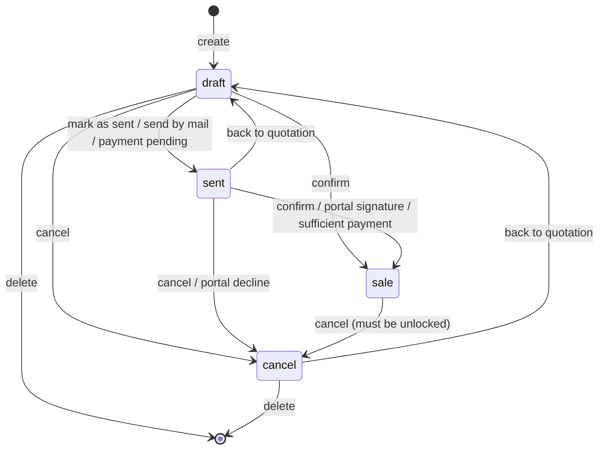
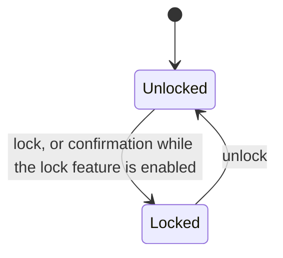
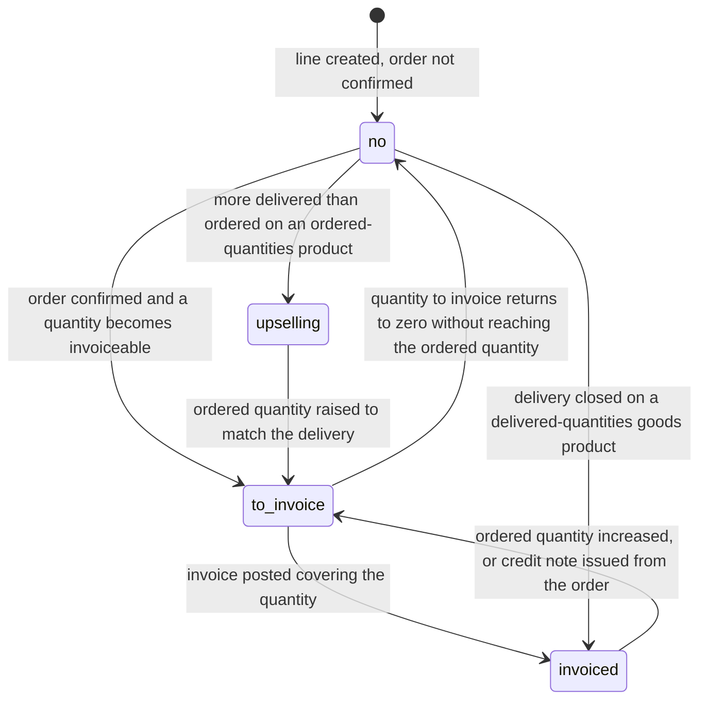
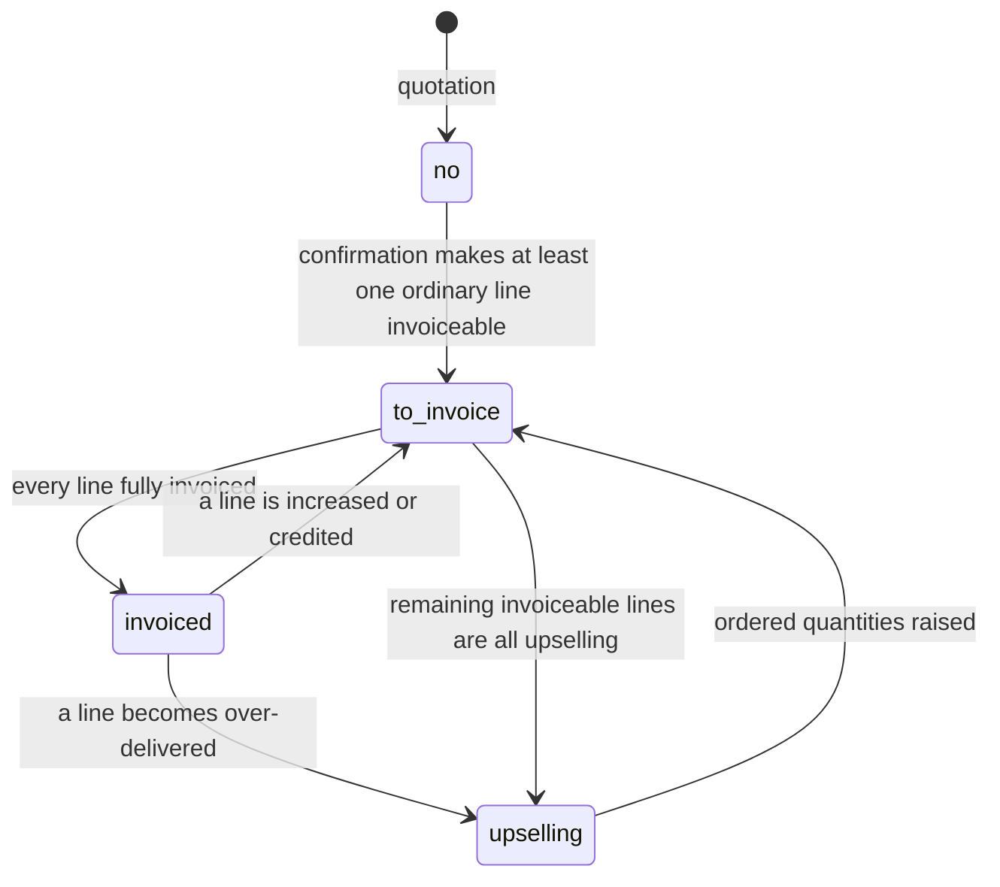
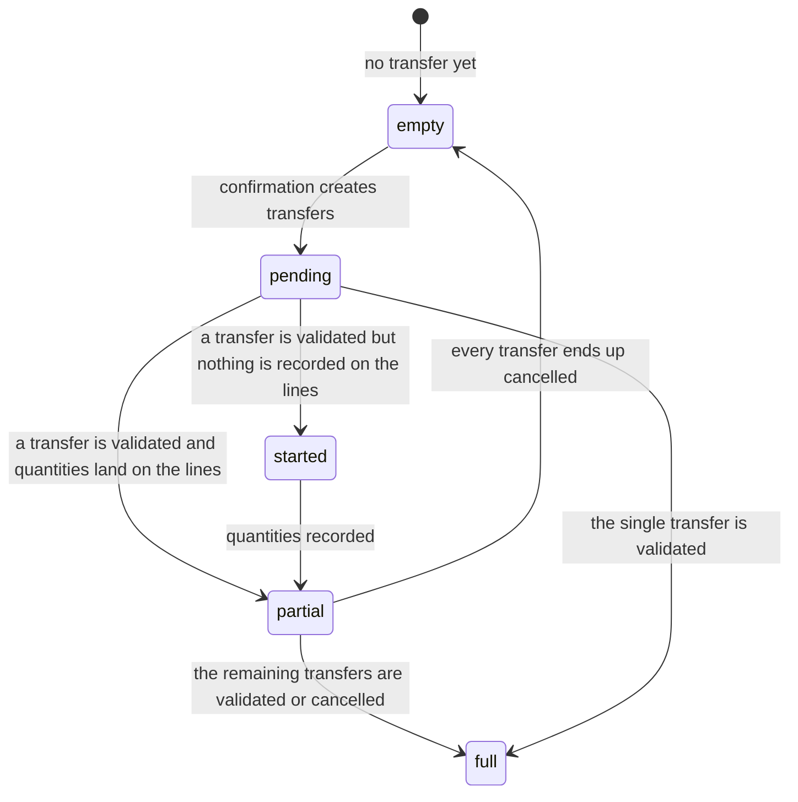
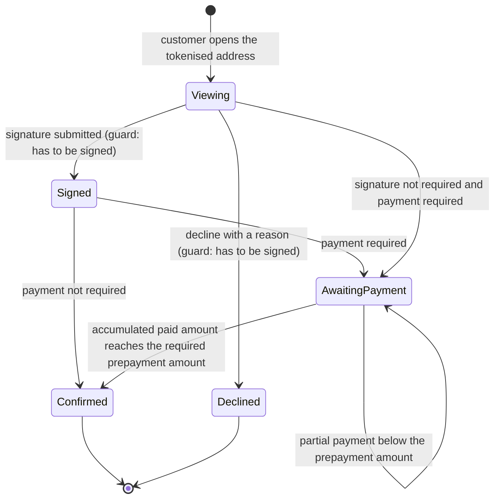

# Sales — State machines

This file specifies every state-bearing field of the sales domain: the values it may take, what
each value means, how the value changes, under which guard, and what side effects each change
produces. Six machines are described:

1. The **order status** of a Sales Order (`sale.order`, table `sale_order`), field `state`.
2. The **lock flag** of a Sales Order, field `locked` — an orthogonal two-state machine.
3. The **expiration** of a quotation, field `is_expired` — a derived, time-driven state.
4. The **invoice status** of a Sales Order Line (`sale.order.line`), field `invoice_status`.
5. The **invoice status** of a Sales Order, field `invoice_status` — derived from its lines.
6. The **delivery status** of a Sales Order, field `delivery_status` — derived from its transfers.

Two further derived states are described at the end: the **advance-invoice line state**, used only
to decide how an advance line is described and whether it is printed, and the **customer
acceptance state**, the combination of the signature and payment requirements that decides what the
customer portal offers.

---

## 1. Order status

### 1.1 States

| Value | Label | Meaning |
|---|---|---|
| `draft` | Quotation | The document is a non-binding offer that has not been transmitted. It is fully editable. Nothing downstream exists. |
| `sent` | Quotation Sent | The same offer, recorded as having been transmitted to the customer at least once. Editing is still unrestricted. The distinction exists so that the customer portal, the reminder filters and the analysis can separate transmitted from untransmitted offers. |
| `sale` | Sales Order | The customer has accepted. The confirmation date is stamped. Downstream documents exist or have been requested. Lines can no longer be deleted, products can no longer be swapped once anything moved, and the price list can no longer be changed. |
| `cancel` | Cancelled | The document has been withdrawn. Draft invoices that came from it are cancelled; non-completed transfers are cancelled. Amounts remain readable for the record. |

The status is stored, indexed, readonly to ordinary writes (only the action methods set it), not
copied on duplication, and tracked in the discussion thread at tracking order 3. Grouped list views
show all four columns even when empty.

### 1.2 Transition table

| From | To | Trigger operation | Guard conditions | Side effects |
|---|---|---|---|---|
| `draft` | `sent` | *Mark as sent* (explicit operation) | Every selected record must be in `draft`; otherwise the whole operation fails with "Only draft orders can be marked as sent directly." | Only the status changes. A change-tracking note is posted with the subtype "Quotation sent". |
| `draft` | `sent` | Posting any message while the "mark as sent" instruction is active (this is what the send-by-mail dialogue does) | The record must be in `draft`. Records already in `sent` or beyond are untouched. | The status is written with change tracking suppressed, so no tracking note is produced for the status itself; the message itself is posted, with the author mentioned in the notification. |
| `draft` | `sent` | Post-processing of a payment transaction that has reached the *pending* state | The order must be in `draft`. | Also: if the provider is the manual one, the order's payment reference is filled with the computed communication. A payment-initiated notification is sent to the customer. |
| `draft` or `sent` | `sale` | *Confirm* | See section 1.3. | The full confirmation algorithm: see [workflows.md](workflows.md), section "Confirmation". |
| `draft` or `sent` | `sale` | Customer signature in the portal, when payment is not also required | The order must require a signature, must not be expired, must not already be signed, and a signature image must be supplied. | The signature, signer name and signature instant are stored first; then confirmation runs with the "send confirmation email" instruction and with the signature included in the rendered document. |
| `draft` or `sent` | `sale` | Post-processing of a payment transaction that reached *authorized* or *done* | Exactly one order is linked to the transaction; the order must not still need a signature; the accumulated paid amount must have reached the required prepayment amount. | Confirmation runs with the "send confirmation email" instruction. Optionally followed by automatic invoicing (see [workflows.md](workflows.md), section "Automatic invoicing after payment"). |
| `draft` or `sent` | `cancel` | *Cancel* | No selected order may be locked; otherwise the operation fails with "You cannot cancel a locked order. Please unlock it first." | Draft invoices linked to the order are cancelled. With inventory integration, non-completed transfers are cancelled and a warning activity is raised on the impacted documents. |
| `draft` or `sent` | `cancel` | Customer *decline* in the portal, with a reason | The order must still be awaiting a signature, and a decline message must be supplied. | The cancellation path runs directly (the lock check of the ordinary *Cancel* operation is bypassed); the decline text is posted as a customer comment on the thread. |
| `sale` | `cancel` | *Cancel* | Not locked. | Same side effects as above, plus the inventory warning activities describing the quantity decrease to zero. |
| `sent` | `draft` | *Back to Quotation* | The record must be in `cancel` or `sent`; records in other statuses are silently skipped. | The signature image, the signer name and the signature instant are cleared. |
| `cancel` | `draft` | *Back to Quotation* | Same. | Same. |
| `sale` | `draft` | — | Not possible. A confirmed order must be cancelled first, and cancelling requires unlocking. |  |
| any | deleted | *Delete* | Only `draft` and `cancel` may be deleted; otherwise "You can not delete a sent quotation or a confirmed sales order. You must first cancel it." | Lines are deleted with the order. |

### 1.3 Guards of the confirmation transition

Confirmation is refused, for the whole batch, as soon as one selected order fails a check. The
checks are evaluated per order, in this order, and the first failure produces the message:

1. The status must be `draft` or `sent`. Otherwise: "Some orders are not in a state requiring
   confirmation."
2. Every line that is neither a display line nor an advance-invoice line must carry a product.
   Otherwise: "Some order lines are missing a product, you need to correct them before going
   further."

After the guard phase and before the status is written, the analytic distribution of every line of
every order still in `draft` or `sent` is validated against the distribution rules of the analytic
domain; an invalid distribution aborts the confirmation with the analytic domain's own message.

### 1.4 Diagram



### 1.5 What the status governs elsewhere

| Behaviour | `draft` | `sent` | `sale` | `cancel` |
|---|---|---|---|---|
| Price list recomputed from the customer | yes | no | no | no |
| Price list writable | yes | yes | no (refused with "You cannot change the pricelist of a confirmed order !") | yes |
| Lines deletable | yes | yes | only display lines and un-invoiced advance lines | yes |
| Line unit writable | yes | yes | no | no |
| Document may be deleted | yes | no | no | yes |
| Invoice status computed | forced to `no` | forced to `no` | from the lines | forced to `no` |
| Line invoice status computed | forced to `no` | forced to `no` | from the quantities | forced to `no` |
| Expiration evaluated | yes | yes | no | no |
| Portal signature offered | yes | yes | no | no |
| Portal payment offered | yes | yes | only to settle the balance | no |
| Credit-limit warning computed | yes | yes | no | no |
| Duplicate detection computed | yes | no | no | no |
| Expected date computed | yes | yes | yes | forced empty |
| Field-change tracking recorded | suppressed when the change comes from the catalogue screen | recorded | recorded | recorded |
| Customer portal listing | under "Quotations" only when `sent` | under "Quotations" | under "Orders" | under "Quotations" |

### 1.6 Message subtypes produced by status changes

| Transition | Subtype name | Default subscription | Notes |
|---|---|---|---|
| to `sent` | "Quotation sent" | not subscribed by default | Also mirrored on the sales team thread. |
| to `sale` | "Sales Order Confirmed" | not subscribed by default | Also mirrored on the sales team thread. |
| customer opens the portal page of a `draft` or `sent` order | "Quotation Viewed" | subscribed by default, internal only | Posted at most once per calendar day per order per session; see [workflows.md](workflows.md). |

---

## 2. Lock flag

### 2.1 States

| Value | Label | Meaning |
|---|---|---|
| false | Unlocked | Ordinary editing rules apply. |
| true | Locked | The commercially significant fields of the lines may not be written; the order may not be cancelled; procurement is not re-launched when quantities change. |

The flag is stored, defaults to false, is not copied on duplication, and is tracked.

### 2.2 Transitions

| From | To | Trigger | Guard | Side effects |
|---|---|---|---|---|
| false | true | *Lock* operation | none | none beyond the flag and its tracking note |
| false | true | Automatically at the end of confirmation | The feature group "Lock Confirmed Sales" must be enabled | none |
| true | false | *Unlock* operation | none | none |

### 2.3 What the lock forbids

Writing any of these fields on a line of a locked order fails:

`product_id` (Product), `name` (Description), `price_unit` (Unit Price), `product_uom_id` (Unit),
`product_uom_qty` (Quantity), `tax_ids` (Taxes), `analytic_distribution` (Analytic Distribution),
`discount` (Discount).

The message is "It is forbidden to modify the following fields in a locked order:" followed by the
readable label of each offending field, one per line.

One exception: when every line being written is an advance-invoice line, the description field is
removed from the protected set, so that the automatic re-description of an advance line (see
section 7) continues to work after the order is locked.

Independently: cancelling a locked order is refused with "You cannot cancel a locked order. Please
unlock it first."; a line of a locked order reports that its product cannot be edited; and, with
inventory integration, quantity changes on a locked order do not launch new procurement.

### 2.4 Diagram



---

## 3. Expiration

### 3.1 Definition

Expiration is not stored. It is evaluated whenever the order is read:

```formula
is_expired = ( status ∈ { draft, sent } ) and ( expiration_date is set ) and ( expiration_date < today )
```

`today` is the current date in the reader's time zone. The comparison is strict: an order whose
expiration date is today is not yet expired.

### 3.2 States and consequences

| Value | Meaning | Consequences |
|---|---|---|
| false | The offer is still open | The portal offers signature and payment. |
| true | The offer has lapsed | The portal refuses signature (the signature precondition fails) and refuses payment (the payment precondition fails). The list view marks the quotation as expired. The order can still be confirmed from the back office: expiration is not a guard of the *Confirm* operation. |

### 3.3 Setting the expiration date

The expiration date is computed, stored and writable. Its computation, in order of precedence:

1. If the order has a quotation template whose duration is strictly positive, the expiration date is
   today plus that many days.
2. Otherwise, if the company's default validity in days is strictly positive, the expiration date is
   today plus that many days.
3. Otherwise, the expiration date is empty and the order never expires.

Because the field is writable, a user may overwrite the computed value at any time; the computation
only re-runs when the company or the template changes.

---

## 4. Line invoice status

### 4.1 States

| Value | Label | Meaning |
|---|---|---|
| `no` | Nothing to Invoice | Either the order is not confirmed, or there is nothing to invoice yet and nothing over-delivered. |
| `to invoice` | To Invoice | The quantity to invoice is non-zero (positive or negative) at the `Product Unit` precision. |
| `upselling` | Upselling Opportunity | The product is invoiced on ordered quantities, the ordered quantity is not negative, and strictly more has been delivered than was ordered. Nothing more can be invoiced without increasing the ordered quantity, which is exactly the commercial opportunity the state names. |
| `invoiced` | Fully Invoiced | The invoiced quantity has reached or passed the ordered quantity; or the line is an advance-invoice line with nothing left to invoice; or (with inventory integration) the special partial-delivery closure described below. |

### 4.2 Decision algorithm

Evaluated with the quantity precision named `Product Unit`. The first matching rule wins.

1. If the order status is not `sale` → `no`.
2. Else if the line is an advance-invoice line and its untaxed amount to invoice equals zero →
   `invoiced`.
3. Else if the quantity to invoice is not zero → `to invoice`.
4. Else if the product's invoicing policy is *ordered quantities*, the ordered quantity is greater
   than or equal to zero, and the delivered quantity is strictly greater than the ordered quantity
   → `upselling`.
5. Else if the invoiced quantity is greater than or equal to the ordered quantity → `invoiced`.
6. Otherwise → `no`.

### 4.3 The partial-delivery closure (inventory integration)

After the rules above have run, one further rule may promote `no` to `invoiced`:

> If the order status is `sale`, the computed status is `no`, the product is a goods product, its
> invoicing policy is *delivered quantities*, the line has at least one move, **every** move is in
> the completed or cancelled state with at least one completed, and the delivered quantity is not
> zero at the unit's rounding, then the status becomes `invoiced`.

The purpose is products sold by weight or by volume, where the delivered quantity almost never
equals the ordered quantity exactly: once the delivery is closed, the line is considered settled.

### 4.4 Diagram



### 4.5 Side effect of entering the upselling state on the order

Whenever the *order-level* invoice status is recomputed and the new value is `upselling` while the
previous value was not, and the order has an identifier and has either a salesperson or a customer
with a salesperson, then:

1. Every existing to-do activity on the order is removed.
2. A new to-do activity is scheduled on the order, assigned to the order's salesperson if there is
   one, otherwise to the customer's salesperson. Its note reads: "Upsell *link to the order* for
   customer *link to the customer*", where each placeholder is a clickable reference to the
   record.

This side effect is suppressed when the reading context asks for activity automation to be skipped.

---

## 5. Order invoice status

### 5.1 States

The same four values and labels as the line status. The field is stored and computed from the
lines.

### 5.2 Decision algorithm

1. Orders whose status is not `sale` are set to `no` and are not considered further.
2. For each remaining order, collect the invoice statuses of its lines, **excluding** advance-invoice
   lines and display lines.
3. If any collected status is `to invoice`:
   - If no collected status is `no`, the order is `to invoice`.
   - Otherwise (a mixture of `to invoice` and `no` exists), look at the invoiceable lines — the
     lines, other than advance and display lines, whose status is `to invoice`. If **all** of them
     are lines that may not be invoiced alone, the order is `no`; otherwise the order is
     `to invoice`.
4. Else if the collection is non-empty and every collected status is `invoiced`, the order is
   `invoiced`.
5. Else if the collection is non-empty and every collected status is `invoiced` or `upselling`, the
   order is `upselling`.
6. Otherwise the order is `no`.

### 5.3 "May not be invoiced alone"

A line may not be invoiced alone when its product is the company's discount product. The rationale
is that a discount line, a delivery line or a reward line is meaningless on an invoice that
contains nothing else. Couplings extend the rule: a delivery-charge line and a loyalty reward line
are also excluded. The consequence is that an order whose only invoiceable line is such a line
reports "Nothing to Invoice" and does not appear in the "to invoice" work list.

### 5.4 Diagram



---

## 6. Delivery status

Present only with inventory integration. Stored and computed from the transfers of the order.

### 6.1 States

| Value | Label | Meaning |
|---|---|---|
| empty | — | There is no transfer at all, or every transfer is cancelled. |
| `pending` | Not Delivered | Transfers exist, none is completed. |
| `started` | Started | At least one transfer is completed, but no line reports a delivered quantity. |
| `partial` | Partially Delivered | At least one transfer is completed and at least one line reports a delivered quantity, while at least one transfer is neither completed nor cancelled. |
| `full` | Fully Delivered | Every transfer is either completed or cancelled (and at least one is not cancelled). |

### 6.2 Decision algorithm

1. If there is no transfer, or all transfers are cancelled → empty.
2. Else if every transfer is completed or cancelled → `full`.
3. Else if at least one transfer is completed and at least one line has a non-zero delivered
   quantity → `partial`.
4. Else if at least one transfer is completed → `started`.
5. Otherwise → `pending`.

### 6.3 Diagram



---

## 7. Advance-invoice line state

An advance-invoice line is described differently depending on the state of the invoices it feeds.
The state is derived, never stored, and is empty for the section line that groups advance lines.

### 7.1 Derivation

1. If the line is a display line, the state is empty.
2. Collect the invoice lines attached to the order line (restricted to invoices dated on or before
   the accrual date when an accrual date is supplied).
3. If **every** collected invoice line belongs to a draft invoice, the state is `draft`.
4. Else if **every** collected invoice line belongs to a cancelled invoice, the state is `cancel`.
5. Otherwise the state is empty, which in practice means "at least one posted invoice exists".

Note that a line with no invoice line at all satisfies both "all draft" and "all cancelled"
vacuously; the first test wins and the state is `draft`.

### 7.2 Effect on the description

| State | Description written on the line |
|---|---|
| `draft` | "Down Payment: *date* (Draft)", where *date* is the line's creation date rendered in the reader's date format. |
| `cancel` | "Down Payment (Cancelled)" |
| empty, and exactly one active customer invoice is found that carries both a payment communication and an invoice date | "Down Payment (ref: *payment communication* on *invoice date*)" |
| empty, otherwise | "Down Payment" |
| the grouping section line | "Down Payments" |

"Active customer invoice" means: among the invoice lines with a non-negative quantity, take their
invoices of the customer-invoice type, and keep those whose payment state is not *reversed*; if
that leaves nothing, keep them all.

### 7.3 Effect on printing

The printable document and the portal show:

- the advance-invoice section line only when at least one advance line has an empty state (that is,
  at least one advance invoice has been posted);
- each advance line only when its state is empty.

Draft and cancelled advance lines are therefore invisible to the customer.

---

## 8. Customer acceptance state

This is not a stored field but the combination that decides what the customer portal offers and
what the notification button says. Two predicates drive it.

### 8.1 "Has to be signed"

All of the following must hold:

1. the order status is `draft` or `sent`;
2. the order is not expired;
3. the order requires a signature;
4. no signature has been stored yet.

### 8.2 "Has to be paid"

All of the following must hold:

1. the order status is `draft` or `sent`;
2. the order is not expired;
3. the order requires a payment;
4. the order total is strictly positive;
5. the confirmation amount has **not** been reached, that is the required prepayment amount is
   strictly greater than the amount already paid, compared with the rounding of the order currency.

### 8.3 Combination table

| Has to be signed | Has to be paid | Portal offering | Notification button label |
|---|---|---|---|
| yes | yes | Signature pad, then the payment form | "Sign & Pay Quotation" — or "View Quotation" when the last transaction is pending |
| yes | no | Signature pad; signing confirms the order immediately | "Accept & Sign Quotation" |
| no | yes | Payment form; sufficient payment confirms the order | "Accept & Pay Quotation" — suppressed when the last transaction is pending |
| no | no, status `draft` or `sent` | Read-only view (the order can only be confirmed from the back office) | "View Quotation" |
| — | — | status `sale`: read-only view plus a payment form for the remaining balance | no acceptance button |

When the document is rendered as a pro-forma invoice, every access button is suppressed for
customer and portal recipients.

### 8.4 Diagram of the portal acceptance path



---

## 9. Interaction summary

The six machines are not independent. The following table states the couplings that a
re-implementation must preserve.

| Event | Order status | Lock | Line invoice status | Order invoice status | Delivery status |
|---|---|---|---|---|---|
| Confirm | `draft`/`sent` → `sale` | may become locked | recomputed from `no` to `to invoice` or `no` | recomputed | transfers created, becomes `pending` |
| Validate a transfer | unchanged | unchanged | delivered quantity rises, status may change | recomputed | `started`, `partial` or `full` |
| Post an invoice | unchanged | unchanged | invoiced quantity rises, may become `invoiced` | recomputed | unchanged |
| Post a credit note created from the order | unchanged | unchanged | invoiced quantity falls, may return to `to invoice` | recomputed | unchanged |
| Increase an ordered quantity | unchanged | refused when locked | may leave `invoiced` or `upselling` | recomputed | new procurement launched |
| Decrease an ordered quantity below the delivered quantity | unchanged | refused when locked | — | — | refused with "The ordered quantity of a sale order line cannot be decreased below the amount already delivered. Instead, create a return in your inventory." |
| Cancel | any → `cancel` | refused when locked | forced to `no` | forced to `no` | non-completed transfers cancelled |
| Back to quotation | `cancel`/`sent` → `draft` | unchanged | forced to `no` | forced to `no` | unchanged |
