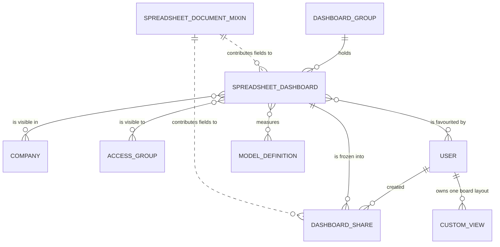

# Entities

This document specifies the five entities the domain owns, field by field, and the operations the domain adds to seven entities owned by other domains. The structure of the workbook that three of these entities carry is specified separately in [`document-format.md`](document-format.md).

## 1. The five entities and how they relate

| Full name | Transport name | Storage name | Kind | Purpose in one sentence |
|---|---|---|---|---|
| Spreadsheet Document mixin | `spreadsheet.mixin` | `spreadsheet_mixin` | abstract | Gives any entity the ability to carry one workbook, to validate it and to name its download file |
| Spreadsheet Dashboard | `spreadsheet.dashboard` | `spreadsheet_dashboard` | persistent | One dashboard: a workbook plus the audience, the companies, the group and the ordering that decide who sees it and where |
| Dashboard Group | `spreadsheet.dashboard.group` | `spreadsheet_dashboard_group` | persistent | A named, ordered section of the dashboard workspace that holds dashboards |
| Dashboard Share | `spreadsheet.dashboard.share` | `spreadsheet_dashboard_share` | persistent | A frozen copy of one dashboard, reachable through a secret token, optionally carrying a workbook file for download |
| Dashboard Board | `board.board` | `board_board` | abstract, no table | The personal board: a form with no record behind it, whose layout is stored per user as a customised view |



Three of the four audit columns exist on every persistent entity of this domain and are not repeated in each table below: `create_uid` (creating user), `create_date` (creation timestamp), `write_uid` (last writing user) and `write_date` (last write timestamp). Every persistent entity also has `id`, a thirty-two bit integer primary key drawn from its own numbering sequence.

## 2. Spreadsheet Document mixin (`spreadsheet.mixin`)

### 2.1 Purpose

The Spreadsheet Document mixin is the single place where the platform defines what it means for a record to *be* a spreadsheet. It contributes four fields and ten operations to whichever entity declares it. Within this domain two entities declare it: Spreadsheet Dashboard and Dashboard Share. Other domains declare it too; the mixin is written so that it makes no assumption about its host beyond the existence of a display name.

The mixin has no table of its own. Its fields become fields of every host entity, and the binary field among them is stored the way every binary field is stored — as an attachment carrying the host entity's transport name, the field identifier and the record identifier — which is why no column for it appears in the host's table.

### 2.2 Fields

| Identifier | Full name | Type | Target | Required | Default | Computed rule and dependencies | Stored | Meaning |
|---|---|---|---|---|---|---|---|---|
| `spreadsheet_binary_data` | Spreadsheet file | binary | — | no | the empty workbook, produced by the empty-workbook rule at creation time | — | yes, as an attachment | The workbook itself: the complete serialised document, held as binary content |
| `spreadsheet_data` | Spreadsheet Data | long text | — | no | — | computed by the workbook-text rule; depends on `spreadsheet_binary_data`; writable, and a write is turned back into binary content by the workbook-text inverse rule | no | The same workbook as decoded text, so that a reader or a writer does not have to decode it |
| `spreadsheet_file_name` | Spreadsheet File Name | single line text | — | no | — | computed by the file-name rule; depends on the record's display name | no | The name proposed when the workbook is downloaded |
| `thumbnail` | Thumbnail | binary | — | no | — | — | yes, as an attachment | A small picture of the workbook, held for list and card presentations |

### 2.3 The workbook-text rule and its inverse

Reading `spreadsheet_data` does not read the binary field. The rule searches the attachment store for the attachments whose owning entity is the host entity, whose owning field is `spreadsheet_binary_data` and whose owning record is one of the records being read, and returns the raw content of each. A record with no such attachment reads as empty.

Writing `spreadsheet_data` writes the binary field: an empty text clears `spreadsheet_binary_data`; any other text is encoded and stored. Every write therefore passes through the workbook validation of §2.5, because that validation is attached to the binary field.

**Why the pair exists.** The binary field is the contractual storage: it is what an attachment-aware integration reads, and what a duplicate copies. The text field is the working surface: the reading route, the sharing operation and the tests all move whole workbooks as text, and forcing each of them to encode and decode would put the same three steps in five places.

### 2.4 The file-name rule

The proposed file name is the record's display name followed by the fixed suffix `.osheet.json`. The suffix is reproduced exactly: an existing client recognises a workbook by it.

```formula
proposed file name = display name of the record + ".osheet.json"
```

A dashboard whose name is `Sales` therefore downloads as `Sales.osheet.json`.

### 2.5 Workbook validation

The validation is attached to `spreadsheet_binary_data` and therefore runs on creation, on every write to that field, on every write to `spreadsheet_data`, and interactively while a form is open, before the record is saved. It runs in two stages, and the second stage runs only when the installation is executing its automated test suite.

1. **Decoding.** Each record whose `spreadsheet_binary_data` is not empty has its content decoded and parsed as a structured document. A content that cannot be decoded as text, or that is not a well-formed structured document, fails with the message of rule [SD-001](business-rules.md#sd-001).
2. **Reference walk.** A content that decodes but that declares the packaging marker `[Content_Types].xml` is a workbook file rather than a native document and is accepted without further checks. Any other content is walked for the models, field paths and menu external identifiers it names, and each is checked for existence. The walk and the four kinds of finding it can produce are specified in [`document-format.md`](document-format.md) §7 and in rule [SD-002](business-rules.md#sd-002).

### 2.6 The empty workbook

A record created without an explicit workbook receives the empty workbook: one sheet whose stored identifier is `sheet1` and whose name is the translated word "Sheet1", a settings section carrying the creating user's locale, and the revision marker `START_REVISION`. The sheet identifier and the revision marker are reproduced exactly; the sheet *name* is translated into the creating user's language, deliberately, so that formulas written by that user read naturally, while the identifier stays stable so that references survive translation.

The full shape is given in [`document-format.md`](document-format.md) §6.

### 2.7 Operations contributed by the mixin

| Operation | Kind | Arguments | What it does |
|---|---|---|---|
| `_check_spreadsheet_data` | validation | the records | The two-stage validation of §2.5 |
| `_compute_spreadsheet_data` | computation | the records | Reads the workbook text out of the attachment store |
| `_inverse_spreadsheet_data` | inverse computation | the records | Writes the workbook text back into the binary field |
| `_compute_spreadsheet_file_name` | computation | the records | Applies the file-name rule of §2.4 |
| `_onchange_data_` | interactive check | the records | Runs the validation of §2.5 while a form is open, so that a bad upload is refused before saving |
| `get_display_names_for_spreadsheet` | read operation on the entity, not on a record | a list of pairs, each naming an entity and a record identifier | Returns the display names of those records, in the order asked, archived records included, with an empty result for a record that does not exist |
| `_empty_spreadsheet_data_base64` | internal rule | — | The empty workbook, encoded for the binary field |
| `_empty_spreadsheet_data` | internal rule | — | The empty workbook as a structure |
| `_zip_xslx_files` | internal rule | a list of file descriptions | Packages the parts of a workbook file into one archive, replacing an image reference by the image content |
| `_get_file_content` | internal rule | a file path | Resolves an inline picture or a stored-image web address into raw bytes |

`get_display_names_for_spreadsheet` deserves a note: it disables the active-record filter, so a workbook that names an archived record still shows that record's name rather than a blank; and it preserves input order exactly, so the caller can zip the answers back onto its own list without a second lookup. A record identifier that does not exist yields an empty answer in its position rather than shortening the list.

`_zip_xslx_files` reads each part description; a part that carries an image reference has that reference resolved to bytes, and a reference that cannot be resolved is skipped silently rather than failing the whole archive. A part that carries content uses that content unchanged.

`_get_file_content` accepts two forms: an inline picture, recognised by the prefix `data:image/png;base64,`, whose remainder is decoded directly; and a stored-image web address of the form `/web/image/<identifier>`, whose numeric identifier is resolved through the attachment store and streamed.

### 2.8 Extension points

| Extension point | Who uses it | What it changes |
|---|---|---|
| Declaring the mixin on a host entity | Spreadsheet Dashboard, Dashboard Share, and entities of other domains | Adds the four fields and the ten operations to that entity |
| Overriding the empty-workbook rule | a host entity | Changes what a newly created record starts with |
| The packaging marker exemption in validation | any host that stores a workbook file rather than a native document | Skips the reference walk |

## 3. Spreadsheet Dashboard (`spreadsheet.dashboard`)

### 3.1 Purpose and lifecycle

A Spreadsheet Dashboard is one readable page of the dashboard workspace. It owns a workbook, a place in a group, a position within that group, an audience expressed as access groups, an optional restriction to companies, an optional list of the models it mainly measures, an optional path to a sample workbook, and a publication mark.

Its lifecycle has no approval and no archive: a dashboard is created, edited, published or unpublished, duplicated, and deleted. The only state field is the publication mark, specified in [`state-machines.md`](state-machines.md) §2. The favourite mark is not a state of the dashboard but a state of the pair (dashboard, reader), specified in [`state-machines.md`](state-machines.md) §3.

Most dashboards in a running installation are not created by a user at all: they are shipped by a capability package, listed in [`configuration.md`](configuration.md) §8, and they carry an external identifier that makes them recognisable and upgradeable.

### 3.2 Fields

| Identifier | Full name | Type | Target | Required | Default | Computed rule and dependencies | Stored | Meaning |
|---|---|---|---|---|---|---|---|---|
| `id` | Identifier | integer | — | yes | from the entity's numbering sequence | — | yes | Primary key |
| `name` | Name | single line text, translatable | — | yes | — | — | yes, as a structured document holding one text per language | The title shown in the workspace list, in the sidebar and on the shared page |
| `dashboard_group_id` | Dashboard Group | many to one | `spreadsheet.dashboard.group` | yes | — | — | yes, indexed, deletion restricted | The section of the workspace this dashboard appears under |
| `sequence` | Sequence | integer | — | no | empty, which sorts before every assigned value | — | yes | Position within the group and, by extension, the default ordering of the entity |
| `sample_dashboard_file_path` | Sample Dashboard File Path | single line text | — | no | — | — | yes | Location of a demonstration workbook to show instead of the real one when the measured data is empty; never offered for translation |
| `is_published` | Is Published | boolean | — | no | true | — | yes | Whether the dashboard appears in the workspace at all |
| `company_ids` | Companies | many to many | `res.company` | no | empty, meaning every company | — | yes, in the association table `res_company_spreadsheet_dashboard_rel` | The companies this dashboard is restricted to |
| `group_ids` | Access Groups | many to many | `res.groups` | no | the internal-user group | — | yes, in the association table `res_groups_spreadsheet_dashboard_rel` | The audience: a reader sees the dashboard only if one of these groups is among the reader's groups |
| `favorite_user_ids` | Favorite Users | many to many | `res.users` | no | empty | — | yes, in the association table `res_users_spreadsheet_dashboard_rel` | The users who have marked this dashboard as a favourite; the selection offered in a form is restricted to the current user |
| `is_favorite` | Is Favorite | boolean | — | no | — | computed by the favourite rule; depends on `favorite_user_ids` and on the identity of the reader | no | Whether the current reader has marked this dashboard as a favourite |
| `main_data_model_ids` | Main Data Models | many to many | `ir.model` | no | empty | — | yes, in the association table `ir_model_spreadsheet_dashboard_rel`; never copied when the dashboard is duplicated | The models whose emptiness decides whether the sample workbook is shown instead of the real one |
| `spreadsheet_binary_data` | Spreadsheet file | binary | — | no | the empty workbook | — | yes, as an attachment | Contributed by the mixin: the workbook |
| `spreadsheet_data` | Spreadsheet Data | long text | — | no | — | contributed by the mixin | no | Contributed by the mixin: the workbook as text |
| `spreadsheet_file_name` | Spreadsheet File Name | single line text | — | no | — | contributed by the mixin | no | Contributed by the mixin: the proposed download name |
| `thumbnail` | Thumbnail | binary | — | no | — | — | yes, as an attachment | Contributed by the mixin: a picture of the workbook |
| `display_name` | Display Name | single line text | — | no | — | the value of `name` | no | The name used wherever a record must be named in one line |
| `create_uid` | Created by | many to one | `res.users` | no | the acting user | — | yes | Audit |
| `create_date` | Created on | date and time | — | no | the moment of creation | — | yes | Audit |
| `write_uid` | Last Updated by | many to one | `res.users` | no | the acting user | — | yes | Audit |
| `write_date` | Last Updated on | date and time | — | no | the moment of the write | — | yes | Audit |

### 3.3 The favourite rule

The favourite mark is computed, not stored, and it depends on the identity of the reader as well as on the stored list of favouring users. For each dashboard the rule answers true when the reader's user identifier appears in `favorite_user_ids` and false otherwise. Because the rule depends on the reader, two readers looking at the same record at the same moment legitimately see different values, and a cached value must be keyed by reader.

### 3.4 Ordering, display name, uniqueness, indexes

- **Default ordering:** by `sequence` ascending. Records with an empty sequence sort first. Records with equal sequences fall back to the entity's primary key ascending. The workspace sidebar relies on this order and applies no second sort of its own.
- **Display name:** the `name` field, unchanged.
- **Uniqueness:** none. Two dashboards may carry the same name, in the same group, with the same sequence. Identity is the primary key, and — for shipped dashboards — the external identifier.
- **Indexes:** the primary key, and an index on `dashboard_group_id`, because the workspace reads dashboards group by group.
- **Foreign keys:** `dashboard_group_id` refuses the deletion of a group that still holds dashboards; `create_uid` and `write_uid` become empty when the user they name is deleted.

### 3.5 Duplication

Duplicating a dashboard copies the workbook, the group, the sequence, the sample path, the publication mark, the companies and the access groups. It does **not** copy `main_data_model_ids`. When the caller does not supply a name, the copy is named by the rule of [`calculations.md`](calculations.md) §18:

```formula
name of the copy = name of the original + " (copy)"
```

When the caller supplies a name, that name is used unchanged and the rule does not apply.

**Why the measured models are not copied.** The measured models exist to decide whether a *shipped* dashboard should show its sample workbook while an installation is still empty. A hand-made copy has no sample workbook to show, so carrying the models over would only make the copy consult a list that can no longer change anything.

### 3.6 Company behaviour

`company_ids` is a list, not a single company, and an empty list is not "no company" but "every company". The record rule of [`configuration.md`](configuration.md) §5 turns that into a selection: a dashboard is visible when at least one of its companies is among the reader's currently active companies, or when it has no company at all. There is no company field that scopes the workbook's own data: the data a dashboard shows is scoped at read time by the active companies carried on the reading request, described in [`workflows.md`](workflows.md) §4.

### 3.7 Operations

| Operation | Kind | Arguments | What it does |
|---|---|---|---|
| `_compute_is_favorite` | computation | the records | The rule of §3.3 |
| `action_toggle_favorite` | user action on exactly one record | — | Adds the acting user to `favorite_user_ids` when absent, removes it when present; performed with elevated rights because an ordinary reader may not write the dashboard |
| `_get_serialized_readonly_dashboard` | preparation rule | one record | Produces the reading payload: the workbook, an empty revision list, the reader's locale substituted into the settings, the default currency of the active company and the translation namespace |
| `_get_sample_dashboard` | preparation rule | one record | Loads and parses the workbook named by `sample_dashboard_file_path`; answers nothing when that file is absent |
| `_dashboard_is_empty` | internal rule | one record | Answers true as soon as one of the measured models holds no record at all |
| `_get_dashboard_translation_namespace` | preparation rule | one record | Answers the capability package that shipped this dashboard, taken from its external identifier, or nothing for a dashboard that was not shipped |
| `copy_data` | lifecycle override | the records and the caller's overrides | The naming rule of §3.5 |

`_dashboard_is_empty` reads each measured model in turn. When the reader may not read a model, the count is taken with elevated rights instead of failing, so that a reader without access to one measured model still gets a usable answer. The rule stops at the first empty model.

### 3.8 Extension points contributed by other packages

| Extension point | Contributed by | Effect |
|---|---|---|
| Shipped dashboard records | the twelve shipping packages of [`README.md`](README.md) | Add dashboards, each with its group, sequence, audience, measured models and sample path |
| Shipped dashboard groups | the dashboards package | The seven groups of [`configuration.md`](configuration.md) §7 |
| An edit action named `action_edit_dashboard` | an editing capability outside this domain | When present, the workspace sidebar offers an edit control beside each dashboard; when absent, no edit control is offered and the sidebar is read-only |
| A thread of cell comments | an editing capability outside this domain | Reuses the audience record rule of this domain; the rule's definition therefore has to be mirrored there |

## 4. Dashboard Group (`spreadsheet.dashboard.group`)

### 4.1 Purpose and lifecycle

A Dashboard Group is a named, ordered section of the workspace. It holds dashboards and nothing else. It is created, renamed, reordered and deleted, and a group that was shipped by a capability package cannot be deleted at all.

### 4.2 Fields

| Identifier | Full name | Type | Target | Required | Default | Computed rule and dependencies | Stored | Meaning |
|---|---|---|---|---|---|---|---|---|
| `id` | Identifier | integer | — | yes | from the entity's numbering sequence | — | yes | Primary key |
| `name` | Name | single line text, translatable | — | yes | — | — | yes, as a structured document holding one text per language | The section heading shown in the workspace sidebar |
| `sequence` | Sequence | integer | — | no | empty | — | yes | Position of the section in the sidebar |
| `dashboard_ids` | Dashboards | one to many | `spreadsheet.dashboard` through `dashboard_group_id` | no | — | — | no, the link lives on the dashboard | Every dashboard filed under this group, published or not |
| `published_dashboard_ids` | Published Dashboards | one to many | `spreadsheet.dashboard` through `dashboard_group_id`, restricted to records whose `is_published` is true | no | — | — | no | The dashboards the workspace actually offers |
| `create_uid` | Created by | many to one | `res.users` | no | the acting user | — | yes | Audit |
| `create_date` | Created on | date and time | — | no | the moment of creation | — | yes | Audit |
| `write_uid` | Last Updated by | many to one | `res.users` | no | the acting user | — | yes | Audit |
| `write_date` | Last Updated on | date and time | — | no | the moment of the write | — | yes | Audit |

The two one-to-many fields point at the same link through the same inverse field; the second simply carries a permanent restriction to published dashboards. Unpublishing a dashboard therefore removes it from `published_dashboard_ids` immediately, and republishing puts it back, with no other write.

### 4.3 Ordering, display name, uniqueness, indexes

- **Default ordering:** by `sequence` ascending, then by primary key.
- **Display name:** the `name` field.
- **Uniqueness:** none; two groups may share a name.
- **Indexes:** the primary key only.
- **Foreign keys:** `create_uid` and `write_uid` become empty when the user they name is deleted. The link from dashboards is declared on the dashboard side and refuses deletion.

### 4.4 The deletion guard

Before any group is deleted, its external identifier is read. A group that has an external identifier, and whose identifier does not begin with the prefix `__export__`, was shipped by a capability package and is refused with the message of rule [SD-009](business-rules.md#sd-009). The prefix is reproduced exactly; identifiers that begin with it are the ones the system assigns to records that were merely exported, and such a group is deletable.

The guard runs on ordinary deletion. It does not run when the capability package that owns the group is itself being removed, because in that situation the record is expected to disappear with its owner.

### 4.5 Operations

| Operation | Kind | Arguments | What it does |
|---|---|---|---|
| `_unlink_except_spreadsheet_data` | deletion guard | the records | The rule of §4.4 |

## 5. Dashboard Share (`spreadsheet.dashboard.share`)

### 5.1 Purpose and lifecycle

A Dashboard Share is a snapshot. When a reader shares a dashboard, the values on screen at that moment — with every live formula already replaced by its result, every chart already turned into a picture, and every active filter already written into a sheet of its own — are stored as a new record, together with a secret token and, optionally, a ready-made workbook file. The address built from the record's identifier and its token can then be given to somebody who has no account at all.

A share is created and it is read. It is never edited by a user and it has no state field. It disappears in exactly one way: the dashboard it copies is deleted, and the cascade deletes the share with it.

**Why a snapshot rather than a live link.** The reader of a shared address is outside the access-group system of the installation. Serving live data to that reader would mean evaluating the dashboard's formulas with somebody's rights, and the only rights available are those of the person who shared. A frozen copy removes the question: the share contains values, not queries.

### 5.2 Fields

| Identifier | Full name | Type | Target | Required | Default | Computed rule and dependencies | Stored | Meaning |
|---|---|---|---|---|---|---|---|---|
| `id` | Identifier | integer | — | yes | from the entity's numbering sequence | — | yes | Primary key, and the first component of the shared address |
| `dashboard_id` | Dashboard | many to one | `spreadsheet.dashboard` | yes | — | — | yes, deletion cascades | The dashboard this record froze |
| `access_token` | Access Token | single line text | — | yes | a freshly generated universally unique identifier, in its canonical text form | — | yes | The secret second component of the shared address |
| `excel_export` | Workbook Export | binary | — | no | — | — | yes, as an attachment | A ready-made workbook file of the frozen copy, packaged at sharing time, offered for download to a reader who may export |
| `full_url` | Web Address | single line text | — | no | — | computed by the address rule; depends on `access_token` | no | The complete address to hand out; its label is reproduced as "URL" |
| `name` | Name | single line text | — | no | — | the `name` of the related dashboard, read through `dashboard_id` | no | The title shown on the shared page and used as the download file name |
| `spreadsheet_binary_data` | Spreadsheet file | binary | — | no | the empty workbook | — | yes, as an attachment | Contributed by the mixin: the frozen workbook |
| `spreadsheet_data` | Spreadsheet Data | long text | — | no | — | contributed by the mixin | no | Contributed by the mixin: the frozen workbook as text; this is the field the sharing operation writes |
| `spreadsheet_file_name` | Spreadsheet File Name | single line text | — | no | — | contributed by the mixin | no | Contributed by the mixin |
| `thumbnail` | Thumbnail | binary | — | no | — | — | yes, as an attachment | Contributed by the mixin |
| `create_uid` | Created by | many to one | `res.users` | no | the acting user | — | yes | Audit, and the identity whose rights are re-checked on every later read |
| `create_date` | Created on | date and time | — | no | the moment of creation | — | yes | Audit, and the moment printed on the shared page as the freezing moment |
| `write_uid` | Last Updated by | many to one | `res.users` | no | the acting user | — | yes | Audit |
| `write_date` | Last Updated on | date and time | — | no | the moment of the write | — | yes | Audit |

### 5.3 The address rule

```formula
web address = base web address of the installation + "/dashboard/share/" + share identifier + "/" + access token
```

The three path segments are reproduced exactly. Because the rule depends only on the token, a record whose token is regenerated yields a new address and the previous one stops resolving.

### 5.4 The access check

Every read of a share — the page, the data and the download — passes through the same two-part check, and both parts must pass:

1. **Token part.** The token supplied in the address is compared with the stored token using a comparison whose duration does not depend on how many leading characters match. An empty supplied token fails immediately.
2. **Rights part.** The dashboard is re-read *as the user who created the share*. That user must still be allowed to read it.

A failure of either part is refused with the message of rule [SD-011](business-rules.md#sd-011). The second part is what makes a share revocable without deleting it: removing the sharing user from the dashboard's audience makes every previously handed-out address stop working, immediately and for everybody.

### 5.5 Ordering, display name, uniqueness, indexes

- **Default ordering:** the entity declares none, so records are returned by primary key ascending.
- **Display name:** the related dashboard's name.
- **Uniqueness:** none is declared. Two shares of the same dashboard by the same user are two records with two tokens. The token is not declared unique either; uniqueness in practice comes from the generator.
- **Indexes:** the primary key only.
- **Foreign keys:** `dashboard_id` cascades on deletion; `create_uid` and `write_uid` become empty when the user they name is deleted.

### 5.6 Operations

| Operation | Kind | Arguments | What it does |
|---|---|---|---|
| `_compute_full_url` | computation | the records | The address rule of §5.3 |
| `action_get_share_url` | operation on the entity, not on a record | a set of values | Packages the supplied workbook-file parts under the key `excel_files` into one archive, stores it in `excel_export`, creates the share from the remaining values and returns its web address |
| `_check_token` | internal rule | a supplied token | The token part of §5.4 |
| `_check_dashboard_access` | internal rule | a supplied token | Both parts of §5.4 |

`action_get_share_url` is the only creation path used by a client. The values it receives are the dashboard identifier, the frozen workbook as text under `spreadsheet_data`, and the workbook-file parts under `excel_files`. The `excel_files` key is consumed and never stored under that name.

### 5.7 Visibility

A share is visible only to the user who created it, enforced by the record rule of [`configuration.md`](configuration.md) §5. Every internal user may create, read, update and delete shares, but the rule confines each of them to their own. A reader who has the address needs no visibility at all, because the routes read the record with elevated rights and then apply the check of §5.4 instead.

## 6. Dashboard Board (`board.board`)

### 6.1 Purpose

The personal board is a page on which a user pins ordinary views — a list here, a chart there — and arranges them in columns. It predates the workbook-based dashboards and coexists with them: its menu entry sits inside the dashboards menu.

There is no board record. The entity is abstract, has no table, and its creation operation deliberately returns an empty set instead of writing anything. What is stored is the *layout*, and it is stored as a customised view belonging to one user.

### 6.2 Fields

| Identifier | Full name | Type | Target | Required | Default | Computed rule and dependencies | Stored | Meaning |
|---|---|---|---|---|---|---|---|---|
| `id` | Identifier | integer | — | no | — | — | no | Declared only because a client that opens a form initialises a placeholder record and needs an identifier field to do so |

### 6.3 Operations

| Operation | Kind | Arguments | What it does |
|---|---|---|---|
| `create` | lifecycle override | the values | Writes nothing and returns an empty set, so that the placeholder record a client creates when it opens the board never reaches storage |
| `get_view` | read operation on the entity | an optional view identifier, a view kind | Returns the board layout: the shipped one, or the calling user's customised one when there is one, after the preprocessing of §6.4 |
| `_arch_preprocessing` | internal rule | a layout | The preprocessing of §6.4 |

`get_view` reads, with elevated rights, the customised view belonging to the calling user and referring to the requested view, takes the first if there are several, and — when one exists — replaces the returned layout by the stored one and reports the customised view's identifier alongside it.

### 6.4 Layout preprocessing

Every layout returned, shipped or customised, is rewritten in two ways before it reaches the client:

1. Every pinned action that is marked invisible is removed from the layout, at any depth. A pinned action becomes invisible when the view or the action behind it is no longer available to this user, so the removal is what prevents a board from breaking when rights change.
2. The root of the layout is marked so that the client instantiates the board presentation rather than an ordinary form.

### 6.5 The stored layout

The layout of one user is one Custom View record (`ir.ui.view.custom`), owned by that user and referring to the shipped board view. Creating, replacing and deleting that record is how a board is edited. The record is written with elevated rights, because an ordinary user may not write views.

The shipped board layout is a form containing one board element with the arrangement marker `2-1` — two columns, the first twice as wide as the second — and one empty column. Pinning the first action therefore fills the first column.

## 7. Constraints, invariants and concurrency across the domain

| Subject | Position |
|---|---|
| Uniqueness constraints | None on any entity of the domain. No name, code or token is declared unique in storage |
| Check constraints in storage | None |
| Archiving | No entity of the domain has an active flag. A dashboard is withdrawn by unpublishing it, not by archiving it |
| Deletion | A dashboard group that was shipped cannot be deleted; a dashboard group still holding dashboards cannot be deleted; deleting a dashboard deletes its shares |
| Record locking | None. Two administrators writing the same dashboard are resolved last-write-wins on the whole workbook |
| Concurrency of a reader | A reader never writes the dashboard. The only write an ordinary reader performs is the favourite mark, which is a link row and cannot conflict |
| Multi-company | Through `company_ids` on the dashboard, and through the active companies on the reading request |

## 8. Operations this domain adds to entities owned elsewhere

These fourteen operations exist only to serve spreadsheets and dashboards. The entities they extend are owned by other domains, which describe the entities themselves; the behaviour below is specified here.

### 8.1 Account (`account.account`), owned by [`../general-ledger/`](../general-ledger/)

| Operation | Kind | Arguments | What it does |
|---|---|---|---|
| `_get_date_period_boundaries` | internal rule on the entity | a period description, a company | Turns a period description into a first date and a last date, using the company's fiscal year end; specified in [`calculations.md`](calculations.md) §5 |
| `_build_spreadsheet_formula_domain` | internal rule | the parameters of one formula, and a flag asking for the payable-and-receivable fallback | Builds the journal-item selection rule shared by every accounting formula; specified in [`calculations.md`](calculations.md) §6 |
| `spreadsheet_move_line_action` | read operation on the entity | the parameters of one formula | Returns a window action listing exactly the journal items that the formula summed, titled "Cell Audit" |
| `spreadsheet_fetch_debit_credit` | read operation on the entity | a list of formula parameter sets | For each set, the summed debit and the summed credit |
| `spreadsheet_fetch_residual_amount` | read operation on the entity | a list of formula parameter sets | For each set, the summed residual amount |
| `spreadsheet_fetch_partner_balance` | operation on the entity | a list of formula parameter sets | For each set, the summed balance restricted to the named partners |
| `spreadsheet_fetch_balance_tag` | operation on the entity | a list of formula parameter sets | For each set, the summed balance restricted to the accounts carrying the named tags |
| `get_account_group` | operation on the entity | a list of account types | For each type, the codes of the accounts of that type in the current company |

### 8.2 Company (`res.company`), owned by [`../contacts-and-organizations/`](../contacts-and-organizations/)

| Operation | Kind | Arguments | What it does |
|---|---|---|---|
| `get_fiscal_dates` | read operation on the entity | a list of pairs, each a company identifier and a date | For each pair, the first and last date of the fiscal year containing that date for that company, or nothing when the company does not exist |

### 8.3 Currency (`res.currency`), owned by [`../multi-currency/`](../multi-currency/)

| Operation | Kind | Arguments | What it does |
|---|---|---|---|
| `get_company_currency_for_spreadsheet` | read operation on the entity | an optional company identifier | The code, the symbol, the number of decimal places and the symbol position of that company's currency; nothing when the company does not exist |

### 8.4 Currency Rate (`res.currency.rate`), owned by [`../multi-currency/`](../multi-currency/)

| Operation | Kind | Arguments | What it does |
|---|---|---|---|
| `_get_rate_for_spreadsheet` | internal rule on the entity | a source code, a target code, an optional date, an optional company identifier | The conversion rate, or nothing when either code is missing or unknown; specified in [`calculations.md`](calculations.md) §13 |
| `get_rates_for_spreadsheet` | read operation on the entity | a list of requests | Each request echoed back with its rate added |

### 8.5 Language (`res.lang`), owned by [`../contacts-and-organizations/`](../contacts-and-organizations/)

| Operation | Kind | Arguments | What it does |
|---|---|---|---|
| `get_locales_for_spreadsheet` | read operation on the entity | — | Every language, active or not, converted to a workbook locale |
| `_get_user_spreadsheet_locale` | internal rule on the entity | — | The reader's language converted to a workbook locale, falling back to `en_US` when the reader has none |
| `_odoo_lang_to_spreadsheet_locale` | internal rule on a record | — | The conversion itself; specified in [`calculations.md`](calculations.md) §3 |

### 8.6 Model Definition (`ir.model`), owned by [`../platform-foundation/`](../platform-foundation/)

| Operation | Kind | Arguments | What it does |
|---|---|---|---|
| `has_searchable_parent_relation` | read operation on the entity | a list of model names | For each name, whether that model has a stored parent link that can be searched, so that a filter can offer descendant selection; false for a model the reader may not read and for a model that does not exist |

### 8.7 Request Routing (`ir.http`), owned by [`../platform-foundation/`](../platform-foundation/)

| Operation | Kind | Arguments | What it does |
|---|---|---|---|
| `session_info` | extension of the session description | — | Adds the capability flag `can_insert_in_spreadsheet`, set to false by this domain and raised by whichever capability package provides a document to insert into |

The flag is deliberately false here. This domain renders workbooks and dashboards but offers no place to *store* a new workbook, so the control that offers to insert a view into a spreadsheet must stay hidden until a capability that owns documents raises the flag.

## 9. Reference pages

| Entity | Generated reference page | Machine-readable definition |
|---|---|---|
| Spreadsheet Document mixin | [`../../references/entities/spreadsheet.mixin.md`](../../references/entities/spreadsheet.mixin.md) | `../../../schemas/data/entities/spreadsheet.mixin.json` |
| Spreadsheet Dashboard | [`../../references/entities/spreadsheet.dashboard.md`](../../references/entities/spreadsheet.dashboard.md) | `../../../schemas/data/entities/spreadsheet.dashboard.json` |
| Dashboard Group | [`../../references/entities/spreadsheet.dashboard.group.md`](../../references/entities/spreadsheet.dashboard.group.md) | `../../../schemas/data/entities/spreadsheet.dashboard.group.json` |
| Dashboard Share | [`../../references/entities/spreadsheet.dashboard.share.md`](../../references/entities/spreadsheet.dashboard.share.md) | `../../../schemas/data/entities/spreadsheet.dashboard.share.json` |
| Dashboard Board | [`../../references/entities/board.board.md`](../../references/entities/board.board.md) | `../../../schemas/data/entities/board.board.json` |
