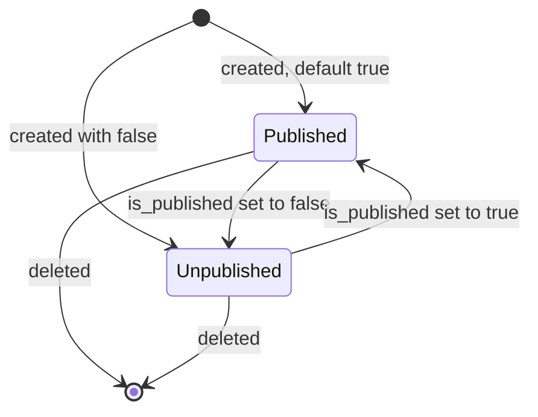
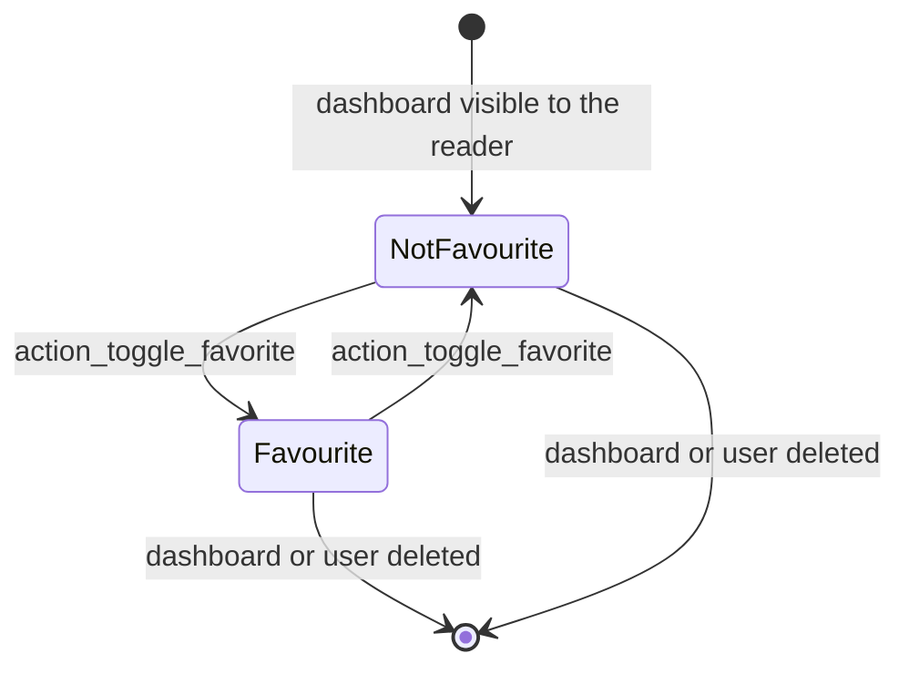
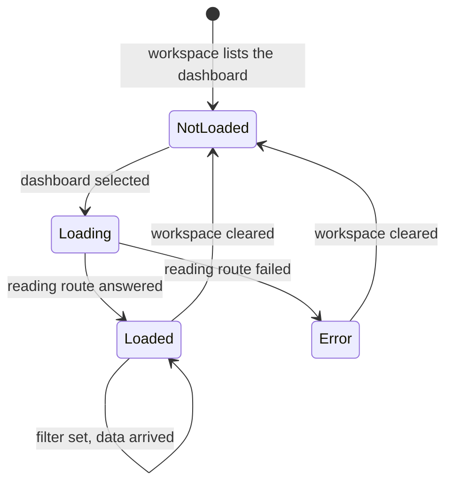
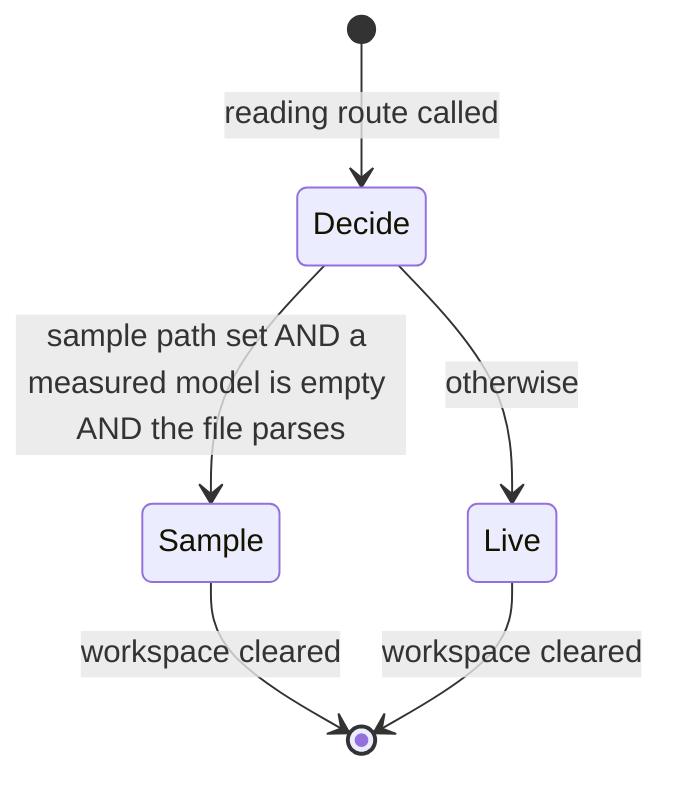
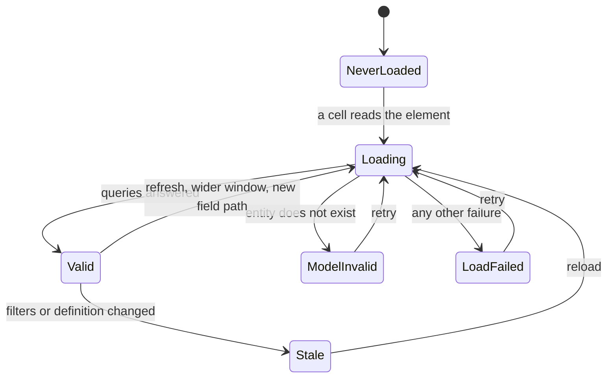
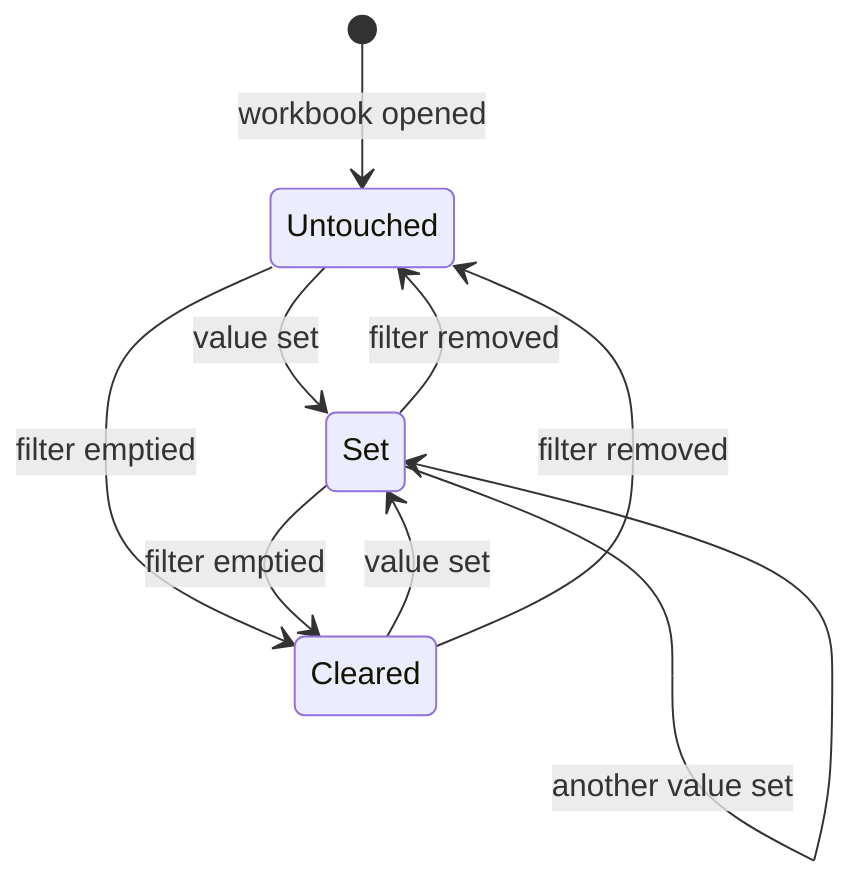
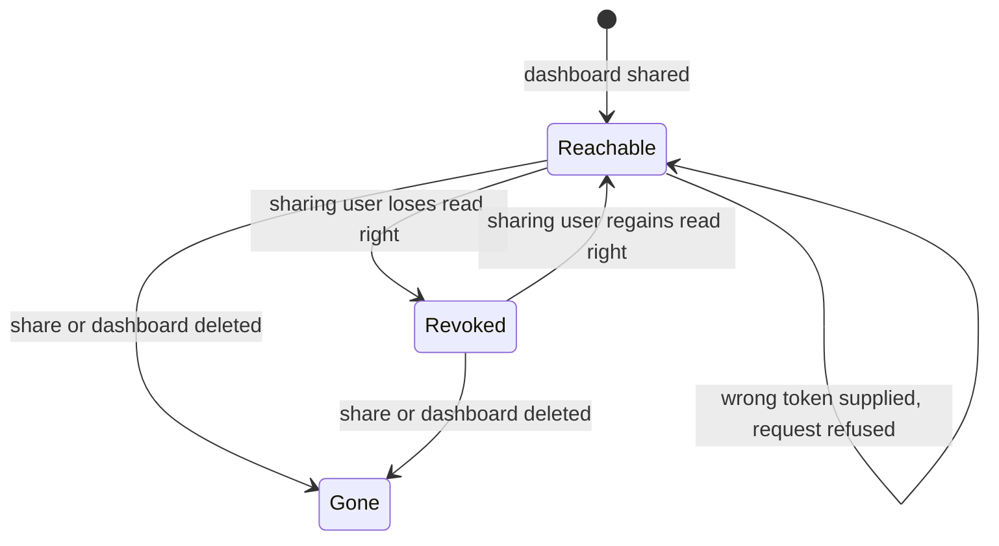

# State machines

The domain has seven state machines. Two of them are stored on records; the other five govern a reading session and exist only while a dashboard is open, but they are as prescriptive as the stored ones because what a reader sees depends entirely on them.

| Machine | What it describes | Where the state lives |
|---|---|---|
| §2 Publication | Whether a dashboard is offered in the workspace | `is_published` on Spreadsheet Dashboard |
| §3 Favourite mark | Whether one reader has starred one dashboard | membership of `favorite_user_ids` |
| §4 Dashboard rendering status | How far the client has got in loading one dashboard | the reading session |
| §5 Presentation mode | Whether the reader sees the real workbook or a sample | the reading session |
| §6 Data-source status | Whether one list, pivot or chart has usable data | the reading session |
| §7 Filter value state | Whether a filter is showing its default, a set value, or nothing | the reading session |
| §8 Share reachability | Whether a handed-out address still resolves | the Dashboard Share record and the sharing user's rights |

## 2. Publication of a dashboard

### 2.1 States

| Stored value | Label | Meaning |
|---|---|---|
| true | Published | The dashboard appears in its group in the workspace sidebar, and in the group's published sub-list |
| false | Unpublished | The dashboard exists, is configurable, is readable through its reading route, but is not listed anywhere in the workspace |

The field is not required and its stored default is true, so a dashboard created without an explicit value is published.

### 2.2 Transitions

| From | To | Trigger | Guards | Records created or changed |
|---|---|---|---|---|
| — | Published | Creation of a dashboard without a value for `is_published` | The creating user holds the dashboard administrator group | The dashboard record; it enters the group's published sub-list |
| — | Published or Unpublished | Creation with an explicit value | The creating user holds the dashboard administrator group | The dashboard record |
| Published | Unpublished | Setting `is_published` to false, from the configuration list or the toggle in that list | Write right on the dashboard, which only the dashboard administrator group has | The dashboard record; it leaves the group's published sub-list at once |
| Unpublished | Published | Setting `is_published` to true | Same | The dashboard record; it re-enters the published sub-list |
| Published or Unpublished | — | Deleting the dashboard | Delete right on the dashboard | The dashboard record, its shares by cascade, and its workbook attachment |

There is no automatic transition: nothing unpublishes a dashboard on its own.

### 2.3 Effects of being unpublished

1. The group's published sub-list no longer contains it, so a group all of whose dashboards are unpublished disappears from the sidebar entirely — the workspace only lists groups whose published sub-list is non-empty.
2. The reading route still serves it to anyone whose groups and companies allow it. Publication is a listing decision, not an access decision.
3. An existing share of it keeps working, because a share holds a frozen copy and re-checks only the sharing user's read right.

### 2.4 Diagram

## 3. The favourite mark

### 3.1 States

The state belongs to a pair: one dashboard and one reader. It is stored as membership of the dashboard's `favorite_user_ids` list.

| State | Stored form | Meaning |
|---|---|---|
| Not favourite | the reader's user identifier is absent from `favorite_user_ids` | The computed `is_favorite` reads false for this reader; the star in the control panel is hollow |
| Favourite | the reader's user identifier is present | `is_favorite` reads true for this reader; the star is filled; the dashboard also appears in a "FAVORITES" section placed above every group in the sidebar |

### 3.2 Transitions

| From | To | Trigger | Guards | Records created or changed |
|---|---|---|---|---|
| Not favourite | Favourite | The reader activates `action_toggle_favorite` on exactly one dashboard | The reader can read the dashboard; exactly one record is addressed | One row added to the association table `res_users_spreadsheet_dashboard_rel`; the write is performed with elevated rights |
| Favourite | Not favourite | The same operation | Same | That row removed, again with elevated rights |
| Favourite | Not favourite | The dashboard is deleted | — | The row disappears by cascade |
| Favourite | Not favourite | The user is deleted | — | The row disappears by cascade |

**Why elevated rights.** An ordinary reader has read-only access to a dashboard. Starring is nevertheless a write on the dashboard's association table. The operation therefore raises its rights for that one write, after having established that the reader may read the record. Its scope is exactly one row naming the acting reader, so the elevation cannot be used to change anything else.

### 3.3 Diagram

## 4. Dashboard rendering status

### 4.1 States

Each dashboard known to the workspace carries one status. The four values are reproduced exactly, because a client that restores a session from saved state reads them back.

| Stored value | Label | Meaning |
|---|---|---|
| `NotLoaded` | Not loaded | The workspace knows the dashboard's identifier and name but has never fetched its workbook |
| `Loading` | Loading | The fetch is in flight; the reader sees the text "Loading..." |
| `Loaded` | Loaded | The workbook has been fetched and a workbook model has been built from it; the grid is rendered |
| `Error` | Error | The fetch failed; the reader sees the text "An error occured while loading the dashboard" |

The message text is reproduced as the reader sees it, including its spelling.

### 4.2 Transitions

| From | To | Trigger | Guards | What happens |
|---|---|---|---|---|
| — | `NotLoaded` | The workspace loads the list of groups and their published dashboards | The reader may read the group and the dashboard | One entry per dashboard, holding its identifier, name and favourite mark |
| `NotLoaded` | `Loading` | The dashboard is asked for — because it was selected, or because it is the initial one | — | A request to the reading route is issued |
| `Loading` | `Loaded` | The reading route answers | The answer parses | The workbook model is built, the translation namespace is kept, the sample mark is kept, the first sheet is activated |
| `Loading` | `Error` | The reading route fails or the answer does not parse | — | The failure is kept on the entry and re-raised to the caller |
| `Loaded` | `NotLoaded` | The workspace is cleared, which happens whenever the client switches to another action | — | Every entry and every group is discarded |
| `Error` | `Loading` | The dashboard is asked for again after the workspace has been cleared and reloaded | — | As above |
| `Loaded` | `Loaded` | The reader sets a filter value, or data arrives for a data source | — | Cells are re-evaluated; the status does not change |

A dashboard that was never asked for stays at `NotLoaded` indefinitely; the workspace fetches lazily, one dashboard at a time.

### 4.3 Restoring a session

When the client returns to the workspace from another action it may carry a saved state holding the groups, the entries and the identifier of the dashboard that was open. Restoring adopts that state wholesale, including each entry's status and its already-built workbook model, so a reader who steps into a record and back does not pay for a second fetch.

### 4.4 Diagram

## 5. Presentation mode: sample or live

### 5.1 States

| State | Marker in the answer | Meaning |
|---|---|---|
| Live | the answer carries `snapshot`, `revisions`, `default_currency` and `translation_namespace` | The reader sees the dashboard's own workbook, evaluated against real records |
| Sample | the answer carries `snapshot` and `is_sample` set to true | The reader sees a demonstration workbook shipped with the dashboard; the workspace hides the search bar, the share control, the favourite star and the mobile dashboard picker, and marks the grid as a sample |

The state is decided once, by the reading route, at the moment the dashboard is fetched. It never changes during a reading session.

### 5.2 The decision

The route serves the sample only when **all three** conditions hold:

1. The dashboard carries a `sample_dashboard_file_path`.
2. The dashboard is *empty* — at least one of its `main_data_model_ids` holds no record at all. The count is taken with the reader's own rights when the reader may read that model, and with elevated rights when the reader may not, so that a reader lacking access to one measured model is not shown a sample for that reason alone. A dashboard with no measured models is never empty.
3. The file named by the path exists and parses.

Failing any one of them, the live answer is produced.

### 5.3 Transitions

| From | To | Trigger | Guards |
|---|---|---|---|
| — | Sample | The dashboard is fetched | All three conditions of §5.2 |
| — | Live | The dashboard is fetched | Any condition of §5.2 fails |
| Sample | Live | The dashboard is fetched again after the first record of every measured model has been created | The workspace must have been cleared, because the entry caches the built model |
| Live | Sample | The dashboard is fetched again after every measured model has been emptied | Same |

### 5.4 Diagram

## 6. Data-source status

### 6.1 What a data source is

Every data-bound element of a workbook — each list, each data-bound pivot, each data-bound chart — is backed by one data source, which owns the queries for that element and caches their answers. A cell that reads an element reads its data source, and the status of that data source is what the cell shows.

### 6.2 States

| State | Internal markers | What a cell reading this element shows |
|---|---|---|
| Never loaded | no load has been started | the loading marker, and a load is started |
| Loading | a load is in flight | the loading marker |
| Valid | the load finished and the answer was usable | the value |
| Model invalid | the load failed because the element's entity does not exist | the message of rule [SD-034](business-rules.md#sd-034) |
| Load failed | the load failed for any other reason | the failure's own message |
| Stale | the element's definition or its filter conditions changed | the loading marker, and a reload is started |

The loading marker is the reserved error value "Loading...". It is an error value by construction, so that a workbook in which any cell is still loading can be recognised by looking for it — which is exactly what the freeze algorithm does before it takes a snapshot.

### 6.3 Transitions

| From | To | Trigger | Guards | What happens |
|---|---|---|---|---|
| Never loaded | Loading | Any cell reads the element | — | The metadata of the entity are fetched, then the records |
| Loading | Valid | The queries answer | — | The answer is cached, the last-update moment is recorded, and every cell is re-evaluated |
| Loading | Model invalid | The entity named by the element does not exist | — | The failure message names the entity |
| Loading | Load failed | Any other failure | — | The failure message is the one the failing call produced |
| Valid | Stale | A filter is added, edited, removed or given a value; or the element's own definition or record selection is changed | — | The new conditions are combined with the element's own and handed to the data source |
| Stale | Loading | The source is reloaded | The source has been loaded at least once; a source that never loaded does not reload on a condition change | Any in-flight load is abandoned first |
| Valid | Loading | The reader asks for a refresh of all data | — | Every data source of the workbook reloads |
| Valid | Loading | A list cell asks for a row beyond the window fetched so far, or a field path not yet fetched | — | The window is widened, or the path is added, and a reload is scheduled for the next cycle |
| Load failed or Model invalid | Loading | A refresh, or a definition change that triggers a reload | — | The markers are reset before the attempt |

### 6.4 Growth of a list's window

A list fetches only as many rows as its cells ask for. Each cell reading position *n* raises the source's high-water mark to *n*. A read beyond what was fetched returns the loading marker, raises the mark, and schedules exactly one reload for the next cycle however many cells asked. A source whose high-water mark is zero fetches no records at all.

### 6.5 Diagram

## 7. Filter value state

### 7.1 States

The state belongs to a pair: one filter and one reading session.

| State | Internal form | Which value applies |
|---|---|---|
| Untouched | the session holds no entry for this filter | the filter's default, resolved by [`global-filters.md`](global-filters.md) §4.1; nothing when there is no default |
| Set | the session holds a value and the prevent-default mark is off | that value |
| Cleared | the session holds no value and the prevent-default mark is on | nothing, even when the filter has a default |

### 7.2 Transitions

| From | To | Trigger | Guards | What happens |
|---|---|---|---|---|
| Untouched | Set | The reader sets a value | The value matches the filter's kind and operator; the value differs from the one currently resolved | Every element matched to this filter becomes stale |
| Set | Set | The reader sets a different value | Same | Same |
| Set | Cleared | The reader empties the filter | — | Same |
| Untouched | Cleared | The reader empties a filter that was showing its default | — | Same |
| Cleared | Set | The reader sets a value | Same as above | Same |
| any | Untouched | The filter is removed from the workbook | — | The session entry is discarded |
| any | Untouched | The workbook is reloaded | — | The session is new, so nothing is remembered |

A value identical to the one currently resolved is refused with the marker `NoChanges`, so that setting a filter to what it already shows does not reload anything.

### 7.3 Diagram

## 8. Share reachability

### 8.1 States

A Dashboard Share has no state field. Its *reachability* is nevertheless a state, because the same address behaves differently over time, and the transitions are the point of the design.

| State | Condition | What a reader with the address gets |
|---|---|---|
| Reachable | the record exists, the supplied token equals the stored one, and the sharing user may still read the dashboard | the frozen page, the frozen data, and — when the reader may export — the workbook file |
| Token mismatch | the record exists but the supplied token differs, or no token was supplied | refusal, with rule [SD-011](business-rules.md#sd-011) |
| Revoked | the record exists and the token matches, but the sharing user may no longer read the dashboard | the same refusal |
| Gone | the record no longer exists | not found |

### 8.2 Transitions

| From | To | Trigger | Guards | Records created or changed |
|---|---|---|---|---|
| — | Reachable | A reader shares a dashboard | The sharing user may read the dashboard and may create shares | One Dashboard Share, holding the frozen workbook, a fresh token and, when supplied, the packaged workbook file |
| Reachable | Revoked | The sharing user is removed from every access group in the dashboard's audience, or loses the company that the dashboard is restricted to, or the dashboard's audience is narrowed | — | No record changes; the check simply stops passing |
| Revoked | Reachable | The sharing user regains the right | — | No record changes |
| Reachable | Gone | The dashboard is deleted | — | The share is deleted by cascade |
| Reachable | Gone | The share is deleted by its creator | The acting user created it | The share record |
| Reachable | Token mismatch for one caller | A wrong token is supplied | — | Nothing |

Revocation is deliberately a property of the *sharing user*, not of the reader: the person who handed the address out is the person whose rights the address borrows, so withdrawing their access withdraws every address they created.

### 8.3 Diagram

