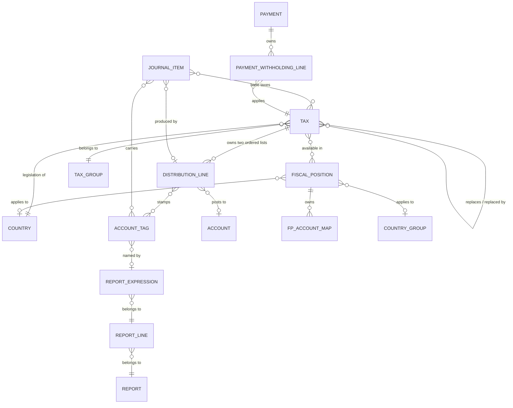

# Taxes — Entities

This document specifies every entity owned by the tax domain, plus the tax-related fields that
this domain adds to entities owned by other domains. For each entity you get: purpose, lifecycle,
the complete field table, relations, uniqueness rules, defaults, computed fields with their exact
rules, ordering, display-name rule, archival behavior and multi-company behavior.

Conventions used in every table:

- **Field (storage name)** gives the human name and, in code font, the exact storage name that
  external contracts depend on.
- **Type** is the logical type: text, translated text, rich text, boolean, integer, decimal,
  monetary, date, selection, link to one record (many-to-one), link to many records
  (many-to-many), collection of child records (one-to-many), binary, structured document
  (JavaScript Object Notation, hereafter "structured document").
- **Meaning and rules** states: required or optional, default value, whether it is computed and
  from what, whether the computed value is stored, whether it can still be written by the user
  after being computed, whether it is read-only, whether it is copied when the record is
  duplicated, whether changes are recorded in the record's message history ("tracked"), whether
  it is scoped to a company, whether it is indexed, and the behavior when the pointed record is
  deleted.

Unless a field says otherwise: it is optional, not computed, not tracked, copied on duplication,
and not indexed.

---

## 1. Tax (`account.tax`, table `account_tax`)

### 1.1 Purpose

A Tax record is the complete definition of one tax: how much it is, how it is computed from a
price, whether the price already contains it, in which documents it can be selected, when it
becomes due to the authorities, how its computed amount is split over accounts and report tags,
and which country's legislation it belongs to. The tax engine (see `calculations.md`) reads only
Tax records and their Distribution Lines; it never reads the documents directly.

### 1.2 Lifecycle

1. **Created** — manually by an accounting administrator, or in bulk when a chart of accounts
   template is loaded for a company, or by the "create foreign taxes" action of a Fiscal Position
   that carries a foreign tax registration number.
2. **In use** — as soon as at least one Journal Item references it (as a base tax or through a
   Distribution Line) or at least one Reconciliation Model Line references it. From that moment
   the computed flag "tax used" (`is_used`) is true.
3. **Archived** — the `active` flag is set to false. The tax disappears from selection lists but
   all historical Journal Items keep pointing at it and all reports keep working.
4. **Deleted** — only allowed while "tax used" is false. Attempting to delete a used tax raises:
   *"You cannot delete taxes that are currently in use. Consider archiving them instead."*

There is no state field on a Tax; the only lifecycle switch is the `active` flag.

### 1.3 Field table

| Field (storage name) | Type | Meaning and rules |
|---|---|---|
| Tax Name (`name`) | translated text | Required. Tracked. The name shown everywhere the tax is selected. Subject to the uniqueness rule of section 1.5. When a tax is duplicated the copy is named *"<original name> (copy)"* unless a name is supplied explicitly. |
| Tax Type (`type_tax_use`) | selection | Required. Default `sale`. Tracked. Values: `sale` (label "Sales"), `purchase` (label "Purchases"), `none` (label "None"). Determines where the tax can be picked: a `sale` tax is offered on customer documents, a `purchase` tax on vendor documents, a `none` tax cannot be used on its own but may be a child of a Group of Taxes. |
| Tax Scope (`tax_scope`) | selection | Optional (empty means "any"). Values: `service` (label "Services"), `consu` (label "Goods"). Restricts the tax to product lines whose product is of that kind. Participates in the uniqueness rule. |
| Tax Computation (`amount_type`) | selection | Required. Default `percent`. Tracked. Values: `group` ("Group of Taxes"), `fixed` ("Fixed"), `percent` ("Percentage"), `division` ("Percentage Tax Included"). When the Custom Formula Taxes capability is installed a fifth value `code` ("Custom Formula") exists; uninstalling that capability rewrites every `code` tax to `percent` and archives it. The exact arithmetic of each value is in `calculations.md` section 4. |
| Amount (`amount`) | decimal, 4 decimal places on a 16-digit number | Required. Default 0. Tracked. Interpretation depends on `amount_type`: for `percent` and `division` it is a percentage (21 means twenty-one percent); for `fixed` it is a monetary amount per unit of quantity; it is ignored for `group` and for `code`. A negative amount is legal and is what makes a withholding tax. |
| Active (`active`) | boolean | Default true. False hides the tax from selection lists without deleting it. |
| Company (`company_id`) | link to one Company | Required, read-only after creation, default the acting company. A tax belongs to exactly one company. Taxes of a parent company are visible to its branches (the company check walks the parent chain). Changing the company is refused once Journal Items reference the tax (see `business-rules.md`). |
| Sequence (`sequence`) | integer | Required. Default 1. The evaluation order of taxes on a line. Lower first. Ties are broken by the record identifier. Also the default ordering of the entity. |
| Children Taxes (`children_tax_ids`) | link to many Taxes | Only meaningful when `amount_type` is `group`. The set of taxes the group expands to. Same-company check applies. A child may not itself be a group. A child's `type_tax_use` must be `none` or equal to the parent's; a child's `tax_scope` must be empty or equal to the parent's. Cycles are refused. |
| Description (`description`) | rich text, translated | Free description. When a plain string without markup is written the system wraps it in a block element so that no extra paragraph padding appears. |
| Label on Invoices (`invoice_label`) | translated text | The short label printed next to the tax on documents. When the user sets a non-zero amount on a `percent` or `division` tax and no label exists yet, the label is proposed as the amount formatted with four significant digits followed by a percent sign (for example an amount of 21 proposes `21%`). |
| Tax Label (`tax_label`) | text, computed, not stored | Computed from `invoice_label` and `name`: it is the invoice label when set, otherwise the name. For a withholding tax it is the invoice label only, never falling back to the name, so that a withholding tax can be hidden from printed documents by leaving the label empty. |
| Included in Price override (`price_include_override`) | selection | Optional. Values: `tax_included` ("Tax Included"), `tax_excluded` ("Tax Excluded"). Tracked. Empty means "follow the company default". |
| Company default price inclusion (`company_price_include`) | selection, related to the company | Read-only mirror of the company's default (`account_price_include`). |
| Price Include (`price_include`) | boolean, computed, not stored, searchable | True when `price_include_override` is `tax_included`, or when it is empty and the company default is `tax_included`. Searching on it translates into: override equals the wanted value, or override empty and company default equals the wanted value. |
| Affect Base of Subsequent Taxes (`include_base_amount`) | boolean | Default false. Tracked. When true, the amount of this tax is added to the base of every later tax that accepts it. Setting `price_include` on the form proposes to switch this flag on. |
| Base Affected by Previous Taxes (`is_base_affected`) | boolean | Default true. Tracked. When false, this tax ignores the amounts added by earlier taxes that affect the base. |
| Include in Analytic Cost (`analytic`) | boolean | Default false. When true the tax Journal Item inherits the analytic distribution of the base line. See section 1.7 for the exact rule, which also involves the distribution line's "use in tax closing" flag. |
| Tax Group (`tax_group_id`) | link to one Tax Group | Required. Computed from company and country, stored, still writable, computed before saving. The computation picks the first Tax Group of the same company whose country equals the tax's country; failing that, the first Tax Group of the same company with no country. The selection list is restricted to groups whose country is the tax's country or empty. |
| Hide Cash Basis Option (`hide_tax_exigibility`) | boolean, related to the company, read-only | Mirrors the company's "use cash basis" switch; used only to hide the exigibility field when the company does not use cash basis. |
| Tax Exigibility (`tax_exigibility`) | selection | Required in effect (default `on_invoice`). Values: `on_invoice` ("Based on Invoice") — the tax is due as soon as the document is posted; `on_payment` ("Based on Payment") — the tax is due only when the document is paid, which triggers the cash basis entries of `accounting-effects.md` section 6. |
| Cash Basis Transition Account (`cash_basis_transition_account_id`) | link to one Account | Holds the tax amount between posting and payment for a tax whose exigibility is `on_payment`. Same-company check. The account may not be of the receivable or payable kinds. It must allow reconciliation; otherwise saving raises *"The cash basis transition account needs to allow reconciliation."* (the check is skipped while a chart of accounts template is being loaded). |
| Distribution for Invoices (`invoice_repartition_line_ids`) | collection of Distribution Lines | Computed from the company, stored, still writable. The subset of `repartition_line_ids` whose document kind is `invoice`. When a tax is created with none, two lines are created automatically: one base line and one tax line, both without tags. |
| Distribution for Refund Invoices (`refund_repartition_line_ids`) | collection of Distribution Lines | Same as above for document kind `refund`. |
| Distribution (`repartition_line_ids`) | collection of Distribution Lines | The full set, both kinds. Copied on duplication. |
| Country (`country_id`) | link to one Country | Required. Computed from the company, stored, still writable, computed before saving: the company's fiscal country if set, otherwise the company's country, otherwise the value already present. Identifies the legislation the tax belongs to and restricts which report tags may be attached to its distribution lines. |
| Country Code (`country_code`) | text, related to the country, read-only | The two-letter code of `country_id`. |
| Fiscal Country Code of the Company (`company_country_code`) | text, related, read-only | The two-letter code of the company's fiscal country. |
| Tax used (`is_used`) | boolean, computed, not stored | True when the tax is referenced by at least one Journal Item (either through `account_move_line_ids` or as the originator of a tax line) or by at least one Reconciliation Model Line. Gates deletion and gates the detailed logging of distribution changes. |
| Distribution Lines snapshot (`repartition_lines_str`) | text, computed, stored, tracked | A serialized snapshot of the distribution: for each distribution line, in the order (document kind, sequence), a renumbered index and the four values *factor percent*, *account display name or "None"*, *list of tax grid names or "None"*, *use in tax closing as "True"/"False"*. Recomputed whenever any of those four values, or the set of lines, changes, but only while the tax is used. The snapshot exists solely so that changes to the distribution can be shown in the message history as a readable difference; the raw snapshot itself is removed from the tracked values before logging. |
| Legal Notes (`invoice_legal_notes`) | rich text, translated | Legal mentions that must be printed on documents carrying this tax. |
| Has negative factor (`has_negative_factor`) | boolean, computed, not stored | True when at least one **invoice** distribution line of kind `tax` has a negative factor. This is what marks a tax as a reverse-charge tax (typically a distribution of plus one hundred percent and minus one hundred percent) and makes the engine emit two tax entries instead of one. |
| Journal Items (`account_move_line_ids`) | link to many Journal Items | Reverse of the base-tax link on Journal Items. Read-only, not copied. |
| Reconciliation Model Lines (`account_reconcile_model_line_ids`) | link to many Reconciliation Model Lines | Read-only, not copied. |
| Fiscal Positions (`fiscal_position_ids`) | link to many Fiscal Positions | The fiscal positions in which this tax is one of the allowed taxes. Stored in the join table `account_fiscal_position_account_tax_rel`. |
| Replaces (`original_tax_ids`) | link to many Taxes | The domestic taxes that this tax replaces when one of its fiscal positions applies. Stored in the join table `account_tax_alternatives` with this record in the column `dest_tax_id` and the replaced tax in `src_tax_id`. Deleting either side removes the link. The selection list is restricted to taxes with the same tax type that are marked domestic. |
| Replaced by (`replacing_tax_ids`) | link to many Taxes, read-only | The mirror of "Replaces": the taxes that name this one as a tax they replace. |
| Show alternative taxes (`display_alternative_taxes_field`) | boolean, computed, not stored | True when the tax replaces at least one other tax, or when it is attached to at least one fiscal position other than the company's domestic fiscal position. Used only to decide whether the "Replaces" field is visible. |
| Is domestic (`is_domestic`) | boolean, computed, stored, computed before saving | True when the tax is attached to no fiscal position at all, or when the company's domestic fiscal position is among its fiscal positions. |
| Withhold On Payment (`is_withholding_tax_on_payment`) | boolean | Added by the withholding capability. Default false. When true the tax is excluded from every ordinary document computation and is instead applied when a payment is registered. Switching it on forces exigibility back to `on_invoice` and forces the price-inclusion override to `tax_excluded`. Setting the amount to zero or above clears the flag. Refused for `group` and `division` computations (see `business-rules.md`). |
| Withholding Sequence (`withholding_sequence_id`) | link to one Sequence | Added by the withholding capability. Not copied. Same-company check. Used to number the withholding lines produced from this tax. |
| Formula (`formula`) | long text | Added by the Custom Formula Taxes capability. Default `price_unit * 0.10`. Evaluated for taxes whose computation is `code`. Grammar and evaluation rules are in `calculations.md` section 4.6. |
| Decoded formula (`formula_decoded_info`) | structured document, computed, not stored | Added by the Custom Formula Taxes capability. Empty unless the computation is `code`. Contains the normalized formula text (twice, once for each evaluation side), the list of product field names the formula reads and the list of unit-of-measure field names the formula reads. |

### 1.4 Ordering and display name

- Default record ordering: by `sequence` ascending, then by identifier ascending.
- Free-text search matches the name, the description or the invoice label.
- Display name: the name, then optional suffixes in this order, each wrapped in parentheses
  (or in a two-dash marker when the caller asked for a formatted display name):
  1. the tax type label, when the caller asked for the tax type to be appended;
  2. the company display name, when the caller asked for the company to be appended **and** more
     than one company is active;
  3. the tax scope label, only in the formatted-display-name mode;
  4. the country code, whenever the tax's country differs from the fiscal country of the first
     accessible branch of the tax's company.

### 1.5 Uniqueness

Two taxes of the same company family may not share the quadruple (name, tax type, tax scope,
country) unless their tax type is `none`. The check is executed in batches of one hundred records
and searches across the whole company tree rooted at the tax's root company. On violation the
message is:

```
Tax names must be unique!
- <tax name> in <company name>
```

with one dash line per duplicate found.

### 1.6 Free-text search grammar for taxes

Searching taxes by name with a "contains" operator rewrites the search text before it reaches the
database, so that a compact code finds a verbose tax name:

1. Split the text on double-quoted runs, keeping the quoted runs.
2. In a quoted run: remove the quotes, replace every percent sign by an underscore, and wrap the
   result in percent signs. (A percent sign is the database wildcard for "any run of characters";
   an underscore is the wildcard for "exactly one character".)
3. In an unquoted run: remove every character that is not a letter, a digit or an underscore, then
   insert a percent sign between every two remaining characters.
4. Concatenate the transformed runs.

Worked examples: `0EUM` becomes `0%E%U%M`; `21M` becomes `2%1%M`; `21" M"` becomes `2%1% M%`;
`21" M"co` becomes `2%1% M%c%o%`.

### 1.7 Analytic behavior of the tax line

The analytic distribution written on the tax Journal Item produced by a distribution line is:

```formula
analytic_distribution_of_tax_line =
    analytic_distribution_of_base_line          if tax.analytic or not distribution_line.use_in_tax_closing
    empty                                       otherwise
```

### 1.8 Multi-company behavior

- A tax belongs to one company and is visible to that company and its branches.
- The same tax may not be used by Journal Items of a company outside its own company tree.
- When several taxes with the same meaning exist in a company tree, the helper that filters taxes
  by company walks up from the requested company to its parents and returns the first non-empty
  match, so a branch that defines its own taxes shadows the parent's.

---

## 2. Tax Distribution Line (`account.tax.repartition.line`, table `account_tax_repartition_line`)

### 2.1 Purpose

A Distribution Line says what to do with one share of a computed tax. Every tax owns two ordered
lists of them: one used when the document is an invoice or a bill, one used when the document is a
credit note or a refund. Each list contains exactly one line of kind "base" — which carries the
report tags to stamp on the **base** Journal Item — and one or more lines of kind "tax" — each of
which carries a factor, an account and report tags, and each of which produces one tax Journal
Item.

### 2.2 Field table

| Field (storage name) | Type | Meaning and rules |
|---|---|---|
| Percentage (`factor_percent`) | decimal, 12 decimal places on a 16-digit number | Required. Default 100. The share of the tax amount allocated to this line, in percent. Negative values are allowed and create the reverse-charge behavior. |
| Factor Ratio (`factor`) | decimal, computed, not stored | Equals `factor_percent ÷ 100`. |
| Based On (`repartition_type`) | selection | Required. Default `tax`. Values: `base` ("Base"), `tax` ("of tax"). A `base` line does not create a Journal Item; it only supplies the tags of the base Journal Item. |
| Related to (`document_type`) | selection | Required. Values: `invoice` ("Invoice"), `refund` ("Refund"). |
| Account (`account_id`) | link to one Account | The account on which the tax amount is posted. Same-company check. May not be of the receivable, payable or off-balance kinds. Cleared automatically when the line kind is switched to `base`. When empty the tax amount is posted on the **base line's own account**. |
| Tax Grids (`tag_ids`) | link to many Account Tags | The report tags stamped on the produced Journal Item (for a `tax` line) or on the base Journal Item (for a `base` line). Only tags whose applicability is `taxes` may be chosen. Copied on duplication. A tag that is still referenced here cannot be deleted. |
| Tax (`tax_id`) | link to one Tax | The owning tax. Indexed when not empty. Deleting the tax deletes its distribution lines. Same-company check. |
| Company (`company_id`) | link to one Company, related to the tax, stored | The company of the owning tax. |
| Sequence (`sequence`) | integer | Default 1. The display and matching order. For refunds to behave correctly the invoice list and the refund list must be arranged in the same order. |
| Tax Closing Entry (`use_in_tax_closing`) | boolean | Computed, stored, still writable, computed before saving. The computed value is true when the line kind is `tax` **and** an account is set **and** that account's internal group is neither income nor expense. Marks the line as participating in the periodic tax settlement. Also drives the analytic rule of section 1.7. |
| Tag domain (`tag_ids_domain`) | binary, computed, not stored | The dynamic restriction offered in the user interface for `tag_ids`: applicability `taxes` and country among (empty, the company's fiscal country, each country in which the company holds a foreign tax registration). |

### 2.3 Ordering

By document kind, then by line kind, then by sequence, then by identifier. Because the selection
values sort alphabetically, `invoice` sorts before `refund` and `base` sorts before `tax`.

### 2.4 Structural rules (enforced on the owning tax)

These are validated whenever the invoice list, the refund list or the full list changes. A Group
of Taxes with no distribution lines at all is exempt from all of them.

1. Each of the two lists must contain **exactly one** line of kind `base`. Otherwise:
   *"Invoice and credit note distribution should each contain exactly one line for the base."*
2. The two lists must have the **same number of lines**. Otherwise:
   *"Invoice and credit note distribution should have the same number of lines."*
3. Each list must contain **at least one** line of kind `tax`. Otherwise:
   *"Invoice and credit note repartition should have at least one tax repartition line."*
4. Walking both lists in parallel in their sorted order, the line at each index must have the same
   kind and the same percentage in both lists. Otherwise:
   *"Invoice and credit note distribution should match (same percentages, in the same order)."*
5. The sum of the **positive** factors of the invoice `tax` lines must equal one, compared to two
   decimal places. Otherwise:
   *"Invoice and credit note distribution should have a total factor (+) equals to 100."*
6. If any **negative** factor exists among the invoice `tax` lines, the sum of the negative factors
   must equal minus one, compared to two decimal places. Otherwise:
   *"Invoice and credit note distribution should have a total factor (-) equals to 100."*

### 2.5 Target account of a produced tax Journal Item

```
account_of_tax_journal_item =
    tax.cash_basis_transition_account_id
        when tax.tax_exigibility = 'on_payment'
        and the caller did not force cash-basis exigibility
        and the caller did not ask to bypass the transition account
    distribution_line.account_id
        otherwise
and, if that result is empty, the account of the base line itself
```

---

## 3. Tax Group (`account.tax.group`, table `account_tax_group`)

### 3.1 Purpose

A Tax Group aggregates taxes for presentation (the totals block of a printed or displayed document
shows one line per tax group) and for settlement (the accounts used by the periodic tax settlement
entry are held here).

### 3.2 Field table

| Field (storage name) | Type | Meaning and rules |
|---|---|---|
| Name (`name`) | translated text | Required. |
| Sequence (`sequence`) | integer | Default 10. Drives the order of the groups in the totals block. |
| Company (`company_id`) | link to one Company | Required. Default the acting company. |
| Tax Payable Account (`tax_payable_account_id`) | link to one Account | Same-company check. The current-tax account used as the counterpart of the settlement entry when the balance is owed to the authorities. |
| Tax Receivable Account (`tax_receivable_account_id`) | link to one Account | Same-company check. The counterpart when the balance is owed by the authorities to the company. |
| Tax Advance Account (`advance_tax_payment_account_id`) | link to one Account | Same-company check. Advance payments posted on this account are taken into account by the settlement entry. |
| Country (`country_id`) | link to one Country | Computed from the company, stored, still writable, computed before saving: the company's fiscal country if set, otherwise the company's country. |
| Country Code (`country_code`) | text, related, read-only | The two-letter code of the group's country. |
| Preceding Subtotal (`preceding_subtotal`) | translated text | When set, the totals block shows a subtotal carrying this label **before** this group, and the group's own taxes are shown under that subtotal. When empty the group is shown under the standard "Untaxed Amount" subtotal. |
| Receipt label (`pos_receipt_label`) | text | A short label for the group on point-of-sale receipts. Exposed in the totals summary as the group label. |

### 3.3 Ordering and consistency

- Default record ordering: sequence ascending, then identifier.
- A tax whose group has a non-empty country must have that same country; otherwise saving the tax
  raises *"The tax group must have the same country_id as the tax using it."*

---

## 4. Fiscal Position (`account.fiscal.position`, table `account_fiscal_position`)

### 4.1 Purpose

A Fiscal Position is a rule set that substitutes taxes and accounts on a document according to who
the counterpart is and where the goods or services are delivered. It also carries the company's
foreign tax registration number for a territory, which turns the company into a taxable person in
that territory and unlocks that territory's taxes and reports.

### 4.2 Field table

| Field (storage name) | Type | Meaning and rules |
|---|---|---|
| Sequence (`sequence`) | integer | Drives the ordering of the entity and the precedence during automatic detection. |
| Fiscal Position (`name`) | translated text | Required. |
| Active (`active`) | boolean | Default true. |
| Company (`company_id`) | link to one Company | Required, read-only after creation, indexed, default the acting company. |
| Account Mapping (`account_ids`) | collection of Fiscal Position Account Mappings | Copied on duplication. |
| Account map (`account_map`) | binary, computed, not stored | A lookup table from source account identifier to destination account identifier, built from the mapping lines. |
| Taxes (`tax_ids`) | link to many Taxes | The taxes that belong to this fiscal position. Stored in the join table `account_fiscal_position_account_tax_rel`. |
| Tax map (`tax_map`) | binary, computed, not stored | A lookup table from *replaced tax identifier* to the **list** of replacing tax identifiers. Built by walking every tax of `tax_ids` and, for each tax it declares as replaced, appending itself under that key. One replaced tax may therefore map to several replacing taxes. |
| Notes (`note`) | rich text, translated | Legal mentions to be printed on documents that use this fiscal position. |
| Detect Automatically (`auto_apply`) | boolean | When true the fiscal position takes part in automatic detection. |
| Tax registration required (`vat_required`) | boolean | When true the fiscal position only applies to a counterpart that has a valid tax registration number. |
| Company Country (`company_country_id`) | link to one Country, related, read-only | The company's fiscal country. |
| Company Fiscal Country Code (`fiscal_country_codes`) | text, related, read-only | Its two-letter code. |
| Country (`country_id`) | link to one Country | Applies only when the delivery country matches. Writing it re-runs the foreign registration number check. |
| Is domestic (`is_domestic`) | boolean, computed, stored | True when this record **is** the company's domestic fiscal position (see section 4.6). |
| Country Group (`country_group_id`) | link to one Country Group | Applies only when the delivery country is a member of the group. Writing it re-runs the foreign registration number check. |
| Federal States (`state_ids`) | link to many Country States | Applies only when the delivery state is one of these. |
| Zip Range From (`zip_from`) | text | Lower bound of the postal-code range. |
| Zip Range To (`zip_to`) | text | Upper bound of the postal-code range. |
| States count (`states_count`) | integer, computed, not stored | Number of states of the selected country; used only to hide the states field when the country has none. |
| Foreign Tax Identification Number (`foreign_vat`) | text | The company's tax registration number in the territory this fiscal position maps. Writing it normalizes and validates the number against the country's rules (see `calculations.md` section 12). |
| Foreign registration banner mode (`foreign_vat_header_mode`) | selection, computed, not stored | Values: `templates_found` ("Templates Found"), `no_template` ("No Template"), or empty. Empty when there is no foreign number, or no country, or at least one tax already exists for that country. Otherwise the country's chart of accounts template is looked up and the value is `templates_found` when that template's capability is installed, `no_template` otherwise. |

### 4.3 Validations

1. **Postal code range** — both bounds must be set together and the upper bound must not be
   smaller than the lower bound (compared as text). Otherwise:
   *"Invalid \"Zip Range\", You have to configure both \"From\" and \"To\" values for the zip range and \"To\" should be greater than \"From\"."*
2. **Foreign registration number** — when a foreign number is present:
   - a country is mandatory: *"The country of the foreign VAT number could not be detected. Please assign a country to the fiscal position."*
   - if the country equals the company's fiscal country and that country has states, at least one
     state must be selected:
     *"You cannot create a fiscal position with a foreign VAT within your fiscal country without assigning it a state."*
   - if both a country and a country group are set, the country must belong to the group:
     *"You cannot create a fiscal position with a country outside of the selected country group."*
   - no other fiscal position of the same company may already hold a **different** foreign number
     for the same country: *"A fiscal position with a foreign VAT already exists in this country."*

### 4.4 Postal code normalization

When both bounds are written, they are left-padded with zeros to the length of the longer of the
two, but only for a bound that is entirely digits.

```formula
padded_length = max( length(zip_from), length(zip_to) )
zip_from = zip_from padded on the left with "0" up to padded_length, if zip_from is all digits
zip_to   = zip_to   padded on the left with "0" up to padded_length, if zip_to   is all digits
```

Worked example: a range written as 100 to 9000 is stored as 0100 to 9000, so that the text
comparison `0100 ≤ 0575 ≤ 9000` behaves like the numeric one.

### 4.5 Other behavior

- Selecting a country clears the postal code range and the states, and refreshes the states count.
- Selecting a country group clears the postal code range and the states.
- Default record ordering: by sequence.
- The action "related taxes" opens the taxes of the same company that either belong to this fiscal
  position or belong to no fiscal position at all, with archived taxes included.
- The action "create foreign taxes" installs the country's localization capability if needed, then
  instantiates that country's taxes for the company and attaches every created tax to this fiscal
  position.

### 4.6 The company's domestic fiscal position

A company's domestic fiscal position is computed as follows, and stored on the company:

1. Take the company's fiscal positions whose country equals the company's country, **or** whose
   country is empty and whose country group is one of the groups the company's country belongs to.
2. Sort them by country identifier ascending, treating "no country" as the largest value.
3. Then sort them by sequence ascending (this second sort is the dominant one).
4. The first record is the domestic fiscal position; if the list is empty there is none.

---

## 5. Fiscal Position Account Mapping (`account.fiscal.position.account`, table `account_fiscal_position_account`)

| Field (storage name) | Type | Meaning and rules |
|---|---|---|
| Fiscal Position (`position_id`) | link to one Fiscal Position | Required. Deleting the fiscal position deletes the mapping. |
| Company (`company_id`) | link to one Company, related, stored | The fiscal position's company. |
| Account on Product (`account_src_id`) | link to one Account | Required. Same-company check. The account to replace. |
| Account to Use Instead (`account_dest_id`) | link to one Account | Required. Same-company check. The replacement. |

Uniqueness: the triple (fiscal position, source account, destination account) is unique.
Violation message: *"An account fiscal position could be defined only one time on same accounts."*

The record's display name is the fiscal position's name.

---

## 6. Account Tag (`account.account.tag`, table `account_account_tag`)

### 6.1 Purpose

An Account Tag is a label that can be attached to accounts, to tax distribution lines ("tax grids")
or to products. Tags whose applicability is `taxes` are the mechanism by which amounts reach the
lines of a tax return: a report line expression of the tax-tags kind names a tag, and every
Journal Item carrying that tag contributes its balance to that report line.

### 6.2 Field table

| Field (storage name) | Type | Meaning and rules |
|---|---|---|
| Tag Name (`name`) | translated text | Required. |
| Applicability (`applicability`) | selection | Required. Default `accounts`. Values: `accounts` ("Accounts"), `taxes` ("Taxes"), `products` ("Products"). |
| Color Index (`color`) | integer | Presentation only. |
| Active (`active`) | boolean | Default true. |
| Country (`country_id`) | link to one Country | The country for which the tag is available when applied on taxes. |
| Report expression (`report_expression_id`) | link to one Report Expression, computed, not stored | Resolved by matching the tag's English name against the report expressions of the tax-tags kind whose formula equals that name with any leading minus sign removed. |
| Negate balance (`balance_negate`) | boolean, computed, not stored | True when the matched expression's formula starts with a minus sign, meaning the report must show the opposite of the tagged balance. |

Uniqueness: the triple (name, applicability, country) is unique. Violation message:
*"A tag with the same name and applicability already exists in this country."*

### 6.3 Display name

When the acting company holds no foreign tax registration, the display name is the plain name.
Otherwise a tag whose applicability is `taxes` and whose country differs from the company's fiscal
country is displayed as *"<tag name> (<country code>)"*.

### 6.4 Creation, translation and deletion

- On creation, every tag whose applicability is `taxes` is passed through the translation
  alignment routine: for each installed language other than English, a tag whose English name is
  the concatenation of a single leading character and a report line's English name receives, in
  that language, the same single leading character followed by that report line's name in that
  language. (The leading character is the plus or minus sign of the historical grid naming.)
- Three shipped tags — the operating, financing and investing cash-flow tags — may never be
  deleted: *"You cannot delete this account tag (<tag name>), it is used on the chart of account definition."*

---

## 7. Report skeleton entities used by the tax domain

The full report engine belongs to `../financial-reporting/`. The tax domain relies on four of its
entities and on one behavior — the automatic creation of tax tags — which is specified here
because it is the source of every tax grid.

### 7.1 Accounting Report (`account.report`, table `account_report`)

Only the fields the tax domain depends on:

| Field (storage name) | Type | Meaning and rules |
|---|---|---|
| Country (`country_id`) | link to one Country | The country whose legislation the report implements. A tax report's country is what binds its tags to the taxes of that country. |
| Lines (`line_ids`) | collection of Report Lines | |
| Availability condition (`availability_condition`) | selection | Includes the value `country`, which restricts the report to companies whose fiscal country (or a foreign registration country) matches. |
| Filter on tax exigibility (`filter_multi_company`, `filter_period_comparison`, …) | booleans | Presentation filters; the tax-specific one is the exigibility filter described in `configuration.md`. |

When a report's country is changed, every expression of the tax-tags kind belonging to it is
examined: the tags matching its formula in the **old** country are located; if those tags are used
only by report lines of reports that are all being moved to the new country, the tags themselves
are moved to the new country; otherwise new tags are created in the new country.

### 7.2 Accounting Report Line (`account.report.line`, table `account_report_line`)

| Field (storage name) | Type | Meaning and rules |
|---|---|---|
| Name (`name`) | translated text | Required. Also the text used to align tag translations. |
| Code (`code`) | text | The stable handle other expressions refer to. |
| Expressions (`expression_ids`) | collection of Report Expressions | |
| Tax Tags Formula Shortcut (`tax_tags_formula`) | text, not stored | A convenience input: writing it creates, on this line, one expression of the tax-tags kind whose formula is the written text and whose label is `tax_tags`. |

### 7.3 Accounting Report Expression (`account.report.expression`, table `account_report_expression`)

| Field (storage name) | Type | Meaning and rules |
|---|---|---|
| Report Line (`report_line_id`) | link to one Report Line | Required, indexed. Deleting the line deletes the expression. |
| Label (`label`) | text | Required, copied. Unique per report line: *"The expression label must be unique per report line."* |
| Computation Engine (`engine`) | selection | Required. Values: `domain` ("Odoo Domain" — a record filter), `tax_tags` ("Tax Tags"), `aggregation` ("Aggregate Other Formulas"), `account_codes` ("Prefix of Account Codes"), `external` ("External Value"), `custom` ("Custom Python Function"). Only the `tax_tags` kind concerns this domain. |
| Formula (`formula`) | text | Required. For the `tax_tags` kind it is the **name of the tag**, optionally prefixed with a minus sign meaning "show the opposite of the tagged balance". Runs of white space are collapsed to a single space and the value is trimmed before storage. |
| Subformula (`subformula`) | text | Not used by the tax-tags kind. A record-filter expression must always have one: *"Expressions using 'domain' engine should all have a subformula."* |
| Date Scope (`date_scope`) | selection | Required. Default `strict_range`. Values: `from_beginning`, `from_fiscalyear`, `to_beginning_of_fiscalyear`, `to_beginning_of_period`, `strict_range`, `previous_return_period`. |
| Auditable (`auditable`) | boolean | Computed from the engine, stored, still writable: true for the kinds `tax_tags`, `domain`, `account_codes`, `external`, `aggregation`. |

**Tag creation.** Creating an expression of the tax-tags kind creates, if it does not already
exist, one Account Tag whose name is the formula with any leading minus sign removed, whose
applicability is `taxes` and whose country is the country of the expression's report.

**Tag renaming.** Changing the formula of tax-tags expressions behaves as follows: if tags already
exist for the new formula in that country, nothing is created. Otherwise, the tags of the old
formula are located; if **every** expression that uses those tags is part of the same write, the
tags are renamed in place (their English name becomes the new formula without the leading minus
sign); otherwise new tags are created.

**Tag cleanup on deletion.** Deleting expressions collects the tags they match. For each such tag,
if no other tax-tags expression of the same country still uses it, then: if at least one Journal
Item still carries the tag, the tag is **archived**; otherwise the tag is **deleted**. In both
cases the tag is first removed from every tax distribution line that references it.

### 7.4 Accounting Report Column (`account.report.column`) and External Value (`account.report.external.value`)

These two entities are specified in `../financial-reporting/entities.md`. The tax domain only
requires that a tax report may declare columns (typically one "Balance" column) and that an
expression may receive a manually entered or carried-over value.

---

## 8. Withholding Line (`account.withholding.line`, abstract — no table)

### 8.1 Purpose

The shared definition of a line that retains part of a payment as tax. It is never stored by
itself; two entities inherit it: the stored line on a Payment and the transient line on the
Register Payment wizard. It also inherits the analytic-distribution mixin, so every withholding
line carries an analytic distribution.

### 8.2 Field table

| Field (storage name) | Type | Meaning and rules |
|---|---|---|
| Sequence Number (`name`) | text | The legal number of the withholding certificate. When empty at the moment the payment entry is built, it is drawn from the tax's withholding sequence. If it is empty **and** the tax has no sequence, building the entry fails (see section 8.4). |
| Placeholder value (`placeholder_value`) | text | The number that *would* be drawn, shown as a hint while editing. Filled by the owner record. |
| Placeholder kind (`placeholder_type`) | selection | Required. Computed from the sequence and the name, stored, still writable, computed before saving. Values: `given_by_sequence` (no name but a sequence exists), `given_by_name` (a name is set), `not_defined` (neither). |
| Previous placeholder kind (`previous_placeholder_type`) | selection | Same values. Holds the value the placeholder kind had before the last recomputation, so that the owner can detect a change and refresh all hints. |
| Tax type (`type_tax_use`) | text, computed, not stored | The tax type the line may pick: the tax's own type when a tax is set, otherwise `sale` for an incoming payment and `purchase` for an outgoing one. |
| Tax (`tax_id`) | link to one Tax | Required. Same-company check. Restricted to taxes of the computed tax type that are marked "withhold on payment". |
| Withholding Sequence (`withholding_sequence_id`) | link to one Sequence, related to the tax | |
| Source base amount in document currency (`source_base_amount_currency`) | monetary in the source currency | The base amount taken from the documents being paid. |
| Source base amount in company currency (`source_base_amount`) | monetary in the company currency | |
| Source tax amount in document currency (`source_tax_amount_currency`) | monetary in the source currency | |
| Source tax amount in company currency (`source_tax_amount`) | monetary in the company currency | |
| Source currency (`source_currency_id`) | link to one Currency | The currency of the documents the amounts came from. Empty for a line created by hand. |
| Source tax (`source_tax_id`) | link to one Tax | The tax the amounts came from. |
| Original base amount (`original_base_amount`) | monetary, computed, not stored | The source base amount converted into the line's currency (section 8.3). |
| Original tax amount (`original_tax_amount`) | monetary, computed, not stored | The source tax amount converted into the line's currency. |
| Withholding base (`base_amount`) | monetary | Computed, stored, still writable. The base actually withheld on. |
| Withholding amount (`amount`) | monetary | Computed, stored, still writable. The amount actually retained. |
| Account (`account_id`) | link to one Account | Required. Computed, stored, still writable, computed before saving: the company's withholding tax base account when the field is empty. The account used for the pair of base lines of the payment entry. |
| Percentage paid factor (`comodel_percentage_paid_factor`) | decimal, computed, not stored | One on a Payment. On the Register Payment wizard it reflects how much of the documents is being paid (section 8.3). |
| Owner date (`comodel_date`) | date, computed, not stored | The payment date; used as the currency conversion date. |
| Owner payment direction (`comodel_payment_type`) | selection, computed, not stored | `outbound` ("Send Money") or `inbound` ("Receive Money"). |
| Company (`company_id`) | link to one Company | Required, computed, stored, computed before saving. Taken from the owner. |
| Company currency (`comodel_company_currency_id`) | link to one Currency, related | |
| Owner currency (`comodel_currency_id`) | link to one Currency, required, computed, not stored | The currency of the payment or of the wizard. |

### 8.3 Computed amounts

**Original amounts.** Let the source currency be *S*, the company currency *C* and the line
currency *L* (the owner's currency, falling back to *C*).

| Case | Rate | Base taken | Tax taken |
|---|---|---|---|
| No source currency (line created by hand) | 1 | the line's own withholding base | computed by running the tax engine on that base with only this tax, as a withholding computation, and negating the resulting tax amount |
| *S* = *L* | 1 | source base in document currency | source tax in document currency |
| *S* ≠ *C* and *L* = *C* | conversion rate from *S* to *C* at the owner date | source base in document currency | source tax in document currency |
| otherwise | conversion rate from *C* to *L* at the owner date | source base in company currency | source tax in company currency |

```formula
original_base_amount = round_to_line_currency( base_taken × rate )
original_tax_amount  = round_to_line_currency( tax_taken  × rate )
```

**Withholding base.** Only when a source currency exists (that is, the line was derived from
documents rather than typed by hand):

```formula
base_amount = round_to_line_currency( original_base_amount × percentage_paid_factor )
```

**Withholding amount.**

```formula
amount = round_to_line_currency( original_tax_amount × base_amount ÷ original_base_amount )
       = 0   when original_base_amount = 0
```

**Percentage paid factor on the Register Payment wizard.** Let *full_amount* be the total still to
pay for the selected batch, *moves_total* the total of the underlying documents expressed in the
wizard's currency, and *wizard_amount* the amount the user is about to pay.

```formula
split_factor            = | full_amount ÷ moves_total |
percentage_paid_factor  = | wizard_amount ÷ full_amount | × split_factor
percentage_paid_factor  = 0    when full_amount = 0 or the wizard cannot be edited
```

The split factor is what makes instalments work: paying the second of two equal instalments in
full yields `full_amount ÷ moves_total = 0.5` and `wizard_amount ÷ full_amount = 1`, hence a
factor of one half.

**Numbering hints.** The owner regroups its lines: those whose placeholder kind is
`given_by_sequence`, grouped by their sequence, receive as hint the sequence's next value offset
by their rank in the group; all other lines have their hint cleared. In both cases the previous
placeholder kind is realigned so the change is not detected again.

### 8.4 Validations

1. The withholding base must be strictly positive:
   *"The base amount of a withholding tax line must be above 0."*
2. The account may not be a liquidity account of the owner's journal, nor any outstanding account
   of that journal's payment methods, nor the owner's outstanding account, nor the company's
   internal transfer account:
   *"The account \"<account display name>\" is not valid to use on withholding lines."*
3. Before any sequence value is consumed, every line must have either a number or a sequence:
   *"Please enter the withholding number for the tax <tax name>"*.

### 8.5 Refund detection

A withholding line is treated as belonging to a refund — and therefore uses the **refund**
distribution of its tax — when:

```formula
is_refund =  (tax_type = 'sale'     and payment_direction = 'outbound')
          or (tax_type = 'purchase' and payment_direction = 'inbound')
```

---

## 9. Payment Withholding Line (`account.payment.withholding.line`, table `account_payment_withholding_line`)

The stored form of a withholding line, owned by a Payment.

| Field (storage name) | Type | Meaning and rules |
|---|---|---|
| Payment (`payment_id`) | link to one Payment | Required. Deleting the payment deletes the line. |

All other fields come from the abstract definition. The owner-dependent computations resolve as:
the company is the payment's company, the currency is the payment's currency, the date is the
payment's date, the payment direction is the payment's direction, and the percentage paid factor
is one. The valid-liquidity-account check uses the payment's journal default account, the payment
method line's outstanding account, every outstanding account of the journal's inbound and outbound
payment method lines, and the payment's own outstanding account. The partner used on the produced
Journal Items is the payment's partner. Building the Journal Items requires all lines in the call
to belong to the same payment.

---

## 10. Payment Register Withholding Line (`account.payment.register.withholding.line`, transient, table `account_payment_register_withholding_line`)

The transient form, owned by the Register Payment wizard.

| Field (storage name) | Type | Meaning and rules |
|---|---|---|
| Payment register (`payment_register_id`) | link to one Register Payment wizard | Required. Deleting the wizard record deletes the line. |

Owner-dependent computations resolve against the wizard: its company, its currency, its payment
date, its payment direction, and the percentage paid factor of section 8.3. The
valid-liquidity-account check uses the wizard's journal default account, the payment method line's
outstanding account, every outstanding account of the journal's payment method lines, and the
wizard's own withholding outstanding account.

---

## 11. Tax-related fields added to entities of other domains

### 11.1 Company (`res.company`)

| Field (storage name) | Type | Meaning and rules |
|---|---|---|
| Default Sale Tax (`account_sale_tax_id`) | link to one Tax | Same-company check. Proposed on new products as their sales tax. |
| Default Purchase Tax (`account_purchase_tax_id`) | link to one Tax | Same-company check. Proposed on new products as their purchase tax. |
| Default Purchase Receipt Fiscal Position (`account_purchase_receipt_fiscal_position_id`) | link to one Fiscal Position | Same-company check. |
| Tax Calculation Rounding Method (`tax_calculation_rounding_method`) | selection | Default `round_globally`. Values: `round_globally` (label "Round per Tax"), `round_per_line` (label "Round per Line"). Governs the whole engine; see `calculations.md` section 6. |
| Default Sales Price Include (`account_price_include`) | selection | Required. Default `tax_excluded`. Values: `tax_included`, `tax_excluded`. The fallback for every tax that does not override it. |
| Fiscal Country (`account_fiscal_country_id`) | link to one Country | Computed from the company's country, stored, still writable: set to the company's country when empty. The country whose tax reports the company files. |
| Fiscal country group codes (`account_fiscal_country_group_codes`) | structured document, computed, not stored | The list of country-group codes the fiscal country belongs to; a list containing one empty string when there is no fiscal country. |
| Tax-enabled countries (`account_enabled_tax_country_ids`) | link to many Countries, computed, not stored | The fiscal country plus every country in which the company holds a fiscal position with a foreign tax registration number. Empty when the acting user has no access to the company. |
| Foreign registration countries (`multi_vat_foreign_country_ids`) | link to many Countries, computed | Every country for which a fiscal position of the company carries a foreign tax registration number. |
| Domestic fiscal position (`domestic_fiscal_position_id`) | link to one Fiscal Position, computed, stored | Section 4.6. |
| Use Cash Basis (`tax_exigibility`) | boolean | Master switch enabling payment-based exigibility on taxes. |
| Cash Basis Journal (`tax_cash_basis_journal_id`) | link to one Journal | Same-company check. The journal in which cash basis entries are created. |
| Base Tax Received Account (`account_cash_basis_base_account_id`) | link to one Account | Same-company check. The account used for the pair of base lines of a cash basis entry. |
| Withholding Tax Base (`withholding_tax_base_account_id`) | link to one Account | Added by the withholding capability. The default account of withholding lines. |
| Tax Lock Date (`tax_lock_date`) | date | Any entry affecting the tax report up to and including this date is refused; see `business-rules.md`. |
| Taxes in company currency (`display_invoice_tax_company_currency`) | boolean | Default true. Controls whether printed customer documents also show the tax totals in the company currency. |

### 11.2 Account (`account.account`)

| Field (storage name) | Type | Meaning and rules |
|---|---|---|
| Default Taxes (`tax_ids`) | link to many Taxes | Same-company check. The taxes proposed on a line that uses this account and whose product proposes none. An off-balance account may not carry taxes: *"An Off-Balance account can not have taxes"*. |
| Tags (`tag_ids`) | link to many Account Tags | Computed from the closest parent account by code prefix when empty, stored, still writable, tracked. A tag referenced here cannot be deleted. |

### 11.3 Product Template (`product.template`) and Product (`product.product`)

| Field (storage name) | Type | Meaning and rules |
|---|---|---|
| Sales Taxes (`taxes_id`) | link to many Taxes | Join table `product_taxes_rel`. Restricted to taxes of type `sale`. Default: the default sale tax of the active companies, falling back to that of their root company. |
| Purchase Taxes (`supplier_taxes_id`) | link to many Taxes | Join table `product_supplier_taxes_rel`. Restricted to taxes of type `purchase`. Default: the default purchase tax of the active companies, falling back to that of their root company. |
| Account Tags (`account_tag_ids`) | link to many Account Tags | Restricted to tags whose applicability is `products`. These tags are stamped on **both** the base and the tax Journal Items produced for a line carrying this product. |
| Tax string (`tax_string`) | text, computed, not stored | The parenthesised hint shown next to a price. Computed from the sales taxes filtered to the acting company; see `calculations.md` section 11.3. |
| Fiscal country codes (`fiscal_country_codes`) | text, computed, not stored | The comma-separated two-letter codes of the fiscal countries of the companies the record is visible to. |

### 11.4 Partner (`res.partner`)

| Field (storage name) | Type | Meaning and rules |
|---|---|---|
| Fiscal Position (`property_account_position_id`) | link to one Fiscal Position, company-dependent | A manually chosen fiscal position that always wins over automatic detection. |
| Tax Identification Number (`vat`) | text | Normalized and validated on write; see `calculations.md` section 12. |
| Intra-Community Valid (`vies_valid`) | boolean | Computed from the tax identification number, stored, still writable, tracked. The outcome of the European cross-border verification service. |
| Perform cross-border validation (`perform_vies_validation`) | boolean, computed, not stored | True when the partner has a number, the number's first two characters are not the acting company's fiscal country code, and the acting company has the verification switch on. |

### 11.5 Journal Item (`account.move.line`)

| Field (storage name) | Type | Meaning and rules |
|---|---|---|
| Taxes (`tax_ids`) | link to many Taxes | Join table `account_move_line_account_tax_rel`. Computed from the product and the unit of measure, stored, still writable, computed before saving, tracked, same-company check. The taxes that apply to this line as a **base**. Archived taxes are shown in the selection list; taxes replaced by the document's fiscal position are hidden. |
| Originator Group of Taxes (`group_tax_id`) | link to one Tax | Indexed when not empty. Same-company check. On a tax Journal Item produced by a child of a Group of Taxes, the parent group. |
| Originator Tax (`tax_line_id`) | link to one Tax, related to the distribution line's tax, stored, computed before saving | Non-empty exactly on tax Journal Items. Deleting the tax is refused while the item exists. |
| Originator tax group (`tax_group_id`) | link to one Tax Group, related, stored | The group of the originator tax. |
| Base Amount (`tax_base_amount`) | monetary in the company currency, read-only | The base on which this tax Journal Item was computed, signed like the document. |
| Originator Tax Distribution Line (`tax_repartition_line_id`) | link to one Distribution Line, read-only | Same-company check. Deleting the distribution line is refused while the item exists. |
| Tags (`tax_tag_ids`) | link to many Account Tags | Tracked. The report tags that determine the item's impact on the tax report. Deleting a tag is refused while an item carries it. |
| Extra tax data (`extra_tax_data`) | structured document | Technical storage for the engine: the computation key and any manually fixed base or tax amounts, together with the price, discount, quantity, currency and rate they were captured at. Contents and reload rules are in `calculations.md` section 9. |

### 11.6 Journal Entry (`account.move`)

| Field (storage name) | Type | Meaning and rules |
|---|---|---|
| Fiscal Position (`fiscal_position_id`) | link to one Fiscal Position | The fiscal position applied to the whole document. |
| Tax Country (`tax_country_id`) | link to one Country, computed, not stored | The fiscal position's country when the fiscal position carries a foreign tax registration number, otherwise the company's fiscal country. Used to filter the selectable taxes and to validate the document. |
| Tax Country Code (`tax_country_code`) | text, computed, not stored | Its two-letter code. |
| Tax Totals (`tax_totals`) | structured document, computed, not stored | The totals block; see `calculations.md` section 10. Empty on non-invoice entries because those may mix currencies. |
| Cash basis originating reconciliation (`tax_cash_basis_rec_id`) | link to one Partial Reconciliation | Set on a cash basis entry: the partial reconciliation that caused it. |
| Cash basis origin document (`tax_cash_basis_origin_move_id`) | link to one Journal Entry | Set on a cash basis entry: the document whose taxes are being made exigible. |
| Cash basis entries created (`tax_cash_basis_created_move_ids`) | collection of Journal Entries | Reverse of the previous field. |
| Tax lock date message (`tax_lock_date_message`) | text, computed, not stored | The warning shown when the entry's date falls inside a locked period and the entry affects the tax report. |

### 11.7 Partial Reconciliation (`account.partial.reconcile`)

| Field (storage name) | Type | Meaning and rules |
|---|---|---|
| Draft cash basis values (`draft_caba_move_vals`) | text | A serialized snapshot of what the cash basis entry would contain, captured while at least one side of the reconciliation is still a draft. It records, for each side, the list of pairs (treatment, Journal Item identifier), the total balance and the total amount in document currency. |

---

## 12. Relationship diagram



---

## 13. Storage-name index

Every reproduced identifier used in this folder, with the entity it belongs to and its full name in
words. An implementer who must remain compatible with an external contract reproduces these names
exactly.

### 13.1 Entities

| Transport name | Table | Full name |
|---|---|---|
| `account.tax` | `account_tax` | Tax |
| `account.tax.repartition.line` | `account_tax_repartition_line` | Tax Distribution Line |
| `account.tax.group` | `account_tax_group` | Tax Group |
| `account.fiscal.position` | `account_fiscal_position` | Fiscal Position |
| `account.fiscal.position.account` | `account_fiscal_position_account` | Fiscal Position Account Mapping |
| `account.account.tag` | `account_account_tag` | Account Tag |
| `account.report` | `account_report` | Accounting Report |
| `account.report.line` | `account_report_line` | Accounting Report Line |
| `account.report.expression` | `account_report_expression` | Accounting Report Expression |
| `account.report.column` | `account_report_column` | Accounting Report Column |
| `account.report.external.value` | `account_report_external_value` | Accounting Report External Value |
| `account.withholding.line` | none (abstract) | Withholding Line |
| `account.payment.withholding.line` | `account_payment_withholding_line` | Payment Withholding Line |
| `account.payment.register.withholding.line` | `account_payment_register_withholding_line` | Payment Register Withholding Line |

### 13.2 Join tables

| Table | Columns | What it links |
|---|---|---|
| `account_tax_filiation_rel` | `parent_tax`, `child_tax` | A Group of Taxes to its children |
| `account_tax_alternatives` | `src_tax_id`, `dest_tax_id` | A domestic tax to the tax that replaces it |
| `account_fiscal_position_account_tax_rel` | `account_fiscal_position_id`, `account_tax_id` | A Fiscal Position to the taxes that belong to it |
| `account_move_line_account_tax_rel` | `account_move_line_id`, `account_tax_id` | A Journal Item to its base taxes |
| `account_account_tax_default_rel` | `account_id`, `tax_id` | An Account to its default taxes |
| `product_taxes_rel` | `prod_id`, `tax_id` | A Product Template to its sales taxes |
| `product_supplier_taxes_rel` | `prod_id`, `tax_id` | A Product Template to its purchase taxes |
| `account_reconcile_model_line_account_tax_rel` | `account_reconcile_model_line_id`, `account_tax_id` | A Reconciliation Model Line to its taxes |
| `account_account_account_tag` | — | An Account to its tags |

### 13.3 Selection values

| Field | Values |
|---|---|
| Tax Type (`type_tax_use`) | `sale`, `purchase`, `none` |
| Tax Scope (`tax_scope`) | `service`, `consu` |
| Tax Computation (`amount_type`) | `group`, `fixed`, `percent`, `division`, and `code` when the custom formula capability is installed |
| Included in Price override (`price_include_override`) | `tax_included`, `tax_excluded` |
| Tax Exigibility (`tax_exigibility`) | `on_invoice`, `on_payment` |
| Distribution line kind (`repartition_type`) | `base`, `tax` |
| Distribution line document kind (`document_type`) | `invoice`, `refund` |
| Account Tag applicability (`applicability`) | `accounts`, `taxes`, `products` |
| Report expression engine (`engine`) | `domain`, `tax_tags`, `aggregation`, `account_codes`, `external`, `custom` |
| Report expression date scope (`date_scope`) | `from_beginning`, `from_fiscalyear`, `to_beginning_of_fiscalyear`, `to_beginning_of_period`, `strict_range`, `previous_return_period` |
| Report availability (`availability_condition`) | `country`, `coa`, `always` |
| Report multi-company filter (`filter_multi_company`) | `selector`, `tax_units` |
| Company rounding method (`tax_calculation_rounding_method`) | `round_globally`, `round_per_line` |
| Company default price inclusion (`account_price_include`) | `tax_included`, `tax_excluded` |
| Foreign registration banner (`foreign_vat_header_mode`) | `templates_found`, `no_template` |
| Withholding placeholder kind (`placeholder_type`) | `given_by_sequence`, `given_by_name`, `not_defined` |
| Withholding owner payment direction (`comodel_payment_type`) | `outbound`, `inbound` |
| Base line special mode (engine value, not stored) | `false`, `total_excluded`, `total_included` |
| Base line special type (engine value, not stored) | `false`, `early_payment`, `cash_rounding`, `non_deductible`, `global_discount`, `down_payment` |
| Journal item display kind, values this domain sets | `tax`, `non_deductible_tax` |

### 13.4 Route paths

| Path | Purpose |
|---|---|
| `/base_vat/1/webhook_update_vies` | The callback of the cross-border verification relay |

---

## 14. Tax-related fields on the payment entities

### 14.1 Payment (`account.payment`)

*Added by the withholding capability.*

| Field (storage name) | Type | Meaning and rules |
|---|---|---|
| Show the withholding section (`display_withholding`) | boolean, computed, not stored | True when the payment's company owns at least one tax flagged "withhold on payment" whose tax type matches the payment direction — sales for an incoming payment, purchases for an outgoing one. |
| Withhold Tax Amounts (`should_withhold_tax`) | boolean | Computed from the presence of withholding lines, stored, still writable, not copied. |
| Withholding Lines (`withholding_line_ids`) | collection of Payment Withholding Lines | |
| Payment-method outstanding account (`withholding_payment_account_id`) | link to one Account, related, read-only | The outstanding account of the payment method line, used to decide whether a separate one must be chosen. |
| Outstanding Account (`outstanding_account_id`) | link to one Account | Made writable by this capability, because a withholding payment needs an explicit one. Recomputed when the withholding switch changes. |
| Hide the account column (`withholding_hide_tax_base_account`) | boolean, computed, not stored | True when the company has a withholding tax base account, in which case the per-line account column is hidden. |

**Synchronisation.** The withholding lines and the withholding switch are added to the set of
fields that force the payment's journal entry to be rebuilt.

**Editing a line** refreshes the certificate-number hints of every line whose hint kind changed.

### 14.2 Register Payment wizard (`account.payment.register`)

*Added by the withholding capability.*

| Field (storage name) | Type | Meaning and rules |
|---|---|---|
| Show the withholding section (`display_withholding`) | boolean, computed, not stored | True when the company owns a matching withholding tax **and** the wizard will create a single journal entry. For a batch containing refunds the direction is inverted before the match. |
| Withhold Tax Amounts (`should_withhold_tax`) | boolean | Computed from the presence of lines, stored, still writable, not copied. |
| Withholding Lines (`withholding_line_ids`) | collection of Payment Register Withholding Lines | Computed, stored, still writable. Cleared when the section is hidden or the wizard is not editable; otherwise derived once, the first time, from the base lines of every document in the first batch. |
| Net Amount (`withholding_net_amount`) | monetary, computed, stored | The payment amount minus the sum of the line amounts; zero when the wizard is not editable. |
| Journal default account (`withholding_default_account_id`) | link to one Account, related, read-only | |
| Outstanding Account (`withholding_outstanding_account_id`) | link to one Account | Computed, stored, still writable, not copied. Cleared when the withholding switch is off; left alone when the payment method line already has an outstanding account; otherwise proposed as the outstanding account of the most recent payment made with the same payment method line whose method had no outstanding account but which had one. Restricted to accounts of a current-asset or current-liability kind, plus the journal's default account. |
| Payment-method outstanding account (`withholding_payment_account_id`) | link to one Account, related, read-only | |
| Hide the account column (`withholding_hide_tax_base_account`) | boolean, computed, not stored | As on the payment. |

**On confirmation** the wizard copies every withholding line onto the created payment, dropping the
wizard link and the hint, writes the chosen outstanding account onto the payment, and — when that
account does not allow reconciliation and is not of a cash, credit-card or off-balance kind —
switches reconciliation on for it.

**The total still to pay.** The wizard computes, for the first batch, the total of the payment-term
items of the underlying documents expressed in the wizard's currency, converting each item as
follows: same currency, take the amount in document currency; the item is in a foreign currency
and the wizard is in the company currency, convert the amount in document currency at the payment
date; the item is in the company currency and the wizard is not, convert the balance; otherwise
convert the balance. That total is the denominator of the split factor of section 8.3.

---

## 15. Field-level cross-reference

Where to find the rules for each non-obvious field.

| Field | Specified in |
|---|---|
| `amount_type` and `amount` | `calculations.md` section 4 |
| `price_include_override` and `price_include` | `calculations.md` sections 4.3, 4.5 and 5 |
| `include_base_amount` and `is_base_affected` | `calculations.md` sections 3.3 and 5 |
| `sequence` on a Tax | `calculations.md` section 3.1 |
| `children_tax_ids` | `calculations.md` sections 3.1 and 4.7 |
| `tax_exigibility` and `cash_basis_transition_account_id` | `calculations.md` section 12, `accounting-effects.md` section 6 |
| `has_negative_factor` | `calculations.md` section 6 step 2, `accounting-effects.md` section 4 |
| `analytic` | `entities.md` section 1.7 |
| `factor_percent` and `repartition_type` | `calculations.md` section 8.2 |
| `tag_ids` on a distribution line | `calculations.md` sections 8.3 and 8.4 |
| `use_in_tax_closing` | `entities.md` section 1.7, `accounting-effects.md` section 8 |
| `tax_map` and `account_map` | `calculations.md` sections 11.1 and 11.2 |
| `auto_apply`, `vat_required`, `country_id`, `country_group_id`, `state_ids`, `zip_from`, `zip_to` | `calculations.md` sections 11.3 and 11.4 |
| `foreign_vat` | `calculations.md` section 15 |
| `is_domestic` on a Tax and on a Fiscal Position | `entities.md` sections 1.3 and 4.6 |
| `extra_tax_data` | `calculations.md` section 9.3 |
| `tax_base_amount` | `accounting-effects.md` section 2 |
| `tax_tag_ids` | `calculations.md` sections 8.3 and 8.4 |
| `vies_valid` and `perform_vies_validation` | `calculations.md` section 15.5 |
| `is_withholding_tax_on_payment` and `withholding_sequence_id` | `calculations.md` section 13 |
| `formula` and `formula_decoded_info` | `calculations.md` section 4.6 |
| `preceding_subtotal` and `pos_receipt_label` | `calculations.md` section 10 |
