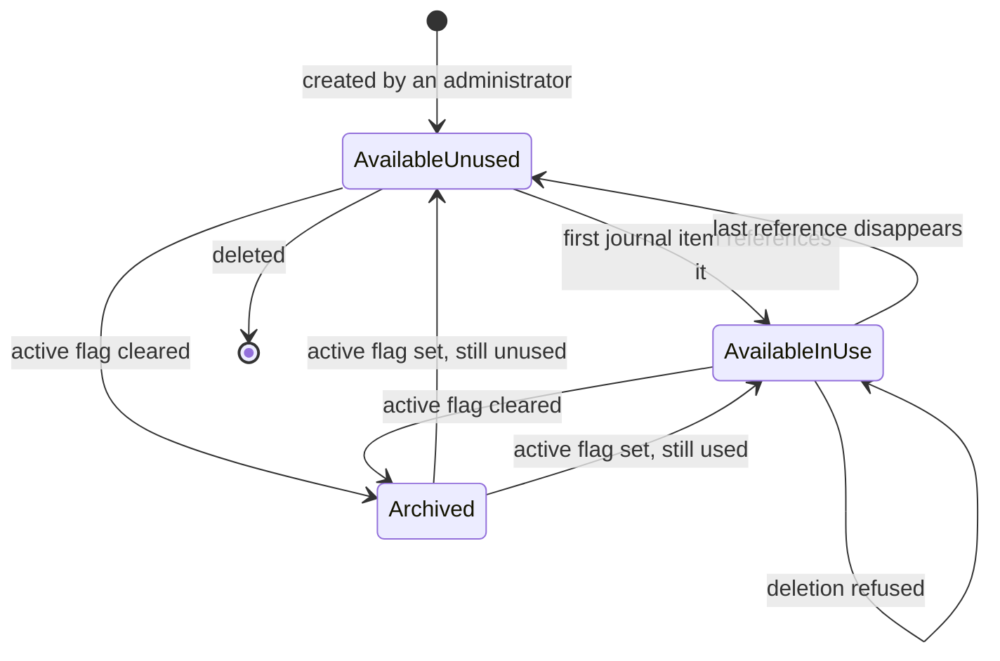
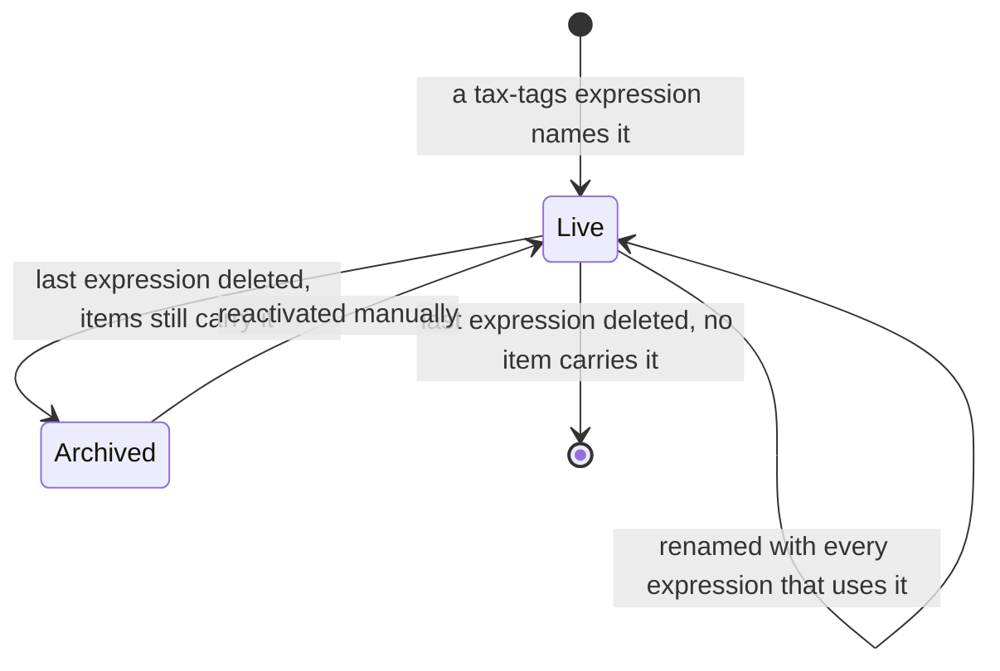
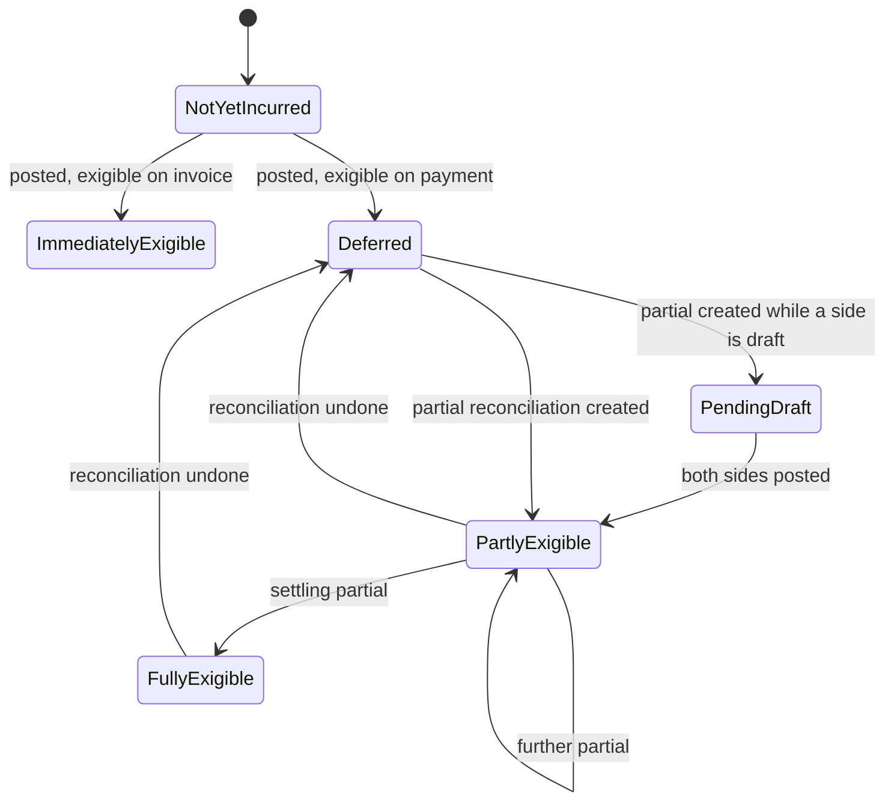
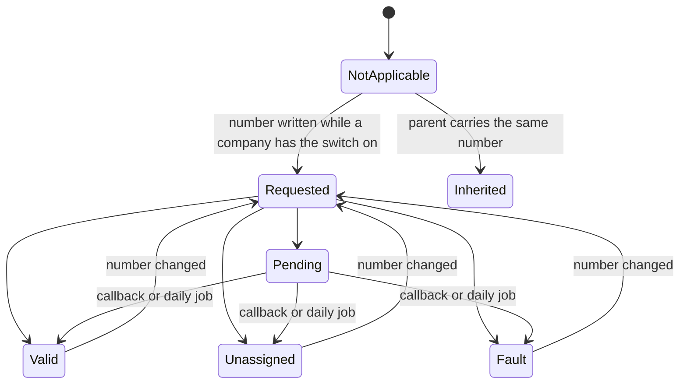
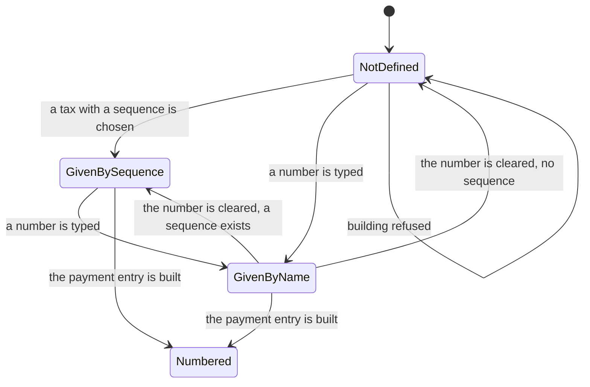

# Taxes — State machines

The tax domain owns few explicit state fields, but it owns several **implicit** state machines that
an implementation must reproduce exactly: the availability lifecycle of a tax, the lifecycle of a
report tag, the exigibility lifecycle of a tax amount, the outcome of the cross-border
verification, and the numbering-hint state of a withholding line.

Each section gives a table of states, a table of transitions and a diagram.

---

## 1. Tax availability

The state is carried by the boolean `active` (Active) on the Tax entity. There is no selection
field.

### 1.1 States

| Value | Label | Meaning |
|---|---|---|
| `active` is true, "tax used" is false | Available, unused | The tax can be selected on documents and can still be deleted. |
| `active` is true, "tax used" is true | Available, in use | The tax can be selected; it can no longer be deleted; its company can no longer change; every change to its distribution is written to its message history as a readable difference. |
| `active` is false | Archived | The tax no longer appears in selection lists. Existing journal items keep pointing at it and every report keeps working. It can be reactivated at any time. |
| the record does not exist | Deleted | Only reachable from "Available, unused". |

"Tax used" is computed, not stored: it is true when at least one journal item references the tax as
a base tax or through its distribution, or at least one reconciliation model line references it.

### 1.2 Transitions

| From | To | Trigger | Guards | Side effects |
|---|---|---|---|---|
| — | Available, unused | An accounting administrator creates the tax | Every structural rule of `business-rules.md` sections 1 and 2 | Country, tax group and both distributions are precomputed; a "created" log entry is deliberately **not** written and the creator is deliberately **not** subscribed to the record's thread |
| Available, unused | Available, in use | A journal item or a reconciliation model line starts referencing the tax | none | The distribution snapshot starts being maintained; deletion and company change become impossible |
| Available, in use | Available, unused | Every referencing item disappears | none | The reverse of the above |
| Available (either) | Archived | The active flag is cleared | none | The tax disappears from selection lists; documents already carrying it are untouched |
| Archived | Available | The active flag is set | none | — |
| Available, unused | Deleted | The record is deleted | "tax used" must be false, unless the deletion is part of uninstalling a capability | The distribution lines are deleted with it |
| Available, in use | (refused) | The record is deleted | — | *"You cannot delete taxes that are currently in use. Consider archiving them instead."* |

---

## 2. Fiscal Position availability

The state is the boolean `active` (Active).

| Value | Label | Meaning |
|---|---|---|
| true | Available | Offered for manual selection and, when "detect automatically" is set, considered by the detection algorithm. |
| false | Archived | Hidden. Documents already carrying it keep it. |

| From | To | Trigger | Guards | Side effects |
|---|---|---|---|---|
| — | Available | An administrator creates it | Rules of `business-rules.md` section 4 | Postal bounds are zero-padded; the foreign registration number is normalised and validated; the company's foreign-registration country list and tax-enabled country list are recomputed |
| Available | Archived | The active flag is cleared | none | It stops being detected; documents keep theirs |
| Archived | Available | The active flag is set | the same validations | — |

A fiscal position may also be **domestic** or not. That is not a state the user sets: it is
computed on the company as "the first fiscal position whose country is the company's country, or
whose country is empty and whose country group contains the company's country, ordered by country
identifier then by sequence", and mirrored back onto the fiscal position as a stored flag.

---

## 3. Account Tag lifecycle

A tax grid is created and destroyed by the report definition that names it, not by the user.

### 3.1 States

| State | Meaning |
|---|---|
| Absent | No tag with that name, applicability `taxes` and country exists. |
| Live | The tag exists and is active; it can be attached to distribution lines and stamped on journal items. |
| Archived | The tag exists but is inactive; journal items still carry it and reports still read it, but it can no longer be attached to a distribution line. |
| Deleted | The record is gone. |

### 3.2 Transitions

| From | To | Trigger | Guards | Side effects |
|---|---|---|---|---|
| Absent | Live | A report expression of the tax-tags kind is created, or an expression's engine is changed to that kind, or an expression's formula is changed to a name that has no tag yet | No tag with that name and country exists already | Translations are aligned against the matching report line's name in every installed language |
| Live | Live (renamed) | The formula of **every** expression that uses the tag is changed in one operation | Tags for the new formula must not already exist | The tag's English name becomes the new formula with any leading minus sign removed |
| Live | Archived | The last expression naming it is deleted **and** at least one journal item still carries it | — | The tag is first removed from every distribution line that references it |
| Live | Deleted | The last expression naming it is deleted **and** no journal item carries it | — | The tag is first removed from every distribution line that references it |
| Live | Live (moved) | The report's country is changed and every report using the tag is moving | — | The tag's country is changed |
| Absent | Live | A report's country is changed and the tag does not exist in the new country | — | A new tag is created in the new country |
| Live | (refused) | One of the three shipped cash-flow tags is deleted | — | *"You cannot delete this account tag (&lt;tag name&gt;), it is used on the chart of account definition."* |

---

## 4. The exigibility lifecycle of a tax amount

This is the most important state machine in the domain. It is not stored in a field: the state of a
tax amount is read from where the money sits and from what the reconciliation looks like.

### 4.1 States

| State | Where the amount sits | Report tags stamped | How to recognise it |
|---|---|---|---|
| Not yet incurred | nowhere | none | The document is a draft. |
| Immediately exigible | the tax account named by the distribution line | yes | The tax's exigibility is "based on invoice" and the document is posted. |
| Deferred | the tax's **cash basis transition account** | **none** | The tax's exigibility is "based on payment" and the document is posted but not reconciled. |
| Partly exigible | partly on the transition account, partly on the tax account | on the exigible part only | At least one partial reconciliation exists and the document is not fully paid. |
| Fully exigible | entirely on the tax account; the transition account entries are fully reconciled | on the whole amount | The document is fully paid. |
| Reverted to deferred | back on the transition account | the reversal carries the opposite tags | A reconciliation has been undone and the cash basis entries reversed. |

### 4.2 Transitions

| From | To | Trigger | Guards | Side effects |
|---|---|---|---|---|
| Not yet incurred | Immediately exigible | The document is posted | Tax exigibility is "based on invoice"; the tax lock date is not violated | Tax journal items on the tax account with tags |
| Not yet incurred | Deferred | The document is posted | Tax exigibility is "based on payment" | Tax journal items on the transition account with **no** tags |
| Deferred | Partly exigible | A partial reconciliation is created | The company has a cash basis journal; the document has a term line; the document does not mix currencies; the partial's amount is not zero | One cash basis entry per partial; the transition-account counterpart is reconciled against the original tax item |
| Partly exigible | Partly exigible | Another partial reconciliation is created | the same | Another cash basis entry |
| Partly exigible | Fully exigible | The last partial that settles the document is created | the same | The last tax share is forced to the tax item's remaining residual so that the totals match exactly; the original tax item becomes fully reconciled |
| Partly or fully exigible | Reverted to deferred | A partial reconciliation is deleted | none | Draft cash basis entries are deleted; posted ones are reversed and cancelled, dated on their own date or on the day after the last violated lock date |
| Deferred | Deferred (pending) | A partial reconciliation is created while one of the two documents is still a draft | none | The cash basis entry is created **in draft**; a snapshot of what it should contain is stored on the partial |
| Deferred (pending) | Partly exigible | Both documents become posted | none | The draft entry is posted |

### 4.3 Failure conditions

| Condition | Outcome |
|---|---|
| The company has no cash basis journal at the moment the first entry is needed | Refused with *"There is no tax cash basis journal defined for the '&lt;company name&gt;' company.\nConfigure it in Accounting/Configuration/Settings"* |
| The document mixes currencies between its term lines and its deferred lines | No cash basis entry is ever produced; the amount stays on the transition account for ever |
| The document has no receivable or payable item | The same |
| A user tries to reset a cash basis entry to draft | Refused with *"You cannot reset to draft a tax cash basis journal entry."* |

---

## 5. Cross-border verification of a tax identification number

The state is the boolean "intra-community valid" (`vies_valid`) plus the transient status returned
by the relay.

### 5.1 States

| State | Stored flag | Meaning |
|---|---|---|
| Not applicable | false | No company has the verification switch on, or the partner has no number. |
| Valid | true | The register confirmed the number belongs to a registered trader. |
| Unassigned | false | The register answered that the number is not allocated. |
| Pending | false | The register has not answered yet; the relay will call back or the daily job will collect the answer. |
| Fault | false | The relay could not be reached or answered without a status. |
| Inherited | the parent's | The partner has a parent carrying the same number; no request is sent. |

### 5.2 Transitions

| From | To | Trigger | Guards | Side effects |
|---|---|---|---|---|
| any | Not applicable | The number is cleared, or no company has the switch on | — | The flag becomes false, no message |
| any | Inherited | The number is written and the parent carries the same number | — | The flag copies the parent's, no request |
| any | Valid / Unassigned / Pending / Fault | The number is written | The number is present and at least one company has the switch on | One request to the relay carrying the number, the database identifier, the client credentials, a callback address and a signed callback token valid for seven days; a message is logged on the partner |
| Pending | Valid / Unassigned / Fault | The relay calls the callback route with a verified token, or the daily job collects updates | The token must verify | The flag and a message are updated on every partner carrying that number |
| any | unchanged | Records are created or written during a file import | — | The recomputation is cancelled entirely |

The messages logged are:

| Status | Message |
|---|---|
| valid | The Intra-Community validity has been updated to: valid. |
| unassigned | The Intra-Community validity has been updated to: unassigned. |
| pending | The the cross-border registration checking service check is pending. The status will be updated soon. |
| fault | The the cross-border registration checking service check failed. Please check the Tax ID manually. |

---

## 6. The numbering-hint state of a withholding line

The state is the selection `placeholder_type` (Placeholder kind), with its companion
`previous_placeholder_type` (Previous placeholder kind) used to detect a change.

| Value | Label | Meaning |
|---|---|---|
| `given_by_sequence` | Given By the Sequence | The line has no number and its tax carries a withholding sequence; the hint shows the value the sequence would draw. |
| `given_by_name` | Given By the Name | The line has a number typed by the user; no hint. |
| `not_defined` | Not defined | The line has neither; building the journal entry will be refused. |

| From | To | Trigger | Guards | Side effects |
|---|---|---|---|---|
| any | `given_by_name` | A number is typed | — | The previous kind records the old value; the owner refreshes every line's hint |
| `given_by_name` | `given_by_sequence` | The number is cleared and the tax has a sequence | — | The same |
| `given_by_name` | `not_defined` | The number is cleared and the tax has no sequence | — | The same |
| `not_defined` | `given_by_sequence` | A tax carrying a sequence is chosen | — | The same |
| `given_by_sequence` | (number consumed) | The payment entry is built | Every line must be in `given_by_sequence` or `given_by_name` | The sequence's next value is written into the line's number |

**The hint refresh.** The owner groups its lines by their sequence, keeping only the lines in
`given_by_sequence`. Within each group, the line at rank *i* (zero-based) receives as hint the
value the sequence would produce for "next number plus *i*". Every other line's hint is cleared.
In both cases the previous kind is realigned so that the change is not detected again.

---

## 7. The withholding switch on a payment

The state is the boolean "withhold tax amounts" (`should_withhold_tax`).

| Value | Meaning |
|---|---|
| false | No withholding line is shown and none is applied. |
| true | The withholding table is shown; the payment entry will carry the extra items. |

The flag is computed from the presence of at least one withholding line and remains writable, so
switching it on reveals an empty table and switching it off while lines exist turns it straight
back on the next time the lines are recomputed. On the register-payment wizard, clearing it also
clears the chosen outstanding account.

The whole feature is invisible — not merely off — when the company owns no withholding tax matching
the payment direction, and, on the wizard, when the wizard would create more than one journal
entry.

---

## 8. Non-states

For the avoidance of doubt, the following look like states and are not:

| Field | Why it is not a state |
|---|---|
| Tax Exigibility (`tax_exigibility`) | A configuration mode of the tax, chosen once. It never changes as a consequence of an operation. |
| Tax Computation (`amount_type`) | A configuration mode. |
| Included in Price override (`price_include_override`) | A configuration mode. |
| Distribution line kind (`repartition_type`) and document kind (`document_type`) | Structural classifications. |
| Report expression engine (`engine`) | A configuration mode of the report definition. |
| Foreign registration banner mode (`foreign_vat_header_mode`) | A purely derived presentation hint. |
