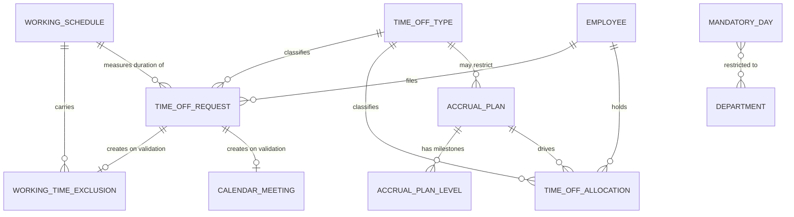

# Time Off — Entities

This file describes every entity of the domain in full: purpose, lifecycle, complete
field table, relations, uniqueness rules, defaults, computed fields with their rules,
ordering, display rule, archival behaviour and multi-company behaviour.

Conventions used in the field tables:

- **Field (storage name)** gives the human name followed, in code font, by the stored
  column or relation name. Reproduced identifiers are exact because external contracts
  depend on them.
- **Type** uses the platform's field vocabulary: single line text, long text, integer,
  decimal number, boolean, date, date and time, selection, link to one (a foreign key to
  one record), collection of (a reverse collection), and many-to-many set.
- **Meaning and rules** states required/optional, the default, whether the value is
  computed and from what, whether it is stored in the table or recomputed on read,
  whether it is read-only, whether it is copied when the record is duplicated, whether
  changes are tracked in the discussion thread, how it is scoped to a company, whether it
  is indexed, and the behaviour when the referenced record is deleted.

Every entity in this domain also carries the four platform audit columns — created by
(`create_uid`, link to Login User), created on (`create_date`, date and time), last
updated by (`write_uid`, link to Login User) and last updated on (`write_date`, date and
time). They are read-only, set by the platform, never copied, and are not repeated in
each table below.

---

## 1. Entity map



---

## 2. Summary of entities

| Entity | Transport name | Table or view | Default ordering | Archivable | Company scoped |
|---|---|---|---|---|---|
| Time Off Type | `hr.leave.type` | table `hr_leave_type` | by `sequence` ascending | yes, through `active` | optional; empty means all companies |
| Time Off Request | `hr.leave` | table `hr_leave` | by `date_from` descending | no | yes, derived from the employee |
| Time Off Allocation | `hr.leave.allocation` | table `hr_leave_allocation` | by `create_date` descending | no | yes, derived from the employee |
| Accrual Plan | `hr.leave.accrual.plan` | table `hr_leave_accrual_plan` | by `id` | yes, through `active` | yes, may be empty |
| Accrual Plan Level | `hr.leave.accrual.level` | table `hr_leave_accrual_level` | by `sequence` ascending | no | through its plan |
| Mandatory Day | `hr.leave.mandatory.day` | table `hr_leave_mandatory_day` | by `start_date` descending, then `end_date` descending | no | yes, required |
| Working Time Exclusion | `resource.calendar.leaves` | table `resource_calendar_leaves` | by `date_from` ascending | no | yes |
| Time Off Analysis | `hr.leave.report` | database view `hr_leave_report` | by `date_from` descending, then employee | no | yes |
| Time Off Calendar Report | `hr.leave.report.calendar` | database view `hr_leave_report_calendar` | by `start_datetime` descending, then employee | no | yes |
| Time Off by Employee and Type | `hr.leave.employee.type.report` | database view `hr_leave_employee_type_report` | by `date_from` descending, then employee | no | yes |
| Cancel Time Off Wizard | `hr.holidays.cancel.leave` | transient | — | no | no |
| Generate Time Off Wizard | `hr.leave.generate.multi.wizard` | transient | — | no | yes |
| Generate Allocations Wizard | `hr.leave.allocation.generate.multi.wizard` | transient | — | no | yes |
| Time Off Summary Wizard | `hr.holidays.summary.employee` | transient | — | no | no |

---

## 3. Time Off Type

**Time Off Type (`hr.leave.type`, table `hr_leave_type`)** is the catalogue entry for a
kind of absence: paid annual absence, sick absence, unpaid absence, compensatory days,
training, parental absence, and so on. It carries the policy: who must approve, in what
unit the request is expressed, whether the absence consumes an entitlement, whether the
balance may go negative and by how much, whether public holidays inside the request are
ignored, whether a supporting document is expected, and whether the absence counts as
worked time or as true absence.

### 3.1 Lifecycle

A type is created by an administrator, used indefinitely, and archived (never deleted,
once used) when it is retired. Archiving hides it from every selection list but leaves
the historical requests and allocations that reference it intact and readable.

### 3.2 Field table

| Field (storage name) | Type | Meaning and rules |
|---|---|---|
| Time Off Type (`name`) | single line text | Required. Translatable. The user-facing name of the absence kind. Used as the base of the display name. |
| Sequence (`sequence`) | integer | Default 100. Ordering key; the type with the **smallest** sequence is the one proposed by default in a new request. Also the primary key of the contextual ordering described in [section 3.6](#36-contextual-ordering-of-types). |
| Display Time Off in Calendar (`create_calendar_meeting`) | boolean | Default true. When true, validating a request of this type creates a Calendar Meeting; when false no meeting is created. |
| Color (`color`) | integer | Colour index used on every screen that shows this type. Mirrored read-only onto the request as `color`. |
| Cover Image (`icon_id`) | link to one Attachment | Optional. Restricted to attachments whose owning entity is this entity and whose owning field is `icon_id`. Its public address is published in the dashboard data contract. |
| Active (`active`) | boolean | Default true. Setting it to false hides the type without deleting it. Standard archival semantics. |
| Hide On Dashboard (`hide_on_dashboard`) | boolean | Default false. When true the type is still selectable when requesting absence, but is excluded from the balance dashboard. |
| Maximum Allowed (`max_leaves`) | decimal number | Computed, not stored, employee-contextual. The sum of the entitlement granted to the contextual employee for this type. See [Calculations](calculations.md#6-the-balance-consumption-algorithm). Searchable through a dedicated search implementation that sums the validated allocations of the contextual employee. |
| Time off Already Taken (`leaves_taken`) | decimal number | Computed, not stored, employee-contextual. The entitlement already consumed by **validated** requests. |
| Virtual Remaining Time Off (`virtual_remaining_leaves`) | decimal number | Computed, not stored, employee-contextual. Maximum allowed minus taken minus the amount locked by requests still awaiting approval. This is the *provisionally remaining* balance. Searchable. |
| Allocations (`allocation_count`) | integer | Computed, not stored. Count of allocations of this type that are valid today (start date on or before today, end date empty or on or after today) and in state awaiting approval or approved. |
| Group Time Off (`group_days_leave`) | decimal number | Computed, not stored. Count of requests of this type whose start falls inside the current calendar year and whose state is approved, second approval or awaiting approval. |
| Is Used (`is_used`) | boolean | Computed, not stored. True when at least one request or one allocation references the type. Used to lock down configuration changes. |
| Company (`company_id`) | link to one Company | Optional. Restricted to the companies the current user may act for. **Empty means the type is available to every company.** |
| Country (`country_id`) | link to one Country | Computed from the company and stored, editable. When a company is set the country is forced to that company's country. Restricted to the countries of the user's allowed companies. Empty means the type is not restricted by country. |
| Country Code (`country_code`) | single line text | Mirror of the country's code, read-only. |
| Notify Human Resources (`responsible_ids`) | many-to-many set of Login Users (association table `hr_leave_type_res_users_rel`, columns `hr_leave_type_id` and `res_users_id`) | The officers notified when a request or an allocation of this type needs approval. Restricted to non-portal users belonging to the current company who hold the officer group. If empty, nobody is notified. |
| Time Off Validation (`leave_validation_type`) | selection | Default "By Time Off Officer". Values: `no_validation` "None needed", `hr` "By Time Off Officer", `manager` "By Employee's Approver", `both` "By Employee's Approver and Time Off Officer". Drives the approval state machine of requests. Mirrored onto the request as `validation_type`. |
| Requires allocation (`requires_allocation`) | boolean | Required, default true. When true a request of this type must be covered by an approved allocation; when false the type is freely requestable and consumes nothing. **Cannot be changed once any request of the type exists** (see [Business Rules](business-rules.md#31-changing-the-allocation-requirement)). |
| Allow Employee Requests (`employee_requests`) | boolean | Required, default false. When true an ordinary employee may file an allocation request for themselves; when false only officers may create allocations of this type. |
| Approval (`allocation_validation_type`) | selection | Default "By Time Off Officer". Same four values as the request validation mode. Drives the approval state machine of allocations. |
| Has Valid Allocation (`has_valid_allocation`) | boolean | Computed, not stored, employee-contextual and date-contextual. True when the type needs no allocation, or when the contextual employee holds at least one allocation of the type that is valid over the contextual dates and that is either accrual-driven or has a positive granted amount and a provisionally remaining balance above the negative floor. Searchable. |
| Kind of Time Off (`time_type`) | selection | Default "Absence". Values: `other` "Worked Time", `leave` "Absence". Distinguishes real absence from periods that still count as working time (for example training). Copied onto the working time exclusion record created at validation, where it decides whether the interval is subtracted from working time. |
| Duration Type (`request_unit`) | selection | Required, default "Day". Values: `day` "Day", `half_day` "Half-Day", `hour` "Hours". Governs how a request is expressed and how its duration is rounded. Mirrored read-only onto the request as `leave_type_request_unit`. |
| Is Unpaid (`unpaid`) | boolean | Default false. Marks the absence as unpaid. Read by the accrual proration rule that excludes unpaid absence from worked time. |
| Ignore Public Holidays (`include_public_holidays_in_duration`) | boolean | Default false. When true, public holidays falling inside a request of this type are **not** subtracted from the duration: the employee is charged for them. When false they are subtracted. Changing this flag is blocked while requests of the type overlap a public holiday in the current year. |
| Time Off Notification Subtype (`leave_notif_subtype_id`) | link to one Message Subtype | Default the shipped "Time Off" subtype. The subtype under which the approval message is posted. |
| Allocation Notification Subtype (`allocation_notif_subtype_id`) | link to one Message Subtype | Default the shipped "Allocation Request" subtype. |
| Supporting Document (`support_document`) | boolean | Default false. When true the request form offers an attachment box. Mirrored onto the request as `leave_type_support_document`. |
| Allow Request on Top (`allow_request_on_top`) | boolean | Default false. When true, requests of this type may overlap other requests without raising the overlap error. **Forbidden when the kind of time off is "Absence"**; only "Worked Time" types may set it. |
| Eligible for Accrual Rate (`elligible_for_accrual_rate`) | boolean | Computed from the kind of time off, stored, editable. Default: true when the kind is "Worked Time", false when it is "Absence". When true, absence of this type still counts as time worked for accrual proration. **Worked Time types must always be eligible**; forcing them off raises a validation error. |
| Accrual plans (`accruals_ids`) | collection of Accrual Plans | Reverse of the plan's time off type. |
| Accruals count (`accrual_count`) | decimal number | Computed, not stored. Number of accrual plans restricted to this type. |
| Allow Negative Cap (`allows_negative`) | boolean | Default false. When true the balance of this type may go below zero, down to the maximum excess amount. |
| Maximum Excess Amount (`max_allowed_negative`) | integer | The number of days (or hours) the balance may go below zero. A table constraint enforces that it is strictly greater than zero whenever the negative cap is enabled, with the message: *"The maximum excess amount should be greater than 0. If you want to set 0, disable the negative cap instead."* |

### 3.3 Uniqueness and constraints

There is no uniqueness constraint on the name: two types may be named identically, in
different companies or even in the same one. The constraints are:

1. **Negative cap consistency** — database check: either the negative cap is disabled, or
   the maximum excess amount is strictly positive.
2. **Requests on top forbidden for absence** — a type whose kind of time off is "Absence"
   may not set "Allow Request on Top".
3. **Worked time must be accrual eligible** — a type whose kind of time off is "Worked
   Time" may not clear the accrual eligibility flag.
4. **Public holiday inclusion frozen while overlapping** — changing the public-holiday
   inclusion flag is refused when any request of the type, in the current calendar year,
   in state awaiting approval, second approval or approved, overlaps a public holiday of
   the type's company or of the acting company.
5. **Allocation requirement frozen once used** — see [Business Rules](business-rules.md#31-changing-the-allocation-requirement).

### 3.4 Display name

When the calling context carries an employee and does not suppress the behaviour, the
display name of a type that requires an allocation is enriched with the balance:

```formula
display_name = type_name + " (" + remaining + " remaining out of " + maximum + " days)"
```

and, when the request unit is hours, the word "days" is replaced by "hours". Both numbers
are rounded to two decimal places and then printed with trailing zeros removed. A type
that does not require an allocation shows its plain name.

### 3.5 Duplication

Duplicating a type appends the suffix " (copy)" to the name. All other fields are copied
as-is.

### 3.6 Contextual ordering of types

When an employee is present in the calling context and no explicit ordering is requested,
the platform re-orders the types so that the most useful ones appear first. The sort key
is the tuple, compared in descending order:

1. the negative of the sequence (so a **smaller** sequence sorts first);
2. whether the type does **not** allow employee allocation requests **and** has a positive
   provisionally remaining balance;
3. whether the type **does** allow employee allocation requests **and** has a positive
   provisionally remaining balance;
4. whether any entitlement of the type has already been taken.

The offset and limit are applied after the sort.

---

## 4. Time Off Request

**Time Off Request (`hr.leave`, table `hr_leave`)** is one employee's absence over one
period. It carries a discussion thread with a main attachment and an activity list.

### 4.1 Lifecycle

A request is created directly in state *awaiting approval* (`confirm`); there is no draft
state. Depending on the type's validation mode it is then approved once, approved twice,
refused or cancelled. Validation creates a working time exclusion record (which is what
actually removes the hours from the employee's availability) and, optionally, a calendar
meeting. Refusal and cancellation remove those side effects again.

A request is never archived. It is deleted only in restricted states (see
[Business Rules](business-rules.md#25-deleting-a-request)).

### 4.2 The two layers of dates

The request carries **two layers** of date fields and confusing them is the single most
common implementation error:

- The **request layer** — `request_date_from`, `request_date_to`,
  `request_date_from_period`, `request_date_to_period`, `request_hour_from`,
  `request_hour_to`. These are what the user fills in. They are plain dates (no time
  zone) plus, depending on the unit, a half-day marker or a pair of decimal clock hours.
- The **absolute layer** — `date_from` and `date_to`. These are computed from the request
  layer by resolving the clock hours against the employee's working schedule and then
  converting from the schedule's time zone to coordinated universal time. They are
  **never set directly** by a user interface; when a write nevertheless supplies them,
  the write handler copies them into the request layer before storing.

Every duration computation reads the absolute layer. Every user interaction writes the
request layer. The conversion is specified in
[Calculations, chapter 3](calculations.md#3-from-request-dates-to-absolute-dates).

### 4.3 Field table

| Field (storage name) | Type | Meaning and rules |
|---|---|---|
| Description (`name`) | single line text | Computed from the private description and written back to it, not stored, not copied. A reader who is an officer, or the requesting employee, or the employee's absence approver sees the real text; every other reader sees the five characters `*****`. Searching on it is rewritten to search the private description, restricted to the reader's own requests unless the reader is an officer. |
| Time Off Description (`private_name`) | single line text | The real description. Readable only by holders of the Time Off Responsible group. This is the column the analysis views expose as the description. |
| Status (`state`) | selection | Required in effect, default `confirm`. Values: `confirm` "To Approve", `refuse` "Refused", `validate1` "Second Approval", `validate` "Approved", `cancel` "Cancelled". Stored, tracked in the discussion thread, not copied. See [State Machines](state-machines.md#2-the-request-state-machine). |
| User (`user_id`) | link to one Login User | Mirror of the employee's login user, stored, read-only, indexed. |
| Time Off Type (`holiday_status_id`) | link to one Time Off Type | Required, stored, tracked, editable, computed from the employee (cleared when the chosen employee has no valid allocation of the current type). Restricted to types that need no allocation or that have a valid allocation for the contextual employee. |
| Requires allocation (`holiday_status_requires_allocation`) | boolean | Mirror of the type's allocation requirement. |
| Color (`color`) | integer | Mirror of the type's colour. |
| Validation Type (`validation_type`) | selection | Mirror of the type's request validation mode, writable through the mirror. |
| Employee (`employee_id`) | link to one Employee | Required, indexed, tracked. Deleting the employee is **restricted** while requests exist. Default: the current user's employee. Restricted to active employees of the allowed companies; a non-officer may only choose themselves or an employee whose absence approver they are. |
| Employee Company (`employee_company_id`) | link to one Company | Mirror of the employee's company, stored. |
| Company (`company_id`) | link to one Company | Computed and stored: the employee's company, else the department's company, else the acting company. |
| Employee Active (`active_employee`) | boolean | Mirror of the employee's active flag. |
| Timezone mismatch (`tz_mismatch`) | boolean | Computed, not stored, depends on the reading user. True when the request's time zone differs from the reader's. Drives a warning in the form. |
| Timezone (`tz`) | selection of time zone names | Computed, not stored: the working schedule's time zone, else the company schedule's time zone, else the reader's time zone, else coordinated universal time. |
| Department (`department_id`) | link to one Department | Computed from the employee, stored, editable. |
| Reasons (`notes`) | long text | Free text. Copied into the description of the generated calendar meeting. |
| Working Hours (`resource_calendar_id`) | link to one Working Schedule | Computed and stored, editable, not copied. **This is the schedule against which the duration is measured.** See [section 4.4](#44-choosing-the-working-schedule). |
| Maximum Allowed (`max_leaves`) | decimal number | Computed, not stored. Sum of the granted amounts of the employee's allocations of this type that are still valid at the reference date. |
| Available Time Off (`virtual_remaining_leaves`) | decimal number | Computed, not stored. Sum of the provisionally remaining balances of the same allocations. |
| Start Date (`date_from`) | date and time | Computed and stored, indexed, tracked. Absolute start; see [section 4.2](#42-the-two-layers-of-dates). |
| End Date (`date_to`) | date and time | Computed and stored, tracked. Absolute end. |
| Duration (Days) (`number_of_days`) | decimal number | Computed and stored, tracked. The number of **days of entitlement** the request consumes. See [Calculations](calculations.md#4-the-duration-computation-algorithm). |
| Duration (Hours) (`number_of_hours`) | decimal number | Computed and stored, tracked. The number of **working hours** the request covers. |
| All day (`last_several_days`) | boolean | Computed, not stored: true when the duration in days exceeds one. |
| Requested (`duration_display`) | single line text | Computed and stored. For day and half-day types: the duration in days, rounded to two decimals, trailing zeros removed, followed by the word "days". For hour types: the duration in hours formatted as hours and minutes separated by a colon, minutes zero-padded to two digits, followed by the word "hours". Minutes that round to sixty roll over into an extra hour. |
| Meeting (`meeting_id`) | link to one Calendar Meeting | Not copied. Set when validation creates a meeting. |
| First Approval (`first_approver_id`) | link to one Employee | Read-only, not copied. Filled with the acting user's employee at the first approval. |
| Second Approval (`second_approver_id`) | link to one Employee | Read-only, not copied. Filled at the second (final) approval. |
| Can approve (`can_approve`) | boolean | Computed, not stored. True when the reading user could move the request to second approval. |
| Can validate (`can_validate`) | boolean | Computed, not stored. True when the reading user could move the request to approved. |
| Can refuse (`can_refuse`) | boolean | Computed, not stored. |
| Can cancel (`can_cancel`) | boolean | Computed, not stored, depends on the reading user. |
| Can send back to approval (`can_back_to_approve`) | boolean | Computed, not stored. True when the request is approved and the reader could move it back to awaiting approval. |
| Attachments (`attachment_ids`) | collection of Attachments | The supporting documents. |
| Attach File (`supported_attachment_ids`) | many-to-many set of Attachments | Computed from and written back to the attachment collection; the form-facing handle. |
| Attachment count (`supported_attachment_ids_count`) | integer | Computed, not stored. |
| Duration Type (`leave_type_request_unit`) | selection | Mirror of the type's request unit, read-only. |
| Supporting Document (`leave_type_support_document`) | boolean | Mirror of the type's supporting-document flag. |
| Request Start Date (`request_date_from`) | date | The user-entered first day of absence. |
| Request End Date (`request_date_to`) | date | The user-entered last day of absence. |
| Hour from (`request_hour_from`) | decimal number | Computed and stored, editable. A clock time expressed as a decimal number of hours since midnight (for example 8.5 means eight thirty). Clamped on change to the range zero to 23.99. Recomputed from the schedule whenever the employee or the dates change and the value is not already an explicit user choice. |
| Hour to (`request_hour_to`) | decimal number | Same, clamped to the range zero to twenty-four. |
| Date Period Start (`request_date_from_period`) | selection | Default `am` "Morning". Values `am` "Morning", `pm` "Afternoon". Used only for half-day types. |
| Date Period End (`request_date_to_period`) | selection | Default `pm` "Afternoon". Same values. |
| Half-Day (`request_unit_half`) | boolean | Computed and stored: true when the type's request unit is half day. |
| Specific Time (`request_unit_hours`) | boolean | Computed and stored: true when the type's request unit is hours. |
| Hatched (`is_hatched`) | boolean | Computed, not stored: true when the state is neither refused nor approved. Drives the hatched rendering in calendars. |
| Striked (`is_striked`) | boolean | Computed, not stored: true when the state is refused. |
| Has mandatory day (`has_mandatory_day`) | boolean | Computed, not stored. True when the request period intersects a mandatory day applicable to the employee. |
| Duration increase notice (`leave_type_increases_duration`) | single line text | Computed, not stored. When the type is a day-unit type that requires an allocation and the rounded-up duration exceeds the real scheduled duration, holds the sentence: *"According to your working schedule you are expected to work `<real days>` days in this period, but `<charged days>` days will be used because this leave `<type name>` can only be taken by days."* Otherwise empty. |
| Overlap warning (`dashboard_warning_message`) | single line text | Computed, not stored. The overlap warning text; see [section 4.5](#45-the-overlap-warning). |

### 4.4 Choosing the working schedule

The schedule against which the request is measured is resolved as follows, for each
request that has an employee and both request dates:

1. Ask the employee register for the schedule in force for that employee on the request
   start date. If none is returned, fall back to the acting company's schedule.
2. Collect the employee's dated employment terms that overlap the request period — those
   whose contract start is on or before the request end date and whose contract end is
   empty or on or after the request start date.
3. If any such term exists, take the **first** one and use its working schedule. (All
   overlapping terms are required to share one schedule; a constraint enforces this, see
   step 4.)
4. A request whose overlapping terms carry **more than one distinct schedule** is refused
   with the message:

   > A leave cannot be set across multiple versions with different working schedules.
   >
   > Please create one time off for each version period.
   >
   > Time off:
   > `<the request's display name>`
   >
   > Versions:
   > - '`<version name>`' from `<start date>` to `<end date or the word "undefined">`
   > (one line per overlapping term)

Requests without an employee or without both request dates take the acting company's
schedule.

### 4.5 The overlap warning

For every request whose state is neither refused nor cancelled and whose type does **not**
allow requests on top, the platform searches for other requests of the same employee, of
a type that also does not allow requests on top, in a state other than cancelled or
refused, that strictly overlap (`date_from` of one strictly before `date_to` of the other
and vice versa). If any exist the warning text is built as:

- Header, when every conflicting request belongs to the reading user:
  *"You've already booked time off which overlaps with this period:"*
- Header, otherwise: *"An employee already booked time off which overlaps with this
  period:"*
- then, one line per distinct conflicting request, preceded by a newline and a tab:
  *"`<employee name>` from `<start date>` to `<end date>` - `<state label>`"*, with the
  employee name left empty when every conflict belongs to the reading user.

The dates printed are formatted in the reader's language. Note that both printed dates
are taken from the **minimum** of the conflicting record's date fields, so a single
conflicting record prints its own start date and its own end date.

This same text is raised as a blocking validation error whenever the dates, employee or
state of a request change and the resulting request is neither refused nor cancelled,
unless the calling context suppresses the date check.

### 4.6 Display name

With the short-name context flag set: *"`<description or type name or the words "Time
Off">`: `<duration display>`"*.

Otherwise the name is assembled from the employee name, the type name, the duration
display and the start date (plus *" to `<end date>`"* when the duration exceeds one day),
in one of three shapes:

- both employee and type known: *"`<employee>` on `<type>`: `<duration>` (`<date>`)"*;
- employee hidden or absent: *"`<type>`: `<duration>` (`<date>`)"*;
- type absent: *"`<employee>`: `<duration>` (`<date>`)"*.

The dates are the absolute dates converted into the request's own time zone and then
formatted in the reader's language.

### 4.7 Duplication

Duplicating a request is **refused** with *"A time off cannot be duplicated."* unless
every record in the batch is cancelled or refused (states in which the overlap constraint
does not apply), or unless the internal copy-check suppression flag is set — which is what
the internal split routine uses.

### 4.8 Table constraints and indexes

| Name | Kind | Rule | Message |
|---|---|---|---|
| `_date_check2` | check | `date_from` less than or equal to `date_to` | "The start date must be before or equal to the end date." |
| `_date_check3` | check | `request_date_from` less than or equal to `request_date_to` | "The request start date must be before or equal to the request end date." |
| `_duration_check` | check | `number_of_days` greater than or equal to zero | "If you want to change the number of days you should use the 'period' mode" |
| `_date_to_date_from_index` | index | composite index on (`date_to`, `date_from`) | — |

`employee_id` and `date_from` carry their own indexes; `user_id` is indexed.

---

## 5. Time Off Allocation

**Time Off Allocation (`hr.leave.allocation`, table `hr_leave_allocation`)** is an
entitlement grant: a number of days of one type, to one employee, valid from a start date
to an optional end date. It is either a **regular** allocation, whose amount is fixed at
creation, or an **accrual** allocation, whose amount grows over time under the control of
an accrual plan.

### 5.1 Lifecycle

An allocation is created in state *awaiting approval* — creating it in any other state is
refused with *"Incorrect state for new allocation"*. It is then approved (once or twice,
per the type's allocation validation mode) or refused. There is no cancelled state.
Approval is what makes the entitlement usable: only allocations in state approved are
counted by the balance algorithm.

An accrual allocation additionally carries a processing cursor (`lastcall`, `nextcall`,
`actual_lastcall`, `already_accrued`) that the scheduled accrual job advances.

### 5.2 Field table

| Field (storage name) | Type | Meaning and rules |
|---|---|---|
| Description (`name`) | single line text | Computed and stored, editable. Regenerated from the type and amount unless the user has typed their own text (tracked by the custom-name flag). See [section 5.3](#53-the-generated-description). |
| Custom name flag (`is_name_custom`) | boolean | Read-only, **not stored** (session-scoped). Set when the user types a description different from the generated one; cleared when the description is emptied. |
| Description with validity (`name_validity`) | single line text | Computed, not stored. *"`<description>` (from `<start date>` to `<end date>`)"*, or *"`<description>` (from `<start date>` to No Limit)"* when there is no end date. |
| Status (`state`) | selection | Default `confirm`, read-only, tracked, not copied. Values: `confirm` "To Approve", `refuse` "Refused", `validate1` "Second Approval", `validate` "Approved". |
| Start Date (`date_from`) | date | Required, indexed, tracked, not copied. Default today in the reader's time zone. The first day the entitlement may be consumed, and the anchor from which accrual milestones are measured. |
| End Date (`date_to`) | date | Optional, tracked, not copied. The last day the entitlement may be consumed. Empty means no expiry. |
| Time Off Type (`holiday_status_id`) | link to one Time Off Type | Required, computed and stored, editable. Computed: when empty, take the accrual plan's type if the plan restricts one, else the first type that has a valid allocation and requires an allocation (and, for a non-officer, also allows employee requests). Restricted to types of the allowed companies that require an allocation; a non-officer additionally only sees types that allow employee requests. |
| Employee (`employee_id`) | link to one Employee | Required, indexed, tracked. Deletion of the employee is **restricted**. Default the current user's employee. Restricted to employees of the allowed companies; a non-officer only sees employees whose absence approver they are. |
| Employee Company (`employee_company_id`) | link to one Company | Mirror, stored, read-only. |
| Active Employee (`active_employee`) | boolean | Mirror of the employee's active flag, read-only. |
| Manager (`manager_id`) | link to one Employee | Computed from the employee's parent, stored. |
| Reasons (`notes`) | long text | Free text. |
| Number of Days (`number_of_days`) | decimal number | Computed and stored, editable, tracked, default one. **The canonical amount of the grant, always expressed in days**, whatever the type's request unit. For an accrual allocation this is the running accrued balance, including the part already consumed. |
| Duration (days) (`number_of_days_display`) | decimal number | Computed, not stored: equal to the number of days. The form-facing handle for day-unit grants. |
| Duration (hours) (`number_of_hours_display`) | decimal number | Computed and stored. The number of days multiplied by the employee's hours per day at the allocation start date. The form-facing handle for hour-unit grants. |
| Allocated (Days/Hours) (`duration_display`) | single line text | Computed. The hours figure with the word "hours" for hour-unit grants, the days figure with the word "days" otherwise; both rounded to two decimals with trailing zeros removed. |
| Last executed carry-over date (`last_executed_carryover_date`) | date | The carry-over cut-off most recently applied. Part of the accrual cursor. |
| First Approval (`approver_id`) | link to one Employee | Read-only, not copied. |
| Second Approval (`second_approver_id`) | link to one Employee | Read-only, not copied. |
| Validation Type (`validation_type`) | selection | Mirror of the type's allocation validation mode, read-only. |
| Can approve (`can_approve`) | boolean | Computed, not stored. |
| Can validate (`can_validate`) | boolean | Computed, not stored. |
| Can refuse (`can_refuse`) | boolean | Computed, not stored. |
| Request unit (`type_request_unit`) | selection | Computed, not stored. Values `hour`, `half_day`, `day`. For an accrual allocation with a plan, the plan's added-value type; for a regular allocation, the type's request unit; otherwise day. |
| Department (`department_id`) | link to one Department | Computed from the employee, stored, editable. |
| Date of the last accrual allocation (`lastcall`) | date | Read-only. The period boundary at which entitlement was last added. |
| Actual last call (`actual_lastcall`) | date | The boundary at which the accrual loop last stopped, whether or not it was an accrual date (it may be a carry-over date or a level transition date). |
| Date of the next accrual allocation (`nextcall`) | date | Read-only, default empty. The next boundary the accrual loop must process. Empty means the plan has never run. |
| Already accrued (`already_accrued`) | boolean | True when the amount for the current period has already been added in advance (used by plans that grant at the start of the period), so that the next loop iteration must not add it again. |
| Yearly accrued amount (`yearly_accrued_amount`) | decimal number | The amount accrued since the last carry-over date, used to enforce the yearly cap. Reset to zero at every carry-over date. |
| Allocation Type (`allocation_type`) | selection | Required, read-only, default `regular`. Values: `regular` "Regular Allocation", `accrual` "Accrual Allocation". |
| Is officer (`is_officer`) | boolean | Computed, not stored, depends on the reading user. |
| Accrual Plan (`accrual_plan_id`) | link to one Accrual Plan | Computed and stored, editable, tracked, indexed when not empty. Setting it switches the allocation type to accrual; clearing it switches back to regular. Restricted to plans that are unrestricted or restricted to the allocation's type. |
| Maximum allowed (`max_leaves`) | decimal number | Computed, not stored. The granted amount of *this* allocation, in the type's unit, ignoring future accrual. |
| Time off Taken (`leaves_taken`) | decimal number | Computed, not stored. The part of *this* allocation consumed by validated requests. |
| Available Time Off (`virtual_remaining_leaves`) | decimal number | Computed, not stored. The part of *this* allocation still free after validated and pending requests. |
| Expiring carried-over days (`expiring_carryover_days`) | decimal number | The number of carried-over days that will expire at the carried-over expiry date. |
| Carried-over days expiration date (`carried_over_days_expiration_date`) | date | The date at which the carried-over days expire, when the level sets a validity window on carried-over time. |

### 5.3 The generated description

```formula
description = type_name + " (" + amount + " day(s))"
```

where the amount is the number of days rounded to two decimals; and, when the request
unit is hours:

```formula
description = type_name + " (" + amount_in_hours + " hour(s))"
```

where the amount in hours is the number of days multiplied by the employee's hours per
day at the allocation start date, rounded to two decimals. When no type is set the
description is the words "Allocation Request".

### 5.4 Display name

*"Allocation of `<type>`: `<amount>` `<unit>` to `<employee>`"* where the amount is
printed with exactly two decimals, and the unit is the word "hours" for hour-unit grants
and "days" otherwise.

### 5.5 Table constraints

| Name | Kind | Rule | Message |
|---|---|---|---|
| `_duration_check` | check | (`number_of_days` greater than zero **and** allocation type is regular) **or** allocation type is not regular | "The duration must be greater than 0." |

In addition a validation refuses a start date later than the end date with *"The Start
Date of the Validity Period must be anterior to the End Date."*

### 5.6 Deletion rules

Two independent guards apply:

1. An allocation in a state other than awaiting approval or refused may not be deleted:
   *"You cannot delete an allocation request which is in `<state label>` state."* This
   guard can be suppressed by the departure procedure through an internal context flag.
2. An allocation of a type that requires an allocation and whose taken amount is greater
   than zero may not be deleted: *"You cannot delete an allocation request which has some
   validated leaves."*

### 5.7 Duplication

A copy is always forced back to state awaiting approval.

---

## 6. Accrual Plan

**Accrual Plan (`hr.leave.accrual.plan`, table `hr_leave_accrual_plan`)** is a named rule
set describing how an accrual allocation grows. It owns an ordered list of milestone
levels and the settings shared by every level: when in the year the carry-over cut-off
falls, whether a level change takes effect immediately or only at the end of the running
accrual period, whether the grant is placed at the start or at the end of the period, and
whether the grant is prorated against actually worked time.

### 6.1 Field table

| Field (storage name) | Type | Meaning and rules |
|---|---|---|
| Active (`active`) | boolean | Default true. Standard archival. |
| Name (`name`) | single line text | Required. When a plan is created without a name it is given the words "Unnamed Plan". |
| Time Off Type (`time_off_type_id`) | link to one Time Off Type | Optional, indexed when not empty, company-checked against the plan's company. When set, the plan may only be used with that type and the levels' value unit is forced from that type's request unit. Empty means the plan may be used with any type. |
| Employees (`employees_count`) | integer | Computed, not stored. Count of distinct employees holding an allocation driven by this plan. |
| Milestones (`level_ids`) | collection of Accrual Plan Levels | Copied when the plan is duplicated. |
| Allocations (`allocation_ids`) | collection of Time Off Allocations | Reverse link. |
| Company (`company_id`) | link to one Company | Computed and stored, editable: the type's company when a type is set, else the acting company. Restricted to the allowed companies. |
| Milestone Transition (`transition_mode`) | selection | Required, default `immediately`. Values: `immediately` "Immediately", `end_of_accrual` "After this accrual's period". Governs when a seniority milestone takes over. |
| Show transition mode (`show_transition_mode`) | boolean | Computed, not stored: true when the plan has more than one level. |
| Based on worked time (`is_based_on_worked_time`) | boolean | Computed and stored, editable. Forced to false when the grant is placed at the start of the period. When true the granted amount is scaled by the proportion of the period actually worked; unpaid absence is excluded from worked time. |
| Accrued Gain Time (`accrued_gain_time`) | selection | Required, default `end`. Values: `start` "At the start of the accrual period", `end` "At the end of the accrual period". |
| Can be carried over (`can_be_carryover`) | boolean | When false, every level is forced to lose unused time at the carry-over date. |
| Carry-Over Time (`carryover_date`) | selection | Required, default `year_start`. Values: `year_start` "At the start of the year", `allocation` "At the allocation date", `other` "Custom date". |
| Carry-over day (`carryover_day`) | selection of the numbers one to thirty-one | Computed and stored, editable, default `1`. Clamped to the number of days in the chosen carry-over month, using a leap year as the reference so that the twenty-ninth of February remains selectable. |
| Carry-over month (`carryover_month`) | selection of the twelve month names | Default the current month. |
| Value unit (`added_value_type`) | selection | Stored, default `day`. Values `day` "Days", `hour` "Hours". Mirrors the first level's unit. |
| Levels (`level_count`) | integer | Computed, not stored. |

### 6.2 Deletion rule

Deleting a plan that is linked to an allocation whose allocation type is accrual and whose
state is not cancelled or refused is refused with: *"Some of the accrual plans you're
trying to delete are linked to an existing allocation. Delete or cancel them first."*

### 6.3 Duplication

Duplicating a plan appends " (copy)" to the name and copies the milestone levels.

---

## 7. Accrual Plan Level

**Accrual Plan Level (`hr.leave.accrual.level`, table `hr_leave_accrual_level`)** — called
a *milestone* in the user interface — describes what happens from a given seniority point
onwards: how much entitlement is granted, how often, up to what running cap, up to what
yearly cap, and what becomes of the unused balance at the carry-over cut-off.

### 7.1 Ordering

Levels are ordered by the computed sequence

```formula
sequence = start_count × multiplier(start_type)
```

with multiplier one for days, thirty for months and three hundred and sixty-five for
years. The comment in the source acknowledges that this is an approximation for odd month
lengths but that it orders correctly in practice. The sequence is stored so that ordering
is stable.

### 7.2 Field table

| Field (storage name) | Type | Meaning and rules |
|---|---|---|
| Sequence (`sequence`) | integer | Computed and stored from the start count and start unit, as above. |
| Accrual Plan (`accrual_plan_id`) | link to one Accrual Plan | Required, indexed, cascade delete. Default: the plan currently open in the calling context. |
| Accrued Gain Time (`accrued_gain_time`) | selection | Mirror of the plan's setting. |
| Start count (`start_count`) | integer | The seniority offset after which this level applies, counted from the allocation start date. |
| Start unit (`start_type`) | selection | Required, default `day`. Values `day` "Days", `month` "Months", `year` "Years". |
| Milestone reached (`milestone_date`) | selection | Required, default `creation`, computed and stored, editable. Values: `creation` "At allocation creation", `after` "After". Forced to "At allocation creation" when the start count is zero; setting it to "At allocation creation" forces the start count to zero. |
| Rate (`added_value`) | decimal number with five decimal places | Required, default one. The amount granted per period. A table check enforces that it is strictly greater than zero, with message *"You must give a rate greater than 0 in accrual plan levels."* |
| Rate unit (`added_value_type`) | selection | Required, computed and stored, editable, precomputed. Values `day` "Day(s)", `hour` "Hour(s)". When the plan restricts a type, forced to day for day and half-day types and to hour for hour types. Otherwise every level after the first copies the first level's unit. Writing it on the first level pushes it up to the plan. |
| Frequency (`frequency`) | selection | Required, default `daily`. Values: `hourly` "Hourly", `daily` "Daily", `weekly` "Weekly", `bimonthly` "Twice a month", `monthly` "Monthly", `biyearly` "Twice a year", `yearly` "Yearly". |
| Allocation on (`week_day`) | selection | Required, default `0` "Monday". Values `0` Monday through `6` Sunday. Used by the weekly frequency. |
| First day (`first_day`) | selection of the numbers one to thirty-one | Default `1`. Used by the twice-a-month and monthly frequencies. |
| Second day (`second_day`) | selection of the numbers one to thirty-one | Default `15`. Used by the twice-a-month frequency. A validation refuses a first day greater than or equal to the second day, with *"The first day must be lower than the second day."* |
| First month day (`first_month_day`) | selection of the numbers one to thirty-one | Computed and stored, editable, default `1`. Clamped to the length of the first month (leap-year reference). |
| First month (`first_month`) | selection of January through June | Default `1` January. Used by the twice-a-year frequency. |
| Second month day (`second_month_day`) | selection of the numbers one to thirty-one | Computed and stored, editable, default `1`. Clamped to the length of the second month. |
| Second month (`second_month`) | selection of July through December | Default `7` July. |
| Yearly month (`yearly_month`) | selection of the twelve months | Default `1` January. |
| Yearly day (`yearly_day`) | selection of the numbers one to thirty-one | Computed and stored, editable, default `1`. Clamped to the length of the yearly month. |
| Cap accrued time (`cap_accrued_time`) | boolean | When true the running balance may never exceed the maximum. |
| Maximum (`maximum_leave`) | decimal number, two decimals | Computed and stored, editable, default zero. Forced to zero when the running cap is off. A validation refuses a running cap with a maximum less than or equal to zero: *"You cannot have a balance cap on accrued time set to 0."* |
| Cap accrued time yearly (`cap_accrued_time_yearly`) | boolean | Stored, editable. When true the total granted between two carry-over dates may never exceed the yearly maximum. |
| Yearly maximum (`maximum_leave_yearly`) | decimal number, two decimals | A table check enforces that it is strictly positive whenever the yearly cap is on: *"You cannot have a cap on yearly accrued time without setting a maximum amount."* |
| Can be carried over (`can_be_carryover`) | boolean | Mirror of the plan's flag, read-only. |
| Unused accruals (`action_with_unused_accruals`) | selection | Required, default `lost`, computed and stored. Values: `lost` "Lost", `all` "Carried over". Forced to lost when the plan does not allow carry-over. |
| Carry-over options (`carryover_options`) | selection | Required, default `unlimited`, computed and stored, editable. Values: `unlimited` "Unlimited", `limited` "Up to". Forced to unlimited when unused accruals are lost. |
| Maximum to carry over (`postpone_max_days`) | integer | The cap on the carried-over amount. A table check enforces that it is strictly positive whenever unused accruals are carried over **and** the carry-over is limited: *"You cannot have a maximum quantity to carryover set to 0."* |
| Can modify value type (`can_modify_value_type`) | boolean | Computed, not stored. True only for the first level of a plan that does not restrict a type. |
| Carried-over validity (`accrual_validity`) | boolean | Computed and stored, editable. Forced to false when unused accruals are lost. When true, carried-over days expire a configured period after the carry-over date. |
| Validity count (`accrual_validity_count`) | integer | Default one. A table check enforces that it is strictly positive whenever the validity is on: *"You cannot have an accrual validity time set to 0."* |
| Validity unit (`accrual_validity_type`) | selection | Required, default `day`. Values `day` "Days", `month` "Months". |

### 7.3 Table constraints

| Name | Rule | Message |
|---|---|---|
| `_start_count_check` | (start count greater than zero and milestone reached is "After") or (start count equals zero and milestone reached is "At allocation creation") | "You can not start an accrual in the past." |
| `_added_value_greater_than_zero` | rate greater than zero | "You must give a rate greater than 0 in accrual plan levels." |
| `_valid_postpone_max_days_value` | unused accruals not carried over, or carry-over not limited, or maximum to carry over greater than zero | "You cannot have a maximum quantity to carryover set to 0." |
| `_valid_accrual_validity_value` | carried-over validity not on, or validity count greater than zero | "You cannot have an accrual validity time set to 0." |
| `_valid_yearly_cap_value` | yearly cap not on, or yearly maximum greater than zero | "You cannot have a cap on yearly accrued time without setting a maximum amount." |

### 7.4 Period boundary functions

Each level defines two pure functions of a date, used everywhere by the accrual loop. They
are specified with full case analysis in
[Calculations, chapter 8](calculations.md#8-accrual-period-boundaries).

---

## 8. Mandatory Day

**Mandatory Day (`hr.leave.mandatory.day`, table `hr_leave_mandatory_day`)** marks a date
range on which ordinary employees may not take absence — a peak trading week, an
inventory count, a mandatory training block.

| Field (storage name) | Type | Meaning and rules |
|---|---|---|
| Name (`name`) | single line text | Required. |
| Company (`company_id`) | link to one Company | Required, default the acting company. |
| Start Date (`start_date`) | date | Required. |
| End Date (`end_date`) | date | Required. A table check enforces start on or before end: *"The start date must be anterior than the end date."* |
| Color (`color`) | integer | Default a random integer between one and eleven inclusive. |
| Working Hours (`resource_calendar_id`) | link to one Working Schedule | Optional. Restricted to schedules with no company or with the mandatory day's company. Empty means the mandatory day applies whatever the schedule. |
| Departments (`department_ids`) | many-to-many set of Departments | Empty means every department. Non-empty means the mandatory day applies to the listed departments **and all their descendants**. |
| Job Position (`job_ids`) | many-to-many set of Job Positions | Empty means every job position. |

### 8.1 Applicability rule

A mandatory day applies to an employee over a date window when **all** of the following
hold:

1. its start date is on or before the window end and its end date is on or after the
   window start;
2. its company is one of the acting companies;
3. its working schedule is empty, or equals the employee's working schedule;
4. if the employee has a job position, the mandatory day's job position set is empty or
   contains that position;
5. if the employee has a department, the mandatory day's department set is empty or is an
   ancestor-or-self of that department; if the employee has no department, the mandatory
   day's department set must be empty.

### 8.2 Effect

Only ordinary employees are blocked. A holder of the officer group may create absence on a
mandatory day. See [Business Rules](business-rules.md#12-mandatory-days).

---

## 9. Working Time Exclusion

**Working Time Exclusion (`resource.calendar.leaves`, table `resource_calendar_leaves`)**
is the record that actually removes hours from a working schedule. It belongs to the
attendances and working time domain; this domain owns two roles it plays:

1. **Public holiday or company closure** — created by an administrator with no resource
   attached. It reduces the working intervals of every employee sharing the schedule (or
   of every employee in the company when no schedule is attached).
2. **Individual absence** — created automatically when a request reaches state approved.
   It carries the back-link to the request.

| Field (storage name) | Type | Meaning and rules |
|---|---|---|
| Reason (`name`) | single line text | For records created from a request: *"`<employee name>`: Time Off"*. |
| Company (`company_id`) | link to one Company | Computed and stored, read-only: the linked request's employee's company, else the schedule's company, else the acting company. |
| Working Hours (`calendar_id`) | link to one Working Schedule | Computed from the resource's schedule and stored, editable, indexed, company-checked. Empty on a public holiday means the holiday applies to **every** schedule of the company. |
| Start Date (`date_from`) | date and time | Required. |
| End Date (`date_to`) | date and time | Required, computed and stored, editable: when empty or not after the start, defaults to the end of the start day (twenty-three hours, fifty-nine minutes, fifty-nine seconds) in the reader's time zone, or in the company schedule's time zone when the reader has none. |
| Resource (`resource_id`) | link to one Resource | Indexed. Empty means the exclusion is generic for the company or the schedule. Non-empty means it applies to that one resource. |
| Time Type (`time_type`) | selection | Default `leave`. Values `leave` "Time Off", `other` "Other". Copied from the absence type's kind of time off. Only records with time type "Time Off" are subtracted from working time by the default interval algebra. |
| Time Off Request (`holiday_id`) | link to one Time Off Request | The back-link. Empty for public holidays. |
| Eligible for Accrual Rate (`elligible_for_accrual_rate`) | boolean | Default false. Copied from the absence type. Read by the accrual proration rule. |
| Work Entry Type (`work_entry_type_id`) | link to one Work Entry Type | Added by the work-entry integration; drives which work entry type the absence produces. |
| Analytic Lines (`timesheet_ids`) | collection of Analytic Lines | Added by the timesheet integration; the timesheet lines generated from a global closure. |

### 9.1 Overlap constraint on public holidays

Two records **without a resource** belonging to the same company may not overlap when they
share a schedule or when at least one of them has no schedule. The error is: *"Two public
holidays cannot overlap each other for the same working hours."*

### 9.2 Time-zone normalisation at creation

When a public holiday is created with an explicit schedule, no resource, and both
date-and-time values supplied, and the acting user's time zone differs from the schedule's
time zone, both values are re-interpreted: the instant is first converted into the user's
time zone, the resulting wall-clock reading is then re-attached to the schedule's time
zone, and the result is converted back to coordinated universal time. In effect, a
holiday entered as "the whole of the fourteenth of July" is stored as the whole of the
fourteenth of July **in the schedule's time zone**, not in the entering user's.

### 9.3 Re-evaluation of affected requests

Every creation, modification and deletion of a resource-less exclusion triggers the
re-evaluation procedure described in
[Workflows, chapter 11](workflows.md#11-declaring-a-public-holiday).

---

## 10. Reporting entities

### 10.1 Time Off Analysis (`hr.leave.report`, database view `hr_leave_report`)

A read-only union of allocations and requests, one row each, restricted to active
employees. Allocation rows carry positive amounts; request rows carry **negated** amounts,
so that summing the column over an employee and a type yields the net balance.

| Field (storage name) | Type | Meaning and rules |
|---|---|---|
| Time Off Request (`leave_id`) | link to one Time Off Request | Empty on allocation rows. |
| Allocation Request (`allocation_id`) | link to one Time Off Allocation | Empty on request rows. |
| Employee (`employee_id`) | link to one Employee | |
| Description (`name`) | single line text | The allocation description, or the request's private description. |
| Number of Days (`number_of_days`) | decimal number | The allocation's number of days, or **minus** the request's number of days. |
| Number of Hours (`number_of_hours`) | decimal number | The allocation's hours figure, or **minus** the request's number of hours. |
| Request Type (`leave_type`) | selection | Values `allocation` "Allocation", `request` "Time Off". |
| Department (`department_id`) | link to one Department | Taken from the employee's current dated employment term. |
| Time Off Type (`holiday_status_id`) | link to one Time Off Type | |
| Status (`state`) | selection | Values `cancel` "Cancelled", `confirm` "To Approve", `refuse` "Refused", `validate1` "Second Approval", `validate` "Approved". |
| Start Date (`date_from`) | date and time | On allocation rows this is the validity start date. |
| End Date (`date_to`) | date and time | |
| Company (`company_id`) | link to one Company | The employee company of the source record. |
| Has department manager access (`has_department_manager_access`) | boolean | Inherited from the department-manager reporting mixin; drives the record rule that lets a department manager read their department's rows. |

Opening a row navigates to the source request or allocation form.

### 10.2 Time Off Calendar Report (`hr.leave.report.calendar`, database view `hr_leave_report_calendar`)

One row per request in state awaiting approval, second approval, approved or refused —
cancelled requests are excluded. Used by the team calendar view.

| Field (storage name) | Type | Meaning and rules |
|---|---|---|
| Name (`name`) | single line text | Computed: the employee name, plus (for officers only) a space and the type name, plus a colon, a space and the duration display. |
| From (`start_datetime`) / To (`stop_datetime`) | date and time | The request's absolute dates. |
| Requested (`duration_display`) | single line text | Mirror of the request's duration display. |
| Timezone (`tz`) | selection | The first non-empty of: the employee's resource time zone, the schedule of the employee's current dated term, the company schedule, otherwise coordinated universal time. |
| Duration (`duration`) | decimal number | The request's number of days. |
| Employee (`employee_id`), User (`user_id`), Department (`department_id`), Job (`job_id`), Company (`company_id`) | links to one | Taken from the employee and their current dated term. |
| State (`state`) | selection | Same five values as the analysis report. |
| Description (`description`) | single line text | The private description. Visible only to officers. |
| Time Off Type (`holiday_status_id`) | link to one Time Off Type | Visible only to officers. |
| Hatched (`is_hatched`) | boolean | True when the state is neither approved nor refused. |
| Striked (`is_striked`) | boolean | True when the state is refused. |
| Absent today (`is_absent`), Member of department (`member_of_department`), Time Off Approver (`leave_manager_id`) | mirrors of the employee | |
| Leave (`leave_id`) | link to one Time Off Request | Visible only to officers. |
| Manager (`is_manager`) | boolean | Computed: true when the reader is an officer or the employee's absence approver. |

The report exposes two actions, approve and refuse, which delegate to the underlying
request. A reader who is neither an officer nor the employee's absence approver (for a
type whose validation mode is approver or both) is refused with *"You are not allowed to
approve this leave request."* or *"You are not allowed to refuse this leave request."*

### 10.3 Time Off by Employee and Type (`hr.leave.employee.type.report`, database view `hr_leave_employee_type_report`)

A read-only union that pairs, per employee and per type, the allocation rows and the
request rows, carrying the remaining balance. Columns: active employee flag, company,
start date, end date, department, employee, holiday status selection, time off type,
number of days, number of hours, state.

---

## 11. Transient entities (wizards)

### 11.1 Cancel Time Off Wizard (`hr.holidays.cancel.leave`)

| Field (storage name) | Type | Meaning and rules |
|---|---|---|
| Time Off Request (`leave_id`) | link to one Time Off Request | Required. |
| Reason (`reason`) | long text | Optional. Posted into the request's thread and into the notification sent to the approvers. |

Confirming runs the user cancellation described in
[Workflows, chapter 8](workflows.md#8-cancelling-an-approved-absence) and returns a
success notification reading *"Your time off has been cancelled."*

### 11.2 Generate Time Off Wizard (`hr.leave.generate.multi.wizard`)

| Field (storage name) | Type | Meaning and rules |
|---|---|---|
| Description (`name`) | single line text | Copied to every generated request. |
| Time Off Type (`holiday_status_id`) | link to one Time Off Type | Required. Restricted to the acting company's types or unrestricted ones. |
| Allocation Mode (`allocation_mode`) | selection | Required, default `employee`. Values: `employee` "By Employee", `company` "By Company", `department` "By Department", `category` "By Employee Tag". A non-officer may only use "By Employee": any other choice raises *"As Time Off Responsible, you can only use the allocation mode 'By Employee'."* |
| Employees (`employee_ids`) | many-to-many set of Employees | Restricted to the allowed companies; a non-officer only sees themselves and the employees they approve for. |
| Company (`company_id`) | link to one Company | Required, default the acting company. |
| Department (`department_id`) | link to one Department | Used in department mode. |
| Employee Tag (`category_id`) | link to one Employee Tag | Used in tag mode. |
| Start Date (`date_from`) / End Date (`date_to`) | date | Both required. |

### 11.3 Generate Allocations Wizard (`hr.leave.allocation.generate.multi.wizard`)

| Field (storage name) | Type | Meaning and rules |
|---|---|---|
| Description (`name`) | single line text | Computed and stored, editable: *"`<type>` (`<duration>` `<unit>`(s))"*, or the words "Allocation Request" when no type is chosen. |
| Allocation (`duration`) | decimal number | The amount to grant, in the type's request unit. |
| Time Off Type (`holiday_status_id`) | link to one Time Off Type | Required. Restricted to types that require an allocation; a non-officer additionally only sees those that allow employee requests. |
| Request unit (`request_unit`) | selection | Mirror of the type's request unit. |
| Allocation Mode (`allocation_mode`) | selection | Same four values and the same non-officer restriction as the request wizard. |
| Employees (`employee_ids`), Company (`company_id`), Department (`department_id`), Employee Tag (`category_id`) | as above | |
| Allocation Type (`allocation_type`) | selection | Required, default `regular`. Values `regular` "Regular Allocation", `accrual` "Based on Accrual Plan". |
| Accrual Plan (`accrual_plan_id`) | link to one Accrual Plan | Restricted to unrestricted plans or plans of the chosen type. |
| Start Date (`date_from`) | date | Required, default today. |
| End Date (`date_to`) | date | Optional. |
| Reasons (`notes`) | long text | Copied to every generated allocation. |

### 11.4 Time Off Summary Wizard (`hr.holidays.summary.employee`)

| Field (storage name) | Type | Meaning and rules |
|---|---|---|
| From (`date_from`) | date | Required, default the first day of the current month. |
| Employee(s) (`emp`) | many-to-many set of Employees (association table `summary_emp_rel`, columns `sum_id` and `emp_id`) | The employees to print. At print time the active records of the calling context override this field. |
| Select Time Off Type (`holiday_type`) | selection | Required, default `Approved`. Values: `Approved` "Approved", `Confirmed` "Confirmed", `both` "Both Approved and Confirmed". |

---

## 12. Multi-company behaviour

| Entity | Rule |
|---|---|
| Time Off Type | A global record rule limits visibility to types whose company is one of the reader's allowed companies, **or** whose company is empty **and** whose country is empty or is a country of one of the reader's allowed companies. |
| Time Off Request | A global record rule limits visibility to requests whose company is one of the reader's allowed companies. The company is derived from the employee. |
| Time Off Allocation | A global record rule limits visibility to allocations with no employee, or whose employee's company is allowed, **and** whose type's company is allowed or empty. |
| Accrual Plan | A global record rule limits visibility to plans whose company is allowed or empty. |
| Mandatory Day | A global record rule limits visibility to mandatory days whose company is allowed or empty. |
| Time Off Analysis and Time Off Calendar Report | Global record rules on the company column, allowing empty. |

A company may not change its country while any request or allocation exists for one of its
employees whose type is restricted to a **different** country. The error is: *"The company
country cannot be changed while time off leaves or allocations with the country exist."*
This guard is suppressed while the automated test suite is running.
