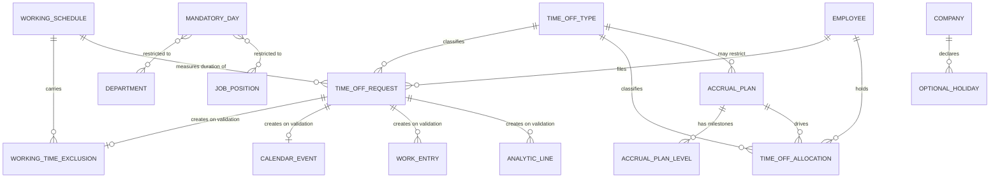

# Time Off — Entities

This file describes every entity of the domain in full: purpose, lifecycle, complete field
table, relations, uniqueness rules, defaults, computed fields with their rules, ordering,
display-name rule, duplication behaviour, archival behaviour, database-level constraints,
form behaviour and multi-company behaviour. It then lists every field this domain adds to
entities owned by other domains.

A generated reference page exists for each entity; each section links to its own.

---

## 1. Conventions used in the field tables

### 1.1 Columns

| Column | Content |
|---|---|
| Identifier | The stored column or relation name, reproduced exactly in code font because external contracts depend on it. |
| Full name | The name of the field in words. |
| Type | Single line text, long text, integer, decimal number, boolean, date, date and time, selection, link to one (a reference to one record), collection of (a reverse collection), many-to-many set. |
| Required · default | Whether a value must be present, and the value used when none is supplied. |
| Stored · copied · tracked | Whether the value occupies a column of the table or is recomputed on read; whether it is carried over when the record is duplicated; whether a change is written into the discussion thread. |
| Meaning and rules | Purpose, computation rule and its dependencies, restrictions on the values that may be chosen, read and write restrictions, and the behaviour when a referenced record is deleted. |

### 1.2 Platform fields that every entity carries

Every persistent entity of this domain carries four audit columns: created by
(`create_uid`, link to one Login User), created on (`create_date`, date and time), last
updated by (`write_uid`, link to one Login User) and last updated on (`write_date`, date
and time). They are read-only, set by the platform, never copied, and are not repeated in
the tables below. Each persistent entity also carries a surrogate integer primary key.

Entities that carry a discussion thread additionally carry the thread fields (followers,
messages, notification subtypes, main attachment) and, where scheduled activities are
enabled, the activity fields (activity list, next activity deadline, next activity
responsible user, next activity type). Those fields belong to the
[messaging and activities](../messaging-and-activities/README.md) domain and are referenced
here rather than re-specified.

### 1.3 What survives duplication

A field value is carried over to a copy unless one of the following holds: the field is a
state field, which returns to its own default on the copy; the field is computed and not
stored; the field is computed, stored, but not directly editable; the field mirrors a field
of another record; or the field is explicitly excluded from copying. This domain
explicitly excludes from copying: the description, the working schedule and the two
approver links of a Time Off Request, the calendar event link, and the validity dates, the
state and the approver links of a Time Off Allocation.

A reverse collection is copied deeply: every child record is duplicated and attached to the
copy. Two consequences surprise readers and must be reproduced: duplicating a Time Off Type
also duplicates every Accrual Plan restricted to it, and duplicating an Accrual Plan also
duplicates every Time Off Allocation that uses it, each duplicate landing in state
*To Approve*.

### 1.4 Units

A Time Off Request carries its duration in two parallel units: `number_of_days`, the
duration in days, and `number_of_hours`, the duration in hours. Which of the two is
authoritative for balance arithmetic depends on the Time Off Type's request unit
(`request_unit`): for `day` and `half_day` the day figure is authoritative, for `hour` the
hour figure is. A Time Off Allocation stores a single authoritative amount,
`number_of_days`, always expressed in days, and derives the hour figure from it using the
employee's hours per day.

### 1.5 The two layers of dates

Confusing the two layers is the single most common implementation error in this domain.

- The **request layer** — `request_date_from`, `request_date_to`,
  `request_date_from_period`, `request_date_to_period`, `request_hour_from`,
  `request_hour_to` — is what a person fills in. These are plain calendar dates with no
  time zone, plus, depending on the request unit, a half-day marker or a pair of decimal
  clock hours.
- The **absolute layer** — `date_from` and `date_to` — is computed from the request layer by
  resolving the clock hours against the employee's working schedule and converting from the
  schedule's time zone into coordinated universal time. It is never set directly by a user
  interface; a write that nevertheless supplies it is rewritten into the request layer
  before storage.

Every duration computation reads the absolute layer; every user interaction writes the
request layer. The conversion is specified in
[calculations.md, chapter 3](calculations.md#3-from-request-dates-to-absolute-dates).

---

## 2. Entity map and summary



| Entity | Transport name | Table or view | Kind | Default ordering | Archivable | Company scoped |
|---|---|---|---|---|---|---|
| Time Off Type | `hr.leave.type` | table `hr_leave_type` | persistent | by `sequence` ascending | yes, through `active` | optional; empty means every company |
| Time Off Request | `hr.leave` | table `hr_leave` | persistent, discussion thread, activities | by `date_from` descending | no | yes, derived from the employee |
| Time Off Allocation | `hr.leave.allocation` | table `hr_leave_allocation` | persistent, discussion thread, activities | by `create_date` descending | no | yes, derived from the employee |
| Accrual Plan | `hr.leave.accrual.plan` | table `hr_leave_accrual_plan` | persistent | by identifier | yes, through `active` | yes, may be empty |
| Accrual Plan Level | `hr.leave.accrual.level` | table `hr_leave_accrual_level` | persistent | by `sequence` ascending | no | through its plan |
| Mandatory Day | `hr.leave.mandatory.day` | table `hr_leave_mandatory_day` | persistent | by `start_date` descending, then `end_date` descending | no | yes, required |
| Optional Holiday | `l10n.in.hr.leave.optional.holiday` | table `l10n_in_hr_leave_optional_holiday` | persistent | by `date` descending | no | yes, required |
| Time Off Analysis | `hr.leave.report` | database view `hr_leave_report` | read-only projection | by `date_from` descending, then employee | no | yes |
| Time Off Calendar Report | `hr.leave.report.calendar` | database view `hr_leave_report_calendar` | read-only projection | by `start_datetime` descending, then employee | no | yes |
| Time Off Balance by Employee and Type | `hr.leave.employee.type.report` | database view `hr_leave_employee_type_report` | read-only projection | by `date_from` descending, then employee | no | yes |
| Absence Ledger | `hr.leave.attendance.report` | database view `hr_leave_attendance_report` | read-only projection | by date and employee | no | yes |
| Printed Summary Definition | `report.hr_holidays.report_holidayssummary` | none | abstract print definition | — | no | no |
| Cancel Time Off Wizard | `hr.holidays.cancel.leave` | transient | dialog | — | no | no |
| Generate Time Off Wizard | `hr.leave.generate.multi.wizard` | transient | dialog | — | no | yes |
| Generate Allocations Wizard | `hr.leave.allocation.generate.multi.wizard` | transient | dialog | — | no | yes |
| Time Off Summary Wizard | `hr.holidays.summary.employee` | transient | dialog | — | no | no |

The Working Time Exclusion (`resource.calendar.leaves`) is owned by the
[attendances and working time](../attendances-and-working-time/README.md) domain; the roles
it plays here and the fields this domain adds to it are in
[section 11](#11-working-time-exclusion).

---

## 3. Time Off Type

**Time Off Type** (`hr.leave.type`, table `hr_leave_type`) is the catalogue entry for one
kind of absence: paid annual absence, sick absence, unpaid absence, compensatory days,
training, parental absence. It carries the whole policy of that kind: who must approve, in
what unit a request is expressed, whether the absence consumes an entitlement, whether the
balance may go below zero and by how much, whether public holidays inside a request are
charged, whether a supporting document is expected, and whether the absence counts as
worked time or as true absence.

Reference page: [`hr.leave.type`](../../references/entities/hr.leave.type.md).

### 3.1 Lifecycle

A type is created by a Time Off Administrator, used indefinitely, and archived — never
deleted, once used — when it is retired. Archiving hides it from every selection list and
from the balance dashboard but leaves the historical requests and allocations that
reference it intact and readable. A type has no state field and passes through no
transitions. A deletion is refused by the referential restriction carried by the type links
of Time Off Request and Time Off Allocation while any such record exists; the intended
retirement path is archiving.

### 3.2 Identity, ordering and display name

- **Identity**: there is no natural key. Two types may carry the same name, in different
  companies or in the same one; the balance dashboard distinguishes them by identifier.
- **Default ordering**: by `sequence` ascending. The type with the smallest sequence is the
  one proposed by default on a new request.
- **Contextual ordering**: when a query supplies no explicit ordering and an employee is
  present in the calling context, the result is re-sorted in memory, in descending order,
  by the tuple

  1. the negative of `sequence`, so that a **smaller** sequence sorts first;
  2. whether the type does **not** allow employee allocation requests **and** has a
     provisionally remaining balance greater than zero;
  3. whether the type **does** allow employee allocation requests **and** has a
     provisionally remaining balance greater than zero;
  4. whether any entitlement of the type has already been taken.

  The practical effect is: types with a granted allocation and a remaining balance first,
  then types the employee may top up themselves that still have a remaining balance, then
  types already used, then the rest; within each group the smaller sequence wins. Any
  offset and limit are applied after the sort.
- **Display name**: the plain `name`, unless the calling context asks for the
  employee-aware display name and names an employee. In that case, for a type that requires
  an allocation:

  ```formula
  display name = type name + " (" + provisionally remaining + " remaining out of " + maximum allowed + " days)"
  ```

  with the word "days" replaced by "hours" when the request unit is `hour`. Both numbers are
  rounded to two decimal places and printed with trailing zeros removed. The figure shown
  as remaining is the **provisionally remaining** balance, not the remaining balance. When
  the attendance companion package is installed and the employee holds unspent compensable
  extra hours, a type that deducts extra hours and requires no allocation is instead
  displayed as *"`<type name>` (`<hours>` hours available)"*, the hours formatted as hours
  and minutes. A type that does not require an allocation shows its plain name.
- **Duplication**: the copy is named *"`<name>` (copy)"*; every other field is copied,
  including the Accrual Plans restricted to the type.

### 3.3 Field table

| Identifier | Full name | Type | Required · default | Stored · copied · tracked | Meaning and rules |
|---|---|---|---|---|---|
| `name` | Time Off Type | single line text, translatable | required | stored · copied · not tracked | The user-facing name of the absence kind, for example "Paid Time Off". Base of the display name. |
| `sequence` | Sequence | integer | optional · 100 | stored · copied | Ordering weight; smaller sorts first and is the default proposal on a new request. |
| `active` | Active | boolean | optional · true | stored · copied | Archival flag. Setting it to false hides the type without deleting it. |
| `company_id` | Company | link to one Company; deletion empties the link | optional · empty | stored · copied | Restricts the type to one company. **Empty means the type is offered to every company.** The selectable list is limited to the companies the acting user may act for. Read-only on the form once the type is used. |
| `country_id` | Country | link to one Country; deletion empties the link | optional · the acting company's country | stored, computed, editable · not copied | Restricts the type to one country. Recomputed to the company's country whenever a non-empty company is set; left untouched when the company is cleared. The selectable list is limited to the countries of the acting user's allowed companies. Empty means no country restriction. Read-only on the form once the type is used, and whenever a company is set. |
| `country_code` | Country Code | single line text | optional | mirror of the country's code · read-only · not copied | Read by localization packages to switch behaviour. |
| `request_unit` | Duration Type | selection | required · `day` | stored · copied | Values `day` "Day", `half_day` "Half-Day", `hour` "Hours". Governs how a request of this type is expressed, which fields the request form shows, and how the duration is rounded. Mirrored read-only onto a request as `leave_type_request_unit`. |
| `time_type` | Kind of Time Off | selection | optional · `leave` | stored · copied | Values `leave` "Absence", `other` "Worked Time". Only `leave` makes the employee appear absent and only `leave` is subtracted from working intervals. Copied onto the Working Time Exclusion created at validation. |
| `unpaid` | Is Unpaid | boolean | optional · false | stored · copied | Marks the absence as unpaid. Read by payroll and by the accrual proration that excludes unpaid absence from worked time. |
| `requires_allocation` | Requires allocation | boolean | required · true | stored · copied | When true a request of this type must be covered by an approved allocation; when false the type is freely requestable and consumes nothing. **Frozen once any request of the type exists** — see [business-rules.md](business-rules.md#3-the-time-off-type). |
| `employee_requests` | Allow Employee Requests | boolean | required · false | stored · copied | When true an ordinary employee may file an allocation request for themselves; when false only an Officer or an Administrator may create an allocation of this type. Hidden on the form when no allocation is required. |
| `leave_validation_type` | Time Off Validation | selection | optional · `hr` | stored · copied | Values `no_validation` "None needed", `hr` "By Time Off Officer", `manager` "By Employee's Approver", `both` "By Employee's Approver and Time Off Officer". Drives the approval state machine of requests. Mirrored onto a request as `validation_type`. |
| `allocation_validation_type` | Approval | selection | optional · `hr` | stored · copied | The same four values and labels; drives the approval state machine of allocations. |
| `responsible_ids` | Notify Human Resources | many-to-many set of Login Users, association table `hr_leave_type_res_users_rel` with columns `hr_leave_type_id` and `res_users_id` | optional · empty | stored · copied | The Time Off Officers notified and asked to approve. The selectable list is limited to non-portal users who hold the Officer group and belong to the acting company. Empty means nobody is notified. |
| `include_public_holidays_in_duration` | Ignore Public Holidays | boolean | optional · false | stored · copied | When false the hours of a public holiday falling inside a request are removed from the duration, so the employee spends no entitlement on that day. When true the public holiday is charged like any other day. Frozen while requests of the type overlap public holidays in the current year. |
| `support_document` | Supporting Document | boolean | optional · false | stored · copied | When true the request form exposes the attachment box and supporting documents are expected. Mirrored onto a request as `leave_type_support_document`. |
| `allow_request_on_top` | Allow Request on Top | boolean | optional · false | stored · copied | When true, requests of this type never raise the overlap warning and never block another request. **Permitted only on a type whose kind of time off is "Worked Time".** |
| `elligible_for_accrual_rate` | Eligible for Accrual Rate | boolean | optional · computed: true when the kind of time off is "Worked Time", false when it is "Absence" | stored, computed, editable · copied | When true the hours of this absence count as worked time where an accrual plan prorates on worked time. A "Worked Time" type must always be eligible; on an "Absence" type an Administrator may set it back to true. Copied onto the Working Time Exclusion created at validation. |
| `hide_on_dashboard` | Hide On Dashboard | boolean | optional · false | stored · copied | When true the type is omitted from the balance dashboard tiles. It remains selectable on a request. |
| `create_calendar_meeting` | Display Time Off in Calendar | boolean | optional · true | stored · copied | When true, validating a request of this type creates a Calendar Event; when false no event is created. |
| `color` | Color | integer | optional · 0 | stored · copied | Palette index used on every screen that shows the type and in the printed summary. Mirrored read-only onto a request as `color`. |
| `icon_id` | Cover Image | link to one Attachment; deletion empties the link | optional · empty | stored · copied | The cover image, restricted to attachments whose owning entity is the Time Off Type and whose owning field is `icon_id`. Its public address is published in the dashboard data contract. |
| `allows_negative` | Allow Negative Cap | boolean | optional · false | stored · copied | When true the employee's balance for this type may go below zero, down to the maximum excess amount. |
| `max_allowed_negative` | Maximum Excess Amount | integer | optional · 0 | stored · copied | The largest negative balance allowed, expressed in the type's request unit. A table check requires it to be strictly greater than zero whenever the negative cap is enabled. Hidden on the form when the negative cap is off. |
| `leave_notif_subtype_id` | Time Off Notification Subtype | link to one Message Subtype; deletion empties the link | optional · the shipped "Time Off" subtype | stored · copied | The subtype under which the approval message of a request of this type is posted. |
| `allocation_notif_subtype_id` | Allocation Notification Subtype | link to one Message Subtype; deletion empties the link | optional · the shipped "Allocation Request" subtype | stored · copied | The subtype under which the approval message of an allocation of this type is posted. |
| `accruals_ids` | Accrual plans | collection of Accrual Plans, reverse of the plan's type link | optional · empty | reverse collection · copied deeply | The Accrual Plans restricted to this type. |
| `accrual_count` | Accruals count | decimal number | — | computed, not stored | The number of Accrual Plans restricted to this type. |
| `max_leaves` | Maximum Allowed | decimal number | — | computed, not stored, employee-contextual | The total entitlement granted to the contextual employee for this type at the contextual date, including any projected accrual gain. Searchable through a dedicated search implementation that sums the approved allocations of the contextual employee. See [calculations.md](calculations.md#6-the-balance-consumption-algorithm). |
| `leaves_taken` | Time off Already Taken | decimal number | — | computed, not stored, employee-contextual | The entitlement consumed by **approved** requests of the contextual employee. |
| `virtual_remaining_leaves` | Virtual Remaining Time Off | decimal number | — | computed, not stored, employee-contextual | Maximum allowed, minus consumption by approved requests, minus consumption by requests still awaiting approval. This is the **provisionally remaining** balance. Searchable. |
| `has_valid_allocation` | Has Valid Allocation | boolean | — | computed, not stored, employee- and date-contextual | True when the type requires no allocation, or when the contextual employee holds at least one approved allocation of the type whose validity window covers the contextual dates and which is either accrual-driven or carries a strictly positive granted amount together with a provisionally remaining balance strictly above the negative of the allowed excess. Searchable. |
| `allocation_count` | Allocations | integer | — | computed, not stored | The number of allocations of this type in state *To Approve* or *Approved* whose validity window contains today. |
| `group_days_leave` | Group Time Off | decimal number | — | computed, not stored | The number of requests of this type whose absolute start falls inside the current calendar year and whose state is *To Approve*, *Second Approval* or *Approved*. |
| `is_used` | Is Used | boolean | — | computed, not stored | True when at least one request or one allocation references the type. Used to freeze the company and the country on the form. |
| `overtime_deductible` | Deduct Extra Hours | boolean | optional · false | stored · copied | Added by the attendance companion package. When true, an absence of this type consumes the employee's compensable extra hours. |
| `work_entry_type_id` | Work Entry Type | link to one Work Entry Type; deletion empties the link | optional · empty | stored · copied | Added by the payroll companion package. The payroll code written onto the work entries generated for an absence of this type. |
| `l10n_in_is_sandwich_leave` | Bridging days included | boolean | optional · false | stored · copied | Added by the Indian localization package. When true, non-working days enclosed by, or adjacent to, an absence of this type are counted inside the requested duration. See [calculations.md](calculations.md#15-country-specific-duration-rules). |
| `l10n_in_is_limited_to_optional_days` | Limited to optional holidays | boolean | optional · false | stored · copied | Added by the Indian localization package. When true, a request of this type may only cover days declared as Optional Holidays. |

### 3.4 Two different tests answer "is this type usable"

The **stored-query test**, which is what the selectable list of a Time Off Request
evaluates, returns the types for which the employee holds at least one approved allocation
whose validity start date is on or before the end of the window and whose validity end date
is empty or on or after the start of the window. The window is the pair of requested dates
carried by the form defaults when both of them and a time zone are present, converted into
plain dates in the reader's time zone; otherwise the window is the whole of the current
calendar year. That test ignores the balance entirely.

The **in-memory test**, `has_valid_allocation` above, additionally requires the allocation to
be accrual-driven, or to carry a strictly positive granted amount together with a
provisionally remaining balance above the allowed excess.

The request form narrows the list a **third** time, keeping only the types that allow a
negative balance or still show a strictly positive provisionally remaining balance.

### 3.5 Uniqueness, database constraints and validations

There is no uniqueness constraint on the name.

| Name | Kind | Rule | Message |
|---|---|---|---|
| `check_negative` | database check | the negative cap is disabled, or the maximum excess amount is strictly greater than zero | "The maximum excess amount should be greater than 0. If you want to set 0, disable the negative cap instead." |

| Trigger | Condition that fails | Message |
|---|---|---|
| `allow_request_on_top` | the kind of time off is "Absence" and requests on top are allowed | "You cannot allow requests on top of leaves of type 'Absence'." |
| `elligible_for_accrual_rate` | the kind of time off is "Worked Time" and the accrual eligibility flag is false | "leaves of type 'Worked Time' should be always eligible for accrual rate." |
| `include_public_holidays_in_duration` | any request of the type whose absolute start falls in the current calendar year and whose state is *To Approve*, *Second Approval* or *Approved* overlaps, by calendar date, any public holiday of the type's company or of the acting company | "You cannot modify the 'Public Holiday Included' setting since one or more leaves for that                         time off type are overlapping with public holidays, meaning that the balance of those employees would be affected by this change." |
| `requires_allocation` | at least one Time Off Request of the type exists, and the write is not part of the initial data load | "The allocation requirement of a time off type cannot be changed once leaves of that type have been taken. You should create a new time off type instead." |

The public-holiday message is reproduced with the literal run of whitespace it contains.
During the loading of shipped configuration records, a write of the allocation requirement
whose value equals the current value is dropped before it reaches the validation, so that
reloading the shipped catalogue never trips the last rule.

### 3.6 Form behaviour

- Setting the company recomputes the country to that company's country; clearing the
  company leaves the country unchanged.
- Setting the kind of time off to "Worked Time" forces the accrual eligibility flag to true
  and makes it read-only; setting it back to "Absence" sets the flag to false, after which
  it may be set to true again by hand.
- Clearing the allocation requirement hides the employee-request flag, the allocation
  approval ladder and the whole negative-cap group.
- Clearing the negative cap hides the maximum excess amount.
- The company and the country become read-only as soon as the type is used; the country is
  additionally read-only whenever a company is set.
- The list of notified officers is hidden when the request approval ladder is "None needed"
  or "By Employee's Approver" and, at the same time, either no allocation is required or the
  allocation approval ladder is neither "By Time Off Officer" nor "By Employee's Approver
  and Time Off Officer".

---

## 4. Time Off Request

**Time Off Request** (`hr.leave`, table `hr_leave`) is one employee's absence over one
period. It carries a discussion thread with a main attachment and a list of scheduled
activities.

Reference page: [`hr.leave`](../../references/entities/hr.leave.md).

### 4.1 Lifecycle

A request is created directly in state *To Approve* (`confirm`); there is no draft state.
Depending on the type's request approval ladder it is then approved once, approved twice,
refused or cancelled. Reaching *Approved* materialises the absence: a Working Time Exclusion
record is written — which is what actually removes the hours from the employee's
availability — and, optionally, a Calendar Event, timesheet lines and payroll work entries.
Refusal, cancellation, reopening and deletion reverse those side effects.

A request is never archived. It is deleted only in restricted states, see
[business-rules.md](business-rules.md#5-deleting-refusing-cancelling-and-reopening).

### 4.2 Identity, ordering, indexes and display name

- **Identity**: no natural key. Uniqueness is enforced behaviourally by the overlap rule,
  not by a database constraint.
- **Default ordering**: by `date_from` descending.
- **Indexes**: a composite index `_date_to_date_from_index` on (`date_to`, `date_from`)
  supports the overlap and interval queries; `date_from`, `employee_id` and `user_id` each
  carry their own index.
- **Display name, short form**, used on the dashboard calendar when the calling context
  carries the short-name flag: *"`<description, or type name, or the words "Time Off">`:
  `<duration display>`"*.
- **Display name, long form**: the absolute start date converted into the request's time
  zone and formatted for the reader's language, followed by *" to `<end date>`"* when the
  duration in days is greater than one; then one of three shapes:
  - employee name unknown, or the query hides employee names and groups by employee:
    *"`<type name>`: `<duration display>` (`<dates>`)"*;
  - type unknown: *"`<employee name>`: `<duration display>` (`<dates>`)"*;
  - otherwise: *"`<employee name>` on `<type name>`: `<duration display>` (`<dates>`)"*.
- **Company scoping**: the company is derived and stored; the global multi-company rule
  restricts visibility to requests whose company is one of the reader's allowed companies.
- **Archiving**: not supported. A request is cancelled, not archived.
- **Duplication**: refused unless every record in the selection is in state *Cancelled* or
  *Refused*, or unless the copy is performed by the internal split routine, which sets the
  duplication-check suppression flag.

### 4.3 Field table — description, status and notes

| Identifier | Full name | Type | Required · default | Stored · copied · tracked | Meaning and rules |
|---|---|---|---|---|---|
| `private_name` | Time Off Description | single line text | optional · empty | stored · copied · not tracked | The real description of the absence. Readable only by holders of the Time Off Responsible group and above. This is the column the analysis projections expose as the description. |
| `name` | Description | single line text | optional · empty | computed from `private_name`, writable through an inverse, not stored · not copied | The description as the current reader may see it: equal to `private_name` when the reader is an Officer, the employee's login user, or the employee's Time Off Approver; otherwise the five characters `*****`. Writing it writes `private_name` only when the writer passes the same test; otherwise the write is silently ignored. Searching it searches `private_name`, restricted to the reader's own requests unless the reader is an Officer. |
| `state` | Status | selection | in effect required · `confirm` | stored · not copied · tracked | Values `confirm` "To Approve", `refuse` "Refused", `validate1` "Second Approval", `validate` "Approved", `cancel` "Cancelled". See [state-machines.md](state-machines.md#2-the-request-state-machine). |
| `notes` | Reasons | long text | optional · empty | stored · copied | Free text. Copied into the description of the Calendar Event generated at validation. |

### 4.4 Field table — employee and organisation

| Identifier | Full name | Type | Required · default | Stored · copied · tracked | Meaning and rules |
|---|---|---|---|---|---|
| `employee_id` | Employee | link to one Employee; deletion **restricted** | required · the acting user's employee | stored · copied · tracked | The absent employee. The selectable list is every active employee of the allowed companies; a user who is not an Officer additionally sees only employees whose login user is themselves or whose Time Off Approver is themselves. |
| `user_id` | User | link to one Login User; deletion empties the link | optional | mirror of the employee's login user, stored, read-only, indexed · not copied | Used by the record rules and by the personal filters. |
| `employee_company_id` | Employee Company | link to one Company | optional | mirror of the employee's company, stored · not copied | Used by the public-holiday overlap query. |
| `company_id` | Company | link to one Company | optional | computed and stored · not copied | The employee's company, else the department's company, else the acting company. Used by the multi-company record rule. |
| `active_employee` | Employee Active | boolean | — | mirror of the employee's active flag · not copied | Drives the "Active Employee" filter. |
| `department_id` | Department | link to one Department; deletion empties the link | optional | computed from the employee, stored, editable · copied | The department at the time of the request. Rewritten in bulk when the employee changes department, for requests that are still *To Approve* or start in the future. |

### 4.5 Field table — type and configuration mirrors

| Identifier | Full name | Type | Required · default | Stored · copied · tracked | Meaning and rules |
|---|---|---|---|---|---|
| `holiday_status_id` | Time Off Type | link to one Time Off Type; deletion **restricted** | required · the first usable type by sequence | stored, computed from the employee, editable · copied · tracked | The kind of absence. The selectable list is the types that require no allocation plus the types that have a valid allocation for the chosen employee; the form narrows it further to the types that allow a negative balance or still show a strictly positive provisionally remaining balance. |
| `holiday_status_requires_allocation` | Requires allocation | boolean | — | mirror of the type's allocation requirement · not copied | Used by the screens to show or hide the balance counter. |
| `validation_type` | Validation Type | selection | — | mirror of the type's request approval ladder, writable through the mirror · not copied | The approval ladder in force for this request. |
| `leave_type_request_unit` | Duration Type | selection | — | mirror of the type's request unit, read-only · not copied | The request granularity in force. |
| `leave_type_support_document` | Supporting Document | boolean | — | mirror of the type's supporting-document flag · not copied | Whether supporting documents are expected. |
| `color` | Color | integer | — | mirror of the type's colour · not copied | Palette index for calendar and card rendering. |
| `overtime_deductible` | Deducts extra hours | boolean | — | computed, not stored | Added by the attendance companion package: true when the type deducts extra hours and requires no allocation. |

**The default type on a new request** is chosen as follows: search the types matching
"requires no allocation or has a valid allocation", ordered by sequence; when the form
defaults already describe an hour-based request, take the first type whose request unit is
`hour`; otherwise take the first type of the list. When a type is found it is proposed, and
the hour-based request flag is set to true exactly when its request unit is `hour`.

**When the employee is changed** on an existing request the type is cleared if and only if
all of the following hold: the current type requires an allocation, the new employee is not
the acting user's own employee, the employee actually changed, and the current type has no
valid allocation for the new employee.

### 4.6 Field table — the requested period

| Identifier | Full name | Type | Required · default | Stored · copied · tracked | Meaning and rules |
|---|---|---|---|---|---|
| `request_date_from` | Request Start Date | date | required in practice · today | stored · copied | The first calendar day of the absence as the requester states it. |
| `request_date_to` | Request End Date | date | required in practice · today | stored · copied | The last calendar day of the absence as the requester states it. |
| `request_date_from_period` | Date Period Start | selection | optional · `am` | stored · copied | Values `am` "Morning", `pm` "Afternoon". Meaningful only for a half-day type. |
| `request_date_to_period` | Date Period End | selection | optional · `pm` | stored · copied | The same two values. Meaningful only for a half-day type. |
| `request_hour_from` | Hour from | decimal number | optional · computed | stored, computed, editable · copied | A clock time expressed as a decimal number of hours since local midnight, so 8.5 means half past eight in the morning. Clamped on change into the closed range zero to 23.99. Recomputed from the working schedule whenever the employee or a requested date changes, unless the request is hour-based and both hours already carry a value. |
| `request_hour_to` | Hour to | decimal number | optional · computed | stored, computed, editable · copied | The same, clamped into the closed range zero to twenty-four. |
| `request_unit_half` | Half-Day | boolean | — | computed and stored · not copied | True exactly when the type's request unit is `half_day`. |
| `request_unit_hours` | Specific Time | boolean | — | computed and stored · not copied | True exactly when the type's request unit is `hour`. |

### 4.7 Field table — the resolved period and the duration

| Identifier | Full name | Type | Required · default | Stored · copied · tracked | Meaning and rules |
|---|---|---|---|---|---|
| `date_from` | Start Date | date and time | required · computed | computed and stored, indexed · not copied · tracked | The absolute start instant, in coordinated universal time. Never written directly: a write that supplies it is rewritten as a write of `request_date_from`. |
| `date_to` | End Date | date and time | required · computed | computed and stored · not copied · tracked | The absolute end instant. A write that supplies it is rewritten as a write of `request_date_to`. |
| `resource_calendar_id` | Working Hours | link to one Working Schedule; deletion empties the link | optional · computed | computed and stored, editable · not copied | **The schedule against which the duration is measured.** Resolution rule in [section 4.8](#48-choosing-the-working-schedule). |
| `number_of_days` | Duration (Days) | decimal number | optional · computed | computed and stored · not copied · tracked | The number of days of entitlement the request consumes. See [calculations.md](calculations.md#4-the-duration-computation-algorithm). |
| `number_of_hours` | Duration (Hours) | decimal number | optional · computed | computed and stored · not copied · tracked | The number of working hours the request covers. |
| `duration_display` | Requested | single line text | optional · computed | computed and stored · not copied | Human-readable duration: the day figure rounded to two decimal places with trailing zeros removed followed by the word "days", or, for an hour-based type, the hour figure as hours and minutes separated by a colon with the minutes padded to two digits followed by the word "hours". |
| `last_several_days` | All day | boolean | — | computed, not stored | True when the duration in days is strictly greater than one. |
| `tz` | Timezone | selection of time zone names | — | computed, not stored | The working schedule's time zone, else the acting company's schedule's time zone, else the reader's time zone, else coordinated universal time. |
| `tz_mismatch` | Timezone mismatch | boolean | — | computed, not stored, depends on the reading user | True when the request's time zone differs from the reader's; drives the explanatory banner on the form. |

### 4.8 Choosing the working schedule

For a request that has an employee and both requested dates:

1. Ask the employee register for the schedule in force for that employee on the requested
   start date. When none is returned, fall back to the acting company's schedule.
2. Collect the employee's Employee Versions that overlap the requested period — those whose
   contract start is on or before the requested end date and whose contract end is empty or
   on or after the requested start date.
3. When at least one such version exists, take the **first** of them and use its working
   schedule. All overlapping versions necessarily carry the same schedule, because a
   request that spans versions with different schedules is refused; see
   [business-rules.md](business-rules.md#2-the-request-period-and-its-duration).

A request without an employee, or without both requested dates, takes the acting company's
working schedule.

### 4.9 Field table — approval and audit

| Identifier | Full name | Type | Required · default | Stored · copied · tracked | Meaning and rules |
|---|---|---|---|---|---|
| `first_approver_id` | First Approval | link to one Employee; deletion empties the link | optional · empty | stored, read-only · not copied | The employee record of the user who performed the first approval. Filled automatically. |
| `second_approver_id` | Second Approval | link to one Employee; deletion empties the link | optional · empty | stored, read-only · not copied | The employee record of the user who performed the second approval; used when the ladder requires both approvals. |
| `can_approve` | Can approve | boolean | — | computed, not stored, depends on the reading user | True when the reader may move this request to *Second Approval*. |
| `can_validate` | Can validate | boolean | — | computed, not stored, depends on the reading user | True when the reader may move this request to *Approved*. |
| `can_refuse` | Can refuse | boolean | — | computed, not stored, depends on the reading user | True when the reader may refuse this request. |
| `can_cancel` | Can cancel | boolean | — | computed, not stored, depends on the reading user | True when the reader may cancel this request. With the payroll companion package installed, forced to false when a validated work entry points at the request. |
| `can_back_to_approve` | Can send back to approval | boolean | — | computed, not stored, depends on the reading user | True when the state is *Approved* and the reader may move it back to *To Approve*. |

### 4.10 Field table — balance mirrors and warnings

| Identifier | Full name | Type | Required · default | Stored · copied · tracked | Meaning and rules |
|---|---|---|---|---|---|
| `max_leaves` | Maximum Allowed | decimal number | — | computed, not stored | The total entitlement of the employee for this type, summed over the allocations whose validity end date is empty or on or after the evaluation date. The evaluation date is the requested start date carried by the form defaults, and today when the form carries none. |
| `virtual_remaining_leaves` | Available Time Off | decimal number | — | computed, not stored | The provisionally remaining balance over exactly the same allocations, pending requests included. |
| `dashboard_warning_message` | Overlap warning | single line text | — | computed, not stored | The overlap warning text; see [section 4.11](#411-the-overlap-warning). |
| `leave_type_increases_duration` | Duration increase notice | single line text | — | computed, not stored | The rounding notice. Filled only when the type is day-based, requires an allocation, and the unrounded schedule duration is strictly smaller than the stored duration in days. Text: *"According to your working schedule you are expected to work `<unrounded days>` days in this period, but `<charged days>` days will be used because this leave `<type name>` can only be taken by days."* Otherwise empty. |
| `has_mandatory_day` | Has mandatory day | boolean | — | computed, not stored | True when the request period intersects a Mandatory Day applicable to the employee. |
| `is_hatched` | Hatched | boolean | — | computed, not stored | True when the state is neither *Refused* nor *Approved*; renders the calendar block hatched. |
| `is_striked` | Striked | boolean | — | computed, not stored | True when the state is *Refused*; renders the calendar block struck through. |
| `employee_overtime` | Extra hours available | decimal number | — | computed, not stored, readable by internal users | Added by the attendance companion package: the employee's unspent compensable extra hours. |

### 4.11 The overlap warning

For every request whose state is neither *Refused* nor *Cancelled* and whose type does
**not** allow requests on top, the platform searches for other requests of the same
employee, of a type that also does not allow requests on top, in a state other than
*Cancelled* or *Refused*, that strictly overlap it: the start of one strictly before the end
of the other and vice versa, so that two requests which merely touch at an instant do not
conflict. When any exist, the warning text is built as:

- the header *"You've already booked time off which overlaps with this period:"* when the
  request has an employee and every conflicting request belongs to the reading user;
- the header *"An employee already booked time off which overlaps with this period:"*
  otherwise;
- then, one line per distinct conflict, each preceded by a newline and a tab:
  *"`<employee name>` from `<start date>` to `<end date>` - `<state label>`"*, with the
  employee name printed as the empty string in the first case.

Identical lines are printed once. The two dates are the conflicting request's own absolute
start and end, formatted for the reader's language; the implementation takes the minimum
over the date fields of a single record, which yields exactly those two values. The same
text is raised as a blocking validation error whenever the absolute dates, the employee or
the state of a request change and the resulting request is neither *Refused* nor
*Cancelled*, unless the calling context carries the date-check suppression flag.

### 4.12 Field table — linked records

| Identifier | Full name | Type | Required · default | Stored · copied · tracked | Meaning and rules |
|---|---|---|---|---|---|
| `meeting_id` | Meeting | link to one Calendar Event; deletion empties the link | optional · empty | stored · not copied | The shared Calendar Event created at validation when the type creates calendar events. Archived on refusal and on cancellation. |
| `attachment_ids` | Attachments | collection of Attachments, through the polymorphic record reference | optional · empty | reverse collection · copied deeply | Every attachment whose record reference points at this request. |
| `supported_attachment_ids` | Attach File | many-to-many set of Attachments | optional · empty | computed from and written back to the attachment collection, not stored · not copied | The attachment widget on the form. Reading returns the attachments; writing replaces them with the written set. |
| `supported_attachment_ids_count` | Attachment count | integer | — | computed, not stored | The number of attachments; drives the paperclip badge. |
| `timesheet_ids` | Analytic Lines | collection of Analytic Lines, reverse of the line's absence link | optional · empty | reverse collection · copied deeply | Added by the timesheet companion package: the timesheet lines generated at validation. |
| `l10n_fr_date_to_changed` | End date extended by the French rule | boolean | optional · false | stored · copied | Added by the French localization package: true when the French part-time rule pushed the absolute end instant beyond the requested end. |
| `l10n_in_contains_sandwich_leaves` | Contains bridging days | boolean | optional · false | stored · copied | Added by the Indian localization package: true when the bridging-day rule extended the duration of this request. |

### 4.13 Database constraints and validations

| Name | Kind | Rule | Message |
|---|---|---|---|
| `_date_check2` | database check | `date_from` less than or equal to `date_to` | "The start date must be before or equal to the end date." |
| `_date_check3` | database check | `request_date_from` less than or equal to `request_date_to` | "The request start date must be before or equal to the request end date." |
| `_duration_check` | database check | `number_of_days` greater than or equal to zero | "If you want to change the number of days you should use the 'period' mode" |

| Trigger fields | Condition that fails | Message |
|---|---|---|
| `date_from`, `date_to`, `employee_id`, `state` | the request is neither *Refused* nor *Cancelled* and its overlap warning is not empty; skipped entirely when the operation carries the date-check suppression flag | the overlap warning itself, verbatim |
| `date_from`, `date_to`, `employee_id` | the state is *Second Approval* or *Approved*; skipped when the operation carries the state-check suppression flag | "This modification is not allowed in the current state." |
| `date_from`, `date_to` | the employee has more than one Employee Version overlapping the request period and those versions do not all carry the same working schedule | the multi-version message of [business-rules.md](business-rules.md#2-the-request-period-and-its-duration) |
| `holiday_status_id`, `request_date_from`, `request_date_to` | the type is limited to Optional Holidays and the request covers at least one day that is not an Optional Holiday | "The following leaves are not on Optional Holidays:" followed by one line per offending request display name, each preceded by a space, a hyphen and a space |

Beyond the declarative validations, the coverage check runs after every creation and after
every write that touches the requested start date, the absolute dates, the type, the
employee or the state, unless the new state is *Refused* or *Cancelled*. Its rules and
messages are in [business-rules.md](business-rules.md#4-entitlement-coverage).

### 4.14 Form behaviour

- Editing the start hour clamps it into the closed interval from zero to 23.99; editing the
  end hour clamps it into the closed interval from zero to twenty-four.
- Editing a requested date on an hour-based request refreshes the hour pair from the working
  schedule when either hour is empty, when the record has never been stored, or when both
  current hours still equal, to two decimal places, the hours the schedule would have
  proposed for the previously stored dates. Hours the user typed that differ from the
  schedule proposal are preserved.
- Changing the employee recomputes the department, the working schedule, the absolute
  instants, the duration, the balance mirrors and, under the conditions of
  [section 4.5](#45-field-table--type-and-configuration-mirrors), clears the type.
- Changing the type recomputes the half-day and hour flags, the absolute instants, the
  duration and the balance mirrors.
- Changing any requested date or hour recomputes the absolute instants, both duration
  figures, the duration display, the overlap warning and the mandatory-day flag.
- The form shows the day-period pair only for a half-day type, the hour pair only for an
  hour-based type, and the read-only echo of the absolute instants only for an hour-based
  type whose time zone differs from the reader's.

### 4.15 Duplication

Duplicating a request is refused with *"A time off cannot be duplicated."* unless every
record in the selection is *Cancelled* or *Refused*, or unless the internal copy-check
suppression flag is set, which is what the internal split routine uses.

---

## 5. Time Off Allocation

**Time Off Allocation** (`hr.leave.allocation`, table `hr_leave_allocation`) is one
entitlement grant: a number of days of one type, to one employee, valid from a start date to
an optional end date. It is either a **regular** allocation, whose amount is fixed when it is
created, or an **accrual** allocation, whose amount grows over time under the control of an
Accrual Plan. It carries a discussion thread and a list of scheduled activities.

Reference page: [`hr.leave.allocation`](../../references/entities/hr.leave.allocation.md).

### 5.1 Lifecycle

An allocation is created in state *To Approve*; creating it in any other state is refused
with *"Incorrect state for new allocation"*. It is then approved — once or twice, per the
type's allocation approval ladder — or refused. There is no cancelled state. Approval is
what makes the entitlement usable: only an allocation in state *Approved* is counted by the
balance algorithm. An accrual allocation additionally carries a processing cursor that the
daily accrual run advances.

### 5.2 Identity, ordering and display name

- **Identity**: no natural key. Several allocations of the same type may coexist for one
  employee and their validity windows may overlap.
- **Default ordering**: by creation timestamp descending.
- **Display name**: *"Allocation of `<type name>`: `<amount>` `<unit word>` to `<employee
  name>`"*, where the amount is printed with exactly two decimal places and is the hour
  figure with the unit word "hours" when the request unit of the allocation is `hour`, and
  the day figure with the unit word "days" otherwise.
- **Company scoping**: visible when the allocation has no employee or the employee's company
  is allowed, **and** the type's company is allowed or empty.
- **Archiving**: not supported.
- **Duplication**: always allowed; the copy is forced back to state *To Approve* and loses
  the approver links, the validity dates and the state.

### 5.3 Field table — identification and status

| Identifier | Full name | Type | Required · default | Stored · copied · tracked | Meaning and rules |
|---|---|---|---|---|---|
| `name` | Description | single line text | optional · generated | stored, computed, editable · copied | Regenerated from the type and the amount whenever either changes, unless the user has typed a description of their own. |
| `is_name_custom` | Custom name flag | boolean | optional · false | not stored, read-only, session-scoped · not copied | Set to true as soon as the user types a description different from the generated title; set back to false when the description is cleared. |
| `name_validity` | Description with validity | single line text | — | computed, not stored | *"`<description>` (from `<start date>` to `<end date>`)"*, or *"`<description>` (from `<start date>` to No Limit)"* when there is no end date. |
| `state` | Status | selection | optional · `confirm` | stored, read-only to users · not copied · tracked | Values `confirm` "To Approve", `refuse` "Refused", `validate1` "Second Approval", `validate` "Approved". There is no cancelled state. |
| `notes` | Reasons | long text | optional · empty | stored · copied | Free text. |

The generated description is: the words "Allocation Request" when no type is set;
*"`<type name>` (`<hours>` hour(s))"* when the request unit of the allocation is `hour`,
where the hours are the day figure multiplied by the employee's hours per day on the
validity start date, rounded to two decimal places; otherwise *"`<type name>` (`<days>`
day(s))"* with the day figure rounded to two decimal places.

### 5.4 Field table — target and validity

| Identifier | Full name | Type | Required · default | Stored · copied · tracked | Meaning and rules |
|---|---|---|---|---|---|
| `employee_id` | Employee | link to one Employee; deletion **restricted** | required · the acting user's employee | stored, indexed · copied · tracked | The employee who receives the entitlement. The selectable list is the employees of the allowed companies; a user who is not an Officer additionally sees only the employees whose Time Off Approver is themselves. |
| `employee_company_id` | Employee Company | link to one Company | optional | mirror of the employee's company, stored, read-only · not copied | Used by the multi-company rule and by the reporting projections. |
| `active_employee` | Active Employee | boolean | — | mirror of the employee's active flag, read-only · not copied | Whether the employee is still active. |
| `manager_id` | Manager | link to one Employee; deletion empties the link | optional · computed | computed from the employee's hierarchical parent, stored · not copied | The hierarchical parent at the time of the request. |
| `department_id` | Department | link to one Department; deletion empties the link | optional · computed | computed from the employee, stored, editable · copied | Also filled explicitly at creation when the caller supplies none. |
| `holiday_status_id` | Time Off Type | link to one Time Off Type; deletion **restricted** | required · computed | stored, computed, editable · copied | The type being allocated. When empty, take the Accrual Plan's restricted type if the plan restricts one, else the first type that has a valid allocation and requires an allocation, further restricted to the types that allow employee requests when the actor is not an Officer. The selectable list is the types of the allowed companies or of no company that require an allocation, narrowed the same way for a non-Officer. |
| `date_from` | Start Date | date | required · today in the reader's time zone | stored, indexed · not copied · tracked | The first day on which the entitlement may be consumed, and the anchor from which accrual milestones are measured. |
| `date_to` | End Date | date | optional · empty | stored · not copied · tracked | The last day on which the entitlement may be consumed. Empty means no expiry. |

### 5.5 Field table — the amount

| Identifier | Full name | Type | Required · default | Stored · copied · tracked | Meaning and rules |
|---|---|---|---|---|---|
| `number_of_days` | Number of Days | decimal number | optional · 1 | stored, computed, editable · copied · tracked | **The canonical amount of the grant, always expressed in days**, whatever the type's request unit. For an accrual allocation it is the running accrued balance, gross of the part already consumed. |
| `number_of_days_display` | Duration (days) | decimal number | — | computed, not stored | Mirror of the day figure, shown on day-based forms. |
| `number_of_hours_display` | Duration (hours) | decimal number | — | computed and stored | The day figure multiplied by the employee's hours per day on the validity start date. An empty employee leaves the previous value untouched. |
| `duration_display` | Allocated (Days/Hours) | single line text | — | computed, not stored | The hour figure with the word "hours" for an hour-based request unit, the day figure with the word "days" otherwise; both rounded to two decimal places with trailing zeros removed. |
| `type_request_unit` | Request unit | selection | — | computed, not stored | Values `hour` "Hours", `half_day` "Half-Day", `day` "Day". For an accrual allocation with a plan it is the plan's grant unit; for a regular allocation it is the type's request unit; otherwise `day`. |

The day figure is recomputed whenever the type, the employee, the request unit or either
displayed amount changes: when the unit is not `hour` it takes the displayed day amount;
when the unit is `hour` and an employee is set it takes the displayed hour amount divided by
the employee's hours per day on the validity start date.

### 5.6 Field table — approval

| Identifier | Full name | Type | Required · default | Stored · copied · tracked | Meaning and rules |
|---|---|---|---|---|---|
| `approver_id` | First Approval | link to one Employee; deletion empties the link | optional · empty | stored, read-only · not copied | The employee record of the user who performed the first approval, or the refusal. |
| `second_approver_id` | Second Approval | link to one Employee; deletion empties the link | optional · empty | stored, read-only · not copied | The employee record of the user who performed the second approval. |
| `validation_type` | Validation Type | selection | — | mirror of the type's allocation approval ladder, read-only · not copied | The approval ladder in force. |
| `can_approve` | Can approve | boolean | — | computed, not stored | True when the reader may move the allocation to *Second Approval*. |
| `can_validate` | Can validate | boolean | — | computed, not stored | True when the reader may move the allocation to *Approved*. |
| `can_refuse` | Can refuse | boolean | — | computed, not stored | True when the reader may refuse the allocation. |
| `is_officer` | Is officer | boolean | — | computed, not stored, depends on the reading user | True when the reader holds the Officer group; drives the read-only state of the amount and of the accrual fields. |

### 5.7 Field table — the accrual cursor

| Identifier | Full name | Type | Required · default | Stored · copied · tracked | Meaning and rules |
|---|---|---|---|---|---|
| `allocation_type` | Allocation Type | selection | required · `regular` | stored, read-only to users · copied | Values `regular` "Regular Allocation", `accrual` "Accrual Allocation". Setting an Accrual Plan switches it to `accrual`; clearing the plan switches it back to `regular`. |
| `accrual_plan_id` | Accrual Plan | link to one Accrual Plan; deletion empties the link | optional · computed | stored, computed, editable, indexed when not empty · copied · tracked | The plan that drives the accrual. The selectable list is the plans with no restricted type plus the plans restricted to this allocation's type. The computation clears the plan on a regular allocation, clears a plan restricted to a different type, and proposes the first plan restricted to the chosen type on an accrual allocation that has none. |
| `lastcall` | Date of the last accrual allocation | date | optional · empty | stored, read-only · copied | The most recent period boundary at which entitlement was actually added. |
| `actual_lastcall` | Actual last call | date | optional · empty | stored · copied | The most recent boundary the accrual loop stopped at, whether or not entitlement was added there. It differs from the last call on carry-over dates, level transition dates and expiry dates. |
| `nextcall` | Date of the next accrual allocation | date | optional · empty | stored, read-only · copied | The next boundary the accrual loop must process. Empty means the plan has never run on this allocation. |
| `already_accrued` | Already accrued | boolean | optional · false | stored · copied | True when the amount for the period now open has already been added in advance, which happens for plans that grant at the start of the period. Prevents a double grant. |
| `yearly_accrued_amount` | Yearly accrued amount | decimal number | optional · 0 | stored · copied | The amount granted since the last carry-over date, used to enforce the yearly cap. Reset to zero at every carry-over date. |
| `last_executed_carryover_date` | Last executed carry-over date | date | optional · empty | stored · copied | The carry-over cut-off most recently applied. |
| `expiring_carryover_days` | Expiring carried-over days | decimal number | optional · 0 | stored · copied | The balance recorded at the last carry-over date, which is the pool that may expire. |
| `carried_over_days_expiration_date` | Carried-over days expiration date | date | optional · empty | stored · copied | The date on which the carried-over pool expires, when the level in force defines a carry-over validity. |

### 5.8 Field table — balance mirrors

| Identifier | Full name | Type | Required · default | Stored · copied · tracked | Meaning and rules |
|---|---|---|---|---|---|
| `max_leaves` | Maximum allowed | decimal number | — | computed, not stored | The amount this allocation carries today, in the type's unit, future accrual excluded. |
| `leaves_taken` | Time off Taken | decimal number | — | computed, not stored | The part of this allocation consumed by approved requests. |
| `virtual_remaining_leaves` | Available Time Off | decimal number | — | computed, not stored | The part of this allocation still free after approved and pending requests. |
| `overtime_deductible` | Deducts extra hours | boolean | — | computed, not stored | Added by the attendance companion package: mirror of the type's extra-hour deduction flag. |
| `employee_overtime` | Extra hours available | decimal number | — | computed, not stored, readable by internal users | Added by the attendance companion package: the employee's unspent compensable extra hours. |

### 5.9 Database constraints and validations

| Name | Kind | Rule | Message |
|---|---|---|---|
| `_duration_check` | database check | the day figure is greater than zero **and** the allocation type is `regular`, **or** the allocation type is not `regular` | "The duration must be greater than 0." |

| Trigger | Condition that fails | Message |
|---|---|---|
| `date_from`, `date_to` | an end date is set and the start date is after it | "The Start Date of the Validity Period must be anterior to the End Date." |
| the displayed day or hour amount, on write | the employee's non-provisional excess for the type grows, and either the type forbids a negative balance or the new excess exceeds the maximum excess amount | "You cannot reduce the duration below the duration of leaves already taken by the employee." |
| `state`, on create | the creation values name a state other than *To Approve* | "Incorrect state for new allocation" |
| the amount or the type, on write, attendance companion package | the actor is not an Officer and the state is other than *To Approve* | "Only an Officer or Administrator is allowed to edit the allocation duration in this status." |
| the amount or the type, on create and write, attendance companion package | the type deducts extra hours and the employee's unspent compensable extra hours would become negative | "The employee does not have enough overtime hours to request this leave." |

### 5.10 Deletion rules

Two independent guards apply, both suppressed when the calling context carries the
allocation state-check suppression flag, which only the departure procedure sets:

1. An allocation whose state is neither *To Approve* nor *Refused* may not be deleted:
   *"You cannot delete an allocation request which is in `<state label>` state."*
2. An allocation of a type that requires an allocation and whose consumed amount is strictly
   greater than zero may not be deleted: *"You cannot delete an allocation request which has
   some validated leaves."*

### 5.11 Form behaviour

- Setting the allocation type to *Accrual Allocation* sets the day figure to zero; setting it
  back to *Regular Allocation* sets the day figure to one when the displayed day amount is
  empty.
- Changing the validity start date, the validity end date, the Accrual Plan or the employee
  on an accrual allocation that is not yet *Approved* resets the cursor completely and
  replays the accrual engine from the validity start date up to the earlier of the validity
  end date and today, so that the user sees, before saving, exactly how much the plan would
  have granted. The reset is specified in
  [state-machines.md](state-machines.md#44-re-initialisation-of-the-cursor).
- Typing a description sets the custom-description flag; clearing the description unsets the
  flag and restores the generated title.
- Changing the employee recomputes the department, the manager, the hour amount and the
  balance mirrors.

### 5.12 Initialisation of the accrual cursor at creation

For every created allocation whose allocation type is `accrual` and whose plan has at least
one level:

1. Determine the level applicable today with the level-selection rule of
   [accrual-plans.md](accrual-plans.md#3-selecting-the-level-in-force-on-a-date).
2. When no level applies but the first level's transition date equals today, use the first
   level.
3. When the last call date is empty:
   - with no applicable level, set the last call date and the actual last call to today and
     stop;
   - otherwise set the last call date to the later of the level's previous period boundary
     computed from today and the level's own transition date computed from the allocation's
     validity start date, and copy it into the actual last call.
4. When a level applies and the next call date is empty:
   - set the next call date to the level's next period boundary computed from the last call
     date;
   - when the level is not the last one and the plan transitions immediately, lower the next
     call date to the next level's transition date if that is earlier;
   - when a carried-over expiry date is already recorded and is strictly after the last call
     date, lower the next call date to it if that is earlier.

---

## 6. Accrual Plan

**Accrual Plan** (`hr.leave.accrual.plan`, table `hr_leave_accrual_plan`) is a named rule set
describing how an accrual allocation grows. It owns an ordered list of milestone levels and
the settings shared by every level: where the yearly carry-over cut-off sits, whether a level
change takes effect immediately or only once the running accrual period has closed, whether
the grant is placed at the start or at the end of the period, and whether the grant is
prorated against actually worked time.

Reference page:
[`hr.leave.accrual.plan`](../../references/entities/hr.leave.accrual.plan.md).

- **Identity**: no natural key. A plan created without a name is named "Unnamed Plan".
- **Default ordering**: by identifier.
- **Display name**: the plain name.
- **Company scoping**: visible when the plan's company is allowed or empty.
- **Archiving**: supported through `active`.
- **Duplication**: the copy is named *"`<name>` (copy)"* and the milestone levels are copied
  with it.

### 6.1 Field table

| Identifier | Full name | Type | Required · default | Stored · copied · tracked | Meaning and rules |
|---|---|---|---|---|---|
| `name` | Name | single line text | required · "Unnamed Plan" when omitted at creation | stored · copied with the copy suffix | The plan title. |
| `active` | Active | boolean | optional · true | stored · copied | Archival flag. |
| `time_off_type_id` | Time Off Type | link to one Time Off Type; deletion empties the link; indexed when not empty | optional · empty | stored · copied | Restricts the plan to one type. Empty means the plan may be attached to an allocation of any type. Must belong to the same company as the plan. |
| `company_id` | Company | link to one Company; deletion empties the link | optional · computed | stored, computed, editable · copied | The restricted type's company when a type is set, otherwise the acting company. The selectable list is limited to the acting user's allowed companies. |
| `accrued_gain_time` | Accrued Gain Time | selection | required · `end` | stored · copied | Values `start` "At the start of the accrual period", `end` "At the end of the accrual period". Whether a period's grant lands when the period opens or when it closes. |
| `is_based_on_worked_time` | Based on worked time | boolean | optional · computed: forced to false when the grant lands at the start of the period | stored, computed, editable · copied | When true the granted amount is multiplied by the share of the period the employee actually worked. Absence of a type marked unpaid is excluded from worked time. |
| `transition_mode` | Milestone Transition | selection | required · `immediately` | stored · copied | Values `immediately` "Immediately", `end_of_accrual` "After this accrual's period". Whether a level change takes effect on the level transition date or only once the running accrual period has closed. |
| `show_transition_mode` | Show transition mode | boolean | — | computed, not stored | True when the plan has more than one level; drives the visibility of the transition mode on the form. |
| `can_be_carryover` | Can be carried over | boolean | optional · false | stored · copied | When false every level is forced to the "Lost" carry-over action. |
| `carryover_date` | Carry-Over Time | selection | required · `year_start` | stored · copied | Values `year_start` "At the start of the year", `allocation` "At the allocation date", `other` "Custom date". Which yearly anchor triggers the carry-over evaluation. |
| `carryover_month` | Carry-over month | selection of the twelve months, stored as the numbers 1 to 12 | optional · the month the plan is created in | stored · copied | The month of the custom carry-over anchor. |
| `carryover_day` | Carry-over day | selection of the day numbers 1 to 31 | optional · `1` | stored, computed, editable · copied | The day of the custom carry-over anchor, clamped to the length of the chosen month in a leap year, so that the twenty-ninth of February stays selectable. |
| `added_value_type` | Value unit | selection | optional · `day` | stored · copied | Values `day` "Days", `hour` "Hours". Mirrors the first level's grant unit onto the plan and onto every other level. |
| `level_ids` | Milestones | collection of Accrual Plan Levels, cascade delete | optional · empty | stored collection · copied | The milestones, ordered by their derived sequence ascending. |
| `allocation_ids` | Allocations | collection of Time Off Allocations, reverse of the allocation's plan link | optional · empty | reverse collection · copied deeply | The allocations driven by this plan. |
| `level_count` | Levels | integer | — | computed, not stored | The number of levels. |
| `employees_count` | Employees | integer | — | computed, not stored | The number of distinct employees holding an allocation driven by this plan. |

### 6.2 Deletion rule

Deleting a plan at which at least one allocation of allocation type `accrual`, in a state
other than *Refused*, points is refused with: *"Some of the accrual plans you're trying to
delete are linked to an existing allocation. Delete or cancel them first."* The check does
not run while the package is being removed. Because an allocation has no cancelled state,
the practical condition is: any non-refused accrual allocation blocks deletion.

### 6.3 Form behaviour

- Setting the accrual timing to "At the start of the accrual period" forces the worked-time
  basis to false and, on every level, converts a "Per Hour Worked" frequency into "Hourly".
- Setting the restricted type recomputes the company and forces every level's grant unit to
  `day` for a day-based or half-day-based type and to `hour` for an hour-based type.
- Changing the carry-over month clamps the carry-over day to the length of that month.
- Clearing the carry-over permission forces every level's carry-over action to "Lost", which
  in turn forces the carry-over option to "Unlimited" and clears the carry-over validity.

---

## 7. Accrual Plan Level

**Accrual Plan Level** (`hr.leave.accrual.level`, table `hr_leave_accrual_level`) — called a
*milestone* on the screens — describes what happens from a given seniority point onwards: how
much entitlement is granted, how often, up to what running cap, up to what yearly cap, and
what becomes of the unused balance at the carry-over cut-off.

Reference page:
[`hr.leave.accrual.level`](../../references/entities/hr.leave.accrual.level.md).

- **Identity**: no natural key.
- **Default ordering**: by the derived sequence ascending. The sequence is never typed.
- **Display name**: the platform default; the screens always show a level inside its plan and
  label it by its start offset and its grant.
- **Company scoping**: inherited from the plan.
- **Archiving**: not supported. A level is deleted individually, and deleting the plan
  cascades to its levels.

### 7.1 Ordering

```formula
sequence = start count × multiplier of the start unit
```

with a multiplier of one for days, thirty for months and three hundred and sixty-five for
years. The sequence is stored so that the ordering is stable. This is an approximation for
odd month lengths, but it orders correctly in practice; two milestones with the same derived
key are ordered arbitrarily, and a plan should not carry two milestones with the same offset.

### 7.2 Field table — the start of the milestone

| Identifier | Full name | Type | Required · default | Stored · copied · tracked | Meaning and rules |
|---|---|---|---|---|---|
| `accrual_plan_id` | Accrual Plan | link to one Accrual Plan, cascade delete, indexed | required · the plan open in the calling context | stored · copied | The owning plan. |
| `milestone_date` | Milestone reached | selection | required · `creation` | stored, computed, editable · copied | Values `creation` "At allocation creation", `after` "After". Forced to `creation` whenever the start count is zero; writing `creation` forces the start count to zero. |
| `start_count` | Start count | integer | optional · 0 | stored · copied | The offset, counted in the start unit, between the allocation's validity start date and the level's transition date. |
| `start_type` | Start unit | selection | required · `day` | stored · copied | Values `day` "Days", `month` "Months", `year` "Years". |
| `sequence` | Sequence | integer | optional · computed | stored, computed · not copied | The ordering key of [section 7.1](#71-ordering). |
| `accrued_gain_time` | Accrued Gain Time | selection | — | mirror of the plan's accrual timing · not copied | Used by the frequency constraint. |

### 7.3 Field table — the grant

| Identifier | Full name | Type | Required · default | Stored · copied · tracked | Meaning and rules |
|---|---|---|---|---|---|
| `added_value` | Rate | decimal number with five decimal places | required · 1 | stored · copied | How much is granted each period, expressed in the grant unit. A table check requires it to be strictly greater than zero. |
| `added_value_type` | Rate unit | selection | required · computed | stored, computed, editable · copied | Values `day` "Day(s)", `hour` "Hour(s)". Forced to `day` when the plan's restricted type is day-based or half-day-based and to `hour` when it is hour-based; forced to the first level's unit on every level after the first; `day` when nothing constrains it. Writing it on the first level writes the plan's value unit. |
| `can_modify_value_type` | Can modify value type | boolean | — | computed, not stored | True only when the plan has no restricted type and this level is the first one; drives whether the unit selector is editable. |
| `frequency` | Frequency | selection | required · `daily` | stored, computed, editable · copied | Values `hourly` "Hourly", `daily` "Daily", `weekly` "Weekly", `bimonthly` "Twice a month", `monthly` "Monthly", `biyearly` "Twice a year", `yearly` "Yearly", and, with the attendance companion package, `worked_hours` "Per Hour Worked". Automatically switched from "Per Hour Worked" to "Hourly" when the plan grants at the start of the period. |
| `week_day` | Allocation on | selection | required · `0` | stored · copied | Values `0` Monday through `6` Sunday. The anchor of the weekly frequency. |
| `first_day` | First day | selection of the day numbers 1 to 31 | optional · `1` | stored · copied | The day of month of a monthly accrual and the first day of month of a twice-a-month accrual. |
| `second_day` | Second day | selection of the day numbers 1 to 31 | optional · `15` | stored · copied | The second day of month of a twice-a-month accrual. |
| `first_month` | First month | selection of January through June, stored as 1 to 6 | optional · `1` | stored · copied | The first month of a twice-a-year accrual. |
| `first_month_day` | First month day | selection of the day numbers 1 to 31 | optional · `1` | stored, computed, editable · copied | The day inside the first month, clamped to that month's length in a leap year. |
| `second_month` | Second month | selection of July through December, stored as 7 to 12 | optional · `7` | stored · copied | The second month of a twice-a-year accrual. |
| `second_month_day` | Second month day | selection of the day numbers 1 to 31 | optional · `1` | stored, computed, editable · copied | The day inside the second month, clamped the same way. |
| `yearly_month` | Yearly month | selection of the twelve months, stored as 1 to 12 | optional · `1` | stored · copied | The month of a yearly accrual. |
| `yearly_day` | Yearly day | selection of the day numbers 1 to 31 | optional · `1` | stored, computed, editable · copied | The day inside the yearly month, clamped the same way. |

### 7.4 Field table — the caps

| Identifier | Full name | Type | Required · default | Stored · copied · tracked | Meaning and rules |
|---|---|---|---|---|---|
| `cap_accrued_time` | Cap accrued time | boolean | optional · false | stored · copied | When true the available balance never rises above the maximum. |
| `maximum_leave` | Maximum | decimal number with two decimal places | optional · 0, forced back to 0 whenever the cap is off | stored, computed, editable · copied | The balance cap, expressed in the grant unit. |
| `cap_accrued_time_yearly` | Cap accrued time yearly | boolean | optional · false | stored · copied | When true the total granted between two carry-over cut-offs never rises above the yearly maximum. |
| `maximum_leave_yearly` | Yearly maximum | decimal number with two decimal places | optional · 0 | stored · copied | The per-carry-over-period cap, expressed in the grant unit. |

### 7.5 Field table — carry-over

| Identifier | Full name | Type | Required · default | Stored · copied · tracked | Meaning and rules |
|---|---|---|---|---|---|
| `can_be_carryover` | Can be carried over | boolean | — | mirror of the plan's flag, read-only · not copied | Whether the plan permits carrying unused time over. |
| `action_with_unused_accruals` | Unused accruals | selection | required · `lost`, forced to `lost` whenever the plan forbids carry-over | stored, computed · not copied | Values `lost` "Lost", `all` "Carried over". What happens to the unused balance at the carry-over cut-off. |
| `carryover_options` | Carry-over options | selection | required · `unlimited`, forced to `unlimited` whenever the action is "Lost" | stored, computed, editable · copied | Values `unlimited` "Unlimited", `limited` "Up to". Whether the carried-over amount is capped. |
| `postpone_max_days` | Maximum to carry over | integer | optional · 0 | stored · copied | The largest amount carried over, expressed in the grant unit. |
| `accrual_validity` | Carried-over validity | boolean | optional · false, forced to false whenever the action is "Lost" | stored, computed, editable · copied | When true the carried-over pool expires after a fixed delay. |
| `accrual_validity_count` | Validity count | integer | optional · 1 | stored · copied | The length of the validity window. |
| `accrual_validity_type` | Validity unit | selection | required · `day` | stored · copied | Values `day` "Days", `month` "Months". |

### 7.6 Database constraints and validations

| Name | Rule | Message |
|---|---|---|
| `_start_count_check` | (start count greater than zero and the milestone is reached "After") or (start count equal to zero and the milestone is reached "At allocation creation") | "You can not start an accrual in the past." |
| `_added_value_greater_than_zero` | the rate is greater than zero | "You must give a rate greater than 0 in accrual plan levels." |
| `_valid_postpone_max_days_value` | the unused accruals are not carried over, or the carry-over is not limited, or the maximum to carry over is greater than zero | "You cannot have a maximum quantity to carryover set to 0." |
| `_valid_accrual_validity_value` | the carried-over validity is off, or the validity count is greater than zero | "You cannot have an accrual validity time set to 0." |
| `_valid_yearly_cap_value` | the yearly cap is off, or the yearly maximum is greater than zero | "You cannot have a cap on yearly accrued time without setting a maximum amount." |

| Trigger fields | Condition that fails | Message |
|---|---|---|
| `frequency`, `week_day` | the frequency is "Weekly" and no weekday is chosen | "Weekday must be selected to use the frequency weekly" |
| `frequency`, `first_day`, `second_day` | the frequency is "Twice a month" and the first day is greater than or equal to the second day | "The first day must be lower than the second day." |
| `cap_accrued_time`, `maximum_leave` | the balance cap is enabled and the maximum is not strictly positive | "You cannot have a balance cap on accrued time set to 0." |
| `frequency`, attendance companion package | the frequency is "Per Hour Worked" on a plan that grants at the start of the period | "You can't base accrued time on hours worked, because time is accrued at the start of the period." |

### 7.7 Period boundary functions and lifecycle

Each level defines two pure functions of a date, used everywhere by the accrual loop; they
are specified with full case analysis in
[accrual-plans.md, chapter 4](accrual-plans.md#4-period-boundaries). An unrecognised
frequency raises *"Your frequency selection is not correct: please choose a frequency
between theses options:Hourly, Daily, Weekly, Twice a month, Monthly, Twice a year and
Yearly."*

A level is created inside its plan through the milestone dialog, edited in place, and
deleted individually or with its plan. Changing a level does not retroactively change
allocations already advanced past it: the engine reads the level configuration as it stands
at the moment of each run.

---

## 8. Mandatory Day

**Mandatory Day** (`hr.leave.mandatory.day`, table `hr_leave_mandatory_day`) marks a date
range on which ordinary employees may not take absence — a peak trading week, an inventory
count, a mandatory training block.

Reference page:
[`hr.leave.mandatory.day`](../../references/entities/hr.leave.mandatory.day.md).

- **Identity**: no natural key. **Default ordering**: by start date descending, then end date
  descending. **Display name**: the plain name. **Archiving**: not supported.

| Identifier | Full name | Type | Required · default | Stored · copied · tracked | Meaning and rules |
|---|---|---|---|---|---|
| `name` | Name | single line text | required | stored · copied | The label shown on the calendar, for example "Annual inventory". |
| `company_id` | Company | link to one Company; deletion **restricted** | required · the acting company | stored · copied | The company the restriction belongs to. |
| `start_date` | Start Date | date | required | stored · copied | First forbidden day, inclusive. |
| `end_date` | End Date | date | required | stored · copied | Last forbidden day, inclusive. |
| `color` | Color | integer | optional · a random integer between 1 and 11 inclusive | stored · copied | Palette index used on the calendar. |
| `resource_calendar_id` | Working Hours | link to one Working Schedule; deletion empties the link | optional · empty | stored · copied | Restricts the rule to employees on this working schedule. Empty means every schedule. The selectable list is the schedules with no company or with this record's company. |
| `department_ids` | Departments | many-to-many set of Departments | optional · empty | stored · copied | Restricts the rule to these departments **and all their descendants**. Empty means every department. |
| `job_ids` | Job Position | many-to-many set of Job Positions | optional · empty | stored · copied | Restricts the rule to these job positions. Empty means every job position. |

| Name | Kind | Rule | Message |
|---|---|---|---|
| `_date_from_after_day_to` | database check | the start date is on or before the end date | "The start date must be anterior than the end date." |

### 8.1 Applicability rule

A Mandatory Day applies to an employee over a date window when **all** of the following hold:

1. its start date is on or before the window end and its end date is on or after the window
   start;
2. its company is one of the acting companies;
3. its working schedule is empty, or equals the employee's working schedule;
4. the employee has no job position, or the job position set is empty, or the set contains
   the employee's job position;
5. the employee has a department and the department set is empty or contains an
   ancestor-or-self of that department; or the employee has no department and the department
   set is empty.

When the check is performed for a specific Time Off Request, two further conditions apply:
the working schedule comparison uses the **request's** own working schedule rather than the
employee's current one, and when the request's type is restricted to a company only Mandatory
Days of that company are considered.

### 8.2 Effect

Only ordinary employees are blocked. A holder of the Officer group may create absence on a
Mandatory Day; the flag is still computed and still colours the calendar. See
[business-rules.md](business-rules.md#7-mandatory-days-and-optional-holidays).

---

## 9. Optional Holiday

**Optional Holiday** (`l10n.in.hr.leave.optional.holiday`, table
`l10n_in_hr_leave_optional_holiday`) is a single calendar day declared by a company as
eligible for a flexible absence. It is added by the Indian localization package and is the
counterpart of the type flag "Limited to optional holidays": a request of such a type may
only cover days that appear in this list.

Reference page:
[`l10n.in.hr.leave.optional.holiday`](../../references/entities/l10n.in.hr.leave.optional.holiday.md).

- **Default ordering**: by `date` descending.
- **Display name**: *"`<name>` (`<date>`)"* when a date is set, otherwise the plain name.
- **Company scoping**: a global rule limits visibility to records whose company is allowed or
  empty.

| Identifier | Full name | Type | Required · default | Stored · copied · tracked | Meaning and rules |
|---|---|---|---|---|---|
| `name` | Name | single line text | required | stored · copied | The name of the optional holiday. |
| `date` | Date | date | required | stored · copied | The single calendar day the record declares. |
| `company_id` | Company | link to one Company | required · the acting company | stored · copied | The company that declares the day. |

Opening the creation form while the acting company's country is not India is refused with
*"You must be logged in an Indian company to use this feature"*. Deleting a record that a
request of a type limited to optional holidays overlaps is refused with *"You cannot delete
an Optional Holiday that is linked to a leave request."*

---

## 10. Reporting projections

The projections below are read-only. They carry no write operations, no constraints and no
lifecycle. Their row-building rules are in
[calculations.md, chapter 12](calculations.md#12-report-row-building).

### 10.1 Time Off Analysis (`hr.leave.report`, database view `hr_leave_report`)

A read-only union of allocations and requests of **active** employees, one row each.
Allocation rows carry positive amounts; request rows carry **negated** amounts, so that
summing the column over an employee and a type yields the net balance directly.

| Identifier | Full name | Type | Meaning |
|---|---|---|---|
| `leave_id` | Time Off Request | link to one Time Off Request | Set on request rows, empty on allocation rows. |
| `allocation_id` | Allocation Request | link to one Time Off Allocation | Set on allocation rows, empty on request rows. |
| `employee_id` | Employee | link to one Employee | The employee. |
| `name` | Description | single line text | The allocation description, or the request's private description. |
| `number_of_days` | Number of Days | decimal number | The allocation's day figure, or **minus** the request's day figure. |
| `number_of_hours` | Number of Hours | decimal number | The allocation's hour figure, or **minus** the request's hour figure. |
| `leave_type` | Request Type | selection | Values `allocation` "Allocation", `request` "Time Off". |
| `department_id` | Department | link to one Department | The department of the employee's current Employee Version. |
| `holiday_status_id` | Time Off Type | link to one Time Off Type | The type. |
| `state` | Status | selection | Values `cancel` "Cancelled", `confirm` "To Approve", `refuse` "Refused", `validate1` "Second Approval", `validate` "Approved". |
| `date_from` | Start Date | date and time | The validity start on an allocation row, the absolute start on a request row. |
| `date_to` | End Date | date and time | The matching end. |
| `company_id` | Company | link to one Company | The employee company of the source record. |
| `has_department_manager_access` | Has department manager access | boolean | Inherited from the department-manager reporting behaviour; drives the record rule that lets a department manager read the rows of the departments they manage. |

Opening a row navigates to the source request or allocation form.

### 10.2 Time Off Calendar Report (`hr.leave.report.calendar`, database view `hr_leave_report_calendar`)

One row per request in state *To Approve*, *Second Approval*, *Approved* or *Refused*;
cancelled requests are excluded. It feeds the company-wide overview calendar.

| Identifier | Full name | Type | Meaning |
|---|---|---|---|
| `name` | Name | single line text | Computed: the employee name, plus the type name when the reader is an Officer, then a colon, a space and the duration display. |
| `start_datetime` | From | date and time | The request's absolute start. |
| `stop_datetime` | To | date and time | The request's absolute end. |
| `duration_display` | Requested | single line text | Mirror of the request's duration display. |
| `duration` | Duration | decimal number | The request's duration in days. |
| `tz` | Timezone | selection of time zone names | The first non-empty of: the employee's resource time zone, the working schedule of the employee's current Employee Version, the acting company's schedule, coordinated universal time. |
| `employee_id` | Employee | link to one Employee | Flattened employee context. |
| `user_id` | User | link to one Login User | Flattened employee context. |
| `department_id` | Department | link to one Department | Flattened employee context. |
| `job_id` | Job Position | link to one Job Position | Taken from the employee's current Employee Version. |
| `company_id` | Company | link to one Company | Flattened employee context. |
| `state` | Status | selection | The five values of the request state. |
| `description` | Description | single line text | The private description; readable only by an Officer. |
| `holiday_status_id` | Time Off Type | link to one Time Off Type | Readable only by an Officer. |
| `is_hatched` | Hatched | boolean | True when the state is neither *Approved* nor *Refused*. |
| `is_striked` | Striked | boolean | True when the state is *Refused*. |
| `is_absent` | Absent today | boolean | Mirror of the employee's absent-today flag. |
| `member_of_department` | Member of department | boolean | Mirror of the employee's department-membership flag. |
| `leave_manager_id` | Time Off Approver | link to one Login User | Mirror of the employee's Time Off Approver. |
| `leave_id` | Leave | link to one Time Off Request | Readable only by an Officer. |
| `is_manager` | Manager | boolean | Computed: true when the reader is an Officer or is the employee's Time Off Approver. |

The projection exposes two operations, approve and refuse, which delegate to the underlying
request after checking that the reader is an Officer, or is the employee's Time Off Approver
on a type whose request approval ladder is "By Employee's Approver" or "By Employee's
Approver and Time Off Officer"; otherwise they are refused with *"You are not allowed to
approve this leave request."* and *"You are not allowed to refuse this leave request."*
respectively.

### 10.3 Time Off Balance by Employee and Type (`hr.leave.employee.type.report`, database view `hr_leave_employee_type_report`)

A read-only union that pairs, per employee and per type, the remaining balance of each
allocation with the absences taken and the absences planned. Three kinds of row exist,
distinguished by the row-kind column.

| Identifier | Full name | Type | Meaning |
|---|---|---|---|
| `employee_id` | Employee | link to one Employee | The employee. |
| `active_employee` | Active Employee | boolean | Whether the employee is active. |
| `number_of_days` | Number of Days | decimal number, summed in the pivot | The remaining balance of the allocation, or the duration of the request. |
| `number_of_hours` | Number of Hours | decimal number, summed in the pivot | The same figure in hours. |
| `department_id` | Department | link to one Department | The department of the employee's current Employee Version. |
| `leave_type` | Time Off Type | link to one Time Off Type | The type. |
| `holiday_status` | Row kind | selection | Values `taken` "Taken", `left` "Left", `planned` "Planned". |
| `state` | Status | selection | The five values of the request state. |
| `date_from` | Start Date | date and time | For a balance row, the allocation's validity start shifted to twelve hours; for an absence row, the absolute start. |
| `date_to` | End Date | date and time | The matching end. |
| `company_id` | Company | link to one Company | The employee's company. |

Only the Administrator group may read this projection.

### 10.4 Absence Ledger (`hr.leave.attendance.report`, database view `hr_leave_attendance_report`)

One row per employee per day over a window that starts on the first day of the month one year
ago and ends yesterday. Added by the attendance companion package.

| Identifier | Full name | Type | Meaning |
|---|---|---|---|
| `date` | Date | date | The day. |
| `employee_id` | Employee | link to one Employee | The employee. |
| `active` | Active | boolean | Mirror of the employee's active flag. |
| `department_id` | Department | link to one Department | Mirror of the employee's department. |
| `job_id` | Job Position | link to one Job Position | Mirror of the employee's job position. |
| `schedule_id` | Working Schedule | link to one Working Schedule | The schedule in force that day. |
| `expected_hours` | Expected Hours | decimal number | The hours the schedule expects that day. |
| `worked_hours` | Worked Hours | decimal number | The hours recorded by attendances that day. |
| `leave_hours` | Approved Time Off | decimal number | The hours of approved absence that day. |
| `difference_hours` | Difference | decimal number | Worked hours minus expected hours plus approved absence hours. |
| `leave_type_names` | Time Off Types | single line text | Computed: the comma-separated names of the types of the approved absences covering that day. |
| `leave_ids` | Time Offs | many-to-many set of Time Off Requests | Computed: the approved absences covering that day. |
| `attendance_ids` | Attendances | many-to-many set of Attendances | Computed: the attendances whose check-in falls on that day. |

Display name: *"`<employee display name>`, `<date>`"*. Readable only by an attendance
administrator; the menu entry additionally requires the Officer group.

### 10.5 Printed Summary Definition (`report.hr_holidays.report_holidayssummary`)

An abstract print definition with no fields of its own. It exposes the data preparation
operations that build the sixty-day grid: the header information, the weekend test, the day
band, the month band, the per-employee absence summary, the employee selection, the
department grouping, the absence selection and the type legend. The rendering rules are in
[interfaces.md](interfaces.md#7-reports-and-printable-documents) and the grid arithmetic in
[calculations.md](calculations.md#125-the-printed-sixty-day-summary).

---

## 11. Working Time Exclusion

**Working Time Exclusion** (`resource.calendar.leaves`, table `resource_calendar_leaves`),
labelled "Resource Time Off Detail" on the screens, is the record that actually removes hours
from a working schedule. It is owned by the
[attendances and working time](../attendances-and-working-time/entities.md) domain; this
domain owns two of the roles it plays and adds the fields listed below.

1. **Public holiday or company closure** — created by an Officer or an Administrator with no
   resource attached. It reduces the working intervals of every employee sharing the
   schedule, or of every employee of the company when no schedule is attached.
2. **Individual absence** — created automatically when a request reaches *Approved*. It
   carries the back-link to the request.

| Identifier | Full name | Type | Required · default | Meaning and rules |
|---|---|---|---|---|
| `name` | Reason | single line text | required | For a record created from a request: *"`<employee name>`: Time Off"*. |
| `company_id` | Company | link to one Company | computed and stored, read-only | The company of the employee behind the absence link, else the schedule's company, else the acting company. |
| `calendar_id` | Working Hours | link to one Working Schedule, indexed, company-checked | computed from the resource's schedule, stored, editable | Empty on a public holiday means the holiday applies to **every** schedule of the company. |
| `date_from` | Start Date | date and time | required | The start instant. |
| `date_to` | End Date | date and time | required, computed and stored, editable | When empty or not strictly after the start, defaults to the last second of the start's local day — twenty-three hours, fifty-nine minutes, fifty-nine seconds — in the reader's time zone, or in the acting company's schedule's time zone when the reader has none. |
| `resource_id` | Resource | link to one Resource, indexed | optional | Empty means the exclusion is generic for the company or the schedule; non-empty means it applies to that one resource. |
| `time_type` | Time Type | selection | optional · `leave` | Values `leave` "Time Off", `other` "Other". Copied from the absence type's kind of time off. Only records whose time type is `leave` are subtracted from working time by the default interval algebra. |
| `holiday_id` | Time Off Request | link to one Time Off Request | optional | The back-link. Empty on a public holiday. |
| `elligible_for_accrual_rate` | Eligible for Accrual Rate | boolean | optional · false | Copied from the absence type. Read by the accrual proration rule. |
| `work_entry_type_id` | Work Entry Type | link to one Work Entry Type | optional | Added by the payroll companion package; copied from the absence type and used to choose the work entry type produced for the interval. |
| `timesheet_ids` | Analytic Lines | collection of Analytic Lines | optional | Added by the timesheet companion package: the timesheet lines generated from a company-wide closure. |

### 11.1 Overlap constraint on public holidays

Two records **without a resource**, belonging to the same company, whose periods intersect and
whose schedules are compatible — either record naming no schedule, or both naming the same
schedule — are refused with *"Two public holidays cannot overlap each other for the same
working hours."*

### 11.2 Time-zone reinterpretation at creation

When a record is created with an explicit working schedule, no resource, both instants
supplied, and the acting user's time zone differs from the schedule's time zone, both
instants are reinterpreted: the instant is read in the acting user's time zone, the resulting
wall-clock reading is re-attached to the schedule's time zone, and the result is converted
back to coordinated universal time. In effect, a holiday typed as "the whole of the
twenty-fifth of December" is stored as the whole of the twenty-fifth of December **in the
schedule's own time zone**.

### 11.3 Re-evaluation of affected requests

Every creation, modification and deletion of a resource-less exclusion triggers the
restatement procedure of
[workflows.md, chapter 11](workflows.md#11-create-change-or-delete-a-public-holiday).

---

## 12. Transient entities

### 12.1 Cancel Time Off Wizard (`hr.holidays.cancel.leave`)

| Identifier | Full name | Type | Required · default | Meaning |
|---|---|---|---|---|
| `leave_id` | Time Off Request | link to one Time Off Request | required · the request the dialog was opened from | The request to cancel. |
| `reason` | Reason | long text | optional · empty | The cancellation reason, posted on the request's thread and sent to the responsible approvers. |

Confirming runs the user cancellation of
[workflows.md, chapter 7](workflows.md#72-cancel) and returns a success notification reading
*"Your time off has been cancelled."*

### 12.2 Generate Time Off Wizard (`hr.leave.generate.multi.wizard`)

| Identifier | Full name | Type | Required · default | Meaning |
|---|---|---|---|---|
| `name` | Description | single line text | optional · empty | Copied onto every generated request. |
| `holiday_status_id` | Time Off Type | link to one Time Off Type | required | The type of every generated request. The selectable list is the types of the chosen company or of no company. |
| `allocation_mode` | Allocation Mode | selection | required · `employee` | Values `employee` "By Employee", `company` "By Company", `department` "By Department", `category` "By Employee Tag". |
| `employee_ids` | Employees | many-to-many set of Employees | optional · empty | The explicit list in "By Employee" mode; empty means every employee the actor may select. The selectable list is the employees of the allowed companies, narrowed for a non-Officer to the employees whose Time Off Approver or login user is themselves. |
| `company_id` | Company | link to one Company | required · the acting company | The population in "By Company" mode, and the source of the time zone used to build the period. |
| `department_id` | Department | link to one Department | optional · empty | The population in "By Department" mode. |
| `category_id` | Employee Tag | link to one Employee Tag | optional · empty | The population in "By Employee Tag" mode. |
| `date_from` | Start Date | date | required | First day of the generated absences. |
| `date_to` | End Date | date | required | Last day of the generated absences. |

A user who is not an Officer may only use the "By Employee" mode; any other choice raises
*"As Time Off Responsible, you can only use the allocation mode 'By Employee'."* The
generation procedure is
[workflows.md, chapter 8](workflows.md#8-generate-time-off-for-multiple-employees).

### 12.3 Generate Allocations Wizard (`hr.leave.allocation.generate.multi.wizard`)

| Identifier | Full name | Type | Required · default | Meaning |
|---|---|---|---|---|
| `name` | Description | single line text | optional · computed and stored, editable | *"`<type name>` (`<duration>` `<request unit>`(s))"*, or the words "Allocation Request" when no type is chosen. Copied onto every generated allocation. |
| `duration` | Allocation | decimal number | optional · 0 | The amount granted to each employee, in the type's request unit. Zero on an accrual allocation means the plan is replayed from the validity start date instead. |
| `holiday_status_id` | Time Off Type | link to one Time Off Type | required | The selectable list is the types of the allowed companies or of no company that require an allocation, narrowed for a non-Officer to the types that allow employee requests. |
| `request_unit` | Request unit | selection | optional · mirror of the type's request unit | Used to convert an hour-based duration. |
| `allocation_mode` | Allocation Mode | selection | required · `employee` | The same four values and the same non-Officer restriction as the request wizard. |
| `employee_ids` | Employees | many-to-many set of Employees | optional · empty | As in the request wizard. |
| `company_id` | Company | link to one Company | required · the acting company | As in the request wizard. |
| `department_id` | Department | link to one Department | optional · empty | As in the request wizard. |
| `category_id` | Employee Tag | link to one Employee Tag | optional · empty | As in the request wizard. |
| `allocation_type` | Allocation Type | selection | required · `regular` | Values `regular` "Regular Allocation", `accrual` "Based on Accrual Plan". |
| `accrual_plan_id` | Accrual Plan | link to one Accrual Plan | optional · empty | The selectable list is the plans with no restricted type or restricted to the chosen type. |
| `date_from` | Start Date | date | required · today in the reader's time zone | Validity start of every generated allocation. |
| `date_to` | End Date | date | optional · empty | Validity end of every generated allocation. |
| `notes` | Reasons | long text | optional · empty | Copied onto every generated allocation. |

### 12.4 Time Off Summary Wizard (`hr.holidays.summary.employee`)

| Identifier | Full name | Type | Required · default | Meaning |
|---|---|---|---|---|
| `date_from` | From | date | required · the first day of the current month | The first of the sixty days printed. |
| `emp` | Employee(s) | many-to-many set of Employees, association table `summary_emp_rel` with columns `sum_id` and `emp_id` | optional · empty | The employees printed. At print time the active records of the calling context override this field. |
| `holiday_type` | Select Time Off Type | selection | required · `Approved` | Values `Approved` "Approved", `Confirmed` "Confirmed", `both` "Both Approved and Confirmed". Which states are painted on the grid. |

---

## 13. Fields added to entities of other domains

### 13.1 Employee (`hr.employee`)

| Identifier | Full name | Type | Storage | Meaning |
|---|---|---|---|---|
| `leave_manager_id` | Time Off Approver | link to one Login User; deletion empties the link | stored, computed, editable | The user responsible for approving this employee's absences. Derived from the hierarchical parent's login user: when the employee has no approver, or the current approver is the previous parent's login user, it becomes the new parent's login user. The selectable list is the non-portal users belonging to the employee's company. Setting it grants the Time Off Responsible group; clearing it revokes that group from the previous approver when they no longer approve anybody. |
| `current_leave_type` | Current Time Off Type | link to one Time Off Type | computed, not stored, readable by human resources users | The type of the approved absence covering the present instant. |
| `current_leave_state` | Current Time Off Status | selection | computed, not stored, readable by human resources users | Values `confirm` "Waiting Approval", `refuse` "Refused", `validate1` "Waiting Second Approval", `validate` "Approved", `cancel` "Cancelled". |
| `leave_date_from` | Absent From | date | computed, not stored, readable by human resources users | The start day of the approved absence covering the present instant. |
| `leave_date_to` | Back On | date | computed, not stored | The day the employee is back: the date of the first working interval that starts after the end of the covering approved absence. |
| `is_absent` | Absent Today | boolean | computed, not stored, searchable | True when an approved absence whose type counts as "Absence" covers the present instant. |
| `allocation_count` | Allocated Days | decimal number | computed, not stored, readable by human resources users | The total allocated days over approved allocations of active, allocation-requiring types whose validity window contains today, rounded to two decimal places. |
| `allocations_count` | Allocations | integer | computed, not stored, readable by human resources users | The number of those allocations. |
| `allocation_display` | Allocated | single line text | computed, not stored | The total allocated amount summed over the employee's approved allocations whose validity window contains today, restricted to the types that are neither hidden from the dashboard nor archived, printed with two decimal places and without trailing zeros. Types that require no allocation are **not** excluded from this figure. |
| `allocation_remaining_display` | Remaining | single line text | computed, not stored | The provisionally remaining balance summed over exactly the same allocations, divided by the employee's hours per day for an hour-based type, printed the same way. |
| `show_leaves` | Show Time Off | boolean | computed, not stored | True when the reader is an Officer or the employee is the reader. |
| presence icon | Presence icon | selection additions | computed | Two extra values: "on leave" and "present but on leave". With the remote-working companion package the absence value wins over the work-location value. |

Behaviour added to the Employee: the approver defaulting and group grant at creation and on a
change of hierarchical parent; the restatement of future absences when the working schedule
changes; the bulk rewrite of the department on requests and allocations when the department
or the parent changes; the emptying of the approver link on archiving; and the widening of
absence intervals when availability is published. Each is specified in
[workflows.md](workflows.md#12-change-an-employees-working-schedule-through-an-employee-version)
and [business-rules.md](business-rules.md#9-access-visibility-and-company-consistency).

### 13.2 Public Employee (`hr.employee.public`)

Read-only projections of the Time Off Approver, the return date, the show-time-off flag, the
absent-today flag and the two entitlement display strings, taken from the private employee
record. Two operations open the time off dashboard and the employee's own absence calendar.

### 13.3 Department (`hr.department`)

| Identifier | Full name | Type | Storage | Meaning |
|---|---|---|---|---|
| `absence_of_today` | Absence by Today | integer | computed, not stored | The number of approved requests of the department whose period intersects the current coordinated-universal-time day. |
| `leave_to_approve_count` | Time Off to Approve | integer | computed, not stored | The number of requests of the department in state *To Approve*. |
| `allocation_to_approve_count` | Allocation to Approve | integer | computed, not stored | The number of allocations of the department in state *To Approve*. |

Two operations open the department's requests and the department's allocations.

### 13.4 Employee Version (`hr.version`)

No fields are added. The behaviour added is: creating or changing a version that alters the
working schedule refuses, reopens or splits the affected absences, and a change of working
schedule restates the day amount of every hour-based allocation from its stored hour amount,
which preserves the hours already accrued. See
[workflows.md, chapter 12](workflows.md#12-change-an-employees-working-schedule-through-an-employee-version).
The French localization package additionally fills the gaps in the generated work entries of
a French part-time employee whose absence had its end date extended.

### 13.5 Work Entry (`hr.work.entry`) and Work Entry Type (`hr.work.entry.type`)

| Entity | Identifier | Full name | Type | Meaning |
|---|---|---|---|---|
| Work Entry | `leave_id` | Time Off Request | link to one Time Off Request; deletion empties the link | The absence that produced this entry. |
| Work Entry | `leave_state` | Time Off Status | selection mirror of the request state | Drives the approve and refuse buttons on the work entry screens. |
| Work Entry Type | `leave_types` | Time Off Types | collection of Time Off Types, reverse of the type's work entry type link | The absence kinds mapped to this payroll code. |

Writing a work entry into the cancelled state refuses its linked absence unless that absence
is already refused. Resetting the conflicting state clears the absence link on entries whose
work entry type is not an absence type.

### 13.6 Working Schedule (`resource.calendar`) and Resource (`resource.resource`)

| Entity | Identifier | Full name | Type | Meaning |
|---|---|---|---|---|
| Working Schedule | `associated_leaves_count` | Public holidays | integer, computed | The number of Working Time Exclusions without a resource attached to this schedule, plus the number attached to no schedule at all. |
| Resource | `leave_date_to` | Back On | date, computed from the login user | The day the resource is back. |

The Resource additionally shapes absence intervals when availability is published: a half-day
absence is widened to the matching half of the calendar day and a day-based absence to the
whole calendar day.

### 13.7 Company (`res.company`), Contact (`res.partner`) and Login User (`res.users`)

| Entity | Identifier | Full name | Type | Meaning |
|---|---|---|---|---|
| Company | `leave_timesheet_task_id` | Time Off Task | link to one Task | The task that receives absence timesheet lines. Created automatically, named "Time Off", when the company's internal project is created. The selectable list is the tasks of the internal project. |
| Company | `l10n_fr_reference_leave_type` | Company Paid Time Off Type | link to one Time Off Type | Added by the French localization package: the type to which the French part-time duration rule applies. Asking for it while it is empty raises *"You must first define a reference time off type for the company."* |
| Contact | `leave_date_to` | Back On | date, computed | The earliest return date over the contact's login users, empty when any of them has no return date. |
| Login User | `leave_date_to` | Back On | date, computed from the employee | The day the user is back. Readable by the user about themselves. |

The online status of a login user and of a contact gains four on-leave variants, derived by
testing whether the user has an approved absence of a type counted as "Absence" covering the
present instant. The formatted display name of a user on leave is suffixed with a tab, an
aeroplane glyph and *"--Back on `<date>` --"*. A company may not change its country while
country-bound absences or allocations exist.

### 13.8 Analytic Line (`account.analytic.line`)

| Identifier | Full name | Type | Meaning |
|---|---|---|---|
| `holiday_id` | Time Off Request | link to one Time Off Request, indexed, not copied | The absence that generated this timesheet line. |
| `global_leave_id` | Public holiday | link to one Working Time Exclusion, cascade delete, indexed | The public holiday that generated this timesheet line. |

An index covers the task for lines that carry either link together with a project. The guards
that protect those lines are in
[business-rules.md](business-rules.md#10-timesheet-lines-and-payroll-work-entries).

### 13.9 Attendance (`hr.attendance`), Attendance Overtime Rule and Attendance Overtime Line

| Entity | Identifier | Full name | Type | Default | Meaning |
|---|---|---|---|---|---|
| Attendance Overtime Rule | `compensable_as_leave` | Give back as time off | boolean | false | When true the extra hours produced by this rule may be converted into absence instead of being paid. |
| Attendance Overtime Line | `compensable_as_leave` | Compensable as time off | boolean | false | Copied from the rules that produced the line; true when any contributing rule is compensable. |
| Attendance | — | — | index | — | A composite index on check-in, check-out and employee, used by the absence ledger. |

When a ruleset combines rates by summation and at least one contributing rule is paid, the
combined rate is one, plus the sum over the paid rules that are not compensable of their rate
minus one, plus the sum over the paid rules that are compensable of their rate.

### 13.10 Calendar Event, Activity Type, Message Subtype and Menu Item

| Entity | What this domain adds |
|---|---|
| Calendar Event (`calendar.event`) | The rule that an event created from an absence never needs a video-call link. |
| Activity Type (`mail.activity.type`) | The registration of the four absence and allocation approval activity types. |
| Message Subtype (`mail.message.subtype`) | The automatic mirroring of every absence and allocation notification subtype onto the Department entity, so that following a department delivers the absence notifications of its members. |
| Menu Item (`ir.ui.menu`) | The hiding of the absence ledger menu entry from users who are not both an attendance administrator and a Time Off Officer. |

---

## 14. Multi-company behaviour

| Entity | Rule |
|---|---|
| Time Off Type | A global rule limits visibility to types whose company is one of the reader's allowed companies, **or** whose company is empty **and** whose country is empty or is a country of one of the reader's allowed companies. |
| Time Off Request | A global rule limits visibility to requests whose company is one of the reader's allowed companies. The company is derived from the employee. |
| Time Off Allocation | A global rule limits visibility to allocations with no employee, or whose employee's company is allowed, **and** whose type's company is allowed or empty. |
| Accrual Plan | A global rule on the plan's company, allowing empty. |
| Mandatory Day | A global rule on the company, allowing empty. |
| Optional Holiday | A global rule on the company, allowing empty. |
| Time Off Analysis, Time Off Calendar Report | Global rules on the company column, allowing empty. |
| Absence Ledger | Restricted to the employees of the allowed companies by the screen itself. |

A company may not change its country while any request or allocation exists for one of its
employees whose type is restricted to a **different** country; the error is *"The company
country cannot be changed while time off leaves or allocations with the country exist."* This
guard is suppressed while the automated test suite runs.

---

## 15. Reconciliation notes

These notes record the decisions taken where the two source drafts of this folder disagreed,
or where one carried a fact the other lacked.

1. **Field identifiers.** One draft used invented, readable identifiers, for example a
   respelled accrual-eligibility flag and a reworded carry-over maximum. Stored names are
   contractual, so this file reproduces them exactly (`elligible_for_accrual_rate`,
   `postpone_max_days`, `supported_attachment_ids_count`, `color`, `max_leaves`,
   `max_allowed_negative`, `responsible_ids`, `icon_id`, `leave_notif_subtype_id`,
   `allocation_notif_subtype_id`) and carries the readable name in the "Full name" column
   instead.
2. **Name of `resource.calendar.leaves`.** One draft called it Resource Time Off, the other
   Working Time Exclusion. The owning domain uses Working Time Exclusion, so that name is
   used here, with the screen label "Resource Time Off Detail" recorded once.
3. **Names of the two analysis projections.** Both projections carry the same descriptive
   text in the system. They are named here Time Off Analysis (`hr.leave.report`) and Time Off
   Balance by Employee and Type (`hr.leave.employee.type.report`) to keep them distinct.
4. **Kind of the reporting entities.** One draft described them as derived read-only queries,
   the other as database views. They are database views built by a stored query and are
   described here as read-only projections over views.
5. **Overlap warning dates.** One draft stated that the printed dates are taken from a
   minimum over the conflicting record's date fields, the other that they are the conflicting
   request's own dates. Both are true: the minimum is taken over a single record, so the
   printed values are that record's own start and end. Both statements are merged in
   [section 4.11](#411-the-overlap-warning).
6. **Country-specific fields.** One draft deliberately omitted the localization fields of the
   Time Off Request and of the Time Off Type. The packages that add them are inside the scope
   of this folder, so those fields and the entity they depend on, the Optional Holiday, are
   specified here and in
   [calculations.md](calculations.md#15-country-specific-duration-rules).
7. **The absence ledger.** Only one draft carried the `hr.leave.attendance.report`
   projection; it is retained in [section 10.4](#104-absence-ledger-hrleaveattendancereport-database-view-hr_leave_attendance_report).
8. **Duplication of a type and of a plan.** Only one draft recorded that duplicating a Time
   Off Type also duplicates its Accrual Plans and that duplicating an Accrual Plan also
   duplicates its allocations. The behaviour follows from the deep copy of reverse
   collections and is retained in [section 1.3](#13-what-survives-duplication).
