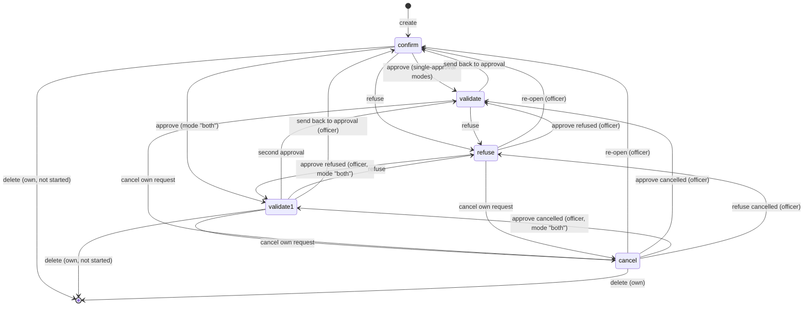
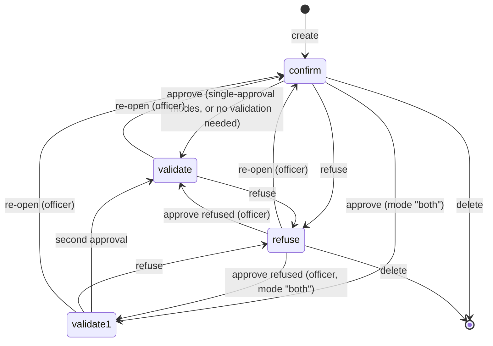
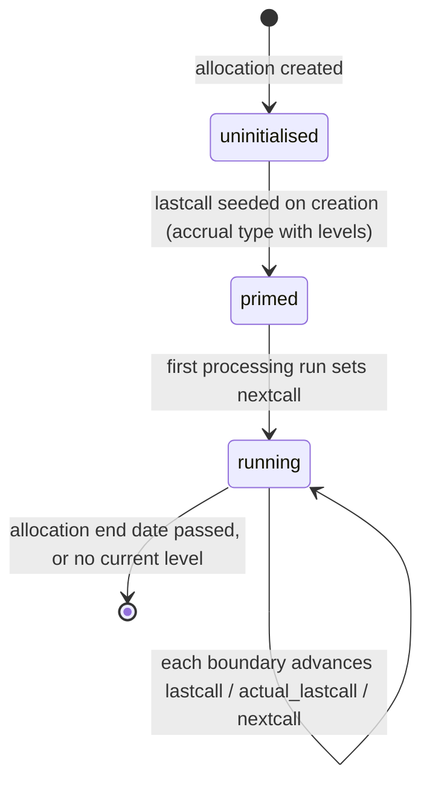

# Time Off — State Machines

This domain contains two explicit state machines — one on the Time Off Request
(`hr.leave`, table `hr_leave`), one on the Time Off Allocation (`hr.leave.allocation`,
table `hr_leave_allocation`) — plus two derived status projections used for display (the
employee's current absence status and the request's hatched/striked rendering flags), and
one implicit lifecycle on the accrual cursor of an allocation.

Both explicit machines are unusual in three ways that a re-implementation must reproduce
exactly:

1. **There is no draft state.** A request and an allocation are both born in the state
   *awaiting approval*.
2. **The set of reachable next states depends on the acting user's role**, not only on
   the current state. A single function computes, for one record and one acting user, the
   complete map from current state to the set of allowed next states. Every guard, every
   button's visibility and every error message derives from that map.
3. **Transitions are reversible in both directions for privileged users.** An officer may
   send an approved request back to the approval queue, may approve a refused request,
   and may re-open a cancelled one. The machine is therefore not acyclic.

---

## 1. The validation modes

Both machines are parameterised by a *validation mode* carried on the Time Off Type: the
request machine by the request validation mode (`leave_validation_type`), the allocation
machine by the allocation validation mode (`allocation_validation_type`). Both use the
same four values.

| Value | Label | Meaning |
|---|---|---|
| `no_validation` | None needed | The record is approved automatically the moment it is created. |
| `hr` | By Time Off Officer | One approval, by a holder of the Time Off Officer group. |
| `manager` | By Employee's Approver | One approval, by the employee's designated absence approver (or by an officer). |
| `both` | By Employee's Approver and Time Off Officer | Two approvals: first by the approver (moving to second approval), then by an officer (moving to approved). |

---

## 2. The request state machine

### 2.1 States

| Value | Label | Meaning |
|---|---|---|
| `confirm` | To Approve | Filed and waiting. Consumes entitlement *provisionally* (it is counted in the provisionally remaining balance) but does not yet remove working time. |
| `validate1` | Second Approval | First of two approvals granted. Still provisional: no working time removed. |
| `validate` | Approved | Final state of the happy path. A working time exclusion record exists; optionally a calendar meeting exists; entitlement is definitively consumed. |
| `refuse` | Refused | Rejected by an approver. Consumes nothing. Any meeting is deactivated. Any working time exclusion is removed. |
| `cancel` | Cancelled | Withdrawn, normally by the requesting employee, always with the option of a reason. Consumes nothing. Any meeting is deactivated; any working time exclusion is removed. |

There is no stored draft value and no terminal marker: `refuse` and `cancel` are both
re-openable by an officer.

### 2.2 Diagram



### 2.3 The reachable-state map

For one request and one acting user, the map is built as follows. Let:

- *own* mean that the request's employee is one of the acting user's employees;
- *in the past* mean that the request's absolute start date falls on a day strictly before
  today;
- *officer* mean that the acting user holds the Time Off Officer group;
- *approver* mean that the acting user is the request employee's designated absence
  approver;
- *mode* be the type's request validation mode.

Start from an empty set for each of the five states, then apply these rules in order:

1. **Self-cancellation.** If *own* and (not *in the past* or *officer*), then add
   `cancel` to the allowed successors of `validate1`, of `validate` and of `refuse`.
2. **Officer powers.** If *officer*:
   - if *mode* is `both`: add `validate1` to the successors of `confirm`, of `refuse` and
     of `cancel`;
   - add `validate` and `refuse` to the successors of `confirm`;
   - add `confirm`, `validate` and `refuse` to the successors of `validate1`;
   - add `confirm` and `refuse` to the successors of `validate`;
   - add `confirm` and `validate` to the successors of `refuse`;
   - add `confirm`, `validate` and `refuse` to the successors of `cancel`.
3. **Approver powers** (applied only when the user is *not* an officer). If *approver*:
   - if *mode* is not `hr`: add `refuse` to the successors of `confirm` and of `validate`;
   - if *mode* is `both`: add `validate1` to the successors of `confirm`, and `refuse` to
     the successors of `validate1`;
   - else if *mode* is `manager`: add `validate` to the successors of `confirm` and of
     `refuse`.

An ordinary employee who is neither officer nor approver obtains only the
self-cancellation entries of rule 1.

### 2.4 Transition table

| From | To | Trigger operation | Guard conditions | Side effects |
|---|---|---|---|---|
| (none) | `confirm` | Create a request | An employee must be set; the overlap check, the mandatory-day check and the entitlement check must all pass | Duration recomputed after creation; the employee subscribed to the thread; for mode `manager` the approver also subscribed; an approval activity created for each responsible user; entitlement caches invalidated |
| (none) | `validate` | Create a request of a type whose mode is `no_validation` | As above | All of the above, then the approval is executed in an elevated context, the responsible users are subscribed, and the message *"The time off has been automatically approved"* is posted as a comment |
| `confirm` | `validate1` | Approve | `validate1` in the reachable-state map; mode must be `both`; the double-validation rule must pass | First approver set to the acting user's employee; activities refreshed |
| `confirm` | `validate` | Approve | `validate` in the reachable-state map; the request must not have a zero duration | See [section 2.5](#25-side-effects-of-reaching-approved) |
| `validate1` | `validate` | Approve | `validate` in the reachable-state map; the double-validation rule must pass; zero-duration check | Second approver set; see [section 2.5](#25-side-effects-of-reaching-approved) |
| `confirm`, `validate1`, `validate` | `refuse` | Refuse | State must be one of those three | See [section 2.6](#26-side-effects-of-refusal) |
| `validate` | `confirm` | Send back to approval | The reachable-state map must contain `confirm` from `validate` (officer only) | Working time exclusion deleted; meeting deactivated; activities refreshed |
| `validate1`, `validate`, `refuse` | `cancel` | Cancel, through the cancellation wizard | `cancel` in the reachable-state map | See [section 2.7](#27-side-effects-of-cancellation) |
| `refuse`, `cancel` | `confirm`, `validate1`, `validate` | Re-open or approve | Officer only, per the map | The normal side effects of the target state |

### 2.5 Side effects of reaching approved

In order:

1. **Zero-duration guard.** Any request in the batch that has an employee and a duration
   of zero days aborts the whole operation with the validation error: *"The following
   employees are not supposed to work during that period:"* followed by a comma-separated
   list of the employee names. This is what stops an absence being approved for a period
   that is entirely non-working (for example a request placed wholly on a weekend or
   wholly on a public holiday).
2. The state is written to `validate`.
3. The **second approver** is set on requests whose mode is `both`; the **first approver**
   is set on all others.
4. A **Working Time Exclusion** record is created for every request that has an employee,
   with: reason *"`<employee name>`: Time Off"*, the absolute start and end, the back-link
   to the request, the employee's resource, the request's working schedule, the type's
   kind of time off, and the type's accrual-eligibility flag. This is the record that
   actually removes the hours from the employee's availability.
5. For every request whose type asks for a calendar entry, a **Calendar Meeting** is
   created. Its values are described in
   [Workflows, chapter 5](workflows.md#5-validating-an-absence-request). The meeting's
   identifier is written back onto the request.
6. A message is posted on each request, addressed to the employee's login user:
   *"Your `<type display name>` planned on `<start date and time in the request's time
   zone>` has been accepted"*.
7. Approval activities are closed for requests whose mode is not `no_validation`.

### 2.6 Side effects of refusal

1. Guard: every record in the batch must be in `confirm`, `validate1` or `validate`,
   otherwise *"Time off request must be confirmed or validated in order to refuse it."*
2. The **approver is notified**: for requests whose mode is `both` and whose state is
   `validate1` or `validate`, and for requests whose mode is `manager` and whose state is
   `validate`, a direct notification is sent to the employee's absence approver with
   subject *"Refused Time Off"* and body *"`<request display name>` has been refused."*
3. Requests that were in `validate1` get the **first** approver set to the acting user's
   employee; all others get the **second** approver set.
4. Every attached meeting is deactivated.
5. A message is posted to the employee's login user: *"Your `<type display name>` planned
   on `<absolute start>` has been refused"*.
6. Activities are cleared.
7. Because the state left `validate`, the working time exclusion record is deleted (this
   happens in the write handler, before the state change is stored).

### 2.7 Side effects of cancellation

Cancellation is always routed through the wizard, which collects an optional reason.

1. Guard: the computed can-cancel flag must be true, else *"This time off cannot be
   cancelled."*
2. If a reason was given, for each request:
   - a message is posted in the request's thread — as a **note** for a self-cancellation,
     as a **comment** for a forced cancellation — reading *"The time off request has been
     cancelled for the following reason:"* followed by the reason in its own paragraph;
   - the **responsible parties** are notified, chosen by mode and state: for mode
     `manager` in state `validate`, and for mode `both` in state `validate1`, the
     employee's absence approver; for mode `hr` in state `validate`, the type's notified
     officers; for mode `both` in state `validate`, both. The notification subject is
     *"Cancelled Time Off"* and the body is *"`<request display name>` has been cancelled
     for the following reason: `<reason, quoted>`"*.
3. The state is written to `cancel` in an elevated context.
4. Activities are cleared.
5. The meeting is deactivated and the working time exclusion is deleted.

Notification of the responsible parties can be suppressed; the departure procedure does
so.

### 2.8 Error messages raised by the guard

The guard function is called before every state write. It walks the following ladder and
raises the **first** message that applies (or returns false, when it is being used to
compute a can-do flag rather than to block an operation).

| Condition | Message |
|---|---|
| The current state already equals the target | "You can't do the same action twice." |
| Target is `validate1` but the mode is not `both` | "Not possible state. State Approve is only used for leave needed 2 approvals" |
| The current state is `cancel` (and the target is not otherwise allowed) | "A cancelled leave cannot be modified." |
| Target `cancel` not reachable | "You can only cancel your own leave. You can cancel a leave only if this leave is approved, validated or refused." |
| Target `confirm` not reachable | "You can't reset a leave. Cancel/delete this one and create an other" |
| Target `validate1` not reachable, user is not the employee's approver | "Only a Time Off Officer/Manager can approve a leave." |
| Target `validate1` not reachable, user is the approver | "You can't approve a validated leave." |
| Target `validate` not reachable, user is not the approver | "Only a Time Off Officer/Manager can validate a leave." |
| Target `validate` not reachable, user is the approver, current state is `refuse` | "You can't approve this refused leave." |
| Target `validate` not reachable, user is the approver, other states | "You can only validate a leave with validation by Time Off Manager." |
| Target `refuse` not reachable, user is not the approver | "Only a Time Off Officer/Manager can refuse a leave." |
| Target `refuse` not reachable, user is the approver | "You can't refuse a leave with validation by Time Off Officer." |
| Target reachable but the target is not `cancel` and the user lacks write access under the record rules | the platform's own access error, re-raised |

The superuser bypasses the guard entirely.

### 2.9 The double-validation rule

Independently of the reachable-state map, records whose mode is `both` pass an extra
check at creation and on every state write, skipped entirely for holders of the Time Off
Administrator group:

- moving to `validate1`: the set of employees concerned is narrowed to those whose
  absence approver is **not** the acting user; if that set is non-empty and the acting
  user is not an officer, the access error *"You cannot first approve a time off for
  `<employee name>`, because you are not his time off manager"* is raised, naming the
  first such employee;
- moving to `validate`: a non-officer is refused with *"You don't have the rights to apply
  second approval on a time off request"*.

### 2.10 The approve operation's dispatch

The single approve operation serves both approval steps. For each record in the batch:

- if the can-validate flag is true (or, when the state check is disabled, the mode is not
  `both`), the record joins the **validate** group;
- else if the can-approve flag is true (or, when the state check is disabled, the mode
  **is** `both`), the record joins the **first approval** group;
- else the operation aborts with *"You cannot approve this leave."*

The first-approval group is written to `validate1` with the first approver set; the
validate group goes through the full approved procedure of
[section 2.5](#25-side-effects-of-reaching-approved).

---

## 3. The allocation state machine

### 3.1 States

| Value | Label | Meaning |
|---|---|---|
| `confirm` | To Approve | Filed and waiting. The entitlement is **not** yet usable. |
| `validate1` | Second Approval | First of two approvals granted. Still not usable. |
| `validate` | Approved | The entitlement is usable and is counted by the balance algorithm. |
| `refuse` | Refused | Rejected. Not usable. |

There is no cancelled state on an allocation.

### 3.2 Diagram



### 3.3 The reachable-state map

Let *officer* and *approver* have the same meaning as before and let *mode* be the type's
**allocation** validation mode.

1. If *officer*:
   - if *mode* is `both`: add `validate1` to the successors of `confirm` and of `refuse`;
   - add `confirm`, `validate` and `refuse` to the successors of `validate1`;
   - add `validate` and `refuse` to the successors of `confirm`;
   - add `confirm` and `refuse` to the successors of `validate`;
   - add `confirm` and `validate` to the successors of `refuse`.
2. Else if *approver*:
   - if *mode* is not `hr`: add `refuse` to the successors of `confirm` and of `validate`;
   - if *mode* is `both`: add `validate1` to the successors of `confirm`, and `refuse` to
     the successors of `validate1`;
   - else if *mode* is `manager`: add `validate` to the successors of `confirm` and of
     `refuse`.
3. Regardless of role: if *mode* is `no_validation`, add `validate` to the successors of
   `confirm`.

### 3.4 Transition table

| From | To | Trigger | Guard | Side effects |
|---|---|---|---|---|
| (none) | `confirm` | Create | The supplied state, if any, must be `confirm`, else *"Incorrect state for new allocation"* | Department defaulted from the employee; the accrual cursor initialised (see [section 4](#4-the-accrual-cursor)); the employee's login user subscribed, and for mode `hr` also the employee's parent and absence approver; an approval activity created |
| `confirm` | `validate` | Approve (or automatically, when the mode is `no_validation`) | `validate` in the map | The approver is set; for mode `both`, when no first approver exists yet, **both** the first and the second approver are set to the acting user's employee; activities closed |
| `confirm` | `validate1` | Approve, mode `both` | `validate1` in the map | First approver set; a second-approval activity created |
| `validate1` | `validate` | Approve | `validate` in the map | Second approver set; activities closed |
| `confirm`, `validate1`, `validate` | `refuse` | Refuse | State must be one of those three, else *"Allocation request must be confirmed, second approval or validated in order to refuse it."* | The first approver is set to the acting user's employee; activities cleared |
| `validate`, `validate1`, `refuse` | `confirm` | Re-open | Officer only | — |

### 3.5 Error messages raised by the allocation guard

| Condition | Message |
|---|---|
| The current state already equals the target | "You can't do the same action twice." |
| The allocation belongs to the acting user's own employee, the allocation validation mode is not `no_validation`, and the user is not a Time Off Administrator | "Only a time off Administrator can approve/refuse their own requests." |
| Target `confirm` not reachable | "You can't reset an allocation. Cancel/delete this one and create an other" |
| Target `validate1` not reachable, user is not the approver | "Only a Time Off Officer/Manager can approve an allocation." |
| Target `validate1` not reachable, user is the approver | "You can't approve a validated allocation." |
| Target `validate` not reachable, user is not the approver | "Only a Time Off Officer/Manager can validate an allocation." |
| Target `validate` not reachable, user is the approver, current state is `refuse` | "You can't approve this refused allocation." |
| Target `validate` not reachable, user is the approver, other states | "You can only validate an allocation with validation by Time Off Manager." |
| Target `refuse` not reachable, user is not the approver | "Only a Time Off Officer/Manager can refuse an allocation." |
| Target `refuse` not reachable, user is the approver | "You can't refuse an allocation with validation by Time Off Officer." |

### 3.6 The allocation approve operation's dispatch

For each record: if the can-validate flag is true it joins the validate group; else if the
can-approve flag is true it joins the first-approval group; else the operation aborts with
*"Allocation must be "To Approve" in order to approve it."*

---

## 4. The accrual cursor

An accrual allocation carries four fields that together form a cursor into the accrual
timeline. They are not a user-visible state machine but they behave like one, and a
re-implementation must advance them in the same order.

| Field | Meaning |
|---|---|
| `lastcall` — date of the last accrual allocation | The most recent **period end** at which entitlement was actually added. |
| `nextcall` — date of the next accrual allocation | The next boundary the loop must process. Empty means the plan has never run for this allocation. |
| `actual_lastcall` | The most recent boundary the loop stopped at, whether or not entitlement was added there. A carry-over date and a level transition date update this but not `lastcall`. |
| `already_accrued` | True when the entitlement for the period now open has already been granted in advance (plans that grant at the start of the period), so that the next iteration must skip the grant. |

### 4.1 Cursor lifecycle



**Uninitialised → primed.** On creation, and on any write that changes the allocation
type, the priming routine runs for every accrual allocation whose plan has levels:

1. Determine the current level for today (see
   [Calculations, chapter 7](calculations.md#7-selecting-the-current-accrual-level)). If
   there is none but the first level's start date *is* exactly today, take the first
   level.
2. If `lastcall` is empty:
   - when no current level was found, set both `lastcall` and `actual_lastcall` to today
     and stop;
   - otherwise set `lastcall` (and `actual_lastcall`) to the later of the level's previous
     period boundary before today and the level's own start date.
3. If a current level exists and `nextcall` is empty:
   - set `nextcall` to the level's next period boundary after `lastcall`;
   - when the plan's transition mode is immediate and a further level exists, lower it to
     the start date of that next level if that is earlier;
   - when a carried-over expiry date exists and is later than `lastcall`, lower it to that
     expiry date if that is earlier.

**Primed → running.** The processing routine, run by the daily job or on demand, replays
every boundary from `nextcall` up to the target date. The full algorithm is in
[Calculations, chapter 9](calculations.md#9-the-accrual-processing-algorithm).

### 4.2 Re-initialisation

Changing the start date, the accrual plan, the end date or the employee of a
**non-approved** accrual allocation resets the cursor completely, so that the simulated
balance shown in the form reflects the new configuration:

```
lastcall                         := the new start date
nextcall                         := empty
number_of_days                   := 0
number_of_days_display           := 0
number_of_hours_display          := 0
already_accrued                  := false
carried_over_days_expiration_date := empty
expiring_carryover_days          := 0
```

and the processing routine is then run up to the earlier of the allocation end date and
today. The record is left in a state from which the scheduled job can continue normally.

---

## 5. Derived status projections

### 5.1 Current absence status of an employee

Not a stored state; recomputed on read from the employee's approved requests that cover
the current instant.

| Value | Label |
|---|---|
| `confirm` | Waiting Approval |
| `refuse` | Refused |
| `validate1` | Waiting Second Approval |
| `validate` | Approved |
| `cancel` | Cancelled |

In practice only `validate` is ever produced, because the search that feeds the
computation is restricted to approved requests. Alongside it the platform sets:

- **From Date** — the date part of the covering request's absolute start;
- **To Date** — the date on which the employee is next scheduled to work after the
  covering request's absolute end, found by scanning forward over the employee's working
  intervals with a widening look-ahead of seven, thirty, ninety, one hundred and eighty,
  three hundred and sixty-five and seven hundred and thirty days, and returning the start
  of the first working interval found;
- **Absent Today** — true when a covering approved request exists whose type's kind of
  time off is "Absence".

The presence state of an employee who is not present and is absent today is forced to
"absent"; the presence icon becomes "On leave", or "Present but on leave" when the
employee is simultaneously detected as present.

### 5.2 Instant-messaging status

A login user (and, through it, a contact) who is covered right now by an approved request
of a type whose kind of time off is "Absence" has their instant-messaging status mapped:

| Base status | Mapped status |
|---|---|
| online | leave_online |
| away | leave_away |
| busy | leave_busy |
| offline | leave_offline |

### 5.3 Rendering flags on a request

| Flag | Rule |
|---|---|
| Striked (`is_striked`) | state equals `refuse` |
| Hatched (`is_hatched`) | state is neither `refuse` nor `validate` |

So an approved request renders solid, a refused one struck through, and everything else
hatched.
