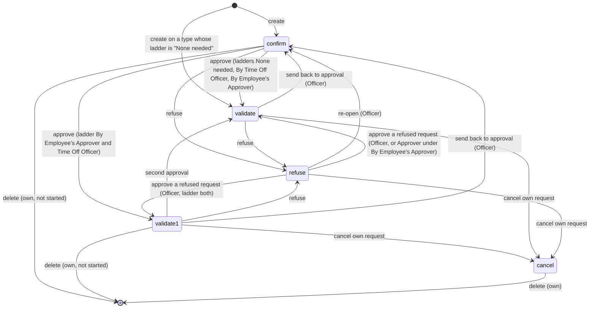
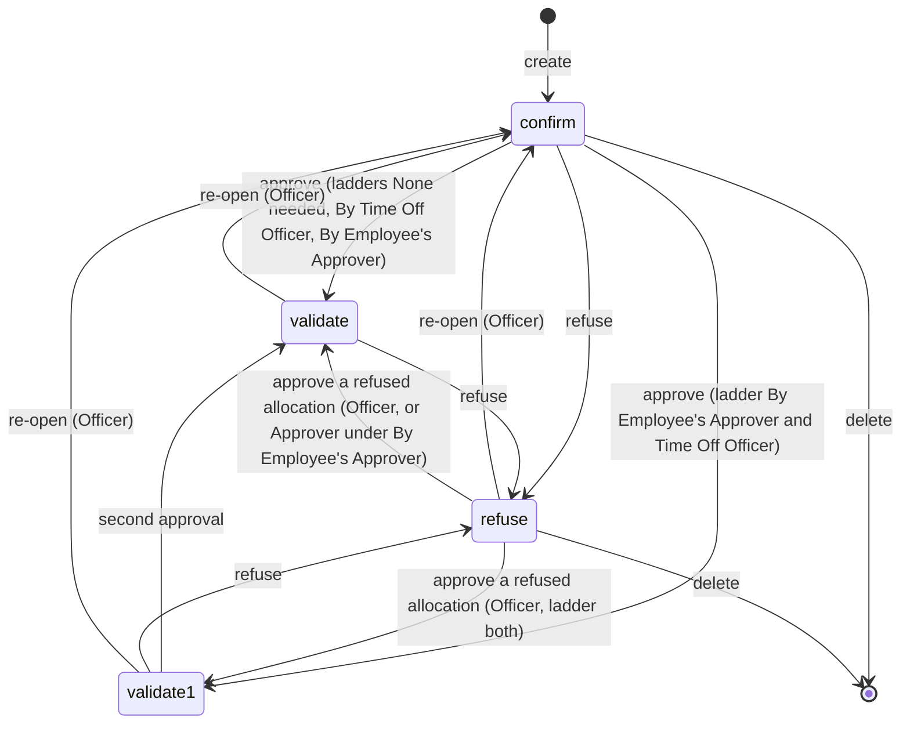
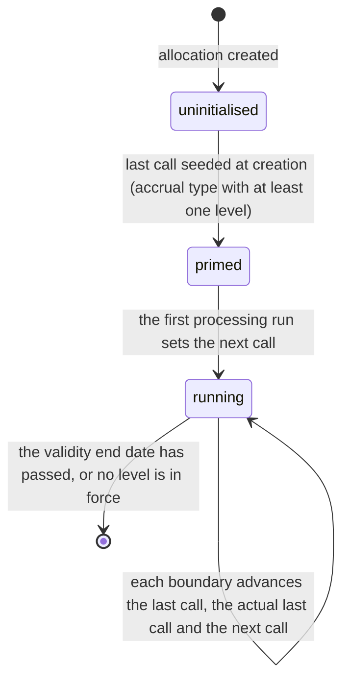

# Time Off — State Machines

This domain contains two explicit state machines — one on the Time Off Request (`hr.leave`,
table `hr_leave`), one on the Time Off Allocation (`hr.leave.allocation`, table
`hr_leave_allocation`) — plus one implicit lifecycle on the accrual cursor of an allocation
and three derived status projections used for display.

Both explicit machines are unusual in three ways that a re-implementation must reproduce
exactly:

1. **There is no draft state.** A request and an allocation are both born in the state
   *To Approve*.
2. **The set of reachable next states depends on the acting user's role**, not only on the
   current state. One function computes, for one record and one acting user, the complete map
   from the current state to the set of permitted next states. Every guard, every button's
   visibility and every refusal message derives from that map.
3. **Transitions are reversible in both directions for privileged users.** An Officer may
   send an approved request back to the approval queue, may approve a refused request, and
   may re-open a cancelled one. Neither machine is acyclic.

Every message quoted below is reproduced exactly as the system produces it.

---

## 1. The approval ladders

Both machines are parameterised by an *approval ladder* carried on the Time Off Type: the
request machine by the request approval ladder (`leave_validation_type`), the allocation
machine by the allocation approval ladder (`allocation_validation_type`). Both use the same
four values.

| Stored value | Label | Meaning |
|---|---|---|
| `no_validation` | None needed | The record is approved automatically the moment it is created. |
| `hr` | By Time Off Officer | One approval, by a holder of the Time Off Officer group. |
| `manager` | By Employee's Approver | One approval, by the employee's designated Time Off Approver, or by an Officer. |
| `both` | By Employee's Approver and Time Off Officer | Two approvals: first by the approver, moving the record to *Second Approval*, then by an Officer, moving it to *Approved*. |

Three role words are used throughout this file:

- **Officer** — the acting user holds the Time Off Officer group, which the Administrator
  group implies.
- **Approver** — the acting user is named as the Time Off Approver on the employee record
  concerned. Where the two apply together the Officer role wins, because the approver branch
  is evaluated only when the officer branch did not apply.
- **Owner** — the record's employee is one of the acting user's own employee records.

---

## 2. The request state machine

### 2.1 States

| Stored value | Label | Meaning |
|---|---|---|
| `confirm` | To Approve | Filed and waiting for the first decision. The default state at creation. Consumes entitlement *provisionally* — it is counted in the provisionally remaining balance — but removes no working time. |
| `validate1` | Second Approval | The first of two approvals has been granted. Reachable only under the ladder "By Employee's Approver and Time Off Officer". Still provisional: no working time removed. |
| `validate` | Approved | Fully approved. The absence is materialised: a Working Time Exclusion exists, optionally a Calendar Event, timesheet lines and work entries; entitlement is definitively consumed. |
| `refuse` | Refused | Rejected by an approver. Consumes nothing. Materialisation is reversed. |
| `cancel` | Cancelled | Withdrawn, normally by the requesting employee, always with the option of a reason. Consumes nothing. Materialisation is reversed. The record becomes immutable to everybody except an Administrator, and no further state change is possible. |

There is no stored draft value and no terminal marker: both `refuse` and `cancel` can be
re-opened by an Officer, although a state change out of `cancel` is blocked by a dedicated
guard that fires before the reachable-state map is consulted.

### 2.2 Diagram

### 2.3 The reachable-state map

For one request and one acting user, the map is built as follows. Let *own*, *officer* and
*approver* carry the meanings of [chapter 1](#1-the-approval-ladders), let *in the past* mean
that the request's absolute start date falls on a day strictly before today, and let *ladder*
be the type's request approval ladder. Start from an empty successor set for each of the five
states, then apply these rules in order.

1. **Self-cancellation.** When *own* and (not *in the past* or *officer*), add `cancel` to the
   successors of `validate1`, of `validate` and of `refuse`.
2. **Officer powers.** When *officer*:
   - when *ladder* is `both`, add `validate1` to the successors of `confirm`, of `refuse` and
     of `cancel`;
   - add `validate` and `refuse` to the successors of `confirm`;
   - add `confirm`, `validate` and `refuse` to the successors of `validate1`;
   - add `confirm` and `refuse` to the successors of `validate`;
   - add `confirm` and `validate` to the successors of `refuse`;
   - add `confirm`, `validate` and `refuse` to the successors of `cancel`.
3. **Approver powers**, applied only when the user is **not** an Officer. When *approver*:
   - when *ladder* is not `hr`, add `refuse` to the successors of `confirm` and of `validate`;
   - when *ladder* is `both`, add `validate1` to the successors of `confirm`, and `refuse` to
     the successors of `validate1`;
   - otherwise, when *ladder* is `manager`, add `validate` to the successors of `confirm` and
     of `refuse`.

An ordinary employee who is neither Officer nor Approver obtains only the self-cancellation
entries of rule 1. Every actor who is neither Officer, nor Approver, nor Owner has no
permitted transition at all.

### 2.4 The same map as tables

**Officer, ladder "None needed", "By Time Off Officer" or "By Employee's Approver":**

| From | Permitted targets |
|---|---|
| `confirm` | `validate`, `refuse` |
| `validate1` | `confirm`, `validate`, `refuse` |
| `validate` | `confirm`, `refuse` |
| `refuse` | `confirm`, `validate` |
| `cancel` | `confirm`, `validate`, `refuse` in the map, but the cancelled guard of [section 2.9](#29-the-guard-ladder-and-its-messages) fires first |

**Officer, ladder "By Employee's Approver and Time Off Officer":**

| From | Permitted targets |
|---|---|
| `confirm` | `validate1`, `validate`, `refuse` |
| `validate1` | `confirm`, `validate`, `refuse` |
| `validate` | `confirm`, `refuse` |
| `refuse` | `confirm`, `validate1`, `validate` |
| `cancel` | `confirm`, `validate1`, `validate`, `refuse` in the map, but the cancelled guard fires first |

**Approver who is not an Officer:**

| Ladder | From `confirm` | From `validate1` | From `validate` | From `refuse` |
|---|---|---|---|---|
| None needed | `refuse` | none | `refuse` | none |
| By Time Off Officer | none | none | none | none |
| By Employee's Approver | `validate`, `refuse` | none | `refuse` | `validate` |
| By Employee's Approver and Time Off Officer | `validate1`, `refuse` | `refuse` | `refuse` | none |

**Owner, any ladder**, in addition to the rows above: from `validate1`, from `validate` and
from `refuse`, the target `cancel` is permitted, provided the request does not start before
today or the actor is an Officer.

### 2.5 Transition table

| From | To | Trigger operation | Guards | Records created or changed |
|---|---|---|---|---|
| (none) | `confirm` | Create a request | An employee must be set; the overlap check, the coverage check and the mandatory-day check must all pass; when the ladder is `both` and a state is named explicitly, the double-approval rule applies | The duration is recomputed after creation; the employee's login user is subscribed to the thread; under the ladder `manager` the Time Off Approver is subscribed as well; an approval activity is created for each responsible user; the balance mirrors of every allocation are invalidated |
| (none) | `validate` | Create a request of a type whose ladder is `no_validation` | As above | All of the above, then the approval is executed with elevated rights, the responsible approvers are subscribed, and the message "The time off has been automatically approved" is posted as a comment; then the side effects of [section 2.6](#26-side-effects-of-reaching-approved) |
| `confirm` | `validate1` | Approve | `validate1` in the map; the ladder must be `both`; the double-approval rule must pass | The first approver is set to the acting user's employee; the approval activity is marked done and a second-approval activity is created for each responsible user |
| `confirm` | `validate` | Approve | `validate` in the map; no request in the selection may have a zero duration | See [section 2.6](#26-side-effects-of-reaching-approved) |
| `validate1` | `validate` | Approve | `validate` in the map; the double-approval rule must pass; the zero-duration guard | The second approver is set; see [section 2.6](#26-side-effects-of-reaching-approved) |
| `confirm`, `validate1`, `validate` | `refuse` | Refuse | The state must be one of those three, else "Time off request must be confirmed or validated in order to refuse it." | See [section 2.7](#27-side-effects-of-refusal) |
| `validate`, `validate1` | `confirm` | Send back to approval | `confirm` in the map, which in practice means the actor is an Officer | The Working Time Exclusion is removed, the Calendar Event is archived, the work entries are archived and regenerated, the activities are rescheduled as for a new request |
| `validate1`, `validate`, `refuse` | `cancel` | Cancel, through the cancellation dialog | `cancel` in the map; no validated work entry may point at the request | See [section 2.8](#28-side-effects-of-cancellation) |
| `refuse`, `cancel` | `confirm`, `validate1`, `validate` | Re-open or approve | Officer only, per the map; a change out of `cancel` is additionally blocked by the cancelled guard | The ordinary side effects of the target state |
| any | (deleted) | Delete | The deletion rules of [business-rules.md](business-rules.md#5-deleting-refusing-cancelling-and-reopening) | The Calendar Event is archived, the Working Time Exclusion removed, the timesheet lines deleted and the public-holiday timesheet lines regenerated |

### 2.6 Side effects of reaching approved

In this order:

1. **Zero-duration guard.** Any request in the selection that has an employee and a duration
   of zero days aborts the whole operation with: *"The following employees are not supposed to
   work during that period:"* followed by a newline, a space and a comma-separated list of the
   employee names. This is what stops an absence being approved for a period that is entirely
   non-working, for example a request placed wholly on a weekend or wholly on a public
   holiday. With the payroll companion package installed, requests whose type maps to a work
   entry type whose code is `LEAVE110`, `LEAVE210` or `LEAVE280` are exempt.
2. **State check.** When the state check is active and any request in the selection may not be
   validated, the whole operation is refused with *"You can't validate this leave."*
3. The state is written to `validate`.
4. The **second approver** is set on requests whose ladder is `both`; the **first approver** is
   set on all the others.
5. **Timesheet lines** are generated first, when the timesheet companion package is present.
6. A **Working Time Exclusion** record is created for every request that has an employee, with
   the reason *"`<employee name>`: Time Off"*, the absolute start and end, the back-link to the
   request, the employee's resource, the request's working schedule, the type's kind of time
   off and the type's accrual-eligibility flag. This is the record that actually removes the
   hours from the employee's availability.
7. For every request whose type asks for a calendar entry, a **Calendar Event** is created and
   its identifier is written back onto the request. The values are in
   [workflows.md, chapter 3](workflows.md#31-materialisation-of-an-approved-absence).
8. A message is posted on each request and sent to the employee's login user: *"Your `<type
   display name>` planned on `<absolute start converted into the request's time zone>` has been
   accepted"*.
9. **Work entries** are generated last, when the payroll companion package is present.
10. Approval activities are marked done for requests whose ladder is not `no_validation`.

### 2.7 Side effects of refusal

1. Guard: every record in the selection must be in `confirm`, `validate1` or `validate`,
   otherwise *"Time off request must be confirmed or validated in order to refuse it."*
2. **The approver is notified**, before the state changes: for requests whose ladder is `both`
   and whose state is `validate1` or `validate`, and for requests whose ladder is `manager` and
   whose state is `validate`, a direct notification is sent to the employee's Time Off Approver
   with the subject *"Refused Time Off"* and the body *"`<request display name>` has been
   refused."*
3. Requests that were in `validate1` get the **first** approver set to the acting user's
   employee; all the others get the **second** approver set.
4. Because the state leaves `validate`, the Working Time Exclusion is removed by the write
   procedure before the new state is stored.
5. Every attached Calendar Event is archived.
6. A message is posted and sent to the employee's login user, only when the employee has one:
   *"Your `<type display name>` planned on `<absolute start>` has been refused"*.
7. The approval activities are removed.
8. The timesheet lines of the request are unlinked and deleted, and any missing public-holiday
   timesheet lines for the period are regenerated.
9. The work entries linked to the request are archived and attendance work entries are
   regenerated for the affected days.

### 2.8 Side effects of cancellation

Cancellation is always routed through the cancellation dialog, which collects an optional
reason.

1. Guard: the computed cancellation permission must be true, else *"This time off cannot be
   cancelled."*
2. When a reason was given, for each request: a message is posted in the request's thread — as
   an internal **note** for a self-cancellation, as a **comment** for a forced cancellation —
   reading *"The time off request has been cancelled for the following reason:"* followed by
   the reason in its own paragraph.
3. The **responsible parties** are notified, chosen by ladder and by the state held before the
   cancellation: for the ladder `manager` in state `validate`, and for the ladder `both` in
   state `validate1`, the employee's Time Off Approver; for the ladder `hr` in state
   `validate`, the Officers named on the type; for the ladder `both` in state `validate`, both.
   The subject is *"Cancelled Time Off"* and the body is *"`<request display name>` has been
   cancelled for the following reason: `<reason>`"*. Notification of the responsible parties
   can be suppressed; the departure procedure and the invalid-absence job both suppress it.
4. The state is written to `cancel` with elevated rights.
5. The activities are removed, the Calendar Event is archived and the Working Time Exclusion is
   removed.
6. The timesheet lines are unlinked and deleted and the missing public-holiday timesheet lines
   are regenerated.
7. The work entries are archived and attendance work entries are regenerated.

### 2.9 The guard ladder and its messages

The guard is called before every state write. It walks the following ladder and raises the
**first** message that applies, or returns false when it is being used to compute a
can-do flag rather than to block an operation. The superuser bypasses the guard entirely.

| Order | Condition | Message |
|---|---|---|
| 1 | The current state already equals the target | "You can't do the same action twice." |
| 2 | The target is `validate1` but the ladder is not `both` | "Not possible state. State Approve is only used for leave needed 2 approvals" |
| 3 | The current state is `cancel` | "A cancelled leave cannot be modified." |
| 4 | Target `cancel` not in the map | "You can only cancel your own leave. You can cancel a leave only if this leave is approved, validated or refused." |
| 5 | Target `confirm` not in the map | "You can't reset a leave. Cancel/delete this one and create an other" |
| 6 | Target `validate1` not in the map, the actor is not the employee's Approver | "Only a Time Off Officer/Manager can approve a leave." |
| 7 | Target `validate1` not in the map, the actor is the Approver | "You can't approve a validated leave." |
| 8 | Target `validate` not in the map, the actor is not the Approver | "Only a Time Off Officer/Manager can validate a leave." |
| 9 | Target `validate` not in the map, the actor is the Approver, current state `refuse` | "You can't approve this refused leave." |
| 10 | Target `validate` not in the map, the actor is the Approver, any other current state | "You can only validate a leave with validation by Time Off Manager." |
| 11 | Target `refuse` not in the map, the actor is not the Approver | "Only a Time Off Officer/Manager can refuse a leave." |
| 12 | Target `refuse` not in the map, the actor is the Approver | "You can't refuse a leave with validation by Time Off Officer." |
| 13 | The target is in the map and is not `cancel`, but the actor lacks write access under the record rules | the platform's own access error, re-raised |

### 2.10 The double-approval rule

Independently of the reachable-state map, a record whose ladder is `both` passes an extra check
at creation and on every explicit state write. The check is skipped entirely for a holder of the
Time Off Administrator group.

- Moving to `validate1`: the set of employees concerned is narrowed to those whose Time Off
  Approver is **not** the acting user; when that set is not empty and the acting user is not an
  Officer, the operation is refused with *"You cannot first approve a time off for `<name of the
  first such employee>`, because you are not his time off manager"*.
- Moving to `validate`: a non-Officer is refused with *"You don't have the rights to apply second
  approval on a time off request"*.

### 2.11 The dispatch of the approve operation

The single approve operation serves both approval steps. For each record in the selection:

- when the can-validate flag is true, or, when the state check is disabled, when the ladder is
  not `both`, the record joins the **validation** set;
- else when the can-approve flag is true, or, when the state check is disabled, when the ladder
  **is** `both`, the record joins the **first approval** set;
- else the whole operation aborts with *"You cannot approve this leave."*

The first-approval set is written to `validate1` with the first approver set; the validation
set goes through the full approved procedure of
[section 2.6](#26-side-effects-of-reaching-approved). After the dispatch, and unless the
operation runs in fast mode, the activity update runs for every selected request.

---

## 3. The allocation state machine

### 3.1 States

| Stored value | Label | Meaning |
|---|---|---|
| `confirm` | To Approve | Requested and waiting for the first decision. The entitlement is **not** yet usable. |
| `validate1` | Second Approval | The first of two approvals has been granted. Still not usable. |
| `validate` | Approved | The entitlement is live: it is counted by the balance algorithm from its validity start date, and an accrual allocation starts being advanced by the daily run. |
| `refuse` | Refused | Rejected. The entitlement never counts. |

There is no cancelled state on an allocation: it is refused or deleted.

### 3.2 Diagram

### 3.3 The reachable-state map

Let *officer* and *approver* carry the same meanings and let *ladder* be the type's
**allocation** approval ladder.

1. When *officer*:
   - when *ladder* is `both`, add `validate1` to the successors of `confirm` and of `refuse`;
   - add `confirm`, `validate` and `refuse` to the successors of `validate1`;
   - add `validate` and `refuse` to the successors of `confirm`;
   - add `confirm` and `refuse` to the successors of `validate`;
   - add `confirm` and `validate` to the successors of `refuse`.
2. Otherwise, when *approver*:
   - when *ladder* is not `hr`, add `refuse` to the successors of `confirm` and of `validate`;
   - when *ladder* is `both`, add `validate1` to the successors of `confirm`, and `refuse` to
     the successors of `validate1`;
   - otherwise, when *ladder* is `manager`, add `validate` to the successors of `confirm` and
     of `refuse`.
3. Whatever the role: when *ladder* is `no_validation`, add `validate` to the successors of
   `confirm`.

### 3.4 The same map as tables

**Officer, ladder "None needed", "By Time Off Officer" or "By Employee's Approver":**

| From | Permitted targets |
|---|---|
| `confirm` | `validate`, `refuse` |
| `validate1` | `confirm`, `validate`, `refuse` |
| `validate` | `confirm`, `refuse` |
| `refuse` | `confirm`, `validate` |

**Officer, ladder "By Employee's Approver and Time Off Officer":** the same, plus `validate1`
as a successor of `confirm` and of `refuse`.

**Approver who is not an Officer:**

| Ladder | From `confirm` | From `validate1` | From `validate` | From `refuse` |
|---|---|---|---|---|
| None needed | `validate`, `refuse` | none | `refuse` | none |
| By Time Off Officer | none | none | none | none |
| By Employee's Approver | `validate`, `refuse` | none | `refuse` | `validate` |
| By Employee's Approver and Time Off Officer | `validate1`, `refuse` | `refuse` | `refuse` | none |

**Any other actor:** only `confirm` to `validate`, and only when the ladder is "None needed".

### 3.5 Transition table

| From | To | Trigger | Guards | Records created or changed |
|---|---|---|---|---|
| (none) | `confirm` | Create | The creation values must name no state other than `confirm`, else "Incorrect state for new allocation" | The department is filled from the employee when the caller supplies none; the accrual cursor is initialised, see [chapter 4](#4-the-accrual-cursor); the employee's login user is subscribed, and under the ladder `hr` the employee's hierarchical parent's login user and the employee's Time Off Approver as well; an approval activity is created unless the creation comes from a file import |
| `confirm` | `validate` | Approve, or automatically at the end of the creation when the ladder is `no_validation` | `validate` in the map | The first approver is set; when the ladder is `both` and no first approver exists yet, **both** the first and the second approver are set to the acting user's employee; the activities are marked done |
| `confirm` | `validate1` | Approve, ladder `both` | `validate1` in the map | The first approver is set; the approval activity is marked done and a second-approval activity is created for each responsible user |
| `validate1` | `validate` | Approve | `validate` in the map | The second approver is set; the activities are marked done |
| `confirm`, `validate1`, `validate` | `refuse` | Refuse | The state must be one of those three, else "Allocation request must be confirmed, second approval or validated in order to refuse it." | The first approver is set to the acting user's employee; the approval activity is removed |
| `validate`, `validate1`, `refuse` | `confirm` | Re-open | Officer only, per the map | No side effect beyond the state write |
| `confirm`, `refuse` | (deleted) | Delete | The two deletion guards of [entities.md](entities.md#510-deletion-rules) | No side effect |
| any | copy | Duplicate | none | The copy lands in `confirm` and loses the approvers, the validity dates and the state |

### 3.6 The guard ladder and its messages

| Order | Condition | Message |
|---|---|---|
| 1 | The current state already equals the target | "You can't do the same action twice." |
| 2 | The allocation's employee is the acting user's own employee, the allocation approval ladder is not `no_validation`, and the actor is not an Administrator | "Only a time off Administrator can approve/refuse their own requests." |
| 3 | Target `confirm` not in the map | "You can't reset an allocation. Cancel/delete this one and create an other" |
| 4 | Target `validate1` not in the map, the actor is not the Approver | "Only a Time Off Officer/Manager can approve an allocation." |
| 5 | Target `validate1` not in the map, the actor is the Approver | "You can't approve a validated allocation." |
| 6 | Target `validate` not in the map, the actor is not the Approver | "Only a Time Off Officer/Manager can validate an allocation." |
| 7 | Target `validate` not in the map, the actor is the Approver, current state `refuse` | "You can't approve this refused allocation." |
| 8 | Target `validate` not in the map, the actor is the Approver, any other current state | "You can only validate an allocation with validation by Time Off Manager." |
| 9 | Target `refuse` not in the map, the actor is not the Approver | "Only a Time Off Officer/Manager can refuse an allocation." |
| 10 | Target `refuse` not in the map, the actor is the Approver | "You can't refuse an allocation with validation by Time Off Officer." |

### 3.7 The dispatch of the allocation approve operation

For each record: when the can-validate flag is true it joins the validation set; else when the
can-approve flag is true it joins the first-approval set; else the whole operation aborts with
*"Allocation must be "To Approve" in order to approve it."* The refuse operation pressed on an
allocation in any other state than *To Approve*, *Second Approval* or *Approved* produces
*"Allocation request must be confirmed, second approval or validated in order to refuse it."*

---

## 4. The accrual cursor

An accrual allocation carries five fields that together form a cursor into the accrual
timeline. They are not a user-visible state machine, but they behave like one, and a
re-implementation must advance them in the same order.

| Identifier | Full name | Meaning |
|---|---|---|
| `lastcall` | Date of the last accrual allocation | The most recent **period end** at which entitlement was actually added. |
| `nextcall` | Date of the next accrual allocation | The next boundary the loop must process. Empty means the plan has never run for this allocation. |
| `actual_lastcall` | Actual last call | The most recent boundary the loop stopped at, whether or not entitlement was added there. A carry-over date, a level transition date and a carried-over expiry date update this but not the last call. |
| `already_accrued` | Already accrued | True when the entitlement for the period now open has already been granted in advance, which happens on plans that grant at the start of the period, so that the next iteration must skip the grant. |
| `last_executed_carryover_date` | Last executed carry-over date | The carry-over cut-off most recently applied; read by the deferred carry-over of a start-of-period plan. |

### 4.1 Cursor lifecycle

### 4.2 Uninitialised to primed

At creation, and on any write that changes the allocation type, the priming routine runs for
every accrual allocation whose plan has at least one level. The procedure is in
[entities.md, section 5.12](entities.md#512-initialisation-of-the-accrual-cursor-at-creation).

### 4.3 Primed to running

The processing routine, run by the daily job or on demand, replays every boundary from the next
call date up to the target date. The full algorithm is in
[accrual-plans.md, chapter 7](accrual-plans.md#7-the-engine). On the first run the routine
additionally posts the internal note *"This allocation have already ran once, any modification
won't be effective to the days allocated to the employee. If you need to change the
configuration of the allocation, delete and create a new one."*

### 4.4 Re-initialisation of the cursor

Changing the validity start date, the Accrual Plan, the validity end date or the employee of a
**non-approved** accrual allocation resets the cursor completely, so that the simulated balance
shown on the form reflects the new configuration:

| Field | New value |
|---|---|
| `lastcall` | the new validity start date |
| `nextcall` | empty |
| `number_of_days` | 0 |
| `number_of_days_display` | 0 |
| `number_of_hours_display` | 0 |
| `already_accrued` | false |
| `carried_over_days_expiration_date` | empty |
| `expiring_carryover_days` | 0 |

The processing routine is then run up to the earlier of the validity end date and today. The
record is left in a state from which the scheduled job can continue normally.

---

## 5. Derived status projections

### 5.1 The current absence status of an employee

Not a stored state; recomputed on read from the employee's approved requests that cover the
present instant.

| Stored value | Label |
|---|---|
| `confirm` | Waiting Approval |
| `refuse` | Refused |
| `validate1` | Waiting Second Approval |
| `validate` | Approved |
| `cancel` | Cancelled |

In practice only `validate` is ever produced, because the search that feeds the computation is
restricted to approved requests. This is recorded as a **compatibility finding**: the field
declares five values of which four are unreachable. A corrected behaviour would either narrow
the field to a single value or widen the search; a compatible rebuild keeps the five values,
because integrations read the stored selection.

Alongside the status the platform sets:

- **Absent From** — the date part of the covering request's absolute start;
- **Back On** — the date on which the employee is next scheduled to work after the covering
  request's absolute end, found by scanning forward over the employee's working intervals with
  a widening look-ahead of seven, thirty, ninety, one hundred and eighty, three hundred and
  sixty-five and seven hundred and thirty days, returning the start of the first working
  interval found, and left empty when none is found;
- **Absent Today** — true when a covering approved request exists whose type's kind of time off
  is "Absence".

The presence state of an employee who is not present and is absent today is forced to "absent";
the presence icon becomes "On leave", or "Present but on leave" when the employee is
simultaneously detected as present. With the remote-working companion package installed the
absence icon wins over the work-location icon, and the label reads *"`<status label>`, back on
`<date>`"*.

### 5.2 The online status of a login user and of a contact

A login user, and through it a contact, covered right now by an approved request of a type
whose kind of time off is "Absence" has the online status mapped:

| Base status | Mapped status |
|---|---|
| online | `leave_online` |
| away | `leave_away` |
| busy | `leave_busy` |
| offline | `leave_offline` |

### 5.3 Rendering flags on a request

| Flag | Rule |
|---|---|
| Striked (`is_striked`) | the state equals `refuse` |
| Hatched (`is_hatched`) | the state is neither `refuse` nor `validate` |

So an approved request renders solid, a refused one struck through, and everything else hatched.

---

## 6. Reconciliation notes

1. **Two presentations of the same map.** One draft expressed the permitted transitions as a
   construction procedure, the other as tables per role and per ladder. Both are kept: the
   procedure in [section 2.3](#23-the-reachable-state-map) and
   [section 3.3](#33-the-reachable-state-map) is normative, and the tables in
   [section 2.4](#24-the-same-map-as-tables) and [section 3.4](#34-the-same-map-as-tables) are
   its expansion. They were checked against each other row by row.
2. **Cancelled records.** One draft showed transitions out of `cancel` in the diagram, the
   other stated that a cancelled request is immutable. Both are true at different levels: the
   reachable-state map does contain successors of `cancel` for an Officer, but the guard ladder
   raises "A cancelled leave cannot be modified." before the map is consulted, so no transition
   out of `cancel` can actually be performed. The diagram therefore omits those edges and
   [section 2.9](#29-the-guard-ladder-and-its-messages) records the order.
3. **Ordering of the guard messages.** One draft listed the messages without an order, the
   other in order. The order shown here is the one the guard evaluates, and it matters: the
   "same action twice" message and the "Not possible state" message both pre-empt the cancelled
   guard.
4. **Allocation created under a "None needed" ladder.** One draft treated the automatic
   approval as a transition from creation, the other as a second step at the end of the
   creation. The creation genuinely writes `confirm` first and then calls the approve
   operation, which is how [section 3.5](#35-transition-table) records it.
5. **This file did not exist in one of the two drafts.** It is written here in full from the
   state fields described in both drafts and from the behaviour of the guard and dispatch
   procedures.
