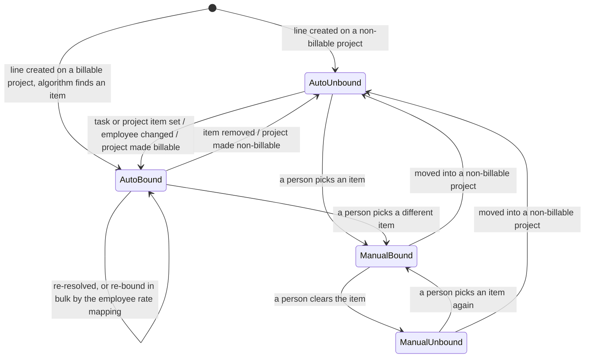
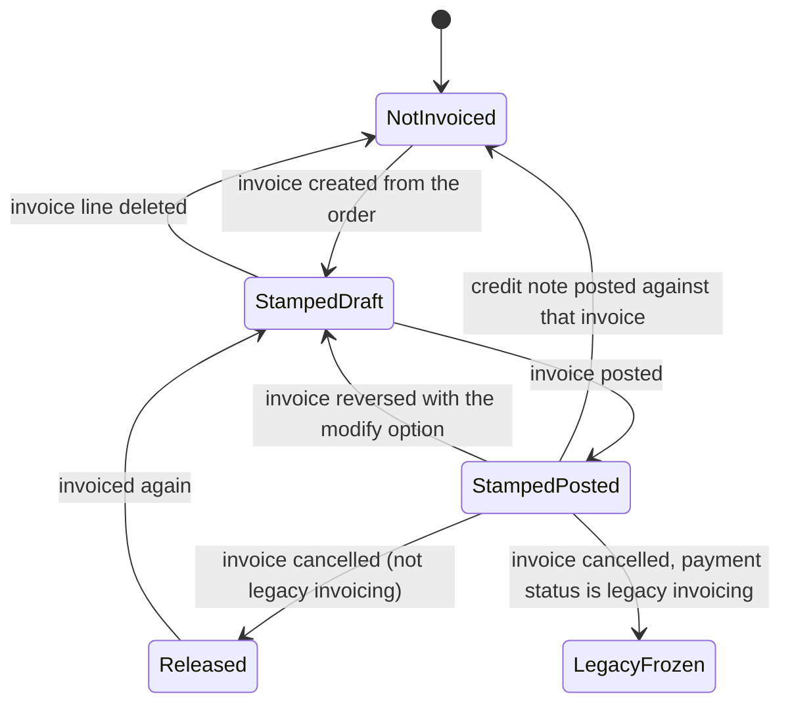
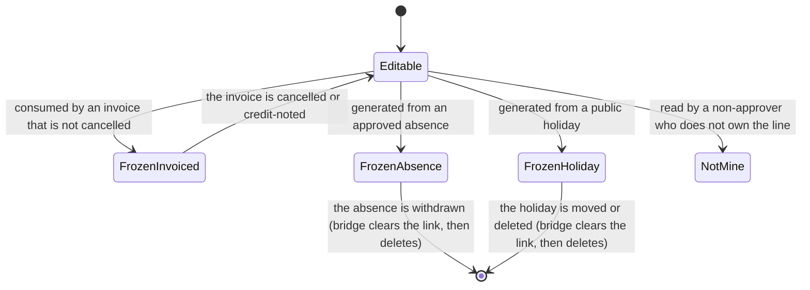
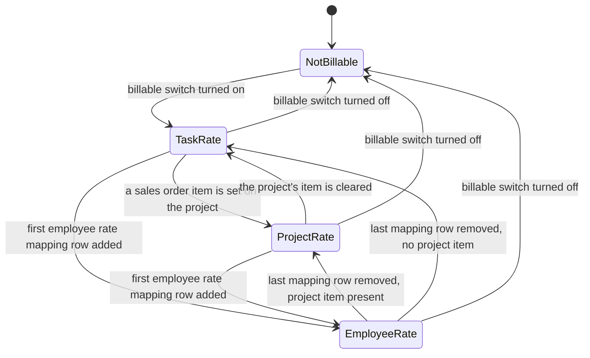
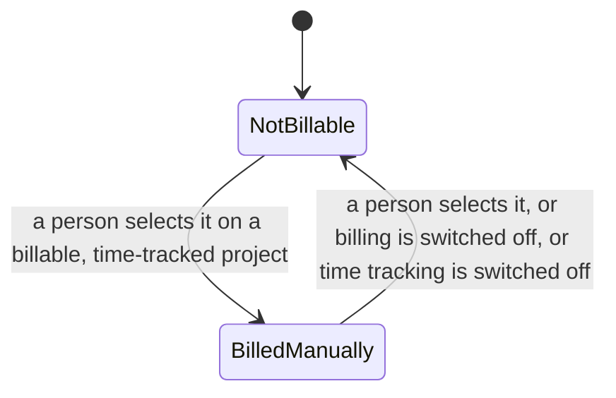
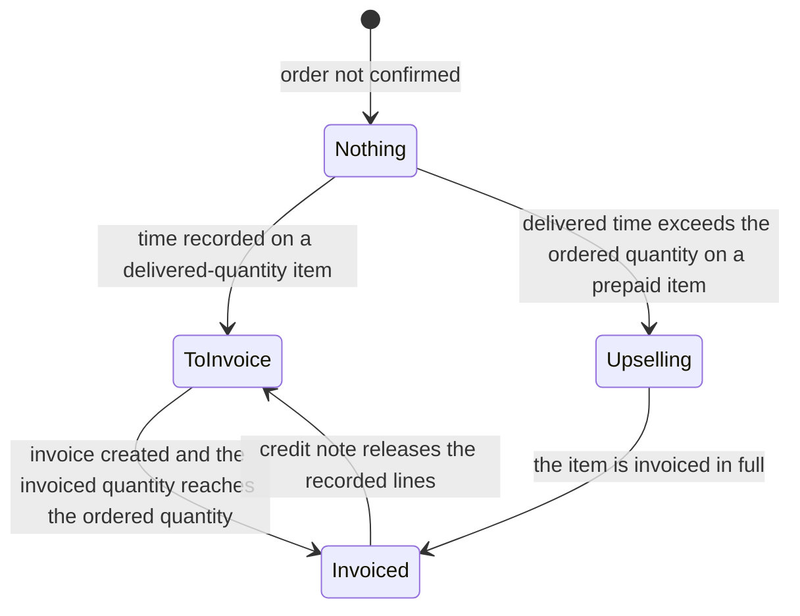
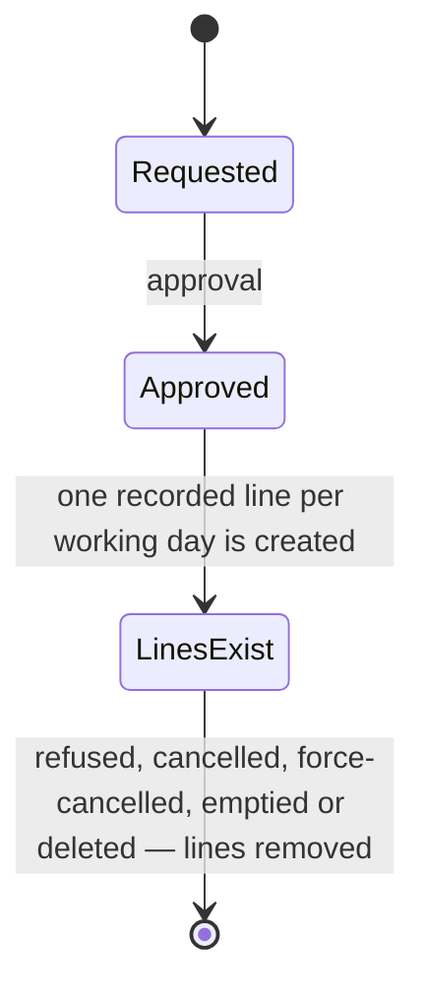

# Timesheets — State machines

A recorded line carries **no status column**. Its life cycle is nevertheless a state machine: four
independent conditions — whether it is bound to a sales order item, whether it has been consumed by
an invoice, where it came from, and whether it may still be changed — take a small number of values,
move between them under named operations, and decide what the system will accept.

This file states each of those machines completely: every state with its stored representation, its
label and its meaning; every transition with its origin, its destination, the operation that
triggers it, the guards evaluated in order and the records created or changed; and a diagram. It
then states the machines of the surrounding records — the project's pricing mode, the project's
billing type, the product's service policy, the sales order item's invoice status, the upselling
flag, the company's encoding method — because those are what drive the recorded line's own
transitions.

---

## 1. Machine A — the binding of a recorded line to a sales order item

### 1.1 States

| State | How it is represented | Label used in this specification | Meaning |
|---|---|---|---|
| Unbound | `so_line` ("Sales Order Item") is empty and `is_so_line_edited` ("Is Sales Order Item Manually Edited") is false | Automatically unbound | The resolution algorithm found no item, or the project is not billable. The blank is displayed as "Non-billable". |
| Bound automatically | `so_line` is set and `is_so_line_edited` is false | Automatically bound | The resolution algorithm chose the item. A later change of the task's item, the project's item, the employee or the billable switch will re-run the algorithm and may move the line. |
| Bound by hand | `so_line` is set and `is_so_line_edited` is true | Manually bound | A person chose the item. The resolution algorithm never overwrites it. |
| Unbound by hand | `so_line` is empty and `is_so_line_edited` is true | Manually unbound | A person cleared the item deliberately, making the line non-billable. The resolution algorithm never refills it. |

### 1.2 Transition table

| From | To | Trigger | Guards, in order | Records created or changed |
|---|---|---|---|---|
| Automatically unbound | Automatically bound | Any write or recomputation that touches the task's sales order item, the project's sales order item, the employee, or the project's billable switch | 1. the manual-edit flag is false; 2. the line is *not yet billed* ([calculations.md](calculations.md) §4.4); 3. the project is billable; 4. the resolution algorithm returns an item | The line's `so_line` is written; the stored `order_id` follows; the billable classification is recomputed |
| Automatically bound | Automatically bound (different item) | The same triggers | The same four guards | The line's `so_line` and `order_id` change; the classification is recomputed; the previous item's delivered quantity and the new item's delivered quantity are both recomputed |
| Automatically bound | Automatically unbound | The same triggers | 1. the manual-edit flag is false; 2. the line is *not yet billed*; 3. either the project is not billable, or the algorithm returns nothing | `so_line` is cleared; `order_id` follows; the classification becomes `non_billable` or `billable_manual` |
| Automatically unbound or Automatically bound | Manually bound | A person writes `so_line` on the line and the presentation sets `is_so_line_edited` to true | The write guard of §4 must pass | `so_line` and `is_so_line_edited` are written |
| Manually bound | Manually unbound | A person clears `so_line` | The write guard of §4 must pass | `so_line` is cleared; the manual-edit flag stays true |
| Manually bound or Manually unbound | Automatically unbound | A write moves the line into a project that is **not** billable | None beyond the write guard | The write forces `is_so_line_edited` to false; the automatic resolution then applies and yields nothing |
| Automatically bound | Automatically bound (re-bound in bulk) | An employee rate mapping row for the line's project is created or written and carries a sales order item | 1. the project is billable and time-tracked; 2. the manual-edit flag is false; 3. the line is *not yet billed*; 4. the line's employee is named in the mapping | `so_line` is written with elevated rights, bypassing the resolution algorithm |
| Any bound state | Automatically unbound | The project's billable switch is written to false | None | Every recorded line of every task of the project has `so_line` cleared |

### 1.3 Diagram

---

## 2. Machine B — the invoicing of a recorded line

### 2.1 States

| State | How it is represented | Label | Meaning |
|---|---|---|---|
| Not invoiced | `timesheet_invoice_id` ("Invoice") is empty | Not invoiced | The line has never been consumed, or it has been released. It is eligible to be consumed by a new invoice. |
| Stamped on a draft invoice | `timesheet_invoice_id` points at an invoice whose status is `draft` | Stamped, invoice not posted | The invoice-creation step has claimed the line. The line is frozen for its quantity, employee, project, task, binding and date, but it may still be deleted. |
| Stamped on a posted invoice | `timesheet_invoice_id` points at an invoice whose status is `posted` | Invoiced | The line is fully frozen and may not be deleted. |
| Stamped on a cancelled invoice | `timesheet_invoice_id` points at an invoice whose status is `cancel` and whose payment status is not `invoicing_legacy` | Released | The stamp survives for traceability but the line counts as *not yet billed*: it may be re-bound, re-invoiced and edited. |
| Stamped on a cancelled legacy invoice | `timesheet_invoice_id` points at an invoice whose status is `cancel` and whose payment status is `invoicing_legacy` | Frozen by legacy invoicing | A cancelled document that was invoiced outside the ordinary flow does **not** release its lines. |

### 2.2 Transition table

| From | To | Trigger | Guards, in order | Records created or changed |
|---|---|---|---|---|
| Not invoiced | Stamped on a draft invoice | A customer invoice is created from a sales order | 1. the invoice is of kind `out_invoice` and its status is `draft`; 2. the invoice line refers to at least one sales order item whose product is invoiced on delivered quantity with service type `timesheet`; 3. the recorded line's sales order item is one of those; 4. the line has a project; 5. the line is unstamped, or stamped on a cancelled non-legacy invoice, or stamped on an invoice whose payment status is `reversed`; 6. when a period was supplied, the line's date lies inside it | Every matching line has `timesheet_invoice_id` written to the invoice, with elevated rights |
| Stamped on a draft invoice | Stamped on a posted invoice | The invoice is posted | The invoice's own posting guards | Nothing on the line changes; the line becomes undeletable |
| Stamped on a draft invoice | Not invoiced | The invoice line is deleted | 1. the invoice is of kind `out_invoice` and status `draft`; 2. the invoice line refers to a sales order item whose product is invoiced on delivered quantity with service type `timesheet`; 3. the line is stamped on that invoice and its sales order item is one of the item(s) the deleted invoice line referred to | `timesheet_invoice_id` is cleared **with the binding protected from recomputation**, so that deleting an invoice never silently re-binds or unbinds the line |
| Stamped on a posted invoice | Not invoiced | A credit note that reverses that invoice is posted | 1. the credit note is of kind `out_refund`; 2. it names a reversed entry; 3. the recorded line is stamped on that reversed entry; 4. the line's sales order item is one of the items the credit note's invoice lines refer to; 5. the line has a project | `timesheet_invoice_id` is cleared with elevated rights |
| Stamped on a posted invoice | Stamped on a draft invoice (a different one) | The invoice is reversed with the *modify* option | 1. the reversal names at least one document of kind `out_invoice`; 2. lines stamped on those documents exist; 3. the replacement draft invoice has an invoice line referring to the line's sales order item | The set of stamped lines is captured **before** the reversal; after it, each line is re-stamped onto the replacement invoice that carries its sales order item. A line whose item has no matching invoice line keeps its old stamp |
| Stamped on a posted invoice | Stamped on a cancelled invoice (Released) | The invoice is cancelled | The invoice's own cancellation guards; the invoice's payment status must not be `invoicing_legacy` for the release to take effect | Nothing on the line changes; the *not yet billed* test now returns true |
| Released | Stamped on a draft invoice | A new invoice is created from the order | The guards of the first row | `timesheet_invoice_id` is overwritten |

### 2.3 Diagram

---

## 3. Machine C — the origin of a recorded line

### 3.1 States

| State | How it is represented | Label | Meaning |
|---|---|---|---|
| Recorded by a person | both `holiday_id` ("Time Off Request") and `global_leave_id` ("Global Time Off") are empty | Manually recorded | The ordinary case. |
| Generated from an absence request | `holiday_id` is set | Absence-generated | Created when an absence request was approved. Frozen against modification and deletion from the timesheet side. |
| Generated from a public holiday | `global_leave_id` is set | Holiday-generated | Created from a company-wide working schedule exception. Frozen more strictly still. |

A line never carries both references. The origin is set at creation and is never changed by any
ordinary operation; it is cleared only by the absence bridge immediately before it deletes the line,
which is how the bridge bypasses its own deletion guards.

### 3.2 Transition table

| From | To | Trigger | Guards | Records created or changed |
|---|---|---|---|---|
| — | Absence-generated | An absence request is approved | 1. the request's employee is active; 2. the employee's company has an internal project and an absence task; 3. the absence type's time classification is not `other` | One line per working day of the absence, sized by [calculations.md](calculations.md) §11.1 |
| Absence-generated | — (deleted) | The request is refused, cancelled by its owner, force-cancelled, deleted, or written down to zero days | None | `holiday_id` is cleared, then the lines are deleted; the gap-filling pass of [calculations.md](calculations.md) §11.3 then runs, except after a force-cancel |
| Absence-generated | Absence-generated (regenerated) | The request is re-validated, or a company-wide exception overlapping it is deleted | The same three guards | The previous lines are deleted and a fresh set is created |
| — | Holiday-generated | A company-wide working schedule exception is created, or its start instant, end instant or schedule is written | 1. the exception names no resource; 2. its company has an internal project and an absence task; 3. for each employee and date, the employee has no approved absence covering that date | One line per employee per affected working day, sized by [calculations.md](calculations.md) §11.2 |
| Holiday-generated | — (deleted) | The exception's start instant, end instant or schedule is written; or the employee is archived and the line's date is today or later; or the employee's working schedule is changed | None | `global_leave_id` is cleared, then the lines are deleted; for a schedule change the generation immediately re-runs |
| Holiday-generated | — (deleted in cascade) | The exception itself is deleted | None | The reference is defined as cascade-deleting, so the lines disappear with the exception; the approved absences that overlap the deleted exception are then regenerated, ignoring the exception being deleted |
| — | Holiday-generated | An employee is created, or an archived employee is re-activated | 1. the operation is not a salary simulation; 2. the exception's start instant is today or later | Lines are created for that employee only |

### 3.3 Diagram

```mermaid
stateDiagram-v2
    [*] --> Manual: a person records time
    [*] --> AbsenceGenerated: absence request approved
    [*] --> HolidayGenerated: public holiday declared, or employee created/re-activated
    AbsenceGenerated --> [*]: request refused, cancelled, force-cancelled, deleted or emptied
    AbsenceGenerated --> AbsenceGenerated: request re-validated
    HolidayGenerated --> [*]: holiday moved, rescheduled or deleted; employee archived; schedule changed
    HolidayGenerated --> HolidayGenerated: schedule changed (delete then regenerate)
```

---

## 4. Machine D — whether a recorded line may be changed

This is the machine a rebuild must implement first, because every refusal message in the domain
comes from it. It is evaluated afresh on every write; there is no stored value. The presentation
mirrors it in the unstored `readonly_timesheet` flag, which is true for everybody who is not an
internal user and, for internal users, true exactly when the line is frozen.

### 4.1 States

| State | Condition | Meaning |
|---|---|---|
| Editable | None of the conditions below hold | The write proceeds. |
| Frozen by a public holiday | The operation is not running with elevated rights and the line carries a working schedule exception | Every write is refused. |
| Frozen by an absence | The operation is not running with elevated rights and the line carries an absence request | Every write is refused. |
| Frozen by invoicing | Any line in the written set is bound to an item whose product is invoiced on delivered quantity, **and** any line in the set carries an invoice whose status is not `cancel`, **and** the write touches at least one of: recorded quantity, employee, project, task, sales order item, date | The write is refused. |
| Invisible to the writer | The acting user is neither a timesheet approver nor running with elevated rights, and any line in the set belongs to a different user | The write is refused as a rights problem. |

### 4.2 The guard chain, in order, with its exact messages

| Order | Layer | Condition | Exact message | Kind of refusal |
|---|---|---|---|---|
| 1 | Public holiday freeze *(absence bridge)* | Not elevated and the line carries a working schedule exception | *"Timesheets linked to public holidays cannot be modified."* | Operation refusal |
| 2 | Absence freeze *(absence bridge)* | Not elevated and the line carries an absence request | *"You cannot modify timesheets that are linked to time off requests. Please use the Time Off application to modify your time off requests instead."* | Operation refusal |
| 3 | Invoiced freeze *(sales capability)* | The three-part condition above | *"You cannot modify timesheets that are already invoiced."* | Operation refusal |
| 4 | Ownership | Not an approver, not elevated, and the set contains a line of another user | *"You cannot access timesheets that are not yours."* | Access refusal |

The order matters: a holiday-generated line that also belongs to another user reports the holiday
message, not the ownership message.

The invoiced freeze is evaluated **over the whole written set**, not per line. Writing a set that
mixes one invoiced line and one uninvoiced line refuses the whole write. Implementations must
reproduce that, because it is what makes a bulk edit of a month's lines fail as soon as one of them
has been invoiced.

### 4.3 Deletion guards

Deletion runs its own chain, and it is not the same chain.

| Order | Condition | Exact message | Extra behaviour |
|---|---|---|---|
| 1 | Any line to delete carries a working schedule exception | *"You cannot delete timesheets that are linked to global time off."* | — |
| 2 | Any line to delete carries an absence request | *"You cannot delete timesheets that are linked to time off requests. Please cancel your time off request from the Time Off application instead."* | For a person who administers absences, or who is the owner of one of the requests, the refusal additionally offers a redirection to the absence requests behind the action label *"View Time Off"*: one request opens its own form, several open the list. For anybody else the plain refusal is raised |
| 3 | Any line to delete carries an invoice whose status is `posted` | *"You cannot remove a timesheet that has already been invoiced."* | — |

A line stamped on a **draft** invoice may still be deleted. A line stamped on a cancelled or
credit-noted invoice may be deleted. Only a posted invoice blocks deletion.

### 4.4 Diagram

---

## 5. Machine E — the project's pricing mode

Unstored, recomputed from the project's own data; it is a derived state, not a status a person sets.

### 5.1 States

| Stored value | Label | Meaning |
|---|---|---|
| *(empty)* | — | The project is not billable. Recorded lines on it are never bound. |
| `task_rate` | Task rate | The project is billable, carries no employee rate mapping row and no sales order item of its own. Each task decides what its time is billed on. |
| `fixed_rate` | Project rate | The project is billable, carries no employee rate mapping row, and carries a sales order item. All time on the project is billed on that one item unless a task overrides it. |
| `employee_rate` | Employee rate | The project is billable and carries at least one employee rate mapping row. Each mapped employee's time is billed on that employee's own item and valued at that employee's own cost. |

The default before any of these conditions is evaluated is `task_rate`.

### 5.2 Transition table

| From | To | Trigger | Guards | Records changed |
|---|---|---|---|---|
| *(empty)* | `task_rate` | The billable switch is set to true | None | Recorded lines of the project become eligible for binding |
| `task_rate` | `fixed_rate` | A sales order item is written onto the project | 1. the item is a service — otherwise *"You cannot link a billable project to a sales order item that is not a service."*; 2. the item is not a re-invoiced cost — otherwise *"You cannot link a billable project to a sales order item that comes from an expense or a vendor bill."* | Unbound, unedited, not-yet-billed lines of the project are re-bound |
| `fixed_rate` | `task_rate` | The project's sales order item is cleared | None | Lines are re-bound, possibly to nothing |
| `task_rate` or `fixed_rate` | `employee_rate` | The first employee rate mapping row is created on the project | The uniqueness of (project, employee) — otherwise *"An employee cannot be selected more than once in the mapping. Please remove duplicate(s) and try again."* | The bulk re-binding pass of [calculations.md](calculations.md) §4.3 runs; the hourly cost used by future recomputations changes for the mapped employees |
| `employee_rate` | `fixed_rate` | The last mapping row is deleted while the project carries a sales order item | None | Lines are re-bound by the ordinary algorithm |
| `employee_rate` | `task_rate` | The last mapping row is deleted while the project carries no sales order item | None | Lines are re-bound by the ordinary algorithm |
| Any | *(empty)* | The billable switch is set to false | None | Every recorded line of every task of the project has its sales order item cleared; the billing type is forced back to `not_billable`; the default service product is forced empty |

Searching on the pricing mode does not use the computed value; it is translated into conditions on
the underlying columns:

- `task_rate`: no mapping row, no project item, billable switch true;
- `fixed_rate`: no mapping row, a project item, billable switch true;
- `employee_rate`: at least one mapping row, billable switch true;
- empty: billable switch false.

### 5.3 Diagram

---

## 6. Machine F — the project's billing type

Stored, computed with manual override, **required**, default `not_billable`. It exists to distinguish
two otherwise identical situations: a recorded line with no sales order item on a project that
intends to bill by hand, and one on a project that never bills at all.

| Stored value | Label | Meaning | Classification given to unbound lines |
|---|---|---|---|
| `not_billable` | not billable | Time on this project is not meant to be billed. | `non_billable` |
| `manually` | billed manually | Time on this project is billed, but outside the automatic mechanism. | `billable_manual` |

| From | To | Trigger | Guards | Records changed |
|---|---|---|---|---|
| `not_billable` | `manually` | A person writes the value | The project must be billable and time-tracked, otherwise the computation forces it straight back | The classification of every unbound recorded line of the project is recomputed |
| `manually` | `not_billable` | A person writes the value, or the project stops being billable, or the project stops being time-tracked | None | The classification of every unbound recorded line is recomputed |

---

## 7. Machine G — the product's service policy

The service policy is a presentational state over two stored columns: the invoicing policy and the
service type. With this domain installed the mapping is:

| Service policy | Label | Invoicing policy | Service type |
|---|---|---|---|
| `ordered_prepaid` | Prepaid/Fixed Price | `order` | `timesheet` |
| `delivered_timesheet` | Based on Timesheets | `delivery` | `timesheet` |
| `delivered_milestones` | Based on Milestones | `delivery` | `milestones` |
| `delivered_manual` | Based on Delivered Quantity (Manual) | `delivery` | `manual` |

The list is presented in that order; `delivered_timesheet` is inserted at position two. A service
product whose stored pair matches none of the four rows reads back as `ordered_prepaid`.

### 7.1 Transitions and their side effects

| From | To | Trigger | Side effects |
|---|---|---|---|
| Any | `delivered_timesheet` | A person selects it | The two stored columns are written to (`delivery`, `timesheet`). The sales order items already carrying the product take the `timesheet` delivered quantity method and start deriving their delivered quantity from recorded time. If the product names a project or a project template that is **not** time-tracked, that reference is cleared. The unit is re-defaulted by §7.2 |
| Any | `ordered_prepaid` | A person selects it | The stored columns become (`order`, `timesheet`). Items take the ordered quantity as the invoiced quantity; the delivered quantity is still derived from recorded time, and drives the "remaining time" figure and upselling. The unit is re-defaulted by §7.2 |
| Any | `delivered_milestones` | A person selects it | The stored columns become (`delivery`, `milestones`). Recorded lines on such items are classified `billable_milestones` and contribute **no** revenue to the analysis rows |
| Any | `delivered_manual` | A person selects it | The stored columns become (`delivery`, `manual`). Recorded lines are classified `billable_manual` and contribute no revenue to the analysis rows |

### 7.2 The unit re-default

Whenever the product's kind, its service type or its service policy changes, and the product ends up
being of kind *service* with service type `timesheet`, **and** it is not the case that the product
already had a service policy and the policy is unchanged, then:

1. If a model-level default unit exists and shares a reference unit with the Hours unit, adopt it.
2. Otherwise adopt the Hours unit.

In every other case the unit reverts to the product's previously stored unit, or to the model-level
default, or to the field's own default, in that order.

### 7.3 The protected shipped product

The shipped product **"Service on Timesheets"** cannot leave its configuration. Archiving it,
deleting it, or writing a company onto it all report: *"The Service on Timesheets product is
required by the Timesheets app and cannot be archived, deleted nor linked to a company."* The
message is built by substituting the product's own name into a template, so a renamed product
reports its new name. The protection is enforced on the product template and on the product variant
independently.

---

## 8. Machine H — the invoice status of a sales order item delivered from recorded time

This machine belongs to the sales domain; it is restated here because recorded time is what moves
it, and because the upselling state exists only for one of this domain's service policies.

### 8.1 States

| Stored value | Label | Meaning for a timesheet-delivered item |
|---|---|---|
| `no` | Nothing to Invoice | The order is not confirmed, or the quantity to invoice is zero and the invoiced quantity has not yet reached the ordered quantity. |
| `to invoice` | To Invoice | The quantity to invoice is not zero to the unit rounding precision. For a delivered-quantity item that means recorded time has arrived that has not been invoiced. |
| `invoiced` | Fully Invoiced | The invoiced quantity is greater than or equal to the ordered quantity. |
| `upselling` | Upselling Opportunity | Only for an item invoiced on **ordered** quantity, whose ordered quantity is not negative and whose delivered quantity exceeds the ordered quantity to the unit rounding precision. |

### 8.2 The decision order

1. If the order is not confirmed, the status is `no`.
2. Otherwise, if the item is a down payment whose remaining amount to invoice is zero, the status is
   `invoiced`.
3. Otherwise, if the quantity to invoice is not zero to the unit rounding precision, the status is
   `to invoice`.
4. Otherwise, if the order is confirmed, the product's invoicing policy is `order`, the ordered
   quantity is not negative, and the delivered quantity is strictly greater than the ordered
   quantity to the unit rounding precision, the status is `upselling`.
5. Otherwise, if the invoiced quantity is greater than or equal to the ordered quantity to the unit
   rounding precision, the status is `invoiced`.
6. Otherwise the status is `no`.

### 8.3 What recording time does to the machine

| Situation | Effect |
|---|---|
| Time recorded against an item whose product is invoiced on **delivered** quantity with service type `timesheet` | The delivered quantity rises, the quantity to invoice rises, and the status moves to `to invoice` |
| Time recorded against an item whose product is invoiced on **ordered** quantity with service type `timesheet` (a prepaid item) | The delivered quantity rises but the quantity to invoice does not. Once the delivered quantity passes the ordered quantity the status moves to `upselling`; once it passes the ordered quantity multiplied by the product's upselling threshold an upselling activity is raised |
| An invoice is created from the order | The invoiced quantity rises; the status moves towards `invoiced` |
| A credit note releases the lines | The stamps are cleared, the quantity to invoice rises again, and the status returns to `to invoice` |

---

## 9. Machine I — the upsell-warning flag of a sales order item

A two-state latch that keeps the upselling activity from being raised repeatedly.

| State | Stored value | Meaning |
|---|---|---|
| Not yet warned | `has_displayed_warning_upsell` is false | An upselling opportunity on this item will raise an activity. |
| Already warned | `has_displayed_warning_upsell` is true | Further overruns on this item are silent. |

| From | To | Trigger | Guards | Side effects |
|---|---|---|---|---|
| Not yet warned | Already warned | The order's invoice status is recomputed and the item passes the upselling test of [calculations.md](calculations.md) §6.7 | The order is confirmed, its invoice status is not already `upselling`, it is stored, and it or its customer has a salesperson | Every outstanding to-do activity on the order is removed and one new to-do activity is scheduled with the note *"Upsell <the order's link> for customer <the customer's link>"* |
| Already warned | Not yet warned | An invoice is created from the order | The item's delivered quantity is exactly equal to its ordered quantity to the unit rounding precision | The latch is released, so a later overrun warns again |

The flag is **not** copied when the order is duplicated, so a copied order can raise its own
upselling activity.

---

## 10. Machine J — the company's timesheet encoding method

A two-state presentational setting stored as a unit reference, exposed on the settings screen as a
two-value choice.

| Choice value | Label | Stored consequence |
|---|---|---|
| `hours` | Hours / Minutes | The company's `timesheet_encode_uom_id` is the Hours unit |
| `days` | Days / Half-Days | The company's `timesheet_encode_uom_id` is the Days unit |

Reading the choice: it is `days` when the company's encoding unit is exactly the Days unit, and
`hours` in every other case, including when the company's encoding unit is some third unit.

| From | To | Trigger | Side effects |
|---|---|---|---|
| `hours` | `days` | A person selects "Days / Half-Days" and saves the settings | The company's encoding unit becomes the Days unit. Every unstored figure derived from it changes at once: the encoding factor handed to the client, the presentation behaviour (`float_toggle` instead of `float_time`), the project's total recorded time, the order and invoice total durations, the calendar block labels, the task and item display suffixes, the presented hourly cost of employee rate mapping rows and the label `Daily Cost` in place of "Hourly Cost". **No stored quantity changes**: recorded quantities remain in the project time unit |
| `days` | `hours` | A person selects "Hours / Minutes" and saves | The reverse of the above |

Changing the **project time unit** is a different and much heavier change: it alters the unit that
future recorded quantities are stored in, while leaving past quantities in their original unit. Past
and future lines then coexist in different units, and every aggregate that sums without converting
— the task aggregates of [calculations.md](calculations.md) §5.1 to §5.3 and the project aggregate
of §5.4 — adds them unconverted.

**Industry-standard default.** The system defines no conversion of stored quantities when the
project time unit changes. A rebuild should either forbid the change once recorded lines exist, or
convert every stored quantity and every allocated time into the new unit in one operation. This
specification records the absence of a defined behaviour and marks the resolution
**industry-standard default**: forbid the change while recorded lines exist.

---

## 11. Machine K — the absence request, seen from this domain

The absence request's own machine belongs to [Time Off](../time-off/). Only the states this
domain reacts to are restated, with the effect each transition has here.

| Absence request state | Effect on recorded lines |
|---|---|
| Draft, or awaiting approval | None |
| Approved (`validate`) | The generation of [calculations.md](calculations.md) §11.1 runs, creating one line per working day |
| Refused | Every line carrying the request has its request reference cleared and is deleted; the public-holiday gap-filling pass then runs |
| Cancelled by its owner | The same as refused |
| Force-cancelled | The same deletion, but **without** the gap-filling pass |
| Written down to zero days | Every line carrying the request has its reference cleared and is deleted |
| Deleted | The same as refused |

---

## 12. Machine L — the employee, seen from this domain

| Employee state | Effect |
|---|---|
| Active | Lines may be created and written for the employee |
| Archived | Creating a line for the employee fails with *"Timesheets must be created with an active employee in the selected companies."*; writing the employee onto an existing line fails with *"You cannot set an archived employee on existing timesheets."*; every public-holiday line of the employee dated today or later is deleted |
| Re-activated | Public-holiday lines dated today or later are regenerated |
| Proposed for deletion while holding recorded lines | The employee removal dialogue interposes. When the acting user is not a timesheet approver, the employees hold recorded lines and none of them is still active, the dialogue is refused before it opens with *"You cannot delete employees who have timesheets."* |

The employee's archive flag does **not** hide the employee from the selection list of an existing
line: that list is evaluated with the archive filter disabled, so a historic line keeps showing the
name of the person who recorded it.

---

## 13. Summary of every refusal message produced by these machines

| Machine | Message |
|---|---|
| D, layer 1 | *"Timesheets linked to public holidays cannot be modified."* |
| D, layer 2 | *"You cannot modify timesheets that are linked to time off requests. Please use the Time Off application to modify your time off requests instead."* |
| D, layer 3 | *"You cannot modify timesheets that are already invoiced."* |
| D, layer 4 | *"You cannot access timesheets that are not yours."* |
| D, deletion 1 | *"You cannot delete timesheets that are linked to global time off."* |
| D, deletion 2 | *"You cannot delete timesheets that are linked to time off requests. Please cancel your time off request from the Time Off application instead."* |
| D, deletion 3 | *"You cannot remove a timesheet that has already been invoiced."* |
| E | *"You cannot link a billable project to a sales order item that is not a service."* |
| E | *"You cannot link a billable project to a sales order item that comes from an expense or a vendor bill."* |
| E | *"An employee cannot be selected more than once in the mapping. Please remove duplicate(s) and try again."* |
| G | *"The Service on Timesheets product is required by the Timesheets app and cannot be archived, deleted nor linked to a company."* |
| L | *"Timesheets must be created with an active employee in the selected companies."* |
| L | *"You cannot set an archived employee on existing timesheets."* |
| L | *"You cannot delete employees who have timesheets."* |

Every message is enumerated again, with its rule identifier and its failing condition, in
[business-rules.md](business-rules.md).
