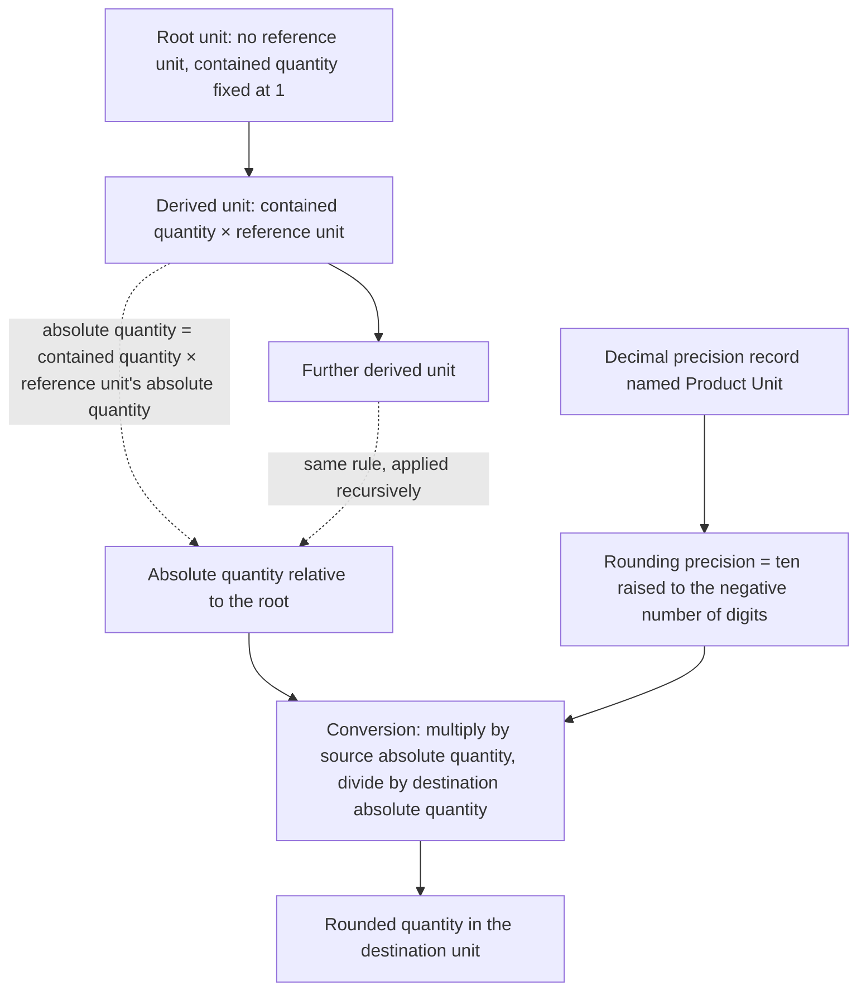

# Units of Measure and Packaging

## Scope

This domain specifies how the system counts things.

Every quantity that the system stores — a demand on an order line, a reserved quantity in a
warehouse, a consumed component in a production order, an invoiced quantity, a counted quantity in
an inventory adjustment — is a pair: a number and a **Unit of Measure** (`uom.uom`, table
`uom_uom`). The number alone is meaningless. This domain defines what a unit of measure is, how
units relate to one another, how a number is translated from one unit to another, how much
precision that translation keeps, how the translation rounds, how a *price* expressed per one unit
is translated into a price per another unit, and how a quantity keeps its meaning as it crosses
from a quotation to an order, from an order to a delivery, from a delivery to an invoice, and from
a bill of materials to a production order.

The domain also specifies **packaging**. In this system a packaging is not a separate entity with
its own quantity field: a packaging *is* a unit of measure. A "Pack of 6" is a unit of measure
whose `relative_factor` (the contained quantity) is six and whose `relative_uom_id` (the reference
unit) is "Units". A pallet is a unit of measure that contains forty boxes, each box containing
twelve dozens, each dozen containing twelve units. Packaging therefore inherits the whole
conversion arithmetic described here, and the only genuinely packaging-specific behaviour is: the
list of additional units a given product may be traded in, the barcodes bound to a product and a
unit together, the whole-packaging reservation rounding, and the physical **Package Type**
(`stock.package.type`, table `stock_package_type`) that describes a real carton with dimensions, a
tare weight and a maximum weight.

Concretely the domain covers:

- **The unit of measure entity** — its name, its reference unit, its contained quantity, its
  derived absolute quantity, its rounding precision, its ordering sequence, its hierarchy path,
  its archival flag, and the fact that the hierarchy is stored as a tree with materialised paths.
- **Relative and absolute factors** — the two-level model in which each unit declares how much it
  contains of its reference unit, and the system derives from that a single absolute quantity
  relative to the root of the unit's tree. Both directions of the derivation are given as formulas
  with worked numbers.
- **The single shared rounding precision** — every unit of measure in the system reports the same
  rounding precision, taken from the decimal precision record named `Product Unit`, whose shipped
  value is two decimal digits. The rounding precision is therefore *not* a per-unit property even
  though it is exposed as a field on every unit.
- **Every shipped unit** — the thirty units of measure delivered as reference data, with their
  reference unit, contained quantity, derived absolute quantity, rounding precision, active flag
  and protection status, grouped into the trees they form: counting, working time, length,
  surface, volume, mass and energy.
- **The conversion algorithm** — the exact five-step procedure that turns a quantity expressed in
  a source unit into a quantity expressed in a destination unit, with its short-circuits, its
  multiplication and division order, its rounding step, its rounding method parameter, and the
  five rounding methods the platform offers.
- **The complete conversion matrix** — every pairing of units within each tree, in both
  directions, with the unrounded ratio, the result under the default rounding method and the
  result under the half-up rounding method, so that a rebuild can be checked value by value.
- **The price conversion algorithm** — the inverted arithmetic that turns a price per source unit
  into a price per destination unit, why it is not rounded, and where it is used.
- **The whole-packaging rounding algorithm** — the procedure that snaps a quantity onto a whole
  multiple of a packaging quantity, its three rounding methods, its deliberate avoidance of a
  remainder operation, and the reservation policy that switches it on.
- **Packaging as units on a product** — the default unit of a product, the additional units a
  product may be traded in, the derived list of units allowed on a document line, and the
  barcodes that bind a product to a unit.
- **Package types** — the physical carton definitions with length, width, height, tare weight,
  maximum weight, barcode, reference sequence, reuse policy, storage capacities and routes.
- **Unit handling across every document boundary** — product to order line, order line to stock
  move, stock move to move line, move line to quantity on hand, order line to invoice line, bill
  of materials to production order, vendor price list to purchase order line, and back again, with
  the rounding method used at each crossing.
- **Tree consistency checks** — the test for whether two units belong to the same tree and can be
  converted at all, and the places where that test guards an operation.
- **Weight and volume interpretation** — the two system parameters that decide whether the
  dimensionless weight, length and volume numbers stored on products and package types are read as
  metric or as United States customary values.
- **The multiple-units security group** — the feature flag that reveals unit selection throughout
  the application, and the access rights on the unit of measure entity itself.
- **Rounding acceptance scenarios** — an exhaustive set of numbered scenarios covering exact
  conversions, inexact conversions, rounding to zero, rounding up from nothing, reduced precision,
  increased precision and the interaction between conversion rounding and packaging rounding.

The domain does **not** cover: the product catalogue itself, its attributes, its variants and its
barcode nomenclatures (see [`../products-and-catalog/`](../products-and-catalog/)); price lists,
price list rules and the price computation engine that *consumes* the price conversion described
here (see [`../pricing-and-pricelists/`](../pricing-and-pricelists/)); warehouses, transfers,
reservations, removal strategies and inventory adjustments beyond the unit arithmetic they perform
(see [`../inventory-operations/`](../inventory-operations/)); valuation and costing (see
[`../inventory-valuation-and-costing/`](../inventory-valuation-and-costing/)); the sales, purchase
and manufacturing documents themselves (see [`../sales/`](../sales/),
[`../purchasing/`](../purchasing/) and [`../manufacturing/`](../manufacturing/)); and currency
conversion, which is a different arithmetic on a different entity (see
[`../multi-currency/`](../multi-currency/)).

Where a field of another domain's entity carries a unit of measure, this folder names the field,
states which unit it holds, states how a quantity is converted when it is written or read, and
points at the owning domain for everything else about that field.

## Why this domain is unusually load-bearing

Three properties make units of measure a systemic concern rather than a local one.

1. **Quantities are stored in more than one unit at the same time.** An order line stores its
   demand in the unit the customer ordered in. The stock move generated from it stores the same
   demand twice: once in the order's unit and once in the product's own unit. The move line stores
   it a third time, in the unit the operator picked in, and again in the product's unit. Each of
   those is a separate stored number produced by a separate rounding. A rebuild that stores a
   single number and converts on read will not reproduce the system's numbers.
2. **Rounding is directional and, by default, always away from zero.** The default rounding method
   of the conversion operation is "up", meaning *away from zero*, not "to nearest". Converting one
   unit into dozens yields `0.09` dozens, not `0.08`. Converting one gram into kilograms yields
   `0.01` kilograms, not `0.001` and not `0`. Several callers deliberately override this with
   "half-up" or "down"; which caller uses which method is part of the observable behaviour and is
   tabulated in [`calculations.md`](calculations.md).
3. **The rounding precision is global.** Because every unit reports the same rounding precision,
   changing the decimal precision record named `Product Unit` changes the arithmetic of every
   conversion in the system at once. At the shipped value of two decimal digits, the smallest
   representable quantity in *any* unit is one hundredth of that unit — one hundredth of a pallet
   is fifty-seven and three-fifths units.

## Entities of this domain

| Entity (transport name, table) | One-line purpose |
|---|---|
| Unit of Measure (`uom.uom`, table `uom_uom`) | A named quantity scale: what it contains, of which reference unit, and therefore how it converts to every other unit in its tree. Also serves as the packaging definition. |
| Product Unit Barcode (`product.uom`, table `product_uom`) | Binds one barcode to the pair (product variant, unit of measure), so that scanning a carton code identifies both the goods and the packaging quantity. |
| Package Type (`stock.package.type`, table `stock_package_type`) | A physical container definition: outer dimensions, tare weight, maximum shippable weight, barcode, numbering sequence, reuse policy, storage capacities and routes. |
| Decimal Precision (`decimal.precision`, table `decimal_precision`) | The named rounding precisions of the application. The record named `Product Unit` is the single source of the rounding precision used by every unit of measure. Owned by the platform, specified here for the part this domain depends on. |

Two further entities are described here only for the fields through which quantities enter and
leave this domain; they are owned by other domains:

| Entity (transport name, table) | Why it appears here |
|---|---|
| Product Template (`product.template`, table `product_template`) and Product Variant (`product.product`, table `product_product`) | Carry the default unit (`uom_id`), the additional trading units (`uom_ids`), the unit label (`uom_name`), the barcodes (`product_uom_ids`) and the dimensionless weight and volume numbers that the two system parameters interpret. |
| Product Category (`product.category`, table `product_category`) | Carries the packaging reservation policy (`packaging_reserve_method`) that switches whole-packaging rounding on for the products it classifies. |

## Reading order

1. [`README.md`](README.md) — this file: what the domain is, what it owns, what it depends on.
2. [`glossary.md`](glossary.md) — the vocabulary. Read this second; the rest of the folder uses
   the terms defined there without re-explaining them.
3. [`entities.md`](entities.md) — the unit of measure entity in full, the barcode entity, the
   package type entity, the precision entity, and the unit-bearing fields of the entities of other
   domains.
4. [`calculations.md`](calculations.md) — the heart of the domain: the factor derivation, the
   conversion algorithm, the rounding function, the complete conversion matrix, the price
   conversion, the whole-packaging rounding, and every worked example.
5. [`business-rules.md`](business-rules.md) — the constraints, the protections, the error messages
   and the invariants a rebuild must enforce.
6. [`state-machines.md`](state-machines.md) — the lifecycle of a unit of measure and of a package
   type, and the quantity-state machine a quantity passes through as it crosses documents.
7. [`workflows.md`](workflows.md) — the operational procedures: defining a packaging, selling in a
   packaging, buying in a vendor unit, manufacturing in a different unit, changing a product's
   unit, changing the global precision.
8. [`configuration.md`](configuration.md) — the shipped units, the security group, the access
   rights, the system parameters, the settings and the numbering sequences.
9. [`interfaces.md`](interfaces.md) — the navigation, the views, the widget behaviour, the named
   operations, the report fields and the exchange formats that carry units.
10. [`accounting-effects.md`](accounting-effects.md) — why this domain posts nothing itself and
    exactly how it changes what other domains post.
11. [`acceptance-criteria.md`](acceptance-criteria.md) — the numbered scenarios that verify a
    rebuild.

## Dependencies on other domains

This domain depends on very little, which is why it can be built early.

| Depends on | For what |
|---|---|
| Platform: entity and field system | The tree storage with materialised paths that the reference-unit hierarchy uses; the archival flag; the translation of the unit name; the computed-field dependency graph that recomputes a derived absolute quantity when an ancestor changes. |
| Platform: decimal precisions | The named precision `Product Unit`, its default of two digits, its cached lookup and the cache invalidation on change. |
| Platform: external identifiers | The protection mechanism that prevents the deletion of units delivered as reference data. |
| Platform: security groups and access rights | The multiple-units feature group and the create/read/update/delete matrix on the unit entity. |
| [`../products-and-catalog/`](../products-and-catalog/) | The product entity on which the default unit, the additional units and the barcodes hang. The dependency is mutual in data but one-directional in arithmetic: products use units, units know nothing about products. |

## Domains that depend on this one

| Domain | What it consumes |
|---|---|
| [`../pricing-and-pricelists/`](../pricing-and-pricelists/) | Quantity conversion before rule matching on a minimum quantity, and price conversion when a rule is expressed in a different unit. |
| [`../inventory-operations/`](../inventory-operations/) | Conversion on every move, move line, reservation, putaway and inventory count; whole-packaging reservation rounding; package types. |
| [`../inventory-valuation-and-costing/`](../inventory-valuation-and-costing/) | Conversion of a moved quantity into the product's own unit before a cost is applied. |
| [`../replenishment-and-procurement/`](../replenishment-and-procurement/) | Conversion between the reordering rule's unit, the product's unit and the resulting purchase or production quantity. |
| [`../purchasing/`](../purchasing/) | The vendor's trading unit, the price per vendor unit, the conversion to the product unit, and the received and billed quantities. |
| [`../sales/`](../sales/) | The unit on a quotation line, the allowed-unit list, the delivered and invoiced quantity conversions. |
| [`../manufacturing/`](../manufacturing/) | Conversion between the bill of materials unit, the component unit, the production order unit and the product unit; component quantity scaling. |
| [`../delivery-and-shipping/`](../delivery-and-shipping/) | Conversion of picked quantities into the product unit before multiplying by unit weight, and the weight unit label. |
| [`../accounts-receivable/`](../accounts-receivable/) and [`../accounts-payable/`](../accounts-payable/) | The unit stored on an invoice or bill line and the conversion when an invoiced quantity is reported back onto an order line. |
| [`../point-of-sale/`](../point-of-sale/) | Conversion of counter quantities into stock moves, including the refusal to proceed when a conversion rounds to zero. |
| [`../website-and-storefront/`](../website-and-storefront/) | The unit chosen in a cart, the validation that the product is available in that unit, and the price shown per that unit. |
| [`../electronic-invoicing-and-document-exchange/`](../electronic-invoicing-and-document-exchange/) | The mapping between an internal unit and a standard unit code, and the tree-compatibility test applied to an incoming document's unit. |

## The model in one picture

## What a rebuild must reproduce

A rebuild of this domain is correct when all of the following hold.

1. The thirty shipped units exist with exactly the reference units and contained quantities listed
   in [`configuration.md`](configuration.md), and the derived absolute quantities match to the last
   representable digit, including the values that are not exactly representable in binary floating
   point.
2. Every unit reports the same rounding precision, and that precision follows the `Product Unit`
   decimal precision record.
3. The conversion of a quantity from any unit to any other unit of the same tree produces, for
   every rounding method, the value tabulated in [`calculations.md`](calculations.md).
4. A conversion between units of different trees returns the input quantity unchanged when the
   caller asks for failure to be tolerated, and otherwise fails.
5. Price conversion is never rounded and always uses the inverted ratio.
6. Whole-packaging rounding never uses a remainder operation and reproduces the tabulated results
   including the case where source and destination unit are the same, in which case the quantity
   is returned untouched.
7. Each document boundary listed in [`calculations.md`](calculations.md) applies the rounding
   method listed there, not the default one.
8. The protected units cannot be deleted and the three unprotected ones can.
9. A unit without a reference unit whose contained quantity is not exactly one is rejected with
   the exact message given in [`business-rules.md`](business-rules.md).
10. A contained quantity of zero is rejected by a stored check with the exact message given in
    [`business-rules.md`](business-rules.md).
