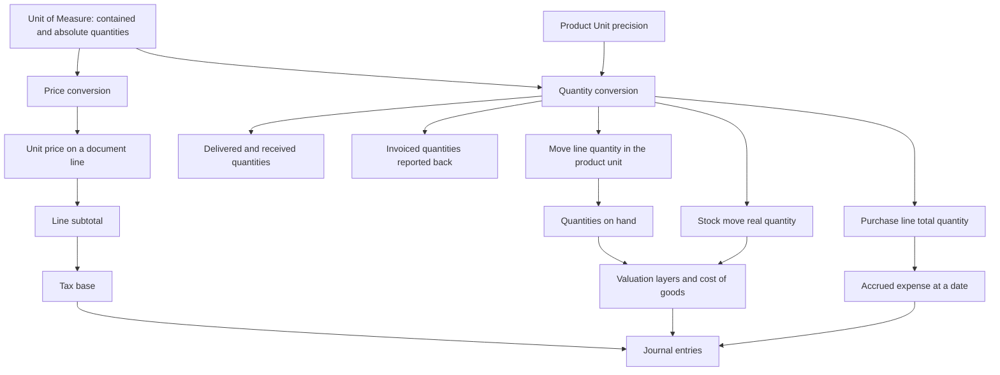

# Units of Measure and Packaging — Accounting Effects

## 1. Summary

**This domain produces no journal entries.**

Creating a unit of measure, editing its contained quantity, archiving it, binding a barcode to a
packaging, defining a package type or changing the global rounding precision posts nothing to any
ledger. No entity of this domain carries an account, a journal, a tax, an analytic distribution
or a currency.

The domain is nonetheless one of the most financially consequential in the system, because **it
decides the quantity that every amount is multiplied by**. This file specifies exactly how, so
that a rebuild can trace a wrong ledger amount back to a unit decision, and so that the boundary
between "this domain" and "the domains that post" is unambiguous.

---

## 2. The three ways a unit changes a posted amount

### 2.1 Through the quantity on a line

Every invoice line, bill line and journal item derived from a document line carries a quantity in
the line's unit and a price per that same unit. The extended amount is:

```formula
line_subtotal = round_to_currency( quantity_in_line_unit × price_per_line_unit × ( 1 − discount_percentage ÷ 100 ) )
```

The unit therefore does not appear in the formula at all — *provided the price and the quantity
are expressed in the same unit*. The domain's contribution is to guarantee that they are, and the
whole of the price conversion arithmetic exists for that guarantee.

**The failure mode a rebuild must avoid.** Converting the quantity into the product's own unit
while leaving the price per the line's unit — or the reverse — multiplies or divides the line
total by the unit's absolute quantity. For a pallet of five thousand seven hundred sixty, that is
a four-order-of-magnitude error on a posted amount.

### 2.2 Through the price conversion

When a price comes from the catalogue, from a price list rule or from a vendor price list, it is
expressed per the product's own unit or per the vendor's unit and must be converted to the
document line's unit. The conversion is

```formula
price_per_line_unit = price_per_source_unit × absolute_quantity( line_unit ) ÷ absolute_quantity( source_unit )
```

and it is **never rounded** inside this domain. The first rounding of a converted price happens
when the owning domain rounds to its price precision or to a currency.

**Worked example with the ledger consequence.** A product costs two per unit. A customer orders
one hundred forty-four units, expressed as one `Box of 12 Dozens`.

| Step | Value |
|---|---|
| Catalogue price per the product's own unit | 2 |
| Price converted to the line's unit | 2 × 144 ÷ 1 = 288 |
| Line quantity | 1 |
| Line subtotal | 288 |
| Revenue credited | 288 |

Had the price been left at two while the quantity was converted to one hundred forty-four, the
subtotal would also be two hundred eighty-eight, which is why the error is easy to miss. It shows
itself only when exactly one of the two is converted: a quantity of one against a price of two
posts two, understating revenue by a factor of one hundred forty-four.

### 2.3 Through the quantity that reaches valuation

Valuation is always performed in the **product's own unit**, never in a document unit. Every
crossing that feeds valuation converts first:

| Feeding record | Converted how | Used for |
|---|---|---|
| Stock move real quantity | The move's demand converted into the product's own unit, half away from zero | The planned valuation of an incoming or outgoing move |
| Stock move line quantity in the product's unit | The picked quantity converted into the product's own unit, half away from zero | The actual quantity valued when the transfer completes |
| Purchase order line total quantity | The ordered quantity converted into the product's own unit, away from zero | Accrual and three-way matching |
| Purchase order line gross price per product unit | The line price, after discount and tax exclusion, scaled by the ratio of the absolute quantities | Accrual amounts |

Because the conversion rounds, **the quantity valued may differ from the quantity ordered by up
to one step of the `Product Unit` precision per crossing.** At the shipped precision of two
digits, a crossing can move at most one hundredth of the product's own unit. Over a document with
many lines the error does not accumulate in one direction under half-away-from-zero rounding, but
it does under away-from-zero rounding.

---

## 3. The complete map from this domain into the posting domains



Every arrow crossing out of the two conversion boxes is a place where a rebuild can introduce a
financial error. The arrows into the journal-entry box are specified in the owning domains:

| Posting | Specified in |
|---|---|
| Revenue and receivable on a customer invoice | [`../accounts-receivable/`](../accounts-receivable/) |
| Expense and payable on a vendor bill | [`../accounts-payable/`](../accounts-payable/) |
| Stock interim and stock valuation on a receipt or delivery | [`../inventory-valuation-and-costing/`](../inventory-valuation-and-costing/) |
| Cost of goods sold on a delivery | [`../inventory-valuation-and-costing/`](../inventory-valuation-and-costing/) |
| Production consumption and production output | [`../manufacturing/`](../manufacturing/) |
| Tax amounts on any of the above | [`../taxes/`](../taxes/) |
| Accruals at a cut-off date | [`../financial-reporting/`](../financial-reporting/) |

---

## 4. Quantities that appear on journal items

A journal item derived from an invoice line carries the quantity and the unit of that line. Two
consequences follow.

1. **The unit is part of the posted record.** Changing a product's own unit after a document is
   posted is refused precisely because a posted journal item would then disagree with its product;
   the refusal and its message are specified in [`business-rules.md`](business-rules.md).
2. **The unit is part of the exchanged document.** An exchanged invoice emits the trade code
   resolved from the line's unit; see [`interfaces.md`](interfaces.md) section 9.

Analytic lines derived from journal items carry their own unit. When a sales order line's
delivered quantity is derived from recorded analytic lines, the analytic lines are grouped by
unit and each group's total is converted into the sales order line's unit **half away from zero**
before being summed. A rebuild that sums first and converts once will get a different figure
whenever more than one unit is involved.

---

## 5. The accrual computation, in full

This is the one place where a quantity of this domain reaches an amount through a formula that is
not simply quantity times price, and it is specified here because the conversion order matters.

```formula
quantity_to_invoice_at_date = ordered_quantity − already_invoiced_quantity            when the purchase method bills the ordered quantity
quantity_to_invoice_at_date = received_quantity − already_invoiced_quantity           when the purchase method bills the received quantity

quantity_in_product_unit    = convert_quantity( quantity_to_invoice_at_date , line_unit → product_own_unit )

gross_price_per_product_unit = line_price
                               × ( 1 − discount_percentage ÷ 100 )
                               , then reduced to its tax-exclusive value per one
                               , then × absolute_quantity( product_own_unit ) ÷ absolute_quantity( line_unit )

amount_to_invoice_at_date   = quantity_in_product_unit × gross_price_per_product_unit
```

**Why both conversions appear.** The quantity is scaled *up* into the product's own unit while
the price is scaled *down* to a price per the product's own unit, so the product of the two is
invariant — except for the rounding applied to the quantity, which uses the default away-from-zero
method. The residual is at most one hundredth of the product's own unit multiplied by the price
per that unit.

**Worked example.** A purchase line for three `Box of 12 Dozens` at one hundred twenty each, with
a five per cent discount, no tax, nothing yet invoiced, for a product whose own unit is `Units`.

```formula
quantity_to_invoice_at_date  = 3
quantity_in_product_unit     = convert_quantity( 3 , Box → Units ) = 432
gross_price_per_product_unit = 120 × ( 1 − 5 ÷ 100 ) × 1 ÷ 144 = 0.7916666666666667
amount_to_invoice_at_date    = 432 × 0.7916666666666667 = 342
```

which is three boxes at one hundred fourteen each — the discounted box price — as expected.

**The same example with an awkward quantity.** Two and a half boxes:

```formula
quantity_in_product_unit  = convert_quantity( 2.5 , Box → Units ) = 360
amount_to_invoice_at_date = 360 × 0.7916666666666667 = 285
```

and with one third of a box, typed as nought point three three:

```formula
quantity_in_product_unit  = convert_quantity( 0.33 , Box → Units ) = 47.52
amount_to_invoice_at_date = 47.52 × 0.7916666666666667 = 37.62
```

which is nought point three three boxes at one hundred fourteen, that is thirty-seven and
sixty-two hundredths. The conversion introduced no error because forty-seven and fifty-two
hundredths lies on the grid.

---

## 6. What a rebuild must assert about the financial boundary

1. No table of this domain has an account, a journal, a tax, an analytic distribution or a
   currency column.
2. No operation of this domain creates, modifies or deletes a journal entry or a journal item.
3. No operation of this domain changes a quantity on hand, a valuation layer or a cost.
4. Changing a unit's contained quantity changes **no** posted amount, because posted amounts are
   stored, not derived from the unit.
5. Changing a unit's contained quantity **does** change every *future* conversion, and therefore
   every future posted amount computed from a document line in that unit.
6. Changing the `Product Unit` precision changes **no** posted amount and every future conversion.
7. The only guard that ties this domain to the ledger is the refusal to change a product's own
   unit when a posted journal item holds a different unit.

---

## 7. Audit procedure for a suspected unit-related ledger error

1. Take the journal item and note its quantity and unit.
2. Multiply by the unit's absolute quantity to obtain the physical quantity in root units.
3. Take the originating document line and do the same.
4. If the two physical quantities differ by more than one step of the `Product Unit` precision
   multiplied by the absolute quantity of the coarser unit, a conversion was applied where none
   was due, or omitted where one was due.
5. Take the posted amount and divide by the physical quantity to obtain a price per root unit.
6. Compare with the catalogue or vendor price divided by the absolute quantity of the unit it is
   quoted in. A discrepancy that is exactly a ratio of two absolute quantities identifies the
   missing or duplicated price conversion.

**Worked audit.** A posted invoice line reads: quantity one, unit `Box of 12 Dozens`, unit price
two, subtotal two. The catalogue price is two per `Units`.

1. Physical quantity: one multiplied by one hundred forty-four, that is one hundred forty-four
   root units.
2. Price per root unit implied by the posting: two divided by one hundred forty-four, that is one
   seventy-second.
3. Catalogue price per root unit: two.
4. The ratio is one hundred forty-four, exactly the absolute quantity of the box.
5. Conclusion: the price conversion from the product's own unit to the line's unit was not
   applied. The line should have read a unit price of two hundred eighty-eight and a subtotal of
   two hundred eighty-eight. Revenue is understated by two hundred eighty-six.
