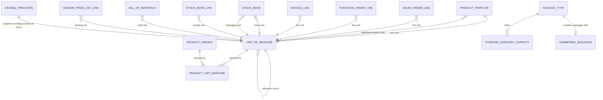

# Units of Measure and Packaging — Entities

This file specifies every entity the domain owns, and every field of another domain's entity
through which a quantity or a unit enters or leaves this domain.

Conventions used throughout:

- Each entity is introduced with its full name in title case, then its **transport name** (the
  name by which the entity is addressed over the remote transport) and its **table name** in code
  font.
- Field tables have three columns: `Field (storage name)`, `Type`, `Meaning and rules`.
- "Stored" means the value is persisted in a column. "Computed, not stored" means it is derived
  on every read and never written to the database.
- "Company scoped" means the field participates in the multi-company visibility rules; where a
  field is absent from an entity, that entity is global to the installation.
- Where a numeric field is declared with *unlimited* precision, this means the column holds an
  exact decimal number with no fixed scale, so that a contained quantity such as twenty-eight and
  three thousand four hundred ninety-five ten-thousandths is stored without truncation. This is
  distinct from the *rounding precision* used when converting quantities, which is a separate,
  global setting.

---

## 1. Unit of Measure

**Unit of Measure** (`uom.uom`, table `uom_uom`).

### 1.1 Purpose

A Unit of Measure is a named scale on which a quantity of something can be expressed. It answers
one question: *how much of my reference unit does one of me contain?* Everything else — the
absolute scale, the conversion to a sibling unit, the price per unit, the packaging quantity — is
derived from that one declared number and from the chain of reference units above it.

A Unit of Measure serves three roles at once, and the system does not distinguish them by any
field:

1. **A measurement scale.** Kilogram, litre, hour, metre.
2. **A counting scale.** Unit, dozen.
3. **A packaging.** Pack of six, box, pallet. A packaging is a unit of measure whose contained
   quantity happens to describe how many items fit in a physical container. Nothing in the entity
   marks a unit as "a packaging"; a unit becomes a packaging of a product by being listed in that
   product's additional trading units, and it becomes scannable by having a barcode bound to the
   pair (product, unit).

### 1.2 The tree

Units form a forest. Each unit optionally points at a **reference unit**; a unit with no reference
unit is a **root unit** and defines a tree. Two units can be converted into one another if and
only if they share an ancestor, which in practice means they are in the same tree. The tree
replaces the older idea of a "unit category": there is no category entity, and membership of a
convertible family is determined purely by ancestry.

The tree is stored twice for efficiency:

- as a parent pointer, `relative_uom_id`, giving the immediate reference unit; and
- as a **materialised path**, `parent_path`, a string of ancestor identifiers separated by solidus
  characters, from the root down to and including the unit itself, for example `3/7/12/` for a
  unit whose identifier is twelve, whose reference unit's identifier is seven, and whose root's
  identifier is three. The path always begins at a root and always ends with a trailing separator.

The materialised path exists so that "is in the same tree as" and "is a descendant of" can be
answered without walking the parent pointers.

### 1.3 Complete field table

| Field (storage name) | Type | Meaning and rules |
|---|---|---|
| Unit Name (`name`) | Text, single line | The displayed name of the unit, for example `Units`, `Dozens`, `kg`, `Pack of 6`. **Required.** **Translatable**: each installed language holds its own rendering, and the value used in a document is the one for the language of the reader or of the addressed partner. Not unique: two units may share a name, and the shipped data relies on names being short labels rather than identifiers. Used as the display name unless the caller asks for the formatted display name (see 1.7). |
| Sequence (`sequence`) | Whole number | Ordering weight. **Computed** from the contained quantity, **stored**, and **writable by the user** (the computation only supplies an initial value). The computation is: if the record already exists *and* already has a non-zero sequence, leave it alone; otherwise set it to the smaller of one thousand and the whole-number part of the contained quantity multiplied by one hundred. So a unit that contains one gets sequence one hundred; a unit that contains six gets six hundred; a unit that contains twelve would get one thousand two hundred but is capped at one thousand; a unit that contains one hundredth gets one. The effect is that small units sort before large ones, and everything from a dozen upwards ties at one thousand and is then ordered by reference unit and identifier. **Precomputed**: the value is established before the row is written, not after. |
| Contains (`relative_factor`) | Decimal number, unlimited precision | **How many of the reference unit one of this unit contains.** **Required**, default one. This is the only quantity a user ever types. For a root unit it must be exactly one (see the validation in [`business-rules.md`](business-rules.md)). For a derived unit it may be greater than one (a dozen contains twelve units) or smaller than one (a minute contains sixteen thousand six hundred sixty-seven millionths of an hour). It may not be zero; a stored check enforces that. It may be negative as far as the stored check is concerned — only zero is rejected — but a negative contained quantity has no defined business meaning and is treated as a configuration error (**industry-standard default**: reject a contained quantity that is not strictly greater than zero at the user interface level). Declared with unlimited precision so that values such as twenty-eight and three thousand four hundred ninety-five ten-thousandths, or one hundred sixty-three thousand eight hundred seventy-one ten-millionths, survive storage exactly. |
| Rounding Precision (`rounding`) | Decimal number | **Computed, not stored.** The smallest representable quantity in this unit. Its value is ten raised to the power of minus the number of digits held by the decimal precision record named `Product Unit`. With the shipped value of two digits, every unit reports one hundredth. **This field is identical on every unit of measure in the system**; it is exposed per unit only so that callers may write "the rounding of this unit" naturally. A rebuild must not store a per-unit rounding, and must not allow one unit to have a different rounding from another. |
| Active (`active`) | Yes or no | Default yes. When set to no the unit is **archived**: it disappears from every selection list and from the default listing, but all existing references to it remain valid and all conversions through it continue to work. Archiving is the supported alternative to deleting a unit that must not be used any more. Fourteen of the thirty shipped units are archived on delivery (see [`configuration.md`](configuration.md)). |
| Reference Unit (`relative_uom_id`) | Link to one Unit of Measure | The unit that the contained quantity is expressed in. Empty for a root unit. **On delete: cascade** — deleting a unit deletes every unit that references it, recursively. Indexed, with the index skipping empty values. A unit may not reference itself, and no cycle may be formed; the tree storage enforces this (see [`business-rules.md`](business-rules.md)). |
| Related Units (`related_uom_ids`) | List of Units of Measure | The inverse of the reference-unit link: every unit that names this one as its reference unit. Not stored; derived from the parent pointers. |
| Absolute Quantity (`factor`) | Decimal number, unlimited precision | **Computed and stored**, recomputed recursively. The quantity of the *root* unit of this unit's tree that one of this unit contains. Computed as: if the unit has a reference unit, its contained quantity multiplied by the reference unit's absolute quantity; otherwise its own contained quantity. Because the computation is recursive, changing the contained quantity of a unit high in the tree recomputes the absolute quantity of every descendant. This is the number the conversion arithmetic actually uses; the contained quantity is only the input from which it is built. Declared with unlimited precision. |
| Hierarchy Path (`parent_path`) | Text, single line | The materialised path of ancestor identifiers described in 1.2. Maintained by the platform's tree storage, never edited. **Indexed.** Used by the shared-ancestor test. |
| Barcodes (`product_uom_ids`) | List of Product Unit Barcodes | Every barcode bound to this unit for some product. Filtered by context: when the caller is looking at a single product, only that product's barcodes for this unit are listed; when the caller supplies a list of products, the barcodes of any of them are listed; otherwise all barcodes for this unit are listed. Present only where the catalogue capability is installed. |
| Timesheet Widget (`timesheet_widget`) | Text, single line | Present only where the time-recording capability is installed. Names the input control the desktop client should use when time is recorded in this unit: the hour unit carries a value meaning "hours and minutes clock input", the day unit carries a value meaning "step toggle input". Not translated and not exported as a translatable string. |
| Fiscal Country Codes (`fiscal_country_codes`) | Text, single line | Present only where the accounting capability is installed. **Computed, not stored**, and dependent on the set of companies currently active for the reader: the comma-separated list of the fiscal country codes of those companies. Used only to decide which country-specific unit code fields to reveal on the form. |
| Country-specific unit codes | Various | Present only where the corresponding country capability is installed. Each is an independent annotation on the unit used when a legally regulated document must carry a national unit code rather than the internal name: a character code for one South American country's electronic invoice, a character code for another South American country's tax authority, a unique quantity code for one South Asian country's goods and services tax, a selection for one Central European country's electronic invoice, a selection for one South European country's electronic invoice, a link to a code record for one North African country's tax authority, and a link to a code record for one South East Asian country's electronic invoice. None of them affect the arithmetic. |

### 1.4 Ordering

Records are ordered by sequence ascending, then by reference unit, then by identifier ascending.
Because the sequence is derived from the contained quantity, the natural ordering presents the
smallest units of each tree first, then groups descendants under their reference unit, then falls
back to creation order.

### 1.5 Uniqueness rules

There is **no** uniqueness constraint on the name, and none on the pair (name, reference unit).
Two units may be created with the same name and different contained quantities; the system will
not object, and the display name will be ambiguous unless the formatted display name is requested.
This is a deliberate consequence of the model: "Box" means different quantities for different
products, and a user is expected to create one unit per distinct quantity.

The only stored uniqueness rules in the domain are on barcodes, and they live on the Product Unit
Barcode entity (section 2).

### 1.6 Defaults

| Field | Default |
|---|---|
| Contains (`relative_factor`) | One |
| Active (`active`) | Yes |
| Sequence (`sequence`) | Derived: the smaller of one thousand and one hundred times the contained quantity, truncated to a whole number |
| Reference Unit (`relative_uom_id`) | Empty |
| Absolute Quantity (`factor`) | Derived; equal to the contained quantity when there is no reference unit |

### 1.7 Display name

Two forms exist.

1. **Plain form** — the unit's name, translated for the reader's language. This is what appears on
   documents, reports and printed output.
2. **Formatted form** — requested by the caller when it wants a richer label in a selection list.
   If the unit has a reference unit, the label is the unit's name, then a tab character, then two
   hyphen-minus characters, then the contained quantity, then a space, then the reference unit's
   name, then two hyphen-minus characters. For a dozen whose reference unit is the counting unit,
   the formatted label is the name, a tab, and the decoration reading twelve followed by the
   counting unit's name between double hyphens. If the unit has no reference unit, the formatted
   form falls back to the plain form.

The formatted form is the reason a user can tell a "Box" containing twelve units from a "Box"
containing twenty-four units in a drop-down list.

### 1.8 Archival behaviour

Setting Active to no removes the unit from ordinary searches. It does **not**:

- change any stored quantity anywhere;
- invalidate the absolute quantity of the unit or of its descendants;
- prevent conversions that pass through the unit;
- remove the unit from the additional trading units of a product; nor
- delete the barcodes bound to it.

A unit that is archived while still selected on an open document remains on that document and
continues to convert.

### 1.9 Deletion behaviour

Deletion is blocked for **protected** units. A unit is protected when it was delivered as
reference data by the units capability itself *and* its short external identifier is not on the
unprotected list. The unprotected list is, by default, the working-hour unit, the dozen and the
pack of six. Where the time-recording capability is installed, the working-hour unit is removed
from the unprotected list, so only the dozen and the pack of six remain deletable.

Attempting to delete one or more protected units fails with the message given in
[`business-rules.md`](business-rules.md), which names the units concerned and suggests archiving
them instead.

Deleting a unit that *is* deletable cascades: every unit whose reference unit is the deleted one is
deleted too, recursively, and every barcode bound to the deleted unit is deleted with it.

### 1.10 Multi-company behaviour

The Unit of Measure entity has **no company field**. Units are global to the installation: every
company sees the same units, the same contained quantities and the same absolute quantities. A
rebuild must not scope units by company. The consequences are:

- a conversion produces the same number in every company;
- a packaging defined for one company's product is visible in every company;
- the barcode uniqueness rules on the Product Unit Barcode entity are the only place where company
  scoping enters the domain, and even there the stored uniqueness is installation-wide (see 2.4).

### 1.11 Lifecycle

A unit of measure has no state field. Its lifecycle is:

1. **Created** — by the reference data at installation time, or by a user with the settings
   permission, or by the inline creation offered on a product's packaging list.
2. **In use** — referenced by products, order lines, moves, move lines, bills of materials,
   invoice lines and vendor price lists.
3. **Archived** — hidden from selection, still honoured everywhere it is already referenced.
4. **Reactivated** — the archival flag set back to yes.
5. **Deleted** — only if unprotected and only if no other record restricts the deletion. Several
   referencing fields are declared to *restrict* deletion (an order line's unit, a bill's unit),
   so in practice a unit that has been used on a document cannot be deleted at all.

### 1.12 Change warnings

Editing the contained quantity of a **protected** unit that was created more than twenty-four
hours ago raises a non-blocking warning before the change is saved. The warning's title names the
unit and its body states that critical fields have been modified, that existing data will not be
updated by the change, that units of measure impact the whole system, that this may cause critical
issues, and that changing core units of measure in a running database is not recommended. The
exact text is reproduced in [`business-rules.md`](business-rules.md).

The warning is advisory: the user may proceed. If they do, the absolute quantity of the unit and
of all its descendants is recomputed immediately, but **no stored quantity on any document is
recomputed**. A delivery order that was created when a box contained twelve units and is validated
after the box was redefined to contain twenty-four will move twice the goods it was created for.

---

## 2. Product Unit Barcode

**Product Unit Barcode** (`product.uom`, table `product_uom`).

### 2.1 Purpose

Binds a barcode to the pair (product variant, unit of measure). Scanning the barcode identifies
both *what* is being handled and *in which packaging quantity*. Without this entity a scanner can
only identify a product, and the operator must state the quantity separately.

The entity carries no quantity of its own: the quantity comes from the referenced unit's contained
quantity. A carton of twelve is represented by one unit of measure containing twelve, plus one
Product Unit Barcode row per product that ships in such a carton.

### 2.2 Complete field table

| Field (storage name) | Type | Meaning and rules |
|---|---|---|
| Unit (`uom_id`) | Link to one Unit of Measure | The packaging unit the barcode denotes. **Required.** **Indexed.** **On delete: cascade** — deleting the unit deletes the barcode rows. |
| Product (`product_id`) | Link to one Product Variant | The specific variant the barcode denotes. **Required.** **Indexed.** **On delete: cascade.** Note that the binding is to a *variant*, not to a template: two colours of the same article that ship in the same carton need two rows. |
| Barcode (`barcode`) | Text, single line | The scannable code. **Required.** **Indexed**, with the index skipping empty values. **Not copied** when the owning product is duplicated. |
| Company (`company_id`) | Link to one Company | Defaults to the company currently active for the creating user. Used to scope the cross-entity uniqueness check against product barcodes. May be left empty, in which case the row is shared by all companies. |

### 2.3 Naming and display rule

The record's natural name is its barcode. When the caller asks for the variant name to be
included, the display name becomes the barcode, then a space, then the word `for`, then a colon,
then a space, then the product variant's display name.

### 2.4 Uniqueness rules

Two rules apply.

1. **Stored, installation-wide:** the barcode column is unique across the whole table. Violating
   it fails with the message `A barcode can only be assigned to one packaging.` Note that this
   stored rule is *not* company scoped: two companies cannot use the same packaging barcode for
   different products.
2. **Checked, cross-entity:** when a Product Unit Barcode is created or its barcode is changed,
   the system searches the product variants for a variant already carrying that barcode. If one
   exists the operation fails with the message `A product already uses the barcode`. The mirror
   check exists on the product side: creating or changing a product barcode searches the Product
   Unit Barcode rows of the same company and fails with `A packaging already uses the barcode`.

The two entities therefore share one barcode namespace. The reason is that under the Global
Standards One barcode conventions a product code and a packaging code are drawn from the same
pattern space and cannot be told apart by inspection.

### 2.5 Lifecycle, archival and multi-company behaviour

The entity has no state field and no archival flag. Rows are created, edited and deleted. They are
deleted automatically when either the product variant or the unit they reference is deleted.

The company field scopes only the cross-entity check described in 2.4; the stored uniqueness is
installation-wide regardless of company.

---

## 3. Package Type

**Package Type** (`stock.package.type`, table `stock_package_type`).

### 3.1 Purpose

A Package Type describes a *physical* container — a carton, a tote, a pallet base — as opposed to
a unit of measure, which describes a *quantity*. The two are complementary: a unit of measure says
"twelve items"; a package type says "a box six hundred by four hundred by three hundred
millimetres that weighs one and a half kilograms empty and must not exceed thirty kilograms
loaded".

Package Types are used to compute shipping weights, to check storage capacities, to number
packages, to drive routes, and to tell a scanning operator whether a container is disposable or
must be emptied and reused.

### 3.2 Complete field table

| Field (storage name) | Type | Meaning and rules |
|---|---|---|
| Package Type (`name`) | Text, single line | The displayed name. **Required.** Duplicating a package type appends a space, an opening parenthesis, the word `copy`, and a closing parenthesis to the name. |
| Sequence (`sequence`) | Whole number | Ordering weight, default one. The first in the ordering is treated as the default package type where one must be chosen automatically. |
| Reference Sequence (`sequence_id`) | Link to one Numbering Sequence | The numbering sequence used to name packages of this type. **Company checked**: the sequence must belong to the same company as the package type. **Not copied.** Created automatically (see 3.5). |
| Sequence Prefix (`sequence_code`) | Text, single line | A mirror of the numbering sequence's code, editable in place. Writing it creates or renames the underlying sequence (see 3.5). |
| Height (`height`) | Decimal number | Outer height of the container, interpreted in the length unit selected by the system parameter described in section 5. Must be zero or greater; a stored check enforces it with the message `Height must be positive`. |
| Width (`width`) | Decimal number | Outer width, same interpretation. Stored check message: `Width must be positive`. |
| Length (`packaging_length`) | Decimal number | Outer length, same interpretation. The storage name differs from the label because `length` is reserved by the platform. Stored check message: `Length must be positive`. |
| Weight (`base_weight`) | Decimal number | The **tare**: the weight of the empty container, interpreted in the weight unit selected by the system parameter described in section 5. Added to the computed content weight when a package's shipping weight is derived. No stored check; a negative tare is not rejected by the database (**industry-standard default**: reject a negative tare at the user interface level). |
| Max Weight (`max_weight`) | Decimal number | The maximum gross weight the container may carry, same interpretation. Must be zero or greater; stored check message: `Max Weight must be positive`. A value of zero means "no maximum". |
| Barcode (`barcode`) | Text, single line | A code identifying the container type. **Not copied.** **Unique across the table**; violating it fails with `A barcode can only be assigned to one package type!` |
| Weight unit of measure label (`weight_uom_name`) | Text, single line | **Computed, not stored.** The display name of the unit in which the tare and maximum weight are to be read, resolved from the system parameter described in section 5. Its default value, used before the computation runs, is the same resolution. |
| Length unit of measure label (`length_uom_name`) | Text, single line | **Computed, not stored.** The display name of the unit in which height, width and length are to be read, resolved from the system parameter described in section 5. |
| Company (`company_id`) | Link to one Company | **Indexed.** Empty means the package type is shared by all companies. |
| Package Use (`package_use`) | Selection | **Required**, default `disposable`. Values: `disposable` labelled `Disposable Box` — the container leaves with the goods and is not tracked back; `reusable` labelled `Reusable Box (totes)` — the container is used for batch picking and emptied afterwards. In the scanning application, scanning a reusable container adds the products it holds to the current operation, whereas scanning a disposable one adds its contents to the transfer. |
| Has Contents (`has_quants`) | Yes or no | **Computed, not stored.** True when at least one package of this type currently holds stock. Used to warn before editing dimensions that are already in use. |
| Storage Category Capacity (`storage_category_capacity_ids`) | List of Storage Category Capacities | How many packages of this type each storage category may hold. **Copied** when the package type is duplicated. Owned by [`../inventory-operations/`](../inventory-operations/). |
| Routes (`route_ids`) | List of Routes | Supply routes that apply to goods packed in this container type. Restricted to routes marked as selectable by package type. Owned by [`../inventory-operations/`](../inventory-operations/). |

### 3.3 Ordering

By sequence ascending, then by identifier ascending.

### 3.4 Display name

Plain form: the name. Formatted form, requested by the caller for richer selection lists: if
length, width and height are all non-zero, the name, then a tab character, then two hyphen-minus
characters, then the length, a space, a multiplication sign, a space, the width, a space, a
multiplication sign, a space, the height, then two hyphen-minus characters. If any dimension is
zero the plain form is used.

### 3.5 Automatic numbering sequence

A Package Type may own a numbering sequence used to name the packages made from it.

**On creation.** If the values supplied contain a sequence prefix but no sequence link, a new
numbering sequence is created with: a name formed from the words `Package Type Sequence`, a space
and the prefix; the prefix as its code; a padding of seven digits; and the package type's company.
The new sequence is linked to the package type.

**On update.** If the sequence prefix changes, the new name and prefix are prepared. If the
company changes, the new company is prepared. Then, for each package type being written: if it has
no sequence yet, one is created with the prepared values, a padding of seven digits and the
relevant company, and linked; if it already has one, that sequence is collected and all collected
sequences are updated with the prepared values in a single write.

**Next name.** When a package must be named: if exactly one package type is in hand and it owns a
sequence, the next value of that sequence is taken; otherwise the next value of the installation's
generic package sequence is taken.

### 3.6 Lifecycle, archival and multi-company behaviour

No state field, no archival flag. Package types are created, edited, duplicated (with a renamed
copy and copied storage capacities) and deleted. The company field scopes visibility; an empty
company makes the type shared.

---

## 4. Decimal Precision

**Decimal Precision** (`decimal.precision`, table `decimal_precision`). Owned by the platform;
specified here because this domain's arithmetic depends entirely on one of its records.

### 4.1 Purpose

A named rounding precision. Each record says: "wherever the application asks for the precision
called *this name*, round to *this many* decimal digits."

### 4.2 Complete field table

| Field (storage name) | Type | Meaning and rules |
|---|---|---|
| Usage (`name`) | Text, single line | The name the application asks for. **Required.** **Unique**; violating it fails with `Only one value can be defined for each given usage!` |
| Digits (`digits`) | Whole number | The number of decimal digits. **Required**, default two. |

### 4.3 The record this domain depends on

One record, named `Product Unit`, with two digits, is delivered as reference data by the units
capability and is created even if a record with that name would otherwise be skipped. Every unit
of measure derives its rounding precision from it, and every quantity comparison and
zero-test in the domain uses it.

### 4.4 Lookup and caching

The lookup takes a name and returns the number of digits. It flushes any pending writes to the
name and digits columns first, then reads the digits for that name. **If no record with that name
exists, the lookup returns two.** The result is cached; creating, updating or deleting any decimal
precision record clears the cache.

A rebuild must reproduce the fallback of two digits for an unknown name, because several callers
ask for precisions that a minimal installation does not define.

### 4.5 Change warning

Reducing the number of digits raises a non-blocking warning whose title names the usage and whose
body states that the precision has been reduced, that existing data will not be updated by the
change, that decimal precisions impact the whole system, that this may cause critical issues, that
reducing the precision could disturb the financial balance, and that changing decimal precisions
in a running database is not recommended. Increasing the number of digits raises no warning.

### 4.6 Consequences of changing `Product Unit`

Because the unit rounding precision is derived from this record and nothing else:

- every conversion in the system immediately begins rounding to the new precision;
- every quantity comparison and zero-test changes its verdict at the boundary;
- already-stored quantities are **not** rewritten, so a stored quantity may become
  unrepresentable at the new precision — for example a stored demand of two and one third units
  remains two and one third while new conversions can only produce multiples of one hundredth;
- a stock move whose picked quantity does not survive a round trip through the new precision is
  refused at completion time with the message given in [`business-rules.md`](business-rules.md).

---

## 5. Weight, length and volume interpretation

The dimensionless numbers stored as a product's weight and volume, and as a package type's
dimensions and weights, carry **no unit reference**. Their meaning is decided globally by two
system parameters.

| Parameter key | Value | Effect |
|---|---|---|
| `product.weight_in_lbs` | `1` | Weights are read as pounds; the weight unit resolves to the pound unit. |
| `product.weight_in_lbs` | anything else, or absent | Weights are read as kilograms; the weight unit resolves to the kilogram unit. |
| `product.volume_in_cubic_feet` | `1` | Volumes are read as cubic feet **and lengths are read as feet**; the volume unit resolves to the cubic-foot unit and the length unit to the foot unit. |
| `product.volume_in_cubic_feet` | anything else, or absent | Volumes are read as cubic metres and lengths as millimetres; the volume unit resolves to the cubic-metre unit and the length unit to the millimetre unit. |

Note the asymmetry a rebuild must reproduce exactly: **one** parameter governs both the volume
interpretation and the length interpretation, and its two branches are not dimensionally
consistent with each other in the metric case — volumes are cubic metres while lengths are
millimetres, so a box whose dimensions multiply to one thousand cubic millimetres is not
automatically a volume of one thousand.

Three derived labels are exposed on entities that display these numbers:

- the **weight unit label** — the display name of the resolved weight unit;
- the **length unit label** — the display name of the resolved length unit;
- the **volume unit label** — the display name of the resolved volume unit.

They appear on the product template, the product variant, the package type, the storage category
and the delivery method, and are recomputed on every read.

---

## 6. Unit-bearing fields of other domains' entities

This section is the complete inventory of the places where a unit of measure is stored or where a
quantity is converted at a document boundary. The entities are owned elsewhere; only the
unit-related fields and their rules are given here.

### 6.1 Product Template and Product Variant

**Product Template** (`product.template`, table `product_template`); **Product Variant**
(`product.product`, table `product_product`).

| Field (storage name) | Type | Meaning and rules |
|---|---|---|
| Unit (`uom_id`) | Link to one Unit of Measure | The product's **own** unit: the unit in which stock is kept, in which cost is expressed, and to which every other quantity for this product is ultimately converted. **Required.** Default: the counting unit delivered as reference data, resolved once and cached. If the caller explicitly asks for no default, the default is still applied. **Tracked**: changes are recorded in the product's message history. |
| Packagings (`uom_ids`) | List of Units of Measure | The **additional** units this product may be traded in, beyond its own unit. Constrained so that the product's own unit cannot appear in the list. This list is what makes a unit "a packaging of this product". |
| Unit Name (`uom_name`) | Text, single line | Read-only mirror of the own unit's name. |
| Unit Barcode (`product_uom_ids`) | List of Product Unit Barcodes | On the variant only: every barcode bound to this variant and some unit. |
| Weight (`weight`) | Decimal number | Dimensionless; interpreted by the weight system parameter (section 5). Stored, with a template-to-variant relationship. |
| Volume (`volume`) | Decimal number | Dimensionless; interpreted by the volume system parameter (section 5). |
| Weight unit of measure label (`weight_uom_name`) | Text, single line | Computed, not stored; the resolved weight unit's display name. |
| Volume unit of measure label (`volume_uom_name`) | Text, single line | Computed, not stored; the resolved volume unit's display name. |

**Changing a product's own unit.** When the own unit is written to a different value, the system
does **not** convert anything. It replaces the unit reference on the impacted records and leaves
every number untouched. The user is warned before saving with a message stating that changing the
unit of measure for the product will apply a conversion of one old unit equals one new unit, and
that all existing records using this product — sales orders, purchase orders and so on — will be
updated by replacing the unit name. The warning is raised only when the product's variants signal
that a warning is warranted; the base catalogue never signals this, and capabilities that hold
historical quantities override the signal to switch it on.

**Available units of a product.** The set of units a product may be traded in is its own unit
together with its additional units. A product is said to have multiple units when the
multiple-units feature is enabled *and* that set holds more than one member; a product whose type
is a combination offer never has multiple units.

### 6.2 Vendor Price List Line

**Vendor Price List Line** (`product.supplierinfo`, table `product_supplierinfo`).

| Field (storage name) | Type | Meaning and rules |
|---|---|---|
| Unit (`product_uom_id`) | Link to one Unit of Measure | The unit in which this vendor quotes and delivers. **Required.** Computed, stored and writable: if empty, it is filled from the variant's own unit when the line is for a variant, otherwise from the template's own unit. The minimum quantity and the price on the line are both expressed in this unit. |

The discounted price of the line is the vendor's price converted from the vendor's unit to the
product's own unit, multiplied by one minus the discount percentage divided by one hundred. See
[`calculations.md`](calculations.md).

### 6.3 Sales Order Line

**Sales Order Line** (`sale.order.line`, table `sale_order_line`).

| Field (storage name) | Type | Meaning and rules |
|---|---|---|
| Quantity (`product_uom_qty`) | Decimal number at `Product Unit` precision | The ordered quantity, **expressed in the line's unit**. Default one. Forced to zero on a line that only displays text. |
| Unit (`product_uom_id`) | Link to one Unit of Measure | Computed, stored, writable, precomputed. Recomputed whenever the product changes: if the line has no unit, or the line's unit differs from the product's own unit, it is reset to the product's own unit. **On delete: restrict** — a unit that is referenced by an order line cannot be deleted. Restricted by the allowed list below. |
| Allowed Units (`allowed_uom_ids`) | List of Units of Measure | Computed, not stored: the product's own unit together with the product's additional units. Used as the selection domain for the line's unit. |

A line whose text is a section or a note holds no product, no unit and a quantity of zero; a
stored check enforces that combination.

### 6.4 Purchase Order Line

**Purchase Order Line** (`purchase.order.line`, table `purchase_order_line`).

| Field (storage name) | Type | Meaning and rules |
|---|---|---|
| Quantity (`product_qty`) | Decimal number at `Product Unit` precision | The ordered quantity **in the line's unit**. **Required.** |
| Total Quantity (`product_uom_qty`) | Decimal number | **Computed and stored**: the same quantity converted into the product's own unit, or the quantity itself when the line's unit already is the product's own unit. This is the second stored copy of the same physical quantity. |
| Unit (`product_uom_id`) | Link to one Unit of Measure | The unit the vendor is being ordered in. **On delete: restrict.** Restricted by the allowed list below. Set from the product's own unit when a product is chosen, and overridden by the selected vendor's unit when a vendor line with a minimum quantity is applied. |
| Allowed Units (`allowed_uom_ids`) | List of Units of Measure | Computed, not stored: the product's own unit, the product's additional units, **and** the units of every vendor price list line that applies to this product. Wider than the sales equivalent, because a vendor may quote in a unit the company does not otherwise trade in. |
| Unit Price (`price_unit`) | Decimal number | The price per **one of the line's unit**. |
| Unit Price Product Unit (`price_unit_product_uom`) | Decimal number | Computed, not stored: the unit price converted to a price per one of the *product's own* unit. Zero on display-only and down-payment lines. |

### 6.5 Invoice and Bill Line

**Journal Item** (`account.move.line`, table `account_move_line`), in its invoice-line role.

| Field (storage name) | Type | Meaning and rules |
|---|---|---|
| Unit (`product_uom_id`) | Link to one Unit of Measure | Computed, stored, writable, precomputed. On a vendor bill the default is the unit of the first applicable vendor price list line, falling back to the product's own unit; on a customer invoice the default is the product's own unit. Restricted by the allowed list below. |
| Allowed Units (`allowed_uom_ids`) | List of Units of Measure | Computed, not stored: the product's own unit together with its additional units. |
| Quantity (`quantity`) | Decimal number | The invoiced quantity **in the line's unit**. |

The invoiced quantity is converted back into the order line's unit when it is reported onto the
originating order line; the conversion method used differs between sales and purchases and is
tabulated in [`calculations.md`](calculations.md).

### 6.6 Stock Move

**Stock Move** (`stock.move`, table `stock_move`).

| Field (storage name) | Type | Meaning and rules |
|---|---|---|
| Demand (`product_uom_qty`) | Decimal number at `Product Unit` precision | The planned quantity **in the move's unit**. **Required**, default zero. Lowering it does not generate a backorder; changing it on a reserved move affects the reservation. |
| Real Quantity (`product_qty`) | Decimal number, unlimited precision | **Computed and stored**: the demand converted into the **product's own** unit, rounding **half-up**. This is the quantity the warehouse arithmetic actually uses. Writing to it directly is refused with a programming-error message. |
| Unit (`product_uom`) | Link to one Unit of Measure | **Required.** Computed, stored, writable, precomputed: set to the product's own unit when the product changes. Restricted by the allowed list below. Cannot be changed once the move is completed. |
| Allowed Units (`allowed_uom_ids`) | List of Units of Measure | Computed, not stored: the product's own unit, its additional units, and the units of the product's vendor price list lines. |
| Quantity (`quantity`) | Decimal number | Computed and stored: the sum of the move lines' quantities, each converted from the move line's unit into the **move's** unit **without rounding**, so that the sum stays as close as possible to the true total. |
| Packaging (`packaging_uom_id`) | Link to one Unit of Measure | Computed, stored, precomputed: a copy of the move's unit in the base warehouse behaviour, and overridden by the sales and purchase capabilities to carry the unit the customer or vendor document used. Help text: the packaging unit from sales or purchase orders. |
| Packaging Quantity (`packaging_uom_qty`) | Decimal number | Computed and stored: the demand converted from the move's unit into the packaging unit, with the **default** rounding method (away from zero). |
| Forecast Availability (`forecast_availability`) | Decimal number at `Product Unit` precision | Computed; for a completed move it is the real quantity, and for a move in progress it is the picked quantity converted into the product's own unit rounding half-up. |

### 6.7 Stock Move Line

**Stock Move Line** (`stock.move.line`, table `stock_move_line`).

| Field (storage name) | Type | Meaning and rules |
|---|---|---|
| Unit (`product_uom_id`) | Link to one Unit of Measure | **Required.** Computed, stored, writable, precomputed: when empty, taken from the parent move's unit, or from the product's own unit when there is no parent move. Restricted by the same allowed list as the move. |
| Quantity (`quantity`) | Decimal number | The picked quantity **in the move line's unit**. |
| Quantity in Product Unit (`quantity_product_uom`) | Decimal number at `Product Unit` precision | **Computed and stored**: the picked quantity converted into the product's own unit, rounding **half-up**. **Not copied.** This is the number that changes quantities on hand. |

A serial-tracked product's move line must resolve to exactly one of the product's own unit: if the
quantity in the product's unit is neither zero nor equal to one, the operation fails with a message
naming the product's own unit.

### 6.8 Quantity on Hand

**Stock Quantity** (`stock.quant`, table `stock_quant`) stores quantities **only** in the
product's own unit. There is no unit field to choose; the unit is implied. Every quantity arriving
from a move line has already been converted. This is the invariant that makes the whole model
coherent: *all* stock arithmetic happens in one unit per product, and units exist only at the
document boundary.

### 6.9 Bill of Materials, Bill of Materials Line, By-product

**Bill of Materials** (`mrp.bom`, table `mrp_bom`), **Bill of Materials Line** (`mrp.bom.line`,
table `mrp_bom_line`), **By-product** (`mrp.bom.byproduct`, table `mrp_bom_byproduct`).

| Field (storage name) | Type | Meaning and rules |
|---|---|---|
| Unit (`product_uom_id`) on the bill of materials | Link to one Unit of Measure | The unit in which the produced quantity of the bill is expressed. **Required.** Default: the first unit in identifier order — a weak default that is immediately replaced when a product is chosen, at which point it becomes the product's own unit. |
| Quantity (`product_qty`) on the bill of materials | Decimal number | How many of the produced product one execution of the bill yields, in the bill's unit. |
| Unit (`product_uom_id`) on a bill of materials line | Link to one Unit of Measure | The unit in which the component quantity is expressed. **Required.** Default: the first unit in identifier order; replaced by the component's own unit when a component is chosen, including when the component is supplied directly in the creation values. |
| Unit (`product_uom_id`) on a by-product | Link to one Unit of Measure | **Required.** Computed, stored, writable, precomputed: the by-product's own unit. |

### 6.10 Production Order

**Production Order** (`mrp.production`, table `mrp_production`).

| Field (storage name) | Type | Meaning and rules |
|---|---|---|
| Quantity To Produce (`product_qty`) | Decimal number | In the order's unit. |
| Unit (`product_uom_id`) | Link to one Unit of Measure | The unit the production order is expressed in. |
| Quantity Producing (`qty_producing`) | Decimal number at `Product Unit` precision | In the order's unit. **Not copied.** |
| Total Quantity (`product_uom_qty`) | Decimal number | The quantity to produce converted into the product's own unit. |

### 6.11 Reordering Rule

**Reordering Rule** (`stock.warehouse.orderpoint`, table `stock_warehouse_orderpoint`) carries its
own unit; the forecast, the minimum and the maximum are expressed in it, and the quantity to order
is converted from the product's own unit into it **without rounding** so that no quantity is lost
before the procurement is created. Owned by
[`../replenishment-and-procurement/`](../replenishment-and-procurement/).

### 6.12 Product Category

**Product Category** (`product.category`, table `product_category`).

| Field (storage name) | Type | Meaning and rules |
|---|---|---|
| Reserve Packagings (`packaging_reserve_method`) | Selection | **Required**, default `partial`. Values: `full` labelled `Reserve Only Full Packagings` — a partial packaging is never reserved; `partial` labelled `Reserve Partial Packagings` — a partial packaging may be reserved. The help text illustrates it: if a customer orders two pallets of one thousand units each and only one thousand six hundred are in stock, the full policy reserves one thousand and the partial policy reserves one thousand six hundred. Revealed on the form only when the multiple-units feature is enabled. |

This single selection is what activates the whole-packaging rounding algorithm described in
[`calculations.md`](calculations.md).

---

## 7. Relations summary

## 8. Field-level invariants a rebuild must hold

1. For every unit with no reference unit: absolute quantity equals contained quantity equals one.
2. For every unit with a reference unit: absolute quantity equals contained quantity multiplied by
   the reference unit's absolute quantity, evaluated with the reference unit's *stored* absolute
   quantity, not recomputed from its contained quantity chain at read time.
3. For every unit: rounding precision equals ten raised to the negative number of digits of the
   `Product Unit` decimal precision record.
4. For every unit: the hierarchy path begins with the root of the unit's tree and ends with the
   unit's own identifier followed by a separator.
5. For every stock move: the real quantity equals the demand converted from the move's unit into
   the product's own unit with half-up rounding.
6. For every stock move line: the quantity in the product's unit equals the picked quantity
   converted from the move line's unit into the product's own unit with half-up rounding.
7. For every purchase order line: the total quantity equals the ordered quantity converted from
   the line's unit into the product's own unit, or the ordered quantity itself when the two units
   coincide.
8. For every product: the additional trading units never contain the product's own unit.
9. For every product unit barcode: the barcode does not appear on any product variant, and does
   not appear on any other product unit barcode row.
10. For every package type with a sequence prefix: a numbering sequence exists whose code is that
    prefix and whose padding is seven.
