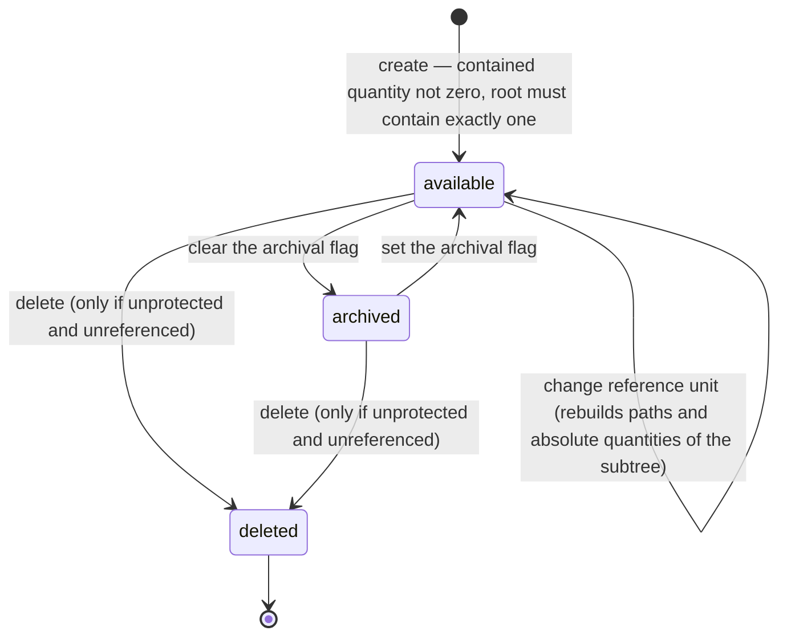
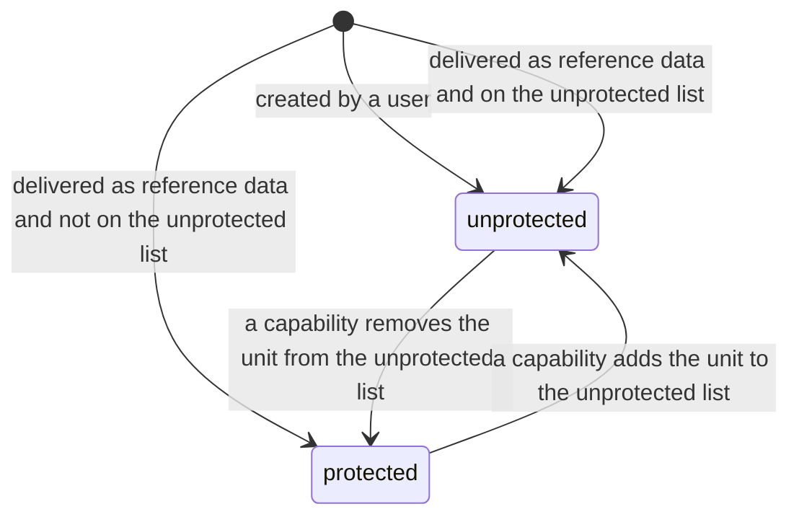
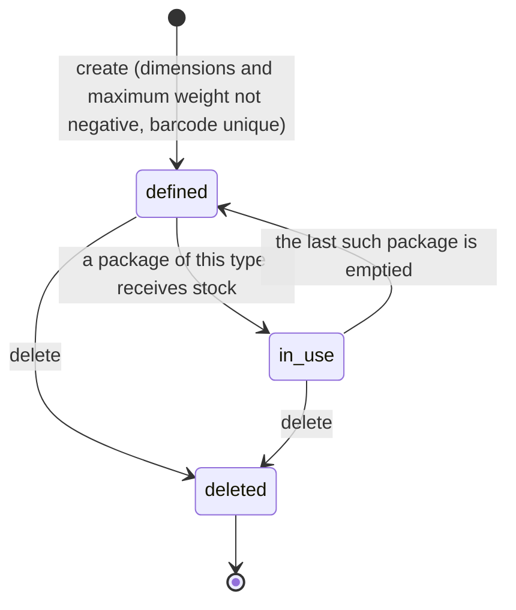
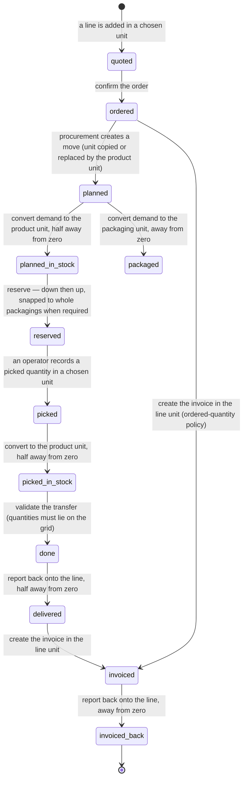
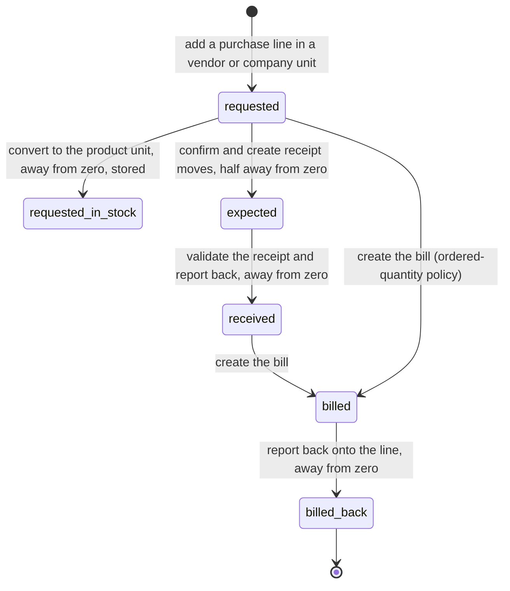
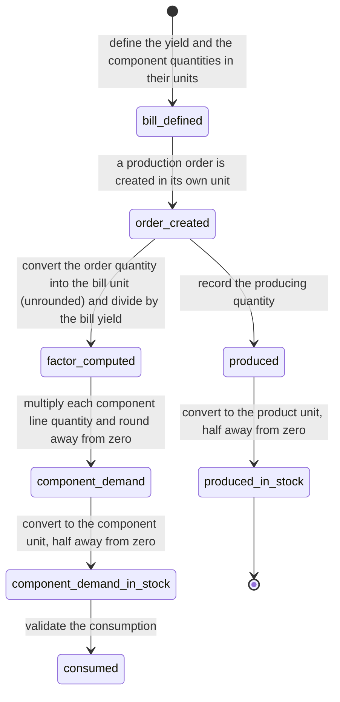

# Units of Measure and Packaging — State Machines

## 0. Summary

**No entity of this domain has a state field.** Units of measure, product unit barcodes, package
types and decimal precisions are all stateless configuration records.

That is not the same as saying the domain has no state machine. Three lifecycles matter and must
be reproduced:

1. the **availability lifecycle** of a unit of measure, driven by the archival flag and by the
   protection rules;
2. the **availability lifecycle** of a package type, driven by whether it currently holds stock;
3. the **quantity lifecycle** — the sequence of states a single physical quantity passes through
   as it crosses documents, changing its unit and its stored representation at each step. This is
   the machine a rebuild most often gets wrong, and it is specified here in full.

---

## 1. Unit of Measure availability lifecycle

### 1.1 States

| State | How it is represented | Meaning |
|---|---|---|
| `draft` (conceptual) | The record does not exist yet | A unit being defined in an unsaved form. Not persisted; listed so the creation transition has a source. |
| `available` | Archival flag set to yes | Selectable everywhere. Appears in default listings and in every selection list subject to the allowed-unit restrictions. |
| `archived` | Archival flag set to no | Hidden from default listings and selection lists. Still referenced by existing records; every conversion through it still works. |
| `deleted` | The record no longer exists | Gone. Descendants and packaging barcodes went with it. |

There is no stored selector; the state is the archival flag plus existence.

### 1.2 Transitions

| From | To | Trigger | Guards | Side effects |
|---|---|---|---|---|
| `draft` | `available` | Saving a new unit | Contained quantity is not zero (stored check). If no reference unit is given, contained quantity must be exactly one. | The sequence is derived and stored. The absolute quantity is derived and stored. The hierarchy path is built. |
| `available` | `archived` | Clearing the archival flag | none | The unit disappears from default searches. **Nothing else changes.** Documents, products and stored quantities keep their references. |
| `archived` | `available` | Setting the archival flag | none | The unit reappears in searches. |
| `available` | `deleted` | Deleting | The unit must not be protected (see the deletion guard). No document line may reference it through a restricting link. | Descendant units are deleted recursively. Packaging barcodes bound to the unit are deleted. |
| `archived` | `deleted` | Deleting | Same guards. | Same effects. |
| `available` | `available` | Changing the contained quantity | Not zero. Root units must stay at exactly one. | A warning is raised first when the unit is protected and older than one day. The absolute quantity of the unit and of every descendant is recomputed. **No stored document quantity is recomputed.** |
| `available` | `available` | Changing the reference unit | No cycle may be formed. A unit that ends up without a reference unit must contain exactly one. | The absolute quantity of the unit and of every descendant is recomputed. The hierarchy path of the unit and of every descendant is rebuilt. The unit may change tree, which silently changes which other units it can convert to. |

### 1.3 Diagram



### 1.4 The protection sub-state

Orthogonal to availability, a unit is either **protected** or **unprotected**. The state is not
stored on the unit; it is derived from whether an external identifier delivered by the units
capability points at it and whether the short part of that identifier is on the unprotected list.

| Sub-state | Determined by | Effect on the transitions above |
|---|---|---|
| `protected` | An external identifier from the units capability points at the unit, and its short part is not on the unprotected list. | Deletion is refused. Changing the contained quantity raises a warning when the record is older than one day. |
| `unprotected` | Either no such external identifier exists (a user-created unit), or its short part is on the unprotected list. | Deletion is allowed, subject only to referential restrictions. No warning on change. |

The unprotected list is itself state: it holds the working hour, the dozen and the pack of six by
default, and loses the working hour when the time-recording capability is installed.



---

## 2. Package Type availability lifecycle

### 2.1 States

| State | Representation | Meaning |
|---|---|---|
| `defined` | The record exists and no package of this type holds stock | Freely editable. Dimensions and weights may be changed with no consequence for stored data. |
| `in use` | The record exists and at least one package of this type holds stock | Editable, but a dimension change silently changes the storage-capacity arithmetic for packages that already exist. The "has contents" indicator is true. |
| `deleted` | The record no longer exists | Gone. Packages that referenced it keep no type. |

### 2.2 Transitions

| From | To | Trigger | Guards | Side effects |
|---|---|---|---|---|
| — | `defined` | Creating | Height, width, length and maximum weight must each be zero or greater. Barcode must be unique. | A numbering sequence is created when a sequence prefix was supplied. |
| `defined` | `in use` | A package of this type receives stock | none | The "has contents" indicator becomes true. |
| `in use` | `defined` | The last package of this type is emptied | none | The indicator becomes false. |
| `defined` or `in use` | `defined` or `in use` | Editing the sequence prefix | none | The numbering sequence is created or renamed. |
| `defined` or `in use` | `deleted` | Deleting | No referential restriction blocks it. | Packages keep existing with no type. Storage capacities referencing the type are removed. |
| `defined` or `in use` | duplicate | Duplicating | none | A new record with the name suffixed by a parenthesised `copy`, the storage capacities copied, and neither the barcode nor the sequence link copied. |



---

## 3. The quantity lifecycle across documents

This is the machine that matters operationally. A single physical quantity — "sixty items" — is
represented by a different number, in a different unit, in a different field, at each stage of
its life. The machine below is written for the sale-and-deliver path; the purchase path is its
mirror and is given in section 4.

### 3.1 States of a quantity

| State | Where the number lives | Unit it is expressed in | How it got there |
|---|---|---|---|
| `quoted` | Sales order line quantity | The line's unit, chosen by the seller from the product's allowed units | Typed, or defaulted to one |
| `ordered` | The same field, after confirmation | Unchanged | The order state changed; the number did not |
| `planned` | Stock move demand | The move's unit, copied from the line's unit | Copied |
| `planned in stock terms` | Stock move real quantity | The product's own unit | Converted, half away from zero |
| `packaged` | Stock move packaging quantity | The move's packaging unit, copied from the originating line's unit | Converted, away from zero |
| `reserved` | Reserved quantity on the quantities on hand | The product's own unit | Converted down then back up (see the double conversion) |
| `picked` | Stock move line quantity | The move line's unit, defaulted from the move's unit | Typed or suggested |
| `picked in stock terms` | Stock move line quantity in the product's unit | The product's own unit | Converted, half away from zero |
| `done` | Quantities on hand | The product's own unit | Summed from the picked quantities in the product's unit |
| `delivered` | Sales order line delivered quantity | The line's unit | Converted from each completed move's unit, half away from zero, summed |
| `invoiced` | Invoice line quantity | The invoice line's unit, copied from the order line's unit | Copied |
| `invoiced back` | Sales order line invoiced quantity | The line's unit | Converted from the invoice line's unit, away from zero |

### 3.2 Transitions

| From | To | Trigger | Guards | Side effects |
|---|---|---|---|---|
| `quoted` | `quoted` | Editing the quantity or the unit | The unit must be in the product's allowed list. | The price is recomputed: the rule is re-matched on the quantity converted into the product's own unit, and the resulting price is converted into the line's unit. The discount is recomputed. |
| `quoted` | `ordered` | Confirming the order | The usual order guards. | Procurement is launched. |
| `ordered` | `planned` | Procurement creating a move | The product must be storable. | The move is created either in the line's unit or in the product's own unit, according to the propagation parameter; the quantity is converted half away from zero either way. |
| `planned` | `planned in stock terms` | Automatic, on every write to the demand or the unit | none | The real quantity is stored. |
| `planned` | `packaged` | Automatic, on every write to the demand or the packaging unit | A packaging unit must be set. | The packaging quantity is stored. |
| `planned in stock terms` | `reserved` | Reserving | Quantities must be available. If the product's category requires full packagings and the move has a packaging unit, the available quantity is first snapped down to a whole packaging. | The reserved quantity on the quantities on hand increases. Move lines are created. |
| `reserved` | `picked` | An operator entering a picked quantity, or the system suggesting one | The unit must be in the allowed list. For serial-tracked products the quantity must resolve to exactly one of the product's own unit. | — |
| `picked` | `picked in stock terms` | Automatic, on every write to the quantity or the unit | none | The quantity in the product's unit is stored. |
| `picked` | `done` | Validating the transfer | Every picked quantity must lie on the precision grid. | Quantities on hand change by the quantity in the product's unit. The move's state becomes complete and its unit is frozen. |
| `done` | `delivered` | Automatic recomputation on the order line | The move's destination must be a customer location (or the reverse for a return). | The delivered quantity is the sum over completed moves of the move's picked quantity converted into the line's unit half away from zero, with returns subtracted. |
| `delivered` or `ordered` | `invoiced` | Creating an invoice | The invoicing policy decides whether the ordered or the delivered quantity is billed. | An invoice line is created with the order line's unit. |
| `invoiced` | `invoiced back` | Automatic recomputation on the order line | The invoice must be posted, or be a draft depending on the configuration. | The invoiced quantity is the sum over invoice lines of the quantity converted into the order line's unit away from zero, credit notes subtracted. |

### 3.3 Diagram



### 3.4 The invariant that ties the machine together

At every state, the *physical* quantity is the same. What differs is the representation:

```formula
physical_quantity = stored_number × absolute_quantity( unit_of_that_state )
```

up to the rounding applied at each transition. A rebuild can test itself by computing the
physical quantity at every state of a worked case and checking that the differences are bounded
by one step of the `Product Unit` precision multiplied by the absolute quantity of the unit that
was rounded.

For the five-boxes-of-twelve case of [`calculations.md`](calculations.md):

| State | Stored number | Unit | Physical quantity in root units |
|---|---|---|---|
| `quoted` | 5 | `Box of 12` | 60 |
| `planned` | 5 | `Box of 12` | 60 |
| `planned in stock terms` | 60 | `Units` | 60 |
| `packaged` | 5 | `Box of 12` | 60 |
| `reserved` | 60 | `Units` | 60 |
| `picked` | 5 | `Box of 12` | 60 |
| `picked in stock terms` | 60 | `Units` | 60 |
| `done` | 60 | `Units` | 60 |
| `delivered` | 5 | `Box of 12` | 60 |
| `invoiced` | 5 | `Box of 12` | 60 |
| `invoiced back` | 5 | `Box of 12` | 60 |

Every value is exact because twelve divides sixty. Repeating the exercise with a demand of seven
units against a line in dozens shows the drift.

---

## 4. The purchase-side quantity lifecycle

### 4.1 States

| State | Where the number lives | Unit | How it got there |
|---|---|---|---|
| `requested` | Purchase order line quantity | The line's unit, which may be a vendor unit | Typed, defaulted from the vendor's minimum quantity, or produced by a procurement |
| `requested in stock terms` | Purchase order line total quantity | The product's own unit | Converted, away from zero, stored |
| `expected` | Stock move demand | The line's unit or the product's own unit, per the propagation parameter | Converted, half away from zero |
| `received` | Purchase order line received quantity | The line's unit | Converted from each completed move's unit, away from zero |
| `billed` | Vendor bill line quantity | The bill line's unit | Copied or typed |
| `billed back` | Purchase order line invoiced quantity | The line's unit | Converted from the bill line's unit, away from zero |

### 4.2 Transitions

| From | To | Trigger | Guards | Side effects |
|---|---|---|---|---|
| — | `requested` | Adding a line | The unit must be in the line's allowed list, which includes vendor units. | The vendor is selected on the quantity converted into the vendor's unit; the price is converted from the vendor's unit into the line's unit. |
| `requested` | `requested in stock terms` | Automatic | none | The total quantity is stored. |
| `requested` | `expected` | Confirming the order | none | One or more moves are created; a remaining quantity that could not be attached to an existing move creates an extra move with no chaining. |
| `expected` | `received` | Validating the receipt | Grid rule applies. | The received quantity on the line is recomputed. |
| `received` or `requested` | `billed` | Creating the bill | The purchase method decides whether the ordered or the received quantity is billed. | A bill line is created with the vendor's unit where one applies, otherwise the product's own unit. |
| `billed` | `billed back` | Automatic | none | The invoiced quantity on the line is recomputed. |



---

## 5. The manufacturing-side quantity lifecycle

| State | Where the number lives | Unit | How it got there |
|---|---|---|---|
| `bill yield` | Bill of materials produced quantity | The bill's unit | Typed |
| `bill component` | Bill of materials line quantity | The component line's unit | Typed |
| `order quantity` | Production order quantity to produce | The order's unit | Typed or produced by a procurement |
| `scaling factor` | Not stored | dimensionless | The order quantity converted into the bill's unit, unrounded, divided by the bill's produced quantity |
| `component demand` | Raw-material move demand | The component line's unit | The component line quantity multiplied by the scaling factor, then rounded away from zero |
| `component demand in stock terms` | Raw-material move real quantity | The component's own unit | Converted, half away from zero |
| `produced` | Production order producing quantity | The order's unit | Typed |
| `produced in stock terms` | Finished move quantity | The product's own unit | Converted, half away from zero |



**Guard worth stating:** the scaling factor is computed **unrounded**, deliberately, so that a
production order for a third of a batch scales every component by exactly one third rather than
by a rounded approximation. Only the final component quantity is rounded, and it is rounded
**away from zero**, so a production run never plans to consume less material than the ratio
demands.

---

## 6. States a rebuild must *not* invent

| Tempting state | Why it does not exist |
|---|---|
| A unit "in use" versus "unused" | Not tracked. The deletion guard is about protection, not usage; usage is enforced by referential restrictions at delete time. |
| A packaging "active for this product" | Not a state of the unit; it is membership of the product's additional-units list. |
| A "converted" flag on a quantity | Every conversion is recomputed from the stored numbers; no marker records that a conversion happened. |
| A per-unit precision "configured" state | The precision is global. |
| A "packaging fully reserved" state | The full-packaging policy is a category setting evaluated at reservation time, not a state carried by the reservation. |
