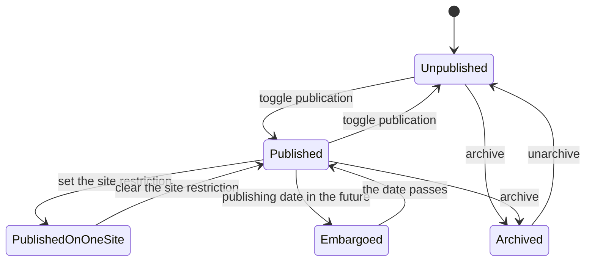
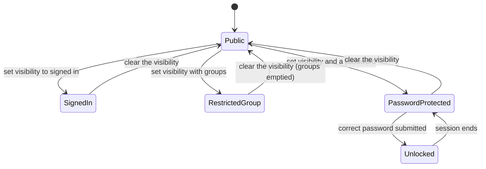
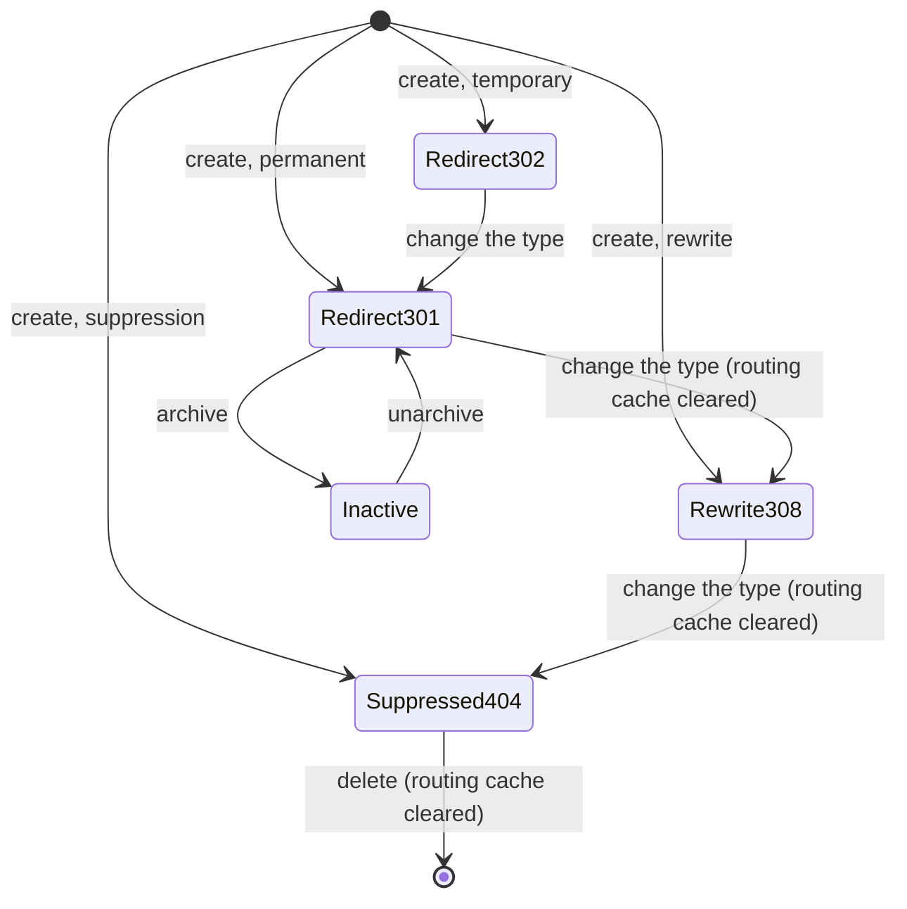
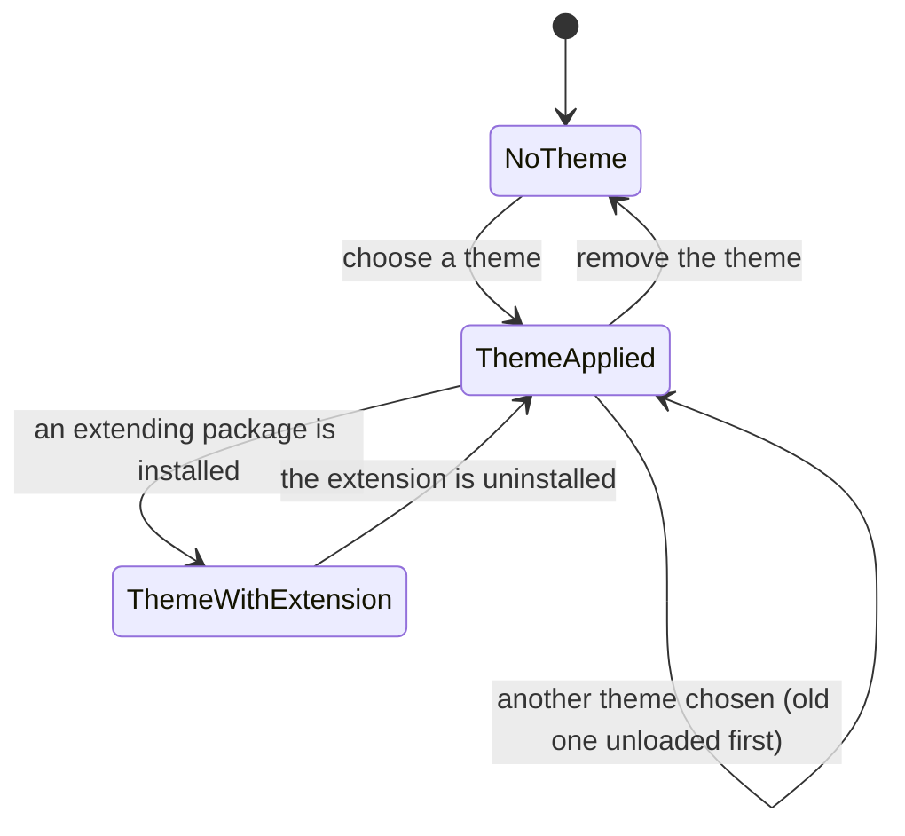
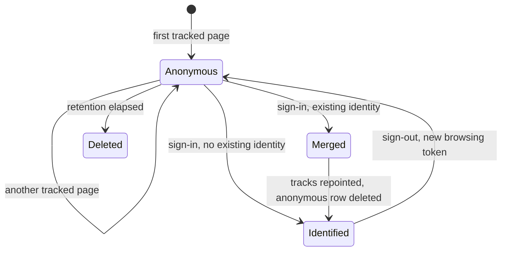
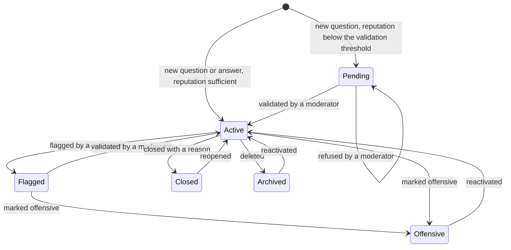
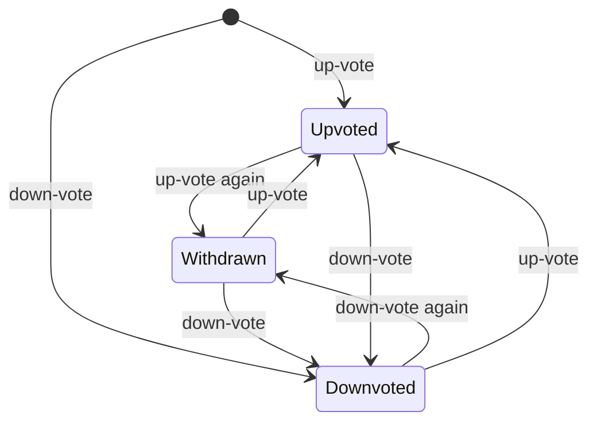
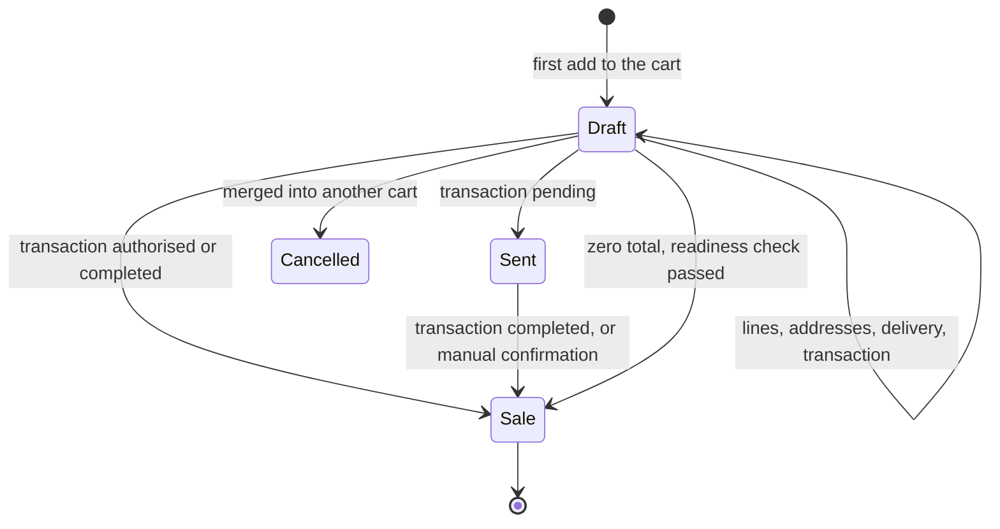

# State machines

Every state-bearing field of this folder, with the stored value, the label and the meaning of each
state, the complete transition table (origin, destination, triggering operation, guards in the order
they are evaluated, the exact refusal message when a guard fails, and the records created or
changed), and a diagram per machine.

Three kinds of machine appear here. A **stored state machine** is driven by one selection field
(forum post status, sales order state, forum vote). A **flag machine** is driven by one or more
boolean or date fields whose combination is the observable state (publication, indexing, cache
freshness). A **gate** is evaluated on every request and stores nothing (page visibility); it is
listed because a rebuild must reproduce its outcomes exactly.

---

## 1. Publication of a record on a site

Applies to every entity carrying the publication mixin: Website Page, Website Model Page, Blog Post,
Product Template, Shipping Method, Website Checkout Step, Website Content Block Filter, Partner
Website Tag, Contact, Badge, Course, Server Action and the site-restricted records of neighbouring
folders.

| State | Stored values | Meaning |
|---|---|---|
| Unpublished | publication flag false | The record is reachable only by an internal user. It is absent from listings, from the site search and from the site index. |
| Published | publication flag true, no site restriction | Every site shows it. |
| Published on one site | publication flag true, site set | Only that site shows it; every other site reads it as unpublished. |
| Embargoed | publication flag true, publishing date in the future (pages and blog posts only) | Visitors receive "not found"; designers still see it. |
| Archived | active flag false | Removed from every default query; the publication flag is forced to false for a blog post. |

| From | To | Trigger | Guards, in order | Side effects |
|---|---|---|---|---|
| Unpublished | Published | Toggle Publication, or a write of the publication flag | The publication right of [entities.md](entities.md) §3.2: the platform write check on the record, which a member of the Editor and Designer group always passes for a page. Refusal message: `You do not have the rights to publish/unpublish` | For a Product Template, the publication date is set to the present moment. For a Blog Post, the publishing date is set and the publication message is posted on the blog. For a paid Course, the linked product is published. For a print-on-demand product without print images the write is refused with `Print images must be set on products before they can be published.` |
| Published | Unpublished | Toggle Publication | The same right | For a Blog Post, the publishing date is cleared when it was empty or already past. Menu entries that target an unpublished page become invisible to non-internal users. For a Course, the linked product is unpublished unless another published course still uses it. |
| Published | Published on one site | Write the site restriction | Write access | The record disappears from the other sites, including from their site index and search. |
| Published | Embargoed | Write a publishing date in the future | The publication right | The page or post answers "not found" to visitors and leaves the site index; designers still see it. |
| Embargoed | Published | The publishing date passes | none, time-based | The record is served, indexed and searchable again. |
| Any | Archived | Archive | Write access | For a Blog Post the publication flag is forced to false; for a Blog every post is archived; for a Forum every post is archived; for a Product Variant every draft site order line referencing it is deleted. |
| Archived | Unpublished | Unarchive | Write access | The publication flag stays false until the record is published again. |

## 2. Indexing of a page

| State | Stored value | Meaning |
|---|---|---|
| Indexed | indexing flag true | The page is enumerated in the site index and no exclusion instruction is emitted. |
| Not indexed | indexing flag false | The page is excluded from the site index and a no-index instruction is emitted in the document head. |

| From | To | Trigger | Guards | Side effects |
|---|---|---|---|---|
| Indexed | Not indexed | Clear the indexing flag in the page properties dialogue | Editor and Designer | The page leaves the next site index generation, that is within twelve hours. |
| Not indexed | Indexed | Set the indexing flag | Editor and Designer | The page is enumerated again at the next generation. |

A page is additionally excluded from the index, whatever this flag says, when it is unpublished, when
its publishing date is in the future, when its visibility is not public, or when its address is `/`,
which the root endpoint already enumerates.

## 3. Page visibility gate

Evaluated on the main content template of every request, in this order. A member of the Editor and
Designer group is never stopped.

| Stored value | Label | Meaning | Condition checked | Outcome when it fails |
|---|---|---|---|---|
| empty | Public | Anyone may open the page. | none | Always allowed. |
| `connected` | Signed In | Only an authenticated visitor may open it. | The current user is not the site's public user | Forbidden. |
| `password` | With Password | A shared password opens it. | The current user is not the public user **and** the template identifier is already in the session's unlocked list; otherwise the submitted password is verified against the stored hash and, on success, the template identifier is appended to the unlocked list | Forbidden, carrying the password marker, which makes the fallback handler render the password prompt page for the requested path. |
| `restricted_group` | Restricted Group | Only members of the listed groups may open it. | The platform template access check passes | Forbidden. |

Writing any value other than `restricted_group` empties the authorised group list, and every write of
the visibility or of the group list clears the template cache, because routing and rendering both
depend on them.

## 4. Rewrite rule action type

| Stored value | Label | Meaning |
|---|---|---|
| `301` | 301 Moved permanently | The fallback handler answers a permanent redirect; browsers cache the new address. |
| `302` | 302 Moved temporarily | The same with a temporary redirect; browsers do not cache it. |
| `308` | 308 Redirect / Rewrite | The endpoint is registered at the target path, and the source path answers a permanent redirect to it while preserving slug values and query string. |
| `404` | 404 Not Found | The endpoint is removed from the routing table for this site; the address answers "not found". |

| From | To | Trigger | Guards | Side effects |
|---|---|---|---|---|
| (new) | `301` or `302` | Create | Both addresses set, different once their fragment is removed, neither starting with `#`; refusal messages in [business-rules.md](business-rules.md) WS-110 to WS-113 | No routing change; the fallback handler serves the rule. |
| (new) | `308` | Create | The four checks above plus the six rewrite checks WS-114 to WS-118 | The routing cache is cleared on every worker; the endpoint is registered at both addresses. |
| (new) | `404` | Create | none beyond the two address checks | The routing cache is cleared; the endpoint disappears for this site. |
| `301` or `302` | `308` or `404` | Change the type | The checks of the new type | The routing cache is cleared. |
| `308` or `404` | the same type | Change any field | The checks of that type | The routing cache is cleared. |
| `308` or `404` | (gone) | Delete | none | The routing cache is cleared. |
| Any | Inactive | Archive | none | The rule is ignored; for `308` and `404` the write clears the routing cache. |

## 5. Theme applied to a site

| State | Stored value | Meaning |
|---|---|---|
| No theme | theme pointer empty | The site renders with the default templates only. |
| Theme applied | theme pointer set | The templates, assets, pages, menus and attachments of that theme exist as site-specific records. |
| Theme with extension | theme pointer set and an extending package installed | The extension's templates are loaded for every site whose theme is in the same stream. |

| From | To | Trigger | Guards | Side effects |
|---|---|---|---|---|
| No theme | Theme applied | Choose a theme | Editor and Designer | The default style configuration is reset; the pointer is set **before** the installation; the chain of packages the theme depends on is upgraded or installed; templates are copied for this site in the fixed order; the post-copy hook runs; the designer is redirected to the site. |
| Theme A | Theme B | Choose another theme | Editor and Designer | Theme A's stream is unloaded in reverse installation order and its copies deleted; then the flow above runs for B. |
| Theme A | No theme | Remove the theme | Editor and Designer | The default style configuration is reset; A's stream is unloaded; the pointer is cleared. |
| Theme A | Theme A | Refresh the theme | Editor and Designer | the chain of packages theme A depends on is upgraded, which reloads the templates on the installation write. |
| Theme A | Theme A plus extension | A package extending A is installed | automatic | The extension is loaded for every site whose theme is in the same stream; when the installation was started from the interface, a configuration parameter narrows the scope to the current site. |

## 6. Visitor connection state

| State | Stored values | Meaning |
|---|---|---|
| Anonymous | token is a 32-character digest, contact empty | A browsing identity with no known person behind it. |
| Identified | token is a contact identifier, contact set | The identity of a person who signed in at least once. |
| Connected | last connection moment less than five minutes ago | A derived reading, shown in the visitor list. |
| Deleted | (row gone) | Removed by the scheduled cleanup. |

| From | To | Trigger | Guards | Side effects |
|---|---|---|---|---|
| (none) | Anonymous, visit count 1 | A tracked page is served to an unknown token | The database is writable, the agent is not a crawler, the response status is 200, the tracking-disabled header is absent and the template carries the tracking flag | One visitor row and one visit row are inserted by a single statement. |
| Anonymous | Anonymous, same visit count | Another tracked page within eight hours | the same | The last connection moment is refreshed; a visit row is added. |
| Anonymous | Anonymous, visit count plus one | Another tracked page after more than eight hours | the same | The same, plus the visit count is increased. |
| Anonymous | Identified | The person signs in and has no visitor yet | Authentication succeeded | The token becomes the contact identifier, which makes the derived contact resolve; the last connection moment is refreshed. |
| Anonymous | Merged into an Identified visitor | The person signs in and already has a visitor | Authentication succeeded and the target carries a contact; otherwise the merge is refused with ``The `target` visitor should be linked to a partner.`` | The anonymous visitor's visit rows are repointed to the target and the anonymous visitor is deleted. |
| Identified | A new Anonymous visitor | The person signs out and browses again | the tracking preconditions | The identified visitor is untouched. |
| Anonymous | Deleted | The retention period elapses with no contact | The scheduled cleanup | The visitor and its visit rows are deleted. |

## 7. Forum post status

| Stored value | Label | Meaning |
|---|---|---|
| `active` | Active | The post is public and appears in listings, in the site search and in the site index. |
| `pending` | Waiting Validation | A question created by a participant below the validation threshold. Only its author and the moderators see it. |
| `close` | Closed | A question closed with a reason; it stays readable to participants who may close posts, and disappears from the listings of everybody else. |
| `offensive` | Offensive | A post a moderator marked as offensive; it is also archived, so it leaves every default query. |
| `flagged` | Flagged | A post a participant reported; it waits in the moderation queue. |

| From | To | Trigger | Guards, in order | Records created or changed |
|---|---|---|---|---|
| (none) | `active` | Create a question with a reputation at or above the validation threshold | The asking threshold, refused with `%d karma required to create a new question.`; the content rules of [entities.md](entities.md) §4.2 | The post; the author's reputation increases by the asking award; the shipped new-question message is posted with the question title as subject. |
| (none) | `pending` | Create a question below the validation threshold | The asking threshold | The post; no reputation is awarded yet; the shipped validation message is posted as an internal note to the moderators and the tag followers. |
| (none) | `active` | Create an answer | The answering threshold, refused with `%d karma required to answer a question.`; the parent must be neither closed nor archived, refused with `Posting answer on a [Deleted] or [Closed] question is not possible.` | The post; the shipped new-answer message is posted on the question with the subject `Re: ` followed by the question title; the question's last activity moment is refreshed. |
| `pending` | `active` | Validate | The moderation threshold, refused with `%d karma required to validate a post.` | The state becomes active, the active flag is set, the moderator is recorded, the asking award is granted and the state notification runs. |
| `pending` | `pending` | Refuse | The moderation threshold, refused with `%d karma required to refuse a post.` | Only the moderator is recorded; the post stays pending and invisible. |
| `active` | `flagged` | Flag | The flagging threshold, refused with `%d karma required to flag a post.` | The state becomes flagged and the flagging user is recorded. The answer to the caller is a success marker that distinguishes a moderator from an ordinary participant; a post already flagged answers with an "already flagged" marker and a post in any other state with a "not flaggable" marker. |
| `flagged` | `active` | Validate from the flagged queue | The moderation threshold | The state becomes active and the moderator is recorded. |
| `flagged` or `active` | `offensive` | Mark as offensive with an offensive reason | The moderation threshold, refused with `%d karma required to mark a post as offensive.` | The state becomes offensive, the active flag is cleared, the moderator, the closing moment and the reason are recorded, and the author loses the flagging award. |
| `offensive` | `active` | Reactivate | The deletion threshold, refused with `%d karma required to delete or reactivate a post.` | The active flag is set again. |
| `active` | `close` | Close a question with a basic reason | The closing threshold, refused with `%d karma required to close or reopen a post.`; the post must be a question, otherwise the operation does nothing | The state becomes closed and the closing user, moment and reason are recorded. With the offensive or the spam reason the author loses the flagging award, multiplied by ten for the spam reason when the question is the author's first in that forum. |
| `close` | `active` | Reopen | The closing threshold | The state becomes active. When the question had been closed with the offensive or the spam reason, the deduction is given back, with the same tenfold rule. |
| Any | (archived) | Delete a post (archive) | The deletion threshold, refused with `%d karma required to unlink a post.` | The active flag is cleared and every answer of the post is archived with it. Deleting an accepted answer withdraws the acceptance award from its author and the acceptance bonus from the participant who accepted it. |

## 8. Answer acceptance

| State | Stored value | Meaning |
|---|---|---|
| Not accepted | acceptance flag false | An ordinary answer. |
| Accepted | acceptance flag true | The answer the asker or a moderator accepted; the question then reads as answered and the answer sorts first. |

| From | To | Trigger | Guards | Side effects |
|---|---|---|---|---|
| Not accepted | Accepted | Accept the answer | The acceptance threshold (own question or all questions), refused with `%d karma required to accept or refuse an answer.`; the acting participant may not be the author of the answer, which the endpoint answers with an "own post" marker | Every other answer of the question has its acceptance flag cleared, because only one answer may be accepted. The answer's author gains the acceptance award and the accepting participant gains the acceptance bonus, unless the two are the same person. The question's answered flag becomes true. |
| Accepted | Not accepted | Withdraw the acceptance | The same threshold | The two awards are withdrawn symmetrically; the answered flag becomes false when no other answer is accepted. |

## 9. Forum vote

| Stored value | Label | Meaning |
|---|---|---|
| `1` | 1 | An up-vote. |
| `-1` | −1 | A down-vote. |
| `0` | 0 | A withdrawn vote; the row stays so that the uniqueness constraint keeps one row per participant and post. |

| From | To | Trigger | Guards | Side effects |
|---|---|---|---|---|
| (none) | `1` | Up-vote | Not the author's own post, refused with `It is not allowed to vote for its own post.`; the up-vote threshold, refused with `%d karma required to upvote.` | The row is created; the post author's reputation moves by the up-vote award of the question or of the answer. |
| (none) | `-1` | Down-vote | Not the author's own post; the down-vote threshold, refused with `%d karma required to downvote.` | The row is created; the author's reputation moves by the down-vote award, which is negative. |
| `1` | `0` | Up-vote again | The up-vote guard, which always passes because the present vote is an up-vote | The award is withdrawn. |
| `-1` | `0` | Down-vote again | The down-vote guard, which always passes because the present vote is a down-vote | The deduction is given back. |
| `1` | `-1` | Down-vote a post already up-voted | The down-vote threshold | The reputation moves by the difference between the two awards. |
| `-1` | `1` | Up-vote a post already down-voted | The up-vote threshold | The symmetric move. |

The amounts and one worked example are in [calculations.md](calculations.md) §21.

## 10. Blog post publication

| State | Stored values | Meaning |
|---|---|---|
| Draft | publication flag false, no publishing date | Written but never published. |
| Published now | publication flag true, publishing date at or before the present moment | Visible in the listing, the feed, the site index and the search. |
| Scheduled | publication flag true, publishing date in the future | Hidden from non-designers until the date passes. |
| Unpublished | publication flag false after having been published | Hidden again; the publishing date is cleared when it was empty or already past. |
| Archived | active flag false | Hidden everywhere and forced unpublished. |

| From | To | Trigger | Guards | Side effects |
|---|---|---|---|---|
| Draft | Published now | Publish | The publication right | The publishing date is set to the present moment; a message with the publication subtype is posted on the parent blog. |
| Draft | Scheduled | Set a future publishing date, then publish | The publication right | The publishing date keeps the future value; the message is still posted; the post stays hidden from non-designers. |
| Scheduled | Published now | The publishing date passes | time-based | The post appears in the listing, the feed, the site index and the search. |
| Published now | Unpublished | Unpublish | The publication right | The publishing date is cleared when it was empty or already past; no message is posted. |
| Published now or Draft | Archived | Archive | Write access | The publication flag is forced to false. |
| Archived | Unpublished | Unarchive | Write access | The publication flag stays false until the post is published again. |
| Any | Archived | The parent blog is archived | Write access on the blog | Every post of the blog is archived. |
| Any | Unarchived | The parent blog is unarchived | Write access on the blog | Every post of the blog is unarchived. |

## 11. Sales Order used as a cart

The order states are owned by [sales](../sales/README.md); this table states what the storefront does
to reach each of them.

| Stored value | Label | Meaning on the storefront |
|---|---|---|
| `draft` | Quotation | The cart. It is editable, it may become an abandoned cart, and it is the only state the cart resolution accepts. |
| `sent` | Quotation Sent | Reached when a transaction is pending, typically a wire transfer. No stock is reserved and no invoice is produced. |
| `sale` | Sales Order | Confirmed. Delivery work is created and the order becomes invoiceable. |
| `cancel` | Cancelled | Reached when an abandoned cart is merged into the current cart, or by a back-office cancellation. |

| From | To | Trigger | Guards | Side effects |
|---|---|---|---|---|
| (absent) | `draft` | First add to the cart | The add-to-cart permission check, refused with `The given product does not exist therefore it cannot be added to cart.` | A Sales Order is created with the site, the site's company, the contact, the price list, the fiscal position (written explicitly only for the public user) and the sales team; the session records its identifier and the cart quantity. |
| `draft` | `draft` | Add, update or remove a line | The quantity verification chain of [storefront-checkout.md](storefront-checkout.md) §2.9 | Lines written; the delivery line re-rated or removed; promotions refreshed; the session cart counter updated. |
| `draft` | `draft` | Select a delivery method | No transaction in a state other than draft, cancelled or error, refused with `It seems that there is already a transaction for your order; you can't change the delivery method anymore.` | The previous delivery line is removed and a new one created at the rated price. |
| `draft` | `draft` | Create a payment transaction | The payment-readiness checks of [storefront-checkout.md](storefront-checkout.md) §10.5 | A transaction is created and linked; the session records the transaction and the last order. |
| `draft` | `sent` | The transaction becomes pending | none | The quotation is marked as sent; for a custom provider the payment reference is written on the order; the payment-status message is sent. |
| `draft` or `sent` | `sale` | The transaction becomes authorised or completed | Exactly one order on the transaction, the order needs no signature and the paid amount reaches the confirmation threshold | The order is confirmed with message sending enabled; a salesperson is assigned as the system user; delivery work is created; with automatic invoicing the invoice is created, posted and sent. |
| `draft` or `sent` | `sale` | The transaction of a pay-on-site provider becomes pending | The order's method is of the collect-in-store kind | The order is confirmed and the picking is created, although no payment has been captured. |
| `draft` | `sale` | The payment validation endpoint is reached with a zero total and no transaction | The readiness check passes | The order is confirmed with message sending enabled. |
| `sent` | `sale` | A person confirms the order after the funds arrive | Sales rights | The ordinary confirmation effects. |
| `draft` | `draft` | The abandoned-cart delay elapses | The customer is not the public contact and the order has lines | The derived abandoned-cart flag becomes true. |
| `draft` | `draft` | A recovery message is sent | The order is an abandoned cart and no message was sent | The recovery flag becomes true; the cart is never examined again. |
| `draft` | `cancel` | An abandoned cart is merged into the current cart | The revival method is "merge" and a current cart exists | The old order's lines are moved to the current cart and the old order is cancelled. |
| any | unchanged | The site, product or company checks fail during session resolution | none | The storefront session is reset; the shopper starts a new cart. |

### 11.1 Payment transaction as the storefront sees it

| Transaction state | Effect on the order | Effect on the session |
|---|---|---|
| `draft` | None. The cart stays editable and the payment validation endpoint sends the shopper back to the shop. | The cart key is kept. |
| `pending` | The order moves to `sent`, or to `sale` for a pay-on-site provider. | The cart is released, because a session cart whose last transaction is pending is dropped. |
| `authorized` | The order is confirmed when the confirmation amount is reached. | Released. |
| `done` | The order is confirmed; the optional automatic invoice is produced. | Released. |
| `error` | The order stays draft, but the cart is no longer eligible for a recovery message. | Kept. |
| `cancel` | The order stays draft and remains editable; the delivery method may be changed again. | Kept. |

## 12. Checkout step

| State | Stored values | Meaning |
|---|---|---|
| Generic | no site | A template row, copied onto every new site. |
| Per-site, published | site set, publication flag true | The step participates in the flow of that site. |
| Per-site, unpublished | site set, publication flag false | The step is skipped by the forward and backward navigation. |

| From | To | Trigger | Guards | Side effects |
|---|---|---|---|---|
| Generic | Per-site, published | A site is created | none | One copy per generic step, with the new site. |
| Generic | Per-site, unpublished | A site is created, for the extra-information step | The extra-information page option of that site is inactive | The copy is created unpublished. |
| Per-site, unpublished | Per-site, published | Switch the extra-information option on, or publish the step | Website Designer | Both the page option and the publication flag are written together, so that the step list and the page agree. |
| Per-site, published | Per-site, unpublished | Switch the option off | Website Designer | The step leaves the navigation and its address redirects to the payment step. |

## 13. Product feed cache

| State | Condition | Transition |
|---|---|---|
| Empty | No cached document | The first fetch renders and stores it. |
| Fresh | The expiry moment is in the future | Served directly, without rendering. |
| Expired | The expiry moment has passed | The next fetch takes an exclusive lock on the row, re-renders, stores and sets the expiry to the start of tomorrow. |
| Invalidated | A parameter changed, or an administrator reset the cache | The expiry is set one day in the past, which makes the state expired. |

## 14. Wish list row

| State | Condition | Transition |
|---|---|---|
| Anonymous | No contact; the identifier is in the session list | Signing in assigns it to the contact, or deletes it as a duplicate; five weeks without a contact deletes it. |
| Owned | A contact is set | Removing it deletes it; archiving hides it. |
| Hidden | The product's template is unpublished or no longer addable to the cart | The row still exists but is filtered out of every listing. |

## 15. Page response cache

| State | Condition | Transition |
|---|---|---|
| Not cacheable | The request verb is not a retrieval verb, the request carries parameters, the current user is not the public user, the page has authorised groups, or the rendered markup contains a cart marker | The response is produced and never stored. |
| Cached, fresh | An entry exists under the key of [business-rules.md](business-rules.md) WS-070 and is younger than 3600 seconds | A copy of the stored response is returned after post-processing: the embedded request forgery token is replaced by the token of the current session and the cart counter element is rewritten from the session. |
| Cached, stale | The entry is older than 3600 seconds | The raw response is produced again and the entry is refreshed. |
| Invalidated | A page address, visibility or group list changed, a page or model page was deleted, or a menu entry was created, changed or deleted | The template cache is cleared, which also invalidates the menu cache flag. |

## 16. Cookie consent

| State | Stored value | Meaning |
|---|---|---|
| Not asked | no consent cookie | The consent bar is shown; optional cookies are refused. |
| Essentials only | the consent document maps the optional category to false | Optional cookies stay refused; third-party content is neutralised. |
| All accepted | the consent document maps the optional category to true | Optional cookies are allowed; the audience measurement script is granted its four categories. |
| Legacy value | the cookie does not contain a structured document | The cookie is deleted with a zero lifetime and the answer is refused, so the visitor is asked again. |

| From | To | Trigger | Side effects |
|---|---|---|---|
| Not asked | Essentials only | The visitor presses `Only essentials` | The consent document is stored for 999 days; third-party frames and scripts are neutralised. |
| Not asked | All accepted | The visitor presses `I agree` | The consent document is stored for 999 days; the one-shot acceptance handler grants the measurement categories. |
| Essentials only | All accepted | The visitor accepts later | The same. |
| Any | Not asked | The consent bar setting is switched off | Optional cookies are allowed on the assumption that the site implements its own consent mechanism. |
