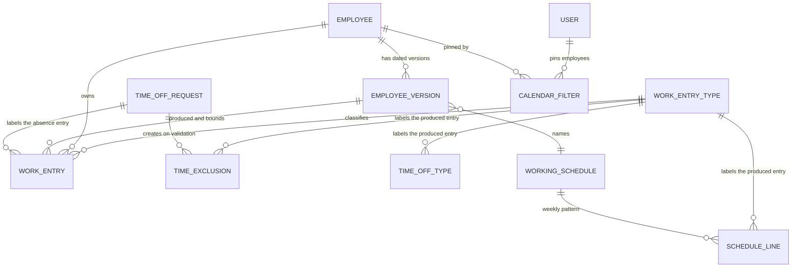

# Work Entries — Entities

This file gives the complete definition of every entity the Work Entries domain owns, and
of every field it adds to entities owned by other domains. Behaviour that belongs to an
algorithm is stated here only in summary and is specified in full in
[calculations.md](calculations.md); behaviour that belongs to a validation is stated here
only in summary and is specified in full in [business-rules.md](business-rules.md).

---

## 1. Entity map



Reading the map:

- The only two persistent entities this domain truly owns are the **Work Entry Type** and
  the **Work Entry**. Everything else is either a small convenience record (the per-user
  calendar filter), a transient form (the regeneration wizard), or a set of fields bolted
  onto an entity of another domain.
- A Work Entry always points at **both** an Employee and an Employee Version. The version
  pointer is not redundant: it identifies which employment terms the entry belongs to, and
  the generation markers that govern regeneration live on that version.
- A Work Entry Type is reachable from four directions — a work entry, a schedule line, a
  working time exclusion and a time off type — and those four are exactly the four ways
  the generation engine can decide what kind of time an interval represents.

---

## 2. Summary of entities

| Entity | Transport name | Storage name | Kind | Default ordering | Archivable | Company scoped |
|---|---|---|---|---|---|---|
| Work Entry Type | `hr.work.entry.type` | `hr_work_entry_type` | persistent | by identifier (no explicit order) | yes, through `active` | no; scoped by country instead |
| Work Entry | `hr.work.entry` | `hr_work_entry` | persistent | by `create_date` ascending | yes, through `active`, coupled to the state | yes, required |
| Work Entry Employee Filter | `hr.user.work.entry.employee` | `hr_user_work_entry_employee` | persistent | by identifier | yes, through `active` | no |
| Work Entry Regeneration Wizard | `hr.work.entry.regeneration.wizard` | transient | transient | by identifier | no | through the employees it names |

Each of the four has a generated reference page listing its fields exactly as the system declares
them, together with the machine-readable definition the catalogues carry:
[Work Entry Type](../../references/entities/hr.work.entry.type.md),
[Work Entry](../../references/entities/hr.work.entry.md),
[Work Entry Employee Filter](../../references/entities/hr.user.work.entry.employee.md) and
[Work Entry Regeneration Wizard](../../references/entities/hr.work.entry.regeneration.wizard.md).
The entities this domain extends have their own reference pages:
[Employee Version](../../references/entities/hr.version.md),
[Employee](../../references/entities/hr.employee.md),
[Working Schedule](../../references/entities/resource.calendar.md),
[Working Schedule Line](../../references/entities/resource.calendar.attendance.md),
[Working Time Exclusion](../../references/entities/resource.calendar.leaves.md),
[Time Off Type](../../references/entities/hr.leave.type.md) and
[Time Off Request](../../references/entities/hr.leave.md).

---

## 3. Work Entry Type (`hr.work.entry.type`, table `hr_work_entry_type`)

**Work Entry Type** is the catalogue entry describing *one kind of time*. Its label in the
interface is "HR Work Entry Type"; the abbreviation inside that quoted label is part of the
string and is deliberately not expanded.

### 3.1 Purpose

A work entry type answers three questions at once:

1. **What is this time, for payroll?** The payroll code (`code`) is the identifier every
   downstream payroll rule and every statutory export keys off. Two different kinds may
   never share a payroll code within the same country scope.
2. **Does this time count as work or as absence?** The absence flag (`is_leave`) drives
   the whole generation engine: an interval whose type is marked as absence is measured
   against the *theoretical* schedule rather than against its own clock span, is
   validated against the schedule so that an absence on a non-working day becomes a
   conflict, and is excluded from the schedule's hours-per-week total.
3. **How is it paid?** The rate (`amount_rate`) is a multiplier — one means ordinary pay,
   one and a half means time and a half, two means double time, zero and three quarters
   means the time is paid at seventy-five percent. The extra-hours flag
   (`is_extra_hours`) says whether the hours are added on top of the basic salary rather
   than being part of it.

### 3.2 Field table

| Field (storage name) | Full name | Type | Meaning and rules |
|---|---|---|---|
| `name` | Name | single line text | **Required**, translatable. The human label, for example "Attendance", "Paid Time Off", "Overtime Hours". Copied on duplication. |
| `display_code` | Display Code | single line text, at most three characters | Optional, translatable. A very short badge shown on each day cell of the work entry calendar, for example `A`, `PTO`, `OoC`. Its help text reads "This code can be changed, it is only for a display purpose (3 letters max)". Purely cosmetic: nothing keys off it. Copied on duplication. |
| `code` | Payroll Code | single line text | **Required**. The payroll code. Its help text reads "Careful, the Code is used in many references, changing it could lead to unwanted changes." Unique within a country scope — see [3.5](#35-uniqueness-of-the-payroll-code). Copied on duplication. Examples: `WORK100` for ordinary attendance, `LEAVE100` for generic absence, `OVERTIME`, `OUT` for out of contract. |
| `external_code` | External Code | single line text | Optional. A second code carried only so that exports to a third-party system can use the third party's own vocabulary. Its help text reads "Use this code to export your data to a third party". Nothing inside the platform reads it; it is exposed as an optional column on the work entry list. Copied on duplication. |
| `color` | Colour | whole number | Default `0`. The palette index used to colour the type's cards in the kanban view and its entries in the calendar view. Copied on duplication. |
| `sequence` | Order | whole number | Default `25`. Presentation order. Editable only by users in the technical-features group. Copied on duplication. |
| `active` | Active | true/false | Default true. Archiving hides the type without deleting it. Its help text reads "If the active field is set to false, it will allow you to hide the work entry type without removing it." Copied on duplication. |
| `country_id` | Country | many-to-one to Country | Optional, on delete set empty. The country whose payroll vocabulary this type belongs to. Empty means the type is universal and usable by every company. The selectable values are restricted to the countries of the acting companies. Changing it is heavily restricted — see [3.4](#34-the-country-change-restriction). Copied on duplication. |
| `country_code` | Country Code | single line text | Read-only, not stored. Mirror of the country's two-letter code. |
| `is_leave` | Time Off | true/false | Default false. Labelled "Time Off". True means "this time is an absence, not work". Its help text reads "Allow the work entry type to be linked with time off types." Drives the duration measurement, the outside-schedule conflict test, the hours-per-week exclusion and the post-processing branch. Copied on duplication. |
| `is_work` | Working Time | true/false | Labelled "Working Time". **Not stored.** Computed as the logical negation of the absence flag, and writable: writing it writes the negation back onto the absence flag. It exists purely so that a form can offer the positive phrasing. Its help text reads "If checked, the work entry is counted as work time in the working schedule". |
| `amount_rate` | Rate | decimal number | Labelled "Rate", default `1.0`. The pay multiplier. Its help text reads "If you want the hours should be paid double, the rate should be 200%." Displayed as a percentage. Copied onto every work entry created with this type unless the creating caller supplies its own rate. Copied on duplication. |
| `is_extra_hours` | Added to Monthly Pay | true/false | Labelled "Added to Monthly Pay", default false. Its help text reads "Check this setting if you want the hours to be considered as extra time and added as a bonus to the basic salary." Copied on duplication. |
| `leave_type_ids` | Time Off Type | reverse collection of Time Off Type | Added by the absence companion. Every absence kind that produces this work entry kind. Its help text reads "Work entry used in the payslip." |

### 3.3 Ordering, display name and record name

- **Ordering**: none is declared, so records come back in identifier order.
- **Display name**: the plain `name`.
- **Record name**: `name`.

### 3.4 The country change restriction

Whenever the country of one or more types is written, two guards fire in order, and both
raise a user error that aborts the whole write:

1. If the set being written includes the shipped ordinary-attendance type (payroll code
   `WORK100`), the message is:

   > "You can't change the country of this specific work entry type."

   This type is the default that every schedule line and every generated attendance
   interval falls back to, so it must stay universal.

2. Otherwise, unless the write is part of the installation of shipped data, if **any**
   work entry already references **any** of the types being written, the message is:

   > "You can't change the Country of this work entry type cause it's currently used by the system. You need to delete related working entries first."

   The check is a single existence query over all the types in the write, performed with
   elevated rights so that record-level visibility cannot hide a blocking entry.

### 3.5 Uniqueness of the payroll code

Whenever the payroll code or the country of one or more types is written, the system looks
for other types — excluding the ones being written — whose payroll code is one of the codes
being written and whose country is either one of the countries being written or empty. For
each type being written, the offending set is narrowed to those with the identical payroll
code, and if that set is non-empty a user error is raised whose text is:

> "The same code cannot be associated to multiple work entry types (the offending payroll codes, comma separated)"

The placeholder is the comma-separated, de-duplicated list of the payroll codes of the
offending types.

Two consequences deserve stating explicitly, because they are easy to get wrong:

- A **universal** type (no country) and a **country-specific** type may not share a payroll
  code, because the search deliberately includes types with no country.
- Two types belonging to **different** countries may share a payroll code, because the
  search only looks at the countries present in the write.

This is a validation, not a database uniqueness index: the check runs on write, and data
loaded outside the ordinary write path is not re-checked.

### 3.6 The absence flag and its two mirrors

The absence flag exists in three places and a reimplementation must keep them consistent:

| Expression | Where | Meaning |
|---|---|---|
| `is_leave` true | on the type | The kind is an absence. |
| `is_work` false | on the type, derived | The same fact, phrased positively for the form. |
| The schedule line's work-period test returns false | on a Working Schedule Line naming this type | The line does not contribute to the "global attendances" set of the schedule and therefore not to the schedule's hours-per-week total. |

### 3.7 Multi-company behaviour

The type is **not** scoped by company; it is scoped by **country**. A record rule named
"HR Work Entry: Multi Company" restricts visibility to types whose country is one of the
countries of the acting companies, or whose country is empty. The rule applies to every
operation and to every group.

Separately, the set of types a **work entry** may point at is narrowed by a domain on the
link: when the acting companies span **more than one country**, only universal types (no
country) are offered; when they span exactly one country, universal types and types of that
country are offered. The asymmetry is deliberate — it prevents a work entry in a
multi-country context from silently picking up a country-specific payroll code.

### 3.8 Archival behaviour

Archiving a type hides it from every selection list and from the default search, but leaves
every existing work entry pointing at it intact. Nothing cascades. An archived type is
still resolvable by payroll code.

---

## 4. Work Entry (`hr.work.entry`, table `hr_work_entry`)

**Work Entry** is the day-book line. Its label in the interface is "HR Work Entry"; the
abbreviation inside that quoted label is part of the string and is deliberately not
expanded.

### 4.1 Purpose and grain

One record means: *employee E, on calendar date D, accumulated H hours of kind K, under
employment version V, in state S*.

The grain is **one row per (employee, date, kind, version, company)** after generation
merges: the post-processing pass of the generation algorithm sums the durations of every
interval sharing that key into a single row (see
[Calculations, chapter 8](calculations.md#8-the-post-processing-pass-intervals-to-day-rows)).
Nothing prevents a human from creating a second row with the same key by hand; the result
is simply two rows, and if their combined day total leaves the legal range the whole day
falls into conflict.

Note carefully: **a work entry has no clock times.** It has a date and a number of hours.
Clock times exist only inside the generation engine, as intervals, and are collapsed the
moment the rows are written. Everything downstream — payroll, the calendar view, the pivot
report — works on the date-and-duration pair.

### 4.2 Field table

| Field (storage name) | Full name | Type | Meaning and rules |
|---|---|---|---|
| `name` | Description | single line text | Optional, plain stored text; labelled "Description" on every form. The generator writes `"<kind name>: <employee name>"` for attendance intervals and for worked-absence intervals, and `"<kind name>: <employee name>"` for absence intervals as well — with the kind-name-and-colon part omitted when no kind could be resolved, leaving just the employee name. A human may overwrite it freely. Copied on duplication. |
| `active` | Active | true/false | Default true. **Coupled to the state**: see [4.6](#46-the-coupling-between-the-state-and-the-archived-flag). Copied on duplication. |
| `employee_id` | Employee | many-to-one to Employee | **Required**, indexed, on delete restrict. Restricted to employees whose company is empty or equal to the entry's company. Copied on duplication. |
| `version_id` | Employee Record | many-to-one to Employee Version | **Required**, indexed, on delete restrict, labelled "Employee Record". The employment version the entry belongs to. Defaulted on create and on form change from the employee and the date — see [4.5](#45-defaulting-the-version). Copied on duplication. |
| `work_entry_source` | Work Entry Source | selection | Read-only, not stored. Mirror of the version's generation source. Used by the calendar view to warn when an entry's source does not match the source now configured on its version. |
| `date` | Date | calendar date | **Required**. The calendar date the hours belong to, expressed in the **schedule's time zone**, not in universal time. Copied on duplication. |
| `duration` | Duration | decimal number | Default `8`. The number of hours, as a decimal (seven and a half hours is `7.5`). Must be strictly greater than zero and at most twenty-four — see [Business Rules, chapter 3](business-rules.md#3-the-duration-constraint). Copied on duplication. |
| `work_entry_type_id` | Work Entry Type | many-to-one to Work Entry Type | Optional, indexed, on delete set empty. Default: the first work entry type found in identifier order — a weak default that exists only so a manually opened form is not empty. Restricted by the country domain described in [3.7](#37-multi-company-behaviour). An entry with **no** kind is always in conflict. Copied on duplication. |
| `display_code` | Display Code | single line text | Read-only, not stored. Mirror of the kind's display code. |
| `code` | Payroll Code | single line text | Read-only, not stored, labelled "Payroll Code". Mirror of the kind's payroll code. Available as an optional column on the list. |
| `external_code` | External Code | single line text | Read-only, not stored. Mirror of the kind's external code. Available as an optional column on the list. |
| `color` | Colour | whole number | Read-only, not stored. Mirror of the kind's colour index; the calendar view colours each event by it. |
| `state` | State | selection | Default `draft`. Values: `draft` "New"; `conflict` "In Conflict"; `validated` "In Payslip"; `cancelled` "Cancelled". Not copied on duplication (a copy starts at `draft`). See [state-machines.md](state-machines.md). |
| `company_id` | Company | many-to-one to Company | **Required**, read-only, on delete restrict. Default: the acting company; on create, overridden by the employee's company whenever the caller did not supply one. Copied on duplication. |
| `conflict` | Conflicts | true/false | Stored, read-only, computed from the state as "the state is `conflict`". Labelled "Conflicts". It exists solely so that a list can sort conflicting entries first without joining on a selection value. Not copied. |
| `department_id` | Department | many-to-one to Department | Stored, read-only mirror of the employee's department. Stored so that the day book can be grouped and filtered by department without a join. Not copied. |
| `amount_rate` | Pay rate | decimal number | Labelled "Pay rate". On create, when the caller did not supply it and did supply a kind, it is copied from that kind's rate. It is **not** recomputed afterwards: changing the kind's rate does not retroactively change existing entries, and changing the entry's kind does not change its rate. This is deliberate — a rate already used by a payslip must not move. Copied on duplication. |
| `country_id` | Country | many-to-one to Country | Read-only, not stored. Mirror of the country of the employee's company. Searchable: a search on it is rewritten as a search on the country of the contact of the employee's company. |
| `leave_id` | Time Off | many-to-one to Time Off Request | Added by the absence companion. On delete set empty. The absence request that produced this entry, set by the generator for every interval fully inside a validated absence. Cleared when the entry is reset out of conflict and its kind is not an absence kind. Copied on duplication. |
| `leave_state` | Time Off State | selection | Added by the absence companion. Read-only, not stored. Mirror of the absence request's state. |

### 4.3 Ordering, display name and record name

- **Ordering**: by `create_date` ascending. This is an unusual choice and it matters: the
  day book is presented in the order the rows were *written*, which for generated rows is
  the order the generator produced them (attendance intervals first, then worked-absence
  intervals, then absence intervals, version by version). A reimplementation that orders by
  date will present a different list.
- **Display name**: `"<kind name> - <hours>h<minutes>"`. The duration is converted to a
  span of hours, minutes and seconds and the first two components are used. Eight hours
  renders as `"Attendance - 8h00"`; seven and a half hours renders as
  `"Attendance - 7h30"`; half an hour renders as `"Attendance - 0h30"`.
  The recomputation of the display name is declared to depend on the **display code** and the
  duration, while the text it produces uses the kind's **name**. Changing only the name of a kind
  therefore leaves the display names of its entries stale until something else invalidates them.
  This is recorded as a **compatibility finding**; a corrected behaviour would depend on the kind's
  name and the duration.
- **Record name**: `name`.

### 4.4 Indexes

Besides the indexes implied by the indexed links (`employee_id`, `version_id`,
`work_entry_type_id`), one composite partial index is declared on the pair
(`version_id`, `date`) restricted to rows whose state is `draft` or `validated`. Its
purpose is to make the "which entries exist for this version over this range, excluding
cancelled and conflicting ones" question cheap; on a table of a few million rows it is the
difference between a multi-second scan and a two-millisecond lookup. A reimplementation
should create the same partial index.

### 4.5 Defaulting the version

Whenever a work entry is created, and whenever the employee or the date changes on an open
form, the version is resolved as follows:

1. If the caller already supplied a version, keep it.
2. Otherwise, if both a date and an employee are present, ask the employee for **the
   version in force on that date** and use it. The rule for "in force on a date" belongs to
   [Human Resources Core](../human-resources-core/calculations.md#3-choosing-the-version-in-force-on-a-date):
   in short, the latest version of that employee whose version date is not later than the
   requested date, falling back to the employee's earliest version when the requested date
   precedes them all.
3. Otherwise leave it unset — which, since the field is required, makes the create fail.

On an open form the resolution is wrapped so that a validation error raised while resolving
is swallowed and the field simply stays as it was; on create no such swallowing happens.

### 4.6 The coupling between the state and the archived flag

This is the single most surprising rule of the entity and a reimplementation must reproduce
it exactly. On every write:

| What the caller writes | What is also written |
|---|---|
| `state` = `draft` | `active` = true |
| `state` = `cancelled` | `active` = false |
| `state` = `conflict` | nothing (the archived flag is left alone) |
| `state` = `validated` | nothing (the archived flag is left alone) |
| `active` = true | `state` = `draft` |
| `active` = false | `state` = `cancelled` |

Note the asymmetry and the ordering: the state-to-flag mapping is applied **first**, then
the flag-to-state mapping. Because writing `state` = `draft` also writes `active` = true,
and the flag rule then rewrites `state` = `draft`, the result is stable. Because writing
`state` = `cancelled` also writes `active` = false, and the flag rule then rewrites
`state` = `cancelled`, that too is stable. But a caller who writes **both** `state` =
`validated` and `active` = false in the same operation ends up with `state` = `cancelled`,
because the flag rule runs second and overwrites the state. That is the actual behaviour.

The consequence for the rest of the platform is that **"archived" and "cancelled" are the
same condition**, and every place that wants to make a work entry go away without deleting
it writes the archived flag false.

### 4.7 Multi-company behaviour

A record rule named "HR Work Entry Contract: Multi Company" restricts every operation, for
every group, to entries whose company is one of the acting companies. The company is
required and read-only, and is filled from the employee when the caller does not supply
one, so it always reflects the employee's company at the moment of creation.

The generation engine groups versions by (company, time zone) before generating and runs
each group with that company as the acting company, precisely so that the working time
exclusions it reads are the ones of that company and are not mixed across companies. See
[Calculations, chapter 3](calculations.md#3-entry-points-and-the-company-and-time-zone-grouping).

### 4.8 Archival behaviour

Archiving is how entries are removed in practice. Deletion is protected: an attempt to
delete an entry in the validated state raises the user error

> "This work entry is validated. You can't delete it."

Archiving a validated entry is not blocked by that guard, but writing the archived flag
false also writes the state `cancelled`, so a validated entry cannot stay validated once
archived.

---

## 5. Work Entry Employee Filter (`hr.user.work.entry.employee`, table `hr_user_work_entry_employee`)

A tiny personal-preference record. Its label in the interface is "Work Entries Employees"
and its purpose, stated in the source as a comment, is "Personnal calendar filter".

### 5.1 Purpose

The work entry calendar can show several employees at once. Which employees a given user
has pinned into that view, and which of the pinned ones are currently ticked, is per user
and must survive across sessions. One row per (user, employee) pair records that.

### 5.2 Field table

| Field (storage name) | Full name | Type | Meaning and rules |
|---|---|---|---|
| `user_id` | Me | many-to-one to User | **Required**, labelled "Me", on delete cascade. Default: the acting user. Deleting the user deletes the row. |
| `employee_id` | Employee | many-to-one to Employee | **Required**, on delete restrict. The pinned employee. |
| `active` | Active | true/false | Default true. Unpinning archives rather than deletes, so that re-pinning restores the previous ticked state. |
| `is_checked` | Checked | true/false | Default true. Whether the pinned employee's entries are currently included in the calendar. |

### 5.3 Uniqueness

A database uniqueness constraint spans (`user_id`, `employee_id`). Its violation message is:

> "You cannot have the same employee twice."

Note that the constraint does **not** exclude archived rows, so an archived pin still
occupies the slot; re-pinning must reactivate the existing row rather than insert a new one.

### 5.4 Access and visibility

A record rule named "Work entries/Employee calendar filter: only self" restricts the
create, write and delete operations — but deliberately **not** the read operation — to rows
whose user is the acting user, for every internal user. Read is left unrestricted because
the calendar's grouping query reads the whole table; write is restricted so that nobody can
rearrange somebody else's calendar.

---

## 6. Fields added to the Employee Version

The Employee Version (`hr.version`, table `hr_version`) is owned by
[Human Resources Core](../human-resources-core/entities.md#3-employee-version-hrversion-table-hr_version).
This domain adds five fields to it and makes it the host of the whole generation engine.

| Field (storage name) | Full name | Type | Meaning and rules |
|---|---|---|---|
| `date_generated_from` | Generated From | instant | **Required**, read-only, tracked. Labelled "Generated From". Readable by human-resources officers. Default: today at midnight, in the server's own reckoning of "now" with the hour, minute, second and sub-second parts zeroed. The earliest instant for which the day book of this version has been generated. |
| `date_generated_to` | Generated To | instant | **Required**, read-only, tracked. Labelled "Generated To". Readable by human-resources officers. Default: the same as the from marker. The latest instant for which the day book of this version has been generated. |
| `last_generation_date` | Last Generation Date | calendar date | Read-only, tracked. Labelled "Last Generation Date". Readable by human-resources officers. The date on which generation last ran for this version. Written at the very start of every generation run, before any entry is produced, so it records *attempts*, not successes. Used by the scheduled job to avoid re-visiting the same version twice on the same day. |
| `work_entry_source` | Work Entry Source | selection | **Required**, default `calendar`, tracked. Readable and writable by human resources administrators only. The only shipped value is `calendar` "Working Schedule". Its help text enumerates three sources — "Working Schedule: Work entries will be generated from the working hours below.", "Attendances: Work entries will be generated from the employee's attendances. (requires Attendance app)", "Planning: Work entries will be generated from the employee's planning. (requires Planning app)" — of which only the first is a selectable value in the specified system; see [Business Rules, chapter 12](business-rules.md#12-the-generation-source-extension-point). Whitelisted for copying from a contract template. |
| `work_entry_source_calendar_invalid` | Work Entry Source Calendar Invalid | true/false | Not stored, computed, readable by human resources administrators. True exactly when the generation source is `calendar` **and** the version names no working schedule — that is, the version claims to generate from a schedule it does not have. Used to surface a warning; it does not by itself block generation, which simply produces nothing for such a version. |

### 6.1 The meaning of the two markers

The two markers are a **half-open-at-neither-end** record of coverage: the day book of this
version is believed complete for every instant between them, inclusive. They are the reason
generation is incremental. A run over a period:

- generates only the part of the period **before** the from marker and the part **after**
  the to marker, and pushes the markers outward to cover the whole period;
- generates nothing at all for the part already between the markers, unless the run is
  forced.

Their initial state — both equal to today at midnight — is a sentinel meaning *nothing has
ever been generated*. The engine detects equality and resets both to the start of the
requested window before doing anything else, so that a version created years ago does not
cause years of history to be generated the first time somebody asks for next month. See
[Calculations, chapter 9](calculations.md#9-advancing-the-generation-markers).

### 6.2 Creating a version

Whenever a new version is created through the employee's version-creation operation, both
markers are immediately (re)written to "now with the time zeroed". This overwrites whatever
the copied-from version had, so a new version always starts with an empty day book and the
sentinel state.

### 6.3 Operations contributed to the version

| Operation | What it does |
|---|---|
| Generate work entries for a date range | The public entry point. Takes two calendar dates and a force flag. Groups the versions by (company, time zone), turns the dates into an instant window in that time zone, and runs the internal generator for each group with elevated rights and with that company as the acting company. See [Calculations, chapter 3](calculations.md#3-entry-points-and-the-company-and-time-zone-grouping). |
| Remove work entries outside the contract period | Called after any write that changes the contract start, the contract end or the version date. Deletes — actually deletes, not archives — every entry of the version dated before the version's effective start or after the end of its effective end date, and pulls the corresponding marker back to the boundary. See [Calculations, chapter 10](calculations.md#10-versions-that-start-or-end-inside-the-period). |
| Cancel work entries | Called when the version is deleted. Deletes every non-validated entry of the version dated within the version's effective window. |
| Recompute work entries over a range | Called when a field that changes the produced day book is written. Builds a regeneration wizard for the version's employee over the overlap of the version's effective window and its generated window, and runs it in forced mode with validation skipped. |
| Has static work entries | Returns true when the generation source is `calendar`. "Static" means *the same day book would be produced every month from the same schedule*, which lets the engine take a much cheaper path and lets the scheduled job batch such versions first. |

### 6.4 Which version fields trigger a recomputation

After a write, if any of the following fields was written, the version recomputes its day
book over the overlap of its effective window and its generated window:

- `resource_calendar_id` — the working schedule;
- `work_entry_source` — the generation source.

The overlap is computed as follows, and the recomputation is skipped when it is empty or
when the version has no employee:

```formula
recompute_from = max( version_effective_start_date , generated_from_marker_as_a_date )
recompute_to   = min( version_effective_end_date_or_the_largest_representable_date ,
                      generated_to_marker_as_a_date )
skip when recompute_from = recompute_to  or  the version has no employee
```

Separately, if the write changed the contract start, the contract end or the version date,
the out-of-period removal runs first.

Both behaviours are suppressed entirely when the write happens inside a salary-simulation
context, because a simulation must not touch the real day book.

---

## 7. Fields added to the Employee

The Employee (`hr.employee`, table `hr_employee`) is owned by
[Human Resources Core](../human-resources-core/entities.md#2-employee-hremployee-table-hr_employee).

| Field (storage name) | Full name | Type | Meaning and rules |
|---|---|---|---|
| `has_work_entries` | Has Work Entries | true/false | Not stored, computed. Readable by the technical-features group and by human-resources officers. True when at least one work entry exists for the employee, in **any** state, including archived and cancelled ones. Computed with a single existence query per batch rather than per record, so that a list of employees costs one round trip. Used only to decide whether to show the "Work Entries" button on the employee form. |
| `work_entry_source` | Work Entry Source | selection | Writable mirror of the current version's generation source. Readable and writable by human resources administrators only. |
| `work_entry_source_calendar_invalid` | Work Entry Source Calendar Invalid | true/false | Read-only mirror of the current version's invalid-source indicator. Readable by human resources administrators only. |

### 7.1 Operations contributed to the employee

| Operation | What it does |
|---|---|
| Open work entries | Returns a window action onto the work entries of this employee, offering the calendar, list and form views in that order, with the employee pre-selected as the default for new records, optionally positioned on an initial date, at the navigation path `work-entries`, and titled `"<employee display name> work entries"`. |
| Generate work entries for a date range | The employee-level entry point. Converts both arguments to calendar dates; when called on a non-empty set of employees, selects the versions of those employees that overlap the period by at least one contracted day; when called on an empty set, selects such versions across **all** employees, active and archived alike. Then delegates to the version-level entry point. |

The "overlap by at least one contracted day" test belongs to Human Resources Core and reads:
the version has a contract start; that contract start is not later than the period end; and
the contract end is either empty or not earlier than the period start.

---

## 8. Fields added to the working-time entities

These three entities are owned by
[Attendances and Working Time](../attendances-and-working-time/entities.md#3-working-schedule).
This domain adds one field to each of the first two and one to the third, and in doing so
turns the working-time model into something payroll can label.

### 8.1 Working Schedule Line (`resource.calendar.attendance`)

| Field (storage name) | Full name | Type | Meaning and rules |
|---|---|---|---|
| `work_entry_type_id` | Work Entry Type | many-to-one to Work Entry Type | Readable by human-resources officers. **Default: the shipped ordinary-attendance type** (payroll code `WORK100`), resolved by reference at default time and left empty if that record is absent. The kind of time this line of the weekly pattern produces. Copied when the line is copied. |

Two behaviours change as a result:

1. **The work-period test.** A schedule line counts as a work period only when its day
   period is not the break period, it is not a section header, **and** its work entry kind
   is not marked as an absence. A line labelled with an absence kind therefore stops being
   a work period.
2. **The global-attendance set.** The schedule's set of "global attendances" — the lines
   that apply to every resource and from which the hours-per-day, hours-per-week and
   days-per-week figures are derived — excludes lines whose kind is marked as an absence.
   The hours-per-week computation is therefore made to depend on the absence flag of each
   line's kind, so that flipping that flag immediately changes the schedule's weekly hours.

A worked consequence: an employer that models a paid lunch break, or a paid study
afternoon, as a schedule line labelled with an absence kind gets a schedule whose weekly
hours exclude it, and a day book in which that span appears as an absence entry rather than
an attendance entry.

### 8.2 Working Time Exclusion (`resource.calendar.leaves`)

| Field (storage name) | Full name | Type | Meaning and rules |
|---|---|---|---|
| `work_entry_type_id` | Work Entry Type | many-to-one to Work Entry Type | Readable by human-resources officers. No default. The kind of time this exclusion produces when it swallows part of a generated day. Copied when the exclusion is copied. |

This is the field that makes a public holiday appear in the day book as a public-holiday
entry rather than as a generic absence. When it is empty, the generator falls back to the
shipped generic-absence type (payroll code `LEAVE100`).

For an exclusion created by a validated absence request, the field is filled from the
absence kind at creation time: the preparation of the exclusion's values copies the work
entry kind of the request's absence type onto it.

### 8.3 Working Schedule (`resource.calendar`)

No new field. Two behaviours are refined, both listed in [8.1](#81-working-schedule-line-resourcecalendarattendance):
the global-attendance filter and the hours-per-week dependency.

---

## 9. Fields added to the absence entities

### 9.1 Time Off Type (`hr.leave.type`)

| Field (storage name) | Full name | Type | Meaning and rules |
|---|---|---|---|
| `work_entry_type_id` | Work Entry Type | many-to-one to Work Entry Type | Indexed with a partial index that skips empty values. The kind of work entry an absence of this kind produces. Shown on the absence-kind form in a group labelled "Payroll" and as an optional column on the absence-kind list. |

When it is empty, an absence of that kind still produces a work entry, but with no kind
resolvable from the absence, so the generator falls back to the shipped generic-absence
type.

### 9.2 Time Off Request (`hr.leave`)

No new stored field. Five behaviours are added, all specified in
[workflows.md](workflows.md#11-an-absence-is-validated) and
[business-rules.md](business-rules.md#9-interaction-with-absence-requests):

1. The values prepared for the working time exclusion a validated request creates now carry
   the work entry kind of the request's absence kind.
2. Validating a request generates the absence work entries and archives the generated
   entries the absence completely swallows.
3. Refusing, un-validating or cancelling a request archives the entries it produced and
   regenerates the ordinary entries in their place.
4. Creating or writing a request opens a conflict re-check window spanning one whole day
   before the earliest requested start and one whole day after the latest requested end.
5. A request cannot be cancelled while any work entry it produced is validated.

Additionally, the set of "absences falling on a public holiday" that the absence domain
recomputes excludes requests whose absence kind produces a work entry kind with payroll code
`LEAVE110` (sick time off), `LEAVE210` (maternity time off) or `LEAVE280` (long-term sick).
The business reason is that these absences continue to run across a public holiday rather
than being displaced by it.

### 9.3 Work Entry, as extended by the absence companion

The two fields `leave_id` and `leave_state` are listed in
[4.2](#42-field-table). Four behaviours are added:

| Behaviour | Rule |
|---|---|
| Cancelling an entry refuses its absence | Writing the state `cancelled` onto entries first refuses every linked absence request that is not already refused. This runs **before** the state write, so the refusal's own regeneration sees the old state. |
| Resetting out of conflict unlinks non-absence entries | When the conflict reset pass runs, every entry it touches that has a kind **and** whose kind is not an absence kind has its absence link cleared. An attendance entry must never keep a pointer to an absence. |
| Approve and refuse shortcuts | Two single-record operations forward to the linked absence request's approve and refuse operations. The refuse shortcut runs with elevated rights; the approve shortcut does not. |
| Absence hours per absence kind | An operation takes one employee and two instants, widens them to the whole of the first and last day, finds every non-cancelled entry of that employee in the range that is linked to a request in the validated state, groups them by the request's absence kind and returns the total hours per kind. |

---

## 10. Work Entry Regeneration Wizard (`hr.work.entry.regeneration.wizard`)

A transient form. Its label is "Regenerate Employee Work Entries".

### 10.1 Purpose

Forced regeneration is destructive: it archives everything non-validated in the range and
writes fresh rows. The wizard exists to make that destructiveness visible, to clamp the
requested range to the range that has actually been generated, and to exclude employees
whose range contains validated entries.

### 10.2 Field table

| Field (storage name) | Full name | Type | Meaning and rules |
|---|---|---|---|
| `employee_ids` | Employees | many-to-many to Employee | **Required**, labelled "Employees". Restricted to employees of the acting companies. On the form it is further narrowed to employees that have at least one version. |
| `date_from` | From | calendar date | **Required**, labelled "From". Default: the value of the context key `date_start` when the wizard is opened from a place that supplies one. |
| `date_to` | To | calendar date | **Required**, labelled "To". Stored, computed, writable. Computed from the from-date as **the last day of the month containing the from-date**: add one month, move to day one, subtract one day. Recomputed whenever the from-date changes unless the user has overridden it. Default: the context key `date_end`. |
| `earliest_available_date` | Earliest date | calendar date | Read-only, not stored, labelled "Earliest date". The **minimum** of the from-markers of every version of every selected employee; empty when there are none. |
| `latest_available_date` | Latest date | calendar date | Read-only, not stored, labelled "Latest date". The **maximum** of the to-markers of every version of every selected employee; empty when there are none. |
| `earliest_available_date_message` | Earliest available date message | single line text | Read-only, not stored, default the empty string. Set to `"The earliest available date is <date in the user's date format>"` when the requested from-date had to be pushed forward. |
| `latest_available_date_message` | Latest available date message | single line text | Read-only, not stored, default the empty string. Set to `"The latest available date is <date in the user's date format>"` when the requested to-date had to be pulled back. |
| `validated_work_entry_employee_ids` | Validated work entry employees | many-to-many to Employee | Read-only, not stored. The selected employees that have at least one **validated** entry inside the requested range. Computed by grouping validated entries in the range by employee. Rendered in red on the form. |
| `search_criteria_completed` | Search criteria completed | true/false | Read-only, not stored. True when a from-date, a to-date, at least one employee, an earliest available date and a latest available date are all present. |
| `valid` | Valid | true/false | Read-only, not stored. True when the search criteria are complete **and** at least one selected employee is not in the validated set. Controls which of the two footer buttons is shown. |

### 10.3 The interactive clamping

Whenever the from-date, the to-date or the employee set changes on the open form, and the
search criteria are complete, the following runs in order:

1. Both messages are cleared.
2. If the from-date is later than the to-date, the two are swapped.
3. If an earliest available date exists and the from-date is earlier than it, the from-date
   is moved to it and the earliest message is set.
4. If a latest available date exists and the to-date is later than it, the to-date is moved
   to it and the latest message is set.

Both messages format the date using the date format of the acting user's language.

### 10.4 The regeneration operation

See [Workflows, chapter 6](workflows.md#6-regenerating-a-range-by-hand) for the full
procedure and [Business Rules, chapter 10](business-rules.md#10-regeneration-guards) for
the three guards and their exact messages. In outline: validate, narrow the employee set to
those without validated entries in the range, clamp the range to the available window, and
call the employee-level generation entry point with the force flag set.

The operation has a second mode, used by the calendar view's multi-select regeneration, in
which it is handed a list of (employee, date) pairs instead of a range. In that mode it
sorts the pairs by employee and then by date, collapses each employee's dates into maximal
runs of consecutive days, and issues one forced generation per (run, employee-set) pair.
None of the three guards apply in that mode.

### 10.5 The field nullified by a forced regeneration

A forced regeneration does not delete the entries it supersedes. It writes a set of
"nullifying" values onto them. That set is defined by a single overridable list which, in
the specified system, contains exactly one field name: `active`. Writing `active` = false
also writes `state` = `cancelled`, so the superseded entries end up cancelled and archived.

A reimplementation should keep this indirection, because country-specific payroll packages
extend the list with their own fields.

---

## 11. Extension points contributed to and by other packages

The generation engine is built to be extended, and a rebuild that omits the extension points will
find country payroll packages impossible to add later. Each point below is a named decision the
engine delegates, together with what the core answers and what an extending package typically
answers instead.

| Extension point | What the core answers | What an extending package does with it |
|---|---|---|
| The default work entry kind of an interval | the shipped ordinary-attendance kind, payroll code `WORK100`, resolved by reference and cached | A country package may substitute its own default |
| The default overtime kind | the shipped overtime kind, payroll code `OVERTIME`, resolved by reference and cached | An attendance-based package uses it to label hours beyond the schedule |
| The work entry kind of an exclusion | the exclusion's own work entry kind | The absence companion returns the work entry kind of the exclusion's absence request's absence kind when the exclusion has one, and the exclusion's own kind otherwise |
| The work entry kind of an exclusion, for a given span | the same answer, ignoring the span | A country package that pays a statutory absence at different rates on different days of the same absence returns different kinds for different spans |
| Extra values for an attendance interval | nothing | A planning package adds the planning slot the interval came from |
| Extra values for an absence interval | nothing | The absence companion adds the absence link |
| The bypassing payroll codes | an empty list | A country package lists the codes that outrank a company closure, so that a statutory absence continues to run across a public holiday |
| Which absence intervals are valid | every interval, unchanged | A package that must discard absences falling outside some window filters them here |
| Whether the version is statically generated | true when the generation source is `calendar` | A package adding a variable source answers false, which changes the interval splitting, the absence bounding and the batching order of the daily job |
| Which fields make a version recompute its day book | the working schedule and the generation source | A package whose own field changes the produced day book adds it |
| Which fields a nullifying write sets | the archived flag | A country package adds its own fields |
| Whether a row is measured against the theoretical schedule | true when the kind carries the absence flag | The absence companion widens it to rows that name a kind and carry an absence link |
| Which fields are copied from a contract template | the platform's own list | This domain adds the generation source, so that a template can carry it |
| The values produced for a version over a window | the attendance, worked-absence and absence rows of [calculations.md, chapter 6](calculations.md#6-the-generation-algorithm-step-by-step) | The French companion appends the gap-filling rows of [calculations.md, chapter 13](calculations.md#13-the-gap-filling-rule-for-french-part-time-absences) |
| The real attendance intervals | the attendance intervals minus the absences and the worked absences | An attendance-based package adds overtime intervals here |
| The set of exclusions to read | those of the version's schedule, or of no schedule | The absence companion widens it to exclusions whose absence request belongs to one of the employees, whatever schedule they name |
| The outside-schedule conflict test | the whole-day intersection test of rule [`WKE-022`](business-rules.md#5-the-four-conflict-conditions) | The French companion exempts part-time employees from it |

Two further extension surfaces are not delegated decisions but shared fields, and are listed for
completeness:

1. The group headed "Time Off Options" on the work entry kind form, into which a bridging package
   inserts the fields it adds to the kind. The absence companion inserts the reverse collection of
   absence kinds that produce this work entry kind.
2. The reverse collection itself, which lets a person open a work entry kind and see every absence
   kind that produces it. Its help text reads "Work entry used in the payslip."
