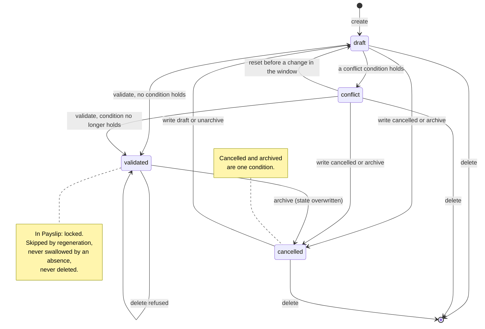

# Work Entries — State Machines

The domain owns one state field, on the Work Entry, and one true/false flag that is welded to it.
Both are specified here in full: every state with its stored value, its label and its meaning; every
transition with its origin, its destination, the operation that triggers it, the conditions that must
hold, and the records it creates or changes; and a diagram for each.

Two further state values are *read* by this domain but owned elsewhere: the state of a Time Off
Request, mirrored read-only onto a Work Entry, and the generation markers of an Employee Version,
which are not a state field but a pair of coverage instants. Both are described in chapter 6 so that
a reader is not left guessing where they belong.

---

## 1. The state of a Work Entry

### 1.1 States

| Stored value | Label | Meaning | Archived flag while in this state |
|---|---|---|---|
| `draft` | "New" | The entry exists, carries a kind and a duration, and nothing is wrong with it. It is editable, deletable, replaceable by a regeneration and swallowable by an absence. This is the state of every newly created entry and of every generated entry. | true |
| `conflict` | "In Conflict" | At least one of the four conflict conditions holds on the entry or on its day. The entry is still editable, but the day it belongs to cannot be validated, and the conflict is shown to a human. | true (unchanged by the transition) |
| `validated` | "In Payslip" | A payroll run has taken the entry. It is locked: it may not be deleted, it is skipped by every regeneration, an absence will not swallow it, and the interface refuses to edit it. | true (unchanged by the transition) |
| `cancelled` | "Cancelled" | The entry has been withdrawn. It no longer counts towards any day total, any conflict test or any payroll figure. Cancellation and archiving are the same condition. | false |

The default of the field is `draft`. The field is not carried over when a record is duplicated: a
copy always starts at `draft`.

### 1.2 The coupling with the archived flag

The state and the archived flag `active` are two views of one fact. On **every** write the following
rewriting happens, in this order:

| Step | Condition on the values being written | Value added to the same write |
|---|---|---|
| 1 | the state is written as `draft` | the archived flag is set to true |
| 2 | the state is written as `cancelled` | the archived flag is set to false |
| 3 | the state is written as `conflict` | nothing is added |
| 4 | the state is written as `validated` | nothing is added |
| 5 | the archived flag is written, true | the state is overwritten as `draft` |
| 6 | the archived flag is written, false | the state is overwritten as `cancelled` |

Steps 1 and 2 run before steps 5 and 6, and steps 5 and 6 overwrite whatever steps 1 to 4 produced.
Three consequences follow and a rebuild must reproduce all three:

1. Writing the state `draft` and writing the archived flag true are the same operation.
2. Writing the state `cancelled` and writing the archived flag false are the same operation.
3. A caller who writes the state `validated` **and** the archived flag false in one operation ends up
   with the state `cancelled`, because the flag rule runs last. This is the actual behaviour and it
   is recorded as a **compatibility finding**: a corrected behaviour would refuse the combination
   with an explicit message rather than silently discarding the requested state.

There is a fourth consequence, in the opposite direction: writing the state `conflict` or
`validated` leaves the archived flag exactly as it was. An archived entry can therefore be moved into
the conflict state and stay archived, which no ordinary path produces but which a direct write does.

### 1.3 Transition table

| # | From | To | Trigger | Guards, in order | Records created or changed |
|---|---|---|---|---|---|
| T1 | — | `draft` | Creating a work entry | The duration must be strictly greater than zero and at most twenty-four hours (rule [`WKE-010`](business-rules.md#3-the-duration-constraint)); the employee, the version, the date and the company must be present | One work entry, with its version resolved from the employee and the date, its pay rate copied from its kind and its company copied from its employee when the caller supplied none |
| T2 | `draft` | `conflict` | The conflict check that runs immediately after every create, and after every write or delete that touches the date, the duration, the employee, the kind or the archived flag | Any one of the four conflict conditions of [business-rules.md, chapter 5](business-rules.md#5-the-four-conflict-conditions) holds | The entry's state and its stored conflict indicator; possibly the state of **other** entries of the same employee on the same day, which are dragged into conflict with it |
| T3 | `conflict` | `draft` | The conflict reset that runs at the start of the same check, before the change is applied | The entry is inside the re-check window, belongs to one of the affected employees, and is neither validated nor cancelled | The entry's state and its stored conflict indicator; in the absence companion, the absence link of every reset entry whose kind exists and does not carry the absence flag is cleared |
| T4 | `draft` | `validated` | The validation operation | Run over the selection, none of the four conflict conditions may mark anything; entries already validated are excluded from the selection first | Every non-validated entry of the selection moves to `validated` in one write |
| T5 | `conflict` | `validated` | The validation operation | The same guard. A conflicting entry can only reach `validated` if the condition that made it conflict has ceased to hold, because the check is re-run from scratch | As T4 |
| T6 | `draft`, `conflict`, `validated` | `cancelled` | Writing the state `cancelled`, or writing the archived flag false — including the nullifying write of a forced regeneration | None. Cancellation is never refused | The entry's state and archived flag. In the absence companion, **before** the state write, every absence request linked to an entry in the selection that is not already refused is refused, which itself archives that request's entries and regenerates ordinary entries in their place |
| T7 | `cancelled` | `draft` | Writing the state `draft`, or writing the archived flag true | None | The entry's state and archived flag. Because the archived flag is one of the five fields that trigger the conflict check, the day is immediately re-examined and the entry may move straight on to `conflict` by T2 |
| T8 | `validated` | *(deletion refused)* | Deleting | The deletion is refused outright when any entry of the selection is validated, with the message quoted in [1.4](#14-the-guard-messages) | Nothing |
| T9 | `draft`, `conflict`, `cancelled` | *(record removed)* | Deleting | No entry of the selection may be validated | The entries are removed; the conflict check then re-runs over the range they occupied and over their employees, which may reset or re-mark the surviving entries of those days |
| T10 | `draft` | `draft` + a new `draft` | Splitting | The entry's duration must be at least one hour; the requested split duration must be strictly smaller than the entry's duration | The original entry's duration is reduced by the split duration; a copy of it is created, which starts at `draft` because the state is not copied, and the split values — duration, kind and description — are written onto the copy |

### 1.4 The guard messages

Each message is reproduced character for character. Placeholders are described in words.

| Guard | Condition that makes it fail | Message |
|---|---|---|
| Duration range | The duration is not strictly greater than zero, or exceeds twenty-four hours, both compared to a precision of three decimal places | "Duration must be positive and cannot exceed 24 hours." |
| Deletion of a validated entry | Any entry in the selection is in the state `validated` | "This work entry is validated. You can't delete it." |
| Split of a short entry | The entry's duration is strictly below one hour | "You can't split a work entry with less than 1 hour." |
| Split with too large a part | The requested split duration is greater than or equal to the entry's current duration | "Split work entry duration has to be less than the existing work entry duration." |

The four conflict conditions do not raise messages. They change state silently and the interface
explains the state: the form shows "This work entry cannot be validated. The work entry type is
undefined." when the entry has no kind, and "The amount of work on the day should not exceed 24
hours." when it has one. A validated entry shows "Note: Validated work entries cannot be modified."

### 1.5 Diagram

---

## 2. The archived flag as a machine

The archived flag is a two-state machine whose transitions are the same as T6 and T7 above, seen from
the other side. It is worth stating separately because several operations of the platform address the
flag and not the state.

| Stored value | Meaning | Which state accompanies it after the write |
|---|---|---|
| true | The entry is live and counts | `draft` |
| false | The entry is withdrawn and counts nowhere | `cancelled` |

| # | From | To | Trigger | Side effects |
|---|---|---|---|---|
| A1 | true | false | The nullifying write of a forced regeneration, the archiving of entries a validated absence swallows, or the archiving of the entries of a refused or cancelled absence | The state becomes `cancelled`; the absence companion refuses every non-refused linked absence request first |
| A2 | true | false | A person archiving an entry from the list or the form | The same |
| A3 | false | true | A person unarchiving an entry, or writing the state `draft` on it | The state becomes `draft` and the day is re-checked for conflicts |

Two points of care:

- The uniqueness of a day's entries is **not** enforced, so unarchiving an entry on a day that has
  since been regenerated produces a day with a doubled total, which the conflict test will catch only
  if the total leaves the zero-to-twenty-four range.
- An archived entry is invisible to the daily total used by the over-twenty-four-hours test, which
  reads only entries whose archived flag is true. Archiving is therefore the platform's way of making
  an entry stop counting without losing its history.

---

## 3. What each state permits

| Operation | `draft` | `conflict` | `validated` | `cancelled` |
|---|---|---|---|---|
| Edit the description, kind, employee, date or duration | yes | yes | refused by the interface; the underlying write is not blocked | yes |
| Delete | yes | yes | refused with a message | yes |
| Validate | yes, if no condition holds | yes, if the condition has ceased to hold | already validated; excluded from the selection | yes, if no condition holds — a cancelled entry is not excluded by the validation operation, which is recorded as a **compatibility finding**; a corrected behaviour would exclude cancelled entries as well as validated ones |
| Be replaced by a forced regeneration | yes | yes | no; the nullifying domain excludes validated entries | yes, and it is nullified again with no effect |
| Be swallowed by a validated absence | yes | yes | no | it is already archived |
| Be counted in the day total for the over-twenty-four-hours test | yes | yes | yes | no; its archived flag is false |
| Be counted by the day-already-validated test | it is the entry being tested | it is the entry being tested | it is the entry that makes the day fail | it is the entry being tested |
| Be split | yes | yes | the interface hides the operation | yes |
| Count as an absence for the per-kind absence-hours total | yes, if linked to a validated request | yes, if linked to a validated request | yes, if linked to a validated request | no; cancelled entries are excluded |

---

## 4. The order of the four conflict passes

The conflict check is one operation with four passes. The order matters because each pass writes
state and the later passes read what the earlier ones wrote.

1. **Undefined kind.** Every entry of the selection with no work entry kind is moved to `conflict`.
2. **Excessive or empty day.** Over the date range spanned by the selection, and for the employees of
   the selection, every entry whose archived flag is true and whose day total is at most zero hours or
   more than twenty-four hours is moved to `conflict` — including entries that were not part of the
   selection.
3. **Absence outside the schedule.** Every entry of the selection whose kind carries the absence flag
   and whose state is neither `validated` nor `cancelled` is compared against its version's schedule;
   those with no overlap at all are moved to `conflict`.
4. **Day already validated.** Every entry of the selection whose employee and date already carry a
   validated entry is moved to `conflict`.

The operation reports failure if any pass marked anything. The validation operation uses that report:
it writes `validated` only when all four passes came back empty.

The passes are specified condition by condition, with their exact reach and their edge cases, in
[business-rules.md, chapter 5](business-rules.md#5-the-four-conflict-conditions).

---

## 5. Where each transition is triggered from

| Trigger point | Transitions it can cause |
|---|---|
| Creating an entry by hand, from the form, the list or the calendar | T1, then T2 for the new entry and for others on the same day |
| Generation, ordinary or forced | T1 for every produced row; T6 for every superseded row when forced; T2 through the create check |
| The validation operation, called by a payroll capability or by an automation | T4, T5, or no transition at all when a condition holds |
| Writing the archived flag from a list or a form | T6 or T7 |
| The contextual action "Set to Draft" offered on the list and the form | intended to cause T7. In the specified system the action names an operation that no package defines, so it fails. This is recorded as a **compatibility finding**; a corrected behaviour would write the state `draft` on the selection, which also unarchives it |
| Deleting from a list or a form | T8 or T9 |
| Splitting from the calendar popover | T10 |
| Validating an absence request | T1 for the absence rows, A1 for the rows the absence swallows |
| Refusing, reverting or cancelling an absence request | A1 for the rows it produced, then T1 for the ordinary rows regenerated in their place |
| Cancelling an entry that carries an absence link | T6 and, before it, the refusal of that absence request, which itself causes A1 and T1 |
| Removing an Employee Version | Deletion of every non-validated entry of that version inside its effective window, that is T9 |
| Changing the contract start, the contract end or the version date of a version | Deletion of every entry outside the new period, that is T9, plus the retraction of the corresponding marker |

---

## 6. Two neighbouring machines

### 6.1 The mirrored state of an absence request

The absence companion adds a read-only, unstored mirror of the state of the Time Off Request behind
an entry. It is a mirror, not a machine: this domain never writes it. Its values and its transitions
belong to [Time Off, state-machines.md](../time-off/state-machines.md). This domain reads it in
exactly one place, the per-kind absence-hours total, which counts only entries whose request is in
the validated state.

The domain does, however, *drive* that machine in two places:

- Cancelling an entry refuses its request, unless the request is already refused.
- The calendar popover offers an approve and a refuse shortcut that forward to the request's own
  approve and refuse operations; the refuse shortcut runs with elevated rights, the approve shortcut
  does not.

### 6.2 The generation markers

The two markers on an Employee Version are not a state field. They are a pair of instants describing
how far the day book of that version has been generated, and they move only outward, except in four
cases where they are pulled back deliberately. The full progression is a small machine in its own
right and is specified in
[calculations.md, chapter 9](calculations.md#9-advancing-and-retracting-the-generation-markers).
The four retractions are:

| Retraction | When | Which marker | To what |
|---|---|---|---|
| The sentinel reset | Both markers are equal at the start of a run | both | the start instant of the requested window |
| Creating a version | A new version is created through the employee's version-creation operation | both | today at midnight |
| Contract start moved forward | A write changes the contract start, the contract end or the version date, and the generated-from marker lies before the new effective start | the generated-from marker | the new effective start, and every entry of that version dated before it is deleted |
| Contract end moved backward | The same write, and the generated-to marker lies after the end of the new effective end date | the generated-to marker | the end of the new effective end date, and every entry of that version dated after it is deleted |
