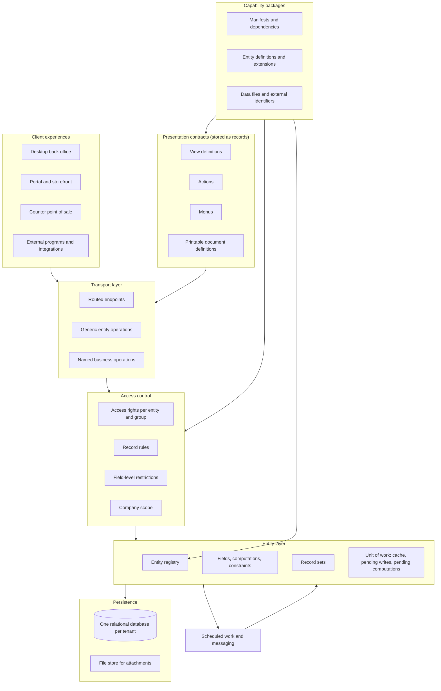
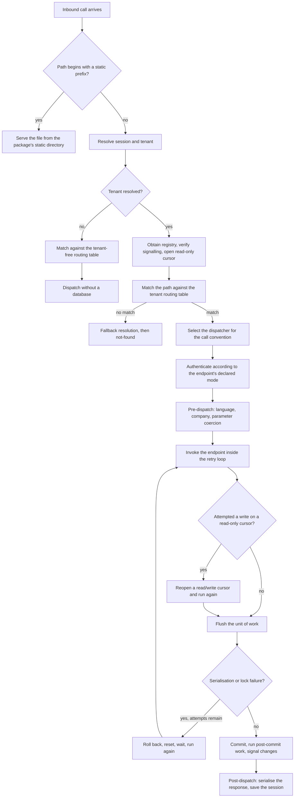

# Architecture

This document describes the platform on which every business domain of the system is built: the layers, the tenancy model, the entity registry, the environment that every operation carries, the record set abstraction, the unit of work, and the path an inbound call takes from arrival to a committed transaction. It is the first document to read before any domain document, because every domain is expressed in the vocabulary defined here.

Nothing in this document is specific to accounting, inventory, sales or people. Those are described in [the domain folder](../domains/README.md). What follows is true of all of them.

---

## Table of contents

1. [What the system is](#1-what-the-system-is)
2. [Tenancy: one relational database per tenant](#2-tenancy-one-relational-database-per-tenant)
3. [The layers](#3-the-layers)
4. [The entity registry](#4-the-entity-registry)
5. [How installed packages build the registry](#5-how-installed-packages-build-the-registry)
6. [The environment](#6-the-environment)
7. [The record set](#7-the-record-set)
8. [The unit of work](#8-the-unit-of-work)
9. [From an inbound call to a committed transaction](#9-from-an-inbound-call-to-a-committed-transaction)
10. [Generic operations against named business operations](#10-generic-operations-against-named-business-operations)
11. [Concurrency, isolation and retry](#11-concurrency-isolation-and-retry)
12. [Cross-process coherence](#12-cross-process-coherence)
13. [Error taxonomy](#13-error-taxonomy)
14. [Invariants a rebuild must preserve](#14-invariants-a-rebuild-must-preserve)
15. [Acceptance criteria](#15-acceptance-criteria)

---

## 1. What the system is

The system is a single integrated application that stores every kind of business fact — a party, a product, a journal entry, a stock move, an employee contract, a web page, a scheduled job, a screen definition, a menu, an access rule — as a record of an **entity**. An entity is a named, typed collection of fields with declared behaviour. There is no separate configuration store, no separate metadata store and no separate presentation store: screens, menus, reports, access rules, translations and scheduled jobs are themselves records of entities, stored in the same database, subject to the same operations, the same access control and the same transactions as an invoice or a delivery order.

This single idea has three immediate consequences that shape the whole architecture:

1. **Any capability that works on entities works on everything.** Import, export, search, auditing, access control, translation, extension and the remote transport are written once against the entity layer and are automatically available for presentation objects, configuration objects and business objects alike.
2. **Installing a capability package is a data operation as much as a code operation.** A package contributes entity definitions (code) and records of those entities (data). Screens and menus arrive as records; so do default accounts, units of measure and tax definitions.
3. **Extension is uniform.** A package extends an entity, a screen, a report, an access rule or a piece of reference data by the same small set of mechanisms, described in [inheritance and extension](inheritance-and-extension.md).

The remainder of this document describes the machinery that makes those three statements true.

### 1.1 The layer diagram



Read the diagram as a dependency order, not as a call order. A single inbound call may traverse the transport layer, consult the presentation contracts (when the client asks for a screen), pass access control, execute business operations that touch many entities, and produce one committed transaction on the persistence layer.

### 1.2 Process model, stated only as far as behaviour depends on it

Behaviour depends on the process model in exactly four ways, and a rebuild must reproduce these four:

1. **Several worker processes may serve the same tenant at the same time.** Therefore all coordination between concurrent operations happens through the database, never through in-process state.
2. **Each worker keeps an in-memory entity registry per tenant.** Therefore a change to the registry made by one worker (installing a package, adding a custom field) must be signalled to the others through the database, and the others must rebuild.
3. **Each worker keeps in-memory caches derived from the database.** Therefore invalidation of those caches must likewise be signalled through the database.
4. **A transaction is scoped to one inbound call.** A call either commits everything it did or rolls everything back; there is no partial completion visible to another call, except through the explicit savepoint mechanism described in [section 9.6](#96-savepoints).

Everything else about hosting, process supervision and sizing is out of scope.

---

## 2. Tenancy: one relational database per tenant

### 2.1 The rule

Each tenant — each independent installation of the application, holding one organisation's data — owns **one relational database**. All of that tenant's data lives in it: business records, presentation records, security records, translations, scheduled jobs, message bodies, attachment metadata, the list of installed packages and the recorded correspondence between external identifiers and records.

There is no shared database across tenants, no tenant discriminator column on business tables, and no cross-tenant query. A rebuild must not substitute a shared-schema multi-tenant design: several behaviours depend on the single-database rule.

| Behaviour | Why it depends on one database per tenant |
|---|---|
| Package installation changes the schema | Installing a package creates tables and columns. That is a tenant-scoped schema change, which is only safe if the schema belongs to one tenant. |
| Identifier allocation | Record identifiers are allocated by per-table database sequences and are unique only within the tenant. |
| Registry signalling | Workers coordinate registry rebuilds through database sequences that exist once per tenant. |
| Global search | A query over an entity is a query over a table with no tenant filter. Adding one would change every generated query and every index. |
| Backup and restore | A tenant is backed up, copied and neutralised as a whole database plus its file store. |

### 2.2 Multiple legal companies inside one tenant

A tenant is **not** a company. One tenant commonly holds many legal companies that share parties, products, currencies and users. Separation between companies is a *record-level* concern handled by the company field and the company record rules described in [the security model](multi-company.md#5-company-scoping-through-record-rules), not a database-level concern. This distinction is central:

- **Tenant boundary**: hard, physical, one database, no query crosses it.
- **Company boundary**: soft, logical, enforced by record rules and consistency checks, and deliberately crossed by inter-company operations performed by users allowed in both companies.

### 2.3 What sits outside the database

Only two things:

1. **The file store** holds the binary content of attachments larger than the inline threshold, addressed by the digest of their content. Metadata (name, entity, record, size, digest, access token) stays in the database. The store is per tenant.
2. **The session store** holds the state of signed-in browser sessions, keyed by an opaque session identifier. A session records the tenant name, the acting user identifier, the session context and a rotating token bound to the user's credentials so that changing a password invalidates existing sessions.

Both are described in [the runtime folder](../runtime/README.md).

### 2.4 Tenant identification for an inbound call

An inbound call is bound to exactly one tenant before any entity is touched. The binding is resolved in this order:

1. If the call carries a session identifier and the session records a tenant name, that tenant is used, provided the name passes the tenant filter.
2. Otherwise, if the call explicitly names a tenant in its parameters, and that name passes the tenant filter, it is used and the session is rebound to it. If the session already named a different tenant, the session is emptied first, so that an identity from one tenant is never carried into another.
3. Otherwise, if exactly one tenant name passes the tenant filter, it is used.
4. Otherwise the call is served in the **no-tenant** mode, in which only endpoints declared as usable without a tenant may run: the tenant selector, the tenant creation and restore endpoints, and the static file server.

The tenant filter is a configured pattern matched against the list of tenant names, optionally substituting parts of the requested host name, so that one deployment can serve several tenants by host name. Its only observable effect is which names are eligible above.

---

## 3. The layers

Each layer is defined by what it may depend on. A rebuild that blurs these boundaries will not be able to reproduce package installation or extension.

### 3.1 Persistence

Owns tables, columns, indexes, foreign keys, check constraints, unique constraints and per-table identifier sequences. It knows nothing about entities.

**Key rules**

1. Every persistent entity maps to exactly one table. The table name is the transport name with every dot replaced by an underscore, unless the entity declares a table name explicitly.
2. Every table has an integer primary key column named `id` (identifier), fed by a sequence, and is the sole identity of a record.
3. A many-to-many relation between two entities maps to an association table with two integer columns, both with a foreign key, and a primary key over the pair.
4. Schema changes are applied only during package installation, update or removal, never during ordinary operation. The single exception is the creation of a user-defined field, which is itself performed through a package-update-like path on the entity that owns it.
5. The layer records, for each column it creates, whether it may be null, so that a later check can confirm that entity-level required flags and database-level not-null constraints agree.

### 3.2 The entity layer

Owns entity definitions, field types, computation, validation, the record set abstraction, the filter grammar, the unit of work and the translation of filters and ordering into queries. It depends on persistence. It knows nothing about screens or transport.

### 3.3 The package layer

Owns the discovery of capability packages, their manifests, their dependency graph, the order in which they are installed and updated, the loading of their data files, the assignment of external identifiers, and the hooks that run at defined points of a package lifecycle. It drives the entity layer: the registry exists because packages were installed. Described in full in [the package system](package-system.md).

### 3.4 Presentation contracts

Views, actions, menus and printable document definitions — all stored as records of entities, all contributed by packages as data, all extensible. A client never receives arbitrary markup from the server for a business screen; it receives a **view definition**, which is a declarative description of what to show, plus the field metadata needed to render it. Described in [views and actions](views-and-actions.md), with the client's side of the same contract in [client architecture](client-architecture.md). A printable document definition is turned into a finished document by [report rendering](../runtime/report-rendering.md).

### 3.5 Transport

Owns routed endpoints, the two generic call conventions (form-encoded and structured-document), authentication of the call, and the mapping from a call to either a **generic entity operation** or a **named business operation**. Described in [section 10](#10-generic-operations-against-named-business-operations) and in [the interfaces folder](../interfaces/README.md).

### 3.6 Clients

Out of scope for behavioural equivalence except for the contracts they rely on: the view grammar, the operation list, the shapes of returned documents, and the routes. Those contracts are specified; the rendering is not.

---

## 4. The entity registry

### 4.1 Definition

The **entity registry** is the in-memory description, for one tenant, of every entity that exists in that tenant, after all installed packages have contributed their definitions and extensions. It is the authority to which every operation refers to answer:

- Does an entity with this transport name exist?
- What fields does it have, with what types and attributes?
- Which table does it live in?
- Which operations can be invoked on it?
- What are its constraints, its default ordering, its display-name rule?
- Which fields depend on which other fields, and along which relation paths?

A registry is created for a tenant the first time that tenant is served, and is reused for every subsequent call until it is invalidated.

### 4.2 What the registry holds

| Structure | Content | Used by |
|---|---|---|
| Entity map | Transport name → resolved entity definition | Every lookup of an entity |
| Field map per entity | Field name → resolved field definition | Reading, writing, view rendering, filter compilation |
| Field dependency map | Field → the ordered list of dependency paths declared for it | Recomputation |
| Field context-dependency map | Field → the ordered list of context keys whose value changes the field's value | Cache partitioning |
| Field inverse map | Relational field → the field or fields that are its reverse | Cache coherence on both sides of a relation |
| Grouped computation map | Field → all fields computed by the same computation | Batch computation |
| Trigger trees | Field → a tree of relation traversals leading to the fields that must be recomputed when it changes | Recomputation |
| Association-table map | Association table name and its two columns → the many-to-many fields that use it | Detecting the two ends of a symmetric relation |
| Company-dependent index | Entity name → the many-to-one fields on it whose value varies by company | Company-scoped value resolution |
| Not-null field set | Fields for which a database not-null constraint is expected | Post-installation schema verification |
| Constraint queue | Deferred constraint creation functions keyed so that each is applied once | End of installation |
| Named caches | A fixed set of bounded caches for expensive derived answers | See [section 4.6](#46-registry-caches) |
| Tenant text-search capabilities | Whether accent-insensitive matching and trigram indexing are available | Filter compilation for text operators |
| Signalling counters | The last observed values of the registry and cache sequences | Cross-process coherence |

### 4.3 Resolved entity definitions

A resolved entity definition is the result of composing, in dependency order, every contribution made to that entity by every installed package. Composition is described in detail in [inheritance and extension](inheritance-and-extension.md); the registry is where the result lives. A resolved entity definition carries:

- the **transport name** (the dotted name used by clients and by every cross-entity reference, for example `res.partner` — party record — or `account.move` — journal entry);
- the **storage name**, that is the table (for example `res_partner`, `account_move`);
- the **kind**: persistent, transient, or abstract ([entity and field system, section 2](entity-and-field-system.md#2-the-three-entity-kinds));
- the **human-readable description**;
- the complete **field map**;
- the **default ordering**;
- the **display-name rule**;
- the set of **declared constraints** (both entity-level checks and database-level constraints);
- the set of **parents** contributed by embedding (delegation) and the fields they expose;
- the **automatic behaviours** the entity opted into. The list is closed and is tabulated with its defaults in [the entity and field system, section 3](entity-and-field-system.md#3-entity-attributes): audit fields, the archive flag, the materialised ancestor path of a hierarchy, the fold field that collapses a group on a grouped screen, the default ordering (by a sequence field where the entity declares one), the automatic company consistency check, the refusal of relational write commands in an elevated environment, the export of translatable values to catalogues, the declared query dependencies of an entity backed by a stored query, the custom-entity marker, and the shared behaviour bundles the definition adopted — discussion threads, activities, electronic-mail aliases, template rendering, composition fields, tracked-duration accumulation, notification-bus listening and portal access, catalogued in full in [inheritance and extension, section 5.3](inheritance-and-extension.md#53-catalogue-of-shared-behaviour-bundles);
- the operations callable on it, both generic and named.

### 4.4 Identity and lifetime

- There is **one registry per tenant per worker process**. Two workers serving the same tenant hold two registries with identical content.
- A registry is addressed by tenant name. A bounded number of registries is kept in memory; the least recently used is evicted when the bound is exceeded, and a registry unused for longer than the configured idle period is discarded.
- A registry has three lifecycle flags: *initialising* (being built), *loaded* (all packages have contributed), *ready* (fully set up and usable).
- Registry construction is serialised by a process-wide lock, so that two calls arriving simultaneously for a tenant with no registry build it once.

### 4.5 Derived structures and when they are computed

Some structures in the table above are expensive and are computed lazily, on first use, then held until the registry is set up again. These are: the field inverse map, the grouped computation map, the trigger trees, and a memo of whether a given field's assignment can change relations. All of them are discarded at the start of any registry setup, and also whenever a package is loaded into the registry, because a new package may add a field whose presence changes them.

### 4.6 Registry caches

The registry owns a fixed set of named, bounded, least-recently-used caches. They hold answers that are expensive to recompute and that change only when data changes:

| Cache name | Holds |
|---|---|
| `default` | General-purpose derived answers keyed by entity and arguments |
| `assets` | Compiled front-end asset bundles |
| `templates` | Parsed and combined rendering templates |
| `routing` | The compiled routing table for this tenant |
| `templates.cached_values` | Values computed while rendering templates and safe to reuse |

The record cache and the prefetching that fills it are a different mechanism, specified in [caching](../runtime/caching.md); the caches above hold *derived answers*, not record values. The asset bundles the first two rows refer to are assembled by [the package system, section 22](package-system.md#22-client-asset-bundles), and the rendering templates by [report rendering](../runtime/report-rendering.md).

Rules:

1. A cache entry is never allowed to survive a change to the data it was derived from. Every operation that changes such data explicitly clears the affected cache by name.
2. Clearing a cache is signalled to other workers (see [section 12](#12-cross-process-coherence)). Clearing is always *clear the whole named cache*, never *evict one entry*, because the identity of affected entries cannot in general be determined.
3. Caches are cleared unconditionally whenever a package is loaded into the registry and at the start of every registry setup.

---

## 5. How installed packages build the registry

This section describes the *construction* of the registry. The lifecycle of a package — how it comes to be installed at all — is in [the package system](package-system.md).

### 5.1 The construction sequence

Given the set of packages recorded as installed (plus those being installed or updated), the registry is built as follows.

1. **Discover.** Scan the configured search locations for package directories, each containing a manifest. Build a manifest object for each.
2. **Graph.** Build a directed graph whose nodes are packages and whose edges are the declared dependencies. Remove any package that is marked not installable, any whose declared dependencies are not all present, and any in a dependency cycle; removal cascades to dependents.
3. **Order.** Sort the nodes as described in [the package system](package-system.md#6-installation-order). The base package is always first and alone in its phase.
4. **For each package in order:**
   1. Load the package's definitions. Every entity definition and every entity extension declared by the package is registered against that package's name.
   2. **Compose** each affected entity: for the entity's transport name, take the base definition and apply, in package order, every extension declared for it. This produces the resolved definition. Record the names of the entities the package directly touched.
   3. **Propagate** to descendants: any entity that extends a touched entity, and any entity that embeds a touched entity, is also marked for re-composition.
5. **Set up fields.** For every entity marked for setup, resolve every field: determine its final type and attributes after all extensions, expand related-field chains, bind computations to their dependency paths, attach inverses, and record whether the field is stored.
6. **Derive dependencies.** For every field of every entity, compute the list of dependency paths and the list of context keys it depends on, and store them in the registry.
7. **Synchronise the schema.** For every entity being installed or updated, create or alter its table, its columns, its indexes and its foreign keys to match the resolved definition. Defer constraints that cannot be applied yet.
8. **Load data.** Execute each package's data files in declared order, creating or updating records and recording their external identifiers.
9. **Finalise.** Apply the deferred constraints, verify not-null agreement, verify that every declared table exists, and clean up records whose external identifiers no longer appear in any installed package.
10. **Register hooks.** Give every entity the chance to install runtime hooks (for example, a patch that adds behaviour to another entity's operation, or a registration in a shared dispatch table). This happens exactly once, when the registry becomes ready.

### 5.2 Incremental setup

Steps 5 and 6 are expensive. During installation they run many times — once per package — so they are **incremental**: only entities marked for setup, plus the entities that extend or embed them, are recomposed. Marking propagates as follows:

- Marking entity *E* marks every entity that extends *E* in place, transitively.
- Marking entity *E* marks every entity that embeds *E*, transitively.
- Marking a field marks every field declared to depend on that field's setup, transitively, so that a related field whose target changed is rebuilt.
- A user-defined entity is always marked, because it is reloaded from its stored definition.

When no entity names are given, the setup is total: every entity is marked, the association-table map and field-setup-dependency map are emptied, and all dependency maps are rebuilt from scratch.

### 5.3 Two-stage field setup

Field setup happens in two stages because fields can refer to each other.

**Stage one — own attributes.** For each field, resolve the attributes it declares itself and the attributes it inherits from the field definitions it overrides. A field that is declared several times (by several packages) is resolved by layering: later declarations override earlier ones attribute by attribute, and the layered set is retained so the field can be rebuilt without re-reading the packages.

**Stage two — cross-field attributes.** For each field, resolve what depends on other fields:

- A **related** field adopts the type and the type-specific attributes of the last field in its path, unless it overrides them, and becomes a computed field whose dependency is its own path.
- A **computed** field's declared dependency paths are expanded and validated: every path segment must name a field that exists, and traversal of a relation is allowed only where the relation is known.
- A **relational** field's inverse is located or created, and both directions are recorded so that writing one updates the cache of the other.
- A field that depends on a context key records that key, so that its cached value is partitioned by the key's value.

Stage two may need a field that is itself only in stage one; the setup therefore proceeds until a fixed point, and a dependency that cannot be resolved is a definition error reported at installation time.

### 5.4 Failure during construction

If any step above raises, the partially built registry is discarded, every package left in a transient state (to install, to upgrade, to remove) is reset to its previous state, and the failure is reported. The tenant is left with no registry; the next call rebuilds from the recorded state. Additionally, if any package remains in a transient state at the end of a successful build, a marker parameter is written to the tenant so that the next build knows an update is still owed.

---

## 6. The environment

### 6.1 Definition

Every operation in the system executes **inside an environment**. The environment is the ambient context of the operation: who is acting, over which database connection, in which language, in which time zone, for which companies, with which extra instructions, and whether access control is being bypassed.

An environment carries exactly four primitive components:

| Component | Meaning |
|---|---|
| Cursor | The handle on the database connection and therefore on the current transaction |
| Acting user identifier | The integer identifier of the user record on whose behalf the operation runs; determines every access decision |
| Context | An immutable mapping from string keys to values, carrying language, time zone, company selection, default values, and arbitrary instructions |
| Unrestricted flag | Whether access rights, record rules and field restrictions are bypassed |

Everything else the environment exposes is **derived** from those four and is computed once per environment on first use:

| Derived value | Rule |
|---|---|
| Registry | The registry of the tenant the cursor belongs to |
| Cache and pending state | The unit of work of the transaction the cursor belongs to (shared by all environments over the same cursor) |
| Acting user record | The user record with the acting identifier, obtained in unrestricted mode so that reading the acting user never itself fails an access check |
| Current company | See [6.5](#65-company-selection) |
| Allowed companies | See [6.5](#65-company-selection) |
| Time zone | The context key `tz` (time zone) if set and valid, else the acting user's recorded time zone if set and valid, else Coordinated Universal Time |
| Language | The context key `lang` (language) if set; otherwise none, meaning the source language |
| Translation function | Resolves a source string to the environment's language |

### 6.2 Environment identity

Environments are **interned per transaction**: requesting an environment with a given cursor, acting user, context and unrestricted flag returns the existing one if an identical one already exists on that transaction, and otherwise creates and registers it. Two consequences a rebuild must reproduce:

1. Environments compare by identity, not by value; the same four components always yield the same object, so derived values are computed once.
2. All environments over one cursor share one unit of work. Switching the acting user, the language or the company therefore does **not** get a fresh cache: uncommitted changes made under one environment are visible through another environment of the same transaction.

An environment is immutable once created. "Changing" the acting user, the context or the unrestricted flag means deriving a new environment.

The first environment created on a transaction with a non-zero acting user becomes the transaction's **default environment**, which is the environment used when the unit of work must be flushed with no other environment at hand.

### 6.3 Propagation

The propagation rule is absolute and is the reason the environment does not need to be passed explicitly through business logic:

> **Every record set carries an environment. Every record set derived from a record set carries the same environment, unless it is derived by an operation whose stated purpose is to change the environment.**

Consequences:

1. Reading a relational field of a record yields a record set in the **same** environment. A party read from an invoice read by user A in French is a party in user A's French environment.
2. Creating a record through a record set yields a record in the same environment.
3. Looking up another entity through the environment yields an empty record set of that entity in the same environment.
4. A computation, a constraint check, a default, a validation, or an action method receives its record set and therefore its environment implicitly.
5. Nothing in the system reads the acting user, the language or the company from a global or from thread-local state for business purposes. Global state is used only to identify the current tenant for logging and for the transport layer.

### 6.4 Deriving environments

| Derivation | Effect on acting user | Effect on unrestricted flag | Effect on context |
|---|---|---|---|
| Switch acting user | Set to the given user | Reset to restricted | Unchanged |
| Enter unrestricted mode | Unchanged | Set | Stripped of keys that are unsafe to carry across a privilege change (see below) |
| Leave unrestricted mode | Unchanged | Cleared | Unchanged |
| Replace context | Unchanged | Unchanged | Replaced wholesale |
| Overlay context keys | Unchanged | Unchanged | Existing keys plus the overlay; a key set to a null value is removed |
| Select company | Unchanged | Unchanged | The selected company is placed first in the allowed-company list, keeping the rest in order |
| Switch cursor | Unchanged | Unchanged | Unchanged |

**Context cleaning on entering unrestricted mode.** When an environment that is *not* unrestricted derives an unrestricted one without also supplying a context, the context is cleaned: keys that instruct the system to apply default values or to bind a specific active record are removed, because they were supplied by a less-privileged caller and must not silently influence a privileged operation. Keys carrying language, time zone and company selection survive.

**Acting user of the derived environment.** Entering unrestricted mode does not change the acting user identifier. Audit fields therefore still record the real actor, and messages still attribute to the real actor. Unrestricted mode changes *what is allowed*, not *who is acting*. This is the elevate-privileges contract, specified in [the security model](security-model.md#10-the-unrestricted-actor-and-the-elevate-privileges-contract).

### 6.5 Company selection

Two derived values matter: the **current company** (a single company, used as the default for new records and for company-dependent values) and the **allowed companies** (the set the acting user has switched on, used for filtering).

Resolution of **allowed companies**:

1. Read the context key `allowed_company_ids` (allowed company identifiers), a list of company identifiers in user-chosen order.
2. If the list is non-empty and the environment is restricted, verify that every identifier in it is among the companies the acting user belongs to. If any is not, refuse with the message **"Access to unauthorized or invalid companies."**
3. If the list is non-empty, the allowed companies are exactly those companies, in the given order.
4. If the list is empty, the allowed companies are **all** companies the acting user belongs to. This deliberately differs from taking only the user's main company, so that operations performed outside an interactive session — rendering a notification, printing a batch of documents from several companies, serving an image — do not silently lose records the user is entitled to see.

Resolution of the **current company**:

1. If `allowed_company_ids` is non-empty, the current company is its first entry, after the same authorisation check as above.
2. Otherwise the current company is the acting user's main company.

**In unrestricted mode the authorisation check is skipped.** A privileged operation may therefore act in a company the underlying user does not belong to; this is how inter-company documents are produced.

### 6.6 The context

The context is an immutable mapping. It has three distinct roles, and a rebuild must keep them distinct:

1. **Ambient presentation state**: language, time zone, company selection. These change *values* (translated text, localised dates) and *visibility* (company filtering).
2. **Instructions to an operation**: default values for a creation, whether archived records are included, which record the user was looking at, whether to skip an expensive post-step.
3. **Cache partitioning keys**: any key that a field declares itself to depend on partitions that field's cached values.

Context keys that the platform itself interprets, and that therefore exist in every rebuild:

| Key | Type | Meaning |
|---|---|---|
| `lang` (language) | Text | Language code used to translate translatable values and messages. Must name an active language, or the operation fails with **"Invalid language code: "** followed by the code. |
| `tz` (time zone) | Text | Time-zone name used to convert stored instants to local times for display, grouping and comparison. Invalid names are ignored, falling back to the user's time zone and then to Coordinated Universal Time. |
| `allowed_company_ids` (allowed company identifiers) | List of integers | Company selection, as in [6.5](#65-company-selection). |
| `active_test` (apply the archive filter) | Boolean, default true | When true, searches on entities that carry the archive flag return only unarchived records unless the filter mentions the flag explicitly. |
| `active_id` (active record identifier), `active_ids` (active record identifiers), `active_model` (active entity transport name) | Integer, list of integers, text | The record or records the user had selected when triggering an action. Read by server actions, by default values and by filters written in the action. |
| `default_<field name>` | Any | Supplies the default value of the named field for records created in this context, overriding the field's declared default. |
| `uid` (acting user identifier) | Integer | Present for the convenience of expressions evaluated in the context; the authoritative acting user is the environment's, not this key. |
| `bin_size` (binary size instead of content) | Boolean | When true, reading a binary field yields a human-readable size instead of the content. |
| `bin_size_<field name>` | Boolean | The same, for one named field only. |
| `edit_translations`, `check_translations` | Boolean | Select the translation-authoring view of translatable rich values. |
| `install_demo` (load demonstration data) | Boolean | Set while demonstration data files are being loaded. |
| `module` (contributing package name) | Text | Set while a package's data is loaded, so that created records are attributed to that package. |
| `prefetch_fields` | Boolean, default true | When false, reading one field does not opportunistically read its siblings. |
| `no_recompute` / equivalent suppression keys | Boolean | Reserved for operations that manage recomputation themselves. |

Keys not listed here are contributed by packages and are documented with the capability that reads them.

**Rule.** Every value stored in the context must be hashable once lists are converted to tuples, because context values participate in cache keys. Storing an unhashable value under a key that a field depends on is a definition error, reported as **"Can only create cache keys from hashable values, got non-hashable value"** followed by the value, the key and the field.

### 6.7 Language resolution and translation

- The environment's language is the `lang` context key, or none.
- When translating a message, the effective language is the environment's language, or the source language when none is set.
- When reading a translatable field, the stored value for the effective language is returned if present, otherwise the source-language value.
- For rich values translated term by term, the effective language is prefixed with an underscore when the translation-authoring keys are present, which selects the authoring representation instead of the rendered one.
- Setting an unknown or inactive language is an error, not a silent fallback, because an unknown language would silently produce source-language output and hide a configuration mistake.

The language catalogue, the collection of translatable terms, their delivery to a client and the per-record translation of rich text are specified in [translation](../runtime/translation.md); how a translatable field stores its languages is in [the entity and field system, section 12](entity-and-field-system.md#12-translatable-values).

---

## 7. The record set

### 7.1 Definition

A **record set** is the single value type of the entity layer. It is a triple:

```formula
record_set = ( entity_definition , ordered_tuple_of_identifiers , environment )
```

- The **entity definition** comes from the registry and fixes which fields and operations exist.
- The **ordered tuple of identifiers** may be empty (an *empty set*), hold one identifier (a *singleton*), or hold many. Order is significant and is preserved by every operation that does not explicitly reorder.
- The **environment** is as defined in [section 6](#6-the-environment).

A record set holds **no field values**. Values live in the unit of work's cache, keyed by field and identifier. Two record sets over the same identifiers in the same transaction therefore always see the same values.

### 7.2 Both a value and a receiver

This is the defining property of the abstraction and the reason the system needs no separate "manager", "repository" or "data access object" concept.

- As a **value**, a record set is what a relational field yields, what a search returns, what an operation returns, what is passed between operations, and what can be unioned, intersected, subtracted, filtered, sorted, grouped and iterated.
- As a **receiver**, a record set is the thing on which every operation is invoked. Reading, writing, deleting, copying, printing, confirming, posting, cancelling — all are invoked *on a set of records*, and all are expected to handle a set of any size, including empty.

Two corollaries:

1. **An entity is addressed as an empty record set of that entity.** Operations that do not apply to specific records — creating, searching, fetching defaults — are invoked on the empty set. There is no separate class-level interface.
2. **Every operation is batch-capable by contract.** An operation that silently assumes a single record is a defect. Where an operation genuinely requires exactly one record, it must say so by asserting singularity, which fails with **"Expected singleton: "** followed by the entity name and the identifiers.

### 7.3 Record identifiers

| Kind | Form | Meaning |
|---|---|---|
| Persisted identifier | Positive integer | A row exists in the entity's table with this primary key. |
| New identifier | Opaque non-integer marker carrying an optional reference and an optional origin | A record that exists only in memory for the duration of an on-change evaluation or an in-memory computation. It has no row and will never be written by itself. |

A new identifier may carry an **origin**: the persisted record it stands for while a user edits it. Two new identifiers created with the same textual reference within one transaction denote the same in-memory record, which is how an on-change evaluation keeps line identity across round trips.

A record set may mix persisted and new identifiers. Operations that reach the database restrict themselves to the persisted subset; operations that must include unsaved edits work over the whole set from the cache.

### 7.4 Set algebra and traversal

| Operation | Result |
|---|---|
| Union | Records of both, in the order of the first followed by the new ones of the second, duplicates removed |
| Concatenation | Records of both in order, duplicates **kept** |
| Intersection | Records present in both, in the order of the first |
| Difference | Records of the first not present in the second, in order |
| Membership | Whether a singleton's identifier is among the set's identifiers |
| Iteration | Yields singletons in order |
| Indexing and slicing | Yields a record set over the selected identifiers, preserving order |
| Length and truth | The number of identifiers; an empty set is false, any non-empty set is true |
| Equality | Same entity and same set of identifiers, ignoring order and ignoring the environment |

Traversal operations:

| Operation | Result |
|---|---|
| Map over a field path | For a relational path, the union of the values along the path as one record set, order-preserving and duplicate-free; for a scalar field, the list of values, one per record, in order, duplicates kept |
| Filter by predicate or by a field name | The subset satisfying it, in order |
| Filter by a filter expression | The subset matching the expression, evaluated in memory, in order |
| Group by a key | A mapping from key value to the record subset having it, insertion-ordered by first appearance |
| Sort by a field or a key | A reordered set; sorting by a field falls back to the entity's default ordering when no key is given |

**Map over a scalar field returns a list, map over a relational field returns a record set.** This asymmetry is deliberate: a list of amounts keeps duplicates, which is what arithmetic needs; a set of related records removes duplicates, which is what traversal needs.

### 7.5 Prefetching

Each record set carries a **prefetch set**: the identifiers that should be loaded together when any one of them needs a value. By default the prefetch set is the record set itself, so iterating a set of five hundred records and reading one field on each performs one query, not five hundred.

Rules:

1. A record set obtained by browsing identifiers has itself as its prefetch set.
2. A record set obtained by reading a relational field inherits, as its prefetch set, the union of the values of that field over the whole source prefetch set. Reading the party of one invoice line therefore prepares the parties of all sibling lines.
3. Slicing or filtering keeps the original prefetch set, so that iterating a filtered subset still benefits.
4. The prefetch set may be replaced explicitly, including with the singleton itself to disable prefetching for a hot path.
5. Prefetching never changes results, only the number of queries. When the context key `prefetch_fields` is false, only the requested field is loaded, still for the whole prefetch set.
6. Prefetching a field on a record whose value is missing from the database because the record was deleted concurrently does not fail the whole batch; the missing records are dropped from the batch and re-examined individually, so that only the operation that actually needs a deleted record fails.

### 7.6 Field access

Reading a field on a **singleton** yields the value. Reading a field on a non-singleton is an error, with the message **"Expected singleton: "** followed by the entity name and identifiers, because the answer would be ambiguous. To read a field over many records, map over it.

Assigning a field on a record set assigns it on **every** record of the set, and marks the value pending (see [section 8](#8-the-unit-of-work)).

Reading a field is resolved in this order:

1. If the value is in the cache for this record, this field and this environment's cache key, return it.
2. If the field must still be computed for this record, run its computation (over the whole pending batch), then return the value from the cache.
3. If the field is stored, fetch it from the database for the whole prefetch set, then return it.
4. If the field is not stored and not computed, return its declared empty value.

---

## 8. The unit of work

### 8.1 What it is

One **unit of work** exists per transaction, shared by every environment over that transaction. It holds four structures:

| Structure | Content | Purpose |
|---|---|---|
| Cache | Field → identifier → value (partitioned by cache key for context-dependent fields) | Avoid re-reading and guarantee that one transaction sees one consistent value per record and field |
| Dirty map | Field → the set of identifiers whose cached value differs from the database | The pending-write buffer |
| Pending-computation map | Field → the set of identifiers for which the field must be computed | Deferred computation |
| Protection map | Field → the set of identifiers on which the field must not be invalidated or recomputed | Prevent a computation from overwriting a value the caller just set |

Plus a map of **patches**: for to-many fields, identifiers to be appended to a cached value once that value is loaded, so that adding a line to a record whose line list is not yet in cache does not force a read.

### 8.2 The cache

- The cache is partitioned by field first, then by identifier. This ordering makes two frequent questions cheap: *which records have a value for this field* and *drop this field for every record*.
- For a field that declares a dependency on context keys, the partition is by field, then by the tuple of those keys' values in the environment, then by identifier. A price that depends on the selected price list is therefore cached once per price list within one transaction.
- A cache miss on read triggers a load; a cache miss on a field that should have been loaded (because the record was deleted concurrently) triggers a re-examination that removes the vanished records.
- The cache is never shared between transactions and never survives a rollback.

### 8.3 The pending-write buffer

Assignment does **not** write to the database. It:

1. converts the assigned value to the field's cache representation;
2. stores it in the cache for every record of the set;
3. marks the field dirty for those identifiers;
4. notifies dependent fields that they must be recomputed (see [8.5](#85-invalidation-and-dependency-notification));
5. for a relational field, updates the cached value of the inverse field on both the newly related and the formerly related records, so the graph in memory stays consistent.

A field may only be marked dirty if it is **stored**. Marking a non-stored field dirty is a defect. A dirty field on a context-dependent field marks the record dirty for *all* cache keys of that field, and the value that will actually reach the database is the one held under the neutral cache key, in which every context key of the field is null.

Once a record is dirty for a field, writing it again without declaring the write dirty is refused, because it would silently drop a pending value.

### 8.4 Pending computations

When a stored computed field must be recomputed on some records, those identifiers are added to the pending-computation map for that field rather than computed immediately. Deferring has three benefits that a rebuild must preserve, because they are observable:

1. **Batching.** The computation runs once for many records, which is what makes computations written against record sets efficient.
2. **Ordering.** A computation that reads other computed fields triggers their computation first, so the final values are consistent regardless of the order in which the triggering writes happened.
3. **Coalescing.** Ten writes that all invalidate the same computed field cause one computation.

Adding a record to the pending-computation map is allowed only for a field that is both stored and computed. A non-stored computed field is computed on demand at read time and is never pending.

### 8.5 Invalidation and dependency notification

When the value of field *F* changes on records *R* (by assignment, by creation, by deletion, or by a change to a relation that affects *F*), the system must ensure every value derived from *F* is either recomputed or dropped. The algorithm:

1. Look up the **trigger tree** of *F* in the registry. The tree's root holds the fields that depend on *F* directly on the same entity. Each edge of the tree is a relational field to traverse; the sub-tree at that edge holds the fields that depend on *F* through that relation.
2. For the root: for each dependent field *G*:
   - if *G* is stored and computed, add *R* to the pending-computation map for *G*, minus the records protected for *G*;
   - otherwise remove *G*'s cached value for *R*.
   Then recurse: the change to *G* must itself be propagated, because something may depend on *G*.
3. For each edge *L* of the tree: compute the records reached from *R* by traversing *L* backwards — that is, the records whose *L* leads to a record of *R* — and recurse into the sub-tree with that record set. The backwards traversal uses the inverse of *L* when one exists, and otherwise a search.
4. When the change is a **deletion** or a change that removes a relation, the backwards traversal must be evaluated **before** the change is applied, because afterwards the relation no longer leads anywhere. The system therefore captures the affected records first and notifies afterwards.

The trigger tree is derived once per field from the declared dependency paths of every field in the registry: a field declaring a dependency on the path *a* → *b* → *c* contributes itself to the node reached by following *a* then *b* from field *c*'s tree.

**Protection.** A caller may protect a set of fields on a set of records for the duration of a block. Protected entries are neither invalidated nor added to the pending-computation map. This is what lets an inverse operation write the fields that triggered it without immediately undoing itself, and what lets a computation assign its own result.

### 8.6 Flush

**Flushing** means: run every pending computation, then write every dirty value to the database. It is what makes uncommitted in-memory state visible to a query.

The full algorithm, run until a fixed point or at most one hundred iterations:

1. **Recompute all.** Repeat until no field has pending computations on persisted records:
   1. Collect the fields with at least one persisted pending record.
   2. For each such field, in the order the fields were first marked pending: take the pending records, group them by the cache key of the field, run the computation for each group over the whole group at once, and remove those records from the pending map. Running a computation may add new pending records for other fields; those are picked up on the next pass.
3. **Flush all.** Collect the entities that have at least one dirty field. For each, in the order the fields were first marked dirty:
   1. Run the entity's pending computations again (a write may have been triggered by step 1).
   2. Take every dirty field of the entity and the identifiers dirty for it; remove them from the dirty map.
   3. Sort the dirty identifiers so that records with the same set of dirty fields are adjacent. This maximises the size of each generated update.
   4. In batches of one thousand identifiers, for each record build the mapping of dirty field to the value to store, and issue the update.
4. If after one hundred iterations either map is still non-empty, stop and report an excessive-iteration condition. A rebuild must impose the same bound: an unbounded loop here means a dependency cycle in the entity definitions, which is a definition defect, not a data condition.

Additional flush rules:

- **Flush before query.** Any query generated by the entity layer records which fields it reads; before executing, the unit of work flushes exactly those fields, on the entities that own them. A search over unwritten values therefore sees them.
- **Flush before invalidation.** Discarding the cache flushes first by default, because discarding a dirty entry would lose a pending write.
- **Targeted flush.** Flushing can be limited to one entity, or to one entity and a set of field names, or to one record set. A targeted flush guarantees *at least* the requested fields are written; it may write more.
- **Order of writes across entities is the order in which fields first became dirty**, not a topological order of foreign keys. Referential integrity is preserved instead by the fact that creation writes the referencing row only after the referenced row exists.

### 8.7 Invalidation

| Operation | Effect |
|---|---|
| Invalidate one field on one record set | Remove those entries from the cache. Refused, as a defect, if any entry is dirty and the caller did not flush. |
| Invalidate one entity | Flush first (by default), then drop every cached value for every field of the entity. |
| Invalidate everything | Flush first (by default), then drop the whole cache. |
| Clear | Drop the whole cache **and** the dirty map **and** the pending computations, without flushing. Used only when recovering from a failed operation, because it discards pending writes. |

### 8.8 Worked example of the unit of work

**Given** an order with two lines. Line quantities are 2 and 3; unit prices are 100.00 and 50.00. The line total is a stored computed field depending on quantity and unit price. The order total is a stored computed field depending on the line totals.

**When** a single operation sets the first line's quantity to 4 and the second line's unit price to 60.00.

**Then**, step by step:

1. Assignment of quantity on line 1: cache holds 4; dirty map records line 1 for quantity; trigger tree of quantity has line total at its root, so line 1 is added to pending computations for line total.
2. Propagation continues: line total's trigger tree has an edge to the order along the order link, with order total at the node. The backwards traversal from line 1 yields the order, which is added to pending computations for order total.
3. Assignment of unit price on line 2: identical propagation; line 2 joins pending line-total computations and the order is already pending for order total.
4. The operation ends and the transaction flushes.
5. Recompute pass one: line total is pending on lines 1 and 2. Both are computed in one call: 4 × 100.00 = 400.00 and 3 × 60.00 = 180.00. Assigning these marks line total dirty for both lines but does **not** re-add the order to the order-total pending map for a second time, because it is already there.
6. Recompute pass two: order total is pending on the order. It reads the line totals — from the cache, no query — and yields 580.00. Order total becomes dirty on the order.
7. Recompute pass three: nothing pending.
8. Flush pass: two entities are dirty. Lines are written in one update statement covering both rows, because both have the same dirty field set. The order is written in a second statement.
9. Total statements issued: two. Total computations invoked: two (one for line total covering two records, one for order total covering one record).

---

## 9. From an inbound call to a committed transaction

### 9.1 Overview



### 9.2 The numbered algorithm

**Preconditions.** A call has arrived with a path, a method, headers, parameters and possibly a session cookie.

1. **Static short-circuit.** If the path contains the static segment, resolve the owning package, join the remainder safely against that package's static directory, and return the file with a long cache lifetime (zero when the session has asset debugging enabled). If the package or the file does not exist, return not found. No database is touched.
2. **Session and tenant.** Load the session by its identifier, or create an empty one. Resolve the tenant as in [section 2.4](#24-tenant-identification-for-an-inbound-call). If the session names a tenant that is no longer eligible, empty the session.
3. **No tenant.** If no tenant was resolved, match the path against the routing table built from endpoints declared usable without a tenant, dispatch, and return. All later steps are skipped.
4. **Registry.** Obtain the tenant's registry. Open a **read-only** cursor. Verify signalling: compare the registry sequence and each cache sequence with the values recorded in the database; rebuild the registry or clear the affected caches if they differ ([section 12](#12-cross-process-coherence)).
5. **Provisional environment.** Build an environment over the read-only cursor with the session's acting user and the session's context. It is provisional because authentication may replace the acting user.
6. **Route matching.** Match the path against the tenant's routing table, which is assembled from the endpoints of the installed packages and cached per tenant. On no match, go to step 12.
7. **Dispatcher selection.** Choose the dispatcher from the endpoint's declared call convention: the form-and-document convention, the structured-document remote-call convention, or the plain structured-document convention. If the call's content type is incompatible with the endpoint's declaration, refuse.
8. **Read-only determination.** Read the endpoint's declared read-only flag. It may be a fixed value or a rule evaluated against the matched arguments. If it is true and the cursor is read-only, proceed on the read-only cursor; otherwise close the read-only cursor, open a read/write cursor, and rebuild the environment over it.
9. **Authentication.** Apply the endpoint's declared authentication mode:
   - *none*: no identity is established; the environment keeps the public identity where one is needed.
   - *public*: if the session carries no identity, adopt the public user of the tenant.
   - *user*: the session must carry a valid identity; otherwise the call is refused as a session expiry, which clients translate into a sign-in prompt.
   - *bearer* and other package-contributed modes: as declared by the contributing capability.
   Authentication also re-derives the environment: the acting user becomes the authenticated user, and the context is rebuilt from the user's language, time zone and company selection merged with the session context.
10. **Pre-dispatch.** Coerce the path and query arguments to the endpoint's declared types, apply the request-level language negotiation, verify the cross-site request token for state-changing form submissions, and set up profiling if requested and permitted.
11. **Dispatch inside the retry loop.** Call the endpoint. See [section 11](#11-concurrency-isolation-and-retry) for the loop.
12. **Fallback.** If no endpoint matched, give the installed packages a chance to serve the path — this is how stored web pages, attachments published by identifier and short links are served. If none does, produce the not-found response through the tenant's error handler so that it is themed and translated.
13. **Post-dispatch.** Serialise the result according to the convention, attach cookies, apply the content security policy headers, and persist the session if it changed.
14. **Close.** Close the cursor. Closing a cursor that was neither committed nor rolled back rolls it back.

### 9.3 Transaction boundaries

- One cursor equals one database transaction.
- The transaction opens when the cursor is opened and closes on commit, rollback or close.
- A successful call commits **once**, after the unit of work has been flushed. A failed call rolls back entirely.
- After commit, the deferred post-commit work registered during the call runs: sending queued notifications, invalidating shared caches, triggering scheduled work. Post-commit work runs outside the transaction and must be idempotent, because a failure there cannot undo the commit.
- After commit, changes to the registry or to named caches made during the call are signalled to other workers.

### 9.4 The read-only optimisation

Endpoints that declare themselves read-only are served on a cursor opened against a read-only connection, which may be a replica. Behaviour, not performance, is what matters here:

1. If the endpoint attempts a write, the database refuses it. The refusal is caught, a warning is recorded, a read/write cursor is opened, and the **whole endpoint is executed again from the beginning** on the new cursor.
2. Because the endpoint may run twice, an endpoint declared read-only must be free of effects outside the transaction. Sending a message from a read-only endpoint would send it twice.
3. The re-run uses the same parameters. Uploaded files are rewound before the re-run; if a file cannot be rewound, the call fails rather than silently sending a truncated body.

### 9.5 Where the unit of work is flushed

A call flushes:

- implicitly, before any query generated by the entity layer that reads a field with pending writes;
- implicitly, at the end of the endpoint, before commit;
- explicitly, wherever an operation needs the database to see its own writes — for example before invoking a database-level constraint check, before reading back a generated column, or before a savepoint boundary.

A rebuild that writes through immediately instead of buffering will produce the same final state but different intermediate visibility, different statement counts and different constraint-violation timing. Since constraint violations surface as user-visible messages at specific moments, buffering is part of observable behaviour.

### 9.6 Savepoints

Within one transaction, a block may be executed inside a **savepoint**: on failure, only that block's database changes are undone, and the surrounding transaction continues. Savepoints are used for:

- loading each demonstration data file, so a failure loses only the demonstration data of one package;
- importing each chunk of a file import, so one bad row does not abort the whole import;
- speculative operations that are allowed to fail, such as attempting an optional external enrichment.

A savepoint rollback does **not** roll back the in-memory unit of work. The caller must therefore discard the affected cache entries, and the platform does so by clearing the unit of work when a savepoint is rolled back around entity operations.

---

## 10. Generic operations against named business operations

### 10.1 The two kinds

**Generic operations** are defined once on the entity layer and exist on every entity. They form the contract a generic client relies on: a client that can create, read, update, delete, search and describe can operate any entity it has never heard of. This is what makes one desktop client able to drive every business domain.

**Named business operations** are defined by a package on a particular entity and express a business act: confirm the order, post the entry, validate the transfer, reverse the invoice. They are invoked by name through the same transport as generic operations, and their inputs and outputs are entity-specific.

The boundary matters because they have different compatibility guarantees. Generic operations are part of the platform contract and must behave identically on every entity. Named operations are part of the domain contract and are specified in the domain documents.

### 10.2 The generic operations

| Operation | Receiver | Input | Output | Notes |
|---|---|---|---|---|
| `create` | Empty set | A list of value mappings | The created record set, in input order | One call creates many records. Returns a single identifier instead of a list when the caller passed a single mapping rather than a list. |
| `read` | Record set | A list of field names, and a load mode | One mapping per record, in the order requested | Many-to-one fields are returned as an identifier and display name pair under the default load mode, and as a bare identifier under the raw mode. |
| `write` | Record set | One value mapping | Success | Applies the same values to every record of the set. |
| `unlink` | Record set | None | Success | Deletes the records, cascading as declared. |
| `copy` | Record set | An optional mapping of overrides | The new record set | Duplication rules per field are in [the entity and field system](entity-and-field-system.md#19-copying). |
| `search` | Empty set | A filter, an offset, a limit, an ordering | The matching record set | |
| `search_count` | Empty set | A filter, an optional limit | The number of matches | The limit caps the count, which lets a client ask "are there more than eighty?" cheaply. |
| `search_read` | Empty set | A filter, a list of field names, offset, limit, ordering | A list of mappings | One round trip instead of search then read. |
| `search_fetch` | Empty set | A filter, a list of field names, offset, limit, ordering | The matching record set with those fields preloaded | |
| `name_search` | Empty set | A text fragment, an extra filter, an operator, a limit | Identifier and display name pairs | The operation behind every relational field's type-ahead. |
| `name_create` | Empty set | A display name | The new record's identifier and display name | Creates a record from a name alone, where the entity supports it. |
| `default_get` | Empty set | A list of field names | A mapping of default values | Resolution order in [the entity and field system](entity-and-field-system.md#13-defaults). |
| `fields_get` | Empty set | Optional field names, optional attribute names | A mapping describing each field | The field metadata a client needs to render a view. |
| `onchange` | Record set (usually a new record) | Current values, changed field names, a field specification | Changed values, warnings, filter updates | See [the entity and field system](entity-and-field-system.md#14-on-change-behaviour). |
| `read_group` | Empty set | A filter, measures, grouping keys, offset, limit, ordering | One mapping per group | Aggregation without fetching rows. |
| `check_access` | Record set | An operation name | Nothing, or a refusal | Raises with the precise refusal message. |
| `has_access` | Record set | An operation name | Boolean | The same check, expressed as a question. |
| `get_metadata` | Record set | None | Creation and last-modification stamps, external identifier, whether the record is not updatable | |
| `get_external_id` | Record set | None | Identifier → external identifier | |
| `exists` | Record set | None | The subset that still exists in the database | |
| `toggle_active`, `action_archive`, `action_unarchive` | Record set | None | Flips, clears or sets the archive flag | Only on entities that carry the flag. |
| `export_data` | Record set | Field paths | Rows of values suitable for a tabular export | |
| `load` | Empty set | Column names and rows | Created and updated identifiers, plus per-row messages | The import counterpart of `export_data`. |

A second family of generic operations exists specifically for the desktop client. They combine several of the above into one round trip and take a **field specification**: a nested mapping that says, for each requested field, which sub-fields of the related records to return, with which filter, ordering and limit.

| Operation | Purpose |
|---|---|
| `web_read` | Read a record set against a field specification, returning related records inline instead of bare identifiers. |
| `web_search_read` | Search and read against a field specification in one call, also returning the total count subject to a count limit. |
| `web_save` | Write (or create, when the record set is empty) and read back against a field specification in one call. |
| `web_save_multi` | The same for several records at once. |
| `web_read_group` | Group, aggregate and read the groups, including the folded and empty groups a grouped screen must show. |
| `formatted_read_group` | Group and aggregate, returning values already formatted for display. |
| `web_override_translations` | Replace a translatable value in every language at once. |

### 10.3 What may be invoked remotely

The transport enforces four rules before invoking anything by name:

1. **The name must be public.** A name beginning with an underscore is refused with **"Private methods (such as "** the entity name and operation name **") cannot be called remotely."**
2. **The operation must not be marked private.** A package may mark a public operation as not remotely callable; invoking it is refused with **"The method "** the entity name and operation name **" cannot be called remotely."**
3. **The operation must be an instance operation.** An operation bound to the entity rather than to a record set is refused with the same message as rule 2, because it would bypass the record set contract.
4. **The name must exist.** Otherwise the call fails with **"The method "** the entity name and operation name **" does not exist"**.

Rules 1 to 3 are checked against the whole inheritance chain: marking an operation private anywhere in the chain makes it private.

### 10.4 How a remote invocation is bound to a receiver

1. Resolve the entity by transport name. If the registry has no such entity, refuse with **"Object "** the transport name **" doesn't exist"**.
2. Look up the operation by name, applying the four rules above.
3. If the operation is declared to run against the entity rather than against specific records, the receiver is the empty record set and all positional parameters are the operation's own.
4. Otherwise the **first positional parameter is the list of record identifiers**, and the receiver is the record set over them; the remaining positional parameters are the operation's own.
5. The keyword parameter named `context` is removed from the parameters and overlaid on the environment's context. It is removed from a copy, never from the caller's mapping, so that a retry after a serialisation failure still has it.
6. Invoke.
7. Adapt the result for transport: a record set becomes its list of identifiers; a creation returns a single identifier when a single mapping was given and a list otherwise.

### 10.5 Conventions for named business operations

These conventions are observed throughout the domains and a rebuild should follow them, because clients and stored actions depend on them:

| Convention | Meaning |
|---|---|
| A name beginning with `action_` | A user-triggered business act, safe to bind to a button. Returns either nothing or an action description telling the client what to display next. |
| A name beginning with `button_` | The same, historically used for package-level operations. |
| A name beginning with `_` | Internal; not remotely callable. |
| A name beginning with `_compute_` | A field computation. |
| A name beginning with `_inverse_` | The write side of a computed field. |
| A name beginning with `_search_` | The filter side of a non-stored computed field. |
| A name beginning with `_onchange_` | An on-change reaction. |
| A name beginning with `_check_` or `_constrains_` | A validation. |
| A name beginning with `_cron_` | The body of a scheduled job. |
| A name ending in `_count` | Returns a number. |

### 10.6 Returning an action

A named operation invoked from a button may return a **action description**: a mapping that the client interprets as "now show this". Its shape is specified in [views and actions](views-and-actions.md#17-window-actions). Returning nothing means "stay where you are and reload the record".

---

## 11. Concurrency, isolation and retry

### 11.1 Isolation level

Transactions run at an isolation level that prevents non-repeatable reads: a transaction sees a consistent snapshot of the database for its whole life, and two concurrent transactions that write incompatible changes cannot both commit. The second to commit fails with a serialisation failure.

This choice has three observable consequences a rebuild must reproduce:

1. **A read never blocks a write and a write never blocks a read.**
2. **A long transaction does not see changes committed after it started.** A scheduled job that runs for minutes operates on the snapshot from its start.
3. **Write conflicts are detected at commit, not at write.** Therefore the system must be prepared to redo an entire call.

### 11.2 The retry loop

Every endpoint invocation and every remote operation invocation runs inside the following loop. Preconditions: an environment over an open cursor; a callable that performs the whole operation.

1. Set the attempt counter to one.
2. Invoke the callable.
3. If it returned without raising, flush the unit of work to the database and leave the loop with its result.
4. If it raised a **referential or constraint violation** reported by the database:
   1. Roll back the transaction; reset the unit of work; reset any registry changes staged by the call; restore the session; rewind uploaded files.
   2. Identify the entity that owns the violated constraint by matching the reported table name against the registry.
   3. Translate the violation into a user-facing validation error using that entity's constraint message catalogue, prefixed with **"The operation cannot be completed: "**.
   4. Leave the loop by raising that validation error. Constraint violations are **not** retried: retrying would fail identically.
5. If it raised a **serialisation failure, a deadlock, or a lock-not-available condition**:
   1. Roll back, reset the unit of work, reset staged registry changes, restore the session, rewind uploaded files.
   2. If the attempt counter has reached five, leave the loop by re-raising.
   3. Otherwise wait a random duration drawn uniformly from zero to two raised to the power of the attempt counter, in seconds; increment the counter; go to step 2.
6. If it raised anything else, reset the unit of work and staged registry changes, and re-raise. Business errors are never retried.
7. On leaving the loop successfully: commit; run post-commit work; signal registry and cache changes.

```formula
wait_seconds(attempt) = uniform_random( 0 , 2 ^ attempt )
maximum_attempts = 5
```

Worked example: a first attempt fails at commit with a serialisation failure. The system waits a random time between 0 and 2 seconds and retries. That attempt also fails; it waits between 0 and 4 seconds. Third failure: between 0 and 8. Fourth: between 0 and 16. The fifth failure is raised to the caller. The maximum cumulative wait is therefore thirty seconds and the expected cumulative wait about fifteen.

**The randomised, exponentially widening wait is part of the specification**, not an implementation detail: a fixed wait makes two conflicting callers collide repeatedly in lock-step.

### 11.3 Explicit locking

Optimistic concurrency is not always sufficient — for example, when allocating the next number in a sequence that must have no gaps, or when reserving stock. Two explicit operations exist on every record set:

| Operation | Behaviour |
|---|---|
| Lock for update | Take an exclusive row lock on every record of the set, waiting for other holders. Optionally allow other transactions to keep referencing the rows (a weaker lock that blocks updates and deletes but not foreign-key references). |
| Try lock for update | The same, but do not wait: return the subset actually locked. Optionally stop after a given number of records. |

Rules:

1. The unit of work is flushed before a lock is taken, so that the lock covers the caller's own pending writes.
2. A lock is held until the transaction ends. There is no unlock.
3. A lock attempt that must wait is subject to the session lock timeout; exceeding it raises a lock-not-available condition, which the retry loop treats as retryable.
4. Locking should always be applied in a deterministic order — ascending identifier — to avoid deadlocks between two callers locking the same records in different orders. Where the platform locks several records, it sorts them; a rebuild must do the same. *(industry-standard default, made explicit because the ordering is not otherwise observable.)*

### 11.4 What must not be relied on

- **Row order without an explicit ordering.** Every query that matters carries an ordering; a rebuild must not rely on insertion order.
- **Identifier monotonicity across entities.** Sequences are per table.
- **Identifier density.** A rolled-back transaction consumes identifiers. Gaps are normal and must never be interpreted as deleted records.
- **In-process state surviving a call.** A rebuild must not keep business state in a worker between calls.

---

## 12. Cross-process coherence

Several workers serve one tenant. Two kinds of in-memory state must be kept coherent between them: the registry and the named caches. Coordination is through the database and nothing else.

### 12.1 The signalling counters

The tenant's database holds:

- one counter for the registry;
- one counter per named cache.

Each worker records the value it last observed for each counter.

### 12.2 Checking

At the start of serving a call for a tenant, on the call's own cursor, the worker reads the current counters.

1. If the **registry counter** differs from the recorded value, the worker discards its registry for that tenant and rebuilds it from the database, then records the new value. All named-cache counters are also recorded, because a rebuilt registry has empty caches.
2. Otherwise, for each **cache counter** that differs, the worker clears that named cache and records the new value.

### 12.3 Signalling

At the end of a successful call:

1. If the call invalidated the registry — by installing, updating or removing a package, or by creating, altering or deleting a user-defined entity or field — the worker increments the registry counter and clears its own invalidation flag.
2. For each named cache the call cleared, the worker increments that cache's counter.

Both increments happen **after** the commit, so that another worker that reacts to the signal reads committed data.

### 12.4 Resetting

If a call fails, any staged increments are dropped and the worker's recorded values are restored, so a failed installation does not force every other worker to rebuild.

### 12.5 Why not a message bus

Because the counters are in the same database as the data they describe, a worker that can read the data can always read the counters, and there is no window in which a worker uses a stale registry against new data. A separate bus would introduce that window. A rebuild may use a bus **in addition**, to reduce latency, but must keep the database counters as the authority.

---

## 13. Error taxonomy

Every failure in the system belongs to exactly one of the following kinds. The kind determines how the transport reports it, whether it is retried, and whether the client shows it to the user.

| Kind | Meaning | Retried | Shown to the user |
|---|---|---|---|
| User error | A business rule refused the operation | No | Yes, with the rule's message |
| Validation error | A declared constraint, or a database constraint, was violated | No | Yes, with the constraint's message |
| Access error | The acting user may not perform this operation on these records or fields | No | Yes, with the precise refusal text |
| Access denied | Authentication failed or is missing | No | Yes, as a sign-in prompt; the technical detail is suppressed |
| Missing error | A referenced record does not exist or was deleted concurrently | No | Yes |
| Redirect warning | A business rule refused, but offers an action that would resolve the situation | No | Yes, with a button |
| Cache miss | An internal signal that a value must be loaded | Never surfaces | No |
| Serialisation failure, deadlock, lock unavailable | Concurrency conflict | Yes, up to five attempts | Only after the last attempt |
| Registry error | The tenant's registry cannot be built | No | As a service failure |
| Session expiry | The session no longer carries a valid identity | No | Yes, as a sign-in prompt |
| Programming defect | An invariant of the platform was broken | No | As a service failure, with the detail recorded but not shown |

**Rule.** A business rule must never surface as a programming defect, and a programming defect must never surface as a business rule. The distinction is what lets an operator tell a misconfiguration from a bug.

---

## 14. Invariants a rebuild must preserve

1. One tenant, one database. No shared-schema multi-tenancy.
2. The registry is derived entirely from the set of installed packages plus the user-defined entities and fields recorded in the database. Nothing else contributes.
3. Every operation carries an environment; nothing reads identity, language, time zone or company from global state.
4. A record set is the only value type of the entity layer and is simultaneously value and receiver.
5. Every operation accepts a record set of any size, including empty.
6. Writes are buffered, computations are deferred, and both are flushed before any query that could observe them and before commit.
7. Recomputation is driven by declared dependencies traversed through relations, never by manual invalidation at call sites.
8. One inbound call equals one transaction equals one commit.
9. Concurrency conflicts are resolved by re-running the whole call up to five times with randomised exponential waiting.
10. Cross-worker coherence is achieved through counters in the tenant's own database.
11. Generic operations behave identically on every entity; named operations are domain contracts.
12. Private names and operations marked private are never reachable from the transport.

---

## 15. Acceptance criteria

### Tenancy and registry

**AC-ARCH-1.** *Given* two tenants each holding a party named "Acme", *when* a search for parties named "Acme" is executed against the first tenant, *then* exactly one record is returned and no query touches the second tenant's database.

**AC-ARCH-2.** *Given* a tenant with no registry in memory and two calls arriving simultaneously, *when* both are served, *then* the registry is built exactly once and both calls use the same registry.

**AC-ARCH-3.** *Given* a registry in memory, *when* another worker installs a package and increments the registry counter, *then* the next call served by the first worker rebuilds the registry before executing any entity operation, and the newly installed entity is available to it.

**AC-ARCH-4.** *Given* a package whose declared dependency is absent, *when* the registry is built, *then* that package is excluded, every package depending on it is excluded, and the build succeeds with the remaining packages.

**AC-ARCH-5.** *Given* two packages that both declare a dependency cycle between them, *when* the registry is built, *then* both are excluded and the build succeeds.

### Environment

**AC-ARCH-6.** *Given* an environment for user A in French with companies [3, 7] selected, *when* an invoice is read and its party is accessed, *then* the party record set carries the identical environment: user A, French, companies [3, 7].

**AC-ARCH-7.** *Given* a restricted environment for a user who belongs to companies 1 and 2, *when* a context setting the allowed companies to [1, 3] is applied and the current company is requested, *then* the operation is refused with the message "Access to unauthorized or invalid companies."

**AC-ARCH-8.** *Given* the same user and the same context, *when* the environment is unrestricted, *then* the current company is company 1 and no refusal occurs.

**AC-ARCH-9.** *Given* a restricted environment whose context sets a default value for a field and names an active record, *when* an unrestricted environment is derived from it without supplying a context, *then* the default-value key and the active-record keys are absent from the derived context, while the language, time zone and company selection are preserved.

**AC-ARCH-10.** *Given* an environment with no language set, *when* a translatable field is read, *then* the source-language value is returned. *Given* the language set to a code that names no active language, *when* any operation runs, *then* it fails with "Invalid language code: " followed by that code.

**AC-ARCH-11.** *Given* an environment with the time zone unset in the context and unset on the user, *when* a stored instant is converted for display, *then* it is converted using Coordinated Universal Time.

**AC-ARCH-12.** *Given* an environment, *when* an identical environment is requested a second time within the same transaction, *then* the same environment is returned and its derived current company is not recomputed.

### Record sets

**AC-ARCH-13.** *Given* a record set of three orders, *when* a field is read directly from the set, *then* the operation fails with "Expected singleton: " followed by the entity name and the three identifiers.

**AC-ARCH-14.** *Given* a record set of three orders, *when* the order lines are mapped, *then* the result is one record set containing every line of the three orders, in the order of the orders and then of the lines, with no duplicates.

**AC-ARCH-15.** *Given* a record set of three order lines with quantities 2, 2 and 5, *when* the quantity is mapped, *then* the result is the list 2, 2, 5 — duplicates retained, order preserved.

**AC-ARCH-16.** *Given* a set A of records 1, 2, 3 and a set B of records 3, 4, *when* A is unioned with B, *then* the result is 1, 2, 3, 4. *When* A is concatenated with B, *then* the result is 1, 2, 3, 3, 4. *When* A is intersected with B, *then* the result is 3. *When* B is subtracted from A, *then* the result is 1, 2.

**AC-ARCH-17.** *Given* a record set of two hundred invoices obtained by search, *when* the party name is read on each in a loop, *then* at most two queries reach the database: one for the invoices' party links and one for the parties' names.

**AC-ARCH-18.** *Given* a record set of two hundred invoices, *when* one invoice is deleted by another committed transaction and the party name is then read across the set, *then* the read succeeds for the one hundred and ninety-nine surviving invoices and only an operation that specifically needs the deleted one fails.

### Unit of work

**AC-ARCH-19.** *Given* an order line whose quantity is 2 and whose stored line total is 200.00, *when* the quantity is set to 4 and no flush is requested, *then* no update statement has reached the database and the line total read back from the record is 400.00.

**AC-ARCH-20.** *Given* the same situation, *when* a search is executed whose filter mentions the line total, *then* the line total is computed and written before the search runs, and the search sees 400.00.

**AC-ARCH-21.** *Given* twelve order lines of one order each having their quantity changed in one operation, *when* the transaction flushes, *then* the line-total computation is invoked once for the twelve lines, the order-total computation is invoked once for the one order, and two update statements are issued.

**AC-ARCH-22.** *Given* a computed field whose dependency graph contains a cycle, *when* a flush is attempted, *then* the flush stops after one hundred iterations and reports an excessive-iteration condition rather than looping for ever.

**AC-ARCH-23.** *Given* a field protected on a record for the duration of a block, *when* something inside the block changes a dependency of that field, *then* the field is neither recomputed nor removed from the cache for that record.

### Call path and concurrency

**AC-ARCH-24.** *Given* an endpoint declared read-only that performs only reads, *when* it is called, *then* it is served on a read-only cursor and no read/write connection is opened.

**AC-ARCH-25.** *Given* an endpoint declared read-only that attempts a write, *when* it is called, *then* the write is refused, a read/write cursor is opened, and the endpoint runs again from the beginning to completion.

**AC-ARCH-26.** *Given* two concurrent calls that both write the same field of the same record, *when* both reach commit, *then* one commits and the other is re-run; after at most five attempts it either commits or fails with the concurrency condition.

**AC-ARCH-27.** *Given* a call that violates a unique constraint, *when* it reaches commit, *then* it is **not** retried, and the caller receives a validation error beginning with "The operation cannot be completed: " followed by the entity's message for that constraint.

**AC-ARCH-28.** *Given* a call that raises a business rule refusal, *when* it fails, *then* the transaction is rolled back, the unit of work is reset, the call is not retried, and the user sees the rule's message.

**AC-ARCH-29.** *Given* a call that commits successfully and queued a notification for after the commit, *when* it completes, *then* the commit happens first and the notification is sent afterwards, outside the transaction.

### Transport

**AC-ARCH-30.** *Given* a remote call naming an operation that begins with an underscore, *when* it is dispatched, *then* it is refused with "Private methods (such as " the entity and operation name ") cannot be called remotely."

**AC-ARCH-31.** *Given* a remote call naming an entity that does not exist in the tenant's registry, *when* it is dispatched, *then* it is refused with "Object " the transport name " doesn't exist".

**AC-ARCH-32.** *Given* a remote creation call passing a single value mapping, *when* it completes, *then* the response is a single integer identifier. *Given* the same call passing a list of two mappings, *then* the response is a list of two identifiers in the same order.

**AC-ARCH-33.** *Given* a remote call that supplies a context mapping, *when* the operation runs, *then* the context of its environment is the session context overlaid with the supplied mapping, and the caller's mapping is unmodified so that a retry uses the same context.

**AC-ARCH-34.** *Given* an endpoint declared to require an authenticated user and a call with no valid session, *when* it is dispatched, *then* the call fails as a session expiry and no entity operation is executed.

---

## Related documents

- [The package system](package-system.md) — how packages are discovered, ordered, installed, updated and removed.
- [The entity and field system](entity-and-field-system.md) — entity kinds, every field type, computation, constraints, defaults, the filter grammar.
- [Inheritance and extension](inheritance-and-extension.md) — how the resolved definitions of section 5 are composed.
- [The security model](security-model.md) — access rights, record rules, company scope, the unrestricted actor.
- [Views and actions](views-and-actions.md) — the presentation contracts a client depends on.
- [Design principles](design-principles.md) — the recurring choices and their trade-offs.
- [Transactions and concurrency](../runtime/transactions-and-concurrency.md) — the runtime view of section 11.
- [Request lifecycle](../runtime/request-lifecycle.md) — the runtime view of section 9.
- [Caching](../runtime/caching.md) — the record cache, prefetching, the recomputation schedule and the cross-worker signalling of sections 7.5, 8 and 12.
- [Report rendering](../runtime/report-rendering.md) — how a printable document definition becomes a finished document.
- [Translation](../runtime/translation.md) — the language catalogue and the term collection behind section 6.7.
- [Record operations and query notation](record-operations-and-query-notation.md) — the generic operations of section 10 in full, with their checks, their errors and the filter notation.
- [Multi-company](multi-company.md) — the company selection of section 6.5, the company tree and the consistency check.
- [Client architecture](client-architecture.md) — what a client does with the presentation contracts of section 3.4.
- [Messaging model](messaging-model.md) — the largest adopted behaviour bundle built on the layers of this document.
