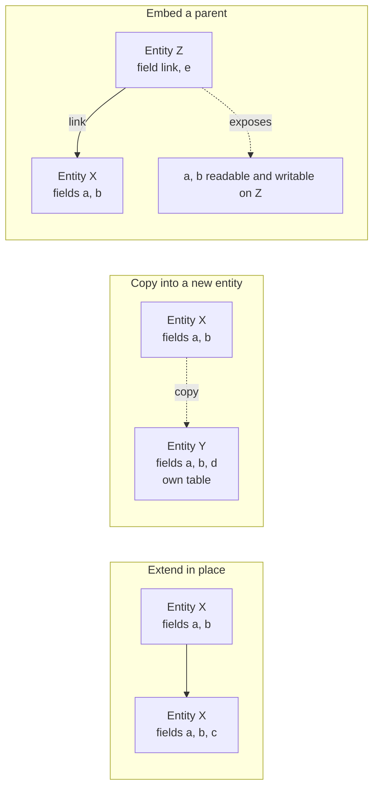

# Inheritance and extension

A capability package almost never works alone. It extends entities another package defined, adds fields to them, replaces or wraps their operations, inserts elements into their screens, adds rows to their reference data, grants additional access and adds sections to their printed documents. Every one of those is an **extension**, and all of them obey a small set of rules that this document specifies exactly.

Extension is what makes the system's shape possible: six hundred and twenty packages contribute to one coherent application without any of them being modified. A rebuild that reproduces the entities and the screens but not the extension mechanism will not be able to install the catalogue, because more than a third of the packages exist only to extend two others.

An entity's definition is therefore never written once; it is **accumulated**. One package creates it, and any number of later packages add fields to it, replace the behaviour of its operations, widen its closed value lists, attach shared behaviour bundles to it, derive new entities from it, or embed it inside another entity. This document specifies the mechanisms, the exact order in which competing contributions are resolved, the rules that decide the final value of every entity attribute and every field attribute, the errors that reject an illegal contribution, and the algorithm that rebuilds the complete entity catalogue from the set of installed packages. A replacement that follows these rules produces the same entity catalogue, the same operation dispatch order, the same field attributes and the same stored data for any given set of installed packages.

Read [the architecture](architecture.md) and [the entity and field system](entity-and-field-system.md) first.

---

## Vocabulary

| Term | Meaning |
|---|---|
| Entity | A business object with a canonical full name (for example Journal Entry), a transport name, a set of fields, a set of operations and, when it is persistent, one table. |
| Entity definition | One contribution to an entity, declared inside exactly one capability package. A definition names the entity it targets, and declares zero or more fields, operations, entity attributes and table-level constraints. |
| Entity class | The single resolved object the platform builds for an entity by composing every definition that targets it. Record sets of the entity are produced from the entity class. |
| Definition order | Within one capability package, the order in which that package declares its definitions. The order is fixed by the package and is part of its observable contract. |
| Package order | The order in which capability packages are processed, derived from the dependency graph ([package system, section 6](package-system.md#6-installation-order)). |
| Composition order (resolution order) | The total order in which the definitions of one entity are consulted when an operation is invoked or a field attribute is resolved. [Section 6](#6-composition-how-the-resolved-definition-is-built) gives the algorithm that produces it. |
| Concrete entity | A persistent entity with its own table and its own records. |
| Abstract entity | An entity with no table and no records of its own, used as a shared behaviour bundle and as a source for copying. |
| Transient entity | An entity with a table whose records are short-lived and are periodically discarded, used for dialogue and assistant state. |
| Foundation entity | The single implicit ancestor of every entity, whose transport name is `base` (the foundation entity). It carries the generic operations — create, read, write, delete, search, copy, name resolution — and nothing else. |
| Base list | The ordered list of an entity class's direct sources: its newest definition first, then the sources named by that definition and the previously accumulated sources, in the order produced by [section 6.5](#65-registering-one-definition). |
| Contributing package | A package that declared a given field, closed-list value, constraint or inheritance link. |
| Owning package | For an entity, the package of the last definition that set its attributes; for a field, the package of the highest-precedence declaration. |

---

## Table of contents

1. [The four entity-level mechanisms](#1-the-four-entity-level-mechanisms)
2. [Extending an entity in place](#2-extending-an-entity-in-place)
3. [Copying a definition into a new entity](#3-copying-a-definition-into-a-new-entity)
4. [Embedding a parent record](#4-embedding-a-parent-record)
5. [Adopting an abstract behaviour](#5-adopting-an-abstract-behaviour)
6. [Composition: how the resolved definition is built](#6-composition-how-the-resolved-definition-is-built)
7. [Extending fields](#7-extending-fields)
8. [Extending operations](#8-extending-operations)
9. [Extending views](#9-extending-views)
10. [Extending data](#10-extending-data)
11. [Extending security](#11-extending-security)
12. [Extending printable documents](#12-extending-printable-documents)
13. [Extending rendering templates and assets](#13-extending-rendering-templates-and-assets)
14. [Interaction of the mechanisms](#14-interaction-of-the-mechanisms)
15. [Ownership and external identifiers of contributed structures](#15-ownership-and-external-identifiers-of-contributed-structures)
16. [Resolution order](#16-resolution-order)
17. [What an extension may and may not rely on](#17-what-an-extension-may-and-may-not-rely-on)
18. [Error conditions and messages](#18-error-conditions-and-messages)
19. [Acceptance criteria](#19-acceptance-criteria)
20. [Glossary](#20-glossary)
21. [Reconciliation notes](#21-reconciliation-notes)

---

## 1. The four entity-level mechanisms

Four distinct mechanisms exist at the entity level. They are frequently confused, and confusing them produces a rebuild that behaves differently. They are not interchangeable and they compose.

| Mechanism | What the declaration says | What happens to the entity | What happens to the tables | What happens to operations | Typical use |
|---|---|---|---|---|---|
| **Extend in place** | "I extend the entity named X" and declare no new name | The single entity X gains everything declared | X's table gains the new columns | Declared operations replace X's, with access to the previous behaviour | A package adds fields and behaviour to an entity another package owns |
| **Copy into a new entity** | "I am a new entity named Y and I inherit from X" | A new, independent entity Y is created carrying a copy of X's definition | Y gets its own table, containing its own copies of X's columns | Y receives X's operations and may replace them | A new entity shaped like an existing one but leading an independent life |
| **Embed a parent** | "I am entity Z and I embed a record of X through this many-to-one" | Z exposes X's fields as its own, but does not own them | Z's table holds only the link; the values stay in X's table | Operations are **not** exposed; only fields are | A record that *has one* parent record and transparently exposes its fields |
| **Adopt an abstract behaviour** | "I extend the entity named X and I also inherit from abstract entity M" | X gains M's fields, operations, computations, validations and defaults | X's table gains columns for M's stored fields | M's operations become available on X, at lower precedence than X's own definitions | Attaching discussion threads, activities, portal access, rating, campaign tracking or image handling to a business entity |



Adopting an abstract behaviour is a special case of copying: the source entity has no table, so the copy is the only place the fields exist.

---

## 2. Extending an entity in place

### 2.1 The declaration and its identity rules

A package declares that it extends an existing entity by naming it and declaring no new transport name. There is no limit on how many packages may extend the same entity; the shipped catalogue has entities extended by more than forty packages.

The exact rules that decide which mechanism a declaration selects are:

1. If the declaration names a target entity and introduces no new transport name, it extends the target in place.
2. If the declaration names a target entity **and** introduces a new transport name **equal** to the target name, it also extends the target in place. The two forms are equivalent.
3. If the declaration names one or more source entities and introduces a **different** new transport name, it creates a new entity by copying ([section 3](#3-copying-a-definition-into-a-new-entity)).
4. If the declaration names its own transport name among its sources together with other sources, it extends the entity in place **and** adopts those other sources ([section 5](#5-adopting-an-abstract-behaviour)). The position of its own name in the source list decides whether the other sources outrank the entity's earlier definitions ([section 3.2](#32-ordering-of-named-sources)).
5. If the target entity is absent from the registry when the declaration is processed, the build fails with **"Model '"** the name **"' does not exist in registry."**
6. If a named source is absent from the registry, the build fails with **"Model '"** the name **"' inherits from non-existing model '"** the source name **"'."**

The target's presence is guaranteed when the extending package declares a dependency on the package that creates the entity, which is why declaring that dependency is mandatory rather than advisory.

### 2.2 What an extension may contribute

| Contribution | Effect |
|---|---|
| A new field | Added to the entity; a stored one gets a column on the existing table |
| A redeclaration of an existing field | Layered over the existing declaration, attribute by attribute ([section 7.2](#72-redeclaring-a-field)) |
| A new operation | Available on the entity |
| A redeclaration of an existing operation | Replaces it, with the ability to call the previous definition ([section 8](#8-extending-operations)) |
| A new computation, validation, deletion guard or reaction rule | Runs in addition to the existing ones; these accumulate and are never replaced by name |
| A new database constraint or index, identified by a local name | Applied to the existing table under a database name formed from the table name, an underscore and the local name. A later declaration of the same local name replaces the earlier one |
| An addition to a closed value list | Merged into the list without replacing it ([section 7.5](#75-extending-a-selection)) |
| A change to an entity attribute — the default ordering, the display-name field, the name-search fields, the description, the table name, the parent-link field, the folded-group field, whether audit fields are kept, whether company consistency is checked automatically | Replaces the previous value; the last declaration in composition order wins |
| A new embedded parent | Merged into the entity's embedding map; a later declaration may point the same parent at a different link field |
| Adoption of an abstract behaviour | Adds that behaviour's fields and operations |
| A declared query dependency | Added to the accumulated set of other entities' fields whose pending writes must be flushed before this entity is queried |

### 2.3 What an extension may not do

Six transformations are refused, because they would change the nature of the entity underneath every package that already relies on it.

| Attempt | Message |
|---|---|
| Turn an abstract entity into a concrete one | "\<definition\> transforms the abstract model '\<name\>' into a non-abstract model. That class should either inherit from AbstractModel, or set a different '_name'." |
| Turn a transient entity into a persistent one | "\<definition\> transforms the transient model '\<name\>' into a non-transient model. That class should either inherit from Model, or set a different '_name'." |
| Turn a persistent entity into a transient one | "\<definition\> transforms the model '\<name\>' into a transient model. That class should either inherit from TransientModel, or set a different '_name'." |
| Make an abstract entity inherit from a concrete one | "In \<definition\>, abstract model '\<name\>' cannot inherit from non-abstract model '\<source\>'." |
| Declare a transient entity that does not keep audit fields | "TransientModels must have log_access turned on, in order to implement their vacuum policy" |
| Inject a field at run time whose name is neither declared on the entity nor on one of its embedded parents nor prefixed with the reserved tenant-local prefix `x_` (the prefix reserved for fields a user creates) | "The field '\<name\>' is not defined in the '\<entity\>' Python class and does not start with 'x_'" |

Injecting a value that is not a field where a field is expected is refused with **"Only field objects may be added to the fields of an entity"**, and a field declaration that overwrites a non-field attribute of the same name records the warning **"In entity '\<entity\>', field '\<name\>' overrides an existing value"**.

An extension also may not remove a field. It can make a field invisible, read-only, or restricted to a group that nobody belongs to, but the column stays and every package that reads the field keeps working. Removing a field is only possible by removing the package that declared it.

### 2.4 Ordering

Extensions of one entity are composed in **package installation order**, which is the order of [the package system, section 6](package-system.md#6-installation-order): by phase, then by depth from the foundation package, then by sort name; and, within one package, in that package's own declaration order. An extension therefore always sees the contributions of every package it depends on, and never sees the contributions of packages that do not depend on it and are not depended on by it — except by accident of ordering, which [section 17](#17-what-an-extension-may-and-may-not-rely-on) forbids relying on.

### 2.5 A worked example

Package `alpha` defines Order (`alpha.order`, table `alpha_order`) with fields `name` (name) and `amount` (amount).

Package `beta` extends Order, adding `discount` (discount) and redeclaring `amount` as computed from `discount`.

Package `gamma` extends Order, adding `note` (note) and redeclaring `discount` as required.

The resolved entity has four fields: `name`, `amount` (computed), `discount` (required) and `note`. The table `alpha_order` has four columns plus the identifier and the audit columns. There is exactly one entity, one table, and one place where an Order lives. Removing `gamma` removes `note`, drops its column and removes the required flag from `discount`; `beta`'s computation of `amount` survives.

### 2.6 A worked example across four packages, with numbers

This example shows that the behaviour of an entity is a function of which packages are installed, with no package edited.

| Package | Depth | Depends on | Contribution to the entity Sample |
|---|---|---|---|
| `alpha` | 1 | the foundation | Creates Sample with field `amount` (amount, decimal, default 0) and operation *total*, returning the amount |
| `beta` | 2 | `alpha` | Adds field `surcharge` (surcharge, decimal, default 0); redeclares *total* as the previous definition's result plus the surcharge |
| `gamma` | 2 | `alpha` | Adds field `discount` (discount, decimal, default 0); redeclares *total* as the previous definition's result minus the discount |
| `delta` | 3 | `beta` and `gamma` | Redeclares *total* as the previous definition's result rounded to two decimal places, half away from zero |

Package order: `alpha` (depth 1), then `beta` and `gamma` (both depth 2, ordered by name), then `delta` (depth 3). The base list of Sample, highest precedence first, is `delta`'s definition, `gamma`'s definition, `beta`'s definition, `alpha`'s definition, the foundation entity. The dispatch chain of *total* is therefore `delta`, then `gamma`, then `beta`, then `alpha`.

With an amount of 100.004, a surcharge of 10 and a discount of 5:

```formula
alpha  : total = amount = 100.004
beta   : total = 100.004 + 10 = 110.004
gamma  : total = 110.004 − 5 = 105.004
delta  : total = round(105.004 to 2 decimals, half away from zero) = 105.00
```

Uninstalling `gamma` changes the chain to `delta`, `beta`, `alpha` and the result to round(110.004) = 110.00. Uninstalling `delta` instead changes the chain to `gamma`, `beta`, `alpha` and the result to 105.004, unrounded.

Renaming `gamma` to a name that sorts before `beta` would swap the two middle steps. Because addition and subtraction commute, the result would be unchanged here; for steps that do not commute the result would differ, which is why a package whose contribution must run after another's declares a dependency on that other package rather than relying on the accident of name order.

---

## 3. Copying a definition into a new entity

### 3.1 The declaration

A package declares a **new** transport name **and** declares that it inherits from one or more existing entities. The result is a new, independent entity whose definition starts as a copy of the named ones.

### 3.2 Ordering of named sources

The source list is ordered and the order is observable.

1. Sources are consulted in the order named: the **first** named source has the **highest** precedence, the second the next, and so on.
2. Naming the entity's own transport name inside the source list stands for "the definitions of this entity registered before this one". Its position in the list decides whether the other named sources outrank the entity's earlier definitions.
3. A source listed **before** the entity's own name has its operations and field declarations consulted **before** the entity's earlier definitions.
4. A source listed **after** the entity's own name has them consulted **after** the entity's earlier definitions.

Rule 4 is what makes adoption of an abstract behaviour behave as expected: the abstract entity is listed after the entity's own name, so the entity's own definitions win and the abstract entity supplies only the behaviour the entity does not provide itself.

### 3.3 Semantics

1. The new entity gets **every field** of each named source, as its own fields on its own table, whose default name is the new transport name with dots replaced by underscores.
2. It gets every operation, every computation, every validation, every deletion guard and every reaction rule, and may replace any of them with the call-the-previous-definition contract of [section 8](#8-extending-operations).
3. It does **not** get the records. The two entities have separate tables and separate rows.
4. It does **not** get the sources' shipped reference data, access rights, record rules, views, menus, printable documents or external identifiers. Those belong to the source entity.
5. It does **not** get the sources' table-level constraints under the same database name: a constraint's database name is derived from the table of the entity that carries it, so the new entity gets its own constraint on its own table.
6. It does **not** inherit the sources' description or table name silently: those attributes are resolved by [section 6.3](#63-entity-attributes-under-composition), and because the new declaration is last in composition order, an entity that restates neither takes the source's value only if the source set one.
7. Later extensions of a source entity **are** visible in the copy, because the composition is by reference to the source's resolved definition, not by a snapshot taken at declaration time. Adding a field to the source adds it to the copy too, with a column on the copy's table; replacing an operation on the source puts the replacement into the copy's dispatch chain.
8. The copy may then redeclare anything it inherited.
9. When several sources are named and two of them declare a field of the same name, the **first** named source wins, by rule 1 of [section 3.2](#32-ordering-of-named-sources).

### 3.4 Restrictions

| Rule | Refusal |
|---|---|
| Every named source must exist in the registry when the declaration is processed | "Model '\<name\>' inherits from non-existing model '\<source\>'." |
| An abstract entity may not name a concrete source | "In \<definition\>, abstract model '\<name\>' cannot inherit from non-abstract model '\<source\>'." |
| A concrete entity may name abstract sources; the abstract source's stored fields become columns of the concrete entity's table | Allowed |
| The new entity's table name must be a valid database identifier | The build fails |

### 3.5 When to use it

Copying is right when two things genuinely share a shape but must not share rows: a template and the thing made from it, a historical snapshot and the live record, a draft and the final. It is wrong when the two things are the same thing seen from two angles — that is what embedding is for.

Copying is also the mechanism behind adopting an abstract behaviour, which is by far its most common use: the messaging behaviour, the activity behaviour, the avatar behaviour and the website-publication behaviour are all abstract entities copied into hundreds of concrete ones.

### 3.6 Interaction with extension in place

A package may, in one declaration, both create a new entity **and** name the new entity's own transport name among its sources. That means "extend the entity I am also defining", which is how an entity can be declared in one place and extended in another within the same package. The composition treats the self-reference by folding in the entity's existing definition at the position where the name appears rather than creating a cycle.

### 3.7 A worked example

Package `alpha` defines entity `alpha.zero` with field `name` (name), an operation *call* that returns the result of the operation *check* applied to the text "model 0", and an operation *check* that returns the text "This is", the supplied text, the word "record" and the record's name.

Package `alpha` then defines entity `alpha.one`, naming `alpha.zero` as its only source, and redeclares *call* to apply *check* to the text "model 1".

Creating a record of `alpha.zero` with the name "A" and invoking *call* returns "This is model 0 record A". Creating a record of `alpha.one` with the name "B" and invoking *call* returns "This is model 1 record B". The derived entity inherited both the field `name` and the operation *check*, and replaced *call*.

### 3.8 A worked example of later source extensions

Package `alpha` defines abstract entity `alpha.parent` with an operation *stuff* returning the text "P1". Package `alpha` then defines entity `alpha.child`, naming `alpha.parent` as its source, and redeclares *stuff* as the previous definition's result followed by "C1". Package `alpha` then, in a third declaration, extends `alpha.parent` in place, redeclaring *stuff* as the previous definition's result followed by "P2", and adding field `foo` (marker). Package `alpha` also declares field `bar` (child marker) on `alpha.child`.

Observable results:

| Query | Result |
|---|---|
| *stuff* on `alpha.parent` | "P1P2" |
| *stuff* on `alpha.child` | "P1P2C1" |
| Fields of `alpha.parent` | contain `foo`, do not contain `bar` |
| Fields of `alpha.child` | contain both `foo` and `bar` |
| Tables | `alpha.parent` is abstract and has none; `alpha.child` has its own |

The third declaration is registered after the child was created, yet the child sees it, because the child's composition holds the parent's **entity class**, not a copy of the parent's definitions. The child's own redeclaration runs first, calls the previous definition, which is the third declaration of the parent, which calls the previous definition, which is the first.

A second worked example across packages: package `alpha` creates entity `alpha.mother` with an operation *bar* returning 42 and an operation *foo* returning the result of *bar*. Package `beta`, which depends on `alpha`, extends `alpha.mother` and redeclares *foo* as twice the previous definition's result. Invoking *foo* returns 84 with `beta` installed and 42 without it.
