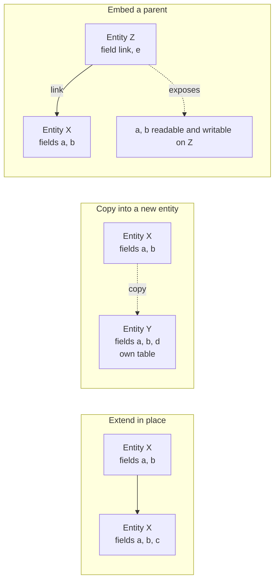

# Inheritance and extension

A capability package almost never works alone. It extends entities another package defined, adds fields to them, replaces or wraps their operations, inserts elements into their screens, adds rows to their reference data, grants additional access and adds sections to their printed documents. Every one of those is an **extension**, and all of them obey a small set of rules that this document specifies exactly.

Extension is what makes the system's shape possible: six hundred and twenty packages contribute to one coherent application without any of them being modified. A rebuild that reproduces the entities and the screens but not the extension mechanism will not be able to install the catalogue, because more than a third of the packages exist only to extend two others.

An entity's definition is therefore never written once; it is **accumulated**. One package creates it, and any number of later packages add fields to it, replace the behaviour of its operations, widen its closed value lists, attach shared behaviour bundles to it, derive new entities from it, or embed it inside another entity. This document specifies the mechanisms, the exact order in which competing contributions are resolved, the rules that decide the final value of every entity attribute and every field attribute, the errors that reject an illegal contribution, and the algorithm that rebuilds the complete entity catalogue from the set of installed packages. A replacement that follows these rules produces the same entity catalogue, the same operation dispatch order, the same field attributes and the same stored data for any given set of installed packages.

Read [the architecture](architecture.md) and [the entity and field system](entity-and-field-system.md) first.

---

## Vocabulary

| Term | Meaning |
|---|---|
| Entity | A business object with a canonical full name (for example Journal Entry), a transport name, a set of fields, a set of operations and, when it is persistent, one table. |
| Entity definition | One contribution to an entity, declared inside exactly one capability package. A definition names the entity it targets, and declares zero or more fields, operations, entity attributes and table-level constraints. |
| Entity class | The single resolved object the platform builds for an entity by composing every definition that targets it. Record sets of the entity are produced from the entity class. |
| Definition order | Within one capability package, the order in which that package declares its definitions. The order is fixed by the package and is part of its observable contract. |
| Package order | The order in which capability packages are processed, derived from the dependency graph ([package system, section 6](package-system.md#6-installation-order)). |
| Composition order (resolution order) | The total order in which the definitions of one entity are consulted when an operation is invoked or a field attribute is resolved. [Section 6](#6-composition-how-the-resolved-definition-is-built) gives the algorithm that produces it. |
| Concrete entity | A persistent entity with its own table and its own records. |
| Abstract entity | An entity with no table and no records of its own, used as a shared behaviour bundle and as a source for copying. |
| Transient entity | An entity with a table whose records are short-lived and are periodically discarded, used for dialogue and assistant state. |
| Foundation entity | The single implicit ancestor of every entity, whose transport name is `base` (the foundation entity). It carries the generic operations — create, read, write, delete, search, copy, name resolution — and nothing else. |
| Base list | The ordered list of an entity class's direct sources: its newest definition first, then the sources named by that definition and the previously accumulated sources, in the order produced by [section 6.5](#65-registering-one-definition). |
| Contributing package | A package that declared a given field, closed-list value, constraint or inheritance link. |
| Owning package | For an entity, the package of the last definition that set its attributes; for a field, the package of the highest-precedence declaration. |

---

## Table of contents

1. [The four entity-level mechanisms](#1-the-four-entity-level-mechanisms)
2. [Extending an entity in place](#2-extending-an-entity-in-place)
3. [Copying a definition into a new entity](#3-copying-a-definition-into-a-new-entity)
4. [Embedding a parent record](#4-embedding-a-parent-record)
5. [Adopting an abstract behaviour](#5-adopting-an-abstract-behaviour)
6. [Composition: how the resolved definition is built](#6-composition-how-the-resolved-definition-is-built)
7. [Extending fields](#7-extending-fields)
8. [Extending operations](#8-extending-operations)
9. [Extending views](#9-extending-views)
10. [Extending data](#10-extending-data)
11. [Extending security](#11-extending-security)
12. [Extending printable documents](#12-extending-printable-documents)
13. [Extending rendering templates and assets](#13-extending-rendering-templates-and-assets)
14. [Interaction of the mechanisms](#14-interaction-of-the-mechanisms)
15. [Ownership and external identifiers of contributed structures](#15-ownership-and-external-identifiers-of-contributed-structures)
16. [Resolution order](#16-resolution-order)
17. [What an extension may and may not rely on](#17-what-an-extension-may-and-may-not-rely-on)
18. [Error conditions and messages](#18-error-conditions-and-messages)
19. [Acceptance criteria](#19-acceptance-criteria)
20. [Glossary](#20-glossary)
21. [Reconciliation notes](#21-reconciliation-notes)

---

## 1. The four entity-level mechanisms

Four distinct mechanisms exist at the entity level. They are frequently confused, and confusing them produces a rebuild that behaves differently. They are not interchangeable and they compose.

| Mechanism | What the declaration says | What happens to the entity | What happens to the tables | What happens to operations | Typical use |
|---|---|---|---|---|---|
| **Extend in place** | "I extend the entity named X" and declare no new name | The single entity X gains everything declared | X's table gains the new columns | Declared operations replace X's, with access to the previous behaviour | A package adds fields and behaviour to an entity another package owns |
| **Copy into a new entity** | "I am a new entity named Y and I inherit from X" | A new, independent entity Y is created carrying a copy of X's definition | Y gets its own table, containing its own copies of X's columns | Y receives X's operations and may replace them | A new entity shaped like an existing one but leading an independent life |
| **Embed a parent** | "I am entity Z and I embed a record of X through this many-to-one" | Z exposes X's fields as its own, but does not own them | Z's table holds only the link; the values stay in X's table | Operations are **not** exposed; only fields are | A record that *has one* parent record and transparently exposes its fields |
| **Adopt an abstract behaviour** | "I extend the entity named X and I also inherit from abstract entity M" | X gains M's fields, operations, computations, validations and defaults | X's table gains columns for M's stored fields | M's operations become available on X, at lower precedence than X's own definitions | Attaching discussion threads, activities, portal access, rating, campaign tracking or image handling to a business entity |



Adopting an abstract behaviour is a special case of copying: the source entity has no table, so the copy is the only place the fields exist.

---

## 2. Extending an entity in place

### 2.1 The declaration and its identity rules

A package declares that it extends an existing entity by naming it and declaring no new transport name. There is no limit on how many packages may extend the same entity; the shipped catalogue has entities extended by more than forty packages.

The exact rules that decide which mechanism a declaration selects are:

1. If the declaration names a target entity and introduces no new transport name, it extends the target in place.
2. If the declaration names a target entity **and** introduces a new transport name **equal** to the target name, it also extends the target in place. The two forms are equivalent.
3. If the declaration names one or more source entities and introduces a **different** new transport name, it creates a new entity by copying ([section 3](#3-copying-a-definition-into-a-new-entity)).
4. If the declaration names its own transport name among its sources together with other sources, it extends the entity in place **and** adopts those other sources ([section 5](#5-adopting-an-abstract-behaviour)). The position of its own name in the source list decides whether the other sources outrank the entity's earlier definitions ([section 3.2](#32-ordering-of-named-sources)).
5. If the target entity is absent from the registry when the declaration is processed, the build fails with **"Model '"** the name **"' does not exist in registry."**
6. If a named source is absent from the registry, the build fails with **"Model '"** the name **"' inherits from non-existing model '"** the source name **"'."**

The target's presence is guaranteed when the extending package declares a dependency on the package that creates the entity, which is why declaring that dependency is mandatory rather than advisory.

### 2.2 What an extension may contribute

| Contribution | Effect |
|---|---|
| A new field | Added to the entity; a stored one gets a column on the existing table |
| A redeclaration of an existing field | Layered over the existing declaration, attribute by attribute ([section 7.2](#72-redeclaring-a-field)) |
| A new operation | Available on the entity |
| A redeclaration of an existing operation | Replaces it, with the ability to call the previous definition ([section 8](#8-extending-operations)) |
| A new computation, validation, deletion guard or reaction rule | Runs in addition to the existing ones; these accumulate and are never replaced by name |
| A new database constraint or index, identified by a local name | Applied to the existing table under a database name formed from the table name, an underscore and the local name. A later declaration of the same local name replaces the earlier one |
| An addition to a closed value list | Merged into the list without replacing it ([section 7.5](#75-extending-a-selection)) |
| A change to an entity attribute — the default ordering, the display-name field, the name-search fields, the description, the table name, the parent-link field, the folded-group field, whether audit fields are kept, whether company consistency is checked automatically | Replaces the previous value; the last declaration in composition order wins |
| A new embedded parent | Merged into the entity's embedding map; a later declaration may point the same parent at a different link field |
| Adoption of an abstract behaviour | Adds that behaviour's fields and operations |
| A declared query dependency | Added to the accumulated set of other entities' fields whose pending writes must be flushed before this entity is queried |

### 2.3 What an extension may not do

Six transformations are refused, because they would change the nature of the entity underneath every package that already relies on it.

| Attempt | Message |
|---|---|
| Turn an abstract entity into a concrete one | "\<definition\> transforms the abstract model '\<name\>' into a non-abstract model. That class should either inherit from AbstractModel, or set a different '_name'." |
| Turn a transient entity into a persistent one | "\<definition\> transforms the transient model '\<name\>' into a non-transient model. That class should either inherit from Model, or set a different '_name'." |
| Turn a persistent entity into a transient one | "\<definition\> transforms the model '\<name\>' into a transient model. That class should either inherit from TransientModel, or set a different '_name'." |
| Make an abstract entity inherit from a concrete one | "In \<definition\>, abstract model '\<name\>' cannot inherit from non-abstract model '\<source\>'." |
| Declare a transient entity that does not keep audit fields | "TransientModels must have log_access turned on, in order to implement their vacuum policy" |
| Inject a field at run time whose name is neither declared on the entity nor on one of its embedded parents nor prefixed with the reserved tenant-local prefix `x_` (the prefix reserved for fields a user creates) | "The field '\<name\>' is not defined in the '\<entity\>' Python class and does not start with 'x_'" |

Injecting a value that is not a field where a field is expected is refused with **"Only field objects may be added to the fields of an entity"**, and a field declaration that overwrites a non-field attribute of the same name records the warning **"In entity '\<entity\>', field '\<name\>' overrides an existing value"**.

An extension also may not remove a field. It can make a field invisible, read-only, or restricted to a group that nobody belongs to, but the column stays and every package that reads the field keeps working. Removing a field is only possible by removing the package that declared it.

### 2.4 Ordering

Extensions of one entity are composed in **package installation order**, which is the order of [the package system, section 6](package-system.md#6-installation-order): by phase, then by depth from the foundation package, then by sort name; and, within one package, in that package's own declaration order. An extension therefore always sees the contributions of every package it depends on, and never sees the contributions of packages that do not depend on it and are not depended on by it — except by accident of ordering, which [section 17](#17-what-an-extension-may-and-may-not-rely-on) forbids relying on.

### 2.5 A worked example

Package `alpha` defines Order (`alpha.order`, table `alpha_order`) with fields `name` (name) and `amount` (amount).

Package `beta` extends Order, adding `discount` (discount) and redeclaring `amount` as computed from `discount`.

Package `gamma` extends Order, adding `note` (note) and redeclaring `discount` as required.

The resolved entity has four fields: `name`, `amount` (computed), `discount` (required) and `note`. The table `alpha_order` has four columns plus the identifier and the audit columns. There is exactly one entity, one table, and one place where an Order lives. Removing `gamma` removes `note`, drops its column and removes the required flag from `discount`; `beta`'s computation of `amount` survives.

### 2.6 A worked example across four packages, with numbers

This example shows that the behaviour of an entity is a function of which packages are installed, with no package edited.

| Package | Depth | Depends on | Contribution to the entity Sample |
|---|---|---|---|
| `alpha` | 1 | the foundation | Creates Sample with field `amount` (amount, decimal, default 0) and operation *total*, returning the amount |
| `beta` | 2 | `alpha` | Adds field `surcharge` (surcharge, decimal, default 0); redeclares *total* as the previous definition's result plus the surcharge |
| `gamma` | 2 | `alpha` | Adds field `discount` (discount, decimal, default 0); redeclares *total* as the previous definition's result minus the discount |
| `delta` | 3 | `beta` and `gamma` | Redeclares *total* as the previous definition's result rounded to two decimal places, half away from zero |

Package order: `alpha` (depth 1), then `beta` and `gamma` (both depth 2, ordered by name), then `delta` (depth 3). The base list of Sample, highest precedence first, is `delta`'s definition, `gamma`'s definition, `beta`'s definition, `alpha`'s definition, the foundation entity. The dispatch chain of *total* is therefore `delta`, then `gamma`, then `beta`, then `alpha`.

With an amount of 100.004, a surcharge of 10 and a discount of 5:

```formula
alpha  : total = amount = 100.004
beta   : total = 100.004 + 10 = 110.004
gamma  : total = 110.004 − 5 = 105.004
delta  : total = round(105.004 to 2 decimals, half away from zero) = 105.00
```

Uninstalling `gamma` changes the chain to `delta`, `beta`, `alpha` and the result to round(110.004) = 110.00. Uninstalling `delta` instead changes the chain to `gamma`, `beta`, `alpha` and the result to 105.004, unrounded.

Renaming `gamma` to a name that sorts before `beta` would swap the two middle steps. Because addition and subtraction commute, the result would be unchanged here; for steps that do not commute the result would differ, which is why a package whose contribution must run after another's declares a dependency on that other package rather than relying on the accident of name order.

---

## 3. Copying a definition into a new entity

### 3.1 The declaration

A package declares a **new** transport name **and** declares that it inherits from one or more existing entities. The result is a new, independent entity whose definition starts as a copy of the named ones.

### 3.2 Ordering of named sources

The source list is ordered and the order is observable.

1. Sources are consulted in the order named: the **first** named source has the **highest** precedence, the second the next, and so on.
2. Naming the entity's own transport name inside the source list stands for "the definitions of this entity registered before this one". Its position in the list decides whether the other named sources outrank the entity's earlier definitions.
3. A source listed **before** the entity's own name has its operations and field declarations consulted **before** the entity's earlier definitions.
4. A source listed **after** the entity's own name has them consulted **after** the entity's earlier definitions.

Rule 4 is what makes adoption of an abstract behaviour behave as expected: the abstract entity is listed after the entity's own name, so the entity's own definitions win and the abstract entity supplies only the behaviour the entity does not provide itself.

### 3.3 Semantics

1. The new entity gets **every field** of each named source, as its own fields on its own table, whose default name is the new transport name with dots replaced by underscores.
2. It gets every operation, every computation, every validation, every deletion guard and every reaction rule, and may replace any of them with the call-the-previous-definition contract of [section 8](#8-extending-operations).
3. It does **not** get the records. The two entities have separate tables and separate rows.
4. It does **not** get the sources' shipped reference data, access rights, record rules, views, menus, printable documents or external identifiers. Those belong to the source entity.
5. It does **not** get the sources' table-level constraints under the same database name: a constraint's database name is derived from the table of the entity that carries it, so the new entity gets its own constraint on its own table.
6. It does **not** inherit the sources' description or table name silently: those attributes are resolved by [section 6.3](#63-entity-attributes-under-composition), and because the new declaration is last in composition order, an entity that restates neither takes the source's value only if the source set one.
7. Later extensions of a source entity **are** visible in the copy, because the composition is by reference to the source's resolved definition, not by a snapshot taken at declaration time. Adding a field to the source adds it to the copy too, with a column on the copy's table; replacing an operation on the source puts the replacement into the copy's dispatch chain.
8. The copy may then redeclare anything it inherited.
9. When several sources are named and two of them declare a field of the same name, the **first** named source wins, by rule 1 of [section 3.2](#32-ordering-of-named-sources).

### 3.4 Restrictions

| Rule | Refusal |
|---|---|
| Every named source must exist in the registry when the declaration is processed | "Model '\<name\>' inherits from non-existing model '\<source\>'." |
| An abstract entity may not name a concrete source | "In \<definition\>, abstract model '\<name\>' cannot inherit from non-abstract model '\<source\>'." |
| A concrete entity may name abstract sources; the abstract source's stored fields become columns of the concrete entity's table | Allowed |
| The new entity's table name must be a valid database identifier | The build fails |

### 3.5 When to use it

Copying is right when two things genuinely share a shape but must not share rows: a template and the thing made from it, a historical snapshot and the live record, a draft and the final. It is wrong when the two things are the same thing seen from two angles — that is what embedding is for.

Copying is also the mechanism behind adopting an abstract behaviour, which is by far its most common use: the messaging behaviour, the activity behaviour, the avatar behaviour and the website-publication behaviour are all abstract entities copied into hundreds of concrete ones.

### 3.6 Interaction with extension in place

A package may, in one declaration, both create a new entity **and** name the new entity's own transport name among its sources. That means "extend the entity I am also defining", which is how an entity can be declared in one place and extended in another within the same package. The composition treats the self-reference by folding in the entity's existing definition at the position where the name appears rather than creating a cycle.

### 3.7 A worked example

Package `alpha` defines entity `alpha.zero` with field `name` (name), an operation *call* that returns the result of the operation *check* applied to the text "model 0", and an operation *check* that returns the text "This is", the supplied text, the word "record" and the record's name.

Package `alpha` then defines entity `alpha.one`, naming `alpha.zero` as its only source, and redeclares *call* to apply *check* to the text "model 1".

Creating a record of `alpha.zero` with the name "A" and invoking *call* returns "This is model 0 record A". Creating a record of `alpha.one` with the name "B" and invoking *call* returns "This is model 1 record B". The derived entity inherited both the field `name` and the operation *check*, and replaced *call*.

### 3.8 A worked example of later source extensions

Package `alpha` defines abstract entity `alpha.parent` with an operation *stuff* returning the text "P1". Package `alpha` then defines entity `alpha.child`, naming `alpha.parent` as its source, and redeclares *stuff* as the previous definition's result followed by "C1". Package `alpha` then, in a third declaration, extends `alpha.parent` in place, redeclaring *stuff* as the previous definition's result followed by "P2", and adding field `foo` (marker). Package `alpha` also declares field `bar` (child marker) on `alpha.child`.

Observable results:

| Query | Result |
|---|---|
| *stuff* on `alpha.parent` | "P1P2" |
| *stuff* on `alpha.child` | "P1P2C1" |
| Fields of `alpha.parent` | contain `foo`, do not contain `bar` |
| Fields of `alpha.child` | contain both `foo` and `bar` |
| Tables | `alpha.parent` is abstract and has none; `alpha.child` has its own |

The third declaration is registered after the child was created, yet the child sees it, because the child's composition holds the parent's **entity class**, not a copy of the parent's definitions. The child's own redeclaration runs first, calls the previous definition, which is the third declaration of the parent, which calls the previous definition, which is the first.

A second worked example across packages: package `alpha` creates entity `alpha.mother` with an operation *bar* returning 42 and an operation *foo* returning the result of *bar*. Package `beta`, which depends on `alpha`, extends `alpha.mother` and redeclares *foo* as twice the previous definition's result. Invoking *foo* returns 84 with `beta` installed and 42 without it.

---

## 4. Embedding a parent record

### 4.1 The declaration

An entity declares, for each parent it embeds, the parent's transport name and the name of a **many-to-one field on this entity** that points at the parent record. The mapping is ordered; it is called the entity's embedding map.

The named field must exist and must satisfy all of the following:

| Attribute of the link field | Required value |
|---|---|
| Type | Many-to-one |
| Target entity | The parent entity named by the map entry |
| Marked as embedding | Yes — the field is flagged as the carrier of an embedding |
| Required | Yes |
| Deletion behaviour | `cascade` (delete the child when the parent is deleted) or `restrict` (refuse to delete the parent while a child exists) |

Two refusals guard this:

- A missing link field, or a link field that is not a many-to-one, fails with **"Missing many2one field definition for _inherits reference '"** the field name **"' in model '"** the entity **"'. Add a field like: "** followed by a suggested declaration naming the parent, the required flag and the `cascade` deletion behaviour.
- A link field that exists and is a many-to-one but is not flagged as embedding, not required, or carries another deletion behaviour fails with **"Field definition for _inherits reference '"** the field name **"' in '"** the entity **"' must be marked as 'delegate', 'required' with ondelete='cascade' or 'restrict'"**.

An embedding may be declared by the definition that creates the child entity, or added later by an extension of the child in place; the embedding map merges per parent entity ([section 6.3](#63-entity-attributes-under-composition)).

### 4.2 Semantics

1. Every field of the parent that this entity does not declare itself becomes available on this entity as an **exposed field**: reading it reads the parent's value, writing it writes the parent's value.
2. An exposed field is implemented as a related field over the path consisting of the link field and the parent's field name, with these specific properties:
   - **it does not bypass access checks**, unlike an ordinary related field, so reading an exposed field enforces the parent's access rules;
   - it is copied if and only if the parent's field is copied;
   - it is read-only if and only if the parent's field is read-only;
   - its label is exported for translation if and only if the parent's field's label is;
   - it is marked as exposed, carrying a reference back to the parent's field.
3. An exposed field that is **required** on the parent becomes required here too.
4. A field this entity declares itself **shadows** the parent's field of the same name; the parent's value is then reachable only through the link.
5. When two embedded parents declare the same field name, the **last** parent in the map order wins. A field the entity declares itself wins over both.
6. The link field implies **bypassing access checks on traversal** ([entity and field system, section 7.6](entity-and-field-system.md#76-bypassing-access-on-traversal)), because the parent record is conceptually part of this record.
7. Embedding is transitive: embedding an entity that itself embeds another exposes both levels' fields, and reading through two levels is transparent.
8. An abstract entity never receives exposed fields. An embedding map declared on an abstract entity has no effect while the entity is abstract; it takes effect on every concrete entity that adopts that abstract entity.

### 4.3 Reading

Reading an exposed field reads the linked parent record and returns its value. The parent entity's access rules apply: a user who may read the child but not the parent receives an access refusal when reading an exposed field, and an empty value when the exposed field is consulted inside a display-name search that tolerates access refusals.

Reading an exposed translated field returns the translation in the reader's language, resolved on the parent record. The child's display name follows the child's own display-name field; when that field is itself exposed from a translated parent field, the child's display name is language dependent and is recomputed when the language changes.

**Worked example.** Entity Unit has a translated field `name` (name). Entity Box embeds Unit through the link field `unit`. Entity Pallet embeds Box through the link field `box`. A Pallet is created with the name "Bread", and the Unit's name is translated to "Pain" in French. The display name of the Pallet is "Bread" for a reader in English and "Pain" for a reader in French, and the same holds for the Unit and the Box.

### 4.4 Writing

Writing an exposed field writes through to the parent record.

1. The values addressed to exposed fields are grouped per parent entity.
2. For every parent entity in the embedding map, if the child record already links to a parent record, the grouped values are written on that parent record.
3. The write is a real write on the parent record; **every** record that links to the same parent record observes the change.

Writing a read-only exposed field is permitted through the ordinary write path when the caller is allowed to write on the parent: read-only is a presentation constraint, not a storage constraint.

Writing a list-valued exposed field — a one-to-many owned by the parent — writes on the parent's list. After the write, the child's view of the list and the parent's list are identical, and the identifiers of the lines are unchanged.

**Worked example of the shared-parent consequence.** A Unit named "foo" is created; five Boxes are created, each linking to it. Setting the link field of all five Boxes, in one operation, to a different Unit named "bar" makes all five Boxes read the name "bar".

### 4.5 Creation

Creating a record of an embedding entity is a staged operation. For each parent entity in the embedding map, in map order:

1. The supplied values are partitioned: values naming fields exposed from that parent go to that parent, everything else stays.
2. The records to create are partitioned into those whose link field is supplied and those whose link field is not.
3. For records whose link field is **not** supplied, one parent record is created per child record, carrying exactly the values addressed to fields exposed from that parent, and the new parent's identifier is assigned to the child's link field.
4. For records whose link field **is** supplied, any values addressed to fields exposed from that parent are written on the supplied parent record.
5. The child rows are then created with the remaining values plus the links.

Two consequences:

- Creating a record of an embedding entity without supplying the link **creates a parent record**. That parent is a real record of the parent entity and appears in the parent entity's searches.
- Supplying the link means "attach to this existing parent", and the parent's fields are then *updated*, not created. Supplying the link and also supplying an exposed field therefore modifies the shared parent, which is visible to every other record embedding it.

### 4.6 Defaults

When resolving defaults for an embedding entity, an exposed field the acting user may write is delegated to the parent entity, whose own default resolution runs and whose results are merged in ([entity and field system, section 13.1](entity-and-field-system.md#131-the-resolution-order), rule 5).

Defaulting is skipped for parents whose link was supplied ([entity and field system, section 13.3](entity-and-field-system.md#133-defaults-during-creation)). The exclusion is computed **recursively**: starting from the child, for every entry of the embedding map, if the link field is supplied that parent entity is excluded; otherwise the same test is applied to that parent's own embedding map.

**Worked example with a three-level chain.** Unit has fields `name` (name), `state` (state, a closed list) and `size` (size). Box embeds Unit through `unit` and declares its own field `size` (size). Pallet embeds Box through `box`.

A Unit is created with the name "U", the state `a` and the size 1. A Pallet is then created with the values name "P" and link `unit` pointing at that Unit, while the session carries contextual defaults of state `b` and size 2.

| Field read on the created Pallet | Value | Why |
|---|---|---|
| `state` | `a` | The default was suppressed: `state` is exposed from Unit and the link to Unit was supplied |
| `size` | 2 | The default applies: `size` is a field of Box, not a field exposed from Unit |

**Worked example of a three-level creation with no link supplied.** A Pallet is created with the values name "B", `field_in_box` (box marker) "box" and `field_in_pallet` (pallet marker) "pallet". One Unit record is created holding the name "B"; one Box record is created holding the box marker "box" and linking to that Unit; one Pallet record is created holding the pallet marker "pallet" and linking to that Box. Reading the Pallet returns all three values.

### 4.7 Duplication

Duplicating a record of an embedding entity applies an exclusion list built as follows:

1. The exclusion list starts with the surrogate key, the creation stamps, the last-modification stamps and the stored hierarchy path.
2. The retention list is every field the child declares itself, which is never excluded on account of a parent.
3. For every entry of the embedding map, the link field is added to the exclusion list; then, if the caller supplied an explicit value for that link field, every field of that parent that is not in the retention list is added to the exclusion list; otherwise the same procedure is applied recursively to that parent's own embedding map.
4. The values carried over are every field that is marked copyable, is not explicitly overridden by the caller, and is not in the exclusion list.

Consequences: by default a duplicate gets a **new** parent record holding copies of the parent's copyable values, because the link field is excluded and the exposed values are copied. If the caller explicitly supplies the link field, the duplicate shares the supplied parent record and none of that parent's values are copied. Fields the embedding entity redeclares itself are treated as its own, not the parent's.

### 4.8 Deletion

The link field's deletion behaviour governs what happens when the parent record is deleted:

- `cascade`: deleting the parent record deletes the child record.
- `restrict`: deleting the parent record is refused while a child record links to it.

Deleting the child record does **not** delete the parent record. A parent record created implicitly during the creation of a child therefore survives the deletion of the child, unless the package's data cleanup deletes it ([package system, section 10.3](package-system.md#103-orphan-cleanup)).

### 4.9 Validations that span the embedding

A validation declared on the child that names both an exposed field and a local field is evaluated whenever either changes, including when the change reaches the exposed field through a write on the child and including when the child is re-pointed at another parent record.

**Worked example.** Entity Another Unit has the required field `value_one` (first value, whole number). Entity Another Box embeds Another Unit through `another_unit` and declares the required field `value_two` (second value, whole number) and a validation over both stating that the two values must be equal, refusing with the message **"The two values must be equals"**.

| Operation | Outcome |
|---|---|
| Create Another Box with first value 1 and second value 2 | Refused |
| Create Another Box with first value 1 and second value 1 | Accepted |
| Write second value 2 on that box | Refused |
| Write first value 2 and second value 2 | Accepted |
| Create another Unit with first value 2, then write that link and second value 2 | Accepted |
| Create another Unit with first value 3, then write that link, first value 4 and second value 4 | Accepted |
| Create another Unit with first value 5, then write that link and second value 6 | Refused |
| Create another Unit with first value 7, then write that link, first value 8 and second value 7 | Refused |

### 4.10 Searching and reverse relations

- A filter on an exposed field is translated into a filter on the parent entity reached through the link field. The parent entity's record rules apply to the resulting sub-query.
- A list-valued field on a third entity may use an exposed link field as its reverse. If the parent entity carries a link to Contact and the child exposes it, a Contact may declare a list of children whose reverse is that exposed link. Filtering Contacts by that list works, including in its negative forms.

**Worked example.** Entity Mother has the field `partner` (contact, many-to-one to Contact). Entity Daughter embeds Mother through the link field `template`, and therefore exposes `partner`. Contact declares the list field `daughters` (daughters) whose reverse is `partner`. Creating a Daughter with a given Contact makes that Contact's `daughters` list contain the Daughter. Filtering Contacts where `daughters` matches a name that exists returns the Contact; filtering where it matches a name that does not exist returns nothing; filtering where it does not match a name that does not exist returns the Contact; filtering where `daughters` is set returns the Contact; filtering where `daughters` is one of a list containing the Daughter returns the Contact.

### 4.11 Operations are not exposed

Embedding exposes fields only. An operation declared on the parent entity is **not** available on the child. A child that must expose an operation of its parent declares its own operation and forwards the call explicitly to the linked parent record.

### 4.12 Fields the acting user may not reach

When a parent field is restricted to a group the acting user does not belong to:

- the field is inaccessible on the parent entity and on the child entity alike;
- the default value of that field is still computed on the **parent** entity when the parent record is created implicitly, and is therefore stored, even though the user may neither read nor write it;
- asking the **child** for its default values returns no entry for that field; asking the **parent** does.

**Worked example.** Another Unit declares the field `read_only_with_default` (protected value) restricted to a group nobody belongs to, with the default "roro". Another Box embeds Another Unit. The defaults of Another Unit include the protected value; the defaults of Another Box do not. Creating an Another Box stores "roro" on the implicitly created Another Unit, and reading it with elevated rights returns "roro".

### 4.13 External identifiers

When a record of an embedding entity is created from a data file and its parent was created implicitly, the parent receives its own external identifier, derived from the child's ([package system, section 9.6](package-system.md#96-identifiers-for-embedded-parents)). Without it the parent would survive the removal of the package that caused it to exist.

### 4.14 Orphan cleanup

The orphan cleanup of a package update keeps an implicitly created parent alive as long as at least one child record referring to it was loaded in that build ([package system, section 10.3](package-system.md#103-orphan-cleanup), rule 4).

### 4.15 Where embedding is used

Embedding exists for the case where one real-world thing is recorded from two angles, one of which is shared. The shipped catalogue uses it for: a user embedding a party, so that a user has a name, an address and an electronic mail address without duplicating them; a product variant embedding a product template; and a stock quantity package embedding a package kind. In each case the embedded record is meaningful on its own and may be shared.

### 4.16 Embedding against copying

| Question | Embedding | Copying |
|---|---|---|
| How many rows for one real-world thing | Two, linked | One |
| Can the shared part be reused by several children | Yes | No |
| Does changing the shared part affect every child | Yes | Not applicable |
| Extra join on every read of an exposed field | Yes | No |
| Can a child exist without the parent | No | Not applicable |
| Are the parent's operations available | No | Yes |

---

## 5. Adopting an abstract behaviour

An abstract entity is a package of fields, operations, computations, validations and defaults with no table and no records. An entity **adopts** it by naming it as a source, exactly as in [section 3](#3-copying-a-definition-into-a-new-entity), normally in the form "I extend entity X, and my sources are X and the abstract entity M" so that X's own definitions keep precedence over M's ([section 3.2](#32-ordering-of-named-sources), rule 4).

### 5.1 Effects of adoption

1. Every stored field the abstract entity declares becomes a real stored field with a real column on the adopting entity's table.
2. Every computed field of the abstract entity becomes a computed field of the adopting entity.
3. Every operation becomes available, consulted after the adopting entity's own earlier definitions, and may be redeclared by the adopting entity with the call-the-previous-definition contract of [section 8](#8-extending-operations).
4. Every validation, deletion guard and reaction rule of the abstract entity applies to the adopting entity.
5. The external identifier of every field the abstract entity contributes is owned by the package that performed the adoption — not by the package that declared the abstract entity and not by the package that created the adopting entity ([section 15](#15-ownership-and-external-identifiers-of-contributed-structures)).

**Worked example of ownership.** Package `alpha` creates entity `alpha.foo`. Package `beta` creates the abstract entity `beta.mixin` with the field `published` (published). Package `gamma`, which depends on both, extends `alpha.foo` in place naming `alpha.foo` and `beta.mixin` as its sources. The field catalogue record for `published` on `alpha.foo` carries exactly one external identifier, and that identifier is qualified by `gamma`.

### 5.2 Restrictions

1. An abstract entity may itself adopt another abstract entity.
2. An abstract entity may **not** inherit from a concrete one; the attempt is refused with **"In "** the definition **", abstract model '"** the name **"' cannot inherit from non-abstract model '"** the source name **"'."**
3. An abstract entity may not be turned into a concrete one by a later extension in place ([section 2.3](#23-what-an-extension-may-not-do)).
4. An abstract entity may declare an embedding map, but the map has no effect while the entity is abstract; it takes effect on every concrete entity that adopts the abstract entity.
5. Abstract entities have automatic table management switched off and therefore never create constraints or indexes of their own; the constraints they declare are created on the table of each concrete entity that adopts them.
6. An abstract entity may be **extended in place** like any other, and the extension reaches every entity that has adopted it — including entities in packages that know nothing about the extension. This is the most powerful and the most dangerous extension point in the system: adding a required field to a widely adopted abstract entity adds a required column to hundreds of tables.

The adoption contract for the messaging behaviour — what an entity must provide when it adopts it, what it gains, and what it must be careful about — is specified in [the messaging model](messaging-model.md).

### 5.3 Catalogue of shared behaviour bundles

The platform ships the following abstract entities as shared behaviour bundles. Each is adopted by a concrete entity with the declaration form above. The table gives the bundle's full name, the capability that declares it, and what adopting it contributes. Each bundle is specified in the domain folder of the capability that declares it; this table exists to make the mechanism concrete and to let a reader find the owner of a shared behaviour.

| Shared behaviour bundle | Declared by | Contribution |
|---|---|---|
| Discussion Thread Mixin | Messaging | Message list, follower list, follower-subtype subscriptions, message posting and logging operations, tracked-field change logging, incoming-message routing hooks, notification recipient computation |
| Activity Mixin | Messaging | Scheduled activity list, next-activity summary fields, activity scheduling and completion operations |
| Mail Alias Mixin and Optional Mail Alias Mixin | Messaging | An electronic mail alias record attached to each record, with the values and defaults used when the alias creates records |
| Mail Render Mixin | Messaging | Template rendering of text and rich-text values against a record set, with language resolution |
| Mail Composer Mixin | Messaging | Subject and body composition fields backed by template rendering |
| Mail Tracking Duration Mixin | Messaging | Accumulated duration spent in each value of a tracked closed-list field |
| Notification Bus Listener Mixin | Notification bus | The ability to send notifications to the listeners of a record |
| Portal Access Mixin | Customer portal | Access token, portal web address computation, and the access check for external users |
| Rating Mixin | Rating | Rating request and rating statistics fields and operations |
| Rating Parent Mixin | Rating | Aggregated rating statistics over child records |
| Campaign Tracking Mixin | Campaign tracking | Campaign, source and medium link fields, and their resolution from a request |
| Campaign Source Mixin | Campaign tracking | Automatic creation and naming of the campaign source record |
| Image Mixin | Foundation | One stored original image plus computed resized variants |
| Avatar Mixin | Foundation | Image handling plus a generated placeholder avatar |
| Analytic Mixin | Analytic accounting | Analytic distribution field, its validation and its precision handling |
| Analytic Plan Fields Mixin | Analytic accounting | One link field per analytic plan, computed from the distribution |
| Resource Mixin | Resource planning | Working schedule, time zone and calendar-driven duration computations |
| Sequence Mixin | Accounting | Document numbering with a detected prefix and sequence, plus gap detection |
| Format Address Mixin | Foundation | Address layout per country |
| Format Tax Identification Label Mixin | Foundation | Country-specific label for the tax identification number field |
| Website Published Mixin and Website Published Multi Mixin | Website | Publication state, publication date and public web address |
| Website Search Mixin | Website | Participation in the website search |
| Website Multi Mixin | Website | Restriction of a record to one website |
| Website Cover Properties Mixin | Website | Cover image layout properties |
| Website Page Options Mixin and Website Page Visibility Options Mixin | Website | Page-level display and visibility options |
| Website Search Engine Metadata Mixin | Website | Search-engine title, description and image |
| Spreadsheet Mixin | Spreadsheets | Spreadsheet document storage, revision log and collaborative editing |
| Template Reset Mixin | Foundation | Restoring a record to the values shipped by its package |
| Rich Text Field History Mixin | Rich text editor | Versioned history of rich-text field values |
| Barcode Events Mixin | Barcode | Reaction to scanned barcodes |
| Maintenance Mixin | Maintenance | Maintenance request list and next maintenance date for equipment-like records |
| Point Of Sale Load Mixin | Point of sale | Declaration of the fields and filters loaded into the point of sale session |
| Point Of Sale Notification Mixin | Point of sale | Notification of point of sale sessions |
| Product Catalogue Mixin | Sales and purchasing | Catalogue-style product selection embedded in a document |
| Stock Replenish Mixin | Inventory | Replenishment request fields shared by the replenishment dialogues |
| Individual Skill Mixin | Human resources | Skill level tracking shared by employees and candidates |
| Document Import Mixin | Accounting | Import of an electronic document into a record |
| Hosted Mail Provider Mixins | Mail servers | Authorisation-token handling for the two hosted electronic mail providers |

---

## 6. Composition: how the resolved definition is built

### 6.1 The composition order

For one entity, the contributions are composed so that **later contributions override earlier ones**, where "later" means "declared by a package installed later". The resulting order of precedence, from highest to lowest:

1. The entity's own latest extension.
2. Earlier extensions of the entity, most recent first.
3. The entity's original definition.
4. The sources named by a copying or adoption declaration, **in the order named**, the first named source outranking the second and so on — spliced in at the position where they are named relative to the entity's own transport name ([section 3.2](#32-ordering-of-named-sources)).
5. Those sources' own extensions and sources, recursively, by the same rule.
6. The foundation entity `base`, which supplies the generic operations.

When an entity both extends itself and names other sources, its own accumulated definition is spliced in at the point where its own name is listed.

### 6.2 Worked example of the precedence order

Given:

- package one defines entity `a`;
- package two defines entity `b`;
- package three extends `b`, naming `b` first and `a` second as its sources;
- package four extends `a`.

The precedence order for `a` is: package four's extension, then package one's definition, then the foundation entity.

The precedence order for `b` is: package three's contribution, then package two's definition, then the whole of `a`'s order — package four's extension, package one's definition — then the foundation entity.

Reading it as an operation lookup: an operation declared by package three wins over one declared by package two, which wins over one declared by package four on `a`, which wins over one declared by package one. Note the consequence: **an extension of `a` does not win over `b`'s own definition**, even though the extension is "more recent". Precedence follows the composition structure, not chronology.

Had package three listed `a` first and `b` second, the order for `b` would be: package three's contribution, then `a`'s whole order, then package two's definition, then the foundation entity — and package four's extension of `a` would then outrank package two's definition of `b`.

**A second worked example, stated as base lists.** Declaration A1 creates entity `a`; declaration B1 creates entity `b`; declaration B2 extends `b` naming `a` first and `b` second; declaration A2 extends `a`.

| Entity | Base list, highest precedence first | Composition order |
|---|---|---|
| `a` | A2, A1 | entity class of `a`, A2, A1, foundation |
| `b` | B2, entity class of `a`, B1 | entity class of `b`, B2, entity class of `a`, A2, A1, B1, foundation |

### 6.3 Entity attributes under composition

Entity attributes are recomputed every time a definition is added to the entity. The procedure, which runs from the **lowest**-precedence contribution upwards:

1. Set the description to the entity's transport name, the table name to the transport name with every dot replaced by an underscore, and the audit-fields flag to the entity's automatic-table flag. Set the embedding map and the declared query dependency map to empty.
2. For each contribution in the base list, taken from the oldest to the newest:
   1. If the contribution is a definition rather than an already-built entity class:
      - if the contribution defines the entity rather than extending it and states no description, record the warning "The model \<transport name\> has no _description";
      - if it states a description, adopt it;
      - if it states a table name, adopt it;
      - if it states the audit-fields flag, adopt it.
   2. Merge the contribution's embedding map into the accumulated one, a later entry replacing an earlier one for the same parent entity.
   3. For each entity named in the contribution's declared query dependencies, append the declared field names to the accumulated list for that entity.
3. Validate that the resulting table name is a legal database identifier; the build fails if it is not.
4. Refuse the entity if it is transient and does not keep audit fields, with the message of [section 2.3](#23-what-an-extension-may-not-do).
5. Register the entity in the embedded-children set of every parent named in its embedding map.
6. Recompute the attributes of every entity that names this one as a source, in registration order.

Summarised as a table:

| Attribute | Resolution |
|---|---|
| Description | The last non-empty declaration. An entity with none at all records a warning naming it. |
| Table name | The last non-empty declaration; otherwise the transport name with dots replaced by underscores. |
| Audit fields kept | The last explicit declaration; otherwise true for a persistent or transient entity, false for an abstract one. |
| Embedded parents | The **union** of every declaration, later ones overriding the link field for a parent already named. |
| Declared query dependencies | The union, with the field lists concatenated, never replaced. |
| Default ordering, display-name field, name-search fields, parent field, archive field, fold field, company-consistency flag, privileged-command flag | The last declaration wins. |

Two consequences a rebuild must reproduce: a package that extends an entity in place and restates the description silently renames the entity for every other package; and the declared query dependency map — the set of fields of other entities whose pending writes must be flushed before this entity is queried, used by entities backed by a database view — accumulates and is never replaced.

### 6.4 Inputs to the build

- The set of installed capability packages.
- For each package, its ordered list of entity definitions.
- The package order, computed from the dependency graph ([package system, section 6](package-system.md#6-installation-order)).

### 6.5 Registering one definition

The registry is built by registering every definition of every package, in package order and, within a package, in declaration order. Registering one definition:

1. Take the transport name the definition targets and its declared source list. If the name is not `base`, append `base` to the source list.
2. If the name appears in the source list, this is an extension in place:
   1. If the name is not in the registry, fail with "Model '\<name\>' does not exist in registry."
   2. Take the existing entity class, and check that the definition does not perform one of the forbidden transformations of [section 2.3](#23-what-an-extension-may-not-do).
3. Otherwise this is a new entity: create an entity class carrying the transport name, the declaring package as its original package, an empty map from source name to introducing package, an empty ordered set of derived children, an empty set of embedded children and an empty field map.
4. Build the base list, which is an ordered collection with one rule: **adding an element already present moves it to the end**. Seed it with the definition itself.
5. For each source name in the source list, in order:
   1. If the source is not in the registry, fail with "Model '\<name\>' inherits from non-existing model '\<source\>'."
   2. If the source name equals the entity's own name, add each element of the existing entity class's base list, in order.
   3. Otherwise check that a concrete source is not being given to an abstract entity, add the source's entity class to the base list, record the declaring package as the package that introduced this source, and add this entity to the source's set of derived children.
6. Assign the base list to the entity class.
7. Recompute the entity attributes ([section 6.3](#63-entity-attributes-under-composition)).
8. Put the entity class into the registry under its transport name.
9. Mark every entity reachable from this one through derived children and embedded children as needing setup.

The move-to-the-end rule in step 4 is what makes the newest definition appear first in the base list while preserving the relative order of everything else, and what makes the appended `base` end up last however many times it was named.

### 6.6 Determining the fields of an entity

After every definition of every package has been registered, each entity is set up:

1. If the entity is already set up, stop.
2. Take the composition order restricted to definitions.
3. Clear the entity's field map.
4. Collect every field declaration from each definition, from the lowest-precedence contribution to the highest, and build the merged fields ([section 7.2](#72-redeclaring-a-field)).
5. Add the tenant-local fields recorded in the database for this entity.
6. Check the embedding map ([section 4.1](#41-the-declaration)).
7. Set up every parent entity of the embedding map, recursively.
8. Add the exposed fields of the embedding map ([section 4.2](#42-semantics)).
9. Mark the entity as set up.
10. Prepare the setup of every field.
11. Resolve the display-name field: if one is declared it must exist among the fields, and the build fails otherwise with "Invalid _rec_name=\<name\> for model \<entity\>"; if none is declared and a field named `name` exists, that field becomes the display-name field; otherwise, if the entity is tenant-local and a field named `x_name` exists, that field is used.
12. Resolve the archive field: if one is declared it must be named `active` or `x_active` and must exist, and the build fails otherwise with "Invalid _active_name=\<name\> for model \<entity\>; only 'active' and 'x_active' are supported and the field must be present on the model"; if none is declared and a field named `active` exists, that field becomes the archive field; otherwise, if a field named `x_active` exists, that field is used.
13. Collect the table-level objects: for every definition, from the lowest-precedence contribution upwards, index each declared constraint or index by its database name, a later declaration replacing an earlier one.

Every field of every entity is then finalised: paths are resolved, reverse relations are registered, and the computation dependency graph is built. A tenant-local field whose finalisation fails is removed from the entity and a warning is recorded; a package-declared field whose finalisation fails aborts the build.

### 6.7 Incremental rebuild

When only some entities change — a package is loaded, a tenant-local field is created, a closed-list value is added — the rebuild is restricted:

1. Compute the closure of the changed entities over derived children and embedded children.
2. Mark every entity in the closure as needing setup.
3. Recursively mark for re-setup every field that depends on a field of a marked entity.
4. Run the setup of the marked entities only.

The observable result is identical to a full rebuild; only the cost differs.

### 6.8 When composition runs

Composition runs during the registry build, once per package that touches the entity, and again for every entity that derives from or embeds a touched entity. See [the architecture, section 5](architecture.md#5-how-installed-packages-build-the-registry).

---

## 7. Extending fields

### 7.1 Adding a field

An extension declares a field the entity does not have. It is added, and if stored it gets a column during schema synchronisation. There is nothing else to say: the field belongs to the extending package, is recorded in the field catalogue against it, and is dropped when the package is removed.

### 7.2 Redeclaring a field

An extension declares a field the entity already has. The declarations are **layered**: the resolved field takes, for each attribute, the value from the highest-precedence declaration that gives one explicitly. Attributes nobody gives explicitly take the type's default.

The procedure that produces one merged field from several declarations:

1. Collect the declarations of that field name from every definition of the entity, ordered from the lowest-precedence contribution to the highest.
2. If exactly one declaration exists, it is not a related declaration, and it was made on this very entity, use that declaration unchanged and shared.
3. Otherwise:
   1. The **type** of the merged field is the type of the **highest-precedence** declaration.
   2. Walk the declarations from the lowest precedence upward. If the merged type is not compatible with the type of the declaration being walked, discard every attribute and every contributing package collected so far and continue from the next declaration. Otherwise merge that declaration's attributes over the accumulated ones, key by key, and record its package as a contributor.
   3. Merge the highest-precedence declaration's attributes last.
   4. The field's owning package is the last contributing package; the full list of contributing packages is kept in declaration order without repetition.
4. Apply the derived defaults of [section 7.2.1](#721-derived-defaults-applied-after-layering) to the merged attribute set.

This is attribute-level, not declaration-level, merging. An extension that redeclares a field solely to add a help text does not lose the original's computation, dependencies, default or group restriction.

**Three rules govern the layering.**

1. **A type change discards everything below it.** If a redeclaration uses a type incompatible with the one below, every attribute collected so far is discarded and layering restarts from that declaration. Changing a field's type is therefore possible, but it is a fresh start, not a modification. This is the rule that lets a package replace a company-dependent stored field by a plain stored field, or by a computed field, without inheriting the attributes of the original.
2. **Derived defaults are applied after layering**, not per layer. Adding a computation in the top layer correctly makes the resolved field non-stored, elevated, not copied and read-only, unless a layer says otherwise. Conversely, adding a storage declaration in the top layer over a computation declared below correctly produces a stored computed field.
3. **The field's owning package is the highest-precedence layer that declared it**, and the set of contributing packages is the union of all layers' packages. Both are recorded in the field catalogue, which is what lets the field survive the removal of one contributing package.

A fourth rule protects stored data. If a field is currently stored in the database in its translated form, or in its company-dependent form, but no surviving declaration states that attribute, an extra declaration restoring the translated or company-dependent storage is injected before the merge. This prevents a package that drops the attribute from silently converting the column and losing the stored per-language or per-company values during a reload; the conversion is performed only once every package has been loaded and the attribute is confirmed absent.

#### 7.2.1 Derived defaults applied after layering

| Condition on the merged attributes | Default applied |
|---|---|
| The field is named `state` | Copied on duplication defaults to false |
| The field declares a computation | Stored defaults to false; the computation runs with elevated rights by default exactly when the field is stored; copied on duplication defaults to false unless the field is both stored and explicitly not read-only; read-only defaults to true unless the field declares an inverse write rule |
| The field is related (follows a path through relations) | Stored defaults to false; the computation runs with elevated rights by default; copied on duplication defaults to false; read-only defaults to true |
| The field is company-dependent | Copied on duplication defaults to false; the index defaults to the kind that ignores empty values; prefetching is grouped per company; the field implicitly depends on the active company |
| The field declares precomputation but is neither computed nor related | Precomputation is switched off and a warning is recorded |
| The field declares precomputation but is not stored | Precomputation is switched off and a warning is recorded |
| The field is company-dependent and required | A warning is recorded: a company-dependent field cannot be required |
| The field is company-dependent and translated | A warning is recorded: a company-dependent field cannot be translated |
| The field is company-dependent and its type is not one of the types allowed for company-dependent storage | A warning is recorded naming the allowed types |

**Worked example of incremental field definition.** Package `alpha` defines entity `alpha.mother` with the field `name` (name, single-line text, default "Foo") and the field `surname` (surname, computed text whose computation reads `name`). A later declaration in the same package extends `alpha.mother`, redeclaring `name` as required with the default "Bar", and adding `partner` (contact, many-to-one to Contact) and `state` (state, closed list with the values `a` labelled "A" and `b` labelled "B", default `a`). A third declaration extends `alpha.mother` again, adding the value `c` labelled "C" to `state`, clearing the default of `state`, and replacing the computation of `surname` while declaring a dependency on `field_in_mother` (mother marker).

| Observation | Result |
|---|---|
| Type and label of `name` | Single-line text, from the first declaration |
| Required flag of `name` | True, from the second declaration |
| Default of `name` | "Bar" |
| Default values offered when creating a record with no values | `name` set to "Bar" and nothing for `state` |
| Default of `state` | None; the third declaration cleared it |
| Dependencies of the computation of `surname` | `name` and `field_in_mother` — dependencies declared on the replacing computation are **added** to those declared on the replaced one, not substituted |

### 7.3 What redeclaring can and cannot change

| Change | Possible | Notes |
|---|---|---|
| Add or change a label or help text | Yes | |
| Make a field required | Yes | The not-null constraint is added at the next schema synchronisation, and fails silently with a warning if existing rows violate it |
| Make a field not required | Yes | The constraint is dropped |
| Add or change an index | Yes | |
| Add or change a default | Yes | Declaring the default explicitly absent removes an inherited default |
| Add a computation to a plain field | Yes | The field becomes computed; if it was stored and stays stored, its column is kept and it is now maintained by recomputation. Existing rows are **not** recomputed unless the package's installation explicitly triggers it |
| Remove a computation | Yes, by redeclaring the field without one and with storage on | |
| Add a group restriction | Yes | |
| Change the type | Yes, with the discard rule of [7.2](#72-redeclaring-a-field) | The column is converted during schema synchronisation where the conversion is expressible, and otherwise the column is recreated and the data lost |
| Change a company-dependent field into a plain stored field | Yes | The type change discards the company-dependent attributes; the field then reads empty on every record until it is written |
| Change a company-dependent field into a computed field | Yes | The field is no longer per company and reads what the computation returns |
| Change the target entity of a relational field | Yes | Existing identifiers then point at the wrong entity; a package doing this must migrate the data itself |
| Change the deletion behaviour of a many-to-one | Yes | The foreign key is recreated |
| Remove the field | **No** | |

### 7.4 Extending a computation's dependencies

When an extension changes what a computation reads, the computation's dependencies must change too. Two ways:

1. **Declare the dependencies on the field.** Dependencies declared on the field take priority over those declared on the rule, so an extension can restate the complete list.
2. **Redeclare the rule with its own dependency declaration.** When several packages contribute a rule with the same name, the dependencies of **all** of them are collected and unioned. An extension therefore *adds* dependencies by declaring a rule with the extra ones, without having to know the original list.

The second is preferred: the first requires the extension to know and restate a list it does not own.

### 7.5 Extending a selection

A selection field's set of codes is extended without redeclaring the whole list. Two declaration forms exist:

- A **full list** replaces the set of codes entirely and resets the removal-policy map. Declaring a full list where a list already exists, with different codes, records the warning "\<field\>: selection=\<list\> overrides existing selection; use selection_add instead". Declaring the codes as a named rule instead of an enumerated list clears the removal-policy map altogether, and the codes are then produced by that rule at every read.
- An **additive list** names codes to add. Each entry is either a code with its label, or a bare code. A bare code must name a code that already exists; it carries no label and exists only to constrain the ordering.

#### 7.5.1 The merge of an additive list

1. Build an ordered map from the additive list, associating each code with its label or with nothing.
2. The new codes are those keys of that map that are not already present.
3. For each new code, take the removal policy declared for it, or the default policy `set null` (clear the value) when none is declared.
4. Validate every entry of the removal-policy map against [7.5.3](#753-removal-policies).
5. Merge the existing ordered list of codes with the additive list using the partial-order merge of [7.5.2](#752-the-partial-order-merge); each resulting code takes the label from the additive list when the additive list gives one, and otherwise keeps its existing label.
6. Update the removal-policy map with the declared policies.

#### 7.5.2 The partial-order merge

The merge combines several ordered sequences into one, preserving every pairwise ordering constraint that each sequence expresses, with a bias towards the end for the last sequence.

1. Start with an empty map from item to the list of items that must precede it, and keep the order in which items are first seen.
2. For each sequence in turn, walk its items in order: the first item is merely ensured to be present in the map; every later item records the item before it as one that must precede it.
3. Emit the items by visiting them in the order they were first seen: visiting an item first visits every item it must follow, then emits the item itself.

**Worked example.** Five successive declarations on one field, the first four in one package and the fifth in a package that depends on it:

| Step | Declaration | Resulting order of codes |
|---|---|---|
| 1 | Full list `a`, `b` | `a`, `b` |
| 2 | Additive list: `c` labelled "C" | `a`, `b`, `c` |
| 3 | Additive list: `d` labelled "D", then bare `b` | `a`, `d`, `b`, `c` |
| 4 | Additive list: `e` labelled "E" | `a`, `d`, `b`, `c`, `e` |
| 5 | Additive list in the dependent package: `g` labelled "G" | `a`, `d`, `b`, `c`, `e`, `g` |

Step 3 in detail: after reading the existing sequence `a`, `b`, `c` and the additive sequence `d`, `b`, the constraints are that `b` must follow `a` and must follow `d`, that `c` must follow `b`, and that `a` and `d` follow nothing. Visiting in first-seen order emits `a`; then, for `b`, first `a` (already emitted) and `d`, then `b`; then `c`. The bare entry `b` in the additive list is exactly what forces `d` to precede `b`.

#### 7.5.3 Removal policies

A code added by an additive list carries a policy that decides what happens to records holding it when the package that introduced it is removed.

| Policy | Effect on records holding the code |
|---|---|
| `set null` — clear the value (the default) | The field is emptied on every record holding the code |
| `cascade` | Every record holding the code is deleted |
| `set default` | The field is set to the field's declared default value; declaring this policy without a declared default is refused |
| `set <code>` | The field is set to the named code, which must be one of the remaining codes |
| A named cleanup behaviour | The behaviour receives the set of records holding the code and performs the cleanup itself |

Validations and their messages:

| Condition | Message |
|---|---|
| A required selection field is extended and a new code keeps the default policy | "\<field\>: required selection fields must define an ondelete policy that implements the proper cleanup of the corresponding records upon module uninstallation. Please use one or more of the following policies: 'set default' (if the field has a default defined), 'cascade', or a single-argument callable where the argument is the recordset containing the specified option." |
| The policy "set the field default" is used on a field with no default | "\<field\>: ondelete policy of type 'set default' is invalid for this field as it does not define a default! Either define one in the base field, or change the chosen ondelete policy" |
| A policy of the form "set a named code" names a code that does not exist | "\<field\>: ondelete policy of type 'set %' must be either 'set null', 'set default', or 'set value' where value is a valid selection value." |
| Any other policy keyword | "\<field\>: ondelete policy '\<policy\>' for selection value '\<value\>' is not a valid ondelete policy, please choose one of 'set null', 'set default', 'set [value]', 'cascade' or a callable" |
| An additive list is declared on a field whose codes are produced by a rule rather than enumerated | "\<field\>: selection_add=\<list\> on non-list selection \<selection\>" |
| An additive list is not given as a list | "\<field\>: selection_add=\<value\> must be a list" |
| A full list is neither an enumerated list nor a named rule | "\<field\>: selection=\<value\> should be a list, a callable or a method name" |
| A full list is declared on a related field | The declaration is ignored, with the warning "\<field\>: selection attribute will be ignored as the field is related" |
| An additive list is declared on a related field | The declaration is ignored, with the warning "\<field\>: selection_add attribute will be ignored as the field is related" |

#### 7.5.4 Applying a removal policy

When the package that introduced a code is removed, for each code being removed:

1. Resolve the entity and the field. If either is absent from the registry, skip the code.
2. If the field is not stored, or the entity has no managed table, skip the code.
3. If the field's type is no longer a selection or a polymorphic reference, skip the code.
4. Determine the policy. When no policy is declared and the field is a tenant-local field that is not required, the default "clear the value" applies. When no policy is declared and the field is not tenant-local, nothing is done, because the code does not originate from an additive declaration.
5. For a company-dependent field, repeat the remaining steps for every company reachable in the session; otherwise run them once for the active company.
6. Select the records holding the code by reading the column directly — for a company-dependent field, by reading the company key inside the stored map — and apply the policy. If applying the policy through the ordinary write path is refused, for example because a validation forbids the resulting state, the write is retried as a direct column update and the affected records are evicted from the cache.

#### 7.5.5 Ownership of codes

1. Added codes are recorded as records of the selection catalogue, owned by the packages that declared them with a label, so removing a package removes the codes only it declared.
2. Redeclaring the whole selection **replaces** it, which drops the codes other packages added. An extension should therefore add rather than redeclare.

### 7.6 Extending an entity's constraints

An extension adds database constraints and indexes by declaring them; each is applied under a name derived from the table and the declared local name. Two packages declaring the same local name on the same entity produce the same database name and the constraint is applied once; the definition used is the one from the highest-precedence declaration, and if it differs from what exists the constraint is dropped and recreated.

An extension cannot remove a constraint declared by another package except by redeclaring it with a definition that is always satisfied.

### 7.7 Warnings raised while fields are resolved

| Condition | Message |
|---|---|
| Two fields of one entity carry the same label | "Two fields (\<first\>, \<second\>) of \<entity\> have the same label: \<label\>. [Modules: \<first package\> and \<second package\>]" |
| A stored related field is translated | "Translated stored related field (\<field\>) will not be computed correctly in all languages" |
| A stored translated field's computation depends on the session context | "Translated stored fields (\<field\>) cannot depend on context" |

---

## 8. Extending operations

### 8.1 The mechanism

An extension declares an operation with the same name as one that already exists. The new declaration **replaces** the old in the composition, and the old one remains reachable as "the previous definition".

The contract is:

> An extension of an operation receives the same receiver and the same arguments as the original, may do work before and after, must call the previous definition exactly once unless it is deliberately suppressing it, and must return a value compatible with the original's contract.

Every operation is dispatched through the entity's composition order. When a definition replaces an operation, it may invoke the next implementation of that operation in the composition order; that next implementation may in turn invoke the one after it. The chain always terminates at the foundation entity.

The chain is a property of the **entity**, not of the definition: the next implementation is determined at dispatch time from the final composition order, which depends on which packages are installed. The same definition therefore chains to different implementations in different installations, and that is the mechanism by which an optional package inserts behaviour between two others. The worked examples of [section 2.6](#26-a-worked-example-across-four-packages-with-numbers) and [section 3.8](#38-a-worked-example-of-later-source-extensions) show both effects.

### 8.2 The call-the-previous-definition contract in detail

| Obligation | Why |
|---|---|
| Call the previous definition, unless deliberately suppressing it | Every other extension of the same operation, including ones installed later and ones the author has never seen, is somewhere in that chain. Not calling it silently disables them. |
| Call it **once** | Calling it twice performs the underlying effect twice. |
| Pass the same receiver | An extension that narrows the receiver before calling silently excludes records from every lower extension. Narrowing is legitimate when that is the point, but it must be intended. |
| Pass the arguments through, including ones the extension does not understand | A later package may add an argument that a lower extension reads. |
| Return a value of the declared shape | Callers, including other extensions, rely on it. |
| Not change the type of the return value | An extension that returns a different shape breaks every caller. |

### 8.3 The three shapes of an extension

**Before.** Do work, then call the previous definition, then return its result. Used for validation, for enriching the arguments, and for preparing state.

**After.** Call the previous definition, then do work on its result, then return. Used for side effects that need the operation to have succeeded — creating a message, scheduling a follow-up, writing a linked record.

**Around.** Do work, call the previous definition possibly with changed arguments, then do more work. Used when the extension must see both sides, for example to compare a value before and after.

A fourth shape, **suppress**, does not call the previous definition at all. It is legitimate only when the extension genuinely replaces the behaviour, and it is the most fragile thing a package can do, because it silently disables every other extension of that operation.

### 8.4 Extending a computation

A computation is an operation and follows the same contract, with one refinement: because a computation assigns fields rather than returning a value, an extension usually calls the previous definition first and then adjusts the assigned values.

An extension that wants to compute *more* fields with the same rule declares them as computed by that rule; they then form one group and are all computed in one invocation.

### 8.5 Extending a validation, a reaction rule or a deletion guard

These are **additive by declaration**, not by overriding: declaring a new rule adds it to the set that runs. An extension therefore does not need to call anything. The set is collected across the whole composition, and each member runs when its declared trigger fires.

Rules are never replaced by name. Two identically named rules declared by two definitions **both** run, in composition order. Redeclaring the operation that implements a rule follows the ordinary override rules of [8.1](#81-the-mechanism); the registration of the rule itself — which fields trigger it — is the union of every registration.

A consequence a rebuild must reproduce: a package that adds a field to an entity and declares a validation on that field does not disturb the validations other packages declared on the same entity.

An extension can neutralise an existing validation only by redeclaring the rule with the same name and not calling the previous definition.

### 8.6 Extending the generic operations

The generic operations — create, read, write, delete, search, copy, describe fields, default values, on-change — are ordinary operations and are extended the same way. This is how a capability makes every write on an entity also record a message, or makes every search on an entity restrict itself further.

Three cautions, all of which a rebuild must reproduce as constraints on extension authors rather than as enforcement:

1. **Creation and write receive batches.** An extension that assumes one record will misbehave on a batch.
2. **Creation receives a list of value mappings**, and must return the created record set in the same order.
3. **Extending the search operation** to add a condition is usually wrong; the right place is a record rule, which is applied uniformly, is visible in the security catalogue, and does not fire for privileged operations. Extending search hides the restriction from the security model.

### 8.7 Registering behaviour at registry-ready time

Some extensions cannot be expressed as a redeclaration — for example patching an operation of an entity the package must not depend on, or registering the package in a shared dispatch table. For these, every entity is given the chance to install and uninstall runtime hooks:

- the install hook runs exactly once when the registry becomes ready, after every package has been loaded;
- the uninstall hook runs at the start of a registry setup on an already-ready registry, so that the previous installation is undone before the next one.

Anything installed this way is process state, not tenant state, and must therefore be identical for every tenant the worker serves.

---

## 9. Extending views

A **view** is a stored record holding a declarative description of a screen. Extending a view means inserting, removing or modifying nodes of another view's description without editing it. This is the most heavily used extension point in the system, and its grammar is specified here exactly.

The view kinds and their own grammars are in [views and actions](views-and-actions.md); this section is only about inheritance.

### 9.1 The two modes

A view record declares an inheritance target and a **mode**:

| Mode | Meaning |
|---|---|
| Extension | The view's content is a list of change specifications applied to the target's combined description. The view is not itself a screen; it has no independent existence. |
| Primary | The view is a screen in its own right, whose description **starts** as the target's combined description and is then modified by this view's specifications. Used for a variant of a screen — a different entity, a different context, a different site. |

A view that declares no target is a **root** view and is always primary.

### 9.2 The combination algorithm

**Preconditions.** A primary view *V*, and the set of views that inherit from it directly or indirectly, each with its mode and its priority.

**Postcondition.** One combined description.

**Algorithm.**

1. Start with *V*'s own description.
2. Build the child list of every view: its direct children, ordered by priority ascending, then by identifier ascending. Within one parent, extension children sort before primary children.
3. Walk the tree depth-first with a double-ended queue seeded with *V*'s children, sorted so that extension children come first:
   1. Take the view at the front of the queue.
   2. Apply its specifications to the combined description ([9.4](#94-the-application-algorithm)).
   3. Push its own children: **extension** children at the **front**, so that they are applied immediately and depth-first; **primary** children at the **back**, so that they are applied only after every extension of the current primary view has been applied.
4. The result is the combined description.

The front/back distinction is the whole point: a primary child must see the *fully extended* version of its parent, not a partially extended one. A rebuild that applies children in a single order will produce different screens whenever a primary variant and an extension of the same base both exist.

**Worked example.** Views: 1 is primary with children 2 and 3; 2 has children 4 (primary) and 5; 4 has child 6; 5 has children 7 and 8.

Traversal order of the queue, showing the view processed and the queue afterwards:

| Processed | Queue after |
|---|---|
| 1 | 2, 3 |
| 2 | 5, 3, 4 |
| 5 | 7, 8, 3, 4 |
| 7 | 8, 3, 4 |
| 8 | 3, 4 |
| 3 | 4 |
| 4 | 6 |
| 6 | — |

View 4 is primary, so it is deferred to the back and applied after every extension of view 1 — that is, after 2, 5, 7, 8 and 3.

### 9.3 Priority

Each view carries an integer priority, defaulting to sixteen. Among the children of one parent, lower priority is applied first. Priority is therefore the only lever an extension has over the order in which sibling extensions apply, and it is a blunt one: an extension that must apply after another should declare a dependency on that other package and rely on installation order, not on a priority number.

### 9.4 The application algorithm

**Input.** A source description and a specification tree.

**Algorithm.** Process the specification's children as a queue, in order:

1. A node whose name is the grouping name contributes its own children to the queue in place and is otherwise ignored. This lets one view carry several independent specifications.
2. For every other node, **locate** the matching node in the source ([9.5](#95-node-matching)).
3. If no node matches, fail with **"Element '"** the node rendered as an opening tag with all its attributes except the position **"' cannot be located in parent view"**.
4. Otherwise apply the node's **position** ([9.6](#96-the-position-grammar)).

### 9.5 Node matching

The specification node names the node to find, by one of three strategies:

| Specification node | Match |
|---|---|
| A path expression node, carrying an expression attribute | The **first** node of the source selected by the expression. A missing expression attribute fails with **"Missing 'expr' attribute in xpath specification"**. An expression that does not parse fails with **"Invalid Expression while parsing xpath “"** the expression **"”"**. |
| A field node | The **first** field node of the source whose name attribute is equal. Only the name is compared; other attributes are ignored, because a field appears at most once at a given level of a view. |
| Any other node | The **first** node of the source with the same node name **all** of whose attributes, except the position, are equal to the specification's. |

Three consequences:

1. **Matching is by first occurrence.** A specification that could match two nodes silently takes the first.
2. **Matching a field by name is global within the view**, not scoped to a section. Two fields with the same name in one view make field-name matching ambiguous; a path expression must be used.
3. **Attribute matching is exact and total over the specification's attributes.** Adding an attribute to the specification narrows the match; it does not loosen it.

### 9.6 The position grammar

The matched node is modified according to the specification node's position attribute, which defaults to *inside*.

| Position | Effect |
|---|---|
| `inside` (default) | The specification's children are appended as the last children of the matched node. |
| `before` | The specification's children are inserted immediately before the matched node, as siblings. |
| `after` | The specification's children are inserted immediately after the matched node, as siblings. |
| `replace` | See [9.7](#97-replace). |
| `attributes` | See [9.8](#98-attributes). |
| anything else | Fails with **"Invalid position attribute: '"** the value **"'"**. |

Whitespace handling: when children are inserted, the text between them is normalised so that the result is not littered with the specification's indentation.

### 9.7 Replace

Replace has two modes, selected by a mode attribute defaulting to the outer form.

**Outer replacement.** The matched node is removed and the specification's children take its place.

1. Any element in the specification whose text is the placeholder marker is replaced by a **copy of the matched node**. This is how a view wraps an existing element: the specification contains the wrapper with the marker inside it, and the marker becomes the original node.
2. If the matched node is the **root** of the source, the source becomes the specification's first non-comment child. The root's template name attribute, if any, is preserved on the new root; a leading comment in the specification is reattached.
3. Otherwise the specification's children are inserted before the matched node and the matched node is removed.
4. A child of the specification carrying the move position is **extracted** from the source at its current location and inserted here instead of being created new. See [9.9](#99-move).

**Inner replacement.** The matched node is kept, and its **children** are replaced by the specification's children. A sentinel is used so that a child carrying the move position can move an existing child of the matched node into the new content: the new content is inserted before the sentinel, then everything from the sentinel onward — the old children — is removed.

An unknown replacement mode is refused with **"Invalid mode attribute: “"** the value **"”"**.

Replacing a node is the most disruptive extension: it removes whatever other packages had inserted inside the replaced node. An extension that replaces should be sure it is the only one that will.

### 9.8 Attributes

The specification's children must all be attribute nodes. Each names one attribute of the matched node and either sets it, or adds to and removes from it.

| Form | Effect |
|---|---|
| Attribute node with text | The attribute is set to the text. An empty text **removes** the attribute. |
| Attribute node with an add or a remove attribute | The attribute's current value is treated as a list, the removals are taken out, the additions are appended, and the result is written back. An empty result removes the attribute. |

Any attribute on an attribute node other than the name, the addition, the removal, the separator and the branding attributes is refused with **"Invalid attributes "** the names **" in element <attribute>"**. An attribute node combining text with an addition or removal is refused with **"Element <attribute> with 'add' or 'remove' cannot contain text "** the text.

**List semantics depend on the attribute.**

*Ordinary attributes* — a class list, a group list, an option list — are split on a separator, defaulting to the comma. A separator of a single space means "squash spaces": the value is split on any whitespace and rejoined with single spaces. Values are trimmed; removals are matched after trimming; additions are appended in order; empty entries are dropped.

```formula
new_value = join( separator , [ v for v in split(old_value, separator) if v ≠ "" and v ∉ removals ] + additions )
```

*Condition attributes* — the attributes holding a logical expression, such as the visibility condition, the read-only condition, the required condition, the column-invisibility condition, and every decoration attribute — are combined logically instead. The separator attribute is mandatory and must be either the conjunction word or the disjunction word; anything else is refused with **"Invalid separator "** the separator **" for python expression "** the attribute **"; valid values are 'and' and 'or'"**.

- **Removal** of expression *R* from value *V*: if *V* is exactly *R*, possibly wrapped in parentheses, the value becomes empty. Otherwise the first occurrence of *R* joined to the rest by the separator — tried in four bracketing forms, parenthesised then bare, before then after — is cut out.
- **Addition** of expression *A* to value *V*: the result is *V* parenthesised, the separator, and *A* parenthesised. If *V* was empty, the result is simply *A*.

```formula
combined_condition = "(" + old_condition + ") " + separator + " (" + added_condition + ")"
```

Worked example. A field's visibility condition is `state == 'draft'`. An extension adds `amount > 0` with the conjunction separator. The result is `(state == 'draft') and (amount > 0)`. A second extension removes `amount > 0` with the same separator: the pattern `" and (amount > 0)"` is found and cut, leaving `(state == 'draft')`.

### 9.9 Move

A specification child carrying the move position **relocates an existing node** rather than creating one. It is only valid inside an insertion position — inside, before, after, or a replacement — and it must be a leaf: a move node with children is refused with **"Invalid specification for moved nodes: “"** the node **"”"**.

The move node is matched against the source by the rules of [9.5](#95-node-matching), removed from its current location, and inserted at the position being processed. A move node that matches nothing is refused with **"Element “"** the node **"” cannot be located in parent view"**.

Move is how an extension reorders a screen without replacing it, which preserves other extensions' insertions.

### 9.10 Validation of the result

After combination, the result is validated against the view kind's schema and against the entity: every field named must exist, every operation bound to a button must exist and be callable, every group named must exist, and the structure must match the kind's rules.

Validation is **partial** during a package update: only the nodes contributed by the views being validated are checked, which is achieved by flagging the inserted nodes, the attribute-modified nodes, and — when any specification uses replacement — the whole result, since a replacement can invalidate anything.

A view whose combination fails is reported with the file, the line and the serialised node, and the package update fails.

### 9.11 Views that extend across entities

A view's target entity may differ from its parent's. A primary view inheriting a view of entity A but declaring entity B produces a screen for B built from A's layout. This is used where two entities have a deliberately identical screen. Field names must exist on the declared entity; validation enforces it.

### 9.12 Tenant-local copies

Some views are copied per site or per tenant. A copy has no external identifier but carries a key beginning with the originating package's name and a dot; removing the package removes the copies by key ([package system, section 16.3](package-system.md#163-what-removal-does-to-records-and-columns), step 4).

---

## 10. Extending data

### 10.1 Adding records

A package adds records to another package's reference data simply by declaring them in its own data files, with its own external identifiers. Nothing special is needed: a package adding a country-specific tax adds tax records.

### 10.2 Modifying another package's records

A package modifies a record another package owns by declaring a record node whose external identifier names the other package. Rules:

1. The other package must be installed; otherwise the load fails.
2. The record must exist, unless the node forces creation.
3. Only the fields the node declares are written. A record node is a partial update, not a replacement.
4. The modification is applied on **every** install and update of the modifying package, in the order of the packages. A package installed later therefore wins.
5. If the record is marked not updatable, an update of the **owning** package will not touch it, but the modifying package's data file still writes it, because the flag is consulted only for the owner.

### 10.3 Deleting another package's records

A package may delete records with a delete node, naming either an external identifier or a filter. This is a blunt instrument: the record is gone for every package. A package that merely wants to hide a record should archive it instead.

### 10.4 Extending a menu tree

A package inserts menus under another package's menus by naming the parent's external identifier. Menus are ordinary records, so all the rules above apply. Removing the package removes its menus and leaves the parent's.

### 10.5 Reference data ownership

The record belongs to whichever package's external identifier points at it. When two packages both claim a record, it survives the removal of either ([package system, section 16.3](package-system.md#163-what-removal-does-to-records-and-columns), step 3.1).

The full grammar of the record declarations that this section extends, the order in which data files are read, and the update semantics of each node are specified in [data loading and exchange](../data/data-loading-and-exchange.md).

---

## 11. Extending security

### 11.1 Adding groups

A package declares groups. A group declared by a package may **imply** groups declared by other packages, which is how a new role is placed into an existing hierarchy.

### 11.2 Adding a group to an existing group's implications

A package extends an existing group by adding implications to it through an ordinary record update: it names the other package's group and adds implied groups with a relational add command rather than a replace command, so that other packages' additions survive.

### 11.3 Adding access rights

A package declares access rights for the entities it introduces, and additional access rights for entities other packages introduced. Access rights are purely additive: a user who is granted an operation by any applicable right may perform it. A package therefore **cannot remove** access another package granted; it can only avoid granting more.

### 11.4 Adding record rules

Record rules are **restrictive**, and their combination is specified in [the security model](security-model.md#6-record-rules). A package adding a rule therefore restricts, and a package cannot loosen another's rule except by adding a rule in the same group, because rules attached to groups combine by disjunction within the set of the user's groups.

### 11.5 Restricting a field

A package restricts an existing field to groups by redeclaring the field with a group restriction. This is a field redeclaration and follows [section 7.2](#72-redeclaring-a-field): the restriction replaces any previous one rather than adding to it.

### 11.6 Adding fields to a view for one group only

A view specification may carry a group condition on the inserted nodes, which the view combination keeps and which the view resolution then applies per user. This is presentation-level only; it does not restrict the field at the entity level, and a user outside the group can still read the field over the transport unless the field itself is restricted.

---

## 12. Extending printable documents

A printable document is produced by a **report definition** record naming a rendering template, and the template is an ordinary rendering template that can be extended by the mechanism of [section 13](#13-extending-rendering-templates-and-assets).

A package extends a printed document by:

| Goal | Mechanism |
|---|---|
| Add a section to an existing document | Extend its rendering template with an insertion specification |
| Change the page furniture of every document | Extend the shared layout template |
| Add a document for an entity | Declare a new report definition bound to the entity |
| Change which paper format a document uses | Update the report definition record |
| Add data to what the document renders | Extend the operation that prepares the rendering values, following the call-the-previous-definition contract |

Because report definitions are records and templates are records, all of this is ordinary data extension. The rendering pipeline itself is specified in [report rendering](../runtime/report-rendering.md).

---

## 13. Extending rendering templates and assets

### 13.1 Rendering templates

A rendering template is a record whose content is a declarative description, exactly like a view, and whose extension uses the **same** node-matching and position grammar as [section 9](#9-extending-views). The differences are only in what the description means at render time.

A template carries a key of the form package name, a dot, and a local name. A template that extends another names it as its target and is combined in by the same algorithm, with the same priority rules.

### 13.2 Assets

Front-end assets are grouped into named bundles. A package contributes to a bundle by declaring, in its manifest, entries under the bundle's name. Each entry is either a path or an operation:

| Entry form | Effect |
|---|---|
| A path | Append the matching files to the bundle, in the order the paths resolve |
| Prepend and a path | Insert the matching files at the beginning of the bundle |
| Before, a target path and a path | Insert immediately before the target entry |
| After, a target path and a path | Insert immediately after the target entry |
| Replace, a target path and a path | Replace the target entry |
| Remove and a path | Remove the matching entries |
| Include and a bundle name | Splice another bundle in at this point |

Each entry becomes an asset contribution record owned by the declaring package, with a sequence derived from the package's position in the dependency order, so that a package's contributions come after those of every package it depends on. Removing the package removes its contributions and the bundle is rebuilt.

Assets may also be contributed as data records through the asset node of the data grammar, which is how a tenant-local customisation adds one file.

---

## 14. Interaction of the mechanisms

| Combination | Result |
|---|---|
| Extension in place of an entity that has copies derived from it | The copies receive the new fields and the new behaviour. Every copy is rebuilt. |
| Extension in place of an entity that is an embedded parent | The children receive new exposed fields for every new parent field whose name is free on the child. External identifiers for those exposed fields are owned by the package that performed the extension. |
| Copying from an entity that has an embedding map | The new entity inherits the embedding map. Its link fields are inherited as ordinary link fields, so the new entity gets its own link columns and its own parent records. |
| Embedding an entity that itself embeds another | Chained embedding. Reading traverses the chain. Creation creates one record at each level whose link is not supplied. Defaults are suppressed level by level ([section 4.6](#46-defaults)). Chained embedding is supported for reading, writing, creation and duplication; where an intermediate link field is itself not stored, the child must take over the creation of the intermediate record. |
| An abstract behaviour adopted by an entity that is an embedded parent | The behaviour's fields become fields of the parent and are therefore exposed on the child as exposed fields. |
| Two packages adopting the same abstract behaviour on the same entity | The adoption is idempotent for fields; each adopting package receives its own external identifier for the contributed field-catalogue records. |
| An abstract entity extended in place after it has been adopted | Every adopter, present and future, receives the extension; stored fields added this way add a column to every adopter's table. |

---

## 15. Ownership and external identifiers of contributed structures

Every structural element that a package contributes receives an external identifier qualified by that package, which is what allows the element to be removed when the package is removed. The patterns are fixed.

| Structure | External identifier | Assigned to |
|---|---|---|
| Entity | The package name, a dot, `model_`, and the transport name with dots replaced by underscores | The package that **last** extended or created the entity, that is, the entity's owning package |
| Field | The package name, a dot, `field_`, the transport name with dots replaced by underscores, two underscores, and the field name | Every package that declared the field, plus the package that created the entity when it declared the field, plus any package that introduced the field on the entity through a source it named |
| Selection code | The package name, a dot, `selection__`, the transport name with dots replaced by underscores, two underscores, the field name, two underscores, and the code | Every package that declared the code with a label, in a full list or in an additive list |
| Table-level constraint | The package name, a dot, `constraint_`, and the database name of the constraint | The package that declared the constraint |
| Inheritance link | The package name, a dot, `model_inherit__`, the child's transport name with dots replaced by underscores, two underscores, and the parent's transport name with dots replaced by underscores | Every package whose definition named that source or declared that embedding entry |

The precise ownership rules:

1. **Entity.** The catalogue record describing the entity receives an external identifier for the package being loaded if and only if the entity's owning-package attribute equals that package. Because the owning-package attribute is the package of the last definition that set the description or was otherwise last in the attribute resolution, only one package owns the entity record at a time.
2. **Field.** The catalogue record describing a field receives an external identifier for the package being loaded if any of the following holds: the package created the entity; the package appears in the field's contributing-package list; or the package named a source on the entity and that source declares a field of this name. The third condition is what gives the adopting package ownership of the fields a shared behaviour bundle contributes.
3. **Selection code.** The contributing packages of a code are recomputed by walking the field's declarations from the lowest precedence upward: a full-list declaration clears the accumulated map and registers the declaring package for each of its codes; an additive declaration registers the declaring package for each entry that carries a label. Bare entries, which only constrain ordering, create no ownership.
4. **Inheritance link.** For every definition in the composition order, every named source other than the foundation entity and other than the entity itself, and every embedding entry, produces an inheritance link owned by the package of that definition. The same link may be owned by several packages; each gets its own external identifier pointing at the same link record.

**Worked example of shared field ownership.** Package `alpha` creates the entity whose table is `sample_closed_list`, with the field `state` (state) carrying the full list `foo` labelled "Foo" and `bar` labelled "Bar". Package `beta` extends that entity with the additive list `bar` labelled "Bar" and `baz` labelled "Baz".

| Record | External identifiers |
|---|---|
| The field-catalogue record for `state` | Two: one qualified by `alpha`, one qualified by `beta` |
| The code `foo` | One, qualified by `alpha` |
| The code `bar` | Two, one qualified by each package, because both declared it with a label |
| The code `baz` | One, qualified by `beta` |

**Worked example of ownership through embedding.** Package `gamma` creates Unit with the field `name` (name), and Box embedding Unit. Package `delta` extends Unit in place with the field `second_name` (second name).

| Field-catalogue record | Owner |
|---|---|
| `name` on Unit | `gamma`, one identifier |
| `name` on Box | `gamma`, one identifier |
| `second_name` on Unit | `delta`, one identifier |
| `second_name` on Box | `delta`, one identifier |

The exposed field on the child is owned by the same package that contributed the parent field, because the child's exposed field is created from the parent field and carries the same contributing packages.

---

## 16. Resolution order

This section collects, in one place, the order in which conflicting contributions are resolved.

| Thing being resolved | Order |
|---|---|
| Entity attributes | Last declaration in composition order wins ([6.3](#63-entity-attributes-under-composition)) |
| Field attributes | Highest-precedence layer that gives the attribute explicitly wins; a type change discards lower layers ([7.2](#72-redeclaring-a-field)) |
| Field type | The type of the highest-precedence declaration ([7.2](#72-redeclaring-a-field)) |
| Operations | Highest-precedence declaration is entered first; it reaches lower ones by calling the previous definition ([8.1](#81-the-mechanism)) |
| Computation dependencies | Declared on the field, if declared there; otherwise the union of every contributing rule's declarations ([7.4](#74-extending-a-computations-dependencies)) |
| Validations, reaction rules, deletion guards | All of them run; order is composition order ([8.5](#85-extending-a-validation-a-reaction-rule-or-a-deletion-guard)) |
| Selection codes | Partial-order merge preserving every declared pairwise order, with a bias to the end for the last declaration; labels from the most recent declaration that gives one ([7.5.2](#752-the-partial-order-merge)) |
| Exposed fields from several embedded parents | Last parent in the embedding map order wins ([4.2](#42-semantics), rule 5) |
| Fields from several named sources | **First** source named wins ([3.2](#32-ordering-of-named-sources), rule 1) |
| A field the entity declares against one it would inherit or expose | The entity's own declaration wins ([4.2](#42-semantics), rule 4) |
| Packages extending the same entity | Package installation order — phase, then depth, then sort name — and within a package its own declaration order ([2.4](#24-ordering)) |
| Table-level constraints and indexes with the same local name | Highest-precedence declaration wins; the constraint is dropped and recreated if its definition changed ([7.6](#76-extending-an-entitys-constraints)) |
| View specifications among siblings | Priority ascending, then identifier ascending; extensions before primaries ([9.2](#92-the-combination-algorithm)) |
| View specifications across levels | Depth-first, extensions immediately, primaries deferred ([9.2](#92-the-combination-algorithm)) |
| Asset contributions | Package dependency order, then the manifest's own order, then the entry operations ([13.2](#132-assets)) |
| Data records | Package installation order; the last package to write a field wins ([10.2](#102-modifying-another-packages-records)) |
| Access rights | Additive; any grant suffices ([11.3](#113-adding-access-rights)) |
| Record rules | Restrictive; see [the security model](security-model.md#6-record-rules) |
| Translations | Package topological order; a dependent package's term overrides its dependency's ([package system, section 19](package-system.md#19-translations)) |

---

## 17. What an extension may and may not rely on

### 17.1 What it may rely on

1. **Everything its declared dependencies provide.** A package that depends on another may use every entity, field, operation, view, group and record that package defines, and may assume they are present and set up.
2. **The composition order relative to its dependencies.** A package is always composed after every package it depends on.
3. **The call-the-previous-definition chain.** Calling the previous definition reaches every lower extension, in composition order.
4. **Field attribute layering.** Redeclaring a field to change one attribute keeps everything else.
5. **The presence of the platform's automatic fields and generic operations on every entity.**
6. **That its own external identifiers are unique** within its own package name.

### 17.2 What it may not rely on

1. **The absence of other extensions.** Any number of packages may extend the same entity, operation or view. An extension must behave correctly when others have already run and when others run afterwards.
2. **Composition order relative to packages it does not depend on.** Two packages that do not depend on each other may compose in either order across installations, because the order depends on names and on what else is installed. An extension that needs to run after another must declare the dependency.
3. **A view's exact node structure.** Another extension may have inserted, moved or replaced nodes. A specification that matches by a long path expression is fragile; matching by field name or by a stable identifier attribute is robust.
4. **That a field it did not declare will keep its type, its storage or its computation.** Another package may redeclare it.
5. **That an operation's previous definition does anything in particular.** The chain may have been altered.
6. **That its extension of an abstract entity reaches only the entities it knows about.** Extending an abstract entity reaches every adopter, present and future, including ones in packages the author has never seen.
7. **The numeric identifiers of records.** Only external identifiers are stable.
8. **The order of a to-many field's values** unless the target entity's ordering says so.
9. **That its data-file records survive a user's editing.** Only records marked not updatable are protected from the package's own next update, and none are protected from a user deleting them.
10. **View priority as a coordination mechanism between unrelated packages.** Two packages both choosing priority ten remain ordered by identifier, which is an installation accident.
11. **That an entity's description or table name is the one its own definition stated.** Any later extension in place may restate either.

### 17.3 Rules of good extension

These are not enforced; they are the conditions under which the mechanisms above produce a system that can be assembled from six hundred packages.

1. **Add rather than replace.** Add a selection code rather than redeclaring the selection. Add a validation rather than suppressing one. Insert a view node rather than replacing its parent.
2. **Match views on stable anchors.** A field name or a named element, not a positional path.
3. **Declare every dependency you read.** Both package dependencies and computation dependencies.
4. **Never assume a single record.** Every operation receives a set.
5. **Keep an extension's effects inside its own concern.** An extension that writes records of an entity three packages away creates a coupling nobody can see.
6. **Prefer a record rule to an extension of the search operation**, a computed field to a reaction rule, and a database constraint to a declared validation, wherever the stronger mechanism can express the requirement.

---

## 18. Error conditions and messages

| Condition | Severity | Message |
|---|---|---|
| An extension names an entity that does not exist | Fatal | "Model '\<name\>' does not exist in registry." |
| An entity names a source that does not exist | Fatal | "Model '\<name\>' inherits from non-existing model '\<source\>'." |
| An extension turns an abstract entity concrete | Fatal | "\<definition\> transforms the abstract model '\<name\>' into a non-abstract model. That class should either inherit from AbstractModel, or set a different '_name'." |
| An extension turns a transient entity persistent | Fatal | "\<definition\> transforms the transient model '\<name\>' into a non-transient model. That class should either inherit from Model, or set a different '_name'." |
| An extension turns a persistent entity transient | Fatal | "\<definition\> transforms the model '\<name\>' into a transient model. That class should either inherit from TransientModel, or set a different '_name'." |
| An abstract entity inherits from a concrete one | Fatal | "In \<definition\>, abstract model '\<name\>' cannot inherit from non-abstract model '\<source\>'." |
| A transient entity turns audit fields off | Fatal | "TransientModels must have log_access turned on, in order to implement their vacuum policy" |
| An entity's resolved table name is not a legal database identifier | Fatal | The build fails naming the table |
| An embedding declaration names a field that is missing or is not a many-to-one | Fatal | "Missing many2one field definition for _inherits reference '\<field\>' in model '\<entity\>'. Add a field like: \<suggested declaration naming the parent, the required flag and the cascade deletion behaviour\>" |
| An embedding link field is not flagged as embedding, not required, or carries another deletion behaviour | Fatal | "Field definition for _inherits reference '\<field\>' in '\<entity\>' must be marked as 'delegate', 'required' with ondelete='cascade' or 'restrict'" |
| A declared display-name field is absent from the entity | Fatal | "Invalid _rec_name=\<name\> for model \<entity\>" |
| A declared archive field is absent or is not named `active` or `x_active` | Fatal | "Invalid _active_name=\<name\> for model \<entity\>; only 'active' and 'x_active' are supported and the field must be present on the model" |
| A related field's declared type differs from its target's | Fatal | "Type of related field \<field\> is inconsistent with \<target\>" |
| A related field's path names a field that does not exist | Fatal | "Field \<name\> referenced in related field definition \<field\> does not exist." |
| A field is injected at run time with a name that is neither declared nor prefixed `x_` | Fatal | "The field '\<name\>' is not defined in the '\<entity\>' Python class and does not start with 'x_'" |
| A value that is not a field is injected where a field is expected | Fatal | "Only field objects may be added to the fields of an entity" |
| A required selection field is extended and a new code keeps the default removal policy | Fatal | "\<field\>: required selection fields must define an ondelete policy that implements the proper cleanup of the corresponding records upon module uninstallation. Please use one or more of the following policies: 'set default' (if the field has a default defined), 'cascade', or a single-argument callable where the argument is the recordset containing the specified option." |
| The removal policy "set the field default" is used on a field with no default | Fatal | "\<field\>: ondelete policy of type 'set default' is invalid for this field as it does not define a default! Either define one in the base field, or change the chosen ondelete policy" |
| A removal policy of the form "set a named code" names an unknown code | Fatal | "\<field\>: ondelete policy of type 'set %' must be either 'set null', 'set default', or 'set value' where value is a valid selection value." |
| An unknown removal policy | Fatal | "\<field\>: ondelete policy '\<policy\>' for selection value '\<value\>' is not a valid ondelete policy, please choose one of 'set null', 'set default', 'set [value]', 'cascade' or a callable" |
| An additive selection list is declared on a field whose codes come from a rule | Fatal | "\<field\>: selection_add=\<list\> on non-list selection \<selection\>" |
| An additive selection list is not given as a list | Fatal | "\<field\>: selection_add=\<value\> must be a list" |
| A full selection list is neither an enumerated list nor a named rule | Fatal | "\<field\>: selection=\<value\> should be a list, a callable or a method name" |
| A view specification node matches nothing | Fatal | "Element '\<opening tag\>' cannot be located in parent view" |
| A move node matches nothing | Fatal | "Element “\<node\>” cannot be located in parent view" |
| A move node has children | Fatal | "Invalid specification for moved nodes: “\<node\>”" |
| A path expression node has no expression | Fatal | "Missing 'expr' attribute in xpath specification" |
| A path expression does not parse | Fatal | "Invalid Expression while parsing xpath “\<expression\>”" |
| An unknown position value | Fatal | "Invalid position attribute: '\<value\>'" |
| An unknown replacement mode | Fatal | "Invalid mode attribute: “\<value\>”" |
| An attribute node carries unknown attributes | Fatal | "Invalid attributes \<names\> in element <attribute>" |
| An attribute node combines text with an addition or a removal | Fatal | "Element <attribute> with 'add' or 'remove' cannot contain text \<text\>" |
| An expression attribute is combined without a valid separator | Fatal | "Invalid separator \<separator\> for python expression \<attribute\>; valid values are 'and' and 'or'" |
| An entity definition states no description | Warning | "The model \<entity\> has no _description" |
| A full selection list is declared over an existing one with different codes | Warning | "\<field\>: selection=\<list\> overrides existing selection; use selection_add instead" |
| A full or additive selection list is declared on a related field | Warning | "\<field\>: selection attribute will be ignored as the field is related" or "\<field\>: selection_add attribute will be ignored as the field is related" |
| Two fields of one entity carry the same label | Warning | "Two fields (\<first\>, \<second\>) of \<entity\> have the same label: \<label\>. [Modules: \<first package\> and \<second package\>]" |
| A stored related field is translated | Warning | "Translated stored related field (\<field\>) will not be computed correctly in all languages" |
| A stored translated field's computation depends on the session context | Warning | "Translated stored fields (\<field\>) cannot depend on context" |
| Precomputation is declared on a field that is neither computed nor related, or that is not stored | Warning | Precomputation is switched off and the field is named |
| A company-dependent field is declared required, translated, or with a type that cannot be stored per company | Warning | The field is named and the incompatible attribute or the allowed types are stated |
| A field declaration overwrites a non-field attribute of the same name | Warning | "In entity '\<entity\>', field '\<name\>' overrides an existing value" |

---

## 19. Acceptance criteria

### Extending in place

**AC-EXT-1.** *Given* entity `alpha.order` defined by package `alpha` with fields `name` and `amount`, and package `beta` extending it with `discount`, *when* both are installed, *then* one entity exists, its table has both original columns plus the new one, and one record set covers all of them.

**AC-EXT-2.** *Given* the same, *when* `beta` is removed, *then* the `discount` column is dropped and `alpha.order` remains with its two original fields.

**AC-EXT-3.** *Given* a package that declares an entity name already declared as abstract and does not declare itself abstract, *when* the registry is built, *then* the build fails with the message about transforming an abstract model.

**AC-EXT-4.** *Given* package `beta` redeclaring a field only to add a help text, *when* the registry is built, *then* the field keeps its original type, computation, dependencies, default and group restriction, and gains the help text.

**AC-EXT-5.** *Given* package `beta` redeclaring a text field as an integer, *when* the registry is built, *then* every attribute declared by the original is discarded and the field takes only `beta`'s declarations plus the integer type's defaults.

### Copying and adoption

**AC-EXT-6.** *Given* entity `alpha.thing` with two fields and entity `gamma.copy` declaring it as a source, *when* the registry is built, *then* `gamma.copy` has its own table with its own copies of both columns, and a record created in one is invisible in the other.

**AC-EXT-7.** *Given* the same, *when* package `delta` later extends `alpha.thing` with a third field, *then* `gamma.copy` also gains the third field and a third column.

**AC-EXT-8.** *Given* an abstract entity adopted by three entities, *when* the abstract entity is extended with a new stored field, *then* all three tables gain the column.

**AC-EXT-9.** *Given* two sources both declaring a field named `code`, named in the order first then second, *when* the registry is built, *then* the resolved field is the **first** source's, because the first named source has the highest precedence.

### Embedding

**AC-EXT-10.** *Given* entity `child` embedding entity `parent` through the link field, and `parent` having a field `name`, *when* `name` is read on a child record, *then* the value comes from the parent record; *when* it is written, *then* the parent record is written.

**AC-EXT-11.** *Given* the same, *when* a child is created supplying a value for `name` and no link, *then* a parent record is created holding that name and the link points at it.

**AC-EXT-12.** *Given* the same, *when* a child is created supplying an existing link **and** a value for `name`, *then* no parent is created and the existing parent's name is changed.

**AC-EXT-13.** *Given* `parent.name` declared required, *when* the registry is built, *then* the exposed `name` on `child` is also required.

**AC-EXT-14.** *Given* `child` declaring its own field named `name`, *when* the registry is built, *then* `child.name` is `child`'s own field and the parent's name is reachable only through the link.

**AC-EXT-15.** *Given* a child record created from a data file with an implicitly created parent, *when* the package is removed, *then* the parent is removed too, because it received a derived external identifier.

**AC-EXT-16.** *Given* a child record duplicated with no override for the link, *when* the copy is made, *then* a new parent record is created for the copy holding copies of the parent's copyable values. *Given* the duplication supplies the link, *then* no parent is created, the duplicate links to the supplied parent, and none of the parent's fields are copied.

**AC-EXT-17.** *Given* a user without read access to the parent entity, *when* an exposed field is read on a child, *then* the read is refused — exposed fields do not bypass access checks.

### Operations

**AC-EXT-18.** *Given* three packages each extending the same operation and each calling the previous definition once, *when* the operation is invoked, *then* all three run, in reverse composition order entering and forward order leaving, and the base runs once.

**AC-EXT-19.** *Given* the middle extension not calling the previous definition, *when* the operation is invoked, *then* the base and the lowest extension do not run.

**AC-EXT-20.** *Given* an extension of the creation operation that assumes one value mapping, *when* a creation of three records is invoked, *then* the defect is in the extension: the specified contract is that creation receives a list and returns the created set in input order.

**AC-EXT-21.** *Given* a package declaring an additional validation on an entity, *when* the entity is written, *then* both the original and the additional validation run.

### Views

**AC-EXT-22.** *Given* a primary view 1 with extension children 2 and 3 and primary child 4, *when* the combined description is produced, *then* 2 and 3 are applied to 1 before 4, and 4 sees the result of both.

**AC-EXT-23.** *Given* two extension children of the same parent with priorities 10 and 20, *when* the combination runs, *then* the priority-10 one is applied first.

**AC-EXT-24.** *Given* a specification naming a field node by name where the source has that field twice, *when* the combination runs, *then* the first occurrence is matched.

**AC-EXT-25.** *Given* a specification naming an element with two attributes, *when* the source has an element of that name with those two attributes and a third, *then* it matches; *when* the source's element lacks one of the two, *then* it does not and the combination fails with "cannot be located in parent view".

**AC-EXT-26.** *Given* a specification with the replacement position whose content contains an element whose text is the placeholder marker, *when* the combination runs, *then* the matched node is inserted in place of that marker and the specification's wrapper surrounds it.

**AC-EXT-27.** *Given* a specification with the replacement position in the inner mode, *when* the combination runs, *then* the matched node survives and only its children are replaced.

**AC-EXT-28.** *Given* a specification with the attributes position setting a class attribute with an addition of "bold" where the current value is "small,wide", *when* the combination runs, *then* the value becomes "small,wide,bold".

**AC-EXT-29.** *Given* the same with a removal of "wide", *then* the value becomes "small,bold".

**AC-EXT-30.** *Given* a visibility condition currently `state == 'draft'` and an addition of `amount > 0` with the conjunction separator, *when* the combination runs, *then* the value becomes `(state == 'draft') and (amount > 0)`.

**AC-EXT-31.** *Given* that same combined value and a removal of `amount > 0` with the conjunction separator, *when* the combination runs, *then* the value becomes `(state == 'draft')`.

**AC-EXT-32.** *Given* an addition to a condition attribute with a separator that is neither the conjunction nor the disjunction word, *when* the combination runs, *then* it fails with "Invalid separator" naming both.

**AC-EXT-33.** *Given* a specification inserting a node after a matched node, with one child carrying the move position and naming an element that exists elsewhere in the source, *when* the combination runs, *then* that element is removed from its original location and appears at the insertion point.

**AC-EXT-34.** *Given* a move node with children, *when* the combination runs, *then* it fails with "Invalid specification for moved nodes".

**AC-EXT-35.** *Given* a view whose combination names a field that does not exist on the entity, *when* the package is updated, *then* the update fails and the report names the file, the line and the node.

### Data and security

**AC-EXT-36.** *Given* package `beta` declaring a record node whose external identifier belongs to package `alpha`, *when* `beta` is installed, *then* only the fields `beta` declares are written and the rest of the record is untouched.

**AC-EXT-37.** *Given* the same where `alpha` is not installed, *when* `beta` is installed, *then* the load fails.

**AC-EXT-38.** *Given* a group declared by `alpha` and an extension by `beta` adding an implied group with an add command, *when* package `gamma` also adds one, *then* the group implies both.

**AC-EXT-39.** *Given* an entity for which `alpha` grants read access to a group, *when* `beta` grants write access to another group, *then* a user in the first group can read and a user in the second can write, and neither package can take away what the other granted.

**AC-EXT-40.** *Given* a field restricted to group A by `alpha`, *when* `beta` redeclares it restricted to group B, *then* the restriction is group B alone, not both.

### Field merging and selection extension

**AC-EXT-41.** *Given* package `alpha` creates entity Mother and later extends Mother in place adding the field `field_in_mother`, and entity Daughter embeds Mother through the link field `template`, *when* the entity catalogue is built, *then* `field_in_mother` is a field of Mother and an exposed field of Daughter.

**AC-EXT-42.** *Given* Mother declares `name` as single-line text with the default "Foo", and a later definition of Mother declares `name` as required with the default "Bar", *when* the default values of Mother are requested, *then* the answer sets `name` to "Bar" and the field `name` is required.

**AC-EXT-43.** *Given* Daughter embeds Mother and declares `name` with the default "Baz", *when* the default values of Daughter are requested, *then* the answer sets `name` to "Baz" and the exposed `name` on Daughter is not required, even though `name` is required on Mother.

**AC-EXT-44.** *Given* Mother declares `state` with the default `a` and a later definition of Mother declares `state` with the default cleared, *when* the default values of Mother are requested, *then* the answer contains no entry for `state`.

**AC-EXT-45.** *Given* Daughter declares the embedding link field `template` as a required link to Mother labelled "Template", and a later definition of Daughter restates `template` with no attributes, *when* the field is inspected, *then* its target entity is Mother, its label is "Template" and it is required.

**AC-EXT-46.** *Given* Mother declares `surname` computed from `name`, and a later definition of Mother replaces the computation and declares a dependency on `field_in_mother`, *when* the dependencies of `surname` are inspected, *then* they are exactly `name` and `field_in_mother`.

**AC-EXT-47.** *Given* the successive declarations full list `a`, `b`; additive `c` labelled "C"; additive `d` labelled "D" and bare `b`; additive `e` labelled "E" — all in one package — and additive `g` labelled "G" in a dependent package, *when* the selection of the field is read, *then* it is exactly `a`, `d`, `b`, `c`, `e`, `g` with the labels "A", "D", "B", "C", "E", "G"; and *when* the dependent package is not installed, *then* it is exactly `a`, `d`, `b`, `c`, `e`.

**AC-EXT-48.** *Given* a field whose codes are produced by a named rule returning the single code `baz` labelled "Baz", *when* the selection is described for a client, *then* it is that single code and the declaration of the rule is preserved rather than replaced by an enumerated list.

**AC-EXT-49.** *Given* the declarations of [section 3.8](#38-a-worked-example-of-later-source-extensions), *when* *stuff* is invoked, *then* the parent entity answers "P1P2" and the child entity answers "P1P2C1"; and *given* a dependent package that replaces *foo* on `alpha.mother` with "call the previous definition and double the result", *when* *foo* is invoked, *then* the answer is 84, and 42 when that package is not installed.

**AC-EXT-50.** *Given* the parent entity is extended in place with the field `foo` after the child entity was created by copying, and the child declares the field `bar`, *when* the fields of both entities are listed, *then* the parent exposes `foo` and not `bar`, and the child exposes both.

**AC-EXT-51.** *Given* a field declared company-dependent and a later definition declaring the same field as not company-dependent, *when* a record is created without a value for that field, *then* the field is stored in its own column, reads empty, and is not company-dependent.

**AC-EXT-52.** *Given* a field declared company-dependent and a later definition declaring the same field as computed, returning 42, *when* a record is created, *then* the field reads 42 and is not company-dependent.

### Embedding behaviour

**AC-EXT-53.** *Given* Pallet embeds Box and Box embeds Unit, and a Pallet exists whose Unit carries the name "Unit A", *when* the Pallet's `name` is read, *then* the answer is "Unit A"; *when* `name` is written on the Pallet with "C", *then* the Unit's name becomes "C" and reading the Pallet returns "C".

**AC-EXT-54.** *Given* no link fields are supplied, *when* a Pallet is created with the name "B", the box marker "box" and the pallet marker "pallet", *then* one Unit, one Box and one Pallet record exist, the Box links to the Unit, the Pallet links to the Box, and reading the Pallet returns all three values.

**AC-EXT-55.** *Given* an existing Unit with state `a` and size 1, and contextual defaults of state `b` and size 2, *when* a Pallet is created with the name "P" and the link to that Unit, *then* the Pallet reads state `a` and size 2.

**AC-EXT-56.** *Given* a Box embedding a Unit that owns a list of lines, *when* a line is created through the Box and then updated through the Box, *then* the Box's list and the Unit's list are identical after every step and the identifiers of the lines are unchanged.

**AC-EXT-57.** *Given* the Unit declares `read_only_name` as read-only, *when* `read_only_name` is written on the Box, *then* both the Box and the Unit read the written value.

**AC-EXT-58.** *Given* five Boxes linking to one Unit named "foo", *when* the link field of all five is set to another Unit named "bar" in one operation, *then* all five Boxes read "bar".

**AC-EXT-59.** *Given* the entities and the validation of [section 4.9](#49-validations-that-span-the-embedding), *when* each listed operation is attempted, *then* the accepted and refused outcomes are exactly as listed and every refusal carries the message "The two values must be equals".

**AC-EXT-60.** *Given* a Pallet created with the name "Bread" and the Unit's name translated to "Pain" in French, *when* the display name is read in English and in French, *then* the answers are "Bread" and "Pain"; and the display names of Unit, Box and Pallet all depend on the reader's language.

**AC-EXT-61.** *Given* the deletion behaviour of the link field is `cascade`, *when* the parent record is deleted, *then* the child record is deleted; and *given* the deletion behaviour is `restrict`, *then* the deletion of the parent is refused while a child exists.

**AC-EXT-62.** *Given* the parent entity declares an operation, *when* that operation is invoked on the child entity, *then* it is not found; the child must declare its own operation and forward the call.

**AC-EXT-63.** *Given* the entities of [section 4.12](#412-fields-the-acting-user-may-not-reach), *when* the defaults of the parent and of the child are requested, *then* the parent's defaults contain the restricted field and the child's do not; and after creating the child, the parent record stores that field's default value.

### Ownership, attributes and order

**AC-EXT-64.** *Given* package `gamma` adopts abstract entity `beta.mixin`, declared by package `beta` and carrying the field `published`, on entity `alpha.foo` created by package `alpha`, *when* the external identifiers of the field-catalogue record for `published` on `alpha.foo` are listed, *then* there is exactly one and it is qualified by `gamma`.

**AC-EXT-65.** *Given* package `gamma` creates Unit and Box, Box embedding Unit, and package `delta` adds `second_name` to Unit, *when* the external identifiers of the four field-catalogue records are listed, *then* `name` on Unit and on Box are owned by `gamma` and `second_name` on Unit and on Box are owned by `delta`, each with exactly one identifier.

**AC-EXT-66.** *Given* entity `alpha.child` derives from `alpha.parent` by copying, and entity Box embeds Unit through the link `unit`, *when* the inheritance links are listed, *then* there is exactly one link for `alpha.child` whose parent is `alpha.parent` and whose link field is empty, and exactly one link for Box whose parent is Unit and whose link field is `unit`.

**AC-EXT-67.** *Given* package `beta` extended a selection with the code `x` under the removal policy `set null`, and records hold `x`, *when* `beta` is removed, *then* the code `x` is removed from the selection and every record that held it now holds an empty value; *given* the policy `cascade`, *then* those records are deleted instead; *given* the policy `set <code>` naming a remaining code, *then* those records now hold that code.

**AC-EXT-68.** *Given* the creating definition sets the description to "First" and a later extension in place sets it to "Second", *when* the entity's description is read, *then* it is "Second"; and *given* the later extension sets no description, *then* it is "First".

**AC-EXT-69.** *Given* the four packages of [section 2.6](#26-a-worked-example-across-four-packages-with-numbers) with an amount of 100.004, a surcharge of 10 and a discount of 5, *when* *total* is invoked with all four installed, *then* the answer is 105.00; *when* `gamma` is removed, *then* it is 110.00; *when* `delta` is removed instead, *then* it is 105.004; and in every case no package was edited.

**AC-EXT-70.** *Given* two packages at the same dependency depth, neither depending on the other, both extending the same entity with the same operation, *when* the entity catalogue is built, *then* the package whose name sorts later is consulted first, and exchanging the names exchanges the dispatch order.

**AC-EXT-71.** *Given* an entity that embeds a parent and a later extension in place of that parent adding a field whose name is already declared on the child, *when* the registry is built, *then* the child keeps its own field and no exposed field is created for the parent's.

**AC-EXT-72.** *Given* an entity whose display-name field is declared but absent from the resolved field set, *when* the registry is built, *then* the build fails with the message naming the entity and the field.

---

## 20. Glossary

| Term | Definition |
|---|---|
| Additive list | A declaration that adds codes to an existing selection while constraining their position, without replacing the existing codes. |
| Attribute resolution | The recomputation of an entity's description, table name, audit-fields flag, embedding map and declared query dependency map from its ordered base list. |
| Base list | The ordered list of an entity class's direct sources: its newest definition first, then the previously registered sources and the source entity classes, in the order produced by [section 6.5](#65-registering-one-definition). |
| Call-the-previous-definition | Invoking the next implementation of the current operation in the entity's composition order. |
| Composition order | The total order over an entity class and its sources used to dispatch operations and to resolve field declarations. |
| Contributing package | A package that declared a given field, selection code, constraint or inheritance link. |
| Embedding map | The ordered mapping from parent entity to link field that defines embedding for an entity. |
| Entity class | The resolved object that carries an entity's fields, operations and attributes, built from all its definitions. |
| Exposed field | A field created on an embedding child that follows the link field to the parent and exposes the parent's field. |
| Extension in place | A definition that adds to an existing entity without creating a new one. |
| Foundation entity | The implicit ancestor of every entity, transport name `base`, carrying the generic operations. |
| Owning package | For an entity, the package of the last definition that set its attributes; for a field, the package of the highest-precedence declaration. |
| Partial-order merge | The algorithm that combines several ordered sequences of selection codes into one while preserving every pairwise order each sequence expresses. |
| Removal policy | The rule that decides what happens to records holding a selection code when the package that introduced that code is removed. |
| Shared behaviour bundle | An abstract entity intended to be adopted by concrete entities. |
| Source | An entity named by a definition as a supplier of fields and operations. |
| Table-level object | A constraint or index declared on an entity and created on its table, named after the table and a local name. |

---

## 21. Reconciliation notes

The two drafts merged into this document disagreed on six points. Each was settled against the observed behaviour of the system.

1. **Precedence among several named sources.** One draft stated that when a definition names several sources and two of them declare the same field, the *last* named source wins. The observed rule is the opposite: the base list is built by adding the definition first and then each named source in declaration order, and the composition order preserves that order, so the **first** named source has the highest precedence. This is also what makes adoption of an abstract behaviour work, since the adopting entity lists its own name before the abstract entity. [Section 3.2](#32-ordering-of-named-sources), [section 6.1](#61-the-composition-order) and the row of [section 16](#16-resolution-order) state the corrected rule, and acceptance criterion AC-EXT-9 asserts it.
2. **The foundation entity's transport name.** One draft called the implicit ancestor of every entity by an invented name. Its transport name is `base`, the same word as the foundation package's technical name; both are reproduced identifiers. This document uses `base`.
3. **The wording of refusals.** One draft restated the build-time refusals in neutral prose; the other reproduced them verbatim. The verbatim text is kept, because a refusal's exact text is observable behaviour that support procedures and automated checks key on. The condition that produces each message is described in words next to it.
4. **The requirements on an embedding link field.** One draft required only that the named field exist and be a many-to-one. The field must in addition be flagged as the carrier of the embedding, be required, and declare a deletion behaviour of `cascade` or `restrict`; a link field that fails any of those is refused with its own message. [Section 4.1](#41-the-declaration) states the full set.
5. **The selection removal policies.** One draft named the policies in prose only. The stored policy keywords are `set null`, `cascade`, `set default` and `set <code>`, and they are reproduced in code font because a package declares them literally; the default when none is declared is `set null`.
6. **Acceptance criteria identifiers.** The two drafts numbered their scenarios in two different series. They are unified here in one series with the prefix `AC-EXT`, and scenarios that appeared in both are stated once.

---

## Related documents

- [Architecture](architecture.md) — the registry and the order in which packages contribute to it.
- [The package system](package-system.md) — installation order, manifests, data files and external identifiers.
- [The entity and field system](entity-and-field-system.md) — what a field's attributes mean and how computed and related fields work.
- [Views and actions](views-and-actions.md) — the view kinds whose descriptions are extended here.
- [The security model](security-model.md) — how groups, access rights and record rules combine.
- [The messaging model](messaging-model.md) — the largest adopted abstract behaviour and the contracts adoption imposes.
- [Record operations and query notation](record-operations-and-query-notation.md) — the generic operations that every extension of an operation wraps.
- [Data loading and exchange](../data/data-loading-and-exchange.md) — the record declaration grammar that [section 10](#10-extending-data) extends.
- [Design principles](design-principles.md) — extension over modification, and its trade-off.
