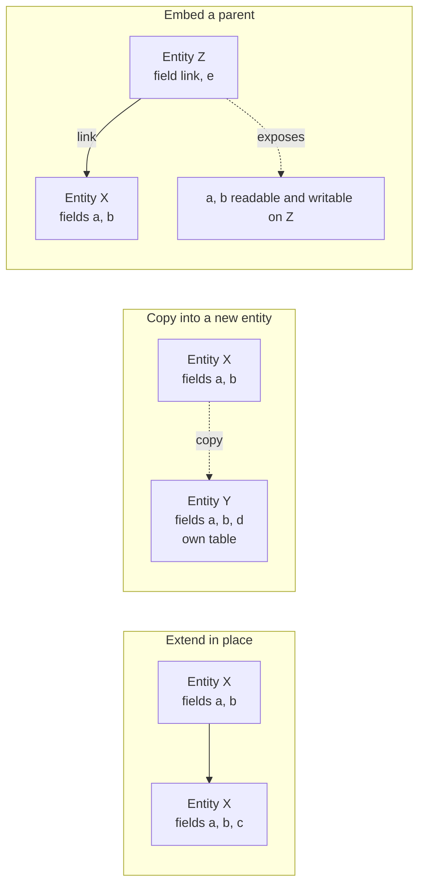

# Inheritance and extension

A capability package almost never works alone. It extends entities another package defined, adds fields to them, replaces or wraps their operations, inserts elements into their screens, adds rows to their reference data, grants additional access and adds sections to their printed documents. Every one of those is an **extension**, and all of them obey a small set of rules that this document specifies exactly.

Extension is what makes the system's shape possible: six hundred and twenty packages contribute to one coherent application without any of them being modified. A rebuild that reproduces the entities and the screens but not the extension mechanism will not be able to install the catalogue, because more than a third of the packages exist only to extend two others.

Read [the architecture](architecture.md) and [the entity and field system](entity-and-field-system.md) first.

---

## Table of contents

1. [The three entity-level mechanisms](#1-the-three-entity-level-mechanisms)
2. [Extending an entity in place](#2-extending-an-entity-in-place)
3. [Copying a definition into a new entity](#3-copying-a-definition-into-a-new-entity)
4. [Embedding a parent record](#4-embedding-a-parent-record)
5. [Adopting an abstract behaviour](#5-adopting-an-abstract-behaviour)
6. [Composition: how the resolved definition is built](#6-composition-how-the-resolved-definition-is-built)
7. [Extending fields](#7-extending-fields)
8. [Extending operations](#8-extending-operations)
9. [Extending views](#9-extending-views)
10. [Extending data](#10-extending-data)
11. [Extending security](#11-extending-security)
12. [Extending printable documents](#12-extending-printable-documents)
13. [Extending rendering templates and assets](#13-extending-rendering-templates-and-assets)
14. [Resolution order](#14-resolution-order)
15. [What an extension may and may not rely on](#15-what-an-extension-may-and-may-not-rely-on)
16. [Error conditions and messages](#16-error-conditions-and-messages)
17. [Acceptance criteria](#17-acceptance-criteria)

---

## 1. The three entity-level mechanisms

Three distinct mechanisms exist at the entity level. They are frequently confused, and confusing them produces a rebuild that behaves differently.

| Mechanism | What the declaration says | What happens to the entity | What happens to the tables |
|---|---|---|---|
| **Extend in place** | "I extend the entity named X" and declare no new name | The single entity X gains everything declared | X's table gains the new columns |
| **Copy into a new entity** | "I am a new entity named Y and I inherit from X" | A new, independent entity Y is created carrying a copy of X's definition | Y gets its own table, containing its own copies of X's columns |
| **Embed a parent** | "I am entity Z and I embed a record of X through this many-to-one" | Z exposes X's fields as its own, but does not own them | Z's table holds only the link; the values stay in X's table |



A fourth mechanism, **adopting an abstract behaviour**, is a special case of copying: the source entity has no table, so the copy is the only place the fields exist.

---

## 2. Extending an entity in place

### 2.1 The declaration

A package declares that it extends an existing entity by naming it and declaring no new transport name. There is no limit on how many packages may extend the same entity; the shipped catalogue has entities extended by more than forty packages.

### 2.2 What an extension may contribute

| Contribution | Effect |
|---|---|
| A new field | Added to the entity; a stored one gets a column on the existing table |
| A redeclaration of an existing field | Layered over the existing declaration, attribute by attribute |
| A new operation | Available on the entity |
| A redeclaration of an existing operation | Replaces it, with the ability to call the previous definition ([section 8](#8-extending-operations)) |
| A new computation, validation, deletion guard or reaction rule | Runs in addition to the existing ones |
| A new database constraint or index | Applied to the existing table |
| A change to an entity attribute — the default ordering, the display-name field, the name-search fields, the description, the table name, whether audit fields are kept, whether company consistency is checked automatically | Replaces the previous value |
| A new embedded parent | Adds the parent's fields to the entity |
| Adoption of an abstract behaviour | Adds that behaviour's fields and operations |

### 2.3 What an extension may not do

Three transformations are refused at registry build time, because they would change the nature of the entity underneath every package that already relies on it:

| Attempt | Message |
|---|---|
| Turn an abstract entity into a concrete one | "\<definition\> transforms the abstract model '\<name\>' into a non-abstract model. That class should either inherit from AbstractModel, or set a different '_name'." |
| Turn a transient entity into a persistent one | "\<definition\> transforms the transient model '\<name\>' into a non-transient model. That class should either inherit from Model, or set a different '_name'." |
| Turn a persistent entity into a transient one | "\<definition\> transforms the model '\<name\>' into a transient model. That class should either inherit from TransientModel, or set a different '_name'." |

An extension also may not remove a field. It can make a field invisible, read-only, or restricted to a group that nobody belongs to, but the column stays and every package that reads the field keeps working. Removing a field is only possible by removing the package that declared it.

### 2.4 Ordering

Extensions of one entity are composed in **package installation order**, which is the order of [the package system, section 6](package-system.md#6-installation-order): by phase, then by depth from the foundation package, then by sort name. An extension therefore always sees the contributions of every package it depends on, and never sees the contributions of packages that do not depend on it and are not depended on by it — except by accident of ordering, which [section 15](#15-what-an-extension-may-and-may-not-rely-on) forbids relying on.

### 2.5 A worked example

Package `alpha` defines Order (`alpha.order`, table `alpha_order`) with fields `name` (name) and `amount` (amount).

Package `beta` extends Order, adding `discount` (discount) and redeclaring `amount` as computed from `discount`.

Package `gamma` extends Order, adding `note` (note) and redeclaring `discount` as required.

The resolved entity has four fields: `name`, `amount` (computed), `discount` (required) and `note`. The table `alpha_order` has four columns plus the identifier and the audit columns. There is exactly one entity, one table, and one place where an Order lives. Removing `gamma` removes `note`, drops its column and removes the required flag from `discount`; `beta`'s computation of `amount` survives.

---

## 3. Copying a definition into a new entity

### 3.1 The declaration

A package declares a **new** transport name **and** declares that it inherits from one or more existing entities. The result is a new, independent entity whose definition starts as a copy of the named ones.

### 3.2 Semantics

1. The new entity gets **every field** of each named entity, as its own fields on its own table.
2. It gets every operation, every computation, every validation, every deletion guard and every reaction rule.
3. It does **not** get the records. The two entities have separate tables and separate rows.
4. Later extensions of the source entity **are** visible in the copy, because the composition is by reference to the source's resolved definition, not by a snapshot taken at declaration time. Adding a field to the source adds it to the copy too, with a column on the copy's table.
5. The copy may then redeclare anything it inherited.
6. When several sources are named and two of them declare the same field, the **last** named source wins.

### 3.3 When to use it

Copying is right when two things genuinely share a shape but must not share rows: a template and the thing made from it, a historical snapshot and the live record, a draft and the final. It is wrong when the two things are the same thing seen from two angles — that is what embedding is for.

Copying is also the mechanism behind adopting an abstract behaviour, which is by far its most common use: the messaging behaviour, the activity behaviour, the avatar behaviour and the website-publication behaviour are all abstract entities copied into hundreds of concrete ones.

### 3.4 Interaction with extension in place

A package may, in one declaration, both create a new entity **and** name the new entity's own transport name among its sources. That means "extend the entity I am also defining", which is how an entity can be declared in one place and extended in another within the same package. The composition treats the self-reference by folding in the entity's existing definition rather than creating a cycle.

---

## 4. Embedding a parent record

### 4.1 The declaration

An entity declares, for each parent it embeds, the parent's transport name and the name of a **many-to-one field on this entity** that points at the parent record.

The named field must exist and must be a many-to-one; otherwise the registry build fails with a message stating that the many-to-one field definition for the embedding reference is missing, naming the field and the entity.

### 4.2 Semantics

1. Every field of the parent that this entity does not declare itself becomes available on this entity as an **exposed field**: reading it reads the parent's value, writing it writes the parent's value.
2. An exposed field is implemented as a related field over the path consisting of the link field and the parent's field name, with three specific properties:
   - **it does not bypass access checks**, unlike an ordinary related field, so reading an exposed field enforces the parent's access rules;
   - it is copied if and only if the parent's field is copied;
   - it is read-only if and only if the parent's field is read-only.
3. An exposed field that is **required** on the parent becomes required here too.
4. A field this entity declares itself **shadows** the parent's field of the same name; the parent's value is then reachable only through the link.
5. When two embedded parents declare the same field name, the **last** parent in the declaration order wins.
6. The link field implies **bypassing access checks on traversal** ([entity and field system, section 7.6](entity-and-field-system.md#76-bypassing-access-on-traversal)), because the parent record is conceptually part of this record.
7. Embedding is transitive: embedding an entity that itself embeds another exposes both levels' fields.

### 4.3 Creation

Creating a record of an embedding entity is a two-stage operation:

1. The supplied values are partitioned: values naming exposed fields go to the parent, everything else stays.
2. For each embedded parent, in declaration order:
   - if the creation **supplied the link**, the existing parent record is written with the parent's share of the values;
   - if it did not, a parent record is **created** with the parent's share, and the link is set to it.
3. The record itself is then created with its own share plus the links.

Two consequences:

- Creating a record of an embedding entity without supplying the link **creates a parent record**. That parent is a real record of the parent entity and appears in the parent entity's searches.
- Supplying the link means "attach to this existing parent", and the parent's fields are then *updated*, not created. Supplying the link and also supplying an exposed field therefore modifies the shared parent, which is visible to every other record embedding it.

### 4.4 Defaults

When resolving defaults for an embedding entity, an exposed field the acting user may write is delegated to the parent entity, whose own default resolution runs and whose results are merged in ([entity and field system, section 13.1](entity-and-field-system.md#131-the-resolution-order), rule 5). Defaulting is skipped for parents whose link was supplied ([13.3](entity-and-field-system.md#133-defaults-during-creation)).

### 4.5 Duplication

Duplicating a record of an embedding entity:

1. The link field itself is never copied.
2. If the caller supplies a value for the link, every field of that parent is excluded from the copy, because the caller has said which parent to attach to.
3. If the caller does not, the parent's copyable fields are copied into the values, so a new parent record is created for the copy.
4. Fields the embedding entity redeclares itself are treated as its own, not the parent's.

### 4.6 External identifiers

When a record of an embedding entity is created from a data file and its parent was created implicitly, the parent receives its own external identifier, derived from the child's ([package system, section 9.6](package-system.md#96-identifiers-for-embedded-parents)). Without it the parent would survive the removal of the package that caused it to exist.

### 4.7 Orphan cleanup

The orphan cleanup of a package update keeps an implicitly created parent alive as long as at least one child record referring to it was loaded in that build ([package system, section 10.3](package-system.md#103-orphan-cleanup), rule 4).

### 4.8 Where embedding is used

Embedding exists for the case where one real-world thing is recorded from two angles, one of which is shared. The shipped catalogue uses it for: a user embedding a party, so that a user has a name, an address and an electronic mail address without duplicating them; a product variant embedding a product template; and a stock quantity package embedding a package kind. In each case the embedded record is meaningful on its own and may be shared.

### 4.9 Embedding against copying

| Question | Embedding | Copying |
|---|---|---|
| How many rows for one real-world thing | Two, linked | One |
| Can the shared part be reused by several children | Yes | No |
| Does changing the shared part affect every child | Yes | Not applicable |
| Extra join on every read of an exposed field | Yes | No |
| Can a child exist without the parent | No | Not applicable |

---

## 5. Adopting an abstract behaviour

An abstract entity is a package of fields, operations, computations, validations and defaults with no table. An entity **adopts** it by naming it as a source, exactly as in [section 3](#3-copying-a-definition-into-a-new-entity).

Rules:

1. Every field the abstract entity declares becomes a real field with a real column on the adopting entity's table.
2. Every operation becomes available, and may be redeclared by the adopting entity with the call-the-previous-definition contract of [section 8](#8-extending-operations).
3. An abstract entity may itself adopt another abstract entity.
4. An abstract entity may **not** inherit from a concrete one; the attempt is refused with **"In "** the definition **", abstract model '"** the name **"' cannot inherit from non-abstract model '"** the source name **"'."**
5. An abstract entity may be **extended in place** like any other, and the extension reaches every entity that has adopted it — including entities in packages that know nothing about the extension. This is the most powerful and the most dangerous extension point in the system: adding a required field to a widely adopted abstract entity adds a required column to hundreds of tables.

The adoption contract — what an entity must provide when it adopts the messaging behaviour, what it gains, and what it must be careful about — is specified in [the messaging model](messaging-model.md).

---

## 6. Composition: how the resolved definition is built

### 6.1 The composition order

For one entity, the contributions are composed so that **later contributions override earlier ones**, where "later" means "declared by a package installed later". The resulting order of precedence, from highest to lowest:

1. The entity's own latest extension.
2. Earlier extensions of the entity, most recent first.
3. The entity's original definition.
4. The sources named by a copying declaration, **last named first**.
5. Those sources' own extensions and sources, recursively, by the same rule.
6. The foundation entity that every entity implicitly inherits from, which supplies the generic operations.

When an entity both extends itself and names other sources, its own accumulated definition is spliced in at the point where it is named.

### 6.2 Worked example of the precedence order

Given:

- package one defines entity `a`;
- package two defines entity `b`;
- package three extends `b` and names `a` as an additional source;
- package four extends `a`.

The precedence order for `a` is: package four's extension, then package one's definition, then the foundation entity.

The precedence order for `b` is: package three's contribution, then package two's definition, then the whole of `a`'s order — package four's extension, package one's definition — then the foundation entity.

Reading it as an operation lookup: an operation declared by package three wins over one declared by package two, which wins over one declared by package four on `a`, which wins over one declared by package one. Note the consequence: **an extension of `a` does not win over `b`'s own definition**, even though the extension is "more recent". Precedence follows the composition structure, not chronology.

### 6.3 Entity attributes under composition

Entity attributes are resolved by taking the **last non-empty** declaration in composition order, from lowest precedence upward:

| Attribute | Resolution |
|---|---|
| Description | The last non-empty declaration. An entity with none at all records a warning naming it. |
| Table name | The last non-empty declaration; otherwise the transport name with dots replaced by underscores. |
| Audit fields kept | The last explicit declaration; otherwise true for a persistent or transient entity, false for an abstract one. |
| Embedded parents | The **union** of every declaration, later ones overriding the link field for a parent already named. |
| Declared query dependencies | The union, with the field lists concatenated. |
| Default ordering, display-name field, name-search fields, parent field, archive field, fold field, company-consistency flag, privileged-command flag | The last declaration wins. |

A transient entity that turns audit fields off is rejected, because the housekeeping policy needs the last-modification stamp: **"TransientModels must have log_access turned on, in order to implement their vacuum policy"**.

### 6.4 When composition runs

Composition runs during the registry build, once per package that touches the entity, and again for every entity that extends or embeds a touched entity. See [the architecture, section 5](architecture.md#5-how-installed-packages-build-the-registry).

---

## 7. Extending fields

### 7.1 Adding a field

An extension declares a field the entity does not have. It is added, and if stored it gets a column during schema synchronisation. There is nothing else to say: the field belongs to the extending package, is recorded in the field catalogue against it, and is dropped when the package is removed.

### 7.2 Redeclaring a field

An extension declares a field the entity already has. The declarations are **layered**: the resolved field takes, for each attribute, the value from the highest-precedence declaration that gives one explicitly. Attributes nobody gives explicitly take the type's default.

This is attribute-level, not declaration-level, merging. An extension that redeclares a field solely to add a help text does not lose the original's computation, dependencies, default or group restriction.

**Three rules govern the layering.**

1. **A type change discards everything below it.** If a redeclaration uses a type incompatible with the one below, every attribute collected so far is discarded and layering restarts from that declaration. Changing a field's type is therefore possible, but it is a fresh start, not a modification.
2. **Derived defaults are applied after layering**, not per layer. Adding a computation in the top layer correctly makes the resolved field non-stored, elevated, not copied and read-only, unless a layer says otherwise. Conversely, adding a storage declaration in the top layer over a computation declared below correctly produces a stored computed field.
3. **The field's owning package is the highest-precedence layer that declared it**, and the set of contributing packages is the union of all layers' packages. Both are recorded in the field catalogue, which is what lets the field survive the removal of one contributing package.

### 7.3 What redeclaring can and cannot change

| Change | Possible | Notes |
|---|---|---|
| Add or change a label or help text | Yes | |
| Make a field required | Yes | The not-null constraint is added at the next schema synchronisation, and fails silently with a warning if existing rows violate it |
| Make a field not required | Yes | The constraint is dropped |
| Add or change an index | Yes | |
| Add or change a default | Yes | Declaring the default explicitly absent removes an inherited default |
| Add a computation to a plain field | Yes | The field becomes computed; if it was stored and stays stored, its column is kept and it is now maintained by recomputation. Existing rows are **not** recomputed unless the package's installation explicitly triggers it |
| Remove a computation | Yes, by redeclaring the field without one and with storage on | |
| Add a group restriction | Yes | |
| Change the type | Yes, with the discard rule of 7.2 | The column is converted during schema synchronisation where the conversion is expressible, and otherwise the column is recreated and the data lost |
| Change the target entity of a relational field | Yes | Existing identifiers then point at the wrong entity; a package doing this must migrate the data itself |
| Change the deletion behaviour of a many-to-one | Yes | The foreign key is recreated |
| Remove the field | **No** | |

### 7.4 Extending a computation's dependencies

When an extension changes what a computation reads, the computation's dependencies must change too. Two ways:

1. **Declare the dependencies on the field.** Dependencies declared on the field take priority over those declared on the rule, so an extension can restate the complete list.
2. **Redeclare the rule with its own dependency declaration.** When several packages contribute a rule with the same name, the dependencies of **all** of them are collected and unioned. An extension therefore *adds* dependencies by declaring a rule with the extra ones, without having to know the original list.

The second is preferred: the first requires the extension to know and restate a list it does not own.

### 7.5 Extending a selection

A selection field's set of codes is extended without redeclaring the whole list. The extension names the codes to add and, for each, the code it should follow; a code with no such anchor is appended.

Rules:

1. Added codes are recorded as records of the selection catalogue, owned by the extending package, so removing the package removes them.
2. A selection value record may declare what happens to rows holding it when it is removed: leave them, clear the field, set another code, or delete the rows.
3. Redeclaring the whole selection **replaces** it, which drops the codes other packages added. An extension should therefore add rather than redeclare.

### 7.6 Extending an entity's constraints

An extension adds database constraints and indexes by declaring them; each is applied under a name derived from the table and the declared local name. Two packages declaring the same local name on the same entity produce the same database name and the constraint is applied once; the definition used is the one from the highest-precedence declaration, and if it differs from what exists the constraint is dropped and recreated.

An extension cannot remove a constraint declared by another package except by redeclaring it with a definition that is always satisfied.

---

## 8. Extending operations

### 8.1 The mechanism

An extension declares an operation with the same name as one that already exists. The new declaration **replaces** the old in the composition, and the old one remains reachable as "the previous definition".

The contract is:

> An extension of an operation receives the same receiver and the same arguments as the original, may do work before and after, must call the previous definition exactly once unless it is deliberately suppressing it, and must return a value compatible with the original's contract.

### 8.2 The call-the-previous-definition contract in detail

| Obligation | Why |
|---|---|
| Call the previous definition, unless deliberately suppressing it | Every other extension of the same operation, including ones installed later and ones the author has never seen, is somewhere in that chain. Not calling it silently disables them. |
| Call it **once** | Calling it twice performs the underlying effect twice. |
| Pass the same receiver | An extension that narrows the receiver before calling silently excludes records from every lower extension. Narrowing is legitimate when that is the point, but it must be intended. |
| Pass the arguments through, including ones the extension does not understand | A later package may add an argument that a lower extension reads. |
| Return a value of the declared shape | Callers, including other extensions, rely on it. |
| Not change the type of the return value | An extension that returns a different shape breaks every caller. |

### 8.3 The three shapes of an extension

**Before.** Do work, then call the previous definition, then return its result. Used for validation, for enriching the arguments, and for preparing state.

**After.** Call the previous definition, then do work on its result, then return. Used for side effects that need the operation to have succeeded — creating a message, scheduling a follow-up, writing a linked record.

**Around.** Do work, call the previous definition possibly with changed arguments, then do more work. Used when the extension must see both sides, for example to compare a value before and after.

A fourth shape, **suppress**, does not call the previous definition at all. It is legitimate only when the extension genuinely replaces the behaviour, and it is the most fragile thing a package can do, because it silently disables every other extension of that operation.

### 8.4 Extending a computation

A computation is an operation and follows the same contract, with one refinement: because a computation assigns fields rather than returning a value, an extension usually calls the previous definition first and then adjusts the assigned values.

An extension that wants to compute *more* fields with the same rule declares them as computed by that rule; they then form one group and are all computed in one invocation.

### 8.5 Extending a validation, a reaction rule or a deletion guard

These are **additive by declaration**, not by overriding: declaring a new rule adds it to the set that runs. An extension therefore does not need to call anything. The set is collected across the whole composition, and each member runs when its declared trigger fires.

An extension can neutralise an existing validation only by redeclaring the rule with the same name and not calling the previous definition.

### 8.6 Extending the generic operations

The generic operations — create, read, write, delete, search, copy, describe fields, default values, on-change — are ordinary operations and are extended the same way. This is how a capability makes every write on an entity also record a message, or makes every search on an entity restrict itself further.

Three cautions, all of which a rebuild must reproduce as constraints on extension authors rather than as enforcement:

1. **Creation and write receive batches.** An extension that assumes one record will misbehave on a batch.
2. **Creation receives a list of value mappings**, and must return the created record set in the same order.
3. **Extending the search operation** to add a condition is usually wrong; the right place is a record rule, which is applied uniformly, is visible in the security catalogue, and does not fire for privileged operations. Extending search hides the restriction from the security model.

### 8.7 Registering behaviour at registry-ready time

Some extensions cannot be expressed as a redeclaration — for example patching an operation of an entity the package must not depend on, or registering the package in a shared dispatch table. For these, every entity is given the chance to install and uninstall runtime hooks:

- the install hook runs exactly once when the registry becomes ready, after every package has been loaded;
- the uninstall hook runs at the start of a registry setup on an already-ready registry, so that the previous installation is undone before the next one.

Anything installed this way is process state, not tenant state, and must therefore be identical for every tenant the worker serves.

---

## 9. Extending views

A **view** is a stored record holding a declarative description of a screen. Extending a view means inserting, removing or modifying nodes of another view's description without editing it. This is the most heavily used extension point in the system, and its grammar is specified here exactly.

The view kinds and their own grammars are in [views and actions](views-and-actions.md); this section is only about inheritance.

### 9.1 The two modes

A view record declares an inheritance target and a **mode**:

| Mode | Meaning |
|---|---|
| Extension | The view's content is a list of change specifications applied to the target's combined description. The view is not itself a screen; it has no independent existence. |
| Primary | The view is a screen in its own right, whose description **starts** as the target's combined description and is then modified by this view's specifications. Used for a variant of a screen — a different entity, a different context, a different site. |

A view that declares no target is a **root** view and is always primary.

### 9.2 The combination algorithm

**Preconditions.** A primary view *V*, and the set of views that inherit from it directly or indirectly, each with its mode and its priority.

**Postcondition.** One combined description.

**Algorithm.**

1. Start with *V*'s own description.
2. Build the child list of every view: its direct children, ordered by priority ascending, then by identifier ascending. Within one parent, extension children sort before primary children.
3. Walk the tree depth-first with a double-ended queue seeded with *V*'s children, sorted so that extension children come first:
   1. Take the view at the front of the queue.
   2. Apply its specifications to the combined description ([9.4](#94-the-application-algorithm)).
   3. Push its own children: **extension** children at the **front**, so that they are applied immediately and depth-first; **primary** children at the **back**, so that they are applied only after every extension of the current primary view has been applied.
4. The result is the combined description.

The front/back distinction is the whole point: a primary child must see the *fully extended* version of its parent, not a partially extended one. A rebuild that applies children in a single order will produce different screens whenever a primary variant and an extension of the same base both exist.

**Worked example.** Views: 1 is primary with children 2 and 3; 2 has children 4 (primary) and 5; 4 has child 6; 5 has children 7 and 8.

Traversal order of the queue, showing the view processed and the queue afterwards:

| Processed | Queue after |
|---|---|
| 1 | 2, 3 |
| 2 | 5, 3, 4 |
| 5 | 7, 8, 3, 4 |
| 7 | 8, 3, 4 |
| 8 | 3, 4 |
| 3 | 4 |
| 4 | 6 |
| 6 | — |

View 4 is primary, so it is deferred to the back and applied after every extension of view 1 — that is, after 2, 5, 7, 8 and 3.

### 9.3 Priority

Each view carries an integer priority, defaulting to sixteen. Among the children of one parent, lower priority is applied first. Priority is therefore the only lever an extension has over the order in which sibling extensions apply, and it is a blunt one: an extension that must apply after another should declare a dependency on that other package and rely on installation order, not on a priority number.

### 9.4 The application algorithm

**Input.** A source description and a specification tree.

**Algorithm.** Process the specification's children as a queue, in order:

1. A node whose name is the grouping name contributes its own children to the queue in place and is otherwise ignored. This lets one view carry several independent specifications.
2. For every other node, **locate** the matching node in the source ([9.5](#95-node-matching)).
3. If no node matches, fail with **"Element '"** the node rendered as an opening tag with all its attributes except the position **"' cannot be located in parent view"**.
4. Otherwise apply the node's **position** ([9.6](#96-the-position-grammar)).

### 9.5 Node matching

The specification node names the node to find, by one of three strategies:

| Specification node | Match |
|---|---|
| A path expression node, carrying an expression attribute | The **first** node of the source selected by the expression. A missing expression attribute fails with **"Missing 'expr' attribute in xpath specification"**. An expression that does not parse fails with **"Invalid Expression while parsing xpath “"** the expression **"”"**. |
| A field node | The **first** field node of the source whose name attribute is equal. Only the name is compared; other attributes are ignored, because a field appears at most once at a given level of a view. |
| Any other node | The **first** node of the source with the same node name **all** of whose attributes, except the position, are equal to the specification's. |

Three consequences:

1. **Matching is by first occurrence.** A specification that could match two nodes silently takes the first.
2. **Matching a field by name is global within the view**, not scoped to a section. Two fields with the same name in one view make field-name matching ambiguous; a path expression must be used.
3. **Attribute matching is exact and total over the specification's attributes.** Adding an attribute to the specification narrows the match; it does not loosen it.

### 9.6 The position grammar

The matched node is modified according to the specification node's position attribute, which defaults to *inside*.

| Position | Effect |
|---|---|
| `inside` (default) | The specification's children are appended as the last children of the matched node. |
| `before` | The specification's children are inserted immediately before the matched node, as siblings. |
| `after` | The specification's children are inserted immediately after the matched node, as siblings. |
| `replace` | See [9.7](#97-replace). |
| `attributes` | See [9.8](#98-attributes). |
| anything else | Fails with **"Invalid position attribute: '"** the value **"'"**. |

Whitespace handling: when children are inserted, the text between them is normalised so that the result is not littered with the specification's indentation.

### 9.7 Replace

Replace has two modes, selected by a mode attribute defaulting to the outer form.

**Outer replacement.** The matched node is removed and the specification's children take its place.

1. Any element in the specification whose text is the placeholder marker is replaced by a **copy of the matched node**. This is how a view wraps an existing element: the specification contains the wrapper with the marker inside it, and the marker becomes the original node.
2. If the matched node is the **root** of the source, the source becomes the specification's first non-comment child. The root's template name attribute, if any, is preserved on the new root; a leading comment in the specification is reattached.
3. Otherwise the specification's children are inserted before the matched node and the matched node is removed.
4. A child of the specification carrying the move position is **extracted** from the source at its current location and inserted here instead of being created new. See [9.9](#99-move).

**Inner replacement.** The matched node is kept, and its **children** are replaced by the specification's children. A sentinel is used so that a child carrying the move position can move an existing child of the matched node into the new content: the new content is inserted before the sentinel, then everything from the sentinel onward — the old children — is removed.

Replacing a node is the most disruptive extension: it removes whatever other packages had inserted inside the replaced node. An extension that replaces should be sure it is the only one that will.

### 9.8 Attributes

The specification's children must all be attribute nodes. Each names one attribute of the matched node and either sets it, or adds to and removes from it.

| Form | Effect |
|---|---|
| Attribute node with text | The attribute is set to the text. An empty text **removes** the attribute. |
| Attribute node with an add or a remove attribute | The attribute's current value is treated as a list, the removals are taken out, the additions are appended, and the result is written back. An empty result removes the attribute. |

Any attribute on an attribute node other than the name, the addition, the removal, the separator and the branding attributes is refused with **"Invalid attributes "** the names **" in element <attribute>"**. An attribute node combining text with an addition or removal is refused with **"Element <attribute> with 'add' or 'remove' cannot contain text "** the text.

**List semantics depend on the attribute.**

*Ordinary attributes* — a class list, a group list, an option list — are split on a separator, defaulting to the comma. A separator of a single space means "squash spaces": the value is split on any whitespace and rejoined with single spaces. Values are trimmed; removals are matched after trimming; additions are appended in order; empty entries are dropped.

```formula
new_value = join( separator , [ v for v in split(old_value, separator) if v ≠ "" and v ∉ removals ] + additions )
```

*Condition attributes* — the attributes holding a logical expression, such as the visibility condition, the read-only condition, the required condition, the column-invisibility condition, and every decoration attribute — are combined logically instead. The separator attribute is mandatory and must be either the conjunction word or the disjunction word; anything else is refused with **"Invalid separator "** the separator **" for python expression "** the attribute **"; valid values are 'and' and 'or'"**.

- **Removal** of expression *R* from value *V*: if *V* is exactly *R*, possibly wrapped in parentheses, the value becomes empty. Otherwise the first occurrence of *R* joined to the rest by the separator — tried in four bracketing forms, parenthesised then bare, before then after — is cut out.
- **Addition** of expression *A* to value *V*: the result is *V* parenthesised, the separator, and *A* parenthesised. If *V* was empty, the result is simply *A*.

```formula
combined_condition = "(" + old_condition + ") " + separator + " (" + added_condition + ")"
```

Worked example. A field's visibility condition is `state == 'draft'`. An extension adds `amount > 0` with the conjunction separator. The result is `(state == 'draft') and (amount > 0)`. A second extension removes `amount > 0` with the same separator: the pattern `" and (amount > 0)"` is found and cut, leaving `(state == 'draft')`.

### 9.9 Move

A specification child carrying the move position **relocates an existing node** rather than creating one. It is only valid inside an insertion position — inside, before, after, or a replacement — and it must be a leaf: a move node with children is refused with **"Invalid specification for moved nodes: “"** the node **"”"**.

The move node is matched against the source by the rules of [9.5](#95-node-matching), removed from its current location, and inserted at the position being processed. A move node that matches nothing is refused with **"Element “"** the node **"” cannot be located in parent view"**.

Move is how an extension reorders a screen without replacing it, which preserves other extensions' insertions.

### 9.10 Validation of the result

After combination, the result is validated against the view kind's schema and against the entity: every field named must exist, every operation bound to a button must exist and be callable, every group named must exist, and the structure must match the kind's rules.

Validation is **partial** during a package update: only the nodes contributed by the views being validated are checked, which is achieved by flagging the inserted nodes, the attribute-modified nodes, and — when any specification uses replacement — the whole result, since a replacement can invalidate anything.

A view whose combination fails is reported with the file, the line and the serialised node, and the package update fails.

### 9.11 Views that extend across entities

A view's target entity may differ from its parent's. A primary view inheriting a view of entity A but declaring entity B produces a screen for B built from A's layout. This is used where two entities have a deliberately identical screen. Field names must exist on the declared entity; validation enforces it.

### 9.12 Tenant-local copies

Some views are copied per site or per tenant. A copy has no external identifier but carries a key beginning with the originating package's name and a dot; removing the package removes the copies by key ([package system, section 16.3](package-system.md#163-what-removal-does-to-records-and-columns), step 4).

---

## 10. Extending data

### 10.1 Adding records

A package adds records to another package's reference data simply by declaring them in its own data files, with its own external identifiers. Nothing special is needed: a package adding a country-specific tax adds tax records.

### 10.2 Modifying another package's records

A package modifies a record another package owns by declaring a record node whose external identifier names the other package. Rules:

1. The other package must be installed; otherwise the load fails.
2. The record must exist, unless the node forces creation.
3. Only the fields the node declares are written. A record node is a partial update, not a replacement.
4. The modification is applied on **every** install and update of the modifying package, in the order of the packages. A package installed later therefore wins.
5. If the record is marked not updatable, an update of the **owning** package will not touch it, but the modifying package's data file still writes it, because the flag is consulted only for the owner.

### 10.3 Deleting another package's records

A package may delete records with a delete node, naming either an external identifier or a filter. This is a blunt instrument: the record is gone for every package. A package that merely wants to hide a record should archive it instead.

### 10.4 Extending a menu tree

A package inserts menus under another package's menus by naming the parent's external identifier. Menus are ordinary records, so all the rules above apply. Removing the package removes its menus and leaves the parent's.

### 10.5 Reference data ownership

The record belongs to whichever package's external identifier points at it. When two packages both claim a record, it survives the removal of either ([package system, section 16.3](package-system.md#163-what-removal-does-to-records-and-columns), step 3.1).

---

## 11. Extending security

### 11.1 Adding groups

A package declares groups. A group declared by a package may **imply** groups declared by other packages, which is how a new role is placed into an existing hierarchy.

### 11.2 Adding a group to an existing group's implications

A package extends an existing group by adding implications to it through an ordinary record update: it names the other package's group and adds implied groups with a relational add command rather than a replace command, so that other packages' additions survive.

### 11.3 Adding access rights

A package declares access rights for the entities it introduces, and additional access rights for entities other packages introduced. Access rights are purely additive: a user who is granted an operation by any applicable right may perform it. A package therefore **cannot remove** access another package granted; it can only avoid granting more.

### 11.4 Adding record rules

Record rules are **restrictive**, and their combination is specified in [the security model](security-model.md#5-record-rules). A package adding a rule therefore restricts, and a package cannot loosen another's rule except by adding a rule in the same group, because rules attached to groups combine by disjunction within the set of the user's groups.

### 11.5 Restricting a field

A package restricts an existing field to groups by redeclaring the field with a group restriction. This is a field redeclaration and follows [section 7.2](#72-redeclaring-a-field): the restriction replaces any previous one rather than adding to it.

### 11.6 Adding fields to a view for one group only

A view specification may carry a group condition on the inserted nodes, which the view combination keeps and which the view resolution then applies per user. This is presentation-level only; it does not restrict the field at the entity level, and a user outside the group can still read the field over the transport unless the field itself is restricted.

---

## 12. Extending printable documents

A printable document is produced by a **report definition** record naming a rendering template, and the template is an ordinary rendering template that can be extended by the mechanism of [section 13](#13-extending-rendering-templates-and-assets).

A package extends a printed document by:

| Goal | Mechanism |
|---|---|
| Add a section to an existing document | Extend its rendering template with an insertion specification |
| Change the page furniture of every document | Extend the shared layout template |
| Add a document for an entity | Declare a new report definition bound to the entity |
| Change which paper format a document uses | Update the report definition record |
| Add data to what the document renders | Extend the operation that prepares the rendering values, following the call-the-previous-definition contract |

Because report definitions are records and templates are records, all of this is ordinary data extension.

---

## 13. Extending rendering templates and assets

### 13.1 Rendering templates

A rendering template is a record whose content is a declarative description, exactly like a view, and whose extension uses the **same** node-matching and position grammar as [section 9](#9-extending-views). The differences are only in what the description means at render time.

A template carries a key of the form package name, a dot, and a local name. A template that extends another names it as its target and is combined in by the same algorithm, with the same priority rules.

### 13.2 Assets

Front-end assets are grouped into named bundles. A package contributes to a bundle by declaring, in its manifest, entries under the bundle's name. Each entry is either a path or an operation:

| Entry form | Effect |
|---|---|
| A path | Append the matching files to the bundle, in the order the paths resolve |
| Prepend and a path | Insert the matching files at the beginning of the bundle |
| Before, a target path and a path | Insert immediately before the target entry |
| After, a target path and a path | Insert immediately after the target entry |
| Replace, a target path and a path | Replace the target entry |
| Remove and a path | Remove the matching entries |
| Include and a bundle name | Splice another bundle in at this point |

Each entry becomes an asset contribution record owned by the declaring package, with a sequence derived from the package's position in the dependency order, so that a package's contributions come after those of every package it depends on. Removing the package removes its contributions and the bundle is rebuilt.

Assets may also be contributed as data records through the asset node of the data grammar, which is how a tenant-local customisation adds one file.

---

## 14. Resolution order

This section collects, in one place, the order in which conflicting contributions are resolved.

| Thing being resolved | Order |
|---|---|
| Entity attributes | Last declaration in composition order wins ([6.3](#63-entity-attributes-under-composition)) |
| Field attributes | Highest-precedence layer that gives the attribute explicitly wins; a type change discards lower layers ([7.2](#72-redeclaring-a-field)) |
| Operations | Highest-precedence declaration is entered first; it reaches lower ones by calling the previous definition ([8.1](#81-the-mechanism)) |
| Computation dependencies | Declared on the field, if declared there; otherwise the union of every contributing rule's declarations ([7.4](#74-extending-a-computations-dependencies)) |
| Validations, reaction rules, deletion guards | All of them run; order is composition order ([8.5](#85-extending-a-validation-a-reaction-rule-or-a-deletion-guard)) |
| Exposed fields from several embedded parents | Last parent in declaration order wins ([4.2](#42-semantics), rule 5) |
| Fields from several copied sources | Last source named wins ([3.2](#32-semantics), rule 6) |
| A field the entity declares against one it would inherit or expose | The entity's own declaration wins ([4.2](#42-semantics), rule 4) |
| View specifications among siblings | Priority ascending, then identifier ascending; extensions before primaries ([9.2](#92-the-combination-algorithm)) |
| View specifications across levels | Depth-first, extensions immediately, primaries deferred ([9.2](#92-the-combination-algorithm)) |
| Asset contributions | Package dependency order, then the manifest's own order, then the entry operations ([13.2](#132-assets)) |
| Data records | Package installation order; the last package to write a field wins ([10.2](#102-modifying-another-packages-records)) |
| Access rights | Additive; any grant suffices ([11.3](#113-adding-access-rights)) |
| Record rules | Restrictive; see [the security model](security-model.md#5-record-rules) |
| Translations | Package topological order; a dependent package's term overrides its dependency's ([package system, section 19](package-system.md#19-translations)) |

---

## 15. What an extension may and may not rely on

### 15.1 What it may rely on

1. **Everything its declared dependencies provide.** A package that depends on another may use every entity, field, operation, view, group and record that package defines, and may assume they are present and set up.
2. **The composition order relative to its dependencies.** A package is always composed after every package it depends on.
3. **The call-the-previous-definition chain.** Calling the previous definition reaches every lower extension, in composition order.
4. **Field attribute layering.** Redeclaring a field to change one attribute keeps everything else.
5. **The presence of the platform's automatic fields and generic operations on every entity.**
6. **That its own external identifiers are unique** within its own package name.

### 15.2 What it may not rely on

1. **The absence of other extensions.** Any number of packages may extend the same entity, operation or view. An extension must behave correctly when others have already run and when others run afterwards.
2. **Composition order relative to packages it does not depend on.** Two packages that do not depend on each other may compose in either order across installations, because the order depends on names and on what else is installed. An extension that needs to run after another must declare the dependency.
3. **A view's exact node structure.** Another extension may have inserted, moved or replaced nodes. A specification that matches by a long path expression is fragile; matching by field name or by a stable identifier attribute is robust.
4. **That a field it did not declare will keep its type, its storage or its computation.** Another package may redeclare it.
5. **That an operation's previous definition does anything in particular.** The chain may have been altered.
6. **That its extension of an abstract entity reaches only the entities it knows about.** Extending an abstract entity reaches every adopter, present and future, including ones in packages the author has never seen.
7. **The numeric identifiers of records.** Only external identifiers are stable.
8. **The order of a to-many field's values** unless the target entity's ordering says so.
9. **That its data-file records survive a user's editing.** Only records marked not updatable are protected from the package's own next update, and none are protected from a user deleting them.
10. **View priority as a coordination mechanism between unrelated packages.** Two packages both choosing priority ten remain ordered by identifier, which is an installation accident.

### 15.3 Rules of good extension

These are not enforced; they are the conditions under which the mechanisms above produce a system that can be assembled from six hundred packages.

1. **Add rather than replace.** Add a selection value rather than redeclaring the selection. Add a validation rather than suppressing one. Insert a view node rather than replacing its parent.
2. **Match views on stable anchors.** A field name or a named element, not a positional path.
3. **Declare every dependency you read.** Both package dependencies and computation dependencies.
4. **Never assume a single record.** Every operation receives a set.
5. **Keep an extension's effects inside its own concern.** An extension that writes records of an entity three packages away creates a coupling nobody can see.
6. **Prefer a record rule to an extension of the search operation**, a computed field to a reaction rule, and a database constraint to a declared validation, wherever the stronger mechanism can express the requirement.

---

## 16. Error conditions and messages

| Condition | Message |
|---|---|
| An extension turns an abstract entity concrete | "\<definition\> transforms the abstract model '\<name\>' into a non-abstract model. That class should either inherit from AbstractModel, or set a different '_name'." |
| An extension turns a transient entity persistent | "\<definition\> transforms the transient model '\<name\>' into a non-transient model. That class should either inherit from Model, or set a different '_name'." |
| An extension turns a persistent entity transient | "\<definition\> transforms the model '\<name\>' into a transient model. That class should either inherit from TransientModel, or set a different '_name'." |
| An abstract entity inherits from a concrete one | "In \<definition\>, abstract model '\<name\>' cannot inherit from non-abstract model '\<source\>'." |
| An entity inherits from an entity that does not exist | "Model '\<name\>' inherits from non-existing model '\<source\>'." |
| An entity extends itself but does not exist yet | "Model '\<name\>' does not exist in registry." |
| A transient entity turns audit fields off | "TransientModels must have log_access turned on, in order to implement their vacuum policy" |
| An embedding declaration names a field that is not a many-to-one | A message stating that the many-to-one field definition for the embedding reference is missing, naming the field and the entity |
| A related field's declared type differs from its target's | "Type of related field \<field\> is inconsistent with \<target\>" |
| A related field's path names a field that does not exist | "Field \<name\> referenced in related field definition \<field\> does not exist." |
| A view specification node matches nothing | "Element '\<opening tag\>' cannot be located in parent view" |
| A move node matches nothing | "Element “\<node\>” cannot be located in parent view" |
| A move node has children | "Invalid specification for moved nodes: “\<node\>”" |
| A path expression node has no expression | "Missing 'expr' attribute in xpath specification" |
| A path expression does not parse | "Invalid Expression while parsing xpath “\<expression\>”" |
| An unknown position value | "Invalid position attribute: '\<value\>'" |
| An unknown replacement mode | "Invalid mode attribute: “\<value\>”" |
| An attribute node carries unknown attributes | "Invalid attributes \<names\> in element <attribute>" |
| An attribute node combines text with an addition or a removal | "Element <attribute> with 'add' or 'remove' cannot contain text \<text\>" |
| An expression attribute is combined without a valid separator | "Invalid separator \<separator\> for python expression \<attribute\>; valid values are 'and' and 'or'" |

---

## 17. Acceptance criteria

### Extending in place

**AC-EXT-1.** *Given* entity `alpha.order` defined by package `alpha` with fields `name` and `amount`, and package `beta` extending it with `discount`, *when* both are installed, *then* one entity exists, its table has both original columns plus the new one, and one record set covers all of them.

**AC-EXT-2.** *Given* the same, *when* `beta` is removed, *then* the `discount` column is dropped and `alpha.order` remains with its two original fields.

**AC-EXT-3.** *Given* a package that declares an entity name already declared as abstract and does not declare itself abstract, *when* the registry is built, *then* the build fails with the message about transforming an abstract model.

**AC-EXT-4.** *Given* package `beta` redeclaring a field only to add a help text, *when* the registry is built, *then* the field keeps its original type, computation, dependencies, default and group restriction, and gains the help text.

**AC-EXT-5.** *Given* package `beta` redeclaring a text field as an integer, *when* the registry is built, *then* every attribute declared by the original is discarded and the field takes only `beta`'s declarations plus the integer type's defaults.

### Copying and adoption

**AC-EXT-6.** *Given* entity `alpha.thing` with two fields and entity `gamma.copy` declaring it as a source, *when* the registry is built, *then* `gamma.copy` has its own table with its own copies of both columns, and a record created in one is invisible in the other.

**AC-EXT-7.** *Given* the same, *when* package `delta` later extends `alpha.thing` with a third field, *then* `gamma.copy` also gains the third field and a third column.

**AC-EXT-8.** *Given* an abstract entity adopted by three entities, *when* the abstract entity is extended with a new stored field, *then* all three tables gain the column.

**AC-EXT-9.** *Given* two sources both declaring a field named `code`, named in the order first then second, *when* the registry is built, *then* the resolved field is the second source's.

### Embedding

**AC-EXT-10.** *Given* entity `child` embedding entity `parent` through the link field, and `parent` having a field `name`, *when* `name` is read on a child record, *then* the value comes from the parent record; *when* it is written, *then* the parent record is written.

**AC-EXT-11.** *Given* the same, *when* a child is created supplying a value for `name` and no link, *then* a parent record is created holding that name and the link points at it.

**AC-EXT-12.** *Given* the same, *when* a child is created supplying an existing link **and** a value for `name`, *then* no parent is created and the existing parent's name is changed.

**AC-EXT-13.** *Given* `parent.name` declared required, *when* the registry is built, *then* the exposed `name` on `child` is also required.

**AC-EXT-14.** *Given* `child` declaring its own field named `name`, *when* the registry is built, *then* `child.name` is `child`'s own field and the parent's name is reachable only through the link.

**AC-EXT-15.** *Given* a child record created from a data file with an implicitly created parent, *when* the package is removed, *then* the parent is removed too, because it received a derived external identifier.

**AC-EXT-16.** *Given* a child record duplicated with no override for the link, *when* the copy is made, *then* a new parent record is created for the copy. *Given* the duplication supplies the link, *then* no parent is created and none of the parent's fields are copied.

**AC-EXT-17.** *Given* a user without read access to the parent entity, *when* an exposed field is read on a child, *then* the read is refused — exposed fields do not bypass access checks.

### Operations

**AC-EXT-18.** *Given* three packages each extending the same operation and each calling the previous definition once, *when* the operation is invoked, *then* all three run, in reverse composition order entering and forward order leaving, and the base runs once.

**AC-EXT-19.** *Given* the middle extension not calling the previous definition, *when* the operation is invoked, *then* the base and the lowest extension do not run.

**AC-EXT-20.** *Given* an extension of the creation operation that assumes one value mapping, *when* a creation of three records is invoked, *then* the defect is in the extension: the specified contract is that creation receives a list and returns the created set in input order.

**AC-EXT-21.** *Given* a package declaring an additional validation on an entity, *when* the entity is written, *then* both the original and the additional validation run.

### Views

**AC-EXT-22.** *Given* a primary view 1 with extension children 2 and 3 and primary child 4, *when* the combined description is produced, *then* 2 and 3 are applied to 1 before 4, and 4 sees the result of both.

**AC-EXT-23.** *Given* two extension children of the same parent with priorities 10 and 20, *when* the combination runs, *then* the priority-10 one is applied first.

**AC-EXT-24.** *Given* a specification naming a field node by name where the source has that field twice, *when* the combination runs, *then* the first occurrence is matched.

**AC-EXT-25.** *Given* a specification naming an element with two attributes, *when* the source has an element of that name with those two attributes and a third, *then* it matches; *when* the source's element lacks one of the two, *then* it does not and the combination fails with "cannot be located in parent view".

**AC-EXT-26.** *Given* a specification with the replacement position whose content contains an element whose text is the placeholder marker, *when* the combination runs, *then* the matched node is inserted in place of that marker and the specification's wrapper surrounds it.

**AC-EXT-27.** *Given* a specification with the replacement position in the inner mode, *when* the combination runs, *then* the matched node survives and only its children are replaced.

**AC-EXT-28.** *Given* a specification with the attributes position setting a class attribute with an addition of "bold" where the current value is "small,wide", *when* the combination runs, *then* the value becomes "small,wide,bold".

**AC-EXT-29.** *Given* the same with a removal of "wide", *then* the value becomes "small,bold".

**AC-EXT-30.** *Given* a visibility condition currently `state == 'draft'` and an addition of `amount > 0` with the conjunction separator, *when* the combination runs, *then* the value becomes `(state == 'draft') and (amount > 0)`.

**AC-EXT-31.** *Given* that same combined value and a removal of `amount > 0` with the conjunction separator, *when* the combination runs, *then* the value becomes `(state == 'draft')`.

**AC-EXT-32.** *Given* an addition to a condition attribute with a separator that is neither the conjunction nor the disjunction word, *when* the combination runs, *then* it fails with "Invalid separator" naming both.

**AC-EXT-33.** *Given* a specification inserting a node after a matched node, with one child carrying the move position and naming an element that exists elsewhere in the source, *when* the combination runs, *then* that element is removed from its original location and appears at the insertion point.

**AC-EXT-34.** *Given* a move node with children, *when* the combination runs, *then* it fails with "Invalid specification for moved nodes".

**AC-EXT-35.** *Given* a view whose combination names a field that does not exist on the entity, *when* the package is updated, *then* the update fails and the report names the file, the line and the node.

### Data and security

**AC-EXT-36.** *Given* package `beta` declaring a record node whose external identifier belongs to package `alpha`, *when* `beta` is installed, *then* only the fields `beta` declares are written and the rest of the record is untouched.

**AC-EXT-37.** *Given* the same where `alpha` is not installed, *when* `beta` is installed, *then* the load fails.

**AC-EXT-38.** *Given* a group declared by `alpha` and an extension by `beta` adding an implied group with an add command, *when* package `gamma` also adds one, *then* the group implies both.

**AC-EXT-39.** *Given* an entity for which `alpha` grants read access to a group, *when* `beta` grants write access to another group, *then* a user in the first group can read and a user in the second can write, and neither package can take away what the other granted.

**AC-EXT-40.** *Given* a field restricted to group A by `alpha`, *when* `beta` redeclares it restricted to group B, *then* the restriction is group B alone, not both.

---

## Related documents

- [Architecture](architecture.md) — the registry and the order in which packages contribute to it.
- [The package system](package-system.md) — installation order, data files and external identifiers.
- [The entity and field system](entity-and-field-system.md) — what a field's attributes mean and how related fields work.
- [Views and actions](views-and-actions.md) — the view kinds whose descriptions are extended here.
- [The security model](security-model.md) — how groups, access rights and record rules combine.
- [The messaging model](messaging-model.md) — the largest adopted abstract behaviour and the contracts adoption imposes.
- [Design principles](design-principles.md) — extension over modification, and its trade-off.
