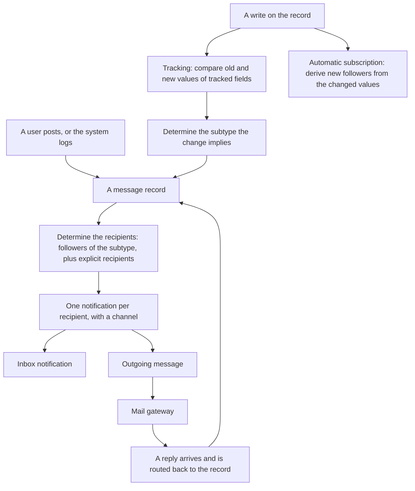
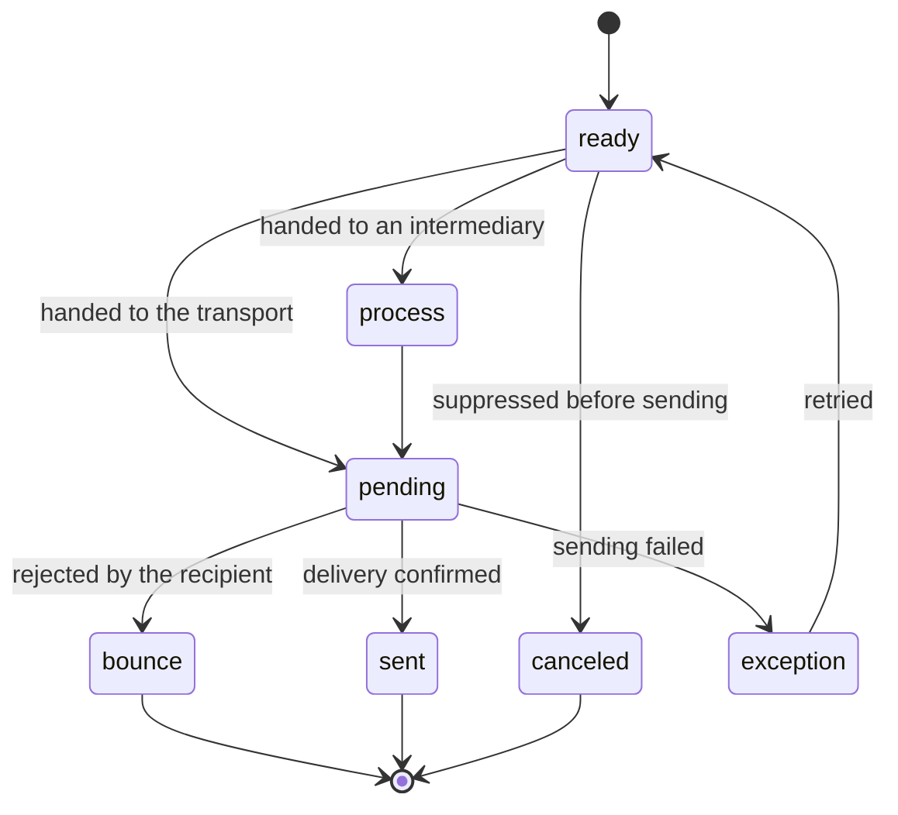

# The messaging model

Any entity in the system can become a **thread**: a record that carries a conversation, a list of followers, a history of field changes, and a list of things somebody still has to do about it. This is not a capability of one domain — it is a platform behaviour that a sales order, a manufacturing order, an employee, a project task, a journal entry and a website page all adopt by the same mechanism.

This document specifies that behaviour: what a thread is, how followers and subtypes control who hears what, how a message becomes one or more notifications, how field changes are recorded, how activities work, and — most importantly — **the contracts adoption imposes on the adopting entity**, because the behaviour is not free: adopting it adds columns, changes what deletion means, adds work to every write, and constrains how the entity's access rules must be written.

Read [the architecture](architecture.md), [the entity and field system](entity-and-field-system.md), [inheritance and extension](inheritance-and-extension.md) and [the security model](security-model.md) first. The delivery machinery — the outgoing queue, bounce handling, inbound routing — is in [the mail gateway](../runtime/mail-gateway.md); the business capability built on top of this platform behaviour is in [messaging and activities](../domains/messaging-and-activities/README.md).

---

## Table of contents

1. [What the behaviour provides](#1-what-the-behaviour-provides)
2. [The five adoptable behaviours](#2-the-five-adoptable-behaviours)
3. [Messages](#3-messages)
4. [Subtypes](#4-subtypes)
5. [Followers](#5-followers)
6. [Notifications](#6-notifications)
7. [Field change tracking](#7-field-change-tracking)
8. [Activities](#8-activities)
9. [Automatic subscription](#9-automatic-subscription)
10. [Posting a message: the algorithm](#10-posting-a-message-the-algorithm)
11. [Access to messages](#11-access-to-messages)
12. [The contracts adoption imposes](#12-the-contracts-adoption-imposes)
13. [Context keys that change the behaviour](#13-context-keys-that-change-the-behaviour)
14. [Interaction with the rest of the platform](#14-interaction-with-the-rest-of-the-platform)
15. [Invariants a rebuild must preserve](#15-invariants-a-rebuild-must-preserve)
16. [Acceptance criteria](#16-acceptance-criteria)

---

## 1. What the behaviour provides

An entity that adopts the thread behaviour gains, without writing anything itself:

| Capability | Effect |
|---|---|
| A conversation | Users and external correspondents post messages on the record; the history is kept for ever. |
| Followers | People who have asked, or been made, to hear about the record. |
| Graded subscription | A follower chooses which *kinds* of event they hear about, not merely whether they hear. |
| Notification | A message reaches each recipient by the channel they prefer: the in-application inbox or electronic mail. |
| Change tracking | Named fields record their old and new values into the conversation automatically. |
| Activities | Scheduled things to do about the record, assigned to a user, with a due date and a kind. |
| Inbound routing | A reply to a notification lands back on the record as a new message. |
| Templates | Message bodies produced from a template rendered against the record. |

The whole of that is contributed by adopting an abstract entity ([inheritance and extension, section 5](inheritance-and-extension.md#5-adopting-an-abstract-behaviour)). The adopting entity declares nothing beyond the adoption and, optionally, a handful of attributes described in [section 12](#12-the-contracts-adoption-imposes).



---

## 2. The five adoptable behaviours

Five distinct abstract entities exist. An entity adopts the ones it needs; they are independent, except that some build on others.

| Behaviour | Transport name | Provides | Depends on |
|---|---|---|---|
| Thread | `mail.thread` | Messages, followers, notifications, tracking, inbound routing | — |
| Activities | `mail.activity.mixin` | Scheduled things to do | Usually adopted together with the thread behaviour, but independent of it |
| Blacklisting | `mail.thread.blacklist` | Suppression of messages to addresses that opted out or bounced | Thread |
| Carbon-copy retention | `mail.thread.cc` | Keeps the additional addressees of an inbound message so replies reach them | Thread |
| Main attachment | `mail.thread.main.attachment` | Designates one attachment as the record's principal document | Thread |
| Alias ownership | `mail.alias.mixin` | Gives the record an inbound address of its own | Thread |

The rest of this document specifies the first two in full; the others are specified with the capability that owns them.

---

## 3. Messages

A message is a record of the Message entity (`mail.message`, table `mail_message`). Every message in the system — a user's comment, a logged note, a tracking entry, a notification to one person — is a record of this one entity.

### 3.1 Fields

| Field (storage name) | Type | Meaning and rules |
|---|---|---|
| Subject (`subject`) | Text | The subject line. Also the display name of the record. |
| Date (`date`) | Date and time, default the current instant | When the message was posted. |
| Body (`body`) | Markup, default empty, style-sanitised | The content. |
| Preview (`preview`) | Text, computed | A short plain-text extract for lists and notifications. |
| Parent (`parent_id`) | Many-to-one to itself, deletion behaviour set null | The message this one replies to. |
| Children (`child_ids`) | One-to-many to itself | |
| Entity (`model`) | Text | The transport name of the record the message is about. Empty for a message attached to nothing. |
| Record (`res_id`) | Reference by identifier, qualified by the entity field | The record the message is about. |
| Record name (`record_name`) | Text, computed, not stored | The record's display name at the time of reading. |
| Alias domain (`record_alias_domain_id`) | Many-to-one to Alias Domain, deletion behaviour set null | The inbound domain the record belongs to, captured at post time. |
| Company (`record_company_id`) | Many-to-one to Company, deletion behaviour set null | The record's company, captured at post time. |
| Kind (`message_type`) | Selection, required, default `comment` | See [3.2](#32-the-message-kinds). |
| Subtype (`subtype_id`) | Many-to-one to Subtype, deletion behaviour set null, indexed | See [section 4](#4-subtypes). |
| Activity kind (`mail_activity_type_id`) | Many-to-one to Activity Kind | Set when the message records the completion of an activity. |
| Internal only (`is_internal`) | Boolean | Hides the message from external users regardless of the subtype. |
| Sender address (`email_from`) | Text | The address of the sender when no party matched. |
| Author (`author_id`) | Many-to-one to Party | The party who wrote it. |
| Author avatar (`author_avatar`) | Binary, related | |
| Guest author (`author_guest_id`) | Many-to-one to Guest | For an anonymous visitor. |
| Written by the reader (`is_current_user_or_guest_author`) | Boolean, computed | |
| Recipients (`partner_ids`) | Many-to-many to Party, read with the archive filter off | Explicit addressees, in addition to the followers. |
| Incoming addressees (`incoming_email_to`), Incoming copies (`incoming_email_cc`) | Long text, text | The raw addressee lists of an inbound message. |
| Outgoing addressees (`outgoing_email_to`) | Text | |
| Notified parties (`notified_partner_ids`) | Many-to-many to Party, derived from the notifications | |
| Needs action (`needaction`) | Boolean, computed with a filter rule | True when the reading user has an unread inbox notification for it. |
| Has a delivery failure (`has_error`) | Boolean, computed with a filter rule | |
| Notifications (`notification_ids`) | One-to-many to Notification | |
| Starred by (`starred_partner_ids`) | Many-to-many to Party | |
| Pinned at (`pinned_at`) | Date and time | |
| Starred (`starred`) | Boolean, computed with an inverse | Whether the reading user starred it. |
| Tracked changes (`tracking_value_ids`) | One-to-many to Tracked Change | See [section 7](#7-field-change-tracking). |
| Force a new thread on reply (`reply_to_force_new`) | Boolean | When set, a reply starts a new thread rather than continuing this one. |
| Transport identifier (`message_id`) | Text, indexed, read-only, not copied | The unique identifier carried in the outgoing message headers, used to match replies. |
| Reply address (`reply_to`) | Text | Overrides the derived reply address. |
| Outgoing server (`mail_server_id`) | Many-to-one to Outgoing Server | |
| Layout (`email_layout_xmlid`) | Text, not copied | The external identifier of the surrounding template. |
| Add a signature (`email_add_signature`) | Boolean, default true | |
| Attachments (`attachment_ids`) | Many-to-many to Attachment | |
| Reactions (`reaction_ids`) | One-to-many to Reaction | |
| Link previews (`message_link_preview_ids`) | One-to-many to Link Preview | |
| Outgoing messages (`mail_ids`) | One-to-many to Outgoing Message, restricted to the settings group | |

### 3.2 The message kinds

| Value | Label | Meaning |
|---|---|---|
| `email` | Incoming Email | Produced by the inbound gateway from a received message. |
| `comment` | Comment | Written by a user through the conversation panel or the composer. This is the only kind an external user may create. |
| `email_outgoing` | Outgoing Email | Produced by a mailing campaign. |
| `notification` | System notification | Produced by the system, typically a tracking entry. |
| `auto_comment` | Automated Targeted Notification | Produced by an automated acknowledgement. |
| `out_of_office` | Out-of-office Message | An automatic absence reply detected by the gateway. |
| `user_notification` | User Specific Notification | Addressed to one recipient and not part of the record's conversation; excluded from the record's message list. |

The record's message list explicitly excludes the last kind, so a personal notification about a record does not appear in that record's public history.

### 3.3 The two ways a message comes into existence

| Route | Kind | Subtype | Recipients |
|---|---|---|---|
| **Post** — a user writes, or a capability posts on the user's behalf | `comment` by default | The comment subtype by default | The followers of that subtype, plus the explicit recipients |
| **Log** — the system records something | `notification` | None | Nobody; the entry is visible in the record's history but notifies no one |

The distinction matters: logging is free of notification cost and never reaches an external user; posting notifies.

### 3.4 Immutability of tracking

A message that carries tracked changes may not be modified: attempting it is refused with **"Messages with tracking values cannot be modified"**. The conversation is an audit trail, and a tracking entry is the evidence of a change.

---

## 4. Subtypes

A **subtype** classifies what a message is *about*, so that a follower can subscribe to some kinds of event and not others. Without subtypes, following a project would mean receiving every comment on every task.

A subtype is a record of the Subtype entity (`mail.message.subtype`, table `mail_message_subtype`).

### 4.1 Fields

| Field (storage name) | Type | Default | Meaning |
|---|---|---|---|
| Name (`name`) | Text, required, translatable | | Shown in the follower's subscription list. |
| Description (`description`) | Long text, translatable | | When set, it is prefixed to the body of every message of this subtype. |
| Internal (`internal`) | Boolean | false | When set, messages of this subtype are never shown to external users and never notify them. |
| Parent (`parent_id`) | Many-to-one to itself, deletion behaviour set null | | The subtype on the **parent** entity that this one is the child of. See [4.3](#43-the-parent-child-relation). |
| Relation field (`relation_field`) | Text | | The field of **this** entity that leads to the parent record. |
| Entity (`res_model`) | Text | | The entity the subtype applies to. Empty means every entity. |
| Default (`default`) | Boolean | true | Whether a new follower is subscribed to this subtype automatically. |
| Sequence (`sequence`) | Integer | 1 | Order in the subscription list. |
| Hidden (`hidden`) | Boolean | false | Hides the subtype from the subscription list, so it cannot be switched off by a user. |
| Track recipients (`track_recipients`) | Boolean | | Whether the message's recipients are recorded in the tracking entry. |

### 4.2 The shipped subtypes

Three subtypes exist on every entity because they have no entity of their own:

| External identifier | Name | Internal | Default | Meaning |
|---|---|---|---|---|
| `mail.mt_comment` | Discussions | No | Yes | A user's comment. The default subtype of a posted message. |
| `mail.mt_note` | Note | **Yes** | Yes | An internal note. Visible only to internal users. |
| `mail.mt_activities` | Activities | Yes | Yes | Activity scheduling and completion. |

Capabilities add their own: a stage change, a confirmation, an assignment, a shipment.

### 4.3 The parent-child relation

The parent relation is what lets following a container mean "hear about its contents".

A subtype *S* on entity **child** declares:

- its parent subtype *P*, which is a subtype on entity **parent**;
- the relation field, which is the field of **child** that leads to the parent record.

Then: **a follower of a parent record who is subscribed to *P* is treated as a follower of every child record for *S*.**

**Worked example.** Entity Project has the subtype "Task Created"; entity Task has the subtype "Created" whose parent is "Task Created" and whose relation field is the project link. A user following a project and subscribed to "Task Created" receives every message posted on a task of that project with the "Created" subtype — without being a follower of any task.

This is the mechanism behind every "follow the container, hear about the contents" behaviour in the system, and a rebuild must implement it, because a large part of who receives what depends on it.

### 4.4 Resolution of applicable subtypes

For a given entity, the applicable subtypes are:

1. every subtype whose entity is that entity, plus
2. every subtype whose entity is empty.

Of those, the ones marked default are the ones a new follower is subscribed to; the ones marked hidden are not offered in the subscription list; the ones marked internal are dropped for an external follower.

---

## 5. Followers

A follower is a record of the Follower entity (`mail.followers`, table `mail_followers`). It links one party to one record, with the set of subtypes that party has subscribed to.

### 5.1 Fields

| Field (storage name) | Type | Meaning |
|---|---|---|
| Entity (`res_model`) | Text | The transport name of the followed record's entity. |
| Record (`res_id`) | Reference by identifier, qualified by the entity field | |
| Party (`partner_id`) | Many-to-one to Party, required | The follower. |
| Subtypes (`subtype_ids`) | Many-to-many to Subtype | What they hear about. An empty set means they hear about nothing. |
| Name (`name`), Address (`email`), Active (`is_active`) | Related to the party | Convenience for lists. |

A unique constraint forbids two follower records for the same party on the same record.

### 5.2 The thread-side fields

An entity adopting the thread behaviour gains:

| Field (storage name) | Type | Meaning |
|---|---|---|
| Followers (`message_follower_ids`) | One-to-many to Follower, restricted to internal users | |
| Follower parties (`message_partner_ids`) | Many-to-many to Party, computed with an inverse and a filter rule, restricted to internal users | |
| Is a follower (`message_is_follower`) | Boolean, computed with a filter rule | Whether the reading user's party follows the record. |
| Messages (`message_ids`) | One-to-many to Message, excluding the personal-notification kind, bypassing access on traversal | |
| Has a message (`has_message`) | Boolean, computed with a filter rule, not stored | |
| Needs action (`message_needaction`) | Boolean, computed with a filter rule | |
| Number of actions needed (`message_needaction_counter`) | Integer, computed | |
| Has a delivery failure (`message_has_error`) | Boolean, computed with a filter rule | |
| Number of failures (`message_has_error_counter`) | Integer, computed | |
| Attachment count (`message_attachment_count`) | Integer, computed, restricted to internal users | |

Note the group restriction on the follower fields: the follower list is **not** visible to external users.

### 5.3 Subscribing

**Preconditions.** A record set, a list of party identifiers, and optionally the subtypes to subscribe them to.

1. If the party list is exactly the acting user's own party, require only **read** access on the records; a refusal returns false rather than raising, because "follow this" is an offer, not a demand.
2. Otherwise require **write** access on the records.
3. When subscribing parties other than oneself, drop inactive parties.
4. Insert the followers:
   - with no subtypes given, subscribe each new follower to the **default** subtypes of the entity, and leave existing followers alone;
   - with subtypes given, **replace** the subtypes of existing followers and set them on new ones.
5. Return true.

The default-versus-replace distinction is what lets "add these people" and "set exactly these subscriptions" be expressed with one operation.

### 5.4 Unsubscribing

Requires write access unless the party being removed is the acting user's own, in which case read access suffices. Removing a follower deletes the follower record; the messages remain.

### 5.5 Who is not a follower

Three groups of people receive messages without being followers:

1. **Explicit recipients** of one message.
2. **Followers of a parent record**, through the subtype parent relation of [4.3](#43-the-parent-child-relation).
3. **Parties derived by the entity's own recipient rule** — for instance the customer of a sales order — which a capability declares.

A rebuild that treats "recipient" and "follower" as the same set will notify the wrong people.

---

## 6. Notifications

A notification is a record of the Notification entity (`mail.notification`, table `mail_notification`). **One notification exists per message per recipient**, which is what makes read state, delivery state and failure state per recipient.

### 6.1 Fields

| Field (storage name) | Type | Default | Meaning |
|---|---|---|---|
| Author (`author_id`) | Many-to-one to Party, deletion behaviour set null | | The message's author, copied for fast filtering. |
| Message (`mail_message_id`) | Many-to-one to Message, required, indexed, deletion behaviour cascade | | |
| Outgoing message (`mail_mail_id`) | Many-to-one to Outgoing Message, indexed | | The queued outgoing item, when the channel is electronic mail. |
| Recipient (`res_partner_id`) | Many-to-one to Party, indexed, deletion behaviour cascade | | |
| Recipient address (`mail_email_address`) | Text | | The address used, captured at send time. |
| Channel (`notification_type`) | Selection, required, indexed | `inbox` | `inbox` or `email`. Capabilities add channels, such as text messaging. |
| Status (`notification_status`) | Selection, indexed | `ready` | See [6.2](#62-the-status-machine). |
| Read (`is_read`) | Boolean, indexed | | Only meaningful for the inbox channel. |
| Read at (`read_date`) | Date and time, not copied | | |
| Failure kind (`failure_type`) | Selection | | See [6.3](#63-failure-kinds). |
| Failure reason (`failure_reason`) | Long text, not copied | | The raw diagnostic. |

A constraint requires a recipient.

### 6.2 The status machine

| Value | Label | Meaning |
|---|---|---|
| `ready` | Ready to Send | Created and awaiting dispatch. |
| `process` | Processing | Handed to an intermediary and awaiting its answer. |
| `pending` | Sent | Handed to the transport; delivery not yet confirmed. |
| `sent` | Delivered | Confirmed delivered, as far as the channel can confirm. |
| `bounce` | Bounced | The address rejected it. |
| `exception` | Exception | Sending failed. |
| `canceled` | Cancelled | Sending was abandoned. |



An inbox notification is created in the ready state and moves to sent immediately, because delivery is the creation of the record itself; its meaningful state is the read flag.

### 6.3 Failure kinds

| Value | Label |
|---|---|
| `unknown` | Unknown error |
| `mail_bounce` | Bounce |
| `mail_spam` | Detected As Spam |
| `mail_email_invalid` | Invalid email address |
| `mail_email_missing` | Missing email address |
| `mail_from_invalid` | Invalid from address |
| `mail_from_missing` | Missing from address |
| `mail_smtp` | Connection failed (outgoing mail server problem) |
| `mail_bl` | Blacklisted Address |
| `mail_optout` | Opted Out |
| `mail_dup` | Duplicated Email |

The last three arise only in mass-sending mode.

### 6.4 Choosing the channel

For each recipient:

1. If the recipient is an **internal user**, the default channel is the inbox.
2. If the recipient is an **external party or a portal user**, the default channel is electronic mail.
3. The recipient's own notification preference, recorded on their user settings, overrides the default.
4. A capability may force a channel for a particular message.
5. A recipient with no usable address and a channel of electronic mail produces a notification with the missing-address failure rather than silently disappearing.

### 6.5 Suppression

A recipient is dropped before a notification is created when:

| Condition | Reason |
|---|---|
| The recipient is the message's author, and the author-notification instruction is not set | People are not notified of what they wrote. |
| The subtype is internal and the recipient is external | Internal notes never leave the organisation. |
| The message is marked internal only and the recipient is external | Same. |
| The recipient's address is blacklisted, for entities adopting the blacklisting behaviour | Respecting an opt-out. |
| The recipient has no address and the channel is electronic mail | Recorded as a failure, not silently dropped. |

The author-suppression rule has an exception: when the author is among the message's **explicit** recipients and the explicit-mention instruction is set, they are notified. This is what makes an automatic reply able to reach the person who triggered it.

---

## 7. Field change tracking

### 7.1 The declaration

A field of an entity that has adopted the thread behaviour may carry a **tracking** attribute. The attribute is accepted on any field of such an entity and rejected elsewhere; the adopting behaviour declares it valid.

| Attribute value | Meaning |
|---|---|
| A positive integer | The field is tracked; the number orders the changes within one tracking entry, lowest first. |
| True | The field is tracked with the default order. |
| False or absent | The field is not tracked. |

A custom-properties field is tracked automatically when the field naming its definition container is tracked and the properties field does not explicitly switch tracking off.

### 7.2 What happens on a write

**Preconditions.** A write on a record set of an entity that has adopted the thread behaviour, with tracking not suppressed by context.

1. **Before the values are applied**, capture the current value of every tracked field for every record, into a per-transaction store keyed by the entity. Only the fields actually being written are captured, and only for records whose value is not already captured in this transaction — so several writes in one transaction produce one tracking entry comparing the first and last values, not one entry per write.
2. Apply the write.
3. **At the end of the transaction, before commit**, finalise:
   1. Take the captured values for the entity and clear the store.
   2. For each record that still exists, compare the current value of each captured field with the captured one. Fields whose value did not actually change are dropped.
   3. Build one **tracked change** record per changed field.
   4. Ask the entity which **subtype** the set of changed fields implies, passing the original values of exactly the changed fields.
   5. Determine the body: an explicitly set body for this record if one was recorded during the transaction, otherwise the entity's default log text for those changes, otherwise empty.
   6. If a subtype was returned and still exists, **post** a message with that subtype, that body, that author and those tracked changes — which notifies the subtype's followers.
   7. Otherwise, if there is at least one tracked change, **log** a message with that body and those tracked changes — which notifies nobody.
   8. If there are no tracked changes at all, do nothing.

Deferring to the end of the transaction is what makes tracking cheap and correct: a workflow that writes the same field three times produces one entry.

### 7.3 The tracked change record

A record of the Tracked Change entity (`mail.tracking.value`, table `mail_tracking_value`).

| Field (storage name) | Type | Meaning |
|---|---|---|
| Field (`field_id`) | Many-to-one to Field Catalogue | The field that changed. Cleared when the field is later removed. |
| Removed field information (`field_info`) | Structured document | The field's name, label and type, kept so a tracking entry survives the field's removal. |
| Old and new integer (`old_value_integer`, `new_value_integer`) | Integer, read-only | For integer fields, and for the identifier of a relational or selection value. |
| Old and new decimal (`old_value_float`, `new_value_float`) | Decimal number, read-only | For decimal and monetary fields. |
| Old and new short text (`old_value_char`, `new_value_char`) | Text, read-only | For short text, and for the rendered label of a relational or selection value. |
| Old and new long text (`old_value_text`, `new_value_text`) | Long text, read-only | For long text and markup. |
| Old and new instant (`old_value_datetime`, `new_value_datetime`) | Date and time, read-only | For dates and instants. |
| Currency (`currency_id`) | Many-to-one to Currency, deletion behaviour set null, read-only | For a monetary field, so the amount can be formatted. |
| Message (`mail_message_id`) | Many-to-one to Message, required, indexed, deletion behaviour cascade | |

**Storage rule per field type.**

| Field type | Columns used | Stored |
|---|---|---|
| Integer | integer | The value |
| Decimal number | decimal | The value |
| Monetary | decimal, plus the currency | The value and its currency |
| Boolean | integer | Zero or one |
| Short text | short text | The value |
| Long text, markup | long text | The value |
| Date | instant | The date as an instant |
| Date and time | instant | The value |
| Selection | short text | The **label**, so that the entry stays readable if the code's label changes |
| Many-to-one | integer and short text | The identifier and the display name at the time of the change |
| Custom property | according to the property's own type | |

Storing the display name rather than only the identifier is deliberate: a tracking entry must remain readable after the referenced record is deleted or renamed.

### 7.4 What the entity may decide

An entity controls tracking in three places:

| Decision | How |
|---|---|
| Which fields are tracked | The tracking attribute on each field. |
| Which subtype a set of changes implies | An operation receiving the original values of the changed fields and returning a subtype or nothing. Returning nothing means log rather than post. |
| The body of the tracking message | An operation producing the default log text for a set of changes. |
| Whether a particular write is tracked at all | Suppression through context, or an explicit instruction to skip tracking for that write. |

The subtype decision is what turns "the status field changed to confirmed" into "the order was confirmed", notifying the people who asked to hear about confirmations rather than everyone.

---

## 8. Activities

An **activity** is something somebody still has to do about a record: call the customer, review the document, upload a file. It is scheduled, assigned, dated and eventually marked done — at which point it disappears from the to-do list and leaves a message in the record's history.

### 8.1 The activity record

A record of the Activity entity (`mail.activity`, table `mail_activity`).

| Field (storage name) | Type | Default | Meaning |
|---|---|---|---|
| Entity (`res_model_id`) | Many-to-one to Entity Catalogue | | |
| Entity name (`res_model`) | Text | | |
| Record (`res_id`) | Reference by identifier, indexed, qualified by the entity name field | | |
| Record name (`res_name`) | Text, computed | | The record's display name. |
| Kind (`activity_type_id`) | Many-to-one to Activity Kind | | |
| Category (`activity_category`) | Selection, related, read-only | | The kind's category. |
| Decoration (`activity_decoration`) | Selection, related, read-only | | How urgent it looks. |
| Icon (`icon`) | Text, related, read-only | | |
| Summary (`summary`) | Text | | A one-line description; this is the display name. |
| Note (`note`) | Markup, style-sanitised | | |
| Due date (`date_deadline`) | Date, required, indexed, default today in the acting user's time zone | | |
| Done date (`date_done`) | Date, computed, stored | | |
| Feedback (`feedback`) | Long text | | What the assignee wrote when completing it. |
| Automated (`automated`) | Boolean | | True when the activity was created by a rule rather than by a person. |
| Attachments (`attachment_ids`) | Many-to-many to Attachment | | |
| Assignee (`user_id`) | Many-to-one to User | the acting user | |
| Assignee time zone (`user_tz`) | Selection, related, stored | | |
| State (`state`) | Selection, computed | | See [8.2](#82-the-state). |
| Recommended next kind (`recommended_activity_type_id`) | Many-to-one to Activity Kind | | |
| Previous kind (`previous_activity_type_id`) | Many-to-one to Activity Kind, read-only | | Set when the activity was chained from another. |
| Has recommendations (`has_recommended_activities`) | Boolean, computed | | |
| Templates (`mail_template_ids`) | Many-to-many, related, read-only | | Message templates offered when completing. |
| Chaining (`chaining_type`) | Selection, related, read-only | | |
| May write (`can_write`) | Boolean, computed | | Whether the acting user may modify it, used to hide controls. |
| Active (`active`) | Boolean | true | |

### 8.2 The state

The state is **computed**, never stored as a user choice:

| Value | Label | Condition |
|---|---|---|
| `overdue` | Overdue | The due date is before today in the assignee's time zone |
| `today` | Today | The due date is today in the assignee's time zone |
| `planned` | Planned | The due date is after today |
| `done` | Done | The activity has been completed |

The comparison is made in the **assignee's** time zone, not the reader's, so an activity due today for a colleague nine hours away is not shown as overdue to someone else.

### 8.3 The activity kind

A record of the Activity Kind entity (`mail.activity.type`, table `mail_activity_type`).

| Field (storage name) | Type | Default | Meaning |
|---|---|---|---|
| Name (`name`) | Text, required, translatable | | |
| Default summary (`summary`) | Text, translatable | | Pre-fills the activity's summary. |
| Sequence (`sequence`) | Integer | 10 | |
| Active (`active`) | Boolean | true | |
| Delay count (`delay_count`) | Integer | | How far ahead the default due date is. |
| Delay unit (`delay_unit`) | Selection: days, weeks, months | | |
| Delay label (`delay_label`) | Text, computed | | |
| Delay from (`delay_from`) | Selection: the current date, or the previous activity's due date | | |
| Icon (`icon`) | Text | | |
| Decoration (`decoration_type`) | Selection: warning, danger | | |
| Entity (`res_model`) | Selection over every entity | | When set, the kind is offered only on that entity; empty means every entity. |
| Triggered next kind (`triggered_next_type_id`) | Many-to-one to itself | | Created automatically when this one is completed. |
| Chaining (`chaining_type`) | Selection: suggest, trigger | | Whether completing suggests the next kind or creates it. |
| Suggested next kinds (`suggested_next_type_ids`) | Many-to-many to itself | | |
| Previous kinds (`previous_type_ids`) | Many-to-many to itself | | The reverse. |
| Category (`category`) | Selection | | A behavioural marker — for example that completing the activity should upload a file — which capabilities extend. |
| Templates (`mail_template_ids`) | Many-to-many to Message Template | | Offered when completing. |
| Default assignee (`default_user_id`) | Many-to-one to User | | |
| Default note (`default_note`) | Markup, translatable | | |

**Default due date.**

```formula
due_date = base_date + delay_count × one( delay_unit )

base_date = today in the acting user's time zone            when delay_from is the current date
          = the previous activity's due date                when delay_from is the previous activity
```

### 8.4 The thread-side fields

An entity adopting the activity behaviour gains:

| Field (storage name) | Type | Meaning |
|---|---|---|
| Activities (`activity_ids`) | One-to-many to Activity | The open activities on the record. |
| Activity state (`activity_state`) | Selection, computed with a filter rule | The most urgent state among the open activities: overdue, then today, then planned. |
| Next assignee (`activity_user_id`) | Many-to-one to User, computed with an inverse and a filter rule | The assignee of the earliest open activity. |
| Next kind (`activity_type_id`) | Many-to-one to Activity Kind, computed with an inverse and a filter rule | |
| Next icon (`activity_type_icon`) | Text, related | |
| Next due date (`activity_date_deadline`) | Date, computed with a filter rule | The earliest open due date. |
| My next due date (`my_activity_date_deadline`) | Date, computed with a filter rule | The earliest open due date assigned to the reading user. |
| Next summary (`activity_summary`) | Text, computed with an inverse | |
| Exception decoration (`activity_exception_decoration`) | Selection, computed with a filter rule | Set when an open activity's kind is decorated as a warning or a danger. |
| Exception icon (`activity_exception_icon`) | Text, computed | |

All of them are **computed and searchable but not stored**, so that a screen can sort and filter by "next activity due date" without a column.

### 8.5 Completing an activity

1. Check that the acting user may modify the activity.
2. Record the feedback and the done date.
3. Post a message on the record with the activity subtype, carrying the activity kind and the feedback.
4. If the kind declares a triggered next kind, create that activity with the derived due date and the derived assignee.
5. If the kind declares suggestions rather than a trigger, offer them and create nothing.
6. Archive the activity, so it leaves the open list but remains auditable.

### 8.6 Activity plans

A **plan** is a named set of activity templates applied to a record in one operation — for instance an onboarding plan creating six activities for different assignees. A plan is a record of the Activity Plan entity, whose lines are records of the Activity Plan Template entity, each naming a kind, a summary, a note, a delay and a rule for choosing the assignee.

---

## 9. Automatic subscription

Automatic subscription is what makes the right people follow a record without anyone managing a list.

### 9.1 When it runs

On every creation and on every write of an entity that has adopted the thread behaviour, unless suppressed by context. It receives the values that were written.

### 9.2 The algorithm

**Preconditions.** A record set, the values written, and a policy for what to do about existing followers — skip them or replace their subtypes.

1. **Resolve the subtype relations for this entity.** Produce: the subtypes of this entity that are children of a parent subtype; the default subtypes of this entity; the identifiers of every internal subtype; the mapping from a parent subtype to its child on this entity; and, per parent entity, the fields of this entity that lead to it.
2. **Find the relation fields that were actually written.** Only a change to a field that leads to a parent record can bring new followers from a parent.
3. For each such field, take the parent record it now points at, and read that parent's followers together with each follower's subtypes, whether the follower is an external party, and whether they are active.
4. For each such follower:
   - map each of their parent subtypes to the corresponding child subtype on this entity;
   - add any of their subtypes that are already child subtypes of this entity;
   - if the follower is **external**, remove every internal subtype from the result;
   - if the follower is active, record them as a new follower of this record with that subtype set.
5. **Ask the entity for its own additions.** An operation receives the written values and the default subtype identifiers and returns a list of (party, subtypes, template) triples. The standard behaviour is to subscribe the person the record was just assigned to and to notify them with a template.
6. Insert all the collected followers, honouring the existing-follower policy.
7. For each distinct (template, language) pair collected in step 5, send the notification to the parties concerned, in that language.

### 9.3 The default additions

The shipped behaviour adds:

| Trigger | Follower added | Notification |
|---|---|---|
| A field designated as the responsible user is set or changed | The new responsible's party | A message telling them they have been assigned |
| The record is created | The creator, unless the creation instruction says otherwise | none |
| A message is posted with explicit recipients and the auto-follow instruction is set | Those recipients | none |
| For an entity marked as having a strong customer relation, a customer among a posted message's recipients | That customer | none |

### 9.4 The existing-follower policy

| Policy | Effect on someone already following |
|---|---|
| Skip (the default) | Their subscription is left exactly as it is. |
| Replace | Their subtypes are replaced by the newly derived set. |

Skipping by default is what preserves a user's deliberate choice to switch a subtype off.

---

## 10. Posting a message: the algorithm

**Preconditions.** A single record of an entity that has adopted the thread behaviour; a body; optionally a subject, a subtype, explicit recipients, attachments, a parent message, a kind and an author.

1. **Check access.** The entity declares which access the poster needs — write by default, sometimes read. Refuse if the poster lacks it.
2. **Resolve the author.** The supplied author, else the acting user's party, else the guest identity.
3. **Resolve the subtype.** The supplied one, else the comment subtype for a posted message, else none for a logged one.
4. **Resolve the parent.** The supplied parent, else — when the entity declares a flat conversation — the record's first message, so that replies do not nest arbitrarily deep.
5. **Prepare the body.** Prefix the subtype's description when it has one; add the author's signature when the instruction allows.
6. **Create the message record**, capturing the record's company and inbound domain.
7. **Attach** the given attachments and any produced from the body.
8. **Determine the recipients.**
   1. Start with the followers subscribed to the message's subtype — including those derived from a parent record through the subtype parent relation.
   2. Add the explicit recipients.
   3. Apply the entity's own recipient rule, which may add or remove.
   4. Apply the suppression rules of [section 6.5](#65-suppression).
9. **Subscribe the explicit recipients**, when the auto-follow instruction is set, and subscribe the author unless the skip-author instruction is set.
10. **Create one notification per recipient**, with the channel chosen by [section 6.4](#64-choosing-the-channel).
11. **Queue or send.** When the number of electronic-mail notifications is below the direct-send threshold and the direct-send instruction is not switched off, dispatch immediately; otherwise queue for the sending job.
12. **Push** the message to connected clients over the notification bus, so open screens update.
13. Return the message.

### 10.1 Logging

Logging is the same algorithm with steps 8 to 12 skipped: no subtype, no recipients, no notifications, no dispatch. It is what tracking uses when no subtype applies.

---

## 11. Access to messages

Messages carry their own access rules, layered on top of the ordinary gates. The entity overrides the access check so that, after the ordinary access rights and record rules have been applied, the following additional conditions must also hold.

### 11.1 The per-operation rules

| Operation | Allowed when at least one holds |
|---|---|
| Read | The reader is the author; or the reader created the record; or the reader is among the recipients; or the reader has been notified; or the reader may **read** the related record |
| Create | The message has no related record; or the author's party follows the related record; or the author may read the parent message; or the author may **write or create** the related record |
| Write | The writer is the author; or the writer is among the recipients; or the writer may **write or create** the related record |
| Delete | The deleter may **write or create** the related record |

### 11.2 The external-user rule

Applied before the rules above: a user who is **not internal** may not see a message that is internal. Concretely, such a user is refused any message for which any of the following holds:

- the message is marked internal only; or
- the message has **no** subtype; or
- the message's subtype is marked internal.

and, for the read and create operations only, the rule is further narrowed to messages whose kind is `comment`, so an external user can neither read nor create anything but comments.

This single rule is what guarantees that internal notes and tracking entries never leak to a customer through the portal.

### 11.3 Consequences for an adopting entity

1. **A user who can read a record can read its public messages.** Restricting a record restricts its conversation automatically.
2. **A user who can write a record can post on it**, unless the entity declares that read access suffices.
3. **Tracking entries are internal by default**, because they are logged with no subtype, which the external-user rule excludes.

---

## 12. The contracts adoption imposes

Adopting the thread behaviour is not free. This section states every obligation and every consequence, because an entity that adopts carelessly produces wrong notifications, slow writes or leaked information.

### 12.1 What the adopting entity must provide

| Obligation | Detail |
|---|---|
| A display name | Every message shows the record's display name. An entity with no display-name rule produces messages labelled with the transport name and identifier. |
| An access rule consistent with the message rules | Because message access is derived from record access, an entity whose record rules are wrong produces conversations visible to the wrong people. |
| A recipient rule, where the default is wrong | The default recipients are the subtype's followers; an entity with a customer, a responsible user or an approver must declare how to derive them. |
| A subtype decision, where tracking should notify | Without one, every tracked change is merely logged. |
| Subtypes of its own, where a follower should be able to choose | Without them, the only choices are comment, note and activities. |
| A parent subtype relation, where following a container should mean hearing about contents | Declared on the child's subtypes, naming the field that leads to the parent. |
| An inbound address, where replies must create or update records | Through the alias behaviour. |

### 12.2 What the adopting entity gains, and what it costs

| Gain | Cost |
|---|---|
| Nine computed fields for followers, messages and counters | Nine more fields to resolve; several of them run a query when displayed in a list |
| Two follower fields restricted to internal users | The follower list is invisible to external users, which a portal screen must account for |
| Tracking of any field | A capture on every write that touches a tracked field, and a message at the end of the transaction |
| Automatic subscription | A read of the parent record's followers on every write that changes a relation leading to a parent |
| Conversation, notifications, templates and inbound routing | Messages, notifications and attachments accumulate; the record's deletion must clean them up |

### 12.3 Deletion

Deleting a record of an adopting entity must delete:

1. its messages;
2. their notifications, which cascade from the message;
3. their tracked changes, which cascade from the message;
4. their attachments, where the attachment belongs to the message alone;
5. its followers;
6. its activities.

The messages, followers and activities are linked by a reference-by-identifier field, which has **no foreign key**, so nothing cascades automatically. **The adopting behaviour must delete them explicitly on deletion**, and a rebuild that omits this leaves orphan rows that surface as messages about records that no longer exist.

### 12.4 Duplication

Duplicating a record of an adopting entity must **not** duplicate its messages, its followers, its notifications or its activities. A copy starts with an empty conversation. The fields are declared not copied, which achieves this, but a rebuild that copies them will produce a duplicate carrying somebody else's conversation.

### 12.5 Batch behaviour

Every operation of the behaviour except posting accepts a record set of any size. Posting requires a single record, because a message is about one record.

### 12.6 Ordering and idempotency

1. Tracking is finalised **once per transaction per entity**, so an operation that writes the same record several times produces one tracking message.
2. Automatic subscription runs on **every** write, and is idempotent under the skip policy: subscribing someone who already follows changes nothing.
3. Posting is **not** idempotent: posting the same body twice produces two messages. An operation that may be retried must not post before the retry-safe point, which in practice means posting after the last thing that can fail.

### 12.7 Interaction with elevated operations

A message posted from an elevated operation records the **real** acting user as its author, because elevating does not change the acting user. An operation that must post as somebody else sets the author explicitly.

### 12.8 What adoption must not be used for

| Misuse | Why it is wrong |
|---|---|
| A high-volume transactional entity, such as a stock move line or a journal item | Every write would capture tracking state and every deletion would have to clean messages; the volume makes it prohibitive. Track the **document**, not its lines. |
| Recording an audit trail of every field | Tracking produces a message per transaction per record; tracking twenty fields on a frequently written entity floods the conversation. Track the fields a human cares about. |
| Sending a message to one person about nothing in particular | That is the personal-notification message kind, which is attached to no record and excluded from every record's history. |
| Enforcing a workflow | A subtype classifies; it does not gate. Gating belongs in the entity's state machine. |

---

## 13. Context keys that change the behaviour

| Key | Effect |
|---|---|
| `mail_create_nosubscribe` | The creator is not subscribed on creation. |
| `mail_create_nolog` | No "record created" message is logged on creation. |
| `mail_notrack` | No tracking is performed on this creation or write. |
| `tracking_disable` | The whole behaviour is switched off for this operation: no subscription, no tracking, no posting. |
| `mail_notify_force_send` | When true (the default), fewer than the threshold number of electronic-mail notifications are sent immediately rather than queued. |
| `mail_notify_author` | Notify the author even though they are among the potential recipients. False by default. |
| `mail_notify_author_mention` | Notify the author when they are among the **explicit** recipients. False by default. |
| `mail_auto_subscribe_no_notify` | Perform automatic subscription but send no notification about it. |
| `mail_post_autofollow` | Subscribe the explicit recipients of a posted message. False by default. |
| `mail_post_autofollow_author_skip` | Do not subscribe the author of a posted message. False by default. |

The direct-send threshold is fifty notifications.

---

## 14. Interaction with the rest of the platform

| Platform feature | Interaction |
|---|---|
| The unit of work | Tracking capture happens at write time; the tracking message is produced at the pre-commit point, so it sees the final values of the transaction. |
| The retry loop | A transaction that is retried re-runs the whole operation, including tracking and posting. Because posting happens inside the transaction, a rolled-back attempt posts nothing. |
| Post-commit work | Sending is queued or dispatched after the commit, so a failed transaction sends nothing. |
| The notification bus | A posted message is pushed to connected clients so that an open conversation updates without polling. |
| Attachments | Message attachments are ordinary attachment records owned by the message. |
| Scheduled jobs | The sending queue, the activity reminders and the inbound fetch are scheduled jobs. |
| Views | The conversation panel is a node of the form grammar; the activity view kind is contributed by this behaviour. |
| Server actions | Additional behaviours are contributed: create an activity, post a message, add or remove followers, send a text message. |
| Access | Message access is derived from record access; see [section 11](#11-access-to-messages). |

---

## 15. Invariants a rebuild must preserve

1. Messaging is a platform behaviour adopted by entities, not a domain; adopting adds real columns to the adopting entity's table.
2. One message exists per event; one notification exists per message per recipient.
3. A subtype classifies what a message is about; a follower subscribes to subtypes, not to records wholesale.
4. A follower of a parent record subscribed to a parent subtype is a recipient of the corresponding child subtype's messages on every child record.
5. Tracking captures before the write, compares at the pre-commit point, and produces at most one message per record per transaction.
6. Tracking stores both the identifier and the display name of a relational value, and the label of a selection value.
7. A message carrying tracked changes may not be modified.
8. The author is not notified unless explicitly instructed.
9. An external user may read and create only comment-kind messages, and never a message that is internal, has no subtype, or has an internal subtype.
10. Message access is derived from access to the related record.
11. Logging notifies nobody; posting notifies.
12. Activity state is computed from the due date in the **assignee's** time zone.
13. Completing an activity posts a message and, when the kind triggers one, creates the next activity.
14. Deleting a record of an adopting entity must explicitly delete its messages, followers and activities, because they are linked without foreign keys.
15. Duplicating a record must not duplicate its conversation.
16. Elevating privileges does not change the recorded author.

---

## 16. Acceptance criteria

### Messages and subtypes

**AC-MSG-1.** *Given* an entity that has adopted the thread behaviour and a user posting a comment, *when* the message is created, *then* its kind is the comment kind, its subtype is the discussions subtype and its author is the acting user's party.

**AC-MSG-2.** *Given* the same entity and a logged entry, *when* it is created, *then* its kind is the system-notification kind, it has no subtype, and no notification is created.

**AC-MSG-3.** *Given* a subtype carrying a description, *when* a message of that subtype is posted, *then* the description is prefixed to the body.

**AC-MSG-4.** *Given* a message carrying tracked changes, *when* a write on it is attempted, *then* it is refused with "Messages with tracking values cannot be modified".

**AC-MSG-5.** *Given* a message of the personal-notification kind on a record, *when* the record's message list is read, *then* the message is absent.

### Followers and subtypes

**AC-MSG-6.** *Given* a record and a user subscribing themselves with read access only, *when* the subscription runs, *then* it succeeds. *Given* the same user subscribing somebody else with read access only, *then* it is refused.

**AC-MSG-7.** *Given* a subscription with no subtypes given for a new follower, *when* it runs, *then* the follower is subscribed to the entity's default subtypes.

**AC-MSG-8.** *Given* a subscription with subtypes given for an existing follower, *when* it runs, *then* the follower's subtypes are replaced by exactly those.

**AC-MSG-9.** *Given* a subscription with no subtypes given for an existing follower, *when* it runs, *then* the follower's subtypes are unchanged.

**AC-MSG-10.** *Given* an inactive party, *when* somebody else tries to subscribe them, *then* they are dropped.

**AC-MSG-11.** *Given* two follower records for the same party on the same record being created, *when* the second is written, *then* the unique constraint refuses it.

**AC-MSG-12.** *Given* a user following a project and subscribed to the parent subtype whose child subtype is on the task entity, *when* a message of the child subtype is posted on a task of that project, *then* the user is a recipient even though they follow no task.

**AC-MSG-13.** *Given* the same user being an external party, *when* the parent subtype's child is internal, *then* the internal subtype is removed from their derived subscription and they are not notified.

### Notifications

**AC-MSG-14.** *Given* a message posted with three follower recipients, *when* it is created, *then* three notification records exist, one per recipient.

**AC-MSG-15.** *Given* an internal-user recipient with no preference, *when* the notification is created, *then* its channel is the inbox. *Given* an external party, *then* its channel is electronic mail.

**AC-MSG-16.** *Given* an external recipient with no address and the electronic-mail channel, *when* the notification is created, *then* it records the missing-address failure rather than being dropped.

**AC-MSG-17.** *Given* the author among the potential recipients and no author-notification instruction, *when* the message is posted, *then* no notification is created for the author.

**AC-MSG-18.** *Given* the author among the **explicit** recipients and the explicit-mention instruction set, *when* the message is posted, *then* a notification is created for the author.

**AC-MSG-19.** *Given* a message whose subtype is internal and an external recipient, *when* the recipients are determined, *then* the external recipient is dropped.

**AC-MSG-20.** *Given* forty-nine electronic-mail notifications and the direct-send instruction unset, *when* the message is posted, *then* the notifications are dispatched immediately. *Given* fifty-one, *then* they are queued.

### Tracking

**AC-MSG-21.** *Given* a tracked status field changed from draft to confirmed in one transaction, *when* the transaction reaches the pre-commit point, *then* one tracking entry exists holding the old and new labels.

**AC-MSG-22.** *Given* the same field written three times in one transaction, from draft to sent to confirmed, *when* the transaction finalises, *then* **one** tracking entry exists, comparing draft with confirmed.

**AC-MSG-23.** *Given* a tracked field written with the value it already had, *when* the transaction finalises, *then* no tracking entry is produced.

**AC-MSG-24.** *Given* a tracked many-to-one changed, *when* the entry is produced, *then* it stores both the old and new identifiers and the old and new display names.

**AC-MSG-25.** *Given* a tracked monetary field changed, *when* the entry is produced, *then* it stores the two amounts and the currency.

**AC-MSG-26.** *Given* an entity whose subtype decision returns a subtype for a status change, *when* the status changes, *then* a message of that subtype is posted and its followers are notified.

**AC-MSG-27.** *Given* an entity whose subtype decision returns nothing, *when* a tracked field changes, *then* an entry is logged and nobody is notified.

**AC-MSG-28.** *Given* a write with tracking suppressed by context, *when* it runs, *then* no capture and no tracking message occur.

**AC-MSG-29.** *Given* a tracked field that is later removed by a package removal, *when* an old tracking entry is read, *then* it still shows the field's label and type from its stored field information.

### Automatic subscription

**AC-MSG-30.** *Given* a record whose responsible field is set to a user, *when* the write completes, *then* that user's party is a follower and has received an assignment notification.

**AC-MSG-31.** *Given* a record whose parent link is changed to a project with two followers, *when* the write completes, *then* both followers are subscribed to the corresponding child subtypes.

**AC-MSG-32.** *Given* the same where one of them already followed the record, *when* the skip policy applies, *then* their existing subtypes are unchanged.

**AC-MSG-33.** *Given* a creation with the no-subscribe instruction set, *when* the record is created, *then* the creator is not a follower.

**AC-MSG-34.** *Given* an operation with the whole behaviour switched off by context, *when* a record is created, *then* no follower, no message and no tracking are produced.

### Activities

**AC-MSG-35.** *Given* an activity kind with a delay of three days from the current date, *when* an activity of that kind is created today, *then* its due date is three days from today in the acting user's time zone.

**AC-MSG-36.** *Given* an activity whose assignee's time zone is nine hours ahead and whose due date is today there, *when* a reader in another zone sees it, *then* its state is today, not overdue.

**AC-MSG-37.** *Given* an activity of a kind that triggers a next kind, *when* it is completed, *then* a message is posted with the activity subtype, the activity is archived, and the next activity exists with its derived due date.

**AC-MSG-38.** *Given* an activity of a kind that only suggests, *when* it is completed, *then* no next activity is created.

**AC-MSG-39.** *Given* a record with three open activities due on different dates, *when* the next-due-date field is read, *then* it is the earliest of the three, and the state field is the most urgent of the three.

**AC-MSG-40.** *Given* a screen filtering by next due date, *when* the filter is applied, *then* it works even though the field is not stored, through its filter rule.

### Access

**AC-MSG-41.** *Given* a portal user who may read a record, *when* they read its messages, *then* they see only messages of the comment kind whose subtype is not internal and which are not marked internal only.

**AC-MSG-42.** *Given* the same portal user, *when* they attempt to create a message of the system-notification kind, *then* it is refused.

**AC-MSG-43.** *Given* an internal user who may not read a record, *when* they read a message about it of which they are not the author, not a recipient and not notified, *then* it is refused.

**AC-MSG-44.** *Given* a user who is the author of a message about a record they may no longer read, *when* they read that message, *then* it succeeds.

**AC-MSG-45.** *Given* an entity declaring that read access suffices to post, *when* a user with read access posts, *then* it succeeds; *given* the default declaration, *then* it is refused.

### Lifecycle

**AC-MSG-46.** *Given* a record of an adopting entity with five messages, twelve notifications, three followers and two activities, *when* the record is deleted, *then* none of those rows remain.

**AC-MSG-47.** *Given* the same record duplicated, *when* the copy is examined, *then* it has no messages, no followers, no notifications and no activities.

**AC-MSG-48.** *Given* an elevated operation posting a message on behalf of a restricted user, *when* the message is created, *then* its author is the restricted user's party.

**AC-MSG-49.** *Given* a transaction that posts a message and then fails, *when* it is rolled back, *then* no message exists and nothing is sent.

**AC-MSG-50.** *Given* a transaction that posts a message and commits, *when* it completes, *then* the commit happens first and the dispatch afterwards.

---

## Related documents

- [Inheritance and extension](inheritance-and-extension.md) — how an abstract behaviour is adopted and what that does to the adopting entity's table.
- [The entity and field system](entity-and-field-system.md) — the field attribute that marks a field tracked, and the reference-by-identifier field that links messages to records.
- [The security model](security-model.md) — the gates on which message access is layered.
- [Views and actions](views-and-actions.md) — the conversation panel and the activity view kind.
- [The mail gateway](../runtime/mail-gateway.md) — the outgoing queue, server selection, bounces and inbound routing.
- [The notification bus](../runtime/notification-bus.md) — how a posted message reaches an open screen.
- [Record operations and query notation](record-operations-and-query-notation.md) — the generic operations that posting, subscribing and tracking are built on.
- [Client architecture](client-architecture.md) — how an open screen receives a posted message and renders the conversation panel.
- [Multi-company](multi-company.md) — the company a notification is rendered in, and the companies a follower may see.
- [Translation](../runtime/translation.md) — the language a notification is rendered in.
- [Report rendering](../runtime/report-rendering.md) — the documents a message may carry as attachments.
- [Messaging and activities](../domains/messaging-and-activities/README.md) — the business capability built on this behaviour: channels, templates, digests, plans and campaigns.
