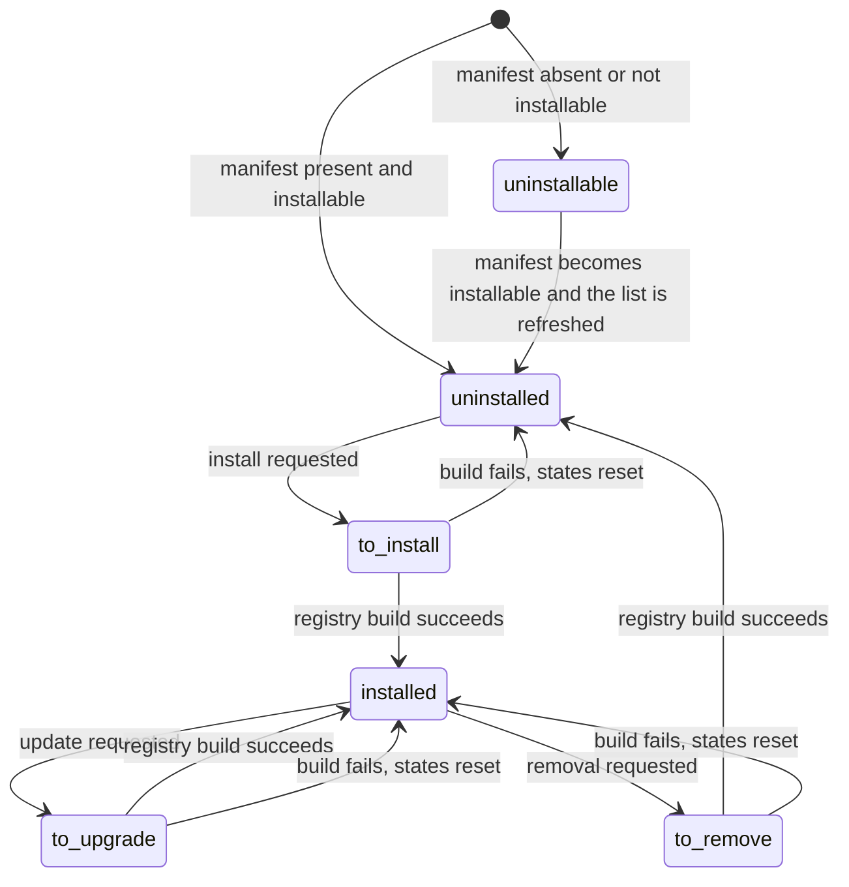

# The package system

Every capability of the system is delivered by a **capability package**. A package is a named, versioned unit that contributes entity definitions, entity extensions, presentation records, security records, reference data, translations and static assets. The set of packages recorded as installed in a tenant's database is the complete and only description of what that tenant can do.

This document specifies: what a package is made of; what a manifest may declare and what each declaration means; how dependencies are resolved and how the install order is derived; how data files are loaded and in what order; external identifiers and what happens when a package is loaded a second time; automatic installation; the install, update and removal lifecycles with their hooks; what removal does to records, columns and tables; the category tree; and the shipped catalogue with its dependency graph.

Read [the architecture](architecture.md) first: this document assumes the entity registry, the environment, the record set and the unit of work.

---

## Table of contents

1. [What a package is](#1-what-a-package-is)
2. [The manifest](#2-the-manifest)
3. [Discovery](#3-discovery)
4. [The package record](#4-the-package-record)
5. [Dependency resolution](#5-dependency-resolution)
6. [Installation order](#6-installation-order)
7. [Data files](#7-data-files)
8. [The data declaration grammar](#8-the-data-declaration-grammar)
9. [External identifiers](#9-external-identifiers)
10. [Reload semantics](#10-reload-semantics)
11. [Automatic installation](#11-automatic-installation)
12. [Exclusions and exclusive categories](#12-exclusions-and-exclusive-categories)
13. [The install lifecycle](#13-the-install-lifecycle)
14. [The update lifecycle](#14-the-update-lifecycle)
15. [The reinitialise lifecycle](#15-the-reinitialise-lifecycle)
16. [The removal lifecycle](#16-the-removal-lifecycle)
17. [Hooks](#17-hooks)
18. [Demonstration data](#18-demonstration-data)
19. [Translations](#19-translations)
20. [The category tree](#20-the-category-tree)
21. [The shipped catalogue](#21-the-shipped-catalogue)
22. [Client asset bundles](#22-client-asset-bundles)
23. [Error conditions and messages](#23-error-conditions-and-messages)
24. [Acceptance criteria](#24-acceptance-criteria)
25. [Reconciliation notes](#25-reconciliation-notes)

---

## 1. What a package is

A package is a directory whose name is its **technical name** and which contains a manifest. The technical name must match one to two hundred and fifty-six word characters — letters, digits and the underscore — and nothing else. A directory whose name does not match is not a package.

A package directory conventionally contains:

| Content | Purpose |
|---|---|
| The manifest | Declares everything in [section 2](#2-the-manifest). |
| Entity definitions and extensions | The code that contributes entities to the registry. |
| Data files | Records the package creates or updates on installation and update. |
| Demonstration data files | Records created only when demonstration data is enabled. |
| Security declarations | Access rights and record rules, delivered as data files. |
| View, action, menu and report declarations | Delivered as data files. |
| Translation catalogues | One per language, plus a source catalogue. |
| Static assets | Style sheets, scripts, images and fonts served directly over the transport under the package's static prefix. |
| A description file | Used as the package description when the manifest does not give one. |
| Tests | Not part of the delivered behaviour. |

The only file the platform requires is the manifest. Everything else is optional.

### 1.1 The base package

One package is special: the package named `base`. It is the drain of the whole dependency graph — every other package depends on it directly or transitively — and it contributes the entities that describe the system to itself: the entity catalogue, the field catalogue, the package catalogue, the external-identifier catalogue, views, actions, menus, access rights, record rules, users, groups, companies, currencies, countries, languages, parties and scheduled jobs. It cannot be removed, and its declared dependencies are forced empty regardless of what its manifest says.

### 1.2 Server-wide packages

A small configured set of packages is loaded into every worker process regardless of tenant, because they contribute behaviour the transport layer needs before a tenant is known. Those packages cannot be removed from any tenant; attempting to remove one is refused with **"Those modules cannot be uninstalled: "** followed by their technical names.

---

## 2. The manifest

The manifest is a literal mapping of declaration names to values. It contains no executable expressions: it is parsed as data, never evaluated, so that the catalogue of every available package can be read without loading any package's code.

### 2.1 Mandatory declarations

| Declaration | Type | Meaning |
|---|---|---|
| `name` | Text | The human-readable name shown in the package list. |
| `author` | Text | The author. When absent, the value of `contributors` or of `maintainer` is used instead and a warning is recorded. |
| `license` | Text, from the licence list | The licence. When absent it defaults to the lesser general public licence version three and a warning is recorded. |

### 2.2 Structural declarations

| Declaration | Type | Default | Meaning |
|---|---|---|---|
| `depends` | List of technical names | `['base']` for every package except `base`, whose value is forced to the empty list | The packages that must be installed before this one and whose contributions this one may rely on. A package that declares no dependency and is not `base` is given `base`. |
| `version` | Text | `1.0`, normalised | The package version. Normalisation prefixes a bare package version with the platform version when the declared value has fewer than five dot-separated parts. A version that cannot be normalised makes the package not installable. A version whose platform part is incompatible with the running platform makes the package not installable and records a warning. |
| `installable` | Boolean | true | When false the package is listed but cannot be installed, and is excluded from the dependency graph together with everything that depends on it. |
| `auto_install` | Boolean or list of technical names | false | See [section 11](#11-automatic-installation). |
| `application` | Boolean | false | When true the package is presented as an application rather than as an extension. Applications are sorted first in the package list. |
| `category` | Text, slash-separated path | `Uncategorized` | The position of the package in the category tree. See [section 20](#20-the-category-tree). |
| `sequence` | Integer | 100 | Sort order within a category; lower sorts first. |
| `countries` | List of two-letter country codes | empty | Restricts automatic installation to tenants having at least one company in one of the named countries, and supplies the flag shown next to the package. |
| `excludes` | List of technical names | empty | Packages that must not be installed at the same time as this one. |
| `external_dependencies` | Mapping with keys for interpreter packages and for executables | empty | Requirements outside the system. Checked before installing or updating; a missing requirement refuses the operation. |

### 2.3 Content declarations

| Declaration | Type | Default | Meaning |
|---|---|---|---|
| `data` | Ordered list of file paths relative to the package directory | empty | The files loaded on install and on update. Order is significant. |
| `demo` | Ordered list of file paths | empty | Files loaded only when demonstration data is enabled for the package. |
| `init_xml` | Ordered list of file paths | empty | Loaded before `data` on install; retained only for packages that still declare it, and its use is discouraged by a warning at load time. |
| `assets` | Mapping of bundle name to list of asset paths or operations | empty | Contributions to the front-end asset bundles. |
| `cloc_exclude` | List of path patterns | empty | Files excluded from the code-volume measurement; carries no behaviour. |
| `images`, `images_preview_theme` | Lists and mappings of image paths | empty | Illustrations for the package list and for theme previews. |
| `icon` | Path | derived | The package icon. When not declared, the icon is looked for in the package's static directory under the conventional name and falls back to the base package's icon. |

### 2.4 Presentation and descriptive declarations

| Declaration | Type | Default | Meaning |
|---|---|---|---|
| `summary` | Text | empty | One-line summary shown in the package list. |
| `description` | Text | empty, then the description file | Long description. When empty, the first of the description files found in the package directory is used. |
| `website` | Text | empty | Author or product page. |
| `maintainer`, `contributors` | Text, list of text | absent | Recorded on the package record. |
| `live_test_url` | Text | empty | A demonstration address for themes; recorded as the package's address when no address is declared. |

### 2.5 Lifecycle declarations

| Declaration | Type | Default | Meaning |
|---|---|---|---|
| `pre_init_hook` | Name of an operation exported by the package | empty | Invoked before the package's entities are added to the registry, on install only. |
| `post_init_hook` | Name of an operation exported by the package | empty | Invoked after the package's data has been loaded, on install only. |
| `uninstall_hook` | Name of an operation exported by the package | empty | Invoked before the package's records are deleted, on removal only. |
| `post_load` | Name of an operation exported by the package | empty | Invoked once per worker process when the package's code is first loaded, before any tenant uses it. Used only to install behaviour that cannot wait for a tenant. |

### 2.6 Capability-specific declarations

The platform accepts, and passes through unchanged, declarations that only certain capabilities read. They are listed here for completeness; their meaning belongs to the capability that reads them.

| Declaration | Read by |
|---|---|
| `web`, `bootstrap` | The desktop shell |
| `configurator_snippets`, `configurator_snippets_addons`, `new_page_templates`, `theme_customizations` | The site builder and its themes |
| `kpi_providers` | The periodic digest |
| `test` | The test runner |
| `demo_xml`, `update_xml` | Retained declaration names treated as equivalent to `demo` and `data` respectively where a package still uses them |

### 2.7 Derived manifest values

Five values are not declared but computed on demand and are readable exactly like declarations:

| Value | Rule |
|---|---|
| `description` | The declared description, or the content of the first description file found. |
| `icon` | The declared icon path, or the conventional icon in the package's static directory, or the base package's icon. |
| `version` | The normalised version, falling back to the normalised form of `1.0` when normalisation fails. |
| `addons_path` | The search location the package was found in. |
| `static_path` | The package's static directory, when the package is installable or declares assets and the directory exists; otherwise none. Only packages with a static path serve static files. |

### 2.8 Manifest validation

Validation happens when the manifest is first parsed, and its outcome is cached for the life of the worker process:

1. The declared mapping is layered over the defaults, so every declaration always has a value.
2. Author and licence defaults are applied with a warning, as in [2.1](#21-mandatory-declarations).
3. Dependencies are forced as in [2.2](#22-structural-declarations).
4. Automatic installation is normalised: a boolean true becomes the set of all declared dependencies; a list becomes that set. **Every entry of an automatic-installation list must also be a declared dependency**; otherwise the manifest is rejected with a message naming the offending entries and the package.
5. The version is normalised. Failure makes an installable package's manifest invalid, reported as **"Module "** the technical name **": invalid manifest"**.
6. An incompatible platform version silently sets `installable` to false and records a warning.

### 2.9 Version normalisation

Every declared version is normalised before it is stored or compared. The platform itself carries a **series identifier** of two numeric parts; it is written below as *series* rather than reproduced, because a specification must not pin a release.

1. Split the declared version on full stops. Fewer than two parts or more than five is refused with **"Invalid version '"** the version **"', must have between 2 and 5 parts"**.
2. If the version begins with the series identifier and the first part is not made only of digits, reduce the first part to its digits.
3. Every part must parse as a whole number; otherwise the version is refused with **"Invalid version '"** the version **"'"**. The user-facing form of the same refusal is **"Invalid version '"** the version **"'. Modules should have a version in format 'x.y', 'x.y.z', '\<series\>.x.y' or '\<series\>.x.y.z'."**
4. If there are three parts or fewer and the version does not already begin with the series identifier, prepend the series identifier and a full stop.
5. Otherwise return the version unchanged.

| Declared | Normalised | Reason |
|---|---|---|
| Two parts, `1.0` | *series* then `.1.0` | Two parts, not prefixed by the series: the series is prepended |
| Two parts, `0.1` | *series* then `.0.1` | The same rule |
| Two parts, `1.3` | *series* then `.1.3` | The same rule |
| The series followed by `.1.0` | Unchanged | Already prefixed by the series |
| Four parts, `1.0.0.1` | Unchanged | Four parts are left as declared |
| One part, `1` | Refused | Fewer than two parts |
| Six parts | Refused | More than five parts |
| `1.x` | Refused | A part does not parse as a whole number |

**Compatibility.** After normalisation, a version is compatible when it begins with the series identifier followed by a full stop.

- An **incompatible** version on an installable package downgrades the package: the warning **"The module "** the technical name **" has an incompatible version, setting installable=False"** is recorded and the package's installable attribute becomes false.
- An **invalid** version on an installable package makes the manifest fail to load, reported as **"Module "** the technical name **": invalid manifest"**.
- An invalid version on a package already marked not installable is ignored, and the default two-part version of one and zero is used.

### 2.10 External prerequisites

A manifest may declare that the host must provide named software components before the package can change state. The prerequisites are checked when the package is about to be installed, updated or otherwise moved, **not** while the manifest is read, so that a package whose prerequisite is absent can still be listed.

**Named components.**

1. Parse each requirement expression into a name, an optional version constraint and an optional environment condition. An expression that cannot be parsed is refused with the expression followed by **" is an invalid external dependency specification: "** and the reason.
2. When an environment condition is present and does not hold in this environment, skip the requirement.
3. Resolve the installed version of the named component.
4. When the component is not installed but a runnable component with that exact name can nevertheless be loaded, record the warning that the dependency does not appear to be a valid distribution name and that a distribution name is recommended, and accept the requirement. Otherwise refuse with **"External dependency '"** the name **"' not installed: "** and the reason.
5. When a version constraint is present and the installed version does not satisfy it, refuse with **"External dependency version mismatch: "** the name **" (installed: "** the version **")"**.

**Named executables.** For each declared executable name, refuse with **"Unable to find '"** the name **"' in path"** when it is not found among the host's executable search locations.

**Reporting.** A failure is reported to the user with one of the three transition-specific messages of [section 23](#23-error-conditions-and-messages). When the host is one whose software-installation command the manifest declares for that prerequisite, the message is extended with a further line beginning **"It can be installed running: "** and that command.

---

## 3. Discovery

1. The configured search locations are scanned, in order.
2. In each location, each entry is examined for a manifest. The first location that yields a package of a given technical name wins; later locations cannot shadow it.
3. The result is the set of **available packages**, sorted by technical name.
4. A location that is not a directory is skipped with a warning.

Discovery is purely file-system based and involves no database. It answers the question *what could be installed*; the database answers *what is installed*.

### 3.1 Static file serving

For any package with a static path, requests whose path is the package's technical name followed by the static segment and a relative path are served directly from that directory, with the relative path joined safely so that it cannot escape the directory. No tenant, no session and no entity is involved. A request naming a package with no static path, or a file that does not exist, yields not found.

---

## 4. The package record

Every available package is mirrored into the tenant's database as a record of the Capability Package entity (`ir.module.module`, table `ir_module_module`). This record is what makes the package list a screen like any other, and what lets the state of an installation be queried, exported and audited.

### 4.1 Fields

| Field (storage name) | Type | Meaning and rules |
|---|---|---|
| Technical name (`name`) | Text | The package's directory name. Required, read-only, unique. The uniqueness constraint message is **"The name of the module must be unique!"** |
| Category (`category_id`) | Many-to-one to Package Category | Read-only, indexed. Derived from the manifest category path. |
| Package name (`shortdesc`) | Text | The manifest `name`. Read-only, translatable. Used as the display name of the record. |
| Summary (`summary`) | Text | Read-only, translatable. |
| Description (`description`) | Long text | Read-only, translatable. |
| Rendered description (`description_html`) | Rich text | Computed, not stored. The description rendered for display, with image references rewritten to point at the package's static directory. |
| Author (`author`) | Text | Read-only. |
| Maintainer (`maintainer`) | Text | Read-only. |
| Contributors (`contributors`) | Long text | Read-only; the manifest list joined by comma and space. |
| Website (`website`) | Text | Read-only. |
| Available version (`installed_version`) | Text | Computed, not stored. The version currently on disk. |
| Installed version (`latest_version`) | Text | Read-only, stored. The version recorded at the last successful install or update. Empty when not installed. |
| Published version (`published_version`) | Text | Read-only. The version offered by a package source, when one is configured. |
| Address (`url`) | Text | Read-only. |
| Sequence (`sequence`) | Integer, default 100 | Sort order. |
| Dependencies (`dependencies_id`) | One-to-many to Package Dependency | Read-only. |
| Countries (`country_ids`) | Many-to-many to Country, association table `module_country` | The manifest's country restriction, resolved to country records. |
| Exclusions (`exclusion_ids`) | One-to-many to Package Exclusion | Read-only. |
| Automatic installation (`auto_install`) | Boolean | True when the manifest declares any form of automatic installation. |
| Status (`state`) | Selection, default `uninstallable`, read-only, indexed | See [4.2](#42-states). |
| Demonstration data (`demo`) | Boolean, default false, read-only | Whether the package's demonstration data has been loaded in this tenant. |
| Licence (`license`) | Selection, default `LGPL-3`, read-only | Values: `GPL-2` (general public licence version two), `GPL-2 or any later version`, `GPL-3` (general public licence version three), `GPL-3 or any later version`, `AGPL-3` (Affero general public licence version three), `LGPL-3` (lesser general public licence version three), `Other OSI approved licence`, `OEEL-1` (the vendor's enterprise edition licence version one), `OPL-1` (the vendor's proprietary licence version one), `Other proprietary`. |
| Menus (`menus_by_module`), Reports (`reports_by_module`), Views (`views_by_module`) | Long text, computed and stored | Human-readable inventories of the presentation records the package contributed, derived from the external identifiers attributed to it. |
| Application (`application`) | Boolean, read-only | From the manifest. |
| Icon address (`icon`) | Text | From the manifest. |
| Icon (`icon_image`) | Binary, computed, not stored | The icon file's content. |
| Flag (`icon_flag`) | Text, computed, not stored | A flag character when the package declares exactly one country. |
| Purchasable (`to_buy`) | Boolean, default false | Marks a package offered by a commercial source. |

Default ordering: applications first, then by sequence, then by technical name.

### 4.2 States

| Value | Label | Meaning |
|---|---|---|
| `uninstallable` | Not Installable | The manifest says the package cannot be installed, or no manifest was found. |
| `uninstalled` | Not Installed | Available but not installed. |
| `installed` | Installed | Installed; its entities are in the registry and its data is loaded. |
| `to install` | To be installed | Scheduled for installation at the next registry build. |
| `to upgrade` | To be upgraded | Scheduled for update at the next registry build. |
| `to remove` | To be removed | Scheduled for removal at the next registry build. |



**Transition table**

| From | To | Trigger | Guards | Side effects |
|---|---|---|---|---|
| `uninstalled` | `to install` | Install requested | External requirements satisfied; no dependency in state `unknown` | Every not-installed dependency is also set to `to install`, recursively |
| `to install` | `installed` | Registry build | Data loaded, hooks run | Installed version set to the available version; demonstration flag recorded |
| `installed` | `to upgrade` | Update requested | Package is installed; external requirements satisfied | Every installed package that depends on it is also set to `to upgrade`; every not-installed dependency is set to `to install` |
| `to upgrade` | `installed` | Registry build | Data reloaded | Installed version set to the available version |
| `installed` | `to remove` | Removal requested | Package is not server-wide; state is `installed` or `to upgrade` | Every package that depends on it, directly or transitively, is also set to `to remove` |
| `to remove` | `uninstalled` | Registry build | — | Records deleted, schema cleaned, installed version cleared |
| any transient | previous stable | Build failure | — | States reset: `to install` becomes `uninstalled`; `to upgrade` and `to remove` become `installed` |

### 4.3 The dependency record

Each entry of a package's `depends` becomes a record of the Package Dependency entity (`ir.module.module.dependency`, table `ir_module_module_dependency`).

| Field (storage name) | Type | Meaning |
|---|---|---|
| Name (`name`) | Text | The technical name depended upon. |
| Package (`module_id`) | Many-to-one to Capability Package | The depending package; deletion cascades. |
| Required for automatic installation (`auto_install_required`) | Boolean, default true | Whether this dependency participates in the automatic-installation condition. |
| Depended package (`depend_id`) | Many-to-one to Capability Package, computed, not stored | The package record with that technical name, if any. |
| Status (`state`) | Selection, computed, not stored | The depended package's state, or `unknown` when no package of that name exists. |

### 4.4 The exclusion record

Each entry of a package's `excludes` becomes a record of the Package Exclusion entity (`ir.module.module.exclusion`, table `ir_module_module_exclusion`), with the same shape: a name, the owning package, the resolved excluded package and its state.

### 4.5 Refreshing the list

Refreshing the package list reconciles the database with the file system.

1. Read every available manifest.
2. For each, find the package record by technical name.
3. If a record exists: compute the descriptive values from the manifest and write back only those that differ and are not both empty. If the record is `uninstallable` and the manifest is now installable, set it to `uninstalled`. Count it as an update when the manifest version is greater than the recorded installed version.
4. If no record exists: create one with state `uninstalled`, or `uninstallable` when the manifest says so. Count it as an addition.
5. Either way, reconcile the dependency records, the country links, the exclusion records and the category.
6. Return the number of updates and the number of additions.

Refreshing requires the privilege to change configuration and is recorded in the audit log, as is every install, update and removal request.

**Category reconciliation** walks the current category chain of the record from root to leaf, fixing any ancestry loop it finds by clearing the offending parent link and recording a warning, then compares the resulting path with the manifest's slash-separated path. If they differ, the path is created segment by segment if necessary and the record is relinked.

**Country reconciliation** compares the set of country records named by the manifest's two-letter codes with the set currently linked to the package record and applies the difference: codes that are new are linked, links whose code has left the manifest are unlinked, and links that are unchanged are left alone, so that a refresh writes nothing when a manifest has not changed. Writing the country links invalidates the derived field of the Company entity that lists the country-specific packages **not yet installed** for that company's country; that field is what drives the localisation proposal shown on a company, so the proposal reflects a refreshed package list immediately rather than after a restart. [Multi-company](multi-company.md) specifies what a company does with that proposal when it is created with a country.

**Creating a package record also creates its external identifier**, in the `base` package namespace, named by the technical name prefixed with the word for package and an underscore, and marked not updatable. This is what makes a package record referable from data files.

### 4.6 Bootstrapping an empty database

A database is empty when the package table does not exist. Bringing it into service is the only situation in which the platform writes rows before the self-describing catalogue exists.

1. Execute the foundation package's bootstrap statements, which create the tables required before the entity catalogue exists.
2. For each discovered manifest, in technical-name order:
   1. Create the category path, splitting the declared category on the separator and creating each missing level.
   2. Set the state to `uninstalled` when the manifest is installable and to `uninstallable` when it is not.
   3. Insert the package record with the manifest's values, that category and that state.
   4. Insert an external identifier owned by the foundation package, named after the package, pointing at that record and flagged not updatable.
   5. Insert one dependency record per declared dependency, with the required-for-automatic-installation flag set when the dependency belongs to the automatic-installation trigger set.
3. If automatic installation is disabled by configuration, set the foundation package's state to `to install` and stop.
4. Otherwise repeat until no candidate is found:
   1. Candidates are every package that declares automatic installation, whose state is neither `to install` nor `uninstallable`, none of whose dependency records is unresolvable, and none of whose dependency records flagged required for automatic installation points at a package whose state is not `to install`.
   2. Add to the candidates every dependency of a package that is `to install` or is itself a candidate, whose own state is not `to install` and which is not already a candidate.
   3. If there are no candidates, stop; otherwise set the state of every candidate to `to install`.

Because the foundation package declares automatic installation with an empty trigger set — its dependency list is forced empty — it is always selected in the first round. Every package that declares automatic installation and depends only on the foundation package is selected in the second round, and so on at each further round, so that a fresh database converges on the full set of automatic packages without anybody choosing them.

When the database is not initialised and no update was requested, the platform records **"Database "** the name **" not initialized, you can force it with an explicit installation of the root package"** and serves nothing. When the foundation package itself cannot be found, the build fails with **"The root package cannot be loaded (verify the configured package directories)"**.

---

## 5. Dependency resolution

### 5.1 The graph

The dependency graph is rebuilt from scratch at every registry build. Its nodes are package nodes; its edges are the declared dependencies.

A **package node** carries:

| Attribute | Source |
|---|---|
| Technical name | The directory name |
| Manifest | The parsed, validated manifest |
| Record identifier, state, demonstration flag, installed version | The package record in the database |
| Load state and load version | Copies of state and installed version taken when the node entered the graph, so that the build can tell what the package was before this build started |
| Dependencies | The package nodes named by `depends` |

### 5.2 Building the graph

Extending the graph with a set of technical names proceeds as follows.

1. Discard names already present.
2. For each new name, create a node from its manifest. If the manifest says the package is not installable, remove the node — silently when the package is a tenant-local imported package, and otherwise with the warning **"module "** the name **": not installable, skipped"**.
3. **Resolve dependencies.** For each new node, look up each declared dependency in the graph. If any is absent, remove the node with the warning **"module "** the name **": some depends are not loaded ("** the missing names **"), skipped"**.
4. **Compute depth.** For each new node, compute its depth. A recursion failure means a dependency cycle; remove the node with the warning **"module "** the name **": in a dependency loop, skipped"**.
5. **Read the database.** Fetch identifier, state, demonstration flag and installed version for the new names.
   - A package whose recorded state is `uninstallable` is removed with the not-installable warning.
   - When the graph is in load mode — that is, when the build is not going to change any package — a package whose recorded state is `to install` or `uninstalled` is removed with the notice that it is not installed.
6. **Removal cascades.** Removing a node removes every node that depends on it, transitively, each with the notice that one of its dependencies was skipped.

### 5.3 Depth

```formula
depth(base) = 0
depth(package) = 1 + maximum over dependencies d of depth(d)
depth(package with no dependencies) = 0
```

Depth is the length of the longest path from the package to `base`. It is the primary ordering key within a phase, which guarantees that a package is never loaded before a package it depends on.

**Test packages** — packages whose technical name begins with the test prefix — are treated specially so that they load immediately after the last of their dependencies rather than at the end: such a package takes the depth of its heaviest dependency (not one more), and its sort name becomes that dependency's sort name followed by a space and its own name. The space sorts before every character usable in a technical name, which places the test package immediately after its dependency and before that dependency's siblings.

### 5.4 Two graph modes

| Mode | Used for | Effect |
|---|---|---|
| Load | A build that changes nothing | Packages not recorded as installed are excluded. Every non-base package is in phase one. |
| Update | A build that installs, updates or removes | Packages in every state that participates in a build are included, and phases are computed as in [section 6](#6-installation-order). |

### 5.5 Dependency closure operations

Two closures are computed against the database, not against the graph, because they are used to decide *what to schedule* before the graph exists.

**Downstream dependencies** of a set of packages: every package that depends on one of them, directly or indirectly, excluding by default those in states `uninstalled`, `uninstallable` and `to remove`. Computed by repeatedly joining the dependency records by name until no new package appears.

**Prerequisite dependencies** of a set of packages: every package that one of them depends on, directly or indirectly, excluding by default those in states `installed`, `uninstallable` and `to remove`. Computed the same way in the other direction.

Both flush the relevant fields before querying, because they read the database directly.

---

## 6. Installation order

Packages are ordered by the triple **(phase, depth, sort name)**, ascending. Depth and sort name are as in [5.3](#53-depth). The phase exists to interleave installations with updates correctly.

### 6.1 Phases

```formula
phase(base) = 0

in load mode:
    phase(package other than base) = 1

in update mode:
    phase(package) = maximum over dependencies d of
        ( phase(d)
          + 1 if exactly one of package and d is being installed
          + 1 if d is base )
```

In words: the base package is alone in phase zero. In a build that changes nothing, every other package is in phase one and the depth ordering alone governs. In a build that changes something, a package moves into a later phase than a dependency whenever one of the two is being newly installed and the other is not. The effect is that runs of *already present* packages and runs of *newly installed* packages alternate, and a package that has newly acquired a dependency on a package being installed is loaded after it.

### 6.2 Worked example

Given six packages with these dependencies:

- `alpha` depends on `base`
- `beta` depends on `alpha`
- `gamma` depends on `alpha`
- `delta` depends on `beta` and `gamma`
- `epsilon` depends on `gamma`
- `zeta` depends on `delta`

Depths: `base` 0; `alpha` 1; `beta` 2; `gamma` 2; `delta` 3; `epsilon` 3; `zeta` 4.

**Load mode.** Order: `base`, then `alpha`, `beta`, `gamma`, `delta`, `epsilon`, `zeta` — phase one, ordered by depth then name.

**Update mode with `base`, `alpha`, `beta`, `gamma` installed, `delta` and `zeta` to upgrade, and `epsilon` to install.**

- `base`: phase 0.
- `alpha`: dependency `base` is in phase 0, is `base`, and neither is being installed, so phase 0 + 0 + 1 = 1.
- `beta`, `gamma`: dependency `alpha` is phase 1, neither being installed, so phase 1.
- `delta`: dependencies `beta` and `gamma`, both phase 1, neither being installed (`delta` is being upgraded, not installed), so phase 1.
- `epsilon`: dependency `gamma` is phase 1 and is not being installed while `epsilon` is, so phase 2.
- `zeta`: dependency `delta` is phase 1, neither being installed, so phase 1.

Order: `base` | `alpha`, `beta`, `gamma`, `delta`, `zeta` | `epsilon`.

**The same with `epsilon` newly required by `zeta`.** Now `zeta` depends on `delta` (phase 1) and `epsilon` (phase 2, being installed); since `zeta` is not being installed and `epsilon` is, `zeta` gets phase 3. Order: `base` | `alpha`, `beta`, `gamma`, `delta` | `epsilon` | `zeta`. The newly introduced dependency is installed before the package that acquired it.

### 6.3 The outer loop

One pass over the graph may itself change which packages must be loaded, because loading a package's data can set another package to `to install`. The build therefore loops:

1. Build the graph with `base` and load it.
2. Refresh the package list; schedule the requested installs, updates and reinitialisations.
3. Repeat: query the database for every package in a state that participates in the build and that is not already in the graph; if there are none, stop; otherwise extend the graph with them and load the graph again. Stop also when a pass updates no package, to avoid looping for ever on a package that cannot be loaded.

---

## 7. Data files

### 7.1 Which files, in which order

For a package being **installed**, the files loaded are, in order: every entry of `init_xml`, then every entry of `data`. For a package being **updated** or **reinitialised**, the same list is loaded, in the same order. For demonstration data, the entries of `demo` (and of the equivalent retained declaration) are loaded.

A file listed twice in the same list is loaded twice, with the warning **"File "** the file name **" is imported twice in module "** the technical name.

Order within the list is significant and is part of the package's contract: a file that references an external identifier defined by a later file will fail. The conventional order within `data` is security declarations first, then reference data, then views, then actions and menus, then everything that references them.

### 7.2 File formats

| Extension | Handling |
|---|---|
| Declaration document | Parsed against the declaration schema, then executed node by node. See [section 8](#8-the-data-declaration-grammar). |
| Comma-separated values | The file name up to the first hyphen is the entity's transport name. The first row names the fields; every later row is a record. Loaded through the generic import operation. |
| Direct statements | Executed verbatim against the database. Used only where the entity layer cannot express the change. |
| Script files | Accepted in the list and ignored by the loader; they are delivered as assets. |
| Anything else | Refused with **"Can't load unknown file type "** followed by the file name. |

### 7.3 Load modes

Every data load runs in one of two modes, and every record node is additionally governed by a not-updatable flag.

| Mode | When | Effect |
|---|---|---|
| Initial | The package is being installed, or reinitialised | Records are created. Records that already exist under the same external identifier are updated. The not-updatable flag does **not** prevent the write. |
| Update | The package is being updated | Records are created when missing and updated when present, **unless** the external identifier is marked not updatable, in which case the record is left untouched. |

### 7.4 Comma-separated value loading

1. Decode the file as Unicode Transformation Format eight bits; the quoting character is the double quote and the separator is the comma.
2. The first row is the list of field names. A name containing the at sign designates a translation column and is removed together with its values; translations are loaded separately.
3. When not in initial mode, the field list must contain the identifier column; otherwise the file is refused with a message saying the import specification does not contain the identifier column.
4. Rows that are empty or contain only empty cells are dropped.
5. The remaining rows are passed to the generic import operation with a context recording the mode, the contributing package, the file name and the not-updatable flag.
6. If the import produces any message of kind error, the whole installation fails with **"Module loading "** the package name **" failed: file "** the file name **" could not be processed:"** followed by the messages.

Field names may be paths. A name ending in the external-identifier suffix means "resolve this external identifier to a record"; a name ending in the database-identifier suffix means "this is a raw identifier"; a slash separates a relational field from a field of the related entity.

---

## 8. The data declaration grammar

A declaration document has a root node — one of three accepted root names — and contains a sequence of operation nodes. Nested grouping nodes are allowed and may carry attributes that apply to everything inside them.

### 8.1 Root and grouping nodes

| Attribute | Applies to | Meaning |
|---|---|---|
| `noupdate` | The enclosed nodes | When true, records created here are marked not updatable, so a later update of the package leaves them alone. |
| `auto_sequence` | The enclosed nodes | When true, every record node that does not set a sequence field, and whose entity has one, receives an automatically increasing sequence value in steps of ten, starting at ten within that grouping node. |
| `context` | The enclosed nodes | An expression producing context keys overlaid on the loading environment. |
| `uid` | The enclosed nodes | An external identifier of the user under which the enclosed nodes run. |

Grouping nodes nest: attributes are pushed on entry and popped on exit, so an inner node overrides an outer one for its own scope only.

The loading environment always has the language forced to none, so that values written by a data file are stored as source-language values and never as a translation.

### 8.2 The record node

Creates or updates one record.

| Attribute | Meaning |
|---|---|
| `model` | The entity's transport name. Required. |
| `id` | The external identifier. When it contains no dot, the contributing package's name and a dot are prefixed. |
| `context` | Context keys for this node only. |
| `uid` | Acting user for this node only. |
| `forcecreate` | When the identifier belongs to another package: allow creating the record if it does not exist. When the load is in update mode and the record is marked not updatable: with value false, skip rather than create. Default true. |

Its children are field nodes:

| Attribute of a field node | Meaning |
|---|---|
| `name` | The field name. A name containing the at sign is a translation column and is skipped here. |
| `ref` | The value is the record named by this external identifier. For a polymorphic reference field, the value becomes the entity name, a comma and the identifier. If the identifier cannot be resolved and creation is not forced, the whole record node is skipped with a warning. |
| `eval` | The value is the result of evaluating this restricted expression. The evaluation context provides a resolver from external identifier to record identifier, the acting user, the relational write commands, the current date and time helpers, and the entity being written. |
| `search` | The value is obtained by searching the entity named by the node's `model` attribute with this filter. For a many-to-many field the result is the whole matching set; otherwise it is the first match. The attribute `use` selects which field of the match is taken, defaulting to the identifier. |
| `type` | How to interpret the node's text or referenced file. |
| `file` | Read the value from this file instead of from the node's text. |
| `model` | The entity to search, for `search`; also used to resolve the relational target. |

Value types:

| `type` | Result |
|---|---|
| `char` (default) | The node's text, verbatim. |
| `int` | The text parsed as an integer; the literal word for absent yields no value. |
| `float` | The text parsed as a decimal number. |
| `list` | The list of the values of the child value nodes. |
| `tuple` | The same, as a fixed sequence. |
| `xml` | The node's children serialised as a document, with external-identifier substitutions applied. |
| `html` | The node's children serialised as markup, with external-identifier substitutions applied. |
| `file` | The text treated as a path inside the contributing package; the value stored is the package name, a comma and the path. The file must exist, otherwise the load fails with **"No such file or directory: "** followed by the path and the package. |
| `base64` | Only valid together with `file`: the file's bytes, encoded. Using it without a file is refused with **"base64 type is only compatible with file data"**. |

Any other type is refused with **"Unknown type "** followed by the value.

**External-identifier substitution** applies inside `xml` and `html` values: occurrences of the substitution pattern naming an external identifier are replaced by that record's numeric identifier, so that stored markup can embed identifiers resolved at load time. A doubled percent sign becomes a single one.

**Type coercion after evaluation.** When the named field exists on the entity, the produced value is coerced: a many-to-one field takes the integer or no value; an integer field takes an integer; a decimal or monetary field takes a decimal number; a boolean field parses the text, treating the digit zero and the words for false and for off, case-insensitively, as false and everything else as true.

**Nested records.** A field node naming a one-to-many field may contain record nodes. Each is created after the parent record, with the inverse field set to the parent's identifier. Any text value of such a field node is ignored, because the children are written through their own inverse.

**Automatic sequence.** When the enclosing grouping node enabled it and the record does not set the sequence field itself, the next multiple of ten is assigned.

### 8.3 The menu node

A shorthand for creating a menu record.

| Attribute | Meaning |
|---|---|
| `id` | External identifier. Required. |
| `name` | The label. Defaults to the action's name when an action is bound and the action has one, and otherwise to the external identifier. |
| `parent` | External identifier of the parent menu. Absent means a top-level menu. |
| `action` | External identifier of the action to open. Stored as the action's entity name, a comma and its identifier. |
| `sequence` | Integer sort order. |
| `active` | Whether the menu is visible. Default true. |
| `web_icon` | The icon of a top-level menu. |
| `groups` | Comma-separated external identifiers of groups. A name prefixed with a minus sign removes the group instead of adding it. |

Menu nodes nest: a menu node inside a menu node is created with the outer one as parent.

### 8.4 The template node

A shorthand for creating a rendering template record. The node's own name becomes the template's key, prefixed with the package name when it contains no dot, and the node's content becomes the template's body. When the node declares an inheritance target, the template is created as an extension of that template instead of as a root template. Every other attribute is forwarded as a field of the created record.

### 8.5 The asset node

A shorthand for creating an asset-contribution record: which bundle, which path, whether to append, prepend, replace, remove or include, and in what order.

### 8.6 The operation node

Invokes an operation on an entity during loading. Its attributes name the entity and the operation; its children supply the arguments, positionally for value nodes without a name and by keyword for value nodes with one. An argument named for the context is overlaid on the environment instead of being passed.

Rules:

1. The operation name may not contain a double underscore and may not be one of the names reserved as unsafe; otherwise the load fails with **"Access to forbidden name "** followed by the name.
2. When the operation runs against the entity rather than against records, all arguments are its own. Otherwise the first argument is the list of record identifiers.
3. A returned record set is reduced to its list of identifiers.
4. **An operation node is skipped entirely when the enclosing scope is not updatable and the load is not in initial mode.** This is what keeps one-off setup operations from running again on every update.

### 8.7 The delete node

Deletes records.

| Attribute | Meaning |
|---|---|
| `model` | The entity. Required. |
| `search` | A filter; every match is deleted. A filter that cannot be evaluated is skipped with a warning rather than failing the load. |
| `id` | An external identifier; the record it names is deleted. An identifier that cannot be resolved is skipped with a warning. |

### 8.8 Error reporting

A failure inside any node is re-raised as a parse failure naming the file, the line number of the node and the node's serialised content, so that a package author can locate the fault. A validation failure additionally includes the validation message and the validation context.

---

## 9. External identifiers

### 9.1 Purpose

An **external identifier** is a stable, human-chosen name for a record, independent of the numeric identifier the database assigns. It has two jobs:

1. It lets a package refer to a record it or another package created, across installations and across tenants, so that data files are portable and re-runnable.
2. It records which package owns a record, which is what makes removal possible.

### 9.2 The entity

External identifiers are records of the External Identifier entity (`ir.model.data`, table `ir_model_data`).

| Field (storage name) | Type | Meaning and rules |
|---|---|---|
| Name (`name`) | Text | The local part of the identifier. Required. May not contain a space; the check constraint's message is **"External IDs cannot contain spaces"**. |
| Package (`module`) | Text, default empty, required | The owning package's technical name, or an agreed marker for identifiers not owned by a package. |
| Complete identifier (`complete_name`) | Text, computed, not stored | The package, a dot and the name. |
| Entity (`model`) | Text, required | The transport name of the entity the record belongs to. |
| Record (`res_id`) | Integer reference qualified by the entity field | The numeric identifier of the record. |
| Not updatable (`noupdate`) | Boolean, default false | When true, an update of the owning package leaves the record alone. |
| Reference (`reference`) | Text, computed, not stored | The entity name, a comma and the record identifier. |

Constraints and indexes: a unique index over the pair (package, name); an index over the pair (entity, record). Default ordering: package, then entity, then name. The entity refuses privileged writes that bypass access control, so that a package cannot silently reassign ownership of another package's records.

The display name is the target record's display name when it can be read, and the complete identifier otherwise.

### 9.3 Form and resolution

The textual form is the package name, a dot, and the local name. The local name may not itself contain a dot: exactly one dot separates the two parts.

Resolution takes the textual form and returns the entity name and the record identifier, from a cached lookup keyed by the textual form. When no row matches, or the row has no record identifier, resolution fails with **"External ID not found in the system: "** followed by the identifier.

The convenience resolution used throughout the system additionally browses the record and checks that it still exists; a vanished record yields **"No record found for unique ID "** followed by the identifier **". It may have been deleted."**

A resolution that also enforces access control returns the entity and identifier only if the acting user can read the record, and otherwise either refuses with **"Not enough access rights on the external ID "** followed by the identifier, or returns the entity with no identifier.

### 9.4 Rules a data file must obey

1. An identifier written without a dot is completed with the contributing package's name.
2. An identifier written with a dot whose package part is not the contributing package refers to another package's record. That package must be installed; otherwise the load fails with a message saying the identifier refers to an uninstalled package.
3. An identifier may contain at most one dot; more is refused with a message saying the reference must contain at most one dot and explaining the form.
4. Creating a record under another package's identifier is refused unless the node forces creation, with **"Cannot update missing record "** followed by the identifier.
5. Creating a record under an identifier whose package part is an installed package, during a user-driven import, is refused with a message explaining that the record would be deleted when that package is next updated, and suggesting the reserved import prefix instead.

### 9.5 Assignment

External identifiers are written in bulk. For each pair of package part and local part, the row is inserted; on conflict with an existing row for the same pair, the entity and record are updated and the modification stamp is refreshed — but **only when the target actually changed**, and, during an update, **only when the row is not marked not updatable**.

Every assignment adds the textual identifier to the set of identifiers seen during this build, which is what [section 10.3](#103-orphan-cleanup) consumes.

### 9.6 Identifiers for embedded parents

When a record that embeds a parent record is created from a data file and the parent was created implicitly, the parent also receives an external identifier: the child's identifier, an underscore, and the parent entity's transport name with dots replaced by underscores. Without it the implicitly created parent would survive removal of the package that caused it to exist.

### 9.7 Copying

Duplicating a record that carries an external identifier does not duplicate the identifier as such: the copy receives a new identifier whose local name is the original's local name, an underscore and four random hexadecimal characters, so that two copies never collide.

---

## 10. Reload semantics

Loading the same data file twice — because the package was updated, or because installation was repeated — must converge, not accumulate. The rules below are what make that true.

### 10.1 Create or update

For each record node with an external identifier:

1. Look up the identifier.
2. **No row.** Create the record; assign the identifier.
3. **A row exists but its recorded entity differs from the node's entity.** Fail with a message stating that for the external identifier, while trying to create or update a record of one entity, a record of a different entity was found, naming both.
4. **A row exists and the target record still exists.** Register the identifier for reassignment. Update the record's fields — unless the build is an update *and* the identifier is marked not updatable, in which case do nothing.
5. **A row exists but the target record has vanished.** Delete the stale row and create the record afresh.

For a record node with no external identifier: create it, unless the node supplies an explicit numeric identifier, in which case update that record. During an update, a node with neither is refused with **"Cannot update a record without specifying its id or xml_id"**.

### 10.2 The not-updatable flag

The flag is set by the enclosing scope's declaration and stored on the external identifier row. Its effect:

| Build | Flag | Result |
|---|---|---|
| Install (initial mode) | false | Record created or updated |
| Install (initial mode) | true | Record created or updated — the flag does not block initial mode |
| Update | false | Record updated |
| Update | true | Record untouched |

The flag is the mechanism by which a package ships a **starting value that the user may then change**: a default sequence, a sample message template, a suggested account. Without it, every package update would overwrite the tenant's customisation.

The flag can be toggled from the interface for a single record, which requires the right to modify that record.

Demonstration data is always loaded with the flag set, so that updating a package never re-imposes demonstration records a user has edited or deleted.

### 10.3 Orphan cleanup

A package update may *remove* a record from its data files. The record must then disappear from the tenant, or the tenant would accumulate records no package owns any more. At the end of a build that updated at least one package:

1. Collect every external-identifier row whose package is one of the updated packages, whose record identifier is set and whose not-updatable flag is false, most recent first.
2. Skip every row whose textual identifier was seen during this build.
3. Skip rows whose entity no longer exists in the registry.
4. Skip a row whose record is the embedded parent of a child record that *was* seen during this build, so that implicitly created parents survive as long as their children do.
5. If the same record carries another external identifier that is not itself being cleaned, delete only this row, not the record.
6. Otherwise delete the record, in an environment marked as a package removal so that entities which normally refuse deletion allow it.
7. If the record has already vanished, delete the dangling row.
8. Finally, create the per-tenant specialisations of any views that need them, and clear the set of identifiers seen during the build.

Consequence a package author must know: **deleting a record node from a data file deletes the record on the next update, unless the record is marked not updatable.**

### 10.4 A worked reload

**Given** a package `alpha` at version one whose data file declares:

- a record with identifier `alpha.rule_a`, updatable;
- a record with identifier `alpha.template_b`, inside a not-updatable grouping node;
- a record with identifier `alpha.param_c`, updatable.

**And** the tenant has installed it, then edited `template_b` and `param_c` through the interface.

**When** `alpha` is updated to version two, whose data file declares `rule_a` with a changed value, `template_b` unchanged, and no `param_c` at all.

**Then**:

1. `rule_a` is updated to the new value; the user's edit to it, if any, is lost. This is correct: the record is updatable, so the package owns it.
2. `template_b` is left exactly as the user edited it, because its identifier is marked not updatable.
3. `param_c` is deleted at orphan cleanup, because its identifier belongs to `alpha`, was not seen in this build, and is updatable. The user's edit is lost with the record.

---

## 11. Automatic installation

### 11.1 Declaration

The `auto_install` declaration takes three shapes:

| Declared value | Normalised to | Meaning |
|---|---|---|
| `false` (default) | Not automatic | The package is installed only when asked for. |
| `true` | The set of all declared dependencies | Install this package as soon as all its dependencies are installed. |
| A list of technical names | That set, which must be a subset of the declared dependencies | Install this package as soon as all the *listed* dependencies are installed. The remaining dependencies are still required, but they do not trigger. |
| The empty list | The empty set | Install this package always: the condition over an empty set is vacuously satisfied. |

The subset requirement of the third shape is **enforced**, not merely expected. While the manifest is normalised, every name in the trigger list is looked up in the declared dependency list, and a name that is not there aborts the reading of that manifest with **"auto_install triggers must be dependencies, found non-dependencies [<names>] for module <package>"**, where `<names>` is the list of offending technical names and `<package>` is the technical name of the package whose manifest is at fault. The package therefore never reaches the registration stage, so a mis-declared trigger is a load-time failure and not a silent no-trigger.

The normalised set is recorded on the dependency records as the required-for-automatic-installation flag.

### 11.2 The condition

A not-installed package with automatic installation is installed when **all** of the following hold:

1. Every dependency marked required for automatic installation is in state `installed`, `to install` or `to upgrade`.
2. **At least one** such dependency is in state `to install`. Without this clause the package would be scheduled on every build rather than only when something it links actually arrives.
3. Either the package declares no countries, or at least one company of the tenant has a country among the declared ones.

The country restriction is **not a hard guard**. It gates only the automatic decision of this section: an administrator may select a country-restricted package explicitly and install it whatever the countries of the companies, and nothing refuses that install. A rebuild that turns the restriction into a refusal would make it impossible to prepare a company for a country before its address is filled in.

### 11.3 The loop

Scheduling an installation is therefore a fixed-point computation:

1. Mark the requested packages and their dependencies `to install`.
2. Search for not-installed packages with automatic installation whose condition now holds.
3. If any, mark them and their dependencies `to install` and go to step 2.
4. Otherwise stop.

Each round can enable the next: installing an application pulls in a bridge package, whose installation pulls in a second bridge, and so on. The loop terminates because every round moves at least one package out of the not-installed state and the set of packages is finite.

Automatic installation can be disabled entirely by configuration, in which case step 2 is skipped.

### 11.4 What automatic installation is for

Automatic packages are almost always **bridges**: a package that exists only to make two other capabilities work together, and that is meaningless unless both are present. Naming the two capabilities as its automatic-installation triggers means a user never has to know the bridge exists. In the shipped catalogue the great majority of packages are of this kind.

---

## 12. Exclusions and exclusive categories

Two mechanisms prevent incompatible combinations.

### 12.1 Explicit exclusions

A package may declare that it excludes named packages. When an installation is scheduled, the set of packages that are installed, being installed or being updated is examined; if any of them excludes another member of the set, the operation is refused with **"Modules ""** the first package's name **"" and ""** the second package's name **"" are incompatible."**

### 12.2 Exclusive categories

A category may be marked **exclusive**. Within an exclusive category and its descendants, the installed packages must form a chain: every one of them must be reachable from a single package through the transitive dependency closure. This allows a family such as three tiers of one capability to be installed together when the higher tiers depend on the lower ones, while refusing two unrelated alternatives.

The check: gather the categories consisting of the exclusive category and all its descendants; gather the installed and scheduled packages in them; if that set is not empty and no member's transitive dependency closure contains the whole set, refuse with **"You are trying to install incompatible modules in category ""** the category name **"":"** followed by one line per offending package giving its name and its state label.

---

## 13. The install lifecycle

This section gives the complete algorithm for bringing a package from `uninstalled` to `installed`. Steps marked *(schema)* change the database schema.

### 13.1 Scheduling

**Preconditions.** The acting user has the privilege to change configuration. No other package operation is in flight.

1. Verify that no package is currently in state `to install`, `to upgrade` or `to remove`. If one is, refuse with **"The system is currently processing another module operation. Please try again later or contact your system administrator."**
2. Take an exclusive lock on the package table, with a short lock timeout. Failure to take it means another worker is scheduling an operation; refuse with the same message.
3. Take a lock on the scheduled-job table, so that a job cannot be running while its definition changes. Failure refuses with **"The system is currently processing a scheduled action. Module operations are not possible at this time, please try again later or contact your system administrator."**
4. Walk the dependency tree of the requested packages, depth first, with a recursion budget of one hundred levels; exceeding it is refused with **"Recursion error in modules dependencies!"**
   - A dependency whose state is `unknown` refuses the operation with **"You try to install module ""** the package **"" that depends on module ""** the dependency **"".\nBut the latter module is not available in your system."**
   - Otherwise every dependency not already in the target state is scheduled first, then the package itself.
5. Before scheduling each package, verify its external requirements. A missing one refuses with **"Unable to install module ""** the package **"" because an external dependency is not met: "** followed by the missing requirement, and, on platforms where the platform can name the command that would provide it, a second line beginning **"It can be installed running: "**.
6. Run the automatic-installation loop of [section 11.3](#113-the-loop).
7. Run the exclusion checks of [section 12](#12-exclusions-and-exclusive-categories).
8. Commit.

### 13.2 Building

The registry is then rebuilt with updates enabled. For each package in install order whose state is `to install`:

1. **Load the code.** Import the package's definitions so that its entities register themselves against its name. Run its `post_load` hook if this worker has not yet loaded the package.
2. **Pre-initialisation hook.** Perform an incremental registry setup, then invoke the `pre_init_hook` if declared. At this moment the package's own entities are *not* yet in the registry, which is precisely what makes the hook useful for preparing data the entities will need.
3. **Register the entities.** Add the package's entity definitions and extensions to the registry; collect the names of the entities it directly touched.
4. **Expand.** Extend that set with every entity that extends or embeds a touched entity, transitively.
5. **Set up.** Perform an incremental registry setup over the expanded set.
6. *(schema)* **Initialise the entities.** For each entity in the expanded set, in registry order: create the table if absent; add every missing column with the right type; add or drop not-null according to the field's required flag; create indexes for indexed fields; create foreign keys with the declared deletion behaviour; record the entity, its fields, its selection values, its constraints, its relations and its embedded parents into the self-describing catalogue entities; queue the declared check and unique constraints for the finalisation step.
7. **Check the package record.** Warn when the description is empty.
8. **Load the data.** Execute `init_xml` then `data`, in initial mode, with the not-updatable flag off by default.
9. **Load demonstration data**, if enabled for this build and every dependency also has it — see [section 18](#18-demonstration-data).
10. **Record the demonstration flag** on the package record.
11. **Load translations** for every installed language.
12. **Post-initialisation hook.** Invoke the `post_init_hook` if declared. At this moment the package's entities and data are fully present.
13. **Warn about unprotected entities.** For every persistent entity the package introduced that has no access right at all, record a warning listing them and a suggested access-right line for each, so that a package author notices the omission at install time.
14. **Mark installed.** Set the state to `installed` and the installed version to the manifest version. Flush and **commit**. Each package is committed separately, so an installation that fails half-way leaves the earlier packages installed and the rest reset.

### 13.3 Finishing

After every package in the graph has been processed:

1. Apply the queued constraints.
2. Detect and report columns that exist in the database but correspond to no field of the resolved entity.
3. Run the orphan cleanup of [section 10.3](#103-orphan-cleanup).
4. Schedule the housekeeping job to run shortly, giving assets time to be rebuilt.
5. Verify entities whose schema may be stale — see [section 14.4](#144-the-cross-package-schema-repair).
6. Validate every tenant-local view against the new registry, warning about any that no longer parses.
7. Install the runtime hooks of every entity.
8. Verify that every column the registry believes may be null really may be.
9. Write the marker parameter if any package is still in a transient state.

### 13.4 Returning to the user

An interactive installation commits, rebuilds the registry, and then:

1. If a pending configuration step exists, return the action that opens it.
2. Otherwise return the instruction to reload the client, opening the first top-level menu.

Module operations are refused inside tests, because they are not transactional: attempting one fails with a message explaining that module operations inside tests are not transactional and thus forbidden.

---

### 13.5 Failure and recovery during a build

1. Any failure during a build rolls back the current transaction, resets the transient package states — `to install`, `to upgrade` and `to remove` return to their stable counterparts — and re-raises. The reset is recorded with the warning **"Transient module states were reset"**.
2. A failure while loading **demonstration data** is caught per package and does not stop the build: the warning **"Module "** the technical name **" demo data failed to install, installed without demo data"** is recorded, the package's demonstration flag becomes false, the shipped configuration step that reports demonstration failures is opened, and a demonstration-failure record is created holding the package and the failure trace. The installation continues.
3. After a build that completed but left packages in a transient state, the marker recording that the database is only partially updated is written, and the next build forces update mode so that the unfinished work is retried.
4. Diagnostic messages recorded while the load order is computed, none of which stops the build:

| Condition | Message |
|---|---|
| A package is not installable | "module \<name\>: not installable, skipped" |
| A package is not installed and the build is only loading | "module \<name\>: not installed, skipped" |
| A dependency is absent from the graph | "module \<name\>: some depends are not loaded (\<names\>), skipped" |
| A package lies on a dependency cycle | "module \<name\>: in a dependency loop, skipped" |
| A package depends on one that was skipped | "module \<name\>: its direct/indirect dependency is skipped, skipped" |
| Installed packages are absent from the graph at the end | "Some modules are not loaded, some dependencies or manifest may be missing: \<names\>" |
| Packages are left in a transient state at the end | "Some modules have inconsistent states, some dependencies may be missing: \<names\>" |
| An entity is recorded in the catalogue but no installed package defines it | "Model \<name\> is declared but cannot be loaded! (Perhaps a module was partially removed or renamed)" |
| A package's description is empty | "module \<name\>: description is empty!" |
| A data file is listed twice in one manifest | "File \<file\> is imported twice in module \<package\> \<kind\>" |
| A stored field has no not-null constraint although the field is required | "Missing not-null constraint on \<field\>" |

---

## 14. The update lifecycle

### 14.1 Scheduling

1. Refresh the package list, so that new versions and new dependencies on disk are known.
2. Build the work list from the requested packages. **If `base` is among them, every installed package is added**, except the tenant-local customisation package, because an update of the foundation may introduce dependencies that only a full pass will install.
3. Walk the work list, appending as it grows:
   - A package that is neither `installed` nor `to upgrade` refuses the operation with **"Cannot upgrade module "** the technical name **". It is not installed."**
   - Verify external requirements, with the message variant for updating.
   - Append every installed package that depends on this one, except the tenant-local customisation package.
4. Set every package in the work list to `to upgrade`.
5. For each package in the work list, examine its declared dependencies:
   - one in state `unknown` refuses with **"You try to upgrade the module "** the package **" that depends on the module: "** the dependency **".\nBut this module is not available in your system."**;
   - one in state `uninstalled` is collected for installation.
6. Schedule the collected packages for installation, which runs the whole install scheduling of [section 13.1](#131-scheduling), including the automatic-installation loop and the exclusion checks.

### 14.2 Building

For each package in order whose state is `to upgrade`:

1. Perform an incremental registry setup, then flush.
2. Load the code.
3. Register the entities, expand and set up, exactly as for an install.
4. *(schema)* Initialise the entities. Unlike an install, this is a *synchronisation*: columns are added, types widened where the field's storage type changed in a compatible way, not-null added or dropped to match the required flag, indexes created or dropped to match, and foreign keys recreated when the deletion behaviour changed.
5. Write the descriptive values from the manifest onto the package record.
6. Load `init_xml` then `data` in **update** mode, so that not-updatable records are preserved.
7. Reload demonstration data if the package had it.
8. Update translations.
9. **Validate the package's views** that have not been validated yet, so that a change to a view's structure is caught at update time rather than when a user opens it.
10. Mark installed with the new version; flush; commit.

### 14.3 Translated and company-dependent fields

Two schema properties can change between versions and need a dedicated pass.

**Fields that stop being translatable.** Before the build, the set of currently translated fields is read from the catalogue. After the packages have loaded, the registry is set up once *without* the translation compatibility view, and every field that the database records as translated but that the registry no longer declares translatable causes its entity's schema to be re-synchronised, collapsing the stored translations to the source language.

**Fields that become or stop being company-dependent.** Likewise, the set of company-dependent fields is read from the catalogue before the build so that the schema synchronisation can convert between a plain column and the per-company representation.

### 14.4 The cross-package schema repair

Consider: package A defines entity M; package B is updated and extends M; package C is loaded but not updated and also extends M. Because C was not updated, the schema changes C's extension implies were never applied, yet the registry now contains them.

The build therefore tracks, for every package that was merely *loaded* while some other package was updated, the entities it touches that were also touched by an updated package. At the end of the build, those entities' schemas are synchronised once more, with the flags that also repair user-defined fields whose not-null constraint was dropped. This pass is why a build can change the schema of an entity belonging to a package that was not itself updated.

### 14.5 Reinitialising

A package can be **reinitialised**: updated, but with its data loaded in *initial* mode rather than update mode. The effect is that not-updatable records are rewritten to the values the package ships, discarding tenant customisations of them. Requesting reinitialisation of a package also reinitialises every installed package that depends on it. The build is otherwise identical to an update.

---

## 15. The reinitialise lifecycle

Reinitialisation is scheduled by naming the packages; the scheduler expands the set with the installed downstream dependencies of each, excluding packages in the not-installed, not-installable, to-remove and to-install states, and excluding tenant-local imported packages. The expanded set is recorded on the build; each member is then processed exactly as an update except that its data files are loaded in initial mode.

The one case where reinitialisation and update differ observably is [section 10.2](#102-the-not-updatable-flag): records marked not updatable are rewritten.

---

## 16. The removal lifecycle

### 16.1 Scheduling

1. Refuse if any requested package is server-wide: **"Those modules cannot be uninstalled: "** followed by their names.
2. Refuse if any requested package is not in state `installed` or `to upgrade`: **"One or more of the selected modules have already been uninstalled, if you believe this to be an error, you may try again later or contact support."**
3. Compute the downstream dependencies of the requested packages.
4. Set the requested packages and all their downstream dependencies to `to remove`.
5. Commit.

An interactive removal first offers a confirmation screen listing what will be removed, because the cascade can be large and is irreversible. The screen is computed by two rules:

- **The impacted packages** are the downstream dependency set of the selection, computed as in [section 5.5](#55-dependency-closure-operations). By default the screen lists only those flagged as applications, so that the user sees the capabilities they are about to lose rather than the bridges; an option shows the whole set. When the selection itself contains no package flagged as an application, the screen switches to showing all impacted packages, so that it is never empty.
- **The impacted entities** are exactly the entities whose external identifiers are **all** qualified by packages in that impacted set. An entity that also carries an identifier from a surviving package is not listed, because it will survive; an entity all of whose identifiers belong to packages being removed will disappear together with its table. This is the same rule that [section 16.3](#163-what-removal-does-to-records-and-columns) applies when the removal actually runs, so the preview cannot disagree with the outcome.

### 16.2 Building

The registry is rebuilt. Packages in state `to remove` are still **loaded** during the build — their entities are added to the registry — because their records must be readable in order to be deleted. Only after the whole graph has loaded does removal proper begin:

1. For each package to remove, in **reverse** load order, invoke its `uninstall_hook` if declared, then flush. Reverse order means a dependent package's hook runs before the hook of the package it depends on.
2. Perform the record and schema removal of [section 16.3](#163-what-removal-does-to-records-and-columns).
3. Set the removed packages to `uninstalled` and clear their installed version. Prefetching is disabled during this write because columns have already been dropped.
4. Commit, and **rebuild the registry once more**, now without the removed packages. The second build is what actually removes their entities from the registry.

### 16.3 What removal does to records and columns

Removal requires the privilege to change configuration; otherwise it is refused with **"Administrator access is required to uninstall a module"**.

The algorithm operates entirely from the external identifiers owned by the packages being removed.

1. **Collect.** Read every external-identifier row whose package is being removed, most recent first, and partition the targets into five groups: entity-catalogue records, field-catalogue records, selection-value records, constraint records, and everything else.
2. **Protect against stale reads.** For every field about to be deleted, switch off prefetching for that field, so that a recomputation triggered during removal cannot try to read a column that has already been dropped.
3. **Delete ordinary records, grouped by entity, in the order the identifiers were collected** — most recently created first, which tends to delete children before parents. For each group:
   1. Look up every external identifier pointing at those records. **Any record that also carries an external identifier belonging to a package that is not being removed is excluded**: it belongs to someone else and survives. The marker identifier used to exclude files from the code-volume measurement does not count as such an owner and is deleted alongside.
   2. Delete the remaining records inside a savepoint.
   3. If the deletion fails and the group holds one record, record that identifier as undeletable and continue. If it holds more, split the group in half and recurse, so that one blocking record does not prevent the deletion of its siblings.
4. **Delete tenant-local view copies.** Views copied per site or per tenant carry no external identifier but do carry a key beginning with the owning package's name and a dot. Every such view is deleted. This happens after the ordinary records — so that a restrict-on-delete relation does not block a view's deletion — and before the schema is changed, so that the views' dependent fields still exist.
5. **Delete constraint records**, which drops the corresponding database constraints.
6. **Delete selection-value records** before field records, so that a selection value declared to cascade still deletes the records holding it; deleting the field first would drop the column and lose the value.
7. **Delete field records.** Deleting a field record drops its column, unless the field is the identifier or an audit field of an entity that keeps audit fields. Field records whose target has already vanished — because a cascading deletion removed it — have their dangling identifier rows deleted first.
8. **Delete relation records**, which drops the association tables of many-to-many fields owned by the removed packages, unless another installed package also declares the same association table.
9. **Delete entity records**, which drops their tables.
10. **Re-examine undeletable records.** A record that could not be deleted in step 3 may have become deletable since, because a cascade removed it or its table was dropped. For each, check existence inside a savepoint: if it still exists, keep its identifier row and consider the record retained; if checking fails because the table is gone, treat it as deleted.
11. **Delete the remaining external-identifier rows** of the removed packages.

### 16.4 Consequences a rebuild must reproduce

1. **Removal deletes data.** Business records created by a package — not only its configuration — are deleted if the package owns their external identifiers. Business records created by *users* are deleted only if their table is dropped.
2. **Shared records survive.** A record claimed by two packages survives the removal of one.
3. **The cascade is by dependency, not by usage.** Removing a package removes every package that depends on it, whether or not the tenant uses them.
4. **Two registry builds are required.** Behaviour observed between them — during the deletion — still sees the removed entities.
5. **Deletion order is derived from identifier order**, most recent first, with per-record fallback. A rebuild that deletes in a different order will hit different referential-integrity failures and may retain different records.

---

## 17. Hooks

| Hook | Declared as | When it runs | Registry state | Typical use |
|---|---|---|---|---|
| Process load | `post_load` | Once per worker process, when the package's code is first imported, before any tenant uses it | No tenant, no registry | Installing behaviour into the transport or into shared utilities |
| Pre-initialisation | `pre_init_hook` | During installation, after an incremental registry setup and **before** the package's entities are registered | The package's entities absent | Preparing data or schema the new entities will need; for example pre-creating a column so that a required field can be added without a table rewrite |
| Post-initialisation | `post_init_hook` | During installation, after the package's data and demonstration data have been loaded and its state recorded | The package fully present | Deriving records from what is already in the tenant; for example creating a default configuration per existing company |
| Removal | `uninstall_hook` | During removal, before any record is deleted, in reverse load order | The package still fully present | Undoing effects the record deletion cannot undo; for example detaching a scheduled job or restoring a value the package had overwritten |

All hooks receive the loading environment, which acts as the unrestricted actor. A hook that fails aborts the whole build.

There is deliberately **no hook after removal**: once the package's entities are gone, there is nothing to run them with.

---

## 18. Demonstration data

Demonstration data is a second, optional body of records used to make a fresh tenant explorable.

Rules:

1. Demonstration data is enabled per tenant at creation and can be forced on afterwards.
2. A package's demonstration data is loaded **only if every package it depends on also has demonstration data loaded**. This prevents a demonstration record from referring to a record that does not exist.
3. Demonstration data is always loaded with the not-updatable flag set, so updates never re-impose it.
4. Demonstration data is loaded inside a savepoint. If it fails, the failure is recorded, the package is installed **without** demonstration data, the package's demonstration flag is set false, and the build continues. A failure record is created holding the package and the failure text, and the configuration step that reports demonstration failures is opened.
5. Forcing demonstration data on afterwards sets the flag on every package, then loads demonstration data for every installed package in load order. If that triggers further package state changes, the registry is rebuilt.

---

## 19. Translations

Each package may ship one catalogue per language plus a source catalogue. At the end of a package's install or update:

1. The set of installed languages is determined, or a caller-supplied subset is used.
2. The packages to load terms for are sorted topologically by dependency, so that a term overridden by a dependent package wins.
3. For each package and language, the catalogue is loaded. By default an existing translation is **not** overwritten; a configuration flag makes loading overwrite.
4. Translations attached to attachments shipped by the package are extracted as well.

Loading a language that is not yet installed, at build time, installs that language first.

---

## 20. The category tree

Categories organise the package list and also name the privilege families used by the security model.

### 20.1 The entity

Categories are records of the Package Category entity (`ir.module.category`, table `ir_module_category`).

| Field (storage name) | Type | Meaning |
|---|---|---|
| Name (`name`) | Text | Required, translatable. |
| Parent (`parent_id`) | Many-to-one to itself | The parent category. |
| Children (`child_ids`) | One-to-many to itself | |
| Description (`description`) | Text | Translatable. |
| Sequence (`sequence`) | Integer | Sort order. |
| Visible (`visible`) | Boolean, default true | Whether the category appears in the package list and in the user-access screen. |
| Exclusive (`exclusive`) | Boolean | See [section 12.2](#122-exclusive-categories). |
| Package count (`module_nr`) | Integer, computed | How many packages are in the category. |
| External identifier (`xml_id`) | Text, computed | The category's own external identifier. |

Default ordering: sequence, then name, then identifier. A cycle in the parent chain is refused by a validation that walks the chain.

### 20.2 Path creation

A manifest declares its category as a slash-separated path, for example the path naming accounting, then localisations, then charts of accounts. Creating the path creates each missing segment as a child of the previous one, matching on name within the parent, and returns the leaf. Matching is by name, so two packages declaring the same path share the leaf.

### 20.3 The shipped top-level categories

Twenty-eight categories are shipped by the base package. The visible ones structure the package list; the hidden ones exist only to carry privilege families or to group packages the user never installs directly.

| Category | Visible | Purpose |
|---|---|---|
| Master Data | yes | Parties, products, currencies and other shared reference data |
| Accounting | yes | The accounting capabilities |
| Accounting / Localization | no | Country-specific accounting |
| Accounting / Localization / Account Charts | no | Country chart templates |
| Sales | yes | Quotations, orders, counter sales |
| Supply Chain | yes | Inventory, purchasing, manufacturing |
| Human Resources | yes | Employees, time, absence, expenses |
| Services | yes | Projects and time recording |
| Marketing | yes | Campaigns, events, questionnaires |
| Productivity | yes | Messaging, calendar, documents, dashboards |
| Website | yes | Sites, storefront, portal |
| Technical | no | Platform capabilities not presented as applications |
| Payroll Localization | no | Country-specific payroll |
| Uncategorized | yes | The default when a manifest declares none |

The remainder are second-level categories under those, and categories whose sole purpose is to name a privilege family. The complete list, with external identifiers, sequences and visibility, is in the package category catalogue.

---

## 21. The shipped catalogue

### 21.1 Shape of the catalogue

The shipped system consists of **620 packages** connected by **1,286 dependency edges**. Of those, **34 are applications** — packages presented to the user as a capability to switch on — and **402 declare automatic installation**, overwhelmingly bridges. The remainder are opt-in extensions and country localisations.

The distribution by category shows where the weight lies:

| Category | Packages |
|---|---|
| Accounting: country charts of accounts | 126 |
| Sales | 37 |
| Website and storefront | 37 |
| Accounting: country electronic document formats | 35 |
| Accounting: other localisation content | 29 |
| Point of sale | 28 + 15 localisation + 9 |
| Platform, hidden | 27 + 24 tool packages |
| Accounting proper | 27 |
| Payment providers | 22 |
| Events | 17 |
| Inventory | 14 |
| Dashboards | 14 |
| Projects | 13 |
| Email marketing | 12 |
| Customer relationship management | 11 |
| Human resources | 11 + 6 employee packages |
| Purchasing | 11 |
| Manufacturing | 8 |

More than a third of all packages are country localisations. A rebuild that implements the platform and the core domains but no localisation is a valid rebuild of a much smaller system. What a localisation package adds is always the same four kinds of record, loaded as data: a chart of accounts with its accounts and journals, the tax records and tax groups of the country with their reports, the fiscal positions that remap accounts and taxes for foreign counterparties, and the statutory report definitions the country requires. [The taxes domain](../domains/taxes/README.md) specifies the tax engine those records configure, and [the general ledger domain](../domains/general-ledger/README.md) specifies the chart of accounts they populate.

### 21.2 The applications

| Technical name | Application | Category | Purpose | Direct dependencies |
|---|---|---|---|---|
| `account` | Invoicing | Accounting | Invoices and payments | 6 |
| `calendar` | Calendar | Productivity | Meetings and scheduling | 2 |
| `contacts` | Contacts | Customer relationship management | The address book | 2 |
| `crm` | Customer relationship management | Customer relationship management | Leads and opportunities | 10 |
| `data_recycle` | Data Recycle | Data cleaning | Finding and archiving stale records | 1 |
| `fleet` | Fleet | Human resources | Vehicles and their costs | 2 |
| `hr` | Employees | Human resources | Employee records | 5 |
| `hr_attendance` | Attendances | Human resources | Presence recording | 3 |
| `hr_expense` | Expenses | Human resources | Expense capture, approval, reimbursement | 3 |
| `hr_holidays` | Time Off | Human resources | Absence types, requests, allocations | 3 |
| `hr_recruitment` | Recruitment | Human resources | Positions and applications | 6 |
| `hr_skills` | Skills Management | Human resources | Skills and career history | 1 |
| `im_livechat` | Live Chat | Website | Visitor conversations | 4 |
| `lunch` | Lunch | Human resources | Meal ordering | 1 |
| `mail` | Discuss | Productivity | Messaging, the mail gateway, channels | 5 |
| `maintenance` | Maintenance | Supply chain | Equipment and maintenance requests | 1 |
| `marketing_card` | Marketing Card | Marketing | Shareable generated cards | 3 |
| `mass_mailing` | Email Marketing | Marketing | Mailing lists, campaigns, statistics | 8 |
| `mass_mailing_sms` | Text Message Marketing | Marketing | The same over text messages | 3 |
| `mrp` | Manufacturing | Supply chain | Bills of materials and manufacturing orders | 3 |
| `point_of_sale` | Point of Sale | Sales | Counter sales and payments | 9 |
| `pos_restaurant` | Restaurant | Sales | Table service on top of counter sales | 1 |
| `project` | Project | Services | Projects, tasks, stages | 9 |
| `project_todo` | To-Do | Productivity | Personal task lists | 1 |
| `purchase` | Purchase | Supply chain | Requests for quotation and purchase orders | 1 |
| `repair` | Repairs | Supply chain | Repair orders | 2 |
| `sale_management` | Sales | Sales | Quotations through to invoices | 2 |
| `stock` | Inventory | Supply chain | Warehouses, transfers, quantities | 3 |
| `survey` | Surveys | Marketing | Questionnaires and scoring | 5 |
| `website` | Website | Website | The site builder | 11 |
| `website_event` | Events | Marketing | Published events and ticketing | 5 |
| `website_hr_recruitment` | Online Jobs | Website | Public job pages | 2 |
| `website_sale` | Online Store | Website | Catalogue, cart and checkout | 8 |
| `website_slides` | eLearning | Website | Courses and certification | 4 |

### 21.3 The most depended-upon packages

The shape of the dependency graph is dominated by a small number of hubs. The count is the number of packages that name it as a direct dependency.

| Package | Depended upon by | What it provides |
|---|---|---|
| `account` | 157 | Chart of accounts, journals, entries, taxes, invoices |
| `account_edi_ubl_cii` | 44 | The structured electronic invoice formats |
| `point_of_sale` | 44 | Counter sales |
| `base_vat` | 43 | Value-added-tax number validation |
| `mail` | 38 | Threads, followers, notifications, activities |
| `base` | 34 | The foundation; every package depends on it transitively |
| `web` | 30 | The desktop shell and the client-facing generic operations |
| `base_iban` | 25 | International bank account number validation |
| `payment` | 24 | Payment providers and transactions |
| `sale` | 21 | Sales orders |
| `base_setup` | 19 | The general settings screen |
| `hr` | 18 | Employees |
| `website` | 17 | Sites and pages |
| `portal` | 16 | The customer-facing portal |
| `sms` | 15 | Text messaging |
| `website_sale` | 15 | The online store |
| `digest` | 13 | Periodic summary messages |
| `spreadsheet_dashboard` | 13 | Dashboards |
| `crm` | 12 | Leads and opportunities |
| `stock` | 11 | Inventory |
| `stock_account` | 11 | Inventory valuation entries |
| `mass_mailing` | 11 | Mailing campaigns |
| `sale_stock` | 10 | Delivery from sales orders |
| `project` | 9 | Projects and tasks |

The practical consequence for a rebuild is the build order given in [the build sequence](../reimplementation/build-sequence.md): the platform, then identity, then presentation, then messaging, then master data, then accounting, then goods, then commerce, then people — mirroring the depth ordering of this graph.

### 21.4 The foundation package's own contents

The base package alone defines the entities that describe the system to itself. Grouped by purpose:

| Group | Entities |
|---|---|
| Self-description | Entity catalogue, field catalogue, selection-value catalogue, constraint catalogue, relation catalogue, embedded-parent catalogue, external identifiers, access rights |
| Packages | Capability packages, their dependencies, their exclusions, categories, and the wizards that install, update and remove them |
| Presentation | Views, tenant-local view customisations, menus, the six action kinds, embedded actions, pending configuration steps |
| Security | Users, groups, privilege families, record rules, user settings, devices |
| Organisation | Companies, parties, banks, bank accounts, countries, country states, currencies, currency rates, languages |
| Operations | Scheduled jobs and their triggers and progress records, sequences and their date ranges, system parameters, per-user defaults, saved filters, logging records, profiling records |
| Documents | Attachments, binary serving, report definitions, paper formats, report layouts, rendering templates and their field renderers |
| Data exchange | Export definitions and their lines, the import converter |
| Behaviours available to other entities | The avatar behaviour, the image behaviour, the address-formatting behaviour, the tax-number-label behaviour, the custom-property definition behaviour |
| Housekeeping | The automatic vacuum, demonstration-failure records |

---

## 22. Client asset bundles

A capability package contributes not only entities, views and data but also the static files a client loads. Those files are organised into **bundles**, and a bundle is assembled from the contributions of every installed package. The mechanism belongs here because a bundle's content is decided entirely by which packages are installed and in what order.

### 22.1 What a bundle is

A bundle is a named ordered list of static file paths. A bundle name is qualified by the package that introduces it, written as the package's technical name, a full stop and the local bundle name. The qualified name is part of the public contract: every other package targets the bundle by exactly that name. A bundle whose local name begins with an underscore is a building block meant to be spliced into other bundles.

Two sources contribute to a bundle: the asset declarations in the manifest of every installed package, and the **asset directive** records stored in the tenant's database.

**The asset directive record.**

| Identifier | Full name | Type | Required | Default | Meaning |
|---|---|---|---|---|---|
| `name` | Name | Short text | Yes | None | Identification only |
| `bundle` | Bundle | Short text | Yes | None | The bundle the directive applies to |
| `directive` | Directive | Selection | No | `append` | One of `append`, `prepend`, `after`, `before`, `remove`, `replace`, `include` |
| `path` | Path | Short text | Yes | None | A path, a wildcard pattern, a web address, or a bundle name when the directive is `include` |
| `target` | Target | Short text | No | None | The path the directive positions itself against; meaningful only for `after`, `before` and `replace` |
| `active` | Active | Boolean | No | True | Inactive records are read and then filtered out |
| `sequence` | Sequence | Integer | Yes | 16 | Ordering. A record whose sequence is strictly below sixteen is applied **before** the manifest contributions; the others after |

The default ordering of the entity is by sequence, then identifier. Creating, writing or deleting an asset directive clears the assembled-bundle cache.

### 22.2 The directives

| Directive | Declared in a manifest as | Effect |
|---|---|---|
| `append` | A bare path | Adds the matching files at the end of the bundle |
| `prepend` | A pair of the keyword and a path | Inserts the matching files at the position the current bundle started at, which is the beginning of the contributions made for this bundle at this nesting level |
| `before` | A triple of the keyword, a target and a path | Inserts the matching files immediately before the target file |
| `after` | A triple of the keyword, a target and a path | Inserts the matching files immediately after the target file |
| `remove` | A pair of the keyword and a target | Removes the matching files from the bundle |
| `replace` | A triple of the keyword, a target and a path | Inserts the matching files at the target's position, then removes the target |
| `include` | A pair of the keyword and a bundle name | Splices the named bundle in at this position |

A directive that positions itself against a target requires that target to be present already, contributed either by a package earlier in the package order or by an asset directive with a lower sequence.

### 22.3 The assembly algorithm

**Preconditions.** A bundle name, and a registry in which the installed packages are known.

1. Take the installed packages of this registry plus the always-loaded ones. An overriding layer may narrow the set — the multi-site capability narrows it to the packages enabled for the site being served.
2. Order that set topologically by dependency, breaking ties by the tuple of "is not an application", then sequence, then technical name.
3. Start an empty ordered list with a membership set, and fill it for the requested bundle as follows.

**Filling one bundle.**

1. If the bundle is already on the inclusion stack, refuse with **"Circular assets bundle declaration: "** followed by the chain of bundle names separated by greater-than signs.
2. Record the current length of the result as the bundle's start position.
3. Read every asset directive for this bundle regardless of its active flag, order them by sequence then key, and then drop the inactive ones.
4. Apply every directive whose sequence is below sixteen.
5. For each package in the order of step 2, apply every directive that package's manifest declares for this bundle.
6. Apply every directive whose sequence is sixteen or above.

**Applying one directive.**

1. For the inclusion directive, fill the named bundle recursively with the current bundle pushed onto the inclusion stack, and stop.
2. Resolve the path into a list of files ([section 22.4](#224-path-resolution)) when the path can be aggregated; otherwise treat it as a single external entry.
3. When the directive positions itself against a target, resolve the target the same way. If the target resolves to nothing and its suffix is not an asset suffix, do nothing at all — a mistyped suffix is ignored silently. If it resolves, take the first resolved path as the target. Then find the target's position in the result, failing with **"File(s) "** the target **" not found in bundle "** the bundle when it is absent.
4. Then, by directive: append the paths at the end; insert them at the bundle's start position; insert them after the target's position; insert them before the target's position; remove them, failing with the same not-found message when none of them is present; or, for the replacing directive, insert them at the target's position and then remove the target.

**The uniqueness rule.** A path already present in the result is never added a second time, and the **first** occurrence decides the position. This is what allows a package to force a file to the front of a wildcard expansion by naming it explicitly just before the pattern that also matches it.

### 22.4 Path resolution

1. Normalise the path separators to the web form.
2. Take the first segment as a package technical name. If a manifest exists for it:
   1. If that package is not installed, refuse with **"Unallowed to fetch files from addon "** the package **" for file "** the path **". Addon "** the package **" is not installed"**.
   2. Join the remaining segments onto the package's directory and normalise. If the result does not stay inside the package's static directory, the path is not safe and resolution falls through to step 3.
   3. Otherwise expand the wildcard pattern, keep only files whose suffix is an asset suffix, sort by path, and return one entry per file with its modification timestamp.
3. If nothing matched and the path cannot be aggregated — an absolute web address, or a path under the served-content route — return one entry marked as an external asset with no timestamp.
4. If nothing matched and the path holds no wildcard character, return one entry with no file and no timestamp, which addresses an attachment rather than a file.
5. Otherwise record the warning that the path did not resolve to anything, extended with a note about security when the path was not inside a package's static directory.

A path can be aggregated when it names no scheme, no network location and does not begin with the served-content route. The asset suffixes are the client script suffix, the four style-sheet suffixes — the plain one and the three preprocessor dialects — and the client template suffix.

### 22.5 Requesting a bundle

A bundle is requested by a name composed of the qualified bundle name, an optional right-to-left marker, an optional vendor-prefixing marker, an optional minimisation marker and a type suffix, in that order and separated by full stops.

- The type is the last segment and must be either the client script type or the style-sheet type; anything else is rejected with **"Only js and css assets bundle are supported for now"**.
- Outside diagnosis mode the segment before the type must be the minimisation marker, otherwise the name is rejected with **"'min' expected in extension in non debug mode"**.
- For a style sheet, the vendor-prefixing marker requests vendor-prefixed output and the right-to-left marker requests the right-to-left transformation.
- The remaining name must have exactly two parts, the qualifying package and the local bundle name, otherwise it is rejected with the name followed by **" is not a valid bundle name, should have two parts"**.

### 22.6 The shipped bundle catalogue

The bundle names below are reproduced because other packages target them by name.

| Bundle | Purpose |
|---|---|
| `web.assets_web` | The complete desktop client bundle: the code, styles and templates of the back-office application |
| `web.assets_web_dark` | The dark-theme variant of the desktop client bundle |
| `web.assets_backend` | The back-office contributions of every package: views, fields, widgets, services and templates |
| `web.assets_backend_lazy` | Back-office contributions loaded on demand rather than at start-up |
| `web.assets_backend_lazy_dark` | The dark-theme variant of the on-demand back-office contributions |
| `web.assets_frontend` | The public site and customer-portal contributions |
| `web.assets_frontend_minimal` | The minimal subset of the public bundle loaded before the rest |
| `web.assets_frontend_lazy` | Public contributions loaded on demand |
| `web.assets_web_print` | The print style sheet of the desktop client |
| `web.report_assets_common` | Styles and scripts shared by every printed document |
| `web.report_assets_pdf` | Additions specific to the portable-document renderer |
| `web.assets_emoji` | The pictograph data set, loaded on demand |
| `web.assets_clickbot` | The automated click-through helper |
| `web.assets_tests` | End-to-end guided-tour test code |
| `web.tests_assets` | Helpers and fixtures for the test bundles |
| `web.assets_unit_tests` | Unit test code |
| `web.assets_unit_tests_setup` | Set-up code required by the unit tests |
| `web.assets_unit_tests_setup_ui` | Set-up code required by the interface unit tests |
| `web.qunit_suite_tests` | The unit test suite entry point |
| `web.__assets_tests_call__` | The entry point that invokes the test bundles |
| `web.assets_inside_builder_iframe` | Assets injected inside the page-builder editing frame |
| `web._assets_primary_variables` | Primary style variables, included first by every style bundle |
| `web._assets_secondary_variables` | Secondary style variables, computed from the primary ones |
| `web._assets_helpers` | Style helper functions and mixins |
| `web._assets_backend_helpers` | Back-office specific style helpers |
| `web._assets_frontend_helpers` | Public-site specific style helpers |
| `web._assets_bootstrap`, `web._assets_bootstrap_backend`, `web._assets_bootstrap_frontend` | The base style framework and its two specialisations |
| `web._assets_core` | The core client runtime |
| `web._assets_jquery` | The document-traversal library |
| `web.ace_lib`, `web.chartjs_lib`, `web.fullcalendar_lib`, `web.jsvat_lib` | Third-party libraries loaded on demand: the source editor, the charting library, the calendar library and the tax-identification validation library |
| `web.dark_mode_variables`, `web.dark_mode_assets_backend` | The dark-theme variables and back-office overrides |
| `web_tour.common`, `web_tour.automatic`, `web_tour.interactive`, `web_tour.recorder` | The guided-tour runtime in its four modes |
| `mail.assets_public` | Messaging contributions available to anonymous visitors |
| `mail.assets_message_email` | Styles applied to outgoing electronic mail messages |
| `mail.assets_odoo_sfu`, `mail.assets_lamejs` | On-demand libraries for conference calls and audio encoding |
| `mail.assets_discuss_public_test_tours` | Guided tours for the public discussion page |
| `portal.assets_chatter`, `portal.assets_chatter_helpers`, `portal.assets_chatter_style` | The discussion panel embedded in customer-portal pages |
| `bus.websocket_worker_assets` | The background worker that maintains the notification connection |
| `html_editor.assets_editor` | The rich-text editor |
| `html_editor.assets_readonly` | The read-only rendering of rich-text content |
| `html_editor.assets_media_dialog`, `html_editor.assets_image_cropper`, `html_editor.assets_link_popover`, `html_editor.assets_history_diff` | On-demand editor dialogs and tools |
| `html_editor.assets_prism`, `html_editor.assets_prism_dark` | Source-text highlighting inside rich text |
| `html_builder.assets`, `html_builder.assets_inside_builder_iframe`, `html_builder.iframe_add_dialog` | The page builder and the assets injected into its editing frame |
| `website.website_builder_assets` | Site-specific page-builder contributions |
| `website.assets_editor`, `website.assets_wysiwyg`, `website.assets_all_wysiwyg` | The site editor in its three scopes |
| `website.assets_inside_builder_iframe` | Site assets injected into the editing frame |
| `website_slides.slide_embed_assets` | The embedded course player |
| `mass_mailing.mailing_assets`, `mass_mailing.assets_builder`, `mass_mailing.assets_mail_themes`, `mass_mailing.assets_iframe_style`, `mass_mailing.assets_inside_builder_iframe`, `mass_mailing.assets_inside_basic_editor_iframe`, `mass_mailing.iframe_add_dialog` | The campaign editor, its themes and the assets injected into its editing frames |
| `point_of_sale._assets_pos` | The point of sale client, contributed to by every package that extends the point of sale |
| `point_of_sale.base_app`, `point_of_sale.base_tests` | The point of sale application shell and its test helpers |
| `point_of_sale.assets_prod`, `point_of_sale.assets_prod_dark`, `point_of_sale.assets_debug` | The point of sale bundles for normal operation, dark theme and diagnosis |
| `point_of_sale.customer_display_assets`, `point_of_sale.customer_display_assets_test` | The customer-facing display and its tests |
| `pos_self_order.assets`, `pos_self_order.assets_tests` | The self-ordering client and its tests |
| `im_livechat.assets_embed_core`, `im_livechat.assets_embed_external`, `im_livechat.assets_embed_cors` | The live-chat widget embedded in a page of the same origin, of another origin, and across origins |
| `im_livechat.embed_assets_unit_tests`, `im_livechat.embed_assets_unit_tests_setup`, `im_livechat.qunit_embed_suite`, `im_livechat.assets_livechat_support_tours` | Live-chat test bundles |
| `spreadsheet.o_spreadsheet` | The spreadsheet engine |
| `spreadsheet.assets_print`, `spreadsheet.public_spreadsheet` | The printable and the public spreadsheet renderings |
| `survey.survey_assets`, `survey.survey_user_input_session_assets` | The survey player and the live session player |
| `project.webclient`, `mrp_subcontracting.webclient` | Package-specific desktop client additions |
| `hr_attendance.assets_public_attendance` | The public attendance terminal |
| `snailmail.report_assets_snailmail` | Styles for documents sent by postal mail |
| `iot_drivers.assets` | The connected-device bridge client |
| `api_doc.assets` | The service documentation browser |

---

## 23. Error conditions and messages

| Condition | Message |
|---|---|
| A package's declared dependency is absent from the graph | Recorded as a warning naming the package and the missing names; the package and its dependents are skipped |
| A package is in a dependency cycle | Recorded as a warning naming the package; it and its dependents are skipped |
| A package is not installable | Recorded as a warning naming the package; it and its dependents are skipped |
| Scheduling exceeds the dependency recursion budget | "Recursion error in modules dependencies!" |
| A dependency is unknown, on install | "You try to install module "\<package\>" that depends on module "\<dependency\>".\nBut the latter module is not available in your system." |
| A dependency is unknown, on update | "You try to upgrade the module \<package\> that depends on the module: \<dependency\>.\nBut this module is not available in your system." |
| An external requirement is missing, on install | "Unable to install module "\<package\>" because an external dependency is not met: \<requirement\>" |
| An external requirement is missing, on update | "Unable to upgrade module "\<package\>" because an external dependency is not met: \<requirement\>" |
| An external requirement is missing, otherwise | "Unable to process module "\<package\>" because an external dependency is not met: \<requirement\>" |
| Two installed packages exclude each other | "Modules "\<first\>" and "\<second\>" are incompatible." |
| Incompatible packages in an exclusive category | "You are trying to install incompatible modules in category "\<category\>":" followed by one line per package |
| Updating a package that is not installed | "Cannot upgrade module “\<package\>”. It is not installed." |
| Removing a server-wide package | "Those modules cannot be uninstalled: \<names\>" |
| Removing a package that is not installed | "One or more of the selected modules have already been uninstalled, if you believe this to be an error, you may try again later or contact support." |
| A package operation is already in flight | "The system is currently processing another module operation.\nPlease try again later or contact your system administrator." |
| A scheduled job holds the lock | "The system is currently processing a scheduled action.\nModule operations are not possible at this time, please try again later or contact your system administrator." |
| Deleting a package record that is installed or scheduled | "You are trying to remove a module that is installed or will be installed." |
| Removing without the configuration privilege | "Administrator access is required to uninstall a module" |
| The package name is not unique | "The name of the module must be unique!" |
| An external identifier contains a space | "External IDs cannot contain spaces" |
| An external identifier cannot be resolved | "External ID not found in the system: \<identifier\>" |
| An external identifier resolves to a deleted record | "No record found for unique ID \<identifier\>. It may have been deleted." |
| An external identifier cannot be read by the acting user | "Not enough access rights on the external ID "\<package\>.\<name\>"" |
| An external identifier names a different entity than the node | "For external id \<identifier\> when trying to create/update a record of model \<entity\> found record of different model \<other entity\> (\<row identifier\>)" |
| A record node has neither identifier during an update | "Cannot update a record without specifying its id or xml_id" |
| A record node updates a record of another package that does not exist | "Cannot update missing record \<identifier\>" |
| A user import uses an installed package's prefix | "The record \<identifier\> has the module prefix \<package\>. This is the part before the '.' in the external id. Because the prefix refers to an existing module, the record would be deleted when the module is upgraded. Use either no prefix and no dot or a prefix that isn't an existing module. For example, \_\_import\_\_, resulting in the external id \_\_import\_\_.\<local name\>." |
| A data file type is unknown | "Can't load unknown file type \<file name\>." |
| A comma-separated file fails to import | "Module loading \<package\> failed: file \<file\> could not be processed:" followed by the messages |
| A data value declares an unknown type | "Unknown type '\<type\>'" |
| A data value uses the encoded type without a file | "base64 type is only compatible with file data" |
| A data value names a file that does not exist | "No such file or directory: '\<path\>' in \<package\>" |
| An operation node names a forbidden operation | "Access to forbidden name '\<name\>'" |
| An external identifier reference contains more than one dot | A message stating the reference must contain at most one dot and giving the required form |
| An external identifier references an uninstalled package | A message stating the identifier refers to an uninstalled package |
| A module operation is attempted inside a test | "Module operations inside tests are not transactional and thus forbidden." |
| The manifest declares an automatic-installation trigger that is not a dependency | A message stating that automatic-installation triggers must be dependencies, naming them and the package |
| The manifest version cannot be normalised | "Module \<package\>: invalid manifest" |
| The technical name is not a valid package name | "Invalid module name: \<name\>" |
| A directory in a search location holds no manifest | "module \<name\>: manifest not found" |
| A configured search location is not a directory | "package directory path is not a directory: \<path\>" |
| The manifest declares no author | "Missing 'author' key in manifest for '\<package\>', defaulting to '\<value\>'" |
| The manifest declares no licence | "Missing 'license' key in manifest for '\<package\>', defaulting to LGPL-3" |
| A version has the wrong number of parts | "Invalid version '\<version\>', must have between 2 and 5 parts" |
| A version part is not a whole number | "Invalid version '\<version\>'", and, in its user-facing form, "Invalid version '\<version\>'. Modules should have a version in format 'x.y', 'x.y.z', '\<series\>.x.y' or '\<series\>.x.y.z'." |
| A version is incompatible with the series | "The module \<package\> has an incompatible version, setting installable=False" |
| A named external component is not installed | "External dependency '\<name\>' not installed: \<reason\>" |
| A named external component is of the wrong version | "External dependency version mismatch: \<name\> (installed: \<version\>)" |
| A named external executable is not on the search path | "Unable to find '\<name\>' in path" |
| An external requirement expression cannot be parsed | "\<expression\> is an invalid external dependency specification: \<reason\>" |
| An immediate package operation is requested on a registry that is still being built | "The method _button_immediate_install cannot be called on init or non loaded registries. Please use button_install instead." |
| An update confirmation names packages that are unknown or not installed | "The following modules are not installed or unknown: \<names\>" |
| The foundation package cannot be found | "The root package cannot be loaded (verify the configured package directories)" |
| The database is not initialised and no update was requested | "Database \<name\> not initialized, you can force it with an explicit installation of the root package" |
| Demonstration data fails for one package | "Module \<package\> demo data failed to install, installed without demo data" |
| Transient package states were reset after a failure | "Transient module states were reset" |
| A required stored field has no not-null constraint | "Missing not-null constraint on \<field\>" |
| A category tree would become cyclic | "Error ! You cannot create recursive categories." |
| A rich-text field is declared with the markup content type in a data file | "Rich-text field \<field\> is declared with the markup content type" |
| A record document does not satisfy the declaration grammar | "The record document '\<file\>' does not fit the required grammar!" |
| A tabular data file has no external-identifier column while updating | "Import specification does not contain the external identifier column, cannot continue." |
| A data value's expression cannot be evaluated | "Could not eval(\<expression\>) for \<field\> in \<session\>" |
| A record is created under an external identifier owned by another package | "Creating record \<identifier\> in module \<package\>." |
| A referenced record cannot be resolved while creating | "Skipping creation of \<identifier\> because \<field\>=\<reference\> could not be resolved" |
| A deletion selector matches nothing | "Skipping deletion for failed search '\<condition\>'" |
| A deletion names an external identifier that does not exist | "Skipping deletion for a missing external identifier '\<identifier\>'" |
| A bundle includes itself, directly or through a chain | "Circular assets bundle declaration: \<first\> > \<second\> > \<third\>" |
| An asset directive targets a path the bundle does not hold | "File(s) \<paths\> not found in bundle \<bundle\>" |
| An asset path names a package that is not installed | "Unallowed to fetch files from addon \<package\> for file \<path\>. Addon \<package\> is not installed" |
| An asset path resolves to nothing | "IrAsset: the path \"\<path\>\" did not resolve to anything.", optionally followed by " It may be due to security reasons." |
| A bundle is requested with an unsupported type | "Only js and css assets bundle are supported for now" |
| A bundle is requested without the minimisation marker outside diagnosis mode | "'min' expected in extension in non debug mode" |
| A bundle name does not have exactly two parts | "\<name\> is not a valid bundle name, should have two parts" |

---

## 24. Acceptance criteria

### Manifest and discovery

**AC-PKG-1.** *Given* a package directory whose name contains a hyphen, *when* the search locations are scanned, *then* it is not recognised as a package.

**AC-PKG-2.** *Given* a package whose manifest declares no dependencies and is not the foundation package, *when* the manifest is validated, *then* its dependency list is exactly the foundation package.

**AC-PKG-3.** *Given* a manifest declaring automatic installation as a list containing a name that is not among its dependencies, *when* the manifest is validated, *then* validation fails with a message naming that entry and the package.

**AC-PKG-4.** *Given* a manifest declaring automatic installation as true and three dependencies, *when* the manifest is validated, *then* the normalised automatic-installation set is exactly those three names.

**AC-PKG-5.** *Given* a manifest with no description and a description file in the package directory, *when* the description is read, *then* it is the content of that file.

**AC-PKG-6.** *Given* the same package present in two search locations, *when* discovery runs, *then* the copy in the earlier location is used and the later one is ignored.

### Dependency graph and order

**AC-PKG-7.** *Given* packages `alpha` depending on `base`, `beta` depending on `alpha` and `gamma` depending on `beta`, all installed, *when* the graph is loaded, *then* the order is `base`, `alpha`, `beta`, `gamma`.

**AC-PKG-8.** *Given* the same packages plus `test_beta` depending on `beta`, *when* the graph is loaded, *then* the order is `base`, `alpha`, `beta`, `test_beta`, `gamma` — the test package immediately after its dependency, before that dependency's dependents.

**AC-PKG-9.** *Given* `alpha` and `beta` each declaring the other as a dependency, *when* the graph is built, *then* both are excluded with the dependency-loop warning and the build completes.

**AC-PKG-10.** *Given* `base`, `alpha`, `beta`, `gamma` installed and `delta` (depending on `gamma`) being installed, *when* the graph is built in update mode, *then* `delta` is in a later phase than `gamma` and is loaded after it.

### Data loading

**AC-PKG-11.** *Given* a data file listing a record with external identifier `alpha.thing` and a field set to the text "first", *when* the package is installed, *then* a record exists, an external-identifier row exists with package `alpha` and name `thing`, and the field is "first".

**AC-PKG-12.** *Given* the same package updated to a version whose data file sets the field to "second", *when* the package is updated, *then* the field becomes "second" and no second record is created.

**AC-PKG-13.** *Given* the record node placed inside a not-updatable grouping node, and the user having changed the field to "edited", *when* the package is updated with the field declared as "second", *then* the field remains "edited".

**AC-PKG-14.** *Given* the same not-updatable record, *when* the package is reinitialised, *then* the field becomes "second".

**AC-PKG-15.** *Given* a package whose data file no longer declares a previously shipped updatable record, *when* the package is updated, *then* that record is deleted at orphan cleanup.

**AC-PKG-16.** *Given* a record carrying external identifiers from two packages, *when* one of those packages is removed, *then* the record survives and only that package's identifier row is deleted.

**AC-PKG-17.** *Given* a grouping node with automatic sequencing enabled containing three record nodes on an entity with a sequence field, none setting it, *when* the file is loaded, *then* the three records receive sequence 10, 20 and 30 in document order.

**AC-PKG-18.** *Given* an operation node inside a not-updatable grouping node, *when* the package is installed, *then* the operation runs; *when* the package is later updated, *then* the operation does not run.

**AC-PKG-19.** *Given* a comma-separated data file whose first row lacks the identifier column, *when* the package is updated, *then* the file is refused and the update fails.

**AC-PKG-20.** *Given* a value node with a type that is not one of the accepted types, *when* the file is loaded, *then* the load fails with "Unknown type" followed by the value, and the message names the file and the line.

### Automatic installation

**AC-PKG-21.** *Given* package `bridge` declaring dependencies `alpha` and `beta` and automatic installation over both, with `alpha` installed and `beta` not, *when* a build runs, *then* `bridge` is not installed.

**AC-PKG-22.** *Given* the same, *when* `beta` is installed, *then* `bridge` is scheduled for installation in the same operation and is installed after both.

**AC-PKG-23.** *Given* `bridge` already installed and a later build in which neither `alpha` nor `beta` is being installed, *when* the build runs, *then* `bridge` is not rescheduled.

**AC-PKG-24.** *Given* `bridge` declaring a country restriction naming one country, and no company of the tenant having that country, *when* both triggers are installed, *then* `bridge` is not installed.

**AC-PKG-25.** *Given* `chain_two` automatically installed when `chain_one` is, and `chain_three` automatically installed when `chain_two` is, *when* `chain_one` is installed, *then* all three are installed in one operation.

### Lifecycles

**AC-PKG-26.** *Given* a package declaring a pre-initialisation hook, *when* it is installed, *then* the hook runs before the package's entities appear in the registry, and its own entity's table does not yet exist at that moment.

**AC-PKG-27.** *Given* a package declaring a post-initialisation hook, *when* it is installed, *then* the hook runs after every record of its data files exists.

**AC-PKG-28.** *Given* packages `alpha` and `beta` where `beta` depends on `alpha`, both declaring removal hooks, *when* `alpha` is removed, *then* `beta` is also removed and `beta`'s hook runs before `alpha`'s.

**AC-PKG-29.** *Given* an installation that fails while loading the third of five packages, *when* the build aborts, *then* the first two are recorded as installed, the remaining three are reset to not installed, and the marker parameter records that the tenant is partially updated.

**AC-PKG-30.** *Given* a tenant with the marker parameter set, *when* the next registry is built, *then* the build runs with updates enabled even though none was requested, and the marker is cleared.

**AC-PKG-31.** *Given* a package being removed that owns a record another installed package's record refers to with a restricting relation, *when* removal runs, *then* the deletion of that single record fails, it is recorded as undeletable, and the deletion of its siblings still succeeds.

**AC-PKG-32.** *Given* a package whose removal drops an entity's table, *when* the removal completes, *then* the registry is rebuilt a second time and the entity is absent from it.

**AC-PKG-33.** *Given* an attempt to install a package while another package operation is in flight, *when* it is requested, *then* it is refused with the message about another module operation and nothing is scheduled.

**AC-PKG-34.** *Given* a package whose demonstration data file fails, *when* it is installed, *then* the package is installed, its demonstration flag is false, a failure record holds the package and the failure text, and the rest of the build continues.

**AC-PKG-35.** *Given* package `alpha` defining entity M, package `beta` extending M with a new required field and being updated, and package `gamma` also extending M but not updated, *when* the build completes, *then* entity M's table has the columns implied by both extensions.

### Versions, prerequisites and bootstrapping

**AC-PKG-36.** *Given* a manifest declaring a two-part version that does not begin with the series identifier, *when* the manifest is read, *then* the stored version is the series identifier followed by the declared version.

**AC-PKG-37.** *Given* a manifest declaring a four-part version, *when* the manifest is read, *then* the version is stored unchanged.

**AC-PKG-38.** *Given* a manifest declaring a one-part version, *when* the manifest is read, *then* it is refused with "Invalid version '\<version\>', must have between 2 and 5 parts".

**AC-PKG-39.** *Given* an installable package whose normalised version does not begin with the series identifier, *when* the manifest is read, *then* the incompatibility warning is recorded and the package becomes not installable.

**AC-PKG-40.** *Given* a package declaring an external component that the host does not provide, *when* an installation is scheduled, *then* it is refused with the install-specific external-dependency message, and the prerequisite is **not** checked while the manifest is merely read.

**AC-PKG-41.** *Given* an empty database, *when* the platform starts, *then* the foundation package's bootstrap statements run, one package record and one external identifier are created for every discovered manifest, and the automatic-installation fixed point marks the foundation package and every package that transitively depends only on it as `to install`.

**AC-PKG-42.** *Given* an empty database and automatic installation disabled by configuration, *when* the platform starts, *then* only the foundation package is marked `to install`.

**AC-PKG-43.** *Given* a build that fails part-way, *when* the failure propagates, *then* the transaction is rolled back, every transient package state returns to its stable counterpart, and the reset is recorded.

**AC-PKG-44.** *Given* a build that completes while leaving a package in a transient state, *when* the next build starts, *then* it forces update mode.

### Asset bundles

**AC-PKG-45.** *Given* two packages contributing to one bundle, the second depending on the first, *when* the bundle is assembled, *then* the first package's files precede the second's.

**AC-PKG-46.** *Given* a package that names a file explicitly and then a wildcard that also matches it, *when* the bundle is assembled, *then* the file appears once, at the position of the explicit mention.

**AC-PKG-47.** *Given* an asset directive with a sequence below sixteen, *when* the bundle is assembled, *then* it is applied before every manifest contribution; *given* a sequence of sixteen or above, *then* after them.

**AC-PKG-48.** *Given* a directive that positions itself before a target the bundle does not hold and whose suffix **is** an asset suffix, *when* the bundle is assembled, *then* it fails with the file-not-found message; *given* a target whose suffix is not an asset suffix, *then* the directive is ignored silently.

**AC-PKG-49.** *Given* a bundle that includes a second bundle which includes the first, *when* either is assembled, *then* it fails with the circular-declaration message naming the chain.

**AC-PKG-50.** *Given* an asset path whose first segment names a package that is not installed, *when* the bundle is assembled, *then* it fails with the not-installed message and no file is served.

**AC-PKG-51.** *Given* a bundle requested outside diagnosis mode without the minimisation marker, *when* the request is parsed, *then* it is rejected.

**AC-PKG-52.** *Given* a manifest whose automatic-installation list names a package that is not among its declared dependencies, *when* the manifest is read, *then* the reading fails with "auto_install triggers must be dependencies, found non-dependencies [" the offending names "] for module " the technical name, and the package is not registered.

**AC-PKG-53.** *Given* a selection of one application package on which three bridges and one further application depend, *when* the removal preview is drawn, *then* the impacted packages listed by default are the two applications, an option reveals the three bridges as well, and the impacted entities are exactly those whose external identifiers all belong to those five packages.

**AC-PKG-54.** *Given* a selection containing only technical packages, *when* the removal preview is drawn, *then* it lists all impacted packages rather than the empty set of applications.

**AC-PKG-55.** *Given* a package whose manifest names two countries and whose record is linked to one of them and to a third, *when* the package list is refreshed, *then* the missing country is linked, the third is unlinked, the retained one is left untouched, and the derived list of not-yet-installed country-specific packages is invalidated.

**AC-PKG-56.** *Given* a package restricted to one country and a tenant whose companies are all established elsewhere, *when* an administrator selects that package explicitly, *then* it installs; automatic installation alone would not have selected it.

---

## 25. Reconciliation notes

Four behaviours in this document contradict the reading a careful person would most naturally arrive at, and three organisational decisions about which document owns which topic are recorded with them. Each behaviour below is recorded as observed.

1. **What the empty automatic-installation list means.** An empty trigger list does not mean "never automatic"; it means the opposite. The condition over an empty set is vacuously satisfied, so the package is always installed automatically, and its own dependencies are pulled in with it. This is what makes the foundation package install itself on an empty database. [Section 11.1](#111-declaration) and [section 4.6](#46-bootstrapping-an-empty-database) state the reading.
2. **When external prerequisites are checked.** They are not checked while the manifest is read — that would hide a package from the list because the host lacks a component. They are checked when the package is about to change state, and the three refusals differ by transition. [Section 2.10](#210-external-prerequisites) states it, and criterion AC-PKG-40 asserts it.
3. **Version normalisation.** The declared version is not opaque text. It is normalised — between two and five parts, every part a whole number, the series identifier prepended when there are three parts or fewer — and the outcome decides both comparability and installability. [Section 2.9](#29-version-normalisation) gives the algorithm and the table of worked cases.
4. **What happens when demonstration data fails.** It is not a build failure. It is caught per package: the package installs, its demonstration flag becomes false, a failure record is kept and the build continues. [Section 13.5](#135-failure-and-recovery-during-a-build) states it, and criterion AC-PKG-34 asserts it.
5. **Where the record declaration grammar lives.** It stays here in [section 8](#8-the-data-declaration-grammar) because a package's data files are the only place the platform itself uses it; [data loading and exchange](../data/data-loading-and-exchange.md) specifies the import and export paths that share it, and neither document repeats the other.
6. **Where asset bundles live.** They could sit with the client or here. They are here, in [section 22](#22-client-asset-bundles), because a bundle's content is decided by which packages are installed and in what order; [client architecture](client-architecture.md) states only what the client does with the bundle it receives.
7. **Acceptance criteria identifiers.** The scenarios of this document are numbered in one series with the prefix `AC-PKG`.

---

## Related documents

- [Architecture](architecture.md) — the registry, the environment and the build sequence this document drives.
- [Inheritance and extension](inheritance-and-extension.md) — what a package may contribute to an entity someone else defined.
- [The entity and field system](entity-and-field-system.md) — what the schema synchronisation of steps 6 and 4 actually does per field type.
- [The security model](security-model.md) — the privilege families named by categories.
- [Data loading and exchange](../data/data-loading-and-exchange.md) — the import and export paths that share the data grammar.
- [Reference data](../data/reference-data.md) — the shipped record sets loaded by data files.
- [Build sequence](../reimplementation/build-sequence.md) — the order in which a rebuild should tackle the catalogue.
- [Client architecture](client-architecture.md) — what the client does with the bundles assembled by [section 22](#22-client-asset-bundles).
- [Record operations and query notation](record-operations-and-query-notation.md) — the generic load operation the data files drive.
- [Multi-company](multi-company.md) — the country restriction that gates the automatic installation of a localisation.
