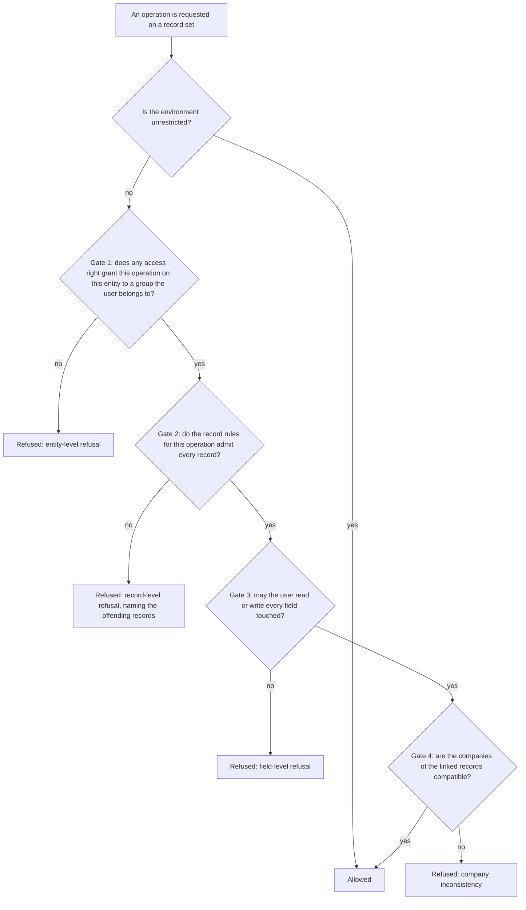

# The security model

Every read, write, creation and deletion in the system passes through the same four gates, in the same order, with the same messages. This document specifies them exactly: who the actors are, how groups and privilege families are organised, how access rights are checked, how record rules combine, how fields are restricted, what elevating privileges does and does not change, how company scope works, and how a record can be reached from outside with a signed token.

Read [the architecture](architecture.md) and [the entity and field system](entity-and-field-system.md) first. The presentation side of security — which menus and buttons a user sees — is in [views and actions](views-and-actions.md); it is guidance, not enforcement, and is never a substitute for the gates specified here.

---

## Table of contents

1. [The four gates](#1-the-four-gates)
2. [Users](#2-users)
3. [Groups](#3-groups)
4. [Access rights](#4-access-rights)
5. [Record rules](#5-record-rules)
6. [Field-level restrictions](#6-field-level-restrictions)
7. [The unrestricted actor and the elevate-privileges contract](#7-the-unrestricted-actor-and-the-elevate-privileges-contract)
8. [Company scoping](#8-company-scoping)
9. [Company consistency](#9-company-consistency)
10. [External access with signed tokens](#10-external-access-with-signed-tokens)
11. [Caching and invalidation of security decisions](#11-caching-and-invalidation-of-security-decisions)
12. [What is not enforcement](#12-what-is-not-enforcement)
13. [The shipped catalogue](#13-the-shipped-catalogue)
14. [Invariants a rebuild must preserve](#14-invariants-a-rebuild-must-preserve)
15. [Acceptance criteria](#15-acceptance-criteria)

---

## 1. The four gates



| Gate | Granularity | Direction | Combination |
|---|---|---|---|
| Access rights | Entity and operation | **Permissive**: absence of a grant means refusal | Disjunction: any grant suffices |
| Record rules | Individual record | **Restrictive**: absence of a rule means no restriction | Conjunction of global rules with the disjunction of the user's group rules |
| Field restrictions | Field and direction | **Permissive**: a restricted field requires membership | Disjunction over the listed groups, with negation supported |
| Company consistency | Relations between records | **Restrictive**: only checked where declared | Conjunction over the marked fields |

The asymmetry between gate one and gate two is deliberate and must be reproduced: **adding an access right grants, adding a record rule restricts**. A package cannot take away what another package granted at gate one; a package can always narrow at gate two.

---

## 2. Users

### 2.1 The entity

A user is a record of the User entity (`res.users`, table `res_users`). It embeds a Party record (`res.partner`, table `res_partner`) ([inheritance and extension, section 4](inheritance-and-extension.md#4-embedding-a-parent-record)), so a user has a name, an electronic mail address, an address, a language, a time zone and an image without duplicating them.

| Field (storage name) | Type | Meaning and rules |
|---|---|---|
| Sign-in name (`login`) | Text, required | The name used to sign in. Unique per tenant. |
| Password (`password`) | Text | Stored only as a verifier derived by a deliberately slow one-way function; never readable. |
| Set password (`new_password`) | Text, not stored | The write-only channel for changing the password. |
| Active (`active`) | Boolean, default true | An inactive user cannot sign in and is excluded from ordinary searches. |
| Shared (`share`) | Boolean, computed, stored | True when the user is **not** an internal user. Derived from group membership. |
| Main company (`company_id`) | Many-to-one to Company, required, default the environment's current company | The user's home company; the default company of records they create. |
| Allowed companies (`company_ids`) | Many-to-many to Company, association table `res_company_users_rel` | The companies the user may switch on. |
| Explicit groups (`group_ids`) | Many-to-many to Group, association table `res_groups_users_rel` | The groups assigned directly. |
| All groups (`all_group_ids`) | Many-to-many to Group, computed, elevated | The transitive closure of the explicit groups under implication. See [section 3.3](#33-the-implied-group-closure). |

### 2.2 The kinds of user

A user's kind is determined by which of three **mutually exclusive** groups they belong to, transitively.

| Kind | Group external identifier | Can sign in | Sees | Typical origin |
|---|---|---|---|---|
| Internal | `base.group_user` (internal user) | Yes | The back office | An employee |
| Portal | `base.group_portal` (portal user) | Yes | Only the portal | A customer or supplier given access to their own documents |
| Public | `base.group_public` (public user) | No — it is assumed, not signed into | Only public pages | Every anonymous visitor |

Two further identities exist that are not kinds:

| Identity | Meaning |
|---|---|
| The **root identity** | A fixed user identifier reserved for the platform. An environment whose acting user is the root identity is **always** unrestricted ([section 7](#7-the-unrestricted-actor-and-the-elevate-privileges-contract)). Used for the registry build, for package installation and for scheduled work that must not be restricted. |
| The **administrator** | An ordinary internal user who belongs to the settings group. Not privileged at the platform level; privileged only by group membership. |

### 2.3 Exclusivity of the kinds

The three kind groups are **disjoint**: no user may belong to more than one, transitively. The rule is enforced by a validation on group membership, on both the user and the group:

- On the user: the intersection of the user's transitive groups with the three kind groups must have at most one member; otherwise the write is refused with **"User "** the name **" cannot be at the same time in exclusive groups "** followed by the group names.
- On a group: changing a group's implications must not make any user violate the rule. Because checking every member of a large group would not scale, the check instead searches for a single active user who now belongs to two kind groups, and refuses if one is found.

Exclusivity matters because record rules and access rights are written on the assumption that a portal user is *not* an internal user.

### 2.4 Derived predicates

| Predicate | True when |
|---|---|
| Is internal | The user belongs to the internal-user group |
| Is portal | The user belongs to the portal-user group |
| Is public | The user belongs to the public-user group |
| Is system | The user belongs to the settings group (`base.group_system`) |
| Is administrator | The user is the root identity, **or** belongs to the access-rights group (`base.group_erp_manager`) |
| Is the root identity | The user's identifier equals the reserved one |

The environment exposes three of these directly: *unrestricted*, *administrator* (unrestricted, or the user is an administrator) and *system* (unrestricted, or the user is a system user).

### 2.5 At least one administrator

A validation refuses any change to group membership that would leave the tenant with **no** member of the settings group: **"You must have at least an administrator user."** The check is skipped while the foundation package is being installed, because during that window no user exists yet.

### 2.6 Asking about another user's groups

Asking whether a user belongs to a group is refused unless the asker is unrestricted, is asking about themselves, or is an internal user: **"You can ony call user.has_group() with your current user."** This prevents a portal user from enumerating other users' privileges.

### 2.7 The debug-only group

One group, `base.group_no_one` (technical features), is **only effective when the current request is in debug mode**. Membership alone is not enough. It is used to reveal technical detail — the list of failing record rules in a refusal message, technical menu entries — without exposing it in normal use.

---

## 3. Groups

### 3.1 The entity

A group is a record of the Group entity (`res.groups`, table `res_groups`).

| Field (storage name) | Type | Meaning |
|---|---|---|
| Name (`name`) | Text, required, translatable | The group's own name. |
| Full name (`full_name`) | Text, computed, not stored | The privilege family's name, a slash, and the group's name, when the group belongs to a family; otherwise the group's name. This is the group's display name. |
| Privilege family (`privilege_id`) | Many-to-one to Privilege Family, indexed | See [section 3.5](#35-privilege-families). |
| Sequence (`sequence`) | Integer | The order of the group within its family, which is also the order of the options a user-access screen offers. |
| Explicit members (`user_ids`) | Many-to-many to User, association table `res_groups_users_rel` | Users assigned to this group directly. |
| All members (`all_user_ids`) | Many-to-many to User, computed | Users in this group directly or through implication. |
| Member count (`all_users_count`) | Integer, computed | |
| Implied groups (`implied_ids`) | Many-to-many to itself, association table `res_groups_implied_rel` | Groups whose privileges members of this group also hold. |
| Transitively implied groups (`all_implied_ids`) | Many-to-many to itself, computed, recursive, elevated | This group together with everything it implies, transitively. |
| Implying groups (`implied_by_ids`) | Many-to-many to itself, the same association table with the columns swapped | The reverse relation. |
| Transitively implying groups (`all_implied_by_ids`) | Many-to-many to itself, computed, recursive, elevated | |
| Disjoint groups (`disjoint_ids`) | Many-to-many to itself, computed | For a kind group, the other two kind groups; empty otherwise. |
| Access rights (`model_access`) | One-to-many to Access Right | The rights granted to this group. |
| Record rules (`rule_groups`) | Many-to-many to Record Rule, association table `rule_group_rel`, deletion behaviour restrict | The rules attached to this group. |
| Menus (`menu_access`) | Many-to-many to Menu, association table `ir_ui_menu_group_rel` | The menus visible to this group. |
| Views (`view_access`) | Many-to-many to View, association table `ir_ui_view_group_rel` | The views applicable to this group. |
| Shared group (`share`) | Boolean | Marks a group created for sharing data with outside users. |
| Application key maximum duration (`api_key_duration`) | Decimal number of days | Caps the lifetime of application keys members may create. |
| Comment (`comment`) | Long text, translatable | |

Default display name: the full name. Searching on the full name splits the search text on a slash and matches the family's name against the part before and the group's name against the part after.

### 3.2 Membership

A user is a member of a group if the group is among the user's explicit groups, **or** is implied, transitively, by one of them. Nothing else confers membership: there is no rule-based membership, no membership by attribute, and no negative membership.

### 3.3 The implied-group closure

**Definition.**

```formula
closure( G )      = { G } ∪ ⋃ over H implied directly by G of closure( H )
groups_of( user ) = ⋃ over G in explicit_groups( user ) of closure( G )
```

Implication means "a member of this group also has the privileges of that group". A manager group implies the corresponding user group; a specialised role implies the general one.

**Rules.**

1. The closure includes the group itself.
2. The closure is computed elevated, so that computing it never fails for lack of access to a group record.
3. The closure is recursive and must be declared as such, so that changing an implication anywhere in the chain invalidates every group above it.
4. A cycle in the implication graph would make the closure infinite. The platform does not itself forbid cycles; the recursion terminates because the closure is a set and already-seen groups are not revisited, so a cycle simply means the whole cycle is one closure.
5. The closure is what every gate consults. A user's *explicit* groups are only an input.

**Worked example.** Groups: `sales_manager` implies `sales_user`; `sales_user` implies `internal`; `accounting_manager` implies `accounting_user`; `accounting_user` implies `internal`. A user explicitly in `sales_manager` and `accounting_user` has the closure `{sales_manager, sales_user, internal, accounting_user}` — four groups from two.

### 3.4 Searching by group

Searching for users in a group must find users who are in it **through implication**. The search on the transitive-group field therefore rewrites a condition naming group *G* into a condition naming *G* together with every group whose closure contains *G* — that is, every group that implies *G*, transitively.

### 3.5 Privilege families

A **privilege family** is a record of the Privilege Family entity (`res.groups.privilege`, table `res_groups_privilege`) that groups mutually-exclusive-in-practice groups into one choice on the user-access screen.

| Field (storage name) | Type | Meaning |
|---|---|---|
| Name (`name`) | Text, required, translatable | Shown as the label of the choice. |
| Description (`description`) | Long text | |
| Placeholder (`placeholder`) | Text, default the word for no | The label of the "none of these" option. |
| Sequence (`sequence`) | Integer, default 100 | Order of the families on the screen. |
| Category (`category_id`) | Many-to-one to Package Category, indexed | Which section of the screen the family appears in. |
| Groups (`group_ids`) | One-to-many to Group | The members of the family. |

Default ordering: sequence, then name, then identifier.

Rules:

1. A family is a **presentation** device. It carries no enforcement: nothing prevents a user from being in two groups of the same family, and the platform never checks.
2. The screen renders a family as a single selection whose options are the family's groups in sequence order, plus the placeholder. Choosing one option sets that group and clears the family's other groups.
3. Because the groups of a family are typically chained by implication — the manager implies the user — choosing the highest option confers the lower ones automatically, which is why the single-selection presentation is faithful.
4. A group with no family appears as an independent switch.

### 3.6 Group definitions as a compact set

For the sake of the many membership tests a single request performs, the platform maintains a compact representation of the group graph: a mapping from external identifier to identifier, the closure of each group, and the ability to express "the users who have access" as a set expression over groups — the empty set, the universe, or a union of closures. This representation is cached on the registry under a dedicated name and cleared whenever a group, an access right, a record rule or a group's external identifier changes.

### 3.7 Declaring group requirements

Several places name groups as a comma-separated list of external identifiers, optionally with a negation marker before a name. The evaluation:

1. A list consisting of a single full stop means **never**: no user satisfies it, not even an administrator — only an unrestricted environment bypasses it.
2. Otherwise split into positive names and negated names.
3. If the user is a member of **any** negated group, the requirement is not satisfied. Negatives are evaluated first.
4. Otherwise, if the user is a member of **any** positive group, the requirement is satisfied.
5. Otherwise the requirement is satisfied if and only if there were **no** positive names — a list of only negations means "anyone except these".

```formula
satisfied( user , spec ) =
    false                                         if spec = "."
    false                                         if user ∈ any negated group of spec
    true                                          if user ∈ any positive group of spec
    ( spec has no positive group )                otherwise
```

---

## 4. Access rights

### 4.1 The entity

An access right is a record of the Access Right entity (`ir.model.access`, table `ir_model_access`).

| Field (storage name) | Type | Meaning |
|---|---|---|
| Name (`name`) | Text | A label, conventionally the entity's transport name. |
| Entity (`model_id`) | Many-to-one to Entity Catalogue, required | The entity the right applies to. |
| Group (`group_id`) | Many-to-one to Group | The group granted. **Empty means every user**, which is a discouraged form: creating a right with no group and any permission set records a warning stating that every access-granting rule should specify a group. |
| Active (`active`) | Boolean, default true | An inactive right grants nothing. |
| Read (`perm_read`) | Boolean | |
| Write (`perm_write`) | Boolean | |
| Create (`perm_create`) | Boolean | |
| Delete (`perm_unlink`) | Boolean | |

### 4.2 The four operations

| Operation | Covers |
|---|---|
| `read` | Reading any field of the record, searching, grouping, exporting, and reading it through a relation from another record |
| `write` | Changing any field of the record, including through a relational command from another record |
| `create` | Creating a record, including through a relational create command |
| `unlink` | Deleting a record |

There is no separate "execute" permission: invoking a named business operation requires whatever the operation itself does, which is almost always write on the record.

### 4.3 The checking algorithm

**Preconditions.** An entity transport name, an operation, and the environment.

1. If the environment is unrestricted, allow.
2. Determine the acting user's transitive groups.
3. Compute the set of entities on which the user has that operation:
   - every entity for which an **active** access right exists whose operation flag is set and whose group is either empty or among the user's groups.
4. If the entity is in that set, allow.
5. Otherwise refuse, building the message of [4.4](#44-the-refusal-message).

The set in step 3 is computed once per (acting user, operation) and cached.

An entity that appears in **no** access right at all is therefore accessible to nobody except an unrestricted environment. The package build records a warning naming every persistent entity a package introduced with no access right, and suggests a line granting read to the internal-user group, so that the omission is noticed at installation time.

### 4.4 The refusal message

The refusal is composed of three paragraphs separated by blank lines.

**Paragraph one**, depending on the operation, with the entity's description and its transport name substituted:

| Operation | Text |
|---|---|
| `read` | "You are not allowed to access '\<entity description\>' (\<transport name\>) records." |
| `write` | "You are not allowed to modify '\<entity description\>' (\<transport name\>) records." |
| `create` | "You are not allowed to create '\<entity description\>' (\<transport name\>) records." |
| `unlink` | "You are not allowed to delete '\<entity description\>' (\<transport name\>) records." |

**Paragraph two.** The groups that *would* allow it are listed, each on its own line prefixed by a tab and a hyphen and a space, in the form family name, slash, group name — or just the group name when the group has no family — ordered by family name then group name with unfamilied groups last:

> "This operation is allowed for the following groups:" followed by the list

If no group allows it:

> "No group currently allows this operation."

**Paragraph three**, always:

> "Contact your administrator to request access if necessary."

Listing the allowing groups is deliberate: it turns an opaque refusal into an actionable request. It leaks the existence of group names, which is judged acceptable.

### 4.5 Ordering of the checks

Access rights are checked **before** record rules. A user with no read right on an entity is told so at the entity level and never learns whether a particular record exists. A user with the right but excluded by a rule receives the record-level refusal of [section 5.6](#56-the-refusal-message).

### 4.6 When rights are checked

| Situation | Check |
|---|---|
| A search | Read on the entity, before the query is built |
| Reading fields | Read on the entity; plus field restrictions |
| A write | Write on the entity, then the rules on the affected records **before** the write; and again on the result where the write moves a record out of the rules' reach |
| A creation | Create on the entity, then the rules on the created records **after** creation |
| A deletion | Delete on the entity, then the rules on the records before deletion |
| Reading through a relation | Read on the target entity, unless the relational field declares that access is bypassed on traversal |
| Applying a relational command | The operation the command implies, on the target entity |
| A default value containing relational commands | The operation each command implies, on the target ([entity and field system, section 13.2](entity-and-field-system.md#132-conversion-of-the-result)) |

Checking with an **empty** record set checks only the entity level, which is how a caller asks "may this user create records of this entity at all?".

---

## 5. Record rules

### 5.1 The entity

A record rule is a record of the Record Rule entity (`ir.rule`, table `ir_rule`).

| Field (storage name) | Type | Meaning |
|---|---|---|
| Name (`name`) | Text | A label, shown in refusal messages in debug mode. |
| Active (`active`) | Boolean, default true | An inactive rule restricts nothing. It exists so that a shipped rule can be switched off without deleting it, since deleting it would let the package recreate it on the next update. |
| Entity (`model_id`) | Many-to-one to Entity Catalogue, required, indexed, deletion behaviour cascade | |
| Groups (`groups`) | Many-to-many to Group, association table `rule_group_rel`, deletion behaviour restrict | The groups the rule is attached to. **Empty means the rule is global.** |
| Global (`global`) | Boolean, computed from the groups, stored | True when the rule has no group. |
| Filter (`domain_force`) | Long text | An expression producing the filter that defines which records the rule admits. |
| Read (`perm_read`) | Boolean, default true | |
| Write (`perm_write`) | Boolean, default true | |
| Create (`perm_create`) | Boolean, default true | |
| Delete (`perm_unlink`) | Boolean, default true | |

Default ordering: entity descending, then identifier.

Constraints:

- At least one operation flag must be set: **"Rule must have at least one checked access right!"**
- A rule may not be created on the Record Rule entity itself: **"Rules can not be applied on the Record Rules model."**
- An active rule's filter must evaluate and must be a valid filter for its entity; otherwise **"Invalid domain: "** followed by the failure.
- Privileged relational commands on this entity are forbidden, so a privileged operation cannot be tricked into rewriting rules through a relation.

### 5.2 The evaluation context

The filter is an expression evaluated in a restricted context providing exactly:

| Name | Value |
|---|---|
| The acting user | The user record, with an **empty context**, so that the filter's result does not depend on the ambient context |
| The allowed company identifiers | The identifiers of the environment's allowed companies, in order |
| The current company identifier | The environment's current company |

Nothing else is available: no arbitrary operations, no other entities, no clock beyond what the expression language offers.

The user record is deliberately stripped of its context so that two requests by the same user in different languages or with different instructions produce the same rule, which is what makes the result cacheable.

### 5.3 The combination rule

**Preconditions.** An entity, an operation, and the environment.

**Postcondition.** One filter that every visible record must satisfy.

**Algorithm.**

1. If the environment is unrestricted, the result is "everything" — no rule applies.
2. **Embedded parents first.** For each entity this one embeds through a **stored** link field, compute that parent entity's rule filter for the same operation, recursively. If it is not "everything", add the condition that the link traverses to a record matching it. This is why a rule on the party entity also restricts users, which embed a party.
3. Collect the applicable rules: every active rule on this entity whose operation flag is set, and which is either global or attached to at least one of the user's transitive groups. Order them by identifier.
4. Partition them:
   - a rule with no group is **global**;
   - a rule with groups, at least one of which the user belongs to, is a **group rule**. A rule whose groups the user does not belong to is skipped entirely.
5. Evaluate each rule's filter in the context of [5.2](#52-the-evaluation-context). A rule with an empty filter expression yields "everything".
6. Combine:

```formula
effective_filter = ( conjunction of every global rule's filter )
                   AND ( disjunction of every applicable group rule's filter )
                   AND ( conjunction of every embedded parent's effective filter, traversed )
```

7. If there are no applicable group rules, the disjunction term is omitted entirely — it does **not** become "nothing".
8. Normalise the result against the entity.

### 5.4 Why the combination is asymmetric

- **Global rules restrict everybody and are conjoined.** A global rule is an invariant of the tenant: "a record belongs to a company you are allowed in". Adding another global rule can only narrow.
- **Group rules are disjoined.** A group rule is a grant of visibility to a role: "a salesperson sees their own leads", "a sales manager sees the whole team's". Adding a group to a user can only widen. If group rules were conjoined, giving a user the manager role would *narrow* what they see, which is the opposite of the intent.

The consequence a rebuild must reproduce: **a user with no group rule on an entity is restricted only by the global rules**, and a user with one group rule is restricted to that rule's filter *in addition to* the global ones.

### 5.5 Worked example

Entity: Sales Order. Rules:

| Rule | Groups | Filter |
|---|---|---|
| Multi-company | none (global) | The order's company is among the allowed companies |
| Own orders | Salesperson | The order's salesperson is the acting user |
| Team orders | Team leader | The order's team is one the acting user leads |

| User | Groups | Effective filter |
|---|---|---|
| A | Salesperson | company allowed **and** salesperson is A |
| B | Salesperson, Team leader | company allowed **and** ( salesperson is B **or** team is led by B ) |
| C | Team leader only | company allowed **and** team is led by C |
| D | neither | company allowed |
| The root identity | — | everything |

Note user D: with no group rule at all, only the global rule applies, so D sees every order of the allowed companies. A rebuild that treats "no group rule" as "nothing visible" would produce a very different system.

### 5.6 The refusal message

When a record rule excludes at least one record of the set, the refusal is composed as follows.

**Paragraph one.**

> "Uh-oh! Looks like you have stumbled upon some top-secret records."
>
> (blank line)
>
> "Sorry, \<user name\> (id=\<user identifier\>) doesn't have '\<operation word\>' access to:"

where the operation word is the word for read, write, create or unlink.

**Paragraph two, ordinary mode.** One line naming the entity:

> "- \<entity description\> (\<transport name\>)"

**Paragraph two, debug mode.** Available only to an internal user who belongs to the technical-features group and whose request is in debug mode. Up to six of the offending records, each on its own line:

> "- \<entity description\>, \<record display name\> (\<transport name\>: \<identifier\>)"

and, when any failing rule's filter mentions the company field and the record's company is one the user belongs to, the line additionally carries ", company=\<company display name\>".

Followed by a blank line and:

> "Blame the following rules:" and one line per failing rule, each "- \<rule name\>"

**Paragraph three, always.**

> "If you really, really need access, perhaps you can win over your friendly administrator with a batch of freshly baked cookies."

**The multi-company addendum.** When any failing rule's filter mentions the company field, the resolution paragraph is extended:

| Situation | Added text |
|---|---|
| Several companies would give access, or none could be determined | A note stating that this might be a multi-company issue and that switching company may help |
| Exactly one company would give access and the user belongs to it | "\n\nThis seems to be a multi-company issue, you might be able to access the record by switching to the company: \<company display name\>." and the refusal carries that company as structured context so the client can offer a one-click switch |
| Exactly one company would give access and the user does not belong to it | "\n\nThis seems to be a multi-company issue, but you do not have access to the proper company to access the record anyhow." |

**Note on wording.** The first and third paragraphs are deliberately informal, and the multi-company note of the first case above carries a light aside. A rebuild must reproduce the *structure* — the operation and the user named, the offending entity or records listed, the failing rules listed in debug mode, the multi-company hint with its three cases and its structured company suggestion — and may supply its own wording for the informal sentences.

### 5.7 Determining which rules failed

To name the failing rules, the system does not evaluate rules one record at a time. It:

1. Takes all applicable rules for the operation, elevated and with the archive filter switched off so that archived records are considered.
2. Computes the disjunction of the **group** rules' filters and counts how many of the offending records it admits. If it admits all of them, the group rules are not at fault and none is reported.
3. For each **global** rule, counts how many of the offending records its filter admits; a rule admitting fewer than all of them is reported as failing.
4. Reports the selected group rules, if any, together with every failing global rule.

### 5.8 When rules are evaluated

| Situation | Evaluation |
|---|---|
| A search | The rule filter is conjoined into the generated query, so excluded records are simply absent — **no refusal is raised**. A search never tells a user that records were hidden. |
| Reading specific records | The rules are evaluated against those records; a refusal names them. |
| A write | Before the write, on the records being written; and, where the write could move a record outside the rules, again afterwards. |
| A creation | After creation, on the created records. |
| A deletion | Before deletion. |
| Traversal in a filter | The target entity's read rules are conjoined into the sub-query, unless the relational field declares that access is bypassed on traversal or the environment is unrestricted. |

The difference between *search* and *read specific records* is the most important practical consequence: a filter silently hides, a direct read refuses.

### 5.9 Rules and the archive flag

Rule evaluation always switches the archive filter **off**, so that an archived record excluded by a rule is still correctly reported as excluded by the rule rather than silently absent.

---

## 6. Field-level restrictions

### 6.1 The declaration

A field may declare a group requirement as a comma-separated list of group external identifiers, with optional negation, evaluated by the rule of [section 3.7](#37-declaring-group-requirements). A requirement consisting of a single full stop means the field is never accessible outside an unrestricted environment.

### 6.2 The check

```formula
may_access( user , field , direction ) =
    true                                     if the field declares no requirement
    true                                     if the environment is unrestricted
    false                                    if the requirement is "."
    satisfied( user , requirement )          otherwise
```

The same requirement governs **both** reading and writing; there is no separate read requirement and write requirement on a field. Finer control is achieved by making the field read-only for most users through the presentation layer and restricting writes with a record rule or a validation.

### 6.3 Where it is enforced

| Situation | Effect |
|---|---|
| Describing the fields of an entity | A field the user may not read is **omitted entirely** from the description, so a client never renders it. |
| Reading | Reading a restricted field refuses. |
| Writing | Writing a restricted field refuses. |
| A view | A node naming a restricted field is removed from the resolved view for that user. |
| Ordering, grouping, filtering | A condition or ordering term naming a restricted field refuses. |
| Export | A restricted field is not offered. |

Additionally, when the field description is produced, the read-only flag of a field the user may read but not write is forced true, so that a client shows it without offering to edit it.

### 6.4 The refusal message

> "You do not have enough rights to access the field "\<field name\>" on \<entity description\> (\<transport name\>). Please contact your system administrator."
>
> (blank line)
>
> "Operation: \<read or write\>"

When the acting user belongs to the technical-features group, two further lines are appended:

> "User: \<acting user identifier\>"
> "Groups: \<explanation\>"

where the explanation is:

| Requirement | Explanation |
|---|---|
| A single full stop | "always forbidden" |
| Absent (which means the refusal came from an entity-specific override) | "custom field access rules" |
| A list of groups | "allowed for groups " followed by the groups' display names, quoted and comma-separated, ordered by identifier |

### 6.5 Restricting a field against restricting an entity

| Requirement | Mechanism |
|---|---|
| Only accountants may see the cost price | A group requirement on the field |
| Only accountants may see journal entries at all | Access rights on the entity |
| Only accountants may see journal entries of their own company | A record rule |
| Only accountants may change the cost price, everyone may see it | A group requirement is **not** enough, since it governs both directions: use presentation-level read-only plus a validation or a rule |

---

## 7. The unrestricted actor and the elevate-privileges contract

### 7.1 What "unrestricted" means

An environment carries a boolean flag. When it is set, **every gate is bypassed**:

- access rights are not consulted;
- record rules yield "everything";
- field restrictions are satisfied;
- the company authorisation check on the allowed-company list is skipped;
- entities that forbid privileged relational commands refuse them (this is the one thing that becomes *more* restrictive).

### 7.2 What it does not change

| Unchanged | Consequence |
|---|---|
| The acting user identifier | The audit fields record the real actor. A record created by an elevated operation on behalf of user A records A as its creator. |
| The context | Language, time zone and company selection are carried over, except for the cleaning rule below. |
| The transaction and the unit of work | An elevated operation's writes are in the same transaction and visible to the surrounding restricted operation. |
| Declared validations | They still run — indeed they always run elevated anyway. |
| Database constraints | They still apply. |
| Company consistency | It still applies where declared. |

### 7.3 The root identity

The reserved root identifier is special in one way only: **any environment whose acting user is the root identity is unrestricted**, whether or not the flag was requested. There is no way to construct a restricted environment for the root identity.

### 7.4 The elevate-privileges contract

> An operation that elevates privileges takes responsibility for every access decision the gates would have made.

The obligations:

1. **Elevate the narrowest possible scope.** Elevate around the one read or write that needs it, not around a whole operation.
2. **Re-impose the intended restriction explicitly.** If the reason for elevating is "the user may not read the tax record but the invoice needs it", read the tax record elevated and do not expose it further.
3. **Never elevate on data the caller supplied.** Elevating and then writing a record whose identifier came from the request is how a caller performs an operation they could not perform directly. Where an elevated write must act on caller-supplied identifiers, check access on them **before** elevating.
4. **Never elevate to search.** An elevated search returns records the user cannot see; passing them back is a disclosure. Where an elevated search is genuinely needed — to compute an aggregate, to check existence — return only the derived answer.
5. **Do not elevate to work around a refusal.** A refusal that keeps recurring is a missing access right or an over-tight rule, not a case for elevation.

### 7.5 Context cleaning on elevation

When a **restricted** environment derives an **unrestricted** one and does not supply a context, the context is cleaned: keys that instruct the system to apply default values and keys that bind a specific active record are removed. Keys carrying language, time zone and company selection survive.

The reason: those keys were supplied by a less-privileged caller and would otherwise silently influence a privileged operation — a supplied default could set a field the caller may not write, and a supplied active record could redirect an operation.

When the caller supplies a context explicitly, no cleaning happens: the caller has taken responsibility.

### 7.6 Switching the acting user

Switching the acting user to another user produces a **restricted** environment for that user, unless the new user is the root identity, in which case it is unrestricted by [7.3](#73-the-root-identity).

This is different from elevating: it evaluates every gate as that other user. It is used when an operation must act genuinely on someone's behalf — rendering a notification as its recipient would see it, previewing a portal page, running a scheduled job as a configured user.

Switching to an empty user is a no-operation and returns the same environment.

### 7.7 Where elevation is unavoidable

| Case | Why |
|---|---|
| Computing a stored field | A stored value is shared by every reader, so it must not depend on who triggered it. Stored computations are elevated by default. |
| Declared validations | A validation may need to read records the user cannot, to check a global invariant. |
| Reading the acting user record | Otherwise establishing the user's own groups would require reading the user, which requires knowing the groups. |
| Resolving the implied-group closure | Same reason. |
| Package installation and the registry build | No user exists yet, and the schema must be changed. |
| Walking a hierarchy for the hierarchy operators | The whole tree must be walked; the filtering of forbidden records is left to the rules applied to the search as a whole. |
| Recomputation traversal | An archived or forbidden record's computed fields must still be maintained. |

---

## 8. Company scoping

### 8.1 The model

A tenant holds many legal **companies**. Companies form a tree: a company may have a parent, and the root of each tree is a *root company*. Most reference data is shared; most transactional data belongs to exactly one company.

Three things express company scope:

| Mechanism | What it does |
|---|---|
| A company field on the record | Says which company owns it. Empty means shared by all. |
| A global record rule per entity | Restricts visibility to records whose company is among the user's allowed companies |
| The company consistency check | Prevents records of incompatible companies from being linked |

### 8.2 The user's companies

| Field | Meaning |
|---|---|
| Main company | The user's home company; the default value of the company field on records they create. |
| Allowed companies | Every company the user may switch on. The main company must be among them. |

The set of a user's companies is computed by searching for **active** companies linked to the user, and is cached per user.

### 8.3 The selection

The environment's context may carry an ordered list of selected company identifiers. From it derive:

- the **current company**: the first identifier in the list, or the user's main company when the list is empty;
- the **allowed companies**: the listed companies, or *all* the user's companies when the list is empty.

**Authorisation.** In a restricted environment, every identifier in the list must be among the user's companies; otherwise the operation is refused with **"Access to unauthorized or invalid companies."** In an unrestricted environment the check is skipped, which is how an inter-company operation acts in a company the underlying user does not belong to.

**The empty-list default is all the user's companies, not the main one.** This matters for every operation performed outside an interactive session — printing a batch of documents from several companies, rendering a notification, serving an image — where dropping to the main company would silently hide records the user is entitled to see.

### 8.4 Switching company on a record set

Switching a record set to a company inserts that company at the **front** of the allowed-company list, keeping every other entry in order and removing any duplicate. It therefore changes the current company without narrowing the allowed set. Switching to the company that is already first is a no-operation.

Switching to an empty company is a no-operation.

### 8.5 The standard global rule

Entities with a company field carry a global record rule of the shape "the record's company is empty **or** among the allowed companies". Because it is global, it is conjoined with everything else, and because it reads the allowed companies from the evaluation context, switching companies changes what the user sees within one session without changing any group.

The rule's cache key therefore includes the allowed-company list, which is why the rule cache is keyed on the acting user, the unrestricted flag, the entity, the operation **and** the ordered company list.

### 8.6 Company-dependent values

A field may hold a different value per company on a shared record ([entity and field system, section 11](entity-and-field-system.md#11-company-dependent-values)). This is orthogonal to scoping: the record is shared, only the value differs. The value read is the one for the environment's **current** company, falling back to the per-entity default for that company.

---

## 9. Company consistency

### 9.1 What it prevents

Nothing in the gates above stops a user allowed in companies 1 and 2 from putting a company-1 account on a company-2 invoice: both records are visible to them. The consistency check exists for exactly that.

### 9.2 The declaration

A relational field declares that it participates. An entity declares whether the check runs automatically on every creation and write, or only where a capability invokes it.

### 9.3 The algorithm

**Preconditions.** A record set, and optionally the names of the fields to check.

1. Determine the fields to check. If no names are given, or the company field or the allowed-companies field is among them, check every field of the entity; otherwise only the named ones.
2. Keep the relational fields that declare participation, and split them into **ordinary** and **company-dependent**.
3. If neither list has a member, stop.
4. For each record:
   - **Ordinary fields.** Determine the record's companies:
     - if the entity *is* the company entity, the record itself;
     - else its company field, if it has one;
     - else its allowed-companies field, if it has one;
     - else skip this record with a warning naming the entity and the fields and stating that the entity has neither.
     For each participating field, read its value elevated; for each linked record, check the compatibility rule below.
   - **Company-dependent fields.** Check against the environment's **current company** instead, because a per-company value belongs to the company it was written for.
5. Collect at most the inconsistencies found and, if any, refuse with the message of [9.5](#95-the-refusal-message).

### 9.4 The compatibility rule

```formula
compatible( linked_record , owning_companies ) =
    ( company_of( linked_record ) is empty )  OR
    ( company_of( linked_record ) ∈ owning_companies )
```

An empty company on the linked record means "shared by all companies", which is why shared reference data may be linked from any company's documents.

An entity may override the rule. The user entity, for example, checks membership of the user's **allowed companies** rather than equality of the main company, so that a user allowed in two companies may be assigned to documents of either.

### 9.5 The refusal message

First line:

> "Uh-oh! You’ve got some company inconsistencies here:"

Then up to five lines, one per inconsistency, in one of three shapes:

| Situation | Line |
|---|---|
| The record is itself a company | "- Record is company “\<company name\>” while “\<field label\>” (\<field name\>: \<linked record names\>) belongs to another company." |
| The record is linked to itself through its own company field | "- Only a root company can be set on “\<record name\>”. Currently set to “\<company name\>”" |
| Otherwise | "- “\<record name\>” belongs to company “\<companies\>” while “\<field label\>” (\<field name\>: \<linked record names\>) belongs to another company." |

Last line:

> "To avoid a mess, no company crossover is allowed!"

### 9.6 Where the check runs

The check switches the archive filter off, so an archived linked record of the wrong company is still caught. It reads the linked records elevated, so that a user who cannot see the linked record still gets a correct answer rather than a spurious pass.

---

## 10. External access with signed tokens

### 10.1 The problem

A customer must be able to open their own quotation from a link in an electronic mail message without signing in, and without being able to open anyone else's. Neither access rights nor record rules can express this, because there is no identity to attach them to.

### 10.2 The record access token

An entity that participates in external access adopts a behaviour that adds two fields:

| Field (storage name) | Type | Meaning |
|---|---|---|
| Portal address (`access_url`) | Text, computed | The path at which the record is served externally. |
| Security token (`access_token`) | Text, not copied | An opaque random token. |
| Access warning (`access_warning`) | Long text, computed | A message shown above the externally served page, empty by default. |

Rules:

1. The token is created **on demand**, the first time a link is produced, as a version-four universally unique identifier written elevated. It is not created at record creation, so records never shared carry no token.
2. The token is **not copied** when a record is duplicated; a copy gets its own on demand.
3. The token is searchable only by the membership operators, so it cannot be probed with pattern matching.
4. Producing a share link first checks that the **producer** may read the record, so a user cannot mint a link to a record they cannot see.

### 10.3 The check

**Preconditions.** An entity name, a record identifier, and optionally a token supplied by the caller.

1. Browse the record elevated and check that it exists. If not, refuse with **"This document does not exist."**
2. Check read access **as the caller** — which may be the public user.
3. If the check passes, return the record elevated. The caller has ordinary access; the token is irrelevant.
4. If the check fails:
   - if no token was supplied, re-raise the refusal;
   - if the record carries no token, re-raise the refusal;
   - compare the supplied token with the stored one using a **constant-time** comparison; if they differ, re-raise the refusal.
5. Otherwise return the record **elevated**.

Three properties a rebuild must preserve:

1. **The comparison is constant-time.** A comparison that returns early on the first differing character leaks the token one character at a time.
2. **A valid token yields an elevated record**, not a restricted one. The token *is* the authorisation; once it matches, the gates are bypassed for that record.
3. **The token authorises one record**, not the entity. Nothing derived from the record inherits the authorisation automatically; each further record must be authorised on its own.

### 10.4 The correspondent signature

A second, different token identifies *who* is using a link, so that a comment posted from an external page can be attributed. It is a keyed digest, not a stored value:

```formula
signature = keyed_digest( key = tenant_secret ,
                          message = ( tenant_name , record_access_token , correspondent_identifier ) ,
                          function = a 256-bit secure hash )
```

Rules:

1. The key is the tenant's secret parameter. It is per tenant, so a signature from one tenant is worthless in another.
2. The message includes the tenant name, so the same record identifier in two tenants signs differently.
3. The message includes the record's own access token, so revoking the token invalidates every correspondent signature for that record.
4. The message includes the correspondent's identifier, so a signature identifies one correspondent for one record.
5. The entity must declare which of its fields is the record token used in the message; an entity that does not is refused with **"Model "** the transport name **" does not support token signature, as it does not have "** the field name **" field."**

### 10.5 The general signing helper

The same construction is used wherever the system must hand out a value it will later have to trust: unsubscribe links, one-time sign-up links, confirmation links, webhook callbacks.

```formula
signature = keyed_digest( key = secret , message = representation_of( ( scope , payload ) ) , function = a 256-bit secure hash )
```

| Element | Rule |
|---|---|
| Secret | The tenant's secret parameter unless an explicit secret is supplied. An empty secret is refused. |
| Scope | A non-empty string naming the purpose. An empty scope is refused with **"Non-empty scope required"**. Including the scope means the same payload signed for two purposes yields two different signatures, so a signature cannot be replayed in another context. |
| Payload | Any value with a stable textual representation. |
| Comparison | Constant-time. |

### 10.6 Neutralising a copy of a tenant

When a tenant is copied for testing, the copy must not be able to act on the outside world with the original's credentials. A neutralisation pass disables outgoing message servers, scheduled jobs and external service credentials. It does **not** rotate the tenant secret, so signatures minted by the original still verify in the copy; a rebuild that wants stronger isolation must rotate the secret and accept that every outstanding link breaks.

---

## 11. Caching and invalidation of security decisions

Security decisions are consulted many times per request and are therefore cached. Every cache must be invalidated exactly when the data it derives from changes.

| Cached answer | Key | Invalidated when |
|---|---|---|
| A user's transitive group identifiers | The user | The user's groups, active flag, language, time zone, main company or allowed companies change |
| The set of entities a user may operate on, per operation | The acting user and the operation | Any access right is created, written or deleted |
| The group expression for an entity and an operation | The entity and the operation | Any access right changes; any group changes |
| The compact group definitions | none | Any group, any group external identifier, any access right or any record rule changes |
| A user's companies | The user | Company membership or a company's active flag changes |
| An entity's effective rule filter | The acting user, the unrestricted flag, the entity, the operation and the ordered allowed-company list | Any record rule is created, written or deleted |
| The resolution of an external identifier | The identifier | The external identifier is written or deleted |

Three rules:

1. Every one of these invalidations also **signals other workers** through the counters of [the architecture, section 12](architecture.md#12-cross-process-coherence). A group changed by one worker must take effect in all of them.
2. Creating, writing or deleting an access right additionally invalidates the whole record cache, because a decision already made in this transaction may now be wrong.
3. Creating, writing or deleting a record rule flushes the unit of work before clearing the caches, so that the new rule is visible to everything that follows in the same transaction.

In development mode the rule cache is switched off entirely, so that editing a rule takes effect immediately.

---

## 12. What is not enforcement

Several mechanisms look like security and are not. Confusing them produces a rebuild with holes.

| Mechanism | What it actually does |
|---|---|
| A field marked read-only | Instructs the client not to offer editing. The transport can still write the field. |
| A view node carrying a group condition | Removes the node from the resolved view for users outside the group. The field is still readable over the transport unless the **field** is restricted. |
| A menu restricted to groups | Hides the menu. The action and the entity behind it are still reachable by anyone with the access rights. |
| A button restricted to groups | Hides the button. The operation is still callable. |
| A relational field's candidate restriction | Narrows the list a client offers. The transport can still write any identifier; a real constraint needs a validation. |
| An on-change reaction rule that refuses | Guides the user. A transport write with the same value succeeds. |
| Naming an operation with a leading underscore | Makes it unreachable from the transport. This **is** enforcement, and it is the only naming convention that is. |
| Marking an operation not remotely callable | Also enforcement. |

The rule: **if it can be observed only through a client, it is not enforcement.** Every real restriction is one of the four gates, the private-name rule, or a declared validation.

---

## 13. The shipped catalogue

The shipped system defines **140 groups**, organised into **29 privilege families**, granting **1,933 access rights** and restricted by **576 record rules**.

### 13.1 The foundational groups

| External identifier | Name | Role |
|---|---|---|
| `base.group_user` | Internal User | Every employee. The base of the back office. |
| `base.group_portal` | Portal | External correspondents with their own sign-in. |
| `base.group_public` | Public | Anonymous visitors. |
| `base.group_system` | Settings | Full configuration of the tenant. |
| `base.group_erp_manager` | Access Rights | May administer users, groups and access. Implied by the settings group. |
| `base.group_no_one` | Technical Features | Reveals technical detail; only effective in debug mode. |
| `base.group_multi_company` | Multi Company | Reveals the company switcher and the company field. |
| `base.group_multi_currency` | Multi Currency | Reveals currency fields and rates. |
| `base.group_partner_manager` | Contact Creation | May create parties. |
| `base.group_allow_export` | Allowed to Export | May export data. Absence of this group blocks every export. |

### 13.2 The shape of a capability's groups

A capability that is presented as an application almost always defines a privilege family with two or three graded groups:

| Grade | Typical name | Implies |
|---|---|---|
| Read-only | "Show \<capability\> — Readonly" | The internal-user group |
| User | "\<capability\> User" or the capability's own name | The read-only group |
| Manager | "\<capability\> Administrator" | The user group |

The grading is expressed by implication, which is what makes the single-selection presentation of a privilege family faithful ([section 3.5](#35-privilege-families)).

### 13.3 The shape of a record rule set

A capability that stores company-scoped documents almost always ships:

1. one **global** multi-company rule per entity;
2. one **group** rule per graded group, widening as the grade rises — often the highest grade's rule is simply "everything", expressed as a filter that is always true, whose purpose is to *widen* the disjunction and thereby neutralise the lower grades' narrow rules;
3. one or more **portal** rules restricting external users to records where they are the correspondent.

Point 2 is the idiom that makes the disjunctive combination of group rules work, and a rebuild must support it: a rule whose filter is always true is not a no-operation, it is a grant.

### 13.4 Complete catalogues

The complete lists — every group with its family, implications and members; every access right with its entity, group and four flags; every record rule with its entity, groups, filter and four flags — are in [the machine-readable operational catalogues](../../schemas/operational/README.md) and are rendered in [groups and access](../references/groups-and-access.md).

---

## 14. Invariants a rebuild must preserve

1. Access rights are permissive and combine by disjunction; an entity with no access right is reachable by nobody.
2. Record rules are restrictive; global rules conjoin, group rules disjoin, and a user with no applicable group rule is restricted only by the global ones.
3. Record rules of an embedded parent apply to the embedding entity, traversed through the link.
4. Access rights are checked before record rules, so a user without the entity-level right never learns whether a record exists.
5. A search silently hides records excluded by rules; a direct read refuses and names them.
6. A field's group requirement governs both reading and writing, and a field the user may not read is omitted from the field description entirely.
7. Elevating privileges changes what is allowed, never who is acting; audit fields record the real user.
8. Elevating from a restricted environment without an explicit context strips the default-value and active-record keys.
9. Any environment whose acting user is the root identity is unrestricted.
10. The three user kinds are mutually exclusive, transitively.
11. The implied-group closure includes the group itself and is computed elevated.
12. A group requirement of a single full stop is satisfied by nobody.
13. An empty allowed-company list means all the user's companies, not the main one.
14. A restricted environment may not select a company the user does not belong to; an unrestricted one may.
15. An empty company on a linked record is compatible with every owning company.
16. A record access token is compared in constant time and, when it matches, yields an elevated record for that record only.
17. Every signed value includes a non-empty scope and the tenant's secret.
18. Every security cache is invalidated and signalled to other workers when its source changes.

---

## 15. Acceptance criteria

### Users and groups

**AC-SEC-1.** *Given* group `manager` implying `user` implying `internal`, and a user explicitly in `manager` only, *when* the user's groups are resolved, *then* the result is exactly `manager`, `user` and `internal`.

**AC-SEC-2.** *Given* a user in the internal-user group, *when* a write adds them to the portal-user group, *then* the write is refused with "User" the name "cannot be at the same time in exclusive groups" naming both.

**AC-SEC-3.** *Given* a group whose implications are changed so that some active user would then be both internal and portal, *when* the change is written, *then* it is refused.

**AC-SEC-4.** *Given* a tenant with exactly one member of the settings group, *when* that user is removed from it, *then* the write is refused with "You must have at least an administrator user."

**AC-SEC-5.** *Given* a portal user, *when* they ask whether another user belongs to a group, *then* the call is refused with "You can ony call user.has_group() with your current user."

**AC-SEC-6.** *Given* a user who belongs to the technical-features group and a request not in debug mode, *when* membership of that group is tested, *then* the answer is false.

**AC-SEC-7.** *Given* the group requirement naming one positive group and one negated group, *when* a user in both is tested, *then* the requirement is not satisfied, because negatives are evaluated first.

**AC-SEC-8.** *Given* a group requirement consisting only of negated groups, *when* a user in none of them is tested, *then* the requirement is satisfied.

**AC-SEC-9.** *Given* a group requirement of a single full stop, *when* any user including an administrator is tested, *then* the requirement is not satisfied.

### Access rights

**AC-SEC-10.** *Given* an entity with no access right at all, *when* a restricted user reads it, *then* the read is refused; *when* an unrestricted environment reads it, *then* it succeeds.

**AC-SEC-11.** *Given* two access rights on one entity, one granting read to group A and one granting write to group B, *when* a user in A writes, *then* the write is refused; *when* a user in both writes, *then* it succeeds.

**AC-SEC-12.** *Given* a refused read on an entity whose description is "Journal Entry" and whose transport name is `account.move`, *when* the refusal is produced, *then* its first paragraph is "You are not allowed to access 'Journal Entry' (account.move) records.", its second lists the allowing groups as family-slash-group lines, and its third is "Contact your administrator to request access if necessary."

**AC-SEC-13.** *Given* the same entity where no group at all grants read, *when* the refusal is produced, *then* the second paragraph is "No group currently allows this operation."

**AC-SEC-14.** *Given* an access right whose active flag is false, *when* the check runs, *then* it grants nothing.

**AC-SEC-15.** *Given* an access right with no group and the read flag set, *when* it is created, *then* a warning is recorded stating that every access-granting rule should specify a group, and the right still grants read to everyone.

**AC-SEC-16.** *Given* a package introducing a persistent entity with no access right, *when* it is installed, *then* a warning lists the entity and suggests a granting line.

### Record rules

**AC-SEC-17.** *Given* a global rule and no group rule on an entity, *when* a user reads, *then* only the global rule restricts.

**AC-SEC-18.** *Given* one global rule and two group rules, the user belonging to both groups, *when* the effective filter is computed, *then* it is the global rule conjoined with the **disjunction** of the two group rules.

**AC-SEC-19.** *Given* one global rule and two group rules, the user belonging to neither group, *when* the effective filter is computed, *then* it is the global rule alone, and the group term is omitted rather than becoming "nothing".

**AC-SEC-20.** *Given* an entity embedding a parent that carries a record rule, *when* the effective filter is computed, *then* it includes a traversal condition on the link requiring the parent to satisfy the parent's own rule.

**AC-SEC-21.** *Given* a rule excluding some records and a **search**, *when* the search runs, *then* the excluded records are absent and no refusal is raised.

**AC-SEC-22.** *Given* the same rule and a **direct read** of an excluded record, *when* it runs, *then* it is refused and the message names the operation and the acting user.

**AC-SEC-23.** *Given* the same refusal for a user in the technical-features group in debug mode, *when* it is produced, *then* it lists up to six offending records with their display names and identifiers, and the names of the failing rules.

**AC-SEC-24.** *Given* a failing rule whose filter mentions the company field, and exactly one company that would give access which the user belongs to, *when* the refusal is produced, *then* the resolution paragraph names that company and the refusal carries it as structured context.

**AC-SEC-25.** *Given* a rule with no operation flag set, *when* it is created, *then* it is refused with "Rule must have at least one checked access right!"

**AC-SEC-26.** *Given* a rule whose filter expression does not evaluate, *when* it is created active, *then* it is refused with "Invalid domain: " followed by the failure.

**AC-SEC-27.** *Given* a rule on an archived record excluded by that rule, *when* the failing rules are determined, *then* the archive filter is off so the record is considered.

### Fields

**AC-SEC-28.** *Given* a field restricted to group A, *when* a user outside A requests the entity's field description, *then* the field is absent from the result.

**AC-SEC-29.** *Given* the same, *when* the user reads the field directly, *then* the read is refused with "You do not have enough rights to access the field" naming the field, the entity description and the transport name, and ending with the operation.

**AC-SEC-30.** *Given* a user in group A who may read but, by an entity-specific override, not write the field, *when* the field description is produced, *then* the read-only flag is true.

**AC-SEC-31.** *Given* a field restricted to a single full stop, *when* any user reads it, *then* the read is refused, and in debug mode the explanation is "always forbidden".

**AC-SEC-32.** *Given* a view naming a field restricted to group A, *when* a user outside A resolves the view, *then* the node is absent.

### Elevation

**AC-SEC-33.** *Given* a restricted user and an operation that elevates and creates a record, *when* the record is created, *then* its created-by field records the restricted user, not the root identity.

**AC-SEC-34.** *Given* a restricted environment whose context sets a default for a field and names an active record, *when* an elevated environment is derived with no explicit context, *then* those keys are absent and the language, time zone and company selection remain.

**AC-SEC-35.** *Given* the same, *when* the elevated environment is derived **with** an explicit context, *then* no cleaning happens.

**AC-SEC-36.** *Given* an environment for the root identity with the flag explicitly cleared, *when* an access check runs, *then* it is still bypassed.

**AC-SEC-37.** *Given* an elevated environment and an entity that forbids privileged relational commands, *when* a command targeting it is applied through a relation, *then* it is refused.

**AC-SEC-38.** *Given* an operation that switches the acting user to another user, *when* it runs, *then* every gate is evaluated as that other user and the environment is restricted.

### Companies

**AC-SEC-39.** *Given* a user allowed in companies 1 and 2 and a context selecting company 3, *when* the current company is resolved in a restricted environment, *then* the operation is refused with "Access to unauthorized or invalid companies."

**AC-SEC-40.** *Given* the same in an unrestricted environment, *when* the current company is resolved, *then* it is company 3.

**AC-SEC-41.** *Given* a user allowed in companies 1 and 2 and an empty selection, *when* the allowed companies are resolved, *then* both companies are returned, not only the main one.

**AC-SEC-42.** *Given* a record set with the selection [1, 2], *when* it is switched to company 2, *then* the selection becomes [2, 1] and the current company is 2.

**AC-SEC-43.** *Given* an entity with a company field and the standard global rule, *when* a user with selection [1] searches, *then* only records whose company is 1 or empty are returned.

**AC-SEC-44.** *Given* an invoice of company 1 and an account of company 2, both visible to the user, *when* the account is set on the invoice and the entity checks company consistency, *then* the write is refused with the message beginning "Uh-oh! You’ve got some company inconsistencies here:" and ending "To avoid a mess, no company crossover is allowed!".

**AC-SEC-45.** *Given* the same account with an empty company, *when* it is set on the invoice, *then* the write succeeds.

**AC-SEC-46.** *Given* a company-dependent participating field whose value points at a record of company 2 while the current company is 1, *when* the check runs, *then* it is refused, because company-dependent fields are checked against the current company.

### External access

**AC-SEC-47.** *Given* a record with no token and a share link being produced by a user who may read it, *when* the link is produced, *then* a token is created and stored elevated.

**AC-SEC-48.** *Given* a user who may not read the record, *when* they request a share link, *then* the request is refused before any token is created.

**AC-SEC-49.** *Given* a public caller and a correct token, *when* the record is requested, *then* the record is returned elevated.

**AC-SEC-50.** *Given* a public caller and a token differing in the last character, *when* the record is requested, *then* it is refused, and the comparison takes the same time as a correct one.

**AC-SEC-51.** *Given* a record that does not exist, *when* it is requested with any token, *then* the refusal is "This document does not exist."

**AC-SEC-52.** *Given* a record duplicated, *when* the copy is examined, *then* it carries no token.

**AC-SEC-53.** *Given* a correspondent signature for record R and correspondent P, *when* R's token is regenerated, *then* the old signature no longer verifies.

**AC-SEC-54.** *Given* the same payload signed with two different scopes, *when* the two signatures are compared, *then* they differ.

**AC-SEC-55.** *Given* a signing request with an empty scope, *when* it runs, *then* it is refused with "Non-empty scope required".

### Caching

**AC-SEC-56.** *Given* a cached decision that a user may read an entity, *when* the access right granting it is deleted, *then* the next check in any worker refuses.

**AC-SEC-57.** *Given* a cached rule filter for a user with selection [1], *when* the selection changes to [2], *then* a different cache entry is used and the filter reflects company 2.

**AC-SEC-58.** *Given* a record rule created inside a transaction, *when* a search runs later in the same transaction, *then* the new rule applies.

---

## Related documents

- [Architecture](architecture.md) — the environment that carries the acting user, the company selection and the unrestricted flag.
- [The entity and field system](entity-and-field-system.md) — field restrictions, company-dependent values, company consistency and the filter grammar the rules are written in.
- [Inheritance and extension](inheritance-and-extension.md) — how a package adds groups, rights and rules without touching another's.
- [Views and actions](views-and-actions.md) — the presentation-level group conditions that are guidance, not enforcement.
- [The package system](package-system.md) — the categories that name privilege families.
- [Identity and access](../domains/identity-and-access/README.md) — sign-in, passwords, second factors, application keys, delegated sign-in and sign-up.
- [Groups and access reference](../references/groups-and-access.md) — the complete catalogues.
