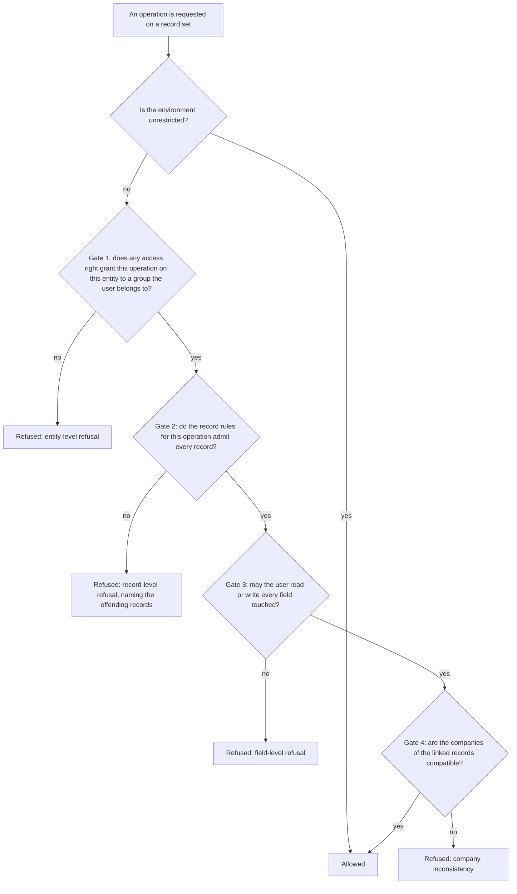

# The security model

Every read, write, creation and deletion in the system passes through the same gates, in the same order, with the same messages. This document specifies them exactly: how the acting identity of a request is established, who the actors are, how groups and privilege families are organised, how access rights are checked, how record rules combine, how fields are restricted, what each generic operation checks and when, what elevating privileges does and does not change, which operations are reachable from outside at all, how a session is protected, and how a record can be reached from outside with a signed token.

Read [the architecture](architecture.md) and [the entity and field system](entity-and-field-system.md) first. The presentation side of security — which menus and buttons a user sees — is covered in [section 18](#18-view-loading-and-menu-visibility) and in [views and actions](views-and-actions.md); it is guidance, not enforcement, and is never a substitute for the gates specified here.

Company scoping and company consistency have their own document, [multi-company](multi-company.md); [section 12](#12-company-scoping-and-company-consistency) states only what the gates need to know about them. The entity-by-entity field catalogues of User, Group, Privilege Family, Access Right and Record Rule, and the shipped groups, rules and settings, are in [identity and access](../domains/identity-and-access/README.md). The generic operations whose checks are listed here are specified in full in [record operations and query notation](record-operations-and-query-notation.md).

---

## Table of contents

1. [The layers at a glance](#1-the-layers-at-a-glance)
2. [The environment and the acting identity](#2-the-environment-and-the-acting-identity)
3. [Users](#3-users)
4. [Groups](#4-groups)
5. [Access rights](#5-access-rights)
6. [Record rules](#6-record-rules)
7. [Field-level restrictions](#7-field-level-restrictions)
8. [The checks performed by each generic operation](#8-the-checks-performed-by-each-generic-operation)
9. [Relational safeguards](#9-relational-safeguards)
10. [The unrestricted actor and the elevate-privileges contract](#10-the-unrestricted-actor-and-the-elevate-privileges-contract)
11. [Which operations are reachable from outside](#11-which-operations-are-reachable-from-outside)
12. [Company scoping and company consistency](#12-company-scoping-and-company-consistency)
13. [The authentication level of a request endpoint](#13-the-authentication-level-of-a-request-endpoint)
14. [Session security](#14-session-security)
15. [Establishing an identity](#15-establishing-an-identity)
16. [External access with signed tokens](#16-external-access-with-signed-tokens)
17. [External identities in practice](#17-external-identities-in-practice)
18. [View loading and menu visibility](#18-view-loading-and-menu-visibility)
19. [Caching and invalidation of security decisions](#19-caching-and-invalidation-of-security-decisions)
20. [What is not enforcement](#20-what-is-not-enforcement)
21. [Trust boundaries and construction rules](#21-trust-boundaries-and-construction-rules)
22. [The shipped catalogue](#22-the-shipped-catalogue)
23. [Message catalogue](#23-message-catalogue)
24. [Invariants a rebuild must preserve](#24-invariants-a-rebuild-must-preserve)
25. [Acceptance criteria](#25-acceptance-criteria)
26. [Reconciliation notes](#26-reconciliation-notes)

---

## 1. The layers at a glance

### 1.1 The four data gates



| Gate | Granularity | Direction | Combination |
|---|---|---|---|
| Access rights | Entity and operation | **Permissive**: absence of a grant means refusal | Disjunction: any grant suffices |
| Record rules | Individual record | **Restrictive**: absence of a rule means no restriction | Conjunction of global rules with the disjunction of the user's group rules |
| Field restrictions | Field and direction | **Permissive**: a restricted field requires membership | Disjunction over the listed groups, with negation supported |
| Company consistency | Relations between records | **Restrictive**: only checked where declared | Conjunction over the marked fields |

The asymmetry between gate one and gate two is deliberate and must be reproduced: **adding an access right grants, adding a record rule restricts**. A package cannot take away what another package granted at gate one; a package can always narrow at gate two.

### 1.2 The six layers of the whole mechanism

The four data gates sit inside a larger stack. A request must pass every layer.

| Layer | Granularity | Data that defines it | Default when nothing is declared | Composition | Specified in |
|---|---|---|---|---|---|
| 1. Authentication | The request | Credentials, session, application key | The request is anonymous and acts as the public user, or is refused | Not applicable | [Sections 14](#14-session-security) and [15](#15-establishing-an-identity) |
| 2. Endpoint authentication level | The request endpoint | The level declared on the endpoint | The endpoint declares one explicitly; there is no implicit default | Not applicable | [Section 13](#13-the-authentication-level-of-a-request-endpoint) |
| 3. Access rights | One entity, one operation | Access Right records | **Refuse**: an operation with no granting record is forbidden to everyone except an unrestricted environment | **Additive union** across the acting user's groups | [Section 5](#5-access-rights) |
| 4. Record rules | One record, one operation | Record Rule records | **Allow**: an operation with no applicable rule is permitted on every record | Global rules conjoin, group rules disjoin, the two sets conjoin | [Section 6](#6-record-rules) |
| 5. Field restrictions | One field, read or write | The group requirement declared on the field | **Allow**: a field with no requirement is accessible to everyone | A group expression evaluated against the acting user's groups | [Section 7](#7-field-level-restrictions) |
| 6. Operation exposure | One named operation | The naming convention and the private marker | A name beginning with an underscore, or carrying the private marker, is not callable from outside | Not applicable | [Section 11](#11-which-operations-are-reachable-from-outside) |

A seventh mechanism sits beside the six: a **token** ([section 16](#16-external-access-with-signed-tokens)) authorises one document for a holder who passes none of layers 3 to 5. It never widens an entity-wide permission.

Layers 3, 4 and 5 are the data-driven authorisation core. Layers 1, 2 and 6 gate the entry points. Two orthogonal switches modify the evaluation of layers 3, 4 and 5:

- **Unrestricted mode**, also called elevated rights: layers 3, 4 and 5 are skipped entirely for reading and writing. The acting user identity is unchanged.
- **The root identity**, the user whose identifier is `1`: an environment acting as that identity is *always* unrestricted and can never leave that state.

---

## 2. The environment and the acting identity

### 2.1 The four components

Every operation is evaluated inside an **environment** made of four components:

| Component | Meaning |
|---|---|
| The transaction | The unit of work and its database connection, shared by every environment of the request |
| The acting user identifier | The identifier of the User record on whose behalf the operation runs. It is the value written into the created-by and last-modified-by fields, and the value the record-rule evaluation context exposes as the acting user |
| The unrestricted flag | A boolean; when true, layers 3, 4 and 5 are not evaluated |
| The context | An immutable map of metadata: the selected companies, the language, the time zone, the default values to preload, and any package-specific key |

Two environments with the same four components are the same object. The platform reuses an existing environment rather than creating a duplicate, which is what makes the record cache shared between them.

### 2.2 Deriving the components

| Derivation | Rule |
|---|---|
| The acting **User record** | Read unrestricted, so that a user who cannot read the User entity can still be identified; the record is always readable to the platform itself |
| The **unrestricted flag** when the acting identity is the root identity | Forced true at construction; it can never be cleared |
| The **context** when entering unrestricted mode without an explicit context | Every key whose name marks a preloaded default value is dropped, so that the caller's preloaded defaults do not leak into the privileged operation; every other key survives, including the language, the time zone and the company selection |
| The **context** when switching the acting identity | Unchanged |
| The **transaction's default identity** | The first environment created in the transaction with a real numeric acting identifier becomes the transaction's default identity. It is used when a deferred flush has to run without an explicit environment, and it is the identity restored by the command protection of [section 9.3](#93-command-protection-on-sensitive-entities) |

### 2.3 The two transitions

Switching the acting identity and setting the unrestricted flag are the only two transitions. Their combined effect:

| Starting state | Transition | Resulting acting identifier | Resulting unrestricted flag |
|---|---|---|---|
| Any | Switch to a user that is not the root identity | That user | **False** |
| Any | Switch to the root identity | The root identity | **True** |
| Any | Switch to an empty user | Unchanged | Unchanged |
| Restricted, user *u* | Set unrestricted | *u* | True |
| Unrestricted, user *u* | Set unrestricted | *u* | True, and the same environment object is returned |
| Unrestricted, user *u* | Clear unrestricted | *u* | False |
| Unrestricted, root identity | Clear unrestricted | The root identity | **True** — the root identity can never leave unrestricted mode |
| Unrestricted, user *u* | Switch to user *v* | *v* | **False** — switching identity always clears the flag |

Worked example, starting from an ordinary request acting as a user named in the table as the first user:

| Step | Resulting acting identity | Resulting flag |
|---|---|---|
| Start | first user | restricted |
| Switch to the second user | second user | restricted |
| Switch to the root identity | root identity | unrestricted |
| Set unrestricted while acting as the first user | first user | unrestricted |
| Set unrestricted again | first user | unrestricted, same environment object |
| Clear unrestricted | first user | restricted |
| Clear unrestricted while acting as the root identity | root identity | unrestricted |
| Switch from an unrestricted first user to the second user | second user | restricted |

### 2.4 Consequences for authorship and audit

An operation running unrestricted still writes the **acting** user into the created-by and last-modified-by fields. Entering unrestricted mode therefore never hides who performed a change. Only switching the acting identity changes authorship. The two notions are never conflated: "runs unrestricted" means the checks are skipped; "runs as the platform identity" means the identity itself changes.

---

## 3. Users

### 3.1 The entity

A user is a record of the User entity (`res.users`, table `res_users`). It embeds a Party record (`res.partner`, table `res_partner`) ([inheritance and extension, section 4](inheritance-and-extension.md#4-embedding-a-parent-record)), so a user has a name, an electronic mail address, an address, a language, a time zone and an image without duplicating them.

| Field (storage name) | Type | Meaning and rules |
|---|---|---|
| Sign-in name (`login`) | Text, required | The name used to sign in. Unique per tenant. |
| Password (`password`) | Text | Stored only as a verifier derived by a deliberately slow one-way function; never readable. |
| Set password (`new_password`) | Text, not stored | The write-only channel for changing the password. |
| Active (`active`) | Boolean, default true | An inactive user cannot sign in and is excluded from ordinary searches. |
| Shared (`share`) | Boolean, computed, stored | True when the user is **not** an internal user. Derived from group membership: false exactly when the user belongs to the internal-user group directly or by implication, true otherwise, which also marks a user who belongs to none of the three kind groups. |
| Main company (`company_id`) | Many-to-one to Company, required, default the environment's current company | The user's home company; the default company of records they create. |
| Allowed companies (`company_ids`) | Many-to-many to Company, association table `res_company_users_rel` | The companies the user may switch on. |
| Explicit groups (`group_ids`) | Many-to-many to Group, association table `res_groups_users_rel` | The groups assigned directly. |
| All groups (`all_group_ids`) | Many-to-many to Group, computed, elevated | The transitive closure of the explicit groups under implication. See [section 4.3](#43-the-implied-group-closure). |

### 3.2 The kinds of user

A user's kind is determined by which of three **mutually exclusive** groups they belong to, transitively.

| Kind | Group external identifier | Can sign in | Sees | Typical origin |
|---|---|---|---|---|
| Internal | `base.group_user` (internal user) | Yes | The back office | An employee |
| Portal | `base.group_portal` (portal user) | Yes | Only the portal | A customer or supplier given access to their own documents |
| Public | `base.group_public` (public user) | No — it is assumed, not signed into | Only public pages | Every anonymous visitor |

### 3.3 The four special identities

| Identity | Identifier | Role | Protections |
|---|---|---|---|
| The **root identity** | `1` | Executes the registry build, package installation, data loading and scheduled work that must not be restricted | Permanently archived; an environment acting as it is always unrestricted; activating it is refused with "You cannot activate the superuser."; deleting it is refused with "You can not remove the admin user as it is used internally for resources created by the platform (updates, module installation, ...)" |
| The **administrator** | Defined in data | The first interactive settings administrator. An ordinary internal user, privileged only by group membership and not at the platform level | Deleting it is refused with "You cannot delete the admin user because it is utilized in various places (such as security configurations,...). Instead, archive it." |
| The **portal template user** | Defined in data, archived | The source of groups and preferences for a newly signed-up external account | Deleting it is refused with "Deleting the template users is not allowed. Deleting this profile will compromise critical functionalities." |
| The **public user** | Defined in data | The identity a request at the public endpoint level runs as when no session exists | Deleting it is refused with "Deleting the public user is not allowed. Deleting this profile will compromise critical functionalities." |

The public user is not privileged: it is an ordinary User record belonging only to the public-user group, and every layer applies to it exactly as to any other user. One public user exists per site, and one per company when a company needs its own ([section 17.1](#171-what-the-public-identity-is-and-is-not), and [multi-company, section 12.3](multi-company.md#123-the-public-identity-of-a-company)).

### 3.4 Exclusivity of the kinds

The three kind groups are **disjoint**: no user may belong to more than one, transitively. The disjointness is itself transitive: every group that implies the portal-user group is disjoint from every group that implies the internal-user group. The rule is enforced by a validation on group membership, on both the user and the group:

- On the user: the intersection of the user's transitive groups with the three kind groups must have at most one member; otherwise the write is refused with **"User "** the name **" cannot be at the same time in exclusive groups "** followed by the group names.
- On a group: changing a group's implications must not make any user violate the rule. Because checking every member of a large group would not scale, the check instead searches for a single active user who now belongs to two kind groups, and refuses if one is found.

Exclusivity matters because record rules and access rights are written on the assumption that a portal user is *not* an internal user.

### 3.5 Derived predicates

| Predicate | True when |
|---|---|
| Is internal | The user belongs to the internal-user group, evaluated unrestricted |
| Is portal | The user belongs to the portal-user group, evaluated unrestricted |
| Is public | The user belongs to the public-user group, evaluated unrestricted |
| Is system | The user belongs to the settings group (`base.group_system`), evaluated unrestricted |
| Is administrator | The user is the root identity, **or** belongs to the access-rights group (`base.group_erp_manager`) |
| Is the root identity | The user's identifier equals `1` |

The environment exposes three of these directly: *unrestricted* (the flag), *administrator* (unrestricted, or the acting user is an administrator) and *system* (unrestricted, or the acting user is a system user).

### 3.6 At least one administrator

A validation refuses any change to group membership that would leave the tenant with **no** member of the settings group: **"You must have at least an administrator user."** The check is skipped while the foundation package is being installed, because during that window no user exists yet.

Two further guards protect the user record: deactivating oneself is refused with **"You cannot deactivate the user you're currently logged in as."**, and activating the root identity is refused with the message of [section 3.3](#33-the-four-special-identities).

### 3.7 Asking about another user's groups

Asking whether a user belongs to a group is itself a gate, callable from outside. It is refused unless the asker is unrestricted, is asking about themselves, or is an internal user: **"You can ony call user.has_group() with your current user."** The message reproduces the spelling the system emits. This prevents a portal user from enumerating other users' privileges.

### 3.8 Reading and writing one's own user record

A user normally holds no access right on the User entity. Two exceptions make the preferences screen work without granting one:

1. **Self-readable fields.** When the record set is exactly the acting user and every requested field name is in the self-readable list, or names a context preference, the read is performed unrestricted. The field restriction of layer 5 is also relaxed: a field is readable when the ordinary check passes **or** the record is the acting user and the field is in the self-readable list.
2. **Self-writable fields.** When the record set is exactly the acting user and every key of the supplied values is in the self-writable list, the write is performed unrestricted. Before elevating, a company key whose value is not one of the user's allowed companies is silently **removed** from the values.

The two lists are fixed per installation and are extended by capability packages; they are catalogued in [identity and access](../domains/identity-and-access/entities.md). The relaxation applies to **reading** only; it never relaxes the write restriction for a field outside the self-writable list.

### 3.9 The debug-only group

One group, `base.group_no_one` (technical features), is **only effective when the current request is in debug mode**. Membership alone is not enough; it is implied by the internal-user group and by the settings group, so almost every internal user is a member.

| Test | Result |
|---|---|
| The user belongs to the technical-features group and the request is in debug mode | Satisfied |
| The user belongs to it and the request is not in debug mode | Not satisfied |
| The user does not belong to it | Not satisfied |

Everything keyed on this group is a display feature: the extended refusal messages of [sections 6.7](#67-the-refusal-message) and [7.5](#75-the-refusal-message), technical menu entries, technical view elements. A group requirement naming the technical-features group together with other groups is interpreted as a **conjunction**, not a disjunction: the element is shown when the user satisfies the other groups **and** the request is in debug mode. The platform implements this by removing the technical-features group from the requirement, remembering the flag separately, and marking the element invisible when the flag does not match the request mode.

---

## 4. Groups

### 4.1 The entity

A group is a record of the Group entity (`res.groups`, table `res_groups`). It is a named set of users, and it is the only thing permissions attach to.

| Field (storage name) | Type | Meaning |
|---|---|---|
| Name (`name`) | Text, required, translatable | The group's own name. |
| Full name (`full_name`) | Text, computed, not stored | The privilege family's name, a slash, and the group's name, when the group belongs to a family; otherwise the group's name. This is the group's display name. |
| Privilege family (`privilege_id`) | Many-to-one to Privilege Family, indexed | See [section 4.6](#46-privilege-families). |
| Sequence (`sequence`) | Integer | The order of the group within its family, which is also the order of the options a user-access screen offers. |
| Explicit members (`user_ids`) | Many-to-many to User, association table `res_groups_users_rel` | Users assigned to this group directly. |
| All members (`all_user_ids`) | Many-to-many to User, computed | Users in this group directly or through implication. |
| Member count (`all_users_count`) | Integer, computed | |
| Implied groups (`implied_ids`) | Many-to-many to itself, association table `res_groups_implied_rel` | Groups whose privileges members of this group also hold. |
| Transitively implied groups (`all_implied_ids`) | Many-to-many to itself, computed, recursive, elevated | This group together with everything it implies, transitively. |
| Implying groups (`implied_by_ids`) | Many-to-many to itself, the same association table with the columns swapped | The reverse relation. |
| Transitively implying groups (`all_implied_by_ids`) | Many-to-many to itself, computed, recursive, elevated | |
| Disjoint groups (`disjoint_ids`) | Many-to-many to itself, computed | For a kind group, the other two kind groups; empty otherwise. |
| Access rights (`model_access`) | One-to-many to Access Right | The rights granted to this group. |
| Record rules (`rule_groups`) | Many-to-many to Record Rule, association table `rule_group_rel`, deletion behaviour restrict | The rules attached to this group. |
| Menus (`menu_access`) | Many-to-many to Menu, association table `ir_ui_menu_group_rel` | The menus visible to this group. |
| Views (`view_access`) | Many-to-many to View, association table `ir_ui_view_group_rel` | The views applicable to this group. |
| Shared group (`share`) | Boolean | Marks a group created for sharing data with outside users. |
| Application key maximum duration (`api_key_duration`) | Decimal number of days | Caps the lifetime of application keys members may create. |
| Comment (`comment`) | Long text, translatable | |

Default display name: the full name. Searching on the full name splits the search text on a slash and matches the family's name against the part before and the group's name against the part after.

### 4.2 Membership

A user is a member of a group if the group is among the user's **explicit groups**, or is implied, transitively, by one of them. The result is the user's **effective groups**. Nothing else confers membership: there is no rule-based membership, no membership by attribute, and no negative membership.

Adding an implication grants the implied permissions **immediately** to every current member, with no new sign-in. A user cannot be removed from a group they hold by implication; attempting it is refused with **"It is not possible to remove implied group "** the group name **" from users "** followed by the user names.

### 4.3 The implied-group closure

**Definition.**

```formula
closure( G )      = { G } ∪ ⋃ over H implied directly by G of closure( H )
groups_of( user ) = ⋃ over G in explicit_groups( user ) of closure( G )
```

Implication means "a member of this group also has the privileges of that group". A manager group implies the corresponding user group; a specialised role implies the general one. The two directions of the relation are both editable and produce the same graph: "this group implies that one" and "that one is implied by this group" are the same edge.

**Rules.**

1. The closure includes the group itself.
2. The closure is computed unrestricted, so that computing it never fails for lack of access to a group record.
3. The closure is recursive and must be declared as such, so that changing an implication anywhere in the chain invalidates every group above it.
4. A cycle in the implication graph would make the closure infinite. The platform does not itself forbid cycles; the recursion terminates because the closure is a set and already-seen groups are not revisited, so a cycle simply means the whole cycle is one closure.
5. The closure is what every gate consults. A user's *explicit* groups are only an input.
6. The closure is computed once per installation state and cached; per user it is cached under the user identifier and invalidated whenever the user's groups change, whenever an implication changes, and whenever any group is created or deleted.

**Worked example.** Groups: `sales_manager` implies `sales_user`; `sales_user` implies `internal`; `accounting_manager` implies `accounting_user`; `accounting_user` implies `internal`. A user explicitly in `sales_manager` and `accounting_user` has the closure `{sales_manager, sales_user, internal, accounting_user}` — four groups from two.

### 4.4 Searching by group

Searching for users in a group must find users who are in it **through implication**. The search on the transitive-group field therefore rewrites a condition naming group *G* into a condition naming *G* together with every group whose closure contains *G* — that is, every group that implies *G*, transitively.

### 4.5 Declaring group requirements

Several places name groups as a comma-separated list of external identifiers, optionally with a negation marker before a name: a field's restriction, a view node's condition, a menu entry's condition.

The grammar is a list of entries separated by commas, each entry being an external identifier optionally preceded by the negation marker. The evaluation:

1. A list consisting of a single full stop means **never**: no user satisfies it, not even an administrator — only an unrestricted environment bypasses it.
2. Otherwise split into positive names and negated names.
3. If the user is a member of **any** negated group, the requirement is not satisfied. Negatives are evaluated first.
4. Otherwise, if the user is a member of **any** positive group, the requirement is satisfied.
5. Otherwise the requirement is satisfied if and only if there were **no** positive names — a list of only negations means "anyone except these".

```formula
satisfied( user , spec ) =
    false                                         if spec = "."
    false                                         if user ∈ any negated group of spec
    true                                          if user ∈ any positive group of spec
    ( spec has no positive group )                otherwise
```

As a set expression, the list denotes the union over each positive entry of the intersection of that entry with every negated entry; when there is no positive entry it denotes the intersection of the negated entries alone.

Worked examples:

| Requirement | Meaning | Internal user | Portal user | Settings administrator |
|---|---|---|---|---|
| The internal-user group | Internal users only | Satisfied | Not satisfied | Satisfied, because the settings group implies the internal-user group |
| The internal-user group and the portal-user group | Internal or portal | Satisfied | Satisfied | Satisfied |
| The internal-user group and the negated settings group | Internal users who are not settings administrators | Satisfied | Not satisfied | **Not satisfied** |
| The negated portal-user group alone | Everyone who is not a portal user | Satisfied | Not satisfied | Satisfied |
| A single full stop | Nobody | Not satisfied | Not satisfied | Not satisfied |

### 4.6 Privilege families

A **privilege family** is a record of the Privilege Family entity (`res.groups.privilege`, table `res_groups_privilege`) that groups mutually-comparable groups of one functional area into one choice on the user-access screen.

| Field (storage name) | Type | Meaning |
|---|---|---|
| Name (`name`) | Text, required, translatable | Shown as the label of the choice. |
| Description (`description`) | Long text | |
| Placeholder (`placeholder`) | Text, default the word for no | The label of the "none of these" option. |
| Sequence (`sequence`) | Integer, default 100 | Order of the families on the screen. |
| Category (`category_id`) | Many-to-one to Package Category, indexed | Which section of the screen the family appears in. |
| Groups (`group_ids`) | One-to-many to Group | The members of the family. |

Default ordering: sequence, then name, then identifier.

Rules:

1. A family is a **presentation** device. It carries no enforcement: nothing prevents a user from being in two groups of the same family, and the platform never checks. Every authorisation decision reads groups, never families.
2. The screen renders a family as a single selection whose options are the family's groups, plus the placeholder. Choosing one option sets that group and clears the family's other groups.
3. The options are ordered from weakest to strongest: by the number of the group's implied groups that also belong to the same family, then by the group's sequence, then by identifier. A group without a family sorts as if that count were zero.
4. Because the groups of a family are typically chained by implication — the manager implies the user — choosing the highest option confers the lower ones automatically, which is why the single-selection presentation is faithful.
5. A group with no family appears as an independent switch.
6. Group names are unique inside a family; a duplicate is refused with **"The name of the group must be unique within a group privilege!"**

### 4.7 The group expression algebra

Several mechanisms need to reason about "the set of users that satisfies a condition on groups" without enumerating users: the field restriction of layer 5, the group condition on a view node, the set of users allowed to perform an operation on an entity. They all use one algebra of **group expressions**.

**Atoms.** Every group is an atom. Two derived atoms exist: the **universe**, meaning all users, and the **empty set**, meaning no user. An atom may be negated.

**Facts the algebra knows** about atoms, derived from the group records:

| Fact | Source |
|---|---|
| One atom is a subset of another | The reflexive transitive closure of implication |
| Two atoms are disjoint | The transitive closure of the declared disjointness; the only declared disjointness is between the three kind groups |

**Normal form.** An expression is a union of intersections of possibly negated atoms. Construction normalises eagerly:

1. Inside one intersection, an atom that is a subset of another replaces it; two disjoint atoms collapse the whole intersection to the empty set; the universe atom is dropped.
2. Inside one union, an intersection contained in another is dropped; two intersections that differ only by the sign of one atom merge by dropping that atom; the universe absorbs the union; the empty set is dropped.
3. Intersection distributes over union.
4. Complement applies the two dualisation laws: the complement of an intersection is the union of the complements, and the complement of a union is the intersection of the complements.

**Membership test.** For a concrete user, given the identifier set of their effective groups:

1. If the expression is the empty set, the answer is false.
2. If the user's effective group set is empty, the answer is false.
3. If the expression is the universe, the answer is true.
4. Otherwise the answer is true when some intersection of the expression has every non-negated atom among the user's effective groups and no negated atom among them.

Step 2 is not redundant: a user with **no** effective group at all matches nothing, not even a purely negative expression.

**Worked examples.** Take the group graph in which `A1` is a subset of `A`, `A11` a subset of `A1`, and `B1`, `B2` and `BX` are subsets of `B` with `BX` disjoint from `B1` and from `B2`, plus unrelated groups `C` and `D`, `D` disjoint from `A` and from `B`.

| Expression | Normal form | Effective groups `A`, `C` | Effective groups `A`, `A1`, `C` | Effective groups `A`, `A1`, `A11`, `C` | Effective groups `C` alone |
|---|---|---|---|---|---|
| `A` | `A` | Matches | Matches | Matches | No |
| `A1` | `A1` | No | Matches | Matches | No |
| `A` or `B` | `A` or `B` | Matches | Matches | Matches | No |
| `B` or `C` | `B` or `C` | Matches | Matches | Matches | No |
| `A` and not `A11` | `A` and not `A11` | Matches | Matches | **No** | No |
| (`A11` or `B`) and not `D` | (`A11` and not `D`) or (`B` and not `D`) | No | No | Matches | No |
| (`A11` or `B`) and not `C` | (`A11` and not `C`) or (`B` and not `C`) | No | No | **No** | No |
| `A` and `B` | `A` and `B` | No | No | No | No |
| `B` and `BX` | `BX` | Not applicable | Not applicable | Not applicable | Not applicable |
| `B1` and `BX` | The empty set | Never matches | Never matches | Never matches | Never matches |
| `A1` and not `A` | The empty set | Never matches | Never matches | Never matches | Never matches |

**Ordering.** One expression is contained in another when every intersection of the first is contained in some intersection of the second. The universe is the greatest element and the empty set the least.

**Unknown atoms.** A requirement may name a group that does not exist in this installation, because the package that declares it is not installed. Such an atom is kept as an opaque atom that is a subset of nothing and a superset of nothing, sorts after every known atom, and never matches any user. The expression therefore behaves as if that alternative were unreachable, without failing.

### 4.8 Group definitions as a compact set

For the sake of the many membership tests a single request performs, the platform maintains a compact representation of the group graph: a mapping from external identifier to identifier, the closure of each group, and the ability to express "the users who have access" as a set expression over groups — the empty set, the universe, or a union of closures. This representation is cached on the registry under a dedicated name and cleared whenever a group, an access right, a record rule or a group's external identifier changes.

---

## 5. Access rights

### 5.1 The entity

An access right is a record of the Access Right entity (`ir.model.access`, table `ir_model_access`).

| Field (storage name) | Type | Meaning |
|---|---|---|
| Name (`name`) | Text | A label, conventionally the entity's transport name. |
| Entity (`model_id`) | Many-to-one to Entity Catalogue, required, deletion behaviour cascade | The entity the right applies to. |
| Group (`group_id`) | Many-to-one to Group, deletion refused while a right references it | The group granted. **Empty means every user**, including portal and public users. |
| Active (`active`) | Boolean, default true | An inactive right grants nothing. |
| Read (`perm_read`) | Boolean, default false | |
| Write (`perm_write`) | Boolean, default false | |
| Create (`perm_create`) | Boolean, default false | |
| Delete (`perm_unlink`) | Boolean, default false | |

A right grants only the operations whose flag it sets. Creating a right with no group and any permission set is accepted but records the warning **"Rule "** the name **" has no group, this is a deprecated feature. Every access-granting rule should specify a group."**

### 5.2 The four operations

| Operation | Covers |
|---|---|
| `read` | Reading any field of the record, searching, grouping, exporting, and reading it through a relation from another record |
| `write` | Changing any field of the record, including through a relational command from another record |
| `create` | Creating a record, including through a relational create command |
| `unlink` | Deleting a record |

In prose the four are "read", "modify", "create" and "delete". There is no separate "execute" permission: invoking a named business operation requires whatever the operation itself does, which is almost always write on the record.

### 5.3 The checking algorithm

**Preconditions.** An entity transport name, an operation, and the environment.

1. If the environment is unrestricted, allow.
2. Determine the acting user's effective groups.
3. Compute the set of entities on which the user has that operation: every entity for which an **active** access right exists whose operation flag is set and whose group is either empty or among the user's effective groups.
4. If the entity is in that set, allow.
5. Otherwise refuse, building the message of [5.5](#55-the-refusal-message).

The set in step 3 is computed with one statement selecting the distinct entities of the matching rights, and is cached under the pair of acting user and operation. Pending writes on the Access Right entity are flushed before the statement runs, so that a right created in the same transaction is visible.

Two properties follow:

- **Additive.** A user's permissions are the union over all their effective groups. A group granting read and create plus a group granting write yields read, create and write.
- **Refuse by default.** An entity that appears in **no** access right at all is accessible to nobody except an unrestricted environment. The package build records a warning naming every persistent entity a package introduced with no access right, and suggests a line granting read to the internal-user group, so that the omission is noticed at installation time.

### 5.4 The permitted-users expression

The same data answers the question "which users may perform this operation on this entity", used by the refusal message and by the view machinery of [section 18.1](#181-the-two-phase-view-pipeline):

1. Take every active access right for that entity whose flag for the operation is set.
2. If there are none, the answer is the empty set of users.
3. If any of them has an empty group, the answer is the universe.
4. Otherwise the answer is the union of the atoms of those rights' groups.

The result is cached per entity and operation and is independent of the acting user.

### 5.5 The refusal message

The refusal is composed of three paragraphs separated by blank lines.

**Paragraph one**, depending on the operation, with the entity's description and its transport name substituted. The description is the translated description of the entity, falling back to the transport name when the entity has none.

| Operation | Text |
|---|---|
| `read` | "You are not allowed to access '\<entity description\>' (\<transport name\>) records." |
| `write` | "You are not allowed to modify '\<entity description\>' (\<transport name\>) records." |
| `create` | "You are not allowed to create '\<entity description\>' (\<transport name\>) records." |
| `unlink` | "You are not allowed to delete '\<entity description\>' (\<transport name\>) records." |

**Paragraph two.** The groups that *would* allow it are listed, each on its own line prefixed by a tab character, a hyphen and a space, in the form family name, slash, group name — or just the group name when the group has no family — ordered by family name then group name with unfamilied groups last. Names are taken in the language of the acting user, falling back to the source language:

> "This operation is allowed for the following groups:" followed by the list

If no group allows it:

> "No group currently allows this operation."

**Paragraph three**, always:

> "Contact your administrator to request access if necessary."

Listing the allowing groups is deliberate: it turns an opaque refusal into an actionable request. It leaks the existence of group names, which is judged acceptable.

An informational line is written to the technical log naming the operation, the acting identifier and the entity's transport name.

### 5.6 Ordering of the checks

Access rights are checked **before** record rules. A user with no read right on an entity is told so at the entity level and never learns whether a particular record exists. A user with the right but excluded by a rule receives the record-level refusal of [section 6.7](#67-the-refusal-message).

### 5.7 When rights are checked

| Situation | Check |
|---|---|
| A search | Read on the entity, before the query is built |
| Reading fields | Read on the entity; plus field restrictions |
| A write | Write on the entity, then the rules on the affected records **before** the write |
| A creation | Create on the entity, then the rules on the created records **after** creation |
| A deletion | Delete on the entity, then the rules on the records before deletion |
| Reading through a relation | Read on the target entity, unless the relational field declares that access is bypassed on traversal |
| Applying a relational command | The operation the command implies, on the target entity |
| A default value containing relational commands | The operation each command implies, on the target ([entity and field system, section 13.2](entity-and-field-system.md#132-conversion-of-the-result)) |

Checking with an **empty** record set checks only the entity level, which is how a caller asks "may this user create records of this entity at all?".

### 5.8 Worked example

An entity carries exactly two access rights:

| Right | Group | Read | Write | Create | Delete |
|---|---|---|---|---|---|
| First | `group_one` | Yes | No | No | No |
| Second | `group_zero` | Yes | No | Yes | No |

The acting user belongs to `group_two` and the internal-user group; their effective groups contain neither `group_zero` nor `group_one`.

| Attempt | Outcome |
|---|---|
| Write a record | Refused. Paragraph one is the write header; paragraph two is "No group currently allows this operation."; paragraph three is the resolution line |
| Create a record | Refused. Paragraph one is the create header; paragraph two lists one line, `group_zero` |
| Read a field of a record | Refused. Paragraph one is the read header; paragraph two lists two lines, `group_zero` then `group_one` |

Adding the user to `group_one` makes reading succeed; creating still fails and still names `group_zero` alone.

---

## 6. Record rules

### 6.1 The entity

A record rule is a record of the Record Rule entity (`ir.rule`, table `ir_rule`).

| Field (storage name) | Type | Meaning |
|---|---|---|
| Name (`name`) | Text | A label, shown in refusal messages in debug mode. |
| Active (`active`) | Boolean, default true | An inactive rule restricts nothing. It exists so that a shipped rule can be switched off without deleting it, since deleting it would let the package recreate it on the next update. |
| Entity (`model_id`) | Many-to-one to Entity Catalogue, required, indexed, deletion behaviour cascade | |
| Groups (`groups`) | Many-to-many to Group, association table `rule_group_rel`, deletion behaviour restrict | The groups the rule is attached to. **Empty means the rule is global.** |
| Global (`global`) | Boolean, computed from the groups, stored | True exactly when the group list is empty. |
| Filter (`domain_force`) | Long text | An expression producing the filter that defines which records the rule admits. An empty expression means "always true". |
| Read (`perm_read`) | Boolean, default true | |
| Write (`perm_write`) | Boolean, default true | |
| Create (`perm_create`) | Boolean, default true | |
| Delete (`perm_unlink`) | Boolean, default true | |

Default ordering: entity descending, then identifier.

Unlike an access right, the four flags select the operations the rule is **checked for**. An operation whose flag is cleared behaves as if the rule did not exist for that operation.

Constraints:

- At least one operation flag must be set. The database constraint requires the disjunction of the four flags, with the message **"Rule must have at least one checked access right!"**
- A rule may not be created on the Record Rule entity itself: **"Rules can not be applied on the Record Rules model."**
- An active rule's filter must evaluate and must be a valid filter for its entity; otherwise **"Invalid domain: "** followed by the failure. The expression is revalidated whenever the active flag, the filter or the entity changes. A malformed expression, a condition naming a field that does not exist, and an expression that is statically false in a form the validator rejects are all refused; an empty expression, an expression that is always true, and a condition on an existing field are accepted.
- Privileged relational commands on this entity are forbidden, so a privileged operation cannot be tricked into rewriting rules through a relation ([section 9.3](#93-command-protection-on-sensitive-entities)).

### 6.2 The evaluation context

The filter is an expression evaluated in a restricted context providing exactly:

| Name | Value |
|---|---|
| The acting user | The user record, with an **empty context**, so that the filter's result does not depend on the ambient context |
| The allowed company identifiers | The identifiers of the environment's allowed companies, in order |
| The current company identifier | The environment's current company |

In addition the expression language's own date and time helpers are available. Nothing else is: no arbitrary operations, no other entities.

The user record is deliberately stripped of its context so that two requests by the same user in different languages or with different instructions produce the same rule, which is what makes the result cacheable.

**Worked confirmation.** A rule on an entity reads "the record's category is one of the categories the acting user can see", where the inner selection is itself performed through the acting user. A caller that sets a context key which a category-level override would use to hide some categories does **not** change the rule's outcome, because the user record was rebuilt with an empty context.

### 6.3 Selecting the applicable rules

1. If the environment is unrestricted, there are none.
2. Otherwise take every Record Rule record, ordered by identifier, whose entity is this one, which is active, whose flag for this operation is set, and which is either global or attached to at least one of the acting user's effective groups.

An operation name that is not one of the four is a programming error and is refused with **"Invalid mode: "** the value.

### 6.4 The combination rule

**Preconditions.** An entity, an operation, and the environment.

**Postcondition.** One filter that every visible record must satisfy.

**Algorithm.**

1. If the environment is unrestricted, the result is "everything" — no rule applies.
2. **Embedded parents first.** For each entity this one embeds through a **stored** link field, in declaration order, compute that parent entity's rule filter for the same operation, recursively. If it is not "everything", add the condition that the link traverses to a record matching it.
3. Collect the applicable rules of [6.3](#63-selecting-the-applicable-rules).
4. If there are none, the result is the conjunction of the conditions collected in step 2, which may be "everything".
5. Otherwise evaluate each rule's filter in the context of [6.2](#62-the-evaluation-context), reading the rules unrestricted, and re-check defensively that a rule with groups still intersects the user's effective groups, skipping it if not. A rule with an empty filter expression yields "everything".
6. Partition the evaluated conditions: those of rules with no group go to the global list, those of rules with groups go to the group list.
7. If the group list is not empty, append its **disjunction** to the global list.
8. The result is the conjunction of the global list, normalised against the entity.

```formula
effective_filter = ( conjunction of every global rule's filter )
                   AND ( disjunction of every applicable group rule's filter )
                   AND ( conjunction of every embedded parent's effective filter, traversed )
```

If there are no applicable group rules, the disjunction term is omitted entirely — it does **not** become "nothing".

### 6.5 Why the combination is asymmetric

- **Global rules restrict everybody and are conjoined.** A global rule is an invariant of the tenant: "a record belongs to a company you are allowed in". Adding another global rule can only narrow. Two global rules whose conditions do not overlap remove all access.
- **Group rules are disjoined.** A group rule is a grant of visibility to a role: "a salesperson sees their own leads", "a sales manager sees the whole team's". Adding a group to a user can only widen the group part. If group rules were conjoined, giving a user the manager role would *narrow* what they see, which is the opposite of the intent.
- **The two sets conjoin.** The first group rule added to an entity that already has global rules narrows access for the members of that group, because the group part is conjoined with the global part. An entity with only group rules, none applicable to this user, falls back to "everything" at step 4, so adding a group rule for a *different* group narrows nothing for this user.

The consequence a rebuild must reproduce: **a user with no applicable group rule on an entity is restricted only by the global rules**, and a user with one group rule is restricted to that rule's filter *in addition to* the global ones.

**Embedded parents.** Step 2 is what makes an embedding entity inherit the record visibility of its embedded parent. When an entity embeds a parent through a stored link field and a rule on the parent restricts the parent's records, a child record whose parent is hidden is invisible, is not returned by a search, and is refused by the permission check. The recursion is depth-first over the embedding map and applies at every level. This is why a rule on the party entity also restricts users, which embed a party.

### 6.6 Worked examples

**Example one: a mixed rule set.** Entity Sales Order. Rules:

| Rule | Groups | Filter |
|---|---|---|
| Multi-company | none (global) | The order's company is among the allowed companies |
| Own orders | Salesperson | The order's salesperson is the acting user |
| Team orders | Team leader | The order's team is one the acting user leads |

| User | Groups | Effective filter |
|---|---|---|
| A | Salesperson | company allowed **and** salesperson is A |
| B | Salesperson, Team leader | company allowed **and** ( salesperson is B **or** team is led by B ) |
| C | Team leader only | company allowed **and** team is led by C |
| D | neither | company allowed |
| The root identity | — | everything |

Note user D: with no group rule at all, only the global rule applies, so D sees every order of the allowed companies. A rebuild that treats "no applicable group rule" as "nothing visible" would produce a very different system.

**Example two: composition and blame.** An entity carries a whole-number field and a company field. The acting user belongs to one group. Every rule below sets only the write flag. The record under test holds the value 0.

| Case | Rules | Composed filter for write | Blamed rules |
|---|---|---|---|
| One group rule | Rule 0, group rule: value equals 42 | value equals 42 | Rule 0 |
| Two group rules | Rule 0: value equals 42; rule 1: value equals 78 | value equals 42 **or** value equals 78 | Rule 0 and rule 1, as a block |
| Two global rules, both failing | Rule 0 global: value equals 42; rule 1 global: value equals 78 | value equals 42 **and** value equals 78 | Rule 0 and rule 1 |
| Two global rules, one failing | Rule 0 global: value equals 42; rule 1 global: always true | value equals 42 | Rule 0 only |
| Combination | Rule 0 global: value equals 42; rule 1 global: always true; rule 2 group: always false; rule 3 group: value equals 55 | value equals 42 **and** always true **and** ( always false **or** value equals 55 ) | Rule 0, rule 2 and rule 3 |

The last line shows the two reporting styles side by side: the global rule 1 is not blamed because it holds on its own, while both group rules are blamed because the block failed.

**Example three: archived records.** Rules: rule 0, global, for read, admitting records whose company is among the allowed companies or empty; rule 1, a group rule for read, admitting records whose value is 1. The record has the value 0, belongs to an allowed company, and is **archived**. Reading a field of it is refused, and the blamed set is rule 1 alone. Had the verification kept the archive filter on, the record would have been filtered out before rule 0 was evaluated and rule 0 would have been blamed as well.

**Example four: group rules never widen past a global rule.** On the party entity the global rule admits a party that is not a shared party, or whose company is an ancestor of an allowed company, or whose company is empty; the group rule for portal and public users admits parties that are descendants of the acting user's commercial party. For an internal user the group rule is not applicable, so the composed filter is the global condition alone. For a portal user the composed filter is the global condition **and** the descendant condition. Adding a second group rule for portal users, admitting the user's own party, changes only the second factor, which becomes "descendant of the commercial party **or** equal to the own party". The first factor is unchanged, so a portal user can never be granted a party the global rule hides.

### 6.7 The refusal message

When a record rule excludes at least one record of the set, the refusal is composed as follows.

**Paragraph one.**

> "Uh-oh! Looks like you have stumbled upon some top-secret records."
>
> (blank line)
>
> "Sorry, \<user name\> (id=\<user identifier\>) doesn't have '\<operation word\>' access to:"

where the operation word is the word for read, write, create or unlink.

**Paragraph two, ordinary mode.** One line naming the entity:

> "- \<entity description\> (\<transport name\>)"

**Paragraph two, debug mode.** Available only to an internal user who belongs to the technical-features group and whose request is in debug mode. Up to six of the offending records, each on its own line:

> "- \<entity description\>, \<record display name\> (\<transport name\>: \<identifier\>)"

and, when any failing rule's filter mentions the company field and the record's company is one the user belongs to, the line additionally carries ", company=\<company display name\>".

Followed by a blank line and:

> "Blame the following rules:" and one line per failing rule, each "- \<rule name\>"

Because portal and public users never belong to the technical-features group, they never see record display names or rule names.

**Paragraph three, always.**

> "If you really, really need access, perhaps you can win over your friendly administrator with a batch of freshly baked cookies."

**The multi-company addendum.** When any failing rule's filter text mentions the company field, a suggested company is computed for the listed records ([multi-company, section 5.5](multi-company.md#55-the-multi-company-hint-on-a-refusal)) and the resolution paragraph is extended:

| Situation | Added text |
|---|---|
| The listed records suggest more than one distinct company | A note stating that this might be a multi-company issue and that switching company may help, followed by a short informal aside that a rebuild replaces with its own wording |
| Exactly one company would give access and the user belongs to it | "\n\nThis seems to be a multi-company issue, you might be able to access the record by switching to the company: \<company display name\>." and the refusal carries that company's identifier and display name as structured context so the client can offer a one-click switch |
| Exactly one company would give access and the user does not belong to it | "\n\nThis seems to be a multi-company issue, but you do not have access to the proper company to access the record anyhow." |
| No company can be suggested, because the entity has no company field | Nothing is added |

**The embedding wrapper.** When the refusal happened while reaching an embedded parent through a child record, the parent's message is wrapped with a further paragraph:

> "Implicitly accessed through '\<child entity description\>' (\<child transport name\>)."

The same wrapper is applied when a related field's path could not be traversed because an intermediate record was unreadable, naming the entity that owns the related field.

**Note on wording.** The first and third paragraphs are deliberately informal. A rebuild must reproduce the *structure* — the operation and the user named, the offending entity or records listed, the failing rules listed in debug mode, the multi-company hint with its three cases and its structured company suggestion, the embedding wrapper — and may supply its own wording for the informal sentences.

**Logging and cache hygiene.** An informational line naming the operation, up to six offending identifiers, the acting identifier and the entity's transport name is written to the technical log. Building the message reads the display names of the rejected records unrestricted; the cache entries of those records are therefore **invalidated** after the message is built, so that the elevated reads leave no readable values behind for the refused caller. This is observable: after a refusal, a second attempt to read a field of the same record must refuse again rather than return a cached value.

### 6.8 Determining which rules failed

To name the failing rules, the system does not evaluate rules one record at a time. It:

1. Takes all applicable rules for the operation, reading them unrestricted and with the archive filter switched off so that archived records are considered.
2. Takes the rules with groups intersecting the acting user's effective groups, computes the disjunction of their conditions, and counts how many of the offending records it admits. If it admits all of them, the group block is not at fault and none of its rules is reported.
3. For each **global** rule, counts how many of the offending records its condition admits on its own; a rule admitting fewer than all of them is reported as failing.
4. Reports the selected group rules, if any, together with every failing global rule, presented in the acting user's environment.

Group rules are reported **as a block** because they are disjoined: either the block succeeds or it fails, and blaming one of them individually would mislead. Global rules are reported **individually**, because each must hold on its own.

### 6.9 The two application modes

Two modes exist and both must be implemented, because they differ observably.

| Mode | Where | Effect |
|---|---|---|
| **Query restriction** | Any search, count, grouped read, relation traversal or sub-condition evaluation | The composed filter is added to the query as an extra condition. Records that fail are simply absent; no refusal is raised. |
| **Record verification** | The permission check on a known set of records: the explicit check, its non-raising twin, the filtering variant, and the checks performed by write, delete and the post-creation check of create | The composed filter is evaluated against the given records, unrestricted and with the archive filter switched off. The records that fail form the forbidden set. |

Record verification switches the archive filter off deliberately: a rule that would otherwise be reported as failing merely because the record is archived must not be blamed. Verification is skipped entirely when the record set contains only in-memory records that have no database identifier yet.

The difference between *search* and *read specific records* is the most important practical consequence: a search silently hides, a direct read refuses.

| Situation | Evaluation |
|---|---|
| A search | Query restriction; excluded records are absent, no refusal |
| Reading specific records | Record verification; a refusal names them |
| A write | Record verification before the write, on the records as they are before it |
| A creation | Record verification after creation, on the created records |
| A deletion | Record verification before deletion |
| Traversal in a filter | The target entity's read rules are conjoined into the sub-query, unless the relational field declares that access is bypassed on traversal or the environment is unrestricted |

### 6.10 The empty record set convention

The explicit check invoked on an **empty** record set checks the access rights only: there is no record to verify. This is the canonical way to ask "may this user perform this operation on this entity at all", and it is what every search does before building its query.

The non-raising twin returns false instead of refusing and is consistent with the raising form on the same inputs. The filtering variant returns the subset of the given records that passes both layers; it never refuses, and on an entity the user cannot touch at all it returns the empty set.

---

## 7. Field-level restrictions

### 7.1 The declaration

A field may declare a group requirement, written in the comma-separated notation of [section 4.5](#45-declaring-group-requirements). Three states exist:

| Declared value | Meaning |
|---|---|
| Absent | The field is accessible to everyone |
| A single full stop | The field is **never** accessible, and it is removed from the field descriptions and the resolved views even for an unrestricted environment |
| A requirement | The field is accessible to the users matching the expression |

The requirement is a property of the **field definition**, not of a record. It is therefore identical for every record of the entity.

### 7.2 Propagation to derived fields

- A **related field** copies the requirement of the field it points at, unless it declares its own.
- An **exposed field** of an embedding entity likewise copies the requirement of the parent's field unless it declares its own.
- A **computed field** inherits nothing; it must declare its own requirement if the values it exposes are sensitive.

### 7.3 The check

1. If the field declares no requirement, allow.
2. If the environment is unrestricted, allow.
3. If the requirement is a single full stop, refuse.
4. Otherwise evaluate the requirement against the acting user's effective groups.

```formula
may_access( user , field , direction ) =
    true                                     if the field declares no requirement
    true                                     if the environment is unrestricted
    false                                    if the requirement is "."
    satisfied( user , requirement )          otherwise
```

Step 2 sits after step 1 and **before** step 3, with one observable consequence: an unrestricted environment can read and write a field marked never accessible, yet that field is still removed from the field descriptions and from the resolved views ([7.6](#76-effects-on-what-a-client-receives)), because those are built from the requirement text without consulting the unrestricted flag.

The same requirement governs **both** reading and writing; there is no separate read requirement and write requirement on a field. Finer control is achieved by making the field read-only for most users through the presentation layer and restricting writes with a record rule or a validation.

One entity overrides the rule: on the User entity, reading is additionally allowed when the record is the acting user and the field is self-readable ([section 3.8](#38-reading-and-writing-ones-own-user-record)).

### 7.4 Where it is enforced

| Entry point | Operation checked | Behaviour on failure |
|---|---|---|
| Reading one field of one record | Read | Refuses |
| Reading a field of a multi-record set | Read | Refuses before any value is produced |
| Fetching an explicit list of field names | Read | Refuses, for every named field, before any statement is issued |
| The implicit fetch of every prefetchable field | Read | The inaccessible fields are **silently removed** from the list; no refusal |
| Following the stored dependencies of a non-stored field during a fetch | Read | An inaccessible stored dependency is **silently skipped**; no refusal |
| Building the field descriptions | Read | The field is omitted from the result entirely |
| A write with supplied values | Write | Refuses, for every key of the values, before anything is written |
| A creation with supplied values | Write | Refuses, for every key of the values **and for every preloaded default key of the context**, before anything is written |
| Translating a field's stored text | Write | Refuses |
| A condition on the field inside a search filter | Read | Refuses when the condition is converted for the query |
| A condition on the field inside a sub-condition on a relation | Read | Refuses, evaluated on the related entity |
| An ordering term naming the field | Read | Refuses when the ordering is converted for the query |
| A grouping key naming the field | Read | Refuses |
| An aggregate naming the field | Read | Refuses |
| A view | Read | A node naming the field is removed from the resolved view, together with its label node |
| Export | Read | The field is not offered |
| The default values returned for a form | Write | An exposed field is routed to the parent's default computation only when its write permission holds |

The asymmetry between the fourth and fifth rows and the rest is deliberate: an implicit "read everything that is cheap to read" must not fail because one field is restricted, while an explicit request for a named field must fail.

### 7.5 The refusal message

> "You do not have enough rights to access the field "\<field name\>" on \<entity description\> (\<transport name\>). Please contact your system administrator."
>
> (blank line)
>
> "Operation: \<read or write\>"

When the acting user belongs to the technical-features group in a request in debug mode, two further lines are appended:

> "User: \<acting user identifier\>"
> "Groups: \<explanation\>"

where the explanation is:

| Requirement | Explanation |
|---|---|
| A single full stop | "always forbidden" |
| Absent, which means the refusal came from an entity-specific override | "custom field access rules" |
| A list of groups | "allowed for groups " followed by the groups' display names, quoted and comma-separated, ordered by identifier |

A technical log line is written naming the operation, the acting identifier, the entity's transport name and the field name.

### 7.6 Effects on what a client receives

1. **Field descriptions.** A field the acting user may not read is absent from the description map. A field the user may read but not write is returned with its read-only flag forced true, so that a client shows it without offering to edit it.
2. **View definitions.** Every node of a view bound to a field the acting user may not read is removed from the served definition, together with its label node. The removal happens after the view has been assembled and cached, so the cached assembly is user-independent and only the final filtering is per user ([section 18.1](#181-the-two-phase-view-pipeline)).
3. **Entity-level read-only.** When the acting user may neither write nor create records of the entity, every field in the description map is returned with its read-only flag forced true.

**Worked example.** A field holding the number of decimal places on the Currency entity carries no requirement. A form view shows a separate label node for it plus the field node. With no requirement, the description map contains the field and the served view contains both nodes. A requirement naming one group is then declared on the field and the acting user is not a member: the description map no longer contains the field and the served view contains neither node. The user is then added to the group: all three reappear.

### 7.7 Worked example of the two refusals

An entity declares one field with a requirement naming the portal-user group and a test group, and another field with the never-accessible marker. The acting user belongs to the internal-user group only.

| Attempt | Message |
|---|---|
| Read the restricted field | The three lines of [7.5](#75-the-refusal-message) naming that field, with "Operation: read"; in debug mode, additionally the user identifier and "Groups: allowed for groups 'Role / Portal', 'Test Group'" |
| Read the never-accessible field | The same three lines naming that field, and in debug mode "Groups: always forbidden" |
| Write values naming the restricted field and another field | Refused on the **first** offending key in the order the values are given, with "Operation: write" |
| Search with a condition on the never-accessible field | Refused |
| Search with a condition on that field reached through a relation | Refused, evaluated on the related entity |
| Search with a sub-condition on a relation naming that field | Refused |
| Search on an entity that embeds this one, with a condition on that field | Refused |
| Order by that field, ascending or descending, alone or after another term | Refused |
| Group by that field | Refused |
| Aggregate that field | Refused |
| Group by an unrestricted field with no restricted field named | Allowed |

### 7.8 Restricting a field against restricting an entity

| Requirement | Mechanism |
|---|---|
| Only accountants may see the cost price | A group requirement on the field |
| Only accountants may see journal entries at all | Access rights on the entity |
| Only accountants may see journal entries of their own company | A record rule |
| Only accountants may change the cost price, everyone may see it | A group requirement is **not** enough, since it governs both directions: use presentation-level read-only plus a validation or a rule |
