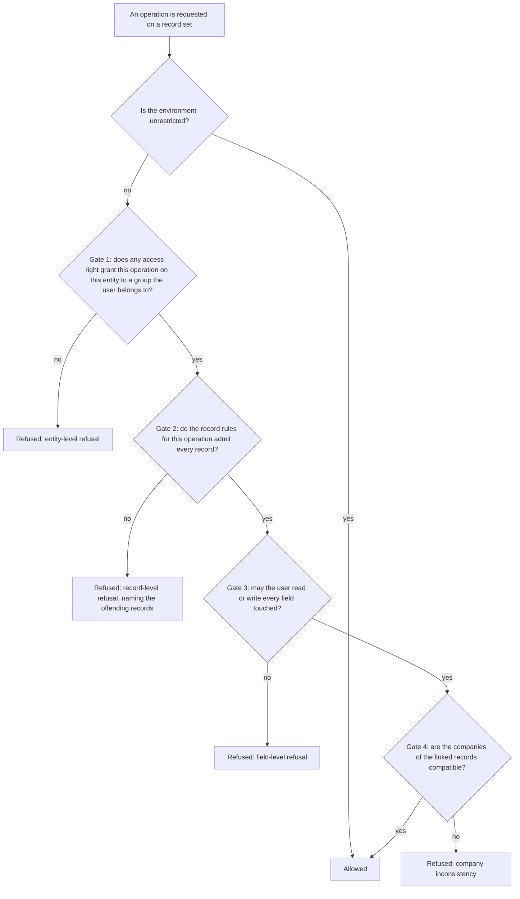

# The security model

Every read, write, creation and deletion in the system passes through the same gates, in the same order, with the same messages. This document specifies them exactly: how the acting identity of a request is established, who the actors are, how groups and privilege families are organised, how access rights are checked, how record rules combine, how fields are restricted, what each generic operation checks and when, what elevating privileges does and does not change, which operations are reachable from outside at all, how a session is protected, and how a record can be reached from outside with a signed token.

Read [the architecture](architecture.md) and [the entity and field system](entity-and-field-system.md) first. The presentation side of security — which menus and buttons a user sees — is covered in [section 18](#18-view-loading-and-menu-visibility) and in [views and actions](views-and-actions.md); it is guidance, not enforcement, and is never a substitute for the gates specified here.

Company scoping and company consistency have their own document, [multi-company](multi-company.md); [section 12](#12-company-scoping-and-company-consistency) states only what the gates need to know about them. The entity-by-entity field catalogues of User, Group, Privilege Family, Access Right and Record Rule, and the shipped groups, rules and settings, are in [identity and access](../domains/identity-and-access/README.md). The generic operations whose checks are listed here are specified in full in [record operations and query notation](record-operations-and-query-notation.md).

---

## Table of contents

1. [The layers at a glance](#1-the-layers-at-a-glance)
2. [The environment and the acting identity](#2-the-environment-and-the-acting-identity)
3. [Users](#3-users)
4. [Groups](#4-groups)
5. [Access rights](#5-access-rights)
6. [Record rules](#6-record-rules)
7. [Field-level restrictions](#7-field-level-restrictions)
8. [The checks performed by each generic operation](#8-the-checks-performed-by-each-generic-operation)
9. [Relational safeguards](#9-relational-safeguards)
10. [The unrestricted actor and the elevate-privileges contract](#10-the-unrestricted-actor-and-the-elevate-privileges-contract)
11. [Which operations are reachable from outside](#11-which-operations-are-reachable-from-outside)
12. [Company scoping and company consistency](#12-company-scoping-and-company-consistency)
13. [The authentication level of a request endpoint](#13-the-authentication-level-of-a-request-endpoint)
14. [Session security](#14-session-security)
15. [Establishing an identity](#15-establishing-an-identity)
16. [External access with signed tokens](#16-external-access-with-signed-tokens)
17. [External identities in practice](#17-external-identities-in-practice)
18. [View loading and menu visibility](#18-view-loading-and-menu-visibility)
19. [Caching and invalidation of security decisions](#19-caching-and-invalidation-of-security-decisions)
20. [What is not enforcement](#20-what-is-not-enforcement)
21. [Trust boundaries and construction rules](#21-trust-boundaries-and-construction-rules)
22. [The shipped catalogue](#22-the-shipped-catalogue)
23. [Message catalogue](#23-message-catalogue)
24. [Invariants a rebuild must preserve](#24-invariants-a-rebuild-must-preserve)
25. [Acceptance criteria](#25-acceptance-criteria)
26. [Reconciliation notes](#26-reconciliation-notes)

---

## 1. The layers at a glance

### 1.1 The four data gates



| Gate | Granularity | Direction | Combination |
|---|---|---|---|
| Access rights | Entity and operation | **Permissive**: absence of a grant means refusal | Disjunction: any grant suffices |
| Record rules | Individual record | **Restrictive**: absence of a rule means no restriction | Conjunction of global rules with the disjunction of the user's group rules |
| Field restrictions | Field and direction | **Permissive**: a restricted field requires membership | Disjunction over the listed groups, with negation supported |
| Company consistency | Relations between records | **Restrictive**: only checked where declared | Conjunction over the marked fields |

The asymmetry between gate one and gate two is deliberate and must be reproduced: **adding an access right grants, adding a record rule restricts**. A package cannot take away what another package granted at gate one; a package can always narrow at gate two.

### 1.2 The six layers of the whole mechanism

The four data gates sit inside a larger stack. A request must pass every layer.

| Layer | Granularity | Data that defines it | Default when nothing is declared | Composition | Specified in |
|---|---|---|---|---|---|
| 1. Authentication | The request | Credentials, session, application key | The request is anonymous and acts as the public user, or is refused | Not applicable | [Sections 14](#14-session-security) and [15](#15-establishing-an-identity) |
| 2. Endpoint authentication level | The request endpoint | The level declared on the endpoint | The endpoint declares one explicitly; there is no implicit default | Not applicable | [Section 13](#13-the-authentication-level-of-a-request-endpoint) |
| 3. Access rights | One entity, one operation | Access Right records | **Refuse**: an operation with no granting record is forbidden to everyone except an unrestricted environment | **Additive union** across the acting user's groups | [Section 5](#5-access-rights) |
| 4. Record rules | One record, one operation | Record Rule records | **Allow**: an operation with no applicable rule is permitted on every record | Global rules conjoin, group rules disjoin, the two sets conjoin | [Section 6](#6-record-rules) |
| 5. Field restrictions | One field, read or write | The group requirement declared on the field | **Allow**: a field with no requirement is accessible to everyone | A group expression evaluated against the acting user's groups | [Section 7](#7-field-level-restrictions) |
| 6. Operation exposure | One named operation | The naming convention and the private marker | A name beginning with an underscore, or carrying the private marker, is not callable from outside | Not applicable | [Section 11](#11-which-operations-are-reachable-from-outside) |

A seventh mechanism sits beside the six: a **token** ([section 16](#16-external-access-with-signed-tokens)) authorises one document for a holder who passes none of layers 3 to 5. It never widens an entity-wide permission.

Layers 3, 4 and 5 are the data-driven authorisation core. Layers 1, 2 and 6 gate the entry points. Two orthogonal switches modify the evaluation of layers 3, 4 and 5:

- **Unrestricted mode**, also called elevated rights: layers 3, 4 and 5 are skipped entirely for reading and writing. The acting user identity is unchanged.
- **The root identity**, the user whose identifier is `1`: an environment acting as that identity is *always* unrestricted and can never leave that state.

---

## 2. The environment and the acting identity

### 2.1 The four components

Every operation is evaluated inside an **environment** made of four components:

| Component | Meaning |
|---|---|
| The transaction | The unit of work and its database connection, shared by every environment of the request |
| The acting user identifier | The identifier of the User record on whose behalf the operation runs. It is the value written into the created-by and last-modified-by fields, and the value the record-rule evaluation context exposes as the acting user |
| The unrestricted flag | A boolean; when true, layers 3, 4 and 5 are not evaluated |
| The context | An immutable map of metadata: the selected companies, the language, the time zone, the default values to preload, and any package-specific key |

Two environments with the same four components are the same object. The platform reuses an existing environment rather than creating a duplicate, which is what makes the record cache shared between them.

### 2.2 Deriving the components

| Derivation | Rule |
|---|---|
| The acting **User record** | Read unrestricted, so that a user who cannot read the User entity can still be identified; the record is always readable to the platform itself |
| The **unrestricted flag** when the acting identity is the root identity | Forced true at construction; it can never be cleared |
| The **context** when entering unrestricted mode without an explicit context | Every key whose name marks a preloaded default value is dropped, so that the caller's preloaded defaults do not leak into the privileged operation; every other key survives, including the language, the time zone and the company selection |
| The **context** when switching the acting identity | Unchanged |
| The **transaction's default identity** | The first environment created in the transaction with a real numeric acting identifier becomes the transaction's default identity. It is used when a deferred flush has to run without an explicit environment, and it is the identity restored by the command protection of [section 9.3](#93-command-protection-on-sensitive-entities) |

### 2.3 The two transitions

Switching the acting identity and setting the unrestricted flag are the only two transitions. Their combined effect:

| Starting state | Transition | Resulting acting identifier | Resulting unrestricted flag |
|---|---|---|---|
| Any | Switch to a user that is not the root identity | That user | **False** |
| Any | Switch to the root identity | The root identity | **True** |
| Any | Switch to an empty user | Unchanged | Unchanged |
| Restricted, user *u* | Set unrestricted | *u* | True |
| Unrestricted, user *u* | Set unrestricted | *u* | True, and the same environment object is returned |
| Unrestricted, user *u* | Clear unrestricted | *u* | False |
| Unrestricted, root identity | Clear unrestricted | The root identity | **True** — the root identity can never leave unrestricted mode |
| Unrestricted, user *u* | Switch to user *v* | *v* | **False** — switching identity always clears the flag |

Worked example, starting from an ordinary request acting as a user named in the table as the first user:

| Step | Resulting acting identity | Resulting flag |
|---|---|---|
| Start | first user | restricted |
| Switch to the second user | second user | restricted |
| Switch to the root identity | root identity | unrestricted |
| Set unrestricted while acting as the first user | first user | unrestricted |
| Set unrestricted again | first user | unrestricted, same environment object |
| Clear unrestricted | first user | restricted |
| Clear unrestricted while acting as the root identity | root identity | unrestricted |
| Switch from an unrestricted first user to the second user | second user | restricted |

### 2.4 Consequences for authorship and audit

An operation running unrestricted still writes the **acting** user into the created-by and last-modified-by fields. Entering unrestricted mode therefore never hides who performed a change. Only switching the acting identity changes authorship. The two notions are never conflated: "runs unrestricted" means the checks are skipped; "runs as the platform identity" means the identity itself changes.

---

## 3. Users

### 3.1 The entity

A user is a record of the User entity (`res.users`, table `res_users`). It embeds a Party record (`res.partner`, table `res_partner`) ([inheritance and extension, section 4](inheritance-and-extension.md#4-embedding-a-parent-record)), so a user has a name, an electronic mail address, an address, a language, a time zone and an image without duplicating them.

| Field (storage name) | Type | Meaning and rules |
|---|---|---|
| Sign-in name (`login`) | Text, required | The name used to sign in. Unique per tenant. |
| Password (`password`) | Text | Stored only as a verifier derived by a deliberately slow one-way function; never readable. |
| Set password (`new_password`) | Text, not stored | The write-only channel for changing the password. |
| Active (`active`) | Boolean, default true | An inactive user cannot sign in and is excluded from ordinary searches. |
| Shared (`share`) | Boolean, computed, stored | True when the user is **not** an internal user. Derived from group membership: false exactly when the user belongs to the internal-user group directly or by implication, true otherwise, which also marks a user who belongs to none of the three kind groups. |
| Main company (`company_id`) | Many-to-one to Company, required, default the environment's current company | The user's home company; the default company of records they create. |
| Allowed companies (`company_ids`) | Many-to-many to Company, association table `res_company_users_rel` | The companies the user may switch on. |
| Explicit groups (`group_ids`) | Many-to-many to Group, association table `res_groups_users_rel` | The groups assigned directly. |
| All groups (`all_group_ids`) | Many-to-many to Group, computed, elevated | The transitive closure of the explicit groups under implication. See [section 4.3](#43-the-implied-group-closure). |

### 3.2 The kinds of user

A user's kind is determined by which of three **mutually exclusive** groups they belong to, transitively.

| Kind | Group external identifier | Can sign in | Sees | Typical origin |
|---|---|---|---|---|
| Internal | `base.group_user` (internal user) | Yes | The back office | An employee |
| Portal | `base.group_portal` (portal user) | Yes | Only the portal | A customer or supplier given access to their own documents |
| Public | `base.group_public` (public user) | No — it is assumed, not signed into | Only public pages | Every anonymous visitor |

### 3.3 The four special identities

| Identity | Identifier | Role | Protections |
|---|---|---|---|
| The **root identity** | `1` | Executes the registry build, package installation, data loading and scheduled work that must not be restricted | Permanently archived; an environment acting as it is always unrestricted; activating it is refused with "You cannot activate the superuser."; deleting it is refused with "You can not remove the admin user as it is used internally for resources created by the platform (updates, module installation, ...)" |
| The **administrator** | Defined in data | The first interactive settings administrator. An ordinary internal user, privileged only by group membership and not at the platform level | Deleting it is refused with "You cannot delete the admin user because it is utilized in various places (such as security configurations,...). Instead, archive it." |
| The **portal template user** | Defined in data, archived | The source of groups and preferences for a newly signed-up external account | Deleting it is refused with "Deleting the template users is not allowed. Deleting this profile will compromise critical functionalities." |
| The **public user** | Defined in data | The identity a request at the public endpoint level runs as when no session exists | Deleting it is refused with "Deleting the public user is not allowed. Deleting this profile will compromise critical functionalities." |

The public user is not privileged: it is an ordinary User record belonging only to the public-user group, and every layer applies to it exactly as to any other user. One public user exists per site, and one per company when a company needs its own ([section 17.1](#171-what-the-public-identity-is-and-is-not), and [multi-company, section 12.3](multi-company.md#123-the-public-identity-of-a-company)).

### 3.4 Exclusivity of the kinds

The three kind groups are **disjoint**: no user may belong to more than one, transitively. The disjointness is itself transitive: every group that implies the portal-user group is disjoint from every group that implies the internal-user group. The rule is enforced by a validation on group membership, on both the user and the group:

- On the user: the intersection of the user's transitive groups with the three kind groups must have at most one member; otherwise the write is refused with **"User "** the name **" cannot be at the same time in exclusive groups "** followed by the group names.
- On a group: changing a group's implications must not make any user violate the rule. Because checking every member of a large group would not scale, the check instead searches for a single active user who now belongs to two kind groups, and refuses if one is found.

Exclusivity matters because record rules and access rights are written on the assumption that a portal user is *not* an internal user.

### 3.5 Derived predicates

| Predicate | True when |
|---|---|
| Is internal | The user belongs to the internal-user group, evaluated unrestricted |
| Is portal | The user belongs to the portal-user group, evaluated unrestricted |
| Is public | The user belongs to the public-user group, evaluated unrestricted |
| Is system | The user belongs to the settings group (`base.group_system`), evaluated unrestricted |
| Is administrator | The user is the root identity, **or** belongs to the access-rights group (`base.group_erp_manager`) |
| Is the root identity | The user's identifier equals `1` |

The environment exposes three of these directly: *unrestricted* (the flag), *administrator* (unrestricted, or the acting user is an administrator) and *system* (unrestricted, or the acting user is a system user).

### 3.6 At least one administrator

A validation refuses any change to group membership that would leave the tenant with **no** member of the settings group: **"You must have at least an administrator user."** The check is skipped while the foundation package is being installed, because during that window no user exists yet.

Two further guards protect the user record: deactivating oneself is refused with **"You cannot deactivate the user you're currently logged in as."**, and activating the root identity is refused with the message of [section 3.3](#33-the-four-special-identities).

### 3.7 Asking about another user's groups

Asking whether a user belongs to a group is itself a gate, callable from outside. It is refused unless the asker is unrestricted, is asking about themselves, or is an internal user: **"You can ony call user.has_group() with your current user."** The message reproduces the spelling the system emits. This prevents a portal user from enumerating other users' privileges.

### 3.8 Reading and writing one's own user record

A user normally holds no access right on the User entity. Two exceptions make the preferences screen work without granting one:

1. **Self-readable fields.** When the record set is exactly the acting user and every requested field name is in the self-readable list, or names a context preference, the read is performed unrestricted. The field restriction of layer 5 is also relaxed: a field is readable when the ordinary check passes **or** the record is the acting user and the field is in the self-readable list.
2. **Self-writable fields.** When the record set is exactly the acting user and every key of the supplied values is in the self-writable list, the write is performed unrestricted. Before elevating, a company key whose value is not one of the user's allowed companies is silently **removed** from the values.

The two lists are fixed per installation and are extended by capability packages; they are catalogued in [identity and access](../domains/identity-and-access/entities.md). The relaxation applies to **reading** only; it never relaxes the write restriction for a field outside the self-writable list.

### 3.9 The debug-only group

One group, `base.group_no_one` (technical features), is **only effective when the current request is in debug mode**. Membership alone is not enough; it is implied by the internal-user group and by the settings group, so almost every internal user is a member.

| Test | Result |
|---|---|
| The user belongs to the technical-features group and the request is in debug mode | Satisfied |
| The user belongs to it and the request is not in debug mode | Not satisfied |
| The user does not belong to it | Not satisfied |

Everything keyed on this group is a display feature: the extended refusal messages of [sections 6.7](#67-the-refusal-message) and [7.5](#75-the-refusal-message), technical menu entries, technical view elements. A group requirement naming the technical-features group together with other groups is interpreted as a **conjunction**, not a disjunction: the element is shown when the user satisfies the other groups **and** the request is in debug mode. The platform implements this by removing the technical-features group from the requirement, remembering the flag separately, and marking the element invisible when the flag does not match the request mode.

---

## 4. Groups

### 4.1 The entity

A group is a record of the Group entity (`res.groups`, table `res_groups`). It is a named set of users, and it is the only thing permissions attach to.

| Field (storage name) | Type | Meaning |
|---|---|---|
| Name (`name`) | Text, required, translatable | The group's own name. |
| Full name (`full_name`) | Text, computed, not stored | The privilege family's name, a slash, and the group's name, when the group belongs to a family; otherwise the group's name. This is the group's display name. |
| Privilege family (`privilege_id`) | Many-to-one to Privilege Family, indexed | See [section 4.6](#46-privilege-families). |
| Sequence (`sequence`) | Integer | The order of the group within its family, which is also the order of the options a user-access screen offers. |
| Explicit members (`user_ids`) | Many-to-many to User, association table `res_groups_users_rel` | Users assigned to this group directly. |
| All members (`all_user_ids`) | Many-to-many to User, computed | Users in this group directly or through implication. |
| Member count (`all_users_count`) | Integer, computed | |
| Implied groups (`implied_ids`) | Many-to-many to itself, association table `res_groups_implied_rel` | Groups whose privileges members of this group also hold. |
| Transitively implied groups (`all_implied_ids`) | Many-to-many to itself, computed, recursive, elevated | This group together with everything it implies, transitively. |
| Implying groups (`implied_by_ids`) | Many-to-many to itself, the same association table with the columns swapped | The reverse relation. |
| Transitively implying groups (`all_implied_by_ids`) | Many-to-many to itself, computed, recursive, elevated | |
| Disjoint groups (`disjoint_ids`) | Many-to-many to itself, computed | For a kind group, the other two kind groups; empty otherwise. |
| Access rights (`model_access`) | One-to-many to Access Right | The rights granted to this group. |
| Record rules (`rule_groups`) | Many-to-many to Record Rule, association table `rule_group_rel`, deletion behaviour restrict | The rules attached to this group. |
| Menus (`menu_access`) | Many-to-many to Menu, association table `ir_ui_menu_group_rel` | The menus visible to this group. |
| Views (`view_access`) | Many-to-many to View, association table `ir_ui_view_group_rel` | The views applicable to this group. |
| Shared group (`share`) | Boolean | Marks a group created for sharing data with outside users. |
| Application key maximum duration (`api_key_duration`) | Decimal number of days | Caps the lifetime of application keys members may create. |
| Comment (`comment`) | Long text, translatable | |

Default display name: the full name. Searching on the full name splits the search text on a slash and matches the family's name against the part before and the group's name against the part after.

### 4.2 Membership

A user is a member of a group if the group is among the user's **explicit groups**, or is implied, transitively, by one of them. The result is the user's **effective groups**. Nothing else confers membership: there is no rule-based membership, no membership by attribute, and no negative membership.

Adding an implication grants the implied permissions **immediately** to every current member, with no new sign-in. A user cannot be removed from a group they hold by implication; attempting it is refused with **"It is not possible to remove implied group "** the group name **" from users "** followed by the user names.

### 4.3 The implied-group closure

**Definition.**

```formula
closure( G )      = { G } ∪ ⋃ over H implied directly by G of closure( H )
groups_of( user ) = ⋃ over G in explicit_groups( user ) of closure( G )
```

Implication means "a member of this group also has the privileges of that group". A manager group implies the corresponding user group; a specialised role implies the general one. The two directions of the relation are both editable and produce the same graph: "this group implies that one" and "that one is implied by this group" are the same edge.

**Rules.**

1. The closure includes the group itself.
2. The closure is computed unrestricted, so that computing it never fails for lack of access to a group record.
3. The closure is recursive and must be declared as such, so that changing an implication anywhere in the chain invalidates every group above it.
4. A cycle in the implication graph would make the closure infinite. The platform does not itself forbid cycles; the recursion terminates because the closure is a set and already-seen groups are not revisited, so a cycle simply means the whole cycle is one closure.
5. The closure is what every gate consults. A user's *explicit* groups are only an input.
6. The closure is computed once per installation state and cached; per user it is cached under the user identifier and invalidated whenever the user's groups change, whenever an implication changes, and whenever any group is created or deleted.

**Worked example.** Groups: `sales_manager` implies `sales_user`; `sales_user` implies `internal`; `accounting_manager` implies `accounting_user`; `accounting_user` implies `internal`. A user explicitly in `sales_manager` and `accounting_user` has the closure `{sales_manager, sales_user, internal, accounting_user}` — four groups from two.

### 4.4 Searching by group

Searching for users in a group must find users who are in it **through implication**. The search on the transitive-group field therefore rewrites a condition naming group *G* into a condition naming *G* together with every group whose closure contains *G* — that is, every group that implies *G*, transitively.

### 4.5 Declaring group requirements

Several places name groups as a comma-separated list of external identifiers, optionally with a negation marker before a name: a field's restriction, a view node's condition, a menu entry's condition.

The grammar is a list of entries separated by commas, each entry being an external identifier optionally preceded by the negation marker. The evaluation:

1. A list consisting of a single full stop means **never**: no user satisfies it, not even an administrator — only an unrestricted environment bypasses it.
2. Otherwise split into positive names and negated names.
3. If the user is a member of **any** negated group, the requirement is not satisfied. Negatives are evaluated first.
4. Otherwise, if the user is a member of **any** positive group, the requirement is satisfied.
5. Otherwise the requirement is satisfied if and only if there were **no** positive names — a list of only negations means "anyone except these".

```formula
satisfied( user , spec ) =
    false                                         if spec = "."
    false                                         if user ∈ any negated group of spec
    true                                          if user ∈ any positive group of spec
    ( spec has no positive group )                otherwise
```

As a set expression, the list denotes the union over each positive entry of the intersection of that entry with every negated entry; when there is no positive entry it denotes the intersection of the negated entries alone.

Worked examples:

| Requirement | Meaning | Internal user | Portal user | Settings administrator |
|---|---|---|---|---|
| The internal-user group | Internal users only | Satisfied | Not satisfied | Satisfied, because the settings group implies the internal-user group |
| The internal-user group and the portal-user group | Internal or portal | Satisfied | Satisfied | Satisfied |
| The internal-user group and the negated settings group | Internal users who are not settings administrators | Satisfied | Not satisfied | **Not satisfied** |
| The negated portal-user group alone | Everyone who is not a portal user | Satisfied | Not satisfied | Satisfied |
| A single full stop | Nobody | Not satisfied | Not satisfied | Not satisfied |

### 4.6 Privilege families

A **privilege family** is a record of the Privilege Family entity (`res.groups.privilege`, table `res_groups_privilege`) that groups mutually-comparable groups of one functional area into one choice on the user-access screen.

| Field (storage name) | Type | Meaning |
|---|---|---|
| Name (`name`) | Text, required, translatable | Shown as the label of the choice. |
| Description (`description`) | Long text | |
| Placeholder (`placeholder`) | Text, default the word for no | The label of the "none of these" option. |
| Sequence (`sequence`) | Integer, default 100 | Order of the families on the screen. |
| Category (`category_id`) | Many-to-one to Package Category, indexed | Which section of the screen the family appears in. |
| Groups (`group_ids`) | One-to-many to Group | The members of the family. |

Default ordering: sequence, then name, then identifier.

Rules:

1. A family is a **presentation** device. It carries no enforcement: nothing prevents a user from being in two groups of the same family, and the platform never checks. Every authorisation decision reads groups, never families.
2. The screen renders a family as a single selection whose options are the family's groups, plus the placeholder. Choosing one option sets that group and clears the family's other groups.
3. The options are ordered from weakest to strongest: by the number of the group's implied groups that also belong to the same family, then by the group's sequence, then by identifier. A group without a family sorts as if that count were zero.
4. Because the groups of a family are typically chained by implication — the manager implies the user — choosing the highest option confers the lower ones automatically, which is why the single-selection presentation is faithful.
5. A group with no family appears as an independent switch.
6. Group names are unique inside a family; a duplicate is refused with **"The name of the group must be unique within a group privilege!"**

### 4.7 The group expression algebra

Several mechanisms need to reason about "the set of users that satisfies a condition on groups" without enumerating users: the field restriction of layer 5, the group condition on a view node, the set of users allowed to perform an operation on an entity. They all use one algebra of **group expressions**.

**Atoms.** Every group is an atom. Two derived atoms exist: the **universe**, meaning all users, and the **empty set**, meaning no user. An atom may be negated.

**Facts the algebra knows** about atoms, derived from the group records:

| Fact | Source |
|---|---|
| One atom is a subset of another | The reflexive transitive closure of implication |
| Two atoms are disjoint | The transitive closure of the declared disjointness; the only declared disjointness is between the three kind groups |

**Normal form.** An expression is a union of intersections of possibly negated atoms. Construction normalises eagerly:

1. Inside one intersection, an atom that is a subset of another replaces it; two disjoint atoms collapse the whole intersection to the empty set; the universe atom is dropped.
2. Inside one union, an intersection contained in another is dropped; two intersections that differ only by the sign of one atom merge by dropping that atom; the universe absorbs the union; the empty set is dropped.
3. Intersection distributes over union.
4. Complement applies the two dualisation laws: the complement of an intersection is the union of the complements, and the complement of a union is the intersection of the complements.

**Membership test.** For a concrete user, given the identifier set of their effective groups:

1. If the expression is the empty set, the answer is false.
2. If the user's effective group set is empty, the answer is false.
3. If the expression is the universe, the answer is true.
4. Otherwise the answer is true when some intersection of the expression has every non-negated atom among the user's effective groups and no negated atom among them.

Step 2 is not redundant: a user with **no** effective group at all matches nothing, not even a purely negative expression.

**Worked examples.** Take the group graph in which `A1` is a subset of `A`, `A11` a subset of `A1`, and `B1`, `B2` and `BX` are subsets of `B` with `BX` disjoint from `B1` and from `B2`, plus unrelated groups `C` and `D`, `D` disjoint from `A` and from `B`.

| Expression | Normal form | Effective groups `A`, `C` | Effective groups `A`, `A1`, `C` | Effective groups `A`, `A1`, `A11`, `C` | Effective groups `C` alone |
|---|---|---|---|---|---|
| `A` | `A` | Matches | Matches | Matches | No |
| `A1` | `A1` | No | Matches | Matches | No |
| `A` or `B` | `A` or `B` | Matches | Matches | Matches | No |
| `B` or `C` | `B` or `C` | Matches | Matches | Matches | No |
| `A` and not `A11` | `A` and not `A11` | Matches | Matches | **No** | No |
| (`A11` or `B`) and not `D` | (`A11` and not `D`) or (`B` and not `D`) | No | No | Matches | No |
| (`A11` or `B`) and not `C` | (`A11` and not `C`) or (`B` and not `C`) | No | No | **No** | No |
| `A` and `B` | `A` and `B` | No | No | No | No |
| `B` and `BX` | `BX` | Not applicable | Not applicable | Not applicable | Not applicable |
| `B1` and `BX` | The empty set | Never matches | Never matches | Never matches | Never matches |
| `A1` and not `A` | The empty set | Never matches | Never matches | Never matches | Never matches |

**Ordering.** One expression is contained in another when every intersection of the first is contained in some intersection of the second. The universe is the greatest element and the empty set the least.

**Unknown atoms.** A requirement may name a group that does not exist in this installation, because the package that declares it is not installed. Such an atom is kept as an opaque atom that is a subset of nothing and a superset of nothing, sorts after every known atom, and never matches any user. The expression therefore behaves as if that alternative were unreachable, without failing.

### 4.8 Group definitions as a compact set

For the sake of the many membership tests a single request performs, the platform maintains a compact representation of the group graph: a mapping from external identifier to identifier, the closure of each group, and the ability to express "the users who have access" as a set expression over groups — the empty set, the universe, or a union of closures. This representation is cached on the registry under a dedicated name and cleared whenever a group, an access right, a record rule or a group's external identifier changes.

---

## 5. Access rights

### 5.1 The entity

An access right is a record of the Access Right entity (`ir.model.access`, table `ir_model_access`).

| Field (storage name) | Type | Meaning |
|---|---|---|
| Name (`name`) | Text | A label, conventionally the entity's transport name. |
| Entity (`model_id`) | Many-to-one to Entity Catalogue, required, deletion behaviour cascade | The entity the right applies to. |
| Group (`group_id`) | Many-to-one to Group, deletion refused while a right references it | The group granted. **Empty means every user**, including portal and public users. |
| Active (`active`) | Boolean, default true | An inactive right grants nothing. |
| Read (`perm_read`) | Boolean, default false | |
| Write (`perm_write`) | Boolean, default false | |
| Create (`perm_create`) | Boolean, default false | |
| Delete (`perm_unlink`) | Boolean, default false | |

A right grants only the operations whose flag it sets. Creating a right with no group and any permission set is accepted but records the warning **"Rule "** the name **" has no group, this is a deprecated feature. Every access-granting rule should specify a group."**

### 5.2 The four operations

| Operation | Covers |
|---|---|
| `read` | Reading any field of the record, searching, grouping, exporting, and reading it through a relation from another record |
| `write` | Changing any field of the record, including through a relational command from another record |
| `create` | Creating a record, including through a relational create command |
| `unlink` | Deleting a record |

In prose the four are "read", "modify", "create" and "delete". There is no separate "execute" permission: invoking a named business operation requires whatever the operation itself does, which is almost always write on the record.

### 5.3 The checking algorithm

**Preconditions.** An entity transport name, an operation, and the environment.

1. If the environment is unrestricted, allow.
2. Determine the acting user's effective groups.
3. Compute the set of entities on which the user has that operation: every entity for which an **active** access right exists whose operation flag is set and whose group is either empty or among the user's effective groups.
4. If the entity is in that set, allow.
5. Otherwise refuse, building the message of [5.5](#55-the-refusal-message).

The set in step 3 is computed with one statement selecting the distinct entities of the matching rights, and is cached under the pair of acting user and operation. Pending writes on the Access Right entity are flushed before the statement runs, so that a right created in the same transaction is visible.

Two properties follow:

- **Additive.** A user's permissions are the union over all their effective groups. A group granting read and create plus a group granting write yields read, create and write.
- **Refuse by default.** An entity that appears in **no** access right at all is accessible to nobody except an unrestricted environment. The package build records a warning naming every persistent entity a package introduced with no access right, and suggests a line granting read to the internal-user group, so that the omission is noticed at installation time.

### 5.4 The permitted-users expression

The same data answers the question "which users may perform this operation on this entity", used by the refusal message and by the view machinery of [section 18.1](#181-the-two-phase-view-pipeline):

1. Take every active access right for that entity whose flag for the operation is set.
2. If there are none, the answer is the empty set of users.
3. If any of them has an empty group, the answer is the universe.
4. Otherwise the answer is the union of the atoms of those rights' groups.

The result is cached per entity and operation and is independent of the acting user.

### 5.5 The refusal message

The refusal is composed of three paragraphs separated by blank lines.

**Paragraph one**, depending on the operation, with the entity's description and its transport name substituted. The description is the translated description of the entity, falling back to the transport name when the entity has none.

| Operation | Text |
|---|---|
| `read` | "You are not allowed to access '\<entity description\>' (\<transport name\>) records." |
| `write` | "You are not allowed to modify '\<entity description\>' (\<transport name\>) records." |
| `create` | "You are not allowed to create '\<entity description\>' (\<transport name\>) records." |
| `unlink` | "You are not allowed to delete '\<entity description\>' (\<transport name\>) records." |

**Paragraph two.** The groups that *would* allow it are listed, each on its own line prefixed by a tab character, a hyphen and a space, in the form family name, slash, group name — or just the group name when the group has no family — ordered by family name then group name with unfamilied groups last. Names are taken in the language of the acting user, falling back to the source language:

> "This operation is allowed for the following groups:" followed by the list

If no group allows it:

> "No group currently allows this operation."

**Paragraph three**, always:

> "Contact your administrator to request access if necessary."

Listing the allowing groups is deliberate: it turns an opaque refusal into an actionable request. It leaks the existence of group names, which is judged acceptable.

An informational line is written to the technical log naming the operation, the acting identifier and the entity's transport name.

### 5.6 Ordering of the checks

Access rights are checked **before** record rules. A user with no read right on an entity is told so at the entity level and never learns whether a particular record exists. A user with the right but excluded by a rule receives the record-level refusal of [section 6.7](#67-the-refusal-message).

### 5.7 When rights are checked

| Situation | Check |
|---|---|
| A search | Read on the entity, before the query is built |
| Reading fields | Read on the entity; plus field restrictions |
| A write | Write on the entity, then the rules on the affected records **before** the write |
| A creation | Create on the entity, then the rules on the created records **after** creation |
| A deletion | Delete on the entity, then the rules on the records before deletion |
| Reading through a relation | Read on the target entity, unless the relational field declares that access is bypassed on traversal |
| Applying a relational command | The operation the command implies, on the target entity |
| A default value containing relational commands | The operation each command implies, on the target ([entity and field system, section 13.2](entity-and-field-system.md#132-conversion-of-the-result)) |

Checking with an **empty** record set checks only the entity level, which is how a caller asks "may this user create records of this entity at all?".

### 5.8 Worked example

An entity carries exactly two access rights:

| Right | Group | Read | Write | Create | Delete |
|---|---|---|---|---|---|
| First | `group_one` | Yes | No | No | No |
| Second | `group_zero` | Yes | No | Yes | No |

The acting user belongs to `group_two` and the internal-user group; their effective groups contain neither `group_zero` nor `group_one`.

| Attempt | Outcome |
|---|---|
| Write a record | Refused. Paragraph one is the write header; paragraph two is "No group currently allows this operation."; paragraph three is the resolution line |
| Create a record | Refused. Paragraph one is the create header; paragraph two lists one line, `group_zero` |
| Read a field of a record | Refused. Paragraph one is the read header; paragraph two lists two lines, `group_zero` then `group_one` |

Adding the user to `group_one` makes reading succeed; creating still fails and still names `group_zero` alone.

---

## 6. Record rules

### 6.1 The entity

A record rule is a record of the Record Rule entity (`ir.rule`, table `ir_rule`).

| Field (storage name) | Type | Meaning |
|---|---|---|
| Name (`name`) | Text | A label, shown in refusal messages in debug mode. |
| Active (`active`) | Boolean, default true | An inactive rule restricts nothing. It exists so that a shipped rule can be switched off without deleting it, since deleting it would let the package recreate it on the next update. |
| Entity (`model_id`) | Many-to-one to Entity Catalogue, required, indexed, deletion behaviour cascade | |
| Groups (`groups`) | Many-to-many to Group, association table `rule_group_rel`, deletion behaviour restrict | The groups the rule is attached to. **Empty means the rule is global.** |
| Global (`global`) | Boolean, computed from the groups, stored | True exactly when the group list is empty. |
| Filter (`domain_force`) | Long text | An expression producing the filter that defines which records the rule admits. An empty expression means "always true". |
| Read (`perm_read`) | Boolean, default true | |
| Write (`perm_write`) | Boolean, default true | |
| Create (`perm_create`) | Boolean, default true | |
| Delete (`perm_unlink`) | Boolean, default true | |

Default ordering: entity descending, then identifier.

Unlike an access right, the four flags select the operations the rule is **checked for**. An operation whose flag is cleared behaves as if the rule did not exist for that operation.

Constraints:

- At least one operation flag must be set. The database constraint requires the disjunction of the four flags, with the message **"Rule must have at least one checked access right!"**
- A rule may not be created on the Record Rule entity itself: **"Rules can not be applied on the Record Rules model."**
- An active rule's filter must evaluate and must be a valid filter for its entity; otherwise **"Invalid domain: "** followed by the failure. The expression is revalidated whenever the active flag, the filter or the entity changes. A malformed expression, a condition naming a field that does not exist, and an expression that is statically false in a form the validator rejects are all refused; an empty expression, an expression that is always true, and a condition on an existing field are accepted.
- Privileged relational commands on this entity are forbidden, so a privileged operation cannot be tricked into rewriting rules through a relation ([section 9.3](#93-command-protection-on-sensitive-entities)).

### 6.2 The evaluation context

The filter is an expression evaluated in a restricted context providing exactly:

| Name | Value |
|---|---|
| The acting user | The user record, with an **empty context**, so that the filter's result does not depend on the ambient context |
| The allowed company identifiers | The identifiers of the environment's allowed companies, in order |
| The current company identifier | The environment's current company |

In addition the expression language's own date and time helpers are available. Nothing else is: no arbitrary operations, no other entities.

The user record is deliberately stripped of its context so that two requests by the same user in different languages or with different instructions produce the same rule, which is what makes the result cacheable.

**Worked confirmation.** A rule on an entity reads "the record's category is one of the categories the acting user can see", where the inner selection is itself performed through the acting user. A caller that sets a context key which a category-level override would use to hide some categories does **not** change the rule's outcome, because the user record was rebuilt with an empty context.

### 6.3 Selecting the applicable rules

1. If the environment is unrestricted, there are none.
2. Otherwise take every Record Rule record, ordered by identifier, whose entity is this one, which is active, whose flag for this operation is set, and which is either global or attached to at least one of the acting user's effective groups.

An operation name that is not one of the four is a programming error and is refused with **"Invalid mode: "** the value.

### 6.4 The combination rule

**Preconditions.** An entity, an operation, and the environment.

**Postcondition.** One filter that every visible record must satisfy.

**Algorithm.**

1. If the environment is unrestricted, the result is "everything" — no rule applies.
2. **Embedded parents first.** For each entity this one embeds through a **stored** link field, in declaration order, compute that parent entity's rule filter for the same operation, recursively. If it is not "everything", add the condition that the link traverses to a record matching it.
3. Collect the applicable rules of [6.3](#63-selecting-the-applicable-rules).
4. If there are none, the result is the conjunction of the conditions collected in step 2, which may be "everything".
5. Otherwise evaluate each rule's filter in the context of [6.2](#62-the-evaluation-context), reading the rules unrestricted, and re-check defensively that a rule with groups still intersects the user's effective groups, skipping it if not. A rule with an empty filter expression yields "everything".
6. Partition the evaluated conditions: those of rules with no group go to the global list, those of rules with groups go to the group list.
7. If the group list is not empty, append its **disjunction** to the global list.
8. The result is the conjunction of the global list, normalised against the entity.

```formula
effective_filter = ( conjunction of every global rule's filter )
                   AND ( disjunction of every applicable group rule's filter )
                   AND ( conjunction of every embedded parent's effective filter, traversed )
```

If there are no applicable group rules, the disjunction term is omitted entirely — it does **not** become "nothing".

### 6.5 Why the combination is asymmetric

- **Global rules restrict everybody and are conjoined.** A global rule is an invariant of the tenant: "a record belongs to a company you are allowed in". Adding another global rule can only narrow. Two global rules whose conditions do not overlap remove all access.
- **Group rules are disjoined.** A group rule is a grant of visibility to a role: "a salesperson sees their own leads", "a sales manager sees the whole team's". Adding a group to a user can only widen the group part. If group rules were conjoined, giving a user the manager role would *narrow* what they see, which is the opposite of the intent.
- **The two sets conjoin.** The first group rule added to an entity that already has global rules narrows access for the members of that group, because the group part is conjoined with the global part. An entity with only group rules, none applicable to this user, falls back to "everything" at step 4, so adding a group rule for a *different* group narrows nothing for this user.

The consequence a rebuild must reproduce: **a user with no applicable group rule on an entity is restricted only by the global rules**, and a user with one group rule is restricted to that rule's filter *in addition to* the global ones.

**Embedded parents.** Step 2 is what makes an embedding entity inherit the record visibility of its embedded parent. When an entity embeds a parent through a stored link field and a rule on the parent restricts the parent's records, a child record whose parent is hidden is invisible, is not returned by a search, and is refused by the permission check. The recursion is depth-first over the embedding map and applies at every level. This is why a rule on the party entity also restricts users, which embed a party.

### 6.6 Worked examples

**Example one: a mixed rule set.** Entity Sales Order. Rules:

| Rule | Groups | Filter |
|---|---|---|
| Multi-company | none (global) | The order's company is among the allowed companies |
| Own orders | Salesperson | The order's salesperson is the acting user |
| Team orders | Team leader | The order's team is one the acting user leads |

| User | Groups | Effective filter |
|---|---|---|
| A | Salesperson | company allowed **and** salesperson is A |
| B | Salesperson, Team leader | company allowed **and** ( salesperson is B **or** team is led by B ) |
| C | Team leader only | company allowed **and** team is led by C |
| D | neither | company allowed |
| The root identity | — | everything |

Note user D: with no group rule at all, only the global rule applies, so D sees every order of the allowed companies. A rebuild that treats "no applicable group rule" as "nothing visible" would produce a very different system.

**Example two: composition and blame.** An entity carries a whole-number field and a company field. The acting user belongs to one group. Every rule below sets only the write flag. The record under test holds the value 0.

| Case | Rules | Composed filter for write | Blamed rules |
|---|---|---|---|
| One group rule | Rule 0, group rule: value equals 42 | value equals 42 | Rule 0 |
| Two group rules | Rule 0: value equals 42; rule 1: value equals 78 | value equals 42 **or** value equals 78 | Rule 0 and rule 1, as a block |
| Two global rules, both failing | Rule 0 global: value equals 42; rule 1 global: value equals 78 | value equals 42 **and** value equals 78 | Rule 0 and rule 1 |
| Two global rules, one failing | Rule 0 global: value equals 42; rule 1 global: always true | value equals 42 | Rule 0 only |
| Combination | Rule 0 global: value equals 42; rule 1 global: always true; rule 2 group: always false; rule 3 group: value equals 55 | value equals 42 **and** always true **and** ( always false **or** value equals 55 ) | Rule 0, rule 2 and rule 3 |

The last line shows the two reporting styles side by side: the global rule 1 is not blamed because it holds on its own, while both group rules are blamed because the block failed.

**Example three: archived records.** Rules: rule 0, global, for read, admitting records whose company is among the allowed companies or empty; rule 1, a group rule for read, admitting records whose value is 1. The record has the value 0, belongs to an allowed company, and is **archived**. Reading a field of it is refused, and the blamed set is rule 1 alone. Had the verification kept the archive filter on, the record would have been filtered out before rule 0 was evaluated and rule 0 would have been blamed as well.

**Example four: group rules never widen past a global rule.** On the party entity the global rule admits a party that is not a shared party, or whose company is an ancestor of an allowed company, or whose company is empty; the group rule for portal and public users admits parties that are descendants of the acting user's commercial party. For an internal user the group rule is not applicable, so the composed filter is the global condition alone. For a portal user the composed filter is the global condition **and** the descendant condition. Adding a second group rule for portal users, admitting the user's own party, changes only the second factor, which becomes "descendant of the commercial party **or** equal to the own party". The first factor is unchanged, so a portal user can never be granted a party the global rule hides.

### 6.7 The refusal message

When a record rule excludes at least one record of the set, the refusal is composed as follows.

**Paragraph one.**

> "Uh-oh! Looks like you have stumbled upon some top-secret records."
>
> (blank line)
>
> "Sorry, \<user name\> (id=\<user identifier\>) doesn't have '\<operation word\>' access to:"

where the operation word is the word for read, write, create or unlink.

**Paragraph two, ordinary mode.** One line naming the entity:

> "- \<entity description\> (\<transport name\>)"

**Paragraph two, debug mode.** Available only to an internal user who belongs to the technical-features group and whose request is in debug mode. Up to six of the offending records, each on its own line:

> "- \<entity description\>, \<record display name\> (\<transport name\>: \<identifier\>)"

and, when any failing rule's filter mentions the company field and the record's company is one the user belongs to, the line additionally carries ", company=\<company display name\>".

Followed by a blank line and:

> "Blame the following rules:" and one line per failing rule, each "- \<rule name\>"

Because portal and public users never belong to the technical-features group, they never see record display names or rule names.

**Paragraph three, always.**

> "If you really, really need access, perhaps you can win over your friendly administrator with a batch of freshly baked cookies."

**The multi-company addendum.** When any failing rule's filter text mentions the company field, a suggested company is computed for the listed records ([multi-company, section 5.5](multi-company.md#55-the-multi-company-hint-on-a-refusal)) and the resolution paragraph is extended:

| Situation | Added text |
|---|---|
| The listed records suggest more than one distinct company | A note stating that this might be a multi-company issue and that switching company may help, followed by a short informal aside that a rebuild replaces with its own wording |
| Exactly one company would give access and the user belongs to it | "\n\nThis seems to be a multi-company issue, you might be able to access the record by switching to the company: \<company display name\>." and the refusal carries that company's identifier and display name as structured context so the client can offer a one-click switch |
| Exactly one company would give access and the user does not belong to it | "\n\nThis seems to be a multi-company issue, but you do not have access to the proper company to access the record anyhow." |
| No company can be suggested, because the entity has no company field | Nothing is added |

**The embedding wrapper.** When the refusal happened while reaching an embedded parent through a child record, the parent's message is wrapped with a further paragraph:

> "Implicitly accessed through '\<child entity description\>' (\<child transport name\>)."

The same wrapper is applied when a related field's path could not be traversed because an intermediate record was unreadable, naming the entity that owns the related field.

**Note on wording.** The first and third paragraphs are deliberately informal. A rebuild must reproduce the *structure* — the operation and the user named, the offending entity or records listed, the failing rules listed in debug mode, the multi-company hint with its three cases and its structured company suggestion, the embedding wrapper — and may supply its own wording for the informal sentences.

**Logging and cache hygiene.** An informational line naming the operation, up to six offending identifiers, the acting identifier and the entity's transport name is written to the technical log. Building the message reads the display names of the rejected records unrestricted; the cache entries of those records are therefore **invalidated** after the message is built, so that the elevated reads leave no readable values behind for the refused caller. This is observable: after a refusal, a second attempt to read a field of the same record must refuse again rather than return a cached value.

### 6.8 Determining which rules failed

To name the failing rules, the system does not evaluate rules one record at a time. It:

1. Takes all applicable rules for the operation, reading them unrestricted and with the archive filter switched off so that archived records are considered.
2. Takes the rules with groups intersecting the acting user's effective groups, computes the disjunction of their conditions, and counts how many of the offending records it admits. If it admits all of them, the group block is not at fault and none of its rules is reported.
3. For each **global** rule, counts how many of the offending records its condition admits on its own; a rule admitting fewer than all of them is reported as failing.
4. Reports the selected group rules, if any, together with every failing global rule, presented in the acting user's environment.

Group rules are reported **as a block** because they are disjoined: either the block succeeds or it fails, and blaming one of them individually would mislead. Global rules are reported **individually**, because each must hold on its own.

### 6.9 The two application modes

Two modes exist and both must be implemented, because they differ observably.

| Mode | Where | Effect |
|---|---|---|
| **Query restriction** | Any search, count, grouped read, relation traversal or sub-condition evaluation | The composed filter is added to the query as an extra condition. Records that fail are simply absent; no refusal is raised. |
| **Record verification** | The permission check on a known set of records: the explicit check, its non-raising twin, the filtering variant, and the checks performed by write, delete and the post-creation check of create | The composed filter is evaluated against the given records, unrestricted and with the archive filter switched off. The records that fail form the forbidden set. |

Record verification switches the archive filter off deliberately: a rule that would otherwise be reported as failing merely because the record is archived must not be blamed. Verification is skipped entirely when the record set contains only in-memory records that have no database identifier yet.

The difference between *search* and *read specific records* is the most important practical consequence: a search silently hides, a direct read refuses.

| Situation | Evaluation |
|---|---|
| A search | Query restriction; excluded records are absent, no refusal |
| Reading specific records | Record verification; a refusal names them |
| A write | Record verification before the write, on the records as they are before it |
| A creation | Record verification after creation, on the created records |
| A deletion | Record verification before deletion |
| Traversal in a filter | The target entity's read rules are conjoined into the sub-query, unless the relational field declares that access is bypassed on traversal or the environment is unrestricted |

### 6.10 The empty record set convention

The explicit check invoked on an **empty** record set checks the access rights only: there is no record to verify. This is the canonical way to ask "may this user perform this operation on this entity at all", and it is what every search does before building its query.

The non-raising twin returns false instead of refusing and is consistent with the raising form on the same inputs. The filtering variant returns the subset of the given records that passes both layers; it never refuses, and on an entity the user cannot touch at all it returns the empty set.

---

## 7. Field-level restrictions

### 7.1 The declaration

A field may declare a group requirement, written in the comma-separated notation of [section 4.5](#45-declaring-group-requirements). Three states exist:

| Declared value | Meaning |
|---|---|
| Absent | The field is accessible to everyone |
| A single full stop | The field is **never** accessible, and it is removed from the field descriptions and the resolved views even for an unrestricted environment |
| A requirement | The field is accessible to the users matching the expression |

The requirement is a property of the **field definition**, not of a record. It is therefore identical for every record of the entity.

### 7.2 Propagation to derived fields

- A **related field** copies the requirement of the field it points at, unless it declares its own.
- An **exposed field** of an embedding entity likewise copies the requirement of the parent's field unless it declares its own.
- A **computed field** inherits nothing; it must declare its own requirement if the values it exposes are sensitive.

### 7.3 The check

1. If the field declares no requirement, allow.
2. If the environment is unrestricted, allow.
3. If the requirement is a single full stop, refuse.
4. Otherwise evaluate the requirement against the acting user's effective groups.

```formula
may_access( user , field , direction ) =
    true                                     if the field declares no requirement
    true                                     if the environment is unrestricted
    false                                    if the requirement is "."
    satisfied( user , requirement )          otherwise
```

Step 2 sits after step 1 and **before** step 3, with one observable consequence: an unrestricted environment can read and write a field marked never accessible, yet that field is still removed from the field descriptions and from the resolved views ([7.6](#76-effects-on-what-a-client-receives)), because those are built from the requirement text without consulting the unrestricted flag.

The same requirement governs **both** reading and writing; there is no separate read requirement and write requirement on a field. Finer control is achieved by making the field read-only for most users through the presentation layer and restricting writes with a record rule or a validation.

One entity overrides the rule: on the User entity, reading is additionally allowed when the record is the acting user and the field is self-readable ([section 3.8](#38-reading-and-writing-ones-own-user-record)).

### 7.4 Where it is enforced

| Entry point | Operation checked | Behaviour on failure |
|---|---|---|
| Reading one field of one record | Read | Refuses |
| Reading a field of a multi-record set | Read | Refuses before any value is produced |
| Fetching an explicit list of field names | Read | Refuses, for every named field, before any statement is issued |
| The implicit fetch of every prefetchable field | Read | The inaccessible fields are **silently removed** from the list; no refusal |
| Following the stored dependencies of a non-stored field during a fetch | Read | An inaccessible stored dependency is **silently skipped**; no refusal |
| Building the field descriptions | Read | The field is omitted from the result entirely |
| A write with supplied values | Write | Refuses, for every key of the values, before anything is written |
| A creation with supplied values | Write | Refuses, for every key of the values **and for every preloaded default key of the context**, before anything is written |
| Translating a field's stored text | Write | Refuses |
| A condition on the field inside a search filter | Read | Refuses when the condition is converted for the query |
| A condition on the field inside a sub-condition on a relation | Read | Refuses, evaluated on the related entity |
| An ordering term naming the field | Read | Refuses when the ordering is converted for the query |
| A grouping key naming the field | Read | Refuses |
| An aggregate naming the field | Read | Refuses |
| A view | Read | A node naming the field is removed from the resolved view, together with its label node |
| Export | Read | The field is not offered |
| The default values returned for a form | Write | An exposed field is routed to the parent's default computation only when its write permission holds |

The asymmetry between the fourth and fifth rows and the rest is deliberate: an implicit "read everything that is cheap to read" must not fail because one field is restricted, while an explicit request for a named field must fail.

### 7.5 The refusal message

> "You do not have enough rights to access the field "\<field name\>" on \<entity description\> (\<transport name\>). Please contact your system administrator."
>
> (blank line)
>
> "Operation: \<read or write\>"

When the acting user belongs to the technical-features group in a request in debug mode, two further lines are appended:

> "User: \<acting user identifier\>"
> "Groups: \<explanation\>"

where the explanation is:

| Requirement | Explanation |
|---|---|
| A single full stop | "always forbidden" |
| Absent, which means the refusal came from an entity-specific override | "custom field access rules" |
| A list of groups | "allowed for groups " followed by the groups' display names, quoted and comma-separated, ordered by identifier |

A technical log line is written naming the operation, the acting identifier, the entity's transport name and the field name.

### 7.6 Effects on what a client receives

1. **Field descriptions.** A field the acting user may not read is absent from the description map. A field the user may read but not write is returned with its read-only flag forced true, so that a client shows it without offering to edit it.
2. **View definitions.** Every node of a view bound to a field the acting user may not read is removed from the served definition, together with its label node. The removal happens after the view has been assembled and cached, so the cached assembly is user-independent and only the final filtering is per user ([section 18.1](#181-the-two-phase-view-pipeline)).
3. **Entity-level read-only.** When the acting user may neither write nor create records of the entity, every field in the description map is returned with its read-only flag forced true.

**Worked example.** A field holding the number of decimal places on the Currency entity carries no requirement. A form view shows a separate label node for it plus the field node. With no requirement, the description map contains the field and the served view contains both nodes. A requirement naming one group is then declared on the field and the acting user is not a member: the description map no longer contains the field and the served view contains neither node. The user is then added to the group: all three reappear.

### 7.7 Worked example of the two refusals

An entity declares one field with a requirement naming the portal-user group and a test group, and another field with the never-accessible marker. The acting user belongs to the internal-user group only.

| Attempt | Message |
|---|---|
| Read the restricted field | The three lines of [7.5](#75-the-refusal-message) naming that field, with "Operation: read"; in debug mode, additionally the user identifier and "Groups: allowed for groups 'Role / Portal', 'Test Group'" |
| Read the never-accessible field | The same three lines naming that field, and in debug mode "Groups: always forbidden" |
| Write values naming the restricted field and another field | Refused on the **first** offending key in the order the values are given, with "Operation: write" |
| Search with a condition on the never-accessible field | Refused |
| Search with a condition on that field reached through a relation | Refused, evaluated on the related entity |
| Search with a sub-condition on a relation naming that field | Refused |
| Search on an entity that embeds this one, with a condition on that field | Refused |
| Order by that field, ascending or descending, alone or after another term | Refused |
| Group by that field | Refused |
| Aggregate that field | Refused |
| Group by an unrestricted field with no restricted field named | Allowed |

### 7.8 Restricting a field against restricting an entity

| Requirement | Mechanism |
|---|---|
| Only accountants may see the cost price | A group requirement on the field |
| Only accountants may see journal entries at all | Access rights on the entity |
| Only accountants may see journal entries of their own company | A record rule |
| Only accountants may change the cost price, everyone may see it | A group requirement is **not** enough, since it governs both directions: use presentation-level read-only plus a validation or a rule |

---

## 8. The checks performed by each generic operation

This section gives, for every generic operation, the exact sequence of authorisation steps and where they sit relative to the work. The full contracts of the operations are in [record operations and query notation](record-operations-and-query-notation.md).

### 8.1 Summary

| Operation | Access right | Record rules | Field restrictions | When the record rules are evaluated |
|---|---|---|---|---|
| Create | `create`, before anything | `create`, on the **created** records | Write, on every supplied key and every preloaded default key of the context | After insertion, before returning |
| Read and fetch | `read` | `read`, through the query that fetches the columns | Read, on every explicitly named field | During the fetch; missing records are re-verified |
| Search, count and search-and-fetch | `read` | `read`, as an extra query condition | Read, on every field named in the filter, the ordering and the fetch list | While building the query |
| Grouped reading | `read` | `read`, as an extra query condition | Read, on every field named in the filter, the grouping keys, the aggregates and the ordering | While building the query |
| Write | `write`, before anything | `write`, on the records **as they are before the write** | Write, on every supplied key | Before the write |
| Delete | `unlink`, before anything | `unlink`, on the records | Before any deletion guard runs |
| Copy | `create` and `read`, through the operations it performs | Both, through those operations | Both | Inside the underlying operations |
| Name search | `read` | `read` | Read | Inside the underlying search |
| Default values | None | See [8.8](#88-default-values) | Write, on exposed fields before routing them to the parent | See [8.8](#88-default-values) |
| Reading a property definition | `read` | None | None | Not applicable |
| Export | `read`, plus membership of the export group | `read` | Read | Inside the underlying search and fetch |
| Data loading | `create` or `write` | Both | Write | Inside the underlying operations |
| On-change | `read` | None, because the record is in memory | Read and write, for the fields touched | Not applicable |

### 8.2 Create

1. Check the access right for `create` on the empty record set — the entity level only.
2. Take the union of the keys of every supplied value map together with every field named by a preloaded default key of the context. For each name: it must be a field, otherwise refuse with **"Invalid field '"** the name **"' in '"** the entity **"'"**; then check the write restriction of that field.
3. Complete the value maps: defaults, audit fields, removal of forbidden keys, precomputed fields.
4. For every assigned many-to-one field marked as bypassing the target's read permission, and only when the environment is **not** unrestricted, check the read access right and the read rules on the target record. This may refuse.
5. Create or update the embedded parent records.
6. Insert the records.
7. Run the inverse rules, the validations and the company consistency check.
8. Check access for `create` on the **created** record set — access right and record rules.
9. Return the record set.

Step 2 covers the context defaults because a default injected through the context is written exactly like an explicit value; without the check a caller could set a restricted field by naming it as a preloaded default.

Step 4 exists because a link marked as bypassing the target's read permission makes later searches skip the target's record rules; the permission must therefore be paid once, at assignment time.

Step 8 is what enforces record-level creation rules. Note the ordering: the records are **already inserted** when the check runs. A refusal aborts the transaction, which removes them, but any side effect a hook performed between step 6 and step 8 has already run inside that transaction and is rolled back with it.

### 8.3 Read and fetch

1. Drop the in-memory records from the set.
2. Determine the fields to fetch. When a list of names is given, each must be a field and its read restriction is checked; the stored dependencies of a non-stored field are added only when they are prefetchable and their read restriction holds. When no list is given, take every prefetchable field whose read restriction holds, with no refusal.
3. If at least one field to fetch has a column, build the query as a search restricted to the identifiers of the set with archived records included — which applies the access right and the record rules. Otherwise check access for `read` on the set directly; if that check reports that a record no longer exists, restrict the set to the records that still exist and check again, then take the identifiers unordered.
4. Fetch the columns through the query and place them in the cache.
5. Compare the records the query returned with the set. If they differ, take the difference restricted to the records that still exist; if that remainder is not empty, raise the record-rule refusal for `read`.

Step 5 is what turns "the query silently dropped a record" into an explicit refusal: a caller that asked for specific records must be told, while a caller that performed a search gets a shorter list without a refusal.

Reading a single field of a single record goes through the same path: the field restriction is checked first, the value is taken from the cache, and a cache miss triggers the fetch above for the record's prefetch set.

### 8.4 Search

1. Decide whether access is verified: it is, unless the environment is unrestricted or the internal bypass flag is set.
2. If access is verified, check the access right for `read` on the empty record set.
3. Add the archive condition unless it is switched off or the filter already names the archive field.
4. Normalise the filter. This is where every field named in it has its read restriction checked, as the conditions are converted.
5. If access is verified, compose the record-rule filter for `read`. If it is statically false, return the empty result. Otherwise add it to the query, evaluated unrestricted.
6. Apply the ordering — each ordering term has its read restriction checked — then the limit and the offset.
7. Return the query.

The internal bypass flag of step 1 is used when the caller has already decided that the related records must not be filtered again ([section 10.2](#102-computation-with-elevated-rights)). It is never reachable from outside.

Counting and search-and-fetch are the same procedure with a counting or a fetching tail. Search-and-fetch additionally checks the read restriction of every field in its fetch list, and does so **even when the query is statically empty**, so that the refusal does not depend on the data.

### 8.5 Grouped reading

1. Check the access right for `read` on the empty record set.
2. Build the query through the search procedure, which applies the record rules.
3. Build the grouping keys; each names a field whose read restriction is checked.
4. Build the aggregates; each names a field whose read restriction is checked.
5. Build the ordering and the post-aggregation filter, with the same checks.
6. When a grouping key follows a many-to-one link, the join to the linked entity is restricted by that entity's own record rules unless the environment is unrestricted. The join alias then depends on the acting identifier, so that two users do not share a cached query plan.
7. When a grouping key is a many-to-many, the association is joined through a sub-selection on the linked entity that applies that entity's record rules, unless the field is marked as bypassing the target's read permission.

### 8.6 Write

1. If the record set is empty, succeed without any check.
2. Check access for `write` — access right and record rules, evaluated on the **current** values.
3. For each supplied key: it must be a field, otherwise refuse with **"Invalid field '"** the name **"' in '"** the entity **"'"**; then check the write restriction of that field.
4. Remove the forbidden keys: the identifier, the stored hierarchy path, and — unless the acting identity is the root identity during a registry load — the four audit fields.
5. Set the audit fields.
6. Write the values, run the inverse rules, run the validations.
7. Run the company consistency check when the entity enables it.

**There is no post-write record check.** A user who may write a record may therefore write values that move it out of their own visibility; the write succeeds and the record becomes invisible afterwards. A rebuild must reproduce this, because many workflows depend on it: assigning a document to another team, moving a document to another company where the rules allow the write.

When the write reaches an embedded parent and the parent refuses, the parent's message is wrapped with the embedding wrapper of [section 6.7](#67-the-refusal-message).

### 8.7 Delete

1. If the record set is empty, succeed.
2. Check access for `unlink` — access right and record rules.
3. Run the deletion guards declared on the entity.
4. Flush pending writes.
5. Delete the records, their external identifiers, the user default values that name them and their attachments.

The check precedes every guard, so a guard never runs for a record the user may not delete.

### 8.8 Default values

Resolving default values performs no access-right or record-rule check of its own: it returns proposed values, not stored data. Two checks do apply:

1. An **exposed** field is routed to the parent entity's default computation only when its write restriction holds.
2. When a default value for a relational field is a list of commands and the environment is **not** unrestricted, each command is checked before the value is normalised: a delete command checks `unlink` on the named targets; an update command checks `write` on the named target; for a one-to-many field, a detach or attach command also checks `write` on the named target.

This prevents a caller from using a context default to delete or modify records it may not touch.

### 8.9 Duplication

Duplication reads the source records — access right, record rules and read restrictions — and creates the copies — access right, record rules and write restrictions. Fields the acting user may not read are absent from the copied values and therefore take their default value on the copy. Nothing else is done for security.

### 8.10 Name search

Name search performs an ordinary search and therefore applies both layers. Invoking it unrestricted returns records the acting user could not otherwise see; this is the intended way for a privileged flow to resolve a name. The display name is read through the ordinary field machinery, except that the platform reads it unrestricted when it builds a refusal message ([section 6.7](#67-the-refusal-message)).

### 8.11 Export

Exporting a selection requires, in addition to the read permissions, membership of the export group `base.group_allow_export` (allowed to export). The group is implied by the settings group and is granted explicitly to the root identity. A user who lacks it may read the records on screen but may not download them.

### 8.12 In-memory records

A record with no database identifier yet, used by the form on-change protocol, is exempt from the record rules, because there is no stored record to test. The access right and the field restrictions still apply. A record set may not mix in-memory and stored records on any write path; attempting it is refused with **"\<record set\> contains a mix of real and new records. It is not supported."**

---

## 9. Relational safeguards

Relations are the main way a check can be circumvented, because following a link reads another entity's records. Four mechanisms govern this.

### 9.1 Sub-conditions with or without the target's rules

A condition on a relational field takes one of two forms.

| Form | Meaning |
|---|---|
| Checked | The sub-selection on the target entity applies the target's access right and record rules |
| Unchecked | The sub-selection applies **neither**; only the sub-condition itself restricts the records |

Rewriting rules:

1. A checked form becomes an unchecked form when the environment is unrestricted, or when the field is marked as bypassing the target's read permission.
2. A checked form on an **exposed** field is always rewritten to the unchecked form on the embedding link, because the embedding already carries the parent's rules through the composition of [6.4](#64-the-combination-rule), and applying them twice would be both wasteful and wrong.
3. A condition naming a dotted path is rewritten into nested checked forms, one per step.
4. The field restriction of every field named anywhere in the expression, including inside sub-conditions, is checked on the entity that owns it.

In-memory evaluation, used by record verification and by filtering a record set against a condition, mirrors this: for the unchecked form the linked records are read unrestricted and a marker is placed in the context; when a nested **checked** form is then encountered, the marker causes the elevation to be dropped again and the linked records to be reduced to those the acting user may read. Without the marker, a nested checked form inside an unchecked one would silently inherit the elevation.

### 9.2 Fields that bypass the target's read permission

A many-to-one field may be declared to bypass the target's read permission in searches. Two obligations follow:

1. Assigning such a field in a restricted environment checks read access on the target record at assignment time, both on creation ([8.2](#82-create), step 4) and on write. The refusal message on write is **"Failed to write field "** the field name, followed by a new line and the target's own refusal message.
2. The link field of an embedding always bypasses the target's read permission, because the parent's rules are already folded into the child's composed filter.

### 9.3 Command protection on sensitive entities

Writing a to-many field executes **commands**: create a target record, update a target record, delete a target record, attach, detach, replace the whole list. Executing them with the caller's elevation would let a privileged flow that only meant to touch the owning entity modify a sensitive target entity.

An entity may therefore declare that it **refuses privileged commands**. When a to-many field points at such an entity, the commands are executed in an environment whose unrestricted flag is cleared **and** whose acting identifier is reset to the transaction's default identity. The commands are therefore evaluated against the real user of the request, whatever identity the caller had switched to.

The entities that refuse privileged commands are: Entity Catalogue, Field Catalogue, Selection Value Catalogue, Entity Constraint Catalogue, Association Table Catalogue, Access Right, External Identifier, Record Rule, Group, User, User Sign-in Log, Password Change Line, Application Key, Action, Window Action, Window Action View Mode, Address Action, Server Action, Client Action, Report Action, Configuration Step, Front-end Asset, System Parameter, Scheduled Job, Scheduled Job Trigger, User Default Value, Log Entry, Outgoing Mail Server, Package Category, Package, Package Dependency, Package Exclusion, Performance Profile, Sequence, Sequence Date Range, Menu, View, Tenant-local View Customisation, Language, Party, Party Tag, and the two internal placeholder entities used for unknown references.

### 9.4 Reading a relation

Reading a relational field returns a record set of the target entity. The values are **not** filtered by the target's rules at read time; the filtering happens when the linked records are themselves read. Two consequences:

- A user may hold a record set of records they cannot read; the refusal arrives at the first field access.
- A to-many is different: the stored list is materialised through a search on the target entity, so the target's rules **do** apply and the list is silently shortened.

**Worked example.** A container record links to two target records, one admitted and one excluded by a global rule on the target entity. Read by the root identity, the list has two members. Read by the public user, the list has one member, the admitted one. Replacing the list as the public user with both identifiers is refused. Replacing it as the root identity with both identifiers succeeds, and the public user still sees one member while the root identity sees two. Clearing the list as the public user removes **both** records, because the clear command applies to the whole stored list, not to the filtered view.

---

## 10. The unrestricted actor and the elevate-privileges contract

### 10.1 What "unrestricted" means

An environment carries a boolean flag. When it is set, **every gate is bypassed**:

- access rights are not consulted;
- record rules yield "everything";
- field restrictions are satisfied for reading and writing;
- the company authorisation check on the allowed-company list is skipped;
- entities that refuse privileged relational commands still refuse them, and the commands are de-elevated by [9.3](#93-command-protection-on-sensitive-entities). This is the one thing that becomes *more* restrictive.

| Aspect | Unrestricted | Restricted |
|---|---|---|
| Access right | Skipped | Enforced |
| Record rules | Skipped | Enforced |
| Field restriction for reading and writing | Skipped | Enforced |
| Field restriction for the field descriptions and the view filtering | **Still applied** | Applied |
| Audit fields | The acting user | The acting user |
| The acting user inside a record-rule expression | The acting user | The acting user |
| The current and allowed companies | **Not validated** against the user's allowed companies | Validated |
| Commands on entities that refuse privileged commands | Reset to the transaction's default identity, not elevated | Not elevated |
| Operation exposure | Unchanged | Unchanged |

The last row matters: entering unrestricted mode never makes a private operation callable from outside. Layer 6 is decided before any environment is built.

### 10.2 Computation with elevated rights

- A **computed** field may declare whether its computation runs elevated. The default is: elevated when the field is stored, not elevated when it is not.
- A **related** field's computation runs elevated by default. A related field whose computation does not run elevated, and which is not stored, cannot be converted into a query expression at all; conditions on it are then evaluated by following the path in memory.
- When a related field's computation runs elevated, the condition it produces uses the **unchecked** sub-condition form of [9.1](#91-sub-conditions-with-or-without-the-targets-rules) at every step; otherwise it uses the checked form.
- When a computed field's computation runs elevated, the values it derives from records the acting user cannot read are nevertheless exposed. This is intentional: a total that aggregates hidden lines is still a correct total. A field that must not leak hidden data must not declare an elevated computation.

Failure handling during batch computation: when computing a field for a large set refuses, the platform retries the computation **record by record**, in chunks, so that one forbidden record does not poison the whole batch. Records that still refuse propagate the refusal to their own reader.

### 10.3 What it does not change

| Unchanged | Consequence |
|---|---|
| The acting user identifier | The audit fields record the real actor. A record created by an elevated operation on behalf of a user records that user as its creator. |
| The context | Language, time zone and company selection are carried over, except for the cleaning rule of [10.5](#105-context-cleaning-on-elevation). |
| The transaction and the unit of work | An elevated operation's writes are in the same transaction and visible to the surrounding restricted operation. |
| Declared validations | They still run — indeed they always run elevated anyway. |
| Database constraints | They still apply. |
| Company consistency | It still applies where declared, because it is a validation and not a permission. |

### 10.4 The root identity

The reserved root identifier is special in one way only: **any environment whose acting user is the root identity is unrestricted**, whether or not the flag was requested. There is no way to construct a restricted environment for the root identity.

### 10.5 Context cleaning on elevation

When a **restricted** environment derives an **unrestricted** one and does not supply a context, the context is cleaned: every key that names a preloaded default value is removed. Every other key survives, including the language, the time zone, the company selection and the keys that bind a specific active record.

The reason: a preloaded default supplied by a less-privileged caller would otherwise silently set a field the caller may not write.

When the caller supplies a context explicitly, no cleaning happens: the caller has taken responsibility.

### 10.6 The elevate-privileges contract

> An operation that elevates privileges takes responsibility for every access decision the gates would have made.

The obligations:

1. **Elevate the narrowest possible scope.** Elevate around the one read or write that needs it, not around a whole operation.
2. **Re-impose the intended restriction explicitly.** If the reason for elevating is "the user may not read the tax record but the invoice needs it", read the tax record elevated and do not expose it further.
3. **Never elevate on data the caller supplied.** Elevating and then writing a record whose identifier came from the request is how a caller performs an operation they could not perform directly. Where an elevated write must act on caller-supplied identifiers, check access on them **before** elevating.
4. **Never elevate to search.** An elevated search returns records the user cannot see; passing them back is a disclosure. Where an elevated search is genuinely needed — to compute an aggregate, to check existence — return only the derived answer.
5. **Do not elevate to work around a refusal.** A refusal that keeps recurring is a missing access right or an over-tight rule, not a case for elevation.

The shape of a privileged flow follows from those obligations:

1. An operation reachable from outside never trusts its record set or its arguments; it performs its reads and writes through the ordinary path, so that layers 3 to 5 run.
2. A private operation may elevate, and is the only place where elevation is introduced.
3. Elevation is introduced as narrowly as possible, around the single read or write that needs it, never around a whole workflow.
4. An elevated write to a to-many field whose target refuses privileged commands is automatically de-elevated ([9.3](#93-command-protection-on-sensitive-entities)); such a write must therefore be expressed as a direct write on the target entity if it is genuinely intended.

### 10.7 Switching the acting user

Switching the acting user to another user produces a **restricted** environment for that user, unless the new user is the root identity, in which case it is unrestricted by [10.4](#104-the-root-identity).

This is different from elevating: it evaluates every gate as that other user. It is used when an operation must act genuinely on someone's behalf — rendering a notification as its recipient would see it, previewing a portal page, running a scheduled job as a configured user.

Switching to an empty user is a no-operation and returns the same environment.

### 10.8 Where elevation is unavoidable

| Case | Why |
|---|---|
| Computing a stored field | A stored value is shared by every reader, so it must not depend on who triggered it. Stored computations are elevated by default. |
| Declared validations | A validation may need to read records the user cannot, to check a global invariant. |
| Reading the acting user record | Otherwise establishing the user's own groups would require reading the user, which requires knowing the groups. |
| Resolving the implied-group closure | Same reason. |
| Package installation and the registry build | No user exists yet, and the schema must be changed. |
| Walking a hierarchy for the hierarchy operators | The whole tree must be walked; the filtering of forbidden records is left to the rules applied to the search as a whole. |
| Recomputation traversal | An archived or forbidden record's computed fields must still be maintained. |
| Building a refusal message | The display names of the rejected records must be read; the cache entries are invalidated afterwards ([6.7](#67-the-refusal-message)). |

---

## 11. Which operations are reachable from outside

### 11.1 The exposure rule

An operation of an entity is callable from outside the server only when **all** of the following hold:

1. Its name does not begin with an underscore.
2. Its name is not one of the reserved attribute names of the runtime.
3. It is not marked private.
4. It is bound to a record set; an operation bound to the entity rather than to a record set is not callable.

Otherwise the call is refused with **"Private methods (such as '"** the transport name, a dot, the operation name **"') cannot be called remotely."** for rules 1 and 2, and **"The method '"** the transport name, a dot, the operation name **"' cannot be called remotely."** for rules 3 and 4. A name that does not exist at all is refused with **"The method '"** the transport name, a dot, the name **"' does not exist"**.

The private marker is inherited: if any lower definition of the operation carries it, the operation is private even when a later extension does not repeat the marker.

The generic operations marked private, and therefore not callable from outside, include the raw fetch, the access-check operations, the identity and elevation switches, the context and company switches, the prefetch switch, and the duplication helper that returns value maps. The callable generic operations are the record operations listed in [record operations and query notation](record-operations-and-query-notation.md).

### 11.2 The credential check on a direct service call

A direct service call carries a tenant name, a user identifier and a credential. The credential is verified before the call:

1. If the credential is empty, refuse.
2. Apply the cooldown guard of [section 15.2](#152-the-cooldown-guard) for the acting sign-in name.
3. Read the user; if the user is archived, refuse.
4. Verify the credential as a non-interactive password check; an application key with no scope is accepted in place of the password.
5. Cache the outcome under the pair of user identifier and credential for the lifetime of the process.

A refusal here is an authentication refusal, not an authorisation refusal: it carries no detail.

### 11.3 Retry and the acting identity

A service call runs inside a retry loop — up to five attempts with randomised exponential backoff — for transaction serialisation conflicts. Each retry rebuilds the environment from the same acting identifier, unrestricted flag and context. The security decisions are therefore recomputed from scratch on each attempt, and a rule changed by a concurrent transaction takes effect on the retry.

---

## 12. Company scoping and company consistency

Company scoping is **not** a separate layer. It is ordinary record-rule evaluation ([section 6](#6-record-rules)) using the two company values of the evaluation context, and an additional validation — the company consistency check — that prevents a document of one company from pointing at master data of another.

What the gates need to know:

| Point | Rule |
|---|---|
| The current company | The first identifier of the environment's ordered company selection, or the acting user's main company when the selection is empty |
| The allowed companies | The listed companies, or **all** the user's companies when the selection is empty |
| Authorisation of the selection | In a restricted environment every identifier in the selection must be among the user's companies, otherwise the operation is refused with **"Access to unauthorized or invalid companies."**; in an unrestricted environment the check is skipped |
| The standard rule | Entities with a company field carry a **global** record rule admitting records whose company is empty or among the allowed companies, so it conjoins with everything else and can never be widened by a group rule |
| The rule cache key | Includes the ordered company selection, so switching company changes the cache entry rather than invalidating anything ([section 19](#19-caching-and-invalidation-of-security-decisions)) |
| Company consistency | A validation, not a permission: it runs whatever the acting identity and **also** in an unrestricted environment |
| The multi-company hint | A refusal caused by a rule whose filter text mentions the company field carries the hint of [section 6.7](#67-the-refusal-message) |

Everything else — the company tree and its branches, the allowed and activated company sets and how they travel, the five canonical rule shapes, the company filter of a target entity, the full consistency algorithm and its messages, per-company values, currency, cross-company flows and the caches keyed by company — is specified in [multi-company](multi-company.md).

---

## 13. The authentication level of a request endpoint

Layers 3, 4 and 5 decide what an identity may do. This layer decides **which identity a request runs as**, and whether a request without an identity may reach the endpoint at all. It is declared on the endpoint, not on the data.

### 13.1 The four built-in levels

| Level | May run without an identity | The identity used when the request carries no valid session | Needs a tenant | Typical use |
|---|---|---|---|---|
| `none` | Yes | **No identity at all**: the environment has an empty acting identifier and every read and write through it fails | No | The sign-in page, the tenant selector, the version query, the tenant-independent service endpoints |
| `public` | Yes | The **public user** ([section 3.3](#33-the-four-special-identities)), a real User record belonging only to the public-user group | Yes | Portal pages, published site pages, documents reached with a token |
| `user` | No | Refused | Yes | The whole back office and every portal page that requires an account |
| `bearer` | No | Refused, unless the request carries a valid application key in the authorisation header | Yes | Machine-to-machine endpoints |

The level is a property of the endpoint. It is resolved by walking the endpoint's definition chain from the most general contribution to the most specific extension, starting from the default value `user` and overwriting it with every level a contribution declares. Three consequences:

- an endpoint that declares nothing anywhere is at the `user` level, which is the safe default;
- an extension that omits the level inherits the one its lower contribution declared;
- an extension that declares a **different** level replaces it for everybody, including for the lower contribution's own paths. Lowering a level in an extension is therefore a real widening of exposure and must be treated as a security change.

In the shipped catalogue of 911 request endpoints, 487 are at the `public` level, 312 at the `user` level, 39 at the `none` level, 4 at the `bearer` level, 19 at a level declared by a capability package ([13.4](#134-levels-declared-by-capability-packages)), and 50 inherit their level from the endpoint they extend.

Four further endpoint attributes participate in request security and are declared next to the level:

| Attribute | Default | Effect |
|---|---|---|
| Forgery protection | On for form-encoded endpoints, absent for structured-call endpoints | For every request whose method is not one of the four safe methods, a valid request-forgery token must be present ([14.10](#1410-the-request-forgery-token)). The structured-call dispatcher performs no such check: it is protected instead by requiring a structured content type, which a cross-site form submission cannot produce |
| Cross-origin policy | Absent | When present, a preflight request to this endpoint is answered without authentication, and the declared origin value is returned to the caller |
| Session persistence | On, except at the `bearer` level where it is off | Whether the request may save a modified session and set the session cookie |
| Read-only execution | Off, except at the `none` level where it is on | Whether the request is first served against a read-only copy of the tenant; an endpoint marked read-only that nevertheless writes is replayed from the start against the primary. It changes no authorisation decision |

### 13.2 The authentication procedure

1. The level is `none` when the request is a cross-origin preflight for this endpoint; otherwise it is the endpoint's declared level.
2. If the session carries an acting identifier, validate the session ([14.4](#144-validating-a-session)). If validation fails, sign the session out while keeping the tenant name and rebuild the environment with no acting identity and the session's context.
3. Apply the level, as below.
4. Any failure that is not an authentication refusal, a session-expiry signal or a transport-level error is written to the technical log and replaced by a bare authentication refusal carrying no detail.

Applying each level:

| Level | Procedure |
|---|---|
| `none` | Build an environment with an empty acting identifier and make it the transaction's default environment |
| `public` | If the environment has no acting identifier, adopt the public user of the current site when the multi-site capability is installed and the request resolves to a site, and otherwise the platform's public user |
| `user` | If the acting identifier is empty, or is one of the public identities, raise the session-expiry signal with the message **"Session expired"** |
| `bearer` | Perform the bearer procedure of [13.3](#133-the-bearer-level), then apply the `user` level |

The set of "public identities" is the platform's public user plus, when the multi-site capability is installed, the public user of the site the request resolves to. This is what prevents a portal page declared at the `user` level from being served to an anonymous visitor who was silently given a public identity by an earlier endpoint.

### 13.3 The bearer level

1. Take the token following the bearer scheme name in the authorisation request header; the scheme name is compared without regard to case.
2. If a token is present, verify it as an application key with the **global** scope. If it does not resolve, refuse with an unauthorised response carrying the bearer challenge and the message **"Invalid application key"**. If the request already carries a session identity that differs from the key's owner, refuse with **"Session user does not match the used application key."** Otherwise adopt the key's owner as the acting identity and mark the session as not savable, because the request is stateless.
3. Otherwise, if the request carries no acting identity at all, refuse with an unauthorised response carrying the bearer challenge and the message **"User not authenticated, use an application key with a bearer authorization header."**
4. Otherwise, if the request does not carry the four browser fetch-metadata headers with the values that identify a top-level navigation started by a person — destination `document`, mode `navigate`, site `none` or `same-origin`, and the user-activation header set — refuse with an unauthorised response carrying the bearer challenge and the message **"Missing "Authorization" or fetch-metadata headers for interactive usage."**
5. Apply the `user` level.

Step 4 is the request-forgery defence of this level: an endpoint that accepts a bearer credential may also be reached interactively by a signed-in person, and in that case the platform requires the browser-supplied evidence that the request is a top-level navigation started by the person, not a cross-site request issued by a third-party page.

An application key presented at the bearer level must have the **global** scope. A scoped key is refused, because the scope names a specific use — for example the trusted-browser scope of the second factor — and must not grant general access.

### 13.4 Levels declared by capability packages

The set of levels is extensible: a package adds a level by providing the procedure that the dispatcher invokes for that name. Two shipped shapes show the range.

| Shape | Procedure |
|---|---|
| A **scoped-key level** for an external add-in | Read the authorisation header; refuse with a bad-request response and the message **"Access token missing"** when it is absent; strip the bearer scheme prefix when present; resolve the value as an application key **with the package's own scope**; refuse with **"Access token invalid"** when it does not resolve; adopt that key's owner as the acting identity and load their context. It never falls through to the `user` level, so no session is consulted at all. |
| A **document-token level** for an invitation address | Read the token from the request parameters; resolve the one attendance record that carries it; refuse with a bad-request response and **"Invalid Invitation Token."** when there is none; when the request also carries a signed-in session whose identity is not the invited party, refuse with **"Invitation cannot be forwarded via email. This event/meeting belongs to \<invited address\> and you are logged in as \<signed-in address\>. Please ask organizer to add you."**; otherwise fall through to the `public` level |

Both shapes obey the same two rules as the built-in levels: they either establish an acting identity or refuse, and they never touch layers 3 to 5.

### 13.5 Consequences to reproduce

1. An endpoint at the `public` level served to an anonymous visitor runs as a **real user record**, so all three data layers apply to it exactly as to any other user. "Public" is not a bypass.
2. An endpoint at the `none` level has **no identity**: reading any entity through its environment fails, because the acting identifier is empty. Endpoints at that level must build their own environment explicitly if they need data.
3. A session whose token no longer matches is signed out **before** the level is applied. The request therefore continues as an anonymous request: at the `public` level it silently becomes the public user, at the `user` level it is refused and the visitor is redirected to the sign-in page with the original address kept as the destination.
4. A cross-origin preflight is never authenticated, so it never reveals whether an identity exists.

---

## 14. Session security

A session is the server-side state that turns a browser cookie into an acting identity. It is specified here as a mechanism; the entity that records devices and the sign-in log is catalogued in [identity and access](../domains/identity-and-access/entities.md).

### 14.1 What a session holds

| Key | Meaning |
|---|---|
| Creation instant | The instant the session key was created; the rotation clock reads it |
| Tenant name | The tenant the session is bound to |
| Sign-in name | The sign-in name of the acting identity, for logging and for the sign-in form |
| Acting identifier | The acting identifier; empty for an anonymous session |
| Session token | The authenticator of the pair of session key and acting identity ([14.3](#143-the-session-token)) |
| Context | The context the requests of this session start from: language, time zone, selected companies |
| Debug flags | The debug-mode flags of the session |
| Device traces | The list of device traces: platform, browser, network address, first and last activity |
| Pending identifier and pending sign-in name | A **partial** session: the credential was accepted but the second factor is still pending |
| Last identity check | The instant of the last successful re-authentication ([15.8](#158-the-re-authentication-gate)) |
| Rotation bookkeeping | The next session key, the deletion instant, and the flag that says the previous sessions must be collected ([14.5](#145-rotation)) |

Every value written into a session must be representable in the structured document format; a value that is not is refused at write time. A session is marked dirty by any modification and is written back at the end of the request when it is dirty, when the session identifier changed, and when session persistence is enabled for the endpoint.

### 14.2 The session key

The session key is the value carried by the session cookie.

| Property | Value |
|---|---|
| Length | 84 characters |
| Alphabet | The 64-character printable alphabet, case-sensitive |
| Entropy | About 217.9 bits; even on a storage medium that ignores letter case, the first 42 characters alone carry about 160 bits |
| Split | The **first 42 characters** are the stable part, the remaining 42 the authenticating part |
| Cookie attributes | Not readable by scripts; maximum age equal to the inactivity limit |

The split exists so that a rotation can replace the authenticating part while keeping the stable part: everything derived from the stable part — the request-forgery token, and any stored reference to the session — survives the rotation.

### 14.3 The session token

The session token binds the session key to the **current state of the credentials** of the acting identity. It is recomputed on every request and compared with the value stored in the session.

1. Select one row for the user, made of the tenant secret parameter and every token-input column of the User entity, sorted by column name.
2. If the selection did not return exactly one row, clear the registry caches and return "no token", which invalidates every session of that identity.
3. Take the sequence of column-name and value pairs of that row, dropping every pair whose value is undefined.
4. Render that sequence as text; this is the key.
5. The token is the hexadecimal rendering of a keyed digest over the session key, using that key and a 256-bit secure hash.

```formula
session_token = hexadecimal( keyed_digest( key = rendering_of( token_input_pairs ) ,
                                           message = session_key ,
                                           function = a 256-bit secure hash ) )
```

The **token-input columns** are, in the foundation: the identifier, the sign-in name, the password verifier and the active flag. Capability packages extend the set: the second-factor capability adds the second-factor secret, the passkey capability adds the passkey collection, joined in because it is not a column of the user table.

Two consequences follow, and they are the whole point of the mechanism:

1. **Changing any token input signs the user out of every session.** Changing the password, the sign-in name, archiving the user, enrolling or disabling the second factor, adding or removing a passkey: every existing session token stops matching.
2. **The flows that must not sign the person out recompute the token explicitly** for the current session after the change: an interactive password change, a transparent re-hash of the password during a successful verification, second-factor enrolment and removal, passkey creation and deletion. Each of those flushes pending writes, clears the registry caches and stores the freshly computed token on the session.

Values that are **not** token inputs, and therefore do not sign anyone out when they change: the language, the time zone, the main company, the allowed companies, the group membership. Those do clear the registry caches, which hold the cached token, but the recomputed token is identical.

Dropping undefined values in step 3 makes the token stable when a package contributing a token input is installed while the column is still empty for everybody: installing the second-factor capability does not sign anyone out, and enrolling does.

The token is cached per session key inside the registry caches, so any operation clearing those caches forces a recomputation on the next request.

### 14.4 Validating a session

1. Collect the previous session of a soft rotation, when due: if the session is marked to collect and the creation instant plus 120 seconds is in the past, delete every stored session whose stable part matches this one's, clear the mark and save.
2. If the session carries a deletion instant that has passed, it is invalid.
3. Compute the expected session token for the session's acting identifier and key.
4. If the expected value is "no token", the session is invalid.
5. If the expected value equals the stored token, compared in **constant time**, update the device trace of the request; the session is valid.
6. Otherwise the session is invalid.

A rebuild must not use an early-exit comparison anywhere a token is checked; the same requirement applies to every token of [section 16](#16-external-access-with-signed-tokens).

An invalid session is signed out while keeping the tenant name, and the request continues anonymously ([13.2](#132-the-authentication-procedure), step 2).

### 14.5 Rotation

| Trigger | Kind |
|---|---|
| The session is finalised — a credential was accepted and the second factor, if any, passed | Hard |
| The session is signed out | Hard |
| An expired-session redirect is produced for a session that had an identity | Hard |
| The session has an identity, more than **three hours** have elapsed since its creation instant, the request path is not one of the three excluded polling paths, and the request does not carry the rotation-skip header | Soft |

**Hard rotation.**

1. Delete the stored session.
2. Generate a fresh 84-character key.
3. If the session has an identity, recompute and store the session token.
4. Set the creation instant to now, clear the rotation mark and save.

**Soft rotation.**

1. Take the first 42 characters of the current key as the stable part.
2. Read the stored session for the current key. If it already carries a next key, adopt that key as this session's key and stop; a concurrent request has already rotated and must not be rotated twice.
3. Build the next key as the stable part followed by the last 42 characters of a freshly generated key.
4. Write on the **old** stored session: the next key, and a deletion instant 120 seconds from now. Save it.
5. Switch this session to the next key, mark it to collect the previous sessions, and remove the deletion instant and the next key from its own data.
6. Recompute and store the session token.
7. Set the creation instant to now, clear the rotation mark and save.

The old session stays readable for **120 seconds** so that requests already in flight with the old cookie are not broken. It is unusable after that instant because step 2 of the validation rejects a session whose deletion instant has passed, and it is physically deleted by step 1 of the validation of the new session.

**Worked example.** A person has been signed in for three hours and one minute; the browser fires three requests at once, all carrying the key whose stable part is *A* and whose authenticating part is *B*.

| Event | Effect |
|---|---|
| Request one reaches the save phase | No next key is stored: it generates the key *A*+*B2*, stores that next key and a deletion instant 120 seconds ahead on *A*+*B*, saves *A*+*B2* with a fresh token, and sets the cookie to *A*+*B2* |
| Request two reaches the save phase | It reads *A*+*B*, finds the next key *A*+*B2*, adopts it without generating anything, and sets the cookie to *A*+*B2* |
| Request three was still validating when request one saved | *A*+*B* still exists and its deletion instant is in the future, so the request is served normally |
| A request arrives 130 seconds later still carrying *A*+*B* | The deletion instant has passed: the session is invalid and the request continues anonymously |
| The first request carrying *A*+*B2* | Collects and deletes every stored session whose stable part is *A*, then clears its own collection mark |
| A request-forgery token issued before the rotation | Still valid, because it is derived from *A* alone |

### 14.6 Expiry and housekeeping

| Rule | Value |
|---|---|
| Cookie maximum age, and inactivity limit for stored sessions | The system parameter `session_maximum_inactivity_seconds`, default **seven days**; a non-numeric value records a warning and falls back to the default |
| Stored-session sweep | A scheduled sweep deletes every stored session whose last modification is older than the inactivity limit |
| Rotation interval | Three hours |
| Previous-session retention after a soft rotation | 120 seconds |

Because the cookie's maximum age is refreshed on every response that writes the session, and because the stored session's modification instant is refreshed by every save, the inactivity limit behaves as "seven days without any request", not as an absolute session lifetime.

### 14.7 Signing out

1. Remember the tenant name when the caller asked to keep it, otherwise drop it.
2. Remember the debug flags.
3. Clear the whole session.
4. Reinstate the default session content, the remembered tenant name and the remembered debug flags.
5. Set the context language to the language of the request, or the default language.
6. Mark the session for hard rotation.
7. Run the sign-out hook: the selected-companies cookie is expired with a maximum age of zero.

The identity, the token, the partial-session keys and the re-authentication instant are all removed by step 3. The hard rotation of step 6 gives the visitor a brand new key, so a captured old cookie is worthless after signing out.

### 14.8 The device trace

Every validated request updates a trace inside the session:

1. If the session carries the trace-disable flag, do nothing.
2. Take the key made of the platform, the browser and the network address of the request.
3. If a trace with that key exists: when the time since its last activity is at least 3,600 seconds, set the last activity to now, mark the session dirty and return the trace; otherwise return nothing.
4. Otherwise append a new trace whose first and last activity are both now.

A returned trace is written to the device register, which is what lets a person list the devices where their account is active and revoke them. The hourly threshold bounds the write rate to one record per device per hour.

The trace-disable flag exists for automated technical sessions. No unprivileged identity can set it, directly or indirectly, and a session carrying it is still subject to every other audit mechanism: the technical logs and the audit fields of [section 2.4](#24-consequences-for-authorship-and-audit).

### 14.9 Stateless requests

A request authenticated with a bearer credential does not save its session and does not set a session cookie. Consequences: it carries no request-forgery token, it cannot be resumed, and the identity must be presented again on every call. A rebuild must not create a session as a side effect of a bearer call.

### 14.10 The request-forgery token

**Minting.**

```formula
expiry    = now + ( requested_validity_seconds , or one year when none is given )
message   = first_42_characters( session_key ) + decimal_rendering( expiry )
token     = hexadecimal( keyed_digest( key = tenant_secret , message = message ,
                                       function = a 160-bit secure hash ) ) + "o" + expiry
```

**Validating.**

1. If the token is empty, it is invalid.
2. Split the token at the **last** occurrence of the separator letter into the digest part and the expiry part.
3. If the expiry part is not a number, or is in the past, the token is invalid.
4. Recompute the digest from the session key's stable part and the expiry part, and compare in constant time.

**Applying.** For every request whose method is not one of the four safe methods, on an endpoint that requests forgery protection:

1. If the request names no tenant, redirect to the tenant selector.
2. Take the token from the request parameters and **remove it from them**.
3. If it does not validate, write a warning to the technical log and refuse with the status code for a bad request and the message **"Session expired (invalid cross-site request forgery token)"**.

Three properties to reproduce: the default validity of one year is a salt rather than a real limit, because it makes the token differ between issues and thereby defeats a compression-ratio attack; the token is derived from the **stable** part of the session key, so it survives a soft rotation; and the token is removed from the parameters before the endpoint runs, so an endpoint never sees it as an argument.

### 14.11 Requests that carry no session

Requests at the `none` level, and requests naming a tenant that does not exist, never touch the session store. A request whose cookie names a session that is not in the store starts a new, empty, anonymous session; it is saved only if something writes to it.

---

## 15. Establishing an identity

This section specifies the procedures that produce an acting identity. The entity-level catalogue of credentials, second factors, devices and application keys is in [identity and access](../domains/identity-and-access/README.md); the algorithms are here because every one of them is a gate in front of layers 3 to 5.

### 15.1 The interactive sign-in procedure

1. Take the sign-in name from the credential.
2. Inside the cooldown guard for that name ([15.2](#152-the-cooldown-guard)):
   1. Take the first User whose sign-in name equals it, read unrestricted, in the entity's default order. If there is none, raise an authentication refusal.
   2. Switch the environment to that user, unrestricted.
   3. Verify the credential ([15.3](#153-verifying-a-password-credential)).
   4. If the request carries a browser time-zone value, that value names a known time zone, and the user has no time zone or has never signed in, store it on the user.
   5. Write one sign-in log record, authored by the user and stamped now.
3. On a refusal, write a failed-sign-in line naming the sign-in name and the source address to the technical log, and re-raise.
4. On success, write a successful-sign-in line naming the same.
5. If the request supplied its own base address, the authenticated user is a settings administrator, and the system parameter freezing the base address is not set, store that address in the base-address system parameter.
6. Return the result.

The result of step 2 has **three members**, and every alternative credential kind a package adds must return the same shape:

| Member | Values | Meaning |
|---|---|---|
| Acting identifier | An identifier | Who was authenticated |
| Method | Password, application key, second-factor code, passkey, federated sign-in, directory sign-in, impersonation | How, for the audit trail and for the second-factor policy |
| Second factor | Default, skip, enforce | Default defers to the user's second-factor policy, skip bypasses it because the method already proved possession of a device, enforce demands it whatever the policy |

The session is then built:

1. Authenticate as above.
2. Set the session's acting identifier to empty, and store the pending sign-in name and the pending identifier — this is a **partial** session.
3. If the result says skip, or the user has no second-factor step, finalise the session.
4. Set the request's environment to the session's acting identity, which is still empty when a second factor is pending, and set the language from the pre-authenticated user.

Finalising a session: remove the pending sign-in name and the pending identifier; write into the session the tenant name, the sign-in name, the acting identifier, the user's context (language, time zone) and the freshly computed session token; mark the session for hard rotation.

A **partial session** therefore holds no acting identifier at all: until the second step succeeds, the visitor is anonymous everywhere except on the second-factor page, which reads the pending identifier explicitly.

### 15.2 The cooldown guard

Counters are kept per process, keyed by the **network address** of the request, each holding a failure count and the instant of the last failure, initially zero and never.

On entry:

1. Take the minimum from the system parameter `login_cooldown_after`, default 5. If it is zero, there is no cooldown at all.
2. Take the delay from the system parameter `login_cooldown_duration`, default 60 seconds.
3. If the failure count is at least the minimum and the time since the last failure is less than the delay, write a warning naming the address, the subject, the tenant, the failure count and the last failure instant, and refuse with **"Too many login failures, please wait a bit before trying again."**

On an authentication refusal inside the guard, increase the failure count, set the last failure to now and re-raise. On success, drop the counter for that address entirely.

Properties a rebuild must keep: the counter is keyed on the **source address**, not on the sign-in name, so that guessing many names from one source is throttled; a refused attempt inside the cooldown is not even evaluated, so it costs no password verification; and one success clears the counter. The counter is process-local and approximate by design; it is a rate limiter, not an accounting record. When the source address is a private-range address the platform additionally warns that a misconfigured intermediary may be collapsing every visitor onto one address.

The same guard wraps the non-interactive credential check, the second-factor code check, and the programmatic creation and revocation of application keys.

### 15.3 Verifying a password credential

1. If the credential kind is not a password, or the password is empty, raise an authentication refusal.
2. Determine whether the call is interactive; the default is interactive, with a warning when the caller did not say.
3. If the call is interactive, or the user does not require key-only non-interactive access:
   1. Read the stored password verifier directly.
   2. Verify the password against it with the configured hashing scheme, which also reports a replacement verifier when the stored one uses an outdated work factor.
   3. If a replacement was produced, store it; and when this happens inside a request for the acting user, flush pending writes, clear the registry caches, recompute the session token and store it on the session.
   4. If the verification succeeded, return the user, the method "password" and the second-factor value "default".
4. If the call is not interactive, verify the password as an application key with the global scope. If it resolves to this user, return the user, the method "application key" and the second-factor value "default". If the user requires key-only non-interactive access, write an informational line stating that a password was presented where only an application key is accepted.
5. Otherwise raise an authentication refusal.

"Requires key-only non-interactive access" is false by default and becomes true for a user who has enrolled a second factor: a second factor cannot be presented on a non-interactive call, so the password alone must stop working there and the caller must use an application key instead.

Empty passwords are never accepted, in either direction: a user whose stored verifier is empty can never sign in, and setting an empty password is refused with **"Setting empty passwords is not allowed for security reasons!"**

### 15.4 The second factor

| Step | Rule |
|---|---|
| Enrolment | Only for oneself, refused otherwise with **"Two-factor authentication can only be enabled for yourself"**; only when not already enrolled, refused otherwise with **"Two-factor authentication already enabled"**; and only behind the re-authentication gate of [15.8](#158-the-re-authentication-gate). A secret of 160 bits is generated and shown, and the enrolment is confirmed by a matching code. |
| Code shape | Six decimal digits, derived from the secret and a 30-second counter with a keyed digest |
| Acceptance window | Every counter from the one 30 seconds in the past to the one 30 seconds in the future inclusive, so a code is accepted for about 90 seconds around its nominal period |
| Replay | The matched counter is stored; a code whose counter is not strictly greater than the stored one is refused with **"Verification failed, please use the latest 6-digit code"** |
| Wrong code | **"Verification failed, please double-check the 6-digit code"** |
| Malformed input | **"Invalid authentication code format."** |
| Rate limits | Five code checks per user per hour and five code messages per user per hour; exceeding them is refused with **"You reached the limit of code verifications for your account, please try again later."** and **"You reached the limit of authentication mails sent for your account, please try again later."**; a successful check clears the check counter |
| Effect on sessions | The secret is a session-token input, so enrolling or disabling signs out every other session; the current session's token is recomputed so the person stays signed in |
| Disabling | For oneself, or by a settings administrator, or in an unrestricted environment, always behind the re-authentication gate; it also revokes every trusted browser |

The second step of the sign-in:

1. If the session already has an identity, redirect to the destination.
2. If the session has no pending identifier, redirect to the sign-in page.
3. On a plain page request, take the trusted-browser cookie. If it is present and verifies as an application key with the browser scope belonging to the pending identifier, finalise the session, adopt the identity and redirect.
4. On a submission carrying a code, verify the code as a credential of the second-factor kind inside the cooldown guard for the pending identifier. On refusal, re-render the page with the refusal message. On success, finalise the session and adopt the identity; and if the submission asked to remember this browser, mint a new application key with the browser scope, a name made of the browser and the platform with the resolved city and country appended in parentheses when available, and an expiry of now plus the trusted-browser age, then set it as a cookie that is not readable by scripts, is sent only on same-site navigations, and carries the same maximum age. Then redirect to the destination.

The trusted-browser age is the system parameter `two_factor_trusted_device_age_days`, in days, default **90**; a non-positive or non-numeric value records a warning and falls back to the default.

Because a trusted browser is a scoped application key, revoking trusted browsers is the same operation as deleting those keys, and a trusted-browser key can never be used as a bearer credential, because [13.3](#133-the-bearer-level) requires the global scope.

### 15.5 Application keys

| Property | Rule |
|---|---|
| Generation | 20 random bytes rendered as 40 hexadecimal characters; the key is shown once and never stored in clear |
| Storage | The first **8** characters are stored in clear as a lookup index, with a database check constraining that column to exactly 8 characters; the whole key is stored hashed with a key-derivation function at 6,000 rounds |
| Scope | Empty, meaning global, or a name; a scoped key is only accepted for that scope |
| Expiry | A settings administrator or an unrestricted flow may create a key without expiry; anybody else must give one, refused otherwise with **"The application key must have an expiration date"**; it must be in the future, refused otherwise with **"You cannot set an expiration date in the past."**; and it must lie within the maximum duration granted by the user's groups, refused otherwise with **"You cannot exceed "** the duration **" days."** The maximum duration is the greatest per-group allowance among the user's groups, or one day when no group grants one. |
| Verification | Select the records whose index matches, whose user is active, whose scope is empty or equal to the requested scope, and whose expiry is empty or in the future; verify the presented key against each stored hash; return the owner's identifier on a match |
| Creation from the interface | Only for an internal user, refused otherwise with **"Only internal users can create application keys"**, and behind the re-authentication gate |
| Deletion | Allowed for the owner or for a settings administrator, refused otherwise with **"You can not remove application keys unless they're yours or you are a system user"**; deletion clears the registry caches; deleting through the interface is behind the re-authentication gate |
| Programmatic creation and revocation | Refused unless the caller is a settings administrator or the system parameter enabling programmatic keys is true, with **"Programmatic application keys are not enabled"**; limited to the number of non-expired keys per user given by the corresponding limit parameter, default **10**, with **"Limit of "** the limit **" application keys is reached for programmatic creation"**; the presented key must belong to the calling user, with **"The provided application key is invalid or does not belong to the current user."**; revoking an unknown key is refused with **"The provided application key is invalid."** |
| Scope escalation | A global key may mint a key of any scope; a scoped key may only mint a key of its own scope |
| Housekeeping | A scheduled sweep deletes every key whose expiry has passed |

### 15.6 Impersonating another identity

Switching the acting identity of a **session**, as opposed to switching it inside one environment ([2.3](#23-the-two-transitions)), is restricted to settings administrators, clears the registry caches, recomputes the session token, and can only be undone by signing out. The audit fields of every record written during the impersonation carry the impersonated identity, which is why the audit trail of [section 2.4](#24-consequences-for-authorship-and-audit) must be complemented by the technical log line written when the switch happens.

### 15.7 The re-authentication gate

An operation may be marked as requiring a recent proof of identity. The marked operations are: changing one's own password, creating an application key, deleting an application key, revoking all devices, enrolling a second factor, disabling a second factor, and deleting a passkey.

**The gate.**

1. If there is no request at all, refuse with **"This method can only be accessed over a request transport."**
2. If the session recorded a successful re-authentication less than 600 seconds ago, run the operation and return its result.
3. Otherwise create a pending-check record holding the caller's context restricted to the values representable in the structured document format, the entity name, the record identifiers, the operation name, and the positional and named arguments.
4. Return a form action that opens that record.

**The confirmation.**

1. Verify the credential as an interactive credential of the record's author. The default method is the password; the passkey capability adds a passkey as an alternative method, chosen on the confirmation form. A refusal is reported with **"Incorrect Password, try again or click on Forgot Password to reset your password."**
2. Set the session's re-authentication instant to now.
3. Re-read the stored call, verify that the named operation is itself marked as requiring the gate, and run it with the stored arguments.

Step 3 of the confirmation re-checks the mark. Without that check, the pending-check record would be a way to have any operation executed under the caller's identity.

The pending-check record is protected by a record rule limiting it to its own author, and the field storing the pending call carries the never-accessible marker of [7.1](#71-the-declaration), so the stored arguments can never be read back through the ordinary read path.

### 15.8 Password changes and account removal

| Flow | Rules |
|---|---|
| Change one's own password | The old password must be supplied and must verify; the new password is trimmed and must not be empty; the confirmation must be identical, refused otherwise with **"The new password and its confirmation must be identical."**; every trusted browser of the user is revoked first; the session token is recomputed so the person stays signed in; a technical log line records who changed whose password from which address |
| Change another user's password | Only through the administrator assistant; the assistant writes the new password and then clears its own stored value; a user may not use it on themselves, refused with **"Please use the change password wizard (in User Preferences or User menu) to change your own password."** |
| The portal password page | Refuses empty fields with **"You cannot leave any password empty."**, mismatched confirmations with **"The new password and its confirmation must be identical."**, and a wrong current password with **"The old password you provided is incorrect, your password was not changed."**; on success it recomputes the session token |
| Portal account removal | Only an external user may remove their own account, refused otherwise with **"Only the portal users can delete their accounts. The user(s) "** the names **" can not be deleted."**; the sign-in name is replaced by a unique dead value, the password is cleared, every application key is removed, the user and the related party are archived unrestricted, and a deletion request record is queued for the scheduled remover |

---

## 16. External access with signed tokens

### 16.1 The problem

A customer must be able to open their own quotation from a link in an electronic mail message without signing in, and without being able to open anyone else's. Neither access rights nor record rules can express this, because there is no identity to attach them to.

A **token** is a bearer secret that grants access to **one thing** without an identity and without any group. Four kinds exist. None of them ever grants entity-wide permission: possession of a token authorises exactly the document, the field or the purpose that the token names, and the flow that accepts it then continues unrestricted on that one thing.

| Kind | Stored | Shape | Grants | Expiry | Revocation |
|---|---|---|---|---|---|
| Record access token | Yes, on the record | A random universally unique value in text form | The portal view of that one record, and whatever that page exposes: reading the document and its attachments, posting a message, paying it | None | Clear or replace the stored value |
| Correspondent signature | No, derived | A keyed digest of the tenant name, the record's access token and the correspondent's identifier | The right to act on that record **as that correspondent**: message authorship, unsubscribing | None | Changing the record's access token invalidates every signature for it |
| Limited field token | No, derived | A keyed digest of the entity, the record, the field and an expiry instant, followed by a separator letter and the expiry in hexadecimal | Reading the binary content of one field of one record | Deterministic: at least 14 days, at most 42 days | Changing the tenant secret |
| Signed payload token | No, derived | A version byte, the expiry as eight bytes, a 32-byte keyed digest, then the payload, all rendered in an address-safe alphabet | One purpose, carrying a payload the receiver re-checks | Explicit, or never when zero | Changing the tenant secret, or changing any payload value the receiver re-checks |

All four are compared in constant time. All four derive from the tenant secret parameter, except the record access token, which is a stored random value.

### 16.2 The record access token

An entity that participates in external access adopts a behaviour that adds three fields:

| Field (storage name) | Type | Meaning |
|---|---|---|
| Portal address (`access_url`) | Text, computed | The path at which the record is served externally. |
| Security token (`access_token`) | Text, not copied | An opaque random token. |
| Access warning (`access_warning`) | Long text, computed | A message shown above the externally served page, empty by default. |

Rules:

1. The token is created **on demand**, the first time a link is produced, as a version-four universally unique identifier written unrestricted so that a user who may read but not write the record can still share it. It is not created at record creation, so records never shared carry no token.
2. The token is **not copied** when a record is duplicated; a copy has no token until one is generated for it, and the copy is therefore not reachable with the original's link.
3. The token may only be compared for equality or membership in a search filter. Any other comparison — a prefix match, a pattern match, an ordering comparison — is refused as unsupported, which removes the obvious way of probing the token space one character at a time.
4. On the Attachment entity, the equivalent field additionally carries a group requirement naming the internal-user group, because an attachment's token is used to serve raw file content.
5. Producing a share link first checks that the **producer** may read the record, so a user cannot mint a link to a record they cannot see.

**Building a share address.**

1. If a token was asked for and the entity has a token field, check read access on the record **as the acting user**, then ensure the token exists and add it to the parameters.
2. If a correspondent identifier was given, add it and the correspondent signature of [16.3](#163-the-correspondent-signature) to the parameters.
3. If a sign-up invitation was asked for and the record names a party, merge that party's invitation parameters ([16.5](#165-the-signed-payload-token)).
4. The base address is the record's portal address, or the generic document-redirection endpoint when a redirection was asked for, in which case the entity name and the record identifier are added as parameters.
5. Return the base address with the parameters appended.

Step 1 is the authorisation rule of sharing: **a person may only mint a share link for a document they may read.** The token generation itself is unrestricted so that a person with read-only permission can still share.

### 16.3 The correspondent signature

A second, different token identifies *who* is using a link, so that a comment posted from an external page can be attributed. It is a keyed digest, not a stored value:

```formula
signature = hexadecimal( keyed_digest( key = tenant_secret ,
                                       message = ( tenant_name , record_posting_token , correspondent_identifier ) ,
                                       function = a 256-bit secure hash ) )
```

Rules:

1. The key is the tenant's secret parameter. It is per tenant, so a signature from one tenant is worthless in another.
2. The message includes the tenant name, so the same record identifier in two tenants signs differently.
3. The message includes the record's own posting token, so revoking the token invalidates every correspondent signature for that record.
4. The message includes the correspondent's identifier, so a signature identifies one correspondent for one record.
5. The entity must declare which of its fields is the posting token used in the message; an entity that does not is refused with **"Model "** the entity description **" does not support token signature, as it does not have "** the field name **" field."**

**Identifying an external author.**

1. If a signature and a correspondent identifier are both present and the signature recomputes to the same value, the author is that correspondent.
2. Otherwise, when the entity defines a logical parent that may be shared as a group, recompute the parent's signature for the same correspondent and compare; on a match the author is that correspondent.
3. Otherwise, if a record access token is present and matches the record's, the author is the record's own main party, when it has one.
4. Otherwise there is no identified author.

The distinction matters: a plain record access token identifies **the document**, not the person, so a message posted with a token alone is attributed to the document's own party; a signature identifies **one correspondent**, so each recipient of the same shared document posts under their own name.

### 16.4 The limited field token

**Minting.** When no expiry is given:

```formula
period = 14 days , expressed in seconds
start  = floor( now ÷ period ) × period
jitter = period × checksum( entity_name , record_identifier , field_name ) ÷ 4294967295
expiry = start + 2 × period + jitter
token  = hexadecimal( keyed_digest( key = tenant_secret , scope = the binary-content scope ,
                                    message = ( entity_name , record_identifier , field_name , expiry ) ,
                                    function = a 256-bit secure hash ) ) + "o" + hexadecimal( expiry )
```

**Verifying.** Take the part of the token after the last separator letter as the expiry, recompute the token for that expiry, compare in constant time, and require that the expiry is still in the future.

The expiry is computed from the current 14-day period, so the **same token is produced for at least 14 days**, which lets a browser cache the address, and it is never valid for more than 42 days. The jitter derived from a checksum of the record and field spreads the expiry instants of different documents so that they do not all expire at the same moment.

### 16.5 The signed payload token

**Minting.**

```formula
expiry_stamp = 0 when no expiry is asked , otherwise the whole-second timestamp
message      = structured_document_rendering( payload_values )
digest       = keyed_digest( key = tenant_secret , scope = scope ,
                             message = "1:" + message + ":" + expiry_stamp ,
                             function = a 256-bit secure hash )
token        = version_byte + expiry_stamp as 8 bytes least significant first
               + the 32 bytes of the digest + the bytes of the message ,
               rendered in the address-safe 64-character alphabet without padding
```

**Verifying.**

1. Decode the token; the first byte must be the version byte, otherwise refuse with **"Unknown token version"**.
2. Take bytes one to eight as the expiry, the next thirty-two as the digest, and the remainder as the message.
3. Recompute the digest from the scope, the message and the expiry.
4. If it matches in constant time and the expiry is zero or still in the future, return the payload values; otherwise return nothing.

| Element | Rule |
|---|---|
| Secret | The tenant's secret parameter unless an explicit secret is supplied. An empty secret is refused. |
| Scope | A non-empty string naming the purpose. An empty scope is refused with **"Non-empty scope required"**. Including the scope means the same payload signed for two purposes yields two different signatures, so a signature cannot be replayed in another context. |
| Payload | Any value with a stable textual representation. It is **not secret** — anybody holding the token can read it — but it is authenticated, which is what lets the receiver re-check it. |
| Comparison | Constant-time. |

The same construction is used wherever the system must hand out a value it will later have to trust: unsubscribe links, one-time sign-up links, confirmation links, callback addresses.

**Invitation and password-reset links** use this token with the sign-up scope and a payload made of the party identifier, the party's user identifiers, the last sign-in instant and the token kind:

| Rule | Effect |
|---|---|
| Validity | The system parameter for invitation validity, default **144** hours, for an invitation; the parameter for reset validity, default **4** hours, for a password reset |
| One-shot by construction | The last sign-in instant is part of the payload, so the token stops verifying as soon as the invited person signs in |
| Bound to the account state | The list of user identifiers of the party is part of the payload, so a token minted before an account existed stops verifying once one does |
| Bound to the kind | The stored token kind on the party is part of the payload and is cleared when the invitation is consumed |
| Failure | Resolving an invalid or expired token is refused with **"Signup token '"** the token **"' is not valid or expired"** |

Consuming an invitation creates the account by **copying the portal template user**, which is how the new account gets exactly the groups of the template and nothing else. The three failures are **"Signup: invalid template user"** when the template is missing, **"Signup: no login given for new user"** and **"Signup: no name or partner given for new user"** when the values are incomplete. Uninvited sign-up is refused unless the invitation setting allows open registration, with **"Signup is not allowed for uninvited users"**, and a duplicate electronic mail address is refused with **"Another user is already registered using this email address."**

### 16.6 The portal document check

Every portal page that shows one document uses this procedure, and nothing else:

1. Take the record in the acting user's environment, and the same record unrestricted, restricted to records that still exist.
2. If the unrestricted form is empty, refuse with **"This document does not exist."**
3. Try the read access check on the record as the acting user. On success, return the unrestricted record.
4. On refusal: if no token was given, or the record carries no stored token, or the comparison of the two tokens is not equal, re-raise the refusal.
5. Otherwise return the unrestricted record.

Three properties are load-bearing and must be reproduced exactly:

1. The procedure returns an **unrestricted** record in both branches. A person who legitimately has read permission and a visitor holding a token are served by the same page, which therefore does not have to be written twice.
2. Because the returned record is unrestricted, **the page itself is the authorisation boundary**: whatever the page renders from that record is disclosed. A rebuild must keep portal page templates narrow.
3. The existence of the record is revealed before the token is checked, since step 2 precedes step 4, so a wrong identifier and a wrong token are distinguishable. This is deliberate: the identifier alone is not a secret, the token is.

The attachment-removal endpoint shows the same pattern with an extra state guard: the attachment must be reachable by permission or by token, must still be a pending upload not yet attached to a message, and must not be referenced by any message. The three refusals are **"The attachment does not exist or you do not have the rights to access it."**, **"The attachment "** the name **" cannot be removed because it is not in a pending state."** and **"The attachment "** the name **" cannot be removed because it is linked to a message."**

### 16.7 Serving binary content

1. Resolve the record from the external identifier, or from the entity and identifier. If nothing is found, refuse with the missing-record error.
2. If a token was given and it verifies as a limited field token for this record and this field ([16.4](#164-the-limited-field-token)), return the record unrestricted.
3. If the entity's own content rule allows it, return the record unrestricted.
4. Otherwise check read access on the record as the acting user and return the record **restricted**.

The content rule of step 3 answers "may this file be served even though the caller may not read the record". Its answer is **false** for every entity unless one of the following applies:

| Entity | Rule |
|---|---|
| Attachment | A presented token must equal the attachment's stored token, otherwise the refusal **"Invalid access token"** is raised immediately; a **public** attachment is served; for an external user with an account, the attachment is served when the ordinary read check on the attachment passes, which by [16.8](#168-the-attachment-access-layer) delegates to the record the attachment belongs to |
| Any entity with a publication flag, in the multi-site capability | Served when the record is published **and** the requested field carries no group requirement |
| Catalogue entities exposed to a point of sale or self-ordering front end | Served for the specific fields those front ends need, when the record is enabled for that channel |

After step 2 or step 3 the record is unrestricted, so the field is read without layer 5; step 4 is the only path that applies the ordinary checks, and it additionally applies the field restriction when the value is finally read.

### 16.8 The attachment access layer

The Attachment entity extends layer 4 with rules of its own. The extension runs **after** the generic evaluation of sections 5 and 6 and can only remove records, never add them.

1. Run the generic evaluation for the operation, producing the forbidden set and any refusal. The remaining records are the set minus the forbidden ones; if nothing remains, stop, because everything is already refused.
2. If the operation is create or delete, evaluate it as write from here on.
3. Read, unrestricted, only the five security columns of the remaining records: the related entity, the related identifier, the author, the public flag and the related field.
4. For each remaining attachment: if it is public and the operation is read, allow it. Otherwise, when the acting user is not a settings administrator: if it has no related record and its author is not the acting user, forbid it; and if it stores the content of a field, that field must exist on the related entity and the acting user must hold the field restriction for the operation, otherwise forbid it. If it has a related entity and a related identifier, remember the pair for step 5.
5. Group the remembered pairs by entity and, for each entity, keep only the records the acting user may perform the operation on; every attachment whose pair did not survive is forbidden. One exception: when the related entity is the User entity and the related record is the acting user, the check is skipped, because a user normally may not write their own user record and would otherwise be unable to attach an image to their own signature.
6. Invalidate the five security columns of the forbidden records, so that the unrestricted read of step 3 leaves nothing readable behind.
7. The refusal message, when the generic evaluation produced none, is **"Sorry, you are not allowed to access this document. Please contact your system administrator."** followed by a blank line, **"(Operation: "** the operation **")"**, a blank line, and **"Records: "** up to six records **", User: "** the acting identifier.

A write on an attachment that could be served as a static resource is refused with **"Sorry, you are not allowed to write on this document"**.

Searches on attachments are rewritten rather than filtered afterwards:

1. Unless the filter already names the identifier or the field marker, add the condition that the attachment stores no field content, so that the binary values of other entities' fields are invisible to ordinary searches.
2. If the environment is unrestricted, or the filter is statically false, perform the ordinary search.
3. Start the security filter with the condition that the attachment is public. If the filter does not restrict the related identifier, or allows an empty one, add the condition that the related identifier is empty for a settings administrator, or that it is empty **and** the author is the acting user otherwise.
4. If the filter restricts the related entity to between one and five entities, then for each of them add the condition that the related entity is that one and the related identifier is in a sub-selection on that entity performed with the acting user's own rules — and, for a non-administrator, that the related field is one of the fields of that entity the acting user may read which are binary or point back at attachments, or is empty. Run the ordinary search with the filter and that security filter.
5. Otherwise fall back to searching unrestricted in batches of the prefetch size, keeping the records that pass record verification for read, and stopping when enough have been collected.

### 16.9 The shared-link redirection

A shared link points at one generic endpoint that decides where the visitor should land. It is the place where tokens, identities and companies meet.

1. If the entity or the identifier is missing, or the entity is unknown, go to the generic fallback.
2. Read the record unrestricted, restricted to records that still exist. If it is empty, go to the generic fallback.
3. **The portal branch first**, present when the portal capability is installed and the entity has a portal page: take the session identity, or the public user. Try the read access check on the record as that identity. On refusal, if the record has a stored access token and the presented token compares equal, take the record's portal action forced to the portal address, append the correspondent identifier and signature when the extra parameters carry them, and redirect there.
4. **When a session identity exists**: if the entity is not readable at all for that identity, go to the generic fallback. Take the selected companies from the browser cookie, or the user's main company. Try the read access check on the record with those companies. On refusal, take the record's suggested company; if there is none, go to the generic fallback; otherwise retry with the companies plus the suggested one, storing the widened list in the cookie on success and going to the generic fallback on refusal. Then take the record's access action for that identity.
5. **Otherwise**, take the record's access action for an anonymous visitor; if that action is an address action that is not marked public, redirect to the sign-in page keeping this redirection as the destination.
6. An address action is followed directly; a window action is turned into a back-office address naming the root menu, the form view and the record; any other kind of action leads to the messaging page.
7. When the visitor is anonymous or public and the record is not readable to them, redirect to the sign-in page keeping this redirection as the destination.

The generic fallback is the messaging page for an internal user, the portal home page for an external user, and the sign-in page for an anonymous visitor. The suggested company and the widening rule are specified in [multi-company, section 11.4](multi-company.md#114-following-a-link-into-another-company).

### 16.10 Neutralising a copy of a tenant

When a tenant is copied for testing, the copy must not be able to act on the outside world with the original's credentials. A neutralisation pass disables outgoing message servers, scheduled jobs and external service credentials. It does **not** rotate the tenant secret, so signatures minted by the original still verify in the copy; a rebuild that wants stronger isolation must rotate the secret and accept that every outstanding link breaks.

---

## 17. External identities in practice

### 17.1 What the public identity is and is not

The public identity is an ordinary User record belonging only to the public-user group. It has no password that can be used to sign in interactively, it is not archived, and every layer applies to it. Requests reach it only through the `public` endpoint level ([13.2](#132-the-authentication-procedure)).

One public identity exists per **site** when the multi-site capability is installed, selected by the site the request resolves to, and one can be created per **company** on demand ([multi-company, section 12.3](multi-company.md#123-the-public-identity-of-a-company)).

### 17.2 The portal access pattern

An external identity reaches data through three mechanisms, and only these three:

| Mechanism | What it grants | Where it is decided |
|---|---|---|
| Access rights granted to the portal-user or public-user group | The right to touch the entity at all | [Section 5](#5-access-rights) |
| Group record rules for the portal-user and public-user groups | The records of that entity that belong to the visitor's own commercial party, or that are published | [Section 6](#6-record-rules) |
| A token | One document, whatever the visitor's groups say | [Section 16](#16-external-access-with-signed-tokens) |

The canonical shape of the second mechanism, reproduced by every domain that has a portal page, is a group rule for the portal-user and public-user groups on the entity, for the read operation, admitting records whose party field is a descendant of the acting user's commercial party. For the documents that hang under such a document — lines, attachments, messages, deliveries — either the same rule applied through the parent link, or no rule at all plus a page that only ever renders the parent it has already authorised.

Because group rules are disjoined and then conjoined with the global rules ([6.4](#64-the-combination-rule)), adding a portal rule can never widen what the global company rule allows. Example four of [section 6.6](#66-worked-examples) shows exactly that.

### 17.3 What external identities never get

| Capability | Rule |
|---|---|
| Extended refusal messages, with record identifiers and rule names | Refused: they require membership of the technical-features group **and** an internal user ([6.7](#67-the-refusal-message) and [7.5](#75-the-refusal-message)) |
| Exporting a selection | Refused unless the export group was explicitly granted ([8.11](#811-export)) |
| Creating an application key from the interface | Refused with "Only internal users can create application keys" |
| Reading another person's group membership | Refused ([3.7](#37-asking-about-another-users-groups)) |
| Reading their own user record | Only the self-readable fields, through the relaxation of [3.8](#38-reading-and-writing-ones-own-user-record) |
| Reading the technical menus, the developer tools, the settings | Refused by the group requirements on those menus and views |

An external identity granted an access right with **no group** receives it like everybody else. Such rights are therefore the main accidental way to expose data to the outside, which is why creating one records a warning ([5.1](#51-the-entity)).

### 17.4 Posting a message from a portal page

Posting a message on a shared document is the one write an unauthenticated visitor can perform. Its authorisation is the conjunction of:

1. the document was resolved by the portal document check of [16.6](#166-the-portal-document-check), that is, either the visitor may read it or the token matched;
2. the author is determined by the identification procedure of [16.3](#163-the-correspondent-signature); when no author can be identified, the message is refused;
3. the entity declares which operation a message posting requires, read or write; the check is performed on the document, not on the message;
4. the created message is attributed to the identified party, never to the public identity.

---

## 18. View loading and menu visibility

### 18.1 The two-phase view pipeline

A served view definition is produced in two phases with different caching.

**Phase one, assembly, cached and user-independent.** The base definition and its extensions are combined, the field nodes are resolved against the entity, and every node carrying a group condition is annotated with the key of the **composed group expression** for that node:

```formula
node_expression = entity_expression( node ) AND view_expression( node )
```

where the view expression is the intersection of the requirements written on the node and on each of its ancestors, and the entity expression is the intersection of the permitted-users expression of the entity for read ([5.4](#54-the-permitted-users-expression)), the requirement of every field the node is bound to accumulated as the tree is walked, and the same computed recursively for an embedded view on a linked entity.

The assembly is cached under the view identifier, the view kind, the small-screen flag, the language, and every context key naming an alternative view. It contains the nodes of **all** groups.

**Phase two, filtering, per user and not cached.**

1. For every annotated node, in document order: decode the expression from the annotation and test it against the acting user's effective groups. If it does not match, remove the node from the tree, re-attaching its trailing text to the previous sibling, or to the parent when there is none. If it does match and the node is a pure grouping wrapper with no other attribute, replace it by its children, in order, so that the surrounding layout is preserved.
2. For every node annotated with an entity name for permission flags: if the node is a field node bound to a link, set its create and write flags from the access rights on the linked entity. Otherwise, for each of the three pairs — create with `create`, delete with `unlink`, edit with `write` — when the node does not already carry the flag and the access right does not hold, set the flag to false; and for a card view grouped by a link, do the same for the group-level flags against the linked entity.
3. Apply the debug-mode flags: a node marked as technical is made invisible when the request is not in debug mode, and a node marked as non-technical is made invisible when the request is in debug mode.

**Worked example.** A company form is served to a user who may not create, write or delete companies: the root node carries the three flags set to false. The same form served to a settings administrator carries none of the three, which the client reads as "allowed". A link node pointing at Currency carries its create and write flags false for the first user and true for the second.

### 18.2 Access to a view definition itself

A view may carry its own group list, which is a different mechanism from the node requirements: it gates whether the definition may be **opened** at all.

1. If the view is an extension of another view, delegate the check to the base view.
2. If the view's group list intersects the acting user's effective groups, allow.
3. If the view's group list is not empty, refuse with **"View '"** the view key **"' accessible only to groups "** followed by the group names.
4. Otherwise refuse with **"View '"** the view key **"' is private"**.

A view with no group list is therefore private in this sense: it can be opened only through an action that names it, never directly. A group list may only be set on a primary view; setting it on an extension is refused with **"Inherited view cannot have 'groups' defined on the record. Use 'groups' attributes inside the view definition"**.

### 18.3 Field descriptions served with the views

The description map returned alongside the served views is built with the field filter of [7.6](#76-effects-on-what-a-client-receives), restricted to the field names the views actually reference. A field restricted away from the acting user is therefore absent from both the view tree and the description map.

### 18.4 Menu visibility

1. Take the acting user's effective groups; if the request is not in debug mode, remove the technical-features group from them.
2. Take every menu whose group list is empty or intersects those groups, selected with a direct condition on the association table so that the Menu entity's own rules do not interfere.
3. Start with an empty visible set.
4. For each candidate that carries an action: if the action no longer exists, skip it. Determine the entity the action operates on — a window action, a report action and a server action each name one; other kinds name none. If there is such an entity and the acting user has no read access right on it, skip the candidate. Otherwise add the candidate to the visible set, and then every ancestor of it that is itself a candidate, stopping at the first ancestor already visible.
5. Return the visible set.

Three consequences:

- A menu **without** an action is visible only when at least one of its descendants is visible. A folder never becomes visible on its own.
- A menu **with** a group list is hidden from non-members even when the action's entity is readable.
- A menu **without** a group list is visible exactly when its action's entity is readable, which is why most menus carry no group list at all.

The result is cached under the acting user's effective group identifiers plus the debug-mode flag for the identifier set, and under the acting identifier, the debug-mode flag and the language for the assembled tree. Creating, writing or deleting any menu clears the caches.

### 18.5 Action visibility

An action record is readable through the ordinary layers. In addition, resolving an external identifier to a record and checking that the acting user may see it is available as a single operation: it resolves the identifier, then performs a search restricted to that record; when the search returns nothing it either refuses with **"Not enough access rights on the external identifier ""** the package name, a dot, the local name **"""**, or returns the entity name with an empty identifier, according to the caller's request.

---

## 19. Caching and invalidation of security decisions

Security decisions are consulted many times per request and are therefore cached. Every cache must be invalidated exactly when the data it derives from changes.

| Cached answer | Key | Invalidated when |
|---|---|---|
| A user's effective group identifiers | The user | The user's groups, active flag, language, time zone, main company or allowed companies change |
| The set of entities a user may operate on, per operation | The acting user and the operation | Any access right is created, written or deleted |
| The permitted-users expression for an entity and an operation | The entity and the operation | Any access right changes; any group changes |
| The compact group definitions | None | Any group, any group external identifier, any access right or any record rule changes |
| A user's companies | The user | Company membership or a company's active flag changes |
| An entity's effective rule filter | The acting user, the unrestricted flag, the entity, the operation and the ordered allowed-company list, extended by any context key the entity adds to its cache-key list | Any record rule is created, written or deleted |
| The session token | The session key | The registry caches are cleared |
| The resolution of an external identifier | The identifier | The external identifier is written or deleted |
| The assembled view | The view identifier, the view kind, the small-screen flag, the language and the alternative-view context keys | Any view changes |
| The visible menu tree | The acting identifier, the debug-mode flag and the language | Any menu is created, written or deleted |

Four rules:

1. Every one of these invalidations also **signals other workers** through the counters of [the architecture, section 12](architecture.md#12-cross-process-coherence). A group changed by one worker must take effect in all of them.
2. Creating, writing or deleting an access right, and changing the groups of any user, additionally clears the whole record cache and the registry caches, because a decision already made in this transaction may now be wrong. Creating or deleting a group, and changing an implication, additionally clears the group-definition cache. There is no partial invalidation: the operations are rare and the cost of a stale permission is unacceptable.
3. Creating, writing or deleting a record rule flushes the unit of work before clearing the caches, so that the new rule is visible to everything that follows in the same transaction.
4. Switching company changes the cache key of the rule filter rather than invalidating anything.

In development mode the rule cache is switched off entirely, so that editing a rule takes effect immediately.
