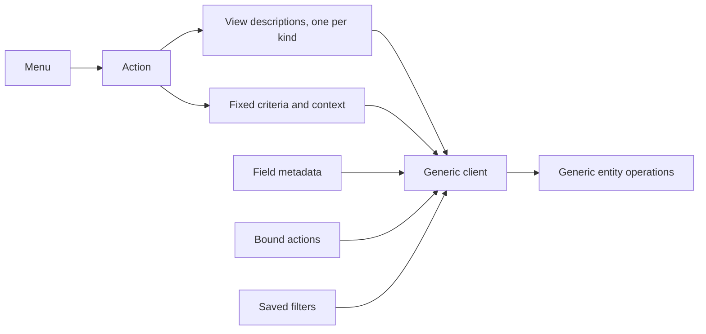

# Views and actions

The system has no hard-coded screens. Every screen a user sees is assembled by a generic client from three kinds of record: a **view**, which describes what to show; an **action**, which says what to open and with what criteria; and a **menu**, which says where the action hangs in the navigation. All three are records of entities, all three arrive as package data, and all three are extended by the mechanisms of [inheritance and extension](inheritance-and-extension.md).

This document specifies every view kind and its declarative grammar node by node; view inheritance and priority; the six action kinds with every configuration field; menus; the binding of actions to entities; the search grammar; and the exact contract a client relies on when it asks the server for a view.

Read [the architecture](architecture.md), [the entity and field system](entity-and-field-system.md) and [the security model](security-model.md) first.

---

## Table of contents

1. [The presentation contract](#1-the-presentation-contract)
2. [The view record](#2-the-view-record)
3. [Grammar common to every view kind](#3-grammar-common-to-every-view-kind)
4. [The form view](#4-the-form-view)
5. [The list view](#5-the-list-view)
6. [The card view](#6-the-card-view)
7. [The search view](#7-the-search-view)
8. [The calendar view](#8-the-calendar-view)
9. [The chart view](#9-the-chart-view)
10. [The cross-table view](#10-the-cross-table-view)
11. [The activity view](#11-the-activity-view)
12. [The template view](#12-the-template-view)
13. [View inheritance and priority](#13-view-inheritance-and-priority)
14. [View resolution: the contract a client relies on](#14-view-resolution-the-contract-a-client-relies-on)
15. [View validation](#15-view-validation)
16. [Actions](#16-actions)
17. [Window actions](#17-window-actions)
18. [Server actions](#18-server-actions)
19. [Client actions](#19-client-actions)
20. [Address actions](#20-address-actions)
21. [Report actions](#21-report-actions)
22. [The close action](#22-the-close-action)
23. [Binding actions to entities](#23-binding-actions-to-entities)
24. [Menus](#24-menus)
25. [Saved filters](#25-saved-filters)
26. [Embedded actions](#26-embedded-actions)
27. [Pending configuration steps](#27-pending-configuration-steps)
28. [Further view kinds contributed by capability packages](#28-further-view-kinds-contributed-by-capability-packages)
29. [Field presentation widgets](#29-field-presentation-widgets)
30. [Embedded sub-views](#30-embedded-sub-views)
31. [Invariants a rebuild must preserve](#31-invariants-a-rebuild-must-preserve)
32. [Acceptance criteria](#32-acceptance-criteria)
33. [Reconciliation notes](#33-reconciliation-notes)

---

## 1. The presentation contract

A client never receives rendered markup for a business screen. It receives:

1. a **view description**: a declarative tree naming fields, buttons, groupings and layout containers;
2. the **field metadata** for every field named, and for every field named in the inline views of relational fields;
3. optionally the **bound actions** that should appear in the screen's toolbar;
4. optionally the **saved filters** for the entity.

From those the client renders. The contract is that a client which understands the grammar of this document can render **every** screen of **every** capability, including ones written after it. That is why the grammar is closed and specified, and why extension happens by modifying the declaration rather than by shipping code.

Three consequences a rebuild must accept:

- Adding a capability must not require changing the client.
- Every attribute the client interprets must be in the grammar; a capability that needs new behaviour contributes a **widget** name, which the client resolves to a renderer, and falls back gracefully when it does not know the name.
- Expressions embedded in a view — visibility conditions, candidate restrictions, default values — are evaluated **by the client**, against the record being edited. They are therefore guidance, never enforcement ([security model, section 12](security-model.md#20-what-is-not-enforcement)).



---

## 2. The view record

A view is a record of the View entity (`ir.ui.view`, table `ir_ui_view`).

| Field (storage name) | Type | Meaning and rules |
|---|---|---|
| Name (`name`) | Text, required | A label for administrators. |
| Entity (`model`) | Text, indexed | The transport name of the entity the view describes. A template view may have none. |
| Key (`key`) | Text, indexed excluding empty values | A stable name of the form package name, a dot, a local name. Used for templates and for tenant-local copies, which have no external identifier. |
| Priority (`priority`) | Integer, default 16, required | Orders sibling views. Lower is applied first, and lower wins when the client must choose a default. |
| Kind (`type`) | Selection | One of `list`, `form`, `graph` (chart), `pivot` (cross-table), `calendar`, `kanban` (card), `search`, `qweb` (template). |
| Description (`arch`) | Long text, computed with an inverse | The declarative tree, as read. Applies translation and, in development mode, may read from the shipped file instead of the stored value. |
| Base description (`arch_base`) | Long text, computed with an inverse | The same without translation. |
| Stored description (`arch_db`) | Long text, translated term by term | Where the description is actually stored. |
| Source file (`arch_fs`) | Text | Where the description originally came from, so a broken view can be hard-reset. |
| Description modified (`arch_updated`) | Boolean | True when the stored description differs from the shipped one. |
| Previous description (`arch_prev`) | Long text | The stored description before the last write, so a broken view can be soft-reset. |
| Inherits from (`inherit_id`) | Many-to-one to View, deletion behaviour restrict, indexed | The view this one modifies. |
| Inheriting views (`inherit_children_ids`) | One-to-many to View | |
| Mode (`mode`) | Selection, default `primary`, required | `primary` (base view) or `extension`. See [section 13](#13-view-inheritance-and-priority). |
| Groups (`group_ids`) | Many-to-many to Group, association table `ir_ui_view_group_rel` | When empty the view applies to everyone; otherwise only to members. |
| Active (`active`) | Boolean, default true | An inactive extension does not extend; an inactive primary view is not offered. |
| External identifier (`xml_id`) | Text, computed | |
| Entity record (`model_id`) | Many-to-one to Entity Catalogue, computed with an inverse | |
| Warning information (`warning_info`) | Markup, computed | Diagnostics shown to an administrator. |
| Invalid anchors (`invalid_locators`) | Structured document, computed | The specification nodes of this view that no longer match, so a broken extension can be found. |

Default ordering: priority, then name, then identifier.

Privileged relational commands on this entity are forbidden, so an elevated operation cannot be made to rewrite views through a relation.

**The parent chain may not loop.** A view whose inherits-from link reaches itself, directly or through any number of intermediate views, is refused with **"You cannot create recursive inherited views."** The check runs **before** every other check of [section 15](#15-view-validation), because resolution walks the chain and a loop would never terminate.

### 2.1 The eight kinds

| Kind | Shows | Typical use |
|---|---|---|
| Form | One record, in full | Creating and editing |
| List | Many records, one per row | Browsing and bulk editing |
| Card | Many records, as cards, optionally in columns | Pipelines and visual browsing |
| Search | No records; the filtering apparatus | Attached to every multi-record screen |
| Calendar | Records placed on a time grid | Scheduling |
| Chart | Aggregates as bars, lines or sectors | Analysis |
| Cross-table | Aggregates as a two-dimensional table | Analysis |
| Template | Arbitrary rendered content | Printed documents, public pages, electronic mail bodies |

A ninth kind, the **activity** view, is contributed by the messaging capability and is specified in [section 11](#11-the-activity-view) because its grammar belongs with the others. Three further kinds — the hierarchy chart, the scheduling chart and the map — are contributed by other capability packages and are specified in [section 28](#28-further-view-kinds-contributed-by-capability-packages). The settings form is not a kind of its own but a variant of the form, specified in [section 4.5](#45-the-settings-form-variant).

---

## 3. Grammar common to every view kind

### 3.1 Structure

A view description is a tree. Its root node's name is the view kind — except the card view, whose root name differs from its kind value, and the template view, whose root is arbitrary. Every node has a name, attributes, and children.

### 3.2 The field node

The single most important node. It names a field of the entity and instructs the client to render it.

| Attribute | Meaning |
|---|---|
| `name` | **Required.** The field name. A field node with no name is refused with **"Field tag must have a "name" attribute defined"**. A name that is not a field of the entity is refused with **"Field "**\<name\>**" does not exist in model "**\<entity\>**"**. |
| `string` | Overrides the field's label. |
| `help` | Overrides the field's tooltip. |
| `widget` | Names the renderer. Unknown names fall back to the type's default renderer. |
| `options` | A structured value passed to the renderer. |
| `invisible` | A condition; when it evaluates true the node is not rendered. |
| `readonly` | A condition; when true the field is not editable. |
| `required` | A condition; when true the field must be filled before saving. |
| `column_invisible` | A condition evaluated against the **parent** record; used in an inline list to hide a whole column. |
| `domain` | A candidate restriction for a relational field, overriding the field's own. On a non-relational field it is refused with **"Domain on non-relational field "**\<name\>**" makes no sense (domain:"**\<the filter\>**)"**. |
| `context` | Context keys applied when opening or searching the target. |
| `groups` | A group requirement; the node is removed for users who do not satisfy it. |
| `nolabel` | Suppresses the automatic label. |
| `colspan` | How many layout columns the node occupies. |
| `class` | Presentation classes. |
| `digits` | Overrides the decimal places shown. |
| `password` | Renders the value masked. |
| `filename` | For a binary field, names the field holding the file name. |
| `mode` | For a to-many field, the inline view kinds to offer, comma-separated. |
| `view_mode` | Equivalent, in some kinds. |
| `on_change` | Marks the field as triggering the on-change round trip. |

**Inline views.** A field node for a relational field may contain a complete view of the target entity — a form, a list, a card view, a chart or a calendar — which the client uses instead of looking one up. The inline view is validated against the **target** entity.

**Custom properties.** A field node naming a custom-properties field requires the field naming the definition container to be present in the same view, so that the client can resolve the definitions; the requirement is enforced at validation.

**Dynamic candidate restriction.** When the candidate restriction is an expression rather than a literal filter, its field references are validated in two directions: names appearing on the left of a condition must exist on the **target** entity, and names appearing as values must be present in the same view, because the client evaluates the expression against the record being edited.

### 3.3 The button node

Invokes something.

| Attribute | Meaning |
|---|---|
| `type` | `object` to invoke a named operation on the entity; `action` to run an action by identifier; absent when `special` is used. |
| `name` | The operation name, or the action's identifier or external identifier. |
| `special` | One of `cancel`, `save`, `add`. Anything else is refused with **"Invalid special '"**\<value\>**' in button"**. |
| `string` | The label. |
| `icon` | An icon name. A button with an icon must also carry accessible text; the validation checks it. |
| `confirm` | Text shown in a confirmation prompt before invoking. |
| `context` | Context keys for the invocation. |
| `invisible` | A condition. |
| `groups` | A group requirement. |
| `class` | Presentation classes. |
| `help` | A tooltip. |

Validation of an operation button:

1. The named operation must exist on the entity: **"\<name\> is not a valid action on \<entity\>"**.
2. It must not be private and must not be marked not remotely callable: **"\<name\> on \<entity\> is private and cannot be called from a button"**.
3. It must be callable with no arguments beyond the receiver; otherwise a warning is recorded stating that it has parameters and cannot be called from a button.

Validation of an action button: the named action must exist.

### 3.4 The conditions

Four attributes hold a logical condition, evaluated by the client against the record being edited plus the context:

| Attribute | Effect when true |
|---|---|
| `invisible` | The node is not rendered |
| `readonly` | The node is not editable |
| `required` | The node must be filled before saving |
| `column_invisible` | In an inline list, the whole column is hidden; evaluated against the parent record |

Rules:

1. A condition references fields of the record. Every referenced field must be present in the view, or the client cannot evaluate it; validation checks this.
2. Conditions are combined by extensions using the logical form of the attribute grammar ([inheritance and extension, section 9.8](inheritance-and-extension.md#98-attributes)).
3. **A condition is never enforcement.** A read-only condition does not prevent a transport write; a required condition does not prevent a transport creation with the field empty.
4. Decoration attributes — attributes whose name begins with the decoration prefix — also hold conditions and are combined the same way; they colour a row or a cell.

#### The evaluation environment

A condition is a side-effect-free expression evaluated once per rendered record — once per view for the column condition. The notation is the same expression language the platform uses for stored conditions, restricted to reading names, attribute access, indexing, comparison, boolean composition, arithmetic, membership and the construction of literal values. Calls are limited to the helper names below. Assignment, loading of other definitions, loops and definitions of new names are not part of the notation.

| Name available | Value |
|---|---|
| Every field name present in the view description | The value of that field on the record being rendered. A many-to-one evaluates to its identifier or to false; a to-many evaluates to the list of identifiers; a date or an instant evaluates to its canonical text form |
| `parent` | The record of the containing form, available only inside an embedded sub-view of a relational field; fields of it are read as the name, a full stop and the field name |
| `context` | The mapping of context keys in force for this view |
| `uid` | The identifier of the acting user |
| `today` | The current local date, as canonical text |
| `now` | The current local date and time, as canonical text |
| `datetime`, `dateutil`, `time`, `relativedelta`, `context_today` | Date helpers, available in the conditions of search filters |

The column condition is evaluated **without** the record values: only the context, the parent record, the acting user's identifier, the current date and the current instant are available, because the attribute governs a whole column and not one row.

#### A field used in a condition must be present in the view

A field name can be read only when the field is part of the view description. When a condition or a decoration mentions a field the description does not contain, the post-processing pass of [section 14.7](#147-the-post-processing-passes-in-full) **adds it automatically** as an invisible, read-only node and records why it was added. The rule exists so that the client never has to fetch values it was not told about.

#### Worked examples

| Attribute | Condition | Effect |
|---|---|---|
| `invisible` | `state != 'draft'` | The node is rendered only while the record is in the draft state |
| `invisible` | `context.get('hide_price') or list_price == 0` | On a record whose list price is zero and with an empty context, the condition is true and the node is not rendered |
| `invisible` | `parent.company != company` | Hidden on a line whose company differs from the enclosing document's |
| `readonly` | `state in ('posted', 'cancelled')` | Not editable once the record has left the editable states |
| `required` | `delivery_method == 'carrier'` | Must be filled when a carrier was chosen |
| `column_invisible` | `not context.get('show_costs')` | The whole column is hidden unless the context asks for costs |
| `decoration-danger` | `quantity_on_hand < reordering_minimum` | The row is drawn in the danger style |
| `decoration-muted` | `state == 'cancelled'` | The row is drawn muted |

### 3.5 Layout nodes

| Node | Meaning |
|---|---|
| `group` | A labelled block; by default a two-column grid. Attributes: `string`, `col` (the number of columns), `colspan`, `name`, `invisible`, `groups`, `class`. |
| `separator` | A horizontal rule with an optional `string`. |
| `newline` | Forces a line break in a grid. |
| `label` | An explicit label; attribute `for` naming the field it labels, plus `string`. A label naming a field not in the view is refused. |
| `div`, `span`, `p`, `h1` … `h6`, `ul`, `ol`, `li`, `table`, `a`, `img`, `i`, `b`, `strong`, `small` | Structural and typographic containers, each accepting `class`, `invisible`, `groups` and the presentation attributes. |
| `widget` | A named client component that is not a field. Attribute `name`, plus options. |

### 3.6 The group requirement

Every node accepts a `groups` attribute holding a comma-separated list of group external identifiers, optionally negated ([security model, section 3.7](security-model.md#45-declaring-group-requirements)). A node whose requirement the acting user does not satisfy is **removed** from the resolved description before it reaches the client.

This is presentation only. The field remains readable over the transport unless the field itself carries a restriction.

### 3.7 Reserved presentation classes

A handful of style class names carry behaviour rather than appearance alone, and a rebuild must honour them.

| Class | Behaviour |
|---|---|
| `oe_inline` | The node does not force a line break and does not take the full width |
| `oe_left`, `oe_right` | The node floats to that side |
| `oe_read_only`, `oe_edit_only` | The node is rendered only in that editing state |
| `oe_avatar` | An image field is rendered as a square portrait of at most ninety units on each side |
| `oe_stat_button` | A button is rendered as a statistics button — a large value with a caption — placed in the button container |
| `oe_title` | A container whose content is rendered as the record's title |
| `oe_chatter` | The container that carries the discussion thread, the followers and the planned activities |
| `o_attachment_preview` | An empty container reserving the side area for previewing the record's attachments |

One reserved **node name** behaves the same way: a container named `button_box` is the container of statistics buttons at the top right of a form.

---

## 4. The form view

Shows one record in full.

### 4.1 Root

Root node name `form`.

| Attribute | Meaning |
|---|---|
| `string` | The screen's title. |
| `create`, `edit`, `delete` | Conditions or booleans switching off the corresponding affordance. |
| `duplicate` | Switches off duplication. |
| `js_class` | Names a client class that replaces the default renderer. |
| `class` | Presentation classes. |
| `disable_autofocus` | Suppresses focusing the first field. |

### 4.2 Structure nodes specific to the form

| Node | Meaning |
|---|---|
| `header` | A band at the top holding the workflow buttons and the state indicator. Conventionally contains buttons and one field rendered as a progress indicator. |
| `sheet` | The main body, laid out as a page. |
| `notebook` | A container of tabbed pages. |
| `page` | One tab. Attributes `string` (required in practice), `name`, `invisible`, `groups`. A page outside a notebook is refused. |
| `group` | A labelled block, as in [3.5](#35-layout-nodes). |
| `footer` | A band at the bottom, used by dialog-style forms for the confirm and cancel buttons. |
| `chatter` | The messaging panel, when the entity has adopted the messaging behaviour. |

### 4.3 Validation

The form view has no schema file; it is validated in the following ways:

1. Every field node is validated as in [3.2](#32-the-field-node).
2. Every button node is validated as in [3.3](#33-the-button-node).
3. Every label's `for` must name a field present in the view.
4. Every page must be inside a notebook.
5. Every condition's field references must be present in the view.
6. Accessibility checks are applied to icon-only elements and to link elements with no text.

### 4.4 The status bar

A **status bar** is a field node placed inside the `header` node and rendered with the status widget ([section 29.3](#293-boolean-selection-and-status-widgets)). It shows the ordered set of values of a closed-list field, or the ordered set of records of a stage entity reached by a link to one record, highlights the value the record currently holds, and — unless clicking is switched off — lets the user move the record to another value by activating it.

| Attribute or option | Meaning |
|---|---|
| `statusbar_visible` | A comma-separated list of stored values. A value in the list is **always** shown, whatever the record holds. A value outside the list is shown **only** while it is the record's current value, and disappears from the bar as soon as the record moves on. This is how a long lifecycle shows three ordinary steps plus whichever exceptional step the record happens to be in. |
| Option `clickable` | Default true. When false the bar is display-only and activating an entry does nothing. |
| Option `fold_field` | The name of a boolean field on the linked stage entity. Stages whose flag is set are collapsed into one folded entry at the end of the bar instead of taking a place of their own. |
| `domain` | Restricts the set of stages offered, for a status bar over a link to one record. |
| `context` | Parameterises the set of stages offered, for a status bar over a link to one record. |

**Activating an entry writes the new value on the record.** In a form with unsaved changes the write is not sent immediately: it is kept as a pending change like any other edit, and reaches the server with the next save. A rebuild that sends the status change straight to the server would make the status bar the only control in a form that cannot be undone by discarding.

The three options above are read from the widget's own option mapping, not from the field node's attributes, with the single exception of `statusbar_visible`, which is an attribute of the field node.

### 4.5 The settings form variant

A settings view is a form view with a search field and a side bar. It adds three nodes.

| Node | Attributes | Meaning |
|---|---|---|
| `app` | `string`, mandatory, the application name; `name`, mandatory, the capability package's technical name; `logo`, a path whose default is the package's conventional icon; `groups`; `invisible` | Declares one application section. It creates one entry in the side bar and acts as the boundary when searching within the settings |
| `block` | `title`, `help`, `groups`, `invisible` | A titled group of settings. Both the title and the help text are searchable |
| `setting` | `type`, which is `header` for a scope banner and empty otherwise; `string`, the label, defaulting to the first field's label; `title`, the hover text; `help`, the description under the label; `company_dependent`, which accepts only the value one and shows a per-company marker; `documentation`, a path shown as a link; `groups`; `invisible` | One setting. Its first field child is the main field: a boolean is placed on the left panel and anything else at the top of the right panel. Every other child is rendered in the right panel |

---

## 5. The list view

Shows many records, one per row.

### 5.1 Root

Root node name `list`.

| Attribute | Meaning |
|---|---|
| `string` | Title. |
| `editable` | `top` or `bottom`: rows are editable in place and a new row appears at that end. Any other value is refused with **"The "editable" attribute of list views must be "top" or "bottom", received "**\<value\>. |
| `multi_edit` | Allows editing several selected rows at once. |
| `create`, `edit`, `delete`, `duplicate`, `import`, `export_xlsx` | Switch off the corresponding affordance. |
| `open_form_view` | Adds an explicit control opening the full form. |
| `limit` | Rows per page; defaults to the action's limit. |
| `groups_limit` | Groups per page when grouped. |
| `count_limit` | Caps the total count so that an expensive count is avoided. |
| `default_order` | An ordering expression overriding the entity's. |
| `default_group_by` | A field name to group by initially. |
| `expand` | Expands groups by default. |
| `sample` | Shows illustrative sample rows when the list is empty. |
| `js_class` | Names a replacement renderer. |
| `class` | Presentation classes. |

### 5.2 Children

Only these node names are allowed directly inside a list: `field`, `button`, `control`, `groupby`, `widget`, `header`. Anything else is refused with **"List child can only have one of \<names\> tag (not \<name\>)"**.

| Node | Meaning |
|---|---|
| `field` | A column. Additional attributes: `optional` (`show` or `hide`, making the column user-togglable), `sum`, `avg` (a footer aggregate with a label), `width`, `column_invisible`, `decoration-*`. |
| `button` | A per-row button. |
| `control` | Replaces the default "add a line" control; contains `create` nodes each with a `string` and an optional `context`. |
| `groupby` | Describes how to render a group header when grouped by a **many-to-one** field. Attribute `name` must name a many-to-one; otherwise refused with **"Field '\<name\>' found in 'groupby' node can only be of type many2one, found \<type\>"**. Its children are fields of the **target** entity and buttons. |
| `header` | A band above the list holding buttons that act on the selection. |
| `widget` | A named client component. |

### 5.3 Aggregates

A numeric column may declare a footer aggregate with `sum` or `avg`, whose value is the label shown next to the total. The aggregate actually computed is the field's declared aggregate rule ([entity and field system, section 5.3](entity-and-field-system.md#53-behaviour-attributes)). A monetary column can only be aggregated when its currency field can also be aggregated.

---

## 6. The card view

Shows many records as cards, optionally arranged in columns by a grouping field.

### 6.1 Root

Root node name `kanban`; the kind value is also `kanban`.

| Attribute | Meaning |
|---|---|
| `default_group_by` | The field that becomes the columns. |
| `default_order` | Ordering within a column. |
| `records_draggable` | Whether cards can be dragged between columns. |
| `groups_draggable` | Whether columns can be reordered. |
| `group_create`, `group_edit`, `group_delete` | Switch off column management. |
| `quick_create`, `quick_create_view` | Whether a card can be created inline and with which view. |
| `on_create` | Names an action to run instead of inline creation. |
| `archivable` | Whether a column offers archiving its records. |
| `sample` | Shows illustrative sample cards when empty. |
| `limit`, `groups_limit`, `count_limit` | Paging. |
| `js_class`, `class` | Renderer and presentation. |

### 6.2 Children

| Node | Meaning |
|---|---|
| `field` | Declares that the field must be loaded. Rendering is done by the template. |
| `progressbar` | Declares the coloured progress bar on a column header: attributes `field` (the field whose values map to colours), `colors` (a mapping from value to colour name) and `sum_field` (a numeric field to total). |
| `header` | Buttons acting on the selection. |
| `templates` | Holds one or more named rendering templates; the one named for the card body is the card's markup. |
| `widget` | A named client component. |

The card body is a template, which means the card view mixes the declarative grammar with the template grammar of [section 12](#12-the-template-view). Every field referenced in the template must also appear as a field node, so that the client knows to load it.

### 6.3 The progress bar

```formula
count_for_colour( group , colour ) = number of records of the group whose progress field equals the value mapped to that colour
```

The counts are obtained by one grouped aggregation over the grouping field and the progress field together, so that the client's per-column bars and the server's counts always agree.

---

## 7. The search view

Describes the filtering apparatus attached to every multi-record screen. It shows no records itself.

### 7.1 Root

Root node name `search`. Attributes: `string`.

A search view with no field node anywhere in its tree records the warning **"Search tag requires at least one field element"**, because nothing could then be searched.

### 7.2 Children

| Node | Meaning |
|---|---|
| `field` | Declares a field the user may type into. |
| `filter` | A named predefined condition or grouping. |
| `separator` | Splits filters into groups; see [7.5](#75-how-filters-combine). |
| `group` | A container of filters, rendered as one menu. |
| `newline` | A layout break. |
| `searchpanel` | The side panel; at most one per search view, otherwise refused with **"Search tag can only contain one search panel"**. |

### 7.3 The search field node

| Attribute | Meaning |
|---|---|
| `name` | The field to search. |
| `string` | The label offered in the search suggestions. |
| `operator` | The operator to use instead of the default. |
| `filter_domain` | An expression producing the condition, given the typed value. This is how a single search box can search three fields at once. |
| `domain` | For a relational field, a restriction on the candidates offered. |
| `context` | Context keys contributed when the field is used. |
| `groups` | A group requirement. |
| `invisible` | A condition. |
| `widget` | A renderer for the input. |

**Default operator per type.**

| Field type | Default condition produced from typed text *t* |
|---|---|
| Short text, long text, markup | The field contains *t*, case- and accent-insensitively |
| Selection | The field equals the code whose label contains *t* |
| Many-to-one, one-to-many, many-to-many | The relation leads to a record whose display name contains *t* |
| Integer, decimal number, monetary | The field equals *t* parsed as a number; a value that does not parse contributes nothing |
| Date, date and time | The field falls within the period *t* denotes |
| Boolean | The field is true or false as *t* denotes |

When `filter_domain` is given, it replaces the default entirely and the typed value is substituted into it.

### 7.4 The filter node

| Attribute | Meaning |
|---|---|
| `name` | **Required.** The filter's stable name, used by an action's context to switch it on by default. |
| `string` | The label. |
| `domain` | The condition the filter contributes. Its field references are validated against the entity. |
| `context` | Context keys the filter contributes. A key naming a grouping instruction turns the filter into a grouping. |
| `date` | Names a date or instant field, turning the filter into a **period filter**: the client offers years, quarters and months rather than a single condition. |
| `default_period` | For a period filter, the periods pre-selected, comma-separated. Each must match a year or month expression with an optional signed offset, or be one of the four named quarters, or name a custom option declared as a child. Anything else is refused with **"Invalid default period \<value\> for date filter"**. |
| `start_month`, `end_month`, `start_year`, `end_year` | Bound the periods offered. |
| `invisible` | A condition. |
| `groups` | A group requirement. |
| `help` | A tooltip. |
| `icon` | An icon. |
| `separator` | Marks a boundary within a group of filters. |

**Grouping filters.** A filter whose context contributes a grouping instruction adds a grouping rather than a condition. The instruction names one or more fields, each optionally with a granularity for a date or instant — the year, the quarter, the month, the week or the day.

### 7.5 How filters combine

This is the rule users rely on and a rebuild must reproduce exactly.

1. Filters **in the same group**, meaning between the same pair of separators inside the same container, combine by **disjunction**. Ticking "draft" and "posted" shows both.
2. Filters **in different groups** combine by **conjunction**. Ticking "draft" and "this month" shows draft entries of this month.
3. A condition typed into a **field** combines by conjunction with everything else. Two values typed into the **same** field combine by disjunction.
4. The result is conjoined with the action's fixed criteria ([section 17.3](#173-criteria-and-context)).
5. The whole is conjoined with the record rules by the entity layer.

```formula
effective_filter =
      action_criteria
  AND ( conjunction over each filter group of ( disjunction of the ticked filters of that group ) )
  AND ( conjunction over each searched field of ( disjunction of the values typed into that field ) )
  AND ( conjunction of the search panel's selections )
```

**Worked example.** A search view with two groups of filters — a status group holding "draft" and "posted", and a date group holding "this month" — and a field searching the party. The user ticks "draft" and "posted", ticks "this month", and types "Acme" into the party field. The effective filter is:

> (status is draft **or** status is posted) **and** (date is in this month) **and** (party's display name contains "Acme")

conjoined with the action's fixed criteria and the record rules.

### 7.6 The search panel

A side panel offering one-click narrowing.

Root node `searchpanel`, attributes `view_types` (the view kinds it appears in, comma-separated) and `class`. Its children are field nodes with extra attributes:

| Attribute | Meaning |
|---|---|
| `select` | `one` renders a single-selection list; `multi` renders checkboxes. |
| `icon`, `color` | Presentation of the section. |
| `enable_counters` | Whether each value shows how many records carry it. |
| `expand` | Whether values with no records are shown. |
| `limit` | Maximum number of values offered; zero means no limit. |
| `hierarchize` | For a hierarchical target, whether to nest the values. |
| `groupby` | Groups the offered values by a field of the target. |
| `domain` | Restricts the values offered. |

A single-selection section contributes an equality condition; a multiple-selection section contributes a membership condition. Sections combine by conjunction.

### 7.7 Default state from the action

The action's context may switch filters, groupings and searched values on by default:

| Context key form | Effect |
|---|---|
| `search_default_<filter name>` | Ticks that filter. A numeric value also gives the filter an order among the default groupings. |
| `search_default_<field name>` | Pre-fills that search field with the value. |
| `search_default_groupby_<field name>` | Adds a default grouping. |

---

## 8. The calendar view

Places records on a time grid.

Root node name `calendar`.

| Attribute | Meaning |
|---|---|
| `date_start` | **Required.** The field holding the start. |
| `date_stop` | The field holding the end. |
| `date_delay` | Alternatively, the field holding the duration. |
| `all_day` | A boolean field marking whole-day records. |
| `color` | A field whose value colours the entries and drives the side legend. |
| `mode` | The initial scale: `day`, `week`, `month` or `year`. |
| `scales` | Which scales are offered, comma-separated. |
| `quick_create`, `quick_create_view_id` | Whether a record can be created by dragging and with which view. |
| `multi_create_view` | A view used to create several entries at once. |
| `create_name_field` | The field filled from the text typed during quick creation. |
| `event_open_popup` | Whether clicking opens a dialog rather than navigating. |
| `event_limit` | How many entries a day cell shows before collapsing. |
| `month_overflow` | Whether a month cell shows entries spilling from adjacent months. |
| `show_unusual_days` | Whether non-working days are shaded. |
| `show_date_picker` | Whether the side date picker appears. |
| `hide_date`, `hide_time` | Suppress parts of the entry label. |
| `form_view_id` | The form opened when an entry is clicked. |
| `create`, `edit`, `delete` | Switch off affordances. |
| `aggregate` | A numeric field totalled per period. |
| `js_class` | A replacement renderer. |

Children are field nodes declaring what to load, and `filter` nodes declaring side filters; each filter's `name` must be a field of the entity.

Validation checks that each of the start, duration, end, colour and whole-day attributes names an existing field, taking the part before the first full stop of a path.

---

## 9. The chart view

Shows aggregates as bars, lines or sectors.

Root node name `graph`.

| Attribute | Meaning |
|---|---|
| `type` | `bar`, `line` or `pie`. |
| `stacked` | Whether bars stack. |
| `cumulated`, `cumulated_start` | Whether a line accumulates, and from which value. |
| `order` | Orders the categories by value, ascending or descending. |
| `disable_linking` | Prevents clicking through to the records. |
| `sample` | Shows illustrative data when empty. |
| `js_class`, `class`, `string` | |

A chart may contain **only** field nodes; anything else is refused with **"A \<graph\> can only contains \<field\> nodes, found a \<\<name\>\>"**.

| Field node attribute | Meaning |
|---|---|
| `type` | `measure` for the value axis, `row` for a category, `col` for a second category. |
| `interval` | For a date or instant category, the granularity. |
| `invisible` | Hides the field from the offered measures. |
| `string` | The label. |

---

## 10. The cross-table view

Shows aggregates in a two-dimensional table with expandable headers.

Root node name `pivot`.

| Attribute | Meaning |
|---|---|
| `disable_linking` | Prevents clicking a cell to see its records. |
| `display_quantity` | Shows the record count column by default. |
| `default_order` | The initial sort, naming a measure and a direction. |
| `stacked` | Affects the derived chart. |
| `sample`, `js_class`, `class`, `string` | |

Children are field nodes with `type` of `measure`, `row` or `col`, and `interval` for date granularity, as for the chart.

Only fields that can be grouped by may be a row or a column; only fields with an aggregate rule may be a measure.

---

## 11. The activity view

Shows records as rows against the kinds of activity scheduled on them. Contributed by the messaging capability; specified here for completeness.

Root node name `activity`. Attributes: `string`, `create` (switch off creation), `js_class`.

Children are field nodes declaring what to load, and a `templates` node holding the rendering template for a cell.

Only entities that have adopted the activity behaviour may have an activity view ([messaging model](messaging-model.md#8-activities)).

---

## 12. The template view

A template view holds arbitrary rendered content: a printed document, a public page, the body of an electronic mail message, a fragment of a card.

Its description is a tree whose nodes are ordinary markup plus **directive attributes** that the renderer interprets. The directives:

| Directive | Meaning |
|---|---|
| Name | Declares the template's name, so it can be rendered or extended by name. |
| Value | Replaces the node's content with the value of an expression. |
| Output | Outputs an expression without a surrounding element. |
| Condition | Renders the node only when an expression is true; with the paired alternative directives, an else-if and an else branch. |
| Iteration | Repeats the node for each element of a collection, binding a name to the element and exposing the index, the first and last flags and the count. |
| Attribute setting | Sets an attribute from an expression. |
| Call | Renders another template by name at this point, optionally passing values. |
| Field | Renders a field of a record using that field's own renderer, so that a date is formatted and an amount carries its currency. |
| Set | Binds a name to a value for the rest of the template. |
| Options | Passes options to a field renderer. |
| Debug | Emits diagnostics in development mode. |

Templates are extended by the **same** node-matching and position grammar as views ([inheritance and extension, section 9](inheritance-and-extension.md#9-extending-views)).

Rendering, page furniture, paper formats and the production of printable documents are specified in [report rendering](../runtime/report-rendering.md).

---

## 13. View inheritance and priority

The combination algorithm, the two modes, the node-matching rules and the position grammar are specified in full in [inheritance and extension, section 9](inheritance-and-extension.md#9-extending-views). This section states only what belongs to the presentation contract.

### 13.1 Choosing the view to combine

When a client asks for a view of a given kind on a given entity, the server chooses the root view as follows:

1. If an identifier was given, use that view. If it is an extension, walk up to its closest primary ancestor and use that, then apply this view's own specifications on top of the fully combined result.
2. Otherwise, if the context carries the key made of the kind and the view-reference suffix — for example the key naming a form view reference — resolve it as an external identifier and use that view.
3. Otherwise, take the views of that kind on that entity that are active, that have no parent or whose parent is of another entity, and that the acting user's groups admit; choose the one with the **lowest priority**, then the lowest identifier.
4. If none exists, produce a **default view** as specified in [13.5](#135-generated-default-views): for a form, every field of the entity in a single group; for a list, the display name column; for a search, the display-name field. The default is minimal and exists so that a new entity is usable before anyone writes a view for it.
5. If none exists **and** no generator exists for that kind, the request fails with **"No default view of type '"** the kind **"' could be found!"**. Only the kinds listed in [13.5](#135-generated-default-views) have a generator; a request for any other kind on an entity that has no view of it reaches this refusal.

### 13.2 Group applicability

A view carrying groups applies only to users who belong to at least one of them. A view that does not apply is skipped entirely during combination — it is as if it did not exist for that user. This is how one entity can have genuinely different screens per role, as opposed to one screen with hidden nodes.

### 13.3 Priority as the default-choice lever

Priority does two things: it orders sibling extensions, and it decides which primary view is chosen as the default for a kind. A capability that must supersede another's default view ships a primary view with a lower priority.

### 13.4 Tenant-local customisations

A user may store a personal variant of a view; it is a record of the View Customisation entity (`ir.ui.view.custom`, table `ir_ui_view_custom`) holding the user, the base view and the customised description. The most recently created one for that user and view wins. Customisations are per user and are never shared.

### 13.5 Generated default views

When no view exists for a pair of entity and kind, the platform generates one.

| Kind | Generated description |
|---|---|
| Form | A sheet titled with the entity's description, holding a two-column grid built from every field of the entity except the automatic fields and except a read-only display name. Fields that are to-many, association, long text or markup are each placed in their own full-width group; every other field is distributed alternately between a left and a right column. A non-stored binary field that is not an image is skipped. The description ends with an empty group holding a separator |
| List | A single column showing the entity's display-name field, titled with the entity's description |
| Card | A single card template showing the display-name field |
| Search | A single search field on the display-name field |
| Chart | A single axis field on the display-name field |
| Cross-table | An empty cross table titled with the entity's description |
| Calendar | Titled with the entity's description, showing the display-name field. The start field is the first filterable field among the entity's declared date field, then `date`, `date_start`, `x_date` and `x_date_start`; when none exists the generation fails with **"Insufficient fields for Calendar View!"**. The colouring field is the first among `user`, `partner`, `x_user` and `x_partner` that exists. The end field is the first among `date_stop`, `date_end`, `x_date_stop` and `x_date_end`; when none exists, the duration field is the first among `date_delay`, `planned_hours`, `x_date_delay` and `x_planned_hours`; when neither exists the generation fails with **"Insufficient fields to generate a Calendar View for "** followed by the transport name and **", missing a date_stop or a date_delay"** |

---

## 14. View resolution: the contract a client relies on

### 14.1 The two operations

| Operation | Input | Output |
|---|---|---|
| Get one view | A view identifier or a kind, plus options | The resolved description and the entities and fields it needs |
| Get several views | A list of (identifier, kind) pairs, plus options | One resolved description per kind, the merged field metadata, optionally the toolbar, optionally the saved filters |

### 14.2 What the result contains

| Key | Content |
|---|---|
| Views | One entry per requested kind, each holding the resolved description, the view's identifier, and the entity's transport name |
| Entities and fields | For each entity appearing in any of the descriptions — the main one and every entity reached through an inline view — the metadata of every field the descriptions name |
| Toolbar | When requested: the bound actions and bound reports applicable to this entity and this view kind |
| Filters | When requested and a search view was asked for: the saved filters for the entity and, if given, the action |

### 14.3 Resolution steps

**Preconditions.** An entity, a view kind or identifier, the acting user's environment.

1. Check read access on the entity. A user who may not read the entity may not obtain its views.
2. Choose the root view ([13.1](#131-choosing-the-view-to-combine)).
3. Combine it with its applicable inheriting views ([inheritance and extension, section 9.2](inheritance-and-extension.md#92-the-combination-algorithm)).
4. **Post-process for access rights**: remove every node whose group requirement the acting user does not satisfy; remove every field node naming a field the user may not read; mark as read-only every field node naming a field the user may read but not write; remove every button whose group requirement is not satisfied.
5. **Post-process for debugging**: in debug mode, annotate nodes with their originating view, so that an administrator can find which extension contributed what.
6. Collect the entities and fields the description names, including those of inline views, and add the fields the kind requires implicitly — see [14.4](#144-implicit-fields-per-kind).
7. Produce the field metadata for those fields ([entity and field system, section 21](entity-and-field-system.md#21-field-metadata-exposed-to-clients)).
8. Serialise the description, removing tab characters so that whitespace is predictable.

### 14.4 Implicit fields per kind

| Kind | Fields added even when not named |
|---|---|
| Card, list, form | The identifier, and the last-modification stamp when the entity keeps audit fields |
| Search | **Every** field of the entity, so that a user may search on anything |
| Chart | Every integer and decimal-number field, as candidate measures |
| Cross-table | Every field that can be grouped by |

### 14.5 What the result may depend on

The result is cached, and the cache key is therefore part of the contract. The resolved views may depend **only** on:

- the requested kinds and identifiers;
- the acting user's access rights and the views their groups admit;
- the options passed;
- the context language;
- the per-kind view-reference context keys.

They may **not** depend on any other context value, on the acting user's identity beyond their groups, or on the records being displayed. A rebuild that lets a view depend on anything else will produce a cache that returns the wrong screen.

Expressions inside the description are evaluated by the client with the full context and the record values; that is where per-record variation belongs.

### 14.6 The toolbar

When the toolbar is requested, the bound actions of the entity are resolved ([section 23](#23-binding-actions-to-entities)) and placed under two headings:

| Heading | Content |
|---|---|
| Print | Bound report actions |
| Action | Bound window, server and client actions |

An action is included in a kind's toolbar when its declared view kinds include that kind, or when it declares none, in which case it appears in every kind requested.

### 14.7 The post-processing passes in full

Step 4 of [section 14.3](#143-resolution-steps) is not one operation but seven passes, applied in this order to the combined description.

**Pass one: group annotation.** Every node carrying a group requirement, and every node under a field whose *entity declaration* restricts it to groups, is annotated with the resulting group expression: the intersection of the requirements inherited from the containing nodes, the groups of the entity's read right, and the requirement declared on the node itself. The requirement attribute is then removed from the node. The annotation is a compact key, so that the cached description can be pruned cheaply per user.

**Pass two: pruning and permission flags.** For each annotated node, when the acting user does not satisfy the annotation, the node **and its subtree are removed**. The removed node's trailing text is reattached to its preceding sibling, or to the parent's leading text, so that the layout does not lose its spacing. An annotated neutral node — a grouping wrapper with no other attribute — whose annotation the user *does* satisfy is itself removed while its children stay in place, so that a grouped set of fields still behaves as direct children of the enclosing group.

The root node then receives the permission flags:

| Flag | Rule |
|---|---|
| Creation disabled | Added when the attribute is not already written and the user may not create records of the entity |
| Editing disabled | Added when the attribute is not already written and the user may not write records of the entity |
| Deletion disabled | Added when the attribute is not already written and the user may not delete records of the entity |

For a card view whose default grouping names a many-to-one, the same rule is applied for the **related** entity to the three group-level flags that govern creating, renaming and deleting a column.

Every field node pointing at a relation, inside an editable view, receives two further flags reporting whether the user may create and whether the user may write records of the related entity.

**Pass three: injection of missing fields.** Every condition, every decoration, every context expression and every dynamic candidate restriction of the description is scanned for field names. A name not already present is appended to the root node as a field node marked invisible and read-only — marked column-invisible instead when the root is a list — carrying a diagnostic attribute that records every place that forced the injection. The injected field is read-only unless the reason for the injection is a file-name reference, in which case the read-only state of the referencing node, or of the binary field itself, is used. When the places that use the field are themselves restricted to groups, the injected node is annotated with the intersection of those groups, so that a user who cannot see any of the uses does not fetch the value either.

**Pass four: sub-view embedding.** A missing multi-record sub-view is resolved and appended inside the field node, by the rule of [section 30.2](#302-automatic-embedding).

**Pass five: recomputation flags.** For a form, list or card view, every field node whose field is a declared input of a derived field that is **also present in the description** receives the on-change flag. The client uses it to decide whether changing the value must trigger the recomputation round trip. The flag is not added when the description already carries it.

**Pass six: diagnosis-mode adjustment.** A node whose group requirement mentions the technical-features group is treated specially: the group name is stripped from the requirement and a marker records whether the node is meant to be visible **only** in debug mode. After pruning, when the acting user's debug state does not match the marker, the node receives the invisible and column-invisible conditions instead of being removed. The rule exists because the technical-features group is a display switch and not a security boundary, and because combining it with a real group in one requirement must mean "and", not "or".

**Pass seven: field description collection.** The set of field names used by the description and by every sub-view is collected per entity and returned beside the description, so that the client can obtain their descriptions in the same round trip. The attributes returned per field are: the change-default flag, the context, the currency field, the definition record and its field, the digits, the minimum display digits, the candidate restriction, the aggregate, the group requirement, the help text, the entity-name field, the name, the read-only flag, the related path, the target entity, the inverse field, the required flag, the filterable flag, the selection list, the size, the sortable flag, the stored flag, the label, the translatable flag, the trim flag, the type, the groupable flag and the label shown for the empty value. The collected set is then widened per kind exactly as [section 14.4](#144-implicit-fields-per-kind) states.

---

## 15. View validation

A view is validated when its package is installed or updated, and whenever it is written.

### 15.1 What is checked, and what it says when it refuses

Validation happens on every create, on every write that touches the description, the parent view or the active flag, and on package installation and update. It resolves the view ([section 14](#14-view-resolution-the-contract-a-client-relies-on)), checks the result against the grammar of its kind, and checks every name the result mentions. A failure **aborts the transaction**: the view is not saved and, during an installation, the package does not install.

Nine families of check exist — the description parses; the result matches the schema of its kind; every field node names an existing field; every button names an existing, public, argument-free operation or an existing action; every condition's field references are present in the view; every candidate-restriction expression resolves on both sides; every group named in a group requirement exists; the kind-specific structural rules of [sections 4](#4-the-form-view) to [11](#11-the-activity-view) hold; and the accessibility rules of [section 15.5](#155-accessibility-warnings) hold. The table below gives every rule of the first eight families with the exact text shown when it refuses.

**How to read the table.** A fragment between angle brackets inside a quoted message is a placeholder, described in the rule column; it is not literal text. The symbol ⏎ marks a line break inside the message. Two messages name an implementation technology in the shipped text: the encoding refusal names the document notation and the context refusal names the expression language. Following [rule two](../references/documentation-rules.md), those two words are not reproduced here; the placeholders `<notation>` and `<expression language>` stand where the shipped text carries them, and a rebuild substitutes its own names. `<use>` names, in every message that carries it, the place the failing expression was written — the attribute name and its value, such as the visibility condition of a node or the context of a field.

| Rule | Message when it refuses |
|---|---|
| The root node must be the node of the declared kind | "The root node of a `<kind>` view should be a `<<kind>>`, not a `<<node>>`" |
| The entity named by the view must exist | "Model not found: `<entity>`" |
| The kind must be a known one | "Invalid view type: '`<kind>`'.⏎You might have used an invalid starting tag in the architecture.⏎Allowed types are: `<list of kinds>`" |
| A description must be present when the view is created | "Missing view architecture." |
| The description must not carry an encoding declaration | "Unicode strings with encoding declaration are not supported in `<notation>`.⏎Remove the encoding declaration." |
| A list view accepts only the children field, button, control, group-by, widget and header | "List child can only have one of field, button, control, groupby, widget, header tag (not `<node>`)" |
| The editable attribute of a list view must be `top` or `bottom` | "The \"editable\" attribute of list views must be \"top\" or \"bottom\", received `<value>`" |
| A chart view accepts only field children | "A `<graph>` can only contains `<field>` nodes, found a `<<node>>`" |
| A search view should carry at least one search field | Warning, not a refusal: "Search tag requires at least one field element" |
| A search view may hold at most one search panel | "Search tag can only contain one search panel" |
| A search-panel entry that allows several selections may not carry a condition | "Searchpanel item with select multi cannot have a domain." |
| A field node must name a field | "Field tag must have a \"name\" attribute defined" |
| The named field must exist on the entity | "Field \"`<name>`\" does not exist in model \"`<entity>`\"" |
| A candidate-restriction condition on a field that is not a relation is meaningless | "Domain on non-relational field \"`<name>`\" makes no sense (domain:`<condition>`)" |
| A group-header field must be a link to one record | "Field '`<name>`' found in 'groupby' node can only be of type many2one, found `<type>`" |
| A group-header field must exist | "Field '`<name>`' found in 'groupby' node does not exist in model `<entity>`" |
| A label must name the node it labels | "Label tag must contain a \"for\". To match label style without corresponding field or button, use 'class=\"o_form_label\"'." |
| A page must be a direct child of a notebook | "Page direct ancestor must be notebook" |
| A special button's value must be `cancel`, `save` or `add` | "Invalid special '`<value>`' in button" |
| An operation button must name an operation that exists on the entity | "`<name>` is not a valid action on `<entity>`" |
| That operation must be callable from outside ([the security model](security-model.md)) | "`<name>` on `<entity>` is private and cannot be called from a button" |
| That operation must take no required argument | Warning, not a refusal: "`<name>` on `<entity>` has parameters and cannot be called from a button" |
| An action button must name an external identifier that resolves | "Invalid xmlid `<reference>` for button of type action." |
| The record it resolves to must be an action | "`<reference>` is of type `<entity>`, expected a subclass of `ir.actions.actions`" |
| The action it names must still exist | "Action `<reference>` (identifier: `<key>`) does not exist for button of type action." |
| A name used by an expression must name a node of the view | "Name or identifier “`<name>`” in `<use>` does not exist." |
| That node must be present in the delivered view, not removed by a group requirement | "Name or identifier “`<name>`” in `<use>` must be present in view but is missing." |
| A field used by an expression must be a plain name, not a dotted path | "Invalid composed field `<path>` in `<use>`" |
| A field used by an expression may not be a search-panel entry that allows several selections | "Field “`<name>`” used in `<use>` is present in view but is in select multi." |
| A conditional expression must parse | "Invalid `<use>`: “`<expression>`”⏎`<parser message>`" |
| A condition must parse | "Invalid `<use>`: “`<condition>`”⏎`<parser message>`" |
| Every field path inside a condition must exist on the entity it applies to | "Unknown field \"`<entity>`.`<field>`\" in `<use>`)" |
| A path inside a condition may not traverse a field that is not a relation | "Non-relational field “`<field>`” in path “`<path>`” in `<use>`)" |
| A field used in a condition must be searchable | "Unsearchable field “`<field>`” in path “`<path>`” in `<use>`)" |
| A context expression must parse | "Invalid context: “`<expression>`” is not a valid `<expression language>` expression ⏎⏎ `<parser message>`" |
| A grouping key inside a context must be a literal text | "\"group_by\" value must be a string `<attribute>`=“`<value>`”" |
| A grouping key must name an existing field | "Unknown field “`<field>`” in \"group_by\" value in `<attribute>`=“`<value>`”" |
| The column-count and column-span attributes must be whole numbers | "“`<attribute>`” value must be an integer (`<value>`)" |
| A period filter's default period must be one of the offered option keys | "Invalid default period `<value>` for date filter" |
| A group named by a group requirement should exist | Warning, not a refusal: "The group “`<name>`” defined in view does not exist!" |
| The hover-text data attributes the client generates may not be written by hand | "Forbidden attribute used in arch (`<attribute>`)." |
| Only the template directives allowed for the kind may be written | "Forbidden owl directive used in arch (`<directive>`)." |
| The internal component reference may not be written by hand | "Forbidden use of `__comp__` in arch." |
| The whole description must satisfy the grammar of its kind | "Invalid view `<name>` definition in `<file>`" |
| Any other resolution or validation failure | "Error while validating view near:⏎⏎`<the five lines of the description around the failure>`⏎`<reason>`", or, when no position can be shown, "Error while validating view (`<key>`):⏎⏎`<reason>`" |

**Template directives permitted inside a view description.** A view description is not a template, so the directives of the template language are refused with the forbidden-directive message above — with two deliberate exceptions.

1. In a **board** layout, which compiles its card templates through the template engine, exactly these directives are allowed and no others: `t-name`, `t-esc`, `t-out`, `t-set`, `t-value`, `t-if`, `t-else`, `t-elif`, `t-foreach`, `t-as`, `t-key`, every variant beginning `t-att` (the attribute-setting family, whether written as the bare form, the dynamic-name form or the mapping form), `t-call` and `t-debug`.
2. In **every other kind of view**, exactly one directive is allowed: `t-translation`, which marks a subtree as not to be translated. Every other directive, including every directive allowed in a board layout, is refused.

### 15.2 Partial validation

During a package update, validating every view of every entity would be prohibitive. Validation is therefore **partial**: only the nodes contributed by the views being validated are checked. The marking is:

- an inserted node is flagged;
- a node whose attributes were modified is flagged by adding a marker attribute;
- any use of the replacement position flags the **whole** result, because a replacement can invalidate anything.

### 15.3 Failure

A view whose validation fails aborts the package update, and the failure names the file, the line and the serialised node. A tenant-local view whose validation fails records a warning and the view is left in place but reported through the warning field.

### 15.4 Broken anchors

An extension whose specification no longer matches anything records the offending specification in the invalid-anchors field of the view, so that an administrator can find extensions broken by another package's change without reading every view.

### 15.5 Accessibility warnings

These do not block saving; they are recorded in the log.

| Situation | Warning |
|---|---|
| An image node without alternative text | "\ tag must contain an alt attribute" |
| A link styled as a button without the button role | "\"\<a\>\" tag with \"btn\" class must have \"button\" role" |
| A drop-down container without the menu role | "dropdown-menu class must have menu role" |
| A progress indicator without the progress role | "o_progressbar class must have progressbar role" |
| A progress indicator without a current value | "o_progressbar class must have aria-valuenow attribute" |
| A progress indicator without a lower bound | "o_progressbar class must have aria-valuemin attribute" |
| A progress indicator without an upper bound | "o_progressbar class must have aria-valuemaxattribute" |
| A dialog container without the dialog role | "\"modal\" class should only be used with \"dialog\" role" |
| A tab link without the tab role | "tab link (data-bs-toggle=\"tab\") must have \"tab\" role" |
| A tab link without the controlled node | "tab link (data-bs-toggle=\"tab\") must have \"aria_control\" defined" |
| A controlled-node reference containing a fragment marker | "aria-controls in tablink cannot contains \"#\"" |
| A node declared as decorative | "A role cannot be `none` or `presentation`. All your elements must be accessible with screen readers, describe it." |
| The singular spelling of the group-requirement attribute | "attribute 'group' is not valid.  Did you mean 'groups'?" |
| An icon-only button with no accessible description | A warning naming the icon, beginning "A button with icon attribute (" the icon ")", followed by the missing-description reason |

**Compatibility finding.** The upper-bound warning is emitted as "o_progressbar class must have aria-valuemaxattribute", with no space between the attribute name and the word "attribute", while the two sibling warnings carry the space. The text is reproduced as observed because tests and support procedures key on it; a corrected behaviour would insert the missing space, matching the two siblings.

**Compatibility finding.** The singular-spelling warning carries two consecutive spaces between the two sentences. The text is reproduced as observed; a corrected behaviour would use one.

### 15.6 Diagnostics stored on the view record

Two fields on the view record hold the outcome of the most recent validation, and both are what the maintenance screens list.

| Field | Content |
|---|---|
| The warning report | The readable result of re-running the resolution and the post-processing in debug mode. Its most common content is the group-inconsistency report: a field used by a condition is available to a narrower set of groups than the nodes that use it, which means some users would see a node whose condition reads a value they never receive. The report names the field, the groups it is available to, and the nodes that use it |
| The broken anchors | For an extending view, the list of its anchors that no longer match, each with the reason; this is what the maintenance screen lists after a package is updated |

---

## 16. Actions

An **action** is a record saying what to do next. Six kinds exist. All six inherit a common set of fields from the Action entity (`ir.actions.actions`, table `ir_actions_actions`).

### 16.1 Common fields

| Field (storage name) | Type | Meaning |
|---|---|---|
| Name (`name`) | Text, required, translatable | The title shown when the action opens. |
| Kind (`type`) | Text, required | The transport name of the concrete action entity. This is how a client dispatches. |
| External identifier (`xml_id`) | Text, computed | |
| Path (`path`) | Text | A stable path segment so the action has a shareable address. |
| Description (`help`) | Markup, translatable | The text shown when the screen has no records. |
| Bound entity (`binding_model_id`) | Many-to-one to Entity Catalogue, deletion behaviour cascade | See [section 23](#23-binding-actions-to-entities). |
| Binding kind (`binding_type`) | Selection, values `action` and `report`, default `action` | Which toolbar heading the action appears under. |
| Binding view kinds (`binding_view_types`) | Text, default `list,form` | The view kinds whose toolbar shows it. |

**Rules on the path.** The path is what makes an action addressable by a readable address instead of by a numeric identifier, so it is constrained:

1. The value must begin with a lowercase letter and continue with lowercase letters, digits, underscores and hyphens only. Any other value is refused with **"The path should contain only lowercase alphanumeric characters, underscore, and dash, and it should start with a letter."**
2. Two prefixes are reserved, because the client's own address grammar uses them: a path beginning `m-` is refused with **"'m-' is a reserved prefix."** and a path beginning `action-` with **"'action-' is a reserved prefix."**
3. The single word `new` is reserved, because it addresses an unsaved record: using it is refused with **"'new' is reserved, and can not be used as path."**
4. A path must be unique across **every** kind of action, not merely within one kind, because the address carries the path alone. A duplicate is refused with **"Path to show in the URL must be unique! Please choose another one."**

### 16.2 The six kinds

| Transport name | Kind | Purpose |
|---|---|---|
| `ir.actions.act_window` | Window action | Open an entity's records in one or more views |
| `ir.actions.server` | Server action | Run server-side logic, possibly returning another action |
| `ir.actions.client` | Client action | Hand control to a named client component |
| `ir.actions.act_url` | Address action | Navigate to or download an address |
| `ir.actions.report` | Report action | Produce a printable document |
| `ir.actions.act_window_close` | Close action | Close the current dialog |

### 16.3 How an action reaches the client

Three routes:

1. **A menu** names an action; opening the menu opens the action.
2. **A button** of kind action names an action by identifier; pressing it opens the action.
3. **An operation returns an action description** — a mapping of the fields above plus the kind's own — which the client interprets exactly as it would a stored action. This is the mechanism behind "confirm the order, then show me the delivery".

An operation returning nothing means "stay here and reload the record".

---

## 17. Window actions

A record of the Window Action entity (`ir.actions.act_window`, table `ir_act_window`).

### 17.1 Fields

| Field (storage name) | Type | Default | Meaning |
|---|---|---|---|
| Kind (`type`) | Text | `ir.actions.act_window` | |
| Target entity (`res_model`) | Text, required | | The entity whose records are shown. |
| View kinds (`view_mode`) | Text, required | `list,form` | Comma-separated list of view kinds, in the order the client offers them. The first is the initial one. |
| Small-screen first kind (`mobile_view_mode`) | Text | `kanban` | The kind used first on a small screen, if it is among the offered kinds. |
| View (`view_id`) | Many-to-one to View, deletion behaviour set null | | Forces a specific view for the **first** kind in the list. |
| View bindings (`view_ids`) | One-to-many to Window Action View | | Forces a specific view per kind; see [17.2](#172-per-kind-view-bindings). |
| Resolved views (`views`) | Binary, computed | | The ordered list of (view identifier or none, kind) pairs the client should request. |
| Record (`res_id`) | Integer | | Opens directly on this record. Only meaningful when the view kind list is exactly the form kind. |
| Criteria (`domain`) | Text | | An expression producing the fixed filter. |
| Context (`context`) | Text, required | empty mapping | An expression producing the context keys. |
| Target (`target`) | Selection | `current` | `current` replaces the content area; `new` opens a dialog; `fullscreen` takes the whole window; `main` replaces the whole content and clears the breadcrumb trail. |
| Limit (`limit`) | Integer | 80 | Records per page. |
| Search view (`search_view_id`) | Many-to-one to View | | Forces a specific search view. |
| Filter (`filter`) | Boolean | | Whether the saved-filter menu is offered. |
| Groups (`group_ids`) | Many-to-many to Group, association table `ir_act_window_group_rel` | | Restricts who may run the action. |
| Usage (`usage`) | Text | | A marker used to find actions by role rather than by identifier. |
| Data caching (`cache`) | Boolean | true | Whether the client may cache the data behind this action's screens. |
| Embedded actions (`embedded_action_ids`) | One-to-many to Embedded Action, computed | | See [section 26](#26-embedded-actions). |

### 17.2 Per-kind view bindings

The view-binding records — of the Window Action View entity (`ir.actions.act_window.view`, table `ir_act_window_view`) — pin a specific view to a specific kind for this action.

| Field (storage name) | Type | Meaning |
|---|---|---|
| Sequence (`sequence`) | Integer | Order. |
| View (`view_id`) | Many-to-one to View | The view to use. |
| Kind (`view_mode`) | Selection over the view kinds, required | |
| Action (`act_window_id`) | Many-to-one to Window Action, deletion behaviour cascade, indexed | |
| On multiple records (`multi`) | Boolean | When set, the action is not offered on a single record's form toolbar. |

**Resolution of the view list.**

1. Start from the bindings, ordered by sequence, as (view identifier, kind) pairs.
2. For each kind in the view-kind list that has no binding, append (none, kind).
3. If a forced view is given and the first kind has no binding, that view is used for the first kind.
4. The result is the ordered list the client requests.

### 17.3 Criteria and context

Both are **expressions**, not literals, evaluated with the same restricted context as a record rule plus the active-record keys:

| Name | Value |
|---|---|
| The acting user | The user record |
| The current company and the allowed companies | |
| The active record identifier, the active record identifiers and the active entity | Present when the action was triggered from a selection |
| Date and time helpers | |
| A resolver from external identifier to identifier | |

The criteria are conjoined with everything the search view contributes and with the record rules.

The context keys are merged into the environment for the screen. The keys a window action most often sets:

| Key | Effect |
|---|---|
| `default_<field>` | The default value of a field for records created from this screen |
| `search_default_<name>` | A search filter, grouping or field pre-filled |
| `active_test` | Whether archived records are shown |
| `create`, `edit`, `delete` | Switch off affordances for this screen only |
| `group_by` | An initial grouping |
| `form_view_ref`, `list_view_ref`, and the equivalent per kind | Force a specific view by external identifier |

### 17.4 Running the action

1. Check that the acting user satisfies the action's group restriction; otherwise refuse.
2. Check read access on the target entity; otherwise refuse.
3. Resolve the view list and request the views.
4. Evaluate the criteria and the context.
5. Open the first view kind, with the record when one is given.

---

## 18. Server actions

A record of the Server Action entity (`ir.actions.server`, table `ir_act_server`). It runs logic on the server and may return another action.

### 18.1 Fields

| Field (storage name) | Type | Default | Meaning |
|---|---|---|---|
| Name (`name`) | Text, computed with an override | | Derived from the configured behaviour when not given. |
| Derived name (`automated_name`) | Text, computed, stored | | The name the system would derive. |
| Kind (`type`) | Text | `ir.actions.server` | |
| Usage (`usage`) | Selection, required | `ir_actions_server` | `ir_actions_server` for a user-triggered action; `ir_cron` for the body of a scheduled job. |
| Behaviour (`state`) | Selection, required | | See [18.2](#182-the-behaviours). |
| Allowed behaviours (`allowed_states`) | Structured document, computed | | Which behaviours are offered for the chosen entity. |
| Sequence (`sequence`) | Integer | 5 | Execution order when several actions run together; lower runs first. |
| Entity (`model_id`) | Many-to-one to Entity Catalogue, required, deletion behaviour cascade, indexed | | The entity the action operates on. |
| Entity name (`model_name`) | Text, related | | |
| Warning (`warning`) | Long text, computed, recursive | | Diagnostics, including those of child actions. |
| Scheduled jobs (`ir_cron_ids`) | One-to-many to Scheduled Job | | The jobs whose body this action is. |
| Code (`code`) | Long text, restricted to the settings group | | The body, for the code behaviour. |
| Parent (`parent_id`) | Many-to-one to itself, indexed, deletion behaviour cascade | | Set on children of a composite action. |
| Children (`child_ids`) | One-to-many to itself, copied | | The actions a composite action runs, in sequence order. |
| Target entity (`crud_model_id`) | Many-to-one to Entity Catalogue | | The entity a create behaviour creates in. |
| Link field (`link_field_id`) | Many-to-one to Field Catalogue | | The field of the source record that should point at the created record. |
| Groups (`group_ids`) | Many-to-many to Group, association table `ir_act_server_group_rel` | | Restricts who may run it. |
| Field to update (`update_field_id`) | Many-to-one to Field Catalogue, computed with an override, stored | | |
| Field path (`update_path`) | Text | | A dotted path to the field to update, so an action can update a related record. |
| Related entity of the path (`update_related_model_id`) | Many-to-one to Entity Catalogue, computed with an override, stored | | |
| Field type (`update_field_type`) | Selection, related | | |
| Boolean value (`update_boolean_value`) | Selection, values `true` and `false`, default `true` | | The value for a boolean field. |
| Value (`value`) | Long text | | The value to write, either literal or an expression. |
| Evaluation kind (`evaluation_type`) | Selection | | Whether the value is a literal or an expression. |
| Markup value (`html_value`) | Markup | | The value for a markup field. |
| Sequence to use (`sequence_id`) | Many-to-one to Numbering Sequence | | For assigning a number. |
| Record reference (`resource_ref`) | Polymorphic reference | | For assigning a relational value chosen in the interface. |
| Selection value (`selection_value`) | Many-to-one to Selection Value, deletion behaviour cascade | | For assigning a selection field. |
| Value field to show (`value_field_to_show`) | Selection | | Which of the value fields the screen should offer, derived from the field's type. |
| Webhook address (`webhook_url`) | Text | | Where to send the notification. |
| Webhook fields (`webhook_field_ids`) | Many-to-many to Field Catalogue, association table `ir_act_server_webhook_field_rel` | | The fields included in the payload. |
| Sample payload (`webhook_sample_payload`) | Long text, computed | | |

### 18.2 The behaviours

| Value | Label | What it does |
|---|---|---|
| `object_write` | Update Record | Writes one field, possibly through a path, on the records it receives. The value is a literal, an expression, a selection value, a referenced record, or the next number of a sequence, depending on the field's type. |
| `object_create` | Create Record | Creates a record of the target entity from configured values, and optionally sets the link field on the source record to point at it. |
| `object_copy` | Duplicate Record | Duplicates the records it receives. |
| `code` | Execute Code | Runs a configured body in a restricted evaluation context. It may set a result, which, when it is an action description, becomes the action returned. |
| `webhook` | Send Webhook Notification | Sends the configured fields of the records to the configured address as a structured document. |
| `multi` | Multi Actions | Runs its child actions in sequence order. The **last** child that returns an action description determines what the client does next. |

Capabilities add further behaviours — creating an activity, posting a message, sending a text message, adding or removing followers — each declared as an additional selection value and implemented as an extension.

### 18.3 The evaluation context of a code behaviour

The body runs in a restricted context that offers:

| Name | Value |
|---|---|
| The environment | The current environment |
| The entity | The empty record set of the configured entity |
| The records | The records the action was triggered on |
| The single record | The first of them, for convenience |
| The acting user | |
| Date and time helpers | |
| A logging facility | |
| A slot for the result | Assigning an action description to it makes the action return it |

Nothing else is reachable: no arbitrary import, no file access, no network access except through the entities' own operations.

### 18.4 Running a server action

1. **Check permission.** When the action declares access groups, the acting user must belong to at least one of them. When it declares none, the acting user must hold the write permission on the action's entity and, when the action addresses real records, the write permission on those records as well. All three failures raise the same text, **"You don't have enough access rights to run this action."**, and record a diagnostic line naming the action, the user and the entity. The three cases share one message deliberately: distinguishing them would tell an unauthorised caller which of the three gates it failed.
2. **Refuse an action that carries warnings.** When the warning field of [18.1](#181-fields) is not empty, the action does not run and the refusal is **"Server action "** the action's name **" has one or more warnings, address them first."**
3. Bind the record set: the active record identifiers from the context, of the active entity, which must match the action's entity.
4. Run the behaviour.
5. If the behaviour produced an action description, return it; otherwise return nothing.

**What fills the warning field.** Each of the following conditions puts a line in the warning field, and each therefore blocks execution through step 2:

| Condition | Warning text |
|---|---|
| A child action operates on another entity | **"Following child actions should have the same model ("** the parent's entity **"): "** the names of the offending children |
| A child action declares different access groups | **"Following child actions should have the same groups ("** the parent's groups **"): "** the names of the offending children |
| A child action itself carries warnings | **"Following child actions have warnings: "** the names of those children |
| An update behaviour writes to a structured-document field | **"I'm sorry to say that structured-data fields (such as '"** the field's label **"') are currently not supported."** |
| An update behaviour writes a generated sequence into a field that is not textual | **"A sequence must only be used with character fields."** |
| A notification payload names a group-restricted field | **"Group-restricted fields cannot be included in webhook payloads, as it could allow any user to accidentally leak sensitive information. You will have to remove the following fields from the webhook payload:"** then a line break and the list of offending fields |

The warning field is computed and recursive: a warning on a child reaches the parent, so a chain of actions is blocked by the deepest fault in it.

A server action's own history of code changes is kept as records of the Server Action History entity (`ir.actions.server.history`, table `ir_actions_server_history`), so that an administrator can see and compare revisions.

---

## 19. Client actions

A record of the Client Action entity (`ir.actions.client`, table `ir_act_client`). It hands control to a named client component.

| Field (storage name) | Type | Default | Meaning |
|---|---|---|---|
| Kind (`type`) | Text | `ir.actions.client` | |
| Tag (`tag`) | Text, required | | The name the client resolves to a component. An unknown tag is an error the client reports. |
| Target (`target`) | Selection | `current` | As for a window action. |
| Target entity (`res_model`) | Text | | Optional; used where the component needs to know which entity it is about. |
| Context (`context`) | Text, required | empty mapping | An expression producing context keys. |
| Parameters (`params`) | Binary, computed with an inverse | | Arbitrary structured parameters for the component. |
| Stored parameters (`params_store`) | Binary, read-only, stored inline | | Where the parameters are actually stored. |

Reserved tags the platform itself relies on:

| Tag | Effect |
|---|---|
| `reload` | Reload the client shell, optionally opening a named menu |
| `reload_context` | Reload only the session context |
| `home` | Navigate to the home screen |
| `display_notification` | Show a transient notification with the given title, message, kind and optional buttons |

---

## 20. Address actions

A record of the Address Action entity (`ir.actions.act_url`, table `ir_act_url`). It navigates to an address.

| Field (storage name) | Type | Default | Meaning |
|---|---|---|---|
| Kind (`type`) | Text | `ir.actions.act_url` | |
| Address (`url`) | Long text, required | | Where to go. May be relative or absolute. |
| Target (`target`) | Selection | `new` | `new` opens a new window; `self` navigates the current one; `download` downloads the resource without navigating. |

**When the new window cannot be opened.** A target of `new` asks the client to open a second window, which the browsing environment may suppress without telling the user why. The client detects the suppression and raises a sticky notice — one that stays until dismissed rather than fading — reading **"A popup window has been blocked. You may need to change your browser settings to allow popup windows for this page."** The action is then not performed at all; nothing is downloaded and nothing is navigated to.

Address actions are how the system hands a user to a printable document, an external service, a public page or a downloadable file.

---

## 21. Report actions

A record of the Report Action entity (`ir.actions.report`, table `ir_act_report_xml`). It produces a printable document.

| Field (storage name) | Type | Default | Meaning |
|---|---|---|---|
| Kind (`type`) | Text | `ir.actions.report` | |
| Binding kind (`binding_type`) | Selection | `report` | Places it under the print heading of the toolbar. |
| Entity (`model`) | Text, required | | The entity the document is about. |
| Entity record (`model_id`) | Many-to-one to Entity Catalogue, computed | | |
| Output kind (`report_type`) | Selection, required | `qweb-pdf` | `qweb-html` renders to markup shown in the browser; `qweb-pdf` renders to a fixed-layout document; `qweb-text` renders to plain text. |
| Template name (`report_name`) | Text, required | | The key of the rendering template. |
| Report file (`report_file`) | Text | | The path of the main template file, where the content is not in a field. |
| Groups (`group_ids`) | Many-to-many to Group, association table `res_groups_report_rel` | | Restricts who may print it. |
| On multiple records (`multi`) | Boolean | | When set, the report is not offered on a single record's form toolbar. |
| Paper format (`paperformat_id`) | Many-to-one to Paper Format, indexed excluding empty values | | Page size, margins, orientation and page furniture. |
| Printed name (`print_report_name`) | Text, translatable | | An expression producing the file name, with the record and time helpers available. |
| Reload from attachment (`attachment_use`) | Boolean | | When set, printing the same document twice returns the previously stored file instead of rendering again. |
| Attachment name (`attachment`) | Text | | An expression producing the name under which the rendered document is stored as an attachment. Empty means do not store. |
| Criteria (`domain`) | Text | | When set, the report appears only on records matching it. |

### 21.1 Behaviour

1. **Storing.** When an attachment-name expression is given, the rendered document is stored as an attachment owned by the record. This is what makes an invoice's printed form immutable once issued.
2. **Reloading.** When reloading from attachment is set and an attachment of that name already exists, it is returned without re-rendering. Records for which no attachment exists are rendered, and the two sets are merged in the original order.
3. **Criteria.** The report is offered only on records the criteria admit, which is how a document is restricted to, say, posted entries.
4. **Rendering** is specified in [report rendering](../runtime/report-rendering.md).

---

## 22. The close action

A record of the Close Action entity (`ir.actions.act_window_close`, table shared with the common action entity). It has no fields of its own beyond the common ones and a fixed kind of `ir.actions.act_window_close`.

Returning it from an operation means: close the current dialog and, if the dialog was opened from a screen, refresh that screen. It is the standard return value of an assistant's confirm button.

---

## 23. Binding actions to entities

An action bound to an entity appears in the toolbar of that entity's screens without any menu naming it.

### 23.1 The declaration

Three common fields do it:

| Field | Meaning |
|---|---|
| Bound entity | The entity whose screens show the action. |
| Binding kind | `action` places it under the action heading; `report` under the print heading. |
| Binding view kinds | Comma-separated view kinds; the action appears only in those. Empty means every kind requested. |

### 23.2 Resolution

When a client requests the toolbar:

1. Collect every action bound to the entity, grouped by binding kind, ordered by sequence then by name.
2. Drop every action whose group restriction the acting user does not satisfy.
3. Drop every action whose own target entity the acting user may not read.
4. Return the remainder, grouped by heading.

Steps 2 and 3 mean the toolbar never offers something that would immediately refuse. They are a convenience, not a security boundary: the action is still reachable by identifier if the user can run it.

### 23.3 The active-record contract

An action invoked from a toolbar receives, in its context:

| Key | Value |
|---|---|
| Active entity | The transport name of the entity whose screen it was invoked from |
| Active record identifier | The single selected record, when there is one |
| Active record identifiers | Every selected record |

A server action bound to an entity therefore operates on the selection, and a window action's criteria can refer to it.

---

## 24. Menus

A menu is a record of the Menu entity (`ir.ui.menu`, table `ir_ui_menu`). Menus form a tree; the roots are the applications.

| Field (storage name) | Type | Default | Meaning |
|---|---|---|---|
| Label (`name`) | Text, required, translatable | | |
| Active (`active`) | Boolean | true | An inactive menu is hidden. |
| Sequence (`sequence`) | Integer | 10 | Order among siblings. |
| Parent (`parent_id`) | Many-to-one to itself, indexed, deletion behaviour restrict | | Empty for a root menu. |
| Children (`child_id`) | One-to-many to itself | | |
| Materialised path (`parent_path`) | Text, indexed | | Maintained so the tree can be queried without recursion. |
| Groups (`group_ids`) | Many-to-many to Group, association table `ir_ui_menu_group_rel` | | When empty the menu inherits its visibility from its children; otherwise only members see it. |
| Full path (`complete_name`) | Text, computed, recursive | | The labels of the ancestors joined by a separator; this is the menu's display name. |
| Icon file (`web_icon`) | Text | | The icon of a root menu. |
| Icon image (`web_icon_data`) | Binary, stored as an attachment | | The icon's content. |
| Action (`action`) | Polymorphic reference over the five runnable action kinds | | What the menu opens. Empty for a pure container. |

**The parent chain may not loop.** A menu whose parent link reaches itself, directly or through any number of intermediate menus, is refused with **"Error! You cannot create recursive menus."** The check runs on every create and on every write that touches the parent link, because the full path and the materialised path are both computed by walking the chain upwards.

### 24.1 Visibility

A menu is visible to a user when:

1. it is active; **and**
2. either it carries groups and the user belongs to one of them, or it carries none; **and**
3. either it has an action the user may run, or it has at least one visible child.

Rule 3 is what makes an empty section disappear rather than opening onto nothing. It is evaluated bottom-up over the whole tree.

The visible menu tree for a user is computed once and cached, keyed by the user's groups.

The table above is the **stored** record. What a client receives is a different, purpose-built payload — eleven keys per entry, a synthetic root entry, and the rule that drops an entry whose chain to an application root is broken — specified in [client architecture, section 3.1](client-architecture.md#31-the-delivered-payload).

### 24.2 Ordering

Siblings are ordered by sequence, then by identifier. Root menus are additionally influenced by the sequence of the package that contributed them, which is how applications appear in a sensible order.

### 24.3 Declaring menus

Menus are usually declared with the dedicated shorthand node of the data grammar ([package system, section 8.3](package-system.md#83-the-menu-node)), which nests: a menu node inside a menu node becomes its child. The shorthand also resolves the action's external identifier to the polymorphic reference and derives the label from the action when none is given.

### 24.4 Deletion

The parent link declares the restricting deletion behaviour, so a menu with children cannot be deleted until they are. Removing a package removes its menus, children first, because the external identifiers are processed most-recent first.

---

## 25. Saved filters

A saved filter is a record of the Saved Filter entity (`ir.filters`, table `ir_filters`). It stores a named combination of criteria, context and ordering so a user can return to it.

| Field (storage name) | Type | Default | Meaning |
|---|---|---|---|
| Name (`name`) | Text, required | | |
| Shared with (`user_ids`) | Many-to-many to User, deletion behaviour cascade | | **Empty means shared with everyone.** Otherwise only the listed users see it. The relation reads users with the archive filter off. |
| Criteria (`domain`) | Long text, required | empty filter | |
| Context (`context`) | Long text, required | empty mapping | Carries the groupings and the pre-filled search fields. |
| Ordering (`sort`) | Text, required | empty list | |
| Entity (`model_id`) | Selection over every entity, required | | |
| Default (`is_default`) | Boolean | | Applied automatically when the screen opens. |
| Action (`action_id`) | Many-to-one to Action, deletion behaviour cascade | | When set, the filter belongs to that action only; otherwise it belongs to every screen of the entity. |
| Embedded action (`embedded_action_id`) | Many-to-one to Embedded Action, deletion behaviour cascade, indexed | | |
| Parent record (`embedded_parent_res_id`) | Integer | | The record an embedded action's filter applies to. |
| Active (`active`) | Boolean | true | |

Rules:

1. At most one default filter may exist for a given entity, action and audience; setting a new default clears the previous one.
2. A filter shared with everyone may be created only by a user allowed to do so; an ordinary user's filter lists themselves.
3. Saved filters are returned with the search view when the client asks for them.

---

## 26. Embedded actions

An **embedded action** places a secondary action inside a window action's screen as an extra tab, so that a record can be viewed through several lenses without leaving it.

A record of the Embedded Action entity (`ir.embedded.actions`, table `ir_embedded_actions`).

| Field (storage name) | Type | Meaning |
|---|---|---|
| Name (`name`) | Text, translatable | The tab's label. When empty, the target action's name is used. |
| Sequence (`sequence`) | Integer | Order of the tabs. |
| Parent action (`parent_action_id`) | Many-to-one to Window Action, required, deletion behaviour cascade | The screen the tab appears in. |
| Parent record (`parent_res_id`) | Integer | When set, the tab appears only on that record. |
| Parent entity (`parent_res_model`) | Text, required | |
| Action (`action_id`) | Many-to-one to Action, deletion behaviour cascade | The action the tab opens. |
| Operation (`python_method`) | Text | Alternatively, the name of an operation returning an action. Exactly one of the two must be set; an operation without a name is refused. |
| User (`user_id`) | Many-to-one to User, deletion behaviour cascade | When set, the tab is personal; otherwise shared. |
| Deletable (`is_deletable`) | Boolean, computed | Whether the acting user may remove the tab. |
| Default view kind (`default_view_mode`) | Text | Overrides the target action's first kind. |
| Filters (`filter_ids`) | One-to-many to Saved Filter | Filters applied when the tab opens. |
| Visible (`is_visible`) | Boolean, computed | Whether the criteria admit the current record. |
| Criteria (`domain`) | Text, default the empty filter | Evaluated against the parent record. |
| Context (`context`) | Text, default the empty mapping | |
| Groups (`groups_ids`) | Many-to-many to Group | Who sees the tab. Empty means everyone. |

---

## 27. Pending configuration steps

A **pending configuration step** is a record of the Configuration Step entity (`ir.actions.todo`, table `ir_actions_todo`) naming an action that should be run once after installation.

| Field (storage name) | Type | Default | Meaning |
|---|---|---|---|
| Action (`action_id`) | Many-to-one to Action, required, indexed | | |
| Sequence (`sequence`) | Integer | 10 | |
| Status (`state`) | Selection, required | `open` | `open` means still to do; `done` means finished. |
| Name (`name`) | Text | | |

Default ordering: sequence, then identifier.

**At most one step may be open at a time.** Creating a step whose status is `open`, or writing `open` onto an existing step, triggers a reconciliation: every open step is listed in order of **sequence ascending, then identifier descending**, the first of that list is kept open, and every other open step is set to `done`. A rebuild must use exactly that ordering, because it decides which of two steps opened in the same transaction survives: the lower sequence wins, and between two steps of equal sequence the **more recently created** one wins.

**Launching a step** sets its status to `done` before anything else, so that a failure in the action it opens cannot leave the step open and re-offer itself for ever, and then returns the action. For a window action two adjustments are made to the returned action's context: a record key carried in the context is moved out of the context and onto the action's record field, so that the screen opens on that record; and the message-suppression key is added, so that opening an automatic configuration screen does not post a line in the record's discussion thread.

**The shipped menu-opening step is protected from deletion.** One step ships with the foundation package and opens the main menu after an installation. A deletion that includes it does not remove it: it is taken out of the set being deleted and its action is reset to the shipped client action that opens the main menu. Every other step in the same deletion is removed normally. This is what guarantees that an installation always has something to return to, even after an administrator has cleared the queue.

After an interactive package installation the system looks for the first open step and returns its action; when there is none, it returns the instruction to reload the client and open the first root menu ([package system, section 13.4](package-system.md#134-returning-to-the-user)).

---

## 28. Further view kinds contributed by capability packages

Three further kinds are declared by capability packages. Their grammar belongs with the others, and a rebuild that installs the packages must serve them.

### 28.1 The hierarchy view

Root node `hierarchy`. Draws the records of a self-referencing entity as an organisation chart.

| Attribute | Type | Default | Meaning |
|---|---|---|---|
| `parent_field` | Field name | The entity's parent field | The many-to-one of the same entity pointing at the parent. It must exist, must be a many-to-one and must target the same entity; otherwise the view is refused |
| `child_field` | Field name | Empty | The inverse list of children. It must exist, must be a to-many and must target the same entity |
| `draggable` | Boolean | False | Whether a node may be dragged onto another to change its parent |
| `icon` | Text | The shipped hierarchy icon | The icon of the view |
| `default_order` | Ordering list | Empty | Overrides the default ordering |
| `create`, `edit`, `delete` | Boolean | True | Enable creation, modification and deletion |

Children are field nodes and a templates node holding one mandatory template for a node box, rendered once per node. A missing node-box template is refused with **"Missing 'hierarchy-box' template."**

### 28.2 The scheduling chart

Root node `gantt`. Draws records as bars on a time axis.

| Attribute | Type | Default | Meaning |
|---|---|---|---|
| `date_start` | Field name | Mandatory | The start of the bar |
| `date_stop` | Field name | Mandatory | The end of the bar |
| `dependency_field` | Field name | Empty | The to-many of records this record depends on, used to draw the dependency arrows |
| `dependency_inverted_field` | Field name | Mandatory when the previous one is set | The inverse to-many |
| `color` | Field name | Empty | Colours the bars by value |
| Decoration attributes | Condition | False | Style the bar caption. The styles are danger, information, secondary, success, warning and bold |
| `default_group_by` | Field name | Empty | The grouping applied when nothing else specifies one |
| `default_scale` | Day, week, month or year | Month | The initial scale |
| `scales` | Comma-separated list | All | The scales the user may switch to |
| `offset` | Integer | Zero | The number of scale units added to today to compute the window the view opens on |
| `precision` | Mapping from scale to snapping step | Day scale to the hour, week and month scales to the half day | How a dragged bar snaps. The day scale accepts the hour, the half hour and the quarter hour; the week and month scales accept the day and the half day; the year scale always snaps to a full day |
| `progress` | Field name | Empty | A completion percentage between zero and one hundred drawn inside the bar |
| `consolidation` | Field name | Empty | A value summed per cell and shown in the consolidation row |
| `consolidation_max` | Mapping from grouping field to a threshold | Empty | Above the threshold the consolidation cell is drawn as exceeded |
| `consolidation_exclude` | Field name | Empty | A boolean field marking records excluded from consolidation; excluded intervals are drawn striped |
| `total_row` | Boolean | False | Show a row with the total count |
| `collapse_first_level` | Boolean | False | Allow collapsing each row when grouped by a single field; without it collapsing starts at two grouping levels |
| `display_unavailability` | Boolean | False | Draw the unavailable periods the entity reports. Records may still be scheduled inside them |
| `dynamic_range` | Boolean | False | Start the window at the first record instead of at the beginning of the calendar unit |
| `pill_label` | Boolean | False | Include the times in the bar caption at the week and month scales |
| `thumbnails` | Mapping from a link field of this entity to a picture field of the related entity | Empty | Draw a thumbnail beside each group caption |
| `create`, `edit`, `delete` | Boolean | True | Enable creation, modification and deletion |
| `cell_create` | Boolean | True | With creation enabled, offer an add control when the pointer rests on a free slot |
| `plan` | Boolean | True | With editing enabled, offer a control that plans an unscheduled record into a slot |
| `on_create` | External identifier | Empty | An action to run instead of the generic creation dialog |
| `form_view_id` | View reference | The form of the current action | The form used when creating or editing |
| `disable_drag_drop` | Boolean | False | Disable all dragging |
| `string` | Text | Empty | The title |
| `sample` | Boolean | False | Generate demonstration records when the query returns nothing |

A templates child may define one template for the hover card of a bar. Its environment exposes the current row and a helper that turns an integer into a colour.

### 28.3 The map view

Root node `map`. Draws records as pins on a map, optionally with the route between them. The entity must carry a many-to-one to a contact, because the address and coordinates of that contact locate the record.

| Attribute | Type | Default | Meaning |
|---|---|---|---|
| `res_partner` | Field name | Empty | The link to the contact that locates each record. Without it an empty map is drawn |
| `default_order` | Field name | Empty | Overrides the default ordering. The field must belong to this entity and not to the contact |
| `routing` | Boolean | False | Draw the route between the records. It requires a routing credential and at least two located records |
| `hide_name` | Boolean | False | Hide the record's name in the pin's hover card |
| `hide_address` | Boolean | False | Hide the address in the pin's hover card |
| `hide_title` | Boolean | False | Hide the title of the pin list |
| `panel_title` | Text | The action's name, otherwise "Items" | The title of the pin list |
| `limit` | Positive integer | 80 | The greatest number of records fetched |

Each field child becomes one line of the pin's hover card; the name attribute selects the field and the label attribute prefixes it with a caption.

Two location providers are supported. The default provider needs no credential and can fetch map tiles and turn addresses into coordinates. When a credential for the second provider is configured in the general settings, that provider is used instead; it is faster and it is the one that can compute routes.

### 28.4 A template view opened directly

A view whose description is a pure rendering template has no fixed root node, so its kind must be stated explicitly as the template kind. Two uses exist: a fragment of a public page, and a view opened directly by a window action. When a template is used as an openable view, the renderer adds four names to the template environment:

| Name | Meaning |
|---|---|
| The entity | The entity the view is bound to |
| The condition | The filter produced by the search view |
| The context | The context keys produced by the search view |
| The records | A lazily evaluated proxy over the records matching the condition, suitable for simple iteration |

One special case applies: a navigation container carrying the reserved control-panel class is removed from the rendered fragment and its children, which must be buttons, are moved into the button area of the control panel.

---

## 29. Field presentation widgets

A field node that names no widget is rendered by the default widget of its data type. Naming a widget in the node's `widget` attribute selects another one. A widget declares the data types it accepts; pairing a widget with an unsupported type is a view error. Some widgets exist in a kind-specific variant: a name prefixed by `list.`, `form.`, `kanban.` or `calendar.` is selected automatically when the plain name is requested inside that kind, and it is never written in a view description.

The field node's `options` attribute carries the widget's configuration as a mapping. Options that are shared by several widgets are listed once in [section 29.8](#298-options-shared-by-relation-widgets).

### 29.1 Defaults per data type

| Data type | Default widget |
|---|---|
| `boolean` | `boolean` |
| `integer` | `integer` |
| `decimal` | `float` |
| `monetary` | `monetary` |
| `text` | `char` |
| `long_text` | `text` |
| `rich_text` | `html` |
| `date` | `date` |
| `datetime` | `datetime` |
| `selection` | `selection` |
| `binary` | `binary` |
| `image` | `image` |
| `reference` | `reference` |
| `many_to_one` | `many2one` |
| `one_to_many` | `one2many` |
| `many_to_many` | `many2many` |
| `structured_data` | `json` |
| `properties` | `properties` |

### 29.2 Text, number and date widgets

| Widget | Accepts | Behavior | Options |
|---|---|---|---|
| `char` | `text`, `long_text` | Single-line input showing the raw value. Honours the `password` attribute by masking the characters. | `placeholder_field` (name of a field whose value is used as the hint when the value is empty), `dynamic_placeholder`, `dynamic_placeholder_model_reference_field` |
| `text` | `long_text`, `rich_text`, `text` | Multi-line input that grows with the content. | `line_breaks` (default true; when false the value is stored on one line), `placeholder_field` |
| `password` | `text`, `long_text` | Single-line input whose characters are masked at all times. | none |
| `email` | `text` | Shows the value as an electronic-mail link and validates that it looks like an address while typing. | `placeholder_field` |
| `phone` | `text` | Shows the value as a telephone link. | `placeholder_field` |
| `url` | `text` | Shows the value as a hyperlink. | `website_path` (when true the value is used as-is with no prefix added), `placeholder_field`; the node's `text` attribute overrides the displayed caption |
| `integer` | `integer` | Number input with thousands separators. | `enable_formatting` (default true; when false the digits are shown without separators), `type` (the input mode), `step`, `human_readable` (abbreviate large numbers), `decimals` (digits kept in the abbreviated form) |
| `float` | `decimal`, `monetary` | Number input honouring the precision of the field. | `enable_formatting`, `digits` (a pair total-digits and decimal-places), `minDigits`, `type`, `step`, `human_readable`, `hide_trailing_zeros`, `decimals` |
| `monetary` | `monetary`, `decimal`, `integer` | Number formatted with the symbol and the decimal places of the currency, placed before or after the amount according to the currency's convention. | `currency_field` (the field holding the currency; by default the currency field declared on the monetary field, otherwise the first currency link of the entity), `no_symbol`, `hide_trailing_zeros` |
| `percentage` | `integer`, `decimal` | Displays the value multiplied by one hundred followed by a percent sign, and divides the typed number by one hundred when writing. | none |
| `float_factor` | `decimal` | Multiplies the stored value by a fixed factor for display and divides it back when writing. | `factor` |
| `float_time` | `decimal` | Renders a number of hours as hours and minutes, for instance `1.5` as `01:30`, and parses the same form. | `display_seconds`, `type` |
| `float_toggle` | `decimal` | Cycles the value through a fixed list of allowed values when activated instead of accepting free input. | `digits`, `type`, `range` (the list of allowed values), `factor`, `force_button` |
| `date` | `date` | Date input with a calendar picker. | `min_date`, `max_date` (a date in the year-month-day form, or the keyword `today`), `warn_future` (mark dates in the future), `min_precision` and `max_precision` (`days`, `months`, `years`, `decades`), `numeric` (numeric rather than abbreviated month rendering), `placeholder_field`, `start_date_field`, `end_date_field` |
| `datetime` | `datetime` | Date and time input, displayed in the time zone of the acting user and stored in coordinated universal time. | all `date` options plus `rounding` (the minute step of the time picker, default `5`), `show_time` (default true), `show_seconds` (default false) |
| `daterange` | `date`, `datetime` | One control editing a pair of fields as a period. | all `datetime` options plus `start_date_field`, `end_date_field`, `always_range` (default false; when true both ends are always shown even when empty) |
| `remaining_days` | `date`, `datetime` | Shows the signed number of days between the value and today in words (`Today`, `Tomorrow`, `In 3 days`, `3 days ago`) and colours it when the value is in the past. | none |

Declaring both `start_date_field` and `end_date_field` on the same node is a configuration mistake; the end field is ignored and a warning is logged.

### 29.3 Boolean, selection and status widgets

| Widget | Accepts | Behavior | Options |
|---|---|---|---|
| `boolean` | `boolean` | A tick box. | none |
| `boolean_toggle` | `boolean` | A switch. | `autosave` (default true: flipping the switch saves the record immediately) |
| `boolean_favorite` | `boolean` | A star that is filled when true. | `autosave` (default true) |
| `boolean_icon` | `boolean` | An icon that is highlighted when true. | `icon` (the icon class name) |
| `selection` | `selection`, `many_to_one` | A drop-down list of the allowed values; for a link to one record the drop-down lists the records allowed by the condition. | `placeholder_field` |
| `filterable_selection` | `selection` | Like `selection`, but the offered values are restricted to those listed in another field of the record. | `allowed_selection_field` |
| `radio` | `selection`, `many_to_one` | The values as radio buttons. | `horizontal` (lay the buttons out on one line) |
| `selection_badge` | `selection`, `many_to_one` | The values as a row of badges, one of which is highlighted. | `size` (`sm`, `md` (default), `lg`) |
| `selection_badge_with_filter` | `selection` | Like `selection_badge`, restricted to the values listed in another field. | `allowed_selection_field`, `size` |
| `badge` | `selection`, `many_to_one`, `text` | The value as a single coloured badge. | `color_field` (an integer field that chooses the colour) |
| `label_selection` | `selection` | The value as a label whose style comes from a mapping of value to style class. | `classes` (mapping from value to class name) |
| `state_selection` | `selection` | A small coloured circle per value, used for the status of a task; activating it changes the value. | `autosave` (default true), `hide_label` |
| `statusbar` | `selection`, `many_to_one` | The status bar of [section 4.4](#44-the-status-bar), including the always-visible value list and the folded-stage rule. | `clickable` (default true), `fold_field` |
| `priority` | `selection` | A row of stars; activating the n-th star sets the n-th value. | `autosave` (default true) |
| `timezone_mismatch` | `selection` | A time zone selection that warns when the chosen zone differs from the one reported by the browser, with the message `Timezone Mismatch : This timezone is different from that of your browser.\nPlease, set the same timezone as your browser's to avoid time discrepancies in your system.` | `tz_offset_field` (default `tz_offset`), `mismatch_title` |

### 29.4 Relation widgets

| Widget | Accepts | Behavior | Options |
|---|---|---|---|
| `many2one` | `many_to_one` | A search-and-select input. Typing searches the related entity by display name; the drop-down offers the matches plus the creation entries allowed by the options. | `no_open`, `no_create`, `no_quick_create`, `no_create_edit`, `search_threshold` (the number of characters before searching), `placeholder_field` |
| `many2one_avatar` | `many_to_one` | Like `many2one` with the picture of the related record shown before the name. | the `many2one` options |
| `many2one_barcode` | `many_to_one` | Like `many2one` with an extra control that opens the device camera and selects the record whose barcode was read. | the `many2one` options |
| `many2one_reference` | `many_to_one` by key | Renders a numeric key field paired with a model-name field as if it were a link to one record. | `model_field` (the field holding the entity name) |
| `many2one_reference_integer` | `many_to_one` by key | Renders the same pair as a plain integer, without resolving the display name. | none |
| `reference` | `reference`, `text` | Two controls: one selecting the entity and one selecting the record inside it. | `hide_model` (hide the entity selector when the entity is fixed), `model_field` (the field holding the entity name) |
| `one2many` | `one_to_many` | Renders the related records through an embedded sub-view ([section 30](#30-embedded-sub-views)). | `create`, `delete`, `create_text`, `reload_on_button`, plus the list controls of [section 5](#5-the-list-view) |
| `many2many` | `many_to_many` | Same as `one2many` but the edit semantics differ ([client architecture, section 10](client-architecture.md#10-editing-a-list-of-related-records)). | `create`, `delete`, `link`, `unlink`, `no_create`, `no_quick_create`, `no_create_edit` |
| `many2many_tags` | `many_to_many`, `one_to_many` | The related records as removable tags with a search-and-select input. | `color_field` (an integer field of the related entity that colours each tag), `no_create`, `no_quick_create`, `no_create_edit`, `create`, `search_threshold`, `placeholder_field` |
| `many2many_tags_avatar` | `many_to_many`, `one_to_many` | Tags showing the picture of each related record. | the `many2many_tags` options |
| `many2many_tags_avatar_popover` | `many_to_many`, `one_to_many` | Avatar tags whose hover card shows a summary of the related record. | the `many2many_tags` options |
| `many2many_checkboxes` | `many_to_many` | Every candidate record as a tick box; ticking links it, unticking unlinks it. | none |
| `many2many_binary` | `many_to_many` to attachments | A drop area that uploads files and links the resulting attachments. | `accepted_file_extensions`, `number_of_files` (the greatest number of files accepted) |
| `attachment_image` | `many_to_one` to an attachment | Renders the linked attachment as an image. | none |
| `contact_image` | `many_to_one` to a contact | Renders the picture of the linked contact. | none |
| `handle` | `integer` | A drag grip. Dragging a row rewrites the ordering field of the moved row and of the rows between the old and the new position. | none |
| `res_user_group_ids` | `many_to_many` to access groups | The group membership editor: one selector per privilege category plus a technical list for the remaining groups. | none |
| `res_user_group_ids_privilege` | `many_to_many` to access groups | One privilege category of that editor. | none |

### 29.5 File, image and drawing widgets

| Widget | Accepts | Behavior | Options |
|---|---|---|---|
| `binary` | `binary` | Upload and download control showing the file name taken from the companion field named by the `filename` attribute. | `accepted_file_extensions`, `allowed_mime_type` |
| `image` | `binary`, `image`, `many_to_one` | Shows the stored picture, with upload, delete and zoom controls. Requests the last-update timestamp of the record in order to refresh the picture after a change. | `size` (a pair width and height), `alt` (alternative text or the field holding it), `reload` (re-fetch after each change), `zoom`, `zoom_delay`, `convert_to_webp`, `accepted_file_extensions`, `preview_image` (the field holding a smaller variant to display) |
| `image_url` | `text` | Shows the picture found at the stored web address. | `size` |
| `signature` | `binary` | Opens a drawing surface on which a signature is drawn or generated from a name, and stores the result as a picture. | `full_name` (the field holding the name used to generate a signature), `default_font`, `size` (`[0,90]`, `[0,180]` or `[0,270]`), `preview_image` |
| `pdf_viewer` | `binary` | Embeds a portable-document viewer with page navigation. | `preview_image` |
| `google_slide_viewer` | `text` | Recognizes a presentation address of the online document service and embeds the matching read-only preview, optionally at a given slide. | `page` |
| `iframe_wrapper` | `long_text`, `rich_text` | Renders untrusted markup inside an isolated frame, in order that its styles cannot leak into the page. | none |

### 29.6 Rich content, code and structured-data widgets

| Widget | Accepts | Behavior | Options |
|---|---|---|---|
| `html` | `rich_text` | The rich-text editor: formatting, lists, tables, links, images and embedded blocks. | `sanitize` behavior follows the field declaration; `codeview`, `style-inline`, `height`, `resizable` |
| `ace` | `long_text`, `rich_text` | A source-code editor with syntax colouring and line numbers. | `mode` (the language) |
| `code` | `long_text` | A lighter code editor with syntax colouring. | `mode` |
| `code_ir_ui_view` | `long_text` | The code editor pre-configured for editing a view description, with the matching syntax rules. | none |
| `json` | `structured_data` | Shows the structured value formatted and indented, read-only. | none |
| `json_checkboxes` | `structured_data` | Renders a structured value shaped as a mapping from key to a record with a label and a boolean into a list of tick boxes; ticking rewrites the mapping. Changes are grouped and written after a short idle delay. | `stacked` (lay the boxes out vertically) |
| `account_json_checkboxes` | `structured_data` | An alternative registered name of `json_checkboxes`. | as `json_checkboxes` |
| `domain` | `text`, `long_text` | A condition editor: a tree of leaves with field selectors, operators and values, plus a live count of the matching records. | `model` (the entity the condition applies to, or the field holding its name), `in_dialog`, `foldable`, `allow_expressions`, `count_limit` |
| `field_selector` | `text` | A picker that stores the path to a field of a given entity. | `model` (the entity or the field holding its name), `follow_relations` (default true), `only_searchable` |
| `properties` | `properties` | The editor of user-defined fields: it reads the definition from the parent record named by the field declaration and renders one control per defined property, with the property types `text`, `long_text`, `integer`, `decimal`, `date`, `datetime`, `boolean`, `selection`, `tags`, `many_to_one`, `many_to_many` and `separator`. | none |
| `property_tags` | `properties` sub-field | The tag editor used for a property of the tags kind, including creating a new tag value in the definition. | none |
| `contact_statistics` | `structured_data` | Renders a precomputed list of counters about a contact as a compact table. | none |
| `profiling_qweb_view` | `long_text` | Renders a template-rendering profile: each template line with its own and cumulated timings. | none |

### 29.7 Indicator and utility widgets

| Widget | Accepts | Behavior | Options |
|---|---|---|---|
| `progressbar` | `integer`, `decimal` | A bar showing the current value against a maximum, with both numbers written beside it. | `editable` (allow typing the value), `edit_max_value`, `current_value` (the field holding the current value), `max_value` (the field holding the maximum), `overflow_class` (the style applied when the current value exceeds the maximum) |
| `percentpie` | `decimal`, `integer` | A circular gauge filled to the value expressed as a percentage, with the value written in the middle and at most two decimals, trailing zeros removed. | none |
| `gauge` | `integer`, `decimal` | A half-circle gauge with a caption. | `title`, `max_value` (a fixed maximum, default `100`), `max_value_field` |
| `statinfo` | `decimal`, `integer`, `monetary`, `text`, `one_to_many`, `many_to_one` | The value and a caption, stacked, as used inside a statistics button. For a list of records the value is the count. | `label_field` (a field holding the caption), `digits`; the node's `nolabel` and `digits` attributes are also honoured |
| `dashboard_graph` | `long_text` | Renders a small chart from a structured value holding the series; used on summary cards. | `graph_type` (`line` or `bar`) |
| `color` | `text` | A colour picker storing the colour as a hexadecimal string. | none |
| `color_picker` | `integer` | A palette of twelve numbered colours storing the chosen index. | `can_toggle` |
| `kanban_color_picker` | `integer` | The same palette rendered inside a card menu; choosing a colour saves the record immediately. | none |
| `CopyClipboardChar` | `text` | The value with a control that copies it. | `string` (the caption of the control) |
| `CopyClipboardURL` | `text` | The value as a hyperlink with a control that copies it. | `string` |
| `CopyClipboardButton` | any | A control that copies the value with no visible value beside it. | `btn_class`, `string` |
| `upgrade_boolean` | `boolean` | A tick box that, instead of changing the value, opens the dialog that explains that the feature belongs to a higher subscription level. | none |
| `base_settings.binary` | `binary` | The file control adapted to the settings view. | as `binary` |
| `base_settings.radio` | `selection` | The radio control adapted to the settings view, with the highlighting used by the settings search. | as `radio` |

### 29.8 Options shared by relation widgets

| Option | Effect |
|---|---|
| `no_open` | Do not offer opening the related record. |
| `no_create` | Do not offer creating a related record at all. It implies `no_quick_create` and `no_create_edit`. |
| `no_quick_create` | Do not offer creating a record from the typed text alone. |
| `no_create_edit` | Do not offer creating a record through a dialog prefilled with the typed text. |
| `create` | The explicit opposite of `no_create`, used when the embedding view disables creation by default. |
| `search_threshold` | The number of typed characters before the search request is issued. |
| `color_field` | An integer field of the related entity that gives each tag its colour. |
| `placeholder_field` | A field of the current record whose value is used as the hint when the control is empty. |

### 29.9 Non-field widgets

A widget node with a mandatory name renders a registered component that is not bound to a single field. The platform registers the following.

| Name | Behavior |
|---|---|
| `web_ribbon` | A diagonal banner across the top right of the form, with `title`, `tooltip` and `bg_color` attributes; used to mark a record as archived, cancelled or otherwise exceptional. |
| `attach_document` | A control that uploads a file and attaches it to the record, optionally calling an operation afterwards. |
| `documentation_link` | A control that opens a documentation page at the given path. |
| `notification_alert` | A coloured panel that shows a message, typically a configuration warning. |
| `signature` | A control that captures a signature into a target field, usable outside a plain field node. |
| `week_days` | A grid of tick boxes editing seven boolean fields, one per weekday. |
| `res_config_dev_tool` | The developer-tools panel of the settings view. |
| `res_config_edition` | The subscription and version panel of the settings view. |
| `res_config_invite_users` | The panel that invites users by electronic-mail address from the settings view. |

Capability packages register further non-field widgets under their own names; a replacement must provide the registry and the lookup, and each package's own additions are specified in the interfaces document of the domain that owns it.

---

## 30. Embedded sub-views

A relational field rendered as a table, a board or a set of cards needs a view for the related records. That view can be written inline inside the field node, or resolved separately.

### 30.1 Inline sub-views

A field node may contain one or more of a list, a form, a card, a chart or a calendar description. Each is a complete view description written against the **related** entity. Inside it, the parent name refers to the record of the enclosing form.

A sales order's lines field, for example, carries two inline descriptions: a list marked editable at the bottom, showing the product, the quantity and the unit price; and a form holding a group with the product, the quantity, and a discount percentage whose invisible condition reads the enclosing order's "discounts allowed" flag through the parent name.

### 30.2 Automatic embedding

When a form description contains a visible to-many field that carries **no** widget attribute, is **not** itself inside a sub-view, and none of the kinds listed in its mode attribute is present inline, the server resolves the first missing kind and appends the resolved description inside the field node before delivering the form. The default mode for this purpose is the card kind followed by the list kind; the kind actually resolved is the first entry of the mode attribute, or the list kind on a wide screen and the card kind on a narrow screen when the attribute is absent. The rule exists so that the client receives one self-contained description and never has to make a second round trip for the sub-view.

The resolution of the embedded description runs **without** the acting user's elevated rights, and with the view references described in [section 30.3](#303-choosing-a-specific-sub-view) taken from the field node's own context; the references of the enclosing call are deliberately not propagated.

### 30.3 Choosing a specific sub-view

A context key named after the kind, followed by the view-reference suffix, selects a specific view by external identifier for that kind. It may be written in the field node's own context, or carried by the action that opened the screen.

The reference must be fully qualified — the owning package's technical name, a full stop and the local name. An unqualified reference is ignored and a warning is logged, beginning with the key's name and stating that it "requires a fully-qualified external identifier (got: " the value " for model " the transport name "). Please use the complete " the qualified form " instead."

The same keys drive the top-level resolution of [section 14.3](#143-resolution-steps), which is why they are part of the cache key of a resolved view.

---

## 31. Invariants a rebuild must preserve

1. No screen is hard-coded; every screen is a view record, an action record and a menu record.
2. The resolved view a client receives may depend only on the requested kinds, the user's groups and access, the options, the language and the per-kind view-reference keys.
3. Nodes whose group requirement is unsatisfied, and field nodes naming fields the user may not read, are removed from the resolved description before it leaves the server.
4. A field the user may read but not write has its read-only flag forced true in the metadata.
5. Conditions inside a view are evaluated by the client and are never enforcement.
6. Within one filter group, filters disjoin; across groups, they conjoin; typed field values conjoin across fields and disjoin within one field.
7. The search kind implicitly makes every field of the entity available.
8. Extension views are applied depth-first and immediately; primary views are deferred until every extension of their parent has applied.
9. Among sibling views, lower priority applies first and lower priority wins as the default.
10. A view carrying groups the user does not satisfy is skipped entirely during combination.
11. An operation invoked from a button must be public, not marked private, and callable with no arguments.
12. A toolbar never offers an action whose group restriction or whose target entity's read access the user lacks.
13. A menu is visible only if it has a runnable action or at least one visible child.
14. A window action's criteria and context are expressions evaluated server-side in a restricted context; their result is conjoined with the search state and with the record rules.
15. Returning an action description from an operation is equivalent to running the stored action of the same shape.

---

## 32. Acceptance criteria

### Views

**AC-VIEW-1.** *Given* an entity with no view of the form kind, *when* a client requests one, *then* a default form containing every field of the entity in one group is produced.

**AC-VIEW-2.** *Given* two primary form views on one entity with priorities 10 and 16, *when* a client requests the form kind with no identifier, *then* the priority-10 view is chosen.

**AC-VIEW-3.** *Given* a primary form view restricted to group A and another unrestricted, *when* a user outside A requests the form kind, *then* the restricted one is not considered.

**AC-VIEW-4.** *Given* a form view containing a field node for a field restricted to group A, *when* a user outside A resolves the view, *then* the node is absent from the result and the field is absent from the metadata.

**AC-VIEW-5.** *Given* a field the user may read but not write, *when* the view is resolved, *then* the node remains and the field's metadata carries the read-only flag set.

**AC-VIEW-6.** *Given* a form view with a button of kind object naming an operation beginning with an underscore, *when* the view is validated, *then* validation fails with the message about the operation being private.

**AC-VIEW-7.** *Given* a field node naming a field that does not exist, *when* the view is validated, *then* validation fails with "Field" the name "does not exist in model" the entity.

**AC-VIEW-8.** *Given* a list view whose editable attribute is "middle", *when* it is validated, *then* validation fails with the message naming the accepted values and the received one.

**AC-VIEW-9.** *Given* a list view containing a `group` node directly, *when* it is validated, *then* validation fails with "List child can only have one of" naming the allowed node names.

**AC-VIEW-10.** *Given* a grouping node in a list naming a field that is not a many-to-one, *when* it is validated, *then* validation fails naming the field and its type.

**AC-VIEW-11.** *Given* a chart view containing a `group` node, *when* it is validated, *then* validation fails with the message that a chart may contain only field nodes.

**AC-VIEW-12.** *Given* a search view with two search-panel nodes, *when* it is validated, *then* validation fails with "Search tag can only contain one search panel".

**AC-VIEW-13.** *Given* a search view with no field node anywhere, *when* it is validated, *then* a warning is recorded stating that a search tag requires at least one field element.

**AC-VIEW-14.** *Given* a field node with a candidate restriction on a non-relational field, *when* it is validated, *then* validation fails with the message that a restriction on a non-relational field makes no sense.

**AC-VIEW-15.** *Given* a form view containing an inline list view for a one-to-many field, *when* the view is resolved, *then* the metadata contains the fields of the target entity named by the inline view, under that entity's name.

**AC-VIEW-16.** *Given* a request for the list and search kinds together, *when* it is resolved, *then* the metadata contains every field of the entity, because the search kind requires them all.

**AC-VIEW-17.** *Given* a request for the list kind on an entity keeping audit fields, *when* it is resolved, *then* the identifier and the last-modification stamp are included even though the view does not name them.

**AC-VIEW-18.** *Given* a field node whose visibility condition references a field not present in the view, *when* the view is validated, *then* validation fails.

### Search

**AC-VIEW-19.** *Given* a search view whose status filters "draft" and "posted" are in one group and whose date filter "this month" is in another, *when* all three are ticked, *then* the effective filter is (draft or posted) and (this month).

**AC-VIEW-20.** *Given* a search field on the party and two values typed into it, *when* the search runs, *then* the two conditions are disjoined.

**AC-VIEW-21.** *Given* a search field on the party and a search field on the reference, each with one value typed, *when* the search runs, *then* the two conditions are conjoined.

**AC-VIEW-22.** *Given* an action whose context sets a search default naming a filter, *when* the screen opens, *then* that filter is ticked.

**AC-VIEW-23.** *Given* a search field declaring an explicit condition expression, *when* the user types a value, *then* the declared expression with the value substituted replaces the default condition entirely.

**AC-VIEW-24.** *Given* a period filter whose default period is "quarter", *when* the view is validated, *then* validation fails with "Invalid default period quarter for date filter".

**AC-VIEW-25.** *Given* a search panel section declared as single-selection, *when* a value is chosen, *then* an equality condition is contributed; *given* a multiple-selection section with two values chosen, *then* a membership condition is contributed.

### Actions

**AC-VIEW-26.** *Given* a window action with the view kinds list naming the list kind then the form kind, and a view binding pinning a specific list view, *when* the view list is resolved, *then* it is the pinned list view for the list kind, then no specific view for the form kind, in that order.

**AC-VIEW-27.** *Given* a window action restricted to group A, *when* a user outside A runs it, *then* it is refused.

**AC-VIEW-28.** *Given* a window action whose criteria are an expression naming the current company, *when* it runs for a user whose current company is 3, *then* the criteria are evaluated with company 3.

**AC-VIEW-29.** *Given* a server action of the composite behaviour with three children, the second and the third both returning an action description, *when* it runs, *then* all three children run in sequence order and the client receives the **third** child's action.

**AC-VIEW-30.** *Given* a server action of the update behaviour with a field path naming a related record's field, *when* it runs on two records, *then* the related records of both are updated.

**AC-VIEW-31.** *Given* a server action of the code behaviour that assigns an action description to the result slot, *when* it runs, *then* the client receives that action.

**AC-VIEW-32.** *Given* a server action whose entity differs from the active entity of the invocation, *when* it runs, *then* it is refused.

**AC-VIEW-33.** *Given* a report action with an attachment-name expression and the reload-from-attachment flag set, *when* the same record is printed twice, *then* the second print returns the stored file and no rendering happens.

**AC-VIEW-34.** *Given* a report action with criteria admitting only posted records, *when* the toolbar is resolved on a draft record, *then* the report is not offered.

**AC-VIEW-35.** *Given* an operation that returns nothing, *when* it is invoked from a button, *then* the client stays on the record and reloads it.

**AC-VIEW-36.** *Given* an operation that returns a close action, *when* it is invoked from a dialog, *then* the dialog closes and the underlying screen refreshes.

### Bindings and menus

**AC-VIEW-37.** *Given* an action bound to an entity with the binding view kinds naming only the list kind, *when* the form kind's toolbar is resolved, *then* the action is absent; *when* the list kind's toolbar is resolved, *then* it is present.

**AC-VIEW-38.** *Given* a bound action restricted to group A, *when* a user outside A resolves the toolbar, *then* it is absent.

**AC-VIEW-39.** *Given* a bound action whose target entity the user may not read, *when* the toolbar is resolved, *then* it is absent.

**AC-VIEW-40.** *Given* a bound server action invoked from a list with three records selected, *when* it runs, *then* its context carries the active entity and the three active record identifiers.

**AC-VIEW-41.** *Given* a menu with no action and one child whose action the user may not run, *when* the menu tree is computed, *then* neither the child nor the parent is visible.

**AC-VIEW-42.** *Given* a menu carrying group A and a child carrying no group, *when* a user outside A computes the tree, *then* neither is visible.

**AC-VIEW-43.** *Given* two sibling menus with sequences 20 and 10, *when* the tree is computed, *then* the sequence-10 menu comes first.

**AC-VIEW-44.** *Given* a menu with children, *when* it is deleted, *then* the deletion is refused because the parent link restricts.

### Saved filters

**AC-VIEW-45.** *Given* a saved filter with no users listed, *when* another user opens the entity's screen, *then* the filter is offered.

**AC-VIEW-46.** *Given* two default filters being set for the same entity and action, *when* the second is set, *then* the first is no longer the default.

**AC-VIEW-47.** *Given* a saved filter bound to an action, *when* a different action on the same entity is opened, *then* the filter is not offered.

### Conditions, post-processing and widgets

**AC-VIEW-48.** *Given* a form whose invisible condition on one node reads a field the description does not contain, *when* the view is resolved, *then* the field is appended to the root as an invisible read-only node carrying the record of what forced the injection, and the client receives its value.

**AC-VIEW-49.** *Given* the same field used only by nodes restricted to one group, *when* the view is resolved for a user outside that group, *then* the injected node carries the same restriction and the value is not sent.

**AC-VIEW-50.** *Given* a list whose root is the injection target, *when* a field is injected, *then* it carries the column-invisible condition rather than the plain invisible condition.

**AC-VIEW-51.** *Given* a column condition, *when* the client evaluates it, *then* only the context, the parent record, the acting user's identifier, the current date and the current instant are available, and no field of the row is.

**AC-VIEW-52.** *Given* a user who may not create records of the entity, *when* the view is resolved, *then* the root carries the creation-disabled flag; *given* the description already writes that attribute, *then* it is left as written.

**AC-VIEW-53.** *Given* a card view grouped by a many-to-one, *when* the view is resolved, *then* the three group-level flags are computed against the **related** entity.

**AC-VIEW-54.** *Given* a node whose group requirement names only the technical-features group, *when* the view is resolved for a user outside debug mode, *then* the node is present but carries the invisible and column-invisible conditions rather than being removed.

**AC-VIEW-55.** *Given* a field that is a declared input of a derived field also present in the description, *when* the view is resolved, *then* the field node carries the on-change flag.

**AC-VIEW-56.** *Given* a form containing a to-many field with no widget and no inline sub-view, *when* the view is resolved, *then* the first kind of its mode attribute is resolved and appended inside the field node, using the field node's own context and without the acting user's elevated rights.

**AC-VIEW-57.** *Given* a sub-view reference key whose value is not fully qualified, *when* the view is resolved, *then* the reference is ignored and the qualification warning is logged.

**AC-VIEW-58.** *Given* an entity with no view of a requested kind, *when* the kind is requested, *then* a default description is generated by the rules of [section 13.5](#135-generated-default-views); *given* a calendar is requested on an entity with no usable date field, *then* the generation fails with "Insufficient fields for Calendar View!".

**AC-VIEW-59.** *Given* a field of the decimal type with no widget named, *when* the view is resolved, *then* the default decimal widget is used; *given* a widget is named that does not accept the field's type, *then* the view is refused.

**AC-VIEW-60.** *Given* a monetary field whose widget names no currency field, *when* it is rendered, *then* the currency declared on the field is used, and failing that the entity's first currency link.

**AC-VIEW-61.** *Given* a relation widget declared with the no-creation option, *when* the drop-down is opened, *then* neither the create-from-text entry nor the create-through-dialog entry is offered.

**AC-VIEW-62.** *Given* a hierarchy view whose parent attribute names a field that is not a many-to-one to the same entity, *when* the view is validated, *then* it is refused; *given* the templates node holds no node-box template, *then* it is refused with "Missing 'hierarchy-box' template."

**AC-VIEW-63.** *Given* a map view whose contact attribute is absent, *when* the view is opened, *then* an empty map is drawn and no location request is made.

**AC-VIEW-64.** *Given* a view whose declared kind is the form kind and whose description has a list node as its root, *when* it is saved, *then* the save is refused with "The root node of a form view should be a `<form>`, not a `<list>`".

**AC-VIEW-65.** *Given* a label node with no target attribute, *when* the view is validated, *then* the save is refused with "Label tag must contain a \"for\". To match label style without corresponding field or button, use 'class=\"o_form_label\"'."

**AC-VIEW-66.** *Given* a page node placed directly inside a sheet, *when* the view is validated, *then* the save is refused with "Page direct ancestor must be notebook".

**AC-VIEW-67.** *Given* a card view description carrying the iteration directive of the template language, *when* it is validated, *then* the save is refused with "Forbidden owl directive used in arch (t-foreach)."; *and given* the same directive in a board layout, *then* it is accepted.

**AC-VIEW-68.** *Given* a status bar over a status field whose always-visible list names the draft and posted values, and a record in the cancelled state, *when* the form is opened, *then* the bar shows draft, posted and cancelled; *and when* the record moves to posted, *then* the bar shows draft and posted only.

**AC-VIEW-69.** *Given* an unsaved form with a clickable status bar, *when* the user activates another entry, *then* the new value is held as a pending change and no write reaches the server until the form is saved.

**AC-VIEW-70.** *Given* two pending configuration steps with sequences 10 and 20, both open, *when* a third step with sequence 5 is created open, *then* the step with sequence 5 stays open and the other two are set to done.

**AC-VIEW-71.** *Given* two open pending configuration steps of equal sequence, *when* the reconciliation runs, *then* the one with the higher identifier stays open.

**AC-VIEW-72.** *Given* a deletion naming the shipped menu-opening configuration step together with two other steps, *when* the deletion runs, *then* the two other steps are removed, the shipped step survives, and its action is reset to the shipped client action that opens the main menu.

**AC-VIEW-73.** *Given* a menu whose parent link is set to one of its own descendants, *when* it is saved, *then* the save is refused with "Error! You cannot create recursive menus."

**AC-VIEW-74.** *Given* two actions of different kinds both declaring the path `orders`, *when* the second is saved, *then* the save is refused with "Path to show in the URL must be unique! Please choose another one."

**AC-VIEW-75.** *Given* a server action whose child action operates on another entity, *when* it is run, *then* it fails with "Server action " the action's name " has one or more warnings, address them first."

**AC-VIEW-76.** *Given* a server action declaring access groups the acting user does not hold, *when* it is run, *then* it fails with "You don't have enough access rights to run this action." and a diagnostic line naming the action, the user and the entity is recorded.

---

## 33. Reconciliation notes

Four behaviours in this document contradict the reading a careful person would most naturally arrive at, and three organisational decisions about which document owns which topic are recorded with them. Each behaviour below was verified against the running system.

1. **How many view kinds there are.** Eight and twelve are both right, at different scopes: the foundation defines the eight of [section 2.1](#21-the-eight-kinds), and the activity view, the hierarchy chart, the scheduling chart and the map are contributed by capability packages. [Section 2.1](#21-the-eight-kinds) says so and [section 28](#28-further-view-kinds-contributed-by-capability-packages) specifies the four contributed kinds.
2. **What the resolution step "post-process for access rights" does.** It is not a single pruning pass. It is seven passes in a fixed order, and three of them — the group annotation that precedes pruning, the injection of fields used only by conditions, and the embedding of a missing sub-view — change the description in ways a client depends on. [Section 14.7](#147-the-post-processing-passes-in-full) states all seven; [section 14.3](#143-resolution-steps) keeps the outline.
3. **Whether a condition may name a field that is not in the view.** It may. Validation checks the reference, but the resolution **adds the field automatically** rather than refusing, which is why a working description can mention a field it does not display. [Section 3.4](#34-the-conditions) and criterion AC-VIEW-48 state the behaviour.
4. **The group requirement and the technical-features group.** Group requirements are not all handled identically. A requirement that names the technical-features group is handled separately: the node is hidden rather than removed, because that group is a display switch and not a security boundary, and combining it with a real group must mean "and". [Section 14.7](#147-the-post-processing-passes-in-full), pass six, states it.
5. **Where the widget catalogue belongs.** It is here, in [section 29](#29-field-presentation-widgets), because a widget is selected by an attribute of a view description and its options are part of that description; [client architecture](client-architecture.md) states only how the client resolves a widget name to a component.
6. **Where asset bundles belong.** Neither the view grammar nor the client owns them: a bundle's content is decided by which packages are installed, so it is specified in [the package system, section 22](package-system.md#22-client-asset-bundles).
7. **Two messages that name an implementation technology.** The encoding refusal and the context refusal of [section 15.1](#151-what-is-checked-and-what-it-says-when-it-refuses) carry, in the shipped text, the name of the document notation and the name of the expression language. Those two words are replaced by placeholders, as this repository replaces every other such name, and a rebuild substitutes its own.
8. **Acceptance criteria identifiers.** The scenarios of this document are numbered in one series with the prefix `AC-VIEW`.

---

## Related documents

- [Architecture](architecture.md) — the generic operations a client drives, and the request path.
- [The entity and field system](entity-and-field-system.md) — field metadata, the filter grammar and on-change.
- [Inheritance and extension](inheritance-and-extension.md) — the view combination algorithm, node matching and the position grammar.
- [The security model](security-model.md) — what is enforcement and what is presentation.
- [The package system](package-system.md) — the data grammar that declares views, actions and menus.
- [Desktop workflows](../interfaces/desktop-workflows.md) — how a working client composes these into usable screens.
- [Report rendering](../runtime/report-rendering.md) — from a report action to a finished document.
- [Actions and menus reference](../references/actions-and-menus.md) — the complete catalogues.
- [Client architecture](client-architecture.md) — how a client turns these descriptions into working screens, and how it resolves a widget name.
- [Record operations and query notation](record-operations-and-query-notation.md) — the operations a view drives and the filter notation a search view produces.
- [Multi-company](multi-company.md) — the candidate filters and company groupings a view renders.
- [Views reference](../references/views.md) — the complete catalogue of shipped views.
