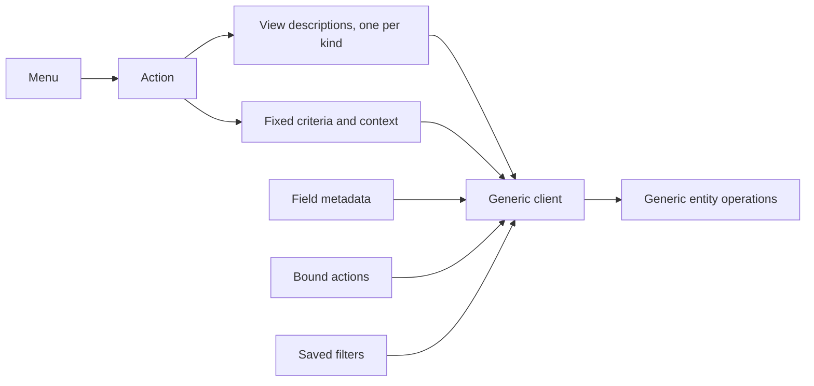

# Views and actions

The system has no hard-coded screens. Every screen a user sees is assembled by a generic client from three kinds of record: a **view**, which describes what to show; an **action**, which says what to open and with what criteria; and a **menu**, which says where the action hangs in the navigation. All three are records of entities, all three arrive as package data, and all three are extended by the mechanisms of [inheritance and extension](inheritance-and-extension.md).

This document specifies every view kind and its declarative grammar node by node; view inheritance and priority; the six action kinds with every configuration field; menus; the binding of actions to entities; the search grammar; and the exact contract a client relies on when it asks the server for a view.

Read [the architecture](architecture.md), [the entity and field system](entity-and-field-system.md) and [the security model](security-model.md) first.

---

## Table of contents

1. [The presentation contract](#1-the-presentation-contract)
2. [The view record](#2-the-view-record)
3. [Grammar common to every view kind](#3-grammar-common-to-every-view-kind)
4. [The form view](#4-the-form-view)
5. [The list view](#5-the-list-view)
6. [The card view](#6-the-card-view)
7. [The search view](#7-the-search-view)
8. [The calendar view](#8-the-calendar-view)
9. [The chart view](#9-the-chart-view)
10. [The cross-table view](#10-the-cross-table-view)
11. [The activity view](#11-the-activity-view)
12. [The template view](#12-the-template-view)
13. [View inheritance and priority](#13-view-inheritance-and-priority)
14. [View resolution: the contract a client relies on](#14-view-resolution-the-contract-a-client-relies-on)
15. [View validation](#15-view-validation)
16. [Actions](#16-actions)
17. [Window actions](#17-window-actions)
18. [Server actions](#18-server-actions)
19. [Client actions](#19-client-actions)
20. [Address actions](#20-address-actions)
21. [Report actions](#21-report-actions)
22. [The close action](#22-the-close-action)
23. [Binding actions to entities](#23-binding-actions-to-entities)
24. [Menus](#24-menus)
25. [Saved filters](#25-saved-filters)
26. [Embedded actions](#26-embedded-actions)
27. [Pending configuration steps](#27-pending-configuration-steps)
28. [Invariants a rebuild must preserve](#28-invariants-a-rebuild-must-preserve)
29. [Acceptance criteria](#29-acceptance-criteria)

---

## 1. The presentation contract

A client never receives rendered markup for a business screen. It receives:

1. a **view description**: a declarative tree naming fields, buttons, groupings and layout containers;
2. the **field metadata** for every field named, and for every field named in the inline views of relational fields;
3. optionally the **bound actions** that should appear in the screen's toolbar;
4. optionally the **saved filters** for the entity.

From those the client renders. The contract is that a client which understands the grammar of this document can render **every** screen of **every** capability, including ones written after it. That is why the grammar is closed and specified, and why extension happens by modifying the declaration rather than by shipping code.

Three consequences a rebuild must accept:

- Adding a capability must not require changing the client.
- Every attribute the client interprets must be in the grammar; a capability that needs new behaviour contributes a **widget** name, which the client resolves to a renderer, and falls back gracefully when it does not know the name.
- Expressions embedded in a view — visibility conditions, candidate restrictions, default values — are evaluated **by the client**, against the record being edited. They are therefore guidance, never enforcement ([security model, section 12](security-model.md#12-what-is-not-enforcement)).



---

## 2. The view record

A view is a record of the View entity (`ir.ui.view`, table `ir_ui_view`).

| Field (storage name) | Type | Meaning and rules |
|---|---|---|
| Name (`name`) | Text, required | A label for administrators. |
| Entity (`model`) | Text, indexed | The transport name of the entity the view describes. A template view may have none. |
| Key (`key`) | Text, indexed excluding empty values | A stable name of the form package name, a dot, a local name. Used for templates and for tenant-local copies, which have no external identifier. |
| Priority (`priority`) | Integer, default 16, required | Orders sibling views. Lower is applied first, and lower wins when the client must choose a default. |
| Kind (`type`) | Selection | One of `list`, `form`, `graph` (chart), `pivot` (cross-table), `calendar`, `kanban` (card), `search`, `qweb` (template). |
| Description (`arch`) | Long text, computed with an inverse | The declarative tree, as read. Applies translation and, in development mode, may read from the shipped file instead of the stored value. |
| Base description (`arch_base`) | Long text, computed with an inverse | The same without translation. |
| Stored description (`arch_db`) | Long text, translated term by term | Where the description is actually stored. |
| Source file (`arch_fs`) | Text | Where the description originally came from, so a broken view can be hard-reset. |
| Description modified (`arch_updated`) | Boolean | True when the stored description differs from the shipped one. |
| Previous description (`arch_prev`) | Long text | The stored description before the last write, so a broken view can be soft-reset. |
| Inherits from (`inherit_id`) | Many-to-one to View, deletion behaviour restrict, indexed | The view this one modifies. |
| Inheriting views (`inherit_children_ids`) | One-to-many to View | |
| Mode (`mode`) | Selection, default `primary`, required | `primary` (base view) or `extension`. See [section 13](#13-view-inheritance-and-priority). |
| Groups (`group_ids`) | Many-to-many to Group, association table `ir_ui_view_group_rel` | When empty the view applies to everyone; otherwise only to members. |
| Active (`active`) | Boolean, default true | An inactive extension does not extend; an inactive primary view is not offered. |
| External identifier (`xml_id`) | Text, computed | |
| Entity record (`model_id`) | Many-to-one to Entity Catalogue, computed with an inverse | |
| Warning information (`warning_info`) | Markup, computed | Diagnostics shown to an administrator. |
| Invalid anchors (`invalid_locators`) | Structured document, computed | The specification nodes of this view that no longer match, so a broken extension can be found. |

Default ordering: priority, then name, then identifier.

Privileged relational commands on this entity are forbidden, so an elevated operation cannot be made to rewrite views through a relation.

### 2.1 The eight kinds

| Kind | Shows | Typical use |
|---|---|---|
| Form | One record, in full | Creating and editing |
| List | Many records, one per row | Browsing and bulk editing |
| Card | Many records, as cards, optionally in columns | Pipelines and visual browsing |
| Search | No records; the filtering apparatus | Attached to every multi-record screen |
| Calendar | Records placed on a time grid | Scheduling |
| Chart | Aggregates as bars, lines or sectors | Analysis |
| Cross-table | Aggregates as a two-dimensional table | Analysis |
| Template | Arbitrary rendered content | Printed documents, public pages, electronic mail bodies |

A ninth kind, the **activity** view, is contributed by the messaging capability and is specified in [section 11](#11-the-activity-view) because its grammar belongs with the others.

---

## 3. Grammar common to every view kind

### 3.1 Structure

A view description is a tree. Its root node's name is the view kind — except the card view, whose root name differs from its kind value, and the template view, whose root is arbitrary. Every node has a name, attributes, and children.

### 3.2 The field node

The single most important node. It names a field of the entity and instructs the client to render it.

| Attribute | Meaning |
|---|---|
| `name` | **Required.** The field name. A field node with no name is refused with **"Field tag must have a "name" attribute defined"**. A name that is not a field of the entity is refused with **"Field "**\<name\>**" does not exist in model "**\<entity\>**"**. |
| `string` | Overrides the field's label. |
| `help` | Overrides the field's tooltip. |
| `widget` | Names the renderer. Unknown names fall back to the type's default renderer. |
| `options` | A structured value passed to the renderer. |
| `invisible` | A condition; when it evaluates true the node is not rendered. |
| `readonly` | A condition; when true the field is not editable. |
| `required` | A condition; when true the field must be filled before saving. |
| `column_invisible` | A condition evaluated against the **parent** record; used in an inline list to hide a whole column. |
| `domain` | A candidate restriction for a relational field, overriding the field's own. On a non-relational field it is refused with **"Domain on non-relational field "**\<name\>**" makes no sense (domain:"**\<the filter\>**)"**. |
| `context` | Context keys applied when opening or searching the target. |
| `groups` | A group requirement; the node is removed for users who do not satisfy it. |
| `nolabel` | Suppresses the automatic label. |
| `colspan` | How many layout columns the node occupies. |
| `class` | Presentation classes. |
| `digits` | Overrides the decimal places shown. |
| `password` | Renders the value masked. |
| `filename` | For a binary field, names the field holding the file name. |
| `mode` | For a to-many field, the inline view kinds to offer, comma-separated. |
| `view_mode` | Equivalent, in some kinds. |
| `on_change` | Marks the field as triggering the on-change round trip. |

**Inline views.** A field node for a relational field may contain a complete view of the target entity — a form, a list, a card view, a chart or a calendar — which the client uses instead of looking one up. The inline view is validated against the **target** entity.

**Custom properties.** A field node naming a custom-properties field requires the field naming the definition container to be present in the same view, so that the client can resolve the definitions; the requirement is enforced at validation.

**Dynamic candidate restriction.** When the candidate restriction is an expression rather than a literal filter, its field references are validated in two directions: names appearing on the left of a condition must exist on the **target** entity, and names appearing as values must be present in the same view, because the client evaluates the expression against the record being edited.

### 3.3 The button node

Invokes something.

| Attribute | Meaning |
|---|---|
| `type` | `object` to invoke a named operation on the entity; `action` to run an action by identifier; absent when `special` is used. |
| `name` | The operation name, or the action's identifier or external identifier. |
| `special` | One of `cancel`, `save`, `add`. Anything else is refused with **"Invalid special '"**\<value\>**' in button"**. |
| `string` | The label. |
| `icon` | An icon name. A button with an icon must also carry accessible text; the validation checks it. |
| `confirm` | Text shown in a confirmation prompt before invoking. |
| `context` | Context keys for the invocation. |
| `invisible` | A condition. |
| `groups` | A group requirement. |
| `class` | Presentation classes. |
| `help` | A tooltip. |

Validation of an operation button:

1. The named operation must exist on the entity: **"\<name\> is not a valid action on \<entity\>"**.
2. It must not be private and must not be marked not remotely callable: **"\<name\> on \<entity\> is private and cannot be called from a button"**.
3. It must be callable with no arguments beyond the receiver; otherwise a warning is recorded stating that it has parameters and cannot be called from a button.

Validation of an action button: the named action must exist.

### 3.4 The conditions

Four attributes hold a logical condition, evaluated by the client against the record being edited plus the context:

| Attribute | Effect when true |
|---|---|
| `invisible` | The node is not rendered |
| `readonly` | The node is not editable |
| `required` | The node must be filled before saving |
| `column_invisible` | In an inline list, the whole column is hidden; evaluated against the parent record |

Rules:

1. A condition references fields of the record. Every referenced field must be present in the view, or the client cannot evaluate it; validation checks this.
2. Conditions are combined by extensions using the logical form of the attribute grammar ([inheritance and extension, section 9.8](inheritance-and-extension.md#98-attributes)).
3. **A condition is never enforcement.** A read-only condition does not prevent a transport write; a required condition does not prevent a transport creation with the field empty.
4. Decoration attributes — attributes whose name begins with the decoration prefix — also hold conditions and are combined the same way; they colour a row or a cell.

### 3.5 Layout nodes

| Node | Meaning |
|---|---|
| `group` | A labelled block; by default a two-column grid. Attributes: `string`, `col` (the number of columns), `colspan`, `name`, `invisible`, `groups`, `class`. |
| `separator` | A horizontal rule with an optional `string`. |
| `newline` | Forces a line break in a grid. |
| `label` | An explicit label; attribute `for` naming the field it labels, plus `string`. A label naming a field not in the view is refused. |
| `div`, `span`, `p`, `h1` … `h6`, `ul`, `ol`, `li`, `table`, `a`, `img`, `i`, `b`, `strong`, `small` | Structural and typographic containers, each accepting `class`, `invisible`, `groups` and the presentation attributes. |
| `widget` | A named client component that is not a field. Attribute `name`, plus options. |

### 3.6 The group requirement

Every node accepts a `groups` attribute holding a comma-separated list of group external identifiers, optionally negated ([security model, section 3.7](security-model.md#37-declaring-group-requirements)). A node whose requirement the acting user does not satisfy is **removed** from the resolved description before it reaches the client.

This is presentation only. The field remains readable over the transport unless the field itself carries a restriction.

---

## 4. The form view

Shows one record in full.

### 4.1 Root

Root node name `form`.

| Attribute | Meaning |
|---|---|
| `string` | The screen's title. |
| `create`, `edit`, `delete` | Conditions or booleans switching off the corresponding affordance. |
| `duplicate` | Switches off duplication. |
| `js_class` | Names a client class that replaces the default renderer. |
| `class` | Presentation classes. |
| `disable_autofocus` | Suppresses focusing the first field. |

### 4.2 Structure nodes specific to the form

| Node | Meaning |
|---|---|
| `header` | A band at the top holding the workflow buttons and the state indicator. Conventionally contains buttons and one field rendered as a progress indicator. |
| `sheet` | The main body, laid out as a page. |
| `notebook` | A container of tabbed pages. |
| `page` | One tab. Attributes `string` (required in practice), `name`, `invisible`, `groups`. A page outside a notebook is refused. |
| `group` | A labelled block, as in [3.5](#35-layout-nodes). |
| `footer` | A band at the bottom, used by dialog-style forms for the confirm and cancel buttons. |
| `chatter` | The messaging panel, when the entity has adopted the messaging behaviour. |

### 4.3 Validation

The form view has no schema file; it is validated in the following ways:

1. Every field node is validated as in [3.2](#32-the-field-node).
2. Every button node is validated as in [3.3](#33-the-button-node).
3. Every label's `for` must name a field present in the view.
4. Every page must be inside a notebook.
5. Every condition's field references must be present in the view.
6. Accessibility checks are applied to icon-only elements and to link elements with no text.

---

## 5. The list view

Shows many records, one per row.

### 5.1 Root

Root node name `list`.

| Attribute | Meaning |
|---|---|
| `string` | Title. |
| `editable` | `top` or `bottom`: rows are editable in place and a new row appears at that end. Any other value is refused with **"The "editable" attribute of list views must be "top" or "bottom", received "**\<value\>. |
| `multi_edit` | Allows editing several selected rows at once. |
| `create`, `edit`, `delete`, `duplicate`, `import`, `export_xlsx` | Switch off the corresponding affordance. |
| `open_form_view` | Adds an explicit control opening the full form. |
| `limit` | Rows per page; defaults to the action's limit. |
| `groups_limit` | Groups per page when grouped. |
| `count_limit` | Caps the total count so that an expensive count is avoided. |
| `default_order` | An ordering expression overriding the entity's. |
| `default_group_by` | A field name to group by initially. |
| `expand` | Expands groups by default. |
| `sample` | Shows illustrative sample rows when the list is empty. |
| `js_class` | Names a replacement renderer. |
| `class` | Presentation classes. |

### 5.2 Children

Only these node names are allowed directly inside a list: `field`, `button`, `control`, `groupby`, `widget`, `header`. Anything else is refused with **"List child can only have one of \<names\> tag (not \<name\>)"**.

| Node | Meaning |
|---|---|
| `field` | A column. Additional attributes: `optional` (`show` or `hide`, making the column user-togglable), `sum`, `avg` (a footer aggregate with a label), `width`, `column_invisible`, `decoration-*`. |
| `button` | A per-row button. |
| `control` | Replaces the default "add a line" control; contains `create` nodes each with a `string` and an optional `context`. |
| `groupby` | Describes how to render a group header when grouped by a **many-to-one** field. Attribute `name` must name a many-to-one; otherwise refused with **"Field '\<name\>' found in 'groupby' node can only be of type many2one, found \<type\>"**. Its children are fields of the **target** entity and buttons. |
| `header` | A band above the list holding buttons that act on the selection. |
| `widget` | A named client component. |

### 5.3 Aggregates

A numeric column may declare a footer aggregate with `sum` or `avg`, whose value is the label shown next to the total. The aggregate actually computed is the field's declared aggregate rule ([entity and field system, section 5.3](entity-and-field-system.md#53-behaviour-attributes)). A monetary column can only be aggregated when its currency field can also be aggregated.

---

## 6. The card view

Shows many records as cards, optionally arranged in columns by a grouping field.

### 6.1 Root

Root node name `kanban`; the kind value is also `kanban`.

| Attribute | Meaning |
|---|---|
| `default_group_by` | The field that becomes the columns. |
| `default_order` | Ordering within a column. |
| `records_draggable` | Whether cards can be dragged between columns. |
| `groups_draggable` | Whether columns can be reordered. |
| `group_create`, `group_edit`, `group_delete` | Switch off column management. |
| `quick_create`, `quick_create_view` | Whether a card can be created inline and with which view. |
| `on_create` | Names an action to run instead of inline creation. |
| `archivable` | Whether a column offers archiving its records. |
| `sample` | Shows illustrative sample cards when empty. |
| `limit`, `groups_limit`, `count_limit` | Paging. |
| `js_class`, `class` | Renderer and presentation. |

### 6.2 Children

| Node | Meaning |
|---|---|
| `field` | Declares that the field must be loaded. Rendering is done by the template. |
| `progressbar` | Declares the coloured progress bar on a column header: attributes `field` (the field whose values map to colours), `colors` (a mapping from value to colour name) and `sum_field` (a numeric field to total). |
| `header` | Buttons acting on the selection. |
| `templates` | Holds one or more named rendering templates; the one named for the card body is the card's markup. |
| `widget` | A named client component. |

The card body is a template, which means the card view mixes the declarative grammar with the template grammar of [section 12](#12-the-template-view). Every field referenced in the template must also appear as a field node, so that the client knows to load it.

### 6.3 The progress bar

```formula
count_for_colour( group , colour ) = number of records of the group whose progress field equals the value mapped to that colour
```

The counts are obtained by one grouped aggregation over the grouping field and the progress field together, so that the client's per-column bars and the server's counts always agree.

---

## 7. The search view

Describes the filtering apparatus attached to every multi-record screen. It shows no records itself.

### 7.1 Root

Root node name `search`. Attributes: `string`.

A search view with no field node anywhere in its tree records the warning **"Search tag requires at least one field element"**, because nothing could then be searched.

### 7.2 Children

| Node | Meaning |
|---|---|
| `field` | Declares a field the user may type into. |
| `filter` | A named predefined condition or grouping. |
| `separator` | Splits filters into groups; see [7.5](#75-how-filters-combine). |
| `group` | A container of filters, rendered as one menu. |
| `newline` | A layout break. |
| `searchpanel` | The side panel; at most one per search view, otherwise refused with **"Search tag can only contain one search panel"**. |

### 7.3 The search field node

| Attribute | Meaning |
|---|---|
| `name` | The field to search. |
| `string` | The label offered in the search suggestions. |
| `operator` | The operator to use instead of the default. |
| `filter_domain` | An expression producing the condition, given the typed value. This is how a single search box can search three fields at once. |
| `domain` | For a relational field, a restriction on the candidates offered. |
| `context` | Context keys contributed when the field is used. |
| `groups` | A group requirement. |
| `invisible` | A condition. |
| `widget` | A renderer for the input. |

**Default operator per type.**

| Field type | Default condition produced from typed text *t* |
|---|---|
| Short text, long text, markup | The field contains *t*, case- and accent-insensitively |
| Selection | The field equals the code whose label contains *t* |
| Many-to-one, one-to-many, many-to-many | The relation leads to a record whose display name contains *t* |
| Integer, decimal number, monetary | The field equals *t* parsed as a number; a value that does not parse contributes nothing |
| Date, date and time | The field falls within the period *t* denotes |
| Boolean | The field is true or false as *t* denotes |

When `filter_domain` is given, it replaces the default entirely and the typed value is substituted into it.

### 7.4 The filter node

| Attribute | Meaning |
|---|---|
| `name` | **Required.** The filter's stable name, used by an action's context to switch it on by default. |
| `string` | The label. |
| `domain` | The condition the filter contributes. Its field references are validated against the entity. |
| `context` | Context keys the filter contributes. A key naming a grouping instruction turns the filter into a grouping. |
| `date` | Names a date or instant field, turning the filter into a **period filter**: the client offers years, quarters and months rather than a single condition. |
| `default_period` | For a period filter, the periods pre-selected, comma-separated. Each must match a year or month expression with an optional signed offset, or be one of the four named quarters, or name a custom option declared as a child. Anything else is refused with **"Invalid default period \<value\> for date filter"**. |
| `start_month`, `end_month`, `start_year`, `end_year` | Bound the periods offered. |
| `invisible` | A condition. |
| `groups` | A group requirement. |
| `help` | A tooltip. |
| `icon` | An icon. |
| `separator` | Marks a boundary within a group of filters. |

**Grouping filters.** A filter whose context contributes a grouping instruction adds a grouping rather than a condition. The instruction names one or more fields, each optionally with a granularity for a date or instant — the year, the quarter, the month, the week or the day.

### 7.5 How filters combine

This is the rule users rely on and a rebuild must reproduce exactly.

1. Filters **in the same group**, meaning between the same pair of separators inside the same container, combine by **disjunction**. Ticking "draft" and "posted" shows both.
2. Filters **in different groups** combine by **conjunction**. Ticking "draft" and "this month" shows draft entries of this month.
3. A condition typed into a **field** combines by conjunction with everything else. Two values typed into the **same** field combine by disjunction.
4. The result is conjoined with the action's fixed criteria ([section 17.3](#173-criteria-and-context)).
5. The whole is conjoined with the record rules by the entity layer.

```formula
effective_filter =
      action_criteria
  AND ( conjunction over each filter group of ( disjunction of the ticked filters of that group ) )
  AND ( conjunction over each searched field of ( disjunction of the values typed into that field ) )
  AND ( conjunction of the search panel's selections )
```

**Worked example.** A search view with two groups of filters — a status group holding "draft" and "posted", and a date group holding "this month" — and a field searching the party. The user ticks "draft" and "posted", ticks "this month", and types "Acme" into the party field. The effective filter is:

> (status is draft **or** status is posted) **and** (date is in this month) **and** (party's display name contains "Acme")

conjoined with the action's fixed criteria and the record rules.

### 7.6 The search panel

A side panel offering one-click narrowing.

Root node `searchpanel`, attributes `view_types` (the view kinds it appears in, comma-separated) and `class`. Its children are field nodes with extra attributes:

| Attribute | Meaning |
|---|---|
| `select` | `one` renders a single-selection list; `multi` renders checkboxes. |
| `icon`, `color` | Presentation of the section. |
| `enable_counters` | Whether each value shows how many records carry it. |
| `expand` | Whether values with no records are shown. |
| `limit` | Maximum number of values offered; zero means no limit. |
| `hierarchize` | For a hierarchical target, whether to nest the values. |
| `groupby` | Groups the offered values by a field of the target. |
| `domain` | Restricts the values offered. |

A single-selection section contributes an equality condition; a multiple-selection section contributes a membership condition. Sections combine by conjunction.

### 7.7 Default state from the action

The action's context may switch filters, groupings and searched values on by default:

| Context key form | Effect |
|---|---|
| `search_default_<filter name>` | Ticks that filter. A numeric value also gives the filter an order among the default groupings. |
| `search_default_<field name>` | Pre-fills that search field with the value. |
| `search_default_groupby_<field name>` | Adds a default grouping. |

---

## 8. The calendar view

Places records on a time grid.

Root node name `calendar`.

| Attribute | Meaning |
|---|---|
| `date_start` | **Required.** The field holding the start. |
| `date_stop` | The field holding the end. |
| `date_delay` | Alternatively, the field holding the duration. |
| `all_day` | A boolean field marking whole-day records. |
| `color` | A field whose value colours the entries and drives the side legend. |
| `mode` | The initial scale: `day`, `week`, `month` or `year`. |
| `scales` | Which scales are offered, comma-separated. |
| `quick_create`, `quick_create_view_id` | Whether a record can be created by dragging and with which view. |
| `multi_create_view` | A view used to create several entries at once. |
| `create_name_field` | The field filled from the text typed during quick creation. |
| `event_open_popup` | Whether clicking opens a dialog rather than navigating. |
| `event_limit` | How many entries a day cell shows before collapsing. |
| `month_overflow` | Whether a month cell shows entries spilling from adjacent months. |
| `show_unusual_days` | Whether non-working days are shaded. |
| `show_date_picker` | Whether the side date picker appears. |
| `hide_date`, `hide_time` | Suppress parts of the entry label. |
| `form_view_id` | The form opened when an entry is clicked. |
| `create`, `edit`, `delete` | Switch off affordances. |
| `aggregate` | A numeric field totalled per period. |
| `js_class` | A replacement renderer. |

Children are field nodes declaring what to load, and `filter` nodes declaring side filters; each filter's `name` must be a field of the entity.

Validation checks that each of the start, duration, end, colour and whole-day attributes names an existing field, taking the part before the first full stop of a path.

---

## 9. The chart view

Shows aggregates as bars, lines or sectors.

Root node name `graph`.

| Attribute | Meaning |
|---|---|
| `type` | `bar`, `line` or `pie`. |
| `stacked` | Whether bars stack. |
| `cumulated`, `cumulated_start` | Whether a line accumulates, and from which value. |
| `order` | Orders the categories by value, ascending or descending. |
| `disable_linking` | Prevents clicking through to the records. |
| `sample` | Shows illustrative data when empty. |
| `js_class`, `class`, `string` | |

A chart may contain **only** field nodes; anything else is refused with **"A \<graph\> can only contains \<field\> nodes, found a \<\<name\>\>"**.

| Field node attribute | Meaning |
|---|---|
| `type` | `measure` for the value axis, `row` for a category, `col` for a second category. |
| `interval` | For a date or instant category, the granularity. |
| `invisible` | Hides the field from the offered measures. |
| `string` | The label. |

---

## 10. The cross-table view

Shows aggregates in a two-dimensional table with expandable headers.

Root node name `pivot`.

| Attribute | Meaning |
|---|---|
| `disable_linking` | Prevents clicking a cell to see its records. |
| `display_quantity` | Shows the record count column by default. |
| `default_order` | The initial sort, naming a measure and a direction. |
| `stacked` | Affects the derived chart. |
| `sample`, `js_class`, `class`, `string` | |

Children are field nodes with `type` of `measure`, `row` or `col`, and `interval` for date granularity, as for the chart.

Only fields that can be grouped by may be a row or a column; only fields with an aggregate rule may be a measure.

---

## 11. The activity view

Shows records as rows against the kinds of activity scheduled on them. Contributed by the messaging capability; specified here for completeness.

Root node name `activity`. Attributes: `string`, `create` (switch off creation), `js_class`.

Children are field nodes declaring what to load, and a `templates` node holding the rendering template for a cell.

Only entities that have adopted the activity behaviour may have an activity view ([messaging model](messaging-model.md#7-activities)).

---

## 12. The template view

A template view holds arbitrary rendered content: a printed document, a public page, the body of an electronic mail message, a fragment of a card.

Its description is a tree whose nodes are ordinary markup plus **directive attributes** that the renderer interprets. The directives:

| Directive | Meaning |
|---|---|
| Name | Declares the template's name, so it can be rendered or extended by name. |
| Value | Replaces the node's content with the value of an expression. |
| Output | Outputs an expression without a surrounding element. |
| Condition | Renders the node only when an expression is true; with the paired alternative directives, an else-if and an else branch. |
| Iteration | Repeats the node for each element of a collection, binding a name to the element and exposing the index, the first and last flags and the count. |
| Attribute setting | Sets an attribute from an expression. |
| Call | Renders another template by name at this point, optionally passing values. |
| Field | Renders a field of a record using that field's own renderer, so that a date is formatted and an amount carries its currency. |
| Set | Binds a name to a value for the rest of the template. |
| Options | Passes options to a field renderer. |
| Debug | Emits diagnostics in development mode. |

Templates are extended by the **same** node-matching and position grammar as views ([inheritance and extension, section 9](inheritance-and-extension.md#9-extending-views)).

Rendering, page furniture, paper formats and the production of printable documents are specified in [report rendering](../runtime/report-rendering.md).

---

## 13. View inheritance and priority

The combination algorithm, the two modes, the node-matching rules and the position grammar are specified in full in [inheritance and extension, section 9](inheritance-and-extension.md#9-extending-views). This section states only what belongs to the presentation contract.

### 13.1 Choosing the view to combine

When a client asks for a view of a given kind on a given entity, the server chooses the root view as follows:

1. If an identifier was given, use that view. If it is an extension, walk up to its closest primary ancestor and use that, then apply this view's own specifications on top of the fully combined result.
2. Otherwise, if the context carries the key made of the kind and the view-reference suffix — for example the key naming a form view reference — resolve it as an external identifier and use that view.
3. Otherwise, take the views of that kind on that entity that are active, that have no parent or whose parent is of another entity, and that the acting user's groups admit; choose the one with the **lowest priority**, then the lowest identifier.
4. If none exists, produce a **default view**: for a form, every field of the entity in a single group; for a list, the display name column; for a search, the display-name field. The default is minimal and exists so that a new entity is usable before anyone writes a view for it.

### 13.2 Group applicability

A view carrying groups applies only to users who belong to at least one of them. A view that does not apply is skipped entirely during combination — it is as if it did not exist for that user. This is how one entity can have genuinely different screens per role, as opposed to one screen with hidden nodes.

### 13.3 Priority as the default-choice lever

Priority does two things: it orders sibling extensions, and it decides which primary view is chosen as the default for a kind. A capability that must supersede another's default view ships a primary view with a lower priority.

### 13.4 Tenant-local customisations

A user may store a personal variant of a view; it is a record of the View Customisation entity (`ir.ui.view.custom`, table `ir_ui_view_custom`) holding the user, the base view and the customised description. The most recently created one for that user and view wins. Customisations are per user and are never shared.

---

## 14. View resolution: the contract a client relies on

### 14.1 The two operations

| Operation | Input | Output |
|---|---|---|
| Get one view | A view identifier or a kind, plus options | The resolved description and the entities and fields it needs |
| Get several views | A list of (identifier, kind) pairs, plus options | One resolved description per kind, the merged field metadata, optionally the toolbar, optionally the saved filters |

### 14.2 What the result contains

| Key | Content |
|---|---|
| Views | One entry per requested kind, each holding the resolved description, the view's identifier, and the entity's transport name |
| Entities and fields | For each entity appearing in any of the descriptions — the main one and every entity reached through an inline view — the metadata of every field the descriptions name |
| Toolbar | When requested: the bound actions and bound reports applicable to this entity and this view kind |
| Filters | When requested and a search view was asked for: the saved filters for the entity and, if given, the action |

### 14.3 Resolution steps

**Preconditions.** An entity, a view kind or identifier, the acting user's environment.

1. Check read access on the entity. A user who may not read the entity may not obtain its views.
2. Choose the root view ([13.1](#131-choosing-the-view-to-combine)).
3. Combine it with its applicable inheriting views ([inheritance and extension, section 9.2](inheritance-and-extension.md#92-the-combination-algorithm)).
4. **Post-process for access rights**: remove every node whose group requirement the acting user does not satisfy; remove every field node naming a field the user may not read; mark as read-only every field node naming a field the user may read but not write; remove every button whose group requirement is not satisfied.
5. **Post-process for debugging**: in debug mode, annotate nodes with their originating view, so that an administrator can find which extension contributed what.
6. Collect the entities and fields the description names, including those of inline views, and add the fields the kind requires implicitly — see [14.4](#144-implicit-fields-per-kind).
7. Produce the field metadata for those fields ([entity and field system, section 21](entity-and-field-system.md#21-field-metadata-exposed-to-clients)).
8. Serialise the description, removing tab characters so that whitespace is predictable.

### 14.4 Implicit fields per kind

| Kind | Fields added even when not named |
|---|---|
| Card, list, form | The identifier, and the last-modification stamp when the entity keeps audit fields |
| Search | **Every** field of the entity, so that a user may search on anything |
| Chart | Every integer and decimal-number field, as candidate measures |
| Cross-table | Every field that can be grouped by |

### 14.5 What the result may depend on

The result is cached, and the cache key is therefore part of the contract. The resolved views may depend **only** on:

- the requested kinds and identifiers;
- the acting user's access rights and the views their groups admit;
- the options passed;
- the context language;
- the per-kind view-reference context keys.

They may **not** depend on any other context value, on the acting user's identity beyond their groups, or on the records being displayed. A rebuild that lets a view depend on anything else will produce a cache that returns the wrong screen.

Expressions inside the description are evaluated by the client with the full context and the record values; that is where per-record variation belongs.

### 14.6 The toolbar

When the toolbar is requested, the bound actions of the entity are resolved ([section 23](#23-binding-actions-to-entities)) and placed under two headings:

| Heading | Content |
|---|---|
| Print | Bound report actions |
| Action | Bound window, server and client actions |

An action is included in a kind's toolbar when its declared view kinds include that kind, or when it declares none, in which case it appears in every kind requested.

---

## 15. View validation

A view is validated when its package is installed or updated, and whenever it is written.

### 15.1 What is checked

1. The description parses.
2. For kinds that have a schema — list, search, chart, cross-table, calendar, activity — the description matches it.
3. Every field node names an existing field of the relevant entity.
4. Every button names an existing, public, argument-free operation, or an existing action.
5. Every condition's field references are present in the view.
6. Every candidate-restriction expression's left-hand names exist on the target entity and right-hand names are present in the view.
7. Every group named in a group requirement exists.
8. Kind-specific structural rules ([sections 4](#4-the-form-view) to [11](#11-the-activity-view)).
9. Accessibility rules: an icon-only control must carry accessible text; a link with no text must carry a title.

### 15.2 Partial validation

During a package update, validating every view of every entity would be prohibitive. Validation is therefore **partial**: only the nodes contributed by the views being validated are checked. The marking is:

- an inserted node is flagged;
- a node whose attributes were modified is flagged by adding a marker attribute;
- any use of the replacement position flags the **whole** result, because a replacement can invalidate anything.

### 15.3 Failure

A view whose validation fails aborts the package update, and the failure names the file, the line and the serialised node. A tenant-local view whose validation fails records a warning and the view is left in place but reported through the warning field.

### 15.4 Broken anchors

An extension whose specification no longer matches anything records the offending specification in the invalid-anchors field of the view, so that an administrator can find extensions broken by another package's change without reading every view.

---

## 16. Actions

An **action** is a record saying what to do next. Six kinds exist. All six inherit a common set of fields from the Action entity (`ir.actions.actions`, table `ir_actions_actions`).

### 16.1 Common fields

| Field (storage name) | Type | Meaning |
|---|---|---|
| Name (`name`) | Text, required, translatable | The title shown when the action opens. |
| Kind (`type`) | Text, required | The transport name of the concrete action entity. This is how a client dispatches. |
| External identifier (`xml_id`) | Text, computed | |
| Path (`path`) | Text | A stable path segment so the action has a shareable address. |
| Description (`help`) | Markup, translatable | The text shown when the screen has no records. |
| Bound entity (`binding_model_id`) | Many-to-one to Entity Catalogue, deletion behaviour cascade | See [section 23](#23-binding-actions-to-entities). |
| Binding kind (`binding_type`) | Selection, values `action` and `report`, default `action` | Which toolbar heading the action appears under. |
| Binding view kinds (`binding_view_types`) | Text, default `list,form` | The view kinds whose toolbar shows it. |

### 16.2 The six kinds

| Transport name | Kind | Purpose |
|---|---|---|
| `ir.actions.act_window` | Window action | Open an entity's records in one or more views |
| `ir.actions.server` | Server action | Run server-side logic, possibly returning another action |
| `ir.actions.client` | Client action | Hand control to a named client component |
| `ir.actions.act_url` | Address action | Navigate to or download an address |
| `ir.actions.report` | Report action | Produce a printable document |
| `ir.actions.act_window_close` | Close action | Close the current dialog |

### 16.3 How an action reaches the client

Three routes:

1. **A menu** names an action; opening the menu opens the action.
2. **A button** of kind action names an action by identifier; pressing it opens the action.
3. **An operation returns an action description** — a mapping of the fields above plus the kind's own — which the client interprets exactly as it would a stored action. This is the mechanism behind "confirm the order, then show me the delivery".

An operation returning nothing means "stay here and reload the record".

---

## 17. Window actions

A record of the Window Action entity (`ir.actions.act_window`, table `ir_act_window`).

### 17.1 Fields

| Field (storage name) | Type | Default | Meaning |
|---|---|---|---|
| Kind (`type`) | Text | `ir.actions.act_window` | |
| Target entity (`res_model`) | Text, required | | The entity whose records are shown. |
| View kinds (`view_mode`) | Text, required | `list,form` | Comma-separated list of view kinds, in the order the client offers them. The first is the initial one. |
| Small-screen first kind (`mobile_view_mode`) | Text | `kanban` | The kind used first on a small screen, if it is among the offered kinds. |
| View (`view_id`) | Many-to-one to View, deletion behaviour set null | | Forces a specific view for the **first** kind in the list. |
| View bindings (`view_ids`) | One-to-many to Window Action View | | Forces a specific view per kind; see [17.2](#172-per-kind-view-bindings). |
| Resolved views (`views`) | Binary, computed | | The ordered list of (view identifier or none, kind) pairs the client should request. |
| Record (`res_id`) | Integer | | Opens directly on this record. Only meaningful when the view kind list is exactly the form kind. |
| Criteria (`domain`) | Text | | An expression producing the fixed filter. |
| Context (`context`) | Text, required | empty mapping | An expression producing the context keys. |
| Target (`target`) | Selection | `current` | `current` replaces the content area; `new` opens a dialog; `fullscreen` takes the whole window; `main` replaces the whole content and clears the breadcrumb trail. |
| Limit (`limit`) | Integer | 80 | Records per page. |
| Search view (`search_view_id`) | Many-to-one to View | | Forces a specific search view. |
| Filter (`filter`) | Boolean | | Whether the saved-filter menu is offered. |
| Groups (`group_ids`) | Many-to-many to Group, association table `ir_act_window_group_rel` | | Restricts who may run the action. |
| Usage (`usage`) | Text | | A marker used to find actions by role rather than by identifier. |
| Data caching (`cache`) | Boolean | true | Whether the client may cache the data behind this action's screens. |
| Embedded actions (`embedded_action_ids`) | One-to-many to Embedded Action, computed | | See [section 26](#26-embedded-actions). |

### 17.2 Per-kind view bindings

The view-binding records — of the Window Action View entity (`ir.actions.act_window.view`, table `ir_act_window_view`) — pin a specific view to a specific kind for this action.

| Field (storage name) | Type | Meaning |
|---|---|---|
| Sequence (`sequence`) | Integer | Order. |
| View (`view_id`) | Many-to-one to View | The view to use. |
| Kind (`view_mode`) | Selection over the view kinds, required | |
| Action (`act_window_id`) | Many-to-one to Window Action, deletion behaviour cascade, indexed | |
| On multiple records (`multi`) | Boolean | When set, the action is not offered on a single record's form toolbar. |

**Resolution of the view list.**

1. Start from the bindings, ordered by sequence, as (view identifier, kind) pairs.
2. For each kind in the view-kind list that has no binding, append (none, kind).
3. If a forced view is given and the first kind has no binding, that view is used for the first kind.
4. The result is the ordered list the client requests.

### 17.3 Criteria and context

Both are **expressions**, not literals, evaluated with the same restricted context as a record rule plus the active-record keys:

| Name | Value |
|---|---|
| The acting user | The user record |
| The current company and the allowed companies | |
| The active record identifier, the active record identifiers and the active entity | Present when the action was triggered from a selection |
| Date and time helpers | |
| A resolver from external identifier to identifier | |

The criteria are conjoined with everything the search view contributes and with the record rules.

The context keys are merged into the environment for the screen. The keys a window action most often sets:

| Key | Effect |
|---|---|
| `default_<field>` | The default value of a field for records created from this screen |
| `search_default_<name>` | A search filter, grouping or field pre-filled |
| `active_test` | Whether archived records are shown |
| `create`, `edit`, `delete` | Switch off affordances for this screen only |
| `group_by` | An initial grouping |
| `form_view_ref`, `list_view_ref`, and the equivalent per kind | Force a specific view by external identifier |

### 17.4 Running the action

1. Check that the acting user satisfies the action's group restriction; otherwise refuse.
2. Check read access on the target entity; otherwise refuse.
3. Resolve the view list and request the views.
4. Evaluate the criteria and the context.
5. Open the first view kind, with the record when one is given.

---

## 18. Server actions

A record of the Server Action entity (`ir.actions.server`, table `ir_act_server`). It runs logic on the server and may return another action.

### 18.1 Fields

| Field (storage name) | Type | Default | Meaning |
|---|---|---|---|
| Name (`name`) | Text, computed with an override | | Derived from the configured behaviour when not given. |
| Derived name (`automated_name`) | Text, computed, stored | | The name the system would derive. |
| Kind (`type`) | Text | `ir.actions.server` | |
| Usage (`usage`) | Selection, required | `ir_actions_server` | `ir_actions_server` for a user-triggered action; `ir_cron` for the body of a scheduled job. |
| Behaviour (`state`) | Selection, required | | See [18.2](#182-the-behaviours). |
| Allowed behaviours (`allowed_states`) | Structured document, computed | | Which behaviours are offered for the chosen entity. |
| Sequence (`sequence`) | Integer | 5 | Execution order when several actions run together; lower runs first. |
| Entity (`model_id`) | Many-to-one to Entity Catalogue, required, deletion behaviour cascade, indexed | | The entity the action operates on. |
| Entity name (`model_name`) | Text, related | | |
| Warning (`warning`) | Long text, computed, recursive | | Diagnostics, including those of child actions. |
| Scheduled jobs (`ir_cron_ids`) | One-to-many to Scheduled Job | | The jobs whose body this action is. |
| Code (`code`) | Long text, restricted to the settings group | | The body, for the code behaviour. |
| Parent (`parent_id`) | Many-to-one to itself, indexed, deletion behaviour cascade | | Set on children of a composite action. |
| Children (`child_ids`) | One-to-many to itself, copied | | The actions a composite action runs, in sequence order. |
| Target entity (`crud_model_id`) | Many-to-one to Entity Catalogue | | The entity a create behaviour creates in. |
| Link field (`link_field_id`) | Many-to-one to Field Catalogue | | The field of the source record that should point at the created record. |
| Groups (`group_ids`) | Many-to-many to Group, association table `ir_act_server_group_rel` | | Restricts who may run it. |
| Field to update (`update_field_id`) | Many-to-one to Field Catalogue, computed with an override, stored | | |
| Field path (`update_path`) | Text | | A dotted path to the field to update, so an action can update a related record. |
| Related entity of the path (`update_related_model_id`) | Many-to-one to Entity Catalogue, computed with an override, stored | | |
| Field type (`update_field_type`) | Selection, related | | |
| Boolean value (`update_boolean_value`) | Selection, values `true` and `false`, default `true` | | The value for a boolean field. |
| Value (`value`) | Long text | | The value to write, either literal or an expression. |
| Evaluation kind (`evaluation_type`) | Selection | | Whether the value is a literal or an expression. |
| Markup value (`html_value`) | Markup | | The value for a markup field. |
| Sequence to use (`sequence_id`) | Many-to-one to Numbering Sequence | | For assigning a number. |
| Record reference (`resource_ref`) | Polymorphic reference | | For assigning a relational value chosen in the interface. |
| Selection value (`selection_value`) | Many-to-one to Selection Value, deletion behaviour cascade | | For assigning a selection field. |
| Value field to show (`value_field_to_show`) | Selection | | Which of the value fields the screen should offer, derived from the field's type. |
| Webhook address (`webhook_url`) | Text | | Where to send the notification. |
| Webhook fields (`webhook_field_ids`) | Many-to-many to Field Catalogue, association table `ir_act_server_webhook_field_rel` | | The fields included in the payload. |
| Sample payload (`webhook_sample_payload`) | Long text, computed | | |

### 18.2 The behaviours

| Value | Label | What it does |
|---|---|---|
| `object_write` | Update Record | Writes one field, possibly through a path, on the records it receives. The value is a literal, an expression, a selection value, a referenced record, or the next number of a sequence, depending on the field's type. |
| `object_create` | Create Record | Creates a record of the target entity from configured values, and optionally sets the link field on the source record to point at it. |
| `object_copy` | Duplicate Record | Duplicates the records it receives. |
| `code` | Execute Code | Runs a configured body in a restricted evaluation context. It may set a result, which, when it is an action description, becomes the action returned. |
| `webhook` | Send Webhook Notification | Sends the configured fields of the records to the configured address as a structured document. |
| `multi` | Multi Actions | Runs its child actions in sequence order. The **last** child that returns an action description determines what the client does next. |

Capabilities add further behaviours — creating an activity, posting a message, sending a text message, adding or removing followers — each declared as an additional selection value and implemented as an extension.

### 18.3 The evaluation context of a code behaviour

The body runs in a restricted context that offers:

| Name | Value |
|---|---|
| The environment | The current environment |
| The entity | The empty record set of the configured entity |
| The records | The records the action was triggered on |
| The single record | The first of them, for convenience |
| The acting user | |
| Date and time helpers | |
| A logging facility | |
| A slot for the result | Assigning an action description to it makes the action return it |

Nothing else is reachable: no arbitrary import, no file access, no network access except through the entities' own operations.

### 18.4 Running a server action

1. Check that the acting user satisfies the group restriction.
2. Bind the record set: the active record identifiers from the context, of the active entity, which must match the action's entity.
3. Run the behaviour.
4. If the behaviour produced an action description, return it; otherwise return nothing.

A server action's own history of code changes is kept as records of the Server Action History entity (`ir.actions.server.history`, table `ir_actions_server_history`), so that an administrator can see and compare revisions.

---

## 19. Client actions

A record of the Client Action entity (`ir.actions.client`, table `ir_act_client`). It hands control to a named client component.

| Field (storage name) | Type | Default | Meaning |
|---|---|---|---|
| Kind (`type`) | Text | `ir.actions.client` | |
| Tag (`tag`) | Text, required | | The name the client resolves to a component. An unknown tag is an error the client reports. |
| Target (`target`) | Selection | `current` | As for a window action. |
| Target entity (`res_model`) | Text | | Optional; used where the component needs to know which entity it is about. |
| Context (`context`) | Text, required | empty mapping | An expression producing context keys. |
| Parameters (`params`) | Binary, computed with an inverse | | Arbitrary structured parameters for the component. |
| Stored parameters (`params_store`) | Binary, read-only, stored inline | | Where the parameters are actually stored. |

Reserved tags the platform itself relies on:

| Tag | Effect |
|---|---|
| `reload` | Reload the client shell, optionally opening a named menu |
| `reload_context` | Reload only the session context |
| `home` | Navigate to the home screen |
| `display_notification` | Show a transient notification with the given title, message, kind and optional buttons |

---

## 20. Address actions

A record of the Address Action entity (`ir.actions.act_url`, table `ir_act_url`). It navigates to an address.

| Field (storage name) | Type | Default | Meaning |
|---|---|---|---|
| Kind (`type`) | Text | `ir.actions.act_url` | |
| Address (`url`) | Long text, required | | Where to go. May be relative or absolute. |
| Target (`target`) | Selection | `new` | `new` opens a new window; `self` navigates the current one; `download` downloads the resource without navigating. |

Address actions are how the system hands a user to a printable document, an external service, a public page or a downloadable file.

---

## 21. Report actions

A record of the Report Action entity (`ir.actions.report`, table `ir_act_report_xml`). It produces a printable document.

| Field (storage name) | Type | Default | Meaning |
|---|---|---|---|
| Kind (`type`) | Text | `ir.actions.report` | |
| Binding kind (`binding_type`) | Selection | `report` | Places it under the print heading of the toolbar. |
| Entity (`model`) | Text, required | | The entity the document is about. |
| Entity record (`model_id`) | Many-to-one to Entity Catalogue, computed | | |
| Output kind (`report_type`) | Selection, required | `qweb-pdf` | `qweb-html` renders to markup shown in the browser; `qweb-pdf` renders to a fixed-layout document; `qweb-text` renders to plain text. |
| Template name (`report_name`) | Text, required | | The key of the rendering template. |
| Report file (`report_file`) | Text | | The path of the main template file, where the content is not in a field. |
| Groups (`group_ids`) | Many-to-many to Group, association table `res_groups_report_rel` | | Restricts who may print it. |
| On multiple records (`multi`) | Boolean | | When set, the report is not offered on a single record's form toolbar. |
| Paper format (`paperformat_id`) | Many-to-one to Paper Format, indexed excluding empty values | | Page size, margins, orientation and page furniture. |
| Printed name (`print_report_name`) | Text, translatable | | An expression producing the file name, with the record and time helpers available. |
| Reload from attachment (`attachment_use`) | Boolean | | When set, printing the same document twice returns the previously stored file instead of rendering again. |
| Attachment name (`attachment`) | Text | | An expression producing the name under which the rendered document is stored as an attachment. Empty means do not store. |
| Criteria (`domain`) | Text | | When set, the report appears only on records matching it. |

### 21.1 Behaviour

1. **Storing.** When an attachment-name expression is given, the rendered document is stored as an attachment owned by the record. This is what makes an invoice's printed form immutable once issued.
2. **Reloading.** When reloading from attachment is set and an attachment of that name already exists, it is returned without re-rendering. Records for which no attachment exists are rendered, and the two sets are merged in the original order.
3. **Criteria.** The report is offered only on records the criteria admit, which is how a document is restricted to, say, posted entries.
4. **Rendering** is specified in [report rendering](../runtime/report-rendering.md).

---

## 22. The close action

A record of the Close Action entity (`ir.actions.act_window_close`, table shared with the common action entity). It has no fields of its own beyond the common ones and a fixed kind of `ir.actions.act_window_close`.

Returning it from an operation means: close the current dialog and, if the dialog was opened from a screen, refresh that screen. It is the standard return value of an assistant's confirm button.

---

## 23. Binding actions to entities

An action bound to an entity appears in the toolbar of that entity's screens without any menu naming it.

### 23.1 The declaration

Three common fields do it:

| Field | Meaning |
|---|---|
| Bound entity | The entity whose screens show the action. |
| Binding kind | `action` places it under the action heading; `report` under the print heading. |
| Binding view kinds | Comma-separated view kinds; the action appears only in those. Empty means every kind requested. |

### 23.2 Resolution

When a client requests the toolbar:

1. Collect every action bound to the entity, grouped by binding kind, ordered by sequence then by name.
2. Drop every action whose group restriction the acting user does not satisfy.
3. Drop every action whose own target entity the acting user may not read.
4. Return the remainder, grouped by heading.

Steps 2 and 3 mean the toolbar never offers something that would immediately refuse. They are a convenience, not a security boundary: the action is still reachable by identifier if the user can run it.

### 23.3 The active-record contract

An action invoked from a toolbar receives, in its context:

| Key | Value |
|---|---|
| Active entity | The transport name of the entity whose screen it was invoked from |
| Active record identifier | The single selected record, when there is one |
| Active record identifiers | Every selected record |

A server action bound to an entity therefore operates on the selection, and a window action's criteria can refer to it.

---

## 24. Menus

A menu is a record of the Menu entity (`ir.ui.menu`, table `ir_ui_menu`). Menus form a tree; the roots are the applications.

| Field (storage name) | Type | Default | Meaning |
|---|---|---|---|
| Label (`name`) | Text, required, translatable | | |
| Active (`active`) | Boolean | true | An inactive menu is hidden. |
| Sequence (`sequence`) | Integer | 10 | Order among siblings. |
| Parent (`parent_id`) | Many-to-one to itself, indexed, deletion behaviour restrict | | Empty for a root menu. |
| Children (`child_id`) | One-to-many to itself | | |
| Materialised path (`parent_path`) | Text, indexed | | Maintained so the tree can be queried without recursion. |
| Groups (`group_ids`) | Many-to-many to Group, association table `ir_ui_menu_group_rel` | | When empty the menu inherits its visibility from its children; otherwise only members see it. |
| Full path (`complete_name`) | Text, computed, recursive | | The labels of the ancestors joined by a separator; this is the menu's display name. |
| Icon file (`web_icon`) | Text | | The icon of a root menu. |
| Icon image (`web_icon_data`) | Binary, stored as an attachment | | The icon's content. |
| Action (`action`) | Polymorphic reference over the five runnable action kinds | | What the menu opens. Empty for a pure container. |

### 24.1 Visibility

A menu is visible to a user when:

1. it is active; **and**
2. either it carries groups and the user belongs to one of them, or it carries none; **and**
3. either it has an action the user may run, or it has at least one visible child.

Rule 3 is what makes an empty section disappear rather than opening onto nothing. It is evaluated bottom-up over the whole tree.

The visible menu tree for a user is computed once and cached, keyed by the user's groups.

### 24.2 Ordering

Siblings are ordered by sequence, then by identifier. Root menus are additionally influenced by the sequence of the package that contributed them, which is how applications appear in a sensible order.

### 24.3 Declaring menus

Menus are usually declared with the dedicated shorthand node of the data grammar ([package system, section 8.3](package-system.md#83-the-menu-node)), which nests: a menu node inside a menu node becomes its child. The shorthand also resolves the action's external identifier to the polymorphic reference and derives the label from the action when none is given.

### 24.4 Deletion

The parent link declares the restricting deletion behaviour, so a menu with children cannot be deleted until they are. Removing a package removes its menus, children first, because the external identifiers are processed most-recent first.

---

## 25. Saved filters

A saved filter is a record of the Saved Filter entity (`ir.filters`, table `ir_filters`). It stores a named combination of criteria, context and ordering so a user can return to it.

| Field (storage name) | Type | Default | Meaning |
|---|---|---|---|
| Name (`name`) | Text, required | | |
| Shared with (`user_ids`) | Many-to-many to User, deletion behaviour cascade | | **Empty means shared with everyone.** Otherwise only the listed users see it. The relation reads users with the archive filter off. |
| Criteria (`domain`) | Long text, required | empty filter | |
| Context (`context`) | Long text, required | empty mapping | Carries the groupings and the pre-filled search fields. |
| Ordering (`sort`) | Text, required | empty list | |
| Entity (`model_id`) | Selection over every entity, required | | |
| Default (`is_default`) | Boolean | | Applied automatically when the screen opens. |
| Action (`action_id`) | Many-to-one to Action, deletion behaviour cascade | | When set, the filter belongs to that action only; otherwise it belongs to every screen of the entity. |
| Embedded action (`embedded_action_id`) | Many-to-one to Embedded Action, deletion behaviour cascade, indexed | | |
| Parent record (`embedded_parent_res_id`) | Integer | | The record an embedded action's filter applies to. |
| Active (`active`) | Boolean | true | |

Rules:

1. At most one default filter may exist for a given entity, action and audience; setting a new default clears the previous one.
2. A filter shared with everyone may be created only by a user allowed to do so; an ordinary user's filter lists themselves.
3. Saved filters are returned with the search view when the client asks for them.

---

## 26. Embedded actions

An **embedded action** places a secondary action inside a window action's screen as an extra tab, so that a record can be viewed through several lenses without leaving it.

A record of the Embedded Action entity (`ir.embedded.actions`, table `ir_embedded_actions`).

| Field (storage name) | Type | Meaning |
|---|---|---|
| Name (`name`) | Text, translatable | The tab's label. When empty, the target action's name is used. |
| Sequence (`sequence`) | Integer | Order of the tabs. |
| Parent action (`parent_action_id`) | Many-to-one to Window Action, required, deletion behaviour cascade | The screen the tab appears in. |
| Parent record (`parent_res_id`) | Integer | When set, the tab appears only on that record. |
| Parent entity (`parent_res_model`) | Text, required | |
| Action (`action_id`) | Many-to-one to Action, deletion behaviour cascade | The action the tab opens. |
| Operation (`python_method`) | Text | Alternatively, the name of an operation returning an action. Exactly one of the two must be set; an operation without a name is refused. |
| User (`user_id`) | Many-to-one to User, deletion behaviour cascade | When set, the tab is personal; otherwise shared. |
| Deletable (`is_deletable`) | Boolean, computed | Whether the acting user may remove the tab. |
| Default view kind (`default_view_mode`) | Text | Overrides the target action's first kind. |
| Filters (`filter_ids`) | One-to-many to Saved Filter | Filters applied when the tab opens. |
| Visible (`is_visible`) | Boolean, computed | Whether the criteria admit the current record. |
| Criteria (`domain`) | Text, default the empty filter | Evaluated against the parent record. |
| Context (`context`) | Text, default the empty mapping | |
| Groups (`groups_ids`) | Many-to-many to Group | Who sees the tab. Empty means everyone. |

---

## 27. Pending configuration steps

A **pending configuration step** is a record of the Configuration Step entity (`ir.actions.todo`, table `ir_actions_todo`) naming an action that should be run once after installation.

| Field (storage name) | Type | Default | Meaning |
|---|---|---|---|
| Action (`action_id`) | Many-to-one to Action, required, indexed | | |
| Sequence (`sequence`) | Integer | 10 | |
| Status (`state`) | Selection, required | `open` | `open` means still to do; `done` means finished. |
| Name (`name`) | Text | | |

After an interactive package installation the system looks for the first open step and returns its action; when there is none, it returns the instruction to reload the client and open the first root menu ([package system, section 13.4](package-system.md#134-returning-to-the-user)).

---

## 28. Invariants a rebuild must preserve

1. No screen is hard-coded; every screen is a view record, an action record and a menu record.
2. The resolved view a client receives may depend only on the requested kinds, the user's groups and access, the options, the language and the per-kind view-reference keys.
3. Nodes whose group requirement is unsatisfied, and field nodes naming fields the user may not read, are removed from the resolved description before it leaves the server.
4. A field the user may read but not write has its read-only flag forced true in the metadata.
5. Conditions inside a view are evaluated by the client and are never enforcement.
6. Within one filter group, filters disjoin; across groups, they conjoin; typed field values conjoin across fields and disjoin within one field.
7. The search kind implicitly makes every field of the entity available.
8. Extension views are applied depth-first and immediately; primary views are deferred until every extension of their parent has applied.
9. Among sibling views, lower priority applies first and lower priority wins as the default.
10. A view carrying groups the user does not satisfy is skipped entirely during combination.
11. An operation invoked from a button must be public, not marked private, and callable with no arguments.
12. A toolbar never offers an action whose group restriction or whose target entity's read access the user lacks.
13. A menu is visible only if it has a runnable action or at least one visible child.
14. A window action's criteria and context are expressions evaluated server-side in a restricted context; their result is conjoined with the search state and with the record rules.
15. Returning an action description from an operation is equivalent to running the stored action of the same shape.

---

## 29. Acceptance criteria

### Views

**AC-VIEW-1.** *Given* an entity with no view of the form kind, *when* a client requests one, *then* a default form containing every field of the entity in one group is produced.

**AC-VIEW-2.** *Given* two primary form views on one entity with priorities 10 and 16, *when* a client requests the form kind with no identifier, *then* the priority-10 view is chosen.

**AC-VIEW-3.** *Given* a primary form view restricted to group A and another unrestricted, *when* a user outside A requests the form kind, *then* the restricted one is not considered.

**AC-VIEW-4.** *Given* a form view containing a field node for a field restricted to group A, *when* a user outside A resolves the view, *then* the node is absent from the result and the field is absent from the metadata.

**AC-VIEW-5.** *Given* a field the user may read but not write, *when* the view is resolved, *then* the node remains and the field's metadata carries the read-only flag set.

**AC-VIEW-6.** *Given* a form view with a button of kind object naming an operation beginning with an underscore, *when* the view is validated, *then* validation fails with the message about the operation being private.

**AC-VIEW-7.** *Given* a field node naming a field that does not exist, *when* the view is validated, *then* validation fails with "Field" the name "does not exist in model" the entity.

**AC-VIEW-8.** *Given* a list view whose editable attribute is "middle", *when* it is validated, *then* validation fails with the message naming the accepted values and the received one.

**AC-VIEW-9.** *Given* a list view containing a `group` node directly, *when* it is validated, *then* validation fails with "List child can only have one of" naming the allowed node names.

**AC-VIEW-10.** *Given* a grouping node in a list naming a field that is not a many-to-one, *when* it is validated, *then* validation fails naming the field and its type.

**AC-VIEW-11.** *Given* a chart view containing a `group` node, *when* it is validated, *then* validation fails with the message that a chart may contain only field nodes.

**AC-VIEW-12.** *Given* a search view with two search-panel nodes, *when* it is validated, *then* validation fails with "Search tag can only contain one search panel".

**AC-VIEW-13.** *Given* a search view with no field node anywhere, *when* it is validated, *then* a warning is recorded stating that a search tag requires at least one field element.

**AC-VIEW-14.** *Given* a field node with a candidate restriction on a non-relational field, *when* it is validated, *then* validation fails with the message that a restriction on a non-relational field makes no sense.

**AC-VIEW-15.** *Given* a form view containing an inline list view for a one-to-many field, *when* the view is resolved, *then* the metadata contains the fields of the target entity named by the inline view, under that entity's name.

**AC-VIEW-16.** *Given* a request for the list and search kinds together, *when* it is resolved, *then* the metadata contains every field of the entity, because the search kind requires them all.

**AC-VIEW-17.** *Given* a request for the list kind on an entity keeping audit fields, *when* it is resolved, *then* the identifier and the last-modification stamp are included even though the view does not name them.

**AC-VIEW-18.** *Given* a field node whose visibility condition references a field not present in the view, *when* the view is validated, *then* validation fails.

### Search

**AC-VIEW-19.** *Given* a search view whose status filters "draft" and "posted" are in one group and whose date filter "this month" is in another, *when* all three are ticked, *then* the effective filter is (draft or posted) and (this month).

**AC-VIEW-20.** *Given* a search field on the party and two values typed into it, *when* the search runs, *then* the two conditions are disjoined.

**AC-VIEW-21.** *Given* a search field on the party and a search field on the reference, each with one value typed, *when* the search runs, *then* the two conditions are conjoined.

**AC-VIEW-22.** *Given* an action whose context sets a search default naming a filter, *when* the screen opens, *then* that filter is ticked.

**AC-VIEW-23.** *Given* a search field declaring an explicit condition expression, *when* the user types a value, *then* the declared expression with the value substituted replaces the default condition entirely.

**AC-VIEW-24.** *Given* a period filter whose default period is "quarter", *when* the view is validated, *then* validation fails with "Invalid default period quarter for date filter".

**AC-VIEW-25.** *Given* a search panel section declared as single-selection, *when* a value is chosen, *then* an equality condition is contributed; *given* a multiple-selection section with two values chosen, *then* a membership condition is contributed.

### Actions

**AC-VIEW-26.** *Given* a window action with the view kinds list naming the list kind then the form kind, and a view binding pinning a specific list view, *when* the view list is resolved, *then* it is the pinned list view for the list kind, then no specific view for the form kind, in that order.

**AC-VIEW-27.** *Given* a window action restricted to group A, *when* a user outside A runs it, *then* it is refused.

**AC-VIEW-28.** *Given* a window action whose criteria are an expression naming the current company, *when* it runs for a user whose current company is 3, *then* the criteria are evaluated with company 3.

**AC-VIEW-29.** *Given* a server action of the composite behaviour with three children, the second and the third both returning an action description, *when* it runs, *then* all three children run in sequence order and the client receives the **third** child's action.

**AC-VIEW-30.** *Given* a server action of the update behaviour with a field path naming a related record's field, *when* it runs on two records, *then* the related records of both are updated.

**AC-VIEW-31.** *Given* a server action of the code behaviour that assigns an action description to the result slot, *when* it runs, *then* the client receives that action.

**AC-VIEW-32.** *Given* a server action whose entity differs from the active entity of the invocation, *when* it runs, *then* it is refused.

**AC-VIEW-33.** *Given* a report action with an attachment-name expression and the reload-from-attachment flag set, *when* the same record is printed twice, *then* the second print returns the stored file and no rendering happens.

**AC-VIEW-34.** *Given* a report action with criteria admitting only posted records, *when* the toolbar is resolved on a draft record, *then* the report is not offered.

**AC-VIEW-35.** *Given* an operation that returns nothing, *when* it is invoked from a button, *then* the client stays on the record and reloads it.

**AC-VIEW-36.** *Given* an operation that returns a close action, *when* it is invoked from a dialog, *then* the dialog closes and the underlying screen refreshes.

### Bindings and menus

**AC-VIEW-37.** *Given* an action bound to an entity with the binding view kinds naming only the list kind, *when* the form kind's toolbar is resolved, *then* the action is absent; *when* the list kind's toolbar is resolved, *then* it is present.

**AC-VIEW-38.** *Given* a bound action restricted to group A, *when* a user outside A resolves the toolbar, *then* it is absent.

**AC-VIEW-39.** *Given* a bound action whose target entity the user may not read, *when* the toolbar is resolved, *then* it is absent.

**AC-VIEW-40.** *Given* a bound server action invoked from a list with three records selected, *when* it runs, *then* its context carries the active entity and the three active record identifiers.

**AC-VIEW-41.** *Given* a menu with no action and one child whose action the user may not run, *when* the menu tree is computed, *then* neither the child nor the parent is visible.

**AC-VIEW-42.** *Given* a menu carrying group A and a child carrying no group, *when* a user outside A computes the tree, *then* neither is visible.

**AC-VIEW-43.** *Given* two sibling menus with sequences 20 and 10, *when* the tree is computed, *then* the sequence-10 menu comes first.

**AC-VIEW-44.** *Given* a menu with children, *when* it is deleted, *then* the deletion is refused because the parent link restricts.

### Saved filters

**AC-VIEW-45.** *Given* a saved filter with no users listed, *when* another user opens the entity's screen, *then* the filter is offered.

**AC-VIEW-46.** *Given* two default filters being set for the same entity and action, *when* the second is set, *then* the first is no longer the default.

**AC-VIEW-47.** *Given* a saved filter bound to an action, *when* a different action on the same entity is opened, *then* the filter is not offered.

---

## Related documents

- [Architecture](architecture.md) — the generic operations a client drives, and the request path.
- [The entity and field system](entity-and-field-system.md) — field metadata, the filter grammar and on-change.
- [Inheritance and extension](inheritance-and-extension.md) — the view combination algorithm, node matching and the position grammar.
- [The security model](security-model.md) — what is enforcement and what is presentation.
- [The package system](package-system.md) — the data grammar that declares views, actions and menus.
- [Desktop workflows](../interfaces/desktop-workflows.md) — how a working client composes these into usable screens.
- [Report rendering](../runtime/report-rendering.md) — from a report action to a finished document.
- [Actions and menus reference](../references/actions-and-menus.md) — the complete catalogues.
