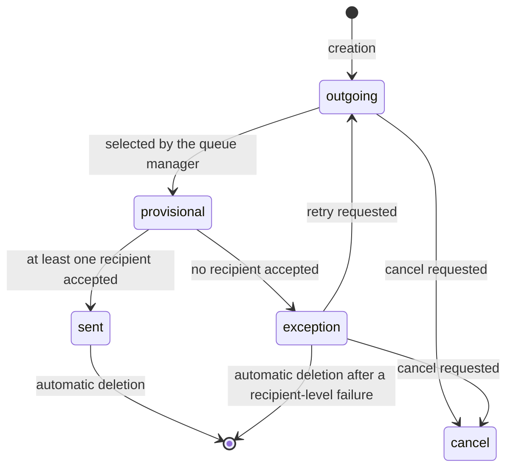

# The mail gateway

Electronic mail crosses the platform boundary in both directions, and in neither direction does it cross it inside the transaction that decided to communicate. Outbound, a business transaction writes a queued record and a scheduled job drains the queue later, committing after each message. Inbound, a scheduled job polls each configured server, and each fetched message is parsed, routed to a record and posted in its own transaction. This document specifies the outgoing queue with its state machine, its batching, its grouping by connection, its failure classification and the throttling of individually owned servers; the selection of an outgoing server for a given sender address; the polling of incoming servers with their two transactions and their deactivation rule; the parsing and duplicate suppression of a fetched message; aliases, alias domains and their contact policy; the routing algorithm that turns a message into a record; bounce detection and handling; and the loop-prevention rules that stop an automatic replier from filling the database.

The queue semantics this document relies on, and the other outbound channels (text messages, postal letters, browser push notifications, marketing campaigns, digests), are in [`background-workers.md`](background-workers.md). The scheduler semantics are in [`scheduled-jobs.md`](scheduled-jobs.md). The thread, message, follower and notification entities the gateway writes into are specified in [`../overview/messaging-model.md`](../overview/messaging-model.md).

## 1. The two directions at a glance

| Direction | Entity | Drained by | Shipped interval | Batch | Commits |
|---|---|---|---|---|---|
| Outgoing | Outgoing Email | Outgoing email queue manager | 1 hour | 1 000 | after each message |
| Incoming | Incoming Mail Server | Incoming mail fetching | 5 minutes, inactive by default | 50 messages per server | after each message and after each server |

## 2. Outgoing mail servers and server selection

### 2.1 The Outgoing Mail Server entity

| Identifier | Full name | Type | Default | Meaning |
|---|---|---|---|---|
| `name` | Name | text, required, indexed | none | Display name. |
| `sequence` | Priority | integer | 10 | Selection order. The lowest number is tried first. |
| `active` | Active | boolean | true | An archived server is never selected. |
| `from_filter` | Sender filter | text | none | A comma-separated list of addresses or domains this server is allowed to send for. Empty means "any sender". |
| `smtp_host` | Server host | text | none | Host name or address of the outgoing server. |
| `smtp_port` | Server port | integer | 25 | Port. |
| `smtp_encryption` | Encryption | selection: `none`, `starttls`, `ssl` | | Whether and how the connection is encrypted. |
| `smtp_authentication` | Authentication mode | selection: `login`, `certificate`, `cli` | | Credentials, a client certificate, or the deployment's own configured credentials. |
| `smtp_user` | Username | text, restricted to system administrators | none | Credential. |
| `smtp_pass` | Password | text, restricted to system administrators | none | Credential. |
| `smtp_ssl_certificate` | Client certificate | binary | none | Used when the authentication mode is the certificate mode. |
| `smtp_ssl_private_key` | Client private key | binary | none | Used with the certificate. |
| `smtp_debug` | Debugging | boolean | false | When true, the whole session with the server is logged. |
| `max_email_size` | Maximum message size | decimal | none | The largest message this server accepts, in mebibytes. |
| `owner_user_id` | Owner | link to one User | none | When set, the server belongs to one person and is throttled (section 6). |
| `owner_limit_time` | Throttle window | date and time, not copied | none | The minute the throttle counter belongs to. |
| `owner_limit_count` | Throttle count | integer, not copied | 0 | Recipients already accounted for in that minute. |

A check constraint refuses the certificate authentication mode together with no encryption.

### 2.2 Selecting a server for a sender address

Given a sender address, the selection returns a pair: the server to use, and the sender address actually to be presented on the wire. The steps are tried in order and the first that matches wins.

1. Normalize the sender address and extract its domain. Determine the notifications address, which is the deployment's default sending address for the sender's domain, and extract its domain.
2. If no candidate list was supplied, read every server allowed as a default, ordered by priority. Drop every archived server.
3. If the normalized sender address is non-empty: return the first server one of whose sender-filter entries, normalized as an address, equals the normalized sender address, with the sender address unchanged. Then return the first server one of whose sender-filter entries, normalized as a domain, equals the sender's domain, with the sender address unchanged.
4. Reduce the candidate list to the servers eligible as a fallback.
5. If a notifications address exists: return the first server whose sender filter matches it as an address, with the notifications address as the wire sender. Then the first whose filter matches its domain, again with the notifications address.
6. Return the first server that declares no sender filter at all, with the notifications address when there is one, otherwise the original sender address. The wire sender is then not the author's own address.
7. Return the first server of the list even though its filter matches another domain, with the notifications address when there is one, otherwise the sender address, and log the warning `No mail server matches the from_filter, using <address> as fallback`.
8. If there is no server record at all, fall back to the deployment's own configured outgoing server. If its configured sender filter matches the sender address, use it with that address. If it matches the notifications address, use it with that address. Otherwise use it with the notifications address when there is one, otherwise the sender address, and log the warning that the deployment's sender filter matches neither.

The consequence a replacement must reproduce: the platform never refuses to send for lack of a matching server. It degrades, in a fixed order, towards presenting the deployment's own notifications address as the sender and putting the author's address in the reply-to header instead.

### 2.3 Alias domains

An alias domain groups the three service addresses of one mail domain.

| Identifier | Full name | Type | Default | Meaning |
|---|---|---|---|---|
| `name` | Domain name | text, required | none | The mail domain itself. |
| `sequence` | Sequence | integer | 10 | Ordering; the first is the default. |
| `bounce_alias` | Bounce local part | text, required | `bounce` | The local part of the return address used for delivery reports. |
| `bounce_email` | Bounce address | text, derived | | The bounce local part, an at sign, and the domain name. |
| `catchall_alias` | Catchall local part | text, required | `catchall` | The local part of the reply address placed on outgoing notifications. |
| `catchall_email` | Catchall address | text, derived | | The catchall local part, an at sign, and the domain name. |
| `default_from` | Default sender local part | text | `notifications` | The local part, or a whole address, used as the sender when no outgoing server matches the author's address. |
| `default_from_email` | Default sender address | text, derived | | The resolved default sender address. |
| `company_ids` | Companies | the companies using this domain as their default | | Scoping. |

Two uniqueness constraints apply: the pair of the bounce local part and the domain name must be unique, with the message `Bounce emails should be unique`; and the pair of the catchall local part and the domain name must be unique, with the message `Catchall emails should be unique`.

## 3. The outgoing queue

### 3.1 The Outgoing Email entity

An Outgoing Email extends a Message: the two records share one identity, and the message supplies the author, the body, the attachments and the thread it belongs to.

| Identifier | Full name | Type | Required | Default | Meaning |
|---|---|---|---|---|---|
| `mail_message_id` | Message | link to one Message, deletion cascading, indexed | yes | none | The delegated message. |
| `body_html` | Rich-text body | long text | no | none | The formatted body actually sent, which may differ from the message body after personalization. |
| `references` | References | long text, read-only | no | none | The identifiers of the messages this one answers, for threading. |
| `headers` | Extra headers | long text, not copied | no | none | Extra transport headers. |
| `is_notification` | Is a notification | boolean | no | derived | True when the record was created to notify somebody of an existing message. Set automatically at creation when a message was supplied. Controls whether deleting the outgoing record also deletes the message. |
| `email_to` | Plain recipients | long text | no | none | Recipient addresses that are not contacts. |
| `email_cc` | Carbon copy | text | no | none | Carbon copy addresses. |
| `recipient_ids` | Contact recipients | many-to-many to Contact, including archived ones | no | none | Recipients that are contacts. |
| `state` | State | selection: `outgoing`, `sent`, `received`, `exception`, `cancel` | yes | `outgoing` | Section 3.2. |
| `failure_type` | Failure type | selection, see the table below | no | none | The classification of the last failure. |
| `failure_reason` | Failure reason | long text, read-only, not copied | no | none | The verbatim error, kept for diagnosis. |
| `auto_delete` | Delete after sending | boolean | no | false | When true, the record is deleted after a successful send, or after a recipient-level failure. |
| `scheduled_date` | Scheduled instant | date and time | no | none | When set, the queue manager sends the message only from that instant on. |
| `fetchmail_server_id` | Source incoming server | link to one Incoming Mail Server, read-only, indexed when not empty | no | none | For a message produced by the inbound gateway, the server it came from. |
| `mail_server_id` | Outgoing server | link to one Outgoing Mail Server | no | none | An explicitly chosen server. |
| `unrestricted_attachment_ids` | Readable attachments | many-to-many to Attachment, derived with an inverse | no | none | The subset of the attachments the acting user may read. |
| `restricted_attachment_count` | Unreadable attachment count | integer, derived | no | none | How many attachments the acting user may not read. |

Failure classification:

| Stored value | Meaning |
|---|---|
| `unknown` | Anything not classified. |
| `mail_spam` | The server rejected the message as unsolicited. |
| `mail_email_invalid` | At least one recipient address is not a valid address. |
| `mail_email_missing` | There is no recipient address at all. |
| `mail_from_invalid` | The sender address is not acceptable to the server. |
| `mail_from_missing` | No sender address could be determined. |
| `mail_smtp` | The connection to the outgoing server failed. |
| `mail_bounce` | A delivery report came back for this recipient (section 9). |
| `mail_bl` | The recipient is on the blocked list; mass sending only. |
| `mail_optout` | The recipient opted out; mass sending only. |
| `mail_dup` | The recipient appears twice in the same campaign; mass sending only. |

**Validation.** A record may not name an outgoing mail server owned by another user: `You may not create a message using another user's mail server.`

**Scheduled instant parsing.** A supplied scheduled instant is parsed from a date, an instant or text. A value carrying no zone information is taken as being in coordinated universal time. A value that cannot be parsed becomes unset, therefore the message is sent as soon as possible rather than never.

**Attachment access.** Supplying attachments at creation, or adding them by writing, requires read access on each of them.

**Deletion.** Deleting an outgoing record also deletes the underlying message when the record is not a notification. A notification record leaves the message in place, because the message belongs to a discussion thread.

### 3.2 The state machine

| From | Trigger | Guard | To | Side effects |
|---|---|---|---|---|
| none | creation | none | `outgoing` | none |
| `outgoing` | the queue manager selects it | the scheduled instant is unset or has been reached | `exception`, provisionally | The provisional failure is written **before** the delivery attempt (section 3.4). |
| provisional `exception` | at least one recipient accepted | none | `sent` | The transport identifier is stored; the failure type and reason are cleared. |
| provisional `exception` | no recipient accepted | none | `exception` | The failure type and reason are stored. |
| `exception` | retry requested by a user | none | `outgoing` | none |
| `outgoing`, `exception` | cancel requested | none | `cancel` | none |
| any | mark outgoing | none | `outgoing` | none |
| `sent`, or a recipient-level failure | the record has automatic deletion | none | deleted | The message is deleted too when the record is not a notification. |



The state `received` exists for records produced by the inbound gateway and is never produced by the outgoing path. The provisional state in the diagram is the stored value `exception`; it is drawn separately because the record passes through it within one transaction.

### 3.3 Draining the queue

1. Build the selection condition: the state is `outgoing`, and the scheduled instant is either unset or at or before the current instant. Any extra condition the caller placed in the execution context is added.
2. Read the batch size as the integer value of the system parameter `mail.mail.queue.batch.size` (outgoing mail queue batch size), defaulting to the caller's own batch size, which is 1 000 when the caller is the scheduled job.
3. The limit is the batch size, or the batch size multiplied by ten when the caller named specific records.
4. Select the first records matching the condition, up to the limit.
5. Log `Processing email queue with send limit of '<limit>'<note>`, in which the note names the specific records when the caller supplied any.
6. If the caller named no specific records: the initial total is the number selected when it is below the batch size, otherwise a full count of the condition. Define a progress callback that, on each call, computes the newly sent records, accumulates them, and, when running inside a scheduled job, reports the new count as processed and the total minus the accumulated count as remaining.
7. If the caller named specific records: narrow the selection to the intersection with those records, and use no progress callback.
8. Sort the selected keys ascending and send them, committing after each message unless the deployment is running its automated tests.
9. A failure of the whole send is logged with its traceback as `Failed processing mail queue` and does not propagate, so that one broken batch does not fail the job.

Ordering by key ascending makes the queue first-in first-out, because keys are monotonic.

### 3.4 Sending

Sending a selection proceeds group by group, each group being the result of section 3.5.

1. If the group's mail server is owned by an individual user, replace the group's batch with the throttled subset of section 6; an empty subset skips the group entirely.
2. Open one connection to the mail server.
3. If the connection fails: when the caller asked for failures to be raised, raise a delivery failure. Otherwise write the state `exception` and the connection failure reason on the whole batch, classify the failure as `mail_smtp`, and post-process the batch.
4. Otherwise send each message of the batch over that one connection, following the per-message procedure below.
5. Whatever happened, close the connection, ignoring a disconnection error raised while closing.

The per-message procedure is:

1. Re-read the record and skip it unless its state is still `outgoing`.
2. Determine whether it has no recipient at all.
3. Write, **before attempting anything**: the state `exception`; a failure reason that is the no-recipient message when there is no recipient and a generic "error without exception" message otherwise; and a failure type of `mail_email_missing` or `unknown` accordingly. This is deliberate: if writing the final state later fails, the message stays marked failed instead of staying queued, which prevents a double send.
4. Move every notification of this message that is neither sent nor cancelled to a transient exception status and flush that write immediately, which takes the lock on those rows before the slow network work begins.
5. Normalize the sender address.
6. Build the list of outgoing items: one per recipient group, each carrying the personalized body, the subject, the addresses, the reply address, the attachments, the transport identifier, the references and the extra headers.
7. For each item: build the transport message and hand it to the mail server. On success, record the recipient as accepted. On a no-valid-recipient assertion, classify the failure as `mail_email_missing` when the item had no address and as `mail_email_invalid` otherwise, log the item at informational level, and continue with the next item. On any other assertion, re-raise.
8. If at least one item was accepted, set the state to `sent`, store the transport identifier and clear the failure fields. Otherwise store the failure reason and type when any were determined.
9. Post-process the record (section 5).
10. If the caller asked for automatic commits, report progress and then commit.

Failure handling around step 7:

| Failure | Behaviour |
|---|---|
| Out of memory | Logged with a hint about raising the memory limit and re-raised. The message stays in its provisional state because the transaction is rolled back. |
| A database failure or a lost connection to the mail server | Logged and re-raised; the cursor and the session are presumed unusable. |
| An assertion naming an unusable sender | Classified as `mail_from_invalid` or `mail_from_missing` from the assertion code; the secondary argument, when present, becomes the failure reason. |
| A delivery failure whose text names the unsolicited-mail rejection | Classified as `mail_spam`. |
| Anything else | Classified as `unknown` with the exception text as the reason; logged as `failed sending mail (id: <key>) due to <reason>`; the record is written to `exception` and post-processed. When the caller asked for failures to be raised, an encoding failure is re-raised as a delivery failure naming the offending text, an assertion is re-raised as a delivery failure joining its arguments, and anything else is re-raised unchanged. |

### 3.5 Grouping by connection

Messages are grouped in order that one connection serves many messages.

1. Read, for each message, its sender address, its explicitly chosen mail server and its record's sender domain.
2. Normalize the sender address and keep the first normalized form.
3. Form a provisional key from the chosen server, the sender domain, the normalized sender, and the set of servers this message is allowed to use.
4. For each provisional key with no chosen server, resolve the server and the wire sender address from the sender address, the sender domain's notification and bounce addresses and the allowed set, following section 2.2. For each provisional key with a chosen server, the wire sender is the sender address itself.
5. Regroup by the triple of the resolved server, the sender domain and the wire sender.
6. Split each group into batches of at most the value of the system parameter `mail.session.batch.size` (messages per connection), defaulting to 1 000.

The mail servers are read once, ordered by their priority then their key, and reused for every message of the run.

## 4. Sending after a commit

An operation that wants a message sent only if its transaction succeeds registers a post-commit callback that opens a **new** transaction on the same database as the superuser and sends the named records there. When the deployment is running its automated tests, the send happens inline instead, because tests do not commit. The general rule this follows is stated in [`transactions-and-concurrency.md`](transactions-and-concurrency.md), section 10.3.

## 5. Post-processing and retention

### 5.1 Post-processing one set

1. Collect the keys of the records in this set that are notifications. If there are none, go to step 5.
2. Collect every electronic-mail notification of those records whose status is neither sent nor cancelled.
3. When a failure type was determined, the failed notifications are those whose contact is not among the accepted contacts **and** whose address is not among the accepted addresses. When no failure type was determined, there are no failed notifications.
4. Write the status `sent` with empty failure fields on the notifications that are not failed, and the status `exception` with the failure type and reason on the failed ones. When there is at least one failed notification, notify the thread messages of those notifications that a delivery failure occurred, which pushes a notification to the author's client over the bus of [`notification-bus.md`](notification-bus.md).
5. If no failure type was determined, or the failure type is `mail_email_invalid` or `mail_email_missing`, delete every record of this set that has automatic deletion.

The rule in step 5 means a message whose only problem is a bad recipient address is deleted when it is marked for automatic deletion, while a message that failed for a server-level reason is kept and can be retried.

### 5.2 Retention of cancelled messages

The mass-mailing package adds a cleanup that deletes cancelled outgoing records whose last update is older than a configured number of months, read from the system parameter `mass_mailing.cancelled_mails_months_limit` (months of cancelled-message history to keep), whose default is 6, in ascending key order, at most 10 000 per run. A configured value of zero or less disables the cleanup. Deleting them also deletes their messages when they are not notifications.

## 6. Throttling an individually owned mail server

An outgoing mail server may belong to one user rather than to the company. Such servers are throttled to avoid being flagged as a source of unsolicited mail.

1. Read the limit as the integer value of the system parameter `mail.server.personal.limit.minutes` (messages per minute for a personal outgoing server), defaulting to 30 when it is unset or zero.
2. Take the current wall-clock instant truncated to the minute as the current minute.
3. Take the server's recorded throttle window; when it is unset, take the current minute minus one minute.
4. If the recorded window is earlier than the current minute, the counter is stale: set the recorded window to the current minute and the recorded count to 0.
5. If the recorded window is later than the current minute, which can only happen if it was written by hand, set the recorded window to the current minute, set the recorded count to 0, and log the error `Mail: invalid owner_limit_time <window> > <minute> for <server>`.
6. Start two empty lists, one of messages to send now and one of messages to delay. Then, for each message, oldest first by creation instant and then by key:
   1. The weight of the message is its number of contact recipients, or 1 when it has none.
   2. If the recorded count is already at or above the limit, add the message to the delayed list.
   3. Otherwise, if the recorded count plus the weight would exceed the limit, compute the number to keep as the limit minus the recorded count; copy the message, preserving its headers and its underlying message, with the **first** that many contact recipients; leave the remaining contact recipients on the original and clear its plain recipient and carbon copy addresses; increase the recorded count by the number to keep, or by 1 when that number is zero; move the notifications of the moved recipients onto the copy; add the copy to the send list and the original to the delayed list.
   4. Otherwise add the message to the send list and increase the recorded count by the weight.
7. Walk the delayed list in order with a running count that starts at the recorded count: if the running count is below the limit, add the message's weight to it; otherwise reset the running count to the message's weight and advance the window by one minute. Set the message's scheduled instant to the window.
8. Trigger the outgoing email queue manager at the earliest delayed scheduled instant plus 59 seconds.
9. Log `Mail: personal server <name>: <n> emails about to be sent / <m> emails delayed`.

```formula
weight of a message = number of contact recipients, or 1 when there are none
recipients kept on the copy = limit − recorded count
trigger instant = earliest delayed scheduled instant + 59 seconds
```

**Worked example.** The limit is 30. Three messages are queued at 10:00:00 with 20, 20 and 5 contact recipients.

| Message | Weight | Count before | Decision | Count after |
|---|---|---|---|---|
| 1 | 20 | 0 | 0 + 20 is not above 30, therefore send whole | 20 |
| 2 | 20 | 20 | 20 + 20 = 40, which is above 30, therefore keep 30 − 20 = 10 recipients on a copy that is sent, and delay the original with its remaining 10 recipients | 30 |
| 3 | 5 | 30 | 30 is at the limit, therefore delay whole | 30 |

Delaying: the running count starts at 30. The original of message 2 has weight 10; 30 is at the limit, therefore the count resets to 10 and the window advances to 10:01, and its scheduled instant becomes 10:01. Message 3 has weight 5; 10 is below 30, therefore the count becomes 15 and its scheduled instant stays 10:01. The queue manager is triggered at 10:01:59.

## 7. Incoming mail servers and the poll

### 7.1 The Incoming Mail Server entity

| Identifier | Full name | Type | Required | Default | Meaning |
|---|---|---|---|---|---|
| `name` | Name | text | yes | none | Display name. |
| `active` | Active | boolean | no | true | Archiving flag. |
| `state` | State | selection: `draft`, `done`, indexed, read-only, not copied | yes | `draft` | Only confirmed servers are polled. |
| `server` | Server host | text | no | none | Host name or address of the server. |
| `port` | Port | integer | no | none | Port. |
| `server_type` | Protocol | selection: `imap`, `pop`, `local`, indexed | yes | `imap` | The retrieval protocol. The local kind is never polled. |
| `is_ssl` | Encrypted | boolean | no | false | Whether the connection uses a dedicated encrypted port. |
| `attach` | Keep attachments | boolean | no | true | When false, attachments are stripped before processing. |
| `original` | Keep the original | boolean | no | false | When true, a full copy of each source message is kept and attached. |
| `date` | Last fetch instant | date and time, read-only | no | none | Updated after each poll of this server. |
| `last_error_date` | First failure instant | date and time, read-only | no | none | The instant of the first failure of the current streak; cleared on success. |
| `last_error_message` | Last failure text | long text, read-only | no | none | The verbatim failure. |
| `user` | Username | text | no | none | Credential. |
| `password` | Password | text | no | none | Credential. |
| `priority` | Priority | integer | no | none | Poll order. |
| `object_id` | Target entity | link to one entity definition | no | none | The entity that messages from this server create records in, when the routing does not decide otherwise. |

Default ordering: by priority.

### 7.2 The poll

The job asserts that it is running as the incoming mail fetching job and refuses otherwise.

1. Select the confirmed servers whose protocol is not the local kind, ordered by priority ascending, then by last fetch instant ascending with never-fetched servers first, then by key ascending.
2. Extend the job's time budget by 4 seconds per server, because connecting to and checking an empty mailbox is assumed to cost at most two operations of two seconds each.
3. Fetch from those servers (section 7.3).
4. If no confirmed non-local server remains at the end, report progress with the deactivation flag, which deactivates the job.

The ordering rotates the servers: a server that has just been polled goes to the end of the queue for the next run.

### 7.3 Fetching from one server

The remaining count starts at the number of servers, since each server costs one unit of work, and grows by one per unseen message found. That count is reported as progress before any server is contacted, and the line `Fetchmail servers (in order) to be processed <names>` is logged.

For each server, in the order of section 7.2:

1. Decrease the remaining count by one, because this server is now being checked.
2. Take the referenceable row lock on the server. If it cannot be taken, or the server is no longer confirmed, log `Skip checking for new mails on mail server <key> (unavailable)` and skip this server.
3. Log `Start checking for new emails on <protocol> server <name>`.
4. Open a connection with a 60-second timeout.
5. Open a **second** transaction for message processing.
6. Count the unseen messages and add that count to the remaining count.
7. For each unseen message, oldest first: process it in the second transaction. On success, report one unit of progress, which commits. On failure, roll back the second transaction, count the failure, log `Failed to process mail from <protocol> server <name>` with the traceback, and still report one unit of progress. In both cases mark the message handled on the server. Stop after 50 messages, or when the time budget is exhausted.
8. Clear the failure instant and the failure message on the server.
9. If anything in steps 4 to 8 failed: remember it as the run's outcome; log `General failure when trying to fetch mail from <protocol> server <name>`; if the server had no recorded failure instant, record the current instant and the failure text; otherwise, if the recorded failure instant is more than 5 days old, move the server back to the `draft` state and notify an administrator with `Deactivating fetchmail <protocol> server <name> (too many failures)`.
10. Whatever happened, close the second transaction and disconnect, logging a failure to disconnect as a warning.
11. Log `Fetched <n> email(s) on <protocol> server <name>; <succeeded> succeeded, <failed> failed.`.
12. Write the last fetch instant on the server.
13. Commit the control transaction **before** reporting progress, because the messages were processed in another transaction and reporting first would produce a serialization failure.
14. Report one unit of progress with the new remaining count.
15. Stop when the time budget is exhausted.

The run's outcome is returned to the job.

The second transaction exists in order that the row lock on the server, held by the first transaction, survives the per-message commits. Without it, committing after each message would release the lock and let another worker poll the same server.

### 7.4 Protocol specifics

| Protocol | Counting unseen | Retrieving | Marking handled |
|---|---|---|---|
| Message access protocol | Select the mailbox and search for unseen messages; the list is reversed, which processes the oldest first. | Fetch the full source; immediately clear the seen flag that the fetch set, which prevents a failure from silently consuming the message. | Set the seen flag. |
| Post office protocol | Read the mailbox statistics; the unseen set is every message, newest key first, popped from the end. | Retrieve the message and join its lines. | Delete the message from the server. |

Disconnecting closes the mailbox when one was selected, then ends the session.

### 7.5 Manual fetch

A user with write access on a server may fetch from it immediately. The operation runs the same fetch with privileged rights and re-raises the outcome as an error when the run failed.

## 8. Processing one inbound message

### 8.1 The ordered procedure

1. Decode the message bytes and parse the message into a value map. The map carries at least: the message identifier, the sender address, the recipient list, the carbon copy list, the envelope recipients, the references, the in-reply-to header, the subject, the body, the attachments, whether the message is a bounce, and, when it is, the bounced address, the bounced contact, the bounced message identifiers and the bounced message record.
2. If the caller asked for attachments to be stripped, drop them from the map.
3. **Duplicate suppression.** If a message with the same message identifier already exists, the message is a duplicate. Otherwise, if the message identifier is non-empty, take a transaction-scoped advisory lock keyed by a hash of the message identifier; if the lock cannot be taken, another transaction is processing the same message identifier at this instant and the message is treated as a duplicate. A duplicate is ignored with the log line `Ignored mail from <sender> to <recipients> with Message-Id <identifier>: found duplicated Message-Id during processing`.
4. **Header-based loop suppression** (section 10.1). If it fires, ignore the message.
5. **Routing** (section 8.2). It returns a list of routes, possibly empty. Routing also fills in the author of the message map.
6. **Sender-based loop suppression** (section 10.2). If it fires, ignore the message.
7. Update the message map with the values that depend on the resolved records.
8. **Apply the routes** (section 8.3) and return the key of the last record reached.

### 8.2 Routing

A route is a five-part value: the target entity, the target record key or zero, the default values to apply on creation, the acting user, and the alias that produced it. The routing procedure is:

1. Read the allowed catchall domains from the system parameter `mail.catchall.domain.allowed` (domains whose local part may be matched), as a comma-separated list. When it is non-empty, the names of every alias domain are added to it. A recipient address whose domain is not in that list contributes no local part to the matching.
2. If the message map says the message is a bounce, handle the bounce (section 9.2) and return **no** route.
3. Otherwise reset the bounce counters of every blocked-list-enabled record whose normalized address equals the sender's, because receiving mail from an address proves the address works (section 9.4).
4. Compute the thread references: the references header, or the in-reply-to header when there is none. Drop any reference that carries the reply-to marker. Keep only the **last 32**, because newer identifiers are appended and a match is normally found with the last one, and because a long reference list degrades the lookup badly.
5. Search for the most recent message whose message identifier is among those references. If one is found, the message is a reply and the reply target is that message's entity and record.
6. **Reply turned into a forward.** If a reply target was found, search for aliases whose entity differs from the reply target's entity and whose full address is among the recipients, or whose local part is among the recipient local parts and which enable local-part matching. If any such alias exists, the message is treated as a new message rather than a reply, and the valid envelope recipients are narrowed to those matching those aliases.
7. **Reply route.** If the message is still a reply, find at most one alias of the reply target's entity matching the envelope recipients, resolve the acting user for the gateway from the sender address and that alias, and check the route (section 8.4) without raising. If the check yields a route, return it alone. If the check explicitly rejected the route, return no route at all.
8. **Direct write to the catchall address.** If the message has envelope recipients and **every** normalized recipient is a catchall address, the sender wrote to the catchall address directly. Determine the company that owns the matched catchall address, render the catchall bounce body, send a bounce message (section 9.3) with the original message identifier plus a generated loop-detection reference, with the company's own address as the reply address, and return no route.
9. **Alias routes.** Search for every alias whose full address is among the valid envelope recipients, or whose local part is among their local parts and which enables local-part matching. For each such alias, build a route from the alias's entity, its forced record key, its evaluated default values, the acting user resolved for the gateway, and the alias itself; check the route (section 8.4), raising on failure; and keep the routes that survive. Return them.
10. **Fallback route.** If the caller supplied a fallback entity, drop any parent message from the map, resolve the acting user for the gateway from the sender address, and check a route built from the fallback entity, the supplied record key, the supplied default values and no alias, raising on failure. Return it alone if it survives.
11. **Partial catchall.** If the message has envelope recipients and **any** of them is a catchall address, render the catchall bounce body, send a bounce message with the original message identifier plus a generated loop-detection reference and the company's own address as the reply address, and return no route.
12. Otherwise raise `No possible route found for incoming message from <sender> to <recipients> (Message-Id <identifier>:). Create an appropriate mail.alias or force the destination model.`

Every successful route is logged at informational level with the sender, the recipients, the message identifier and the route.

### 8.3 Applying the routes

For each route in turn:

1. If the route names no record key and the entity accepts no creation from mail, or names a record key and the entity accepts neither update nor creation, raise `Undeliverable mail with Message-Id <identifier>, model <entity> does not accept incoming emails`.
2. Turn off automatic subscription and automatic logging on the entity for the duration, so that the user running the gateway does not become a follower of every inbound message.
3. When the route came from an alias, run as the route's acting user with elevated rights.
4. If the route names an existing record and the entity accepts updates, apply the message to that record.
5. Otherwise drop any parent message from the map and create a new record from the message and the route's default values. If creation raises and the route came from an alias, open a **separate transaction**, mark the alias invalid and send the alias-invalid bounce, then re-raise. If creation succeeds and the alias was not already valid, set its status to `valid`. The message subtype of the post is the entity's creation subtype.
6. Post the message on the record as the high-privilege archived system author, so that the real author is computed correctly. When the message is internal the subtype is the internal-note subtype; otherwise it is the comment subtype, unless a creation subtype was chosen at step 5.
7. Additional recipients: when the message answers a parent message that has an author, that author is pinged if the new message is internal, or if the parent author is an external contact. This ensures a private answer reaches the person it answers.
8. The computed values that are not stored on a message (the raw sender, the envelope recipients, the raw carbon copy and recipient headers, the references, the in-reply-to header, the platform's own message identifier header, and every bounce-related value) are removed before the message is created.
9. When the thread is the abstract thread, that is a message with a parent but no record, the message is delivered as a direct notification instead of a thread post.
10. Any recipients the caller had supplied are written onto the created message **after** it was posted, so that posting does not produce duplicate outbound notifications.

### 8.4 Checking one route

1. If the route names no entity, warn `target model unspecified` and reject the route.
2. If the route names an entity that does not exist, warn `unknown target model <entity>` and reject the route.
3. If the route names a record key and no such record exists, warn `reply to missing document (<entity>,<key>), fall back on document creation` without raising and clear the record key.
4. If the route names a record key and the entity accepts no update from mail, warn `reply to model <entity> that does not accept document update, fall back on document creation` without raising and clear the record key.
5. If the route now names no record key and the entity accepts no creation from mail, warn `model <entity> does not accept document creation` and reject the route.
6. If the route came from an alias:
   1. When the message map has no author yet, resolve the author from the sender address against the target record, or against the alias's parent record when there is no target, without creating a contact.
   2. Choose the record against which the alias policy is evaluated: the target record when there is one, the alias's parent record when the alias declares one, otherwise the bare entity.
   3. Evaluate the alias policy (section 8.5). If it returns an error, warn `alias <name>: <error>` without raising, send the alias bounce, marking the alias invalid only when the error is a configuration error, and reject the route.
7. Return the route unchanged.

A warning is logged as `Routing mail with Message-Id <identifier>: route <route>: <error>` at informational level. When the caller asked for the failure to be raised, the sender-visible error is `Mailbox unavailable - <error>`, which deliberately omits the diagnostic detail.

### 8.5 The alias entity and its contact policy

| Identifier | Full name | Type | Required | Default | Meaning |
|---|---|---|---|---|---|
| `alias_name` | Alias local part | text, not copied | no | none | The local part of the address the alias answers. |
| `alias_full_name` | Alias address | text, derived and stored, indexed when not empty | no | derived | The local part, an at sign, and the alias domain's name; the bare local part when no domain is set. |
| `alias_domain_id` | Alias domain | link to one alias domain, deletion restricted | no | the company's alias domain | The domain this alias belongs to. |
| `alias_model_id` | Target entity | link to one entity definition, deletion cascading | yes | none | The entity a message to this alias creates or updates. Only entities that carry a discussion thread may be chosen. |
| `alias_defaults` | Default values | text | yes | an empty mapping | The values applied when a record is created. Must parse as a literal mapping. |
| `alias_force_thread_id` | Forced record key | integer | no | none | When set, every message is attached to that record and no record is ever created. |
| `alias_parent_model_id` | Parent entity | link to one entity definition | no | none | The entity of the record that owns the alias, which may differ from the target entity. |
| `alias_parent_thread_id` | Parent record key | integer | no | none | The key of that owning record. |
| `alias_contact` | Contact policy | selection: `everyone`, `partners`, `followers` | yes | `everyone` | Who may post through this alias (below). |
| `alias_incoming_local` | Local-part matching | boolean | no | false | When true, the alias also matches a recipient whose local part equals the alias local part, whatever the domain. |
| `alias_bounced_content` | Custom refusal body | rich text, translatable | no | none | Replaces the default refusal body sent to an unauthorized sender. |
| `alias_status` | Status | selection: `not_tested`, `valid`, `invalid`, derived and stored | no | `not_tested` | The outcome of the last message received on this alias. |

Ordering: by target entity, then by local part. A uniqueness index covers the pair of the local part and the alias domain, treating an unset domain as zero.

Validations:

| Condition | Message |
|---|---|
| The local part contains anything other than unaccented Latin characters forming a plain address local part | `You cannot use anything else than unaccented latin characters in the alias address <name>.` |
| The default values do not parse as a literal mapping | `Invalid expression, it must be a literal python dictionary definition e.g. "{'field': 'value'}"` |
| The alias domain belongs to companies that do not include the owning record's company | `We could not create alias <name> because domain <domain> belongs to company <companies> while the owner document belongs to company <company>.` |
| The alias domain belongs to companies that do not include the target record's company | `We could not create alias <name> because domain <domain> belongs to company <companies> while the target document belongs to company <company>.` |

Changing the local part or the domain resets the status to `not_tested`.

The contact policy is evaluated as follows and returns either no error or an error with a code, a message and a configuration-error flag.

| Policy | Condition | Error code | Message fragment | Configuration error |
|---|---|---|---|---|
| `followers` | The evaluation record set is empty | `config_follower_no_record` | `incorrectly configured alias (unknown reference record)` | yes |
| `followers` | The evaluation record carries no follower list | `config_follower_no_partners` | `incorrectly configured alias` | yes |
| `followers` | There is no author, or the author is not a follower of the record | `error_follower_not_following` | `restricted to followers` | no |
| `partners` | There is no author | `error_partners_no_partner` | `restricted to known authors` | no |
| `everyone` | never fails | | | |

The difference between the two flags matters: a configuration error sets the alias status to `invalid` and sends the "incorrectly configured" body; a policy refusal leaves the status alone and sends the "not authorized" body.

The refusal body sent to an unauthorized sender is the alias's custom refusal body when it has one. Otherwise it is a rendered letter addressed `Dear Sender`, whose content states that the address accepts messages only from the described set of senders, with the description being `addresses linked to registered partners` for the `partners` policy and `some specific addresses` otherwise, and which closes with `Kind Regards`. The body sent for a configuration error states `The message below could not be accepted by the address <alias>. Please try again later or contact <company> instead.` and quotes the original message beneath it.

## 9. Bounces

### 9.1 Detecting a bounce

A message is a bounce when any of the following holds, tested in this order.

1. Any of its normalized recipient addresses is the bounce address of an alias domain.
2. The local part of its sender address, compared without regard to letter case, is `mailer-daemon`.
3. Its media type is the multi-part report type, or its media type carries the delivery-status report parameter.

The second test exists because not every mail transfer agent respects the report media type.

### 9.2 Handling a bounce

1. Read from the message map the bounced address, the bounced contact, the bounced message identifiers and the bounced message record.
2. If a bounced address was determined:
   1. Take the entity and record key of the bounced message; when both are usable, resolve the bounced record.
   2. For every entity that is blocked-list enabled, other than the abstract blocked-list thread itself, search for records whose normalized address equals the bounced address and let each of them receive the bounce, which increments its bounce counter and may blocklist the address.
   3. If the bounced record was not already reached by step 2.2 and it carries a discussion thread, let it receive the bounce as well.
   4. If a bounced message and either a bounced address or a bounced contact were determined, write on every notification of that message whose contact is among the bounced contacts or whose address equals the bounced address: the failure reason set to the plain-text rendering of the bounce body, the failure type `mail_bounce`, and the notification status `bounce`.
3. Log one of three informational lines: that the bounce replying to the named message on the named record is not being routed; that the bounce is not being routed because no document was found; or that the bounce is not being routed at all.
4. Return no route, so that the bounce itself is never posted as a message on a thread.

### 9.3 Creating a bounce message

A bounce message is created when the platform itself refuses an inbound message.

1. The destination is the return-path header of the incoming message when it has one, otherwise the incoming sender address.
2. The subject is `Re: ` followed by the incoming subject.
3. The record has no author and is marked for automatic deletion.
4. The sender address is resolved in this order: the bounce address of the acting company, presented with the display name `MAILER-DAEMON`; failing that, the incoming recipients header, but only when none of the catchall addresses appears among the incoming recipients; failing that, the acting user's own normalized address, again presented with the display name `MAILER-DAEMON`.
5. Any caller-supplied values, notably the references header and the reply address, override the above.
6. The record is created with privileged rights and sent immediately.

The references header of a bounce that the platform generates for a loop or for a catchall write carries the original message identifier followed by a generated identifier containing the loop-detection marker, which is what section 10.1 keys on.

### 9.4 Resetting bounce counters

When a non-bounce message arrives, its normalized sender address is taken as proof that the address works. For every blocked-list-enabled entity other than the abstract blocked-list thread, every record with a non-zero bounce counter whose normalized address equals the sender's has its bounce counter reset.

## 10. Loop prevention

### 10.1 Header-based suppression

Unfold the references header and append the in-reply-to header. If any of the resulting references contains the loop-detection marker, the message is a reply to a bounce the platform itself generated. It is ignored with the log line `Email is a reply to the bounce notification, ignoring it.`.

### 10.2 Sender-based suppression

This test runs **after** routing, because it needs to know which entities and records the message would reach.

1. If the message has no sender address, do not suppress.
2. If the normalized sender address is in the gateway allow list, do not suppress. The allow list is an entity of its own holding addresses that are exempt from loop detection.
3. Read the window as the integer value of the system parameter `mail.gateway.loop.minutes` (loop detection window in minutes), whose default is 120, and the threshold as the integer value of `mail.gateway.loop.threshold` (loop detection threshold), whose default is 20. The cut-off instant is the transaction timestamp minus the window.
4. Group the routes by target entity, collecting the record keys per entity.
5. For each entity that declares a loop-detection condition:
   1. **Creation loop.** If any route for that entity creates a new record, that is its record key is zero, build the entity's loop-detection condition for the normalized sender and count the records of that entity matching it that were created at or after the cut-off instant. The default condition matches records whose primary address field contains the normalized sender; an entity with no primary address field declares no condition and logs `Primary email missing on <entity>` once. The creation loop fires when that count is at or above the threshold.
   2. **Reply loop.** If the entity has routes naming existing records and the creation loop did not fire, count, per record, the messages of type electronic mail on those records created at or after the cut-off instant whose author is the resolved author, or, when no author was resolved, whose sender address is the incoming sender in either its raw or normalized form. The reply loop fires when any single record reaches the threshold.
6. If either fires, log the corresponding informational line, which names the sender, the recipients, the message identifier and the entity, render the message-limit body, send a bounce message whose references carry the original message identifier plus a generated loop-detection reference, and suppress the message.

```formula
cut-off instant = transaction timestamp − loop detection window in minutes
loop fires when count of matching records or messages ≥ loop detection threshold
```

**Worked example.** The window is 120 minutes and the threshold is 20. An automatic replier answers every message sent to a lead-creation alias. After 20 leads have been created from its address within two hours, the twenty-first message is not routed: a bounce carrying the loop-detection reference is sent instead, and the replier's answer to **that** bounce is discarded by the header test of section 10.1 rather than producing a further lead.

## 11. Worked examples

### 11.1 A reply reaching an existing record

| Step | Effect |
|---|---|
| 1 | The message is fetched, parsed and found not to be a duplicate. |
| 2 | Its references name a message that exists on a task; the reply target is that task. |
| 3 | No alias of another entity matches the recipients, therefore it stays a reply. |
| 4 | The route is checked: the task exists, accepts updates, and the alias policy is `everyone`. |
| 5 | The route is applied: the task is updated and the message is posted on it with the comment subtype. |
| 6 | Followers of the task are notified, producing new Outgoing Email records that the outgoing queue will drain. |

### 11.2 A new message creating a record through an alias

| Step | Effect |
|---|---|
| 1 | The message has no references that match an existing message. |
| 2 | Its envelope recipients match one alias whose target entity is the lead entity and whose contact policy is `everyone`. |
| 3 | The route carries the alias's default values and its resolved acting user. |
| 4 | The route is applied: a lead is created, the alias status becomes `valid`, and the message is posted with the creation subtype. |

### 11.3 A message to an alias restricted to followers

| Step | Effect |
|---|---|
| 1 | The alias's contact policy is `followers` and the route names an existing record. |
| 2 | The author is resolved from the sender address without creating a contact. |
| 3 | The author is not among the followers of that record, therefore the policy returns the error `restricted to followers`, which is not a configuration error. |
| 4 | A warning is logged, the alias status is left alone, and a refusal body addressed `Dear Sender` is sent back to the sender. |
| 5 | No route survives, therefore no message is posted. |

### 11.4 A delivery report coming back

| Step | Effect |
|---|---|
| 1 | The message is addressed to the bounce address of an alias domain, therefore it is a bounce. |
| 2 | The bounced address is extracted, together with the message it reports on. |
| 3 | Every blocked-list-enabled record carrying that address receives the bounce and increments its counter. |
| 4 | The notifications of the reported message for that address move to the status `bounce` with the failure type `mail_bounce` and the plain-text bounce body as the reason. |
| 5 | No route is returned, therefore the delivery report is never posted on a thread. |

## 12. Acceptance criteria

1. **Given** 1 500 queued messages and the default batch size, **when** the queue manager runs, **then** exactly 1 000 are selected, in ascending key order, and the progress report names 1 500 as the initial remaining count.
2. **Given** a queued message with a scheduled instant in the future, **when** the queue manager runs, **then** it is not selected.
3. **Given** a queued message whose scheduled instant text cannot be parsed, **when** it is created, **then** the scheduled instant is unset and the message is eligible immediately.
4. **Given** a message being sent, **when** the delivery succeeds, **then** the record passes through the provisional exception state before reaching `sent`, and a rollback at any point after the provisional write leaves it in `exception`, never in `outgoing`.
5. **Given** a message with two recipients of which one address is invalid, **when** it is sent, **then** the valid recipient receives it, the record reaches `sent`, and the notification of the invalid recipient is set to the exception status with the classification `mail_email_invalid`.
6. **Given** a message with automatic deletion whose only failure is an invalid recipient address, **when** post-processing runs, **then** the record is deleted.
7. **Given** a message with automatic deletion that failed because the outgoing server could not be reached, **when** post-processing runs, **then** the record is kept in `exception`.
8. **Given** an outgoing server that cannot be connected to, **when** the batch is processed, **then** every message of that batch is set to `exception` with the classification `mail_smtp` and the connection error as the reason.
9. **Given** a sender address whose domain matches the sender filter of the second server by priority and no server matching it as a whole address, **when** a server is selected, **then** the second server is chosen and the sender address is presented unchanged.
10. **Given** no server whose filter matches the sender address or the notifications address, and at least one server with no filter, **when** a server is selected, **then** that filterless server is chosen and the notifications address is presented as the sender.
11. **Given** an individually owned server with a limit of 30 and a queued message with 40 contact recipients, **when** the throttle runs, **then** a copy carrying the first 30 recipients is sent and the original, carrying the remaining 10 and no plain recipient or carbon copy addresses, is scheduled for the next minute.
12. **Given** delayed messages, **when** the throttle finishes, **then** the queue manager is triggered at the earliest delayed instant plus 59 seconds.
13. **Given** the incoming mail job invoked outside its own job, **when** it is called, **then** the call fails its assertion.
14. **Given** three confirmed servers, **when** the job runs twice, **then** a server polled in the first run has the newest fetch instant and therefore moves to the end of the order for the second run.
15. **Given** a server with 120 unseen messages, **when** the job polls it, **then** at most 50 are processed in that run and the rest stay unseen.
16. **Given** a message whose processing raises, **when** the failure occurs, **then** the message-processing transaction is rolled back, the message is still marked handled on the server, one unit of progress is reported, and the poll continues.
17. **Given** a server that has failed continuously for more than 5 days, **when** it fails again, **then** it is moved back to the `draft` state and an administrator notification is emitted.
18. **Given** a server whose poll succeeds, **when** the poll finishes, **then** its failure instant and failure message are cleared and its last fetch instant is set.
19. **Given** no confirmed non-local server, **when** the job runs, **then** it reports the deactivation flag and the job becomes inactive.
20. **Given** two workers processing the same inbound message identifier at the same time, **when** the second takes the advisory lock, **then** it fails to take it and treats the message as a duplicate.
21. **Given** an inbound message whose message identifier already exists in the database, **when** it is processed, **then** it is ignored and no record is created.
22. **Given** an inbound message whose references name a message on a task and whose recipients also match an alias of a different entity, **when** it is routed, **then** it is treated as a new message for that alias rather than as a reply to the task.
23. **Given** an inbound message whose recipients are all catchall addresses, **when** it is routed, **then** a bounce is sent with the catchall body and a loop-detection reference, and no record is created.
24. **Given** an inbound message matching two aliases, **when** it is routed, **then** two routes are produced and both are applied.
25. **Given** an alias whose contact policy is `partners` and a sender that matches no contact, **when** the route is checked, **then** the route is rejected with `restricted to known authors`, the alias status is unchanged, and the refusal body is sent to the sender.
26. **Given** an alias whose default values cannot be evaluated, **when** record creation raises, **then** the alias status becomes `invalid` in a separate transaction, the configuration-error body is sent, and the failure propagates.
27. **Given** an alias whose local part contains an accented character, **when** it is saved, **then** the save is refused with `You cannot use anything else than unaccented latin characters in the alias address <name>.`.
28. **Given** an inbound message sent from an address whose local part is `mailer-daemon`, **when** it is routed, **then** it is treated as a bounce and no route is returned.
29. **Given** a bounce naming a message with three notifications of which one matches the bounced address, **when** the bounce is handled, **then** exactly that one notification moves to the status `bounce` with the failure type `mail_bounce`.
30. **Given** an ordinary inbound message from an address with a bounce counter of 3, **when** it is routed, **then** the counter of every blocked-list-enabled record carrying that address is reset.
31. **Given** 20 leads created from one sender address in the last 120 minutes, **when** a twenty-first message from that address arrives, **then** no lead is created and a bounce carrying a loop-detection reference is sent.
32. **Given** the sender's reply to that bounce, **when** it is processed, **then** the header test suppresses it before routing.
33. **Given** a sender address present in the gateway allow list, **when** the loop test runs, **then** it never suppresses the message however many records that address has created.

## 13. Reconciliation notes

1. The outgoing queue and the inbound poll were specified in one document together with the other outbound channels. They are separated here: this document owns the electronic-mail gateway in both directions, and [`background-workers.md`](background-workers.md) owns the generic queue semantics and the other channels. The table of section 1 names only the two mail directions; the full queue table is in the other document.
2. Inbound routing, aliases, alias domains, bounce detection and handling, and loop prevention were named but not specified. They are specified here in full, with the routing order, the alias policy table, the bounce detection tests and the two loop tests.
3. Outgoing server selection was implied by a grouping step. It is specified in full in section 2.2 as an ordered fallback that never refuses to send.
4. The retention of cancelled outgoing messages was attributed to the platform. It is contributed by the mass-mailing capability package, and its parameter is named accordingly.
5. The queue draining, the sending procedure, the grouping and the throttle were written as code-shaped sketches and are restated as numbered procedures. Every constant is unchanged: a batch of 1 000, a personal-server limit of 30 recipients per minute, a trigger 59 seconds after the earliest delayed instant, 50 inbound messages per server per run, a 60-second connection timeout, 4 seconds of extra time budget per server, 5 days before an incoming server is deactivated, 32 references examined, a loop window of 120 minutes and a loop threshold of 20.
