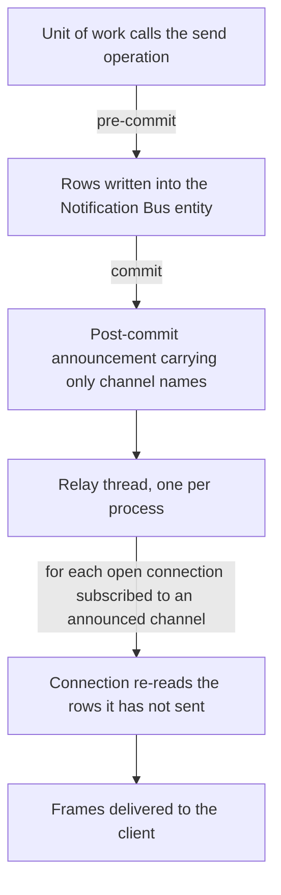

# The notification bus

The notification bus delivers short messages from the server to connected clients without the client polling for them. It is used for conversation messages, presence changes, record updates that a client is watching, forced page reloads, and any other event a capability package chooses to push. This document specifies the bus entity and its retention, the channel naming, the message shape, the send protocol with its pre-commit aggregation and its post-commit announcement, the inter-process relay, the persistent bidirectional transport with its handshake, framing, timeouts, rate limit and close codes, the subscription protocol, the dispatch algorithm with its out-of-order compensation window, the polling fallback, presence tracking, and the delivery guarantees a replacement must provide.

## 1. Model



Three properties follow from this shape and must be preserved:

1. **A message is a row, not an event.** Rows survive the announcement; a client that reconnects re-reads them by key.
2. **The announcement carries only channel names**, never payloads, therefore it stays small and can be split.
3. **Nothing is sent before the commit.** A message produced by a transaction that later aborts is never delivered, because the rows are gone and the announcement never happens.

## 2. The Notification Bus entity

| Identifier | Full name | Type | Required | Meaning |
|---|---|---|---|---|
| `channel` | Channel | text | no | The serialized channel the message is addressed to (section 3). |
| `message` | Message | text | no | The serialized message (section 4). |
| `create_date` | Creation instant | date and time, indexed | yes | Insertion instant. Used by the first-poll window and by retention. |

The entity has no other field and no business behaviour. Rows are written with privileged rights.

**Retention.** A cleanup deletes every row whose creation instant is older than the retention parameter, read as an integer number of seconds from the system parameter `bus.gc_retention_seconds` (bus collection retention in seconds), whose default is 86 400 seconds (24 hours). The deletion is a single direct statement rather than a record-level deletion, because the table can hold millions of rows and has no references pointing at it.

## 3. Channels

### 3.1 The three shapes

A channel is one of the following.

| Shape | Written as | Example meaning |
|---|---|---|
| A plain name | a text value | The name `broadcast`, addressed to every connected client. |
| A record | the pair of an entity transport name and a record key | The contact record of a user: that user's private channel. |
| A record with a sub-channel | the triple of an entity transport name, a record key and a sub-channel name | A contact record with the sub-channel for presence. |

### 3.2 Database qualification

Before use, a channel is qualified with the database name, producing:

| Shape | Qualified form |
|---|---|
| plain name | the pair of the database name and the channel name |
| record | the triple of the database name, the entity transport name and the record key |
| record with sub-channel | the quadruple of the database name, the entity transport name, the record key and the sub-channel name |

The qualified form is what is stored in the row and what the relay matches on. Qualification is what makes one relay process serve several databases without cross-talk.

The stored form is the compact serialization of the qualified tuple, with no spaces between members. Two spellings that differ only in spacing would not match, which is why the serialization is fixed.

### 3.3 Which channels a client is subscribed to

The client sends a list of plain names. The server computes the effective list as follows.

1. Start from the names the client sent.
2. Add the broadcast channel.
3. Add one record channel per access group the acting user belongs to, directly or by implication.
4. If the session names a user, add the contact record of that user.

Capability packages extend this computation. The messaging package, for example, removes every presence channel the client asked for, checks whether the acting user may observe each requested person, either because a scoped access token was presented for that person's presence or because the acting user may read the person's record, and adds back only the permitted ones as record-with-sub-channel entries. The acting user's own record is always permitted.

The client therefore cannot subscribe to an arbitrary channel: everything it asks for is filtered, and everything privileged is added by the server.

### 3.4 Sending to a record channel safely

The recommended send operation takes a record set and a message, and for each record walks up to its *channel owner*: a record may declare that messages addressed to it belong to another record, as a conversation member's messages belong to the conversation. The walk repeats until a record declares itself its own owner, and the result must be a single record; a record whose owner resolves to nothing is skipped.

This indirection is what keeps channel names unguessable: a client cannot subscribe to a record channel it has no access to, because the effective list of section 3.3 never contains it.

## 4. Messages

A message row's payload is the serialization of a two-member object: a notification type, which is a short name telling the client which handler to run, and a free-form body, which is any structured value. Neither is interpreted by the bus.

What a client receives, per notification, is a two-member object: the row key, and the deserialized message described above. The member carrying the row key is the client's cursor: the client remembers the largest key it has seen and sends it back on every subscription.

### 4.1 The shipped notification types

The type is not interpreted by the bus, but the platform and its capability packages ship a fixed set, and a client that handles them reproduces the observable behaviour of the desktop and portal clients. Each row below names the type exactly, because the client dispatches on the string.

| Type | Body | Effect on the client |
|---|---|---|
| `bus.bus/im_status_updated` | the person's identity, the new status and the derived indicator | Updates the presence indicator shown next to that person. |
| `simple_notification` | a title, a message, a kind and a sticky flag | Shows a transient notification. |
| `bundle_changed` | the bundle name and its new content fingerprint | Tells the client that a served asset bundle changed; the client offers or performs a reload. |
| `reload` | nothing | Forces the client to reload the page. |
| `mail.record/insert` | a batch of records in the client's store format | Inserts or updates records in the client store; the general-purpose carrier of record changes. |
| `mail.message/inbox` | one message in store format | Adds a message to the recipient's inbox. |
| `mail.message/delete` | the message keys | Removes messages from the client store. |
| `mail.message/mark_as_read` | the message keys and the new unread counter | Marks messages read. |
| `mail.message/toggle_star` | the message keys and the new starred state | Toggles the starred marker. |
| `mail.activity/updated` | a flag saying whether an activity was created or deleted | Refreshes the activity counters. |
| `discuss.channel/new_message` | the conversation key and the message in store format | Appends a message to an open conversation. |
| `discuss.channel/joined` | the conversation in store format and the membership | Adds a conversation to the client's list. |
| `discuss.channel/delete` | the conversation keys | Removes a conversation from the client's list. |
| `discuss.channel/transient_message` | the conversation key and a body | Shows a message that is never stored. |
| `discuss.channel.member/fetched` | the membership key and the last fetched message key | Moves the "seen up to" marker of a participant. |
| `discuss.channel.rtc.session/peer_notification` | the sender session key, the target session keys and an opaque payload | Relays real-time conversation signalling between participants. |
| `discuss.channel.rtc.session/update_and_broadcast` | the session in store format | Updates a real-time conversation participant's state. |
| `discuss.channel.rtc.session/ended` | the session key | Ends a real-time conversation participant's stream. |
| `discuss.channel.rtc.session/sfu_hot_swap` | the new relay address and credential | Moves the participant to another media relay without dropping the call. |
| `ir.attachment/delete` | the attachment keys and, when relevant, the message they belonged to | Removes an attachment from the client store. |
| `res.users/connection` | the connecting user's identity and their contact record | Tells a follower that a user has come online for the first time. |
| `res.users.settings` | the changed settings of the acting user | Applies a settings change made on another device. |
| `res.users.settings.volumes` | the per-person volume settings | Applies the sound settings of a real-time conversation. |
| `calendar.alarm` | the list of due reminders | Raises calendar reminders. |
| `account_notification` | a title, a message and an optional action | Reports the outcome of a long-running accounting operation. |
| `iap_notification` | a title, a message and a kind | Reports the outcome of a call to a metered external service. |
| `peppol_auth_channel` | the registration state | Reports progress of a document-exchange registration. |
| `im_livechat.history_command` | the requested history operation | Asks the visitor's client to send or clear its conversation history. |
| `im_livechat.looking_for_help/update` | the waiting conversation in store format | Updates the queue of visitors waiting for an operator. |
| `im_livechat.looking_for_help/tags` | the tag set of the waiting queue | Updates the filters available on that queue. |

A capability package may add its own type. The rule a replacement must follow is that the type is a stable string and the body is self-describing, because a client that does not know a type ignores the notification silently rather than failing.

## 5. Sending

### 5.1 The two queues

Sending a notification does **not** write a row immediately. It appends to two per-transaction queues.

| Queue | Content appended | When it runs |
|---|---|---|
| Pre-commit | one pending row: the serialized channel and the serialized message | during the flush, before the commit |
| Post-commit | the qualified channel, added to an ordered set | immediately after the commit |

The pre-commit callback creates every pending row in one operation. The post-commit callback emits the announcement. Deferring the row creation to the pre-commit queue means a transaction that sends one hundred notifications performs one insertion operation, not one hundred.

### 5.2 The announcement

1. Take the ordered set of qualified channels accumulated on the post-commit queue.
2. Split it into payloads (section 5.3).
3. If more than one payload was produced, log `The imbus notification payload was too large, it's been split into <n> payloads.`, in which the placeholder is the number of payloads.
4. Open a **separate** connection to the database server's maintenance database.
5. Emit one notification on the single relay channel, whose reproduced name is `imbus`, per payload. The name of the notify operation itself is a deployment setting, which lets a deployment interpose its own function; the default is the database server's own notify function.

The announcement uses a separate connection deliberately: it must not be part of the transaction that just committed, and it must reach every process regardless of which database they serve.

### 5.3 Splitting

Splitting a set of channels into payloads proceeds as follows.

1. If the set is empty, produce no payload.
2. Serialize the set into one payload.
3. If the set has exactly one element, or the payload's size in bytes is below the limit, produce that payload and stop.
4. Otherwise divide the set at the midpoint, rounding the midpoint up, and apply the same procedure to the first half and then to the second half, concatenating the results.

```formula
midpoint = ceiling of ( number of channels ÷ 2 )
```

The limit is 8 000 bytes by default and is a deployment setting; a setting that is not an integer logs `<setting> has to be an integer, defaulting to 8000 bytes` and uses the default. The recursion terminates because a single channel is always emitted whole, even when it exceeds the limit; a channel name longer than the limit is therefore a configuration error that the database server will reject.

**Worked example.** Seven channels serialize to 9 400 bytes. The midpoint is the ceiling of 7 divided by 2, that is 4. The first four channels serialize to 5 300 bytes, which is below the limit, and become one payload. The last three serialize to 4 100 bytes and become a second payload. Two payloads are emitted, and the split is logged.

## 6. The transport

### 6.1 The relay thread

Exactly one relay thread exists per process. It is started lazily on the first subscription and runs as a background thread that does not hold the process open.

1. Open a connection to the maintenance database and subscribe to the relay channel.
2. Repeat until the process is stopping: wait up to 50 seconds for the connection to become readable; if it became readable, drain every pending notification, deserializing each payload into channels, collect the set of connections subscribed to any of those channels, and enqueue a dispatch command for each such connection.

A failure inside the loop is logged with its traceback as `Bus.loop error, sleep and retry`, followed by a 50-second pause and a restart of the loop. A failure caused by the process shutting down is swallowed.

The relay holds a map from qualified channel to the set of connections subscribed to it. Subscribing replaces a connection's previous set; the channels it no longer wants are removed from the map, and a channel with no remaining connection is dropped entirely.

### 6.2 The handshake

The connection is established with an upgrade request. The required headers are: the connection header, the host header, the key header, the version header, the upgrade header and the origin header. Validation runs in this order.

| Check | Failure |
|---|---|
| Every required header present and non-empty | bad request, `Empty or missing header(s): <names>` |
| The upgrade header names the persistent transport, compared without regard to letter case | bad request, `Invalid upgrade header` |
| The connection header contains the upgrade token, compared without regard to letter case | bad request, `Invalid connection header` |
| The version header is the supported version, whose value is `13` | upgrade-required, with a header naming the supported versions |
| The key decodes as base-64 | bad request, `Sec-WebSocket-Key should be b64 encoded` |
| The decoded key is exactly 16 bytes | bad request, `Sec-WebSocket-Key should be of length 16 once decoded` |

On success the response has the protocol-switch status and carries the acceptance value, computed as the base-64 encoding of the 160-bit secure hash digest of the client key concatenated with the fixed protocol constant that the transport standard defines.

The session is force-marked dirty on the upgrade response, because the connection will later authenticate from the stored session and that session must exist.

The transport is refused while the deployment is running its automated test suite, with the service-unavailable status and the message `Websocket is disabled in test mode`, because the test harness shares one cursor between the test and the connection.

**Client version.** The client announces the version of its background worker. When the connection comes from a browser and the announced version differs from the server's current one, the connection is closed at once with the normal close code and the reason `OUTDATED_VERSION`. A normal close does not trigger the client's exponential reconnection backoff, and the reason tells the worker not to reconnect; this retires stale workers after a change of the served code without a reconnection storm. Clients that are not browsers do not announce a version and are exempt.

**Downgrade for cross-origin connections.** When the deployment enables the same-site downgrade and the origin of the request does not match the host and scheme of the request, a warning naming the host, the origin and the scheme is logged and a brand-new anonymous session is created for the connection, carrying only the database. The connection therefore proceeds as an unauthenticated one instead of borrowing the visitor's credentials.

### 6.3 Framing, limits and timeouts

| Parameter | Value | Effect |
|---|---|---|
| Maximum message size | 1 048 576 bytes (1 mebibyte), whether in one frame or reassembled from fragments | Exceeding it closes the connection with the too-large close code. |
| Rate limit burst | 10 frames by default | The connection keeps the arrival instants of its last *burst* frames. |
| Rate limit delay | 0.2 seconds by default | When the buffer is full and the span between the oldest retained instant and now is shorter than the burst multiplied by the delay, the connection is closed with the try-later close code. With the defaults that is more than 10 frames in 2 seconds. |
| Keep-alive | 3 600 seconds by default, **plus a random amount up to half of it** per connection | When the age of the connection passes its own keep-alive value, the connection is closed with the keep-alive close code. The randomization prevents every connection of a deployment from expiring at the same instant. |
| Inactivity before a heartbeat | 40 seconds | After that much silence in both directions, a heartbeat frame is sent. The selector blocks for at most 15 seconds, therefore the worst-case silence is 55 seconds, which is below the one minute after which intermediaries typically drop an idle connection. |
| Response timeout | 15 seconds | A heartbeat or a close frame that receives no answer within that time ends the connection. |

```formula
rate limit window in seconds = rate limit burst × rate limit delay = 10 × 0.2 seconds = 2 seconds
worst-case silence in seconds = inactivity before a heartbeat + selector block = 40 seconds + 15 seconds = 55 seconds
```

Receiving any frame resets the inactivity timer and clears the pending-response marker for that frame's answer. Sending a heartbeat or a close frame starts a 15-second response timer.

An internal sentinel frame is used to detect idle connections and is discarded without being handled.

### 6.4 Close codes

| Code | Name | Emitted when |
|---|---|---|
| 1000 | normal | Deliberate close, including the outdated-worker close. |
| 1001 | going away | The server is stopping; every open connection is closed with this code. |
| 1002 | protocol error | A malformed frame or an invalid close code. |
| 1003 | unacceptable data | Data the endpoint cannot accept. |
| 1006 | abnormal | The connection was lost without a close frame. Never sent, only observed. |
| 1007 | inconsistent data | Text that is not valid in the declared encoding. |
| 1008 | policy violation | A message violating a policy. |
| 1009 | message too big | The size limit of section 6.3. |
| 1010 | extension negotiation failed | A required extension was refused. |
| 1011 | server error | Any unhandled failure while serving. |
| 1012 | restart | The server is restarting. |
| 1013 | try later | No database connection could be obtained, or the rate limit was exceeded. |
| 1014 | bad gateway | A failure reported by a server further along the path. |
| 4001 | session expired | The session is gone, its successor is gone, or its binding token no longer matches. |
| 4002 | keep-alive timeout | The per-connection keep-alive of section 6.3. |
| 4003 | terminate now | An immediate, unconditional termination. |

Codes 1006 and 4003 skip the orderly close exchange.

### 6.5 Obtaining a database connection

Every operation that needs a transaction on this transport uses a bounded acquisition.

1. Set the delay to 0.15 seconds.
2. Repeat at most ten times: yield to the other connections; attempt to open a cursor and, on success, use it and stop; otherwise wait the delay plus a random amount of up to 0.3 seconds, then multiply the delay by 1.5.
3. If ten attempts failed, fail with `Failed to acquire cursor after 10 retries`.
4. Whatever the outcome, yield again, which lets a waiting connection pick up the freed connection.

A failure to acquire closes the connection with the try-later close code. This is what keeps a burst of reconnections from exhausting the connection pool and taking down ordinary request serving.

```formula
delay before attempt n in seconds = 0.15 × 1.5 raised to the power ( n − 1 ) , plus a random amount from 0 to 0.3 seconds
```

## 7. The subscription protocol

A client sends messages carrying an event name and a data value. The name is mandatory; a missing name or an unparseable body ends the message with an invalid-request failure.

Serving one message proceeds as follows.

1. Resolve the session from the store by the connection's identifier. If the stored session declares a successor, follow the chain and retry. If nothing is stored, raise a session-expired failure.
2. Acquire the registry for the connection's database and run its signalling check. A failure here is an invalid-database failure.
3. Acquire a cursor (section 6.5) and build an execution context whose acting user is the session's user and whose context is the session context with the language cleared and then set to the resolved language code.
4. Inside the retry wrapper of [`transactions-and-concurrency.md`](transactions-and-concurrency.md), section 8: authenticate; if the event is the subscription event, subscribe; then hand the event to the extension point.

**Authentication on this transport.** If the session names a user, verify the binding token of [`sessions-and-authentication.md`](sessions-and-authentication.md), section 6, and on failure log the session out while keeping the database and raise a session-expired failure. If the session names no user, make the shared public user the acting user.

**Subscribing** takes the channel list and the client's last seen key.

1. Every element of the channel list must be text; otherwise fail with `only string channels are allowed on the notification bus.`.
2. Set the last seen key to 0 when the client's value is greater than the largest existing row key, otherwise to the client's value.
3. Compute the effective channel list of section 3.3.
4. Register the connection with the relay for those channels and that last value.
5. Run the post-subscription extension point.

Resetting the cursor to 0 when the client's value is ahead of the table protects against a client that kept its cursor across a database restore.

Failures while serving a message: a session-expired failure closes the connection with the session-expired code; a failure to obtain a connection closes it with the try-later code; anything else is logged with its traceback as `Exception occurred during websocket request handling` and the connection stays open.

The request object is released as soon as the message has been served, which lets the registry be collected while the connection idles.

## 8. Dispatching notifications

### 8.1 The problem

Row keys are assigned when a row is created, but rows become visible when the transaction commits. Two concurrent transactions can therefore commit in the opposite order to their key assignment: a row with key 100 may become visible before a row with key 98. A connection that simply advanced a "last key seen" cursor would skip row 98 forever.

### 8.2 The compensation

Each connection keeps two pieces of state.

| State | Meaning |
|---|---|
| Last sent key | Every row at or below this key has been sent **and** is old enough that no lower key can still appear. |
| History | A list of pairs of a key and a send instant, sorted by key, for rows already sent whose key is above the last sent key. |

The retention of the history is 10 seconds. A transaction that creates a notification row and commits more than 10 seconds later may lose that notification for any client that received another notification in the meantime; the rule for a body that holds a long transaction is therefore to create its notifications as late as possible.

### 8.3 The algorithm

1. Re-read the stored session by identifier; follow the successor chain if one is present; if nothing is stored, raise a session-expired failure.
2. Clear the pending-dispatch marker.
3. Acquire a cursor and rebuild the execution context from the session.
4. If the session names a user and its binding token no longer matches, raise a session-expired failure.
5. Poll (section 8.4) with the connection's channels, the last sent key, and the keys present in the history as exclusions.
6. If there are no notifications, stop.
7. For each notification, insert the pair of its key and the current instant into the history, keeping the history sorted by key.
8. Scan the history from its lowest key upwards and find the highest index whose send instant is older than 10 seconds and for which every lower entry is also older than 10 seconds. If such an index exists, set the last sent key to the key at that index and keep only the entries after it.
9. Send the notifications to the client.

Step 8 is deliberately conservative: an entry may only be dropped from the history once **every** lower entry has also aged out. Otherwise the next poll, which excludes only the keys still in the history, would re-fetch an already-sent row.

**Worked example.** The retention is 10 seconds. The state is: last sent key 2; history holding key 3 sent 8 seconds ago, key 6 sent 10 seconds ago and key 7 sent 7 seconds ago.

- Key 3 is 8 seconds old, which is not older than 10 seconds, therefore the scan stops at the first entry and nothing is dropped.
- Had the scan dropped key 6 alone, the next poll would be "keys above 2, excluding 3 and 7", which would return row 6 a second time.
- Two seconds later, key 3 is 10 seconds old and key 6 is 12 seconds old: the scan drops both, the last sent key becomes 6, and the history retains key 7, now 9 seconds old.

### 8.4 The poll

A poll takes a channel list, a last key and a set of excluded keys, and returns every matching row as a pair of its key and its deserialized message. The condition is built as follows.

1. If the last key is 0, the condition selects rows whose creation instant is later than the current instant minus 50 seconds. Otherwise it selects rows whose key is greater than the last key.
2. If the exclusion set is not empty, the condition additionally excludes rows whose key is in that set.
3. The condition additionally restricts rows to those whose channel is among the serialized qualified channels.

The first poll of a connection, that is the one with cursor 0, deliberately returns the **last 50 seconds** of traffic rather than nothing: a client that has just connected receives what it missed during the handshake.

## 9. The polling fallback

A client that cannot hold a persistent connection polls an endpoint instead. The endpoint takes the same channel list and last key and returns the same shape.

1. If the client declares this is its first poll, mark the session as a polling session.
2. Otherwise, if the session carries no such mark, fail with a session-expired error.
3. Build the effective channel list exactly as for a subscription.
4. Run the post-subscription extension point.
5. Return the qualified channels together with the result of the poll of section 8.4.

The marker is how an expired session is detected on this transport: a session that was replaced loses the marker, therefore the next poll fails and the client knows to re-authenticate.

A companion endpoint answers whether a given row key still exists; a client uses it after a disconnection to find out whether it missed notifications that have since been deleted by retention.

Both endpoints and the upgrade endpoint are excluded from the automatic session rotation of [`request-lifecycle.md`](request-lifecycle.md), section 13.1, because clients call them from background workers at high frequency.

A health endpoint answers a fixed success document with caching disabled and requires no database.

## 10. Presence

### 10.1 The presence entity

One record per user or per guest. It is deliberately a separate entity rather than a set of fields on the user, because presence is written very frequently and would otherwise make every user row a contention point.

| Identifier | Full name | Type | Required | Default | Meaning |
|---|---|---|---|---|---|
| `user_id` | User | link to one User, deletion cascading | no | none | The person, when they are a user. |
| `guest_id` | Guest | link to one Guest, deletion cascading | no | none | The person, when they are an anonymous guest. |
| `last_poll` | Last poll instant | date and time | no | the current instant | The instant of the last presence signal. |
| `last_presence` | Last activity instant | date and time | no | the current instant | The instant the person was last active, computed as the current instant minus the reported idle duration. |
| `status` | Presence status | selection: `online`, `away`, `offline` | no | `offline` | The derived indicator. |

Constraints: exactly one of the two links must be set, with the message `A mail presence must have a user or a guest.`; a partial uniqueness index on each link; no audit columns.

### 10.2 The update

Updating presence for a person, given a reported idle duration in milliseconds defaulting to zero, writes three values: the last poll instant becomes the current instant; the last activity instant becomes the current instant minus the idle duration; and the status becomes `away` when the idle duration is greater than 1 800 000 milliseconds, otherwise `online`. If the person has a presence record, those values are written to it; otherwise one is created with them.

The threshold for `away` is therefore 1 800 seconds (30 minutes) of idleness.

The whole update is wrapped: a serialization failure is swallowed and rolled back rather than retried, because a lost presence update is harmless. Serialization warnings from that statement are suppressed. On success the update commits immediately, because the transport closes the cursor right after.

### 10.3 Notification of a change

Creating a presence record, or writing one in a way that changes the status, sends a notification whose type names a presence status update on the presence sub-channel of the person's record, carrying the new status, the derived indicator and the identity of the person. Deleting a presence record sends the same notification with the status `offline`.

### 10.4 Retention

A cleanup deletes every presence record whose last poll is older than 43 200 seconds (12 hours).

### 10.5 Presence and the inactivity lock

The same idle duration that drives presence drives the session inactivity stamp of [`sessions-and-authentication.md`](sessions-and-authentication.md), section 9.5. A closing connection forces the idle state, which is how closing the last browser tab starts the inactivity countdown.

## 11. Delivery guarantees

| Property | Guarantee |
|---|---|
| Durability | A notification is a committed row. It survives a process restart for as long as the retention window. |
| Atomicity with the business change | Exact. The rows and the business change are in one transaction; an abort removes both. |
| At-least-once within the retention window | Yes, for a client that reconnects with its last key and whose missed rows are still within retention. |
| At-most-once | Yes for one connection, through the last-key cursor and the history window; **not** across a client that loses its cursor, which then re-reads the last 50 seconds. |
| Ordering within one channel | Not guaranteed across transactions, because keys are assigned before commit. Guaranteed within one transaction, because the rows are created in one operation in send order. |
| Loss window | A notification created more than 10 seconds before its transaction commits may be lost for a client that received a later notification in the meantime. |
| Loss after retention | A client disconnected for longer than the retention window loses everything older than it; the companion endpoint lets it detect that and resynchronize by reloading its state. |

A replacement may strengthen these guarantees but must not weaken them, and must preserve the "nothing before commit" rule.

## 12. Acceptance criteria

1. **Given** a transaction that sends three notifications, **when** it commits, **then** exactly three rows exist, they were created by a single operation, and exactly one announcement was emitted naming the affected channels.
2. **Given** a transaction that sends a notification and then fails, **when** it is rolled back, **then** no row exists and no announcement is emitted.
3. **Given** an announcement whose serialized channel list exceeds 8 000 bytes, **when** it is emitted, **then** it is split recursively in halves until each part fits, and the split is logged.
4. **Given** a client that asks to subscribe to a channel it is not entitled to, **when** the subscription is served, **then** that channel is not in the effective list and the client receives nothing from it.
5. **Given** a client that asks to subscribe with a channel that is not text, **when** the subscription is served, **then** it fails with `only string channels are allowed on the notification bus.`.
6. **Given** a client whose last key is greater than the largest existing row key, **when** it subscribes, **then** the cursor is reset to 0 and the client receives the last 50 seconds of traffic for its channels.
7. **Given** a fresh connection with cursor 0, **when** it subscribes, **then** it receives every row of its channels created in the last 50 seconds and nothing older.
8. **Given** a connection whose history contains keys 3, 6 and 7 with ages 8, 10 and 7 seconds, **when** a dispatch occurs, **then** nothing is dropped from the history and the next poll excludes all three keys.
9. **Given** the same connection two seconds later, **when** a dispatch occurs, **then** keys 3 and 6 are dropped, the last sent key becomes 6, and the history retains key 7.
10. **Given** a connection whose session has been soft-rotated, **when** a dispatch occurs, **then** the successor session is followed and the dispatch proceeds.
11. **Given** a connection whose session has been deleted, **when** a dispatch occurs, **then** the connection is closed with the session-expired code.
12. **Given** a connection whose user's password has changed, **when** a dispatch occurs, **then** the binding-token check fails and the connection is closed with the session-expired code.
13. **Given** a connection that sends 11 frames within 2 seconds with the default rate limit, **when** the eleventh arrives, **then** the connection is closed with the try-later code.
14. **Given** a message of 1 048 577 bytes, **when** it is received, **then** the connection is closed with the too-large code.
15. **Given** a connection idle for 40 seconds, **when** the timer elapses, **then** a heartbeat frame is sent; **when** no answer arrives within 15 seconds, **then** the connection is closed.
16. **Given** a connection whose age exceeds its own randomized keep-alive value, **when** the check runs, **then** it is closed with the keep-alive code.
17. **Given** an upgrade request whose version header is not the supported version, **when** it is validated, **then** the response is upgrade-required and names the supported versions.
18. **Given** an upgrade request whose key does not decode to 16 bytes, **when** it is validated, **then** the response is a bad request with the message `Sec-WebSocket-Key should be of length 16 once decoded`.
19. **Given** a browser client announcing an outdated worker version, **when** the connection opens, **then** it is closed immediately with the normal code and the reason `OUTDATED_VERSION`.
20. **Given** no free database connection, **when** a dispatch is attempted, **then** the acquisition is retried up to ten times with growing randomized delays, and the connection is closed with the try-later code if all fail.
21. **Given** a client using the polling fallback without having declared a first poll, **when** it polls, **then** the call fails with a session-expired error.
22. **Given** a presence signal reporting 2 000 000 milliseconds of idleness, **when** it is processed, **then** the status becomes `away` and a presence notification is sent on the person's presence sub-channel.
23. **Given** a presence update that hits a serialization failure, **when** it is processed, **then** the failure is swallowed, the transaction is rolled back, and the connection continues.
24. **Given** a presence record not polled for more than 43 200 seconds, **when** the automatic cleanup runs, **then** it is deleted and an offline notification is sent.
25. **Given** a notification row older than the retention parameter, **when** the automatic cleanup runs, **then** it is deleted by a direct statement.
26. **Given** a cross-origin upgrade request and a deployment with the same-site downgrade enabled, **when** the connection opens, **then** a brand-new anonymous session carrying only the database is used and the visitor's credentials are not borrowed.
27. **Given** a presence record with neither a user nor a guest, **when** it is saved, **then** the save is refused with `A mail presence must have a user or a guest.`.

## 13. Reconciliation notes

1. The model diagram was drawn with text characters. It is redrawn as a Mermaid flow diagram, which carries the same three properties and renders in the reading interface.
2. The announcement, the splitting, the relay loop, the connection acquisition, the subscription, the dispatch and the presence update were written as code-shaped sketches. They are restated as numbered procedures, with the arithmetic of the split, the rate-limit window, the heartbeat silence and the acquisition backoff moved into formula blocks. Every constant is unchanged.
3. The close code 1014 was described as an upstream failure. It is described by behaviour instead: a failure reported by a server further along the path. The code and its meaning are unchanged.
